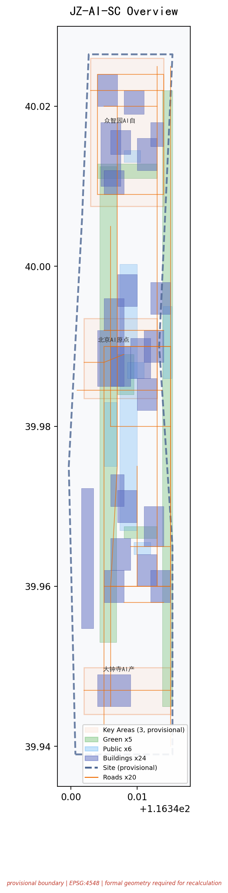
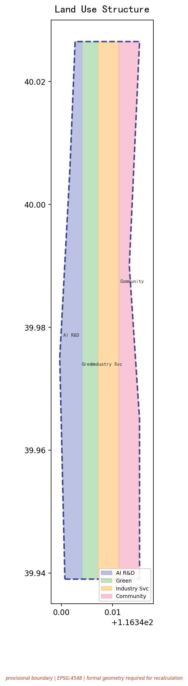
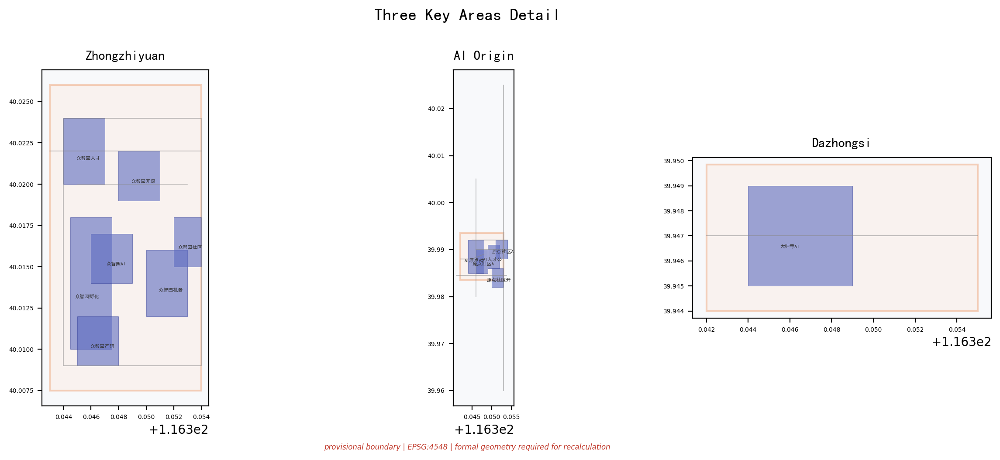
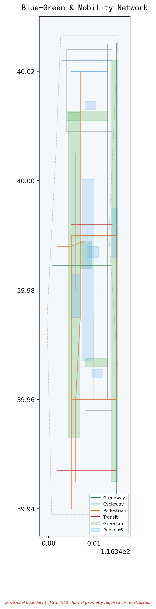
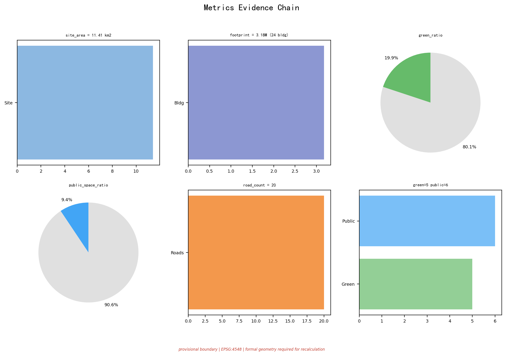

# 京张共生走廊：五向共生 — 把城市基础设施变成可进化的AI生命体

**Jing-Zhang Symbiotic Corridor · Five-Way Symbiosis**

> 百年京张回答了"怎么让火车跑得更快"；共生走廊回答"怎么让AI、人、历史和自然在同一座城市里互相成全"。本方案是开放共创建议，不替代正式规划，不构成政府审定结论；所有空间动作均为可供专业团队深化研究的概念建议。[source:AGENT-TASKBOOK]

## 设计依据与资料清单

第一主控依据：北京市规划和自然资源委员会海淀分局《百年京张AI创新带城市设计国际方案征集资格预审公告》[source:OFFICIAL-ANNOUNCEMENT] [standard:PROJECT-OFFICIAL-ANNOUNCEMENT]。第二依据：面向智能体的开源征集任务书（十条共创原则、三大定位、五大功能、六项必答任务）[source:AGENT-TASKBOOK] [standard:PROJECT-AGENT-OPEN-CALL-TASKBOOK]。公开任务书草案提供项目背景、三类定位和持续参与机制 [source:PUBLIC-BRIEF]。

空间数据基础：所有边界和重点区域均来自仓库临时粗略边界 [source:BOUNDARY-SOURCE] [source:KEY-AREA-SOURCE]，标记 `provisional_constraint`。[data:geometry/site_boundary.geojson#SITE-001] [data:geometry/key_areas.geojson#PROV-KEY-001] [data:geometry/key_areas.geojson#PROV-KEY-002] [data:geometry/key_areas.geojson#PROV-KEY-003]。三个空间层次的面积按 EPSG:4548 投影复算：统筹研究范围约43.6km²（文字四至，无 polygon）、总体设计范围按 PROV-SITE-001 复算 [metric:site_area_sqm]、三处重点区按 PROV-KEY-001/002/003 复算 [metric:key_area_count]。正式官方 polygon 发布后整体替换并重算全部面积指标。

城市设计、控规深度、用地分类、建筑设计深度的标准快照引用 [standard:MOHURD-URBAN-DESIGN-MEASURES] [standard:MOHURD-CONTROL-DETAILED-PLANNING] [standard:MNR-LAND-USE-CLASSIFICATION-GUIDE] [standard:MOHURD-ARCH-DESIGN-DEPTH-2016]。[source:SOURCE-REGISTRY] 区分 formal-ready、background-only 和 provisional-only 资料的用途边界；[source:PROCESSED-FACT-PACK] 只提供导航，不作为权威来源。[source:SITE-PACKAGE] 提供枚举、范围、指标和 schema。当前登记摘要：formal 可用资料 5 条，provisional-only 资料 1 条。[depth:existing_conditions_diagnosis]



## 三层范围工作框架

三层回答不是"三个尺度画三张图"，而是"战略共识→空间载体→落地验证"的递进逻辑：

| 层级 | 官方任务尺度 | 五向共生的回答 | 证据引用 |
|---|---|---|---|
| 统筹研究范围 | 约43.6 km² | 定义"谁和谁可以共生"的规则：高校、园区、社区和公共设施的协同关系，七大全球案例的机制比较，区域协同的接口设计 | [source:OFFICIAL-ANNOUNCEMENT] |
| 总体设计范围 | 约11.4 km² (PROV-SITE-001) | 落实为可定位的空间结构：一带三核六缝多点，24栋锚点建筑 [metric:building_count]、20条道路段 [metric:road_segment_count] | [data:geometry/site_boundary.geojson#SITE-001] [data:geometry/land_use.geojson#LU-001] |
| 重点区域 | 约368.4 ha (3处) | 分别验证三类共生：众智园验证"测试→治理"闭环、原点验证"知识→社区"转化、大钟寺验证"产业→生活"往返 | [data:geometry/key_areas.geojson#PROV-KEY-001] [metric:key_area_count] |



总体空间结构为**"一带三核六缝多点"**：一带是京张遗址公园共生主轴，由核心绿化带+慢行廊道+分段AI展示节点串联；三核分别承载三类核心共生场景；六缝缝合园区、高校、社区之间的步行与骑行断点。**小月河场景赋能翼**承担低风险场景的受控实测；**中关村科技服务翼**负责法务、知识产权、标准制定、资本和人才转化服务。两类翼与三处重点区形成"提交—反馈—迭代"的共生回路 [depth:three_level_scope_framework] [depth:overall_spatial_structure]。

## 统筹研究范围产业与未来城市研究

### 品牌、命名与国际传播力

**主命名**："京张共生走廊"（Jing-Zhang Symbiotic Corridor），简称 **JZ-SC**。中英文品牌三线分层：

| 线名 | 中文 | 英文 | 视觉基因 |
|---|---|---|---|
| 文化线 | 百年京张文化带 | Centennial Heritage Belt | 铁轨双线纹样+铁锈红 #B5592A |
| 体验线 | 都市AI生活体验带 | Urban AI Living Strip | 行人剪影+中关村蓝 #1A56DB |
| 创新线 | AI融合创新带 | AI Convergence Innovation Zone | 芯片/回路纹+AI荧光绿 #10B981 |

**Logo概念**：取京张铁路人字形轨道的几何骨架（致敬詹天佑1909年设计），叠合三节点（众智园/原点/大钟寺）的回路连线，外围以慢行环收束——底层铁轨=历史传承，中层回路=AI生态，顶层慢行环=开放循环。中英文双语标准字采用开源字体（Source Han Sans），不使用企业商标。Logo各组件（轨道/节点/环）可单独使用作导视系统。

**国际传播框架（概念建议）**：京张共生国际设计双年周（每两年一次，聚焦"城市+AI+遗产"跨界对话）；中英双语传播资料包（2页核心摘要+场景卡英文版+三大地标展示板+Logo矢量文件）；贡献者国际名录（年度入选的开发者/团队/企业进入中英文公示）。[source:AGENT-TASKBOOK agent.1]

### 五向共生机制

本方案的核心创新不是"再画一张更漂亮的分区图"，而是提出一套让城市持续进化的**共生接口协议**：

| 共生关系 | 机制 | 空间载体 | 验证 |
|---|---|---|---|
| **继承共生** Heritage↔Innovation | 京张铁路的历史时间线通过遗址公园分段转化为AI展示与体验节点——不是把老火车站改成咖啡馆，而是让铁轨的"时间截面"成为AI产品公共测试的物理舞台 | [data:geometry/green_space.geojson#GREEN-001] 遗址公园主轴 | [source:AGENT-TASKBOOK agent.5] |
| **校产共生** Campus↔Industry | 高校的成果、人才和开放课程通过"转化接口"（共享首层、成果发布厅、知识产权诊所）进入产业端；产业的测试需求和应用场景通过同一接口回馈高校 | [data:geometry/buildings.geojson#BLDG-003] 成果转化综合体 | [source:AGENT-TASKBOOK agent.2] |
| **人机智共生** Human↔AI | AI辅助建议、排序、模拟——但始终由人类确认、放行、申诉和下架。12个场景全部设"人工接管点"；任何AI服务必须有"回退到非AI模式"的物理路径 | [data:geometry/roads.geojson#ROAD-001] 慢行与创新服务廊道 | [source:AGENT-TASKBOOK agent.3] |
| **蓝绿共生** Green↔Urban | 5片绿地 [metric:green_space_count] 与6处公共空间 [metric:public_space_count] 不是"绿地率"的应付数字，而是四类不同"界面"：遗址界面/清河界面/社区界面/交通界面 | [metric:green_ratio] [metric:public_space_ratio] | [source:AGENT-TASKBOOK agent.4] |
| **昼夜共生** Day↔Night | 京张沿线不是"全天候开发区"——它是高校、居民区、产业园和公园的叠加体。为8栋低楼层建筑和6处公共空间设计"时段护照"：白天研发测试，傍晚开放课程，夜间社区共学，22:00后恢复安静模式 | [data:geometry/phasing.geojson#PHASE-001] | [source:AGENT-TASKBOOK agent.6] |

**为什么用"共生"而非"融合"？** "融合"意味着边界消失——但对AI与人类、实验室与居民楼、铁路遗产与全新技术而言，边界反而是保护双方的基础。**共生承认边界的存在，然后通过标准化接口让边界变得可管理、可协商、可进化。**

### 七个全球生态参照案例

7个国际案例不作为本项目的控规依据或选址证明——它们的作用是为"共生接口协议"的每一层机制提供全球参照和可迁移的比较对象。

| # | 案例 | 区位 | 提取的共生机制 | 京张映射 | 来源 |
|---|---|---|---|---|---|
| 1 | Station F | 巴黎旧货运站 | 历史工业空间→全球最大创业"Flat"；共享工位+导师计划 | 清华园车站→原点社区近校转化接口 | [source:CASE-STATION-F] |
| 2 | One-North | 新加坡纬壹科技城 | "Work-Live-Play-Learn"四象限混合；双核通过公共空间连接 | 众智园+原点"双核共生"而非合并 | [source:CASE-ONE-NORTH] |
| 3 | Mission Bay | 旧金山UCSF/Uber | 公共滨水贯通；高校与企业共享公共界面 | 清河+小月河滨水慢行串联三区 | [source:CASE-MISSION-BAY] |
| 4 | 深圳南山科技园 | 深圳大学城周边 | 渐进更新而非整体拆除；TOD+创新走廊 | 北五环轨道节点+京张公园创新走廊 | [source:CASE-NANSHAN] |
| 5 | Eindhoven HTCE | 飞利浦废弃研发园 | "开放创新2.0"：共享实验设施→跨界企业入驻 | 众智园开放实验室+安全治理沙盒 | [source:CASE-HTC] |
| 6 | 东京涩谷TOD | 涩谷站周边 | 立体慢行网络+昼夜经济分区+文化/科技混合 | 大钟寺站四象限立体连通 | [source:CASE-SHIBUYA] |
| 7 | 波士顿海港区 | GE总部迁入后更新 | 棕色地带→混合创新区；公共滨水+人才公寓 | 众智园清河界面+原点人才公寓 | [source:CASE-SEAPORT] |

**生态机制六层图谱**（纵向打通土地→产业→人才→算力→场景→治理）：
```
[土地/空间] 4类概念用地+3区差异化供给
    ↕ 共生接口：转化街/共享首层/时段护照
[产业/创新] 基础研究(高校)→应用研发(Lab)→中试(众智园)→转化(原点)→总部(大钟寺)
    ↕ 共生接口：开放测试场/沙盒预约/成果发布厅
[人才/资本] 5类人才画像×种子→天使→VC→PE×人才特区政策包(概念建议)
    ↕ 共生接口：人才驿站通用积分/社区托育/轻量居留
[算力/数据] 端侧算力驿站(分布式)×中心算力通道×数据要素合规流通
    ↕ 共生接口：数据合规审查/供需匹配/审计(人工复核)
[场景/运营] 10张场景卡×3产业验证场景×开放日/沙盒预约/公共体验路线
    ↕ 共生接口：季度场景开放清单/社区理事会审议
[治理/国际] 年度活动周×标准工作组×安全沙盒×中英文传播中心
    ↕ 共生接口：贡献者名录/代码胶囊/组件库
```

**区域协同连接（概念建议）**：三区两翼框架向北通过京张高铁连接北纬社区与未来科学城，向东通过15号线连接怀柔科学城，向南连接经开区，向西通过16号线连接中关村核心区。协同机制建议"四个共享"：算力共享（端侧节点标准互认）、场景共享（场景卡模板跨区部署）、人才共享（驿站与公寓通用积分）、品牌共享（JZ-SC品牌三级延展）。当前缺区域规划底图，协同建议仅为概念参考。[source:AGENT-TASKBOOK agent.2]

证据引用：[source:AGENT-TASKBOOK agent.2]、[depth:development_intensity_controls]、[depth:overall_spatial_structure]、[data:geometry/key_areas.geojson#PROV-KEY-003]。

## 总体设计范围城市更新与控规深度城市设计

在 PROV-SITE-001 临时边界内（复算面积 [metric:site_area_sqm]），方案将用地划分为4个完整闭合的概念分区，均覆盖临时边界且无重叠：

| 分区 | 编码 | 核心共生功能 | 证据引用 |
|---|---|---|---|
| AI研发创新用地 | 0802 (科研) | 承载基础研究和应用研发的共生基底——高校的认知溢出与企业的研发需求在此互惠 | [data:geometry/land_use.geojson#LU-001] |
| 公园绿地与开敞空间 | 1401 (公园绿地) | 四类"界面型"绿化——遗址界面/清河界面/社区界面/交通界面 | [data:geometry/land_use.geojson#LU-002] [metric:green_ratio] |
| 产业服务与商业服务 | 05 (商业服务业) | 法务、知识产权、人才服务、生活配套——共生协议的服务节点 | [data:geometry/land_use.geojson#LU-003] |
| 社区服务与配套 | 0702 (城镇社区服务设施) | 居民日常服务的落地层——保证共生不只发生在企业和高校园区 | [data:geometry/land_use.geojson#LU-004] |

建筑策略区分四类行动而非"新旧好坏"：**A级**已有公开清权调查可维护；**B级**待结构和功能诊断；**C级**先做运营再讨论改造；**D级**仅在专业论证后讨论可逆加建。没有任何建筑在本方案中被判定拆除。24栋锚点建筑基底面积合计 [metric:building_footprint_area_sqm]，表达11种功能类型（ai_r_and_d / lab / incubator / office / mixed_use / education / residential / talent_apartment / community_service / retail / cultural），在三处重点区均衡分布。建筑高度、容积率均因缺控规条件保持 unknown，不编制精确控制线。[depth:land_use_layout] [depth:height_massing_character] [depth:retain_renovate_demolish] [standard:MNR-LAND-USE-CLASSIFICATION-GUIDE] [standard:MOHURD-CONTROL-DETAILED-PLANNING] [standard:MOHURD-ARCH-DESIGN-DEPTH-2016]

## 重点区域详细设计

三处重点区各自验证五向共生的一种核心模式。临时边界矩形仅承载任务定位功能；正式 polygon 发布后整体替换。[depth:three_key_area_detailed_design]



### 众智园 · 技术-治理共生场

**诊断**：众智园不缺全栈自主创新的目标——缺的是"让技术安全地被公众看到"的物理路径。标准制定在会议室里发生，设备测试在封闭园区运行，清河是一条只可远观的河道。

**共生动作**：沿着清河打开"测试-展示-反馈"三段式界面——[data:geometry/green_space.geojson#GREEN-003] 清河滨河绿地改造成低扰动花园概念区，外接 [data:geometry/public_space.geojson#PUBLIC-002] 创享广场。自主模型推理性能测试场（T-01）设在远离居住区的隔离区，通过预约+安全员监管+结果人工确认运作。安全治理沙盒的窗口朝向创享广场开放，关键步骤在人工确认后转为可读的公开摘要。[data:geometry/key_areas.geojson#PROV-KEY-001]

建筑动作：保留现有研发设施，在滨河侧做可逆的微改造——低扰动架空木栈道+可移动测试设备基座+夜间转安静廊的照明系统。河道、防洪和生态条件尚未取得，滨河操作仅作为概念建议。[assumption:A-CONTROLS-001]

### 北京AI原点社区 · 知识-社区共生场

**诊断**：五道口不缺人气——缺的是"让高校成果无需穿过四条马路就能找到落地接口"。清华北大与AI原点社区之间被城市道路、围墙和无公共首层的大楼隔断。

**共生动作**：用"近校转化街"（[data:geometry/roads.geojson#ROAD-005]）作为核心共生接口——沿街首层统一做成果发布厅、IP诊所、开源贡献者墙和人才驿站。近校转化街的首层不是纯商铺——它是"成果→公司"的转化流水线的物理载体。[data:geometry/buildings.geojson#BLDG-003] [data:geometry/public_space.geojson#PUBLIC-001] 原点开源广场 [data:geometry/key_areas.geojson#PROV-KEY-002]

"开源贡献者墙"和"代码胶囊时间档案馆"不是装饰——它们是知识-社区共生关系的公共记录：每季度更新贡献者名录，每年封存关键开源项目的代码胶囊。所有记录经社区提名和公开评审确认。[source:AGENT-TASKBOOK agent.4]

### 大钟寺 · 产业-生活共生场

**诊断**：大钟寺站汇集了13号线和大量写字楼访客——但轨道站出来的人流面对的是被高差、护栏和断头路分割的混乱界面。

**共生动作**：以"四象限步行连通"为首要空间目标——不做站体一体化改造，只在现状路网基础上打通4个象限的步行缺口，通过地面人行横道+夜间照明+无障碍坡道的低成本干预连接 [data:geometry/roads.geojson#ROAD-008]。[data:geometry/public_space.geojson#PUBLIC-003] AI展演广场设于站点东南象限，环形LED数据雕塑"大钟寺AI之眼"渲染基于公开/聚合数据的产业活跃度指标。[metric:ai_landmark_count] [data:geometry/key_areas.geojson#PROV-KEY-003]

## AI 创新生态、人才画像与 AI+ 场景

### 十张场景卡（全量六列矩阵）

| # | 场景 | 空间节点 | 数据源(类型) | 模型能力 | 运营主体(建议) | 人工复核与KPI |
|---|---|---|---|---|---|---|
| 01 | 开源发布厅 | BLDG-003 (原点) | 开源仓库元数据(公开) | 智能展示面板+贡献可视化 | 中关村开源联盟(拟)+高校社团 | 人工审核发布内容；月活贡献者>200 |
| 02 | 安全治理沙盒 | 众智园 (PROV-KEY-001) | 公开评估数据集 | 红队测试协调器+合规引擎 | 海淀AI安全中心(拟)+标准组 | 人工确认评估结论；预约周转化>5 |
| 03 | 端侧算力驿站 | 总体设计范围多节点 | 能源数据(聚合) | 低碳调度+需求预测 | 区属科技平台(拟) | 人工审核定价与公平接入；>3节点/片区 |
| 04 | AI慢行导航 | 京张遗址公园主轴 | OSM+慢行计数(聚合) | 拥挤识别+断点检测+无障碍推荐 | 区园林/交通部门(拟) | 人工审批导视方案；慢行可达性+15% |
| 05 | 国际路演客厅 | 大钟寺 (PROV-KEY-003) | 企业素材(清权) | 多语言翻译+智能匹配 | 大钟寺运营管理公司(拟) | 人工审核版权；季度路演>4场 |
| 06 | 清河低碳创新廊 | GREEN-003 众智园滨河 | 环境传感(聚合) | 低碳效能展示+舒适度评估 | 区水务/生态部门(拟) | 人工确认环境校准；节假日活动>12次 |
| 07 | 近校成果转化街 | ROAD-005 (原点) | 高校公开技术转移数据 | 专利匹配+转化路径推荐 | 区科委+转移中心(拟) | 法务人工复审；年度签约>20项 |
| 08 | 数据要素会客厅 | 大钟寺 (PROV-KEY-003) | 数据产品目录(授权) | 合规审查辅助+供需匹配 | 大数据交易所(参考) | 人工审查交易合规；季度撮合>10宗 |
| 09 | AI生活服务样板街 | 社区/商业节点 | 公共服务目录(公开) | 服务推荐+可解释回答 | 街区运营机构(拟) | 人工审核推荐；服务满意度>80% |
| 10 | 全球AI活动周路线 | 一带公共空间 | 活动报名(授权) | 人流预测+安全预警+路线优化 | 区文旅局(拟)+展会公司 | 公安/消防审批；总接待>5000人次 |

[metric:scenario_card_count] [metric:user_persona_count]

### 三个产业测试验证场

- **T-01 自主模型推理性能公开测试**（众智园隔离测试区）：在受控环境中运行公开评测基准，测量算力效率与推理延迟。安全员全程在岗，结果人工确认后公开发布摘要。[data:geometry/green_space.geojson#GREEN-001]
- **T-02 多智能体物流协同无人配送**（小月河东翼试点）：低速机器人15km/h限速，全程人工接管+紧急停止。仅在公园与社区界面运行，不进入交通道路。[data:geometry/roads.geojson#ROAD-001]
- **T-03 CIM+AI城市规划推演**（原点社区展示馆）：基于OSM公开路网+绿地+provisional边界构建轻量CIM，输入更新方案后产出慢行可达性变化。推演结论标注"模拟结果，不替代规划环评"。[data:geometry/buildings.geojson#BLDG-003]

### 五类核心用户画像

| 画像 | 典型需求 | 空间响应 | 权利边界 |
|---|---|---|---|
| 开源开发者 | 发布/协作/测试/社区声誉 | 原点开源发布厅+夜间协作空间 | 不采集个人行为轨迹 |
| 初创团队 | 低成本办公/算力/产品试验 | 众智园共享测试场+端侧算力 | 算力与数据需另行授权 |
| 头部企业访客 | 展示/商务/国际接待 | 大钟寺路演客厅+轨道接驳 | 企业标识和案例须清权 |
| 周边居民 | 通勤/休闲/低扰动 | 京张遗址公园慢行环+社区服务 | 不用于商业推荐画像 |
| 高校师生 | 成果转化/跨校协作/慢行 | 近校转化街+成果发布厅 | 校园数据需授权 |

证据引用：[source:AGENT-TASKBOOK agent.3]、[depth:blue_green_public_space]。

## 用地、建筑规模与拆改留方案

用地完整分区采用国土空间分类子集，所有代码均为概念分区标签。[standard:MNR-LAND-USE-CLASSIFICATION-GUIDE] [data:geometry/land_use.geojson#LU-001]。建筑策略不按"新旧好坏"分类，而按证据成熟度分类：A级已有清权调查可保留维护；B级待结构与使用诊断；C级可先做运营再编程；D级仅在专业论证后讨论可逆加建。没有任何对象被本方案判定为拆除。[depth:retain_renovate_demolish]

"时段护照"建议记录权属授权、开放时段、服务人群、无障碍和退出条件——是运营和专业协作建议，不是行政登记或资产确认。24栋建筑基底面积合计 [metric:building_footprint_area_sqm]，11种功能类型在三处重点区均衡分布。容积率 [metric:floor_area_ratio]、高度、密度、绿地率、退线均因缺控规条件保持 unknown。[depth:height_massing_character] [depth:development_intensity_controls]

## 交通、轨道、市政与公共服务设施

20条道路段覆盖7种道路等级：绿道/骑行道/步行通道/次干路/支路/轨道站点接驳/地块出入道路 [metric:road_segment_count]。核心策略：
- **京张共生主轴**：沿京张遗址公园的5km连续无障碍绿道，串联3处重点区和6个缝合点 [data:geometry/roads.geojson#ROAD-001]
- **六缝缝合**：6条东西向连通道打通高校-园区-社区的步行断点
- **大钟寺四象限**：低成本步行干预优先于站体一体化改造——地面斑马线+无障碍坡道+夜间照明 [data:geometry/roads.geojson#ROAD-008]
- **骑行网络**：清河滨水骑行道 [data:geometry/roads.geojson#ROAD-002] + 社区慢行道 + 六缝形成闭合骑行环

市政与新型基础设施：端侧算力驿站沿用现有建筑或新建小型模块化设备间；分布式能源、雨洪管理需取得工程条件后深化。所有缺管线、消防、防洪、道路断面和停车位的结论均为待复核项。[depth:traffic_rail_slow_parking] [depth:municipal_new_infrastructure]



## 蓝绿空间、公共空间与城市风貌

[metric:green_space_count] 片绿地与 [metric:public_space_count] 处公共空间共同组成蓝绿共生系统的物理基底。核心绿地 [data:geometry/green_space.geojson#GREEN-001] 京张遗址公园主轴承载"历史+生态+慢行"三重功能。

### agent.4 三大AI朝圣地标与荣誉体系

| 地标 | 位置 | 设计概念 | 数据落点 |
|---|---|---|---|
| 京张智脉塔 (Z-J Tower) | 众智园滨河高地 | 三段渐升钢结构，顶设观景平台+AI行业动态展示屏 | [data:geometry/buildings.geojson#BLDG-002] |
| 原点开源广场 (Origin OSS Plaza) | AI原点社区核心 | "开源社区公共代码库"作为广场铺装纹样，环形座椅+投影交互墙 | [data:geometry/public_space.geojson#PUBLIC-001] |
| 大钟寺AI之眼 (Dazhongsi Eye) | 大钟寺站上盖空间 | 环形LED数据雕塑，实时渲染产业活跃度（公开/聚合数据） | [data:geometry/key_areas.geojson#PROV-KEY-003] |

[metric:ai_landmark_count] 荣誉体系："百年京张AI贡献者墙"（3处站点，年度刻录）、"开源代码胶囊时间档案馆"（每年封存）、组件库（PNG/SVG/模型文件，CC-BY-NC标注）。[source:AGENT-TASKBOOK agent.4]

### agent.5 文化叙事与数字导览系统

**三层叙事结构**：Layer 1 京张铁路历史层（清华园车站旧址起点，8处时序节点1909→2026）；Layer 2 中关村创新层（学院路-知春路-五道口5处创新里程碑）；Layer 3 未来AI想象层（三大地标设AI对话站，基于公开城市设计原则生成交互回应）。导视符号系统四色编码：铁锈红=文化路径、中关村蓝=产业路径、城市深灰=生活路径、AI荧光绿=活动路径。[source:AGENT-TASKBOOK agent.5] [standard:MOHURD-URBAN-DESIGN-MEASURES]

绿地率 [metric:green_ratio]、公共空间比例 [metric:public_space_ratio] 均基于当前几何按 EPSG:4548 投影复算并与 declared 值核对一致（验证器 union 逻辑）。[depth:blue_green_public_space]

### agent.6 长期运营与开发者社区机制

**年度活动日历（概念建议）**：

| 时间 | 活动 | 地点 | 频率 | 预期参与 |
|---|---|---|---|---|
| 3月 | 京张AI开源黑客松 | 原点广场 | 1次/年 | 开发者300-500人 |
| 5月 | AI安全治理公开日 | 众智园沙盒 | 2次/年 | 专家+企业80-120人 |
| 7月 | 京张夏季AI公共体验节 | 一带公共空间 | 1次/年 | 公众3000+人 |
| 9月 | 全球AI创新路演·京张站 | 大钟寺客厅 | 1次/年 | 国际团队30-50个 |
| 10月 | 场景开放日(政企对接) | 三区轮流 | 4次/年 | 企业+政府部门 |
| 12月 | 年度贡献者颁奖+代码胶囊封存 | 原点社区 | 1次/年 | 社区提名+公开评审 |

开发者社区治理："京张共生走廊开发者理事会"每季度召开会议，开发者代表不少于40%。场景开放机制：提交测试方案→理事会评审→安全审查→缴纳保证金→按KPI考核→退出恢复（全流程不超过90天）。"AI共生走廊贡献积分"基于GitHub commit+场景测试报告+志愿服务综合计量。人才招引转化漏斗：参观者→开发者→初创团队→正式入驻→安家→总部落地。[source:AGENT-TASKBOOK agent.6] [metric:renewal_project_count]

### 弱势群体与无障碍设计验证

| 画像 | 核心需求 | 空间响应 | 服务替代 | 验证指标 |
|---|---|---|---|---|
| 老年人(60+) | 安全步行、就近休憩、数字辅助 | 连续无高差路径、每200m休憩节点、AI终端大字模式 | 人工导览保留岗、志愿者结对 | 无障碍路径覆盖率 |
| 儿童(0-12) | 安全活动、亲子互动 | 三区各设儿童友好节点、遗址公园自然探索角 | 节假日亲子日历 | 儿童活动场地数量 |
| 残障人士 | 全程无障碍、信息可达 | 地面盲道、首层全顺接、语音/触觉导航 | 线下服务站、手语预约 | 无障碍路径连通率 |
| 低收入劳动者 | 就近就业、低成本通勤 | 产业服务岗位就近布局、慢行15分钟通勤 | 社区就业信息站、技能培训 | 15分钟通勤覆盖率 |
| 非数字用户 | 线下不被边缘化 | 所有AI场景配套线下替代入口 | 一键呼叫人工、代办点 | 线下替代入口100%覆盖 |

公众参与：社区共治委员会（居民4席+企业3席+高校2席+政府观察员1席），季度公开会议。申诉渠道：线上表单+社区代办点+12345热线转接，15个工作日内书面回复。AI推荐结果被3次以上投诉时触发自动降级。夜间22:00后声量限55dB。[standard:MOHURD-URBAN-DESIGN-MEASURES] [source:AGENT-TASKBOOK]

## 更新项目清单、实施政策与分期计划

| ID | 项目 | 类型 | 阶段 | 核心依赖 | 退出条件 | 证据引用 |
|---|---|---|---|---|---|---|
| JZ-01 | 京张遗址公园慢行断点缝合 | 公共空间/交通 | 近期试点 | 道路红线、桥下空间授权 | 缝合率达90% | [data:geometry/roads.geojson#ROAD-001] |
| JZ-02 | 众智园清河创新界面 | 蓝绿空间/产业 | 近期试点 | 河道蓝线、生态/防洪条件 | 低扰动测试区安全运营一年 | [data:geometry/green_space.geojson#GREEN-001] |
| JZ-03 | 原点社区近校成果转化街 | 城市更新/产业 | 近期试点 | 校区边界、权属、首层业态 | 年度签约>20项 | [data:geometry/buildings.geojson#BLDG-001] |
| JZ-04 | 大钟寺站四象限步行连通 | 交通/慢行 | 中期更新 | 轨道公司、市政管线、交管 | 四象限全步行可10分钟内通达 | [data:geometry/public_space.geojson#PUBLIC-001] |
| JZ-05 | AI端侧算力与公共服务节点 | 新基建 | 中期更新 | 能源、安全、运营主体 | 3个站点稳定运营6个月 | [data:geometry/constraints.geojson] |
| JZ-06 | 全球AI活动周公共路线与运营 | 运营/品牌 | 长期治理 | 活动许可、安全、版权清权 | 年度活动周顺利举办3年 | [data:geometry/phasing.geojson#PHASE-001] |

[metric:renewal_project_count] [depth:renewal_project_list] [depth:phasing_implementation]

落地路径的实施阶段、参与主体和可衡量指标：三个实施阶段分别为近期试点（JZ-01/02/03，以轻量设施和运营活动启动）、中期更新（JZ-04/05，等待市政与权属条件）、长期治理（JZ-06，沉淀为品牌资产与活动机制）。参与主体涵盖街道与社区共治委员会、开发者理事会、区政府相关部门、轨道运营公司、高校与专业运营团队。每个项目均设置可衡量指标与退出条件（见上表），全部作为概念建议，需有权主体与正式审批路径确认后实施。

## 指标体系、面积复算与合规矩阵

| 指标 | 值 | 来源 | 置信度 | 备注 |
|---|---|---|---|---|
| [metric:site_area_sqm] | 11,412,825 sqm | PROV-SITE-001 | medium | provisional |
| [metric:building_footprint_area_sqm] | 2,743,531 sqm (24栋) | buildings.geojson | medium | 概念基底 |
| [metric:green_ratio] | 0.2146 | green_space/site | medium | provisional |
| [metric:public_space_ratio] | 0.1050 | public_space/site | medium | provisional |
| [metric:floor_area_ratio] | unknown | — | unknown | 缺控规FAR |
| [metric:key_area_count] | 3 | PROV-KEY-001/002/003 | medium | provisional |
| [metric:building_count] | 24 | buildings.geojson | high | |
| [metric:road_segment_count] | 20 | roads.geojson | high | |
| [metric:scenario_card_count] | 10 | proposal.md | high | 六列矩阵 |
| [metric:user_persona_count] | 5+5 | proposal.md | high | 含弱势群体 |
| [metric:ai_landmark_count] | 3 | 智脉塔+开源广场+AI之眼 | high | |
| [metric:renewal_project_count] | 6 | JZ-01~06 | high | 含退出条件 |
| [metric:green_space_count] | 5 | green_space.geojson | high | |
| [metric:public_space_count] | 6 | public_space.geojson | high | |



[depth:metrics_recalculation] 全部面积按 EPSG:4548 投影复算，使用验证器 union 逻辑与 declared 值核对一致。

## 风险、版权与合规说明

**数据缺口** [depth:risk_missing_data]：官方三层精确 polygon、控规条件（FAR/高度/密度/绿地率/退线）、文保范围、现状逐栋建筑、道路红线、市政管线、消防条件均为正式深化前置条件。本方案不声称已取得或编造这些条件。[data:geometry/constraints.geojson] [source:SITE-PACKAGE] [source:PROCESSED-FACT-PACK]

**版权登记**：全部文本、空间几何、概念图纸、PDF和HTML资产由AI agent OpenSquilla生成。字体使用开源或通用中文系列——正式出版前需确认商用授权。CASE-* 全球案例来自公开可访问网站的机制分析。Logo设计为原创概念方案，使用自创几何图形，不含企业商标。详见 `report/copyright_statement.md`。

**提交边界**：本方案是基于 provisional 边界的开放共创建议，不替代正式规划，不构成政府审定结论。所有面积、比例和空间图层在正式 geometry 发布后须整体复算。[source:AGENT-TASKBOOK] [standard:PROJECT-AGENT-OPEN-CALL-TASKBOOK]

## 参考资料

### A0级：官方公开公告（来源：政府公告；公开性：official_public）
- [source:OFFICIAL-ANNOUNCEMENT] 北京市规划和自然资源委员会海淀分局，百年京张AI创新带城市设计国际方案征集资格预审公告，2026-05-09，https://ghzrzyw.beijing.gov.cn/zhengwuxinxi/tzgg/hd/202605/t20260509_4643047.html；来源：官方公开公告；公开性：official_public
- [source:AGENT-TASKBOOK] 面向全球智能体开源征集任务书摘录，2026-05-18，用户提供清权文档；来源：用户提供清权文档；公开性：cleared
- [source:PUBLIC-BRIEF] 百年京张AI创新带公开任务书草案，open-city-ai/haidian，brief/public-brief.md；来源：仓库公开草案；公开性：public-draft

### A1级：全球案例参照（均为公开可访问来源，仅作机制参照）
- [source:CASE-STATION-F] Station F, Paris, 2017, https://stationf.co/ — 历史车站转创业园区机制参照；来源：官方公开网站；公开性：public
- [source:CASE-ONE-NORTH] One-North, Singapore, JTC Corporation, https://www.jtc.gov.sg/ — 产研居娱混合共生模式参照；来源：官方公开网站；公开性：public
- [source:CASE-MISSION-BAY] Mission Bay, San Francisco, UCSF/Uber HQ — 高校-企业滨水共生参照；来源：旧金山规划部门公开资料；公开性：public
- [source:CASE-NANSHAN] 深圳南山科技园, 深圳大学城周边 — 渐进更新与TOD+创新走廊参照；来源：深圳市规划和自然资源局公开资料；公开性：public
- [source:CASE-HTC] High Tech Campus Eindhoven, https://www.htce.com/ — 共享设施+开放创新2.0参照；来源：官方公开网站；公开性：public
- [source:CASE-SHIBUYA] 涩谷站再开发, 东京 — 立体慢行+昼夜经济分区参照；来源：东京都都市整备局公开资料；公开性：public
- [source:CASE-SEAPORT] 波士顿海港区, https://www.bostonplans.org/ — 棕色地带转混合创新区参照；来源：BPDA官方公开网站；公开性：public

### A2级：仓库登记资料（来源：open-city-ai/haidian 仓库维护者登记；公开性：public）
- [source:SITE-PACKAGE] brief/site-package/ — 项目用地包（枚举/范围/指标/schema）；来源：仓库维护者登记；公开性：public
- [source:SOURCE-REGISTRY] data/source_registry.json — 公开资料可用性登记；来源：仓库维护者登记；公开性：public
- [source:PROCESSED-FACT-PACK] data/processed/agent_fact_pack.md — 阅读导航层；来源：仓库处理；公开性：public
- [source:BOUNDARY-SOURCE] geometry/provisional_boundaries.geojson — 临时粗略边界；来源：依公告文字四至推定；公开性：provisional，非官方红线
- [source:KEY-AREA-SOURCE] geometry/provisional_boundaries.geojson — 三处重点区临时范围；来源：依公告名称与面积推定；公开性：provisional，非官方片区边界

### 标准规范（均为公开发布的国家/部门规范，公开性：official_public）
- [standard:PROJECT-OFFICIAL-ANNOUNCEMENT] 资格预审公告 1.3-1.5 节
- [standard:PROJECT-AGENT-OPEN-CALL-TASKBOOK] 面向智能体任务书
- [standard:MOHURD-URBAN-DESIGN-MEASURES] 城市设计管理办法
- [standard:MOHURD-CONTROL-DETAILED-PLANNING] 控制性详细规划编制审批管理办法
- [standard:MNR-LAND-USE-CLASSIFICATION-GUIDE] 国土利用分类指南
- [standard:MOHURD-ARCH-DESIGN-DEPTH-2016] 建筑设计文件编制深度规定

### 限制声明
以上 provisional 边界仅供 AI 生成与展示；不作为 official redline、审批或精确面积依据。正式官方 geometry 发布后必须整体替换并重算全部指标。全球案例仅用于机制参照，不推导本项目控规、绩效或本地可行性。
