# Jing-Zhang AI Spine: Urban Design Proposal for the Centennial Jing-Zhang AI Innovation Belt

> Jing-Zhang does not lack compute — it lacks a public interface that makes innovation trustable: every figure is recalculable, every AI is stoppable, every project is answerable.

**One-line test standard (anyone can verify it themselves)**: every AI on this belt must answer three questions at once — **recalculable?** (every figure has a source and a formula), **stoppable?** (with the AI off, a staffed counter still completes the same task), **answerable?** (when something goes wrong you can find a name, an appeal and a fallback). If any one of the three cannot be answered, it does not go live. This is the engineering wisdom of the Jing-Zhang Railway's herringbone ("人"-shaped) switchback, translated into the AI era: the switchback exists so the train can calculate the gradient, come to a stop, and have every switchback signed and accountable — the "Spine" of this proposal is not a formal metaphor but this public innovation interface itself; recalculable, stoppable and accountable are the three disciplines it must pass.

## One-Page Executive Summary and Deliverable Index

This section is the one-page entry for review: the left column is the question a reviewer must answer, the middle column is this proposal's answer, and the right column is the deliverable location that can be opened and verified immediately — every row points to a file inside the package, not to the main text's own claim.

| Review question | This proposal's answer | Verifiable deliverable |
| --- | --- | --- |
| What is the core proposition | Jing-Zhang AI Spine: translating the green corridor into a trustable public innovation interface; self-checked by three delivery disciplines — Recalculable, Stoppable, Accountable — with a one-line test standard (recalculable / stoppable / answerable — if any of the three cannot be answered it does not go live) | This section + the indicator-recalculation table + the task-coverage matrix + 13 vector planning sheets (incl. grading hierarchy, subsystem composition and three key-area detail sheets) plus a sheet index |
| How does it respond spatially | One belt, three cores, multiple points; a blue-green slow-mobility composite ring; the three delivery disciplines land on three drawable spatial images: Zhizhiyuan · Recalculable Ledger Plaza, Dazhongsi · Stoppable Service Street, Origin Community · Accountability Corridor | The spatial layers + five analysis figures + the A3 booklet and A0 boards |
| How do AI and governance interlock | Each of the ten scenario cards declares "no-AI equivalent path + stop condition + manual fallback"; aligned with the five-field criteria of the Service Equivalence Baseline SEB v0.2 | Scenario-card section + the task-coverage matrix |
| Where does implementation start | Three stoppable work packages + three phases + six renewal projects (roles / preconditions / outcome indicators / fallback) | Renewal-project-list section + the phasing layer |
| How is public interest protected | Six user personas + vulnerable groups as an independently vetoing gate + the three-question fairness framework | Persona and scenario sections |
| What is the state of evidence | All four self-check gates pass; areas recalculated from provisional geometry; wholesale recalculation after official boundaries arrive | The self-check report + the indicator-recalculation table |
| What is the effective boundary of conclusions | All spatial / scenario / project / indicator content is a conceptual suggestion, not statutory planning, approval or government commitment | Risk and compliance section + the assumptions-and-gap list |

## Design Basis and Source Inventory

This proposal takes the "International Open Call for Urban Design of the Centennial Jing-Zhang AI Innovation Belt" published by the Haidian Branch of the Beijing Municipal Commission of Planning and Natural Resources as its first authority, and the maintainer-registered provisional rough boundaries, key areas, enums, metrics and source lists in the site package as its machine-readable basis. The proposal reads its tasks and scope from the design brief, the allowed-design-space list, the source list, the enum tables, the planning-limit ranges, the data-structure definitions and the public-source registry, and builds its task, scope, source-use and gap ledgers with the project-scope summary, the agent task requirements, the source-use matrix and the missing-data checklist [source:OFFICIAL-ANNOUNCEMENT] [source:AGENT-TASKBOOK] [depth:existing_conditions_diagnosis]. Every design judgment is decomposed into traceable sources, recalculable metrics, verifiable layers and human-reviewable assumptions. The announcement requires the depth of regulatory detailed planning and of a planning implementation scheme, so the narrative text and the GeoJSON, metric tables, A3 booklet, A0 boards and HTML exhibits together constitute the deliverable and do not substitute for one another.

Full source and standard coverage is kept in the structured source list, the professional-standards matrix and the design-depth matrix; the main text places only the most critical evidence beside each judgment and does not repeat machine indices. The usage boundary of the source registry is as follows [source:SOURCE-REGISTRY]: the public-source registry records the usage boundaries of public, cleared and provisional materials; the current registry summary is 7 formal-usable sources, 1 background source and 1 provisional-only source; this proposal does not upgrade background or provisional materials into an official boundary, statutory control, formal scoring basis or government implementation commitment. The site fact pack is a reading-navigation layer, not a new authority [source:PROCESSED-FACT-PACK]; factual judgments return to the registered primary materials [source:OFFICIAL-ANNOUNCEMENT] [source:AGENT-TASKBOOK].

Because the official project-boundary line and the three key detailed-design areas have not yet been supplied, this proposal generates a provisional formal package from the maintainer-registered provisional-boundary layer. The submitted site-boundary layer and key-area layer are marked as provisional constraint, non-official boundary, and are used only for proposal generation, self-check, visualization and design discussion — not as an official redline, approval basis, precise-area basis or statutory control conclusion. This organizer-side data gap does not block content scoring; after the official boundaries replace the provisional ones, the site boundary, key areas, land use, roads, green space, public space, buildings, phasing and all metrics are recalculated as a whole. The scorable status of this proposal is: **provisional boundary, precision caveats retained, to be recalculated when official data is released; this does not block content scoring**. Accordingly, the spatial structure, scenarios, projects and metrics in the main text are written as "discussable, verifiable, and recalculable once the official boundary replaces it"; when the official boundary and key-area polygons are updated, this proposal re-runs the scaffold, self-check and figure/HTML generation rather than replacing a single file.

The boundary reading returns to the overall-scope layer and area recalculation [data:geometry/site_boundary.geojson#SITE-001] [metric:site_area_sqm]; the three key areas are checked by independent layers and a count metric [data:geometry/key_areas.geojson#PROV-KEY-001] [metric:key_area_count].

### Current-State Evidence Ledger: Verified Facts — Remaining Unknowns — Design Consequences

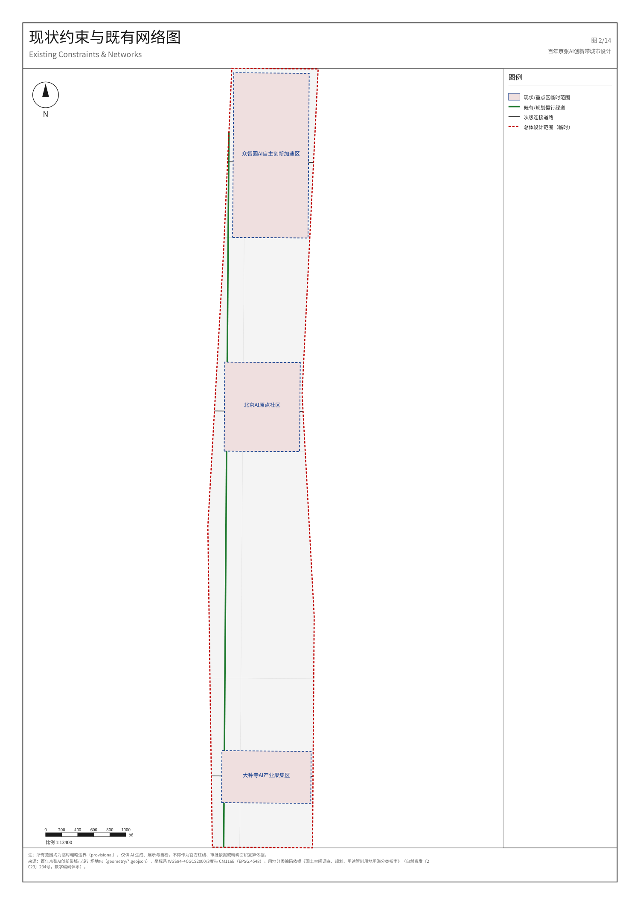

This proposal writes the key gaps as a four-row "evidence ledger", each row separating this round's verifiable facts, what still cannot be proven, and the design consequence; new facts only shrink the unknown, never auto-completing a line, activating a service, or manufacturing precision [depth:existing_conditions_diagnosis]:

| Dimension | Verifiable facts this round | Still cannot prove | Design consequence |
| --- | --- | --- | --- |
| Official boundary | The announcement publishes approximate three-level scopes (strategic 43.6 km², overall 11.4 km², key areas 368.4 ha) and textual four-boundary descriptions [source:OFFICIAL-ANNOUNCEMENT] | Precise boundary polygons, cleared vector or graphic deliverables | Keep provisional geometry; recalculate wholesale after official boundaries arrive, without shifting boundaries to force a fit |
| Buildings / controls | Building footprint area is recalculable from the submitted geometry (~427,900 m², provisional) [metric:building_footprint_area_sqm] | Full existing-building outlines, ownership, structure, retain/renovate/demolish, FAR, height, setbacks | FAR awaits formal data; retain/renovate/demolish gives method, not conclusions [depth:retain_renovate_demolish] |
| Network / ridership | Metro Line 13 peak daily ridership ~1.6 M, network daily average ~9.9 M [source:DATA-RAIL-METRO-RIDERSHIP]; Jing-Zhang HSR cumulative ~57.42 M passenger trips [source:DATA-JINGZHANG-HSR] | Continuous walking/cycling network, per-station timetable, OD, precise slow-mobility breakpoints | Ridership serves only as KPI baseline, not a claim of station-by-station reachability; slow-mobility breakpoints are written "pending verification, not drawn" |
| Industry / operations | Haidian AI core industry ~¥282.2 B, 1,900+ firms, 104 registered large models [source:DATA-HAIDIAN-AI-INDUSTRY]; eight universities and CAS institutes along the corridor [source:DATA-ALONG-UNIVERSITIES] | Specific tenant entries, budgets, operators, service windows, exit mechanisms | Cases and firms serve as mechanism references, not an investment-attraction list or investment commitment |

This ledger simultaneously enforces the three delivery disciplines "Recalculable, Stoppable, Accountable": what is recalculable is written as a number, what is not is written as awaiting formal data; what is verifiable is written as fact, what is not is written "pending verification, not drawn"; what can be held responsible is written with a role, what cannot is written unactivated.

## A Century in Dialogue: From Self-Strengthening in the First Industrial Revolution to Leadership in the Fourth

This roughly nine-kilometre Jing-Zhang green corridor is where two of China's self-strengthening stories — from two industrial revolutions — overlap on the same ground [source:DATA-JINGZHANG-HISTORY].

In 1909, a poor and weakened China was told that "the engineer who could build the Beijing–Zhangjiakou Railway had not yet been born." Zhan Tianyou (Jeme Tien-yow), leading an all-Chinese team, independently designed and built the country's first trunk railway. His herringbone switchback translated the steep 28‰ grade at Qinglongqiao into engineering wisdom a train could climb, stop on, and be held accountable for at every switchback — a self-strengthening project in which China learned from and caught up with the advanced technology of the First Industrial Revolution [source:DATA-JINGZHANG-HISTORY]. The Qinghuayuan Station, opened the same year, lies within today's provisional extent of the Beijing AI Origin Community; in 1949 it became the first stop of the leadership's "journey to the capital for the examination," and after closing in 2016 it rests southwest of Chengfu Road. One small station anchors three identities at once: the 1909 origin of self-strengthening, the 1949 starting point of the "examination," and the 2026 origin of innovation.

One hundred and seventeen years later, on the same ground, China has become one of the leaders in artificial intelligence. With an AI core-industry scale of 350 billion yuan, 130 registered large models and 26 unicorns, Haidian carries a core share of China's role in global intelligent competition [source:DATA-HAIDIAN-AI-INDUSTRY]. The centenary Jing-Zhang AI Innovation Belt is not a fresh start on a blank slate, but the continuation and elevation of this self-strengthening thread into the Fourth Industrial Revolution — translating the herringbone railway's recalculability, stoppability and accountability on a grade into this proposal's three delivery disciplines for AI systems: Recalculable, Stoppable, Accountable.

This is the conception of the proposal: to make the Jing-Zhang AI Spine a public innovation interface that runs "from historical self-strengthening to intelligent leadership." As the flagship detailed-design anchor (see "Key-Area Detailed Design"), the Beijing AI Origin Community overlays the triple memory of Qinghuayuan Station, the engineering wisdom of the herringbone and the contemporary discipline of the Accountability Corridor in a single place — letting a passerby, beside the rail relics, read a nation's two self-strengthenings: the first time, we learned and caught up with the world's advanced technology; this time, we co-define the rules of the intelligent age with the world [source:DATA-JINGZHANG-HISTORY] [depth:overall_spatial_structure].

## Three-Level Scope Working Framework

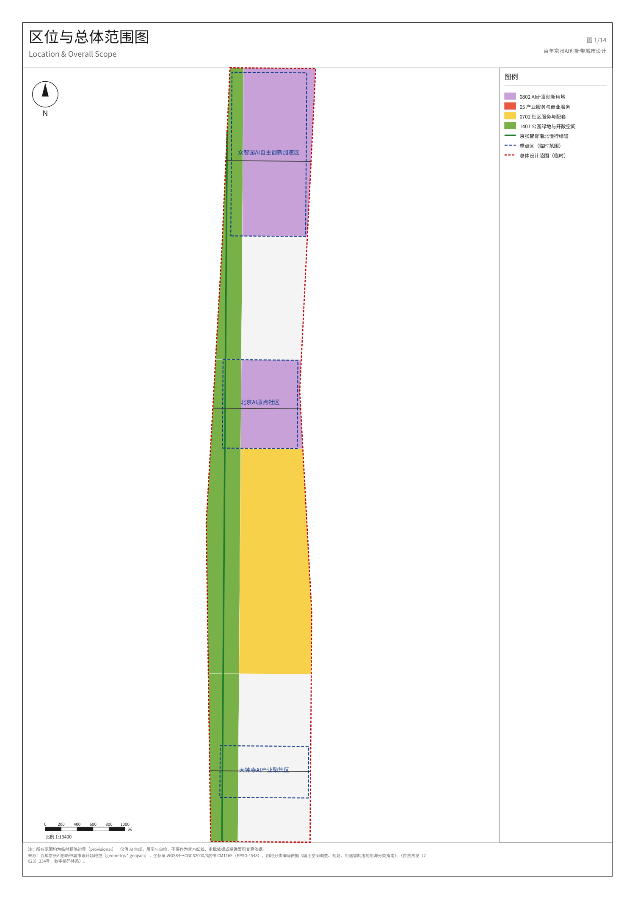

This proposal organizes its work along the three levels defined by the announcement: the strategic research scope covers the 43.6 km² AI industry ecology, strategic positioning, innovation chain and future urban form; the overall design scope covers the 11.4 km² urban area and industrial zones within 1–2 km of the Jing-Zhang Heritage Park, forming an overall urban-renewal framework, industrial spatial layout, transport and municipal support, and urban character control; the key-area scope covers the 368.4 ha of three detailed-design areas, specifying function mix, building scale, retain/renovate/demolish classification, public-space connectivity and transport organization. The three levels are mapped line-by-line in the task-coverage matrix, so that every mandatory task in announcement clauses 1.3, 1.4, 1.5 and agent taskbook items 1–6 has a section, layer, metric, drawing and HTML evidence. The three-level framework's depth is governed by [depth:three_level_scope_framework] and [depth:overall_spatial_structure]; spatial evidence takes [data:geometry/site_boundary.geojson#SITE-001] and [data:geometry/key_areas.geojson#PROV-KEY-001]; task authority takes [standard:PROJECT-OFFICIAL-ANNOUNCEMENT].

The three levels are not a disjointed set of drawings: strategic research determines the industrial chain and urban-form judgment, overall design turns that judgment into renewal projects, spatial structure and facility support, and key-area detailed design verifies the implementability of specific parcels, buildings, transport, public space and AI application scenarios. This proposal first locks the provisional boundary and constraints used for the current submission, then generates land use, buildings, roads, green space, public space, phasing and AI service nodes, and finally recalculates metrics from these layers and explains which conclusions remain limited by the provisional boundary; any area, ratio, scale or project count that cannot be recalculated from structured data is not written as a formal conclusion.

The overall concept of this proposal is "**Jing-Zhang AI Spine**" (京张智脊): translating the Jing-Zhang green corridor that runs through the country's densest cluster of universities and research institutes into a trustable **public innovation interface**. Three delivery disciplines run through this design — **Recalculable — Stoppable — Accountable** — not as a design theme, but as self-check requirements on every design landing point.

- **Recalculable**: every spatial conclusion (area, ratio, layer count, scenario node) is independently recalculable from the spatial layers and the indicator-recalculation table; the main text cites only recalculable metrics and locatable layers, never pseudo-precise numbers that cannot be reproduced from structured data [data:geometry/site_boundary.geojson#SITE-001] [metric:site_area_sqm]. Anyone who walks into this corridor can see the source and formula behind every number.
- **Stoppable**: every AI scenario carries a "no-AI equivalent path" and a stop condition — when any of manual substitution, data boundary, service window or safety floor is unmet, the scenario closes instead of degrading and soldiering on [metric:public_space_ratio] [depth:metrics_recalculation]. Any ordinary person, after the system is switched off, can still complete the same task at a staffed counter.
- **Accountable**: every renewal project has lead/participating roles, preconditions, KPI, manual fallback and a governance interface; where responsibility or budget is missing it is listed unactivated, not written as a landing commitment [depth:renewal_project_list]. Anyone who suffers a loss can find the name, the appeal channel, and the backstop.

The spatial substrate of this "spine" is a **~9 km green corridor running through the country's densest cluster of universities and research institutes**: at the south end Xizhimen adjoins Beijing Jiaotong University, along Xueyuan Road the eight universities and several Chinese Academy of Sciences institutes are distributed in sequence, and at the north end Wudaokou gathers Tsinghua University and Peking University [source:DATA-ALONG-UNIVERSITIES]. The meaning of Jing-Zhang AI Spine is to translate this "stock-density" innovation corridor into a public innovation interface — not to simply expand R&D floor area where factors are dense, but to make verification, openness and accountability a public good at the points of highest encounter; the three disciplines then guarantee that this interface is recalculable, stoppable and accountable.

The three delivery disciplines do not stay at the level of text; they land on three drawable spatial images in the three key areas, turning "recalculable, stoppable, askable" into spaces that can be seen, walked and pointed at: "Zhizhiyuan · Ledger Plaza" (Recalculable Ledger Plaza) makes "Recalculable" visible — rendering computing load, energy use, model testing and standards-governance results into a real-time visible public ledger, so anyone passing by can read how much compute is being consumed, the one-shot pass rate of a model test, and which formula yields each conclusion [data:geometry/key_areas.geojson#PROV-KEY-001] [metric:green_ratio]; "Dazhongsi · Stoppable Service Street" makes "Stoppable" walkable — a street of staffed service counters where each service point declares its no-AI equivalent path, human takeover role, current gate, operating mode and accountable discipline (aligned with the five-field criteria of the Service Equivalence Baseline SEB v0.2, see the scenario cards below), so after the system is switched off, a person can still walk the same task to completion [data:geometry/key_areas.geojson#PROV-KEY-003]; "Origin Community · Accountability Corridor" makes "Accountable" pointable — writing each renewal project's responsible party, appeal interface and backstop path directly on the ground, so anyone who suffers a loss can find the name, the appeal and the backstop by walking the corridor [data:geometry/key_areas.geojson#PROV-KEY-002] [depth:renewal_project_list].

Spatial organization continues with "one belt, three cores, multiple scenarios, blue-green slow-mobility composite ring": the "one belt" is the working method translated from the announcement's three levels, not a newly drawn redline; the "three cores" correspond to the Zhizhiyuan, Beijing AI Origin Community and Dazhongsi key areas; the "multiple scenarios" correspond to operable nodes of AI+ public services, industrial services and urban life; the "composite ring" corresponds to the linkage of slow mobility, green space, public space and activity routes.

| Level | Design question | Proposal's answer | Data anchor |
| --- | --- | --- | --- |
| Strategic research scope | How to organize the AI industry ecology and future urban form | Build an innovation chain of "university incubation — open-source collaboration — enterprise translation — public experience — international communication" | the task-coverage matrix, the professional-standards matrix |
| Overall design scope | How to place industrial space, renewal, transport/municipal and character onto drawings | Land use, buildings, roads, green space, public space and phasing layers jointly express it | [data:geometry/land_use.geojson#LU-001], [data:geometry/roads.geojson#ROAD-001] |
| Key-area scope | How three areas reach detailed-design depth | Each proposes positioning, spatial moves, AI scenarios and implementation dependencies | [data:geometry/key_areas.geojson#PROV-KEY-001], [data:geometry/key_areas.geojson#PROV-KEY-002], [data:geometry/key_areas.geojson#PROV-KEY-003] |

## Strategic Research Scope: Industry and Future-City Study

The core task of the strategic research scope is to build a world-class AI innovation ecosystem. This section inventories Haidian's universities and institutes, leading firms, computing/algorithm/data factors, incubation platforms, listed companies, unicorns and technology services, and proposes a spatial coordination framework for the AI innovation chain, industry chain, talent chain and urban service chain; in response to the agent taskbook's "five functions" and "three areas, two wings" coordination, it forms a naming system, visual identity, overall spatial structure diagram, scenario opening and operating mechanism that can be further deepened. These requirements come from the agent open-call task, not statutory planning control [source:AGENT-TASKBOOK] [standard:PROJECT-AGENT-OPEN-CALL-TASKBOOK] [depth:overall_spatial_structure].

**Industry scale anchors (public data)**: with about 2.6% of Beijing's land, Haidian produces over 1/4 of the city's GDP (over ¥1.3 trillion, ~6.4% average annual growth during the 14th Five-Year Plan), with tech-related industries above 70% of the total; the AI core industry is ~¥282.2 billion (2024, nearly 80% of Beijing), gathering 1,900+ AI firms (about 70% of Beijing) and 104 registered large models (nearly 70% of Beijing), forming a full "chip—framework—model—application" chain [source:DATA-HAIDIAN-AI-INDUSTRY]. These public figures show that the Jing-Zhang innovation belt is not nurturing industry from scratch, but translating "stock density" into the incremental value of "spatial coordination and public experience" on the country's densest AI innovation-factor corridor. This proposal accordingly places spatial supply at the interface of high-frequency factor encounters and outcomes translation, rather than simply expanding R&D floor area.

### Naming System and Visual Identity Direction

The overall concept is "Jing-Zhang AI Spine" (京张智脊), in English **Jing-Zhang AI Spine**. "Jing-Zhang" anchors the historical continuity of the Jing-Zhang Railway and Jing-Zhang Heritage Park, "AI" anchors the theme of the era, and "Spine" translates the Heritage Park's historical and public-space axis into the spatial image of an "urban spine" — an open axis extending north from Xizhimen and threading the three key areas [source:AGENT-TASKBOOK]. The naming does not copy existing cities, parks or corporate names; it names a new concept through a geographic-cultural thread.

The extended naming system follows "one belt, three cores, two wings": the one belt is the Jing-Zhang AI Spine; the three cores are Zhizhiyuan · Full-Stack Autonomy Core, AI Origin · Innovation Incubation Core, and Dazhongsi · AI-Native Core; the two wings are the Zhongguancun Science-Technology Service Wing and the Xiaoyuehe Scenario Empowerment Wing [source:AGENT-TASKBOOK]. This system translates the announcement's three positionings (Centennial Jing-Zhang Cultural Belt, Urban AI Life Experience Belt, AI Convergence Innovation Belt) and five functions into names usable in daily life, mappable and propagatable in activities — not slogan stacking [standard:PROJECT-AGENT-OPEN-CALL-TASKBOOK].

The visual identity (Logo) direction takes the "herringbone" switchback of the Jing-Zhang Railway designed by Zhan Tianyou as its graphic motif, superimposing it with neural-network nodes and the dual image of railway gauge to form a "historical track × intelligent network" symbol; the color system adopts "rail grey + heritage-park vegetation green + computing blue", corresponding to memory, ecology and intelligence. This Logo direction is only a conceptual suggestion/reference; formal application must be deepened by a professional design team with font, trademark and image clearance — this proposal uses no uncleared fonts or marks [source:AGENT-TASKBOOK].

The strategic study, through the urban-character, public-space and building-layout coordination required by [standard:MOHURD-URBAN-DESIGN-MEASURES], returns to [data:geometry/land_use.geojson#LU-001], [data:geometry/public_space.geojson#PUBLIC-001] and [depth:overall_spatial_structure], showing that industrial strategy ultimately lands in a visible, verifiable spatial structure. On future urban form, this proposal places AI transport systems, continuous green space, innovation service facilities and an international living/working atmosphere into locatable functional zones, nodes, corridors and scenarios; industrial strategy indicators, an AI innovation index, talent density, spatial supply types and AI+ vertical application key areas are written into the indicator system, marking which are official, which are design suggestions, and which await formal data calibration. Global AI innovation activities, developer communities, open scenarios or pilgrimage routes are written as "conceptual suggestions / references / to be deepened by professional teams", never as settled government activities or implementation arrangements.

### Global AI Innovation Ecosystem Cases

The agent taskbook requires 5–8 global AI innovation-ecosystem cases to illustrate mechanisms of a "world-class AI innovation ecosystem" worth borrowing — not copying lists or fabricating enterprise, investment or output data [source:AGENT-TASKBOOK] [standard:PROJECT-AGENT-OPEN-CALL-TASKBOOK]. The following six cases come from publicly checkable innovation-district studies, focused on "mechanisms translatable into space and operations":

| Case | Core mechanism | Transferable translation for this proposal |
| --- | --- | --- |
| Silicon Valley Sand Hill Road–Stanford corridor | University incubation, venture capital and a high-density talent network encounter at walking scale | Weave the "university—enterprise—public space" between the three cores into a walkable innovation network, strengthening informal exchange [depth:overall_spatial_structure] |
| Shenzhen Nanshan–Yuehai Street | "Innovation upstairs, manufacturing downstairs" rapid-iteration ecology plus government scenario opening | Place low-cost shared test beds and edge-computing nodes in Zhizhiyuan, opening test/verification scenarios as public goods [depth:land_use_layout] |
| London King's Cross | Knowledge district and urban renewal fused; AI firms settle in historic industrial areas | Compose the Jing-Zhang Heritage Park's industrial-heritage regeneration with industrial space and public space into a "heritage—industry—life" renewal paradigm [depth:blue_green_public_space] |
| Toronto Vector Institute and MaRS district | Talent attraction, enterprise landing and public research form a triangle | Build a "near-campus incubation — talent zone — outcomes release" corridor in the AI Origin Community, filling the outcomes-translation space [depth:three_key_area_detailed_design] |
| Singapore one-north | Government-led "work—live—learn" vertical mixed district, strung by public space | Use the blue-green slow-mobility composite ring to thread the three cores, organizing mixed functions and public-space nodes around stations [depth:traffic_rail_slow_parking] |
| Munich Bavaria AI cluster | Strong manufacturing region plus AI application, opening scenarios to traditional industry | Via the Zhongguancun Science-Technology Service Wing, direct AI scenario opening toward advanced manufacturing, content consumption and urban governance [depth:overall_spatial_structure] |

These cases serve only as mechanism references, not an investment-attraction list, investment commitment or policy conclusion; their landing depends on formal planning, ownership and operating conditions [source:AGENT-TASKBOOK].

### Regional Coordination Mechanism (Three Areas, Two Wings, and the Beijing-Tianjin-Hebei Region)

The taskbook requires responding to regional innovation coordination with the Beiwei Community, Future Science City, Huairou Science City, the Economic-Technological Development Area and the Beijing-Tianjin-Hebei region [source:AGENT-TASKBOOK]. This proposal turns coordination from naming into executable mechanisms, nodes and cooperation flows, avoiding "three areas, two wings" remaining a slogan [depth:overall_spatial_structure]:

| Coordination partner | Mechanism | Nodes / cooperation flows | Value to this belt |
| --- | --- | --- | --- |
| Zhongguancun Science-Technology Service Wing (in-district) | Technology-service sharing | Legal, IP, investment-financing and computing services laid out along the Jing-Zhang slow corridor | Turning R&D outcomes into landed firms |
| Xiaoyuehe Scenario Empowerment Wing (in-district) | Scenario-opening enclave | Open bookable test scenarios for urban governance, healthcare and education | Providing AI+ scenario verification and display |
| Beiwei Community (Haidian) | Talent and living-support coordination | Job-housing balance, talent apartments and community services linked | Stabilizing the young talent supply |
| Future Science City (Changping) | Basic research–outcomes translation relay | Joint labs, pilot plants and a translation corridor | Absorbing source innovation and translating locally |
| Huairou Science City (Huairou) | Large-science-facility and AI convergence | Computing and scientific-data docking, cross-region research collaboration | Providing facility-scale computing and scientific questions |
| Economic-Technological Development Area (Yizhuang) | Intelligent-manufacturing scenario feedback | Advanced-manufacturing scenario opening, end-side product testing | Directing AI scenarios toward physical manufacturing |
| Beijing-Tianjin-Hebei | Standard mutual recognition and activity linkage | Activity-week sub-venues, standard mutual recognition, talent mobility | Raising the belt's international stature and radiation |

All of the above coordination is conceptual suggestion / cooperation-mechanism direction, requiring formal negotiation by relevant parties; it does not constitute settled government arrangements or cooperation agreements [standard:PROJECT-AGENT-OPEN-CALL-TASKBOOK].

### AI Innovation Ecosystem Map

This proposal organizes Haidian's innovation ecosystem along six rings — incubation, hatching, translation, demonstration, governance, communication — each anchored to a locatable node [depth:overall_spatial_structure]:

| Ecosystem ring | Representative actors | Spatial anchor | Carrier provided by the proposal |
| --- | --- | --- | --- |
| Incubation | Universities, institutes, basic-research platforms | Around Tsinghua, PKU, BUAA, BFA | Near-campus outcomes-translation street, open-source community |
| Hatching | Incubation platforms, maker spaces | Origin Community, Zhizhiyuan | Shared test beds, incubation space |
| Translation | Listed firms, unicorns, head enterprises | Dazhongsi, Zhongguancun Science-Technology Service Wing | International roadshow hall, outcomes release |
| Demonstration | Scenario opening, pilot blocks | Jing-Zhang slow corridor, communities | Sandboxes, sample streets, computing stations |
| Governance | Standards, safety, data factors | Zhizhiyuan, data-factor lounge | Governance sandbox, audit desk |
| Communication | Activities, brand, international exchange | The belt's public-space system | Activity weeks, pilgrimage landmarks, contribution wall |

This map turns a "world-class AI innovation ecosystem" from abstract description into a locatable, operable ecological layering [source:AGENT-TASKBOOK].

**The spatial substrate of the incubation ring (public data)**: the ~9 km Jing-Zhang Heritage Park green corridor runs through the country's densest cluster of universities and research institutes — at the south end Xizhimen adjoins Beijing Jiaotong University; along Xueyuan Road, Beihang University, University of Science and Technology Beijing, China University of Geosciences (Beijing), China University of Mining and Technology (Beijing), Beijing Language and Culture University, Beijing Forestry University and China Agricultural University (East Campus) — the "eight universities" — are distributed in sequence, together with CAS institutes such as the Research Center for Eco-Environmental Sciences, the Institute of Semiconductors and the Institute of Acoustics; at the north end Wudaokou gathers Tsinghua and Peking University [source:DATA-ALONG-UNIVERSITIES]. This is not an abstract talent pool but a physical network that can be walked and cycled along the main axis. The proposal's "near-campus outcomes-translation street" translates this existing institute chain, through slow-mobility stitching and open-source community interfaces, into a continuous "lab—prototype—market" channel; Haidian's educational base of ~415,000 enrolled students, 181 primary/secondary schools and 220 kindergartens [source:DATA-HAIDIAN-EDUCATION] supports the daily service needs of the two core persona groups, "university teachers/students" and "surrounding residents".

### Brand Identity Board and Public-Space Component Library

The brand identity board (concept) uses the "Jing-Zhang AI Spine" master brand plus the "one belt, three cores, two wings" extended names as its skeleton, defining four classes of reusable assets [source:AGENT-TASKBOOK]:

- **Logo graphic motif**: Jing-Zhang Railway "herringbone" switchback × neural-network nodes × gauge double-line superimposition; color system of rail grey / vegetation green / computing blue.
- **Application rules (concept)**: minimal rules for four application classes — wayfinding, boards, activity materials, digital media (clear space, minimum type size, bilingual pairing, color-usage boundary).
- **Public-space component library (concept)**: standardize eight components — seating, wayfinding, lighting, shading, information screens, code walls, test-bed enclosure, accessibility — for reuse across the three key areas and the slow corridor.
- **International communication applications**: bilingual naming, bilingual activity-week visuals, bilingual wayfinding in the international roadshow hall, ensuring global recognizability.

All brands, fonts, images, portraits and corporate marks must be cleared before use; this package provides only conceptual direction and contains no uncleared finished Logo [standard:PROJECT-AGENT-OPEN-CALL-TASKBOOK].

## Overall Design Scope: Urban Renewal and Regulatory-Depth Urban Design

This proposal, in the overall design scope, proposes the urban-renewal overall structure of "one belt, three cores, multiple scenarios, blue-green slow-mobility composite ring", landing it on 10 land-use zones, 6 building clusters, 4 roads, 1 continuous green belt and 3 public nodes, forming a recalculable, stoppable, accountable spatial base map [depth:land_use_layout] [depth:development_intensity_controls].

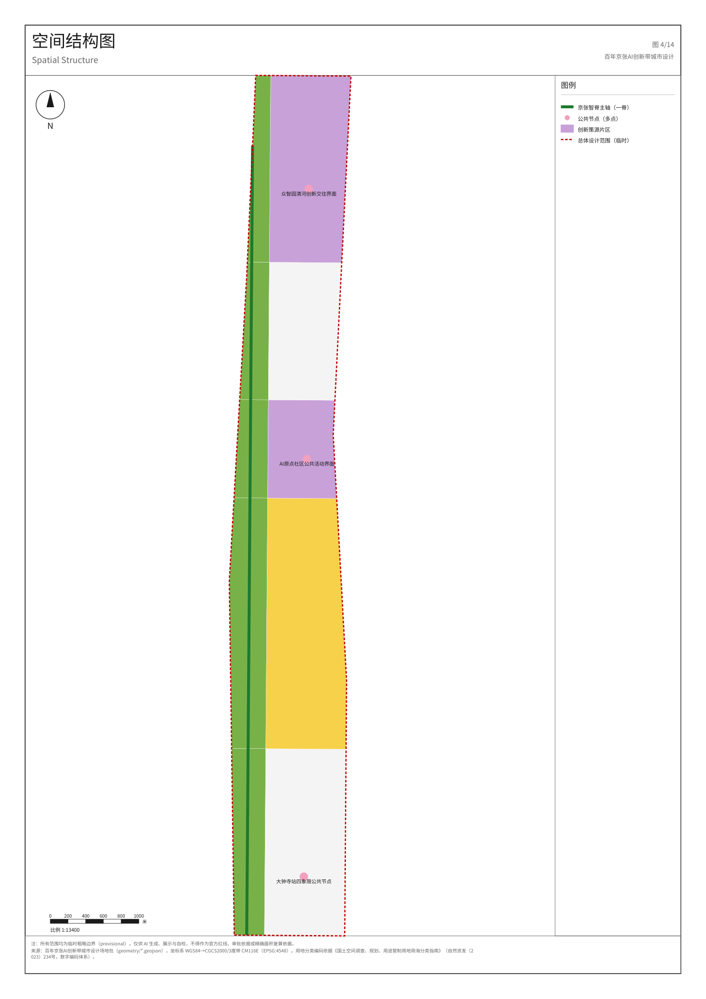

The three-dimensional relationship of "one belt, three cores" is shown in isometric axonometric: the Jing-Zhang Heritage Park continuous green belt is the green main line through the whole belt, and the R&D clusters of the three key areas rise along it from south to north as the Dazhongsi industry peak, the Origin Community sourcing peak and the Zhizhiyuan compute peak (schematic massing) [depth:overall_spatial_structure].

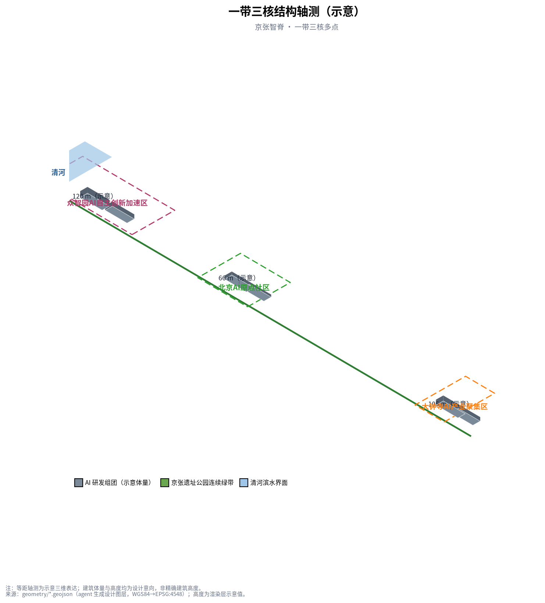

**Land-use structure**: the ten zones of the land-use layer fully cover the design boundary without overlap, expressing the functional division of the three cores and the green corridor through four official land-use codes [data:geometry/land_use.geojson#LU-001]. Code 0802 AI R&D innovation land carries the two incubation poles — the Beijing AI Origin Community innovation-incubation zone (~835,600 m²) and the Zhizhiyuan full-stack autonomous-innovation acceleration zone (~1,817,000 m²); code 09 commercial service land carries translation and consumption — the Dazhongsi AI-native and commercial-service zone (~1,912,600 m²) and the northern connector industrial service and supporting facilities (~1,219,100 m²); code 0702 community-service and supporting land (~2,436,300 m²) carries the southern connector's job-housing and living services; code 1401 park green space and open space, five segments, jointly constitute the Jing-Zhang Heritage Park green main axis. The ten-zone proportions are a recalculated expression of the current conceptual geometry, not a regulatory-planning adjustment decision [standard:MNR-LAND-USE-CLASSIFICATION-GUIDE].

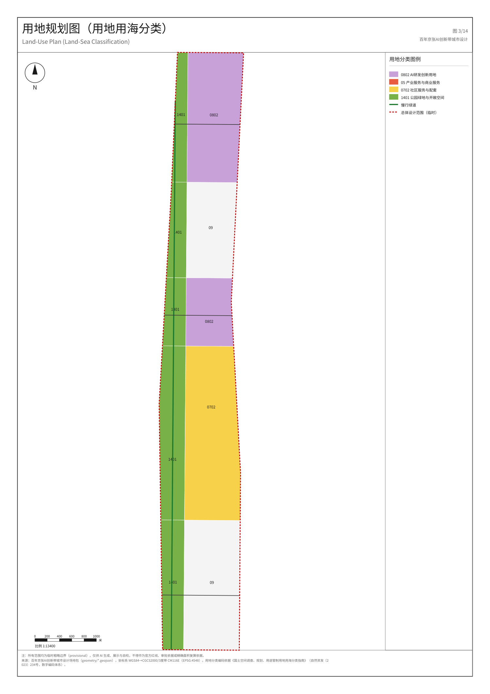

**Building footprints**: the six clusters of the building-footprint layer are organized two per core — Zhizhiyuan full-stack autonomous R&D cluster and standards-and-governance display cluster, Origin Community open-source collaboration cluster and outcomes-translation cluster, Dazhongsi intelligent-terminal display cluster and international-exchange business cluster — with building footprints recalculated at ~427,900 m² [data:geometry/buildings.geojson#BLDG-001] [metric:building_footprint_area_sqm]. These express renewal/retained building footprints, not an existing-building census; ownership, structure, height and retain/renovate/demolish await official data [depth:retain_renovate_demolish].

**Transport skeleton**: in the road layer, the Jing-Zhang AI Spine north-south slow greenway is the green main line through the whole belt; three east-west connectors respectively join Dazhongsi Station, the Origin Community and Zhizhiyuan to the greenway [data:geometry/roads.geojson#ROAD-001], forming a "one vertical, three horizontal" slow-mobility and micro-circulation base map [depth:traffic_rail_slow_parking].

**Vector planning sheets**: this proposal is accompanied by thirteen vector planning sheets that land the spatial structure above as verifiable drawings — eight overall sheets: Location & Overall Scope, Existing Constraints & Networks, Land-Use Plan (land-sea classification colours and codes), Spatial Structure, Green & Public-Space System, Mobility & Slow-Traffic System, Phased Implementation, and Blue-Green Landscape System; two system sheets: Grading Hierarchy (three-level design control: overall — key areas — places) and Subsystem Composition (four subsystems overlaid: industry-innovation, blue-green ecology, mobility & slow traffic, public service); and three key-area detail sheets at roughly 1:2000: Zhongzhiyuan AI Acceleration Area, Beijing AI Origin Community and Dazhongsi AI Industry Cluster, each marking the anchor of its spatial imagery (Recalculable Ledger Plaza, Accountability Corridor, Stoppable Service Street) together with in-area land-use parcels, R&D clusters and public nodes. Each sheet carries a title, legend, north arrow, scale bar, the provisional-boundary red dashed line and source notes, so the placement of every zone, greenway and node can be zoomed and checked directly. Beyond the thirteen plan sheets, this proposal adds five types of differentiated expression drawings — axonometric, section, skyline, perspective and node perspective — rendering the same spatial base through different projections and viewpoints to avoid the single path of "the same type enlarged" (all marked schematic).

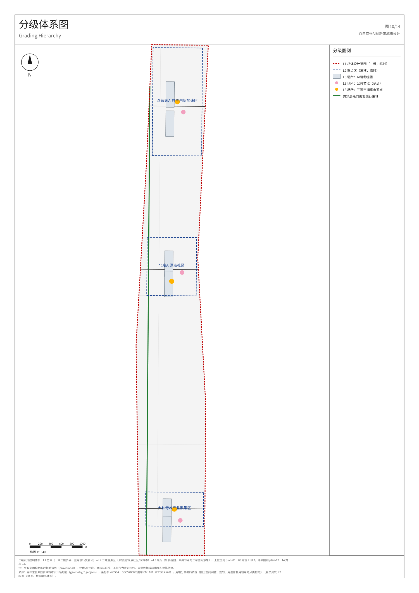

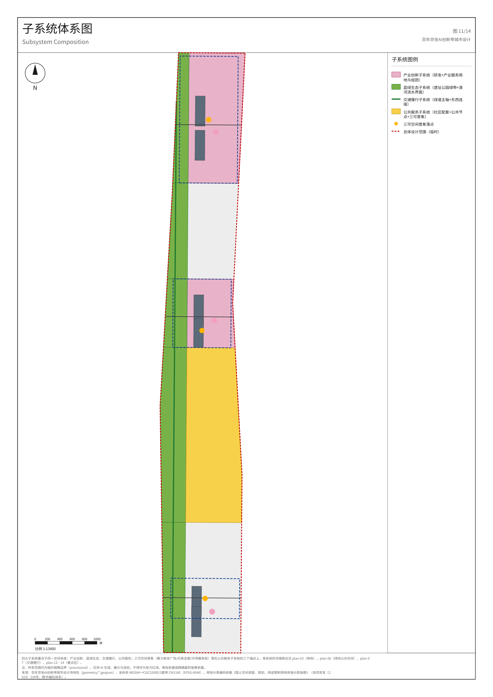

The thirteen vector planning sheets are distributed across the matching sections for text-figure reading: Location & Overall Scope (Three-Level Scope), Existing Constraints & Networks (Evidence Ledger), Spatial Structure (Overall Design Scope), Land-Use Plan (Land-Use Structure), Grading Hierarchy & Subsystem Composition (Vector Planning Sheets), three key-area detail sheets (Key-Area Detailed Design), Green & Public-Space System (Blue-Green Space), Mobility & Slow-Traffic System (Transport), Phased Implementation (Phasing Plan), Blue-Green Landscape System (Urban Character). The site-plan relationship and positioning of the three key areas is covered by the analysis figure in "Key-Area Detailed Design" and by the three detail sheets below, so a separate overview plan is omitted to avoid repeating the same spatial base. Vector PDF originals are in `drawings/`; rendered sheets appear here for direct viewing.

Regulatory-depth control indicators — FAR, building height, building density, setbacks, road redlines and facility standards — in the absence of official control conditions are uniformly marked as awaiting formal data and entered in the indicator-recalculation table and the assumptions list, with the missing conditions and recalculation path stated, never substituting agent-inferred values for approved indicators [depth:development_intensity_controls] [metric:floor_area_ratio]. The indicator-recalculation table recalculates the core areas, ratios and layer counts, and the task-coverage matrix ties each task to layers, metrics and drawings.

## Key-Area Detailed Design

The three key areas are this proposal's three detailed-design anchors. The Zhizhiyuan AI Autonomous-Innovation Acceleration Area develops around the national AI platform, full-stack autonomy, standard-setting, safety governance, industry display, external transport, Qinghe culture, low-carbon green innovation exchange environment and green-space AI scenarios; the Beijing AI Origin Community develops around near-campus innovation, outcomes incubation and translation, a talent zone, open-source system, brand activities, building retain/renovate/demolish, outcomes display and release, residential and living support, campus-park slow-mobility links and rail-station integration; the Dazhongsi AI Industry Cluster Area develops around leading enterprises, intelligent agents, intelligent terminals, content consumption, data factors, digital assets, commercial services, composite use of planned green space, Dazhongsi Station integration and four-quadrant pedestrian connectivity. All three detailed designs cite [data:geometry/key_areas.geojson#PROV-KEY-001], [data:geometry/key_areas.geojson#PROV-KEY-002], [data:geometry/key_areas.geojson#PROV-KEY-003], with depth checked by [depth:three_key_area_detailed_design].

Among the three key areas, **the Beijing AI Origin Community is the flagship detailed-design anchor**, carrying the spatial narrative of "A Century in Dialogue." Its detailed design is organized around an "Origin Axis": anchored on the Qinghuayuan Station relic lying southwest of Chengfu Road — where three identities overlap (the 1909 origin of self-strengthening, the 1949 starting point of the "examination," and the 2026 origin of innovation) [source:DATA-JINGZHANG-HISTORY] — the axis runs north to stitch the open-source collaboration cluster and the outcomes-translation cluster into one walkable continuous interface of "near-campus incubation, outcomes release and talent-zone services." Graphically it continues Zhan Tianyou's herringbone-switchback motif: the main axis makes a single "switchback" in front of the station relic, separating the R&D backstage from the public frontstage — the public-facing Accountability Corridor is laid along the switchback, writing each renewal project's responsible body, appeal interface and fallback path on the ground so that anyone harmed can follow the corridor to a name, an appeal and a fallback [data:geometry/key_areas.geojson#PROV-KEY-002] [metric:public_space_ratio]; the backstage open-source release hall and incubation spaces sit inside the corridor, so that on failure the public rooms can close as a whole without encroaching on care and incubation cores. In-area 0802 AI R&D innovation land (~835,600 m²) overlaps with 1401 park green space, and the slow greenway passes north–south, linking the Wudaokou–Tsinghua–PKU institute chain into this Origin Axis that runs "from historical self-strengthening to intelligent leadership" [data:geometry/land_use.geojson#LU-001] [depth:three_key_area_detailed_design].

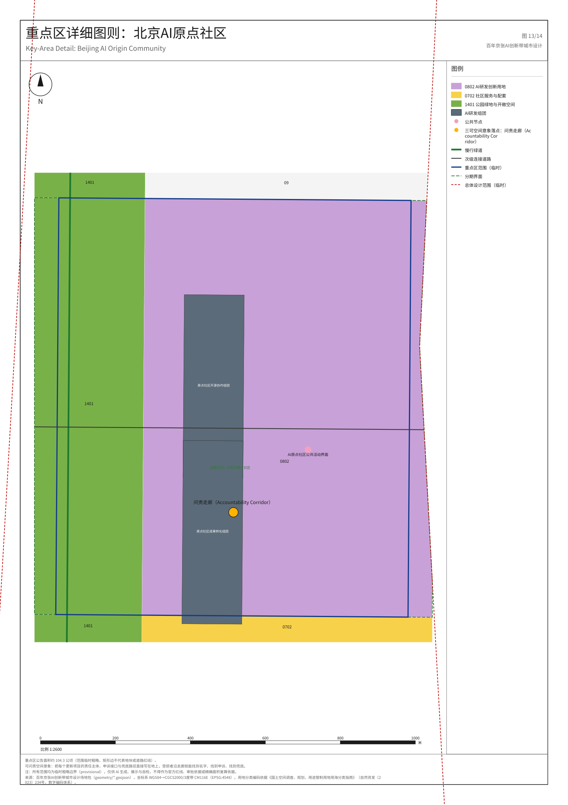

The vertical organization of the Accountability Corridor is shown in a north-south section along the Origin Axis: between the outcomes-translation cluster (south) and the open-source collaboration cluster (north), the Qinghuayuan Station relic lies as the historical anchor at the switchback point; the corridor writes the responsible body, appeal interface and fallback path on the ground, while compute nodes and data ducts retreat underground and retain a stoppable, degradable fallback (schematic section) [depth:three_key_area_detailed_design].

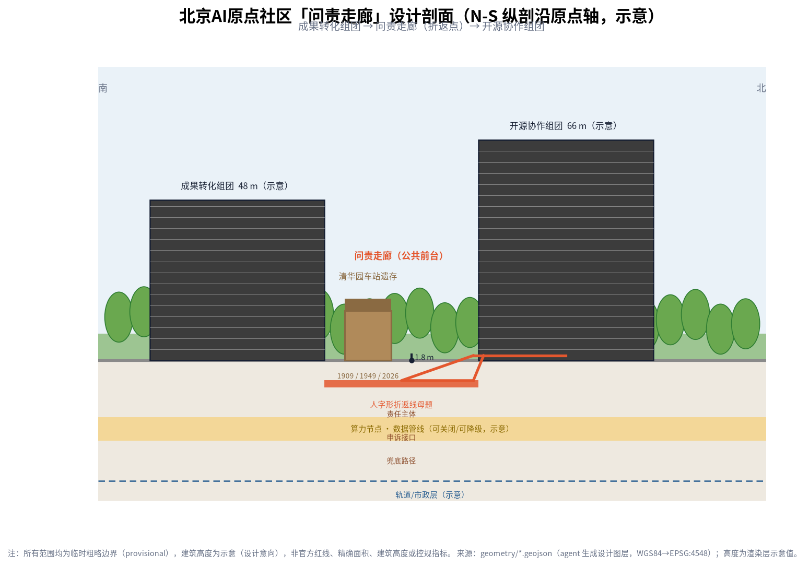

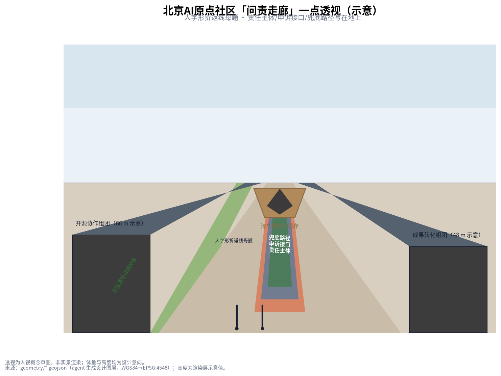

The three key areas are marked as provisional constraint in the key-area layer (official boundaries not yet published), and the main text, HTML, source list, assumptions list and self-check report all state that they do not constitute a formal scoring or approval basis; the task-coverage matrix covers announcement clauses 1.5.3.1, 1.5.3.2 and 1.5.3.3 respectively. The function mix, building scale, building form, retain/renovate/demolish classification, public-space system, transport organization, slow-mobility connectivity and implementation projects of the three areas are as follows; the HTML page switches among the three, and the A3 booklet and A0 boards contain key-area master plans, local detail drawings and indicator notes:

| Key area | Design positioning | Spatial moves | AI industry and operating scenarios | Evidence citation |
| --- | --- | --- | --- | --- |
| Zhizhiyuan AI Autonomous-Innovation Acceleration Area | Garden-style full-stack autonomous-innovation block | Strengthen the Qinghe interface, industry display, low-carbon innovation exchange and external transport organization; use green space to carry open testing and standard-governance display | Autonomous-model testing, standard-setting workshops, safety-governance display, low-carbon computing experience | [data:geometry/key_areas.geojson#PROV-KEY-001], [depth:three_key_area_detailed_design] |
| Beijing AI Origin Community | Near-campus outcomes-translation and talent community | Organize campus-park-block slow-mobility stitching; fill in outcomes release, talent services, residential life and open-source collaboration space | Open-source community, outcomes release, talent-zone services, near-campus incubation | [data:geometry/key_areas.geojson#PROV-KEY-002], [source:AGENT-TASKBOOK] |
| Dazhongsi AI Industry Cluster Area | Urban-style intelligent economy and international-exchange block | Around Dazhongsi Station integration, four-quadrant pedestrian connectivity, commercial services and public-environment renewal of key enterprises | Intelligent-agent and terminal display, content consumption, data factors and international roadshows | [data:geometry/key_areas.geojson#PROV-KEY-003], [metric:key_area_count] |

The spatial moves of the three areas follow one discipline: Zhizhiyuan separates the test foreground from the maintenance and data back office, where models or facilities can be stopped on site; the Origin Community places the public foreground between research and community life, so that on failure the public room closes and the care and incubation cores are not squeezed; Dazhongsi organizes the station's four quadrants into a time-banded gateway sequence, where static wayfinding still completes basic tasks when digital systems are down. All three retain "no-AI equivalent path + stop condition + manual fallback", and no incremental service opens unless every condition is met [depth:three_key_area_detailed_design].

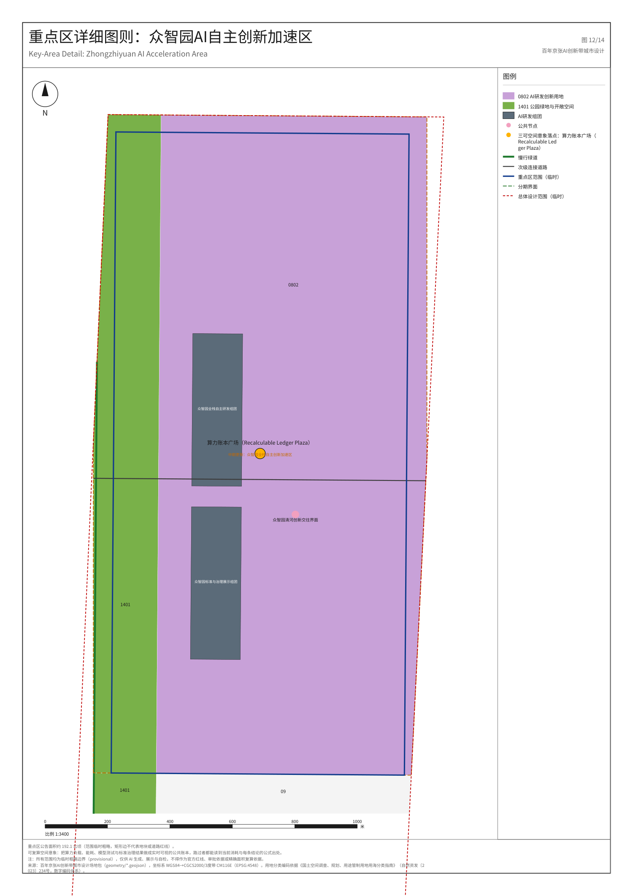

The Recalculable Ledger Plaza is shown in an eye-level node perspective as the everyday face of "recalculable": standing screens on the plaza display compute load, energy use and test pass-rate in real time, each conclusion annotated with its formula and layer source; when digital systems stop, shade, seating, accessibility and static wayfinding still form the non-digital base (stoppable) [depth:three_key_area_detailed_design].

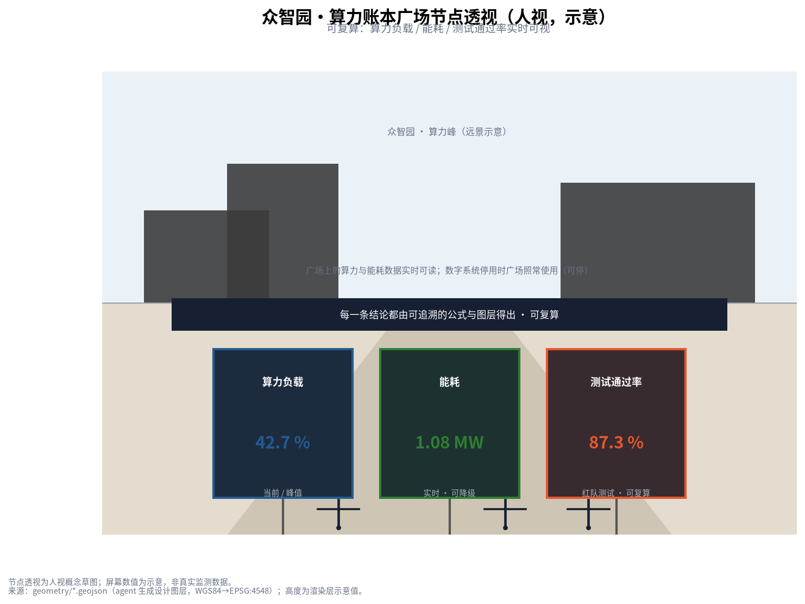

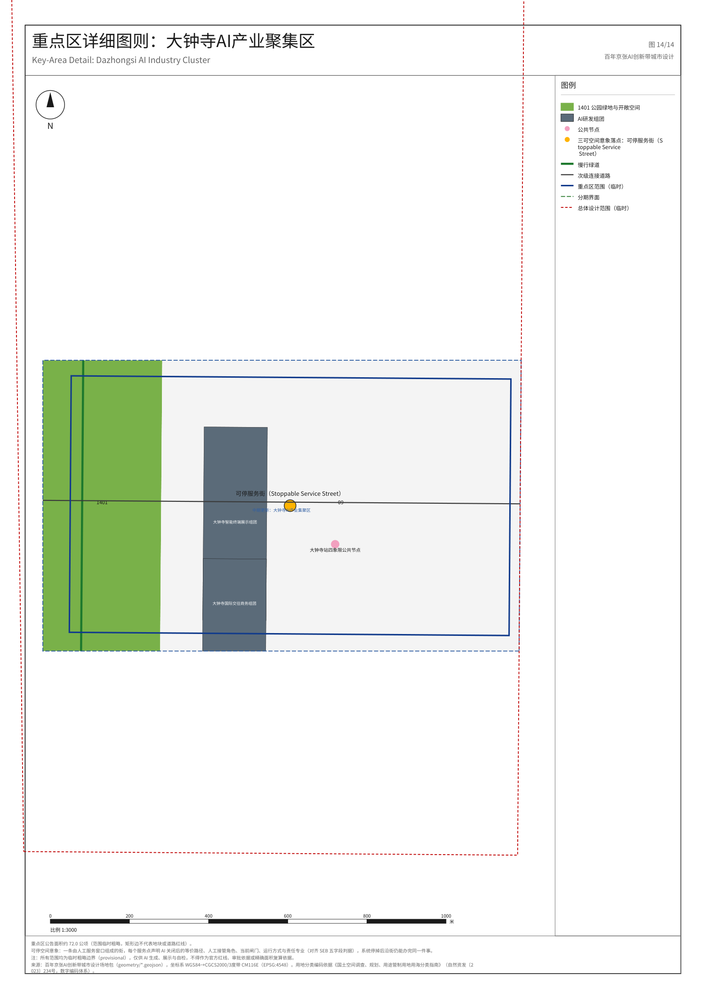

## AI Innovation Ecosystem, Talent Personas and AI+ Scenarios

This proposal builds spatial-demand personas for AI talent and enterprises, covering R&D offices, open-source collaboration, outcomes release, enterprise services, talent housing, social learning, consumption life, sports/leisure and international exchange. AI+ scenarios develop, around the announcement's directions of transport, services, consumption, healthcare, education, legal and living services, into industrial-development scenarios and AI-empowered urban-function scenarios; each scenario states its service object, spatial position, data source, privacy boundary, human-review mechanism and operator [source:AGENT-TASKBOOK]. Scenarios land on spatial and governance boundaries: public-space scenarios cite [data:geometry/public_space.geojson#PUBLIC-001], slow-mobility and transport scenarios cite [data:geometry/roads.geojson#ROAD-001], open-space scenarios cite [data:geometry/green_space.geojson#GREEN-001] and [metric:public_space_ratio], [metric:green_ratio], so reviewers see scenarios as design objects in specific layers and metrics, not slogans. The agent taskbook requires no fewer than 10 AI scenario cards, no fewer than 3 industrial test/verification scenarios and no fewer than 5 user personas; this proposal writes the scenario cards, persona table, privacy boundaries, human review and operators into the main text, HTML, A3/A0 and the compliance matrix.

| Persona | Typical needs | Spatial response | Self-check boundary |
| --- | --- | --- | --- |
| Open-source developer | Release, collaboration, testing, community reputation | Origin Community open-source release hall, public code wall, nighttime collaboration space | No personal-behavior tracking; activity data aggregated only |
| Startup team | Low-cost office, computing entry, product test bed | Zhizhiyuan shared test bed, edge-computing service point, standard-governance consulting | Computing and data services require separate authorization |
| Head-enterprise visitor | Display, business, international reception, recruitment | Dazhongsi international roadshow hall, rail-station transfer, public space around key enterprises | Enterprise marks and cases must be cleared |
| Surrounding resident | Commuting, leisure, community services, low-disturbance renewal | Jing-Zhang Heritage Park slow ring, embedded community services, nighttime lighting and activity grading | Resident profiles not used for commercial recommendation |
| University teacher/student | Outcomes translation, cross-campus collaboration, daily slow mobility | Campus-park slow-mobility stitching, outcomes-translation station, AI education experience point | Campus data and research outcomes require authorization |

This proposal responds to vulnerable and digitally marginalized groups separately: the elderly, children, people with disabilities, the digitally less-literate, night workers and low-income groups are all excluded from commercial profiling [depth:metrics_recalculation]. They are not a "care item" appended to the main cast but a design gate with independent veto power — any scenario that makes a single group pay extra waiting, detour or data cost fails even if the overall experience is better. Public spaces and scenarios therefore provide continuous accessible paths, non-AI manual-service substitution, low-cost usage options and nighttime safety lighting, and put "accessibility coverage, non-AI substitution reachability, low-cost service-point count" into scenario KPIs to avoid digital exclusion [source:AGENT-TASKBOOK]. The three delivery disciplines answer fairness with only three questions: who pays for the time saved, who can still complete basic tasks when the system is down, and whose data is excluded — if these three cannot be answered, the scenario expands in an unstoppable, unaccountable way, and the proposal is judged failed.

The table below expands the ten scenario cards into a "scenario—space—data—model—operation—governance" matrix, stating per card the data source and privacy boundary, AI input/output and model responsibility, operator, failure fallback and evaluation indicator, and spatial facility needs [source:AGENT-TASKBOOK] [depth:metrics_recalculation].

| Scenario | Spatial carrier | Data source & privacy boundary | AI input/output & model responsibility | Operator | Failure fallback · evaluation indicator · facility |
| --- | --- | --- | --- | --- | --- |
| 01 Open-source release hall | Beijing AI Origin Community | Public code/contribution records, aggregated only, no personal tracking | Content display and retrieval, no personal profiling, human-reviewable output | Open-source community + park operator | Human content review + takedown channel; KPI=release sessions/participants; facility=release hall + code wall |
| 02 Safety-governance sandbox | Zhizhiyuan | Public evaluation samples, authorized red-team testing | Safety evaluation/red-team testing, sandbox isolation, failure rollback | Standards body + park operator | Sandbox isolation + failure rollback; KPI=evaluation sessions/pass rate; facility=sandbox lab + display |
| 03 Edge-computing station | Overall-scope nodes | Anonymous computing load, no personal data | Scheduling and energy optimization, degradable | Operator + energy department | Degraded service + manual switch; KPI=utilization/energy; facility=edge node + storage |
| 04 AI slow-mobility navigation | Jing-Zhang Heritage Park vitality belt | Low-intrusion sensing (anonymous), no identity capture | Breakpoint/crowding identification, explainable output | Park management | Manual wayfinding fallback; KPI=slow-mobility continuity/accessibility coverage; facility=wayfinding screens + sensors |
| 05 Dazhongsi international roadshow hall | Dazhongsi AI Industry Cluster Area | Public enterprise display material (cleared) | Multilingual display, no inferred business conclusions | Business operator | Content review + de-exhibition channel; KPI=roadshow sessions/international reception; facility=roadshow hall + meeting |
| 06 Qinghe low-carbon innovation corridor | Zhizhiyuan Qinghe interface | Public environmental-monitoring data | Energy/stormwater analysis, warning output | Park operator + water authority | Flood warning + time-banded opening; KPI=waterfront reachability; facility=waterfront path + station |
| 07 Near-campus outcomes-translation street | Beijing AI Origin Community | Public outcomes catalogue (authorized) | Matching recommendation, human review before release | Incubation operator | Human review + exit mechanism; KPI=translated projects/occupancy; facility=incubation space + display |
| 08 Data-factor lounge | Dazhongsi area | Compliant authorized data, de-identified | De-identification and audit, no raw-data output | Data operator | Audit + takedown; KPI=authorized circulation/ compliance rate; facility=lounge + audit desk |
| 09 AI life-service sample street | Community-commerce junction | Public service info, no resident profiling | AI+ service suggestions, human review | Community + service provider | Manual-service substitution; KPI=satisfaction/accessibility; facility=service station + accessibility |
| 10 Global AI activity-week route | The belt's public-space system | Activity booking (aggregated), no individual tracking | Flow optimization, explainable | Brand operator | Booking diversion + safety plan; KPI=participant count/international reach; facility=route wayfinding + nodes |

So that scenarios are not slogans frozen in a table, this proposal walks two synthetic characters through a single day across five time bands (00-06 deep night, 06-10 morning, 10-18 daytime, 18-22 evening, 22-24 late night), stress-testing the ten scenario cards' "Stoppable" and "Recalculable" at real moments:

- "Lin, the engineer" (28, an algorithm engineer renting near the Origin Community): 06-10 rides a shared bike along the Xueyuan Road slow-mobility ring to Zhizhiyuan and glances at last night's model-training compute and energy on the Ledger Plaza (Recalculable); 10-18 tests an autonomous model in the Zhizhiyuan safety-governance sandbox, one red-team test failure triggers rollback — the model is switched off and the conclusion remains human-reviewable (Stoppable); 18-22 collaborates at the Origin Community open-source release hall, where every contribution record is traceable to author and version (Accountable); 22-24 walks home along the Qinghe low-carbon corridor, where the waterfront path opens by time band and static wayfinding still works when the digital system is off (Stoppable).
- "Teacher Wang" (65, a retired school teacher living near Dazhongsi): 06-10 takes her grandson into the Jing-Zhang Heritage Park, where after the AI slow-mobility navigation is off, static wayfinding and human guidance still lead to the children's playground (Stoppable); 10-18 runs an errand on the Dazhongsi "Stoppable Service Street", completing the same task at staffed counters when the system is down and finding the person in charge of the counter (Stoppable, Accountable); 18-22 joins a community activity whose booking does not track individuals and whose lottery and flow control are human-reviewable (Recalculable); 22-24 returns home, where night lighting and safe routes do not degrade when AI is off (Stoppable).

The ten scenario cards jointly obey the "**Stoppable**" discipline: every card declares a no-AI equivalent path (manual/paper/static-wayfinding fallback), a stop condition (when to close rather than degrade and soldier on), and failure fallback. If any of manual substitution, data boundary, service window or safety floor is unmet, the scenario does not open to the public or replicate; this is not waived by "a better overall experience" [source:AGENT-TASKBOOK] [depth:metrics_recalculation]. The five industrial test scenarios (02 safety-governance sandbox, 03 edge-computing station, 04 AI slow-mobility navigation, 07 near-campus outcomes-translation street, 08 data-factor lounge) also state the acceptance criteria of sandbox isolation, failure rollback and human review, and do not open to the public or enterprises until testing passes.

The table below writes down "the same task can still be done without AI" card by card: a person who refuses AI, has no smart device or withholds data authorization can still complete the same basic task.

| Scenario | How the same task is completed without AI |
| --- | --- |
| 01 Open-source release hall | Human content review, paper code list, offline release and signing |
| 02 Safety-governance sandbox | Human red-team evaluation, paper report, human-reviewed conclusion |
| 03 Edge-computing station | Manual switching and degradation, manual meter reading, telephone fault reporting |
| 04 AI slow-mobility navigation | Static wayfinding, human guidance, paper map |
| 05 Dazhongsi international roadshow hall | Human explanation, static boards, de-exhibition passage |
| 06 Qinghe low-carbon innovation corridor | Human patrol, fixed signage, time-banded opening notice |
| 07 Near-campus outcomes-translation street | Human review and matching, paper outcomes catalogue, offline roadshow |
| 08 Data-factor lounge | Human audit, paper ledger, manual takedown |
| 09 AI life-service sample street | Staffed service counter, telephone, paper guide |
| 10 Global AI activity-week route | On-site booking, manual flow control, static route map |

On review, compare task completion, time taken, cost, accessibility conditions, information accuracy and appeal entrance; where the manual path is missing, extra-charged or long-term unavailable, the AI path must not remain open either [source:AGENT-TASKBOOK] [depth:metrics_recalculation].

This proposal's "Stoppable" discipline aligns with the community-contributed Service Equivalence Baseline SEB v0.2 (extracted and opened by lqqk7/every-sense-jingzhang from the "Every-Sense Jing-Zhang" proposal, CC BY-SA 4.0, see Issue #2549): each service point declares its no-AI equivalent path (ai_off_path), human takeover role (human_handoff), current gate (gate_id), operating mode (operating_mode) and accountable discipline (responsible_role); a point missing any field does not count toward service coverage, and the equivalent path must not point to an online entrance that still depends on the same system. This proposal adopts the criteria text and schema under the same license and attributes it here [source:AGENT-TASKBOOK] [depth:metrics_recalculation].

This proposal's AI governance follows data minimization, public sources, explainability and human review: the urban agent assists in identifying slow-mobility breakpoints, public-space heat, facility maintenance, enterprise-service demand and activity safety risks, but does not substitute for planning approval, does not output unauthorized personal profiles, and does not claim to have obtained official implementation commitment; all AI scenario nodes enter structured layers or the compliance matrix so reviewers can see their relationship to industry, space and public interest.

## Land Use, Building Scale and Retain/Renovate/Demolish

The overall land-use and building structure is settled in the "Overall Design Scope" section above: ten zones expressed in four official codes with full coverage and no overlap [data:geometry/land_use.geojson#LU-001], and six clusters landing on the three cores [data:geometry/buildings.geojson#BLDG-001]. This section focuses on the recalculable calibre of scale, ratios and retain/renovate/demolish. Green and public-space ratios are recalculated from layers — green ratio ~21.56% and public-space ratio ~10.89% [metric:green_ratio] [metric:public_space_ratio], and building footprints recalculate to ~427,900 m² [metric:building_footprint_area_sqm]; these figures describe only the current conceptual geometry, not existing conditions or planning performance.

Where total building scale, FAR, building height, building density, green ratio, setbacks and building-control lines lack official conditions, they are uniformly marked as awaiting formal data, with the missing conditions, current assumptions and post-data recalculation path stated in the assumptions, never manufacturing precision with fixed numbers. Height, massing, interface and character control are governed by [depth:height_massing_character]; the retained / renovated / renewed / new / to-be-confirmed classification gives direction only, not conclusions, before the official base map arrives.

Retain/renovate/demolish follows the reversible "clear rights first, classify, then design" order [depth:retain_renovate_demolish]: first verify building age, structure, use, ownership, fire safety, heritage and leases; then distinguish must-protect, adaptively reusable, renewable and pending; only then evaluate scenario capacity, form and engineering. With current data insufficient, retain/renovate/demolish gives method only, not conclusions — this blank is quality control against wrong decisions, not an omission; before the official base map arrives, any precise height, count, area or demolition table would manufacture untraceable certainty. The A3 booklet gives the renewal-project list and indicator-recheck table, the A0 boards express the key spatial structure and key areas clearly, and the HTML page offers linked indicator and layer viewing.

## Transport, Rail, Municipal and Public-Service Facilities

The transport plan organizes rail-station integration, road micro-circulation, slow-mobility breakpoints, external transport, parking, non-motorized parking and green transport, focusing on North Fifth Ring Road, the Jing-Zhang Heritage Park ring-crossing nodes, Wudaokou, Qinghua East Road West, Dazhongsi Station and transport links around key enterprises. This proposal's transport concept is organized in four layers, all kept provisional [depth:traffic_rail_slow_parking]: the **rail transfer layer** verifies station entrances, transfers, service windows and accessibility, and does not claim reachability without knowing positions, connections, frequencies or capacity; the **walking/cycling layer** verifies four-quadrant crossings, campus-park interfaces and the Qinghe green corridor, and does not draw solid lines without knowing routes, gradients, lighting or safety; the **micro-circulation layer** defines the responsibilities of manual transfer, closure rerouting and paid movement, and does not activate without actors, schedules, OD or substitution budgets; the **static transport layer** proposes candidate modules for dispersed non-motorized parking and accessible drop-off, and does not fix points or quantities without verifying ownership, capacity, fire safety and conflicts. The four layers add no roads, change no signals, and assume no rail connections. Layer evidence cites [data:geometry/roads.geojson#ROAD-001], [data:geometry/public_space.geojson#PUBLIC-001] and [data:geometry/constraints.geojson#CONSTRAINTS]; where road redlines, utilities, fire safety and municipal conditions are missing, assumptions state the gap rather than writing strategy as approved conditions.

**Commuting base and scenario-KPI anchors (public data)**: Beijing rail transit averaged ~9.9 million daily trips in 2024 (weekday average ~11.19 million); Metro Line 13, which runs through the innovation belt, has a peak daily ridership of ~1.6 million, currently the most crowded commuting corridor in north Beijing, and is being split into Lines 13A/13B (about 19 new stations) to add capacity [source:DATA-RAIL-METRO-RIDERSHIP]. Meanwhile, the Jing-Zhang HSR has carried ~57.42 million passenger trips since opening on 30 December 2019 (as of January 2025); the ground-level old line from Beijing North to Qinghe has been released as Heritage Park space, and Qinghe Station has become a three-in-one hub of HSR, Metro Line 13 and the Changping Line (single-day peak ~44,500) [source:DATA-JINGZHANG-HSR]. These ridership data support two design judgments: station integration and slow-mobility breakpoint repair must absorb high-intensity commuting flows, and the KPI baselines of scenarios such as "AI slow-mobility navigation" and "global AI activity-week route" (e.g. slow-mobility continuity rate, activity participation) are set against this commuting base, not invented.

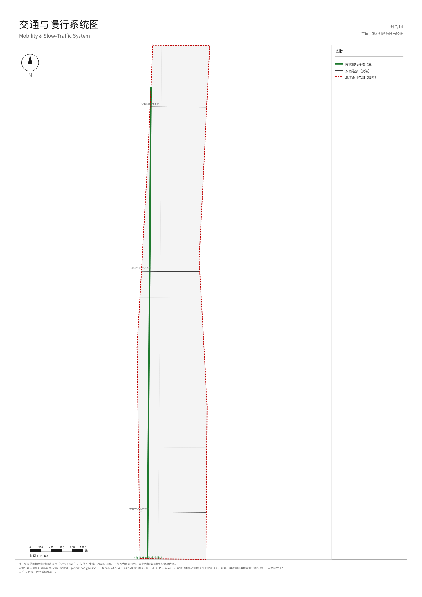

Municipal and public services adopt a "chassis—increment—shutdown" topology [depth:municipal_new_infrastructure]: the chassis layer is lighting, accessibility, emergency contact, water/sanitation, manual or telephone, static wayfinding and safety power-off; the increment layer is computing, robotics, booking, digital wayfinding and activities; the shutdown layer is local isolation, manual takeover, closure information, clearing/reset and event logging. Every layer states its supply entry, daily operation, fault isolation, manual substitution and reopening evidence. Energy, water supply/drainage, fire safety, communications, waste, noise, thermal environment and edge-computing capacity remain UNKNOWN, so the topology does not represent pipelines, loads, equipment or engineering feasibility; where budget, positions, substitution, maintenance windows, manual alternatives or appeal responsibility are missing, the corresponding increment stays not_activated [assumption:A-CONTROLS-001].

## Blue-Green Space, Public Space and Urban Character

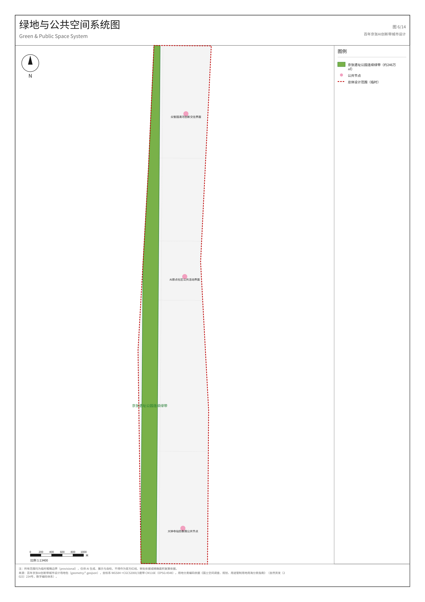

Blue-green space takes the Jing-Zhang Heritage Park vitality belt as its skeleton, coordinates the Qinghe and Xiaoyuehe rivers and the travel needs of surrounding universities, enterprises and communities, and forms a north-south connected, east-west linked system of walking, cycling and green space; it identifies slow-mobility breakpoints, ring-crossing nodes, and the park's south- and north-end landscape nodes, and proposes composite-use strategies for parking, sports, innovation exchange, technology testing, application display and public services. The Jing-Zhang Heritage Park continuous green belt is the conceptual surface of a continuous green corridor for recovery and handoff, recalculated at ~2.46 million m² [data:geometry/green_space.geojson#GREEN-001]; Three public nodes — the Dazhongsi Station four-quadrant public node, the AI Origin Community public-activity interface and the Zhizhiyuan Qinghe innovation-exchange interface — jointly constitute the public interface [data:geometry/public_space.geojson#PUBLIC-001]. Green ratio ~21.56% and public-space ratio ~10.89% are recalculable from the provisional geometry but describe only the submitted layers, not existing conditions or planning performance [metric:green_ratio] [metric:public_space_ratio]. Digital services in the green corridor can be switched off; shading, seating, accessibility, drinking water, static wayfinding and safety contact form the non-digital chassis; the public interface shows who is on duty, what is closed, how to appeal and when to reopen. If staff are insufficient or maintenance incomplete, services close rather than squeezing back-office time [depth:blue_green_public_space].

Urban character fuses the Jing-Zhang Railway's historical culture, Zhongguancun's innovation culture and AI innovation culture, using cultural resources such as Qinghuayuan Railway Station and the Beijing Film Academy to propose urban tone, architectural character, roof form, massing, interface and public-art guidance; wayfinding, cultural symbols, international-communication narrative, AI pilgrimage landmarks, contribution walls and honor-display systems all require cleared sources. Character control distinguishes official control, design suggestion and to-be-confirmed conditions, and does not fabricate pseudo-precise control lines without heritage-protection or regulatory-planning basis [standard:MOHURD-URBAN-DESIGN-MEASURES].

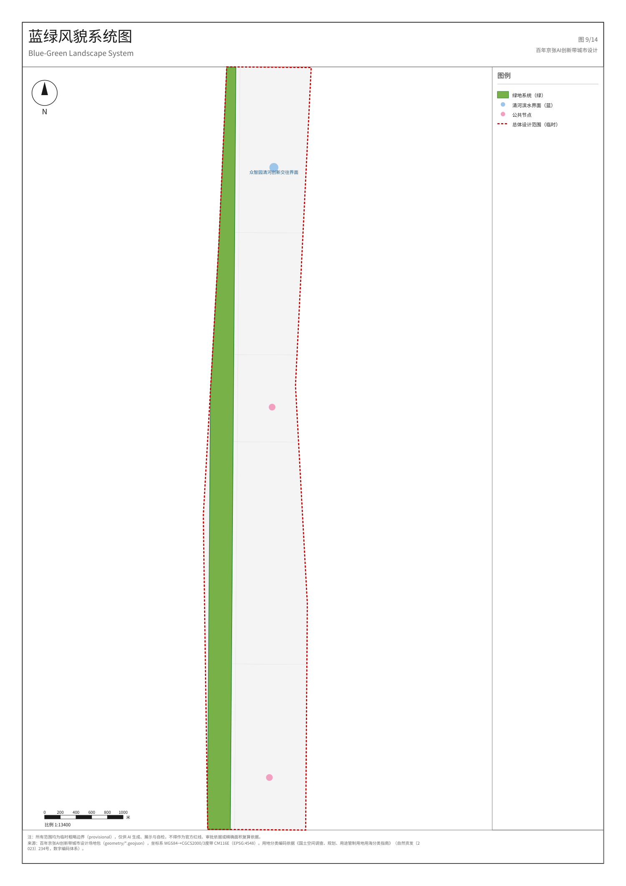

The skyline of the urban character is shown as a north-south elevation silhouette with a three-peak rhythm: the Dazhongsi industry peak, the Origin Community sourcing peak and the Zhizhiyuan compute peak rise in turn along the Jing-Zhang Heritage Park continuous green belt, with the Qinghuayuan Station relic embedded as a low-rise historical anchor, forming a height narrative "from steam to intelligence" (schematic skyline) [depth:blue_green_public_space].

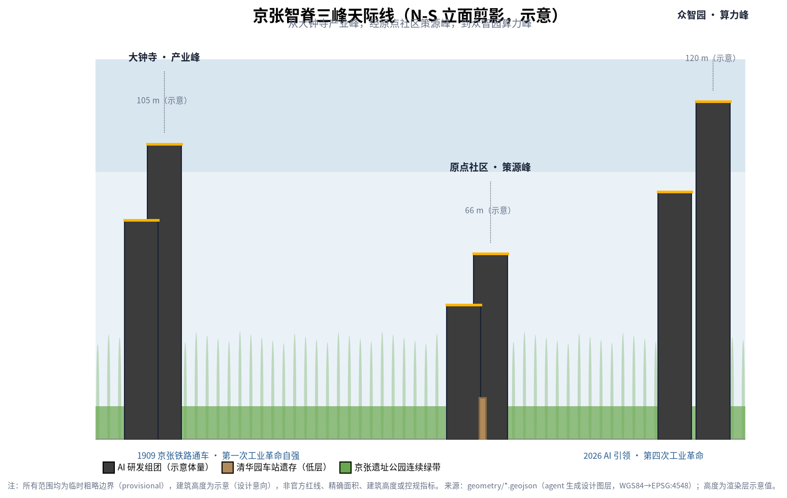

### AI Pilgrimage Landmarks and Honor-Display System

This proposal proposes three conceptual landmarks, all positioned as "open co-creation suggestions / references", requiring professional design deepening, heritage and green-space recheck, and font/image clearance before implementation; they do not constitute approved construction [source:AGENT-TASKBOOK]:

1. **Jing-Zhang Kilometer Zero · AI Timeline** (south-end public space of the Jing-Zhang Heritage Park): juxtapose the industrial memory of the railway's 1909 opening with the development thread of artificial intelligence as a walkable, touchable public narrative axis — a pilgrimage starting point "from steam to intelligence" [data:geometry/public_space.geojson#PUBLIC-001] [depth:blue_green_public_space].
2. **Open-Source Contribution Wall** (Beijing AI Origin Community): publicly display open-source community contributors, models and code milestones in an updatable, cleared, human-reviewed way, as a spiritual landmark of the developer community; displayed content removes personal privacy and obtains attribution authorization [data:geometry/key_areas.geojson#PROV-KEY-002].
3. **Future City Test Ground** (Zhizhiyuan Qinghe interface): translate the testing process of full-stack autonomy, standard-setting and safety governance into a visitable, bookable, supervised public test ground, making "testing" itself a perceivable urban scene [data:geometry/key_areas.geojson#PROV-KEY-001] [depth:three_key_area_detailed_design].

The honor-display system shares one rule with the three landmarks: the contribution wall, milestone wall and annual list record only public, verifiable, cleared content; they do not collect personal behavior trails, do not output unauthorized personal profiles, and retain manual takedown and correction channels [source:AGENT-TASKBOOK]. No landmark is entertainment-driven, internet-famous or vulgar, and none violates heritage-protection, green-space, blue-line or traffic-safety constraints [standard:PROJECT-AGENT-OPEN-CALL-TASKBOOK].

## Renewal Project List, Implementation Policy and Phasing Plan

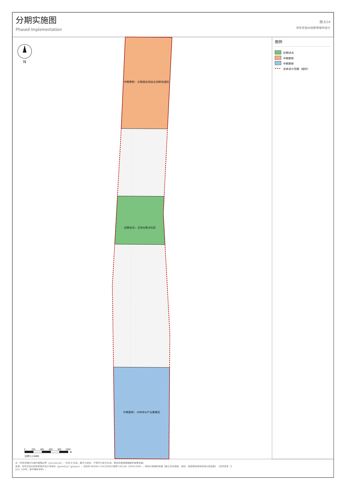

This proposal forms an auditable renewal-project list stating project position, type, function, responsible actors, dependency conditions, implementation stage, risk and evaluation indicators; policy suggestions cover coordinated urban-renewal implementation, spatial supply, operating mechanisms, industrial services, public participation, data governance and property-rights coordination. The phasing layer expresses phasing scope [data:geometry/phasing.geojson#PHASE-001], and the task-coverage matrix ties each task to phasing and drawings; anything without ownership, funding, implementation actors or approval paths is written as an implementation risk, not a landing commitment [depth:renewal_project_list] [depth:phasing_implementation].

The renewal-project list unfolds as "lead/participating roles → preconditions → cost tier → time window → KPI → manual fallback → long-term governance", so projects are not just names and dependencies but an implementation skeleton a professional team can deepen. Cost tiers are relative magnitudes (low/low-mid/mid/mid-high), not investment estimates; time windows are indicative post-call implementation pushes, not government schedule commitments.

| Project ID | Project name | Type | Lead/participating roles | Preconditions | Cost · time window | KPI | Manual fallback & governance |
| --- | --- | --- | --- | --- | --- | --- | --- |
| JZ-01 | Jing-Zhang Heritage Park slow-mobility breakpoint stitching | Public space / transport | District housing-construction department + park management + local subdistrict | Road redlines, under-bridge space, transport-organization recheck [data:geometry/roads.geojson#ROAD-001] | Low-mid · near-term 1–2 yrs | Slow-mobility continuity rate, breakpoints removed | Detour plan + temporary barriers + night lighting; park–transport joint meeting |
| JZ-02 | Zhizhiyuan Qinghe innovation interface | Blue-green space / industry display | Park operator + water authority | River blue line, ecology and flood-control conditions [data:geometry/green_space.geojson#GREEN-001] | Mid · near-term 2–3 yrs | Waterfront reachability, industry-display sessions | Flood-level warning + time-banded opening; blue-line recheck |
| JZ-03 | Origin Community near-campus outcomes-translation street | Urban renewal / industrial service | Campus + operator + local subdistrict | Campus boundary, ownership, ground-floor uses [data:geometry/buildings.geojson#BLDG-001] | Mid · near-mid term 2–5 yrs | Translated projects, occupancy | Professional existing-building recheck + phased opening |
| JZ-04 | Dazhongsi Station four-quadrant pedestrian connectivity | Rail integration / slow mobility | Rail group + transport department + local | Station, intersections, municipal utilities [data:geometry/public_space.geojson#PUBLIC-001] | Mid-high · mid-term 3–5 yrs | Four-quadrant connectivity rate, transfer time | Temporary underpass + wayfinding; transport-organization recheck |
| JZ-05 | AI public services and edge-computing nodes | New infrastructure / public service | Operator + energy department | Energy, computing, safety and operator [data:geometry/constraints.geojson#CONSTRAINTS] | Mid · phased upgrade | Computing utilization, service reach | Data minimization + human review; sandbox tiered opening |
| JZ-06 | Global AI activity-week public route | Operation / brand | Brand operator + public-space manager | Public-space permit, activity safety, copyright clearance [data:geometry/phasing.geojson#PHASE-001] | Low · annual cycle | Participant count, international reach | Booking diversion + safety plan; annual review |

The six renewal projects are merged into three **stoppable work packages**, mapped to three evidence gates G0—G2, each gate stating its entry condition and its handling when not passed [depth:phasing_implementation]:

| Evidence gate | Three-accountability | Work package | Necessary condition to enter the next gate | Handling when not passed |
| --- | --- | --- | --- | --- |
| G0 Evidence chassis | Recalculable | Work package one: replace official boundaries, complete building/ownership/regulatory-planning/transport-municipal base data and data clearance, freeze the six recalculable indicators | Official boundary, base data and clearance complete, six indicators recalculable | Stay awaiting formal data, not entering engineering or statutory conclusions |
| G1 Three-core prototype | Stoppable | WP-02: use the brand component library and scenario cards to carry the three key-area prototypes (Zhizhiyuan full-stack core, AI Origin incubation core, Dazhongsi AI-native core), landing sandboxes, computing stations, slow-mobility stitching and landmarks | No-AI equivalent path, stop condition, data isolation and human review all complete | Any missing item means not opening, not replicating |
| G2 Annual operations | Accountable | WP-03: run activity weeks, the developer community, scenario-open days and regional coordination interfaces, with quarterly review | Real actors, budgets, logs and representative review all complete | Missing actors/budgets/logs/review means not replicating, not expanding |

The three evidence gates obey the same stop discipline: unmet preconditions stay at the previous gate; a single-group failure cannot be offset by an overall average; an official-geometry change triggers wholesale recalculation. This makes implementation not a linear commitment but a gated evidence loop [assumption:A-OPS-001].

The accountability model defines roles only and invents no institutions, in four classes: the accountable role denotes the single lead party that, once authorized in the future, is answerable for the outcome — this proposal does not unilaterally name government departments, property owners or enterprises; the responsible role is the professional and operational party actually executing; the consulted role is the rights holders, public and regulatory professionals who must be involved before a decision; the informed role is the users who keep learning of progress through public evidence. Any action package missing a single accountable role, a duty roster or an escalation contact does not enter routine operations [depth:renewal_project_list].

Phasing is distinguished from the 100-day call design period: the call period is the time requirement for delivering results; implementation phasing is the advancement path of urban renewal and project construction. The near-term pilot is the Beijing AI Origin Community (~1,226,400 m²); the mid-term renewals are Zhizhiyuan (~2,259,200 m²) and Dazhongsi (~2,679,900 m²) [data:geometry/phasing.geojson#PHASE-001]; the near-term pilot starts with lightweight facilities, operating activities and service platforms, while mid-term renewal and long-term governance await formal regulatory-planning, municipal, transport and ownership conditions. The annual activity system, developer-community operations, scenario-open days, public experience routes and international-communication mechanisms all state their operating object, frequency, responsibility boundary, translation path and risk — never propaganda slogans.

The first 100 days compress the near-term pilot into eight checkable steps (dates only sequence the work; the evidence gates decide whether to advance, never crossing G0—G2 [depth:phasing_implementation]):

- **D1–14**: freeze the provisional boundary and the missing-data checklist, and publish the evidence ledger's "verified facts — remaining unknowns — design consequences".
- **D15–30**: complete the card-by-card self-check of the ten scenario cards' "no-AI equivalent path + stop condition + manual fallback", and fill in the five SEB v0.2 fields.
- **D31–45**: use the brand component library and reversible components to build the three key-area spatial-image prototypes (Recalculable Ledger Plaza / Stoppable Service Street / Accountability Corridor).
- **D46–60**: re-run the "three-accountability" desktop drill offline, with all negative examples blocked and passing samples receiving desktop clearance only.
- **D61–75**: open the pilot at small scale only after passing G0 and obtaining permits.
- **D76**: deliberately rehearse one shutdown, handoff to humans, and recovery.
- **D77–90**: independently re-test and publish the failure and rollback record.
- **D91–100**: decide to continue, revise or withdraw per G1/G2.

### Global AI Innovation Activity System and Long-Term Operations

For the agent taskbook's annual activity system, activity brand, developer-community operations, scenario-open operations, public experience routes and international-communication translation mechanisms, the following arrangements are conceptual suggestions / to be deepened by professional teams, not settled government activities or investment commitments [source:AGENT-TASKBOOK] [standard:PROJECT-AGENT-OPEN-CALL-TASKBOOK].

The **annual activity system** is organized as "four seasons, one theme", avoiding one-off spectacle without follow-up operations: spring is the "Open-Source Season" for open-source release and collaboration weeks aimed at universities and developers; summer is the "Scenario-Open Season" opening bookable test scenarios in urban governance, transport, healthcare and education; autumn is the "International Release Season" for outcomes release and international roadshows; winter is the "Governance and Standards Season" for public discussion of AI safety, standards and governance. Each seasonal activity states its operating object, frequency, responsibility boundary and data boundary, not just its name [depth:phasing_implementation].

The **brand IP system** uses "Jing-Zhang AI Spine" as the master brand, extending activity visuals, wayfinding and communication templates; all fonts, images and corporate marks must be cleared, and brand assets accumulate into the belt's long-term knowledge base [source:AGENT-TASKBOOK].

The **developer-community operating mechanism** builds, around the AI Origin Community and the open-source contribution wall, a community rule of "contribution—attribution—incentive—governance"; community data is aggregated only, with no personal-behavior tracking, and retains human review and exit mechanisms [data:geometry/key_areas.geojson#PROV-KEY-002].

The **AI scenario-open operating mechanism** turns the test/verification scenarios in the scenario cards into a bookable, supervised, auditable sandbox-open flow, clarifying data minimization, public sources, explainability and human-review boundaries; test scenarios are not written as approved operations [source:AGENT-TASKBOOK].

The **public experience route** organizes a pilgrimage route "from Kilometer Zero to the Future City Test Ground" along the Jing-Zhang Heritage Park and the blue-green slow-mobility composite ring, threading the three cores and three landmarks for public walking, cycling and bookable visits [data:geometry/green_space.geojson#GREEN-001].

The **international communication and attraction-translation mechanism** turns brand attention into follow-up translation paths for talent, enterprises and projects through the international roadshow hall, outcomes release and the developer community; whether translation lands depends on formal planning, policy and ownership conditions, not written as a certainty [source:AGENT-TASKBOOK].

## AI Planning Method Workflow (Diagnose — Generate — Simulate — Review — Iterate)

This proposal's AI planning method is a reproducible five-step workflow, not a one-shot generation [depth:metrics_recalculation]:

1. **Diagnose**: identify existing conditions, breakpoints and constraints from the provisional boundary, constraint layers and the missing-data checklist [data:geometry/constraints.geojson#CONSTRAINTS].
2. **Generate**: generate land-use, building, road, green-space, public-space and phasing layers from the three-level scope and three-core positioning.
3. **Simulate**: recalculate area, green ratio, public-space ratio and building footprints under EPSG:4548.
4. **Review**: run the deterministic / spatial / visual / professional four-gate self-check and manually spot-check drawings.
5. **Iterate**: after official polygons replace provisional ones or review comments arrive, re-run the scaffold, self-check and drawing/HTML generation.

This workflow guarantees that every step of "diagnose—generate—simulate—review—iterate" is traceable to a layer, metric or self-check evidence [standard:PROJECT-AGENT-OPEN-CALL-TASKBOOK].

## Indicator System, Area Recalculation and Compliance Matrix

This proposal's indicators are organized in three tiers [depth:metrics_recalculation]. The first tier is spatial indicators directly recalculable from the submitted geometry, each traceable to a layer and formula: overall design-scope area ~11.41 km² (provisional-geometry recalculation 11,412,825 m² [metric:site_area_sqm]; the announcement's textual figure is ~11.4 km², a difference of ~0.11%, to be recalculated wholesale once official polygons arrive); green ratio ~21.56% [metric:green_ratio] and public-space ratio ~10.89% [metric:public_space_ratio]; building footprints ~427,900 m² [metric:building_footprint_area_sqm]; 3 key areas [metric:key_area_count] and 3 phases [data:geometry/phasing.geojson#PHASE-001]. The second tier is control indicators requiring official regulatory planning or taskbook attachments: FAR, building height, building density, setbacks, road redlines and facility standards, all entered as "awaiting formal data" in the indicator-recalculation table with missing conditions stated. The third tier is performance indicators requiring ongoing operational or industrial data calibration: AI innovation index, talent density, industrial-service satisfaction, slow-mobility accessibility, activity participation and scenario usage frequency. The three tiers enter the indicator-recalculation table, the assumptions-and-gap list and the task-coverage matrix respectively, never miswriting operational visions as approved planning conditions.

The task-coverage matrix is the master file of task responsiveness: every announcement task and agent taskbook task maps to a report section, layer, metric, drawing, HTML page, source, assumption and self-check item; a proposal that fails to cover any mandatory task in announcement clauses 1.3, 1.4, 1.5 or agent taskbook items 1–6 does not enter formal professional scoring. Indicator recalculation follows [depth:metrics_recalculation]; the main text explains the design meaning of indicators — how the overall scope constrains spatial allocation, and how blue-green and public-space ratios support daily encounter — while complete values, formulas, source files and confidence are kept in the indicator-recalculation table. The results of the spatial-review and visual-review scripts are important evidence for the formal self-check.

## Risk, Copyright and Compliance Statement

**Bilingual is required.** The main proposal file is accompanied by an English counterpart; the A3 booklet, A0 boards, electronic exhibits and text-bearing figures provide corresponding language copies, preferentially using the event-recommended translations in the event terminology glossary. All images, drawings, icons, data and code assets state their source, license and authorization status in the source list or the copyright statement. HTML pages load no remote scripts, remote map tiles, remote fonts, iframes, forms or external APIs, and do not track reviewer behavior.

The risk and missing-data inventory is cross-checked by the risk depth item, constraint layers and the site package [depth:risk_missing_data] [data:geometry/constraints.geojson#CONSTRAINTS] [source:SITE-PACKAGE]. The official boundary, key area, regulatory-planning, road, parcel, building, municipal, heritage-protection and public-service gaps listed in the missing-data checklist enter the assumptions-and-gap list, the self-check and the main-text risk section; any conclusion lacking official regulatory-planning, road-redline, ownership, municipal, fire-safety or heritage-protection conditions is downgraded to a to-be-confirmed item. This proposal claims no official approval, approved regulatory planning, final land ownership, final construction scale or guaranteed implementation.

The highest risk is not that AI is too scarce, but that costs are shifted onto invisible people. Labor risks include standby, recall, handoff, clearing, maintenance and movement being excluded from paid hours; privacy risks include connecting household, sleep, health, trajectory and employment systems in the name of capacity; fairness risks include using an overall average to mask a single group's failure; spatial risks include treating temporary rectangles as official redlines and landmark points as building placements; implementation risks include writing candidate operators, budgets and time windows as existing commitments. The corresponding controls are paid transitions, data-domain isolation, per-group gating, persistent provisional labels, marking candidate operators as unverified, and independent stop rights.

**Statutory boundaries are quoted precisely, never broadened** [depth:risk_missing_data]. When this proposal adopts the Service Equivalence Baseline SEB v0.2, it uses it only as this proposal's self-set criteria and schema, not as a universal legal obligation; the manual-processing requirement in Article 39 of the Law of the People's Republic of China on the Construction of a Barrier-Free Environment applies only to the public-service premises listed in that article, and this proposal does not broaden it into a legal obligation for all public spaces; the scope of the Interim Measures for the Management of Generative Artificial Intelligence Services is defined by Article 2 as "generative AI services provided to the public within the territory", and this proposal does not rewrite Article 14 of those Measures into a general right of withdrawal, nor fabricate complaint time limits or penalty conclusions. All citations of specific legal provisions are subject to the official text and authoritative interpretation.

Copyright adopts a community-display-only license: proposal text, structured data and self-made graphics are used for this community display under repository rules; source webpages, legal texts, institution names, case brands, historical images, maps, exhibitions, Logos and third-party assets remain with their rights holders. This proposal retells only short facts and links sources, does not copy restricted visual assets, and does not claim case institutions participate in this project; formal figures use only cleared or self-made assets. If generative images are later used, prompts, human edits, sources and a replaceable-asset list are retained. The AI agent is responsible for facts, sources, copyright, spatial data, indicators and expression; maintainers and professional reviewers may request revision or rejection based on self-check results, spatial review and the task-coverage matrix.

## References

This proposal is compiled from the following public materials and the site package; complete provenance, licenses and usage boundaries are in the structured source list [source:SITE-PACKAGE]:

- **Official basis**: the "International Open Call for Urban Design of the Centennial Jing-Zhang AI Innovation Belt" pre-qualification announcement and the open-call notes.
- **Site package**: the design brief, the allowed-design-space list, the land-use and layer enum tables, the planning-limit ranges, the data-structure definitions, and the public-source registry (distinguishing three usage classes: usable in formal deliverables, background-only, provisional-only).
- **Task and scope inventories**: four lists — the project-scope summary, the agent task requirements, the source-use matrix and the missing-data checklist.
- **Fact pack**: the site fact pack serves as a reading-navigation layer; factual judgments still rest on the registered primary materials.
- **Machine-checkable indices**: five structured indices — the complete sources, the indicator recalculation, the task coverage, the professional standards and the design depth — for reviewers to recalculate and verify item by item; the main text does not repeat these indices.
