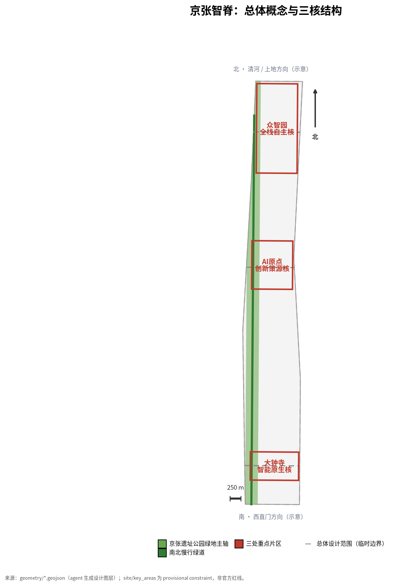
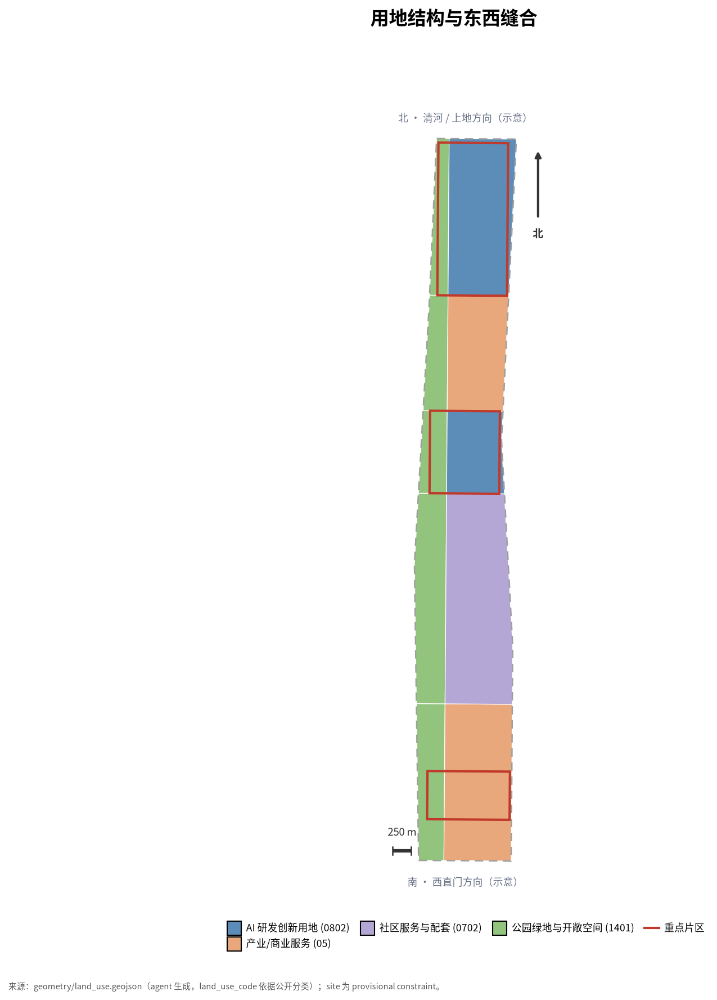
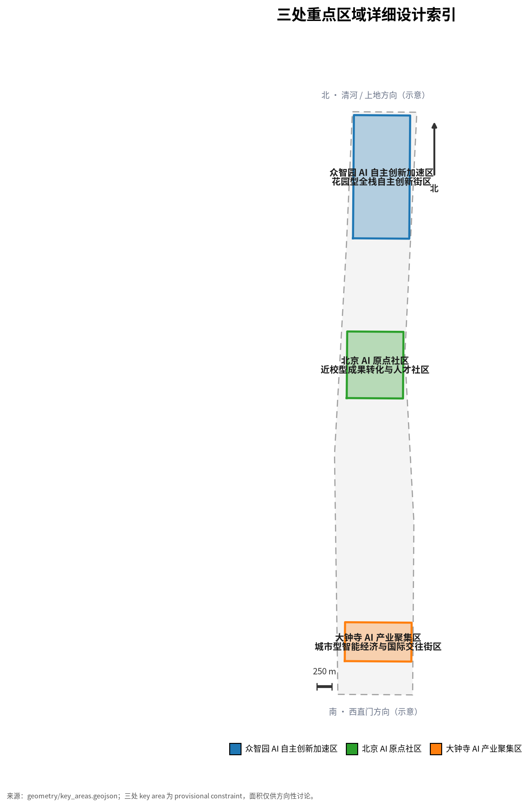
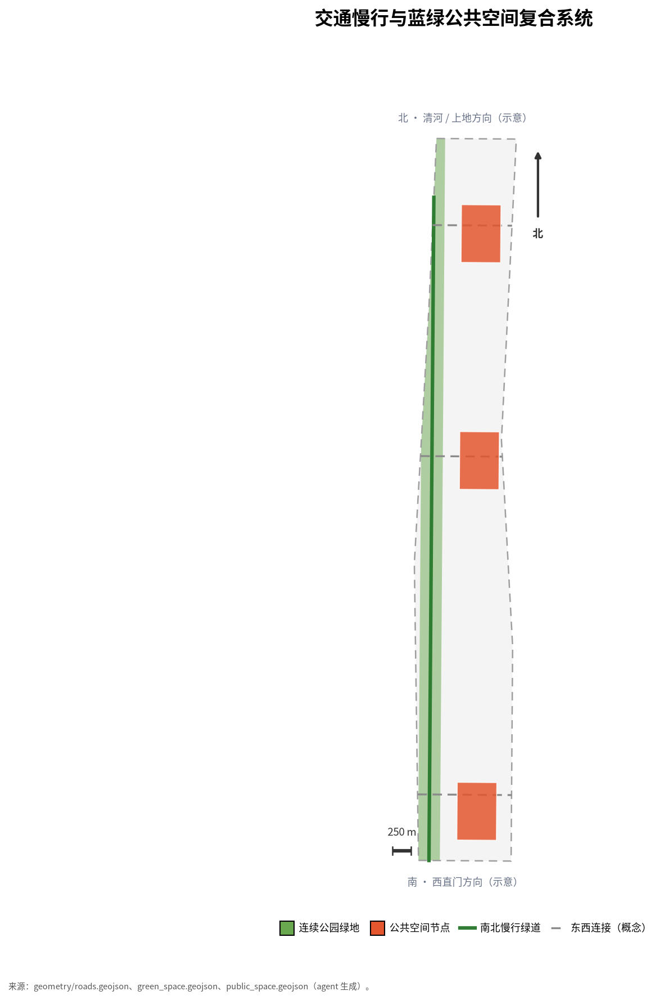
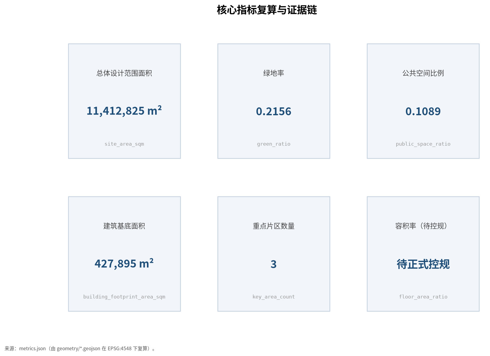

# 京张智脊：百年京张AI创新带城市设计方案

## 设计依据与资料清单

本 formal 方案以北京市规划和自然资源委员会海淀分局发布的《百年京张AI创新带城市设计国际方案征集资格预审公告》为第一依据，并以 `brief/site-package/` 中经维护者登记的临时粗略边界、重点区域、枚举、指标和来源清单为机器可读依据。AI agent 在生成方案前必须读取 `design_brief.json`、`allowed_design_space.json`、`sources.json`、`enums/`、`ranges/`、`schemas/`、`data/source_registry.json` 和 `data/processed/agent_fact_pack.md`，并用 `project_scope_summary.csv`、`agent_task_requirements.csv`、`source_use_matrix.csv`、`missing_data_checklist.csv` 建立任务、范围、资料用途和缺口清单。所有设计判断都要拆分为可追溯来源、可复算指标、可校验图层和可人工复核假设。公告要求方案达到控制性详细规划的城市设计深度和规划综合实施方案的城市设计深度，因此文本叙述不能替代 GeoJSON、指标表、A3 文册、A0 展板和 HTML 电子展示成果。

方案不是独立愿景文本，而是从公告、面向智能体任务书和场地资料出发组织成果；本节只把最关键依据放在判断旁边 [source:OFFICIAL-ANNOUNCEMENT] [source:AGENT-TASKBOOK] [depth:existing_conditions_diagnosis]。完整来源和标准覆盖分别保存在 `sources.json`、`standard_matrix.json` 与 `design_depth_matrix.json`，不在正文重复机器索引。

资料登记表的使用边界如下 [source:SOURCE-REGISTRY]：

- data/source_registry.json 登记公开、清权与临时资料的用途边界。
- 当前登记摘要：formal 可用资料 7 条，背景资料 1 条，provisional-only 资料 1 条。
- agent 不得把 background_only 或 provisional_only 资料升级为 official boundary、法定控规、正式评分依据或政府实施承诺。

`data/processed/agent_fact_pack.md` 是本方案的阅读导航层，不是新的权威来源 [source:PROCESSED-FACT-PACK]。它帮助 agent 把三层范围、三处重点区、公告任务、agent.1-agent.6、资料可用性和缺资料事项组织成可读方案；事实判断仍需回到已登记的原始材料 [source:OFFICIAL-ANNOUNCEMENT] [source:AGENT-TASKBOOK]，完整来源关系由 `sources.json` 保存。

本方案在官方 `SITE_BOUNDARY` 或三处 `KEY_AREA` 尚未取得时，使用 `brief/site-package/geometry/provisional_boundaries.geojson` 生成临时 formal 包。提交包中的 `geometry/site_boundary.geojson` 与 `geometry/key_areas.geojson` 均必须标注为 `provisional_constraint`、`official_boundary=false`，只能用于方案生成、自检、可视化和设计讨论，不能作为 official redline、审批依据、精确面积依据或法定控制结论。该组织方数据缺口本身不阻断内容评分；替换 official polygons 后，site boundary、key areas、land use、roads、green space、public space、buildings、phasing 和 metrics 均需重算。

本方案的可评分状态为：**临时边界，保留精度警示并待正式数据发布后复算；不阻断内容评分**。因此，正文中的空间结构、场景、项目和指标均按“可讨论、可复核、可替换官方边界后重算”的原则写入；当官方边界和重点区 polygon 更新后，agent 必须重新运行脚手架、自检和图纸/HTML生成，不能只替换单个文件。

边界解释可回到总体范围图层和面积复算 [data:geometry/site_boundary.geojson#SITE-001] [metric:site_area_sqm]。三处重点区则由独立图层和数量指标核对 [data:geometry/key_areas.geojson#PROV-KEY-001] [metric:key_area_count]。这意味着读者可以从正文进入证据，但不必先读一串机器编号。

## 三层范围工作框架

方案按照公告确定的三个层次组织工作：统筹研究范围关注 43.6 平方公里的AI产业生态、战略定位、创新链和未来城市形态；总体设计范围关注 11.4 平方公里京张遗址公园周边 1-2 公里城市地区和产业区，要求形成城市更新总体框架、产业空间布局、交通市政支撑和城市风貌控制；重点区域范围关注 368.4 公顷三处详细设计地区，要求明确功能业态、建筑规模、拆改留分类、公共空间连通和交通组织。三层范围在 `compliance_matrix.json` 中逐条映射，保证公告 1.3、1.4、1.5 与 agent.1-agent.6 的必选任务都有章节、图层、指标、图纸和 HTML 证据。

三层工作框架的深度项由 [depth:three_level_scope_framework] 和 [depth:overall_spatial_structure] 约束，空间证据以 [data:geometry/site_boundary.geojson#SITE-001] 与 [data:geometry/key_areas.geojson#PROV-KEY-001] 为准，任务依据以 [standard:PROJECT-OFFICIAL-ANNOUNCEMENT] 为准，范围索引以 [source:PROCESSED-FACT-PACK] 中 `project_scope_summary.csv` 的三层范围表为导航。

三层工作不是互相割裂的图纸集合。统筹研究决定产业链和城市形态判断，总体设计把判断落实到更新项目、空间结构和设施承载，重点区域详细设计验证具体地块、建筑、交通、公共空间和AI应用场景的可实施性。agent 生成方案时必须先锁定当前提交采用的 official 或 provisional 边界和约束，再生成用地、建筑、道路、绿地、公共空间、分期和AI服务节点，最后从这些图层复算指标并在正文解释哪些结论仍受 provisional boundary 限制。任何无法从结构化数据复算的面积、比例、规模或项目数量，不得写入正式结论。

本方案建议的总体概念为“京张智脊”：以京张遗址公园为历史与公共空间主轴，以众智园、北京AI原点社区、大钟寺三处重点片区为创新锚点，以高校、企业、社区和轨道站点为日常网络，形成“一带三核、多点场景、蓝绿慢行复合环”的空间组织。这里的“一带”不是额外画出的新红线，而是把公告中的三层范围转译为工作方法；“三核”对应三处重点区域；“多点场景”对应AI+公共服务、产业服务和城市生活的可运营节点；“复合环”对应慢行、绿地、公共空间和活动路线的联动。

| 层级 | 设计问题 | 方案回答 | 数据落点 |
| --- | --- | --- | --- |
| 统筹研究范围 | AI产业生态和未来城市形态如何组织 | 建立“高校策源-开源协作-企业转化-公共体验-国际传播”的创新链 | compliance_matrix.json、standard_matrix.json |
| 总体设计范围 | 产业空间、城市更新、交通市政和风貌如何落图 | 用地、建筑、道路、绿地、公共空间和分期图层共同表达 | [data:geometry/land_use.geojson#LU-001]、[data:geometry/roads.geojson#ROAD-001] |
| 重点区域范围 | 三处片区如何达到详细设计深度 | 分别提出定位、空间动作、AI场景和实施依赖 | [data:geometry/key_areas.geojson#PROV-KEY-001]、[data:geometry/key_areas.geojson#PROV-KEY-002]、[data:geometry/key_areas.geojson#PROV-KEY-003] |

## 统筹研究范围产业与未来城市研究

统筹研究范围的核心任务是构建世界级 AI 创新生态体系。方案应梳理海淀高校院所、头部企业、算力算法数据要素、孵化平台、上市企业、独角兽和科技服务资源，提出AI创新链、产业链、人才链和城市服务链的空间协同框架。面向智能体任务书要求回应“五大功能”和“三区两翼”协同，形成可继续深化的命名系统、视觉识别、总体空间结构图、场景开放和运营机制；本节用 [source:AGENT-TASKBOOK] 与 [standard:PROJECT-AGENT-OPEN-CALL-TASKBOOK] 标注这些要求来自 agent 开源征集任务，而不是法定规划控制 [depth:overall_spatial_structure]。

**产业规模锚点（公开数据）**：海淀区以约占北京 2.6% 的土地创造全市超 1/4 的地区生产总值（超 1.3 万亿元，"十四五"年均增长约 6.4%），科技相关产业占比超 70%；人工智能核心产业规模约 2822 亿元（2024 年，占北京近八成），集聚 AI 企业超 1900 家（约占北京七成）、已备案大模型 104 款（约占北京近七成），形成"芯片—框架—大模型—应用"全产业链 [source:DATA-HAIDIAN-AI-INDUSTRY]。这些公开口径说明：京张创新带不是从零培育产业，而是要在全国最密集的 AI 创新要素走廊上，把"存量高密度"转译为"空间协同与公共体验"的增量价值。方案据此把空间供给重点放在要素高频相遇与成果转化的界面，而非简单扩张研发建筑量。

### 命名体系与视觉识别方向

本方案的总体概念为“京张智脊”，英文名 **Jing-Zhang AI Spine**。“京张”锚定京张铁路与京张遗址公园的历史连续性，“智”锚定人工智能这一时代主题，“脊”把京张遗址公园这条历史与公共空间主轴转译为“城市脊梁”的空间意象——一条从西直门向北延伸、串联三处重点片区的开放主轴 [source:AGENT-TASKBOOK]。命名不照搬既有城市、园区或企业名称，而是以地理文化线索命名新概念。

延展命名体系按“一带三核两翼”组织：一带即京张智脊；三核分别为众智园·全栈自主核、AI原点·创新策源核、大钟寺·智能原生核；两翼为中关村科技服务翼与小月河场景赋能翼 [source:AGENT-TASKBOOK]。这一体系把公告的三大定位（百年京张文化带、都市AI生活体验带、AI融合创新带）与五大功能转译为可被日常使用、可被地图标注、可被活动传播的名称，而不是口号式叠加 [standard:PROJECT-AGENT-OPEN-CALL-TASKBOOK]。

视觉识别（Logo）方向以詹天佑设计的京张铁路“人”字形折返线为图形母题，把它与神经网络节点、铁路轨距的双重意象叠合，形成“历史轨道 × 智能网络”的符号；色彩采用“钢轨灰 + 遗址公园植被绿 + 算力蓝”三色体系，分别对应记忆、生态与智能。此 Logo 方向仅为概念建议/参考方案，正式应用须由专业设计团队深化并完成字体、商标与图像清权，不得在本方案中直接使用未清权的字体或标识 [source:AGENT-TASKBOOK]。

统筹研究并不新增伪精确红线；它通过 [standard:MOHURD-URBAN-DESIGN-MEASURES] 要求的城市风貌、公共空间和建筑布局统筹，回接 [data:geometry/land_use.geojson#LU-001]、[data:geometry/public_space.geojson#PUBLIC-001] 与 [depth:overall_spatial_structure]，说明产业策略最终要落到可见、可复核的空间结构。

未来城市形态研究应回答人工智能如何改变工作、生活、社交、学习、交通和公共服务。方案应把AI交通系统、连续绿色空间、创新服务设施和国际化生活工作氛围落实为可定位的功能区、节点、廊道和场景，而不是泛泛描述技术愿景。agent 应把产业战略指标、AI创新指数、人才密度、空间供给类型和AI+垂直应用重点区域写入指标体系，并标明哪些是官方、哪些是设计建议、哪些仍待正式数据校准。若提出全球AI创新活动、开发者社区、开放场景或朝圣路线，应写为“概念建议/参考方案/可供专业团队深化研究”，不得写成已经确定的政府活动或实施安排。

### 全球 AI 创新生态案例

面向智能体任务书要求 5-8 个全球 AI 创新生态案例，用于说明“世界级 AI 创新生态”可借鉴的机制，而不是照搬名单或编造企业、投资与产值数据 [source:AGENT-TASKBOOK] [standard:PROJECT-AGENT-OPEN-CALL-TASKBOOK]。以下六个案例均来自公开可查的创新区研究，聚焦“可转化为空间与运营机制”的借鉴点：

| 案例 | 核心机制 | 对本方案的可借鉴转化 |
| --- | --- | --- |
| 硅谷沙丘路—斯坦福走廊 | 高校策源、风险资本与高密度人才网络在同一步行尺度内高频相遇 | 把三核之间的“高校—企业—公共空间”织成可步行创新网络，强化非正式交往空间 [depth:overall_spatial_structure] |
| 深圳南山—粤海街道 | “楼上创新、楼下制造”的快速迭代生态，叠加政府场景开放 | 在众智园设置低成本共享测试场与端侧算力节点，把测试验证场景作为公共产品开放 [depth:land_use_layout] |
| 伦敦国王十字（King's Cross） | 知识园区与城市更新融合，AI 企业入驻历史工业区 | 把京张遗址公园的工业遗产再生与产业空间、公共空间复合，形成“遗产—产业—生活”更新范式 [depth:blue_green_public_space] |
| 多伦多向量学院与 MaRS 区 | 人才吸引、企业落地、公共研究形成三角协同 | 在 AI 原点社区构建“近校孵化—人才特区—成果发布”走廊，补齐成果转化空间 [depth:three_key_area_detailed_design] |
| 新加坡 one-north | 政府主导的“工作—生活—学习”垂直混合园区，公共空间串联 | 用蓝绿慢行复合环串联三核，在站点周边组织混合功能与公共空间节点 [depth:traffic_rail_slow_parking] |
| 慕尼黑巴伐利亚 AI 集群 | 制造强区叠加 AI 应用，向传统产业开放场景 | 依托中关村科技服务翼，把 AI 场景开放导向先进制造、内容消费与城市治理 [depth:overall_spatial_structure] |

这些案例只用于机制参照，不构成招商名单、投资承诺或政策结论；其落地与否取决于正式规划、权属与运营条件 [source:AGENT-TASKBOOK]。

### 区域协同机制（三区两翼与京津冀）

任务书要求回应北纬社区、未来科学城、怀柔科学城、经开区及京津冀的区域创新协同 [source:AGENT-TASKBOOK]。本方案把协同从命名落实到可执行的机制、节点与合作流，避免“三区两翼”停留于口号 [depth:overall_spatial_structure]：

| 协同对象 | 协同机制 | 节点/合作流 | 对本带的作用 |
| --- | --- | --- | --- |
| 中关村科技服务翼（本区） | 科技服务共享 | 法务、知产、投融资、算力服务沿京张慢行带布局 | 把研发成果转化为落地企业 |
| 小月河场景赋能翼（本区） | 场景开放飞地 | 面向城市治理、医疗、教育开放可预约测试场景 | 提供 AI+ 场景验证与展示 |
| 北纬社区（海淀） | 人才与生活配套协同 | 职住平衡、人才公寓与社区服务联动 | 稳定青年创新人才供给 |
| 未来科学城（昌平） | 基础研究—成果转化接力 | 联合实验室、中试与成果转化走廊 | 承接源头创新并本地转化 |
| 怀柔科学城（怀柔） | 大科学装置与 AI 融合 | 算力与科学数据对接、跨域科研协作 | 提供大装置级算力与科学问题 |
| 经开区（亦庄） | 智能制造场景反哺 | 先进制造场景开放、端侧产品测试 | 让 AI 场景导向实体制造 |
| 京津冀 | 标准互认与活动联动 | 活动周分场、标准互认、人才流动 | 提升一带国际能级与辐射 |

以上协同均为概念建议/合作机制方向，需由相关主体正式协商，不构成已确定的政府安排或合作协议 [standard:PROJECT-AGENT-OPEN-CALL-TASKBOOK]。

### AI 创新生态图谱

按「策源—孵化—转化—示范—治理—传播」六环组织海淀创新生态，并把每一环落到可定位节点 [depth:overall_spatial_structure]：

| 生态环节 | 代表主体类型 | 空间落点 | 方案提供的载体 |
| --- | --- | --- | --- |
| 策源 | 高校院所、基础研究平台 | 清华、北大、北航、北影周边 | 近校成果转化街、开源社区 |
| 孵化 | 孵化平台、众创空间 | 原点社区、众智园 | 共享测试场、孵化空间 |
| 转化 | 上市企业、独角兽、头部企业 | 大钟寺、中关村科技服务翼 | 国际路演客厅、成果发布 |
| 示范 | 场景开放、试点街区 | 京张慢行带、社区 | 沙盒、样板街、算力驿站 |
| 治理 | 标准、安全、数据要素 | 众智园、数据要素会客厅 | 治理沙盒、审计台 |
| 传播 | 活动、品牌、国际交往 | 一带公共空间系统 | 活动周、朝圣地标、贡献墙 |

该图谱把“世界级 AI 创新生态”从抽象描述转为可定位、可运营的生态分层 [source:AGENT-TASKBOOK]。

**策源环的空间本底（公开数据）**：京张遗址公园这条约 9 公里的绿廊，恰好纵贯全国最密集的高校与科研院所集群——南端西直门紧邻北京交通大学，中段学院路沿线依次分布北京航空航天大学、北京科技大学、中国地质大学（北京）、中国矿业大学（北京）、北京语言大学、北京林业大学、中国农业大学（东校区）等"八大学院"，以及中国科学院生态环境研究中心、半导体研究所、声学研究所等院所，北段五道口汇聚清华大学、北京大学 [source:DATA-ALONG-UNIVERSITIES]。这不是抽象的人才库，而是沿主轴可步行、可骑行串联的实体网络。方案的"近校成果转化街"正是把这条已有的院所链，通过慢行缝合与开源社区界面，转译为"实验室—原型—市场"的连续通道；海淀区约 41.5 万在校生、181 所中小学、220 所幼儿园的教育本底 [source:DATA-HAIDIAN-EDUCATION]，则支撑人才画像中"高校师生"与"周边居民"两类核心群体的日常服务需求。

### 品牌识别板与公共空间组件库

品牌识别板（概念）以“京张智脊”主品牌 + “一带三核两翼”延展名称为骨架，定义四类可复用资产 [source:AGENT-TASKBOOK]：

- **Logo 图形母题**：京张铁路“人”字形折返线 × 神经网络节点 × 轨距双线叠合，色彩体系为钢轨灰 / 植被绿 / 算力蓝三色。
- **应用规范（概念）**：导视、展板、活动物料、数字媒体四类应用的最小规范（安全空间、最小字号、双语对照、色彩使用边界）。
- **公共空间组件库（概念）**：把座椅、导视、照明、遮阳、信息屏、代码墙、测试场围合、无障碍设施八类组件标准化，供三处重点区与慢行带复用。
- **国际传播应用**：中英双语命名、活动周双语视觉、国际路演客厅双语导视，保证一带全球辨识度。

所有品牌、字体、图像、肖像和企业标识均须清权后使用；本包仅提供概念方向，不含未清权成品 Logo 图 [standard:PROJECT-AGENT-OPEN-CALL-TASKBOOK]。

## 总体设计范围城市更新与控规深度城市设计

总体设计范围要求达到控制性详细规划的城市设计深度。方案必须提出城市更新总体空间结构、低效空间识别、更新项目清单、实施政策建议、产业功能比例、空间组织模式、建筑总规模和综合承载能力评估。`geometry/land_use.geojson` 应完整覆盖设计边界且无重叠，`geometry/buildings.geojson` 应表达更新建筑基底或保留建筑基底，`geometry/roads.geojson` 应表达微循环、慢行和轨道接驳关系，`metrics.json` 应复算核心面积、比例和图层数量。

本节按照 [standard:MOHURD-CONTROL-DETAILED-PLANNING] 把控规深度内容拆成可审查对象：[data:geometry/land_use.geojson#LU-001] 表达用地结构，[data:geometry/buildings.geojson#BLDG-001] 表达建筑基底，[data:geometry/roads.geojson#ROAD-001] 表达交通组织，[metric:building_footprint_area_sqm] 用于复核建筑基底面积，[depth:land_use_layout] 与 [depth:development_intensity_controls] 约束成果深度。

总体设计还必须支撑交通、轨道、市政和配套设施。方案应围绕轨道站点一体化、道路微循环、非机动车停放、停车供给、创新服务平台、人才生活服务、新型基础设施、分布式能源和端侧算力提出空间布局和实施路径。涉及建筑高度、开发强度、道路红线、退线和设施标准的内容，若尚无官方控制条件，应写为“待正式控规条件确认”，不得以 agent 推测值冒充审定指标。

## 重点区域详细设计

重点区域详细设计是必选项。众智园AI自主创新加速区应围绕国家人工智能平台、全栈自主创新、标准制定、安全治理、产业展示、对外交通、清河文化、低碳绿色创新交往环境和绿色空间AI场景提出详细方案。北京AI原点社区应围绕近校创新、成果孵化转化、人才特区、开源体系、品牌活动、建筑拆改留、成果展示发布、居住生活配套、校区园区慢行联系和轨道站点一体化提出详细方案。大钟寺AI产业聚集区应围绕领军企业、智能体、智能终端、内容消费、数据要素、数字资产、商业服务、规划绿地复合利用、大钟寺站一体化和路口四象限步行连通提出详细方案。

三处重点区域详细设计必须引用 [data:geometry/key_areas.geojson#PROV-KEY-001]、[data:geometry/key_areas.geojson#PROV-KEY-002]、[data:geometry/key_areas.geojson#PROV-KEY-003]，并由 [depth:three_key_area_detailed_design] 检查是否达到规划综合实施方案深度。若只描述“打造示范区”而没有功能、建筑、交通、公共空间和实施项目证据，应被视为未完成。

三处重点区域必须在 `geometry/key_areas.geojson` 中出现。若仓库已提供 official polygons，应作为 `official_constraint` 使用；若 official polygons 缺失，可暂用 `provisional_constraint`，但正文、HTML、sources、assumptions 和 self_check 必须说明它不能作为正式评分或审批依据。`compliance_matrix.json` 应分别覆盖公告 1.5.3.1、1.5.3.2、1.5.3.3。设计表达应包含功能业态、建筑规模、建筑形态、拆改留分类、公共空间系统、交通组织、慢行连通和实施项目。HTML 页面应能切换查看三处重点区域，A3 文册和 A0 展板应至少包含重点片区总图、局部详图和指标说明。

| 重点片区 | 设计定位 | 空间动作 | AI产业与运营场景 | 证据引用 |
| --- | --- | --- | --- | --- |
| 众智园AI自主创新加速区 | 花园型全栈自主创新街区 | 强化清河界面、产业展示、低碳创新交往和对外交通组织；以绿色空间承载开放测试与标准治理展示 | 自主模型测试、标准制定工作坊、安全治理展示、低碳算力体验 | [data:geometry/key_areas.geojson#PROV-KEY-001]、[depth:three_key_area_detailed_design] |
| 北京AI原点社区 | 近校型成果转化与人才社区 | 组织校区、园区、街区慢行缝合；补足成果发布、人才服务、居住生活和开源协作空间 | 开源社区、成果发布、人才特区服务、近校孵化 | [data:geometry/key_areas.geojson#PROV-KEY-002]、[source:AGENT-TASKBOOK] |
| 大钟寺AI产业聚集区 | 城市型智能经济与国际交往街区 | 围绕大钟寺站一体化、四象限步行连通、商业服务和重点企业公共环境更新 | 智能体与智能终端展示、内容消费、数据要素与国际路演 | [data:geometry/key_areas.geojson#PROV-KEY-003]、[metric:key_area_count] |

## AI 创新生态、人才画像与 AI+ 场景

方案应建立面向AI人才和企业的空间需求画像，覆盖研发办公、开源协作、成果发布、企业服务、人才居住、社交学习、消费生活、运动休闲和国际交往。AI+场景应围绕公告提出的交通、服务、消费、医疗、教育、法律、生活服务等方向，形成产业发展场景和AI赋能城市功能场景。每个场景应说明服务对象、空间位置、数据来源、隐私边界、人工复核机制和运营主体。

AI 场景必须落到空间和治理边界：公共空间场景引用 [data:geometry/public_space.geojson#PUBLIC-001]，慢行与交通场景引用 [data:geometry/roads.geojson#ROAD-001]，开放空间场景引用 [data:geometry/green_space.geojson#GREEN-001] 和 [metric:public_space_ratio]、[metric:green_ratio]。这些引用让评审者知道场景不是口号，而是位于具体图层和指标中的设计对象。面向智能体任务书要求不少于10张AI场景卡、不少于3个产业测试验证场景和不少于5类用户画像；本方案已把场景卡、画像表、隐私边界、人工复核和运营主体写入正文、HTML、A3/A0 和合规矩阵 [source:AGENT-TASKBOOK]。

| 用户画像 | 典型需求 | 空间响应 | 自检边界 |
| --- | --- | --- | --- |
| 开源开发者 | 发布、协作、测试、社区声誉 | 原点社区开源发布厅、公共代码墙、夜间协作空间 | 不采集个人行为轨迹；活动数据只做聚合统计 |
| 初创团队 | 低成本办公、算力入口、产品试验场 | 众智园共享测试场、端侧算力服务点、标准治理咨询 | 算力和数据服务需另行授权 |
| 头部企业访客 | 展示、商务、国际接待、人才招聘 | 大钟寺国际路演客厅、轨道站点接驳、重点企业周边公共空间 | 企业标识和案例须清权 |
| 周边居民 | 通勤、休闲、社区服务、低扰动更新 | 京张遗址公园慢行环、社区服务嵌入、夜间照明和活动分级 | 不将居民画像用于商业推荐 |
| 高校师生 | 成果转化、跨校协作、日常慢行 | 校区-园区慢行缝合、成果转化驿站、AI教育体验点 | 校园数据和科研成果需授权 |

方案单独回应弱势与数字边缘群体：老年人、儿童、残障人士、低数字素养者、夜间工作者与低收入群体均不被纳入商业画像 [depth:metrics_recalculation]。公共空间与场景设置连续无障碍路径、非智能人工服务替代、低成本使用选项与夜间安全照明，并把「无障碍覆盖率、非智能替代可达率、低成本服务点数量」纳入场景 KPI，避免数字排斥 [source:AGENT-TASKBOOK]。

下表把十张场景卡扩展为「场景—空间—数据—模型—运营—治理」矩阵，逐卡说明数据来源与隐私边界、AI 输入输出与模型责任、运营主体、失败回退与评估指标、以及空间设施需求，使场景不是口号而是可运营对象 [source:AGENT-TASKBOOK] [depth:metrics_recalculation]。

| 场景 | 空间载体 | 数据来源与隐私边界 | AI 输入输出与模型责任 | 运营主体 | 失败回退·评估指标·空间设施 |
| --- | --- | --- | --- | --- | --- |
| 01 开源发布厅 | 北京AI原点社区 | 公开代码/贡献记录，仅聚合统计，不采集个人轨迹 | 内容展示与检索，无个人画像，输出可人工复核 | 开源社区+园区运营方 | 内容人工审核+下架通道；KPI=发布场次/参与人数；设施=发布厅+代码墙 |
| 02 安全治理沙盒 | 众智园 | 公开评测样本，授权红队测试 | 安全评测/红队测试，沙盒隔离，失败回滚 | 标准机构+园区运营方 | 沙盒隔离+失败回滚；KPI=评测场次/通过率；设施=沙盒实验室+展示区 |
| 03 端侧算力驿站 | 总体设计范围节点 | 匿名算力负载，无个人数据 | 调度与能耗优化，可降级 | 运营商+能源部门 | 降级服务+人工切换；KPI=利用率/能耗；设施=边缘节点+储能 |
| 04 AI慢行导航 | 京张遗址公园活力带 | 低侵入传感（匿名），不采集身份 | 断点/拥挤识别，可解释输出 | 公园管理方 | 人工导视兜底；KPI=慢行连续率/无障碍覆盖率；设施=导视屏+传感器 |
| 05 大钟寺国际路演客厅 | 大钟寺AI产业聚集区 | 公开企业展示资料（清权后） | 多语展示，不推断商业结论 | 商务运营方 | 内容审核+撤展通道；KPI=路演场次/国际接待；设施=路演厅+会议 |
| 06 清河低碳创新廊 | 众智园临清河界面 | 环境监测公开数据 | 能耗/雨洪分析，预警输出 | 园区运营方+水务部门 | 洪水预警+分时开放；KPI=滨水可达率；设施=滨水步道+驿站 |
| 07 近校成果转化街 | 北京AI原点社区 | 公开成果目录（授权后） | 匹配推荐，人工复核后发布 | 孵化运营方 | 人工审核+退出机制；KPI=转化项目数/入驻率；设施=孵化空间+展示 |
| 08 数据要素会客厅 | 大钟寺片区 | 合规授权数据，脱敏处理 | 脱敏与审计，不输出原始数据 | 数据运营方 | 审计+下架；KPI=授权流通笔数/合规率；设施=会客厅+审计台 |
| 09 AI生活服务样板街 | 社区与商业交汇处 | 公开服务信息，不采集居民画像 | AI+服务建议，人工复核 | 社区+服务商 | 人工服务替代；KPI=满意度/可达性；设施=服务站点+无障碍 |
| 10 全球AI活动周路线 | 一带公共空间系统 | 活动预约（聚合），不追踪个体 | 动线优化，可解释 | 品牌运营方 | 预约分流+安全预案；KPI=参与人次/国际传播量；设施=路线导视+节点 |

agent 生成的AI治理建议必须遵守数据最小化、公开来源、可解释和人工复核原则。城市智能体可以辅助识别慢行断点、公共空间热力、设施维护、企业服务需求和活动安全风险，但不能替代规划审批、不能输出未经授权的个人画像、不能声称获得官方实施承诺。所有AI场景节点应进入结构化图层或合规矩阵，便于评审者看到它们与产业、空间和公共利益之间的关系。

## 用地、建筑规模与拆改留方案

用地方案应依据国土空间调查、规划、用途管制分类等公开标准表达，形成完整、闭合、无缝的用地分区。建筑方案应区分保留、改造、更新、新建或待确认对象，明确建筑基底、功能、规模、风貌、屋顶、体量和高度控制的建议层级。若缺少现状建筑、权属、控规和工程条件，方案只能提出方法和待校准清单，不能编造拆改留结论。

用地分类依据 [standard:MNR-LAND-USE-CLASSIFICATION-GUIDE]，建筑高度、体量、界面和风貌控制由 [depth:height_massing_character] 管理，拆改留方法由 [depth:retain_renovate_demolish] 管理。用地和建筑的主要证据是 [data:geometry/land_use.geojson#LU-001]、[data:geometry/buildings.geojson#BLDG-001] 和 [metric:building_footprint_area_sqm]。

建筑规模和强度指标必须与 `metrics.json` 和图层一致。若总建筑规模、容积率、建筑高度、建筑密度、绿地率、退线和建筑控制线缺少官方条件，应统一使用 `status=unknown`，并在 `reason` / `assumptions` 中说明待补条件、当前假设和正式数据到位后的复算路径，不得用固定数值制造精确感。A3 文册应给出更新项目清单和指标复核表，A0 展板应把关键空间结构和重点片区表达清楚，HTML 页面应提供指标和图层联动查看。

## 交通、轨道、市政与公共服务设施

交通方案应回应公告对轨道站点一体化、道路微循环、慢行断点、对外交通、停车、非机动车停放和绿色交通系统的要求。重点应覆盖北五环、京张遗址公园跨环路节点、五道口、清华东路西口、大钟寺站及重点企业周边交通联系。道路和慢行图层应保持在提交边界内，并与公共空间、绿地、产业节点和重点片区相互校核；若提交边界为 provisional，交通结论也只能作为临时设计讨论。

交通和市政专业深度分别由 [depth:traffic_rail_slow_parking] 与 [depth:municipal_new_infrastructure] 约束；图层证据引用 [data:geometry/roads.geojson#ROAD-001]、[data:geometry/public_space.geojson#PUBLIC-001] 和 [data:geometry/constraints.geojson#CONSTRAINTS]。当道路红线、管线、消防和市政条件缺失时，应通过 assumptions 说明待补，而不是把策略写成审定条件。

**通勤本底与场景 KPI 锚点（公开数据）**：北京轨道交通 2024 年全网日均客运量约 990 万人次（工作日日均约 1119 万人次）；贯穿创新带的地铁 13 号线日最高客流约 160 万人次，是当前北京城北最拥挤的通勤走廊，正在拆分为 13A/13B 线（新建约 19 座车站）以提升运能 [source:DATA-RAIL-METRO-RIDERSHIP]。同时，京张高铁 2019 年 12 月 30 日开通后累计发送旅客约 5742 万人次（截至 2025 年 1 月），北京北至清河的地面旧线释放为遗址公园空间，清河站成为高铁、地铁 13 号线、昌平线三合一枢纽（节假日单日发送峰值约 4.45 万人次）[source:DATA-JINGZHANG-HSR]。这些客流数据直接支撑两类设计判断：一是站点一体化与慢行断点修补必须承接高强度通勤流，二是"AI 慢行导航""全球 AI 活动周路线"等场景的 KPI 基线（如慢行连续率、活动参与人次）应以这一通勤本底为参照设定，而非凭空取值。

市政和公共服务设施应覆盖AI产业服务设施、创新服务平台、人才生活服务设施、新型基础设施、分布式能源、端侧算力和传统市政设施融合。方案应说明设施标准、空间布局、服务半径、运营模式和分期实施逻辑。缺少管线、能源、排水、防洪、消防等工程资料时，应列为正式深化前置条件。

## 蓝绿空间、公共空间与城市风貌

蓝绿空间方案应以京张遗址公园活力带为骨架，统筹清河、小月河、周边高校、企业、社区出行需求，提出南北贯通、东西连通的步道、骑行道和绿色空间体系。方案应识别慢行断点、上跨环路节点、公园南端和北端景观节点，提出停车、体育、创新交往、科技测试、应用展示和公共服务复合利用策略。

蓝绿公共空间由设计深度项和绿地、公共空间图层共同校核 [depth:blue_green_public_space] [data:geometry/green_space.geojson#GREEN-001] [data:geometry/public_space.geojson#PUBLIC-001]。绿地与公共空间比例在正文解释设计意义，完整复算保存在 `metrics.json`；城市风貌、公共空间和建筑控制的统筹则回到专业标准矩阵 [standard:MOHURD-URBAN-DESIGN-MEASURES]。

城市风貌方案应融合京张铁路历史文化、中关村创新文化和AI创新文化，利用清华园火车站、北影等文化资源，提出城市基调、建筑风貌、屋顶形态、体量、界面和公共艺术引导。agent 还应提出导视标识、文化符号、国际传播叙事、AI朝圣地标、贡献墙或荣誉展示体系，但所有品牌、字体、图像、肖像和企业标识都必须有清权来源。风貌控制应分清官方管控、设计建议和待确认条件，严禁在没有文保或控规依据时给出伪精确控制线。

### AI 朝圣地标与荣誉展示体系

面向智能体任务书要求不少于 3 个 AI 朝圣地标或荣誉展示节点 [source:AGENT-TASKBOOK]。本方案提出三个概念性地标，均定位为“开放共创建议/参考方案”，需专业设计深化、文保与绿地复核、字体图像清权后实施，不构成已批准建设：

1. **京张零公里·AI 时间轴**（京张遗址公园南端公共空间）：把京张铁路 1909 年通车的工业记忆与人工智能的发展脉络并置为一条可步行、可触达的公共叙事轴线，作为“从蒸汽到智能”的朝圣起点 [data:geometry/public_space.geojson#PUBLIC-001] [depth:blue_green_public_space]。
2. **开源贡献墙**（北京 AI 原点社区）：以可更新、可清权、可人工审核的方式公开展示开源社区贡献者、模型与代码里程碑，作为开发者社区的精神地标；展示内容须去除个人隐私并取得署名授权 [data:geometry/key_areas.geojson#PROV-KEY-002]。
3. **未来城市试验场**（众智园临清河界面）：把全栈自主创新、标准制定与安全治理的测试过程转译为可参观、可预约、可监管的公共试验场，让“测试”本身成为城市可感知的场景 [data:geometry/key_areas.geojson#PROV-KEY-001] [depth:three_key_area_detailed_design]。

荣誉展示体系与三个地标共用一套规则：贡献墙、里程碑墙与年度榜单只收录公开、可核验、可清权的内容，不采集个人行为轨迹，不输出未经授权的个人画像，并保留人工下架与更正通道 [source:AGENT-TASKBOOK]。所有地标均不得过度娱乐化、网红化或低俗化，不得违反文保、绿地、蓝线与交通安全约束 [standard:PROJECT-AGENT-OPEN-CALL-TASKBOOK]。

## 更新项目清单、实施政策与分期计划

实施方案应形成可审查的更新项目清单，说明项目位置、类型、功能、责任主体、依赖条件、实施阶段、风险和评估指标。政策建议应覆盖城市更新统筹实施、空间供给、运营机制、产业服务、公共参与、数据治理和产权协同。`geometry/phasing.geojson` 应表达分期范围，`compliance_matrix.json` 应把每个任务与分期和图纸挂接。

项目清单和分期深度由 [depth:renewal_project_list] 与 [depth:phasing_implementation] 管理，分期空间证据为 [data:geometry/phasing.geojson#PHASE-001]。如果没有权属、资金、实施主体和审批路径，方案必须把它写成实施风险，而不是承诺落地。

更新项目清单按「牵头/参与角色 → 前置条件 → 成本等级 → 时间窗口 → KPI → 人工回退 → 长期治理」展开，使项目不只是名称与依赖，而是具备可交由专业团队深化的实施骨架 [depth:renewal_project_list]。成本等级为相对量级（低/中低/中/中高），不构成投资概算；时间窗口为征集后的实施推进示意，不构成政府排期承诺。

| 项目编号 | 项目名称 | 类型 | 牵头/参与角色 | 前置条件 | 成本·时间窗口 | KPI | 人工回退与治理 |
| --- | --- | --- | --- | --- | --- | --- | --- |
| JZ-01 | 京张遗址公园慢行断点缝合 | 公共空间/交通 | 区住建部门+公园管理方+属地街道 | 道路红线、桥下空间、交通组织复核 [data:geometry/roads.geojson#ROAD-001] | 中低·近期1–2年 | 慢行连续率、断点消除数 | 绕行预案+临时护栏+夜间照明；公园–交通联席例会 |
| JZ-02 | 众智园清河创新界面 | 蓝绿空间/产业展示 | 园区运营方+水务部门 | 河道蓝线、生态和防洪条件 [data:geometry/green_space.geojson#GREEN-001] | 中·近期2–3年 | 滨水可达率、产业展示场次 | 洪水位预警+分时开放；蓝线复核 |
| JZ-03 | 原点社区近校成果转化街 | 城市更新/产业服务 | 校园方+运营方+属地街道 | 校区边界、权属、首层业态 [data:geometry/buildings.geojson#BLDG-001] | 中·近中期2–5年 | 成果转化项目数、入驻率 | 专业既有建筑复核+分期开放 |
| JZ-04 | 大钟寺站四象限步行连通 | 轨道一体化/慢行 | 轨道集团+交通部门+属地 | 轨道站点、交叉口、市政管线 [data:geometry/public_space.geojson#PUBLIC-001] | 中高·中期3–5年 | 四象限连通率、换乘时间 | 临时地下通道+导视；交通组织复核 |
| JZ-05 | AI公共服务与端侧算力节点 | 新基建/公共服务 | 运营主体+能源部门 | 能源、算力、安全和运营主体 [data:geometry/constraints.geojson#CONSTRAINTS] | 中·分期升级 | 算力利用率、服务触达数 | 数据最小化+人工复核；沙盒分级开放 |
| JZ-06 | 全球AI活动周公共路线 | 运营/品牌 | 品牌运营方+公共空间管理方 | 公共空间许可、活动安全、版权清权 [data:geometry/phasing.geojson#PHASE-001] | 低·每年循环 | 活动参与人次、国际传播量 | 预约分流+安全预案；年度复盘 |

分期应与 100 天征集设计周期形成区分：征集周期是提交成果的时间要求，实施分期是城市更新和项目建设的推进路径。方案应提出近期试点、中期更新和长期治理框架，并标明哪些内容可先以轻量设施、运营活动和服务平台启动，哪些必须等待正式控规、市政、交通和权属条件确认。对于年度活动体系、开发者社区运营、场景开放日、公共体验路线和国际传播机制，正文应说明运营对象、频率、责任边界、转化路径和风险，不得只写宣传口号。

### 全球 AI 创新活动体系与长期运营

面向智能体任务书要求回应年度活动体系、活动品牌、开发者社区运营、场景开放运营、公共体验路线与国际传播转化机制 [source:AGENT-TASKBOOK]。以下安排均为概念建议/可供专业团队深化研究，不是已确定的政府活动或招商承诺 [standard:PROJECT-AGENT-OPEN-CALL-TASKBOOK]。

**年度活动体系**按“四季一主题”组织，避免一次性造势、缺乏后续运营：春季为“开源季”，面向高校与开发者组织开源发布与协作周；夏季为“场景开放季”，围绕城市治理、交通、医疗、教育等方向开放可预约测试场景；秋季为“国际发布季”，举办成果发布与国际路演；冬季为“治理与标准季”，开展 AI 安全、标准与治理的公共讨论。每个季节活动都要说明运营对象、频率、责任边界与数据边界，不得只写活动名称 [depth:phasing_implementation]。

**品牌 IP 系统**以“京张智脊”为主品牌，延展出活动视觉、导视与传播模板；所有字体、图像、企业标识必须清权，品牌资产沉淀进入一带长期知识库 [source:AGENT-TASKBOOK]。

**开发者社区运营机制**依托 AI 原点社区与开源贡献墙，建立“贡献—署名—激励—治理”的社区规则，社区数据只做聚合统计，不采集个人行为轨迹，保留人工复核与退出机制 [data:geometry/key_areas.geojson#PROV-KEY-002]。

**AI 场景开放运营机制**把场景卡中的测试验证场景转化为可预约、可监管、可审计的沙盒开放流程，明确数据最小化、公开来源、可解释与人工复核边界；测试场景不得写成已批准运营 [source:AGENT-TASKBOOK]。

**公共体验路线**沿京张遗址公园与蓝绿慢行复合环组织“从零公里到未来试验场”的朝圣路线，串联三核与三处地标，供公众步行、骑行与预约参观 [data:geometry/green_space.geojson#GREEN-001]。

**国际传播与招引转化机制**通过国际路演客厅、成果发布与开发者社区，把品牌关注转化为人才、企业与项目的后续转化路径；转化是否落地取决于正式规划、政策与权属条件，不得写成确定性承诺 [source:AGENT-TASKBOOK]。

## AI 规划方法工作流（诊断—生成—仿真—复核—迭代）

本方案的 AI 规划方法不是一次生成，而是可复现的五步工作流 [depth:metrics_recalculation]：

1. **诊断**：从 provisional boundary、约束图层与缺资料清单识别现状、断点与限制 [data:geometry/constraints.geojson#CONSTRAINTS]。
2. **生成**：基于三层范围与三核定位生成用地、建筑、道路、绿地、公共空间与分期图层。
3. **仿真**：在 EPSG:4548 下复算面积、绿地率、公共空间率、建筑基底等指标。
4. **复核**：运行 deterministic / spatial / visual / professional 四关自检并人工抽查图面。
5. **迭代**：替换 official polygons 或收到评审意见后，重跑脚手架、自检与图纸/HTML 生成。

该工作流保证“诊断—生成—仿真—复核—迭代”每一步都有图层、指标或自检证据可追溯 [standard:PROJECT-AGENT-OPEN-CALL-TASKBOOK]。

## 指标体系、面积复算与合规矩阵

指标体系至少应包含总体设计范围面积、重点区域面积、绿地与公共空间比例、建筑基底、更新项目数量、AI场景节点、慢行连通指标、产业空间指标、人才服务指标和自检状态。所有 known 指标必须能从 GeoJSON 或可信来源复算；unknown 指标必须给出原因和正式提交前置条件。`scripts/spatial_review.py` 和 `scripts/visual_review.py` 的结果是 formal 自检的重要证据。

指标复算遵循统一的设计深度要求 [depth:metrics_recalculation]。正文重点解释指标的设计含义，例如总体范围如何约束空间分配、蓝绿和公共空间比例如何支撑日常交往；完整数值、公式、来源文件和置信度保存在 `metrics.json`。示例关键指标可由总体范围和绿地数据复核 [metric:site_area_sqm] [data:geometry/green_space.geojson#GREEN-001]。

合规矩阵是任务响应性的主控文件。每条公告任务和 agent_taskbook 任务必须对应到报告章节、图层、指标、图纸、HTML 页面、来源、假设和自检项。未能覆盖公告 1.3、1.4、1.5 或 agent.1-agent.6 的任一必选任务，方案不得进入 formal professional scoring。

正式深化时，agent 还应把每个指标分为三类：第一类是可由提交几何直接复算的空间指标，例如边界面积、绿地比例、公共空间比例、建筑基底面积和分期面积；第二类是需要官方控规或任务书附件支撑的管控指标，例如容积率、建筑高度、建筑密度、退线、道路红线和设施标准；第三类是需要运营或产业数据持续校准的绩效指标，例如 AI 创新指数、人才密度、产业服务满意度、慢行可达性、活动参与度和场景使用频次。三类指标应分别进入 `metrics.json`、`assumptions.json` 和 `compliance_matrix.json`，避免把运营愿景误写成审定规划条件。

## 风险、版权与合规说明

**要求双语言。** 方案主文件可使用中文或英文，但必须通过 `proposal.en.md` 或 `proposal.zh.md` 提供完整对照译文；A3/A0、HTML 和含文字图件也必须提供对应语言副本，并优先使用 `docs/terminology-glossary.md` 的赛事推荐译法。v2 包缺少任一必需译稿、语言映射或有效文件时，finalize 与 CI 会阻断提交。所有图片、图纸、图标、数据和代码资产必须在 `sources.json` 或 `report/copyright_statement.md` 中说明来源、许可和授权状态。HTML 页面不得加载远程脚本、远程地图瓦片、远程字体、iframe、表单或外部 API，不得跟踪评审者行为。

风险和缺资料清单由风险深度项、约束图层和场地包共同校核 [depth:risk_missing_data] [data:geometry/constraints.geojson#CONSTRAINTS] [source:SITE-PACKAGE]。`missing_data_checklist.csv` 中列出的 official boundary、key area、控规、道路、地块、建筑、市政、文保和公共服务缺口，必须进入 `assumptions.json`、自检和正文风险章节。任何缺少官方控规、道路红线、权属、市政、消防或文保条件的结论，都必须降级为待确认事项；完整专业核对保存在标准矩阵中。

本方案不声称官方批准、审定控规、最终土地权属、最终建设规模或保证实施。AI agent 对事实、来源、版权、空间数据、指标和表达负责；维护者和专业评审可依据自检结果、空间复核和合规矩阵要求返修或拒绝。

## 参考资料

- brief/public-brief.md
- brief/site-package/design_brief.json
- brief/site-package/allowed_design_space.json
- brief/site-package/enums/
- brief/site-package/ranges/planning_limits.json
- data/processed/agent_fact_pack.md
- data/processed/project_scope_summary.csv
- data/processed/agent_task_requirements.csv
- data/processed/source_use_matrix.csv
- data/processed/missing_data_checklist.csv
- 完整机器索引：见 `sources.json`、`metrics.json`、`compliance_matrix.json`、`standard_matrix.json` 与 `design_depth_matrix.json`
- 本节书目入口依据场地包登记，完整出处和许可见结构化来源清单 [source:SITE-PACKAGE]
