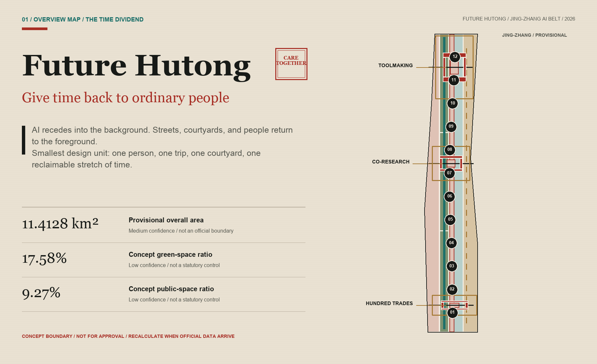
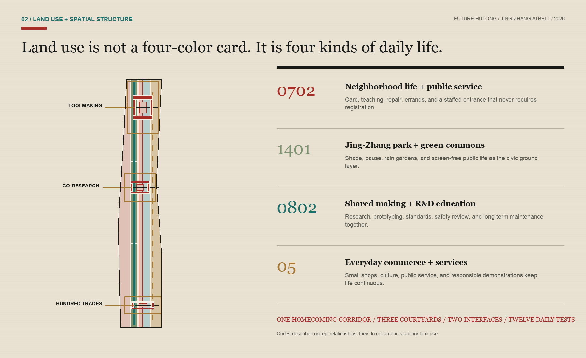
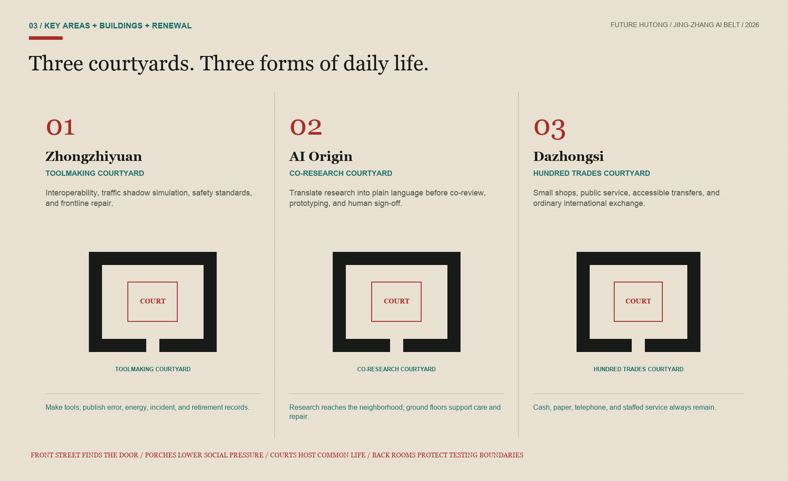
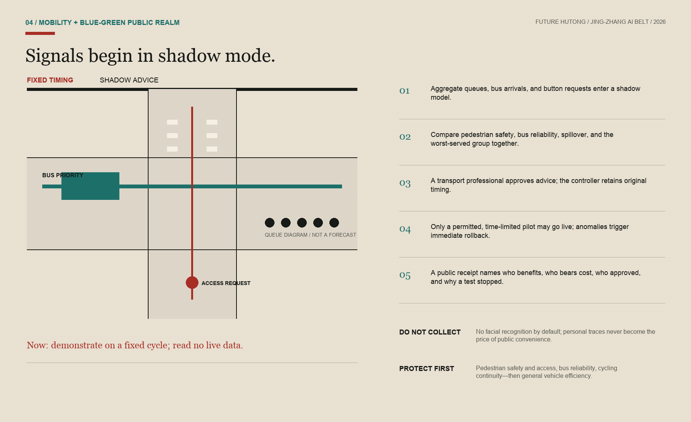
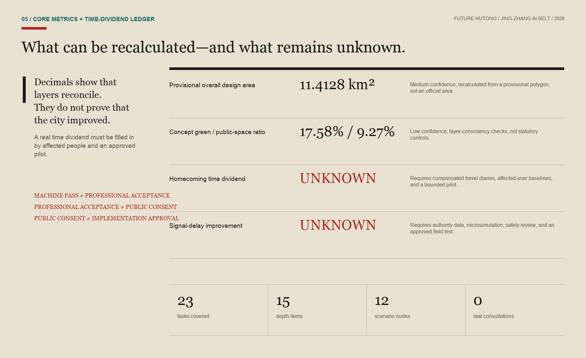

# Future Hutong: An AI Belt That Gives Time Back to Ordinary People

**Future Hutong: An AI Belt That Gives Time Back**

If a future city makes people stay later at work, rush through transfers, and rely more on a new smartphone, then widespread sensors cannot prove that it is smarter. This proposal begins with a common wish: to reduce congestion and allow people to get home a little earlier; to ensure that the benefits of artificial intelligence are fairly accessible to seniors, maintenance workers, small business owners, students, and R&D personnel; and to regenerate places along railway lines where people can sit, meet, converse, and look after each other. AI does not take center stage as a street scene; it remains hidden behind scheduling, interpretation, reminders, and verification. Streets, courtyards, and people still stand at the forefront. [source:PARTICIPANT-DIRECTION]

## Design Basis and Source List

This proposal follows the official announcement's description of the 43.6-square-kilometer Coordinated Research Area, the approximately 11.4-square-kilometer Overall Design Area, and the three key areas. [source:OFFICIAL-ANNOUNCEMENT] The repository task package defines the submission structure, [source:SITE-PACKAGE] while the source registry and provisional spatial data form the machine-readable evidence base. [source:SOURCE-REGISTRY] [source:PROCESSED-FACT-PACK] The six agent tasks, three positionings, five functions, case studies, personas, scenarios, cultural narrative, and operating requirements come from the open taskbook; [source:AGENT-TASKBOOK] they are not presented as statutory planning controls. [standard:PROJECT-OFFICIAL-ANNOUNCEMENT] [standard:PROJECT-AGENT-OPEN-CALL-TASKBOOK]

The current overall boundary and the polygon for the key areas come from provisional rough data from the repository: [source:BOUNDARY-SOURCE] [source:KEY-AREA-SOURCE]. They are all marked as provisional constraints, official boundary=false, and confidence=medium; the area calculated from the Provisional Boundary in EPSG:4548 is approximately 11.4128 square kilometers, which is only for the current composition and self-inspection and should not be interpreted as the Official Planning Boundary or an exact legal area. [data:geometry/site_boundary.geojson#SITE-001] [data:geometry/key_areas.geojson#PROV-KEY-001] [metric:site_area_sqm] No current buildings, road red lines, control plans, ownership, municipal services, fire safety, flood control, cultural heritage protection, population, enterprises, or baseline traffic data have been obtained. The data gaps themselves are part of the design conclusions, not filled with imagination. [depth:existing_conditions_diagnosis]

Public requirements for urban design, regulatory detailed planning, and national land-use classification govern the proposal's level of claim: [standard:MOHURD-URBAN-DESIGN-MEASURES] [standard:MOHURD-CONTROL-DETAILED-PLANNING] [standard:MNR-LAND-USE-CLASSIFICATION-GUIDE]. The architectural design-depth document remains a recorded data gap, so it is a reminder for later professional development—not an approved project-specific basis. [standard:MOHURD-ARCH-DESIGN-DEPTH-2016] This evidence discipline keeps Future Hutong discussable, auditable, and ready for full recalculation when better data arrive, without pretending to be an implementation plan.

### Peer Comparison and Reuse Boundaries

This iteration reviewed merged proposals and open pull requests one by one. It adapts only three mechanisms whose licenses are clear and whose function strengthens the proposal's existing core. It does not borrow another proposal's name, spatial structure, drawings, or complete narrative.

| Peer source | Decision | Narrow adaptation in this proposal |
| --- | --- | --- |
| Jing-Zhang Quiet Intelligence Line CC-BY-4.0 [source:PEER-QUIET-INTELLIGENCE] | Accept | Change "AI to the background" into a **half-day shutdown** during winter: Turn off non-essential AI, and verify on-site that static signage, original timing, paper-based methods, telephone, and manual services can still function independently. |
| Jing-Zhang Choice Line CC-BY-4.0 [source:PEER-CHOICE-LINE] | Accept | Upgrade "Non-AI Entry Point" to **Dual-Path Concurrent Testing**, recording completion, time, direct costs, accessibility, and dignified experience, without replicating their thresholds or brand system. |
| Jing-Zhang The AI Line CC-BY-4.0 [source:PEER-AI-LINE-ACCESSIBILITY] | Accept | Transform accessibility from facility counts into a continuous task chain: from station entrances or neighborhood access points—crossing the street—waiting—service desks must be continuous and co-tested by users with disabilities; do not rely on the author's first-person experience or unverified local data. |
| Jing-Zhang Common Table, The Continuity Line, and The Handover Line — COMMUNITY-DISPLAY-ONLY [source:PEER-COMMON-TABLE-COMPARE] [source:PEER-CONTINUITY-COMPARE] [source:PEER-HANDOVER-COMPARE] | Compare only | Their licenses do not permit derivative reuse, so this proposal does not absorb their food loop, service tiers, restoration timetable, or handover protocol. Shared meals, rollback, and human responsibility in Future Hutong come from the participant's original direction and prior draft. |

Three accepted items are bundled into a set of **three life continuity tests** encompassing traffic, courtyards, and public services: the Shutdown Test, the Equivalence Test, and the Completeness Test. They are not an alternative brand but rather transform the attitude of "AI in the background" into verifiable acceptance actions that can fail, pause, and be repaired.

## Three-Level Scope Framework

The proposal treats the three official scopes as three different scales of inquiry. The Coordinated Research Area asks how an AI ecosystem can return public value to the whole city. The Overall Design Area asks how a long corridor can reconnect commuting, work, care, learning, and neighborhood life. The Key Areas ask how one courtyard, one crossing, or one service window is actually used and maintained. [depth:three_level_scope_framework] The large scale addresses relationships, the middle scale addresses networks, and the small scale addresses thresholds and actions; one diagram enlarged three times cannot stand in for three levels of design.

The overall structure is not the common "one belt and three cores" slogan, but rather **a homecoming corridor, three co-living courtyards, two types of urban interfaces, and twelve daily test points**. The homecoming corridor organizes pedestrian and bicycle paths, shaded areas, transfer points, and neighborhood gateways along the Jing-Zhang Public Space; the three co-living courtyards are located in Zhongzhiyuan, AI Origin, and the temporary focus area of Dazhongsi; technical interfaces connect universities, enterprises, and testing resources, while life interfaces connect residents, merchants, care services, public transportation, and frontline operations; the twelve points only test changes in time, convenience, and relationships that ordinary people can perceive. [depth:overall_spatial_structure] [data:geometry/roads.geojson#ROAD-001] [data:geometry/public_space.geojson#SCN-01]

The "time dividend receipts" run through between layers: each project must specify who spent extra time today, how much time the solution aims to return to that person, whether costs are shifted to another group, and how to restore original services in case of failure. The receipts add three levels of verification: the same task is tested by both AI and non-AI methods; accessibility is checked throughout the entire task chain; and the basic service must still be established after non-essential AI is shut down. Time dividends are not pre-set metrics; return home time, bus fluctuations, pedestrian wait times, human takeovers, and equivalent non-AI services currently lack baselines and must be filled in after public participation and on-site testing. [metric:return_home_time_dividend_minutes] [metric:non_ai_equivalent_service_coverage] [metric:same_task_equivalence_gap] The design layer is merely a spatial assumption; the official polygon must be in place before a full recalculation is done.

## Coordinated Research Area: Industry and Future City Research

The competitiveness of the Jing-Zhang region not only comes from models, computing power, and business density, but also from the ability to turn technology into something that is accessible to everyone, maintainable, and capable of being exited. The proposal suggests a "hundred craftspeople collectively maintaining a shared public intelligence": researchers develop tools, entrepreneurs turn these tools into services, bus drivers, station staff, gardeners, cleaners, repairmen, teachers, healthcare providers, small shop owners, and residents raise real-world issues, and planners, legal experts, ethicists, and accessibility specialists collectively define the boundaries. Each experiment draws on the city's data, space, and public attention, and must return anonymization standards, open APIs, maintenance manuals, accessibility improvements, failure reports, or non-AI service workflows. [source:AGENT-TASKBOOK]

Three key areas form a complementary cycle of industry and life. The northern **Toolmaking Courtyard** focuses on full-stack interoperability, safety evaluation, and green operations; the central **Co-Research Courtyard** focuses on explaining university research, open-source collaboration, startup incubation, and family-friendly work and learning; the southern **Hundred Trades Courtyard** brings AI agents, devices, content, and public services into the everyday routines of small shops, transfers, and community life. Rather than forming an enclave for elites, the three courtyards open to many kinds of work through neighborhood porches, night schools, repair workshops, and staffed service desks. [data:geometry/key_areas.geojson#PROV-KEY-002]

Six global cases are used only to compare mechanisms; their scales and policies are not transferred. Kendall Square shows that an innovation district must also work as a complete neighborhood with public space, [source:CASE-KENDALL] one-north emphasizes the continuous operation of work, life, learning, and social exchange, [source:CASE-ONE-NORTH] and STATION F shows that an ecosystem comes from programs and partners rather than one megastructure. [source:CASE-STATION-F]

Knowledge Quarter demonstrates an inter-institutional knowledge network, [source:CASE-KQ-LONDON] Quayside warns that digital governance still requires public authority, privacy, and existing legal boundaries, [source:CASE-QUAYSIDE] and Seoul DMC shows that rail access can support a digital-industry cluster. [source:CASE-SEOUL-DMC] The local adaptation takes only five principles—mix, openness, continuous operation, public governance, and transport connection—without copying overseas scale, investment, or spatial form.

## Overall Design Area: Urban Renewal and Regulatory-Plan-Level Urban Design

Overall design employs the method of "light demolition first, then adding life": first remove process barriers, enclosure feelings, information asymmetry, and impermeable interfaces, then add liveliness with deployable porches, shared ground floors, corner seats, canopies, drinking fountains, repair stations, and manned windows. Only after the current conditions, ownership, cultural heritage, and safety conditions are verified, do we discuss the retention, renovation, or addition of building entities. The conceptual land use fully covers the Provisional Boundary, with four types of spaces serving the life of the neighborhood, green public spaces, collaborative craftsmanship, and daily business activities, but the classification codes are only used for design structure and do not constitute a legal adjustment of land use. [data:geometry/land_use.geojson#LU-001] [depth:land_use_layout]

"Future Hutong" is not about replicating gray-brick roofs or packaging siheyuans as a tech park. It extracts the truly effective spatial mechanisms of the hutong: a narrow and continuous pedestrian network, a gradual transition from public to private spaces from door to courtyard center, semi-public thresholds that allow visibility but do not force social interaction, small-scale mixed functions, and the warmth of long-term maintenance and a familiar community. Three courtyard prototypes are surrounded by four concept bases that are reusable or reversible, with the courtyard center permanently reserved for ordinary purposes such as sitting, chatting, waiting, communal dining, repairs, and errands. [data:geometry/buildings.geojson#BLDG-001] [data:geometry/public_space.geojson#PUBLIC-002]

Due to the lack of statutory development controls, current as-built surveys, and ownership data, this plan does not provide a Floor Area Ratio, Building Height, density, demolition volumes, setback distances, or commitment to total building scale. [metric:floor_area_ratio] [depth:development_intensity_controls] The Building Footprint area is merely a geometric calculation of twelve conceptual envelopes, used to check courtyard relationships, not as a development capacity or demolition decision. [metric:building_footprint_area_sqm] [depth:height_massing_character] This restraint leaves control to formal planning, professional design, and those affected, rather than letting AI obscure data deficiencies with precise decimals.

## Detailed Design of Key Areas

**Zhongzhiyuan · Toolmaking Courtyard**: Within the provisional key-area extent, the concept combines full-stack interoperability benches, an urban-traffic shadow-simulation lab, a safety-standards court, and a frontline repair workshop. The courtyard shows not only successful models but also error, energy, incident, and retirement records. Tests use synthetic or otherwise cleared data. Robots and physical devices remain speed-limited, time-bounded, supervised, and equipped with a physical emergency stop. Qinghe, Fifth Ring Road, and external-transport relationships remain study questions until official water, road, and engineering data are available. [data:geometry/key_areas.geojson#PROV-KEY-001]

**AI Origin · Co-Research Courtyard**: "Research to neighborhood" becomes the central spatial sequence. Findings are translated into plain language at an explanation table before entering open-source workbenches, community review, small prototypes, and human sign-off. Street-facing ground floors prioritize learning, care, food, repair, and family-friendly spaces so collaboration can happen without postponing the trip home. Wudaokou, Qinghuadongluxikou, and campus links require separate transport and ownership studies. This proposal offers only a conceptual continuous walking route, legible crossings, and service interfaces that never force registration. [data:geometry/key_areas.geojson#PROV-KEY-002]

**Dazhongsi · Hundred Trades Courtyard**: Intelligent tools are tested in the real routines of small shops, public services, accessible transfers, and international visitors. Menu translation, inventory advice, service navigation, and event explanation all require confirmation by the merchant or service worker; cash, paper, telephone, and staffed counters remain available. Pedestrian links across the station's four quadrants, bicycle parking, and signal organization require a separate transport study and are not presented as approved. [data:geometry/key_areas.geojson#PROV-KEY-003] [metric:key_area_count]

The three courtyards follow a spatial gradient of "front street—porch—courtyard—back room": the front street makes access visible, the porch offers a low-pressure place to meet, the courtyard hosts shared activities, and the back room protects professional testing and maintenance. The prototype count is three, but the coordinates, massing, and architectural treatment remain conceptual. [metric:future_hutong_courtyard_count] [depth:three_key_area_detailed_design]

## AI Innovation Ecosystem, Personas, and AI+ Scenarios

Eight composite character profiles are used to identify rights disparities, not demographic statistics: local seniors and caregivers, wheelchair or visually impaired commuters, university researchers and students, startup developers, enterprise product and safety personnel, landscape maintenance and delivery staff, small and micro merchants and community service providers, and international visitors and newly arrived families. Each profile holds the right to not be registered, not to be facial-scanned, to have manual intervention, to provide informed consent, to seek corrections and appeals, and to opt out; any "efficiency improvement" must be reported separately for the most vulnerable groups, and must not be obscured by average values. [depth:risk_missing_data]

Twelve scenario cards are registered as nodes SCN-01 to SCN-12: [data:geometry/public_space.geojson#SCN-12] [metric:ai_scenario_node_count]. Industrial tests include an adaptive-signal shadow test, a civic-agent sandbox, and a full-stack interoperability bench. Everyday scenarios address bus reliability, accessible crossings, neighborhood services, a small-shop digital apprentice, frontline maintenance, research-to-neighborhood explanation, Jing-Zhang memory, equivalent non-AI service, and public algorithm review. Every card records eight items: user, borrowed resources, data boundary, human reviewer, non-AI path, stop condition, maintenance owner, and the public asset returned to the city.

The most critical SCN-01 does not directly take over the traffic signals. First, historical or synthetic aggregate flows support shadow simulation that compares fixed timing, bus priority, pedestrian delay, and emergency options. Then transport, traffic-management, bus, accessibility, and safety professionals review the advice and publish results for the worst-served group. Only an authority-approved, time-limited, reversible pilot could proceed. The system does not default to facial recognition or personal trajectories; the field controller retains human takeover, the original timing plan, and an audit log. [metric:signal_control_peak_delay_reduction] [data:geometry/roads.geojson#ROAD-005]

The proposal's view of AI is simple: tools should serve communication. AI can turn complex options into legible A/B comparisons, translate bus delays into explainable work orders, and carry maintenance knowledge to the next shift. It cannot replace dialogue, responsibility, or consent. No affected resident or worker has yet been interviewed, so every persona and convenience assumption must be corrected through compensated recruitment, preserved minority opinions, and offline feedback before any pilot.

## Land Use, Building Scale, and Retain-Renovate-Demolish Strategy

The land-use layer uses four task-package-permitted codes—0702, 1401, 0802, and 05—to express conceptual relationships among neighborhood services, green commons, research and education, and everyday commerce. [standard:MNR-LAND-USE-CLASSIFICATION-GUIDE] Four zones partition and fully cover the provisional boundary; they neither infer existing land use nor propose statutory rezoning. Public space and green space are expressed through specific design actions: a continuous shaded corridor, three courtyard hearts, and a neighborhood porch. [data:geometry/green_space.geojson#GREEN-001] [data:geometry/public_space.geojson#PUBLIC-001] Their ratios are recalculated from the unioned GeoJSON areas. [metric:green_ratio] [metric:public_space_ratio]

The Demolish–Renovate–Retain Strategy employs a decision tree based on "priority to retain—minimal intervention—evidence last." The first question is whether the existing buildings are safe, legal, and have use and cultural value; the second question is whether the service can be achieved through operations, furniture, first-floor openness, or barrier-free repairs; the third question is for physical renovations; demolition must be proven unavoidable, in the public interest, and supported by ownership and legal procedures. Currently, all twelve building elements are marked as conceptual envelopes, not corresponding to real addresses or demolition targets. [data:geometry/buildings.geojson#BLDG-012] [depth:retain_renovate_demolish]

The aesthetic does not chase neon cyberpunk. Materials favor repairable gray, wood tones, rust red, and plant green, with teal used sparingly for information. Night lighting should make paths and faces legible without disturbing residents. Roofs, height, fire separation, solar access, structure, and underground space all await formal data and professional design. [standard:MOHURD-ARCH-DESIGN-DEPTH-2016] The "future" in Future Hutong comes from fairer services and more maintainable boundaries, not a technological skin.

## Transport, Rail, Municipal Infrastructure, and Public Services

Traffic goals shift from "vehicle speed" to "whether people can get home reliably." The priority order is pedestrian safety and access, bus punctuality and reliable transfers, continuous cycling, emergency access, and only then general vehicle efficiency. Average speed must not come at the cost of safer crossings for seniors or shifted congestion on side streets. The road layer contains a homecoming walking-and-cycling spine, three east-west stitches, and a reliable bus-rail connection; all are conceptual links, not new statutory road redlines. [data:geometry/roads.geojson#ROAD-001] [depth:traffic_rail_slow_parking]

Adaptive signals use a "shadow mode—Human Review—time-limited activation—automatic rollback—public acknowledgment" five-step process. Perception requires only aggregated queueing at the intersection level, bus arrival, button requests, and necessary safety states; original video footage, if used legally by the relevant authorities, does not enter the scheme provider's individual profile. Each timing recommendation should document the target, beneficiaries and affected groups, the human approver, validity period, and rollback conditions. Red light wait times, bus delays, conflict risks, and spillover to adjacent intersections must all be compared simultaneously, without relying on a single measure of throughput to prove success.

Accessibility should not be judged by the number of facilities installed, but by the ability to complete a real task continuously: from the station entrance or neighborhood entrance, through intersections, waiting and transfer areas, and finally to courtyards, shops, or service counters. Physical extensions of green lights, tactile or high-contrast structural indicators, static signage, and manual assistance must still be usable when smart services are unavailable; disabled users should be able to participate in the route and have the right to pause, with any breakpoint causing the task chain to be deemed failed. [source:PEER-AI-LINE-ACCESSIBILITY]

Municipal and public services should follow the principle of "small sites, maintainable, and non-disruptive." Drinking fountains, toilets, charging stations, shade, first aid, care, maintenance, and manned information kiosks are the foundational layer; edge computing, sensors, and digital twins are the replaceable tool layer. Where pipeline, energy, fire safety, flood control, and operational owner data are missing, the constraint layer should remain blank and publicly acknowledged, with no precise controls drawn where they do not exist. [data:geometry/constraints.geojson#CONSTRAINTS] [depth:municipal_new_infrastructure] Formal construction must be completed through separate specialized, permitting, and public processes.

## Blue-Green Network, Public Space, and Urban Character

The blue-green system begins as a homecoming route with places to pause. Three green-space segments provide shade, rain gardens, continuous walking and cycling, drinking water, and quiet seating; three courtyard hearts support shared meals, repairs, waiting for children, and temporary meetings; neighborhood porches extend indoor services into semi-outdoor space so people who do not use smartphones can still see the entrance. [data:geometry/green_space.geojson#GREEN-003] [data:geometry/public_space.geojson#PUBLIC-004] [depth:blue_green_public_space] The Qinghe, Xiaoyuehe, and site park have not yet fully entered the data package, so the blue-green plan does not claim that river blue lines, sponge-city indicators, or permanent structures are ready for implementation.

Public-space social intensity follows a gradient: through-routes support quick passage; porches allow observation and short stays; courtyards invite voluntary participation; professional back rooms require booking and secure boundaries. No space packages mandatory socializing as community vitality or replaces real interaction with camera heat maps. Each courtyard includes at least one no-cost seating area, an accessible pause point, a service path that requires no registration, and a public correction board.

Cultural narrative is "from a hundred artisans jointly building a public railway to a hundred artisans jointly nurturing a set of public intelligence." The railway relies on measurement, signals, schedules, and maintenance to function; today's city AI should also honor the questioner, data managers, annotators, testers, maintainers, users, and those who raise objections. Pilgrimage nodes are not star statues but usable and interrogable institutional spaces: the Zhongzhiyuan Hundred Artisans Scale Court, the Origin Co-creation Institute, the Dazhongsi Public Acknowledgment Corridor, and the retired tool libraries distributed along the route. Specific historical facts, figures, and heritage sites need to be supplemented with authoritative historical sources.

## Renewal Projects, Implementation Policy, and Phasing

Renewal advances through five gates: evidence base, light start, linked courtyards, network formation, and annual retirement. [data:geometry/phasing.geojson#PHASE-001] [depth:phasing_implementation] The evidence-base gate replaces provisional boundaries and adds development controls, building surveys, transport, ownership, heritage, utilities, and affected-user baselines. The light start allows only shadow simulation, removable furniture, staffed service, and three to four bounded sandboxes. Linked courtyards repair access, cycling gaps, and existing ground-floor connections only after approval. Network formation scales only projects that pass safety and public-interest review. Annual re-certification retires obsolete models, equipment, and operators.

The candidate list comprises JZ-01 Homecoming route gap work order, JZ-02 Three courtyard neighborhood porches, JZ-03 Reliable bus transfer and signal shadow test, JZ-04 Equivalent non-AI service desk, JZ-05 Maintenance and learning workshop, JZ-06 Public algorithm jury table, JZ-07 Public benchmark court and retired-tool library, and JZ-08 Half-day shutdown and paired-path test. Each still needs a responsible party, approval path, staff hours, maintenance budget, shutdown cost, and affected-group review; none commits to a schedule or investment. [depth:renewal_project_list]

### Candidate-Project Delivery Ledger

The ledger advances the eight candidates from names to minimum handoff-ready work packages. Every lead role is proposed and unconfirmed. A project may not pass its gate until the corresponding data, approval, and operating commitment exist.

| Project | Proposed lead role (unconfirmed) | Start gate | First auditable evidence | Exit or rollback |
| --- | --- | --- | --- | --- |
| JZ-01 Homecoming route gap work order | Planning and transport team; disabled-user representatives | Official boundary, road ownership, and safety walk | Gap register, complete-task-chain co-test, separate worst-served-group result | Remove temporary markings and restore the prior circulation arrangement |
| JZ-02 Three courtyard neighborhood porches | Public-space operator and ownership coordinator | Ownership consent, fire review, and accessibility check | Pause-and-use record, no-purchase seating, and maintenance hours | Remove movable furniture while preserving original entrances |
| JZ-03 Reliable bus transfer and signal shadow test | Transport authority, bus operator, and traffic professionals | Cleared aggregate data, simulation review, and field permission | Fixed-timing comparison, bus and pedestrian results, worst-group report | Restore original timing immediately and stop field advice input |
| JZ-04 Equivalent non-AI service desk | Named public-service operator | Service inventory, staff roster, and offline channels | Paired-path completion, time, cost, accessibility, and dignity experience | Retain or restore staffed, paper, and telephone service |
| JZ-05 Maintenance and learning workshop | Frontline crew and facility operator | Labor consultation, work-order data boundary, and site safety | Maintenance-knowledge handoff, labor-time change, and no-auto-scoring audit | Return to the prior human work-order flow and export the knowledge record |
| JZ-06 Public algorithm jury table | Accountable service owner, residents, and professional reviewers | Complaint authority, privacy boundary, and recusal rules | Case evidence chain, dissenting views, human decision, and appeal record | Return the case to the existing human complaint process; AI holds no decision right |
| JZ-07 Public benchmark court and retired-tool library | Culture and public-space operator | Content rights, historical fact-checking, and physical safety | Source cards, error and retirement reasons, and public correction record | Withdraw disputed content while preserving a traceable withdrawal record |
| JZ-08 Half-day shutdown and paired-path test | Joint duty team across operators | Approved time window, emergency plan, and continuity checklist | Passing record for static signs, original timing, cash, paper, telephone, and staffed paths | Restore original service immediately; one failed basic path stops further AI expansion |

Annual operations follow a cycle of "Spring City Challenge, Summer Craftsmanship Co-creation, Autumn Street Prototyping, Winter Public Feedback." Problems are addressed with rights and data reviews, tools are tested in a synthetic environment, and pilot projects must have human supervision and non-AI services; during winter, a half-day shutdown is scheduled to disable non-essential AI, to test static signage, original signal configurations, cash, paper, telephone, and manual and emergency pathways; if any basic path fails, address the underlying issues first, before expanding AI. [source:PEER-QUIET-INTELLIGENCE] At the end of the year, success, failure, complaints, repairs, and decommissioning are publicly announced. An honor system recognizes maintainers, evaluators, restorers, and those who proactively halt risky projects, without ranking by funding amount or exposure.

Public engagement cannot begin with the phrase "co-creation" as a form of self-verification. The current number of affected users seeking consultation is zero; the next step should involve publicly recruiting residents, bus and station staff, front-line workers, merchants, seniors, caregivers, and people with disabilities, paying reasonable engagement costs, providing both online and offline channels, and preserving different opinions. Recruiters should use pre-registered tasks to report completion rates, times, direct costs, accessibility breakpoints, and self-reported dignity experiences for each group, using AI and non-AI paths, and by age, occupation, physical condition, and digital literacy; no group should be averaged out and punished. [source:PEER-CHOICE-LINE] Without passing this stage, AI-generated scenarios can only be proposals that need to be corrected by reality.

## Metrics, Area Recalculation, and Compliance Matrix

Recalculable metrics are kept separate from performance targets. The provisional overall area, conceptual building footprint, and conceptual green-space ratio can be recomputed from GeoJSON, [metric:site_area_sqm] [metric:building_footprint_area_sqm] [metric:green_ratio] as can the public-space ratio, key-area count, and courtyard-prototype count. [metric:public_space_ratio] [metric:key_area_count] [metric:future_hutong_courtyard_count]

The AI-scenario-node count comes from the public-space layer; [metric:ai_scenario_node_count] all of these values remain limited by the provisional boundary and design assumptions. The current conceptual green-space ratio is about 0.1758 and the public-space ratio about 0.0927. They are layer-consistency checks, not approved planning controls. [depth:metrics_recalculation]

The time dividend, bus punctuality, and signal-delay improvement remain unknown because there is no field baseline or approved pilot. [metric:return_home_time_dividend_minutes] [metric:signal_control_peak_delay_reduction] Non-AI equivalent coverage and the gap between the two paths for the same task are likewise left blank. [metric:non_ai_equivalent_service_coverage] [metric:same_task_equivalence_gap] Validation uses paired travel diaries, per-person intersection delay, bus-arrival variability, complete accessible task chains, paired-path measurements, human-takeover records, and separate reporting for minority groups. If any group fares worse, a good average cannot justify expanding the pilot.

The compliance matrix covers all 17 announcement tasks plus agent.1 through agent.6, for 23 items in total; the standards matrix covers five mandatory standards and one recorded data gap; the design-depth matrix covers 15 deliverable-depth items. Self-checking confirms only structural, citation, geometric, and display consistency. It does not prove official recognition, engineering feasibility, public acceptance, or implementation approval. Completion requires official data to replace provisional assumptions, affected people to participate and retain the right to refuse, operators to accept long-term maintenance, and failed projects to exit safely.

## Risk, Copyright, and Compliance

Risk and compliance controls explicitly cover public-information boundaries, privacy protection, copyright licenses, implementation risk, and human review; every constraint below must leave an auditable record at pilot, publication, and exit gates.

Main risks include the Provisional Boundary being misread, missing zoning and ownership, unknown conditions of cultural heritage and parks, cost models shifting expenses to side streets, sensor functionality spreading, digital exclusion, innovation districts driving up living costs, vendor lock-in, energy consumption and electronic waste, and operational hollowing out. The response should not be to add more disclaimer text, but to incorporate the limitations into the layers, include them in the scenario termination conditions, and integrate them into annual budgets and public feedback mechanisms. [data:geometry/phasing.geojson#PHASE-003] [depth:risk_missing_data]

Data governance adheres to the principles of necessity, minimization, short retention, explainability, and human accountability. Facial recognition is not the default, and personal cell phone location or trajectory data are not used as tickets to public convenience. AI should not be used to adjudicate complaints, qualifications, medical, or legal issues. Each digital service must provide an equivalent path that does not require an account, a cell phone, or AI; an equivalent path is not a hard-to-find phone number but a genuine service that is comparable in terms of time, cost, dignity, and outcomes.

This scheme does not claim official approval, validation of the control plan, road right-of-way, land ownership, demolition and alteration decisions, engineering feasibility, traffic control permits, or funding. All geometric design proposals are Conceptual Recommendations, and provisional constraints are maintained without official designation. The public HTML does not include remote scripts, map tiles, fonts, API, forms, iframes, or tracking; the figures are original drawings for this project. Collaboration among peers only involves attribution modifications for the three CC-BY-4.0 mechanisms, without copying their text, images, drawings, naming, or spatial framework; the COMMUNITY-DISPLAY-ONLY option is used only for positioning and comparison, and is not for derivative reuse.

## References

The repository's public task draft at `brief/public-brief.md` and its disclosure-boundary note at `brief/README.md` are used only for task context and public-information constraints. Both remain public-draft materials and do not replace the maintainer's formal disclosure review.

The primary official and task-package evidence consists of the Haidian Branch announcement, the repository site package, and the agent taskbook. [source:OFFICIAL-ANNOUNCEMENT] [source:SITE-PACKAGE] [source:AGENT-TASKBOOK] The source registry and processed fact pack trace that evidence chain. [source:SOURCE-REGISTRY] [source:PROCESSED-FACT-PACK] Temporary spatial references serve boundary exploration only. [source:BOUNDARY-SOURCE] [source:KEY-AREA-SOURCE] The concept direction comes from the participant's explicit direction for this iteration, abstracted into the proposal without exposing private files or personal details. [source:PARTICIPANT-DIRECTION]

Every international background case is registered in sources.json with its publisher, access date, and reuse limits. The first group covers Kendall Square, one-north, and STATION F; [source:CASE-KENDALL] [source:CASE-ONE-NORTH] [source:CASE-STATION-F] the second covers Knowledge Quarter, Quayside, and Seoul DMC. [source:CASE-KQ-LONDON] [source:CASE-QUAYSIDE] [source:CASE-SEOUL-DMC] They support mechanism comparison only—not Jing-Zhang land use, scale, transport, investment, or statutory controls. The Chinese A3/A0 set embeds a Noto Sans SC glyph subset under the SIL Open Font License 1.1; the English set uses local Latin fonts and loads no remote font resources. [source:FONT-NOTO-SANS-SC]

Collaborative mechanism attribution and license registration as follows: [source:PEER-QUIET-INTELLIGENCE] [source:PEER-CHOICE-LINE] [source:PEER-AI-LINE-ACCESSIBILITY]. In-transit proposals for comparative purposes only are registered as: [source:PEER-COMMON-TABLE-COMPARE] [source:PEER-CONTINUITY-COMPARE] [source:PEER-HANDOVER-COMPARE]. Collaborative reading does not alter the main thread of this case: AI should step back and return verifiable time, convenience, and neighborhood relationships to ordinary people.

Machine-evidence entry points for boundaries and land use: [data:geometry/site_boundary.geojson#SITE-001], [data:geometry/key_areas.geojson#PROV-KEY-003], [data:geometry/land_use.geojson#LU-004].

Machine-evidence entry points for buildings, roads, and green space: [data:geometry/buildings.geojson#BLDG-012], [data:geometry/roads.geojson#ROAD-005], [data:geometry/green_space.geojson#GREEN-003].

Machine-evidence entry points for public space, constraints, and phasing: [data:geometry/public_space.geojson#SCN-12], [data:geometry/constraints.geojson#CONSTRAINTS], [data:geometry/phasing.geojson#PHASE-003]. Together with metrics, the compliance matrix, standard matrix, design-depth matrix, A3/A0, and offline HTML, these references form a traceable package. Any later data replacement requires rerendering, recalculation, and another self-check.
