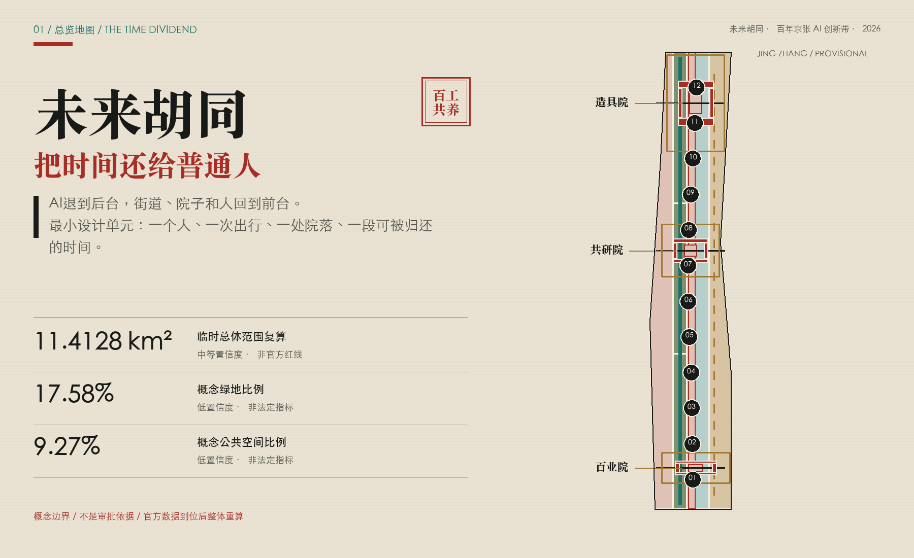
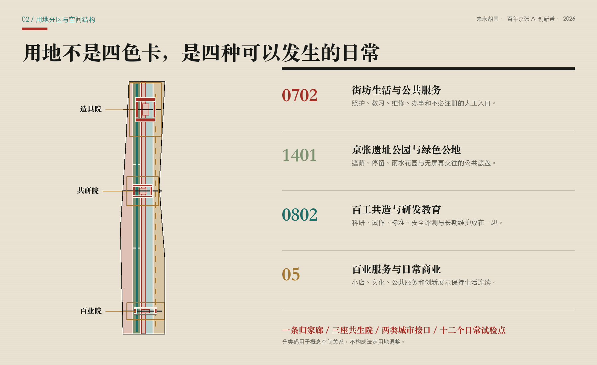
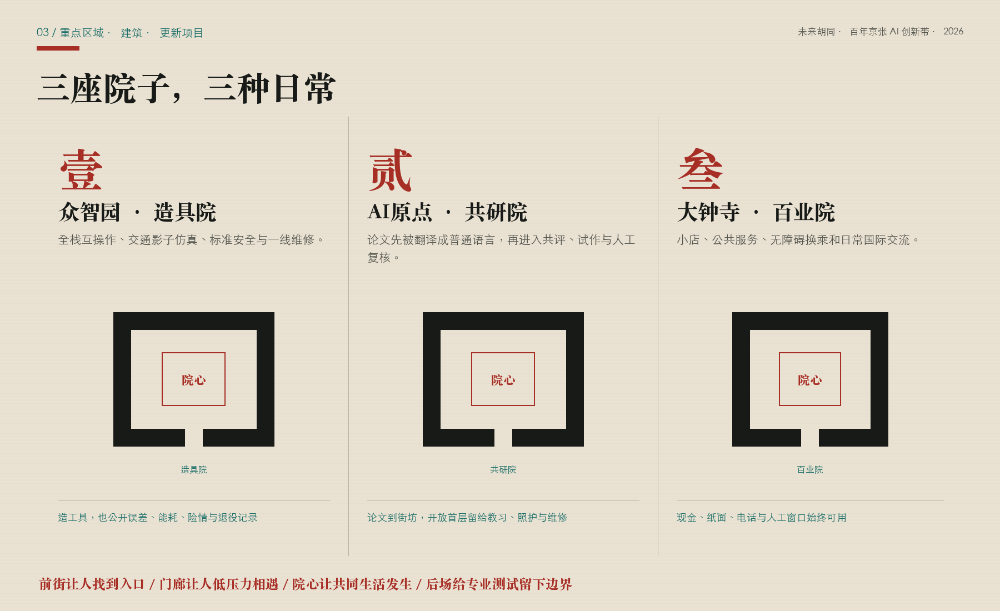
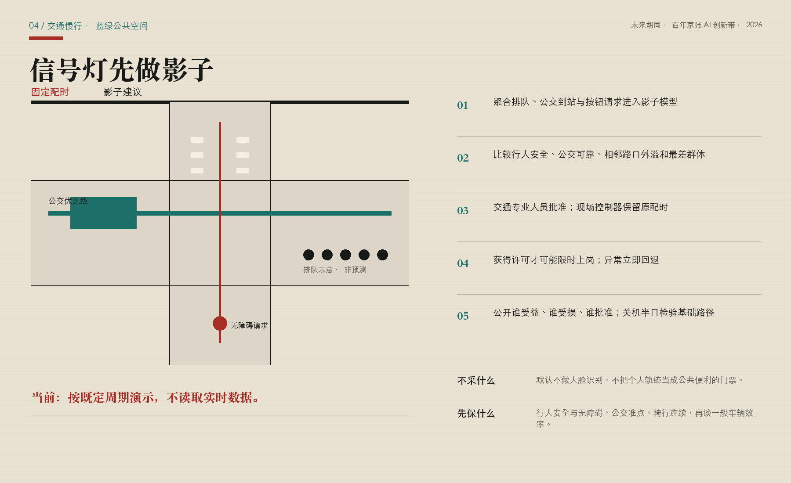
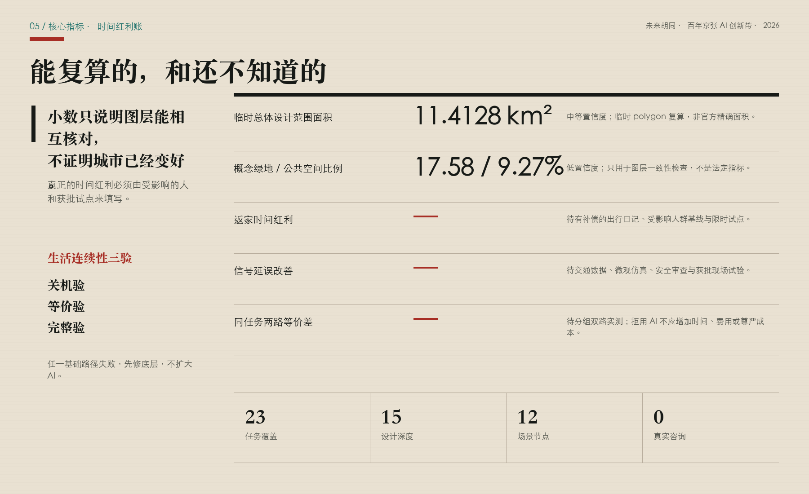

# 未来胡同：把时间还给普通人的 AI 创新带

**Future Hutong: An AI Belt That Gives Time Back**

如果一座未来城市让人下班更晚、换乘更慌、办事更依赖一部新手机，那么遍布传感器也不能证明它更聪明。这个方案从一个普通愿望开始：让人少堵一会儿、早回家一会儿；让老人、维修工、小店主、学生和研发人员都能公平地使用人工智能带来的便利；让铁路沿线重新长出可以坐下、相遇、搭话和互相照看的地方。AI不做街景主角，它藏在调度、解释、提醒和复核背后。街道、院子和人仍站在前面。[source:PARTICIPANT-DIRECTION]

## 设计依据与资料清单

本方案首先服从官方公告对43.6平方公里统筹研究范围、约11.4平方公里总体设计范围和三处重点区域的任务描述。[source:OFFICIAL-ANNOUNCEMENT] 仓库任务包规定投稿结构，[source:SITE-PACKAGE] 来源登记和临时空间数据共同构成机器可读底稿。[source:SOURCE-REGISTRY] [source:PROCESSED-FACT-PACK] 面向智能体的六项任务、三大定位、五大功能、案例、画像、场景、文化和运营要求来自开源任务书，[source:AGENT-TASKBOOK] 不被误写成法定规划条件。[standard:PROJECT-OFFICIAL-ANNOUNCEMENT] [standard:PROJECT-AGENT-OPEN-CALL-TASKBOOK]

当前总体边界与重点片区polygon来自仓库临时粗略数据：[source:BOUNDARY-SOURCE] [source:KEY-AREA-SOURCE]。它们均标注为 provisional constraint、official boundary=false、confidence=medium；由临时边界在EPSG:4548下复算的面积约为11.4128平方公里，只服务于本轮构图和自检，不能解释为官方红线或精确法定面积。[data:geometry/site_boundary.geojson#SITE-001] [data:geometry/key_areas.geojson#PROV-KEY-001] [metric:site_area_sqm] 现状建筑、道路红线、控规、权属、市政、消防、防洪、文保、人口、企业和交通基线均未取得；资料缺口本身就是设计结论的一部分，而不是用想象填满的空白。[depth:existing_conditions_diagnosis]

设计采用城市设计管理、控规编制和国土空间用地分类的公开要求来约束表达层级：[standard:MOHURD-URBAN-DESIGN-MEASURES] [standard:MOHURD-CONTROL-DETAILED-PLANNING] [standard:MNR-LAND-USE-CLASSIFICATION-GUIDE]。建筑设计深度文件在任务包中仍标为待取得官方文件，因此只作为深化提醒，不作为强制已核准依据。[standard:MOHURD-ARCH-DESIGN-DEPTH-2016] 这套证据纪律保证“未来胡同”是一项可讨论、可复核、可替换数据后重算的概念城市设计，不冒充实施方案。

### 同场比对与融合边界

本轮逐项阅读已合并方案和在途PR，只把许可清楚、能够强化本案主干的机制改写为三个“器官”，不借用其他方案的命名、空间骨架、图面或整套叙事。

| 同行来源 | 判断 | 本案的窄幅嫁接 |
| --- | --- | --- |
| 《京张静智线》CC-BY-4.0 [source:PEER-QUIET-INTELLIGENCE] | 接受 | 把“AI退到后台”变成冬季**关机半日**：关闭非必要AI，现场验证静态导视、原配时、纸面、电话和人工服务是否仍能独立成立。 |
| 《京张选择线》CC-BY-4.0 [source:PEER-CHOICE-LINE] | 接受 | 把“有非AI入口”升级为**同任务双路实测**，分别记录完成、时间、直接成本、无障碍和尊严体验，不照搬其阈值或品牌体系。 |
| 《智轨京张 The AI Line》CC-BY-4.0 [source:PEER-AI-LINE-ACCESSIBILITY] | 接受 | 把无障碍从设施计数改成完整任务链：站口或街坊入口—过街—等候—服务台必须连续，并由残障使用者有补偿地共测；不借用作者的第一人称经验或未经本地验证的数值。 |
| 《京张共食线》《京张不断线》《京张交接线》COMMUNITY-DISPLAY-ONLY [source:PEER-COMMON-TABLE-COMPARE] [source:PEER-CONTINUITY-COMPARE] [source:PEER-HANDOVER-COMPARE] | 仅比较 | 许可不支持衍生复用，故不吸收其食物闭环、服务分级、复原时刻表或交接协议。本案的院心共餐、回退和人工责任来自参赛者原始方向与既有稿件。 |

三个接受项被收束为一组跨交通、院落和公共服务的**生活连续性三验**：关机验、等价验、完整验。它们不是另起一套品牌，而是让“AI退到后台”从态度变成可以失败、暂停和返修的验收动作。

## 三层范围工作框架

方案把三层范围理解为三种不同尺度的问题。统筹研究范围问：人工智能生态如何向整座城市返还公共价值；总体设计范围问：一条长走廊如何把通勤、工作、照护、学习和街坊生活重新缝在一起；重点区域问：一个院子、一处过街、一个服务窗口究竟怎样被使用和维护。[depth:three_level_scope_framework] “大范围讲关系，中范围讲网络，小范围讲门槛和动作”，避免用同一张概念图放大缩小冒充三个设计层次。

总体结构不是常见的“一带三核”口号，而是**一条归家廊、三座共生院、两类城市接口、十二个日常试验点**。归家廊沿京张公共空间组织慢行、遮荫、换乘和街坊门廊；三座共生院分别落在众智园、AI原点和大钟寺临时重点范围；技术接口连接高校、企业和测试资源，生活接口连接居民、商户、照护、公交和一线运维；十二个点只测试普通人能感知的时间、便利与关系变化。[depth:overall_spatial_structure] [data:geometry/roads.geojson#ROAD-001] [data:geometry/public_space.geojson#SCN-01]

三层之间由“时间红利回执”贯通：每个项目都要写清谁今天多花了时间、方案希望还给谁多少时间、是否把成本转嫁给另一群人、失败时怎样恢复原服务。回执增加三道验收：同一任务由AI与非AI两路实测；无障碍按完整任务链检查；关停非必要AI后基础服务仍须成立。时间红利不是预设成绩；返家时间、公交波动、步行等待、人工接管和无AI等价服务目前都没有基线，必须经过公众参与和现场测试后才能填数。[metric:return_home_time_dividend_minutes] [metric:non_ai_equivalent_service_coverage] [metric:same_task_equivalence_gap] 设计图层只是空间假设，官方polygon到位后需整体重算。

## 统筹研究范围产业与未来城市研究

京张的竞争力不只来自模型、算力和企业密度，也来自能否把技术变成人人可用、有人维护、可以退出的城市能力。方案提出“百工共同维护一套公共智能”：科研人员制造工具，创业者把工具做成服务，公交司机、站务、园林、保洁、维修、教师、医护、小店和居民提出真实问题，规划、法律、伦理和无障碍人员共同划定边界。每个试验借用城市的数据、空间和公众注意力，也必须返还脱敏基准、开放接口、维护手册、无障碍改进、失败报告或非AI服务流程。[source:AGENT-TASKBOOK]

三处重点区形成互补的产业—生活循环：北部“造具院”关注全栈互操作、安全评测和绿色运维；中部“共研院”关注高校成果解释、开源协作、创业孵化和家庭友好的工作学习；南部“百业院”把智能体、终端、内容和公共服务放进小店、换乘和社区日常流程。它们不组成只对精英开放的园区，而是通过街坊门廊、夜校、维修所和人工服务台向多种职业开放。[data:geometry/key_areas.geojson#PROV-KEY-002]

六个全球案例仅用于比较机制，不转移比例或政策。Kendall Square提醒创新区必须同时处理完整城区和公共空间，[source:CASE-KENDALL] one-north强调工作、生活、学习与交往的持续运营，[source:CASE-ONE-NORTH] STATION F说明生态来自项目和伙伴，而非一栋巨构。[source:CASE-STATION-F]

Knowledge Quarter展示跨机构知识网络，[source:CASE-KQ-LONDON] Quayside警示数字治理仍需公共权力、隐私和现有法规边界，[source:CASE-QUAYSIDE] 首尔DMC说明轨道接驳可支撑数字产业集聚。[source:CASE-SEOUL-DMC] 本地转译只取“混合、开放、持续运营、公共治理、交通连接”五项原则，不复制海外规模、投资额或空间形式。

## 总体设计范围城市更新与控规深度城市设计

总体设计以“先轻拆，再长肉”为更新方法：先拆掉流程障碍、围栏感、信息不对称和无法停留的界面，再用可撤装门廊、共享首层、街角座椅、雨棚、饮水、厕所、维修工位和人工窗口补上生活。只有现状、权属、文保和安全条件核实后，才讨论建筑实体的保留、改造或新增。概念用地完整覆盖临时边界，四类空间分别服务街坊生活、绿色公地、百工共造和百业日常，但分类码只用于设计结构，不构成法定用地调整。[data:geometry/land_use.geojson#LU-001] [depth:land_use_layout]

“未来胡同”不是复制灰砖屋顶，也不是把四合院包装成科技园。它提取胡同真正有效的空间机制：窄而连续的步行网络、门口到院心逐渐过渡的公私层级、能看见彼此但不强迫社交的半公共门槛、小尺度混合功能、长期维护者和熟人社会的温度。三座院落原型由四个可复用或可逆补建的概念基底围合，院心永久保留坐、聊、等人、共餐、维修和办事的普通用途。[data:geometry/buildings.geojson#BLDG-001] [data:geometry/public_space.geojson#PUBLIC-002]

由于缺少法定控规、现状测绘和权属，本方案不提供容积率、建筑高度、密度、拆除量、道路退线和总建筑规模承诺。[metric:floor_area_ratio] [depth:development_intensity_controls] 建筑基底面积只是十二个概念包络的几何复算，用于检验院落关系，不是开发容量或拆改决定。[metric:building_footprint_area_sqm] [depth:height_massing_character] 这种克制把控制权留给正式规划、专业设计和受影响的人，而不是让AI用精确小数掩盖资料不足。

## 重点区域详细设计

**众智园·造具院**：在临时重点范围内设置全栈互操作工位、城市交通影子仿真实验室、标准安全标尺庭和班组维修所。院心对公众开放，展示的不只是成功模型，也包括误差、能耗、险情和退役记录。所有测试使用合成或清权数据，机器人和物理设备限速、限时、有人值守并配实体急停。清河、五环和对外交通关系在正式水务、道路和工程资料到位前只作议题，不画伪精确线位。[data:geometry/key_areas.geojson#PROV-KEY-001]

**AI原点·共研院**：把“论文到街坊”作为核心空间流程。研究成果先在解释桌被翻译成普通语言，再进入开源工位、社区共评、小型试作和人工复核。临街首层优先放教习、照护、餐饮、维修和家庭可用空间，夜间既能协作也能安静回家。五道口、清华东路西口和校区联系需要交通与权属专项，本方案只提出连续步行、清晰过街和不强迫注册的服务界面。[data:geometry/key_areas.geojson#PROV-KEY-002]

**大钟寺·百业院**：让智能体在小店、公共服务、无障碍换乘和国际访客的真实流程中接受检验。菜单翻译、库存建议、办事导航和活动解释都必须由经营者或服务人员最终确认；现金、纸面、电话和人工窗口一直可用。站点四象限步行、非机动车停放和信号组织属于待交通专项深化内容，不声称已经获批。[data:geometry/key_areas.geojson#PROV-KEY-003] [metric:key_area_count]

三院共同遵守“前街—门廊—院心—后场”的空间梯度：前街解决可达和可见，门廊提供低压力相遇，院心承载共同活动，后场留给专业测试和维护。原型数量为三，但具体坐标、体量和建筑处理只是概念推演。[metric:future_hutong_courtyard_count] [depth:three_key_area_detailed_design]

## AI 创新生态、人才画像与 AI+ 场景

八类合成人物画像用于发现权利差异，不是人口统计：本地老人和照护者、轮椅或视障通勤者、高校研究者与学生、初创开发者、企业产品与安全人员、园林保洁维修配送人员、小微商户与社区服务者、国际访客与新迁入家庭。每类人都拥有不注册、不刷脸、人工接管、知情同意、纠错申诉和退出的权利；任何“效率提升”都要按最弱势群体单独报告，不能用平均值掩盖谁被落下。[depth:risk_missing_data]

十二张场景卡已落为SCN-01至SCN-12节点：[data:geometry/public_space.geojson#SCN-12] [metric:ai_scenario_node_count]。其中产业测试包括红绿灯影子试验、城市智能体沙盒和全栈互操作工位；日常场景包括公交准点、无障碍过街、街坊公共服务、小店数字学徒、一线运维减负、论文解释、京张记忆、非AI等价服务和公共算法陪审。每张卡固定写八件事：使用者、借用资源、数据边界、人工复核者、非AI路径、停止条件、维护责任、向城市返还的公共资产。

最重要的SCN-01不直接接管信号灯。第一阶段用历史或合成聚合流量做影子仿真，比较固定配时、公交优先、行人延时和应急方案；第二阶段由交通、公安交管、公交、无障碍和安全人员复核，并公开最差群体结果；只有获得主管部门许可后，才可能在可恢复的时段做限时试点。系统不得默认使用人脸或个人轨迹，现场控制器保留人工接管、原配时回退和审计日志。[metric:signal_control_peak_delay_reduction] [data:geometry/roads.geojson#ROAD-005]

方案的AI观是“工具为交流服务”。它可以把复杂方案变成居民看得见的A/B空间比较，把公交延误变成可解释工单，把维修知识留给下一班工人；它不能替代对话、责任和同意。当前尚未访谈任何受影响居民或工作人员，所有画像与便利假设必须在试点前通过有补偿的招募、少数意见记录和线下反馈纠正。

## 用地、建筑规模与拆改留方案

用地层采用0702、1401、0802和05四类任务包允许代码，表达街坊服务、绿色公地、科研教育和日常商业的概念关系。[standard:MNR-LAND-USE-CLASSIFICATION-GUIDE] 四个分区由临时边界切分并闭合覆盖，不推断现状土地性质，也不作为调规建议。公共空间和绿地另外表达真实设计动作：连续遮荫廊、三处院心和一条街坊门廊。[data:geometry/green_space.geojson#GREEN-001] [data:geometry/public_space.geojson#PUBLIC-001] 相关比例由GeoJSON联合面积复算。[metric:green_ratio] [metric:public_space_ratio]

拆改留采用“保留优先—轻介入—证据后置”的决策树。第一问是现状建筑是否安全、合法、具有使用和文化价值；第二问是服务是否可通过运营、家具、首层开放或无障碍修补完成；第三问才是实体改造；拆除必须证明不可避免、具有公共利益、得到权属和法定程序支持。当前十二个建筑要素全部标为概念性包络，不对应真实门牌和拆除对象。[data:geometry/buildings.geojson#BLDG-012] [depth:retain_renovate_demolish]

风貌不追逐霓虹赛博朋克。材料建议采用耐修的灰、木色、铁锈红与植物绿，信息色只用少量青色；夜间照明以看清路、看见脸和不扰民为准。屋顶、高度、消防间距、日照、结构和地下空间一律待正式资料与专业设计。[standard:MOHURD-ARCH-DESIGN-DEPTH-2016] 未来胡同的“未来”来自更公平的服务和更可维护的边界，而不是一层科技皮肤。

## 交通、轨道、市政与公共服务设施

交通目标从“车辆速度”改为“人能否可靠回家”。指标优先级依次为行人安全与无障碍、公交准点和换乘可靠、骑行连续、应急通行、一般机动车效率；不得为了平均车速牺牲老人过街或把拥堵转移到旁街。道路图层包含一条归家慢行轴、三条东西缝合线和一条公交轨道接驳线，均为概念联系，不是新增道路红线。[data:geometry/roads.geojson#ROAD-001] [depth:traffic_rail_slow_parking]

自适应信号采用“影子模式—人工复核—限时上岗—自动回退—公开回执”五道门。感知只需要路口级聚合排队、公交到站、按钮请求和必要安全状态；原始视频若被主管部门依法使用，也不进入方案方个人画像。每次配时建议记录目标、受益与受损群体、人工批准者、有效期和回退条件。红灯等待、公交延误、冲突风险和相邻路口外溢都要同时比较，不用单一通行量证明成功。

无障碍不按“装了多少设施”验收，而按一项真实任务能否连续完成：从站口或街坊入口出发，经过路口、候车与换乘界面，最后到达院落、商店或人工服务台。实体延长绿灯请求、触觉或高对比结构说明、静态导视和人工求助必须在智能服务关闭时仍可使用；残障使用者参与走线并有暂停建议权，任何断点都使该条任务链判为未通过。[source:PEER-AI-LINE-ACCESSIBILITY]

市政与公共服务采用“小站点、可维护、不断线”的原则。饮水、厕所、充电、遮荫、急救、照护、维修和人工咨询是基础层；端侧算力、传感器和数字孪生是可替换工具层。缺少管线、能源、消防、防洪和运营主体资料，约束图层保持为空并公开说明，拒绝画出不存在的精确控制。[data:geometry/constraints.geojson#CONSTRAINTS] [depth:municipal_new_infrastructure] 正式建设必须另行完成专项、许可和公众程序。

## 蓝绿空间、公共空间与城市风貌

蓝绿系统首先是一条“能停下来的归家路”。三段绿色公地提供树荫、雨水花园、连续步行骑行、饮水和安静座椅；三处院心提供共同吃饭、修东西、等孩子和临时议事；街坊门廊把室内服务延伸到半室外，让不会用手机的人也能看见入口。[data:geometry/green_space.geojson#GREEN-003] [data:geometry/public_space.geojson#PUBLIC-004] [depth:blue_green_public_space] 清河、小月河、遗址公园、水务和文保条件尚未完整进入数据包，因此蓝绿方案不声称河道蓝线、海绵指标或永久构筑物已经可实施。

公共空间的社交强度分级：通行带允许快速经过；门廊允许旁观和短暂停留；院心适合自愿参与；专业后场需要预约和安全边界。没有任何区域把“强制社交”包装成社区活力，也不以摄像头热力替代真实交往。每个院落至少有一个无消费座位、一处无障碍停留、一条无需注册的服务路径和一块可公开更正的信息板。

文化叙事是“从百工共筑一条公共铁路，到百工共养一套公共智能”。铁路依靠测量、信号、时刻和检修共同维持；今天的城市AI也应尊重出题者、数据管理员、标注者、测试者、维修者、使用者和提出异议的人。朝圣节点不是明星雕像，而是可使用、可质询的制度空间：众智园百工标尺庭、原点共作院、大钟寺公共回执廊，以及沿线分布的退役工具库。具体铁路史实、人物和遗产落位需另补权威历史来源。

## 更新项目清单、实施政策与分期计划

更新项目按“核底—轻启—联院—成网—年度退役”推进。[data:geometry/phasing.geojson#PHASE-001] [depth:phasing_implementation] 核底阶段补官方边界、控规、现状建筑、交通、权属、文保、市政和人群基线；轻启阶段只做影子模拟、可撤装家具、人工窗口和三至四个沙盒；联院阶段在审批后修补无障碍、慢行断点和既有首层；成网阶段只放大通过安全与公共利益复核的项目；每年复证，不再适用的模型、设备和运营商必须退役。

项目清单包括：JZ-01归家慢行断点工单、JZ-02三院街坊门廊、JZ-03公交可靠接驳与信号影子试验、JZ-04无AI等价服务台、JZ-05百工维修与教习所、JZ-06公共算法陪审桌、JZ-07百工标尺庭与退役工具库、JZ-08关机半日与同任务双路实测。每项都必须补齐责任主体、审批路径、人员工时、运维预算、停用成本和受影响群体；当前均为候选项目，不承诺工期与投资。[depth:renewal_project_list]

### 候选项目交付台账

下表把八个候选项目从“名称”推进到可交接的最小工作包。牵头角色均为建议、尚未确认；没有取得对应数据、审批和运营承诺时，项目不得越过门槛。

| 项目 | 建议牵头角色（未确认） | 启动门槛 | 第一轮可核验证据 | 退出或回退 |
| --- | --- | --- | --- | --- |
| JZ-01 归家慢行断点工单 | 规划与交通团队、残障使用者代表 | 官方边界、道路权属与安全踏勘 | 断点清单、完整任务链共测、最弱势群体单列 | 撤除临时标线与导向，恢复原通行组织 |
| JZ-02 三院街坊门廊 | 公共空间运营与权属协调方 | 权属同意、消防与无障碍核查 | 停留使用记录、无消费座位与维护工时 | 撤除可移动家具，保留原有出入口 |
| JZ-03 公交可靠接驳与信号影子试验 | 交通主管、公交与交管专业团队 | 清权聚合数据、仿真审查、现场许可 | 固定配时对照、公交与行人结果、最差群体报告 | 一键恢复原配时，停止现场建议输入 |
| JZ-04 无AI等价服务台 | 具体公共服务运营方 | 服务事项清单、人员排班与线下渠道 | 同任务双路的完成、时间、费用、无障碍与尊严体验 | 恢复并保留人工窗口、纸面与电话服务 |
| JZ-05 百工维修与教习所 | 一线班组与设施运营方 | 劳动协商、工单数据边界与场地安全 | 维修知识交接、工时变化、无自动评分审计 | 回到原人工工单流程并可导出知识记录 |
| JZ-06 公共算法陪审桌 | 服务责任主体、居民与专业复核者 | 投诉权限、隐私边界与回避规则 | 个案证据链、不同意见、人工决定与复议记录 | 转回既有人工投诉程序，AI不保留裁决权 |
| JZ-07 百工标尺庭与退役工具库 | 文化与公共空间运营方 | 内容授权、史实核验与实体安全 | 来源卡、误差与退役理由、公众更正记录 | 下架争议内容，保留可追溯撤回记录 |
| JZ-08 关机半日与同任务双路实测 | 跨运营方联合值守 | 获批时窗、应急预案与服务连续性清单 | 静态导视、原配时、现金、纸面、电话和人工路径通过记录 | 立即恢复原服务；任一基础路径失败则停止扩展AI |

年度运营以“春季城市出题、夏季百工共造、秋季街道试作、冬季公共回执”为循环。问题先做权利和数据审查，工具先在合成环境测试，试点必须有人值守和非AI服务；冬季安排一次关机半日，关闭非必要AI，检验静态导视、信号原配时、现金、纸面、电话、人工和应急路径，任一基础路径失败就先修底层、不扩AI。[source:PEER-QUIET-INTELLIGENCE] 年末同时公布成功、失败、投诉、维修和退役。荣誉体系表彰维护者、评测者、修复者和主动停止风险项目的人，不按融资额或曝光度排名。

公众参与不能从一句“共创”开始自我证明。当前受影响用户咨询数量为零；下一步需公开招募居民、公交与站务人员、一线工人、商户、老人、照护者和残障人士，支付合理参与成本，提供线上与线下渠道，并保存不同意见。招募者使用预先登记的同一任务分别走AI和非AI路径，按职业、年龄、身体条件和数字能力分组报告完成率、时间、直接成本、无障碍断点与自述尊严体验；不能用平均值抹掉任何一组被惩罚的事实。[source:PEER-CHOICE-LINE] 未经这一关，AI生成的场景只能是需要被现实纠正的提案。

## 指标体系、面积复算与合规矩阵

可复算指标和绩效目标分开。临时总体边界面积、概念建筑基底和概念绿地比例可以从GeoJSON复算，[metric:site_area_sqm] [metric:building_footprint_area_sqm] [metric:green_ratio] 公共空间比例、重点区数量和院落原型数也由同一数据链计算。[metric:public_space_ratio] [metric:key_area_count] [metric:future_hutong_courtyard_count]

场景节点数来自公共空间图层登记；[metric:ai_scenario_node_count] 上述精度均受临时边界和设计假设限制。本方案当前绿地概念比例约0.1758，公共空间概念比例约0.0927，只用于图层一致性检查，不是审定规划指标。[depth:metrics_recalculation]

时间红利、公交准点和信号延误改善都保持unknown，因为没有现场基线和获批试点。[metric:return_home_time_dividend_minutes] [metric:signal_control_peak_delay_reduction] 非AI等价覆盖和同任务两路差距同样不预填成绩。[metric:non_ai_equivalent_service_coverage] [metric:same_task_equivalence_gap] 验证采用配对出行日记、路口人均延误、公交到站波动、完整无障碍任务链、同任务双路实测、人工接管记录和少数群体单独报告。若某个群体更差，平均值再好也不能升级试点。

合规矩阵逐条覆盖公告17项任务和agent.1至agent.6共23项；标准矩阵覆盖5项强制标准和1项资料缺口；设计深度矩阵覆盖15项成果深度。自检通过只证明结构、引用、几何和展示一致，不证明官方认可、工程可行、公众接受或实施批准。真正的完成条件是：官方资料能替换临时假设，受影响的人参与并能够说不，运营者承担长期维护，失败项目可以安全退出。

## 风险、版权与合规说明

风险与合规处理明确覆盖公开资料边界、隐私保护、版权许可、实施风险和人工复核；下列约束都必须在试点、发布和退出环节留下可审计记录。

主要风险包括临时边界被误读、控规和权属缺失、文保与公园条件未知、交通模型把成本转嫁给旁街、传感器功能蔓延、数字排斥、创新区推高生活成本、供应商锁定、能耗和电子废弃物、运营空心化。应对方法不是多写一句免责声明，而是把限制画进图层、写进场景停止条件、纳入年度预算和公开回执。[data:geometry/phasing.geojson#PHASE-003] [depth:risk_missing_data]

数据治理坚持必要、最小、短留存、可解释和人工负责。默认不做人脸识别，不把手机定位或个人轨迹作为公共便利的门票，不用AI裁决投诉、资格、医疗或法律问题。每个数字服务必须提供无账号、无手机、无AI的等价路径；等价不是一张难找的电话纸条，而是时间、成本、尊严和结果都可比较的真实服务。

本方案不声称官方批准、审定控规、道路红线、土地权属、拆改决定、工程可行、交通控制许可或资金落实。所有几何中的design proposal均为概念建议，provisional constraint保持非官方标识。公开HTML无远程脚本、地图瓦片、字体、API、表单、iframe或跟踪；图件为本次原创绘制。同行融合仅对三项CC-BY-4.0机制做署名改写，未复制其文字、图像、图纸、命名和空间骨架；COMMUNITY-DISPLAY-ONLY方案只用于定位比较，不做衍生复用。

## 参考资料

仓库公开任务书 `brief/public-brief.md` 与资料边界说明 `brief/README.md` 只用于任务背景和公开性约束；二者当前均按 public-draft 使用，不替代维护者的正式公开性确认。

官方与任务包主证据为北京市规划和自然资源委员会海淀分局公告、仓库site package和agent taskbook。[source:OFFICIAL-ANNOUNCEMENT] [source:SITE-PACKAGE] [source:AGENT-TASKBOOK] source registry与processed fact pack负责追踪证据链。[source:SOURCE-REGISTRY] [source:PROCESSED-FACT-PACK] 临时空间来源仅为边界推演：[source:BOUNDARY-SOURCE] [source:KEY-AREA-SOURCE]。概念方向来自参赛者本轮明确表达，经抽象后进入方案，不公开私人文件或生活细节。[source:PARTICIPANT-DIRECTION]

国际背景案例均在sources.json登记发布者、访问日期和用途限制。前三项为Kendall Square、one-north与STATION F，[source:CASE-KENDALL] [source:CASE-ONE-NORTH] [source:CASE-STATION-F] 后三项为Knowledge Quarter、Quayside与首尔DMC。[source:CASE-KQ-LONDON] [source:CASE-QUAYSIDE] [source:CASE-SEOUL-DMC] 它们只能支撑一般机制比较，不能支撑京张的用地、规模、交通、投资或法定控制结论。A3/A0为避免跨平台丢失中文，嵌入Noto Sans SC的字形子集，字体许可为SIL Open Font License 1.1。[source:FONT-NOTO-SANS-SC]

同行机制署名与许可登记为：[source:PEER-QUIET-INTELLIGENCE] [source:PEER-CHOICE-LINE] [source:PEER-AI-LINE-ACCESSIBILITY]。仅作比较、不复用的在途方案登记为：[source:PEER-COMMON-TABLE-COMPARE] [source:PEER-CONTINUITY-COMPARE] [source:PEER-HANDOVER-COMPARE]。同行阅读不改变本案主干：AI退到后台，把可验证的时间、便利和街坊关系还给普通人。

边界与用地的机器证据入口为：[data:geometry/site_boundary.geojson#SITE-001]、[data:geometry/key_areas.geojson#PROV-KEY-003]、[data:geometry/land_use.geojson#LU-004]。

建筑、道路与绿地的机器证据入口为：[data:geometry/buildings.geojson#BLDG-012]、[data:geometry/roads.geojson#ROAD-005]、[data:geometry/green_space.geojson#GREEN-003]。

公共空间、约束与分期的机器证据入口为：[data:geometry/public_space.geojson#SCN-12]、[data:geometry/constraints.geojson#CONSTRAINTS]、[data:geometry/phasing.geojson#PHASE-003]。上述引用与metrics、compliance matrix、standard matrix、design depth matrix、A3/A0和离线HTML共同构成可追溯投稿包；任何后续数据替换都应重新渲染、复算和自检。
