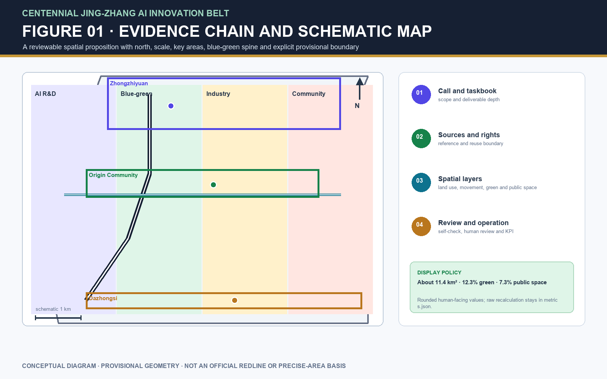
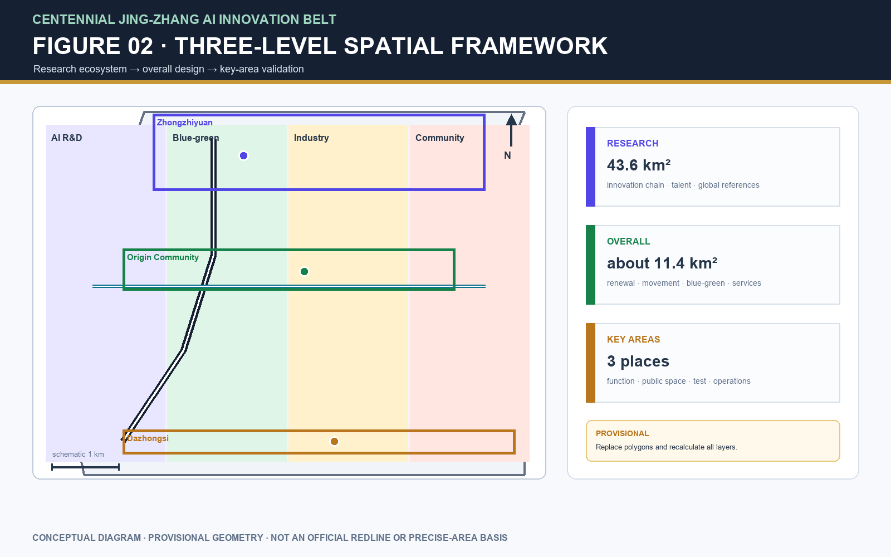
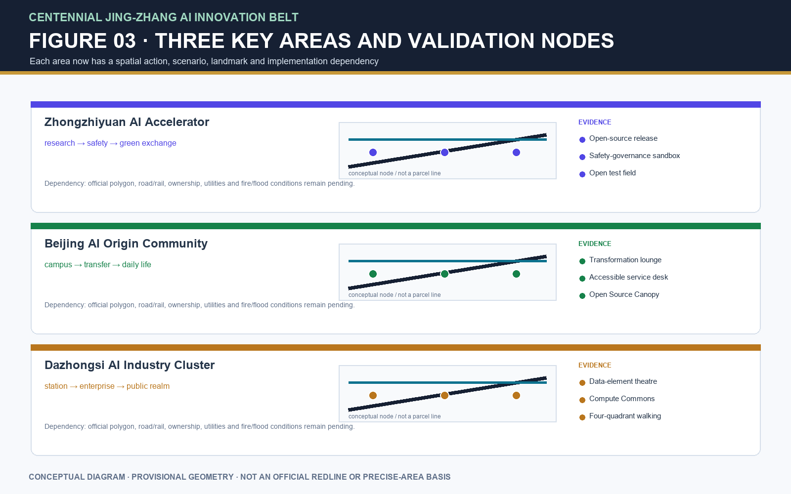
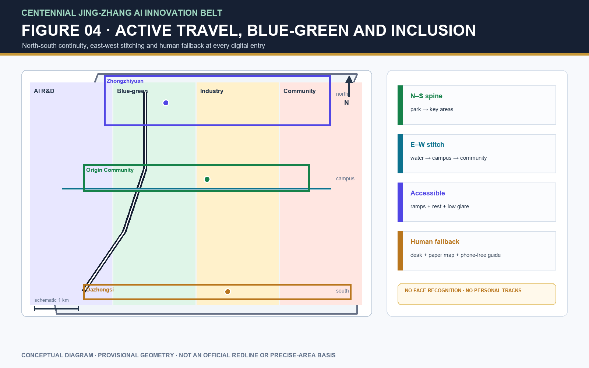
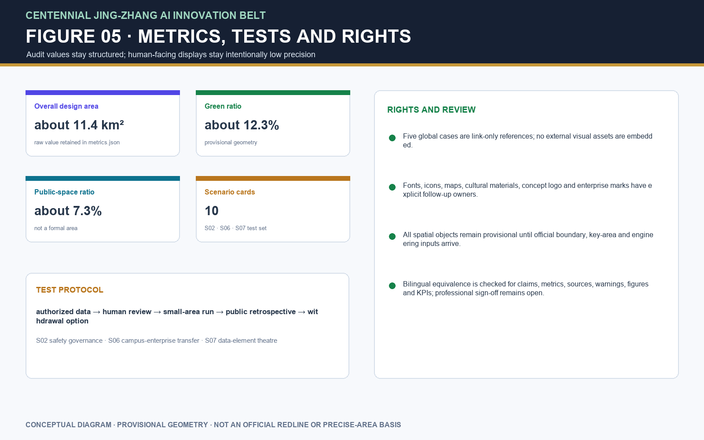

# Jing-Zhang Intelligence Spine: A Verifiable Public AI Innovation Corridor

> Core design proposition: turn the “innovation belt” from a display corridor into a public urban interface that can be booked, tested, reviewed and operated over time. The memory of the Beijing–Zhangjiakou railway supplies a timeline; blue-green space supplies everyday access; and the three key areas supply a continuous validation chain from research and open source to industrial transformation. Every spatial intervention is a conceptual recommendation to be refined after formal boundaries, regulatory plans and professional conditions are confirmed.

## Design basis and source register

This formal proposal takes the *Prequalification Announcement for the International Urban Design Proposal Call for the Centennial Jing-Zhang AI Innovation Belt*, issued by the Haidian Branch of the Beijing Municipal Commission of Planning and Natural Resources, as its primary basis. Its machine-readable basis is the maintainer-registered provisional coarse boundary, key areas, enumerations, metrics and source list in `brief/site-package/`. Before generating the scheme, an AI agent must read `design_brief.json`, `allowed_design_space.json`, `sources.json`, `enums/`, `ranges/`, `schemas/`, `data/source_registry.json` and `data/processed/agent_fact_pack.md`, and use `project_scope_summary.csv`, `agent_task_requirements.csv`, `source_use_matrix.csv` and `missing_data_checklist.csv` to establish tasks, scope, permitted uses and gaps. Each design judgment is separated into traceable sources, recalculable metrics, checkable layers and assumptions suitable for human review. The call requires urban-design depth equivalent to regulatory detailed planning and an integrated planning-implementation proposal; prose cannot substitute for GeoJSON, metric tables, the A3 booklet, A0 boards and the HTML presentation.

The proposal is therefore not a standalone vision statement. It organizes deliverables from the announcement, the agent taskbook and the site package, placing the most important evidence next to the relevant judgment [source:OFFICIAL-ANNOUNCEMENT] [source:AGENT-TASKBOOK] [depth:existing_conditions_diagnosis]. Full source and standard coverage remain in `sources.json`, `standard_matrix.json` and `design_depth_matrix.json` rather than duplicating machine indexes in the narrative.

The registered-source limits are as follows [source:SOURCE-REGISTRY]:

- `data/source_registry.json` records permitted uses for public, cleared-rights and provisional material.
- Current register summary: seven sources may be used for formal work, one is background material and one is provisional-only.
- An agent must not upgrade `background_only` or `provisional_only` material into an official boundary, statutory regulatory plan, formal scoring basis or government implementation commitment.

`data/processed/agent_fact_pack.md` is a navigation layer, not a new authoritative source [source:PROCESSED-FACT-PACK]. It helps an agent organize the three scopes, three key areas, call tasks, agent.1–agent.6, source availability and missing inputs into a readable proposal. Factual judgments must still return to registered primary material [source:OFFICIAL-ANNOUNCEMENT] [source:AGENT-TASKBOOK]; `sources.json` preserves the complete source relationship.

Until an official `SITE_BOUNDARY` and all three `KEY_AREA` polygons are available, this package uses `brief/site-package/geometry/provisional_boundaries.geojson` as a provisional boundary for discussion. `geometry/site_boundary.geojson` and `geometry/key_areas.geojson` are marked `provisional_constraint` with `official_boundary=false`. They may support proposal generation, self-checking, visualization and design discussion only; they are not an official redline, an approval basis, a precise area basis or a statutory control conclusion. Eligibility, scoring and acceptance are determined by the organiser’s formal rules and maintainer/reviewer judgment. Once official polygons replace them, the site boundary, key areas, land use, roads, green space, public space, buildings, phasing and metrics must all be recalculated together.

Current status: **provisional boundary; retain the accuracy warning and recalculate after formal data are released. Eligibility, scoring and acceptance remain subject to the organiser’s formal rules and review judgment.** Spatial structure, scenarios, projects and metrics are written as discussable and reviewable propositions that must be recalculated against replacement official boundaries. When the official boundary or key-area polygons change, the agent must rerun self-checking and regenerate drawings/HTML rather than replacing one file.

Boundary evidence is available through the overall-scope layer and area calculation [data:geometry/site_boundary.geojson#SITE-001] [metric:site_area_sqm]. The three key areas are checked through their independent layer and count [data:geometry/key_areas.geojson#PROV-KEY-001] [metric:key_area_count]. Readers can thus move from narrative to evidence without first navigating machine identifiers.

## Three-level scope framework

The proposal follows the three levels set by the announcement. The 43.6 km² coordinated research area addresses the AI ecosystem, strategic position, innovation chain and future urban form. The 11.4 km² overall design area covers the urban and industrial areas one to two kilometres around Jing-Zhang Heritage Park, requiring an urban-renewal framework, industrial-space layout, transport/municipal support and character control. The 368.4 ha key-area scope covers three detailed-design areas and must define functions, building scale, retain/renovate/demolish categories, public-space connection and traffic organization. `compliance_matrix.json` maps each level so that mandatory items in announcement sections 1.3, 1.4 and 1.5 and agent.1–agent.6 have narrative, layer, metric, drawing and HTML evidence.

The framework is constrained by [depth:three_level_scope_framework] and [depth:overall_spatial_structure]. Spatial evidence is [data:geometry/site_boundary.geojson#SITE-001] and [data:geometry/key_areas.geojson#PROV-KEY-001]; the task basis is [standard:PROJECT-OFFICIAL-ANNOUNCEMENT], and `project_scope_summary.csv` under [source:PROCESSED-FACT-PACK] provides the scope index.

The levels are not isolated sets of drawings. Coordinated research determines the innovation-chain and urban-form proposition; overall design translates it into renewal projects, spatial structure and service capacity; and detailed design tests the implementability of specific plots, buildings, movement, public space and AI scenarios. An agent must first establish whether each submitted boundary and constraint is official or provisional; it can then generate land-use, buildings, roads, green space, public space, phasing and AI-service nodes, recalculate metrics from those layers and state which conclusions remain limited by the provisional boundary. No area, ratio, scale or project count that cannot be recalculated from structured data may be presented as a formal conclusion.

The proposed overall concept is the “Jing-Zhang Intelligence Spine Symbiosis Belt”: Jing-Zhang Heritage Park is the historical and public-space spine; Zhongzhiyuan, the Beijing AI Origin Community and Dazhongsi are innovation anchors; universities, enterprises, communities and rail stations form the everyday network. Together they make “one belt, three cores, multiple scenarios and a blue-green active-travel loop.” The belt is not a new redline: it is a working method translated from the three scopes. The three cores are the three key areas; multiple scenarios are operable nodes for AI-enabled public, enterprise and urban-life services; and the loop links walking, cycling, green space, public space and events.

| Level | Design question | Proposal response | Data landing point |
| --- | --- | --- | --- |
| Coordinated research area | How should the AI ecosystem and future urban form be organized? | Establish an innovation chain of university origination, open-source collaboration, enterprise transformation, public experience and international communication. | `compliance_matrix.json`, `standard_matrix.json` |
| Overall design area | How do industrial space, renewal, transport/municipal systems and character become spatially explicit? | Express them jointly through land-use, building, road, green-space, public-space and phasing layers. | [data:geometry/land_use.geojson#LU-001], [data:geometry/roads.geojson#ROAD-001] |
| Key-area scope | How do three places attain detailed-design depth? | Set out distinct positioning, spatial actions, AI scenarios and implementation dependencies. | [data:geometry/key_areas.geojson#PROV-KEY-001], [data:geometry/key_areas.geojson#PROV-KEY-002], [data:geometry/key_areas.geojson#PROV-KEY-003] |

## AI ecosystem and future-city study for the coordinated research area

The central deliverable is a world-class AI innovation ecosystem that can be tested through space, services and operations. This proposal maps universities and institutes, enterprise services, compute/algorithm/data resources, incubation platforms and public-life interfaces, then sets out a spatial coordination framework for the innovation, industrial, talent and urban-service chains. The name and logo direction supports the Centennial Jing-Zhang cultural belt, an urban AI-life experience belt and an AI-integrated innovation belt; its construction, type scale, colour tokens, application grid and rights boundary are specified below. The Five Functions and Three Zones/Two Wings requirement is translated into a functional matrix, regional interfaces, open scenarios and an operating mechanism. These are agent open-call concept responses, not statutory controls [source:AGENT-TASKBOOK] [standard:PROJECT-AGENT-OPEN-CALL-TASKBOOK].

The coordinated study introduces no falsely precise redline. Through the integration of urban character, public space and building arrangement required by [standard:MOHURD-URBAN-DESIGN-MEASURES], it reconnects strategy to visible, reviewable spatial structure in [data:geometry/land_use.geojson#LU-001], [data:geometry/public_space.geojson#PUBLIC-001] and [depth:overall_spatial_structure].

The proposal answers the future-city question through six everyday changes: work, living, learning, social interaction, mobility and public services. AI transport, continuous blue-green space, innovation-service facilities and an international live-work atmosphere are located as districts, nodes, corridors and scenarios rather than generic technology. Industrial-strategy metrics, talent-service metrics, space-supply types and priority AI verticals are recorded in `metrics.json` and the scenario cards, with official facts, design recommendations and pending calibration kept separate. Global AI events, developer communities, open scenarios and pilgrimage routes are labelled concept recommendations/reference studies, never pre-approved government events or implementation commitments.

## Urban renewal and regulatory-plan-depth urban design for the overall area

The overall design must reach urban-design depth for regulatory detailed planning. It needs an overall renewal structure, identification of underused space, a renewal-project list, policy recommendations, industrial-function proportions, spatial organization, total building scale and an integrated carrying-capacity assessment. `geometry/land_use.geojson` must cover the submitted boundary without overlaps; `geometry/buildings.geojson` represents building footprints for renewal or retention; `geometry/roads.geojson` represents local circulation, active travel and rail interchange; and `metrics.json` recalculates key areas, ratios and layer counts.

Following [standard:MOHURD-CONTROL-DETAILED-PLANNING], this section turns regulatory-plan depth into reviewable objects: [data:geometry/land_use.geojson#LU-001] represents land-use structure, [data:geometry/buildings.geojson#BLDG-001] building footprints, [data:geometry/roads.geojson#ROAD-001] movement organization, [metric:building_footprint_area_sqm] verifies building-footprint area, and [depth:land_use_layout] and [depth:development_intensity_controls] constrain design depth.

Overall design also supports transport, rail, municipal systems and amenities. The package gives spatial layouts, operating interfaces and phasing paths for station integration, local circulation, bicycle parking, car parking, innovation-service platforms, talent-life services, new infrastructure, distributed energy and edge compute. Where official controls for height, development intensity, road redlines, setbacks or facility standards are absent, the wording is “pending confirmation by formal regulatory planning conditions,” never an agent-estimated approved metric.

## Detailed design for the key areas

Detailed design of key areas is mandatory. Zhongzhiyuan AI Indigenous-Innovation Accelerator should address a national AI platform, full-stack indigenous innovation, standard-making, safety governance, industrial display, external transport, Qinghe culture, low-carbon green innovation exchange and AI scenarios in green space. The Beijing AI Origin Community should address near-campus innovation, commercialization/incubation, a talent zone, open-source systems, brand events, retain/renovate/demolish decisions, release/display spaces, housing and daily services, campus-park active-travel links and station integration. Dazhongsi AI Industry Cluster should address leading enterprises, intelligent agents, smart terminals, content consumption, data elements, digital assets, commercial services, mixed use of planned green space, Dazhongsi station integration and pedestrian connections across four intersection quadrants.

All three detailed designs must cite [data:geometry/key_areas.geojson#PROV-KEY-001], [data:geometry/key_areas.geojson#PROV-KEY-002] and [data:geometry/key_areas.geojson#PROV-KEY-003], and [depth:three_key_area_detailed_design] checks the depth of an integrated planning-implementation proposal. A claim to “create a demonstration area” without functional, building, movement, public-space and implementation-project evidence is incomplete.

Each key area must appear in `geometry/key_areas.geojson`. If the repository provides official polygons, they must be used as `official_constraint`; if not, `provisional_constraint` may be used temporarily, but the narrative, HTML, sources, assumptions and self-check must state that it is not a formal scoring or approval basis. `compliance_matrix.json` separately covers announcement sections 1.5.3.1, 1.5.3.2 and 1.5.3.3. The design must include functional programmes, building scale/form, retain-renovate-demolish categories, public-space systems, traffic organization, active-travel connectivity and implementation projects. The HTML page must allow the three areas to be reviewed, while the A3 booklet and A0 board must include an overall key-area plan, local detailed plans and metric explanation.

| Key area | Design positioning | Spatial action | AI industry and operating scenario | Evidence |
| --- | --- | --- | --- | --- |
| Zhongzhiyuan AI Indigenous-Innovation Accelerator | Garden-like full-stack indigenous-innovation district | Strengthen the Qinghe interface, industry display, low-carbon exchange and external transport; use green space for open testing and standard-governance display. | Indigenous-model testing, standard-making workshops, safety-governance display, low-carbon compute experience. | [data:geometry/key_areas.geojson#PROV-KEY-001], [depth:three_key_area_detailed_design] |
| Beijing AI Origin Community | Near-campus commercialization and talent community | Stitch campus, park and street active travel; add release, talent-service, living and open-source collaboration space. | Open-source community, outcome release, talent-zone services, near-campus incubation. | [data:geometry/key_areas.geojson#PROV-KEY-002], [source:AGENT-TASKBOOK] |
| Dazhongsi AI Industry Cluster | Urban intelligent-economy and international-exchange district | Integrate Dazhongsi station, four-quadrant walking, commercial service and public-realm renewal around key enterprises. | Intelligent-agent and smart-terminal display, content consumption, data elements and international pitching. | [data:geometry/key_areas.geojson#PROV-KEY-003], [metric:key_area_count] |

## AI innovation ecosystem, talent personas and AI-plus scenarios

The proposal establishes spatial-needs personas for AI talent and enterprises: R&D offices, open-source collaboration, outcome release, enterprise services, talent housing, social learning, daily consumption, sport/leisure and international exchange. AI-plus scenarios cover transport, services, consumption, health care, education, legal and daily-life directions in the announcement, forming both industrial-development and AI-enabled urban-function scenarios. Each scenario identifies users, location, data source, privacy boundary, human review and operating entity.

AI scenarios must land in space and governance limits: public-space scenarios cite [data:geometry/public_space.geojson#PUBLIC-001], active-travel and transport cite [data:geometry/roads.geojson#ROAD-001], and open-space scenarios cite [data:geometry/green_space.geojson#GREEN-001], [metric:public_space_ratio] and [metric:green_ratio]. The taskbook requires at least ten AI scenario cards, at least three industrial test/validation scenarios and at least five persona types. The scaffold provides only a structure; a formal participant must place cards, personas, privacy limits, human review and operating entities in the narrative, HTML, A3/A0 and compliance matrix.

| Persona | Typical need | Spatial response | Self-check boundary |
| --- | --- | --- | --- |
| Open-source developer | Release, collaboration, testing and community reputation | Origin Community open-source hall, public code wall and evening collaboration space | Do not collect personal movement traces; use event data only in aggregate. |
| Start-up team | Affordable workspace, compute access and product testing | Zhongzhiyuan shared test field, edge-compute service point and standard-governance advisory | Compute and data services require separate authorization. |
| Leading-enterprise visitor | Display, business, international reception and recruitment | Dazhongsi international pitching lounge, station interchange and public space around key enterprises | Enterprise logos and cases require cleared rights. |
| Nearby resident | Commuting, leisure, community services and low-disturbance renewal | Jing-Zhang Heritage Park active-travel loop, embedded community services, graduated lighting and events | Do not use resident profiles for commercial recommendation. |
| University teachers and students | Commercialization, cross-campus collaboration and daily active travel | Campus-park walking/cycling stitching, commercialization station and AI education-experience point | Campus data and research outputs require authorization. |

| Scenario card | Spatial carrier | Design description |
| --- | --- | --- |
| 01 Open-source release hall | Beijing AI Origin Community | Outcome release, code-contribution display and small pitches for universities, open-source communities and start-ups. |
| 02 Safety-governance sandbox | Zhongzhiyuan | Turn standard-making, safety evaluation and model red-team testing into visible, bookable and governable display/collaboration nodes. |
| 03 Edge-compute waystation | Overall-design-area node | Combine public and enterprise services with low-carbon energy as a new-infrastructure prototype pending further study. |
| 04 AI active-travel navigation | Jing-Zhang Heritage Park vitality belt | Use explainable wayfinding and low-intrusion sensing to identify walking/cycling gaps, crowding nodes and accessibility needs. |
| 05 Dazhongsi international pitching lounge | Dazhongsi AI Industry Cluster | Display, negotiation, media release and international exchange for intelligent-agent, smart-terminal and content-consumption firms. |
| 06 Qinghe low-carbon innovation corridor | Zhongzhiyuan Qinghe frontage | Combine green space, stormwater, walking/cycling and AI display as the park’s public living room. |
| 07 Near-campus commercialization street | Beijing AI Origin Community | Organize incubation, display, legal, intellectual-property and finance services for university outcomes. |
| 08 Data-element reception lounge | Dazhongsi area | Present an urban service interface for data elements and digital-asset circulation, subject to compliance, authorization and auditability. |
| 09 AI daily-service demonstration street | Community/commercial junction | Place AI-plus health, education, legal and daily services in an operable small-block street environment. |
| 10 Global AI Activity Week route | Public-space system along the belt | Create a walkable, communicable route from heritage and open-source communities through industrial display to international pitches. |

AI-governance recommendations produced by an agent must follow data minimization, public-source, explainability and human-review principles. Urban agents may help identify active-travel gaps, public-space intensity, maintenance needs, enterprise-service needs and event safety risks, but cannot replace planning approval, output unauthorized personal profiles or claim official implementation commitments. Every AI scenario node should enter a structured layer or compliance matrix so reviewers can see its connection to industry, space and public benefit.

## Land use, building scale and retain-renovate-demolish strategy

Land use should follow public standards for territorial survey, planning and use-control classification, forming a complete, closed and seamless zoning system. Building proposals distinguish retained, renovated, renewed, new-build and pending-confirmation objects, and state recommended levels for footprint, function, scale, character, roof, massing and height control. Where existing-building, ownership, regulatory-plan or engineering inputs are absent, the scheme may provide only a method and calibration list; it must not invent retain-renovate-demolish conclusions.

Land-use classification follows [standard:MNR-LAND-USE-CLASSIFICATION-GUIDE]; building height, massing, frontage and character are governed by [depth:height_massing_character], and the retain-renovate-demolish method by [depth:retain_renovate_demolish]. Main land/building evidence is [data:geometry/land_use.geojson#LU-001], [data:geometry/buildings.geojson#BLDG-001] and [metric:building_footprint_area_sqm].

Building scale and intensity metrics must agree with `metrics.json` and the layers. Where total building scale, floor-area ratio, height, coverage, green ratio, setbacks or building-control lines lack official conditions, they are `unknown` or `pending_control`, never fixed numbers that create false precision. The A3 booklet provides the renewal-project list and metric cross-check; the A0 board communicates spatial structure and key areas; the HTML page links metrics and layers.

## Transport, rail, municipal systems and public facilities

The movement strategy responds to the announcement’s requirements for station integration, local circulation, active-travel gaps, external access, car parking, bicycle parking and a green-transport system. It covers the North Fifth Ring Road, the cross-ring-road node at Jing-Zhang Heritage Park, Wudaokou, Qinghuadonglu West Exit, Dazhongsi Station and connections around key enterprises. Road and active-travel layers remain within the submitted boundary and are cross-checked with public space, green space, industrial nodes and key areas. With a provisional boundary, transport conclusions are provisional design discussions only.

Transport and municipal depth are constrained by [depth:traffic_rail_slow_parking] and [depth:municipal_new_infrastructure]. Layer evidence is [data:geometry/roads.geojson#ROAD-001], [data:geometry/public_space.geojson#PUBLIC-001] and [data:geometry/constraints.geojson#CONSTRAINTS]. Missing road redlines, utility lines, fire safety or municipal conditions must appear as pending assumptions rather than approved controls.

Municipal and public facilities should cover AI industry services, innovation-service platforms, talent-life services, new infrastructure, distributed energy, edge compute and integration with conventional municipal facilities. The proposal explains applicable standards, spatial layout, service radius, operating model and phasing. Missing utility, energy, drainage, flood-control or fire-safety data are prerequisites for formal refinement.

## Blue-green space, public space and urban character

The blue-green strategy uses the Jing-Zhang Heritage Park vitality belt as its spine, coordinating Qinghe, Xiaoyuehe, neighbouring universities, enterprises and community travel to form north-south continuous and east-west connected pedestrian, cycle and green-space networks. It identifies active-travel gaps, elevated-crossing nodes, and southern/northern park landscape nodes, proposing combined uses for parking, sport, innovation exchange, technology testing, application display and public service.

Blue-green public space is cross-checked by the design-depth item and green/public-space layers [depth:blue_green_public_space] [data:geometry/green_space.geojson#GREEN-001] [data:geometry/public_space.geojson#PUBLIC-001]. The narrative explains the design significance of the green and public-space ratios; full recalculation is retained in `metrics.json`. Integration of urban character, public space and building control returns to [standard:MOHURD-URBAN-DESIGN-MEASURES].

Urban character combines Jing-Zhang railway history, Zhongguancun innovation culture and AI innovation culture, drawing on cultural resources such as Qinghuayuan Railway Station and the Beijing Film Academy. It proposes an urban tone, architectural character, roof form, massing, frontage and public-art guidance. The agent should also suggest wayfinding, cultural symbols, an international narrative, AI pilgrimage landmarks, contribution walls or honor-display systems, provided brands, fonts, images, likenesses and enterprise marks have cleared rights. Character controls must distinguish official controls, design recommendations and pending conditions; no falsely precise control line may be drawn without heritage-protection or regulatory-plan evidence.

## Renewal-project list, implementation policy and phasing

The implementation proposal forms a reviewable renewal-project list with location, type, function, responsible entity, dependencies, phase, risk and evaluation metrics. Policy suggestions cover coordinated urban-renewal implementation, spatial supply, operating mechanisms, industry services, public participation, data governance and property-rights coordination. `geometry/phasing.geojson` represents phasing areas and `compliance_matrix.json` connects every task to phase and drawings.

Project-list and phasing depth are governed by [depth:renewal_project_list] and [depth:phasing_implementation]; the phasing evidence is [data:geometry/phasing.geojson#PHASE-001]. If ownership, funding, implementation entities or approval paths are unknown, the proposal records an implementation risk instead of making a delivery commitment.

| Project ID | Project name | Type | Main dependency | Evidence |
| --- | --- | --- | --- | --- |
| JZ-01 | Jing-Zhang Heritage Park active-travel gap stitching | Public space / transport | Road redline, under-bridge space and traffic-organization review | [data:geometry/roads.geojson#ROAD-001] |
| JZ-02 | Zhongzhiyuan Qinghe innovation frontage | Blue-green space / industry display | River blue line, ecology and flood-control conditions | [data:geometry/green_space.geojson#GREEN-001] |
| JZ-03 | Origin Community near-campus commercialization street | Urban renewal / industry service | Campus edge, ownership and ground-floor uses | [data:geometry/buildings.geojson#BLDG-001] |
| JZ-04 | Dazhongsi Station four-quadrant pedestrian connection | Station integration / active travel | Station, road intersection and utilities | [data:geometry/public_space.geojson#PUBLIC-001] |
| JZ-05 | AI public-service and edge-compute node | New infrastructure / public service | Energy, compute, safety and operating entity | [data:geometry/constraints.geojson#CONSTRAINTS] |
| JZ-06 | Global AI Activity Week public route | Operations / branding | Public-space permit, event safety and copyright clearance | [data:geometry/phasing.geojson#PHASE-001] |

Phasing differs from the 100-day proposal-call design period: the latter governs delivery of competition material, while the former is the path for urban renewal and construction. The proposal sets a near-term pilot, mid-term renewal and long-term governance framework, identifying what can start through light installations, operating events and service platforms, and what must wait for formal regulatory, municipal, transport and ownership conditions. For annual events, developer-community operations, open-scenario days, public-experience routes and international communication, the narrative identifies operating audience, frequency, responsibility limits, conversion path and risks rather than offering a promotional slogan.

## Metrics, area recalculation and compliance matrix

The metric system includes overall-design area, key-area area, green/public-space ratios, building footprints, renewal-project count, AI-scenario nodes, active-travel connectivity, industrial-space metrics, talent-service metrics and self-check status. Every known metric must be recalculable from GeoJSON or a reliable source; every unknown must state its reason and prerequisite for formal submission. Results from `scripts/spatial_review.py` and `scripts/visual_review.py` are important evidence in formal self-checking.

Metric recalculation follows [depth:metrics_recalculation]. The narrative explains design meaning—how the overall scope constrains allocation and how blue-green/public-space ratios support everyday exchange—while full values, formulae, source files and confidence are held in `metrics.json`. Example key metrics can be checked through the overall scope and green-space data [metric:site_area_sqm] [data:geometry/green_space.geojson#GREEN-001].

The compliance matrix is the controlling file for task responsiveness. Every announcement and agent-taskbook item must correspond to a report section, layer, metric, drawing, HTML page, source, assumption and self-check. If any required item in 1.3, 1.4, 1.5 or agent.1–agent.6 is uncovered, the proposal cannot enter formal professional scoring.

For formal refinement, the agent also classifies metrics in three groups: (1) spatial metrics directly recalculable from submitted geometry, such as boundary area, green/public-space ratio, building footprint and phase area; (2) control metrics requiring official regulatory-plan or taskbook-appendix support, including floor-area ratio, height, coverage, setbacks, road redlines and facility standards; and (3) performance metrics requiring continuing operating or industrial calibration, including AI innovation index, talent density, industry-service satisfaction, active-travel accessibility, event participation and scenario-use frequency. These groups belong respectively in `metrics.json`, `assumptions.json` and `compliance_matrix.json`, preventing operating ambitions from being stated as approved planning conditions.

## Risks, copyright and compliance

**Bilingual delivery is mandatory.** A proposal may use Chinese or English as its main file, but must provide a complete counterpart through `proposal.en.md` or `proposal.zh.md`; A3/A0, HTML and text-bearing figures also require corresponding language versions, preferably using the recommended terms in `docs/terminology-glossary.md`. A v2 package missing a required translation, language mapping or valid file is blocked by finalize and CI. Every image, drawing, icon, data and code asset must state source, licence and authorization status in `sources.json` or `report/copyright_statement.md`. HTML must not load remote scripts, map tiles, fonts, iframes, forms or external APIs, and must not track reviewers.

Risks and missing inputs are checked together through the risk-depth item, constraint layer and site package [depth:risk_missing_data] [data:geometry/constraints.geojson#CONSTRAINTS] [source:SITE-PACKAGE]. Official boundary, key-area, regulatory-plan, road, parcel, building, municipal, heritage-protection and public-service gaps listed in `missing_data_checklist.csv` must appear in `assumptions.json`, the self-check and the narrative risk section. Any conclusion lacking official regulatory plan, road-redline, ownership, municipal, fire-safety or heritage-protection conditions is downgraded to a pending matter; the standard matrix records the full professional check.

This proposal does not claim official approval, an approved regulatory plan, final land ownership, final building scale or guaranteed implementation. The AI agent is responsible for facts, sources, copyright, spatial data, metrics and representation. Maintainers and professional reviewers may request revision or reject the package based on self-check, spatial review and the compliance matrix.

## Revision deliverables: from task language to reviewable design

This revision turns the requested agent.1–agent.6 repairs into inspectable narrative, structured matrices and offline presentation deliverables. Unverified partners, operators, engineering conditions and cultural rights are labelled as concept recommendations or pending confirmation; no data gap is presented as a commitment. The same content is maintained in `compliance_matrix.json`, `assumptions.json`, `sources.json`, `risk.json`, `spatial.json`, the A3/A0 drawings and the bilingual HTML.

### 1. Brand identity, three positions and five functions

**Brand direction: Jing-Zhang Intelligence Spine.** The logo direction uses “two parallel rails plus a forward pulse node”: the rails represent the century-old railway and the AI innovation chain, while the node represents a public interface that can be booked, tested and reviewed. The recommended clear space is one half of the mark height; the minimum digital height is 18 px and the minimum print height is 8 mm. Dark backgrounds use `#162033` and `#9FD7C0`; signal gold `#C79838` is reserved for the timeline and warnings and is not an official institutional colour. The first application uses a concept mark only; it does not use an existing institution logo, enterprise mark or uncleared font.

| Three positions | Five functions | Spatial and service landing | Review evidence |
| --- | --- | --- | --- |
| Centennial Jing-Zhang cultural belt | Memory and communication | Railway-memory timeline, wayfinding nodes and contribution wall | Culture ledger and JZ-09 |
| Urban AI-life experience belt | Living and experience | Active-travel loop, community services and non-digital alternatives | Scenario cards and PUBLIC-001 |
| AI-integrated innovation belt | Research and transformation | Open-source release, compute access, industrial testing and pitching lounge | Industry pilots and three-stage protocol |

The five functions are a closed interface: “research origination—open-source collaboration—enterprise transformation—public experience—international communication.” Every interface has a spatial carrier, an operating role and human review; technology terms do not substitute for public service.

### 2. Three Zones/Two Wings regional collaboration mechanism

The package interprets Three Zones/Two Wings as the three key areas plus two cross-regional collaboration wings. The table is a working interface, not evidence of signed cooperation. Names and exchange mechanisms must be verified by maintainers, local authorities and rights holders before publication.

| Collaboration object | Proposed exchange | Spatial/operating interface | Verification |
| --- | --- | --- | --- |
| Beiwei Community | Resident issues, active-travel gaps and service needs | Heritage-Park community entrance, staffed desk and low-disturbance evening events | Public notice, interviews and accessibility walk audit |
| Future Science City | Test questions, research-transfer needs and compute/scenario topics | Origin Community commercialization street and quarterly test recruitment | Pilot agreement and anonymized return |
| Huairou Science City | Science-facility interpretation, researcher exchange and public education | Science-communication nodes along the Jing-Zhang memory route | Content rights and event-safety checklist |
| Beijing E-Town | Industrial validation, manufacturing/supply-chain links and application demand | Dazhongsi pitching lounge and enterprise-service days | Industry-test KPI and third-party review |
| Beijing-Tianjin-Hebei | Cross-city talent, cases, developer community and event routes | International communication page and annual route | Publish named partners only after intent is confirmed |

### 3. Global reference cases and transferable mechanisms

Five official public reference cases were added. They are mechanism summaries only: no web images, logos, maps, fonts or code are copied. They are not facts about current Haidian conditions and do not prove direct local feasibility; sources and rights status are recorded in `sources.json` and `report/copyright_statement.md`.

| Case | Transferable mechanism | Jing-Zhang translation | Rights boundary |
| --- | --- | --- | --- |
| Singapore Punggol Digital District | Proximity of campus, business, government and community; an open digital platform connects testing and operations | Make Origin Community–Zhongzhiyuan–Dazhongsi a research–test–transformation chain | JTC public page cited only; no assets reused |
| Helsinki 3D | A city digital twin connects open data, continuous updates and design services | Treat provisional layers as replaceable data interfaces and recalculate after official boundaries arrive | The page states CC BY 4.0 for parts of the model; no model is embedded |
| Seoul S-Map | City-scale 3D space and environmental information support simulation and virtual testbeds | Propose a small-area, low-intrusion active-travel/public-space sandbox with human review | Official web summary only; no map or interface copied |
| Amsterdam Algorithm Register | Publicly describe algorithm purpose and governance boundary | Record data, human review, exception handling and accountable operator for each AI scenario | Official register explanation only; no records copied |
| Virtual Singapore | A shared 3D city model links static/dynamic data and cross-agency collaboration | Separate spatial, operating and test layers so concept metrics are not planning controls | Government public material only; no platform asset copied |

### 4. Ten scenario cards and three industrial tests

The following is the summary of ten actual scenario cards. Full fields—data source, privacy boundary, human review, operator, maturity, exception handling and KPI—are mirrored in the `scenario_cards` object of `compliance_matrix.json`. Maturity is a design recommendation, not a current accreditation.

| ID / scenario | Location and users | Data, privacy and human review | Concept operator / maturity / KPI |
| --- | --- | --- | --- |
| S01 Open-source release hall | Origin Community; developers, universities and start-ups | Public agenda and voluntary submissions; no movement traces; human content review | Community operator + university liaison; pilot; 4 releases/quarter, satisfaction ≥80% |
| S02 Safety-governance sandbox | Zhongzhiyuan; evaluation teams and public observers | Authorized test sets only; red-team results anonymized; expert review before release | Safety-evaluation group; pilot; 3 test packs/quarter |
| S03 AI active-travel diagnosis | Park and cross-road nodes; residents and accessibility users | Public network data, anonymous counts and walking audits; no face recognition | Public-space operator; verifiable; ≥70% gap-closure rate |
| S04 Talent-life service companion | Community and park; talent, caregivers and older people | Opt-in queries only; staffed counter and paper guide remain | Community service desk; concept validation; 100% alternative-channel coverage |
| S05 AI safety-governance corridor | Zhongzhiyuan; firms, students and public | Authorized model cards and risk cases; human explanation | Standards/safety group; concept; one public briefing/month |
| S06 Campus-enterprise transformation lounge | Origin Community; universities, firms, legal and finance services | Voluntary booking only; rights confirmed by submitting team | Transformation operator; pilot; 6 matches/quarter |
| S07 Data-element theatre | Dazhongsi; firms, public and developers | De-identified, authorized and traceable examples; human audit | Data-governance group; concept validation; source chain for every example |
| S08 Low-carbon compute waystation | Blue-green corridor node; residents and developers | Read-only public energy data; no identity capture; staffed maintenance fallback | Facility operator + energy partner; engineering pending; response ≤24h |
| S09 Jing-Zhang memory route | Heritage Park to key areas; visitors, students and international audiences | Rights-cleared text and audio; offline guide does not depend on a phone | Culture/public-space operator; pilot; ≥60% route completion |
| S10 Global AI Activity Week route | Public-space system along the belt; developers, community and visitors | Voluntary registration and data minimization; safety and likeness rights checked | Event coordinator, pending confirmation; long-term concept; one annual review |

The three industrial validation scenarios are S02, S06 and S07. Each follows “authorized data—human review—small-area run—public retrospective—withdrawal option”: S02 risk-grades a safety test pack; S06 completes at least six university–enterprise matches within three months with rights review; S07 completes source, authorization and exception chains for three de-identified examples. These are acceptance thresholds, not claimed performance.

### 5. Heritage Park, connective routes and AI landmarks

Public space uses “one historic spine, two connecting directions and three validation nodes.” North–south continuity links the Heritage Park, its southern and northern ends and the three key areas; east–west stitching links Qinghe/Xiaoyuehe, campuses, parks and communities. Cross-road nodes prioritize continuous active travel, accessible ramps, low-glare night lighting and staffed guidance. All sections, nodes and components are conceptual and must be checked against road redlines, under-bridge space, flood control, fire safety and ownership data.

| Concept landmark | Spatial move | Public value and risk control |
| --- | --- | --- |
| Pulse Gate | A low portal of “two rails plus one node” at the Heritage Park entrance, with timeline, staffed guide and accessible rest | No railway heritage image is copied; history is rights-checked and lighting/flow are human-managed |
| Open Source Canopy | A removable canopy, release wall and small pitching surface in Origin Community, with no default personal-data capture | Site, fire, power and event permits remain pending; publishers own content rights |
| Compute Commons | A visible but non-promissory energy/compute interface at Dazhongsi with enterprise service, data display and public seating | Capacity is not an approved facility; engineering and data compliance remain with future operators |

The public-space component library contains continuous accessible ramps, resting edges, replaceable wayfinding panels, non-digital map cabinets, low-glare lighting, bookable test tables, data-explanation plaques and staffed service desks. The honour-display system uses four columns—contribution type, project evidence, rights status and update date—and does not use uncleared portraits or enterprise marks.

### 6. Heritage resources, wayfinding and international communication

| Resource lead | Narrative use | Rights status and rule |
| --- | --- | --- |
| Jing-Zhang railway and Qinghuayuan Railway Station leads | Explain a century-long timeline of connection, testing and cross-domain collaboration | Use verified textual facts only; historical images, marks and archives require separate authorization |
| Zhongguancun innovation culture | Explain the university–open-source–enterprise transformation chain | Do not imply enterprise endorsement; names and logos require rights-holder confirmation |
| AI new-culture spaces | Explain model evaluation, developer collaboration and public experience | Use original concept diagrams and cleared text; no third-party font or icon embedded |

Wayfinding uses a three-level code: route `JZ`, area `Z/O/D`, and scenario `S01–S10`. Each physical sign provides Chinese, English, a compact graphic and a staffed-help entry. The international line is “From railway memory to a testable public AI corridor.” Audience paths are separated into evidence for researchers, testing for developers, services for residents and culture for visitors. This is concept communication copy, not an official brand release.

### 7. Six renewal projects, phasing and RACI/KPI

| Project | Concept lead / collaborators | Phase and milestone | Resources, permits and acceptance |
| --- | --- | --- | --- |
| JZ-01 Active-travel gap stitching | Public-space operator / transport and accessibility advisers | Near: walking audit; mid: node pilot; long: formal redline review | Road redline and under-bridge data; gap closure and ramp continuity |
| JZ-02 Qinghe innovation frontage | Zhongzhiyuan operator / river, ecology and community | Near: low-disturbance events; mid: blue-green nodes; long: engineering design | Blue-line, flood and fire conditions; wet-season safety review |
| JZ-03 Origin Community transformation street | Campus/park liaison / legal and IP services | Near: booking desk; mid: ground-floor renewal; long: ownership coordination | Campus edge, uses and property rights; quarterly matches and rights audit |
| JZ-04 Dazhongsi four-quadrant link | Rail/public-space collaboration / transport and utilities | Near: junction diagnosis; mid: wayfinding and crossings; long: station integration | Station interface and utilities; walking continuity and safety review |
| JZ-05 Public-service/compute node | Facility operator / energy, data and safety | Near: read-only display; mid: small-area test; long: engineering assessment | Energy, maintenance and data compliance; response and human fallback |
| JZ-06 Global AI route | Event coordinator / culture, community and firms | Near: small open day; mid: annual event; long: cross-region collaboration | Public-space permit, event safety and copyright; participation review |

Concept RACI: maintainers/organizers are accountable for rules and formal data (A); local and professional advisers are responsible/consulted for planning, transport, fire and engineering checks (R/C); scenario operators are responsible for bookings, staffed service and exceptions (R); residents, developers, firms and universities are consulted/informed (C/I). No specific institution is written as a confirmed responsible party before written authorization. Suggested pilot KPIs are gap closure, accessibility continuity, alternative-channel coverage, test-pack review, fault response, participation structure and rights-ledger completeness.

### 8. Inclusion, provisional display precision and manual bilingual check

The inclusion set now includes people with disabilities, older people, children/caregivers, low-digital-skill users and night-shift workers, in addition to developers, start-ups, residents and university users. Every digital entry has a staffed or paper alternative; every major node has rest space and a continuous accessible route; resident profiles are not used for commercial recommendations; children’s activities require guardian and safety rules; night service does not replace lighting and staff with brighter screens. Needs not supported by current surveys are marked pending investigation; background-only materials are not used to infer local demand.

Provisional values are shown at human-readable low precision in figures and HTML: “about 11.4 km²” for the overall area, “about 12.3%” for green ratio and “about 7.3%” for public-space ratio. `metrics.json` retains recalculable raw values for deterministic audit, while every displayed value carries “based on provisional geometry; not a formal area.” This separates audit precision from planning precision.

The manual bilingual-equivalence table checks title, claims, metrics, sources, boundary warnings, figure numbers, figure positions, scenario KPIs and copyright notes. The result is recorded as “textual equivalence passed; professional translation still requires human sign-off”; deterministic mapping is not legal or professional certification.

### 9. Auditable copyright and source ledger

`report/copyright_statement.md` lists the author, source, licence, embedding method, redistribution status and responsible follow-up for original text, GeoJSON, diagrams, PDFs/HTML, fonts, icons, maps/data, code dependencies, generated assets, the concept logo and trademarks. The package loads no remote scripts, remote fonts, remote map tiles or third-party images. The five global cases retain only official links and mechanism summaries; their visual assets are not embedded. Any later photograph, historical archive, enterprise mark, font or map tile must be added to the ledger and cleared by the maintainer or rights holder first.

## References

- `brief/public-brief.md`
- `brief/site-package/design_brief.json`
- `brief/site-package/allowed_design_space.json`
- `brief/site-package/enums/`
- `brief/site-package/ranges/planning_limits.json`
- `data/processed/agent_fact_pack.md`
- `data/processed/project_scope_summary.csv`
- `data/processed/agent_task_requirements.csv`
- `data/processed/source_use_matrix.csv`
- `data/processed/missing_data_checklist.csv`
- Full machine indexes: `sources.json`, `metrics.json`, `compliance_matrix.json`, `standard_matrix.json` and `design_depth_matrix.json`
- This bibliography entry is based on the site-package register; complete citations and licences are in the structured source list [source:SITE-PACKAGE]
