# GLOBAL AI FRONTLINE | AI LINE 1

> **One-sentence test: an AI innovation must complete Three Passes—prove that it is worth doing at AI Origin Community, prove that it works reliably at Zhongzhiyuan, and prove that people use it at Dazhongsi. If it fails any pass, it returns to the previous stage rather than entering city-scale deployment.**

## One-Page Executive Summary

A century ago, the Jing-Zhang Railway demonstrated engineering autonomy through Chinese-led design and construction. GLOBAL AI FRONTLINE now organizes Haidian's original technologies, validation capacity, urban scenarios, professional services, and public life as a continuously operating innovation network. The three areas and two wings are not five parallel zones. AI Origin Community handles origination and proof of concept; Zhongzhiyuan handles standards, reliability, safety, and ecosystem validation; the Xiaoyue River Wing provides bounded urban testing; Dazhongsi provides launch, market, and public-value feedback; and the Zhongguancun Wing provides capital, IP, compliance, branding, and internationalization. Feedback returns to Origin for the next cycle.

**Three original contributions:**

1. **From parallel districts to one innovation production chain.** The Three Passes define why all three areas and both wings are necessary rather than arranging functions and scenarios along a railway.
2. **From ecosystem diagnosis to project decisions.** The Five Highs determine immediate start, conditional start, defer, or do-not-build status, with annual review and exit mechanisms.
3. **From an abstract ecosystem to urban engines.** A Super Innovation Element in each district concentrates shared services, public exchange, key scenarios, and an operating interface; the Distributed Innovation Network connects them into a phased urban system.

**Deliverable navigation:**

| Review question | Proposal answer | Verifiable deliverables |
|---|---|---|
| Alignment with the brief | Three scopes, three areas, two wings, and all six Agent tasks | Narrative, compliance matrix, A3/A0, and HTML |
| Original contribution | Distributed network, Three Passes, Five Highs decisions, Super Innovation Elements | Executive summary, structure diagram, decision matrix |
| AI-planning integration | Projects move across origination, validation, scenarios, application, and feedback | Three Passes, 12 scenario cards, ten spatial layers |
| Implementation | 0–6, 6–18, and 18–36 month actions begin with operating prototypes | Key-area action tables, phasing geometry, decision matrix |
| Public interest | Residents, youth, enterprises, universities, visitors, and people with limited mobility | Personas, public services, non-AI routes, complaints and human fallback |
| Risk control | Provisional geometry is explicit; scenarios have accountable people and stop conditions | Assumptions, sources, self-check, scenario cards and risk section |
| Capacity for deepening | Bilingual narrative, drawings, HTML, metrics, geometry and professional matrices | Manifest and all four self-check gates |

**Six Agent-task responses:**

| Task | FTA response | Key outputs |
|---|---|---|
| agent.1 Overall concept | GLOBAL AI FRONTLINE, Distributed Innovation Network, Three Passes | Brand, identity, spatial structure and division of roles |
| agent.2 Global AI ecosystem | Origination–validation–scenario–application–feedback chain | Seven global cases, five flows and service network |
| agent.3 AI+ scenarios | Twelve governed prototypes, including three industry tests | Scenario cards, locations, human accountability and exits |
| agent.4 Public space and landmarks | Public innovation spine, Super Innovation Elements and three updatable landmarks | Public-space layer, developer route and contribution display |
| agent.5 Cultural narrative | Railway autonomy, Zhongguancun innovation and new AI culture | Cultural route, public nodes and renewable content |
| agent.6 Global events and operation | Annual Five Highs review and diagnosis–strategy–design–operation–investment feedback | Events, developer community, scenario opening and conversion |

### The Three Passes across the three areas and two wings

An AI innovation begins at **AI Origin Community** with problem definition, originality review, and proof of concept: is it worth doing? It then enters the **Zhongzhiyuan AI Standards and Ecosystem Innovation District** for model, hardware, safety, reliability, and ecosystem-interface validation: does it work reliably? Once qualified, the **Xiaoyue River Scenario Empowerment Wing** provides time-bounded, space-bounded, human-accountable urban testing before **Dazhongsi AI Application and Scenario Innovation District** exposes it to real users, market demand, and public-value feedback: do people use it? The **Zhongguancun Technology Service Wing** supports every stage through capital, IP, legal compliance, branding, and global-market services. A failed project returns to the previous stage for revision or exit; successful feedback returns to Origin for the next innovation cycle.

“Passing the line” carries two Jing-Zhang meanings. A railway line organizes distributed nodes into one system, while an assurance threshold must be passed before innovation advances. Rather than copying a railway symbol, it translates Jing-Zhang's engineering ethos into urban responsibility for the AI era: **verify before release; expand only when evidence is auditable.** Three Passes do not require teams or equipment to relocate repeatedly. Delivery uses one project ID and three traceable records: proof of concept from Origin, standards and safety assurance from Zhongzhiyuan, and real-use and public-value evidence from Dazhongsi. Teams may access distributed services remotely from their existing locations and enter physical test nodes only when needed.

**Champion memory line | one project, `JZ-AI-001`, through the complete journey.** Origin is not a first stop on a tour: it is the source gate that produces the problem definition, proof-of-concept record, and named accountable owner. Zhongzhiyuan is the assurance gate for standards, safety, emergency stop, and human takeover. Xiaoyue River only hosts bounded testing. Dazhongsi tests real use through public ground floors, continuous arrival, and public feedback. The Zhongguancun service wing supports capital, IP, and compliance throughout. If any record is missing, the project returns, degrades to a non-AI service, or exits; visual spectacle never substitutes for pass evidence.

| Project stage | Spatial interface | Required evidence | Release condition | Failure action |
|---|---|---|---|---|
| `JZ-AI-001 / P1 worth doing` | Origin Living Room + proof-of-concept desk | Problem definition, PoC record, owner, data inventory | A real need exists; accountability and data limits are auditable | Return to problem definition or stop |
| `P2 works reliably` | Zhongzhiyuan evaluation field + bounded test garden | Standards, safety, emergency-stop, human-takeover records | Emergency stop, boundary control, and accountability all pass | Degrade to offline/non-AI mode or exit |
| `P3 gets used` | Dazhongsi public ground floor + continuous arrival | Repeat use, public value, complaints, and human-service records | Real repeat use; zero unresolved major risk | Remove device/theme and return feedback to Origin |

| Comparison | Conventional industry corridor | Global AI Frontline |
|---|---|---|
| Spatial relationship | Firms and facilities placed side by side | One innovation moves across districts through Three Passes |
| Project selection | More construction items imply completeness | Five Highs gates decide start, defer, degrade, or exit |
| Role of AI | Technology display or isolated function | AI enters need, assurance, real use, and governance |
| Public value | Public space supports industry | Resident feedback, non-AI access, and public benefit are pass conditions |
| Success test | Built area, events, and attention | Auditable evidence, cross-district conversion, repeated use, and risk closure |

## Design Basis and Source List

This proposal is submitted by FTA GROUP. Since entering China in 2003 and establishing its Shanghai headquarters, FTA has combined the TOP Innovation District Institute, FTA Industry Services, and FTA Design and has delivered more than 1,000 science-and-innovation projects. This is not a generic “AI corridor.” It is a project-specific translation of FTA's long-term practice: **the Diamond Model as strategic framework, the Distributed Innovation Network as regional structure, the Five Highs as the development path, and Super Innovation Elements as core engines within innovation districts.** [source:FTA-METHOD-PUBLIC]

The official announcement identifies an approximately 43.6 km² coordinated research area, an approximately 11.4 km² overall design area, and three key areas totaling approximately 368.4 hectares. It also defines the task directions for Zhongzhiyuan, Beijing AI Origin Community, and Dazhongsi. [source:DATA-SRC-OFFICIAL-ANNOUNCEMENT-20260509] The Agent taskbook adds three positionings, five functions, the three-areas-and-two-wings structure, six Agent tasks, and the public compliance boundary. [source:DATA-SRC-AGENT-TASKBOOK-20260518]

The repository does not yet provide verifiable official polygons, regulatory controls, road redlines, building surveys, or ownership data. This version therefore uses repository-maintained provisional rough boundaries only for concept generation, visualization, and content review. They are not official redlines and may not support precise area, approval, or engineering conclusions. All geometry and metrics must be recalculated once authoritative data is issued. [source:DATA-SRC-PROVISIONAL-BOUNDARIES-20260605] [data:geometry/site_boundary.geojson#SITE-PROV-001]

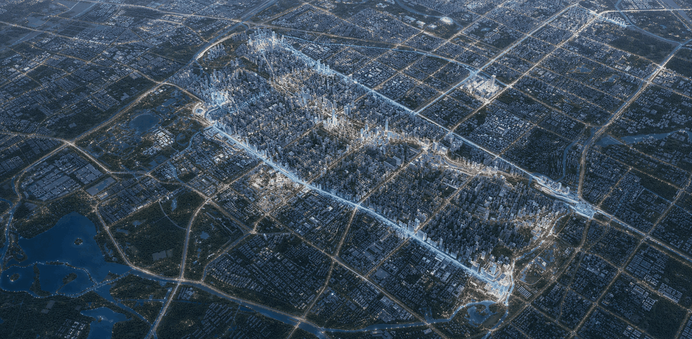

*FTA scenario study · AI-generated concept image. It communicates the public innovation spine and distributed units; it is not a site survey or engineering proposal.*

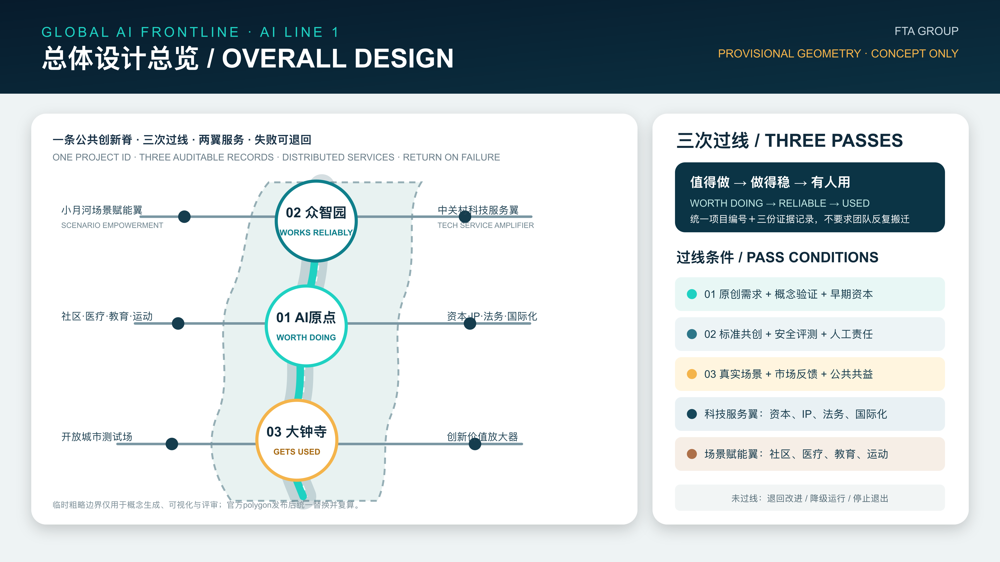

*Submission audit diagram only: retained for provisional scope and evidence anchors, not used as the principal design image.*

## Four-Level Scope Framework

AI LINE 1 applies four levels: city mission, regional network, innovation district, and core engine. At 43.6 km², the study asks how Haidian supports Beijing as a global AI-first city. At 11.4 km², it asks how Jing-Zhang heritage becomes shared innovation infrastructure. The three key areas are differentiated innovation districts with relatively complete innovation cycles. Each then identifies a Super Innovation Element that concentrates shared facilities, public exchange, and operation. [source:DATA-SRC-OFFICIAL-ANNOUNCEMENT-20260509] [depth:three_level_scope_framework]

The levels form one FTA reasoning chain: city mission and brand set direction; the Diamond Model identifies strategic advantage; the Distributed Innovation Network organizes the pearl chain of districts; the Five Highs test each district; Super Innovation Elements concentrate its most catalytic resources; operating feedback then modifies design.

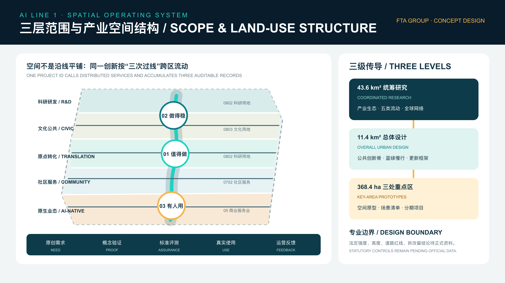

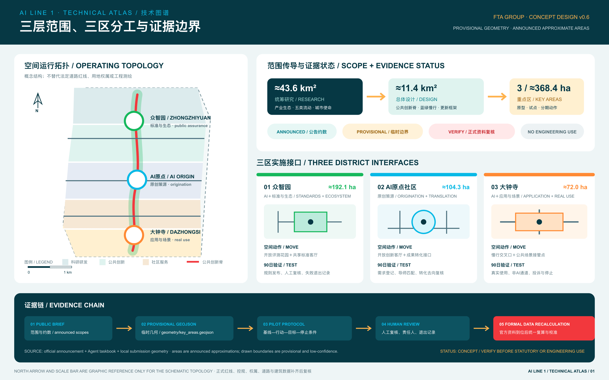

*The atlas connects announced approximations, provisional geometry, three district interfaces, 90-day validation actions, and formal-data recalculation in one evidence chain. Its north arrow, scale bar, and boundaries support schematic reading only and are not survey, statutory-planning, or engineering information.*

## Coordinated Research Area: Industry and Future City Research

### From city mission to spatial choice: the Diamond Model

FTA's Diamond Model places city brand, innovation center, and city decision in one value chain. For Jing-Zhang, GLOBAL AI FRONTLINE is the brand ambition, the rail-linked pearl chain of innovation districts is the regional vehicle, Super Innovation Elements are district-level engines, and resource decisions focus on the advantages with the strongest potential for global leadership.

The nested structure is **Two Districts and One Belt for strategic identity, Three Areas and Two Wings for implementation, and six collaborative districts along a TOD pearl chain.** AI Origin Community is the Chinese AI source point, the Northern Latitude Community is an open global collaboration territory, and the Centennial Jing-Zhang AI Belt binds them as AI LINE 1. Within the 11.4 km² design scope, Zhongzhiyuan, Origin Community, and Dazhongsi are enabled by the Zhongguancun service wing and Xiaoyue River scenario wing.

### From a linear axis to a distributed innovation network

AI LINE 1 is not a conventional corridor of offices and not a compositional “axis plus nodes.” It is a distributed innovation network: needs-based innovation districts have differentiated roles while retaining relatively complete innovation cycles; rail, transport corridors, and shared public infrastructure connect them as a pearl chain; decentralized specialization and cross-district movement create fertile ground for cross-innovation. [source:DATA-SRC-AGENT-TASKBOOK-20260518] [source:FTA-METHOD-PUBLIC] [depth:overall_spatial_structure]

The hierarchy is explicit. The **Distributed Innovation Network** is the decentralized system. An **innovation district** is one pearl, generally about 1–6 km²; for this project, a working scale of roughly 500–1,000 m radius and 1–3 km² is used pending formal data. A **Super Innovation Element** is only the district's catalytic core, analogous to a community center, not the whole district. A suggested 1:10:100 ecosystem—one traction platform, ten high-growth enterprises, and one hundred teams and service partners—is an FTA diagnostic target, not an existing statistic or investment promise.

### The Five Highs

The Five Highs test whether the innovation district behaves as a living ecosystem: **industrial ecology; cultural community; service network; innovation scenarios; and policy governance.** They are applied to every district, scenario, and phased investment. The five dimensions are intrinsically equal; percentages shown later are post-diagnosis recommendations for current action resources, not preset importance weights or quality scores.

### Overall site diagnosis through the Five Highs

This diagnosis separates public facts, FTA professional judgment, and data still to be verified. It does not invent precise scores. The industrial base is strong but collaboration chains remain fragmented; talent is dense but long-term community attachment is weak; professional services are abundant but difficult for small teams to access as one network; real urban scenarios are diverse but lack consistent entry, human accountability, evaluation, and exit rules; and policy capacity is strong but needs a standing mission-led coordination mechanism. [source:FTA-METHOD-PUBLIC] [depth:existing_conditions_diagnosis]

### Five design propositions derived from the diagnosis

The conclusion is that Jing-Zhang's advantage is not a single parcel or landmark. It is the combined density of knowledge, talent, enterprises, public space, and services. The central design problem is that these resources do not yet operate as an accessible, collaborative, testable, and durable network. Five design propositions follow: shorten the origination-to-market chain; convert talent density into belonging; turn institutional services into shared infrastructure; replace technology display with governed validation; and replace fragmented management with mission-led collaboration.

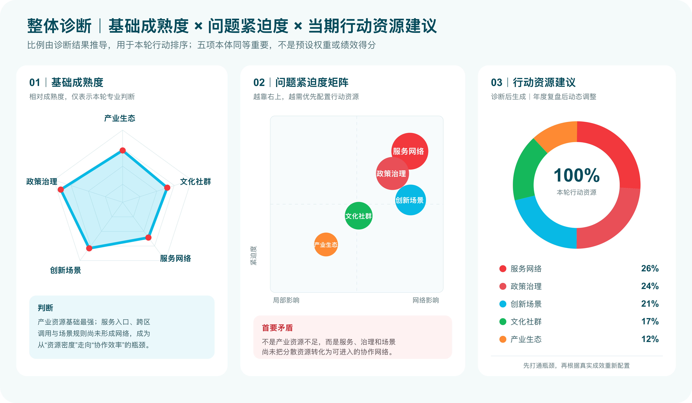

*The post-diagnosis action-resource recommendation is service network 26%, policy governance 24%, innovation scenarios 21%, cultural community 17%, and industrial ecology 12%. It responds to the present network bottleneck and is reviewed annually; it is not a preset weight, a permanent hierarchy, or a performance score.*

### Five Highs project decisions: from diagnosis to resource allocation

This round uses four decision states rather than presenting every idea as a simultaneous construction list. **A near-term project should improve at least three Five Highs dimensions and specify a proposed operator, a 0–6 month prototype, human accountability, and an exit condition; otherwise it does not enter the near-term portfolio.** These are conceptual recommendations based on current public material. Formal initiation remains subject to authorized decisions, official data, and professional review.

| Project | Five Highs contribution | Current decision | Reason and next-stage condition |
|---|---|---|---|
| Origin City Living Room lightweight prototype | Industry, community, services, governance | **Recommend immediate start** | Use an existing ground floor or temporary space to test proof of concept, roadshows, public programs and referrals; reduce the program if repeat use and referrals do not form a chain |
| Zhongzhiyuan evaluation field and bounded test garden | Industry, services, scenarios, governance | **Recommend conditional start** | Requires site authorization, data isolation, accountable people, physical emergency stops, and a complaint channel before testing opens |
| Dazhongsi public ground floor and application-launch prototype | Industry, community, scenarios | **Recommend immediate start** | Use reversible demonstration, testing, roadshows and community-benefit programs; enterprise naming may not substitute for public operating goals |
| Large bridge or station structure across the Third Ring | Community, services, scenarios | **Defer** | Await transport, rail, ownership, fire, cost and accessibility studies; first improve surface crossings, wayfinding and public ground floors |
| Standalone monumental AI sculpture | Limited cultural-community value | **Do not build as a standalone project** | It lacks durable service and operation; only reconsider it as an updatable landmark combining public learning, contribution records, and everyday services |

### Regional vision, objectives, and positioning

The city mission is to translate Haidian's AI knowledge and industrial advantage into a globally recognizable, publicly usable, continuously learning urban capability. The vision is **GLOBAL AI FRONTLINE | AI LINE 1**: not a technology-display boulevard, but public innovation infrastructure where original technology, young talent, enterprise demand, urban scenarios, and professional services meet repeatedly.

Its core positioning is a distributed innovation district and public innovation system for global AI: an origination-and-validation network, a youth innovation and living community, a launch ground for AI-native business, an urban test field, and an open interface for responsible governance. Spatially it forms one public innovation spine with three areas, two wings, and multiple nodes. Operationally it follows diagnosis, strategy, design, operation, and investment feedback. Delivery proceeds from near-term prototypes to a medium-term network and long-term brand export.

Five flows define the operating logic. Knowledge and technology connect universities, institutes, and enterprise R&D. Talent connects work, residence, learning, and community. Capital and professional services connect investment, intellectual property, legal compliance, and internationalization. Scenario and data flows connect testing, evaluation, human review, and urban use. Culture and public life connect railway heritage, Zhongguancun's innovation ethos, and a public-facing AI culture. These flows guide a future-city model but do not replace statutory planning or public decisions.

*FTA scenario study · AI-generated concept image: the Jingzhang heritage public-innovation spine connects complete yet differentiated innovation units. The image is neither an existing-condition survey nor an engineering proposal.*

#### Three key-area aerials: one network, three spatial missions

The three aerials translate the regional network into distinct spatial missions. Dazhongsi foregrounds the transit hub, cross-Third-Ring connections and application-launch interfaces. AI Origin Community connects campuses, urban streets and the Origin City Living Room. Zhongzhiyuan expresses the access and collaboration network of one core, two loops and multiple test gardens. A shared night-time visual language supports comparison; illuminated routes are conceptual movement flows, not observed traffic, road engineering, or approved construction.

*Dazhongsi: transit and cross-Third-Ring connections organize public ground floors, application launches and real-world feedback.*

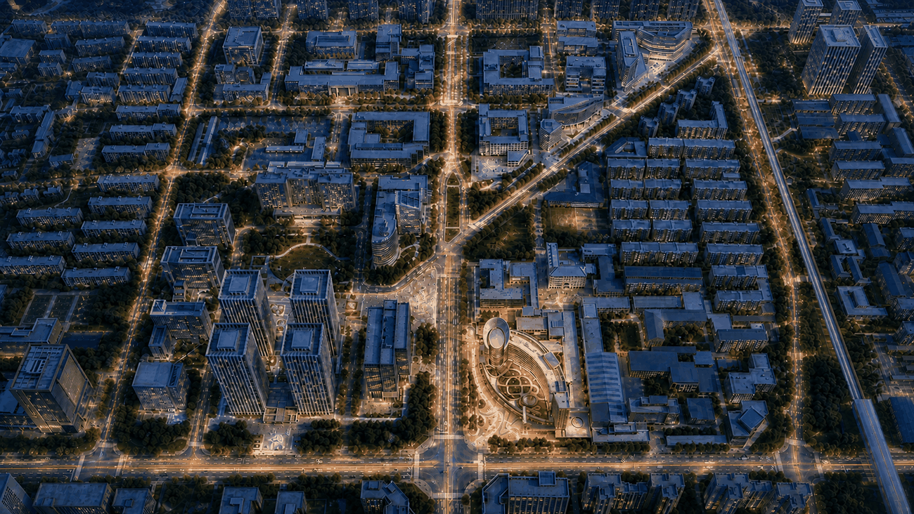

*AI Origin Community: the campus-street-city-living-room continuum supports original technology, young talent and proof of concept.*

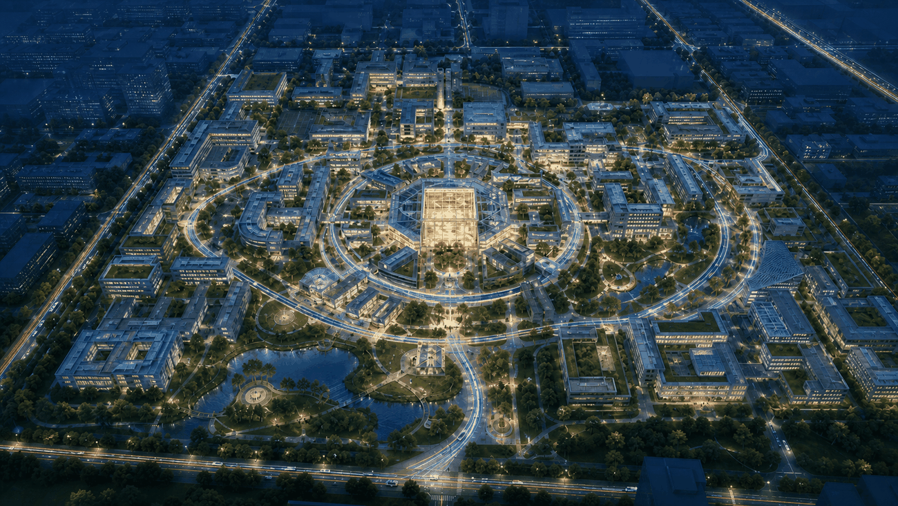

*Zhongzhiyuan: the shared enablement center, collaboration loops and governed test gardens form a standards and developer-ecosystem network.*

### Differentiated responsibilities of the three areas and two wings

The three areas and two wings divide responsibility. **Zhongzhiyuan is the AI Standards and Ecosystem Innovation District**, potentially enabled by platform enterprises, professional institutions, and developer networks. **AI Origin Community is the Original-AI Source District**, focused on 0–1 research, AI for Science, interdisciplinary work and translation. **Dazhongsi is the AI Application and Scenario Innovation District**, building on the area's platform economy, content industries, and market demand. Named companies are research examples of potential ecosystem participants, not confirmed partners, naming sponsors, or implementation commitments. The Zhongguancun Technology Service Wing amplifies value through finance, IP, law, standards, branding, and global market services. The Xiaoyue River Scenario Empowerment Wing is an open urban test field. [source:FTA-JINGZHANG-GLOBAL-AI-FRONTLINE-20260813]

### Transferable lessons from global cases

Seven global case types provide transferable mechanisms: university-enterprise proximity at Kendall Square; shared R&D infrastructure at Eindhoven High Tech Campus; a building-scale startup ecosystem at STATION F; research-capital-market links at Toronto MaRS; R&D-production integration at Jurong Innovation District; mixed brownfield renewal at Barcelona 22@; and content-industry urban experience at Seoul Digital Media City. No spatial form or unverified number is copied. [source:CASE-KENDALL] [source:CASE-STATION-F] [source:CASE-JID]

### Brand and visual identity

The public brand is “GLOBAL AI FRONTLINE | AI LINE 1.” Two open paths cross to form a network: bright cyan `#08B9E6` represents knowledge, technology, and urban connection; new-leaf green `#16B85C` represents ecology, community, and growth; the crossing generates a core red `#F2383D` numeral 1, expressing the Super Innovation Element as a catalytic engine. The italic wordmark, dual speed lines, and open endpoints create forward motion. Standard, symbol, reverse, and monochrome versions support formal documents, wayfinding, scenario certification, digital icons, and low-cost applications.

## Overall Design Area: Urban Renewal and Regulatory-Plan-Level Urban Design

The overall structure comprises one public innovation spine, three differentiated innovation districts, two enabling wings, six collaborative subdistricts, and multiple Super Innovation Elements and community units. A Super Innovation Element is not the district itself: it is the district's catalytic center, integrating shared services, public exchange, key scenarios, and an operating interface. [standard:MOHURD-URBAN-DESIGN-MEASURES] [data:geometry/land_use.geojson#LU-NETWORK-001]

Renewal follows a low-disturbance and reversible-first sequence. In the near term, public space, ground floors, and vacant or underused interiors can host service nodes and programs. In the medium term, building adaptation and station interfaces may proceed after ownership, regulatory, fire-safety, and transport conditions are verified. Long-term new construction requires formal planning studies. Because building, ownership, and control data are missing, this proposal does not prescribe demolition parcels, statutory FAR, height, or engineering feasibility. [assumption:A-CONTROLS-001] [depth:development_intensity_controls]

Four adaptable spatial products prevent a single-office monoculture: shared research and test space; divisible incubation and acceleration space; public innovation and exchange space; and talent living with basic services. Public ground floors, courtyards, pocket plazas, walkable edges, and bookable shared facilities connect them. This converts innovation from a closed-building activity into a visible but governed part of urban life, while leaving formal land-use and development controls to the authorized process.

## Detailed Design of Key Areas

### Beijing AI Origin Community: Original-AI Source Innovation District

**FTA real-project foundation.** This is not a hypothetical case assembled only from public material. FTA has undertaken diagnosis, ecosystem and operating strategy, core-space scenario design, exhibition implementation, and subsequent planning services for the AI Origin Community. This proposal translates that accumulated diagnosis–strategy–space–operation experience into the original-innovation node of the wider Jing-Zhang network. To protect project and client data, the public package discloses only transferable methods and spatial principles—not contracts, internal drawings, diagnostic weights, or unauthorized delivery information. [source:FTA-AI-ORIGIN-INTERNAL-20260812]

**Positioning and division of responsibility.** The AI Origin Community focuses on **original AI**: 0–1 innovation, AI for Science, interdisciplinary work, youth entrepreneurship, and research translation. It combines a global launch ground for original technology, a preferred base for young AI entrepreneurs, and a precise ecosystem-service gateway. [source:FTA-AI-ORIGIN-INTERNAL-20260812] [data:geometry/key_areas.geojson#KEY-PROV-002] [depth:three_key_area_detailed_design]

**Five-dimension diagnosis**

| Dimension | Existing foundation | Priority gap | Design response |
|---|---|---|---|
| Industrial ecosystem | Top universities, institutes, original technologies, and talent | Research results, teams, early capital, and enterprise demand remain dispersed | Build a proof-of-concept and translation center with early-capital, prototype, IP, and launch support |
| Cultural community | Students, researchers, entrepreneurs, and global talent can interact frequently | Few stable vertical communities, weak shared identity, and insufficient youth-life support | Form an Origin Community with learning, roadshow, cultural, and academic-entrepreneur programs |
| Service network | Incubation, investment, professional services, and policy resources | Fragmented access and limited precision for 0–1 technologies and young teams | Provide one shared enablement gateway for feasibility, prototyping, seed funding, IP, and compliance |
| Innovation scenarios | Chengfu Road, the Jing-Zhang belt, stations, campuses, and parks | Walkability, hub vitality, and result display remain isolated | Use transit-oriented repair to create one belt, one exchange axis, two centers, and one cluster |
| Policy governance | Strong potential for high-level coordination and model export | Long-term collaboration, result transfer, and institutional learning are not yet operational | Establish an Origin Innovation Community council, shared principles, result-transfer routines, and an iterative white paper |

**Spatial scenarios and core Super Innovation Element**

| Spatial level | Main components | Core role |
|---|---|---|
| One belt | Centennial Jing-Zhang AI Innovation Belt | Carries technology applications, public programs, and cross-area connection |
| One axis | Origin Avenue—Chengfu Road exchange axis | Creates a walkable interface for small firms, services, and frequent encounter |
| First center | **Origin City Living Room｜core Super Innovation Element** | Integrates launch, roadshow, proof of concept, global exchange, co-governance, and one-stop services |
| Second center | Origin Mobility Hub | Connects transit, talent services, urban life, and everyday exchange |
| One cluster | Origin research-and-startup cluster | Networks incubation, acceleration, startups, and venture-capital services |

**Implementation pathway**

| Phase | Action theme | Priority actions | Phase result |
|---|---|---|---|
| Near term｜0–6 months | Establish governance, brand, and visible prototypes | Form a joint council; begin Origin Open Day, a living-room pop-up, Chengfu Road walking improvements, and initial proofs of concept | A visible identity and the first cohort of real users |
| Medium term｜6–18 months | Aggregate ecosystem, create value, and connect the network | Operationalize the proof-of-concept center and link early capital, incubation, talent life, and corridor-wide result transfer | A continuous campus–proof-of-concept–capital–enterprise support chain |
| Long term｜18–36 months | Form a model, expand influence, and export the approach | Stabilize original launches, youth entrepreneurship, and global cooperation | An Origin model verified through practice |

Building alteration, cross-road connections, funds, and investment arrangements require verification and approval by the responsible parties.

*FTA scenario study · AI-generated concept image. Railway heritage, open ground floors, startup teams, and neighborhood life form a cultural community.*

### Dazhongsi: AI Application and Scenario Innovation District

**FTA real-project foundation.** Dazhongsi also derives from FTA's actual node diagnosis, placemaking, and operating research rather than a generic transit-oriented case assembled for the competition. The proposal carries forward a real working chain—Five Highs diagnosis, station-city stitching, active public ground floors, application launch, and operating review—then reorganizes it for the three-district/two-wing brief. The public version excludes client material, internal drawings, company-cooperation details, and unconfirmed engineering conditions. [source:FTA-DAZHONGSI-INTERNAL-20260812]

**Positioning and division of responsibility.** Dazhongsi focuses on **AI + applications and scenarios**. Its platform economy, content industries, and market demand can support AIGC, smart hardware, offline experience, urban Agents, and local-life services. Specific platform companies are examples of potential ecosystem participants; without authorization they are not confirmed partners, naming sponsors, or implementation commitments. [source:FTA-DAZHONGSI-INTERNAL-20260812] [data:geometry/key_areas.geojson#KEY-PROV-003] [depth:three_key_area_detailed_design]

**Five-dimension diagnosis**

| Dimension | Existing foundation | Priority gap | Design response |
|---|---|---|---|
| Industrial ecosystem | Strong anchor platforms, content businesses, and AIGC applications with rapid market feedback | Platform dependency and an incomplete startup–accelerator–anchor–capital ladder | Retain anchor strength while adding complementary firms, specialist incubators, accelerators, and an innovation-fund proposal |
| Cultural community | Diverse enterprise programs, nearby universities, neighborhoods, and cultural resources | Corporate activity is separated from public life; shared identity and resident benefit are weak | Establish innovation open days, an innovators' festival, and a community-benefit program |
| Service network | Transit, investment, valuation, and professional-service foundations | Limited shared facilities, cross-sector experimentation, and life-service access for small teams | Add a cross-sector laboratory, shared enablement center, one-stop service station, and innovator life package |
| Innovation scenarios | Real markets for content production, product display, consumption, and urban Agents | The Third Ring Road, railway, and inactive space fragment walkability and governance | Use station-city integration and the Jing-Zhang belt to connect scenarios and activate residual space |
| Policy governance | Potential for anchor-led co-development and scenario sandboxes | Cross-party governance, trial accountability, and district-performance review remain incomplete | Propose a co-development committee, sandbox rules, and a district-vitality dashboard |

**Spatial scenarios and core Super Innovation Element**

| Spatial level | Main components | Core role |
|---|---|---|
| Core Super Innovation Element | **Lingjing World + Mobility Hub** | Integrates landmark identity, station-city connection, product display, hybrid experience, and urban-Agent scenarios |
| Anchor-enterprise cluster | Platform businesses, AIGC, and complementary anchor firms | Provides application demand, technology platforms, and rapid market feedback |
| Enterprise growth ladder | Incubators, accelerators, startups, and scaling firms | Provides continuous space from team formation to enterprise growth |
| Professional-service network | Investment, valuation, shared enablement, and university innovation | Supports capital, assessment, cross-sector experiments, and translation |
| Public scenario belt | Jing-Zhang belt, public concourse, launch hall, roadshow center, and open ground floors | Repairs the Third Ring interface and links city life with application launches |

The core Super Innovation Element is the engine of the district, not a substitute for its complete ecosystem. Near-term delivery prioritizes safe at-grade crossings, wayfinding, open ground floors, and temporary scenarios; cross-road structures and station-city integration require separate engineering studies.

**Implementation pathway**

| Phase | Action theme | Priority actions | Phase result |
|---|---|---|---|
| Near term｜0–6 months | Scenario activation and community formation | Establish a joint council; open days, public ground floors, crossing improvements, and AIGC or robot-commerce prototypes | The first real applications and public-feedback loops |
| Medium term｜6–18 months | Ecosystem construction and service upgrade | Form incubators, accelerators, a shared enablement center, cross-sector laboratory, and scenario loop | A complete enterprise-growth ladder and shared-service network |
| Long term｜18–36 months | Brand formation and model export | Stabilize collaboration among anchors and smaller teams, urban-Agent scenarios, and district identity | A replicable application-innovation-district protocol |

Funds, committees, sandboxes, and dashboards are implementation proposals, not existing institutions, approved policies, or investment commitments.

*FTA scenario study · AI-generated concept image. Cultural memory, content production, robot services, community commerce, and evening public life form an AI-application innovation district; the mobility hub is its core Super Innovation Element.*

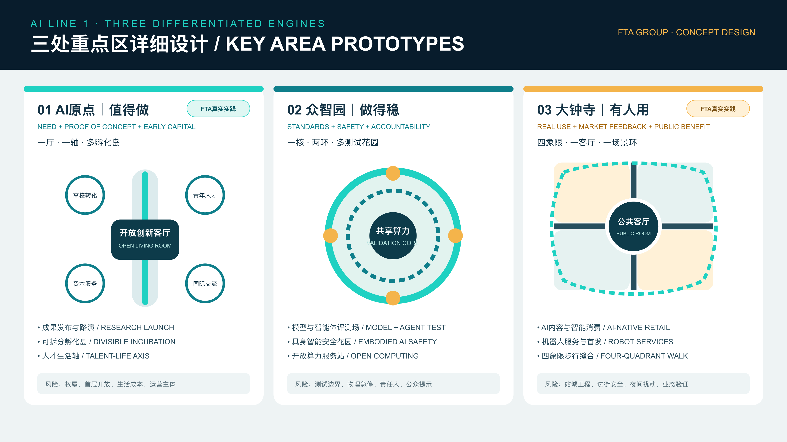

### Zhongzhiyuan: AI Standards and Ecosystem Innovation District

**Positioning and division of responsibility.** Zhongzhiyuan focuses on **AI + standards and ecosystem**. Platform enterprises, professional institutions, and developer networks are potential anchor participants for technology standards, open ecosystems, global-market services, public validation, and result display; specific participation remains subject to authorization. [data:geometry/key_areas.geojson#KEY-PROV-001] [depth:three_key_area_detailed_design]

**Five-dimension diagnosis**

| Dimension | Existing foundation | Priority gap | Design response |
|---|---|---|---|
| Industrial ecosystem | Strong platform, developer, and validation capabilities | Standards, testing, incubation, and market services remain difficult for small teams to access | Create an open standards-and-ecosystem center linking validation, certification, ecosystem access, and market feedback |
| Cultural community | Dense engineering talent and the Qinghe–Jing-Zhang public narrative | Limited cross-organization exchange and young-engineer life support | Add an engineer living room, open days, standards co-creation camps, and everyday riverside community space |
| Service network | Computing, development tools, platform interfaces, and industrial services | No unified booking, service-level, referral, or result-tracking interface | Establish a shared enablement center, open computing station, and one-stop ecosystem window |
| Innovation scenarios | Parks and riverfront space can host controlled tests | Public boundaries, admission, emergency stop, and exit rules require formalization | Combine indoor evaluation fields, bounded test gardens, observation points, and tiered test protocols |
| Policy governance | Institutional capacity to contribute to standards and safety governance | Cross-party data boundaries, accountability, mutual recognition, and annual review remain incomplete | Establish a joint standards-and-scenario workbench with audit, complaint, shutdown, and mutual-recognition mechanisms |

**Spatial scenarios and core Super Innovation Element**

| Spatial level | Main components | Core role |
|---|---|---|
| Core Super Innovation Element | **Standards and Ecosystem Shared Enablement Center** | Integrates standards co-creation, evaluation, certification, developer services, launches, and cross-area coordination |
| Research-translation loop | Models, hardware, embodied intelligence, incubation, and professional services | Links technology validation, ecosystem access, and market feedback |
| Ecological walking loop | Qinghe culture, talent life, and open space | Supports daily encounter, display, and an engineer community |
| Distributed test gardens | Evaluation field, safety garden, and computing station | Hosts bounded, observable, stoppable, and withdrawable experiments |

**Implementation pathway**

| Phase | Priority actions | Phase result | Review condition |
|---|---|---|---|
| Near term｜0–6 months | Establish the operating council and service directory; open the first evaluation field and bounded test garden | A bookable and traceable validation gateway | Confirm human accountability, data isolation, emergency stop, and public notice |
| Medium term｜6–18 months | Build the shared enablement center, standards co-creation mechanism, cross-area scenario access, and engineer community | Standards, testing, incubation, and community operate as a network | Verify fire, municipal, noise, ownership, and equipment-safety conditions |
| Long term｜18–36 months | Develop result recognition, global developer cooperation, and standards-ecosystem service protocols | An exportable standards-and-ecosystem service model | Review service response, project closure, return visits, and rule iteration |

*FTA scenario study · AI-generated concept image. Shared labs and supervised robot testing coexist with an ordinary public garden.*

### Zhongguancun Technology Service Wing: cross-area value amplifier

This wing is not a fourth enclosed park. It turns capital, intellectual property, legal and regulatory advice, standards, branding, international markets, and research translation into a bookable cross-area service network. Lightweight service windows in the three key areas share a common directory and project ledger. Delivery starts with referral and service navigation, develops into joint compliance and global-market clinics, and matures into standardized interfaces for global partners. Agencies, budgets, and policy authority require confirmation.

### Xiaoyue River Scenario Empowerment Wing: open urban test field

This wing converts health, education, sport, mobility, neighborhood life, and public space into observable, stoppable, human-reviewed scenarios. It uses a scenario registry, accountable nodes, and public feedback interfaces rather than a continuous development form. Low-risk prototypes begin with health navigation, an AI learning workshop, and accessible mobility assistance; the medium term adds ethics review, booking, and complaint handling; the long term exports an urban scenario-opening protocol. Every scenario retains a non-AI route, minimal data collection, an accountable human, graceful degradation, and a shutdown condition.

### Regional Coordination: Export Interfaces, Not Copied Parks

AI LINE 1 does not present external coordination as confirmed partnerships. It proposes four standard interfaces that relevant parties may choose to use. **Beiwei Community** can host international talent and open collaboration; **Future Science City and Huairou Science City** can connect original research through joint questions, scientific-facility needs, and validation interfaces; **Beijing E-Town** can support engineering, pilot manufacturing, and supply chains; and **Beijing–Tianjin–Hebei nodes** can exchange scenario recognition, professional-service referrals, and project roadshows. Specific institutions, projects, and agreements remain subject to authorized confirmation.

| Coordination target | What AI LINE 1 can provide | Feedback received | Proposed validation |
|---|---|---|---|
| Beiwei Community and global nodes | Bilingual project packets, open challenges, scenario protocol | International-team needs and rule differences | Annual open call plus bilingual Demo Day |
| Future Science City and Huairou Science City | Proof of concept, assurance, and urban application entry | Original research, facilities, and test needs | Joint-question list plus cross-district project ID |
| Beijing E-Town and manufacturing nodes | Validated scenario demand and product feedback | Engineering, pilot production, and supply chains | Pilot referral plus return evaluation |
| Beijing–Tianjin–Hebei cities and parks | Reusable scenario cards, risk templates, and Five Highs diagnosis | Cross-city use feedback and governance differences | Scenario-recognition pilot plus annual review |

## AI Innovation Ecosystem, Personas, and AI+ Scenarios

### Five Core Personas

<article class="persona-card">R&amp;D
<strong>Researchers and engineers</strong>
Need computing, data, peer collaboration, quiet work, and rapid validation.

</article>
<article class="persona-card">START
<strong>Startups and growth companies</strong>
Need accessible space, client scenarios, capital, and professional services.

</article>
<article class="persona-card">LEARN
<strong>Students and young talent</strong>
Need translation pathways, learning communities, affordable life, and international exchange.

</article>
<article class="persona-card">LIFE
<strong>Residents and families</strong>
Need understandable, optional, human-backed AI public services.

</article>
<article class="persona-card">PRO
<strong>Investors, operators, and professional-service providers</strong>
Need project discovery, evaluation, partnership organization, and long-term operating interfaces.

</article>

### Twelve scenario cards: spatializing the Five Highs

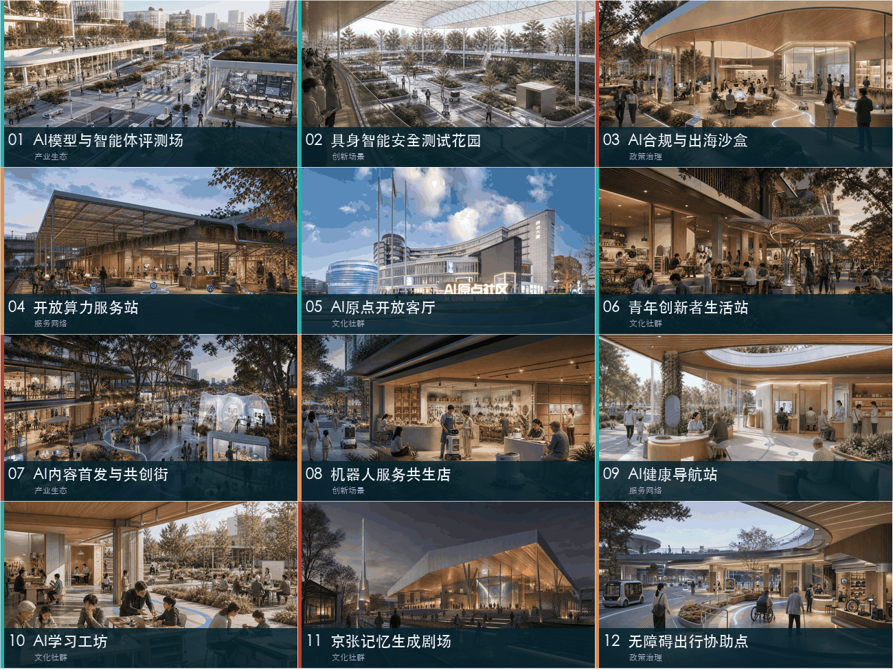

*AI-assisted scenario development based on FTA project experience and public references. References inform spatial relationships and visual language only; no third-party original drawing, logo, or watermark is copied.*

| Scenario | Primary Five Highs role | Main location | Spatial and operating action | Human / exit boundary |
|---|---|---|---|---|
| Model and Agent evaluation field | Industrial ecology | Zhongzhiyuan | Shared evaluation desks, auditable data room, bookable expert seats | Isolated data, human review, traceable results |
| Embodied-AI safety test garden | Innovation scenarios | Zhongzhiyuan | Enclosable test loop, observation platform, charging points | Limited time and area, physical emergency stop, named responsible person |
| AI compliance and global-market sandbox | Policy governance | Service wing | Joint clinics for law, standards, IP and overseas markets | Professional review; no claim of regulatory approval |
| Open computing service station | Service network | Zhongzhiyuan / Origin | Bookable edge-cloud workstations and quota dashboard | Transparent quotas, sensitive tasks prohibited, stop on anomaly |
| AI Origin open living room | Cultural community | Origin | Shared launch, learning, exhibition and community-discussion hall | Public agenda, accessibility, protected non-commercial time |
| Young innovator life station | Cultural community | Origin | Affordable food, short-stay support, sport, childcare advice and night learning | Basic services not tied to recruitment or data consent |
| AI content launch and co-creation street | Industrial ecology | Dazhongsi | Ground-floor studios, launch shops, live-stream and experience nodes | Generated-content labels, copyright review, human service available |
| Robot service coexistence shop | Innovation scenarios | Dazhongsi | Rotating tests in real dining, retail and repair businesses | Parallel human service, graceful degradation, transparent pricing |
| AI health navigation station | Service network | Xiaoyue River wing | Process explanation, booking assistance and human referral | No diagnosis, minimum data, human fallback |
| AI learning workshop | Cultural community | Community nodes | Teachers, students and families define problems and show process | Child protection, teacher review, recorded content history |
| Jing-Zhang memory generative theatre | Cultural community | Heritage park | Oral history, railway archives and generative media in a renewable program | Verified history separated from generation; sources and withdrawal visible |
| Accessible mobility assistance point | Policy governance | Transit / walking nodes | Navigation, wheelchair support and volunteers in one visible window | Non-digital route, data minimization, complaint channel |

Scenarios are complete service units—real problem, target user, spatial interface, service process, data boundary, human review, operator, and exit mechanism—not a technology list. Each starts as a small prototype and is fixed, expanded, reorganized, or withdrawn only after Five Highs review. Health, minors, personal information, and public decisions always retain a human service and complaint route. [standard:GENERATIVE-AI-INTERIM-MEASURES] [standard:BARRIER-FREE-ENVIRONMENT-LAW] [depth:risk_missing_data]

### Twelve individual scenarios: from overview to implementable units

#### 01 | Model and Agent evaluation field

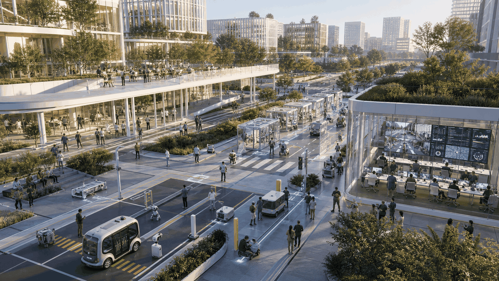

**Value / location / role:** Turn closed evaluation into bookable, auditable public validation capacity in Zhongzhiyuan; primary role: industrial ecology. **Users and space:** model teams, Agent developers, evaluators and scenario owners share evaluation desks, an isolated data room, expert seats and a review wall. **Operation and boundary:** park, professional tester and scenario owner operate jointly; data is compartmentalized, decisions retain human review, and results remain traceable without replacing statutory certification. **Prototype / exit:** start with one bookable evaluation week; reduce it to a mobile service if genuine tasks and repeat use do not emerge.

#### 02 | Embodied-AI safety test garden

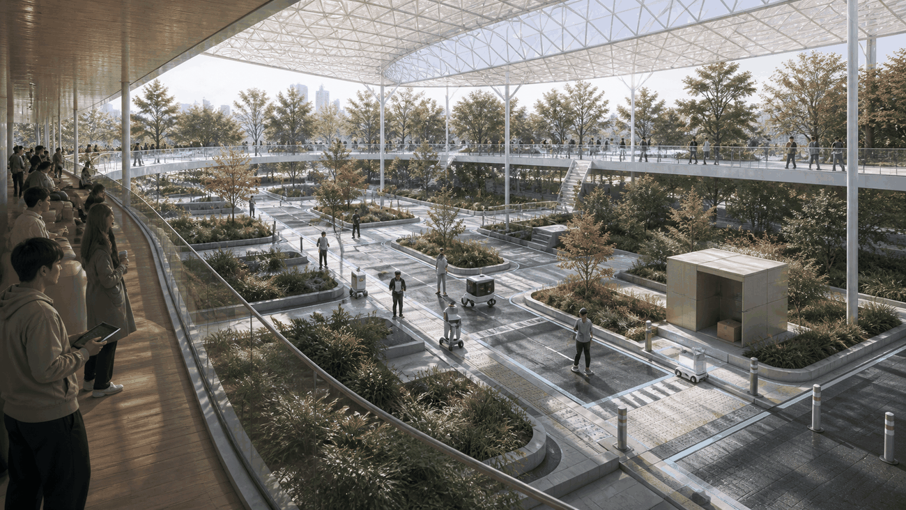

**Value / location / role:** Test embodied systems at low risk before city deployment in Zhongzhiyuan; primary role: innovation scenarios. **Users and space:** robot teams, safety evaluators and public observers use an enclosable loop, soft and hard boundaries, observation platform, charging and maintenance points. **Operation and boundary:** a named on-site person, physical emergency stop, bypass route and public notice are mandatory; unrelated pedestrian data is not collected. **Prototype / exit:** begin off-peak with one device; pause after boundary breach, repeated failure, or unresolved complaint.

#### 03 | AI compliance and global-market sandbox

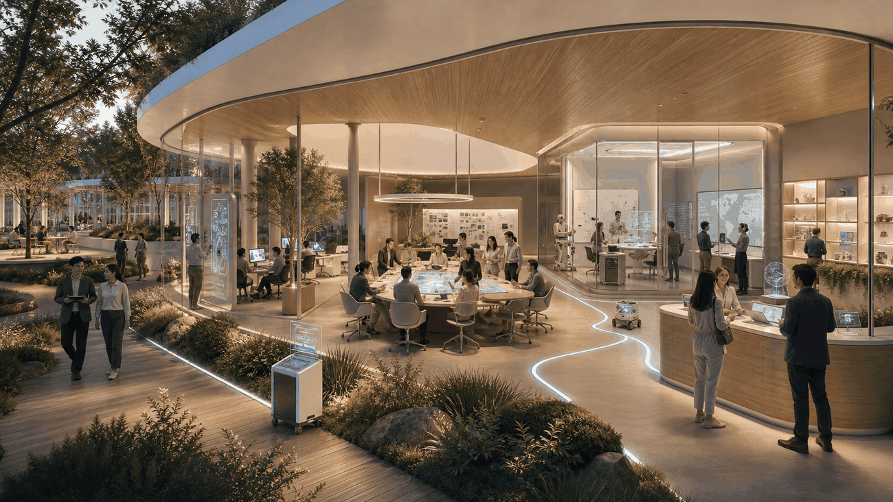

**Value / location / role:** Reduce the cost of identifying legal, standards, IP and overseas-market requirements through the service wing; primary role: policy governance. **Users and space:** startups, growth firms and professional institutions share clinics, rule maps, material-check desks and remote consultation rooms. **Operation and boundary:** professionals review every output; advice is not regulatory permission, and sensitive materials use minimum authorization. **Prototype / exit:** begin with monthly clinics; merge into the common service window if referrals and issue closure cannot be demonstrated.

#### 04 | Open computing service station

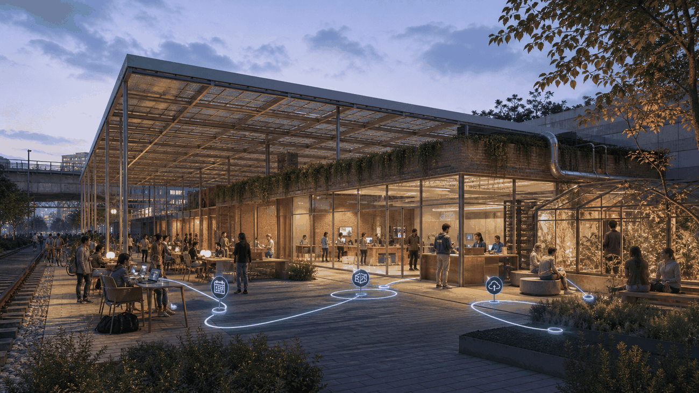

**Value / location / role:** Offer small teams a transparent, affordable, human-supported edge-cloud entry in Zhongzhiyuan and Origin; primary role: service network. **Users and space:** students, researchers and early teams use bookable desks, edge devices, quota and energy dashboards, and technical-support seats. **Operation and boundary:** access is authorized without exposing task content; sensitive, high-risk or over-quota tasks are rejected, and anomalies stop automatically for human handling. **Prototype / exit:** start with limited hours and standard task packs; switch to roaming support rather than fixing idle equipment if utilization stays low.

#### 05 | AI Origin open living room

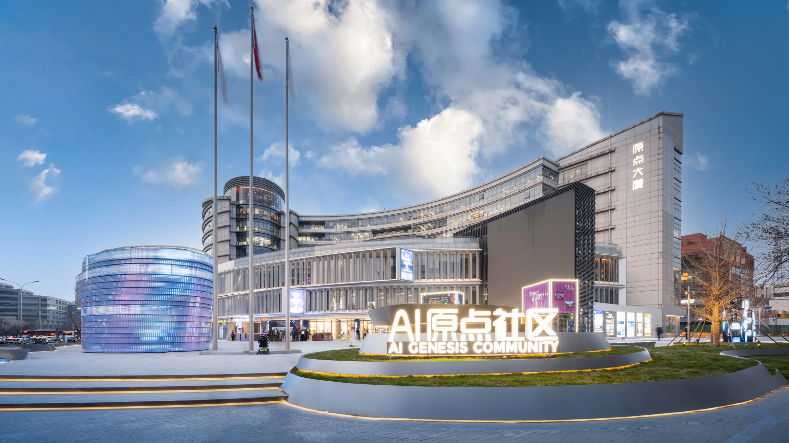

**Value / location / role:** Bring original research, youth entrepreneurship, international exchange and community discussion together at the Origin City Living Room; primary role: cultural community. **Users and space:** researchers, founders, residents, students and investors use a launch hall, proof-of-concept tables, learning zone, exhibition wall and service window. **Operation and boundary:** a community operating team curates an open agenda, accessibility and non-commercial time; activity data is aggregated only. **Prototype / exit:** test repeat visits through ground-floor pop-ups and a fixed weekly program; if it becomes one-way display, reduce exhibition and expand co-creation and service. [source:FTA-AI-ORIGIN-IMAGE-20260813]

#### 06 | Young innovator life station

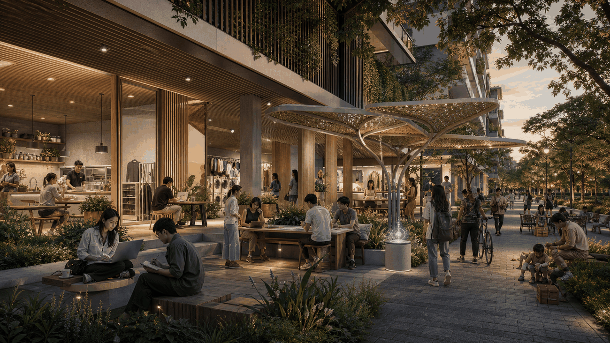

**Value / location / role:** Close gaps in food, short stays, sport, learning and life advice along Origin Avenue and the talent-life axis; primary role: cultural community. **Users and space:** young researchers, startup teams and newly arrived international talent use affordable food, shared living rooms, night learning, sport and advice points. **Operation and boundary:** basic services are never tied to recruitment, investment or data consent, and unnecessary life traces are not collected. **Prototype / exit:** coordinate existing merchants and community facilities; convert to a service alliance instead of building a dedicated facility if affordability and frequent use cannot be maintained.

#### 07 | AI content launch and co-creation street

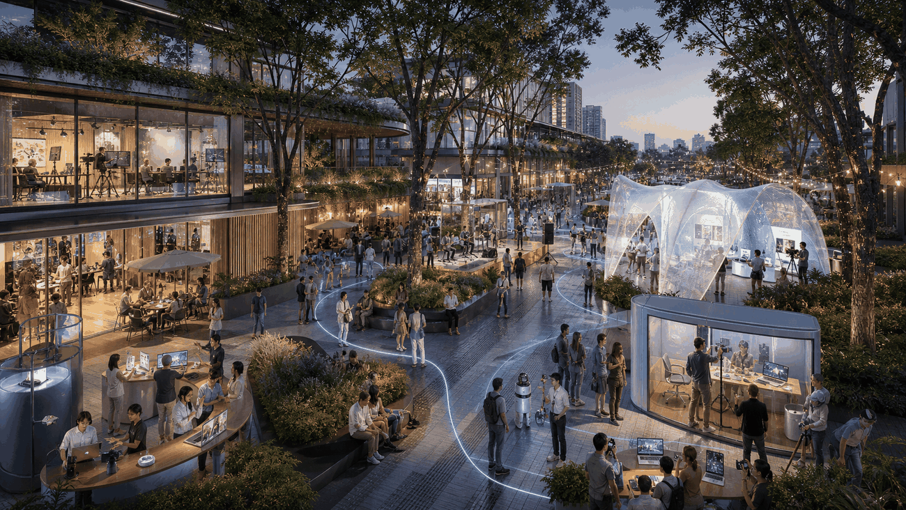

**Value / location / role:** Convert online AIGC production into a visible launch, feedback and iteration interface in Dazhongsi; primary role: industrial ecology. **Users and space:** content teams, creators, brands, merchants and the public use ground-floor studios, temporary pavilions, launch nodes and feedback walls. **Operation and boundary:** generated content is labeled; copyright and likeness receive human review; people may choose a non-AI experience and request withdrawal. **Prototype / exit:** rotate short themes; stop a theme if it generates traffic without product iteration or community benefit.

#### 08 | Robot service coexistence shop

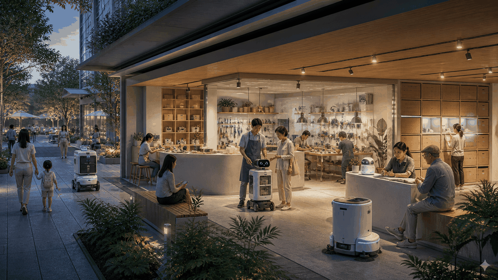

**Value / location / role:** Test human-robot collaboration in real commerce rather than an isolated showroom in Dazhongsi; primary role: innovation scenarios. **Users and space:** merchants, robot teams, customers and frontline staff share a rotating test bay, human counter, charging and maintenance zone, and legible circulation. **Operation and boundary:** human service always runs in parallel, pricing is transparent, and faults trigger immediate degradation; face recognition cannot be a condition of basic consumption. **Prototype / exit:** test one task in one shop off peak; remove the device if agreed safety, efficiency or acceptance thresholds are not met.

#### 09 | AI health navigation station

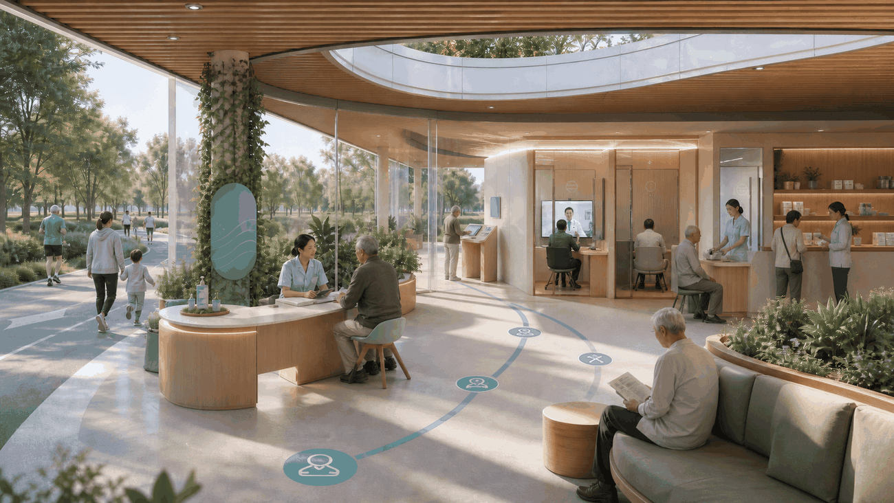

**Value / location / role:** Help residents understand procedures, book services and reach a human without diagnosing, at community and health-service entries in the Xiaoyue River wing; primary role: service network. **Users and space:** residents, older people, caregivers and staff use a visible window, accessible terminal, waiting seats and human referral. **Operation and boundary:** collect the minimum, retain no irrelevant health data, and label all advice as non-diagnostic with a human route. **Prototype / exit:** start with process explanation and booking; disable AI after misleading output, privacy risk or inadequate human capacity.

#### 10 | AI learning workshop

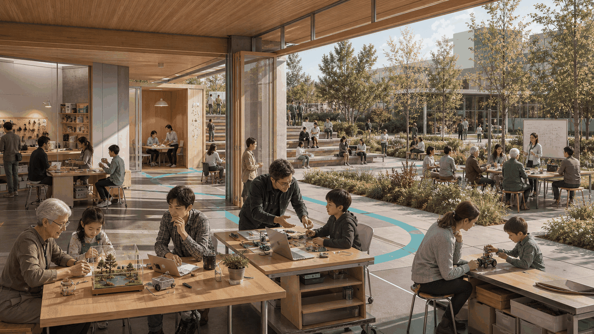

**Value / location / role:** Enable teachers, students and families to understand AI through real problems in schools, communities and public innovation spaces; primary role: cultural community. **Users and space:** small-group tables, process walls, equipment cabinets and teacher-review seats. **Operation and boundary:** child protection comes first; teachers approve content and tasks, and automated scoring never replaces educational judgment. **Prototype / exit:** start with short courses and community challenges; cancel if it becomes product promotion or teacher review cannot be guaranteed.

#### 11 | Jing-Zhang memory generative theatre

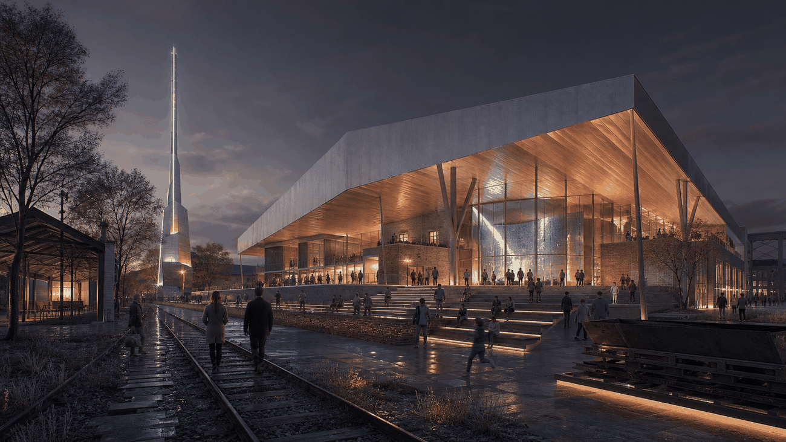

**Value / location / role:** Sustain a public narrative connecting railway heritage, oral history and contemporary AI culture in the heritage park; primary role: cultural community. **Users and space:** residents, historians, visitors and creators use archive search, oral-history recording, generation demonstrations and small performances. **Operation and boundary:** verified history and generated content are labeled separately, sources remain traceable, and contributors may withdraw authorization; personal histories are not invented. **Prototype / exit:** begin with one verified theme and community co-creation evening; do not publish material whose sources cannot be verified.

#### 12 | Accessible mobility assistance point

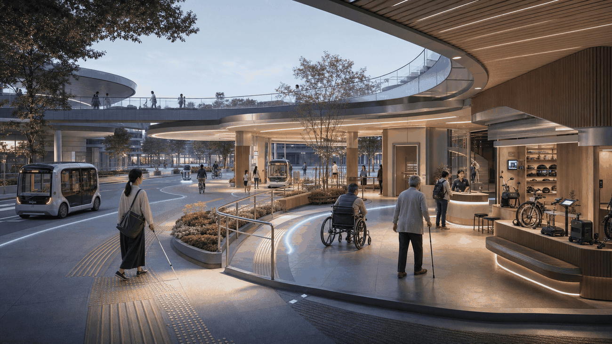

**Value / location / role:** Place digital navigation, physical accessibility and human volunteers in one visible window at transit and walking breaks; primary role: policy governance. **Users and space:** wheelchair users, people with visual or hearing impairments, older people and temporarily mobility-limited users access a low counter, tactile or voice information, wheelchair loans and human accompaniment. **Operation and boundary:** a non-digital route always remains, location and need data are minimized, and an on-site responsible person and public complaint route are visible. **Prototype / exit:** begin with human assistance plus lightweight navigation at key stations; if the digital function is unreliable, turn off the algorithm and retain the human service.

### Four flagship scenarios: from strategy to operable space

*Zhongzhiyuan's shared evaluation facility organizes models, Agents, urban-service tasks and human review in one auditable process open to the full line.*

*The living room is a public interface for repeated exchange, shared learning and collaboration among researchers, founders, residents, students and professional services—not a display hall.*

*Dazhongsi uses ground-floor studios, temporary pavilions, launch nodes and community feedback to connect content production, release, experience and iteration.*

*Railway heritage, oral history and generative media form a renewable public theatre in which verified facts and generated content are separated and sourced.*

### Five Highs × Twelve Scenarios matrix

| Five Highs dimension | Primary scenarios | Cross-scenario result |
|---|---|---|
| Industrial ecology | 01 evaluation field, 07 co-creation street | A short chain from technical validation to launch, user feedback and market translation |
| Cultural community | 05 living room, 06 life station, 10 learning workshop, 11 memory theatre | Everyday infrastructure for talent life, intergenerational learning, public culture and durable communities |
| Service network | 04 computing station, 09 health navigation | Accessible, bookable shared capacity with human fallback |
| Innovation scenarios | 02 test garden, 08 coexistence shop | Enclosable, rotating and degradable real-world settings for embodied AI and robots |
| Policy governance | 03 compliance sandbox, 12 mobility assistance | Compliance, accessibility, human review, data minimization and exit embedded in space and operation |

## Land Use, Building Scale, and Retain-Renovate-Demolish Strategy

The conceptual land-use system combines innovation R&D, mixed services, talent life, public services, green and public space, and mobility. Shared boundaries are used to prevent overlap and gaps, and classification remains compatible with registered planning terminology rather than inventing statutory categories. [data:geometry/land_use.geojson#LU-NETWORK-001] [metric:announced_overall_design_area_sqm]

At this stage, four renewal actions are defined: retain intact, adapt with low disturbance, activate the interface, and reserve potential new construction for professional study. Building footprints, current use, age, structural safety, ownership, and formal planning controls are unavailable. Consequently, parcel-specific demolition, development intensity, and height remain unknown; conceptual building symbols communicate capacity types and node relationships only. [assumption:A-BUILDING-001] [standard:MOHURD-CONTROL-DETAILED-PLANNING]

Every innovation unit must combine production capacity, enabling service, social encounter, everyday support, and a recognizable community interface. This avoids a purely real-estate-led campus and ensures that later professional teams can test each proposed unit against verified land, building, ownership, and market conditions.

## Transport, Rail, Municipal Infrastructure, and Public Services

Mobility uses five layers: rail first, a connected walking and cycling network, fine-grained street circulation, time-separated research logistics, and shared parking. The heritage park is the north-south walking and cycling spine. Cross streets and neighborhood lanes provide east-west stitching. Transit nodes concentrate transfers, intuitive walking guidance, and shared services. Research logistics avoid peak public-activity periods, while parking is pooled and dynamically guided. [data:geometry/roads.geojson#ROAD-SPINE-001] [depth:traffic_rail_slow_parking]

Municipal and new infrastructure follows a common-base, on-demand-access model. It anticipates edge-computing interfaces, public networks, charging and robot replenishment, data-compliance services, stormwater management, and energy monitoring. Capacity, routing, fire protection, drainage, energy, and computing conclusions require dedicated professional data. This proposal defines demand, interfaces, and phasing priorities only. [assumption:A-MUNICIPAL-001]

Public-service stations combine accessible navigation, basic health referral, learning support, public toilets, rest, charging, and staffed help where feasible. Digital layers never become the sole access route. The goal is a corridor where advanced research logistics and ordinary daily movement coexist safely, and where the distributed network reduces unnecessary travel by bringing validation, services, and talent support closer together.

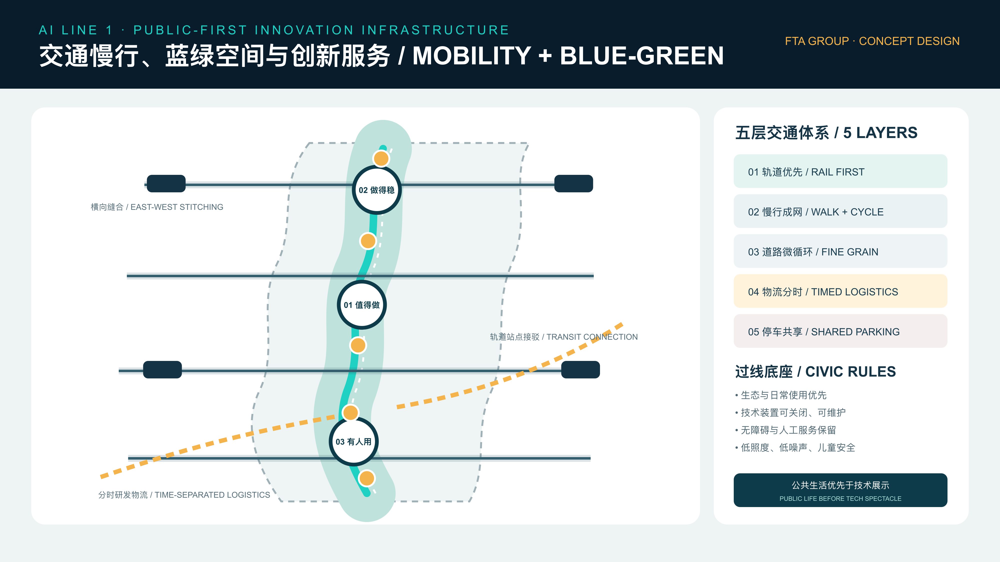

## Blue-Green Network, Public Space, and Urban Character

The Jing-Zhang Railway Heritage Park is treated as accessible public innovation infrastructure. Its first obligations are ecology, walking, rest, play, and neighborhood use; AI exhibition and testing are secondary. Every technical installation must be switchable, maintainable, accessible, and non-obstructive to essential public service. Low light, low noise, universal access, and child safety preserve the ordinary civic character. [standard:MOHURD-URBAN-DESIGN-MEASURES] [data:geometry/public_space.geojson#PS-SPINE-001]

Three public pilgrimage landmarks narrate the journey from origin to application. The AI Origin Hall presents researchers, entrepreneurs, open questions, and pathways to participation. The Global AI Coordination Hall makes the network's technologies, scenarios, responsibilities, and review status legible. The Innovators' Star Track records verifiable technical contributions, useful failures, and city co-creators along the heritage park. These are not oversized icons; they are updatable public institutions expressed through space, learning, and exchange.

Urban character combines the restrained base of industrial heritage, precise emphasis at AI nodes, and warm interfaces for everyday life. Railway materiality, scale, and linear order are retained. New components are reversible, modular, and low-carbon. Night design avoids blanket illumination and cyberpunk spectacle, using only necessary nodes and active interfaces to establish the identity of AI LINE 1. The culture system distinguishes historic evidence, Zhongguancun innovation culture, and newly generated AI narratives, with clear source and status labels.

## Renewal Projects, Implementation Policy, and Phasing

Implementation follows FTA's full-life-cycle loop of **diagnosis—strategy—design—operation—investment feedback**, with operation tested before space is consolidated. [data:geometry/phasing.geojson#PHASE-001] [depth:phasing_implementation] Phase 1 establishes one reversible prototype in each key area and records a Five Highs baseline. Phase 2 connects validation, incubation, services, living rooms, and scenario opening as a cross-area network. Phase 3 matures the innovation-district network and its catalytic Super Innovation Elements, publishing annual progress and the rationale for adjusting current action resources.

The annual operating portfolio includes AI LINE 1 Global Innovation Week, a rotating three-area Demo Day, Open Test Season, Jing-Zhang AI Culture Festival, and a Young Developer Residency. Each program enters a conversion loop: identify a problem, recruit teams, open a governed scenario, test and evaluate, connect capital and services, then scale responsibly or exit. Hosts, budgets, policy measures, and investments are conceptual suggestions and require separate confirmation.

A multi-party AI LINE 1 collaboration platform is recommended to connect public agencies, parks and enterprises, universities and institutes, professional services, communities, and citizens. It does not replace administration. Its functions are scenario registry, program curation, shared-facility booking, open evaluation, brand stewardship, and cross-area coordination. Potential resource models include public-service procurement, membership services, events, facility services, and research translation, but none is an investment commitment.

### Stage Gates: No Evidence, No Expansion

The following are **proposed gates for confirmation by delivery parties**, not current achievements or government commitments. Before launch, every prototype registers its baseline, accountable person, users, data fields, and stop conditions. Operators, professional reviewers, and public representatives confirm actual thresholds at the launch meeting and record them in an open ledger.

| Decision point | Proposed lead | Required evidence | Minimum condition to proceed | If not passed |
|---|---|---|---|---|
| Before launch | Scenario owner, park/community, professional reviewer | Responsibility matrix, data list, accessibility check, human channel, complaint and emergency-stop flow | All five files complete and on-site responsibility confirmed | Do not launch |
| After 4–8 weeks | Operator and user representatives | Use, repeat use, failure, human takeover, complaint, and public-feedback logs | Real repeated use; zero unresolved major safety events; ordinary issues have owners and deadlines | Revise and retest, or disable AI |
| Cross-district pass | Proposed AI LINE 1 collaboration platform | Origin proof record, Zhongzhiyuan assurance record, Dazhongsi use feedback | Three traceable records and no unresolved major risk | Return to the prior pass; do not expand |
| Before permanent construction | Planning, architecture, transport, fire, operation, and other specialists | Ownership, statutory controls, cost, maintenance, fire, transport, and participation evidence | Professional conditions, operator, and funding confirmed by authorized parties | Keep the reversible prototype |
| Annual review | Multi-party platform and public observers | Five Highs dashboard, project flow, public benefit, complaint closure, and exits | Add resources only where evidence keeps improving | Degrade, merge, pause, or exit |

The Five Highs dashboard does not substitute traffic for outcomes. Industrial ecology tracks projects completing Three Passes and conversion breaks; cultural community tracks repeated participation and affordability; service networks track response time, completed referrals, and access for small teams; innovation scenarios track safe operation, human takeover, reuse, and problem improvement; policy governance tracks audits, complaint closure, accessibility review, and rule-based exits. Baselines are measured after prototypes begin; this report does not prefill fictional performance.

### Three preregistered 90-day pilots: write the decision rules before seeing results

These thresholds are **future decision lines, not current performance**. Each pilot locks a measured T0 baseline in week 0 and repeats measurement at D30, D60, and D90. Raw logs, accountable sign-offs, incidents, and exit decisions enter an auditable register. Full fields are in `simulation.json`. [metric:pilot_protocol_count] [metric:pilot_duration_days]

| Pilot | Minimum sample | D90 pass line | Hold / stop line |
|---|---|---|---|
| AI Origin Open Living Room + proof-of-concept service | ≥120 unique participants, ≥8 public sessions, ≥6 PoC teams | Repeat participation ≥30%; ≥2 traceable validations or referrals; median experience ≥4/5; zero major privacy/safety incident | Extend rather than extrapolate if undersampled; stop on unresolved major incidents or loss of human public service |
| Dazhongsi active ground floor + continuous walking prototype | ≥240 crossing observations, ≥120 intercept surveys, ≥18 observation periods | 100% accessibility checklist; median detour/arrival time improves ≥20% from T0; conflict rate does not worsen and targets ≥20% improvement; zero major traffic incident | Stop if conflict worsens, a major incident occurs, or professional review fails; scope is local/approach conditions only |
| Zhongzhiyuan bounded safety test garden | ≥30 supervised sessions, ≥5 teams, ≥10 emergency-stop drills | 100% registration/sign-off; 100% successful stops; zero uncontrolled incursion; median human takeover ≤30 seconds; 100% timely incident closure | Stop on failed emergency stop, incursion, major bodily risk, or loss of accountable operator |

#### Proposed RACI for the three pilots: confirm accountability before launch

This is a **proposed responsibility framework for sign-off by authorized delivery parties**, not a claim of existing authority, funding, approval, or partnership. R is the proposed delivery role, A is the single proposed accountable role, C identifies professional and public parties that must be consulted, and I identifies parties that must remain informed. Until A, site authority, budget, insurance, and approvals are signed, every pilot remains **unconfirmed and must not launch**.

| Pilot | R - proposed delivery | A - proposed accountability | C - required consultation | I - continuous information | Pre-launch sign-offs |
|---|---|---|---|---|---|
| AI Origin Open Living Room + PoC service | Authorized community/park operator and PoC service team | One project owner to be designated by the competent site and operating body | University transfer, data/privacy, accessibility, and user representatives | Residents, participant teams, and the public | Site permission, budget source, data notice, public-liability insurance, human service, and complaint flow |
| Dazhongsi active ground floor + continuous walking prototype | Authorized district operator, mobility-observation team, and accessibility professionals | One project owner to be designated by the competent road/site body | Transport, rail, fire, accessibility, frontage owners, and public representatives | Pedestrians, cyclists, businesses, and communities | Road/site authority, T0 baseline, mobility review, event plan, insurance, and stop authority |
| Zhongzhiyuan bounded safety test garden | Authorized park operator, device teams, and safety evaluators | One safety owner to be designated by the competent park body | Fire, emergency, data security, equipment insurance, test teams, and public observers | Park users, adjacent users, and regulatory interfaces | Enclosure permission, equipment register, insurance, emergency-stop drill, response plan, responsibility and exit agreement |

Named parties, budget values, and authorization documents must be confirmed at the real launch meeting and entered in an auditable register. This proposal does not prefill institution names, amounts, or approval findings.

### Minimum delivery briefs for the three districts

Cost bands support early decisions only: **S** means services, process, and light equipment; **M** means reversible spatial retrofit; **L** means permanent works. No L-band project starts before official redlines, ownership, cost, and professional review are complete.

| Node | Minimum 90-day spatial package | Proposed lead roles | Cost band | Preconditions | D90 pass / stop |
|---|---|---|---|---|---|
| AI Origin Community | Open Living Room, PoC service desk, public project register | Community/park operator + university transfer + Zhongguancun service wing | S–M | Site permission, operator, data notice, accessibility, human service | Pass the preregistered pilot; stop for unresolved major incident or failed human public service |
| Zhongzhiyuan | Bounded test garden, accountability desk, emergency-stop zone, observation interface | Park operator + technical evaluation + safety review | M | Enclosure, fire and emergency plans, equipment insurance, accountable owner, exit route | 100% emergency-stop success and zero crossing; stop on any failure or owner withdrawal |
| Dazhongsi | Continuous walking on local arrival segments, public ground floor, human handover | District/street operator + mobility and accessibility professionals | M | Road/site permission, T0 mobility baseline, professional review, event plan | Improve arrival without worse conflicts; stop after worsening conflicts, major incident, or failed review |

The Origin and Dazhongsi briefs draw on confirmed FTA project practice; Zhongzhiyuan is a design prototype proposed for this call. None is an approved engineering commitment. Delivery remains subject to competent authorities, professional review, and supplemental data. [source:FTA-AI-ORIGIN-INTERNAL-20260812] [source:FTA-DAZHONGSI-INTERNAL-20260812]

### Three concept technical sections: turn spatial claims into checkable interfaces

All dimensions are **concept inquiry values**, not surveys, construction drawings, or approvals. They must be checked against official redlines, ownership, traffic, fire, accessibility, and equipment-risk evidence. The Dazhongsi drawing treats DB11/1761-2020 and GB 55019-2021, both still pending source-registry review, only as concept-interface references and not as evidence that this project already satisfies formal controls. Applicable provisions for crossings, tactile guidance, curb ramps, bicycle crossing bands, and refuge islands require review by transport and accessibility professionals. Railway and expressway main carriageways remain grade separated; a local approach prototype is not represented as a Third Ring engineering conclusion. [metric:technical_section_count]

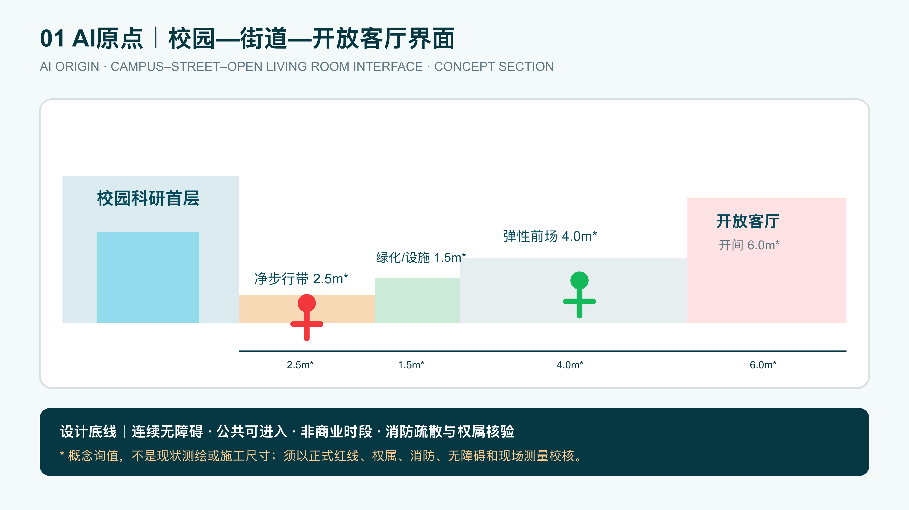

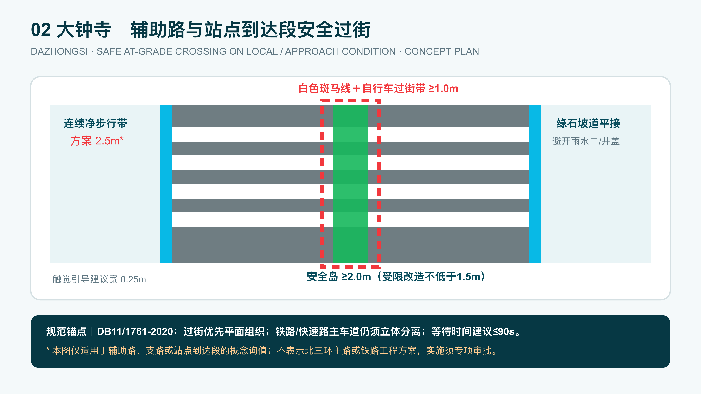

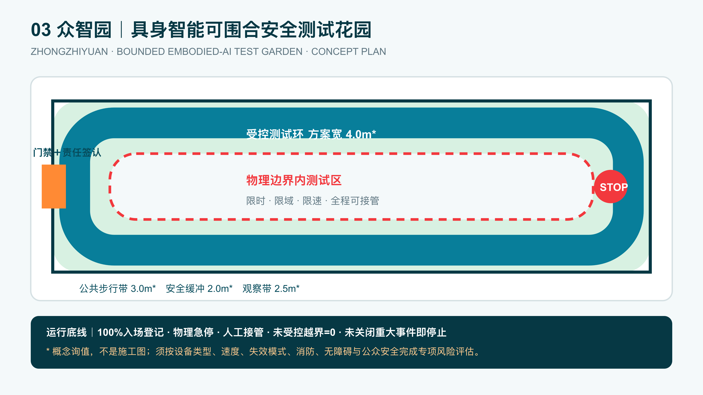

### Auditable option rejection: the highest concept-screen score must still pass hard gates

The Dazhongsi intervention demonstrates a reproducible **internal concept-screening method**. The values 86, 82, and 74 only show that a soft weighted rank cannot override a hard constraint; they are **not competition scores, official findings, or claimed outputs from a model that has actually been run**. Under the disclosed weights, Option A, an iconic Third Ring bridge-station structure, receives the highest concept score of 86 and Option B, a phased local/approach walking, active-ground-floor, and wayfinding prototype, receives 82. The urban-design lead nevertheless rejects A at the hard gate because official road/rail redlines, ownership, structure, fire, accessibility, cost, operations, and approvals are absent and the proposal is irreversible. B enters the 90-day concept validation; C remains on hold. **Tools may expand options; humans remain accountable for weights, evidence limits, public safety, and the final decision.** Full weights, calculations, rejection reasons, and reopen conditions are in `simulation.json`. [metric:ai_hard_gate_override_count] [assumption:A-CONTROLS-001]

## Metrics, Area Recalculation, and Compliance Matrix

Metrics are divided into three classes. Recomputable spatial metrics derive from GeoJSON: provisional boundary area, conceptual land-use area, green/public-space share, road and walking length, key-area count, and phasing extent. Public-task metrics include 12 scenario cards, at least 3 industrial test scenarios, 5 personas, 3 pilgrimage landmarks, and coverage of all 6 Agent tasks. Formal FAR, height, density, precise green ratio, investment, output value, and implementation commitments remain unknown or conceptual. [metric:key_area_count] [metric:scenario_count] [assumption:A-CONTROLS-001]

The current provisional layers, projected in EPSG:4548 and rounded to publication precision, recompute to approximately 11,412,825 m² of submitted boundary and 2,204,265 m² of conceptual green space, or 19.3139%. Raw geometry remains reproducible; the report does not use decimal places to imply false precision. [metric:site_area_sqm] [metric:green_space_area_sqm] [metric:green_ratio]

Conceptual public space is approximately 2,023,722 m², or 17.7320%, and the conceptual building footprint is approximately 241,863 m². These figures test internal consistency only and are not statutory controls. They must be replaced and recalculated as a complete set when official polygons and regulatory data are issued. [metric:public_space_area_sqm] [metric:public_space_ratio] [metric:building_footprint_area_sqm]

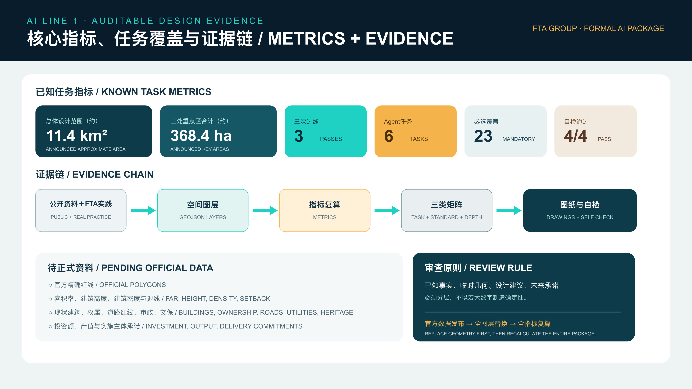

The complete audit layer is carried by `metrics.json`, `compliance_matrix.json`, `standard_matrix.json`, and `design_depth_matrix.json`. The readable proposal explains what the metrics mean: whether the innovation network is complete; whether public space supports encounter; whether scenarios are testable and human-governed; whether delivery is phased; and whether responsibility and stopping conditions are explicit. It does not manufacture certainty through unsupported headline numbers. When official polygons and controls arrive, all dependent land-use, building, public-space, mobility, phasing, and area metrics must be regenerated as one consistent evidence chain.

## Risk, Copyright, and Compliance

This is an open co-creation proposal. It does not replace statutory planning and does not constitute government approval, an investment commitment, engineering feasibility, or parcel-specific retain-renovate-demolish decisions. All spatial interventions are conceptual advice for further professional study. [source:DATA-SRC-AGENT-TASKBOOK-20260518]

Competition text and media are organized specifically for Jing-Zhang and do not reproduce the title, structure, graphics, or narrative of another entry. The Origin and Dazhongsi diagnoses, strategies, and implementation frameworks are grounded in FTA's real project practice; the four aerials newly produced for this competition remain conceptual spatial translations, not project photographs, completion evidence, engineering drawings, or promises. Scenario 05 uses the FTA-provided AI Origin Community project image; its source and the remaining generation boundaries are documented in `report/copyright_statement.md`.

Principal risks include provisional boundary accuracy; missing regulatory, ownership, building, municipal, transport, and heritage data; privacy, bias, failure, and human fallback in AI public services; and unconfirmed operators for shared facilities and long-term programs. Each risk has a corresponding data trigger, professional review, limited pilot, human takeover, or stop condition. The submission deliberately separates verified facts, provisional geometry, design recommendations, and future commitments so that ambition remains compatible with public-interest governance.

## References

1. Haidian Branch of the Beijing Municipal Commission of Planning and Natural Resources, *Prequalification Announcement for the Centennial Jing-Zhang AI Innovation Belt Urban Design International Solicitation*, 2026. This source supports the official task structure and announced approximate areas but not precise polygons or planning controls.
2. *Agent Open Call Taskbook Extract for the Centennial Jing-Zhang AI Innovation Belt Urban Design*, 2026. This cleared taskbook supports the three positionings, five functions, three areas and two wings, six Agent tasks, and contribution boundaries.
3. Ministry of Housing and Urban-Rural Development, *Measures for the Administration of Urban Design* and *Measures for the Preparation and Approval of Regulatory Detailed Planning for Cities and Towns*.
4. Ministry of Natural Resources, *Guidelines for Land and Sea Use Classification in Territorial Spatial Survey, Planning and Use Control*.
5. Cyberspace Administration of China and other authorities, *Interim Measures for the Management of Generative Artificial Intelligence Services*; Standing Committee of the National People's Congress, *Law on Building an Accessible Environment*.
6. Public materials for Kendall Square, Eindhoven High Tech Campus, STATION F, Toronto MaRS, Jurong Innovation District, Barcelona 22@, and Seoul Digital Media City. Registered URLs, access dates, authority, permitted uses, and limitations are recorded in `sources.json`; no private FTA GROUP material is included.
