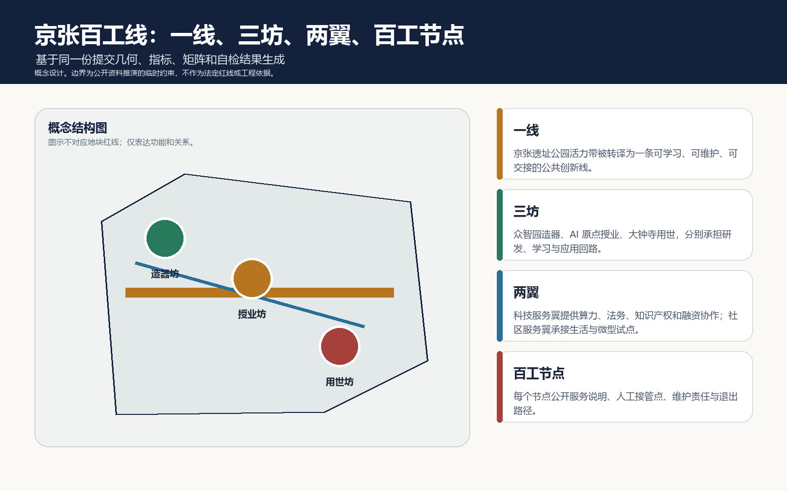
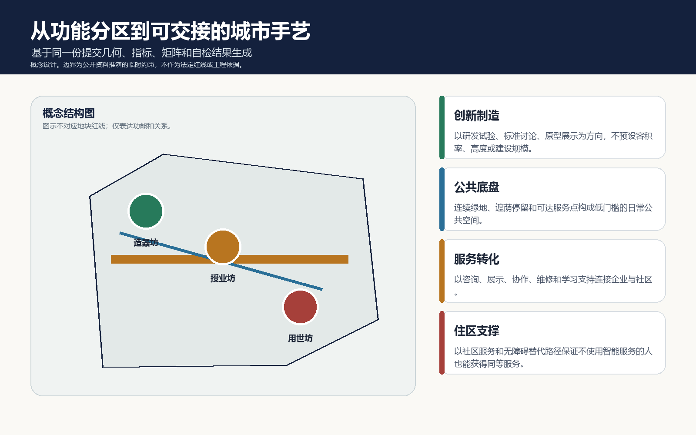
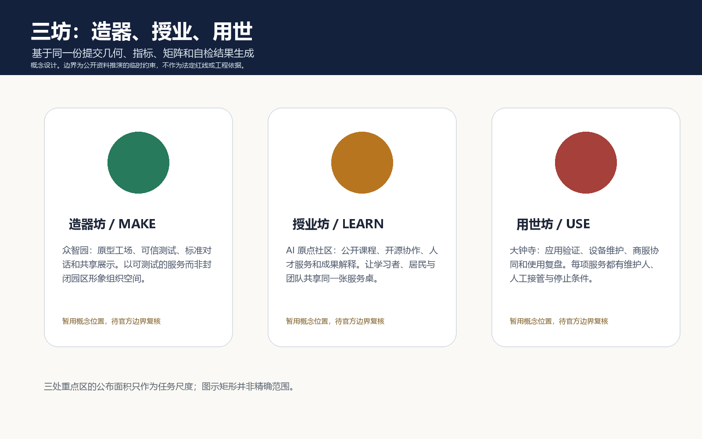
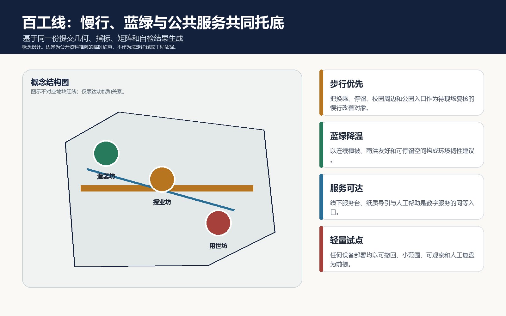
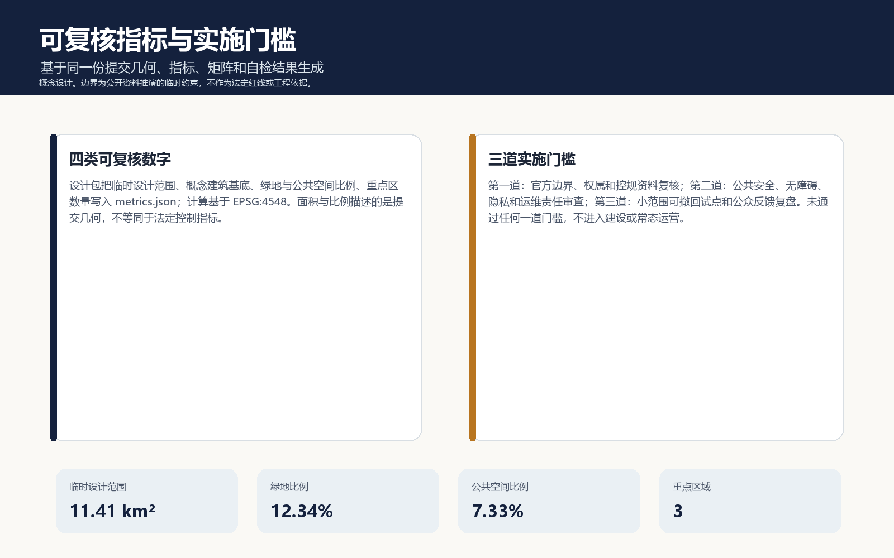

# 京张百工线｜THE CIVIC CRAFT LINE

一句话主张：让每一种智能，都对应一门可学习、可维护、可交接的城市手艺。

## 设计依据与资料清单

本方案面向仓库发起的 AI 开源征集，以公告、智能体任务书、已登记的公开资料与标准为依据。它不替代正式城市设计、控规调整、工程设计或审批；涉及边界、权属、市政、文保、消防、无障碍、隐私和运营的内容均保留专业复核入口。当前提交范围和三处重点区来自公开资料推演的临时约束，因此面积与关系图仅供概念比较，不能解释为官方红线或地块结论。

资料使用按“可公开、可追溯、可替换”组织：任务书给出内容覆盖要求，资料登记表限定来源用途，临时边界用于生成和自检，标准文本用于控制表达深度。获得官方 polygon 后，应同时替换 site boundary、key areas、用地、道路、蓝绿空间、公共空间、分期图层和 metrics，而不是只换一张图。[source:OFFICIAL-ANNOUNCEMENT] [source:AGENT-TASKBOOK] [source:SITE-PACKAGE] [source:SOURCE-REGISTRY] [source:PROCESSED-FACT-PACK] [source:BOUNDARY-SOURCE] [source:KEY-AREA-SOURCE] [standard:PROJECT-OFFICIAL-ANNOUNCEMENT] [standard:PROJECT-AGENT-OPEN-CALL-TASKBOOK] [data:geometry/site_boundary.geojson#SITE-001]

## 三层范围工作框架

方案把 43.6 平方公里统筹研究、11.4 平方公里总体设计和三处重点区的任务拆成同一条证据链，而不是三套彼此脱节的图纸。统筹层回答创新生态如何形成协作回路；总体层回答更新、公共空间和日常服务如何承载回路；重点层回答谁在何处学习、测试、维护、接管和复盘。提交的 11.41 平方公里临时设计包络面积由 geometry/site_boundary.geojson 在 EPSG:4548 中复算，和公告的总体任务尺度相近，但不应据此推断精确空间范围。

“一线”是京张遗址公园活力带及其公共创新关系的叙事主轴；“三坊”是众智园的造器坊、AI 原点社区的授业坊和大钟寺的用世坊；“两翼”是面向科研转化的科技服务翼以及面向居民、生态和出行的社区服务翼；“百工节点”是每一项服务都说明服务对象、人工接管、维护责任和停止条件的微型公共节点。该框架把 AI 从单点设备改写为城市共同维护的服务契约。[standard:MOHURD-URBAN-DESIGN-MEASURES] [depth:three_level_scope_framework] [depth:overall_spatial_structure] [metric:site_area_sqm] [data:geometry/key_areas.geojson#PROV-KEY-001]

## 统筹研究范围产业与未来城市研究

统筹层不罗列企业名单或投资承诺，而提出“问题提出 - 原型制造 - 公开学习 - 场景验证 - 维护复盘 - 开源反馈”的六段创新回路。全球案例的可转化点不是复制形象，而是借鉴可测试的公共协议：科研与产业之间有开放试验桌，居民与访客能读懂服务边界，失败的试点可撤回且留下经验。可供后续研究的参照类型包括研究型创新区、大学周边成果转化街区、公共数字服务实验室、开发者社区、工业遗产公共空间、面向中小团队的科技服务网络；它们作为类型学而非特定项目背书。

品牌“京张百工线”的视觉方向为深蓝底、铜金线和三枚手作圆点：蓝色指向理性与夜间可读性，铜金指向京张铁路的时间感，圆点指向人、工具与公共空间之间的可交接关系。名称对应三大定位：自主创新的造器能力、开放学习的授业能力、面向日常的用世能力；对应五类功能：研究试验、学习协作、转化服务、公共体验、运维复盘。科技服务翼将算力、法务、知识产权、融资和市场连接理解为“可被预约和解释的支持”，而不是确定的招商或政策安排。[source:AGENT-TASKBOOK] [standard:PROJECT-AGENT-OPEN-CALL-TASKBOOK] [depth:industry_ecosystem_strategy] [data:geometry/land_use.geojson#LU-001]

## 总体设计范围城市更新与控规深度城市设计

总体层以四类概念功能单元建立空间对话：创新制造与可信测试、百工公园与开放学习、应用转化与协作服务、社区服务与包容支持。它们完整覆盖提交包络而不重叠，是为了让算法、人才、企业和居民拥有连续的公共接口；不是法定用地调整或开发强度指标。线性的百工慢行主线与两条概念服务连线只表示应被进一步测量的可达关系，不能解释为道路红线、轨道线位或工程方案。

城市更新建议采用“先读懂、再试点、后深化”的顺序：先完成官方边界、现状建筑、权属、历史资源、交通、市政和公共服务底数的多专业复核；再以可撤回的导引、临时服务桌、开放课程和小型维护站验证公众需求；最后才讨论改造、建设或长期运营。建筑基底图只表达造器坊的概念原型工场，不表示现状建筑应当保留、改造、拆除或新建。容积率、高度、退线、停车、容量和投资均明确为未知。[standard:MOHURD-CONTROL-DETAILED-PLANNING] [depth:existing_conditions_diagnosis] [depth:land_use_layout] [depth:development_intensity_controls] [data:geometry/buildings.geojson#BLDG-001] [data:geometry/roads.geojson#ROAD-001] [metric:building_footprint_area_sqm]

## 重点区域详细设计

造器坊位于众智园的任务语境中，定位为“可被社会看见的研发和可信测试界面”。空间动作是把原型展示、标准对话、设备安全说明、低碳交往和人工讲解组织在可共享界面上；重点不是做一座标志性建筑，而是让每次测试都能留下可阅读的说明。建议设置原型解释台、模型失效复盘墙、无障碍测试桌和线下咨询点。进入长期建设或设备部署前，需要确认园区边界、公共安全、消防和运维主体。

授业坊位于北京 AI 原点社区的任务语境中，定位为“学习者、研究者、创业团队和居民共用的知识转译客厅”。空间动作是把课程、开源协作、成果解释、人才服务、亲子与老年友好咨询并置，避免把学习变成只有专业人群才能进入的封闭活动。建议优先验证低门槛课程、纸质与数字并行导览、人工帮助台和开放反馈板。

用世坊位于大钟寺的任务语境中，定位为“应用能被维护、被质疑、被停止的城市服务试验场”。空间动作是把服务发布、设备维修、商服协作、公共反馈和使用复盘放在步行可见界面，重点解决从演示到日常使用的责任断点。建议首先验证服务说明牌、人工接管桌、设备维护工位和投诉闭环，不预设商业主体、商铺改造或交通工程。

三坊均以“定位 + 空间动作 + 公共空间 + 人工接管 + 实施门槛”表达，重点区 polygon 仍为粗略概念范围，公布面积只用于任务尺度参照。[data:geometry/key_areas.geojson#PROV-KEY-001] [data:geometry/key_areas.geojson#PROV-KEY-002] [data:geometry/key_areas.geojson#PROV-KEY-003] [depth:three_key_area_detailed_design] [standard:MOHURD-ARCH-DESIGN-DEPTH-2016]

## AI 创新生态、人才画像与 AI+ 场景

五类人物共同定义服务：研究者需要可测试且可复现的工作台；学生和开发者需要可进入的学习与协作机会；中小团队需要能解释规则的科技服务；居民、老年人与儿童需要线下同等服务和拒绝被采集的权利；运维人员需要明确的维护责任、升级窗口和停止条件。由此形成十项场景卡，前三项为产业测试或验证场景，均不是既定运营项目：

| 场景卡 | 对应空间 | 数据与边界 | 人工接管与停止条件 |
| --- | --- | --- | --- |
| 01 原型可用性测试桌 | 造器坊 | 仅用自愿参与与脱敏反馈 | 安全员可立即暂停；记录不可替代专业认证 |
| 02 可信服务说明牌 | 造器坊 | 展示模型用途、局限和版本 | 解释员负责更正，版本失效即下线 |
| 03 设备维护工位 | 用世坊 | 不采集个人身份信息 | 维修人员批准复位；无法维护则撤除 |
| 04 开放课程排班 | 授业坊 | 公开课程与授权报名 | 线下报名和人工答疑并行 |
| 05 无障碍路线提示 | 百工线 | 现场踏勘后再发布 | 无障碍专业人员复核，异常即撤回 |
| 06 社区问题收集桌 | 公共空间 | 匿名、聚合、可拒绝 | 工作人员审核，不做个人画像 |
| 07 小月河环境观察 | 蓝绿空间 | 只用公开环境信息与人工记录 | 不替代水务或生态监测 |
| 08 科技服务问诊台 | 服务翼 | 不要求提交商业秘密 | 人工咨询与转介，非审批承诺 |
| 09 公共活动可达提醒 | 公园活动点 | 公开活动信息和人工核验 | 活动变更立即人工更新 |
| 10 服务复盘展墙 | 三坊共享界面 | 展示聚合反馈与修订记录 | 公众可提出下线建议 |

每张卡都把空间位置、服务对象、可用数据、隐私边界、人工复核、运营主体和退出机制放在同一张责任表中。AI 的角色是提出可讨论的线索，不是替代规划、交通、无障碍、生态、法律或公共服务工作人员的判断。[source:AGENT-TASKBOOK] [depth:ai_scenarios_and_personas] [data:geometry/public_space.geojson#PUBLIC-001]

## 用地、建筑规模与拆改留方案

建筑高度、体量、界面和城市风貌仅提出“面向公共界面的可读性、遮荫和可维护性”这一深化方向，不设任何数值控制条件；具体高度、体量、退线和风貌控制应待官方控规与现场条件确定。[depth:height_massing_character]

提交的 land_use 图层是一套无缝的概念分区，用于计算公共底盘与功能关系；并不代表正式用地分类调整。四类分区的标注采用资料包提供的分类码作为工作语言，但未来是否适用必须由国土空间规划和控规资料确认。建筑图层仅含一个概念基底，目的是让评审能检查“创新制造空间”没有停留在口号，不能被误读为对任一建筑的拆改留结论。

当前可复核的是概念建筑基底面积；不可复核的是总建筑规模、容积率、高度、建筑密度、停车、拆改留清单和权属。后续专业阶段应先建立建筑普查和权属核验，再将“保留、修缮、更新、调整或新建”作为多方案比较，任何结论都应附随风险、公众沟通和实施条件。[standard:MNR-LAND-USE-CLASSIFICATION-GUIDE] [depth:retain_renovate_demolish] [metric:building_footprint_area_sqm] [data:geometry/land_use.geojson#LU-002]

## 交通、轨道、市政与公共服务设施

交通策略的核心不是新增一条大通道，而是把步行、骑行、换乘、停留、导引、维护和线下帮助串成可达的日常链条。百工慢行主线、蓝绿服务环和线下服务接驳线均为概念连线，用于提示哪些关系应由现场测量验证：人行连续性、无障碍断点、遮荫与夜间照明、活动日人流、与轨道站点的步行体验，以及设备维护是否干扰公共通行。

市政和新型基础设施采用“先公共服务、后设备部署”的原则：在确认电力、通信、排水、消防、维护和应急条件前，不承诺任何端侧计算、感知装置或分布式能源的建设规模。线下咨询、纸质导视、无障碍替代路径和人工服务台是公共设施的基本组成，不应被数字界面取代。[standard:MOHURD-CONTROL-DETAILED-PLANNING] [depth:traffic_rail_slow_parking] [depth:municipal_new_infrastructure] [data:geometry/roads.geojson#ROAD-002]

## 蓝绿空间、公共空间与城市风貌

蓝绿与公共空间不是 AI 的背景板，而是使学习、等待、讨论、修复和休息自然发生的城市底盘。方案以连续绿地、可停留的公共协作客厅、雨洪友好界面和可被人工照看的夜间照明为方向；小月河等水系相关表达仅作为场景研究提示，不能代替水务或生态专业判断。公共空间应同时容纳不使用智能设备的人：保留纸质导览、人工咨询、安静休息、儿童与老年服务、无障碍通道和不被采集数据的选择。

三处“朝圣”节点不以纪念碑竞赛为目标，而以可反复使用的公共构件表达：原型解释台让技术被读懂；学习长桌让知识被分享；维护与复盘墙让失败被记录。它们可与京张历史叙事、中关村创新文化和当代 AI 文化并置，但不挪用未经许可的史料图像、商标或企业标识。图形语言使用自绘的线、点、圆和中性文字，便于后续形成导视、活动和国际交流的可扩展系统。[standard:MOHURD-URBAN-DESIGN-MEASURES] [depth:blue_green_public_space] [data:geometry/green_space.geojson#GREEN-001] [metric:green_ratio] [metric:public_space_ratio]

## 更新项目清单、实施政策与分期计划

建议将实施组织为三道门槛，而非固定工程清单。第一阶段是“读场地”：补齐边界、现状、权属、交通、市政、文保、生态、无障碍和服务需求资料，建立公众可读的约束清单。第二阶段是“做小试”：在获得场地和专业条件确认后，用临时导引、课程、服务桌、反馈墙和可撤回设备测试公共价值。第三阶段是“能交接”：只将通过安全、无障碍、隐私、维护责任和公众反馈审查的服务纳入长期协作机制。

建议的年度活动体系为百工开放周、公共问题工作坊、开发者维护日和服务复盘展；它们是供组织方与社区讨论的运营原型，不是已经确定的活动安排。科技服务翼可研究“问题接收 - 合规问诊 - 原型验证 - 公共展示 - 维护交接”的转化链，每一步都保留人工责任、信息最小化和退出机制。[source:AGENT-TASKBOOK] [depth:renewal_project_list] [depth:phasing_implementation] [data:geometry/phasing.geojson#PHASE-001]

## 指标体系、面积复算与合规矩阵

constraints.geojson 有意保持为空集合：它不是伪造一个未知限制的位置，而是将官方边界、控规、权属、市政、文保、消防、生态与无障碍的待核事项记录在 assumptions.json 和自检中。拿到可公开的约束图层后，才能将它们纳入几何审查。[data:geometry/constraints.geojson#CONSTRAINTS]

指标分为“可从提交图层复算”和“必须等待官方资料”两类。已知指标以 EPSG:4548 进行面积计算：临时设计包络约 11.41 平方公里、概念建筑基底约 31.08 万平方米、概念绿地比例约 12.34%、概念公共空间比例约 7.33%、重点区数量为 3。它们说明此包内部图层的一致性，绝不等同于法定用地面积、绿地率、公共服务标准或开发控制指标。楼面地价、总建面、容积率、高度、停车、市政容量与投资均保持 unknown，等待专业资料。

合规矩阵把公告与任务书条目映射到正文、图层、图纸、HTML、来源和自检；标准矩阵把城市设计、控规深度、用地分类和建筑设计深度映射到待复核事项；设计深度矩阵把现状诊断、三层框架、三坊细化、交通、市政、蓝绿、更新、分期、复算和风险落实为可检查项目。所有图件从同一几何和 metrics 生成，离线展页不会调用地图瓦片、远程字体、远程脚本或追踪服务。[metric:site_area_sqm] [metric:key_area_count] [depth:metrics_recalculation] [data:geometry/constraints.geojson#CONSTRAINT-001] [data:geometry/phasing.geojson#PHASE-001]

## 风险、版权与合规说明

最大的风险不是图面不足，而是把临时几何和愿景语言误读为已批准的空间结论。因此本包在 geometry、metrics、assumptions、sources、图件、HTML 和 PDF 中重复披露临时边界状态；所有设备、交通、建筑和空间行动均标注为概念建议或待专业复核。涉及公众的场景只允许使用自愿、公开或聚合信息，不能把反馈桌、导引、观察或课程变成持续性个人跟踪。每项服务要有人工接管、投诉反馈、无障碍替代路径和停止条件。

所有图形、文本和代码均为本投稿自制；未使用外部照片、底图、商标、人物肖像或远程资源。后续如果引入第三方数据、图像、软件或线下合作，应先补充许可、来源、使用范围和责任说明。专业团队下一步应复核官方边界、控规、权属、市政、文保、消防、生态、无障碍、隐私和运维条件，再讨论是否进入试点或深化阶段。[source:SOURCE-REGISTRY] [depth:risk_missing_data] [standard:MOHURD-ARCH-DESIGN-DEPTH-2016] [data:geometry/constraints.geojson#CONSTRAINT-001]

## 参考资料

- 项目公告与工作范围：[source:OFFICIAL-ANNOUNCEMENT]、[standard:PROJECT-OFFICIAL-ANNOUNCEMENT]
- 智能体开源征集任务书：[source:AGENT-TASKBOOK]、[standard:PROJECT-AGENT-OPEN-CALL-TASKBOOK]
- 场地资料包、临时边界和数据使用规则：[source:SITE-PACKAGE]、[source:BOUNDARY-SOURCE]、[source:KEY-AREA-SOURCE]
- 城市设计、控规与用地分类参考：[standard:MOHURD-URBAN-DESIGN-MEASURES]、[standard:MOHURD-CONTROL-DETAILED-PLANNING]、[standard:MNR-LAND-USE-CLASSIFICATION-GUIDE]
- 可读图层与复算文件：[data:geometry/site_boundary.geojson#SITE-001]、[data:geometry/land_use.geojson#LU-001]、[data:geometry/buildings.geojson#BLDG-001]、[data:geometry/roads.geojson#ROAD-001]、[data:geometry/green_space.geojson#GREEN-001]、[data:geometry/public_space.geojson#PUBLIC-001]
