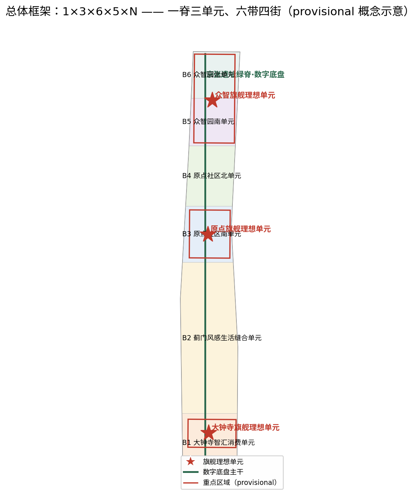
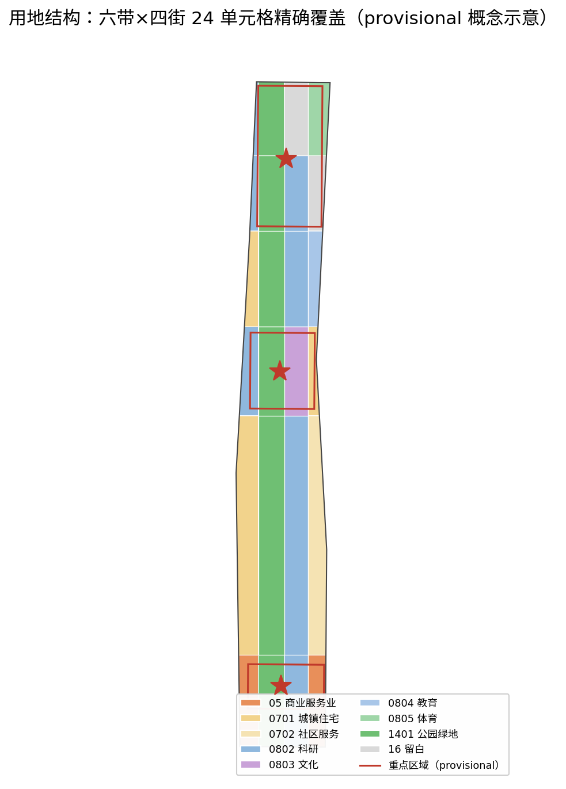
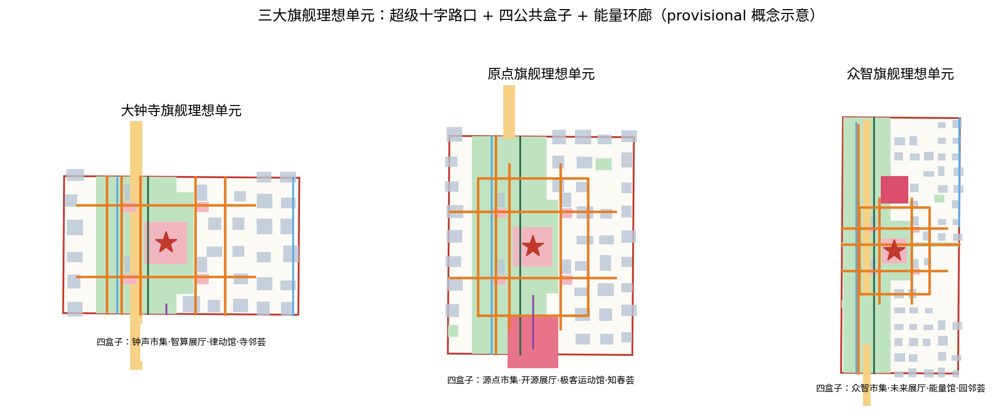
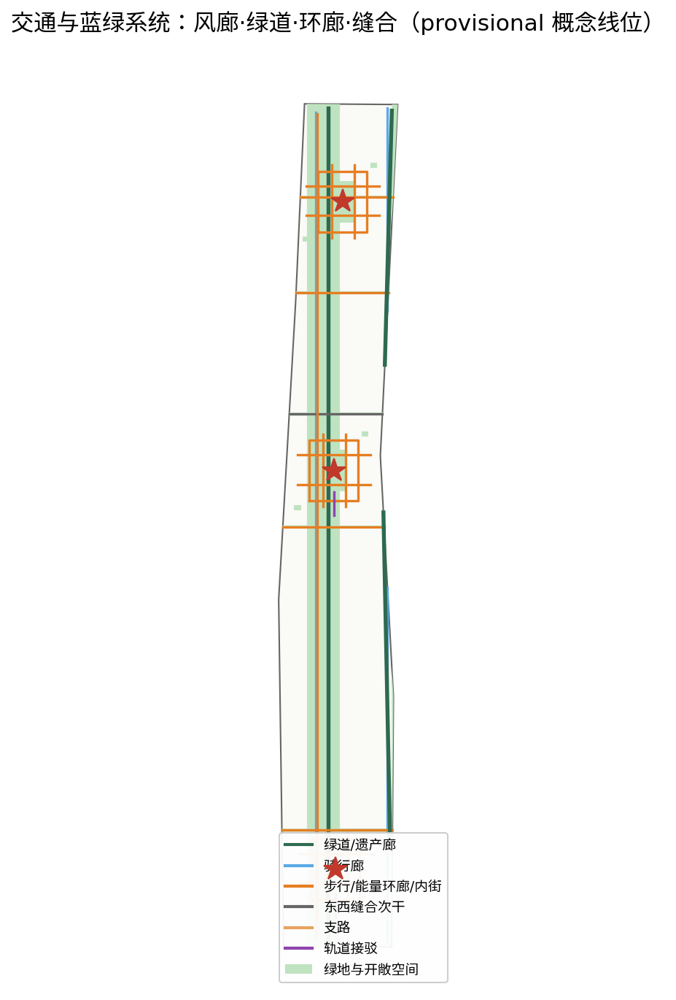
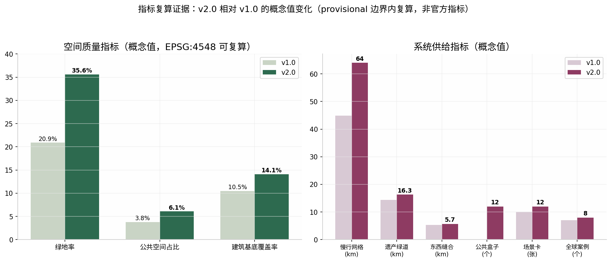

# 京张智轨：铁路遗址上的开源未来城市理想单元

> **一句话主张**：一百年前，詹天佑用一条「人」字形铁路回答了「中国能不能自主修路」；一百年后，这条遗址廊道应当回答一个同样级别的问题——「未来城市的中国答案是什么」。本方案的应答是：**以人为尺度，让城市可计算**。我们把京张遗址廊道组织为一套「理想单元操作系统」（Ideal-Unit Operating System）：**1 个数字底盘 × 3 个旗舰理想单元 × 6 个空间模块 × 5 个技术族 × N 个开源场景**，并把「道路与建筑的形状、大小、密度决定风、光、热、声与人的动线，进而决定人的身心舒适」这一营造哲学，落实为一套基于公开标准、任何智能体都可复算的**舒适环境六维模型** [source:AGENT-TASKBOOK][source:OFFICIAL-ANNOUNCEMENT]。

## 设计依据与资料清单

本方案严格区分四类资料并全部登记在 `sources.json` 中。第一类是官方公开资料：北京市规划和自然资源委员会海淀分局《百年京张AI创新带城市设计国际方案征集资格预审公告》及其三层范围、设计任务与成果深度要求 [source:OFFICIAL-ANNOUNCEMENT]，以及仓库 `brief/site-package/` 中的结构化任务书、枚举、指标区间与 schema [source:SITE-PACKAGE]。第二类是智能体任务书：十条共创原则与 agent.1—agent.6 六项必答任务 [source:AGENT-TASKBOOK]。第三类是仓库公开资料登记与导航层：`data/source_registry.json` 用于判断每条资料是 formal-ready、background-only 还是 provisional-only [source:SOURCE-REGISTRY]，其导航层为 `data/processed/agent_fact_pack.md` [source:PROCESSED-FACT-PACK]。第四类是 provisional 几何：`brief/site-package/geometry/provisional_boundaries.geojson` 中的总体设计范围与三处重点区域粗略多边形 [source:BOUNDARY-SOURCE][source:KEY-AREA-SOURCE]。

方法论与案例依据（均为公开来源，仅作经验参考，不作本地数据依据）：万科「未来城市理想单元」的理论脉络与理想之地实践公开报道 [source:VANKE-IUFC-MODEL]，上海市嘉定区政府发布的项目规模与减碳事实 [source:VANKE-SHANGHAI-GOV]，行业媒体披露的低碳与用地细节 [source:VANKE-LOWCARB-DETAIL]，建筑媒体记录的超级十字路口与四大公共建筑空间范式 [source:VANKE-FOUR-BOXES]，财经媒体报道的「10分钟满足80%日常需求、公建前置运营」运营口径 [source:VANKE-TENMIN-SERVICE]；舒适环境量化依据为《城市居住区热环境设计标准》JGJ 286-2013 公开条文 [source:STD-JGJ286-2013] 与《绿色建筑评价标准》GB/T 50378-2019 公开文本 [source:STD-GBT50378-2019]。

**provisional 声明**：官方精确多边形尚未公开发布，本方案全部空间图层以 provisional 边界为容器生成，`geometry/site_boundary.geojson` 与 `geometry/key_areas.geojson` 均标注 `official_boundary=false`、`geometry_role=provisional_constraint`、`boundary_precision=provisional_rough` [data:geometry/site_boundary.geojson#SITE-001][data:geometry/key_areas.geojson#PROV-KEY-001]。所有面积、比例与长度指标均可按 EPSG:4548 投影复算，但只能作为概念级证据，不能作为官方红线、审批面积或评分依据；约束图层 `geometry/constraints.geojson` 中的京张铁路线位、13号线走廊、小月河蓝线与清华园车站旧址文保范围同为公开资料推定（confidence=low）[data:geometry/constraints.geojson]。正式数据发布后，六个派生图层与 `metrics.json` 全部指标须整体重算——本方案用地切分采用参数化网格派生方法，替换容器多边形后可自动复跑 [standard:PROJECT-OFFICIAL-ANNOUNCEMENT][depth:metrics_recalculation]。

**现状诊断**：场地为南北约9.7公里、东西约1.4公里的斜向条带，京张铁路遗址纵贯中央，三大重点区由南向北串珠分布；现状主要矛盾是「遗址廊道两侧联系弱、大尺度地块肌理粗糙、南北向慢行连续但东西向缝合不足、环境舒适缺乏量化管控」[depth:existing_conditions_diagnosis]。这正是本方案以「缝合、小街区、可计算舒适」为三大空间抓手的原因。

## 三层范围工作框架

按照公告的三层范围组织工作 [standard:PROJECT-OFFICIAL-ANNOUNCEMENT]：**统筹研究范围**（43.6平方公里AI创新带）层面，完成产业与未来城市研究，回答「海淀AI创新带凭什么吸引人、留住人」；**总体设计范围**层面，以 provisional 边界为容器（复算面积 [metric:site_area_sqm] 平方米）完成控规深度的城市设计，建立「1×3×6×5×N」空间操作系统；**重点区域**层面，对公告指定的三处重点区域（[metric:key_area_count] 处）完成详细设计，每处落地一个旗舰理想单元 [data:geometry/key_areas.geojson]。

三层之间的传导逻辑是一套「操作系统」隐喻：统筹研究输出「系统需求」（产业、人才、场景清单）；总体设计输出「系统架构」（数字底盘+空间模块+技术族）；重点区域输出「系统应用」（三个旗舰理想单元的详细设计）。这一框架确保任何一层的数据更新（例如正式边界发布）都可沿架构向下传递并重算，而不是整体推翻重来 [depth:three_level_scope_framework]。

## 统筹研究范围产业与未来城市研究

**战略定位**：本方案对未来城市中国答案的理解是四句话——**以人为本**（一切空间与技术以人的身心舒适为最终校验）、**以城促产**（用城市空间与场景供给促进AI产业，而非先招商后配套）、**以城引人**（用高浓度公共生活吸引全球开发者与本地居民）、**以城显未来**（让城市本身成为可参观、可复算的未来展品）。这四句话统领全部设计决策。

**产业研究结论**：海淀AI创新带的比较优势不在土地与政策，而在「源点密度」——高校、院所、大厂、开源社区与创业者在步行尺度内的高密度混合。因此空间策略不是再建一批孤岛式园区，而是把创新生态嵌入「小尺度、高混合、可步行」的城市肌理，这与公开报道中理想之地「小尺度街区营造密度+浓缩的市心生活、打破社区围墙与功能切块」的实践判断一致 [source:VANKE-IUFC-MODEL]。

**全球案例研究（8个，均为公开资料整理，仅作经验参考）**[metric:ecosystem_case_count]：①伦敦国王十字区——工业遗址更新叠加谷歌等AI总部，证明遗址肌理与顶级创新可以共生；②波士顿肯德尔广场——MIT外溢形成的「一平方英里创新生态」，证明源点密度的价值；③新加坡纬壹科技城——产研居混合的单元式组织；④巴塞罗那22@街区——旧工业区的小地块混合更新；⑤首尔松岛——智慧城市「重技术轻生活」的反面教训，提示我们必须以舒适与公共生活为先；⑥上海嘉定中建万科理想之地——未来城市理想单元首个落地项目，公开报道总规模近58万平方米 [source:VANKE-SHANGHAI-GOV]、总占地近15公顷、总建筑面积约57.8万平方米 [source:VANKE-LOWCARB-DETAIL]；⑦深圳湾超级总部基地——高强度总部经济与公共滨海廊道的叠合；⑧硅谷——斯坦福—产业—开源文化的长期主义生态。案例的核心启示被提炼为三条设计纪律：**单元化组织、公共生活前置、环境舒适可量化**。

**理想单元基准**：公开报道显示，理想之地以约30%商业办公业态在地面层创造约70%公共空间，居民下楼步行10分钟可满足80%以上日常生活需求，并将公建配套前置运营 [source:VANKE-TENMIN-SERVICE]；其四大公共建筑（市集春熙集、文化新新所、体育鼓浪馆、邻里陶然荟）围绕「超级十字路口」布局，并由二层「能量环廊」串联为立体公共系统 [source:VANKE-FOUR-BOXES]。本方案把这一被验证的单元构造引入海淀，并进一步把「约50万平方米核心建筑体量、10分钟步行圈、80%服务在地满足」设定为三大旗舰理想单元的概念控制目标（非承诺指标，见 `assumptions.json` A-UNIT-007）。

## 总体设计范围城市更新与控规深度城市设计

**总体空间结构**：「一脊三单元、六带四街、网格冷源」。一脊即京张遗址绿脊，是数字底盘的物理主干与城市通风廊道；三单元即大钟寺、原点、众智三个旗舰理想单元（[metric:ideal_unit_count] 个）；六带即由南向北六条空间模块带（大钟寺智汇消费单元、蓟门风感生活缝合单元、原点社区南单元、原点社区北单元、众智园南单元、众智园北单元，[metric:space_module_count] 个模块）；四街即垂直于脊的四条纵向条带（西侧城市更新街区、遗址绿脊、东侧创新街区、滨水街区）。六带×四街参数化切分为24个用地单元格，精确覆盖全部场地且无重叠 [data:geometry/land_use.geojson] [depth:overall_spatial_structure] [depth:land_use_layout]。

**用地布局**（依据《国土空间调查、规划、用途管制用地用海分类指南》项目子集编码）[standard:MNR-LAND-USE-CLASSIFICATION-GUIDE]：遗址脊条带全段为公园绿地（1401）；科研用地（0802）沿脊两侧布置于大钟寺东、蓟门东、原点南西、原点北东、众智南东西与众智北西，构成「贴脊创新带」；居住用地（0701）布置于蓟门西、原点南东与原点北西，与科研用地隔脊相望，实现5分钟职住平衡；商业服务业用地（05）集中于大钟寺南北门户；文化（0803）、教育（0804）、体育（0805）与社区服务（0702）用地按单元级配套落位；众智园北端保留两块留白用地（16）作为未来技术迭代弹性。各地块面积为概念值，可按 EPSG:4548 复算（详见指标体系一节）[standard:MOHURD-CONTROL-DETAILED-PLANNING]。

**开发强度与高度体量**：在控规条件缺失的情况下（floor_area_ratio 保持 unknown），本方案以「小街区、密路网、低中高结合」为形态纪律：建筑基底覆盖率概念值 [metric:building_footprint_ratio]（基底总面积 [metric:building_footprint_area_sqm] 平方米），以55—95米进深的小尺度组团为主，沿遗址脊限高形成景观视廊，单元中心与轨道站点周边适度升高，整体天际线南低北高、向脊开敞 [depth:development_intensity_controls] [depth:height_massing_character]。这一形态纪律同时是舒适环境六维模型的输入条件：建筑体量与密度直接决定风道、阴影与热环境（详见蓝绿空间一节）。

**更新策略**：拆改留按「遗址与既有科研楼宇优先保留、低效大尺度厂房与批发市场分期更新、新增量集中于单元核心」的原则组织，具体分类待现状测绘与权属核查后细化，当前均为概念判断 [depth:retain_renovate_demolish]。城市设计管控要点（界面连续性、贴线率、首层功能、骑楼与遮阳廊）参照住建部城市设计管理办法对重点地段的要求编制 [standard:MOHURD-URBAN-DESIGN-MEASURES]。

## 重点区域详细设计

三处重点区域各落地一个**旗舰理想单元**，单元构造统一为「底盘+核心+场景」：**底盘**是物理与数字双重基础设施（小街区肌理+数字底盘支线）；**核心**是创新人群、开源机构与城市精神（单元级的制度与规则设计）；**场景**是可被感知与使用的生产、生活、生态载体 [source:VANKE-IUFC-MODEL]。每个单元的概念控制目标为：核心建筑体量约50万平方米、10分钟步行圈、80%日常服务在地满足（[metric:service_access_target_ratio]，概念目标值）、24小时活力、四个公共盒子（共 [metric:public_service_box_count] 个）围绕一个超级十字路口布局、一条二层能量环廊串联全部公共建筑与轨道接驳点 [source:VANKE-FOUR-BOXES] [data:geometry/key_areas.geojson] [depth:three_key_area_detailed_design]。

**大钟寺旗舰理想单元（智汇消费）**：依托站城门户，四个公共盒子为「钟声市集（零售）、智算展厅（文化）、律动馆（体育）、寺邻荟（邻里）」，超级十字路口预留节假日「限时步行街」切换能力，南侧设智汇门户广场地标；功能以智能原生消费、体验商业与AI应用展示为主 [data:geometry/public_space.geojson]。

**原点旗舰理想单元（创新生态）**：四个公共盒子为「源点市集、开源展厅、极客运动馆、知春荟」，南侧设三大朝圣地标之首「AI原点广场」，承担开源发布与开发者集会；功能以开源社区、孵化加速与创客居住为主，是 agent 任务书要求的「AI原点社区」空间落位 [standard:PROJECT-AGENT-OPEN-CALL-TASKBOOK]。

**众智旗舰理想单元（全栈自主）**：四个公共盒子为「众智市集、未来展厅、能量馆、园邻荟」，北侧设「智能体贡献荣誉墙与全球开发者荣誉墙广场」地标；功能以全栈自主AI研发、测试验证与人才公寓为主。三个单元的详细设计深度（平面示意、体量控制、公共空间节点、界面管控）对标建筑工程设计文件编制深度规定中方案设计深度的空间表达要求 [standard:MOHURD-ARCH-DESIGN-DEPTH-2016]，全部建筑基底见 [data:geometry/buildings.geojson]，其中12个公共盒子建筑单独命名登记。

## AI 创新生态、人才画像与 AI+ 场景

**创新生态设计**（对应 agent.2）：以「源点密度×开源治理×场景供给」为生态公式，数字底盘向所有企业与开发者开放统一数据接口与场景申请通道；8个全球案例的三条纪律（单元化、公共前置、舒适量化）写入生态规则 [metric:ecosystem_case_count]。

**人才画像（6类）**[metric:persona_count]：①AI研究员（需要安静实验室与高密度同行交流）；②硬科技创业者（需要低成本测试场景与快速原型空间）；③老海淀居民（需要熟悉尺度的邻里服务与树荫）；④青年开发者/学生（需要24小时活力的第三空间与可负担居住）；⑤亲子家庭（需要安全通学与全龄活动场地）；⑥城市运营官/来访开发者（需要可读、可测、可复盘的城市系统）。

**AI+场景卡（12张，含3张测试验证场景）**[metric:scenario_card_count]：S01遗址脊AI导览（遗产叙事+AR）；S02风感通勤导航（按实时风速与遮阳推荐路径）；S03低速无人配送（单元内街路权分时）；S04 AI健康服务导航（四盒子预约与健康动线）；S05企业服务副驾（政策、空间、算力一站式）；S06公共安全运营复盘（事件演练与隐私保护评估）；**S07热舒适运营（测试场景）**——夏季逐时WBGT监测、遮阳与喷雾调度，目标值引用JGJ 286-2013 [source:STD-JGJ286-2013]；**S08风环境巡检（测试场景）**——冬季人行区风速与涡旋预警，目标值引用GB/T 50378-2019 [source:STD-GBT50378-2019]；**S09单元碳账本（测试场景）**——分项计量与光伏出力预测，参考理想之地光储直柔与数字孪生实践 [source:VANKE-IUFC-MODEL]；S10公共盒子前置运营（AI排期与社群匹配）；S11开源展廊策展智能体；S12能量环廊立体导览。所有场景均为概念建议，不构成政府安排或运营承诺（A-OPERATION-004）。

**舒适环境六维模型（Comfort-6，[metric:comfort_model_dimension_count] 维）**：把「空间形态决定身心舒适」的营造哲学转译为六个可计算维度——**风**（冬季人行区1.5米高处风速<5m/s、休息区<2m/s、风速放大系数<2、迎风背风面风压差≤5Pa、夏季无涡旋无风区，按CFD模拟校核）[source:STD-GBT50378-2019]；**光**（日照时数与阴影分析、室外活动场地遮阴覆盖率分级控制）；**热**（夏季逐时湿球黑球温度≤33°C、平均热岛强度≤1.5°C）[source:STD-JGJ286-2013]；**行**（10分钟步行圈服务覆盖、慢行网络密度）；**声**（安静街区与声景设计）；**数**（微气候传感网+数字孪生的运营期持续校准）。模型的革命性在于**开源**：万科未公开发布其舒适模型，而海淀可以把模型、数据与校核脚本全部开源，让全球智能体共同改进它——这是「以城显未来」最硬的表达。

## 用地、建筑规模与拆改留方案

用地布局已在总体设计一节给出六带×四街的编码矩阵，本节给出规模口径：24个用地单元格的面积声明值均写入 `geometry/land_use.geojson` 的 `area_sqm_declared` 字段并可通过 EPSG:4548 投影复算（容差 max(1㎡,1%)）[data:geometry/land_use.geojson] [standard:MNR-LAND-USE-CLASSIFICATION-GUIDE] [depth:land_use_layout]。用地结构概念比例：公园绿地约35.6%、科研与文教体卫合计约30%、居住与社区服务约20%、商业约8%、留白约4%（四舍五入，以复算为准）。

**建筑规模**：全部新建与更新建筑以概念基底登记，共390个建筑组团（含12个公共盒子），基底总面积 [metric:building_footprint_area_sqm] 平方米、基底覆盖率 [metric:building_footprint_ratio] [data:geometry/buildings.geojson]。三个旗舰单元的核心建筑体量各以约50万平方米为概念控制目标（含保留与新建，A-UNIT-007）；该尺度参考公开报道中理想之地总建筑面积约57.8万平方米的实践 [source:VANKE-LOWCARB-DETAIL]，足以在单元内容纳「研发+居住+商业+文化+体育+教育+邻里」的全套设施。由于官方控规缺失，容积率指标保持 unknown，不作定量表述 [standard:MOHURD-CONTROL-DETAILED-PLANNING] [depth:development_intensity_controls]。

**拆改留**：按三类组织——保留类（京张铁路遗存、清华园车站旧址周边、既有高校科研楼宇与成熟住区）；改造类（低效厂房、批发市场、大尺度空置地块，优先改为小尺度混合街坊）；新建类（三个单元核心的公共盒子与组团建筑）。现状建筑未逐栋核实，拆改留分类为概念判断，待现状测绘后细化 [depth:retain_renovate_demolish]。

## 交通、轨道、市政与公共服务设施

**慢行系统**：南北向由京张遗址脊绿道主廊（兼通风廊道与展廊动线）、小月河滨水风感绿道与东西两侧骑行廊构成，绿道总长 [metric:heritage_greenway_length_m] 米；叠加三个单元的二层能量环廊、遗址脊西侧漫步道与单元内小尺度内街，慢行网络总长 [metric:slow_network_length_m] 米；7条东西向缝合通道（[metric:ew_connection_length_m] 米）解决遗址脊两侧的绕行问题 [data:geometry/roads.geojson] [depth:traffic_rail_slow_parking]。

**轨道与静态交通**：大钟寺与原点两处轨道接驳通道把站点、超级十字路口与能量环廊一体化衔接；单元内停车以地下共享与路侧分时管理为主，参考理想之地智慧道路的路侧感知、动态车道与分时管控做法 [source:VANKE-TENMIN-SERVICE]。

**市政与新基建**：数字底盘是本方案的「1」——数据湖、物联网感知网（微气候/人流/能耗分项计量）、CIM平台、统一权限与开放API，沿遗址脊与三个单元优先部署 [depth:municipal_new_infrastructure]；能源市政参考理想之地公开实践（屋顶光伏约40%、近零碳区域约50%、光储直柔首次用于社区商业、年设计减碳5052吨）[source:VANKE-LOWCARB-DETAIL] [source:VANKE-SHANGHAI-GOV]，在三个单元设置光储直柔示范街区与单元碳账本。

**公共服务设施**：以12个公共盒子为骨干（每单元市集/展厅/运动馆/邻里中心各一），叠加0803/0804/0805/0702用地的单元级设施与15分钟生活圈配置；公共盒子全部**前置运营**——在住宅与办公交付前先行开放，用真实的公共生活为单元定价 [source:VANKE-TENMIN-SERVICE]。

## 蓝绿空间、公共空间与城市风貌

**蓝绿结构**：「一脊三心一河五楔多口袋」——遗址脊绿廊、三个单元中央绿心、小月河滨水绿带、五条带间缝合绿楔与口袋公园簇，绿地总面积 [metric:green_space_area_sqm] 平方米、绿地率概念值 [metric:green_ratio] [data:geometry/green_space.geojson]。绿楔与风廊一体化设计，把夏季主导风引入街区内部，是热维与风维舒适指标的空间保障 [depth:blue_green_public_space]。

**公共空间**：总面积 [metric:public_space_area_sqm] 平方米、占比概念值 [metric:public_space_ratio]，由3个超级十字路口广场、12个公共盒子前庭、3大朝圣地标（AI原点广场、开源成果展示廊、荣誉墙广场，[metric:ai_landmark_count] 处）与四段线性展廊组成 [data:geometry/public_space.geojson]。朝圣地标回应 agent.4 任务：AI原点广场是「中国AI源点」的纪念与发布地；开源成果展示廊把城市实时运行数据与开源项目变成可逛的展品；荣誉墙年度更新人与智能体对城市的贡献 [standard:PROJECT-AGENT-OPEN-CALL-TASKBOOK]。

**城市风貌**：遗址段保持低尺度、可阅读的工业遗产界面；单元核心区以小尺度混合街坊为主，沿街首层连续商业与「下店上厂」办公模式参考理想之地的混合街区实践 [source:VANKE-FOUR-BOXES]；高度控制南低北高、向脊开敞，保证遗产视廊与日照通道 [depth:height_massing_character]。风貌的最终校验不是风格，而是舒适环境六维模型的实测数据——风、光、热、行、声五维达标，数字维持续校准，详见 AI 场景一节的模型定义 [source:STD-JGJ286-2013] [source:STD-GBT50378-2019]。

## 更新项目清单、实施政策与分期计划

**分期**：一期「原点示范」——原点旗舰单元、遗址脊南中段与AI原点广场先行（复算面积约294公顷）；二期「南段激活」——大钟寺旗舰单元、蓟门缝合单元与南门户（约615公顷）；三期「北段完善」——众智旗舰单元与遗址脊北段（约233公顷）[data:geometry/phasing.geojson] [depth:phasing_implementation]。

**更新项目清单（12项，概念建议）**[metric:renewal_project_count] [depth:renewal_project_list]：①遗址脊数字底盘一期（传感网+数据湖+开放API）；②原点单元四大公共盒子前置运营；③AI原点广场与开源发布机制；④开源成果展示廊示范段；⑤原点能量环廊立体步行系统；⑥蓟门缝合绿楔与东西风廊；⑦大钟寺站城门户与智汇消费街区；⑧大钟寺四大公共盒子；⑨众智园研发街坊小尺度更新；⑩众智四大公共盒子与荣誉墙广场；⑪滨水风感绿道贯通工程；⑫舒适环境六维模型开源发布与年度校准计划。

**实施政策建议**：设立「场景开放委员会」管理场景申请与安全评审；公共盒子采用「政府持有+专业运营+社群共治」的前置运营模式；数字底盘数据按「开放为默认、脱敏为前提」分级开放；舒适模型指标纳入单元出让与更新许可的概念性附加条件（均为概念建议，不构成政策承诺，A-OPERATION-004）[standard:MOHURD-URBAN-DESIGN-MEASURES]。

## 指标体系、面积复算与合规矩阵

**面积复算方法**：全部几何以 EPSG:4326 存储、以 EPSG:4548 投影复算；用地层24格精确覆盖场地且无重叠（重叠阈值1㎡）；各要素声明面积与投影面积偏差不超过 max(1㎡,1%)；任何指标均可由第三方按 `metrics.json` 中的 formula 字段独立复算 [depth:metrics_recalculation]。

**核心指标一览**：[metric:site_area_sqm]（场地面积）、[metric:green_space_area_sqm] 与 [metric:green_ratio]（绿地）、[metric:public_space_area_sqm] 与 [metric:public_space_ratio]（公共空间）、[metric:building_footprint_area_sqm] 与 [metric:building_footprint_ratio]（建筑基底）、[metric:heritage_greenway_length_m]（遗产绿道）、[metric:slow_network_length_m]（慢行网络）、[metric:ew_connection_length_m]（东西缝合）、[metric:key_area_count]（重点区）、[metric:ai_landmark_count]（朝圣地标）、[metric:ideal_unit_count]（旗舰单元）、[metric:space_module_count]（空间模块）、[metric:technology_family_count]（技术族）、[metric:public_service_box_count]（公共盒子）、[metric:comfort_model_dimension_count]（舒适维度）、[metric:service_access_target_ratio]（服务可达目标）、[metric:scenario_card_count]（场景卡）、[metric:persona_count]（人才画像）、[metric:ecosystem_case_count]（全球案例）、[metric:renewal_project_count]（更新项目）。容积率因官方控规缺失保持 unknown（A-CONTROLS-001）[standard:MOHURD-CONTROL-DETAILED-PLANNING]。

**合规矩阵**：`compliance_matrix.json` 对照公告全部17项必答任务逐项响应 [standard:PROJECT-OFFICIAL-ANNOUNCEMENT]；`standard_matrix.json` 对照6项标准/文件逐条说明落实方式 [standard:PROJECT-AGENT-OPEN-CALL-TASKBOOK]；`design_depth_matrix.json` 对照15项设计深度要求逐项给出证据链；`self_check.json` 记录本地校验结果。五大技术族（健康舒适、低碳能源、智慧出行、数字治理、开源文化，[metric:technology_family_count]）在指标层的落点分别为：舒适六维阈值、碳账本与光伏目标、慢行与缝合长度、数据开放接口数、场景卡与开源展廊。

## 风险、版权与合规说明

**风险与数据缺口**（详见 `risk.json` 与 `assumptions.json`）[depth:risk_missing_data]：①边界风险——全部几何为 provisional（official_boundary=false），正式多边形发布后须整体重算（A-BOUNDARY-002）；②控规缺失——容积率、高度、道路红线、权属与市政条件待官方确认（A-CONTROLS-001）；③约束不确定——铁路、轨道、蓝线、文保范围为公开资料推定（A-CONSTRAINT-003）[data:geometry/constraints.geojson]；④运营不确定——场景委员会、前置运营与荣誉机制均为概念建议（A-OPERATION-004）；⑤案例外推风险——万科理想之地与全球案例均为公开报道口径，未做本地校核（A-CASE-005）；⑥模型成熟度风险——舒适环境六维模型尚未实测校准，阈值为公开标准概念目标值（A-COMFORT-006）。

**版权与合规**：本方案采用 COMMUNITY-DISPLAY-ONLY 许可，详见 `report/copyright_statement.md`；未上传任何个人隐私、非公开规划资料或未获授权数据；团队既有咨询项目成果仅作方法论内化，未在本投稿中引用其任何保密内容与项目名称；全部空间落地、活动运营与政策机制均为「概念建议/参考方案」，不构成政府承诺；provisional 几何不作为官方红线；PR 仅修改 `submissions/panfeng815/` 目录；HTML 成果完全离线、无 CDN/远程依赖 [standard:PROJECT-AGENT-OPEN-CALL-TASKBOOK]。

## 参考资料

1. 北京市规划和自然资源委员会海淀分局：《百年京张AI创新带城市设计国际方案征集资格预审公告》 [source:OFFICIAL-ANNOUNCEMENT]。
2. 征集仓库 site package：任务书、枚举、ranges 与 schema [source:SITE-PACKAGE]；公开资料登记表 [source:SOURCE-REGISTRY]；智能体导航层 [source:PROCESSED-FACT-PACK]；provisional 边界几何 [source:BOUNDARY-SOURCE] [source:KEY-AREA-SOURCE]。
3. 智能体任务书：十条共创原则与 agent.1—agent.6 [source:AGENT-TASKBOOK]。
4. 万科未来城市理想单元与理想之地公开报道：理论脉络 [source:VANKE-IUFC-MODEL]；嘉定区政府规模与减碳事实 [source:VANKE-SHANGHAI-GOV]；低碳与用地细节 [source:VANKE-LOWCARB-DETAIL]；四大公共建筑与超级十字路口空间范式 [source:VANKE-FOUR-BOXES]；10分钟80%服务与前置运营口径 [source:VANKE-TENMIN-SERVICE]。
5. 舒适环境量化标准：《城市居住区热环境设计标准》JGJ 286-2013 公开条文 [source:STD-JGJ286-2013]；《绿色建筑评价标准》GB/T 50378-2019 公开文本 [source:STD-GBT50378-2019]。
6. 本投稿复算入口：`metrics.json` 公式字段、`geometry/` 九个图层与 `brief/public-brief.md` 公开任务摘要。
