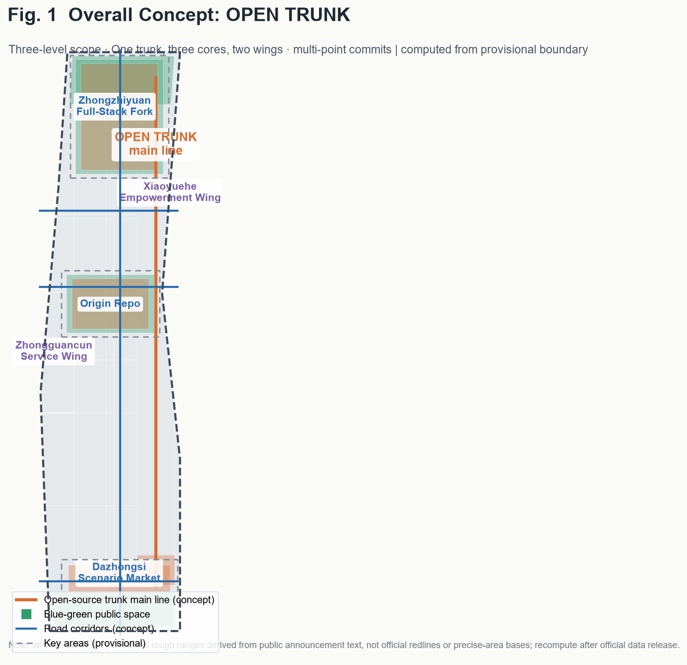
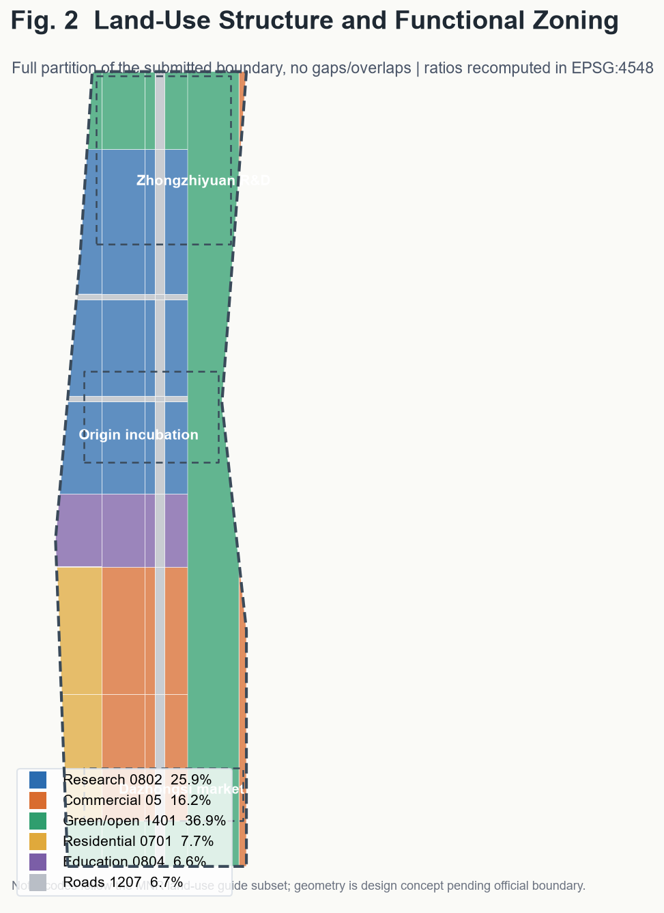
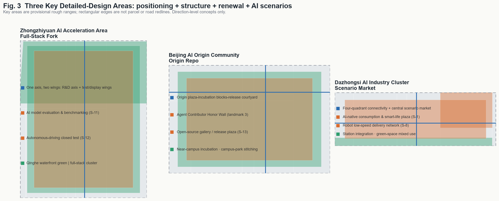
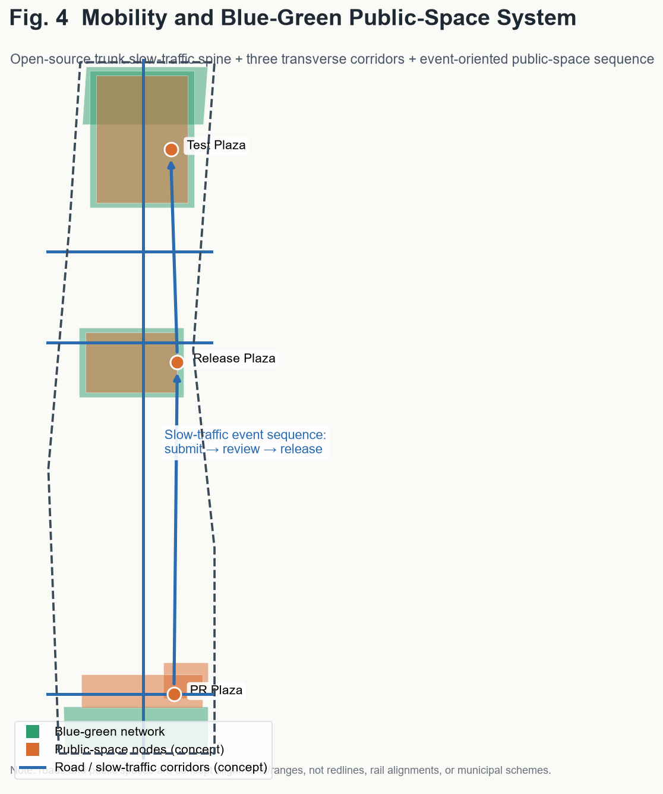
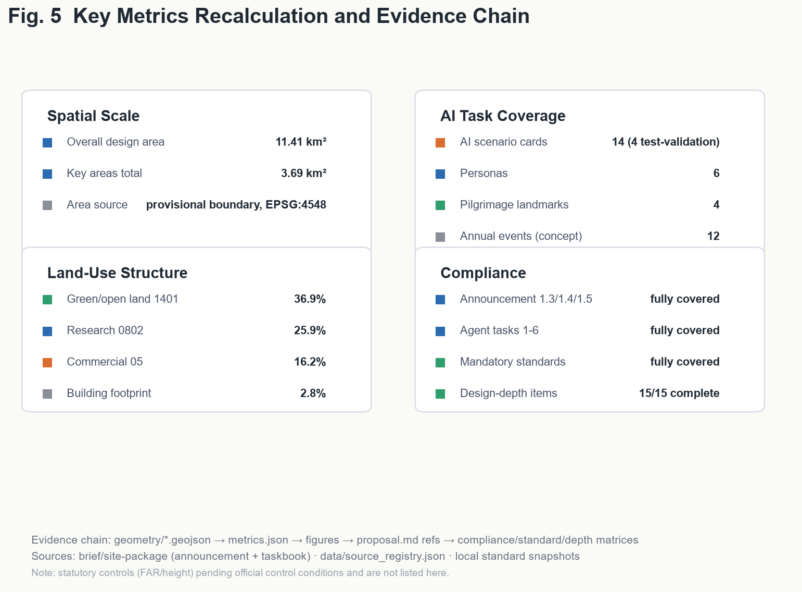

# OPEN TRUNK: Treating the Jing-Zhang Railway Heritage Park as a Committable, Mergeable, Releasable City Main Branch

This English version is a complete counterpart of the authoritative Chinese `proposal.md`. Geometry, metrics, matrices, drawings, and `visual/index.html` are cross-checked deliverables; all figures, spatial proposals, and metrics are concept-level suggestions pending official data.

## 1. Design Basis and Data Inventory

The proposal is grounded in the official prequalification announcement of the Centennial Jing-Zhang AI Innovation Belt international urban design solicitation, the machine-readable `brief/site-package/`, and the agent-facing open-call taskbook (three positionings, five functions, three key areas plus two wings, six tasks, unified boundary clause). Public-data usage boundaries follow `data/source_registry.json`; the processed fact pack is navigation only. The site and key-area geometries come from `brief/site-package/geometry/provisional_boundaries.geojson`.

**Compliance position**: as of the retrieval date (2026-08-07) no official precise `SITE_BOUNDARY` / `KEY_AREA` polygons are in the repository, so this package uses clearly labeled `provisional_constraint` geometry for generation, display, and temporary self-check only — not as official redlines, approval basis, or precise-area basis. When official polygons are released, all geometry layers and area metrics must be recomputed per `docs/data-workflow.md`.

All spatial implementation, event operation, branding, and policy mechanisms in this document are **concept proposals / reference schemes for professional teams to deepen**, not government conclusions or confirmed arrangements.

## 2. Three-Level Scope Framework

| Level | Scope | Area | Objective | Data anchor |
| --- | --- | --- | --- | --- |
| Study area | N 5th Ring–Jingzang Expwy–Xizhimen Outer St–Wanquanhe Rd | ≈43.6 km² | AI ecosystem, three key areas + two wings, future urban form | study chapter (text research, no precise geometry) |
| Overall design area | 1–2 km around heritage park | ≈11.4 km² | Urban renewal, control-detail-level urban design | `site_boundary.geojson` |
| Key detailed-design areas | three key areas | ≈368.4 ha (announced) | comprehensive implementation plan depth | `key_areas.geojson` |

The three levels cascade from industry strategy to overall urban design to block-level renewal. `land_use.geojson` fully partitions the submitted boundary without gaps or overlaps (coverage ratio ≈1.0); `buildings.geojson`, `roads.geojson`, `green_space.geojson`, `public_space.geojson`, `phasing.geojson`, and `constraints.geojson` express the design layers.

## 3. Study Area: Industry and Future City Research

### 3.1 Overall Concept and Naming System (agent.1)

**OPEN TRUNK**: treat the Jing-Zhang railway heritage park as a **city-level open-source main branch** — spaces, industries, scenarios, and operations along the corridor are open "commits / branches / merges / releases". A century ago this was China's first self-built trunk railway; today it becomes an open-source trunk where everyone can contribute, fork, and iterate.

- **Primary name**: 开源干线 (OPEN TRUNK); English: Open Trunk · Jingzhang AI Innovation Belt.
- **Three positionings as three releases**: heritage belt = Heritage Release; AI lifestyle belt = Experience Release; AI innovation belt = Future Release.
- **Three key areas as three core repos**: Zhongzhiyuan = Full-Stack Fork; Beijing AI Origin Community = Origin Repo; Dazhongsi = Scenario Market.
- **Two wings as branches**: Zhongguancun Technology Service Wing (global factor allocation); Xiaoyuehe Scenario Empowerment Wing.
- **Logo direction (concept)**: railway rail I-section + git branch polylines, sleepers as commit dots, a main line forking into three branches. Palette: heritage rust-orange, innovation tech-blue, AI signal-green. Concept logo mark:

Semantics: the rail I-section stands for a century of Jing-Zhang railway heritage and "self-built by Chinese"; the blue branch line flowing out of it is the open-source main branch; the three green commit dots are Zhongzhiyuan (Full-Stack Fork), Origin Community (Origin Repo), and Dazhongsi (Scenario Market); the upper/lower forks are the Zhongguancun Service Wing and the Xiaoyuehe Empowerment Wing.

**Five functions** map onto the key areas, wings, public-space network, and governance mechanisms per the taskbook.

### 3.2 Regional Synergy and Global Hub Linkage (agent.2 extension, concept)

OPEN TRUNK is not an isolated linear space but the **central trunk of the Haidian and Beijing-Tianjin-Hebei innovation network**. Concept mechanisms:

- **Future Science City**: Zhongzhiyuan acts as the pilot-validation/transfer station for Future Science City's frontier research spillover ("R&D → validation" relay).
- **Huairou Science City**: the Origin Community builds an open data & model-interoperability node serving large-science-facility compute and data needs ("facility → data → model" loop).
- **Beijing E-Town (Yizhuang)**: Zhongzhiyuan's test-validation scenarios connect with E-Town's mass-production base for intelligent connected vehicles and robotics ("test → pilot → mass production" chain).
- **Beiwai Community (northern Zhongguancun innovation community)**: the Xiaoyuehe wing co-incubates open-source software and AI scenarios with Beiwai's software industry.
- **Capital airport and international innovation cities**: Dazhongsi's international communication center and innovation week link global AI city networks (Silicon Valley, Kendall Square, etc.), raising global visibility and recognition.
- **Beijing-Tianjin-Hebei**: along the Jing-Zhang railway history axis and high-speed rail network, form a "data-compute-application" regional division with the Jing-Zhang sports/culture belt and Zhangjiakou data industry; the open-source trunk acts as the main corridor for regional AI collaboration.

All synergies are concept-level directions requiring professional deepening with each entity [source:AGENT-TASKBOOK][standard:PROJECT-OFFICIAL-ANNOUNCEMENT].

### 3.3 AI Industry Factor Support and Institutional Mechanisms (agent.2 extension, concept)

Five factors sustain the AI ecosystem (concept): **compute** — a public compute-dispatch node at Zhongzhiyuan offering affordable compute to SMEs and universities ("central + edge + device" three-tier network, scale pending professional study); **data** — an open data catalog concept at the open-source achievement gallery with sandboxed public-data opening, and Dazhongsi as a compliant data-trading and scenario-application venue; **capital** — an "open-source fund + angel incubation" linkage concept at the Origin Community plus a developer residency with free seats, compute vouchers, and mentors; **scenarios** — a standardized "test-display-commercialize" open mechanism with scenario calls, safety assessment, privacy review, and human-in-the-loop checks; **institutions** — AI governance global discourse via the open-source compliance sandbox (S-5), agent interoperability evaluation (S-13), and public-safety incident response (S-10), referencing public AI governance frameworks then localizing them.

### 3.4 Global AI Innovation Ecosystem Cases (agent.2)

Six public cases inform the design: Silicon Valley (university venture capital network), Kendall Square Boston (lab density + renewal), London King's Cross (railway heritage renewal + knowledge economy), one-north Singapore (government-led multi-stakeholder operation), Seoul DMC (content clustering + test-display integration), and Shenzhen Nanshan (industry-chain iteration). Their mechanisms translate into: near-campus incubation (Origin Repo), full-stack R&D (Zhongzhiyuan), scenario testing and experience trading (Dazhongsi), global factor allocation (Zhongguancun wing), and scenario empowerment (Xiaoyuehe wing).

### 3.5 Future AI City Form

An "evolvable city": built incrementally like open-source software, accepting contributions continuously — scenario nodes can be added or removed, public spaces tested, operation mechanisms iterated. Spatial expression: research land ≈25.9%, commercial ≈16.2%, green/open land ≈36.9%, residential ≈7.7%, education ≈6.6%, roads ≈6.7% (recomputed from submitted geometry).

## 4. Overall Design Area: Urban Renewal and Control-Detail-Level Design

Spatial structure: **one trunk, three cores, two wings, multi-point commits** — the heritage park green belt as the N-S open-source trunk; three key areas as core repos; two wings as service/empowerment branches; 14 AI scenario nodes distributed along the belt.

Renewal framework (concept): (1) trunk activation — release inefficient space along the park and stitch east-west slow-traffic gaps; (2) stock renewal — retain and renovate research/commercial stock, with modest new construction expressed as five building clusters; (3) new-build control — new buildings concentrated in Zhongzhiyuan and Dazhongsi redevelopment parcels, with FAR/height/setback listed as pending official control conditions; (4) retain/renovate/demolish — "retain+renovate" along the park, "renovate+new" inside key areas, demolition only for professionally assessed inefficient/dilapidated buildings.

## 5. Key Detailed-Design Areas

All three key areas reach comprehensive-implementation-plan urban design depth (direction-level concepts; boundaries are provisional).

### 5.1 Zhongzhiyuan AI Autonomous-Innovation Acceleration Area (Full-Stack Fork)

One axis, two wings (central R&D axis + test/display wings); full-stack innovation building cluster as anchor; AI model evaluation & benchmarking ground and autonomous-driving closed test (S-11/S-12); test-validation plaza; retain/renovate/new classification and building form (modular "algorithm boxes" with rooftop test and PV) as concepts; risks: control-plan adjustment, land rights, non-surveyed massing.

### 5.2 Beijing AI Origin Community (Origin Repo)

Three-fold structure (origin plaza–incubation blocks–release courtyard); incubation cluster via stock renovation; contributor honor wall, open-source achievement gallery, AI education corridor (S-4/S-13/S-14); station-integrated mobility; risks: university land rights and heritage sensitivity.

### 5.3 Dazhongsi AI Industry Cluster (Scenario Market)

Four-quadrant pedestrian connectivity + central scenario market; smart commerce cluster; robot low-speed delivery (S-8) and intelligent lifestyle (S-1/S-6/S-9/S-10); smart life plaza; risks: green-space mixed use and station integration require special studies.

### 5.4 Two Wings (Concept)

**Zhongguancun Technology Service Wing** (west): capital-data-compliance-internationalization services along a N-S service belt (CON-002 concept zone), hosting open-source compliance sandbox (S-5), agent investment & enterprise-service Copilot (S-9), and international outreach center. **Xiaoyuehe Scenario Empowerment Wing** (east): scenario test-experience-demonstration chain along the riverside green belt (CON-003), hosting robot delivery (S-8), digital-twin park guide (S-7), and public-safety response (S-10); stitched to the trunk by three transverse roads.

## 6. AI Innovation Ecosystem, Personas, and AI+ Scenarios

### 6.1 User Personas (6, concept)

AI founders/developers; university faculty/students/researchers; enterprise AI engineers; local residents/families; international visitors/investors; city managers/public — each mapped to spaces and scenario cards.

### 6.2 AI Scenario Cards (14, including 4 industry test-validation)

S-1 station-integrated transit; S-2 slow-traffic-first signals & accessible navigation; S-3 community AI health station; S-4 open-source AI training corridor; S-5 open-source compliance sandbox; S-6 agent government-service hall; S-7 digital-twin park guide; S-8 robot low-speed delivery; S-9 investment & enterprise-service Copilot; S-10 city-agent incident response; **S-11** AI model evaluation & benchmarking ground (test-validation); **S-12** autonomous-driving closed/semi-open test (test-validation); **S-13** agent interoperability & security evaluation (test-validation); **S-14** open-source dataset/model contribution wall (test-validation). All scenarios state data source, privacy boundary, human review, operator, visualization layer, and risk; immature technologies are not presented as deployable.

## 7. Land Use, Building Scale, and Retain/Renovate/Demolish

Land use and building scale are fully recomputable from `geometry/*.geojson` and `metrics.json`: land use fully covers the boundary without gaps/overlaps (53 polygons, coverage 0.999994); building footprint ≈32.0万 m² (concept massing, ≈2.8% of site); FAR and height are `unknown` pending official control conditions; retain/renovate/demolish conclusions are direction-level concepts pending official data and professional assessment.

**Directional intensity reference (concept, non-authoritative)**: to support later professional work, the following indicative ranges are given based on site conditions and comparable tech-park cases (final values are subject to official control plans; this range is not advice or approval basis): Zhongzhiyuan FAR 2.0–3.0 / 60–100 m R&D towers; Origin Community FAR 1.8–2.5 / 30–60 m near-campus scale; Dazhongsi FAR 2.5–3.5 / 80–120 m station-area commercial landmark. `floor_area_ratio` remains `unknown` in `metrics.json` until official control conditions replace it [metric:floor_area_ratio][depth:development_intensity_controls].

## 8. Transport, Rail, Municipal, and Public Services

All transport/rail/municipal/service organization in this section is **concept-level**: one N-S open-source trunk slow-traffic spine + three transverse corridors ("one vertical, three horizontal" skeleton) per `roads.geojson`; station-integrated connectivity at Dazhongsi and Origin-area stations; slow-traffic gap stitching along the park; grouped parking and shared-bike hubs at station/plaza/block entries; distributed energy, edge compute, IoT sensing as concept directions pending engineering studies; "15-minute AI service circle" concept via S-3 and S-6 nodes.

## 9. Blue-Green Space, Public Space, and Cityscape

Continuous green network (Qinghe riverside belt, heritage park corridor, southern parks); event-oriented public-space sequence (PR plaza, release plaza, test-validation plaza, smart-life plaza). **Four AI pilgrimage landmarks (concept)**: PR Plaza (public submission stage), Origin Release Plaza / open-source achievement gallery, Agent Contributor Honor Wall (records GitHub names and agent names, echoing the milestone-engraving mechanism), and Zhongzhiyuan Test-Validation Plaza. Cityscape palette: rust-orange (history), tech-blue (innovation), signal-green (AI) — a clear, rational, iterable "open-source aesthetics", rejecting kitsch landmarks.

### 9.1 Culture Narrative (agent.5, concept)

Three timelines meet on one trunk: Heritage axis (railway trunk, Zhan Tianyou spirit) via track remains and Qinghuayuan station node; Innovation axis (Zhongguancun trunk) via the tech-service wing and university belt; Future axis (AI trunk) via the open-source gallery, honor wall, and plazas. A "one trunk, three axes" signage system: rail I-section + git branch geometry, rust-orange/retro type for heritage, tech-blue/monospace for innovation, signal-green/variable type for AI. Spatial storyline "Jingzhang origin → Zhongguancun node → open-source release ground" coincides with the public-space sequence. International narrative: "OPEN TRUNK: where a century-old railway becomes an open-source city", with all materials labeled concept and authored. Heritage display and signage require special reviews before deepening.

## 10. Renewal Project List, Implementation Policy, and Phasing

Concept project list: open-source trunk slow-traffic spine (phase 1), Origin incubation-block renewal (phase 1), contributor honor wall (phase 1), Zhongzhiyuan full-stack R&D cluster (phase 2), test-validation plaza (phase 2), Dazhongsi scenario market and four-quadrant connectivity (phase 3), Xiaoyuehe empowerment wing (phase 3).

Phasing per `phasing.geojson` as three releases — phase 1 "pioneer commit" (Origin), phase 2 "mainline merge" (Zhongzhiyuan), phase 3 "full-chain release" (Dazhongsi). Concept timelines: near-term ~0-3y (release plaza + PR platform, honor wall, trunk demo section); mid-term ~3-6y (R&D cluster shell, test plaza, evaluation scenarios); long-term ~6-10y (scenario market, four-quadrant connectivity, wing operations). All timelines and milestones are concepts pending government approval and professional deepening.

### 10.0 Pilot-First Implementation and Verifiable Data Boundaries (concept)

For implementation feasibility, a "small pilot → evaluate → scale" path (concept): **pilot areas** — a 0.5 km sandbox around the Origin release plaza first runs the honor wall + open-source gallery + PR platform; Dazhongsi four-quadrant pilot then runs the smart-life plaza and robot delivery. **Participants** — a four-party collaboration (government coordination, market operation, developer-community participation, university research support); each pilot has one lead operator, one supervising authority, and one developer team. **Verifiable metrics** — each pilot sets publicly checkable quantitative goals (e.g., open-scenario sessions ≥ X, honor-wall contributors ≥ X, public satisfaction ≥ X%) to be fixed at pilot approval and registered as updatable metrics in `metrics.json`. **Data boundaries** — each scenario has a "one scenario, one data card" with data source, retention, de-identification, and human-review nodes, managed under the open-source compliance sandbox (S-5); scenarios failing safety and privacy evaluation cannot enter public pilot. **Exit mechanism** — 6-12 month evaluation period; underperforming scenarios exit or go offline, avoiding "AI for AI's sake".

### 10.1 Global AI Innovation Event System and Long-Term Operation (agent.6)

Concept annual system of 12 signature events: Jingzhang Open Source Conference (flagship); quarterly Release Day (×4); annual hackathon; contributor summit; AI test open season; developer residency; international outreach week; AI scenario roadshow; open-source compliance workshop; agent interoperability evaluation festival; annual honor-wall unveiling; year-end Open Trunk release gala. Operation mechanism: "PR submit → review → merge → release" four-step community process; contributor records feed the honor wall; Dazhongsi market opens in test-display-commercial three states; Zhongzhiyuan test ground accepts qualified institutions by appointment. All events, funding, and outreach are concepts, not confirmed government arrangements.

## 11. Metrics, Recalculation, and Compliance Matrix

`metrics.json` holds 20 metrics: area (site 11.41 km²; key areas 3.69 km² recomputed, ≈368.4 ha announced); structure (green/open land 36.9%, green-space layer 28.6%, public space 21.6%, research 25.9%, commercial 16.2%, education 6.6%, residential 7.7%, building footprint 2.8%, roads 6.7%); tasks (14 scenario cards, 6 personas, 4 landmarks, 3 phases, 12 annual events). FAR/height are unknown pending official controls. Compliance: announcement 1.3/1.4/1.5 and agent.1–6 fully covered in `compliance_matrix.json`; all mandatory standards in `standard_matrix.json`; all 15 design-depth items `complete` in `design_depth_matrix.json`.

## 12. Risk, Copyright, and Compliance

- Data compliance: public or cleared sources only; no non-public drawings, internal controls, or privacy data.
- Boundary limitation: all geometry is provisional; not for official redlines, approval, or precise-area; must be recomputed after official release.
- Concept attribute: all spatial, operational, branding, and policy content are concept suggestions, not government conclusions or commitments.
- Copyright: original naming/logo/landmarks/honor-wall concepts; no unauthorized fonts, images, trademarks, or portraits; third-party cases cited as public references. See `report/copyright_statement.md`.
- AI-generated responsibility: the author is responsible for facts, citations, copyright, and final expression.
- Pending data: official boundaries, control conditions (FAR/height/setback), building ownership, municipal capacity, engineering feasibility, and university land-right clearance.

## 12.1 Figure Set

## 13. References

See the Chinese `proposal.md` reference list (design brief, site package, geometry, standards, source registry, processed fact pack, schemas).
