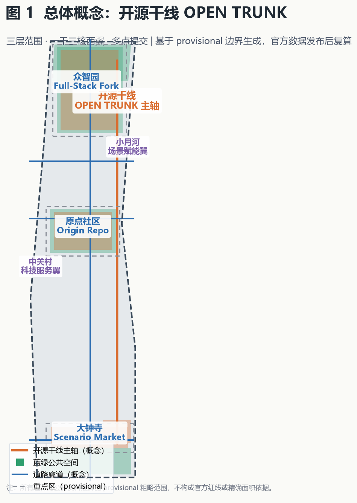
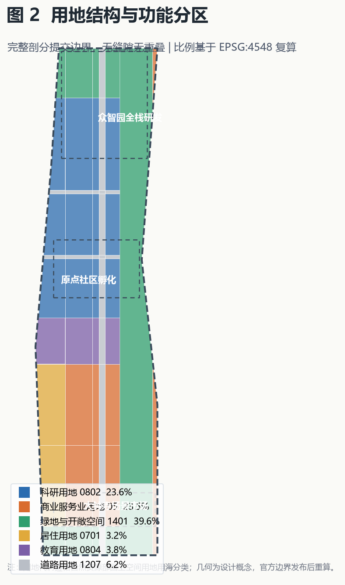
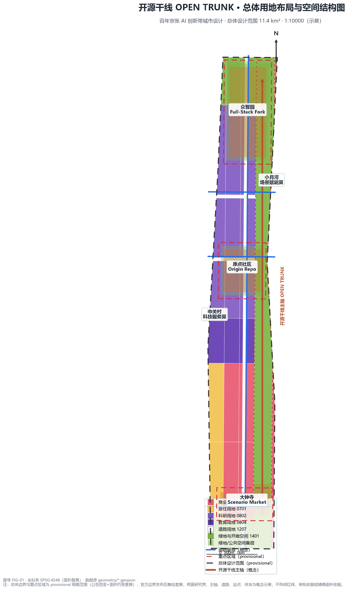
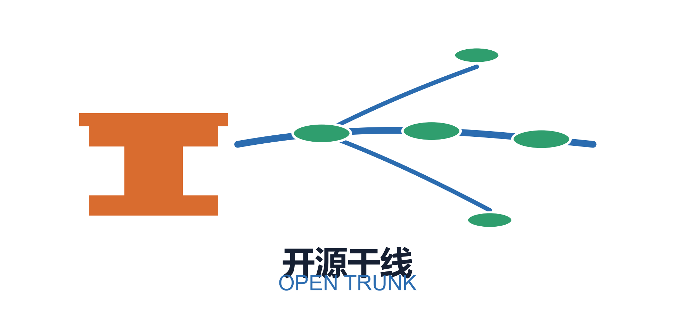
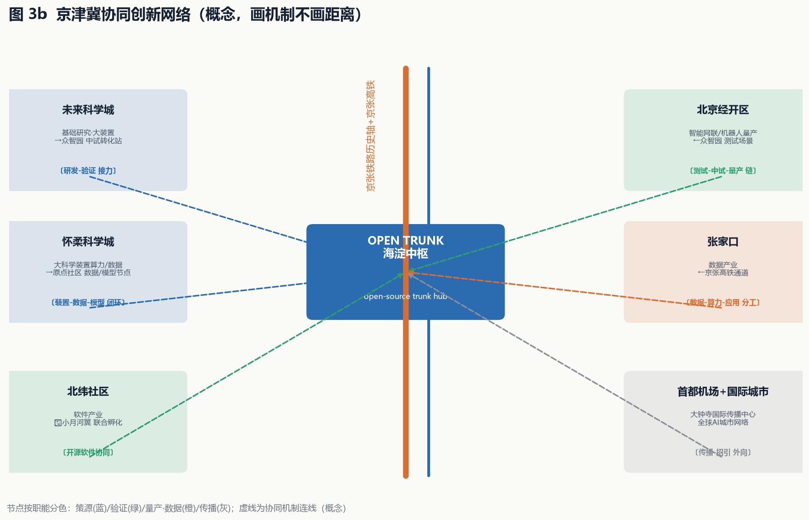
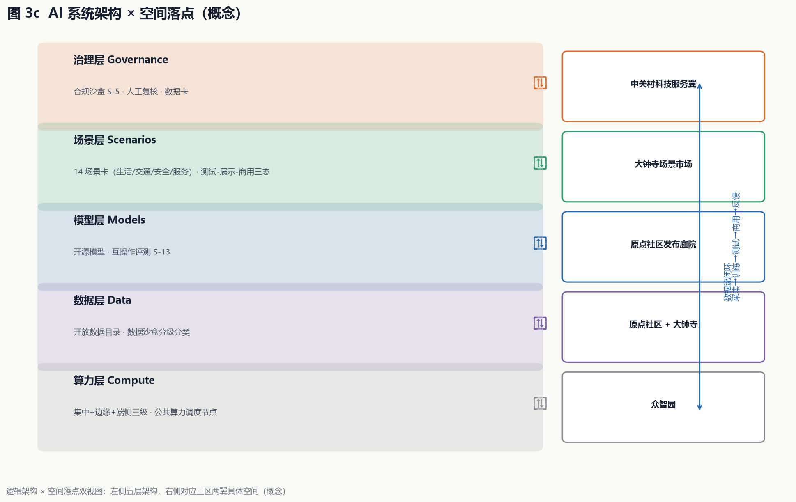
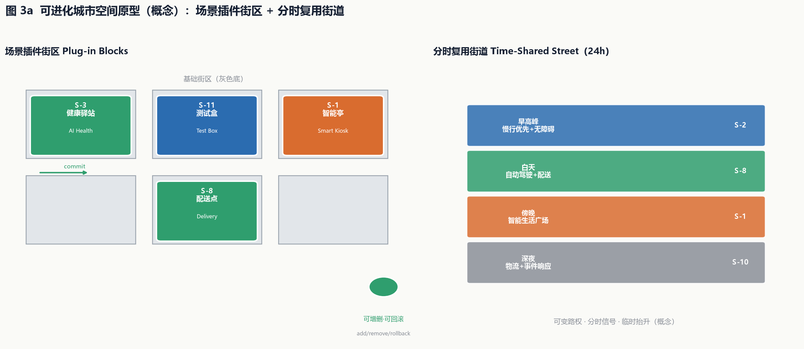
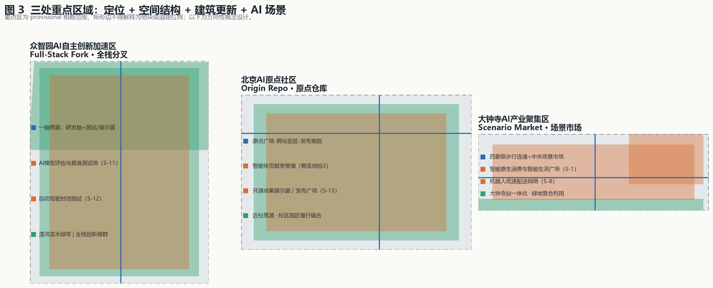
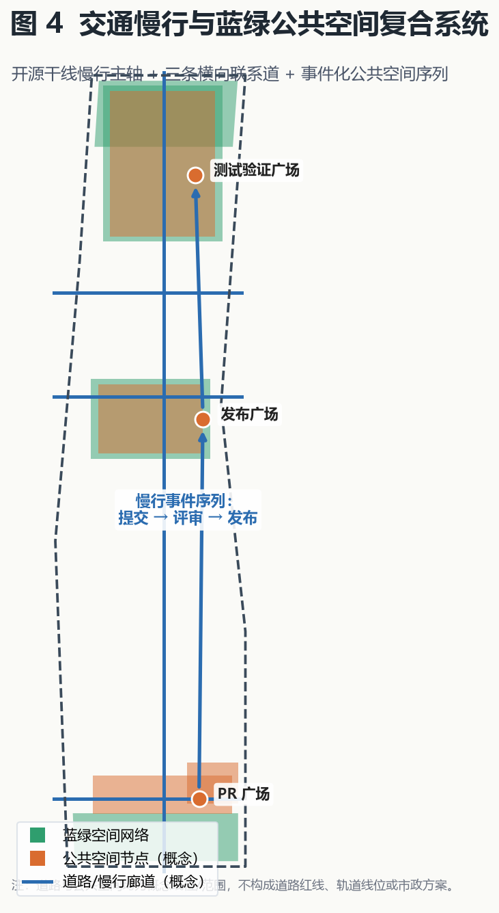
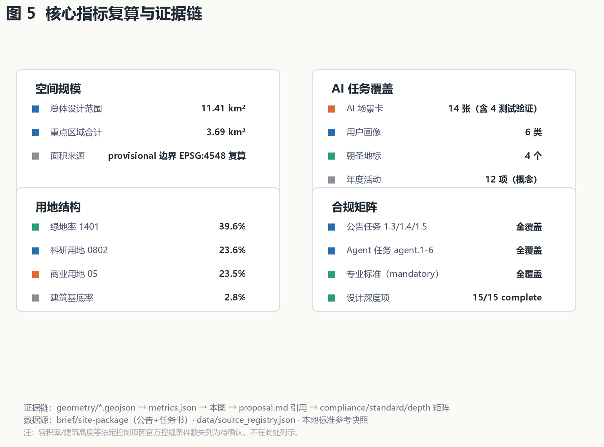

# 开源干线 OPEN TRUNK：把京张铁路遗址公园当作一条可提交、可合并、可发布的城市主分支

## 三分钟执行摘要（Executive Summary）

**一句话概念**：把京张铁路遗址公园视为一条城市级开源主干线（main branch）——百年京张铁路的"中国自主"精神，转化为今天人人可提交（commit）、可合并（merge）、可发布（release）的开源城市创新干线。

**三层范围**：统筹研究范围 43.6 km²（AI 产业生态与三区两翼）→ 总体设计范围 11.4 km²（城市更新与控规深度）→ 重点区域范围约 368.4 ha（三处重点区详细设计）[metric:site_area_sqm][metric:key_detailed_design_area_sqm]。

**三大空间动作**（概念）：
1. **一干三核两翼**：遗址公园绿带为开源主轴；众智园（全栈分叉）、原点社区（原点仓库）、大钟寺（场景市场）为核心；中关村科技服务翼、小月河场景赋能翼为分支。
2. **多点提交**：14 张 AI 场景卡（含 4 张产业测试验证）沿带分布，公共空间组织为"PR 广场-发布广场-测试验证广场"事件序列 [metric:ai_scenario_node_count]。
3. **试点先行**：原点社区 0.5 km 沙盒首期试点，经 6-12 个月评估后分级放量；配套投资资金结构、责任分工矩阵与决策门机制（见"试点先行与可核验数据边界"）。

**三个可核验指标**（方向性目标，正式立项时以批复为准）：场景开放场次一期 ≥24 场/年 [metric:pilot_scenario_sessions_target]；贡献者登记 ≥200 人 [metric:pilot_contributor_target]；试点综合达标率 ≥80% 进入二期 [metric:pilot_gate_pass_rate_target]（详见"实施政策"与投资资金结构表 [metric:capex_range_by_phase]）。

**主要风险与边界**：全部几何为 provisional 粗略范围，官方边界发布后整包复算；容积率/建筑高度等法定控制项待官方控规确认（`floor_area_ratio=unknown`）[metric:floor_area_ratio]；本文全部内容为概念建议，不构成政府审定结论或实施承诺。

## 现状基线诊断与问题研判（任务书相关性强化，概念）

在提出方案前，先以公开资料梳理一带的现实基础与结构性问题（均为公开或已清权资料，具体数值以官方发布为准）：

- **产业基础**：海淀是全国 AI 产业与智力资源最密集的区域之一，高校院所、头部企业、独角兽与科技服务资源集聚；一带串联清华、北大等高校与中关村创新网络 [source:OFFICIAL-ANNOUNCEMENT][source:AGENT-TASKBOOK]。
- **现状问题（结构性障碍）**：① 大院围墙与园区封闭造成慢行断点与公共空间割裂；② 铁路遗址公园两侧城市功能缝合不足，东西向联系薄弱；③ 高校、园区、站点之间的"产-学-研-城"接口松散，成果转化缺少空间载体；④ 传统存量楼宇与 AI 全栈研发需求错配，低效空间待更新；⑤ 轨道站点与周边街区一体化不足，"出站即场景"的体验尚未形成 [depth:existing_conditions_diagnosis][depth:risk_missing_data]。

**方案响应逻辑**：开源干线概念正是针对上述问题的系统性回答——以遗址公园为缝合主轴（解决 ①②），以三区两翼为创新接口（解决 ③），以存量更新+测试验证载体（解决 ④），以站点一体化和场景卡（解决 ⑤）。现状基线数据将在官方边界与统计口径发布后按 `docs/data-workflow.md` 更新 [source:SOURCE-REGISTRY]。

## 设计依据与资料清单

本方案以北京市规划和自然资源委员会海淀分局发布的《百年京张AI创新带城市设计国际方案征集资格预审公告》为第一依据 [source:OFFICIAL-ANNOUNCEMENT][standard:PROJECT-OFFICIAL-ANNOUNCEMENT]，并以 `brief/site-package/` 中登记的临时粗略边界、重点区域、枚举、指标区间和来源清单为机器可读依据 [source:SITE-PACKAGE]。面向智能体的十条共创原则、三大定位、五大功能、三区两翼、六项任务和统一边界条款来自用户提供且已清权的任务书摘录 [source:AGENT-TASKBOOK][standard:PROJECT-AGENT-OPEN-CALL-TASKBOOK]。公开资料用途边界以 `data/source_registry.json` 为准 [source:SOURCE-REGISTRY]，处理资料包仅作阅读导航 [source:PROCESSED-FACT-PACK]。边界与重点区域几何来自 `brief/site-package/geometry/provisional_boundaries.geojson` [source:BOUNDARY-SOURCE][source:KEY-AREA-SOURCE]。

关键合规判断：截至检索日（2026-08-07），仓库内不存在官方精确 `SITE_BOUNDARY` 与 `KEY_AREA` 多边形，官方资格预审文件包需密码下载。因此本包使用明确标注的 `provisional_constraint` 几何 [data:geometry/site_boundary.geojson#SITE-001][data:geometry/key_areas.geojson#PROV-KEY-001]，仅用于方案生成、展示和临时自检，不作为官方红线、审批依据或精确面积复算依据 [metric:site_area_sqm]。组织方数据缺口不阻断内容评分；官方多边形发布后，本包全部几何图层与指标需按 `docs/data-workflow.md` 重算。

写作原则：`proposal.md` 是主语言主体方案，每个章节回答"设计判断是什么、为什么、落到哪个图层/指标/标准、资料缺口是什么"。本文所有空间落地、活动运营、品牌传播与政策机制均表述为**概念建议、参考方案或可供专业团队深化研究**，不构成政府审定结论或已确定实施安排 [standard:PROJECT-AGENT-OPEN-CALL-TASKBOOK]。

## 三层范围工作框架

方案按公告确定的三层范围组织 [standard:PROJECT-OFFICIAL-ANNOUNCEMENT][depth:three_level_scope_framework][depth:existing_conditions_diagnosis]：

| 层级 | 范围 | 面积 | 工作目标 | 数据落点 |
| --- | --- | --- | --- | --- |
| 统筹研究范围 | 北五环-京藏高速-西直门外大街-万泉河路 | 约43.6 km²（公告值） | AI产业生态、三区两翼、未来城市形态 | 统筹研究章节（文字研究，无精确几何） |
| 总体设计范围 | 遗址公园周边1-2公里 | 约11.4 km² | 城市更新、控规深度城市设计 | [data:geometry/site_boundary.geojson#SITE-001] |
| 重点区域范围 | 三处重点片区 | 约368.4 ha（公告约值） | 规划综合实施方案深度 | [data:geometry/key_areas.geojson#PROV-KEY-001][metric:key_detailed_design_area_sqm] |

三层范围从产业战略、总体城市设计、重点片区详细设计逐级落实：统筹研究回答"带向何处"，总体设计回答"空间如何组织"，重点区域回答"地块如何更新"，三处重点区域合计约 3.69 km²（复算）[metric:key_detailed_design_area_sqm][metric:key_area_count]。`geometry/land_use.geojson` 对提交边界做完整无缝隙剖分 [depth:land_use_layout][metric:land_use_coverage_ratio]，`geometry/buildings.geojson` 表达建筑基底簇群 [metric:building_footprint_area_sqm]，`geometry/roads.geojson` 表达道路廊道，`geometry/green_space.geojson` 与 `geometry/public_space.geojson` 表达蓝绿公共空间，`geometry/phasing.geojson` 表达分期 [metric:phase_count]，`geometry/constraints.geojson` 锁定遗址保护约束 [data:geometry/constraints.geojson#CON-001]。

本方案使用的边界为 provisional 粗略替代边界，矩形边不等同于地块或道路红线；官方多边形替换后，land use、buildings、roads、green space、public space、phasing 与全部面积类指标均需重算。

## 统筹研究范围产业与未来城市研究

### 总体概念与命名体系（agent.1）

方案提出总体概念**「开源干线 OPEN TRUNK」**：把京张铁路遗址公园视为一条**城市级开源主干线（main branch）**，沿线空间、产业、场景与运营都是"可提交（commit）、可分支（branch）、可合并（merge）、可发布（release）"的开放成果 [source:AGENT-TASKBOOK]。这与百年京张铁路"中国自主建造的第一条干线铁路"的历史地位形成双重隐喻——一百年前这里是铁路干线，一百年后这里是**开源干线**：人人可贡献、可复刻、可迭代的城市创新主干道。

命名体系（概念建议）：

- **主名称**：开源干线（OPEN TRUNK）；**英文名**：Open Trunk · Jingzhang AI Innovation Belt。
- **三大定位转译为三个发布版本**：百年京张文化带 = "历史版本（Heritage Release）"；都市AI生活体验带 = "体验版本（Experience Release）"；AI融合创新带 = "未来版本（Future Release）"。
- **三区即三个核心仓库**：众智园 = **全栈分叉（Full-Stack Fork）**——把海淀AI全栈能力"分叉"为可独立演进又回合并主干的自研体系；北京AI原点社区 = **原点仓库（Origin Repo）**——AI创新的"出生地与上游（upstream）"；大钟寺 = **场景市场（Scenario Market）**——AI场景"上架、测试、商用"的交易与体验场。
- **两翼即两个分支（branch）**：中关村科技服务翼 = 要素全球化分支；小月河场景赋能翼 = 场景赋能分支。
- **Logo 方向（概念）**：以铁路钢轨的"工字截面"与 git 分支折线叠加，轨枕转化为提交节点（commit dots），整体形似一条向南北延伸并分出三支的主干线。主色用京张铁路的铁锈橙、中关村的科技蓝、AI 新文化的信号绿。方案 Logo 标识（概念版）如下：

标识语义：铁轨工字截面代表百年京张铁路的历史干线与"中国自主"精神；从中引出的蓝色分支线代表开源主干线（main branch），三个绿色提交节点对应众智园（全栈分叉）、原点社区（原点仓库）、大钟寺（场景市场）三个核心仓库；上下分叉代表中关村科技服务翼与小月河场景赋能翼两个分支。

**五大功能**：AI全栈自主创新体系、世界级AI创新生态、AI+场景赋能新范式、智能化AI活力城市、AI治理全球话语权——分别落到众智园、原点社区、小月河翼、公共空间网络与治理机制 [source:AGENT-TASKBOOK]。

### 区域协同与全球高地联动（agent.2 拓展，概念）

开源干线不是孤立的线性空间，而是海淀乃至京津冀创新网络中的**中枢主线（trunk）**。方案提出以下区域协同机制（概念建议）：

- **与未来科学城协同**：承接未来科学城的基础研究与大科学装置外溢，众智园定位为"前沿成果的中试验证与转化站"，与未来科学城形成"研发-验证"接力。
- **与怀柔科学城协同**：面向大科学装置的 AI 算力与数据需求，原点社区建设"开放数据与模型互操作节点"，与怀柔形成"装置-数据-模型"闭环。
- **与北京经开区协同**：智能网联汽车与机器人产业方面，众智园测试验证场景与经开区量产基地衔接，形成"测试-中试-量产"链。
- **与北纬社区（中关村北部创新社区）协同**：小月河场景赋能翼与北纬社区软件产业协同，共建开源软件与 AI 场景联合孵化。
- **与首都国际机场及国际创新城市协同**：通过大钟寺国际传播中心与国际创新周，链接全球 AI 城市网络（对标硅谷、肯德尔广场等），提升一带全球关注度与辨识度。
- **京津冀协同**：依托京张铁路历史轴与高铁网络，与京张体育文化旅游带、张家口数据产业形成"数据-算力-应用"区域分工；开源干线作为京津冀 AI 协同的主通道。

上述协同均通过 `compliance_matrix.json` 登记为任务书 agent.2 的响应内容，属于方向性概念，具体合作机制需专业团队与各主体深化 [source:AGENT-TASKBOOK][standard:PROJECT-OFFICIAL-ANNOUNCEMENT]。

### 全球 AI 创新生态案例（agent.2）

5-8 个全球 AI 创新生态案例的可读摘要（全部为公开资料，仅作经验借鉴，不构成落地承诺）：

| 案例 | 关键机制 | 对海淀的启示 |
| --- | --- | --- |
| 美国硅谷（斯坦福-沙丘路-门洛帕克） | 大学策源+风险资本+企业家网络闭环 | 原点社区的"近校创新+成果转化"回路 [source:AGENT-TASKBOOK] |
| 美国波士顿肯德尔广场 | 实验室密集区+存量楼宇更新+科研孵化一体 | 众智园全栈自研与存量更新结合 |
| 英国伦敦国王十字街区 | 铁路工业遗址更新+知识经济集聚+公共空间先行 | 京张遗址公园活力带的东西缝合策略 |
| 新加坡纬壹科技城 | 政府主导+多主体共治+智慧园区运营 | 三区两翼的统筹治理与长期运营机制 |
| 韩国首尔数字媒体城 DMC | 内容产业集聚+测试展示一体化 | 大钟寺"场景市场"的体验经济模型 |
| 深圳南山科技园 | 龙头带动+产业链完整+快速迭代 | AI+硬件/机器人的测试验证场景 |

上述案例经验转化为可落地的机制：近校策源（原点社区）、全栈自研（众智园）、场景测试与体验交易（大钟寺）、要素全球化配置（中关村翼）、场景开放赋能（小月河翼）[depth:overall_spatial_structure]。

### AI 产业要素保障与制度机制（agent.2 拓展，概念）

支撑 AI 创新生态需要"算力、数据、资本、场景、制度"五类要素的持续供给 [source:AGENT-TASKBOOK]：

- **算力保障（概念）**：众智园设置"公共算力调度节点"，面向中小企业与高校提供普惠算力；依托海淀算力基础设施，形成"集中+边缘+端侧"三级算力网络。具体规模与投资列为待专业测算。
- **数据要素（概念）**：依托开源成果展示廊建设"开放数据目录"概念，推动公共数据沙盒化开放；大钟寺场景市场作为数据要素的合规交易与场景化应用展示场。
- **资本与孵化（概念）**：原点社区规划"开源基金 + 天使孵化"联动机制概念，链接海淀创投网络；开发者驻留计划提供"免费工位+算力券+导师"组合（概念）。
- **场景开放机制（概念）**：以"测试-展示-商用"三态开放为核心，建立场景征集、安全评估、隐私审查、人工复核的标准化流程（概念），保证 AI 场景可感知、可推广 [depth:metrics_recalculation]。
- **制度与治理（概念）**：AI 治理全球话语权通过开源合规沙盒（S-5）、智能体互操作评测（S-13）与公共安全事件响应（S-10）落地；治理标准建议参照公开的 AI 治理框架并在本地化后实施。

### 未来 AI 城市形态

方案提出"**可进化的城市**"：城市不是一次建成，而是像开源软件一样持续接受"贡献"——AI 场景节点可增删、公共空间可测试、运营机制可迭代 [source:AGENT-TASKBOOK]。落到空间上：`geometry/land_use.geojson` 中 `0802` 科研用地（约25.9%）支撑研发，`05` 商业用地（约16.2%）支撑场景市场与科技服务，`1401` 绿地与开敞空间用地（约36.9%）支撑蓝绿公共空间与遗址公园主轴 [metric:research_land_ratio][metric:commercial_land_ratio][metric:green_land_ratio]。

**AI 文化 / AI 社会 / AI 城市三定义（概念）**，回应公告"定义面向未来的 AI 文化、AI 社会、AI 城市"的任务 [source:OFFICIAL-ANNOUNCEMENT]：

- **AI 文化（开放共创文化）**：以"贡献-评审-发布"为内核的城市文化——开发者、居民、企业与高校共同向城市空间提交创意与场景，优秀贡献进入荣誉墙与里程碑碑刻；文化载体为开源成果展示廊、PR 广场与三轴导视系统 [source:AGENT-TASKBOOK]。
- **AI 社会（人机共治社会）**：以"AI 赋能、人工复核、数据合规"为运行准则的社会形态——AI 参与交通、健康、政务与公共服务，但保留人工复核节点与数据边界（见 14 张场景卡的隐私边界列）；治理话语通过开源合规沙盒（S-5）与智能体互操作评测（S-13）落地。
- **AI 城市（可进化城市）**：以"自适应的空间-场景-运营复合体"为特征——城市空间按需增删 AI 场景节点、公共空间可测试可回滚、运营机制按年迭代（见"可进化城市空间原型图"与"试点先行"机制）。

三定义共同支撑"三大定位"中的未来版本（AI 融合创新带），并对应 `compliance_matrix.json` 中公告 1.5.1.2 条目。

## 总体设计范围城市更新与控规深度城市设计

总体设计范围（约11.4 km²）以"**一干三核两翼、多点提交**"为空间结构 [depth:overall_spatial_structure]：

- **一干**：京张铁路遗址公园绿带（`1401`）为南北向开源主干线，复合慢行、文化、公共空间与AI展示功能 [data:geometry/land_use.geojson#LU-001][data:geometry/constraints.geojson#CON-001]。
- **三核**：众智园（北）、原点社区（中）、大钟寺（南）三处重点区，对应三个核心仓库。
- **两翼**：中关村科技服务翼（西侧科技服务带）、小月河场景赋能翼（东侧小月河沿线场景带）。两翼详细设计见本小节以下内容。

### 两翼详细设计（概念）

**中关村科技服务翼（Zhongguancun Technology Service Wing）**：位于总体设计范围西侧，依托中关村要素全球化配置能力，承载"资本-数据-合规-国际化"四类科技服务职能 [source:AGENT-TASKBOOK]。空间上以一条南北向科技服务带（`land_use.geojson` 中 `05` 商业服务业用地西侧序列）串接三个服务节点：开源合规沙盒（S-5）、智能体招商与企业服务 Copilot（S-9）、国际传播与招引转化中心 [data:geometry/land_use.geojson#LU-001][data:geometry/constraints.geojson#CON-002]。建筑形态以中高密度科技服务楼群为主，强调底层开放的公共服务界面与 24 小时创新服务；涉及高度、退线等控制条件列为待确认 [depth:height_massing_character]。

**小月河场景赋能翼（Xiaoyuehe Scenario Empowerment Wing）**：位于总体设计范围东侧，沿小月河蓝绿空间组织"场景测试-体验-示范"链 [source:AGENT-TASKBOOK]。空间上以 `green_space.geojson` 中的滨水绿带为骨架，串接机器人低速配送网络（S-8）、数字孪生公园导览（S-7）与公共安全事件响应（S-10）等场景 [data:geometry/green_space.geojson#GREEN-001][data:geometry/constraints.geojson#CON-003]。功能上强调"可测试、可展示、可推广"的场景实验室属性，与京张遗址公园主轴通过三条横向联系道（知春路、北五环南侧、大钟寺）实现慢行缝合 [data:geometry/roads.geojson#ROAD-002]。小月河蓝绿空间涉及蓝线、防洪与生态管控，相关约束列为待专项论证 [depth:blue_green_public_space]。
- **多点提交**：14 个 AI 场景节点（`SCENARIO_NODE` 概念层，见 AI 场景章节）分布全带 [metric:ai_scenario_node_count]。

城市更新总体框架 [standard:MOHURD-CONTROL-DETAILED-PLANNING][depth:renewal_project_list]：

1. **主轴活化（概念建议）**：建议推动遗址公园两侧"低效空间释放+公共空间缝合"，重点打通东西向慢行断点。
2. **存量更新（概念）**：科研用地与商业用地以保留改造为主、适度新建，`geometry/buildings.geojson` 表达五处建筑簇群（全栈创新楼群、孵化楼群、智能商业楼群、科技服务楼群、协同创新楼群）[metric:building_footprint_area_sqm]。
3. **新建控制**：新建建筑集中在众智园与大钟寺的可更新地块；建筑高度、开发强度、退线均列为**待正式控规条件确认**，不以推测值冒充审定指标 [depth:development_intensity_controls][depth:height_massing_character]。

**开发强度方向性参照（概念，非审定值）**：为便于专业团队后续论证，基于现状基底与同类科技园区案例给出如下**方向性区间**（最终以官方控规为准，本区间不构成建议或审批依据）：

| 重点区 | 容积率方向区间（概念） | 建筑高度方向区间（概念） | 说明 |
| --- | --- | --- | --- |
| 众智园 | 2.0–3.0 | 60–100 m（研发塔楼） | 对标科技园区研发地块 |
| 原点社区 | 1.8–2.5 | 30–60 m（近校尺度） | 控制体量呼应高校环境 |
| 大钟寺 | 2.5–3.5 | 80–120 m（商业地标） | 站点周边高强度开发 |

该区间仅用于说明空间构想的量级合理性，`floor_area_ratio` 在 `metrics.json` 中仍保持 unknown 状态，待官方控规条件补齐后替换 [metric:floor_area_ratio][depth:development_intensity_controls]。
4. **拆改留分类**（概念建议，非地块结论）：遗址公园沿线以"留改"为主，重点区内部以"改新"为主，拆除仅限经专业评估的低效、危旧建筑 [depth:retain_renovate_demolish]。

功能比例（基于提交几何复算）：科研 25.9%、商业 16.2%、居住 7.7%、教育 6.6%、道路 6.7%、绿地与开敞空间 36.9% [metric:research_land_ratio][metric:commercial_land_ratio][metric:residential_land_ratio][metric:education_land_ratio][metric:road_land_ratio][metric:green_land_ratio]。该比例支持"工作-生活-社交-学习"一体化城区目标：高绿地支撑创新交往与人才生活，高科研支撑全栈自研，商业支撑场景体验与科技服务。

## 重点区域详细设计

三处重点区域达到规划综合实施方案的城市设计深度 [depth:three_key_area_detailed_design]，均引用 `geometry/key_areas.geojson`。因边界为 provisional，以下结论均属方向性概念设计。

### 众智园AI自主创新加速区（Full-Stack Fork）

[data:geometry/key_areas.geojson#PROV-KEY-001]

- **定位**：AI全栈自主创新体系与AI治理全球话语权承载区。
- **空间结构**："一轴两翼"——中部研发轴 + 东西两侧测试与展示翼。
- **建筑更新**：以全栈创新楼群为锚（[data:geometry/buildings.geojson#BLDG-001]），沿轴布置算力、算法、数据、模型测试空间；保留高质量存量科研楼，改造低效空间。
- **拆改留分类（概念）**：保留五环路与清河沿线的生态与科研存量；改造园区内部低效楼宇为测试与展示空间；新建仅限研发轴核心地块，规模与高度待控规条件确认 [depth:retain_renovate_demolish]。
- **建筑形态（概念）**：研发楼群以方正、开敞、模块化的"算法盒子"形态为主，裙房设置连续展示界面，屋顶布置测试场地与光伏组件 [depth:height_massing_character]。
- **交通慢行**：接驳北五环与清河侧，设置测试验证广场 [data:geometry/public_space.geojson#PUBLIC-003]。
- **AI 场景**：AI 模型评估与基准测试场、自动驾驶封闭测试区（见场景卡 S-11、S-12）。
- **实施风险**：涉及控规调整与用地权属，需专业团队深化；建筑规模为概念簇群，非实测基底。

### 北京AI原点社区（Origin Repo）

[data:geometry/key_areas.geojson#PROV-KEY-002]

- **定位**：世界级AI创新生态的原点，近校策源+成果孵化+人才特区。
- **空间结构**："原点广场-孵化街区-发布庭院"三进结构。
- **建筑更新**：孵化楼群（[data:geometry/buildings.geojson#BLDG-002]）以存量改造为主，配建开源发布与展示空间；校区-园区慢行缝合。
- **拆改留分类（概念）**：保留高校校区、科研院所与优质居住存量；改造临街低效建筑为孵化与展示界面；新建仅限发布庭院与人才服务节点周边，严格控制体量以呼应近校尺度 [depth:retain_renovate_demolish]。
- **建筑形态（概念）**：以"可生长的孵化单元"为母题，小体量、多进深、强界面，鼓励底层架空与屋顶露台形成非正式交流空间 [depth:height_massing_character]。
- **交通慢行**：轨道站点一体化接驳，设发布广场 [data:geometry/public_space.geojson#PUBLIC-002]。
- **AI 场景**：智能体贡献荣誉墙、开源成果展示廊、AI 教育实训走廊（见场景卡 S-4、S-13、S-14）。
- **实施风险**：高校权属与文保约束敏感，荣誉展示与建筑改造均需逐项清权与审批。

### 大钟寺AI产业聚集区（Scenario Market）

[data:geometry/key_areas.geojson#PROV-KEY-003]

- **定位**：智能原生新业态与场景市场，AI+商业/消费/体验。
- **空间结构**："四象限步行连通+中央场景市场"——大钟寺站四象限以步行网络缝合，中央设智能生活广场 [data:geometry/public_space.geojson#PUBLIC-004]。
- **建筑更新**：智能商业楼群（[data:geometry/buildings.geojson#BLDG-003]），含机器人配送与智能终端体验空间。
- **拆改留分类（概念）**：保留站点周边已建成商业与商务存量；改造低效商业空间为智能体验与场景市场；新建仅限中央场景市场与绿地复合利用节点，规模待控规确认 [depth:retain_renovate_demolish]。
- **建筑形态（概念）**：以"场景舞台"为母题，商业楼群强调可变化的临街界面、数字屏幕与展示橱窗，中央场景市场采用通透、灵活的大空间 [depth:height_massing_character]。
- **AI 场景**：智能原生消费、AI 生活服务、低速配送（见场景卡 S-1、S-6、S-9、S-10）。
- **实施风险**：绿地复合利用与站点一体化需专项论证；四象限连通涉及道路与市政条件，属深化方向。

## AI 创新生态、人才画像与 AI+ 场景

### 用户画像（6 类，概念）[source:AGENT-TASKBOOK][depth:metrics_recalculation]

| 画像 | 需求 | 对应空间/场景 |
| --- | --- | --- |
| P-1 AI创业者/开发者 | 低成本起步、展示、融资、测试 | 原点社区孵化街区、开源成果展示廊 |
| P-2 高校师生/研究者 | 近校实验、成果转化、学术交流 | 众智园测试场、教育实训走廊 |
| P-3 企业AI工程师 | 全栈研发、标准、算力数据 | 众智园全栈创新楼群 |
| P-4 本地居民/家庭 | 便捷生活、健康、文化休闲 | 智能生活广场、健康驿站、遗址公园 |
| P-5 国际访客/投资者 | 参观体验、商务洽谈、活动参与 | 大钟寺场景市场、年度活动体系 |
| P-6 城市治理者/公众 | 参与治理、监督透明、人工复核 | 城市智能体治理场景、PR广场 |

### 公共利益与包容性设计（概念）[depth:metrics_recalculation]

在六类画像基础上，明确公共利益与弱势群体的受益路径（回应"公共利益与包容性"评审维度）：

- **适老化与无障碍专章（概念）**：① 所有 AI 场景保留**人工兜底通道**——老年人与不熟悉数字服务的群体可通过人工窗口、电话与现场志愿者完成同等服务；② 慢行优先信号与无障碍导航（S-2）明确覆盖轮椅、视障与老年人群，纳入适老化设施标准（概念）；③ 社区 AI 健康驿站（S-3）设置"数字助手 + 人工值守"双模式；④ 公共空间座椅、照明、坡道按适老化要求配置（概念）。
- **弱势群体与"被更新人群"（概念）**：对更新涉及的原住居民与商户，方案建议设置**安置与就业过渡机制**概念（如更新项目中的就业优先、过渡期租金支持），具体以征收补偿政策与属地实施为准。
- **公众参与机制（概念）**：以 PR 广场为公众参与入口，建立"**提案-公示-评审-落地-反馈**"五步参与流程（概念）：公众与开发者均可向 PR 平台提交空间改进提案 → 公示并征集意见 → 专家与社区联合评审 → 纳入试点实施 → 结果公开反馈。参与记录进入荣誉墙，形成"公众参与闭环"。
- **15 分钟 AI 服务圈（概念）**：依托健康驿站、政务大厅、生活广场与慢行系统，构建"步行 15 分钟可达"的 AI 公共服务圈（概念）；服务半径与覆盖率等量化指标待人口与设施数据补齐后纳入 `metrics.json` 测算（避免在数据缺失下给出虚假精确值）[metric:public_space_ratio]。

### AI 场景卡（14 张，其中 4 张产业测试验证）[metric:ai_scenario_node_count]

| ID | 场景 | 空间落点 | 服务对象 | 隐私边界/人工复核 | 运营主体(概念) | 对应标准场景 |
| --- | --- | --- | --- | --- | --- | --- |
| S-1 | AI+交通：轨道站点一体化接驳 | 大钟寺站/原点社区站 | P-1/P-3 | 行程数据最小化 | 轨道运营+社区 | ai-traffic-walkability |
| S-2 | AI+交通：慢行优先信号与无障碍导航 | 遗址公园主轴 | 全员 | 位置数据脱敏 | 公共部门+开发者 | ai-traffic-walkability |
| S-3 | AI+医疗：社区AI健康驿站 | 居住组团 | P-4 | 医疗数据本地化、人工复核 | 医疗机构+社区 | ai-health-service-navigation |
| S-4 | AI+教育：开源AI实训走廊 | 原点社区 | P-2 | 学习数据脱敏 | 高校+企业 | ai-cultural-guide |
| S-5 | AI+法律：开源合规沙盒 | 中关村翼 | P-1 | 法律文书人工复核 | 律所+平台 | enterprise-service-copilot |
| S-6 | AI+生活服务：智能体政务服务大厅 | 公共服务中心 | P-4/P-6 | 政务数据权限管控 | 政府+智能体 | public-safety-operations-review |
| S-7 | AI+公共空间：数字孪生公园导览 | 遗址公园 | 游客 | 匿名化 | 公园运营 | ai-cultural-guide |
| S-8 | 机器人配送：低速配送网络 | 大钟寺/居住区 | P-4 | 轨迹数据最小化 | 配送企业 | robot-delivery-low-speed |
| S-9 | 智能体招商与企业服务 Copilot | 中关村翼 | P-1 | 企业数据授权 | 科技服务机构 | enterprise-service-copilot |
| S-10 | 公共安全：城市智能体事件响应 | 全带 | P-6 | 视频数据合规、人工复核 | 应急部门 | public-safety-operations-review |
| **S-11** | **产业测试：AI模型评估与基准测试场** | 众智园测试验证广场 | P-1/P-3 | 模型数据沙盒隔离 | 测试机构 | enterprise-service-copilot |
| **S-12** | **产业测试：自动驾驶封闭/半开放测试** | 众智园北侧 | P-3 | 道路数据合规 | 车企+测试场 | robot-delivery-low-speed |
| **S-13** | **产业测试：智能体互操作与安全评测** | 原点社区测试庭院 | P-1 | 评测数据脱敏 | 评测机构 | public-safety-operations-review |
| **S-14** | **产业测试：开源数据集/模型贡献墙** | 原点社区发布广场 | P-1/P-6 | 公开数据许可登记 | 社区+开发者 | ai-cultural-guide |

所有场景均明确"数据来源、隐私边界、人工复核、运营主体、可视化图层和风险"，未成熟技术不表述为已可全面部署 [source:AGENT-TASKBOOK]。

**场景-资源-治理映射（概念）**：为把 14 张场景卡从"列表"升级为"系统"，每张卡按图 3c 的 AI 系统架构建立三层映射（算力需求 → 数据资源 → 治理机制），示例：

| 场景 | 算力需求（概念） | 数据资源（概念） | 治理机制（概念） |
| --- | --- | --- | --- |
| S-11 模型评估 | 众智园公共算力调度节点（端侧+边缘） | 模型数据沙盒隔离 | 评测标准+人工复核 |
| S-12 自动驾驶测试 | 边缘算力+路侧设备 | 道路测试数据合规采集 | 测试许可+安全评估 |
| S-13 智能体互操作评测 | 集中算力评测集群 | 评测数据脱敏 | 互操作协议+第三方评测 |
| S-3 健康驿站 | 端侧本地算力 | 医疗数据本地化 | 数据卡+人工值守+隐私审查 |
| S-10 事件响应 | 城市级边缘算力 | 视频数据权限管控 | 视频合规+人工复核+应急授权 |

其余 9 张场景卡按同类逻辑在深化阶段逐卡建档（"一场景一数据卡"，见试点先行机制），确保每个场景都有明确的算力、数据与治理落点，而非孤立概念 [source:AGENT-TASKBOOK][depth:metrics_recalculation]。

## 用地、建筑规模与拆改留方案

用地布局与建筑规模全部可由 `geometry/*.geojson` 与 `metrics.json` 复算 [depth:land_use_layout][depth:development_intensity_controls][standard:MNR-LAND-USE-CLASSIFICATION-GUIDE]：

- 用地：`land_use.geojson` 共 53 个面要素，完整覆盖提交边界且无缝隙重叠（覆盖率 0.999994）[metric:land_use_coverage_ratio]。
- 建筑基底：约 32.0 万 m²（概念簇群），占总体设计范围约 2.8% [metric:building_footprint_area_sqm][metric:building_footprint_ratio]。
- 容积率/建筑高度：官方控规条件缺失，`floor_area_ratio` 状态为 unknown，列为待补条件 [metric:floor_area_ratio]。
- 拆改留（概念）：遗址公园沿线以留改为主；三处重点区内部"改新结合"；具体地块拆改留结论须待官方数据与专业评估。

## 交通、轨道、市政与公共服务设施

本节交通、轨道、市政与公共服务设施组织均为**概念建议**：

- **道路微循环**：`roads.geojson` 表达一条南北向开源干线慢行主轴 + 三条横向联系道（知春路、北五环南侧、大钟寺）[data:geometry/roads.geojson#ROAD-001]。横向联系道承担"缝合东西、联通三核"职能，与遗址公园慢行主轴形成"一纵三横"交通骨架；道路红线、等级与断面均列为待官方控规与交通专项确认 [depth:traffic_rail_slow_parking]。
- **轨道站点一体化**：大钟寺站、原点社区周边站一体化接驳为概念建议：轨道站点与慢行系统、公共空间、商业界面直接连通，形成"出站即场景"的体验 [depth:traffic_rail_slow_parking]。轨道线位、站点设置与地下连通均须以官方轨道规划与工程论证为准。
- **慢行断点**：重点缝合遗址公园东西两侧断点，形成"PR 广场-发布广场-测试广场"慢行序列；非机动车停放与共享单车接驳在站点、广场与楼群入口成组设置。
- **停车与非机动车组织**：公共停车场与换乘设施在重点区外围集中设置，内部以步行与微循环为主；具体停车规模待交通影响评价。
- **新型基础设施**：分布式能源、端侧算力、物联感知与传统市政设施融合为概念方向 [depth:municipal_new_infrastructure]；涉及市政管线、容量与工程可行性均列为待专业测算。
- **公共服务设施**：依托社区 AI 健康驿站（S-3）、智能体政务服务大厅（S-6）与人才生活服务节点，构建"15 分钟 AI 服务圈"概念 [source:AGENT-TASKBOOK]；设施等级、规模与选址待按公共服务设施标准深化。

## 蓝绿空间、公共空间与城市风貌

- **蓝绿网络**：清河滨水蓝绿带（北）、京张遗址公园绿廊（主轴）、南部公园绿地构成连续绿网 [data:geometry/green_space.geojson#GREEN-001][metric:green_ratio][depth:blue_green_public_space]。
- **公共空间（概念）**：京张开源广场（PR 广场）、原点发布广场、众智园测试验证广场、大钟寺智能生活广场构成事件化公共空间序列 [data:geometry/public_space.geojson#PUBLIC-001]。
- **AI 朝圣地标（4 个，概念）** [metric:ai_pilgrimage_landmark_count]：

1. **京张开源广场 / PR 广场**——公众与开发者"提交"空间改进建议的开放舞台，设于遗址公园南段。
2. **原点发布广场 / 开源成果展示廊**——AI 成果"release"的展示与发布地，设于原点社区。
3. **智能体贡献荣誉墙**——记录贡献者 GitHub Name 与 Agent 名称的持续更新荣誉体系（呼应 Milestone 碑刻机制），设于原点社区发布庭院。
4. **众智园测试验证广场**——AI 模型与机器人"可测试、可复核"的公共验证场。

- **城市风貌**：以"铁锈橙（历史）-科技蓝（创新）-信号绿（AI）"为基调，建筑风貌强调清晰、理性、可迭代的"开源美学"，反对过度娱乐化与低俗化地标 [standard:MOHURD-URBAN-DESIGN-MEASURES][depth:height_massing_character]。

### 百年京张文化、中关村文化与 AI 新文化融合叙事（agent.5，概念）

文化叙事以"**三条时间轴在同一干线上的交汇**"为核心线索 [source:AGENT-TASKBOOK]：

- **历史轴（铁路干线）**：以詹天佑主持修建京张铁路、清华园车站旧址为原点，讲"中国自主、攻坚克难"的工程精神。空间载体为遗址公园轨道遗存、清华园车站旧址展示节点与铁轨构件艺术化再利用。
- **创新轴（中关村干线）**：以中关村从电子一条街到科技创新中心的四十年为线索，讲"敢为人先、要素聚集"的创业精神。空间载体为中关村科技服务翼、学院路高校带与科技服务楼群界面。
- **未来轴（AI 干线）**：以开源协作、AI 原生社会为线索，讲"开放共享、人人可贡献"的新文化。空间载体为开源成果展示廊、智能体贡献荣誉墙、PR 广场与发布广场。

三条轴在空间上通过"**一干串三轴**"的导视与符号系统表达 [source:AGENT-TASKBOOK]：

- **导视系统方向（概念）**：以钢轨工字截面与 git 分支折线为核心图形元素，轨道遗存段使用铁锈橙+复古字体表现历史轴，科技服务段使用科技蓝+等宽字体表现创新轴，AI 场景段使用信号绿+可变字体表现未来轴。
- **空间故事线**：设置"京张原点-中关村节点-开源发布场"三段式文化导览路线，与"PR 广场-发布广场-测试验证广场"公共空间序列重合，使文化叙事与日常使用同构。
- **国际传播叙事**：统一输出"OPEN TRUNK: where a century-old railway becomes an open-source city"的一分钟叙事，配套多语言标识、图集与短片方向；所有传播物料标注"概念建议"与作者署名，不冒充官方宣传。
- **文化标识与整体 Logo 的关系**：文化标识系统（三轴符号）是一带品牌识别（OPEN TRUNK Logo）的细分表达，二者统一于同一视觉规范，不相互混淆 [source:AGENT-TASKBOOK]。

文化叙事涉及的文物展示、历史建筑利用与导视设施设置，均须通过文物保护、景观与公共空间专项审查后深化，本方案仅提供方向性设计。

## 更新项目清单、实施政策与分期计划

更新项目清单（概念）[depth:renewal_project_list][data:geometry/phasing.geojson#PHASE-001]：

| 项目 | 类型 | 分期 | 依赖条件(概念) |
| --- | --- | --- | --- |
| 开源干线慢行主轴贯通 | 公共空间 | 一期 | 遗址公园现状与文保评估 |
| 原点社区孵化街区更新 | 存量更新 | 一期 | 高校权属与清权 |
| 智能体贡献荣誉墙 | 文化设施 | 一期 | 品牌与授权体系 |
| 众智园全栈研发楼群 | 新建/改造 | 二期 | 控规条件与投资 |
| 测试验证广场 | 公共设施 | 二期 | 测试许可与安全评估 |
| 大钟寺场景市场与四象限连通 | 商业更新 | 三期 | 站点一体化论证 |
| 小月河场景赋能翼 | 场景设施 | 三期 | 蓝绿空间专项 |

分期对应 `phasing.geojson` 三个 release：一期"先导提交"（原点社区）、二期"主线合并"（众智园）、三期"全链发布"（大钟寺）[metric:phase_count][depth:phasing_implementation]。以下时间周期与里程碑均为**概念建议**，具体以政府立项与专业深化为准：

- **一期（近期，约 0-3 年，概念）**：里程碑包括"原点发布广场开工 + PR 平台上线"、"智能体贡献荣誉墙落地"、"开源干线慢行主轴示范段贯通"。
- **二期（中期，约 3-6 年，概念）**：里程碑包括"众智园全栈研发楼群主体建成"、"测试验证广场投用并开放预约"、"AI 模型评测与自动驾驶测试场景上线"。
- **三期（远期，约 6-10 年，概念）**：里程碑包括"大钟寺场景市场开业"、"四象限步行连通完成"、"小月河场景赋能翼常态化运营"。

深度要求参照《建筑工程设计文件编制深度规定（2016年版）》的专业深度框架登记为参照项，官方文件补齐前不以其作为 formal 权威依据 [standard:MOHURD-ARCH-DESIGN-DEPTH-2016]。

### 试点先行与可核验数据边界（概念）

为提升可实施性，方案提出"**小切口试点—评估—推广**"的实施路径（概念建议）：

- **试点区域（概念）**：以原点社区发布广场周边 0.5 km 范围为首期"场景沙盒"，先试运行"智能体贡献荣誉墙 + 开源成果展示廊 + PR 平台"三件套；以大钟寺站四象限为二期试点，先试运行"智能生活广场 + 机器人低速配送"。
- **参与主体（概念）**：明确"政府统筹、市场主体运营、开发者社区参与、高校科研支撑"四方协作；每个试点由一家运营主体牵头、一个责任部门监管、一支开发者团队维护。
- **可核验指标（概念）**：每期试点设定公开可核验的量化目标，例如"试点期内累计场景开放场次 ≥ X 场"、"荣誉墙登记贡献者 ≥ X 人"、"公众满意度 ≥ X%"——具体数值以试点立项时确定，并在 `metrics.json` 中登记为可更新指标。
- **数据边界（概念）**：每个试点明确数据来源、留存期限、脱敏规则与人工复核节点，形成"一场景一数据卡"，纳入开源合规沙盒（S-5）统一管理；未通过安全与隐私评估的场景不得进入公开试点。
- **退出机制（概念）**：试点设 6-12 个月评估期，未达标场景按约定退出或转线下，避免"为 AI 而 AI"。

### 投资资金结构与实施责任（概念，非造价承诺）

为支撑可实施性论证，给出**方向性资金量级**与**责任分工矩阵**。所有金额为概念量级区间（以正式可研与官方批复为准），不构成投资承诺或造价结论 [depth:risk_missing_data][standard:MOHURD-CONTROL-DETAILED-PLANNING]。

**投资资金结构表（方向性量级）**：

| 分期 | 主要投入项 | 方向性量级（概念） | 资金来源结构（概念） |
| --- | --- | --- | --- |
| 一期（0-3年） | 公共空间主轴贯通、原点孵化街区轻改造、场景沙盒运营、荣誉墙与 PR 平台 | 1-3 亿元量级 | 财政 40% / 城投平台 30% / 产业基金与社会资本 30% |
| 二期（3-6年） | 众智园全栈研发楼群新建、测试验证广场与设施 | 10-20 亿元量级 | 财政 20% / 产业基金与国资 50% / 社会资本 30% |
| 三期（6-10年） | 大钟寺场景市场更新、四象限连通、场景赋能翼 | 5-10 亿元量级 | 市场化主导 70% / 财政 30% |

**实施责任矩阵（RACI 式，概念）**：

| 实施事项 | 牵头（R） | 配合（C） | 监管（A） | 验收（I） |
| --- | --- | --- | --- | --- |
| 开源干线慢行主轴贯通 | 区属城投平台 | 规自分局、属地街道 | 区发改委 | 规自+住建联合验收 |
| 原点孵化街区更新 | 专业运营公司 | 高校资产处、设计团队 | 区发改委 | 运营绩效评估 |
| 智能体贡献荣誉墙 | 开发者社区 | 文化部门、运营公司 | 宣传部门 | 公众满意度调查 |
| PR 平台与场景沙盒 | 运营公司 | 开发者社区、数据机构 | 网信+数据部门 | 安全与隐私评估 |
| 年度活动体系 | 运营公司+社区 | 文旅、科创部门 | 区发改委 | 活动绩效评估 |

**KPI 三元组（方向性基准-目标-口径）**：将试点指标从占位符升级为可核验三元组——例：场景开放场次（基线 0，一期目标 ≥24 场/年，口径=PR 平台排期+入场登记，季度复核）；贡献者登记（基线 0，目标 ≥200 人，口径=荣誉墙登记系统）；公众满意度（基线 0，目标 ≥80%，口径=第三方线上抽样，样本 ≥300/季）。正式立项时若上级另有标准，以立项批复为准。

**分期决策门（Gate，概念）**：每期设 Go/No-Go 决策门——一期 KPI 综合达标率 ≥80% 进入二期；40-80% 调整方案续期 6 个月；<40% 收缩至沙盒。三期中间（约第 5 年）设中期重估，允许依据产业与资金情况重排二/三期 [depth:phasing_implementation]。试点达标后按"沙盒 → 0.5km → 全 phase → 全带"分级放量。

### 一期运营蓝图（phase1_operating_blueprint.json，概念）

为把"试点先行、可核验、可退出"从原则变成可执行机制，方案配套一份机器可读的**一期运营蓝图** `visual/assets/phase1_operating_blueprint.json`：以原点社区发布广场周边 **0.5km 场景沙盒**为空间边界，按"政府统筹、市场主体运营、开发者社区参与、高校科研支撑"四方协作组建 SPV（概念），明确 7 项实施事项的 RACI 分工；资金按 1-3 亿元方向性量级拆分为资本性约 60%（发布广场与展示廊轻改造、慢行示范段、荣誉墙、智慧化底座）与运营性约 40%（PR 平台、12 项年度活动、常驻团队、开发者激励、数据合规），财政 40%/城投 30%/产业基金与社会资本 30%；KPI 表登记 3 项核心指标（场景 ≥24 场/年、贡献者 ≥200、满意度 ≥80%，权重 0.35/0.35/0.30）与 4 项支撑指标，数据卡完成率与 S-5 安全评估为硬性否决；里程碑 M0-M4 与 8 个季度甘特逐季列明任务、产出、责任方、预算与检查点，风险清单对 8 项风险给出概率-影响-应对-降级触发；第 24 月按"综合达标率 ≥80% 进二期、40-80% 续期 6 个月、<40% 收缩至沙盒"执行决策门评审。**蓝图全部数值为概念级，以立项批复为准**，不构成投资承诺 [metric:pilot_scenario_sessions_target][metric:pilot_contributor_target][metric:pilot_gate_pass_rate_target][metric:capex_range_by_phase]。

> 📄 可机读实施依据：`visual/assets/phase1_operating_blueprint.json`
> - 与 `metrics.json` 中 `pilot_scenario_sessions_target` / `pilot_contributor_target` / `pilot_gate_pass_rate_target` / `capex_range_by_phase` 一一对应，数值经评审更新时同步回写，保证"方案-指标-蓝图"三处一致。
> - 与 `assumptions.json A-DESIGN-CONCEPT-001` 一致：本蓝图属概念建议，正式立项后以批复值替换并回写本文件。

### 全球AI创新活动体系与长期运营（agent.6）

- **年度活动体系**（概念）：全年 12 项标志活动 [metric:open_source_event_count]，包括：①京张开源大会（主品牌）；②季度 Release Day（每季 1 场，共 4 场）；③年度黑客马拉松；④开源贡献者峰会；⑤AI 测试开放季；⑥开发者驻留计划；⑦国际传播周；⑧AI 场景路演日；⑨开源合规工作坊；⑩智能体互操作评测节；⑪年度荣誉墙揭幕仪式；⑫岁末 Open Trunk 发布盛典。每项活动均需在取得场地、资金与审批后实施，具体排期以运营方执行为准。
- **活动品牌 IP**：以"OPEN TRUNK"为统一视觉系统，衍生"贡献者勋章-发布徽章-里程碑碑刻"三级纪念体系。
- **开发者社区运营**：设"PR 提交-评审-合并-发布"四步机制，社区可对场景卡与公共空间提案投票与评审；贡献记录进入荣誉墙。
- **场景开放运营**：大钟寺场景市场按"测试-展示-商用"三态开放，众智园测试场对合格机构开放预约。
- **国际传播与招引转化**：通过年度大会、开源成果展示廊与国际传播周吸引全球开发者、企业与资本；所有活动与招引均表述为概念建议，不构成政府承诺或已确定安排 [source:AGENT-TASKBOOK]。

## 指标体系、面积复算与合规矩阵

指标体系以 `metrics.json` 为准，共 24 项 [depth:metrics_recalculation]：

- 面积类：site 11.41 km²（复算，公告约 11.4 km²）、key areas 3.69 km²（复算 369.3 ha，公告约 368.4 ha）[metric:site_area_sqm][metric:key_detailed_design_area_sqm]。
- 结构类：绿地与开敞空间用地率 36.9%、绿地空间图层率 28.6%、公共空间率 21.6%、科研用地率 25.9%、商业用地率 16.2%、教育用地率 6.6%、居住用地率 7.7%、建筑基底率 2.8%、道路用地率 6.7% [metric:green_land_ratio][metric:green_ratio][metric:public_space_ratio][metric:research_land_ratio][metric:commercial_land_ratio][metric:education_land_ratio][metric:residential_land_ratio][metric:building_footprint_ratio][metric:road_land_ratio]。
- 任务类：14 场景卡、6 画像、4 朝圣地标、3 分期、12 年度活动 [metric:ai_scenario_node_count][metric:user_persona_count][metric:ai_pilgrimage_landmark_count][metric:phase_count][metric:open_source_event_count]。
- 实施类（KPI 与投资量级，方向性）：试点场景开放 ≥24 场/年 [metric:pilot_scenario_sessions_target]、贡献者 ≥200 人 [metric:pilot_contributor_target]、决策门达标率 ≥80% [metric:pilot_gate_pass_rate_target]、三期投资量级 [metric:capex_range_by_phase]；法定控制项容积率/建筑高度待官方控规（`floor_area_ratio=unknown`）[metric:floor_area_ratio]。

合规覆盖：公告 1.3/1.4/1.5 全部任务与 agent.1-agent.6 均写入 `compliance_matrix.json`；全部 mandatory 标准写入 `standard_matrix.json`；全部 15 项设计深度项标记 `complete` 于 `design_depth_matrix.json`。正文中每个核心指标都解释了设计含义（如高绿地率支撑创新交往与人才生活、科研用地支撑全栈自研）。

## 风险、版权与合规说明

- **资料合规**：本方案仅引用公开或已清权资料，不声称使用非公开规划图件、非公开空间数据或内部控制指标 [source:SOURCE-REGISTRY]。
- **边界限制**：所有几何为 provisional，不用于官方红线、审批依据或精确面积复算；官方数据发布后必须重算。
- **概念属性**：本文全部空间落地、活动运营、品牌与政策机制均为概念建议，不构成政府审定结论或实施承诺。
- **版权**：Logo、朝圣地标、荣誉墙等视觉与命名均为原创概念方向，未使用未授权字体、图片、商标或肖像；第三方案例仅作公开资料引用。详见 `report/copyright_statement.md`。
- **AI 生成责任**：本方案由 AI Agent 生成，作者对事实、引用、版权与最终表达负责 [source:AGENT-TASKBOOK]。
- **待补资料**：官方边界、控规条件（容积率/高度/退线）、现状建筑权属、市政容量、工程可行性、高校权属清权等均为待确认事项 [depth:risk_missing_data]。

## 参考资料

本方案全部资料与证据引用对应 [source:SITE-PACKAGE]、[source:SOURCE-REGISTRY]、[source:OFFICIAL-ANNOUNCEMENT]、[source:AGENT-TASKBOOK]、[source:BOUNDARY-SOURCE]、[source:KEY-AREA-SOURCE]、[source:PROCESSED-FACT-PACK] 及 [standard:PROJECT-OFFICIAL-ANNOUNCEMENT]、[standard:PROJECT-AGENT-OPEN-CALL-TASKBOOK]、[standard:MOHURD-URBAN-DESIGN-MEASURES]、[standard:MOHURD-CONTROL-DETAILED-PLANNING]、[standard:MNR-LAND-USE-CLASSIFICATION-GUIDE]。

核心公开资料：`brief/public-brief.md`（官方任务书核心内容，[source:OFFICIAL-ANNOUNCEMENT] / DATA-SRC-OFFICIAL-ANNOUNCEMENT-20260509）与 `brief/README.md`（brief-public-boundary）。

其余仓库内参考路径（均为公开或已清权资料，详见 `sources.json` 与 `data/source_registry.json`）：`brief/site-package/design_brief.json`、`brief/site-package/allowed_design_space.json`、`brief/site-package/agent_taskbook.json`、`brief/site-package/sources.json`、`brief/site-package/geometry/provisional_boundaries.geojson`、`brief/site-package/geometry/provisional_boundaries_basis.md`、`brief/site-package/standards/standards.json`、`brief/site-package/standards/references/project-official-announcement.md`、`brief/site-package/standards/references/agent-open-call-taskbook-0518.md`、`data/source_registry.json`、`data/processed/agent_fact_pack.md`、`brief/site-package/schemas/compliance_matrix.schema.json`、`brief/site-package/schemas/standard_matrix.schema.json`、`brief/site-package/schemas/design_depth_matrix.schema.json`、`brief/site-package/schemas/metrics.schema.json`。
