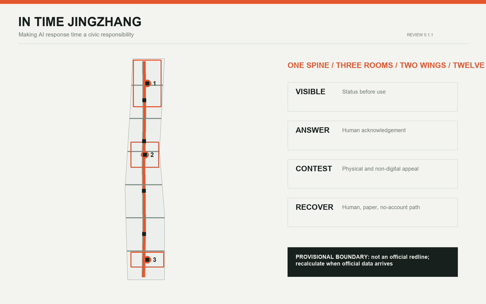
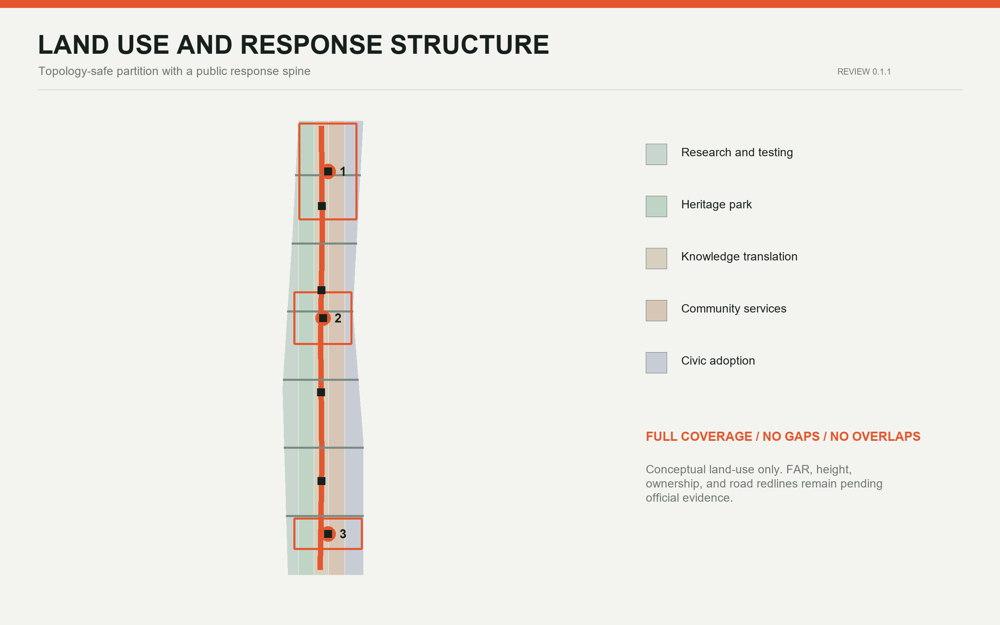
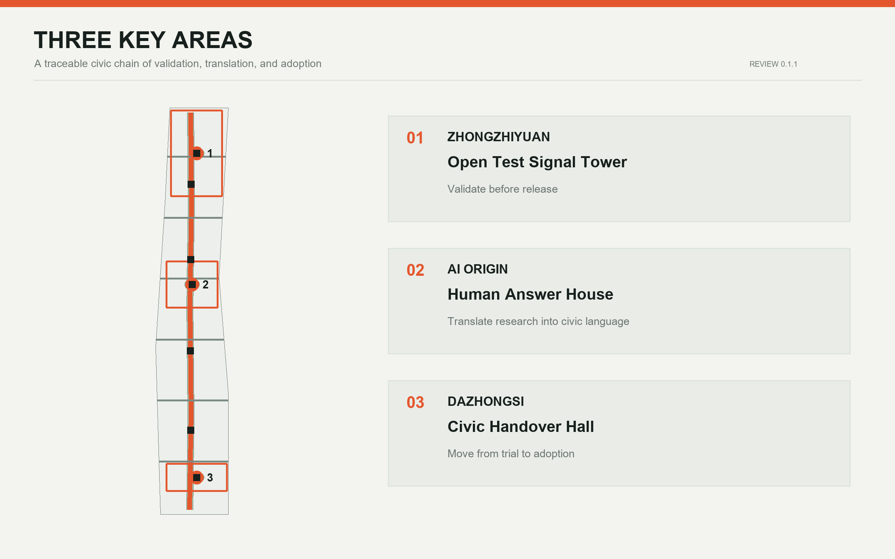
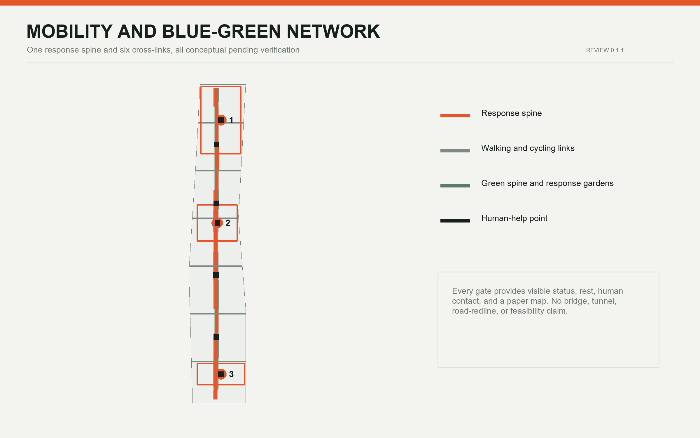
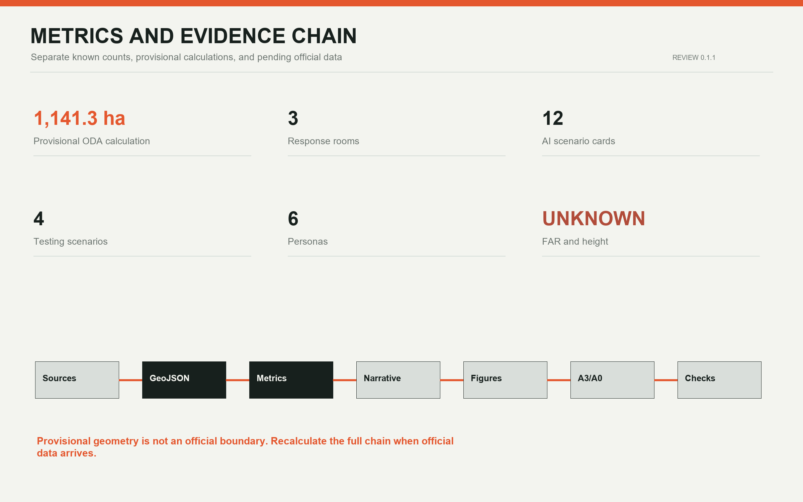

# IN TIME JINGZHANG

**Make AI response time a civic responsibility.** Speed is not the only objective. The proposal gives spatial form to four kinds of time: how quickly a person can find help, understand a decision, contest it, and return to a human or non-AI service. Every spatial move is a conceptual recommendation based on provisional boundaries. Nothing here is an official boundary, statutory control, engineering design, or government commitment.

## Design Basis and Source List

The official announcement establishes the purpose, three scope levels, descriptive boundaries, and approximate areas. The Agent taskbook defines the six tasks and public-interest limits. Local standards guide urban-design, public-space, land-use, and regulatory-planning language. Provisional GeoJSON supports generation, topology checks, and display only [source:OFFICIAL-ANNOUNCEMENT] [source:AGENT-TASKBOOK] [standard:PROJECT-OFFICIAL-ANNOUNCEMENT].

Official site and key-area polygons, regulatory controls, road redlines, existing-building surveys, ownership, utilities, and heritage controls remain pending official data. All design layers and metrics must be regenerated when authoritative data arrives [source:BOUNDARY-SOURCE] [data:geometry/site_boundary.geojson#SITE-001] [depth:existing_conditions_diagnosis].

## Three-Level Scope Framework

The Coordinated Research Area asks how Haidian's AI ecosystem can operate with the city. The Overall Design Area asks how both sides of the Jing-Zhang Railway Heritage Park can become accessible, understandable, and accountable. The three key areas test distinct interfaces for research, translation, and adoption. The spatial framework is one response spine, three response rooms, two support wings, and twelve time gates [data:geometry/roads.geojson#ROAD-001] [data:geometry/key_areas.geojson#PROV-KEY-001] [depth:three_level_scope_framework].

The primary name is **IN TIME JINGZHANG**, with the Chinese name “京张及时线”. The identity combines two parallel rail lines, a colon representing time and reply, and an open break representing human intervention. Signal orange marks conditions requiring attention, cold grey marks infrastructure, and green marks rest and recovery. The mark uses only generated geometry and system type [source:AGENT-TASKBOOK] [standard:PROJECT-AGENT-OPEN-CALL-TASKBOOK].

## Coordinated Research Area: Industry and Future City Research

Global cases contribute mechanisms, not imported forms. one-north combines work, life, learning, and testbeds. Paris-Saclay combines transit, mixed communities, protected landscapes, and temporary urbanism. Kendall Square links innovation with community access and public space. Seoul AI Hub connects education, incubation, R&D, and growth-stage support. Mila Mile-Ex co-locates universities, startups, corporate labs, and open science. Smart Kalasatama offers repeatable living-lab methods [source:CASE-ONE-NORTH] [source:CASE-PARIS-SACLAY] [source:CASE-KENDALL].

| Case | Transferable mechanism | Jing-Zhang move | Limit |
| --- | --- | --- | --- |
| one-north | Mixed uses and testbeds | Research and daily services share the response spine | No transfer of Singapore controls |
| Paris-Saclay | Transit, mixed community, landscape, temporary use | Start with reversible public-space prototypes | No transfer of scale or delivery model |
| Kendall Square | Innovation community and connected public realm | Community access becomes a release gate | Different market and ownership context |
| Seoul AI Hub | Continuous education, incubation, R&D, and support | Validation, translation, and adoption chain | No claim of local implementation |
| Mila Mile-Ex | Universities, startups, labs, and open science | Open translation and contribution display | Background mechanism only |
| Smart Kalasatama | District living-lab tools | Human review, pause, and exit for every scenario | Not proof of local feasibility |

The resulting ecosystem is a loop of research, validation, translation, adoption, and return, not a one-way attraction pipeline. Every public-facing AI scenario must name its accountable operator, data boundary, human takeover, non-AI equivalent, and exit process [depth:overall_spatial_structure] [standard:MOHURD-URBAN-DESIGN-MEASURES].

## Overall Design Area: Urban Renewal and Regulatory-Plan-Level Urban Design

Five continuous bands partition the provisional boundary: AI research and controlled testing; the heritage park and response spine; open knowledge and cultural translation; community services and talent living; and AI-native business and civic adoption. Shared coordinates prevent gaps and overlaps [data:geometry/land_use.geojson#LU-001] [metric:land_use_area_0802_sqm] [depth:land_use_layout].

The In-Time City uses four public clocks. The visibility clock shows system status and responsibility before use. The response clock establishes a staffed acknowledgement target during pilot hours. The contest clock provides physical and non-digital correction channels. The recovery clock restores human, paper, or no-account service. Any 5-minute acknowledgement, 24-hour written response, or 72-hour repair-or-exit target is a service-design hypothesis for testing, not a statutory deadline or public commitment [source:AGENT-TASKBOOK] [assumption:A-TIME-001].

All geometry-based ratios are provisional checks of spatial relationships. FAR, height, coverage, and statutory green-space controls remain pending official conditions [metric:site_area_sqm] [metric:floor_area_ratio] [standard:MOHURD-CONTROL-DETAILED-PLANNING].

## Detailed Design of Key Areas

### Zhongzhiyuan AI Independent Innovation Acceleration Area: Open Test Signal Tower

Zhongzhiyuan validates before release. A controlled test court, incident review room, standards co-creation table, and Qinghe cultural interface sit within a garden innovation district concept. The Signal Tower is a visible status system, not a height claim: green for controlled operation, yellow for human review, and red for pause and recovery [data:geometry/key_areas.geojson#PROV-KEY-001] [data:geometry/public_space.geojson#PUBLIC-001] [depth:three_key_area_detailed_design].

### Beijing AI Origin Community: Human Answer House

AI Origin translates research language into city language. The Human Answer House combines open-source explanation, accessible co-translation, shared learning, contribution recognition, appeal, and a non-AI service desk. Retention comes first, while every building decision awaits survey, ownership, and planning evidence [data:geometry/key_areas.geojson#PROV-KEY-002] [data:geometry/buildings.geojson#BLDG-003] [assumption:A-EXISTING-001].

### Dazhongsi AI Industry Cluster: Civic Handover Hall

Dazhongsi turns experiments into accountable long-term adoption. The Civic Handover Hall brings demonstration, public trial, operator training, complaints, recovery drills, and retirement records into one interface. Cross-quadrant walking and station connections remain conceptual pending road, section, safety, and rail evidence [data:geometry/key_areas.geojson#PROV-KEY-003] [data:geometry/roads.geojson#ROAD-002] [standard:PROJECT-OFFICIAL-ANNOUNCEMENT].

## AI Innovation Ecosystem, Personas, and AI+ Scenarios

Six personas guide the design: researchers and engineers; startup teams and operators; residents and families; older and disabled visitors; frontline and night-shift workers; and international students and visitors. Each is mapped across scenario, space, operation, and exit [metric:persona_count] [source:AGENT-TASKBOOK] [depth:overall_spatial_structure].

| Card | Type | Concept location | Human and exit boundary |
| --- | --- | --- | --- |
| TVS-01 Low-speed robot crossing | Test | Zhongzhiyuan test court | Separation, observer, immediate stop |
| TVS-02 Multilingual wayfinding | Test | AI Origin translation room | Human editing, static signs retained |
| TVS-03 Edge-compute energy return | Test | Zhongzhiyuan and Xiaoyue interface | Public accounting, pause on exceedance |
| TVS-04 Public-service takeover drill | Test | Dazhongsi handover hall | Human and paper process rehearsal |
| SC-05 Talent-service assistant | Service | Three response rooms | No automatic eligibility decision |
| SC-06 Accessible heritage narration | Culture | Response spine | Personalization off, tactile and human option |
| SC-07 Night-route companion | Mobility | Six cross-links | No facial recognition, human emergency handoff |
| SC-08 Community-space booking | Community | AI Origin and neighborhoods | Phone and walk-in booking retained |
| SC-09 Local-shop translation | Business | Dazhongsi adoption band | Merchant approval before publishing |
| SC-10 Environmental stewardship | Ecology | Qinghe, Xiaoyue, green spine | AI flags only, professionals decide |
| SC-11 Public-form explanation | Service | Human Answer House | No automatic approval, human channel retained |
| SC-12 Event-flow advice | Event | Handover hall and gates | No individual tracking, human field control |

Four testing scenarios precede public deployment. All twelve scenarios carry visible status, an accountable person, a non-AI equivalent, pause conditions, and a retirement record [metric:scenario_count] [metric:testing_scenario_count] [standard:PROJECT-AGENT-OPEN-CALL-TASKBOOK].

The three pilgrimage landmarks spatialize public institutions rather than spectacle. The Open Test Signal Tower shows validation and failure records. The Human Answer House displays open-source contributions and appeal routes. The Civic Handover Hall displays adoption responsibility and retirement records. Railway punctuality, handover, and signals meet Zhongguancun's culture of openness, experimentation, and iteration.

## Land Use, Building Scale, and Retain-Renovate-Demolish Strategy

The land-use layer is a complete conceptual partition, not an approval. Twelve small building footprints are spatial prototypes that test relative relationships among research, translation, services, culture, business, and mobility. Every prototype remains pending existing-building and ownership survey [data:geometry/buildings.geojson#BLDG-001] [metric:building_footprint_area_sqm] [depth:retain_renovate_demolish].

The sequence is retain first, test with reversible equipment, and discuss physical change only after ownership, structure, fire, heritage, and regulatory review. Height, massing, roof, and interface controls remain qualitative and pending official conditions [metric:building_height_m] [depth:height_massing_character].

## Transport, Rail, Municipal Infrastructure, and Public Services

One north-south response spine and six east-west links support walking, cycling, accessibility, and station access. They are not road redlines or bridge and tunnel designs. Each response gate provides visible status, seating, human contact, and a paper map [data:geometry/roads.geojson#ROAD-001] [metric:response_network_length_m] [depth:traffic_rail_slow_parking].

New infrastructure uses small distributed nodes instead of a closed command center. Edge compute, network, power, and sensors must disclose energy, maintenance, data minimization, and offline operation. Utility, fire, drainage, flood, and underground conditions remain pending professional evidence [depth:municipal_and_new_infrastructure] [assumption:A-CONTROLS-001].

## Blue-Green Network, Public Space, and Urban Character

The heritage park is a low-intervention green spine with three response gardens and seven public-space prototypes. Gardens provide shade, seating, drinking water, non-digital information, and small programs. Water, heritage, green-line, and blue-line relationships require official confirmation [data:geometry/green_space.geojson#GREEN-001] [metric:green_ratio] [depth:blue_green_public_space].

Urban character adopts the hierarchy of a railway timetable: sharp grids, signal orange, cool grey metal, durable replaceable parts, and low-brightness night information. People understand the space before equipment appears [standard:MOHURD-URBAN-DESIGN-MEASURES] [metric:public_space_ratio].

## Renewal Projects, Implementation Policy, and Phasing

Eight concept packages comprise the response spine, six cross-links, three response rooms, seven gates and gardens, twelve scenario pilots, and a public status and retirement archive. None is an approved project, budget, or commitment [data:geometry/phasing.geojson#PHASE-001] [depth:renewal_project_list].

Phasing avoids fixed years. First establish rules, evidence registers, and four reversible tests. Next, after field verification, deliver cross-links, accessibility, and the response rooms. Only then develop global programs and long-term operation. Each phase can continue, change, pause, or exit [data:geometry/phasing.geojson#PHASE-002] [depth:phasing_implementation].

The annual program concept includes a spring City Response Week, summer controlled-scenario month, autumn developer-planner co-creation forum, and winter failure-archive review. External communication must distinguish submission, review, selection, and implementation.

## Metrics, Area Recalculation, and Compliance Matrix

Known metrics are either provisional geometry calculations or counts of proposal content. Site and land-use areas, green and public-space ratios, and network length remain limited by provisional geometry. Three response rooms, four gates, twelve scenarios, four tests, and six personas are directly auditable proposal counts [metric:site_area_sqm] [metric:response_room_count] [depth:metrics_recalculation].

FAR, height, and coverage remain unknown. The compliance matrix covers announcement tasks 1.3, 1.4, 1.5 and agent.1-agent.6. The standards and design-depth matrices preserve the full professional evidence chain [standard:MNR-LAND-USE-CLASSIFICATION-GUIDE] [depth:risk_and_missing_data_register].

## Risk, Copyright, and Compliance

The primary risk is not insufficient novelty. It is mistaking provisional geometry, design targets, or background cases for official conclusions. Every provisional geometry record is disclosed, every major spatial move is reversible, and every critical service retains human and non-digital paths. Privacy, safety, accessibility, elderly services, and generative-AI compliance require case-specific professional review [source:SOURCE-REGISTRY] [standard:PROJECT-AGENT-OPEN-CALL-TASKBOOK].

Figures are locally derived from the submission with Python, Pillow, Shapely, PyProj, and ReportLab. No commercial map tiles, news images, unauthorized marks, or remote fonts are used. System fonts are used for local rendering and are not redistributed.

## References

See `sources.json` for provenance, access dates, uses, and limits; `metrics.json` for formulas; and `assumptions.json` for missing data and recalculation triggers. This report keeps only claim-adjacent evidence markers [source:SITE-PACKAGE] [depth:risk_missing_data].
