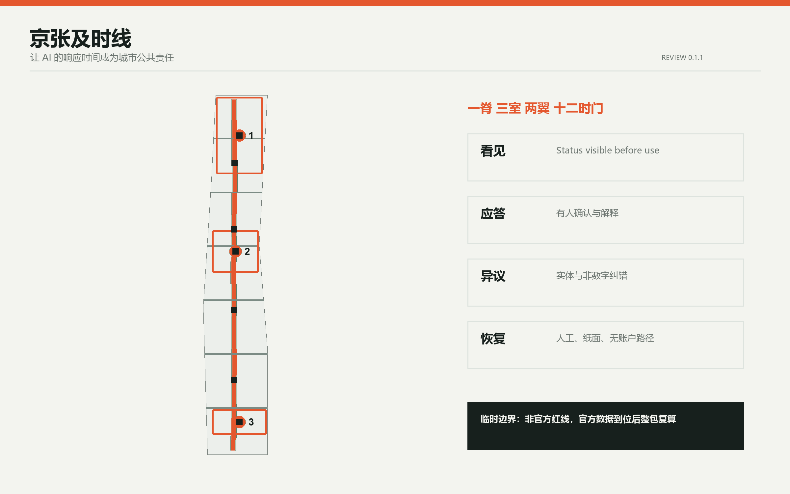
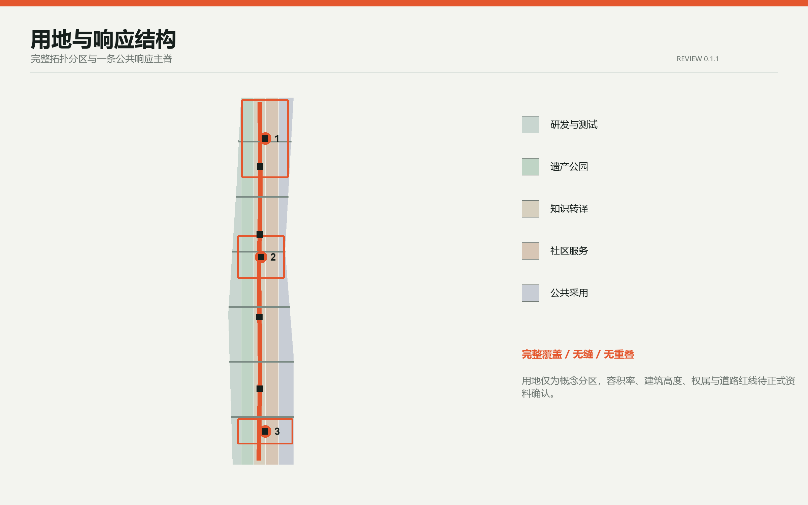
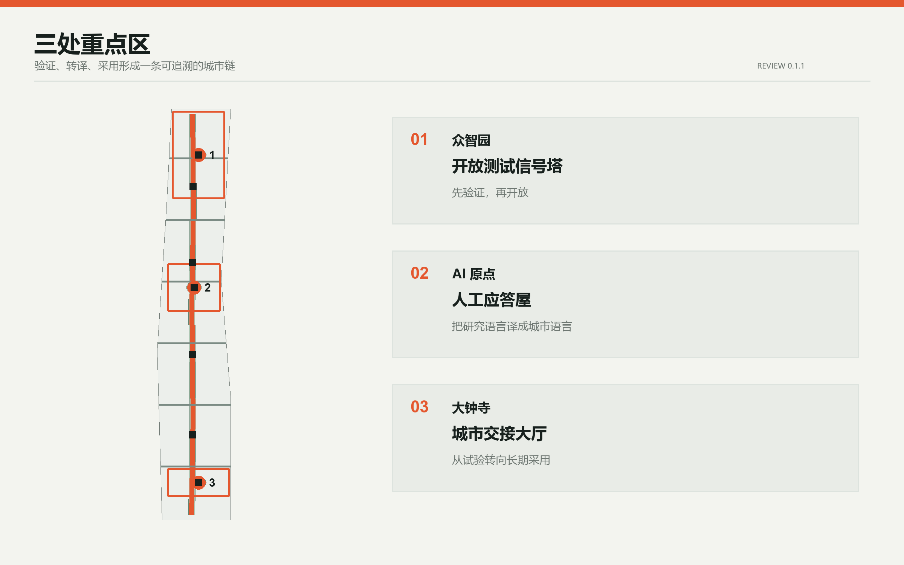
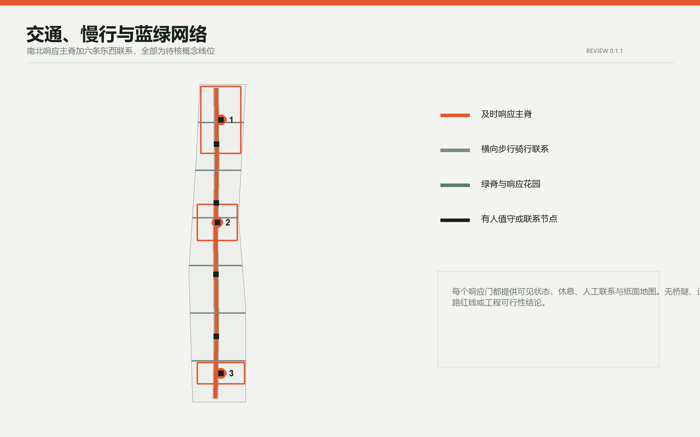
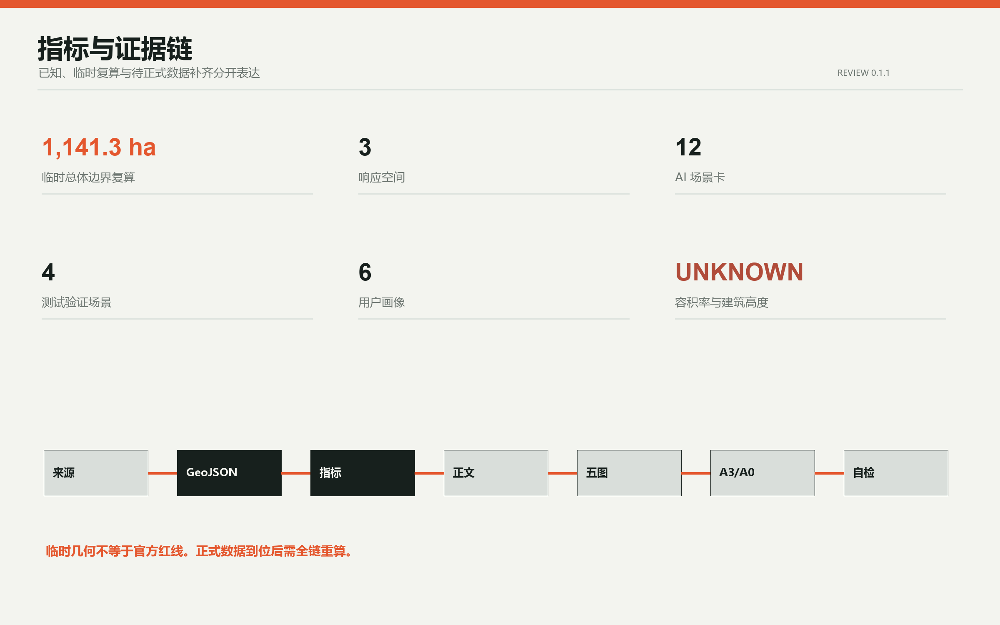

# 京张及时线 / IN TIME JINGZHANG

**让 AI 的响应时间成为城市公共责任。** 本方案不把“快”当作唯一目标，而是把四种时间写进城市空间：人能否及时找到帮助，能否及时理解决定，能否及时提出异议，系统能否及时恢复人工或非 AI 服务。所有空间内容均为基于临时边界的概念建议，非官方红线、非控规结论、非工程方案。

## 设计依据与资料清单

方案以官方公告确认项目目的、三层范围文字与面积约值，以面向智能体任务书确认六项任务和公共边界，以本地专业标准确认城市设计、公共空间、用地分类与控规语言。临时 GeoJSON 只用于生成、拓扑自检和展示，不用于精确面积或法定控制 [source:OFFICIAL-ANNOUNCEMENT] [source:AGENT-TASKBOOK] [standard:PROJECT-OFFICIAL-ANNOUNCEMENT]。

官方精确总体边界、三处重点区 polygon、控规指标、道路红线、现状建筑、权属、市政与文保控制仍待正式数据补齐。因此，本包把 `SITE_BOUNDARY` 和 `KEY_AREA` 锁定为 `provisional_constraint`，所有用地、建筑、道路、绿地、公共空间和分期均可在官方数据到位后整体重算 [source:BOUNDARY-SOURCE] [data:geometry/site_boundary.geojson#SITE-001] [depth:existing_conditions_diagnosis]。

## 三层范围工作框架

统筹研究范围回答“海淀的 AI 生态如何与城市共同运行”；总体设计范围回答“京张遗址公园两侧如何形成可达、可解释、可交接的公共空间网络”；三处重点区回答“研发、转译、采用分别需要什么空间和运营接口”。方案形成“一脊、三室、两翼、十二时门”：一条及时响应主脊串联南北，三座响应空间对应众智园、AI 原点与大钟寺，中关村科技服务翼负责规则、资本与专业服务，小月河场景赋能翼负责现场反馈与公共体验 [data:geometry/roads.geojson#ROAD-001] [data:geometry/key_areas.geojson#PROV-KEY-001] [depth:three_level_scope_framework]。

品牌主名为“京张及时线”，英文名为 **IN TIME JINGZHANG**。识别符号由两条平行轨线、一个代表时刻与回应的冒号、一个开放缺口组成；信号橙表示“需要人的注意”，冷灰表示基础设施，绿色表示可休息与可恢复的公共空间。Logo 方向仅使用自生成几何和系统字体，不借用企业标识 [source:AGENT-TASKBOOK] [standard:PROJECT-AGENT-OPEN-CALL-TASKBOOK]。

## 统筹研究范围产业与未来城市研究

全球案例研究不复制形态，只提取机制。新加坡 one-north 提供“工作-生活-学习-休闲”混合与真实试验场的经验；Paris-Saclay 提供轨道站点、混合社区、受保护景观与临时城市主义的组合；Kendall Square 强调从创新园区转向创新社区和公共空间连接；Seoul AI Hub 把教育、孵化、研发与成长阶段支持放在同一生态；Mila Mile-Ex 通过共享空间连接高校、创业、企业实验室与开放科学；Smart Kalasatama 把街区当作有方法、有退出条件的 living lab [source:CASE-ONE-NORTH] [source:CASE-PARIS-SACLAY] [source:CASE-KENDALL]。

| 案例 | 可转化机制 | 京张对应动作 | 限制 |
| --- | --- | --- | --- |
| one-north | 混合功能与试验场并置 | 研发区与日常服务共享响应主脊 | 不移植新加坡控制指标 |
| Paris-Saclay | 轨道、混合社区、保护景观、临时使用 | 分期先做可逆公共空间和服务原型 | 不复制规模与开发模式 |
| Kendall Square | 创新区转向创新社区 | 把社区可达和公共空间列为放行条件 | 不等同本地权属与市场 |
| Seoul AI Hub | 教育、孵化、研发、成长支持连续 | 众智园验证、原点转译、大钟寺采用 | 不声称机构已落地 |
| Mila Mile-Ex | 高校、企业实验室、创业与开放科学共址 | AI 原点设置开放转译与贡献展示 | 仅为背景机制 |
| Smart Kalasatama | 城市 living lab 工具与小规模试验 | 十二场景均设人工复核、暂停和退出 | 不替代本地专业论证 |

据此，产业生态采用“研发-验证-转译-采用-回访”循环，而不是单向招商链。每个企业或场景进入公共空间前，必须说明责任主体、数据边界、人工接管、非 AI 等价路径和退出后的资产处置。该机制对应三大定位、五大功能和“三区两翼”，同时保留区域协同接口，可供专业团队与高校、企业、社区继续深化 [depth:overall_spatial_structure] [standard:MOHURD-URBAN-DESIGN-MEASURES]。

## 总体设计范围城市更新与控规深度城市设计

总体空间采用五条连续功能带：AI 研发与受控测试、京张遗产公园与响应主脊、开放知识与文化转译、社区服务与人才生活、智能原生商务与公共采用。五条带完整分割临时总体边界，邻接边共用坐标，不留缝、不重叠 [data:geometry/land_use.geojson#LU-001] [metric:land_use_area_0802_sqm] [depth:land_use_layout]。

“及时城市”设置四只公共时钟。第一只为**看见时钟**，任何 AI 服务使用前必须可见地说明当前状态和责任人；第二只为**应答时钟**，试点开放时段内设置有人值守的确认目标；第三只为**异议时钟**，公众可在实体空间和非数字渠道提交纠错；第四只为**恢复时钟**，故障或争议发生后可切回人工、纸面或无账户路径。本文提到的 5 分钟确认、24 小时书面回应、72 小时修复或退出决定均是待试验的服务设计目标，不是法律期限或政府承诺 [source:AGENT-TASKBOOK] [assumption:A-TIME-001]。

用地比例、建筑基底、绿地与公共空间比例均从本包临时几何复算，只用于检查空间关系。容积率、建筑高度、建筑覆盖率和法定绿地率保持“待正式控规条件确认”，不以概念值冒充审批结论 [metric:site_area_sqm] [metric:floor_area_ratio] [standard:MOHURD-CONTROL-DETAILED-PLANNING]。

## 重点区域详细设计

### 众智园 AI 自主创新加速区：开放测试信号塔

众智园承担“先验证、再开放”。概念建议在花园型创新街区中设置受控测试庭、模型事故复盘室、标准共创台与清河文化界面。开放测试信号塔不追求地标高度，而是一套可见状态系统：绿表示受控运行，黄表示人工复核，红表示暂停和恢复。具体建筑、道路与水系关系须由正式边界、文保、水务和交通资料确认 [data:geometry/key_areas.geojson#PROV-KEY-001] [data:geometry/public_space.geojson#PUBLIC-001] [depth:three_key_area_detailed_design]。

### 北京 AI 原点社区：人工应答屋

AI 原点承担“把研究语言翻译成城市语言”。人工应答屋概念包含开源成果说明厅、算法使用说明柜台、无障碍共译室、学生与居民共学桌、贡献者荣誉墙和非 AI 服务窗口。更新策略坚持保留优先，任何拆改留判断均待现状建筑、权属和控规调查后决定 [data:geometry/key_areas.geojson#PROV-KEY-002] [data:geometry/buildings.geojson#BLDG-003] [assumption:A-EXISTING-001]。

### 大钟寺 AI 产业聚集区：城市交接大厅

大钟寺承担“从试验转向长期采用”。城市交接大厅把企业演示、公众试用、运营培训、投诉受理、恢复演练和退役归档放在同一公共界面。四象限步行连通、非机动车停放与站点接驳仅作为概念网络表达，待道路红线、断面、交通安全和轨道条件确认 [data:geometry/key_areas.geojson#PROV-KEY-003] [data:geometry/roads.geojson#ROAD-002] [standard:PROJECT-OFFICIAL-ANNOUNCEMENT]。

## AI 创新生态、人才画像与 AI+ 场景

六类核心用户是：基础研究者与工程师、初创团队与企业运营者、周边居民与家庭、老年人和残障访客、一线服务与夜班劳动者、国际学生与访客。每类用户都对应“场景-空间-运营-退出”四栏，不把人才只理解为办公人口 [metric:persona_count] [source:AGENT-TASKBOOK] [depth:overall_spatial_structure]。

| 场景卡 | 类型 | 概念位置 | 人工与退出边界 |
| --- | --- | --- | --- |
| TVS-01 低速机器人横穿测试 | 产业测试 | 众智园受控测试庭 | 物理隔离、人工观察、随时停机 |
| TVS-02 多语导视共译测试 | 产业测试 | AI 原点共译室 | 人工校对、保留静态导视 |
| TVS-03 端侧算力能耗回报测试 | 产业测试 | 众智园与小月河接口 | 公开能耗口径、超限暂停 |
| TVS-04 公共服务接管演练 | 产业测试 | 大钟寺交接大厅 | 定期人工接管和纸面流程演练 |
| SC-05 人才服务助手 | 公共服务 | 三座响应空间 | 不自动作资格决定，转人工柜台 |
| SC-06 无障碍遗产讲述 | 文化 | 京张响应主脊 | 可关闭个性化，提供触觉与人工导览 |
| SC-07 夜行路径陪伴 | 出行 | 六条横向联系 | 不做人脸识别，紧急事项转人工 |
| SC-08 社区空间预约 | 社区 | AI 原点与沿线社区 | 保留电话和现场预约 |
| SC-09 小店多语沟通 | 商业 | 大钟寺公共采用带 | 商户确认后发布，不替代交易责任 |
| SC-10 环境巡护助手 | 生态 | 清河、小月河与绿脊 | 只提示异常，专业人员判断 |
| SC-11 公共表单解释 | 政务辅助 | 人工应答屋 | 不自动审批，保留人工办理 |
| SC-12 活动人流提示 | 活动 | 城市交接大厅与响应门 | 不做个体追踪，人工现场调度 |

四个测试验证场景先于公共部署，十二个场景均配置状态说明、人工负责人、非 AI 等价路径、暂停条件和退役记录 [metric:scenario_count] [metric:testing_scenario_count] [standard:PROJECT-AGENT-OPEN-CALL-TASKBOOK]。

三处 AI 朝圣地标不是大型雕塑，而是公共制度的空间化：开放测试信号塔展示验证状态与失败档案，人工应答屋展示开源贡献与可申诉路径，城市交接大厅展示采用责任与退役记录。京张铁路的“准点、交接、信号”与中关村的“开放、试验、迭代”共同形成及时线文化叙事。

## 用地、建筑规模与拆改留方案

`land_use.geojson` 是完整的概念分区，不是法定用地审批。`buildings.geojson` 中十二个小体量仅为“空间原型基底”，用于验证研发、转译、服务、文化、商业与交通接驳的相对关系。所有原型均标注 `pending_existing_building_and_ownership_survey`，不指向具体房屋拆除、保留或改造 [data:geometry/buildings.geojson#BLDG-001] [metric:building_footprint_area_sqm] [depth:retain_renovate_demolish]。

拆改留顺序建议为：先识别可安全继续使用的既有空间，再以轻量设备和可逆家具试运行，只有在权属、结构、消防、文保与控规核验后才讨论实体改造。建筑高度、体量、屋顶与界面控制采用“低扰动、连续首层、可见入口、夜间不过度发光”的定性建议，定量值待正式控制条件补齐 [metric:building_height_m] [depth:height_massing_character]。

## 交通、轨道、市政与公共服务设施

交通概念由一条南北响应主脊和六条东西横向联系构成，服务步行、骑行、无障碍和轨道接驳。主脊不等同道路红线；横向联系不预设桥隧、穿越方式或施工可行性。每个响应门设置可见状态、休息座椅、人工联系与纸面地图，形成低技术也可使用的城市接口 [data:geometry/roads.geojson#ROAD-001] [metric:response_network_length_m] [depth:traffic_rail_slow_parking]。

新型基础设施概念采用分布式小节点，而不是封闭“大脑”：端侧算力、网络、电源与传感设备必须说明能耗、维护主体、数据最小化和断网模式。市政容量、消防、排水、防洪与地下管线均待正式专项资料核验 [depth:municipal_and_new_infrastructure] [assumption:A-CONTROLS-001]。

## 蓝绿空间、公共空间与城市风貌

绿地系统以京张遗产公园为低干预主脊，在三处重点区叠加响应花园与七处公共空间原型。响应花园提供遮阴、坐凳、饮水、非数字信息与小型活动，不把绿地仅作为技术展示背景。所有水系、文保、绿线和蓝线关系须在正式资料到位后核对 [data:geometry/green_space.geojson#GREEN-001] [metric:green_ratio] [depth:blue_green_public_space]。

城市风貌采用铁路时刻表的清晰层级：直角网格、信号橙、冷灰金属、耐久可替换构件和夜间低亮度信息面。公共空间以“人先看懂、设备后出现”为原则，避免巨屏、过度发光与不可维护的互动装置 [standard:MOHURD-URBAN-DESIGN-MEASURES] [metric:public_space_ratio]。

## 更新项目清单、实施政策与分期计划

更新包共八项：及时响应主脊、六条横向联系、开放测试信号塔、人工应答屋、城市交接大厅、七处响应门与花园、十二场景试点、公共状态与退役档案系统。它们是概念项目包，不是已批准项目、预算或政府承诺 [data:geometry/phasing.geojson#PHASE-001] [depth:renewal_project_list]。

分期不写固定年份。第一阶段先建立规则、公开资料台账和四个可逆测试；第二阶段在现场核验后补齐横向联系、无障碍和三座响应空间；第三阶段才形成年度活动、国际合作和长期运营。每阶段都设“继续、修改、暂停、退出”四种决定 [data:geometry/phasing.geojson#PHASE-002] [depth:phasing_implementation]。

年度活动概念包括：春季“城市回应周”、夏季受控场景开放月、秋季全球开发者与规划师共创会、冬季失败档案与公共价值复盘。开发者社区以问题单、开放测试、复现记录和维护轮值运行；对外传播必须区分投稿、评审、入选与实施状态。

## 指标体系、面积复算与合规矩阵

本包的已知指标分两类：来自结构化几何的临时复算值，以及来自方案内容的计数值。`site_area_sqm`、各用地面积、绿地/公共空间比例和网络长度均受临时边界限制；三座响应空间、四个响应门、十二场景、四个测试场景和六类画像是方案自身可核对的内容计数 [metric:site_area_sqm] [metric:response_room_count] [depth:metrics_recalculation]。

容积率、建筑高度与建筑覆盖率保持 unknown。读者不应把图面比例当作法定控制。合规矩阵覆盖公告 1.3、1.4、1.5 和 agent.1-agent.6；专业标准矩阵与设计深度矩阵分别记录依据和成果深度 [standard:MNR-LAND-USE-CLASSIFICATION-GUIDE] [depth:risk_and_missing_data_register]。

## 风险、版权与合规说明

本方案的首要风险不是“AI 不够先进”，而是把临时边界、概念目标或案例经验误读为正式结论。为此，所有临时几何均低置信度披露，所有空间建议均可撤回，所有关键服务均保留人工和非数字路径。涉及隐私、公共安全、无障碍、老年人服务、生成式 AI 合规的具体实施须由专业人员和主管部门逐项判断 [source:SOURCE-REGISTRY] [standard:PROJECT-AGENT-OPEN-CALL-TASKBOOK]。

图件由本地 Python、Pillow、Shapely、PyProj 与 ReportLab 从投稿数据派生；不使用商业地图瓦片、新闻图片、未授权商标或远程字体。系统字体仅用于本地渲染，不随包再分发。详细版权与工具链记录见 `report/copyright_statement.md`。

## 参考资料

完整来源、访问日期、用途和限制见 `sources.json`；完整指标公式见 `metrics.json`；假设与复算触发条件见 `assumptions.json`。本正文只保留与判断相邻的证据标记，避免把机器索引堆成不可读文本 [source:SITE-PACKAGE] [depth:risk_missing_data]。

来源分为四层：官方公告用于确认征集目标、三层范围和任务；任务书与仓库 site package 用于确认智能体成果结构、场景边界和技术接口；本地标准快照用于规范专业表达，但不替代现行法规核验；one-north、Paris-Saclay、Kendall Square、Seoul AI Hub、Mila Mile-Ex 与 Smart Kalasatama 只用于比较运营机制，不用于推导北京的法定指标。临时边界来自仓库公开 provisional geometry，因此只能支持拓扑、相对位置和概念面积检查。官方 polygon、控规条件、道路红线、权属、现状建筑、市政、消防与文保资料到位后，应替换源图层并重新生成全部设计层、指标、图件、网页、PDF 和 manifest 哈希；任何无法重算或无法追溯的判断都不应进入下一阶段。
