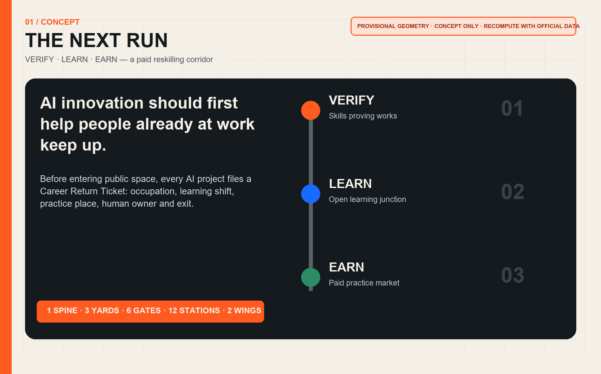
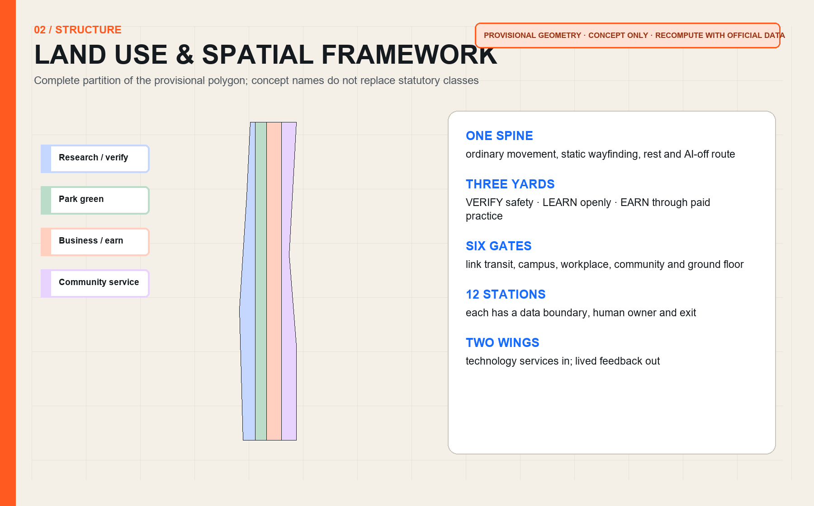
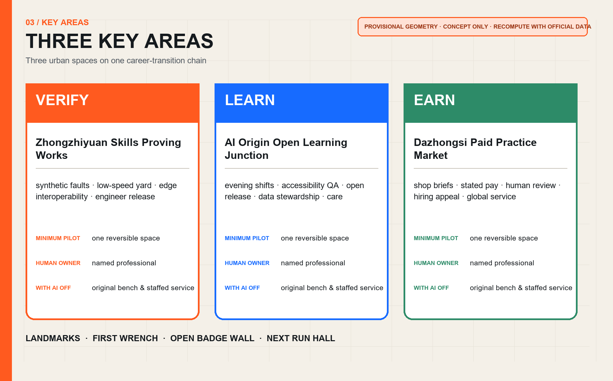
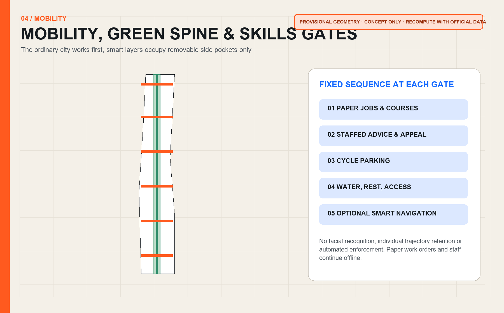
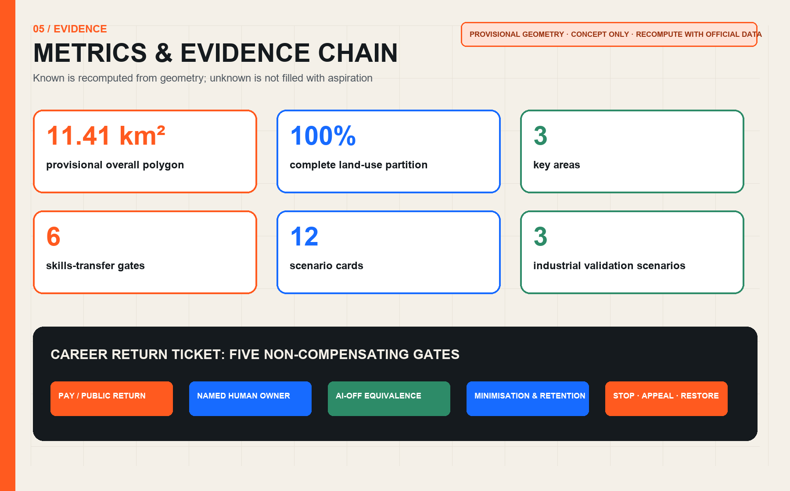

# THE NEXT RUN / 京张下一程

> **The first public return from AI innovation should be helping people already at work keep up.**

## Design Basis and Material Register

The proposal answers the official 43.6 sq km coordination study, approximately 11.4 sq km overall design area and three key areas totalling about 368.4 ha, and maps every agent.1-agent.6 task [source:OFFICIAL-ANNOUNCEMENT] [source:AGENT-TASKBOOK] [standard:PROJECT-OFFICIAL-ANNOUNCEMENT]. The public package does not yet include exact official polygons for the overall or key areas, statutory plans, road redlines, ownership, existing buildings, utilities or heritage controls. Every location therefore uses the maintainer's rough provisional geometry and is a **concept recommendation for professional development**, not a statutory plan, engineering design or approval [source:BOUNDARY-SOURCE] [data:geometry/site_boundary.geojson#SITE-001].

The overall and key-area geometry remains labelled `provisional_constraint`, `official_boundary=false` and `boundary_precision=provisional_rough`. It was derived from textual extents and area constraints; repository OSM checks indicate a possible 533-898 m offset. That is an uncertainty signal, not proof of the true location. When official polygons arrive, all land-use, road, building, green, public-space, phasing and metric layers must be replaced and recomputed together [source:BOUNDARY-BASIS] [self-check:BOUNDARY_TRUST].

## Three-Level Scope Framework

The Next Run is not another training centre; it is **urban career-transition infrastructure**. Before receiving public space, an AI project must file a Career Return Ticket: which occupation it creates, who can learn while employed, where practice happens, which named human signs off, and how it exits after failure. The spatial system is one spine, three yards, six gates, twelve stations and two wings. The heritage-park direction preserves ordinary movement and static wayfinding; the yards perform VERIFY, LEARN and EARN; six gates connect transit, campuses, workplaces, communities and ground floors; twelve stations host scenarios; the Zhongguancun services wing supplies mentors, tools and enterprise questions, while the Xiaoyuehe scenario wing returns lived feedback [depth:three_level_scope_framework] [data:geometry/roads.geojson#ROAD-001].

| Scale | Core question | Output | Evidence |
|---|---|---|---|
| Coordination study | How can more occupations enter the AI era, beyond attracting elite talent? | Six global mechanisms, twelve career paths and an annual open timetable | [source:AGENT-TASKBOOK] |
| Overall design | How do verification, learning and paid practice become a spatial network? | Complete land-use, mobility, green, public-space, building and phasing layers | [data:geometry/land_use.geojson#LU-001] |
| Key areas | Is it safe, can people learn it, and does it lead to paid work? | Three skills yards and minimum pilots | [data:geometry/key_areas.geojson#PROV-KEY-001] |

## Industry and Future-City Study at the Coordination Scale

Benchmarking extracts transferable mechanisms, not foreign scale or policy. Newlab combines prototyping infrastructure, industry partners and real pilots; STATION F organises a campus through multiple programmes rather than desk rental alone; JTC LaunchPad combines modular space, testbeds and ground-floor showcases [source:CASE-NEWLAB] [source:CASE-STATIONF] [source:CASE-JTC]. MaRS includes talent advice and job networks in innovation services; UnternehmerTUM links MakerSpace, coaches and enterprise challenges; AI Singapore connects deep-skilling to real projects through apprenticeship [source:CASE-MARS] [source:CASE-UTUM] [source:CASE-AISG].

The Jing-Zhang translation is **space + shift + responsibility**: shared facilities answer where, day/week/season shifts answer when employed people can learn, and named mentors and professionals answer who remains responsible. AI may assist course matching, synthetic fault generation, test sequencing and evidence-gap checks. It may not decide hiring, credentials, pay, benefits or public-service outcomes. Twelve public occupation pathways are proposed: embodied-AI maintenance, edge networking, model evaluation, accessibility QA, data stewardship, open-source release, human escalation, multilingual mediation, shop workflow co-design, digital heritage curation, public-space device inspection, and course/job operations.

## Overall Urban Renewal and Regulatory-Depth Urban Design

The land-use layer partitions the provisional overall boundary completely without gaps or overlaps. Statutory codes follow the registered territorial spatial-planning classification; concept names express design intent only [standard:MNR-LAND-USE-CLASSIFICATION-GUIDE] [data:geometry/land_use.geojson#LU-001]. The continuous green space carries ordinary movement, rest, outdoor learning and an AI-off route. Research and commercial areas host yards and paid practice; community facilities host staffed advice, care support and public courses. FAR, height, density, retain/renovate/demolish decisions, road redlines and utility capacity remain `unknown` until official information and professional review arrive [metric:floor_area_ratio] [assumption:A-CONTROLS-001].

The building prototype uses a reversible 12 m ground-floor band, back-of-house workshop and equivalent non-AI front desk: 4.5 m continuous clear passage, 3 m static information and staffed service, and 4.5 m replaceable practice bay. These are prototype dimensions, not existing or approved controls. Every smart module must power down and be removable without occupying egress, accessibility, water, rest or human-help space. Real siting requires ownership, structure, fire, utilities, transport, accessibility and heritage gates [depth:development_intensity_controls] [data:geometry/buildings.geojson#BLDG-001].

## Detailed Design of the Three Key Areas

**Zhongzhiyuan Skills Proving Works / VERIFY.** The northern area contains an enclosed low-speed yard, synthetic fault rigs, an edge-interoperability bench and a staffed observation gallery. Projects must show safety, human takeover, equipment reset and training value before reaching public scenarios. The minimum first pilot is one robot fault rig using no real personal data; a named engineer signs release [data:geometry/key_areas.geojson#PROV-KEY-001].

**AI Origin Open Learning Junction / LEARN.** The central area links universities, open-source communities and residents through open course tables, an accessibility QA room, an open-release clinic, a data-steward room and a quiet care room. Portfolios, human review and revocable skills badges evidence learning; no single model grades people. The minimum pilot is one evening and one weekend class each week [data:geometry/key_areas.geojson#PROV-KEY-002].

**Dazhongsi Paid Practice Market / EARN.** The southern area brings startups, small shops, buyers and career switchers into one ground-floor network. Every live brief states pay, hours, data boundary, mentor and appeal. Automated scores cannot decide hiring. A recommended first pilot comprises ten small-business problems, twenty paid places and one staffed careers desk; these are design suggestions, not government commitments [data:geometry/key_areas.geojson#PROV-KEY-003].

Three landmarks double as an honour system: the First Wrench at Zhongzhiyuan displays the first human-repaired civic-AI prototype; the Open Badge Wall at AI Origin records skills contributions with opt-in attribution; the Next Run Hall at Dazhongsi publishes jobs, courses, pay transparency and exit cases annually. The `JZ / NEXT` identity uses two parallel rails and an ascending gap in black, warm white, rail orange and skills blue, without third-party marks or uncleared fonts.

## AI Ecosystem, Personas and AI+ Scenarios

Six core personas are an equipment technician changing careers without leaving work; an administrator with care duties; a shopkeeper without a digital team; a graduate needing a real project; a disabled accessibility tester; and an international worker needing multilingual service. Night operators and frontline service workers are additional cross-check groups. Each person may use the ordinary route without an account, facial data or automated profile, and can complete regular tasks through paper and staffed service [standard:PROJECT-AGENT-OPEN-CALL-TASKBOOK].

| Card | Scenario | Place | Beneficiaries | Data/space | Human responsibility | With AI off |
|---|---|---|---|---|---|---|
| SC-01 | Embodied-AI maintenance practicum | Zhongzhiyuan | career-switching technicians and robotics startups | synthetic fault rigs and an enclosed low-speed yard | AI sequences tests; a named engineer releases equipment | stop equipment and restore manual benches |
| SC-02 | Edge-sensor interoperability practicum | Zhongzhiyuan | network operators and sensor firms | offline data and removable sensors | no facial capture; professional acceptance | remove sensors and retain static inspection |
| SC-03 | Human-handover service drill | Zhongzhiyuan | service staff and civic-tech teams | synthetic dialogue and role play | AI makes no final decision; shift lead signs off | switch immediately to staffed service |
| SC-04 | Accessibility quality-assurance studio | AI Origin | disabled testers and product managers | opt-in participant feedback | per-session consent, anonymous notes, human findings | retain physical wayfinding and human help |
| SC-05 | Open-model release clinic | AI Origin | developers, students and legal advisers | public code and licence material | human review of licence, data card and exit | do not publish; return material |
| SC-06 | Urban data-steward practicum | AI Origin | community workers and data engineers | public or cleared data | minimisation, retention and access logs | withdraw access and delete derivatives |
| SC-07 | Multilingual service mediator practicum | AI Origin | international-talent staff and residents | opt-in phrases and public terminology | machine translation is a draft; speaker confirms intent | use human interpretation and paper bilingual cards |
| SC-08 | Small-shop workflow co-design desk | Dazhongsi | shopkeepers and transitioning operators | problems supplied by shopkeepers | no customer profiling; owner chooses adoption | restore original workflow and export records |
| SC-09 | Paid AI-product trial shift | Dazhongsi | jobseekers, buyers and startups | controlled tasks with stated pay | automated scores cannot decide hiring | human assessment with appeal |
| SC-10 | Heritage digital-curation practicum | Dazhongsi | culture workers and content firms | cleared public material | human collation, attached provenance, no deceptive simulation | withdraw errors and publish corrections |
| SC-11 | Night human-machine handover practicum | six transfer gates | security, cleaning and facility workers | equipment status, not personal trajectories | one post, one log, one named human | paper log continues offline |
| SC-12 | Open jobs and courses wall | corridor-wide | all visitors | public jobs and course listings | no face recognition or automated rejection | paper notices and staffed advice remain |

SC-01, SC-02 and SC-03 are the three industrial testing and validation scenarios. The others translate proven capability into public learning and paid work. Each smart layer can be switched off while passage, static information, staffed service and original workflows remain [self-check:AI_OFF_BASELINE].

## Land Use, Building Scale and Retain/Renovate/Demolish Method

The provisional overall polygon recomputes to about 11.41 sq km in EPSG:4548; this is the result for a provisional constraint, not an exact official area [metric:site_area_sqm]. Four land-use polygons cover it fully. Green, public-space and concept building-footprint areas are recomputed independently [metric:green_ratio] [metric:public_space_ratio] [metric:building_footprint_area_sqm]. No cleared existing-building or ownership data is available, so object-level retain/renovate/demolish decisions are not made. The method is survey first, professional review second, reversible pilot third; no existing user may be displaced by an algorithmic under-use estimate.

Three building actions require field verification: A inserts removable course tables into legally available ground floors; B places shared practice in existing space only after structural and fire checks; C reserves new build as a long-term interface subject to statutory and engineering conditions. Roof, underground and under-bridge locations cannot bypass ownership, fire, heritage, utility or ecological approval [depth:retain_renovate_demolish].

## Transport, Rail, Utilities and Public Services

The public spine preserves continuous walking, cycling, accessibility, static wayfinding and rest. Six skills-transfer gates are concept connections, not road redlines or verified existing paths [data:geometry/roads.geojson#ROAD-X01]. Each gate sequences paper jobs/courses information, a staffed desk, cycle parking, water/rest, an accessible route and optional smart navigation. Transport AI may issue aggregated crowd notices only, with no facial recognition, individual trajectory retention or automated enforcement.

Edge compute, networks, power, drainage, fire and charging remain systems for professional development. Minimum pilots use compliant existing power and offline synthetic data, with no unapproved utility work. The corridor service baseline is that AI failure cannot remove passage, advice, registration, appeal or emergency help; every shift has a named human, and paper work orders continue offline.

## Blue-Green Space, Public Space and Urban Character

The green spine is a design expression within provisional geometry, not a new park-title claim. Shade, seating, water, quiet classes, outdoor practice and biodiversity are a pre-design function checklist; species, stormwater, waterways, soil and green-space controls require field and official confirmation [data:geometry/green_space.geojson#GREEN-001]. Public space follows an ordinary-city-first rule: AI devices stay in side pockets, never narrowing continuous or accessible passage; every screen has a paper counterpart and every smart registration has a staffed alternative.

The cultural narrative avoids invented railway detail. Public memory becomes a readable Next Run sequence: verification resembles depot inspection, learning resembles interchange, and paid practice resembles departure. An annual Jing-Zhang Next Run Open Week combines workshop access, job explanations, open classes, accessibility co-testing, small-shop briefs, open-source releases and a Career Return Ledger; every event still requires permits, cleared rights and safety assessment.

## Renewal Projects, Policy and Phasing

| Project | Minimum delivery | Responsible roles | Start gate | Exit condition |
|---|---|---|---|---|
| JZ-N01 Career Return Ticket | open and paper form, staffed register | operator + labour/industry body + advisers | privacy and labour review | pause without named owner or human route |
| JZ-N02 Zhongzhiyuan fault rig | one synthetic rig, ten drills | operator + engineer | ownership, structure, fire and equipment safety | close and review after any safety event |
| JZ-N03 AI Origin evening class | one evening and weekend class weekly | university/open-source group + human tutor | venue, content rights and accessibility | stop without human teacher or with automated grading |
| JZ-N04 Dazhongsi paid places | 20 suggested places with stated pay | firms/shops + labour adviser | contract, pay, insurance and appeal | end if unpaid or hiring is automated |
| JZ-N05 Six skills gates | signs, advice, rest and accessibility | local operator + transport/utility professionals | survey and professional review | remove if egress or passage is obstructed |
| JZ-N06 Annual Return Ledger | aggregated jobs, completion, appeal and exit | independent evaluator | aggregate-only data and public method | mark unknown when unreproducible |

Recommended Phase 0 (0-6 months) only replaces official data, surveys sites and co-designs ownership and users. Phase 1 (6-18 months) runs one reversible minimum pilot in each key area. Phase 2 (18-36 months) expands to six gates and twelve stations after independent review. Phase 3 discusses permanent facilities only with statutory controls, funds, operators and approvals. These are proposal horizons, not approved schedules [data:geometry/phasing.geojson#PHASE-001].

## Metrics, Recalculation and Compliance Matrix

Known metrics come only from submitted geometry: provisional area, complete land-use coverage, three key areas, six gates, twelve scenario cards, green/public-space ratios and concept footprint. FAR, height, density, existing buildings, employment baseline, pay and actual completion remain unknown [metric:key_area_count] [metric:skills_transfer_gate_count] [metric:scenario_card_count]. Operational targets can be assessed after pilots with de-identified aggregates and must not be inverted into individual performance scores.

The Career Return Ticket has five non-compensating gates: pay or stated public return; a named human owner; an equivalent AI-off route; minimisation and retention; and stop, appeal and restoration. Any failed gate means HOLD. `compliance_matrix.json` covers every official mandatory task and agent.1-agent.6; `standard_matrix.json` separates statutory sources, self-imposed rules and data gaps; `design_depth_matrix.json` connects prose, drawings, geometry, metrics and checks [depth:metrics_recalculation].

## Risk, Copyright and Compliance

Key risks are provisional-geometry offset, mistaking concept buildings for existing conditions, unpaid labour disguised as learning, discriminatory automated scoring, test-equipment injury, course/content infringement, smart functions displacing ordinary service, and operating-fund interruption. Controls are explicit provisional labels and watermarks, stated pay, human final decisions, enclosed tests, asset-level rights, an AI-off baseline and staged exits [assumption:A-IMPLEMENTATION-001] [self-check:PROVISIONAL_DISCLOSURE].

Generative AI supports text, diagrams, code and concept development for this open-source entry. It does not process confidential data, unpublished personal information or unauthorised existing-condition data. Implementation requires review by planning, architecture, landscape, transport, utilities, fire, heritage, accessibility, labour, privacy and operations professionals. Original text, figures, HTML and code are displayed under the package's `COMMUNITY-DISPLAY-ONLY` declaration. External sources are cited for mechanism research only; no image, trademark or substantial text is copied. Full URLs, access dates, rights and limits are in `sources.json` and `report/copyright_statement.md` [data:geometry/constraints.geojson].

## References

- Official announcement, agent taskbook and site package [source:OFFICIAL-ANNOUNCEMENT] [source:AGENT-TASKBOOK] [source:SITE-PACKAGE]
- Source registry and provisional-boundary basis [source:SOURCE-REGISTRY] [source:BOUNDARY-BASIS]
- Prototyping, campus and testbed cases [source:CASE-NEWLAB] [source:CASE-STATIONF] [source:CASE-JTC]
- Talent, maker-space and apprenticeship cases [source:CASE-MARS] [source:CASE-UTUM] [source:CASE-AISG]
- Full machine index, rights, uses and limitations: `sources.json`
