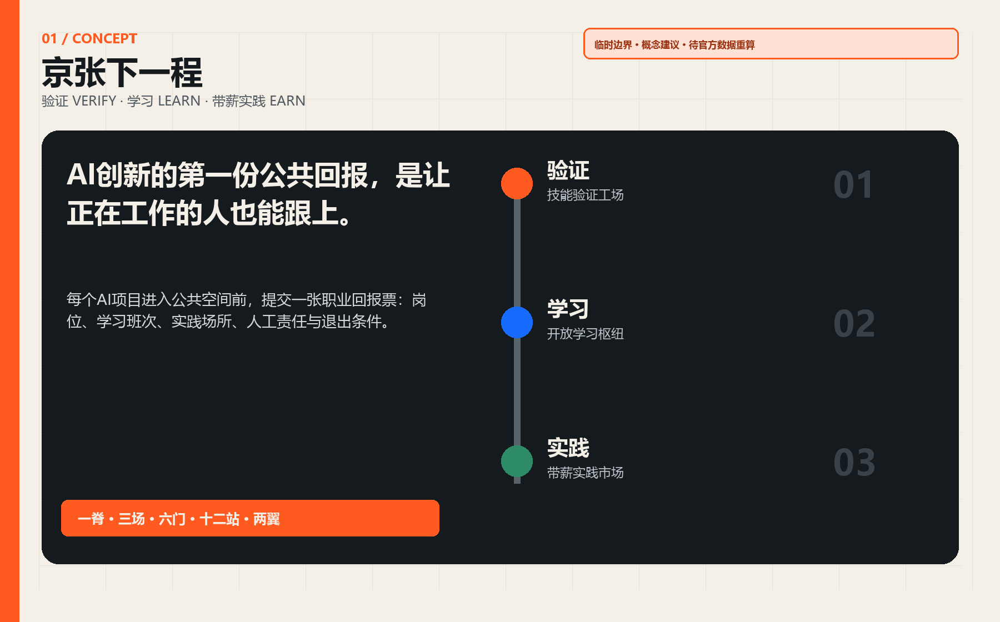
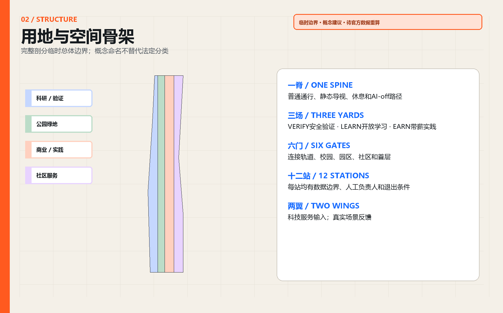
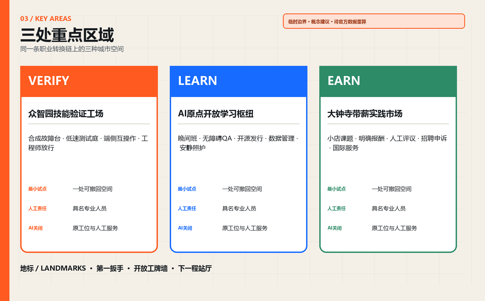
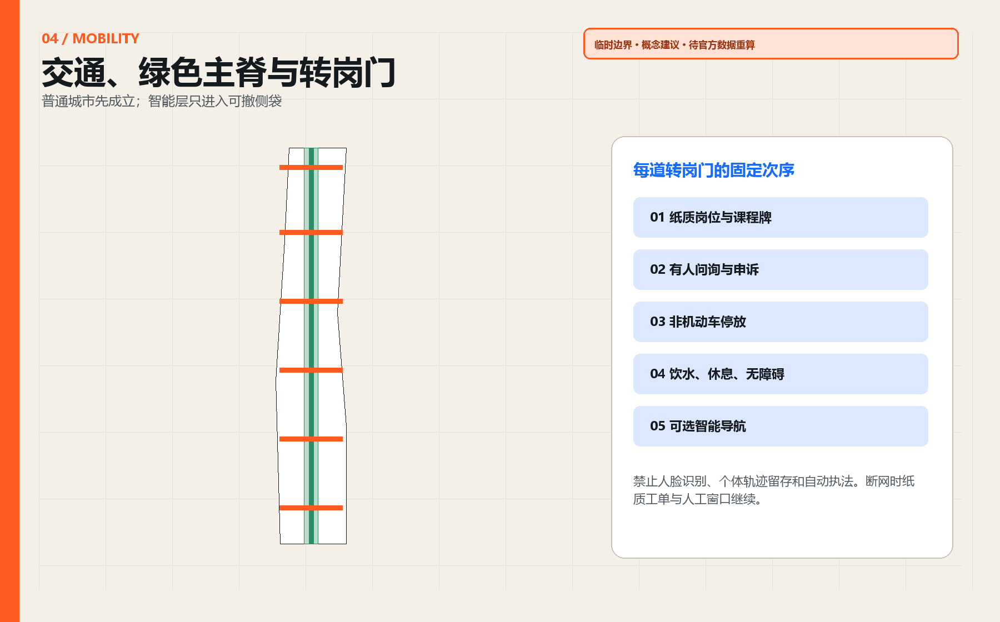
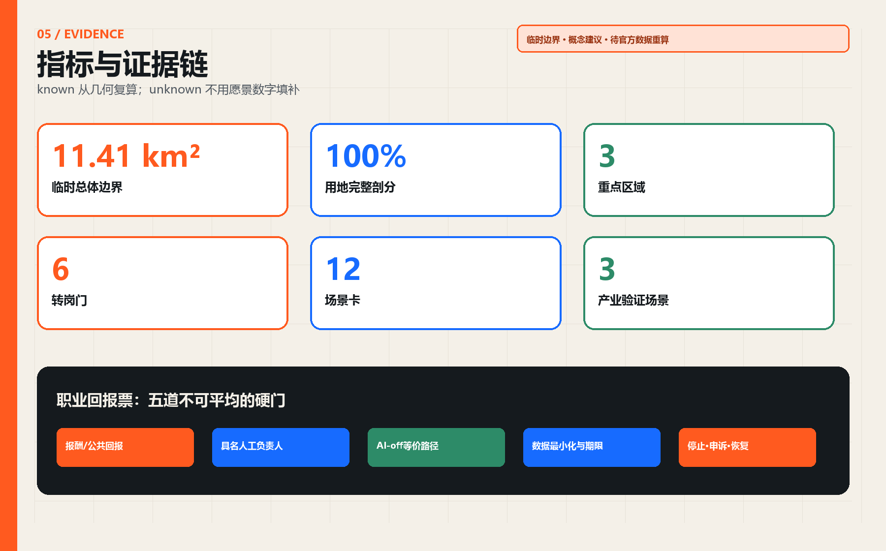

# 京张下一程 / THE NEXT RUN

> **AI 创新的第一份公共回报，是让正在工作的人也能跟上。**

## 设计依据与资料清单

本方案响应公告的 43.6 平方公里统筹研究、约 11.4 平方公里总体设计及三处约 368.4 公顷重点区域，并逐条覆盖 agent.1-agent.6 [source:OFFICIAL-ANNOUNCEMENT] [source:AGENT-TASKBOOK] [standard:PROJECT-OFFICIAL-ANNOUNCEMENT]。公开场地包尚未提供官方精确总体边界、三处重点区 polygon、控规图则、道路红线、权属、现状建筑、市政与文保控制线；因此所有落位使用维护者提供的临时粗略边界，均为**可供专业团队深化的概念建议**，不替代法定规划、工程设计或审批 [source:BOUNDARY-SOURCE] [data:geometry/site_boundary.geojson#SITE-001]。

总体边界与三处重点区始终标记 `provisional_constraint`、`official_boundary=false`、`boundary_precision=provisional_rough`。临时边界由文字四至和公告面积约束推导，仓库的 OSM 核验提示存在约 533-898 米偏移的可能；这是一项不确定性提示，不是对真实位置的证明。正式 polygon 到位后，应整包替换并重算用地、道路、建筑、绿地、公共空间、分期和指标 [source:BOUNDARY-BASIS] [self-check:BOUNDARY_TRUST]。

## 三层范围工作框架

“下一程”不是培训园区，而是**一条城市职业转换基础设施**。AI 项目获得公共空间前，必须提交“职业回报票”：新岗位是什么、谁能在职学习、在哪里练习、由谁人工签认、失败时如何退出。空间结构为“一脊、三场、六门、十二站、两翼”：京张遗址公园方向是保持普通通行与静态导视的公共主脊；三场对应验证 VERIFY、学习 LEARN、带薪实践 EARN；六门连接轨道、园区、校园、社区与首层；十二站承载场景卡；中关村科技服务翼输入导师、工具和企业问题，小月河场景赋能翼返回使用反馈 [depth:three_level_scope_framework] [data:geometry/roads.geojson#ROAD-001]。

| 层级 | 核心判断 | 本方案输出 | 证据 |
|---|---|---|---|
| 统筹研究 | 从“吸引 AI 人才”扩展为“让更多职业进入 AI 时代” | 六类全球机制、十二条职业路径、年度开放班次 | [source:AGENT-TASKBOOK] |
| 总体设计 | 以公园方向和六道横向门组织验证、学习、带薪实践 | 完整用地剖分、道路/绿地/公共空间/建筑/分期层 | [data:geometry/land_use.geojson#LU-001] |
| 重点区域 | 三处片区分别回答“能否安全做、能否学会、能否获得工作” | 三座技能工场及最小试点 | [data:geometry/key_areas.geojson#PROV-KEY-001] |

## 统筹研究范围产业与未来城市研究

对标只提取可迁移机制，不套用规模或政策。Newlab 把原型设施、产业伙伴和真实试点放在同一平台；STATION F 用多种项目而非单一办公租赁组织校园；JTC LaunchPad 提供模块化空间、试验场与地面展示 [source:CASE-NEWLAB] [source:CASE-STATIONF] [source:CASE-JTC]。MaRS 把人才顾问和岗位网络纳入创新服务；UnternehmerTUM 把 MakerSpace、教练与企业课题连接；AI Singapore 的学徒制把深度学习与真实项目衔接 [source:CASE-MARS] [source:CASE-UTUM] [source:CASE-AISG]。

京张的转译是“**空间 + 班次 + 责任**”：共享设施回答在哪里学，日/周/季班次回答在职者何时学，具名导师和专业人员回答谁对结果负责。AI 只辅助课程匹配、合成故障生成、测试编排和证据缺口提示；它不得决定录用、资格、薪酬、福利或公共服务结果。建议优先培育十二类公开职业路径：具身智能维修、端侧网络运维、模型评测、无障碍质量检验、数据管理、开源发行、人工升级服务、多语调解、小店流程共创、文化数字整理、公共空间设备巡检、课程与岗位运营。

## 总体设计范围城市更新与控规深度城市设计

用地层完整剖分临时总体边界，不留缝、不重叠；法定用地代码沿用场地包登记的国土空间用途分类，概念命名只作为设计意图 [standard:MNR-LAND-USE-CLASSIFICATION-GUIDE] [data:geometry/land_use.geojson#LU-001]。连续绿地承担普通慢行、休息、户外课程与 AI-off 路径；科研与商业服务地块承担工场和带薪实践；社区服务设施承担有人咨询、照护支持和公共课程。容积率、建筑高度、密度、拆改留、道路红线及市政容量均保持 `unknown`，待官方资料和专业会审后确定 [metric:floor_area_ratio] [assumption:A-CONTROLS-001]。

建筑原型采用“12 米可逆首层 + 后场工场 + 无 AI 等价前台”：首层按 4.5 米连续净通行、3 米静态信息与人工服务、4.5 米可换用实训带组织；仅为设计原型，不是现状或批准尺寸。每个智能模块须独立断电、可拆除且不占用疏散、无障碍、饮水、休息和人工帮助。任何真实落位必须先过权属、结构、消防、市政、交通、无障碍与文保门 [depth:development_intensity_controls] [data:geometry/buildings.geojson#BLDG-001]。

## 重点区域详细设计

**众智园技能验证工场 / VERIFY。** 北部重点区设置封闭低速测试庭、合成故障台、端侧互操作台和有人观察廊。产业项目先证明安全、人工接管、设备复位和职业训练价值，再进入公共场景。首期最小试点为一个不接入真实个人数据的机器人故障台；工程师签认后才能离开工场 [data:geometry/key_areas.geojson#PROV-KEY-001]。

**AI 原点开放学习枢纽 / LEARN。** 中部重点区连接高校、开源社区和居民，布置开放课程桌、无障碍 QA 室、开源发行门诊、数据管理室及安静照护间。学习成果以公开作品集、人工评议和可撤销技能徽章表达，不由单一模型打分。首期最小试点是每周一个晚间班与一个周末班 [data:geometry/key_areas.geojson#PROV-KEY-002]。

**大钟寺带薪实践市场 / EARN。** 南部重点区把初创企业、小店、采购方与转岗者带到同一首层网络。每个真实课题须公开报酬、工作时长、数据边界、导师和申诉渠道；自动评分不得决定录用。首期最小试点为十个小微企业问题、二十个带薪实践席位和一个有人职业服务台，这些数量是试点建议而非政府承诺 [data:geometry/key_areas.geojson#PROV-KEY-003]。

三处地标兼作贡献荣誉系统：众智园“第一扳手”展示被人工修复的首个公共 AI 原型；AI 原点“开放工牌墙”记录经本人同意公开的技能贡献；大钟寺“下一程站厅”每年公布岗位、课程、薪酬透明度和退出案例。视觉识别以两条平行轨和一个上升缺口组成 `JZ / NEXT`，使用黑、米白、铁路橙与技能蓝；不使用第三方商标或未清权字体。

## AI 创新生态、人才画像与 AI+ 场景

六类核心画像是：希望不离岗转型的设备技工、承担照护时间的行政人员、缺少数字团队的小店店主、需要真实项目的高校毕业生、参与无障碍测试的残障人士、需要多语服务的国际人才。另把夜班运维者与公共服务一线人员作为横向检验人群。每类画像都可不注册、不提供人脸、不接受自动画像，并可通过纸面与有人窗口完成普通任务 [standard:PROJECT-AGENT-OPEN-CALL-TASKBOOK]。

| 卡片 | 场景 | 位置 | 受益者 | 数据/空间 | 人工责任 | AI关闭后 |
|---|---|---|---|---|---|---|
| SC-01 | 具身智能维修员实训 | 众智园 | 转岗机电工、机器人初创 | 合成故障台与封闭低速场 | AI仅编排测试；具名工程师放行 | 停机并恢复人工工位 |
| SC-02 | 端侧传感互操作实训 | 众智园 | 网络运维员、传感企业 | 离线数据与可撤传感器 | 不采集人脸；专业人员验收 | 拆除传感器、保留静态巡检 |
| SC-03 | 公共服务转人工演练 | 众智园 | 客服、政务服务技术团队 | 合成对话与角色扮演 | AI不得作最终决定；当班负责人签认 | 立即切换人工服务 |
| SC-04 | 无障碍质量检验课 | AI原点 | 残障测试员、产品经理 | 参与者自愿反馈 | 按次同意、匿名记录、人工结论 | 保留实体导视与人工协助 |
| SC-05 | 开源模型发行门诊 | AI原点 | 开发者、学生、法务 | 公开代码与授权材料 | 人工检查许可、数据卡和退出条件 | 不发布、归还资料 |
| SC-06 | 城市数据管理员实训 | AI原点 | 社区工作者、数据工程师 | 公开或已授权数据 | 最小化、期限、访问留痕 | 撤权、删除派生副本 |
| SC-07 | 多语服务调解员实训 | AI原点 | 国际人才服务者、居民 | 自愿提供的短句与公共词汇 | 译文仅作草稿；本人确认原意 | 改用人工翻译和纸质双语卡 |
| SC-08 | 小店流程共创台 | 大钟寺 | 店主、转岗运营人员 | 店主自带业务问题 | 不读取顾客画像；店主人工采纳 | 还原原流程并导出记录 |
| SC-09 | AI产品带薪试用班 | 大钟寺 | 求职者、采购方、初创团队 | 受控任务与明确报酬 | 不以自动评分决定录用 | 人工评价并允许申诉 |
| SC-10 | 文化遗产数字整理课 | 大钟寺 | 文化工作者、内容企业 | 已清权公共材料 | 人工校勘、来源随件、禁止拟真冒充 | 撤下错误内容并公开更正 |
| SC-11 | 夜班人机交接员实训 | 六道转岗门 | 保安、清洁、运维人员 | 设备状态而非个人轨迹 | 一岗一册一人工负责人 | 断网纸册继续交接 |
| SC-12 | 开放岗位与课程墙 | 全线 | 所有访客 | 企业公开岗位与课程 | 不做人脸识别和自动淘汰 | 纸质公告与有人咨询持续 |

SC-01、SC-02、SC-03 是三项产业测试验证场景；其余场景把验证能力转为公共学习和工作机会。每张卡的智能层可关闭，关闭后仍保持通行、静态信息、人工服务和原有业务流程 [self-check:AI_OFF_BASELINE]。

## 用地、建筑规模与拆改留方案

临时总体边界在 EPSG:4548 下复算约 11.41 平方公里；这是临时约束的计算结果，不是官方精确面积 [metric:site_area_sqm]。用地四类 polygon 完整覆盖边界；绿地、公共空间和概念建筑基底分别由独立层复算 [metric:green_ratio] [metric:public_space_ratio] [metric:building_footprint_area_sqm]。当前没有可清权的现状建筑与权属数据，因此拆改留不做对象级判断：只提出“先盘点、再会审、后试点”的方法；已有使用不得因算法估算的低利用率被清退。

三种建筑动作均需现场确认：A 类在合法可用首层插入可拆课程桌；B 类在符合结构消防条件的存量空间布置共享实训；C 类新建只保留为远期接口，须等待控规与工程条件。屋顶、地下与桥下空间不得因“创新”绕开权属、消防、文保、市政或生态许可 [depth:retain_renovate_demolish]。

## 交通、轨道、市政与公共服务设施

公共主脊保持连续步行、骑行、无障碍、静态导视与休息；六道转岗门是概念连接，不代表道路红线或既有通路 [data:geometry/roads.geojson#ROAD-X01]。每道门从轨道/公交到场地依次设置纸质课程与岗位牌、有人问询、非机动车停放、饮水休息、无障碍路径和可选智能导航。交通算法只做聚合拥挤提示，不进行人脸识别、个体轨迹留存或自动执法。

端侧算力、网络、电力、排水、消防与设备充电均为待深化系统。最小试点使用既有合规电源和离线合成数据，不新建未经审批的管线。全线公共服务 SLA 是：AI 故障不导致通行、咨询、报名、申诉或紧急求助消失；每班至少一名具名负责人，纸质工单可在断网时继续。

## 蓝绿空间、公共空间与城市风貌

绿色主脊不是新增公园确权结论，而是临时边界内的设计表达。它把遮阴、座椅、饮水、安静课程、户外实训和生物多样性作为专业深化前的功能清单；树种、雨洪、河道、土壤与绿地率需现场和官方资料确认 [data:geometry/green_space.geojson#GREEN-001]。公共空间坚持“普通城市先成立”：AI 设备只能进入侧袋，不压缩连续通行和无障碍；所有屏幕都有纸质对应物，所有智能报名都有有人窗口。

文化叙事不虚构铁路史细节：京张铁路的公共记忆在这里被转译为“下一程”的可读动作——验证像出库检查，学习像换乘，带薪实践像发车。年度“京张下一程开放周”包含工场开放、岗位说明、公开课、无障碍共测、小店课题、开源发行和年度职业回报账本；活动须另行许可、清权并接受安全评估。

## 更新项目清单、实施政策与分期计划

| 项目 | 最小交付 | 责任角色 | 启动门 | 退出条件 |
|---|---|---|---|---|
| JZ-N01 职业回报票 | 开源表单、纸质版、人工登记 | 运营方+工会/行业组织+专业顾问 | 隐私与劳动合规审查 | 无具名责任人或无人工路径即暂停 |
| JZ-N02 众智园故障台 | 一个合成故障台、十次演练 | 场地运营方+工程师 | 权属、结构、消防、设备安全 | 任一安全事件即封闭复盘 |
| JZ-N03 原点晚间班 | 每周晚间/周末各一班 | 高校/开源社区+有人班主任 | 场地与课程清权、无障碍 | 无人工教师或自动评判即停课 |
| JZ-N04 大钟寺带薪席位 | 20 个建议席位、明确报酬 | 企业/小店+劳动顾问 | 合同、工资、保险和申诉 | 无报酬或自动录用淘汰即终止 |
| JZ-N05 六道转岗门 | 静态牌、问询、休息和无障碍 | 属地运营+交通/市政专业 | 现场测绘与专业会审 | 阻碍疏散/通行即撤除 |
| JZ-N06 年度回报账本 | 岗位、完课、申诉、退出汇总 | 独立评估者 | 仅聚合数据、公开口径 | 无法复核则标 unknown |

0 期（0-6 个月建议）只做官方数据替换、现场测绘、权属与人群共议；1 期（6-18 个月建议）在三处各做一个可撤回最小试点；2 期（18-36 个月建议）经独立复盘后扩展六门十二站；3 期仅在控规、资金、运营主体和专业审批齐备时讨论永久设施。所有日期均为方案建议，不是批准计划 [data:geometry/phasing.geojson#PHASE-001]。

## 指标体系、面积复算与合规矩阵

known 指标只来自提交几何：临时边界面积、完整用地覆盖、三处重点区、六道转岗门、十二张场景卡、绿地/公共空间比和概念建筑基底；FAR、高度、密度、现状建筑、就业基线、薪酬和真实完课率保持 unknown [metric:key_area_count] [metric:skills_transfer_gate_count] [metric:scenario_card_count]。运营目标只能在试点后用去标识聚合数据评估，不能反推个人绩效。

“职业回报票”有五道硬门：有报酬或明确公共回报；有具名人工负责人；有 AI-off 等价路径；有数据最小化与保存期限；有停止、申诉和恢复。五门不可平均，任一失败即 HOLD。`compliance_matrix.json` 覆盖公告必选任务和 agent.1-agent.6；`standard_matrix.json` 区分法定依据、自设规则和资料缺口；`design_depth_matrix.json` 把正文、图纸、几何、指标与自检相互挂接 [depth:metrics_recalculation]。

## 风险、版权与合规说明

主要风险是临时边界偏移、把概念建筑误读为现状、在职学习变成无薪劳动、自动评分歧视、测试设备伤人、课程和素材侵权、AI 功能挤占普通服务、运营资金中断。对应措施是全图层 provisional 标记、明显水印、明确报酬、人工终决、封闭测试、逐资产清权、AI-off 基线和分期退出 [data:geometry/constraints.geojson] [assumption:A-IMPLEMENTATION-001] [self-check:PROVISIONAL_DISCLOSURE]。

生成式 AI 只用于本开源方案的文字、图形、代码与概念推演；不处理涉密数据、未公开个人信息或未经授权的现状资料。最终实施必须由规划、建筑、景观、交通、市政、消防、文保、无障碍、劳动、隐私与运营专业人员会审。全部原创文本、图件、HTML 与代码按本包 `COMMUNITY-DISPLAY-ONLY` 声明展示；外部来源只作引用和机制研究，未复制其图片、标识或大段文字。详细来源与访问日期见 `sources.json` 和 `report/copyright_statement.md`。

## 参考资料

- 项目公告、智能体任务书与场地包 [source:OFFICIAL-ANNOUNCEMENT] [source:AGENT-TASKBOOK] [source:SITE-PACKAGE]
- 来源登记与临时边界依据 [source:SOURCE-REGISTRY] [source:BOUNDARY-BASIS]
- 原型、园区与试验场案例 [source:CASE-NEWLAB] [source:CASE-STATIONF] [source:CASE-JTC]
- 人才、制造空间与学徒制案例 [source:CASE-MARS] [source:CASE-UTUM] [source:CASE-AISG]
- 完整机器索引、许可、用途与限制：`sources.json`
