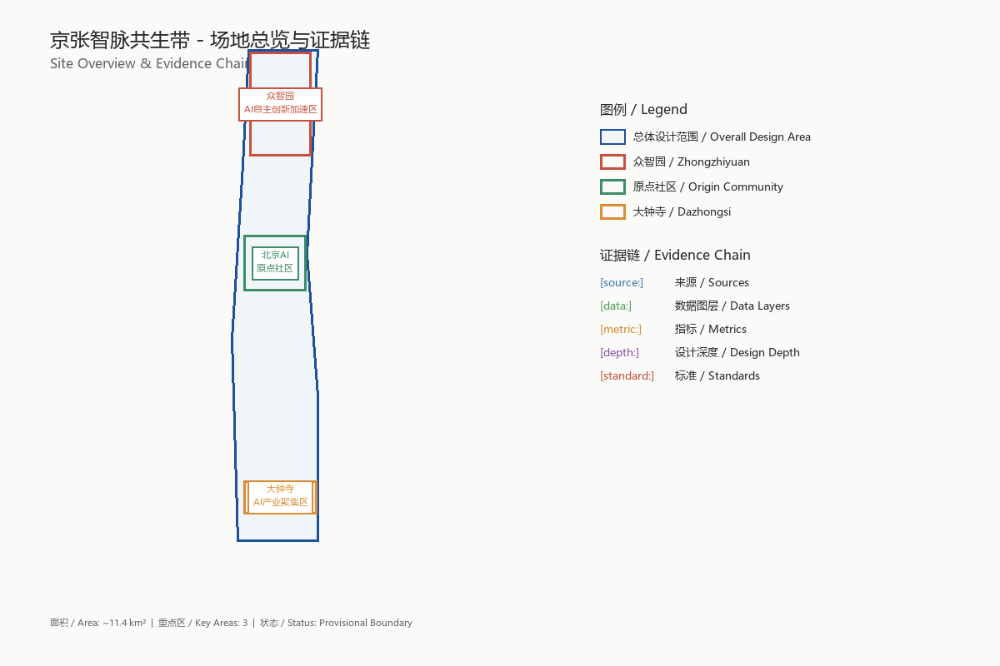
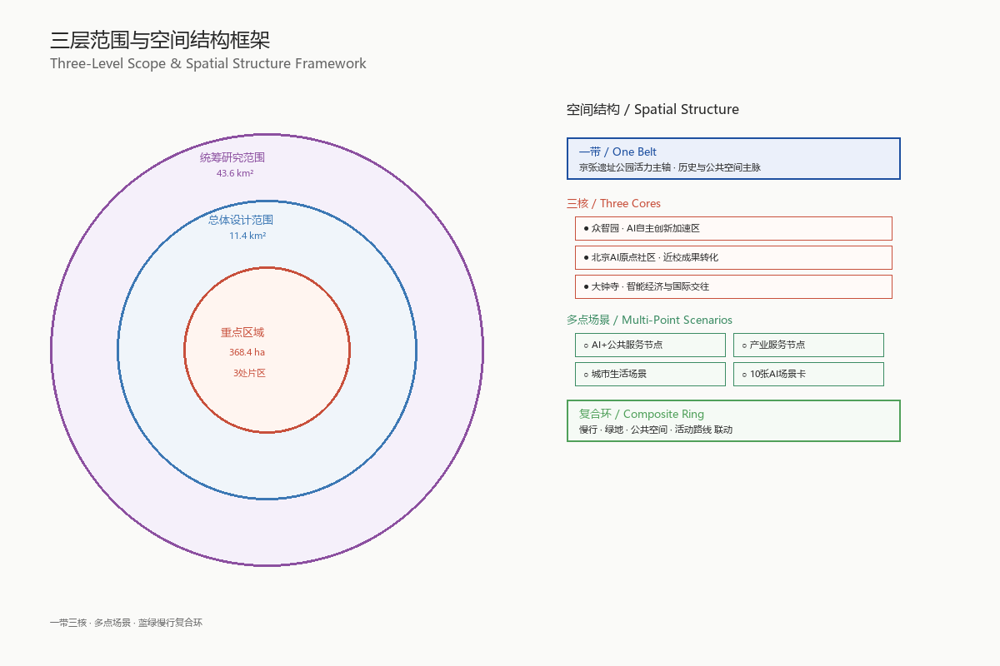
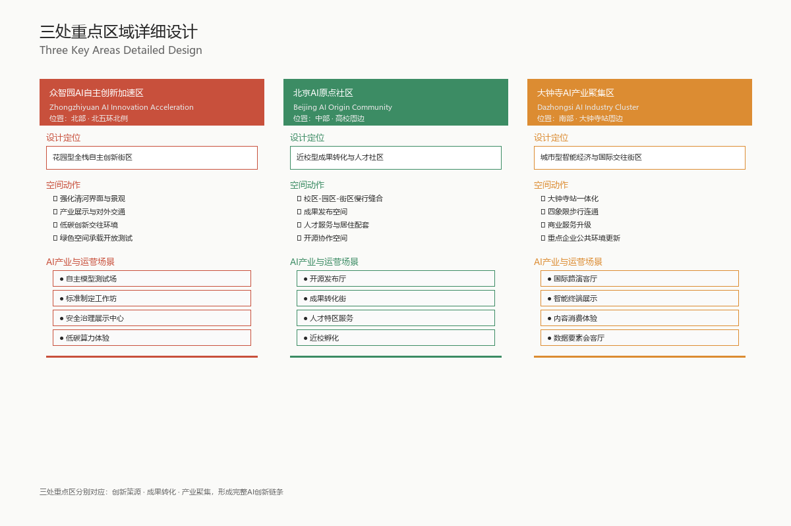
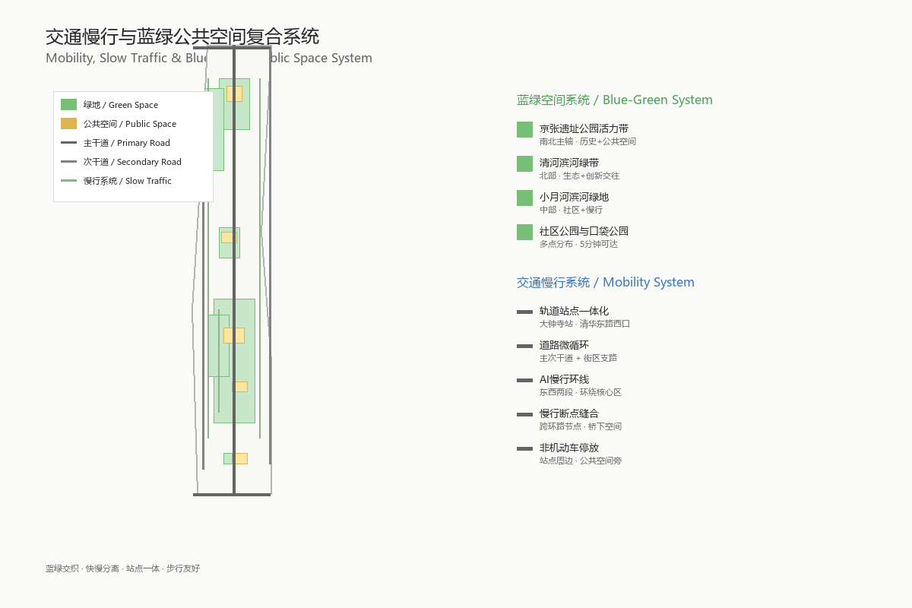
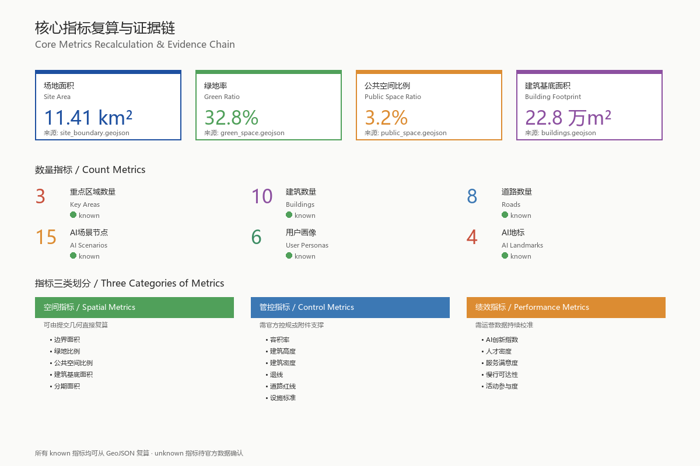

# One Pulse Connects Beijing-Zhangjiakou, Collective Intelligence Renews the Historic Rail

## Design Basis and Source Inventory

This formal proposal takes the "Pre-Qualification Announcement for the International Urban Design Competition of the Centennial Beijing-Zhangjiakou AI Innovation Belt" issued by the Haidian Branch of the Beijing Municipal Planning and Natural Resources Commission as its primary basis, and uses the provisional rough boundaries, key areas, enumerations, metrics, and source list registered by maintainers in `brief/site-package/` as machine-readable basis. Before generating the proposal, the AI agent must read `design_brief.json`, `allowed_design_space.json`, `sources.json`, `enums/`, `ranges/`, `schemas/`, `data/source_registry.json`, and `data/processed/agent_fact_pack.md`, and use `project_scope_summary.csv`, `agent_task_requirements.csv`, `source_use_matrix.csv`, and `missing_data_checklist.csv` to establish task, scope, data usage, and gap checklists. All design judgments must be broken down into traceable sources, recalculable metrics, verifiable layers, and human-reviewable assumptions. The announcement requires the proposal to reach the urban design depth of regulatory detailed planning and the urban design depth of comprehensive planning implementation plan, therefore text narrative cannot replace GeoJSON, metric tables, A3 booklet, A0 boards, and HTML electronic presentation deliverables.

The proposal is not an independent vision text, but organizes deliverables starting from the announcement, agent-oriented taskbook, and site materials; this section only places the most critical basis next to judgments [source:OFFICIAL-ANNOUNCEMENT] [source:AGENT-TASKBOOK] [depth:existing_conditions_diagnosis]. Complete source and standard coverage are stored in `sources.json`, `standard_matrix.json`, and `design_depth_matrix.json` respectively, and machine indexes are not repeated in the main text.

The usage boundaries of the source registry are as follows [source:SOURCE-REGISTRY]:

- `data/source_registry.json` registers the usage boundaries of public, cleared, and provisional materials.
- Current registration summary: 5 formal-usable sources, 0 background sources, 1 provisional-only source.
- Agents must not upgrade background_only or provisional_only materials into official boundary, statutory regulatory plan, formal scoring basis, or government implementation commitment.

`data/processed/agent_fact_pack.md` is the reading navigation layer of this proposal, not a new authoritative source [source:PROCESSED-FACT-PACK]. It helps agents organize three-level scope, three key areas, announcement tasks, agent.1-agent.6, data availability, and missing data items into a readable proposal; factual judgments must still return to registered original materials [source:OFFICIAL-ANNOUNCEMENT] [source:AGENT-TASKBOOK], and complete source relationships are stored in `sources.json`.

When the official `SITE_BOUNDARY` or three `KEY_AREA` have not yet been obtained, this scaffold uses `brief/site-package/geometry/provisional_boundaries.geojson` to generate a provisional formal package. Both `geometry/site_boundary.geojson` and `geometry/key_areas.geojson` in the submission package must be marked as `provisional_constraint`, `official_boundary=false`, and can only be used for proposal generation, self-check, visualization, and design discussion, and cannot be used as official redline, approval basis, precise area basis, or statutory control conclusion. This organizer data gap itself does not block content scoring; after replacing official polygons, site boundary, key areas, land use, roads, green space, public space, buildings, phasing, and metrics all need to be recalculated.

The scorable status of this scaffold generation is: **Provisional boundary, precision warnings retained and recalculation pending after official data release; does not block content scoring**. Therefore, the spatial structure, scenarios, projects, and indicators in the main text are all written according to the principle of "discussable, reviewable, recalculable after replacing official boundary"; when the official boundary and key area polygons are updated, the agent must re-run the scaffold, self-check, and drawing/HTML generation, and cannot just replace individual files.

Boundary explanation can return to the overall scope layer and area recalculation [data:geometry/site_boundary.geojson#SITE-001] [metric:site_area_sqm]. The three key areas are verified by independent layers and quantity indicators [data:geometry/key_areas.geojson#PROV-KEY-001] [metric:key_area_count]. This means readers can enter evidence from the main text without first reading a string of machine numbers.

## Three-Level Scope Work Framework

The proposal organizes work according to the three levels determined by the announcement: the coordinated research scope focuses on the AI industry ecosystem, strategic positioning, innovation chain, and future urban form of 43.6 square kilometers; the overall design scope focuses on the 11.4 square kilometer urban area and industrial zone 1-2 kilometers around the Beijing-Zhangjiakou Heritage Park, requiring the formation of an overall urban renewal framework, industrial spatial layout, transportation and municipal support, and urban style control; the key area scope focuses on 368.4 hectares of three detailed design areas, requiring clear functional formats, building scale, retain-renovate-demolish classification, public space connectivity, and transportation organization. The three-level scope is mapped item by item in `compliance_matrix.json`, ensuring that mandatory tasks in announcements 1.3, 1.4, 1.5 and agent.1-agent.6 all have chapter, layer, metric, drawing, and HTML evidence.

The depth items of the three-level work framework are constrained by [depth:three_level_scope_framework] and [depth:overall_spatial_structure], spatial evidence is based on [data:geometry/site_boundary.geojson#SITE-001] and [data:geometry/key_areas.geojson#PROV-KEY-001], task basis is based on [standard:PROJECT-OFFICIAL-ANNOUNCEMENT], and scope index is navigated by the three-level scope table in `project_scope_summary.csv` in [source:PROCESSED-FACT-PACK].

Three-level work is not a set of mutually isolated drawings. Coordinated research determines industry chain and urban form judgments, overall design implements judgments into renewal projects, spatial structure, and facility carrying capacity, and key area detailed design verifies the implementability of specific plots, buildings, transportation, public space, and AI application scenarios. When generating a proposal, the agent must first lock the official or provisional boundary and constraints used in the current submission, then generate land use, buildings, roads, green space, public space, phasing, and AI service nodes, and finally recalculate metrics from these layers and explain in the main text which conclusions are still limited by the provisional boundary. Any area, ratio, scale, or project quantity that cannot be recalculated from structured data must not be written into formal conclusions.

The overall concept proposed by this plan is the "Beijing-Zhangjiakou Intelligence Pulse Symbiosis Belt": taking the Beijing-Zhangjiakou Heritage Park as the historical and public space main axis, taking the three key areas of Zhongzhiyuan, Beijing AI Origin Community, and Dazhongsi as innovation anchors, and taking universities, enterprises, communities, and rail transit stations as the daily network, forming a spatial organization of "one belt, three cores, multi-point scenarios, and blue-green slow-traffic composite ring". The "one belt" here is not an additional new red line, but translates the three-level scope in the announcement into a working method; "three cores" correspond to the three key areas; "multi-point scenarios" correspond to operable nodes of AI+ public services, industrial services, and urban life; "composite ring" corresponds to the linkage of slow traffic, green space, public space, and activity routes.

| Level | Design Question | Proposal Answer | Data Landing Point |
| --- | --- | --- | --- |
| Coordinated Research Scope | How to organize AI industry ecosystem and future urban form | Establish an innovation chain of "university source - open source collaboration - enterprise transformation - public experience - international communication" | compliance_matrix.json, standard_matrix.json |
| Overall Design Scope | How to map industrial space, urban renewal, transportation/municipal utilities, and style | Expressed jointly by land use, buildings, roads, green space, public space, and phasing layers | [data:geometry/land_use.geojson#LU-001], [data:geometry/roads.geojson#ROAD-001] |
| Key Area Scope | How to achieve detailed design depth in three districts | Propose positioning, spatial actions, AI scenarios, and implementation dependencies respectively | [data:geometry/key_areas.geojson#PROV-KEY-001], [data:geometry/key_areas.geojson#PROV-KEY-002], [data:geometry/key_areas.geojson#PROV-KEY-003] |

## Coordinated Research Scope: Industry and Future City Research

The core task of the coordinated research scope is to build a world-class AI innovation ecosystem. The proposal should sort out Haidian's universities and research institutes, leading enterprises, computing power algorithm data elements, incubation platforms, listed companies, unicorns, and technology service resources, and propose a spatial collaboration framework for the AI innovation chain, industry chain, talent chain, and urban service chain. The naming scheme and logo design should serve the overall recognition of the "Centennial Beijing-Zhangjiakou Cultural Belt, Urban AI Life Experience Belt, and AI Integration Innovation Belt", and should not stop at slogans, but should explain the connection with the industry ecosystem, public space, and cultural resources. The agent-oriented taskbook also requires responding to the "five major functions" and "three districts and two wings" coordination, forming a naming system, visual identity, overall spatial structure diagram, scenario opening, and operation mechanism that can be further deepened; this section must use [source:AGENT-TASKBOOK] and [standard:PROJECT-AGENT-OPEN-CALL-TASKBOOK] to mark that these requirements come from the agent open call task, not statutory planning control.

Coordinated research does not add pseudo-precise red lines; it connects back to [data:geometry/land_use.geojson#LU-001], [data:geometry/public_space.geojson#PUBLIC-001], and [depth:overall_spatial_structure] through urban style, public space, and building layout coordination required by [standard:MOHURD-URBAN-DESIGN-MEASURES], explaining that industrial strategy must ultimately land on a visible and reviewable spatial structure.

Future urban form research should answer how artificial intelligence changes work, life, social interaction, learning, transportation, and public services. The proposal should implement AI transportation systems, continuous green space, innovation service facilities, and an international living and working atmosphere into locatable functional areas, nodes, corridors, and scenarios, rather than broadly describing technical visions. Agents should write industrial strategy indicators, AI innovation index, talent density, spatial supply types, and AI+ vertical application key areas into the indicator system, and mark which are official, which are design suggestions, and which are still pending official data calibration. If global AI innovation activities, developer communities, open scenarios, or pilgrimage routes are proposed, they should be written as "conceptual suggestions/reference schemes/available for professional teams to deepen research", and must not be written as already determined government activities or implementation arrangements.

## Overall Design Scope: Urban Renewal and Regulatory Plan Depth Urban Design

The overall design scope requires reaching the urban design depth of regulatory detailed planning. The proposal must put forward the overall spatial structure of urban renewal, inefficient space identification, renewal project list, implementation policy suggestions, industrial function ratio, spatial organization mode, total building scale, and comprehensive carrying capacity assessment. `geometry/land_use.geojson` should completely cover the design boundary without overlap, `geometry/buildings.geojson` should express renewed building footprints or retained building footprints, `geometry/roads.geojson` should express micro-circulation, slow traffic, and rail transit connection relationships, and `metrics.json` should recalculate core areas, ratios, and layer quantities.

This section breaks down regulatory plan depth content into reviewable objects according to [standard:MOHURD-CONTROL-DETAILED-PLANNING]: [data:geometry/land_use.geojson#LU-001] expresses land use structure, [data:geometry/buildings.geojson#BLDG-001] expresses building footprints, [data:geometry/roads.geojson#ROAD-001] expresses transportation organization, [metric:building_footprint_area_sqm] is used to verify building footprint area, and [depth:land_use_layout] and [depth:development_intensity_controls] constrain deliverable depth.

Overall design must also support transportation, rail transit, municipal utilities, and supporting facilities. The proposal should put forward spatial layout and implementation paths around rail station integration, road micro-circulation, non-motor vehicle parking, parking supply, innovation service platforms, talent living services, new infrastructure, distributed energy, and edge computing power. For content involving building height, development intensity, road red lines, setbacks, and facility standards, if there are no official control conditions yet, it should be written as "pending official regulatory plan condition confirmation", and agent speculated values must not be used to impersonate approved indicators.

## Key Area Detailed Design

Key area detailed design is mandatory. The Zhongzhiyuan AI Independent Innovation Acceleration Area should propose a detailed plan around the national artificial intelligence platform, full-stack independent innovation, standard setting, security governance, industry exhibition, external transportation, Qinghe culture, low-carbon green innovation exchange environment, and green space AI scenarios. The Beijing AI Origin Community should propose a detailed plan around near-campus innovation, achievement incubation and transformation, talent special zone, open source system, brand activities, building retain-renovate-demolish, achievement exhibition and release, living support, campus-park slow traffic connection, and rail station integration. The Dazhongsi AI Industry Cluster should propose a detailed plan around leading enterprises, agents, intelligent terminals, content consumption, data elements, digital assets, commercial services, planned green space composite utilization, Dazhongsi Station integration, and four-quadrant pedestrian connectivity at intersections.

The detailed design of the three key areas must reference [data:geometry/key_areas.geojson#PROV-KEY-001], [data:geometry/key_areas.geojson#PROV-KEY-002], [data:geometry/key_areas.geojson#PROV-KEY-003], and [depth:three_key_area_detailed_design] checks whether it reaches the depth of comprehensive planning implementation plan. If only describing "building a demonstration area" without evidence of functions, buildings, transportation, public space, and implementation projects, it should be regarded as incomplete.

The three key areas must appear in `geometry/key_areas.geojson`. If the repository has provided official polygons, they should be used as `official_constraint`; if official polygons are missing, `provisional_constraint` can be used temporarily, but the main text, HTML, sources, assumptions, and self_check must explain that it cannot be used as formal scoring or approval basis. `compliance_matrix.json` should cover announcements 1.5.3.1, 1.5.3.2, and 1.5.3.3 respectively. Design expression should include functional formats, building scale, building form, retain-renovate-demolish classification, public space system, transportation organization, slow traffic connectivity, and implementation projects. The HTML page should be able to switch to view the three key areas, and the A3 booklet and A0 boards should at least include the key area master plan, local detailed drawings, and indicator descriptions.

| Key Area | Design Positioning | Spatial Actions | AI Industry and Operation Scenarios | Evidence References |
| --- | --- | --- | --- | --- |
| Zhongzhiyuan AI Independent Innovation Acceleration Area | Garden-type full-stack independent innovation district | Strengthen Qinghe interface, industry exhibition, low-carbon innovation exchange, and external transportation organization; use green space to carry open testing and standard governance exhibition | Autonomous model testing, standard setting workshops, security governance exhibition, low-carbon computing power experience | [data:geometry/key_areas.geojson#PROV-KEY-001], [depth:three_key_area_detailed_design] |
| Beijing AI Origin Community | Near-campus achievement transformation and talent community | Organize campus-park-block slow traffic suture; supplement achievement release, talent services, living support, and open source collaboration space | Open source community, achievement release, talent special zone services, near-campus incubation | [data:geometry/key_areas.geojson#PROV-KEY-002], [source:AGENT-TASKBOOK] |
| Dazhongsi AI Industry Cluster | Urban-type intelligent economy and international exchange district | Around Dazhongsi Station integration, four-quadrant pedestrian connectivity, commercial services, and public environment renewal of key enterprises | Agent and intelligent terminal exhibition, content consumption, data elements and international roadshow | [data:geometry/key_areas.geojson#PROV-KEY-003], [metric:key_area_count] |

## AI Innovation Ecosystem, Talent Profile, and AI+ Scenarios

The proposal should establish spatial demand profiles for AI talents and enterprises, covering R&D office, open source collaboration, achievement release, enterprise services, talent housing, social learning, consumption life, sports and leisure, and international exchange. AI+ scenarios should form industrial development scenarios and AI-enabled urban function scenarios around the directions of transportation, services, consumption, medical care, education, law, and life services proposed in the announcement. Each scenario should explain service objects, spatial location, data sources, privacy boundaries, human review mechanism, and operating entity.

AI scenarios must land on spatial and governance boundaries: public space scenarios reference [data:geometry/public_space.geojson#PUBLIC-001], slow traffic and transportation scenarios reference [data:geometry/roads.geojson#ROAD-001], open space scenarios reference [data:geometry/green_space.geojson#GREEN-001] and [metric:public_space_ratio], [metric:green_ratio]. These references let reviewers know that scenarios are not slogans, but design objects located in specific layers and indicators. The agent-oriented taskbook requires no less than 10 AI scenario cards, no less than 3 industrial test and verification scenarios, and no less than 5 types of user personas; the scaffold only gives the structure, and formal participants must write scenario cards, persona tables, privacy boundaries, human review, and operating entities into the main text, HTML, A3/A0, and compliance matrix.

| User Persona | Typical Needs | Spatial Response | Self-Check Boundary |
| --- | --- | --- | --- |
| Open Source Developer | Release, collaboration, testing, community reputation | Origin Community Open Source Release Hall, Public Code Wall, Night Collaboration Space | Do not collect personal behavior trajectories; activity data only for aggregate statistics |
| Startup Team | Low-cost office, computing power entry, product test field | Zhongzhiyuan Shared Test Field, Edge Computing Power Service Point, Standard Governance Consulting | Computing power and data services require separate authorization |
| Leading Enterprise Visitor | Exhibition, business, international reception, talent recruitment | Dazhongsi International Roadshow Living Room, rail station connection, public space around key enterprises | Corporate logos and cases must be cleared for rights |
| Surrounding Residents | Commuting, leisure, community services, low-disturbance renewal | Beijing-Zhangjiakou Heritage Park slow traffic ring, embedded community services, night lighting and activity grading | Do not use resident profiles for commercial recommendations |
| University Teachers and Students | Achievement transformation, cross-campus collaboration, daily slow traffic | Campus-park slow traffic suture, achievement transformation station, AI education experience point | Campus data and research results require authorization |

| Scenario Card | Spatial Carrier | Design Description |
| --- | --- | --- |
| 01 Open Source Release Hall | Beijing AI Origin Community | Facing universities, open source communities, and startup teams, providing space for achievement release, code contribution display, and small roadshows |
| 02 Security Governance Sandbox | Zhongzhiyuan | Translate standard setting, security evaluation, and model red team testing into visitable, reservable, and supervisable exhibition and collaboration nodes |
| 03 Edge Computing Power Station | Overall design scope nodes | Combined with public services, enterprise services, and low-carbon energy strategies, as a new infrastructure prototype to be deepened |
| 04 AI Slow Navigation | Beijing-Zhangjiakou Heritage Park Vitality Belt | Use explainable signage and low-intrusive sensing to help identify slow traffic breakpoints, crowded nodes, and accessibility needs |
| 05 Dazhongsi International Roadshow Living Room | Dazhongsi AI Industry Cluster | Serving agents, intelligent terminals, and content consumption enterprises for exhibition, negotiation, media release, and international exchange |
| 06 Qinghe Low-Carbon Innovation Corridor | Zhongzhiyuan Qinghe interface | Combine green space, stormwater management, walking and cycling, and AI exhibition as the park's public living room |
| 07 Near-Campus Achievement Transformation Street | Beijing AI Origin Community | Facing university achievement transformation, organizing incubation, exhibition, legal services, intellectual property, and investment and financing services |
| 08 Data Element Living Room | Dazhongsi District | On the premise of compliance, authorization, and auditability, display the urban service interface of data element and digital asset circulation |
| 09 AI Life Service Model Street | Intersection of community and commerce | Implement AI+ scenarios such as medical care, education, law, and life services into operable small-scale block space |
| 10 Global AI Activity Week Route | One-belt public space system | Form a walkable, communicable experience route from heritage culture, open source community, industry exhibition to international roadshow |

AI governance suggestions generated by agents must abide by the principles of data minimization, public sources, explainability, and human review. Urban agents can assist in identifying slow traffic breakpoints, public space heat, facility maintenance, enterprise service needs, and activity safety risks, but cannot replace planning approval, cannot output unauthorized personal profiles, and cannot claim to have obtained official implementation commitments. All AI scenario nodes should enter structured layers or compliance matrices, so that reviewers can see the relationship between them and industry, space, and public interests.

## Land Use, Building Scale, and Retain-Renovate-Demolish Plan

The land use plan should be expressed according to public standards such as territorial spatial survey, planning, and use control classification, forming complete, closed, seamless land use zones. The building plan should distinguish retained, renovated, renewed, newly built, or to-be-confirmed objects, and clarify the suggested levels of building footprint, function, scale, style, roof, volume, and height control. If existing buildings, ownership, regulatory plans, and engineering conditions are missing, the proposal can only propose methods and to-be-calibrated lists, and cannot fabricate retain-renovate-demolish conclusions.

Land use classification is based on [standard:MNR-LAND-USE-CLASSIFICATION-GUIDE], building height, volume, interface, and style control are managed by [depth:height_massing_character], and the retain-renovate-demolish method is managed by [depth:retain_renovate_demolish]. The main evidence for land use and buildings is [data:geometry/land_use.geojson#LU-001], [data:geometry/buildings.geojson#BLDG-001], and [metric:building_footprint_area_sqm].

Building scale and intensity indicators must be consistent with `metrics.json` and layers. If total building scale, floor area ratio, building height, building density, green space rate, setbacks, and building control lines lack official conditions, they should be listed as unknown or pending_control in the indicator system, and fixed values must not be used to create a sense of precision. The A3 booklet should provide a renewal project list and indicator verification table, the A0 boards should clearly express key spatial structures and key areas, and the HTML page should provide indicator and layer linkage viewing.

## Transportation, Rail Transit, Municipal Utilities, and Public Service Facilities

The transportation plan should respond to the announcement's requirements for rail station integration, road micro-circulation, slow traffic breakpoints, external transportation, parking, non-motor vehicle parking, and green transportation systems. The focus should cover the North Fifth Ring Road, Beijing-Zhangjiakou Heritage Park cross-ring road nodes, Wudaokou, East Qinghua Road West Exit, Dazhongsi Station, and transportation connections around key enterprises. Road and slow traffic layers should remain within the submission boundary and be cross-checked with public space, green space, industrial nodes, and key areas; if the submission boundary is provisional, transportation conclusions can only be used as temporary design discussion.

Transportation and municipal professional depths are constrained by [depth:traffic_rail_slow_parking] and [depth:municipal_new_infrastructure] respectively; layer evidence references [data:geometry/roads.geojson#ROAD-001], [data:geometry/public_space.geojson#PUBLIC-001], and [data:geometry/constraints.geojson#CONSTRAINTS]. When road red lines, pipelines, fire protection, and municipal conditions are missing, assumptions should be used to explain what needs to be supplemented, rather than writing strategies as approved conditions.

Municipal and public service facilities should cover AI industry service facilities, innovation service platforms, talent living service facilities, new infrastructure, distributed energy, edge computing power, and traditional municipal facility integration. The proposal should explain facility standards, spatial layout, service radius, operation mode, and phased implementation logic. When engineering data such as pipelines, energy, drainage, flood control, and fire protection are missing, they should be listed as prerequisites for formal deepening.

## Blue-Green Space, Public Space, and Urban Style

The blue-green space plan should take the Beijing-Zhangjiakou Heritage Park vitality belt as the skeleton, coordinate the travel needs of Qinghe River, Xiaoyue River, surrounding universities, enterprises, and communities, and propose a north-south through, east-west connected pedestrian, cycling, and green space system. The plan should identify slow traffic breakpoints, overpass ring road nodes, park south and north end landscape nodes, and propose composite utilization strategies for parking, sports, innovation exchange, technology testing, application exhibition, and public services.

Blue-green public space is jointly verified by design depth items and green space and public space layers [depth:blue_green_public_space] [data:geometry/green_space.geojson#GREEN-001] [data:geometry/public_space.geojson#PUBLIC-001]. The ratio of green space and public space explains the design significance in the main text, and complete recalculation is stored in `metrics.json`; the coordination of urban style, public space, and building control returns to the professional standard matrix [standard:MOHURD-URBAN-DESIGN-MEASURES].

The urban style plan should integrate the historical culture of Beijing-Zhangjiakou Railway, Zhongguancun innovation culture, and AI innovation culture, use cultural resources such as Qinghuayuan Railway Station and Beijing Film Academy, and put forward urban tone, building style, roof form, volume, interface, and public art guidance. Agents should also propose signage, cultural symbols, international communication narrative, AI pilgrimage landmarks, contribution walls, or honor display systems, but all brands, fonts, images, portraits, and corporate logos must have cleared rights sources. Style control should distinguish official control, design suggestions, and to-be-confirmed conditions, and it is strictly forbidden to give pseudo-precise control lines without cultural relics protection or regulatory plan basis.

## Renewal Project List, Implementation Policies, and Phasing Plan

The implementation plan should form a reviewable renewal project list, explaining project location, type, function, responsible entity, dependency conditions, implementation phase, risks, and evaluation indicators. Policy suggestions should cover urban renewal coordinated implementation, space supply, operation mechanism, industrial services, public participation, data governance, and property rights coordination. `geometry/phasing.geojson` should express phasing scope, and `compliance_matrix.json` should link each task with phasing and drawings.

Project list and phasing depth are managed by [depth:renewal_project_list] and [depth:phasing_implementation], and phasing spatial evidence is [data:geometry/phasing.geojson#PHASE-001]. If there is no ownership, funding, implementation entity, or approval path, the proposal must write it as implementation risk rather than promised implementation.

| Project Number | Project Name | Type | Main Dependencies | Evidence References |
| --- | --- | --- | --- | --- |
| JZ-01 | Beijing-Zhangjiakou Heritage Park Slow Traffic Breakpoint Suture | Public Space/Transportation | Road red lines, under-bridge space, transportation organization review | [data:geometry/roads.geojson#ROAD-001] |
| JZ-02 | Zhongzhiyuan Qinghe Innovation Interface | Blue-Green Space/Industry Exhibition | River blue line, ecological and flood control conditions | [data:geometry/green_space.geojson#GREEN-001] |
| JZ-03 | Origin Community Near-Campus Achievement Transformation Street | Urban Renewal/Industry Services | Campus boundaries, ownership, ground floor business formats | [data:geometry/buildings.geojson#BLDG-001] |
| JZ-04 | Dazhongsi Station Four-Quadrant Pedestrian Connectivity | Rail Integration/Slow Traffic | Rail station, road intersection, municipal pipelines | [data:geometry/public_space.geojson#PUBLIC-001] |
| JZ-05 | AI Public Services and Edge Computing Power Nodes | New Infrastructure/Public Services | Energy, computing power, security, and operating entities | [data:geometry/constraints.geojson#CONSTRAINTS] |
| JZ-06 | Global AI Activity Week Public Route | Operation/Brand | Public space permits, activity safety, copyright clearance | [data:geometry/phasing.geojson#PHASE-001] |

Phasing should be distinguished from the 100-day competition design cycle: the competition cycle is the time requirement for submitting deliverables, and implementation phasing is the advancement path of urban renewal and project construction. The proposal should propose near-term pilot, mid-term renewal, and long-term governance frameworks, and mark which content can be started first with lightweight facilities, operational activities, and service platforms, and which must wait for official regulatory plans, municipal utilities, transportation, and ownership conditions to be confirmed. For the annual activity system, developer community operation, scenario open days, public experience routes, and international communication mechanisms, the main text should explain operation objects, frequency, responsibility boundaries, transformation paths, and risks, and must not only write promotional slogans.

## Indicator System, Area Recalculation, and Compliance Matrix

The indicator system should at least include overall design scope area, key area area, green space and public space ratio, building footprint, number of renewal projects, AI scenario nodes, slow traffic connectivity indicators, industrial space indicators, talent service indicators, and self-check status. All known indicators must be recalculable from GeoJSON or trusted sources; unknown indicators must give reasons and prerequisites for formal submission. The results of `scripts/spatial_review.py` and `scripts/visual_review.py` are important evidence for formal self-check.

Indicator recalculation follows unified design depth requirements [depth:metrics_recalculation]. The main text focuses on explaining the design meaning of indicators, such as how the overall scope constrains spatial allocation, and how the ratio of blue-green and public space supports daily interaction; complete values, formulas, source files, and confidence are stored in `metrics.json`. Example key indicators can be verified from overall scope and green space data [metric:site_area_sqm] [data:geometry/green_space.geojson#GREEN-001].

The compliance matrix is the main control file for task responsiveness. Each announcement task and agent_taskbook task must correspond to report chapters, layers, metrics, drawings, HTML pages, sources, assumptions, and self-check items. If any mandatory task in announcements 1.3, 1.4, 1.5 or agent.1-agent.6 is not covered, the proposal cannot enter formal professional scoring.

During formal deepening, agents should also divide each indicator into three categories: the first category is spatial indicators that can be directly recalculated from the submitted geometry, such as boundary area, green space ratio, public space ratio, building footprint area, and phasing area; the second category is control indicators that need official regulatory plans or taskbook attachments to support, such as floor area ratio, building height, building density, setbacks, road red lines, and facility standards; the third category is performance indicators that need continuous calibration from operational or industrial data, such as AI innovation index, talent density, industry service satisfaction, slow traffic accessibility, activity participation, and scenario usage frequency. The three types of indicators should enter `metrics.json`, `assumptions.json`, and `compliance_matrix.json` respectively, to avoid mistaking operational visions as approved planning conditions.

## Risk, Copyright, and Compliance Statement

**Bilingual required.** The main proposal file can be in Chinese or English, but must provide a complete对照 translation through `proposal.en.md` or `proposal.zh.md`; A3/A0, HTML, and text-bearing figures must also provide corresponding language copies, and priority should be given to the competition-recommended translations in `docs/terminology-glossary.md`. When a v2 package lacks any required translation, language mapping, or valid file, finalize and CI will block the submission. All images, drawings, icons, data, and code assets must state their source, license, and authorization status in `sources.json` or `report/copyright_statement.md`. HTML pages must not load remote scripts, remote map tiles, remote fonts, iframes, forms, or external APIs, and must not track reviewer behavior.

Risk and missing data lists are jointly verified by risk depth items, constraint layers, and site packages [depth:risk_missing_data] [data:geometry/constraints.geojson#CONSTRAINTS] [source:SITE-PACKAGE]. The official boundary, key area, regulatory plan, roads, plots, buildings, municipal utilities, cultural relics protection, and public service gaps listed in `missing_data_checklist.csv` must enter `assumptions.json`, self-check, and the risk chapter of the main text. Any conclusion lacking official regulatory plans, road red lines, ownership, municipal utilities, fire protection, or cultural relics protection conditions must be downgraded to to-be-confirmed items; complete professional verification is stored in the standard matrix.

This proposal does not claim official approval, approved regulatory plans, final land ownership, final construction scale, or guaranteed implementation. The AI agent is responsible for facts, sources, copyright, spatial data, indicators, and expression; maintainers and professional reviewers may require rework or rejection based on self-check results, spatial review, and compliance matrix requirements.

## References

- brief/public-brief.md
- brief/site-package/design_brief.json
- brief/site-package/allowed_design_space.json
- brief/site-package/enums/
- brief/site-package/ranges/planning_limits.json
- data/processed/agent_fact_pack.md
- data/processed/project_scope_summary.csv
- data/processed/agent_task_requirements.csv
- data/processed/source_use_matrix.csv
- data/processed/missing_data_checklist.csv
- Complete machine index: see `sources.json`, `metrics.json`, `compliance_matrix.json`, `standard_matrix.json`, and `design_depth_matrix.json`
- The bibliography entry in this section is based on site package registration; complete sources and licenses see the structured source list [source:SITE-PACKAGE]
