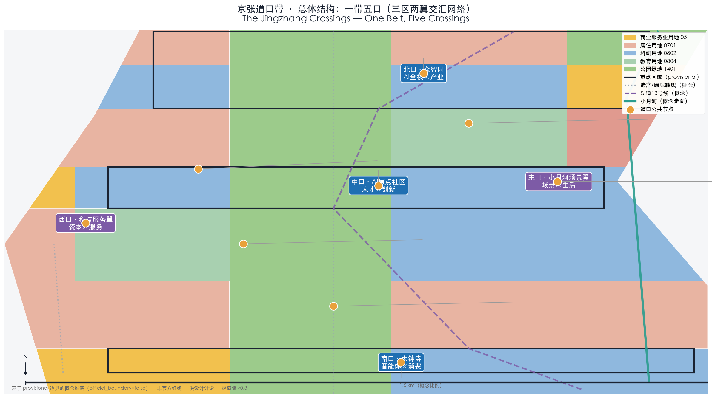
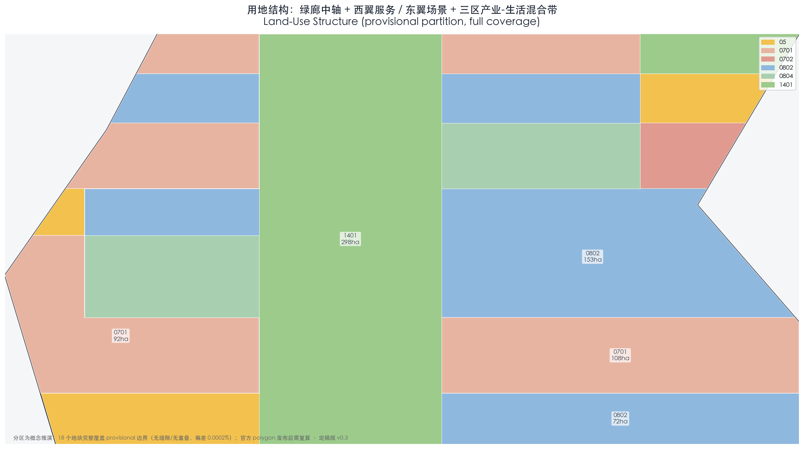
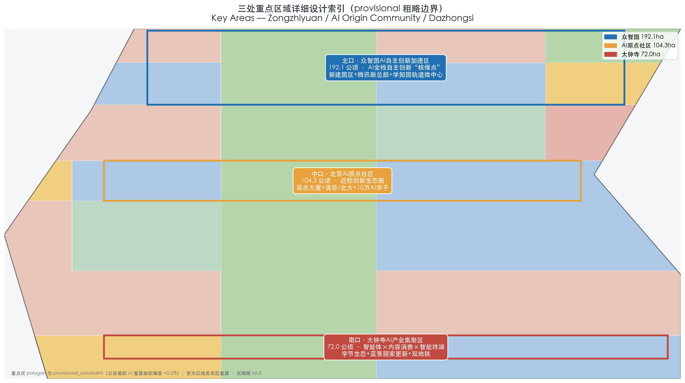
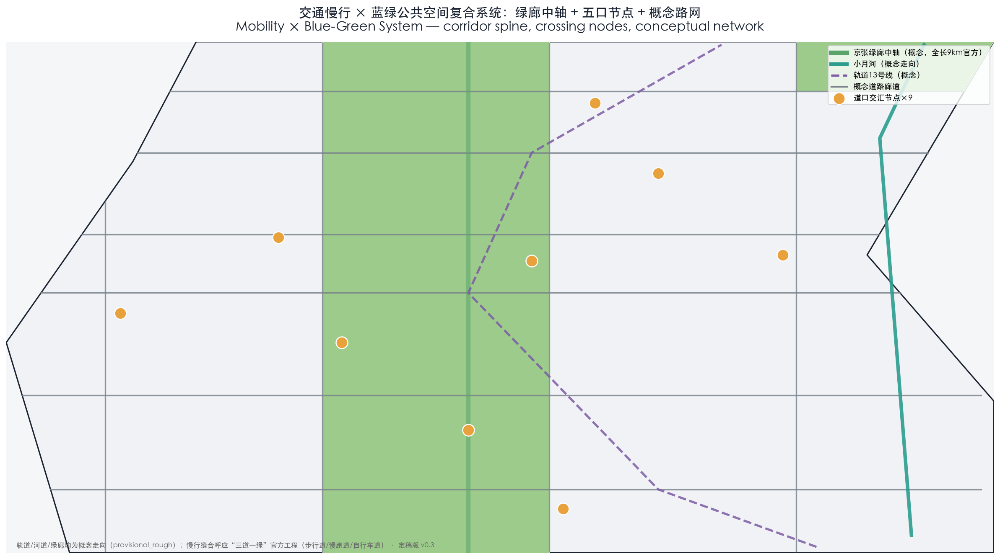
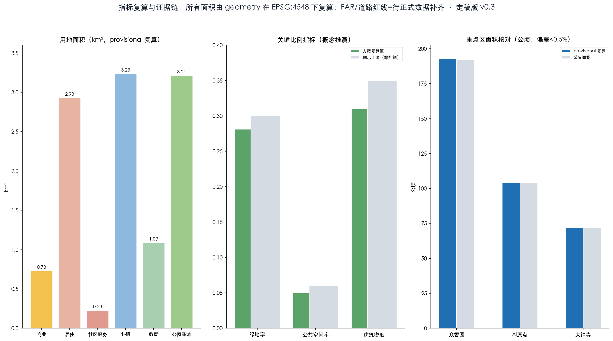

# 京张道口带：AI与城市百年平交实验场（The Jingzhang Crossings）

> **Proposal overview.** Construction of the Beijing-Zhangjiakou Railway (Jingzhang Railway) began in 1905 and was completed in 1909; it was the first state-owned trunk railway in China to be surveyed, designed, constructed, and managed by the Chinese themselves. In its urban section (Xizhimen—Qinghe), it crossed the city at grade through the "First to Fifth Crossings" — the Fifth Crossing being today's Wudaokou, known to Beijingers as the "center of the universe". The traffic signal was the city's earliest automated decision-making system — a "crossing" means rules, convergence, and order. This proposal argues that **AI is the new generation of "signal system", and the Centennial Jingzhang AI Innovation Belt is the grade crossing between AI and urban life — not avoidance, not separation, but regulated convergence**. On this basis it forms the overall structure of "One Belt, Five Crossings": the North Crossing · Zhongzhiyuan (full-stack AI × industry), the Central Crossing · AI Origin Community (talent × innovation), the South Crossing · Dazhongsi (agents × consumption), the West Crossing · Zhongguancun Technology Services Wing (capital × services), and the East Crossing · Xiaoyue River Scenario Enablement Wing (scenarios × daily life). Each crossing = one set of governance "signal rules" + one public convergence space + one group of perceptible AI scenarios. All spatial implementation suggestions are conceptual suggestions, reference schemes, or content open to deepening by professional teams; they do not replace formal planning and do not constitute government-approved conclusions. All geometry is based on provisional boundaries and must be recalculated once the official polygon is released.
> **Version & status.** This is the v0.3 final draft (2026-08-10), passing local deterministic validation, spatial review, visual packaging and professional evidence review (self_check PASS); the package is ready_for_review, and formal review is at the maintainers' and professional teams' discretion.

## Design Basis and Source List

**Design judgment.** This proposal uses a "four-tier evidence chain" to support its design conclusions. Tier 1 is the official open-call documents (the prequalification announcement and the agent-oriented task book), which constitute the statutory basis for boundaries, scope, and tasks; Tier 2 is public policy and official data, serving as background anchors for positioning and indicators; Tier 3 is the findings of dedicated research (Jingzhang history, Haidian's AI industry, global cases), serving as narrative and reference sources; Tier 4 is provisional geometric data, used only for directional expression and not as official planning boundaries or precise areas. [source:AGENT-TASKBOOK] [standard:PROJECT-AGENT-OPEN-CALL-TASKBOOK]

**Source list.** ① Official open-call documents: the Prequalification Announcement for the International Open Call for Urban Design of the Centennial Jingzhang AI Innovation Belt (published by the Beijing Municipal Commission of Planning and Natural Resources on 2026-05-09; hosted by the Municipal Development and Reform Commission, the Municipal Commission of Planning and Natural Resources, and the Haidian District Government; organized by the Zhongguancun Science City Administrative Committee), which specifies the three-tier scope (a Coordinated Research Area of approx. 43.6 km², an Overall Design Area of approx. 11.4 km², and a Key-Area Detailed Design Area of approx. 368.4 ha), the "Three Zones and Two Wings" structure, and the design tasks (source: https://ghzrzyw.beijing.gov.cn/zhengwuxinxi/tzgg/hd/202605/t20260509_4643047.html); the open-source submission channel opened on 2026-08-07 and closes on 2026-08-31 (source: Tencent News 2026-08-08, https://new.qq.com/rain/a/20260808V08RD800). ② Official policies and planning interpretations: the Commission's "Planning Interpretation: Jingzhang Railway Heritage Park, a Co-Creation Journey Responded to by All Sides" (2021-12-16); the "Action Plan for Building Beijing into an AI Innovation High Ground" (2026-01-05); the Haidian District AI industry support measures (2025-02-14), among others. ③ Dedicated research: four research reports — Jingzhang history and the heritage park, Haidian's AI industry and the "Three Zones and Two Wings", global AI innovation ecosystems, and comparable submissions and review preferences (stored in the research/ directory; they are the source of this document's factual data). ④ Provisional data: scope and node polygons in geometry/*.geojson (directional inferences; limitations described in the next section). ⑤ User-provided, rights-cleared material: none yet; rights-clearance notes are given in the risk section and in report/copyright_statement.md.

**Why this judgment.** The open-source call requires the proposal to be fully reviewable and traceable throughout (the call announcement states that the open-source channel keeps a full GitHub trail). Classifying data into three tiers — "formal citation / background reference / directional" — prevents mixing media phrasing with official phrasing. For example, for the western boundary of the Coordinated Research Area, the republished text of the announcement says "west to the Jing-Wan Railway" while media reports say Wanquanhe Road (sources: People's Daily Online Beijing Channel 2026-04-30; Guoxin Tendering Platform 2026-05-06). This proposal follows the phrasing of the Commission's announcement and flags the discrepancy as doubtful. [standard:MOHURD-URBAN-DESIGN-MEASURES] [metric:site_area_sqm]

**Corresponding layers / indicators / standards.** The complete index of sources, indicators, standards, and design depths is assembled by the mainline into sources.json, metrics.json, standard_matrix.json, and design_depth_matrix.json; the mapping between in-text citation markers and these indexes is provided in the cross-reference table at the end of this file, and the body text does not repeat the machine indexes. [depth:data_evidence]

**Data gaps.** ① The precise boundary drawings attached to the official prequalification documents (the statutory lines delimiting the four sides of the three-tier scope); ② the boundary lines of the three key areas (Zhongzhiyuan approx. 192.1 ha, AI Origin Community approx. 104.3 ha, Dazhongsi approx. 72.0 ha) have not been published (source: the prequalification announcement gives only total areas); ③ the regulatory detailed planning outputs for the blocks along the Jingzhang Railway Heritage Park (media report that technical review was completed in February 2026, but the output documents could not be located; source: reports on the Haidian District Government's 2025 plan implementation report); ④ base maps of existing buildings, property ownership, and municipal engineering conditions along the corridor; ⑤ the publishing platform and status of the "Haidian Skill" industrial-policy skill pack. All of the above are marked "pending official data" and are not used as a basis for design conclusions.

## Working Framework for the Three-Tier Scope

**Design judgment.** The three tiers correspond to three levels of working depth — "industrial strategy — overall urban design — detailed design of key areas" — with "One Belt, Five Crossings" as the cross-cutting spatial framework: the Coordinated Research Area addresses the positioning and ecology of the "belt", the Overall Design Area addresses the "stitching of belt and city", and the key areas address the concrete design of the "crossings". [source:AGENT-TASKBOOK] [depth:regional_structure]

**Coordinated Research Area (approx. 43.6 km²).** Bounded by the North Fifth Ring Road to the north, the Jingzang Expressway to the east, Xizhimen Outer Street to the south, and Wanquanhe Road to the west (per the announcement; source: the Commission's prequalification announcement 2026-05-09). Working objectives: establish the overall concept and naming, the three major positionings and five major functions, the Three Zones and Two Wings synergy loop, future AI city forms (AI + mobility, continuous green space, AI culture/society/city), and global benchmark research; outputs are expressed as conceptual structure diagrams, naming and logo directions, synergy diagrams, and an indicator framework, without plot-level conclusions. [data:geometry/site_boundary.geojson#SITE-001] [metric:site_area_sqm]

**Overall Design Area (approx. 11.4 km²).** This is the urban area within 1–2 km around the Jingzhang Heritage Park, bounded by the North Fifth Ring Road to the north, Xueyuan Road / Xitucheng Road to the east, Xizhimen Outer Street to the south, and Dazhongsi East Road / Heqing Road to the west. Working objectives: an overall urban renewal framework, functional layout and character tone, transport/rail transit and municipal services, a blue-green public space system, a renewal project list, and implementation policy recommendations — an urban design at the depth of regulatory detailed planning (corresponding to task 1.5(2) of the announcement). [depth:urban_design_guidelines]

**Key-Area Detailed Design (approx. 368.4 ha).** The Zhongzhiyuan AI Independent Innovation Acceleration Area covers approx. 192.1 ha (North Crossing · full-stack AI industry), the Beijing AI Origin Community approx. 104.3 ha (Central Crossing · talent and innovation), and the Dazhongsi AI Industry Cluster approx. 72.0 ha (South Crossing · agent consumption), totaling approx. 368.4 ha. This corresponds to the announcement's key-area detailed design task, at the depth of an Integrated Planning Implementation Plan. [data:geometry/key_areas.geojson#KEY-001] [metric:key_area_count]

**Why this judgment.** The announcement makes clear that the three tiers correspond to different task granularities (coordinated = industry and future-city research, overall = regulatory-planning depth, key areas = detailed-design depth), and that the "Three Zones and Two Wings" form a "coupled innovation network running north–south and linking east–west" (source: Beijing Municipal Science and Technology Commission website, republishing Beijing Daily 2026-04-03). This proposal uses "One Belt, Five Crossings" as the shared spatial grammar of the three tiers, keeping conceptual continuity across the scale jumps between tiers.

**Provisional boundary note.** The polygons for the research area, the overall design area, and the key areas in this proposal's geometry layers are inferred from the textual boundaries in the announcement and public maps; they are directional expressions and must not be used for official planning boundaries, precise areas, or any approval-related conclusions. Once the official drawings are published, all area-derived indicators — study_area_km2, key_areas_ha, green_ratio, etc. — must be recalculated against the official polygon, and figures such as site-overview.png and key-areas.png must be regenerated. The discrepancy between "Wanquanhe Road" and "Jing-Wan Railway" on the western boundary is a boundary point requiring official confirmation. [data:geometry/site_boundary.geojson#SITE-001] [metric:key_area_count]

**Data gaps.** Official vector boundaries of the three-tier scope; block-level regulatory planning unit boundaries and control requirements along the corridor; current ownership and building base maps of the key areas; rail-integration design materials for stations such as the Sidaokou Station of the Line 13 capacity expansion and upgrade project (supplementary recommendation from the research; source: the suggestion list at the end of the Jingzhang history research report).

## Coordinated Research Area: Industry and Future-City Research

**Design judgment 1: the three positionings.** ① Industrial positioning — a world-class AI innovation district: echoing the "Three Zones and Two Wings creating a world-class AI hub" and Haidian's role as the core of Beijing's "one core, multiple nodes" layout (sources: Municipal Science and Technology Commission website 2026-04-03; Xinhuanet 2026-01-21). Haidian's core AI output value exceeded RMB 350 billion in 2025, accounting for about 30% of the national total, with annual growth of 30% (source: Municipal Science and Technology Commission website, republishing The Beijing News 2026-03-30). ② Cultural–experimental positioning — "a century-long grade-crossing laboratory of AI and the city": the Beijing-Zhangjiakou Railway was started in 1905 and completed in 1909, the first state-owned trunk railway surveyed, designed, constructed, and managed by the Chinese themselves (source: School of Civil Engineering, Southwest Jiaotong University). Its urban section crossed the city at grade via the "First to Fifth Crossings", the Fifth Crossing being today's "center of the universe" Wudaokou (sources: Huxiu 2018-12-18; China Youth Daily 2017-01-11). On 2016-11-01, Crossings 4, 5, and 6 were all demolished, and the Beijing–Zhangjiakou High-Speed Railway went underground through a tunnel of about 6 km (sources: Zhihu column 2020-03-12; the Commission 2021-12-16). This proposal recasts the "crossing" as the spatial prototype of regulated convergence points in the AI era: the traffic signal was the city's earliest automated decision-making system, and AI is the new-generation signal system. ③ Open positioning — an open-source hub directly linked to the international innovation network: building on the open-source call mechanism and the Zhongzhiyuan AI go-global service platform (source: Haidian District Government 2026-03-30), and using the Beijing–Zhangjiakou High-Speed Railway (Qinghe Station to Taizicheng in as little as 50 minutes; Beijing–Zhangjiakou cut from 3.5 hours to under 1 hour; sources: gov.cn 2019-12-28; Xinhua Hebei 2025-02-18) to anchor Beijing–Tianjin–Hebei synergy ("Beijing–Tianjin–Hebei joint cultivation of a 100-billion-yuan embodied-intelligence industry cluster", source: the "Action Plan for Building Beijing into an AI Innovation High Ground" 2026-01-06). [standard:PROJECT-AGENT-OPEN-CALL-TASKBOOK]

**Design judgment 2: the five functions and "One Belt, Five Crossings".** The five functions are: full-stack independent AI innovation; campus-adjacent innovation and global talent agglomeration; agents and new-consumption business formats; technology services and capital; and scenario enablement and future living. They correspond to the five crossings: the North Crossing · Zhongzhiyuan (full-stack AI × industry; the park completed its construction filing in December 2025 and is one of Beijing's "3×100" key projects; source: Haidian Daily 2026-04-21); the Central Crossing · AI Origin Community (talent × innovation; over 330 resident enterprises, including about 230 AI companies; source: Municipal Science and Technology Commission website 2025-09-15); the South Crossing · Dazhongsi (agents × consumption; clustering agents, content consumption, smart terminals, and related business formats; source: Commission announcement 2026-05-09); the West Crossing · Zhongguancun Technology Services Wing (capital × services; built on the startup-IP and capital ecosystem, including opportunity sites such as the Innovation & Entrepreneurship Reception Hall; source: Beijing Daily client 2026-08-07); and the East Crossing · Xiaoyue River Scenario Enablement Wing (scenarios × daily life; developing along the Xiaoyue River a distinctive cluster for embodied intelligence, AI + healthcare, and AI + film & television; source: Municipal Science and Technology Commission website 2026-04-03). Synergy loop: the north–south through-line (origin — incubation — application) and the east–west linkage (capital services × scenario data) form a "coupled innovation network" (source: Municipal Science and Technology Commission website 2026-04-03), with the loop closed as "talent and research → full-stack industrialization → business-format deployment → services and capital → scenarios and data → data flowing back to feed innovation". [source:AGENT-TASKBOOK] [depth:industry_structure]

**Design judgment 3: the naming scheme "京张道口带 (The Jingzhang Crossings)".** The naming logic has four points: ① Locality — Wudaokou is the only place name in Beijing carrying "crossing" (道口) in the collective memory of the whole city, and the "First to Fifth Crossings" sequence is a spatial fact unique to the urban section of the Jingzhang Railway; ② Semantic double meaning — "crossing" refers both to the historical grade crossings and to the regulated convergence points of data, industry, talent, and scenarios in the AI era; ③ Traffic-signal metaphor — the traffic signal was the city's earliest automated decision-making system, AI is the new-generation signal system, and the crossing is the spatial carrier of this metaphor; ④ International communication — "Crossings" carries the multiple meanings of grade crossing, passage, and intersection, and is more extensible than a "Railway Park"-style name. Logo direction: taking "five lines converging / a grade-crossing signal" as the motif — the five lines represent the Three Zones and Two Wings (One Belt, Five Crossings), and the convergence point is the "crossing". The mark must be extensible (derivable into wayfinding, ground paving, under-viaduct spaces, and digital dynamic signage), carry signal semantics (order, rules, decision), remain recognizable in monochrome, and work with bilingual copy (京张道口带 / The Jingzhang Crossings). This direction is a conceptual suggestion; the official logo requires professional teams to develop the design and complete copyright clearance, and no final form is presupposed. [source:AGENT-TASKBOOK]

**Design judgment 4: global AI innovation ecosystem cases (8, readable summaries).**

1. **King's Cross, London (highest comparability)**: redevelopment of about 27 ha of former railway land; 50 new buildings plus restoration of 20 historic buildings; Central Saint Martins moved in in 2011 and Google bought land in 2013; a "knowledge quarter" formed within a one-mile radius (British Library, Alan Turing Institute, UCL, etc.); employment grew from about 8,000 to about 27,000 (2011–2019) (sources: Wikipedia; Centre for Cities 2022-10-11). Lesson for Jingzhang: the "three anchors" of railway heritage + high-speed-rail hub + knowledge institutions, and the sequencing of public space first, industry second.
2. **Stanford Research Park**: the world's first university research park (1951), about 280 ha; the university leases land long-term and curates tenants (HP established its headquarters there in 1956; Tesla became the largest tenant in 2025); 150+ enterprises and about 23,000 employees (sources: Stanford Research Park official website; Wikipedia). Lesson for Jingzhang: universities and research institutes as "anchor assets"; the corridor-style clustering logic is isomorphic with Jingzhang's linear corridor.
3. **South Lake Union, Seattle**: neighborhood-scale renewal after Amazon moved in in 2007; by end-2016 Amazon occupied 34 buildings totaling over 8.5 million sq ft; the government supported it first with street improvements and a streetcar (source: ULI 2017-05-12). Lesson for Jingzhang: anchor-company commitment plus public investment first is replicable, but multiple actors are needed to hedge against dependence on a single company.
4. **one-north, Singapore**: about 200 ha, led end-to-end by the government (JTC); themed precincts by industry (Biopolis/Fusionopolis/Mediapolis); over 50,000 knowledge workers; government agencies act as "first users" of R&D (sources: JTC official website; National Library Board Singapore). Lesson for Jingzhang: division of labor among themed precincts (foundation layer / application layer / data and security) and the government's first-user mechanism for scenarios.
5. **Digital Media City, Seoul**: about 57 ha, transformed from a landfill after ecological restoration; clusters 300+ digital media companies and over 22,000 employees (source: Seoul Metropolitan Government official website 2011-04-04). Lesson for Jingzhang: ecological restoration plus themed industry introduction is a reference; the vitality lessons of its single theme and peripheral location caution against pancake-style sprawling development.
6. **Nanshan Science Park, Shenzhen**: an urban high-tech zone approved in 1996 (planned 11.52 km²); with less than 0.6% of the city's area it creates about 11% of its GDP; Tencent, DJI, ZTE, and others cluster there (source: Southern Metropolis Daily 2021-12-12). Lesson for Jingzhang: "government sets the framework + enterprises grow organically", with a density logic of first strengthening the innovation core, then spilling over along corridors.
7. **Yunqi Town, Hangzhou**: planned at about 3.5 km², with Alibaba Cloud and Hangzhou's "City Brain" as twin engines and the Yunqi Conference as its brand gateway; in 2023 it clustered 3,035 ecosystem enterprises with a digital-economy output of RMB 67 billion (source: Hangzhou Daily 2023-07-13). Lesson for Jingzhang: platform enterprise + government scenario access + conference brand first, but beware dependence on a single giant.
8. **Sidewalk Labs, Toronto (cautionary case)**: a 12-acre pilot announced in 2017 and terminated in 2020; its "Civic Data Trust" proposal was rejected by the public and academia and criticized as "technology for technology's sake" (sources: Wikipedia; Goodman 2019, Fordham Law Review). Lesson for Jingzhang: data sovereignty, the ownership of public data assets, and privacy frameworks must be led and established by the government first; technology must not precede governance.

**Design judgment 5: synergy with the regional innovation system.** ① With the Zhongguancun AI Beiwei Community: located in the northern part of the Science City (120 enterprises signed by February 2026; source: Haidian District Government 2026-02-06); the media call it an important part of the "two zones, one belt", but no official formulation of direct synergy was found — it is suggested as a linkage anchor extending the innovation belt northward (conceptual suggestion). ② With the Future Science City, Huairou Science City, and the Beijing Economic-Technological Development Area (E-Town): all belong to Beijing's "Three Cities, One District" system and "one core, multiple nodes" layout (E-Town's "MoShu World" initiative focuses on embodied intelligence; source: Xinhuanet 2026-01-21); no direct linkage formulation between the innovation belt and these three was found — it is suggested that functional complementarity and differentiated synergy be formed within the "Three Cities, One District" framework (conceptual suggestion). ③ With Beijing–Tianjin–Hebei: the Beijing–Zhangjiakou High-Speed Railway provides a historical and transport bond; the action plan proposes "joint cultivation of a 100-billion-yuan embodied-intelligence industry cluster across Beijing–Tianjin–Hebei"; the collaborative innovation index grows at an average annual rate of 13.1% (source: Beijing Daily client 2026-01-10) — it is suggested that the Jingzhang corridor serve as the spatial backbone of Beijing–Tianjin–Hebei AI synergy and a model of open-source collaboration (conceptual suggestion). All of the above synergies are directions for deepening and must be verified against official documents before being upgraded to formal status.

**Corresponding layers / indicators / standards.** The three positionings and five functions will be located in the land_use_structure layer (the One Belt, Five Crossings structure) and the scenario_nodes layer (AI scenario nodes), with the naming and logo direction as a visual motif running through all three tiers; indicators correspond to innovation_index, ai_enterprise_density, and talent_density (Haidian has 135 AI2000 top global scholars and 31 AI100 young pioneers; source: Haidian District Government website 2026-03-30), among others; standards cover the naming/logo and ecosystem-case tasks in the agent-oriented task book. [data:geometry/site_boundary.geojson#SITE-001] [metric:key_area_count]

**Data gaps.** ① The official boundary lines of the two wings (west and east) have not been published; ② no official synergy formulations were found between the Beiwei Community and the innovation belt, or between the innovation belt and the Future Science City / Huairou Science City / E-Town (to be verified); ③ the demolition date of the Wudaokou crossing (two versions coexist: 2016-10-31 and 2016-11-01) and the phrasing of Phase 2's "restoration of 2.4 km of original 1909-era rails" (and its relationship to Phase 1's 2.4 km green corridor) await official verification; ④ no official list was found of the current enterprise premises in the Dazhongsi and Zhongzhiyuan areas; ⑤ the final logo design and copyright clearance await professional teams.

---

> **Citation-code cross-reference (for the mainline to assemble sources.json; not part of the body text)**: `[source:AGENT-TASKBOOK]` → the agent-oriented task book; `[source:SITE-PACKAGE]` → the open-call announcement and site package; `[standard:PROJECT-AGENT-OPEN-CALL-TASKBOOK]` → the open-source call task book standard; `[standard:MOHURD-URBAN-DESIGN-MEASURES]` → general urban design control standards; `[depth:…]` → design depth matrix items; `[data:geometry/site_boundary.geojson#SITE-001]`, `[data:geometry/key_areas.geojson#KEY-001]` → geometric layer features; `[metric:…]` → indicators.

## Overall Design Area: Urban Renewal and Regulatory-Detailed-Planning-Depth Urban Design

**Design judgment.** The Overall Design Area (approx. 11.4 km², the urban area within 1–2 km around the Jingzhang Heritage Park) is the layer where this proposal transitions from industrial strategy to spatial structure, using the "One Belt, Five Crossings" of the "Jingzhang Crossings" as the skeleton for the functional layout: the North Crossing Zhongzhiyuan carries "full-stack AI × industry" (the marshalling-yard imagery), the Central Crossing AI Origin Community carries "talent × innovation" (the transfer-station imagery), and the South Crossing Dazhongsi carries "agents × consumption" (the station-city integration imagery); the east and west wings (Zhongguancun Technology Services Wing, Xiaoyue River Scenario Enablement Wing) and the four sub-lines — barrier-free and age-friendly design, Beijing Film Academy arts and performance, youth nighttime vitality, and data-element circulation — are woven into the renewal framework as functional supplements [source:OPEN-CALL-NOTICE] [source:RESEARCH-02-HAIDIAN-AI-INDUSTRY] [depth:land_use_layout]. Basis: the official "Three Zones and Two Wings" formulation emphasizes a "coupled innovation network running north–south and linking east–west", with which this layer's spatial organization is consistent; the three zones differ markedly in existing endowments (newly built park, existing innovation district, platform-enterprise cluster), so functional division of labor is preferable to homogeneous competition [source:RESEARCH-02-HAIDIAN-AI-INDUSTRY].

**Industrial objectives.** The directional judgment is "one chain vertically, two wings horizontally" — vertically, the north forms a progressive chain through full-stack independent AI innovation and go-global services, the middle through university knowledge transfer and startup incubation, and the south through agents / content consumption / smart terminals and data-element circulation; horizontally, the west wing forms an enabling loop through startup IP and the capital ecosystem, and the east wing through embodied-intelligence and other scenario applications [source:RESEARCH-02-HAIDIAN-AI-INDUSTRY]. Quantitative targets (output value, enterprise counts, talent density) must be based on official statistical definitions and regulatory-planning-stage data; this draft sets no approved values. The relevant indicators are included in the innovation indicator system framework and marked "pending official data" [metric:key_area_count].

**Functional layout.** Within the 11.4 km², the layout is "one belt stringing three crossings" — along the Jingzhang Heritage Park vitality belt (9 km green corridor), from north to south: the North Crossing park-district block (the newly built Zhongzhiyuan park + the Tencent Beijing new headquarters under construction to the west + the Xuezhiyuan rail transit micro-center), the Central Crossing neighborhood block (the campus-adjacent innovation ecosystem centered on the Origin Building + Wudaokou Station + the Qinghuayuan Station heritage site), and the South Crossing hub block (Dazhongsi's dual stations and four quadrants + Juesheng Temple + ByteDance-system platform premises), with the Sidaokou Cultural Core embedded as a catalyst in the southern segment [source:RESEARCH-01-JINGZHANG-HISTORY] [source:RESEARCH-02-HAIDIAN-AI-INDUSTRY] [depth:land_use_layout]. Functional-ratio direction: along the belt, public space and innovation services dominate; around stations, functional mixing is the direction. All land-use ratios must be based on an existing-land-use survey and regulatory detailed planning; this draft only gives directional judgments, with figures "pending official data".

**Innovation indicator system.** This layer establishes a four-category indicator framework — talent density (AI professionals, share of AI enterprises; disclosed figures such as the Origin Community's 100,000 AI students and about 230 AI companies may be referenced), industrial vitality (AI enterprise density; the innovation belt's sci-tech enterprise density already exceeds 800/km²), spatial performance (industrial-space supply, number of renewal projects, walking-and-cycling connectivity rate, green ratio), and AI scenarios (number of scenario nodes, open testing mileage) [source:RESEARCH-01-JINGZHANG-HISTORY] [source:RESEARCH-02-HAIDIAN-AI-INDUSTRY] [metric:green_ratio]. Design implication: indicators are not review decoration — talent density supports the logic of allocating innovation-interaction space, the green and public space ratios support talent's quality of life, and industrial-space supply responds to enterprises' full-lifecycle needs. Values must be recalculated from geometry by metrics.json or provided by official statistical definitions; at this draft stage only the framework is set, "pending official data".

**Overall urban renewal framework.** Judged as "one vitality belt + three types of renewal targets + four sub-lines". The three types of renewal targets are: industrial-premises renewal (functional replacement of commercial buildings, opening up of parks), residential community renewal (age-friendly and barrier-free retrofitting, youth vitality communities), and station-city node renewal (rail transit micro-center integration). The framework draws on the heritage park's site-wide renewal strategy of "integrate, demolish, retreat, supplement" and its "City Partners" collaborative mechanism [source:RESEARCH-01-JINGZHANG-HISTORY] [depth:urban_renewal_framework]. It must be noted that existing buildings, ownership, and engineering conditions have not been systematically verified; any classification conclusions for demolition/renovation/retention must await an existing-conditions survey and regulatory planning confirmation. This draft gives no conclusions and sets no demolition/renovation scale; everything is uniformly marked "pending official data".

**Renewal project list direction.** This draft only gives typed list directions and does not constitute an approved project list — ① Station-city integration: around the three rail stations of Xuezhiyuan, Wudaokou, and Dazhongsi (including pedestrian connectivity across the four quadrants of the Dazhongsi Station intersection, a task named in the announcement); ② Park opening: interface stitching between Zhongzhiyuan and the Tencent headquarters, and functional mixing of existing buildings such as Yuanlichang (part of the renovation of Yuanlichang's 17 buildings is complete — an established fact); ③ Public space: the iconic landscape nodes at the heritage park's south and north walls (named in the announcement), the Qinghe/Xiaoyue River waterfront spaces, and the connection of Dongsheng Bajia Country Park; ④ Cultural display: the exhibition and reuse of the Qinghuayuan Station heritage site (already open — an established fact) and the Sidaokou 1909 Rail Cultural Core (built in Phase 2 — an established fact) [source:OPEN-CALL-NOTICE] [source:RESEARCH-01-JINGZHANG-HISTORY] [source:RESEARCH-02-HAIDIAN-AI-INDUSTRY]. The location, scale, implementing entity, and dependency conditions of each project must be entered in the phasing layer and updated as regulatory planning conditions evolve [data:geometry/phasing.geojson#P1-1].

**Implementation policy direction.** Three policy-interface directions "open to deepening by professional teams" are proposed — ① Aligning with the municipal policy of elastically reserved building-scale quotas (citywide total of 10 million m²; the Lanjinglijia project is already the city's first urban renewal project approved for municipal quota support — an established fact); ② advancing renewal projects through the technical-review mechanism for block-level regulatory detailed planning along the corridor (the corridor's block regulatory plans have completed technical review — a disclosed progress); ③ continuing the heritage park's "programming + planning" practice and the "Jingzhang chief-designer system" of responsible planners and responsible engineers [source:RESEARCH-01-JINGZHANG-HISTORY] [source:RESEARCH-02-HAIDIAN-AI-INDUSTRY]. All of the above are directional suggestions; they do not constitute final policy and must not be read as an approval judgment of any project.

**Overall building-scale direction.** Judged as "existing-stock optimization first, incremental addition with prudence". Citable disclosed facts: Zhongzhiyuan's total floor area of about 238,300 m² (construction filing completed in December 2025); the Tencent Beijing new headquarters of about 460,000 m² (under construction); and the Lanjinglijia renewal project's new building scale of over 13,000 m² [source:RESEARCH-02-HAIDIAN-AI-INDUSTRY]. The overall design area's totals, zone-level scales, and demolition/renovation/retention scales are all "pending official data"; this draft gives no floor area ratio, building height, or any engineering-feasibility conclusions [standard:MOHURD-URBAN-DESIGN-MEASURES].

**Transport and rail transit.** Fact base — Metro Line 13 runs parallel to the heritage park for its full length from Beijing North Station to Qinghe, changing its vertical relationship with the park multiple times; Dazhongsi Station on Line 12 opened on 2024-12-15; Xuezhiyuan Station on the Changping Line is among Beijing's first batch of rail transit micro-center projects (Exit A is connected underground in an integrated manner with the park and the Tencent parcel); the Line 13 capacity expansion and upgrade project adds a new Sidaokou Station [source:RESEARCH-01-JINGZHANG-HISTORY] [source:RESEARCH-02-HAIDIAN-AI-INDUSTRY] [depth:mobility]. Design direction: integration of the rail stations in the three key areas, east–west connectivity through the "three paths + one greenway" walking and cycling network, and a list of walking-and-cycling network gaps with site-by-site bridging solutions (Phase 1 already added 7.2 km of cycling paths, jogging paths, and walking paths — an established fact). Road red lines, alignments, and engineering schemes are all "pending official data"; no engineering conclusions are given [metric:road_centerline_length_m].

**Municipal services.** The directional judgment is the integration of new infrastructure with traditional municipal services — edge computing, smart light poles, distributed energy, and AI-enabled operation-and-maintenance monitoring are treated as "conceptual suggestion" directions, considered together with traditional municipal facilities such as water supply and drainage, power, and gas. Current municipal capacities, pipeline-laying conditions, and load forecasts must follow municipal special-planning data, "pending official data" [depth:municipal].

**Jingzhang Heritage Park vitality belt.** The vitality belt is the public backbone of "One Belt, Five Crossings" and the carrier axis of AI scenarios. Fact base: a 9 km cultural strip greenway with a total land area of about 53 ha; Phase 2 opened along its full length on 2026-08-06, serving 70 communities and 450,000 residents along the corridor. The southern "community vitality segment" includes the Sidaokou Cultural Core (restoration of the original 1909 rails) and the "Third Ring Gateway" urban balcony; the northern "nature and leisure segment" includes the "Jingzhang Loop" 1909 Theme Plaza and incorporates Dongsheng Bajia Country Park; the full line offers seamless "three paths + one greenway" walking and cycling [source:RESEARCH-01-JINGZHANG-HISTORY]. Design direction (conceptual suggestion): iconic urban landscape nodes at the south wall (Xizhimen–North Third Ring) and the north wall (Qinghua East Road–North Fifth Ring), responding to the announcement's tasks; Sidaokou and the Jingzhang Loop are existing cultural nodes; at the North Crossing, a "Full-Stack Assembly Line Observation Deck" conceptual landmark is proposed in connection with Zhongzhiyuan (conceptual suggestion, not an approved construction) [source:OPEN-CALL-NOTICE].

**Urban character.** Judged as "three-line fusion" — the overlapping characters of Jingzhang Railway culture (rails, crossings, station buildings), Zhongguancun innovation culture, and AI innovation culture, responding to the announcement's requirements on Qinghuayuan Station, the Beijing Film Academy's art resources, and the Qinghe and Xiaoyue River blue-green spaces [source:OPEN-CALL-NOTICE]. Direction: character-control zones along the belt divided into industrial-heritage segments, innovation-district segments, and gateway-landscape segments (conceptual suggestion); the BFA arts & performance and youth nighttime vitality sub-lines are organized in combination with the southern neighborhood blocks; for heritage-control matters, construction around the Qinghuayuan Station heritage site (protection scope and construction control belt published in February 2026), Juesheng Temple, and the ruins of the Yuan Dadu city wall (a national key cultural relic) must comply with cultural-relic protection requirements; specific control values are "pending official data", and this draft gives no conclusions on heights, setback distances, etc. [source:RESEARCH-01-JINGZHANG-HISTORY]

**Regulatory-planning depth and data gaps.** The target depth of this layer is urban design at the regulatory detailed planning level, but the formal regulatory conditions (land-use categories, floor area ratios, building heights, road red lines, municipal capacities, heritage-control values) are not included in this draft's data package; all are "pending official data" and must not be disguised as approved indicators [standard:MOHURD-URBAN-DESIGN-MEASURES] [depth:urban_renewal_framework]. Corresponding layers: the geometry layers — overall design area boundary, land-use layout, transport and walking/cycling, phased implementation — and metrics.json are generated by the mainline; after replacement with the official polygon, all areas and derived indicators must be recalculated. The boundaries cited in this draft are provisional coarse boundaries based on public reports, used for directional research only.

## Key-Area Detailed Design

The three key areas are the North, Central, and South Crossings of "One Belt, Five Crossings", totaling about 368.4 ha (official figures: Zhongzhiyuan approx. 192.1 ha, AI Origin Community approx. 104.3 ha, Dazhongsi approx. 72.0 ha) [source:OPEN-CALL-NOTICE]. **Boundary statement**: The boundaries of the three areas cited in this draft are the provisional coarse boundaries in geometry/key_areas.geojson (generated from publicly reported scope descriptions and area estimates); they are for directional design only and must not be used for official planning boundary delineation or precise area accounting. Once the official polygon is released, all areas, densities, and derived indicators must be recalculated [data:geometry/key_areas.geojson#KEY-001] [data:geometry/key_areas.geojson#KEY-002] [data:geometry/key_areas.geojson#KEY-003]. The three areas differentiate their roles: the North Crossing "marshals", the Central Crossing "transfers", and the South Crossing "integrates station and city", avoiding homogenization [standard:PROJECT-AGENT-OPEN-CALL-TASKBOOK].

### Zhongzhiyuan AI Independent Innovation Acceleration Area (approx. 192.1 ha)

**Positioning.** North Crossing · full-stack AI × industry, with marshalling-yard imagery — multiple "innovation trains" (university outputs, capital, go-global demand) enter here to be marshalled and re-formed into new departures, echoing the official positioning of an "AI full-stack independent innovation epicenter" [source:RESEARCH-02-HAIDIAN-AI-INDUSTRY] [data:geometry/key_areas.geojson#KEY-001].

**Spatial structure** (conceptual suggestion). The core is formed by the Zhongzhiyuan park (total land area approx. 35,000 m², total floor area approx. 238,300 m², five research office buildings; construction filing completed in December 2025, park ready to open from July 2026, full opening by end of 2026 — established facts) and the Tencent Beijing new headquarters to its west (total floor area approx. 460,000 m², under construction), constituting the dual anchors of the "marshalling station"; the Xuezhiyuan rail transit micro-center is the "throat"; the Shangqing Bridge on the North Fifth Ring and the Jingzang Expressway to the east are the "departure signal" and gateway interface [source:RESEARCH-02-HAIDIAN-AI-INDUSTRY].

**Building renewal direction.** The park itself is newly built (three-star green building standard), so the direction is not demolition/renovation but open interfaces and composite functions — 18,500 m² of commercial facilities, two multifunctional exhibition halls of 1,000/1,200 m², a 3,500 m² AI go-global service platform, and the move-in of the National Natural Science Foundation of China are all disclosed facts [source:RESEARCH-02-HAIDIAN-AI-INDUSTRY]. The linkage between the park and surrounding existing premises (e.g., Jinyu Science and Technology Park) is only reported by the media and not confirmed by official planning documents; demolition/renovation/retention judgments are "pending official data".

**Transport and walking/cycling.** Building on the Xuezhiyuan Station rail transit micro-center of the Changping Line (Exit A connected underground in an integrated manner with the park and the Tencent parcel — a disclosed fact), the conceptual suggestion direction includes station-city integrated walking/cycling corridors, a North Fifth Ring crossing, and stitching of the interface west of the Jingzang Expressway; road red lines and crossing-facility schemes are "pending official data" [source:RESEARCH-02-HAIDIAN-AI-INDUSTRY] [depth:mobility].

**Public space.** The conceptual suggestion direction includes the Yuequan Road interface, the Xiaoyue River waterfront to the south (under construction), and the linkage of Dongsheng Bajia Country Park and the Qinghe Ancient City Ruins Park via corridors / streets / waterfront connections (a disclosed intention, taken as a deepening direction); a public exhibition interface organized through the park's podium exhibition halls is suggested (conceptual suggestion).

**AI scenarios.** The AI full-stack go-global service platform (completed and operational in 2026 — a fact); the "Full-Stack Assembly Line Observation Deck" conceptual landmark (conceptual suggestion, not an approved construction); AI + embodied-intelligence testing scenarios linked with the Xiaoyue River Scenario Enablement Wing to the east; AI + age-friendly and barrier-free pilots possible in the park's public spaces (conceptual suggestion).

**Implementation risks.** ① Uncertainty during the new park's leasing and operations ramp-up; ② the sequencing between Tencent headquarters construction and the park's interface coordination; ③ the conflict between noise from the North Fifth Ring and Jingzang Expressway and the gateway image; ④ the implementation timeline of the Xuezhiyuan station integration works; ⑤ the existing land composition, ownership, and building inventory within the approx. 192.1 ha have not been verified — "pending official data".

### Beijing AI Origin Community (approx. 104.3 ha)

**Positioning.** Central Crossing · talent × innovation, with transfer-station imagery — talent "transfers" among academia, industry, and capital, echoing the official directions of "the first stop for global AI talent to innovate and start businesses" and the "one-kilometer campus-adjacent innovation ecosystem" [source:RESEARCH-02-HAIDIAN-AI-INDUSTRY] [data:geometry/key_areas.geojson#KEY-002].

**Spatial structure** (conceptual suggestion). With the Origin Building (formerly the Dongsheng Building; renamed on 2026-03-23 — a fact) as the hub, the core area is bounded by Shuangqing Road to the north, Chengfu Road to the south, Heqing Road to the east, and Zhongguancun East Road to the west (approx. 160,000 m²), radiating a campus-adjacent circle of about 3 km². Chengfu Road is the site of the Jingzhang Railway's Fifth Crossing; its historical "signal/crossing" imagery is transformed into the spatial narrative of a "transfer platform" [source:RESEARCH-02-HAIDIAN-AI-INDUSTRY] [source:RESEARCH-01-JINGZHANG-HISTORY].

**Building renewal direction.** Existing-stock renewal as the main approach. Fact base: part of the Yuanlichang renovation is complete (17 buildings, nearly 100 food-and-beverage businesses); over 330 resident enterprises, including about 230 AI companies; representative enterprises include Zhipu AI, Baichuan Intelligence, ModelBest, Shengshu Technology, and Xingdong Jiyuan; more than 70% of enterprise founding teams have Tsinghua or Peking University backgrounds [source:RESEARCH-02-HAIDIAN-AI-INDUSTRY]. Conceptual suggestion direction: an innovation interface along Chengfu Road, encouraging functional mixing in buildings and open ground floors; demolition/renovation/retention classification and renovation scales must await an existing-conditions survey and ownership verification — "pending official data".

**Transport and walking/cycling.** Building on Wudaokou Station on Line 13 and the Phase 1 Wudaokou segment of the heritage park (the 2019 start-up area of about 800 m and 1.7 ha — an established fact); the conceptual suggestion direction is a "station–park–street" walking/cycling loop and a memory node at the Chengfu Road crossing; the specific list of network gaps and bridging solutions await existing-conditions data [source:RESEARCH-01-JINGZHANG-HISTORY] [depth:mobility].

**Public space.** The "Gate of Certain Victory" art installation at Yuanxin Plaza (a fact) and the heritage park's green corridor are the existing public-space anchors; the conceptual suggestion direction organizes the "transfer" experience (choosing a direction, waiting, departing) into a public-space narrative, embedding barrier-free and age-friendly design (sub-line).

**AI scenarios.** The large-model ecosystem service station and the "5+5" policy (RMB 50,000 rent subsidy + RMB 50,000 compute subsidy), and the "Ignition Program" youth entrepreneurship services (facts); the "AI Origin Sanctuary" conceptual landmark — a pilgrimage node organized around the historical narrative of the Qinghuayuan Station heritage site (a municipal heritage protection unit + a revolutionary cultural relic; the first stop of the 1949 "examination journey" into Beijing; restored and opened to the public) (conceptual suggestion, not an approved construction) [source:RESEARCH-01-JINGZHANG-HISTORY] [source:RESEARCH-02-HAIDIAN-AI-INDUSTRY]; AI + education (the Tsinghua School of Artificial Intelligence moved in in October 2024, led by Andrew Chi-Chih Yao — a fact) and AI + cultural guide scenarios (conceptual suggestion).

**Implementation risks.** ① Multi-actor coordination and renewal sequencing in a high-density built area; ② constraints on surrounding construction from the Qinghuayuan Station heritage site's protection scope and construction control belt (published in February 2026), with specific control values pending official data; ③ the boundary relationship between the approx. 104.3 ha key area and the 3 km² radiation circle awaits official geometry confirmation; ④ the jobs–housing balance for about 100,000 AI students involves housing and public-service policies beyond the scope this proposal can determine — noted only as a directional reminder [source:RESEARCH-02-HAIDIAN-AI-INDUSTRY].

### Dazhongsi AI Industry Cluster (approx. 72.0 ha)

**Positioning.** South Crossing · agents × consumption, with station-city integration imagery — the agent industry and urban consumption converge at the dual-station hub; echoing the official positioning of "agents, content consumption, smart terminals" and the task of exploring circulation mechanisms for data elements and digital assets [source:RESEARCH-02-HAIDIAN-AI-INDUSTRY] [data:geometry/key_areas.geojson#KEY-003].

**Spatial structure** (conceptual suggestion). Dazhongsi Station on Metro Lines 13 and 12 (Line 12 opened on 2024-12-15 — a fact) forms the "station-city integration" dual anchor; Juesheng Temple (Dazhongsi Ancient Bell Museum, municipal heritage protection unit) is the cultural anchor; ByteDance-system platform premises — Zhongkun Plaza (acquired for about RMB 9 billion in 2019, with a building scale of about 400,000 m²), Fangheng Fashion Center (acquired for about RMB 5 billion in 2020), and the Lanjinglijia renewal project (two commercial parcels won for RMB 2.8 billion in February 2026, with land of about 39,500 m² and planned above-ground floor area of about 96,800 m² — a fact) — form the industrial anchor [source:RESEARCH-02-HAIDIAN-AI-INDUSTRY].

**Building renewal direction.** The Lanjinglijia urban renewal project (closed on 2025-04-30; adopting a demolish-and-rebuild model to become an international exchange center; new building scale over 13,000 m²; expected to leverage about RMB 4.88 billion in social investment; on 2026-08-03 it became the city's first urban renewal project approved for municipal quota support) is an established fact and can serve as a demonstration reference for renewal in this area [source:RESEARCH-02-HAIDIAN-AI-INDUSTRY]. Conceptual suggestion direction: optimize the rail Dazhongsi Station integration scheme and the pedestrian connectivity across the four quadrants of the intersection (a task named in the announcement), and promote functional complementarity among the platform premises; demolition/renovation/retention judgments for the remaining parcels must await existing buildings, ownership, and regulatory planning conditions — "pending official data" [source:OPEN-CALL-NOTICE].

**Transport and walking/cycling.** Building on the dual stations of Lines 13/12 and North Third Ring West Road; the conceptual suggestion direction is integrated station-hall–retail–park circulation, barrier-free pedestrian connectivity across the four quadrants, and connection to the walking/cycling access of the new Sidaokou Station (Xueyuan South Road) of the Line 13 capacity expansion project; road red lines and engineering schemes are not given [source:RESEARCH-01-JINGZHANG-HISTORY] [depth:mobility].

**Public space.** The southern segment of Heritage Park Phase 2 (the "Third Ring Gateway" urban balcony, the Sidaokou Cultural Core's 1909 rail restoration, and the activation of the rail-welding plant's gantry crane — established facts) is the public-space backbone; the conceptual suggestion direction organizes a "soundscape" public-space narrative around Juesheng Temple's bell culture, and develops arts & performance and youth nighttime vitality drawing on the Beijing Film Academy's art resources (sub-lines: BFA arts & performance; youth nighttime vitality).

**AI scenarios.** Agents × consumption (robot delivery, AI guides, smart-terminal experiences — conceptual suggestions); pilot scenarios for data-element and digital-asset circulation (a direction named in the task); AI + cultural guide (the Yongle Great Bell and the ancient bell collection); AI + performing arts (linked with BFA art resources — conceptual suggestion) [source:RESEARCH-02-HAIDIAN-AI-INDUSTRY].

**Implementation risks.** ① The relationship between Juesheng Temple's municipal-heritage construction control belt and station-city development, with control values pending official data; ② the subsequent uses and construction schemes of the two parcels sold in the February 2026 land auction have not yet been published by the authorities (to be verified); ③ coordination between the dual-station transfer organization and the implementation timeline of the Line 13 capacity expansion works; ④ ownership within the approx. 72 ha is diverse (Zhongkun, Fangheng, Lanjinglijia, etc.), making renewal coordination complex; ⑤ this area uses provisional boundaries; areas and indicators must be recalculated against the official polygon [source:RESEARCH-02-HAIDIAN-AI-INDUSTRY].

## AI Innovation Ecosystem, Talent Profiles, and AI-Enabled Scenarios

### I. AI Innovation Ecosystem Map: Full-Stack Chain × Five-Crossing Placement

**Design judgment.** The innovation belt should build a full-chain AI ecosystem of "compute and foundation layer — model layer — application layer — service layer" with a gradient of large, medium, and small enterprises coexisting, and use the "five crossings" as spatial handles to organize the ecosystem loop — the North Crossing · Zhongzhiyuan carries full-stack independent innovation and go-global services; the Central Crossing · AI Origin Community carries talent and entrepreneurship; the South Crossing · Dazhongsi carries the agent and consumption ecosystem; the West Crossing · Zhongguancun Technology Services Wing carries capital and technology services; the East Crossing · Xiaoyue River carries scenario testing and everyday-life applications [source:RESEARCH-02-HAIDIAN-AI-INDUSTRY] [data:geometry/key_areas.geojson#KEY-001].

**Why.** Haidian has already gathered over 2,000 AI enterprises, 26 unicorns, and 130 registered large models, and is home to 135 AI2000 top global scholars (34% of the national total). The innovation belt accounts for more than 70% of Haidian District's enterprises, revenue scale, and financing volume, over 80% of its talent, nearly 10 million m² of industrial space, and about 1 million m² of usable renewal area [source:RESEARCH-02-HAIDIAN-AI-INDUSTRY]. Such density means the ecosystem should be organized primarily by "linking existing stock" rather than "building new parks": the mechanisms of King's Cross ("knowledge-institution anchoring + public space first") and Yunqi Town ("leading platform + government scenario access") can serve as references, while multiple actors and the open-source community hedge against dependence on a single giant [source:RESEARCH-03-GLOBAL-CASES]. The corresponding layers are the industrial functional layout (land_use.geojson) and the key areas (key_areas.geojson), with indicators of industrial-space supply and building footprint scale [depth:land_use_layout] [metric:building_footprint_area_sqm].

### II. Seven User Profiles (Talent—Enterprise—Resident—Public Governance)

**1. Young entrepreneurs**: benefit from existing services such as the "Ignition Program", the "5+5" policy (RMB 50,000 rent subsidy + RMB 50,000 compute subsidy), the 5-yuan breakfast that has not risen in price for 12 years, model vouchers, and the one-person company (OPC) [source:RESEARCH-02-HAIDIAN-AI-INDUSTRY]; their core needs are low-cost experimentation, access to compute and data, and connections to mentors and capital. Spatial response: incubation spaces in the Central Crossing · Origin Community, small-and-micro-enterprise and incubator buildings at the North Crossing · Zhongzhiyuan, and the capital services front desk at the West Crossing [data:geometry/key_areas.geojson#KEY-002].

**2. AI developers**: surrounded by more than 30 universities and research institutions and 100,000 students in AI-related majors around the innovation belt [source:RESEARCH-02-HAIDIAN-AI-INDUSTRY]; their core needs are open-source communities, real-scenario datasets, model evaluation, and go-global channels. Spatial response: the large-model ecosystem service station at the Central Crossing, the 3,500 m² AI go-global service platform at the North Crossing (completed and operational in 2026), and space reserved at the Jingzhang Loop 1909 Plaza for a youth sci-tech innovation market [source:RESEARCH-02-HAIDIAN-AI-INDUSTRY].

**3. Senior residents**: the heritage park directly serves 70 communities and 450,000 residents along its full length, and Phase 2 is positioned as "all-age friendly" [source:RESEARCH-01-JINGZHANG-HISTORY]; their core needs are health care, anti-wandering support, and bridging the digital divide. Spatial response: the AI + elderly-care scenario (SC-03) in the southern community vitality segment, rest spaces for seniors, and convenience service stations.

**4. University students**: surrounded by over ten universities including Tsinghua, Peking University, Beijing Language and Culture University, and Beijing Forestry University [source:RESEARCH-02-HAIDIAN-AI-INDUSTRY]; their core needs are practical training, competitions, entrepreneurship, and affordable living. Spatial response: the "campus-adjacent innovation ecosystem" at the Central Crossing, the AI + education scenario (SC-08), and university collaboration along Xueyuan Road.

**5. Global visitors**: the Beijing–Zhangjiakou High-Speed Railway connects Qinghe and Taizicheng in as little as 50 minutes, putting Beijing–Zhangjiakou within a one-hour circle [source:RESEARCH-01-JINGZHANG-HISTORY]; their core needs are multilingual guides, accessible experiences, and the "centennial Jingzhang + intelligent high-speed rail" narrative. Spatial response: the AI cultural guide at the Qinghuayuan Station heritage site (SC-10), the "center of the universe" photo-check-in node at Wudaokou, and full-line walking/cycling experiences along the heritage park.

**6. People with disabilities**: core needs are accessible mobility, accessible information, and one-touch help. Spatial response: full-belt barrier-free connectivity along the "three paths + one greenway", with the AI + accessible mobility scenario (SC-02) piloted first as a testing and validation scenario.

**7. Owners of small and micro enterprises**: the main carriers of AI-native and AI-integrated business formats such as agents, smart terminals, and content consumption [source:RESEARCH-02-HAIDIAN-AI-INDUSTRY]; their core needs are compliance services, access to data elements, and policy delivery. Spatial response: the South Crossing · Dazhongsi cluster, the enterprise-service copilot, and the data-element circulation sandbox (SC-06).

### III. 12 AI Scenario Cards (Including 5 Industrial Testing and Validation Scenarios)

All scenario cards below are **conceptual suggestions** for professional teams to deepen; they do not constitute commitments to approved operation or full-scale deployment [source:AGENT-TASKBOOK]. Spatial placements correspond as far as possible to one of the "five crossings" and can be mapped to the scenario card registry IDs (SC-01/02↔ai-traffic-walkability, SC-09↔ai-health-service-navigation, SC-10↔ai-cultural-guide, SC-11↔robot-delivery-low-speed, SC-12↔public-safety-operations-review) [source:SITE-PACKAGE].

| No. | Scenario | Target users | Spatial placement | Operating data and privacy boundaries | Human review | Operating entity (conceptual suggestion) | Main risks |
|---|---|---|---|---|---|---|---|
| SC-01 | AI + crossing slow-traffic signals (**testing & validation**) | Commuters, residents, people with disabilities | Crossing nodes such as Wudaokou and Sidaokou (Central Crossing) | Anonymized pedestrian/cycling flow, signal timing, accessibility requests; no identity information collected | Pilot after review by transport engineers + community representatives + accessibility experts | Consortium of the local subdistrict office, transport authorities, and universities | Automated judgment replacing on-site surveys; being misread as an approved transport scheme |
| SC-02 | AI + accessible mobility (**testing & validation**) | People with disabilities, senior residents | Along the heritage park's "three paths + one greenway"; Qinghuayuan Station heritage site | Crowdsourced obstacle reporting, wheelchair-accessible routes; location data minimized, one-touch opt-out | Participatory testing by accessibility experts + users with disabilities | Park operations entity + accessibility NGOs | Insufficient data representativeness; privacy leakage |
| SC-03 | AI + elderly care | Senior residents | Southern community vitality segment (communities along Dazhongsi–North Third Ring) | Health reminders, medication and one-touch calls; health data localized, family authorization | Double confirmation by community workers + family doctors | Community residents' committees + community health institutions | Health-data misuse; false alarms |
| SC-04 | AI + film & performing arts | BFA faculty and students, film professionals | Around the BFA on Xitucheng Road; the Xiaoyue River film cluster at the East Crossing | Storyboards, virtual-production test materials; copyright registration of training materials | Director/art-director sign-off, copyright review | Co-built by universities and park operators | Copyright disputes over generated content |
| SC-05 | AI + youth nighttime vitality | Young entrepreneurs, university students | Central Crossing · Origin Community; Wudaokou night-economy belt | Nighttime consumption and safety-lighting data; anonymized pedestrian flows | Police and subdistrict event-filing review | Subdistrict office + merchant alliance | Disturbance to residents; safety hazards |
| SC-06 | AI + data-element circulation (**testing & validation**) | AI enterprises, data traders | South Crossing · Dazhongsi cluster | Data registration, desensitization, compliant sandbox testing; **public data cannot be alienated; government-led** | Data authorities + third-party compliance review | Led by government data authorities | Data-sovereignty disputes (the Sidewalk lesson) |
| SC-07 | AI + embodied intelligence testing (**testing & validation**) | Embodied-intelligence enterprises, research institutions | East Crossing · Xiaoyue River Scenario Enablement Wing; Zhongguancun (Haidian) Embodied Intelligence Innovation Industrial Park | Road-test trajectories, environmental perception data; desensitized storage within the park | Safety officer on site + remote monitoring + filing with authorities | Tripartite: park operator + enterprise + government | Right-of-way conflicts; safety incidents |
| SC-08 | AI + education (university collaboration) | University students, primary and secondary students | Central Crossing · Origin Community; universities along Xueyuan Road | Learning-behavior data; desensitized on campus, parental authorization | Teacher review, filing with education authorities | Universities and education commissions in collaboration | Student privacy; algorithmic bias |
| SC-09 | AI + healthcare | Residents | East Crossing · AI + healthcare cluster; medical resources on Xueyuan Road | Health-service navigation, pre-consultation triage; medical data never leaves the hospital, real-name authorization | Final review by licensed physicians | Medical institutions + community health institutions | Misdiagnosis risk; data leakage |
| SC-10 | AI + cultural guide | Global visitors, the public | Qinghuayuan Station heritage site; Jingzhang Loop 1909 Plaza | Multilingual guides, AR historical reconstruction; location data anonymized | Historical-fact review by heritage and museum experts | Cultural heritage authorities + park operations entity | Distortion of the historical narrative |
| SC-11 | AI + robot delivery (**testing & validation**) | Park white-collar workers, residents | North Crossing · Zhongzhiyuan; heritage park greenways | Delivery trajectories, obstacle-avoidance data; park-limited, no entry into residential areas | Safety officers + operations filing | Park property management + delivery operators | Right-of-way and safety; disturbance |
| SC-12 | AI + public event operations review | Event organizers, the public | Jingzhang Loop 1909 Plaza; Zhongzhiyuan exhibition halls | Crowd density, emergency-evacuation simulation; event data deleted the same day | Joint review by police, fire services, and venue operators | Park operations entity + event organizers | Over-surveillance; misjudgment |

**Operating-data essentials of the industrial testing and validation scenarios (SC-01/02/06/07/11, satisfying the "≥3 testing and validation scenarios" requirement)**: SC-01 takes public crossing slow-traffic and signal-timing data as input and outputs timing-optimization recommendations with effect back-testing; SC-02 takes crowdsourced obstacle and route-preference data as input and outputs accessible-route recommendations; SC-06 takes data-resource registration and desensitized samples as input and outputs compliant circulation schemes; SC-07 takes park-limited road-test trajectories and perception data as input and outputs embodied-intelligence evaluation reports; SC-11 takes low-speed delivery trajectory data as input and outputs delivery-efficiency and safety analyses. All five cards impose threefold constraints — "data stays within its domain, results undergo human review, pilot periods are publicly disclosed". Operating indicators (e.g., number of scenario nodes, pilot duration) will be recalculated once the formal implementation plan and data are complete [depth:scenario_cards] [metric:green_ratio].

### IV. Privacy Boundaries and Human-Review Mechanisms (Translating the Sidewalk Lesson)

**Design judgment.** Data governance must be **government-led, and public data cannot be alienated**; every scenario card is configured with the three-stage constraint of "operating data — privacy boundaries — human review" [source:AGENT-TASKBOOK].

**Why.** The root cause of the Sidewalk Labs failure in Toronto was that its "Civic Data Trust" proposal triggered data-sovereignty disputes and involved a technology company deeply in public planning decisions [source:RESEARCH-03-GLOBAL-CASES]. The Jingzhang innovation belt enjoys high public attention and sensitive heritage along its corridor, so "technology first, governance later" must be avoided: the ownership of public data assets and privacy frameworks should be clarified by the government first; agents are used to augment human capabilities, and urban governance is grounded in human dignity and public well-being [source:AGENT-TASKBOOK]. The tradition of "open-door planning" can be continued — Phase 1's public selection received over 100,000 votes [source:RESEARCH-01-JINGZHANG-HISTORY] — and scenario launches should likewise go through public-notice and public-feedback procedures. The corresponding layer is the public activity interface (public_space.geojson#PUBLIC-001), with indicators of public-space share and scenario-node count [depth:scenario_cards] [metric:public_space_ratio].

**Data gaps.** The real data sources and data-ownership lists for each scenario, detailed privacy-compliance review rules, and the authorities and approval paths for scenario pilots — all to be completed after confirmation by the formal task book appendices and the competent authorities.

## Land Use, Building Scale, and Demolish–Renovate–Retain Strategy

> Preliminary note: all areas, ratios, and scales in this section are **conceptual derivations based on provisional boundaries**, for professional teams to deepen research only; they must be recalculated once official data — planning boundaries, regulatory planning, existing buildings, and ownership — are complete [source:SITE-PACKAGE] [data:geometry/site_boundary.geojson#SITE-001] [data:geometry/key_areas.geojson#KEY-001].

### I. Land-Use Layout Direction

**Design judgment.** Organize land use along "One Belt, Five Crossings" — the North Crossing is dominated by R&D and incubation land; the Central Crossing is a mixed block of office, retail, residential, and public services; the South Crossing is composite land for industrial clustering + consumption; the West Crossing focuses on technology services and capital support; the East Crossing focuses on scenario testing and everyday-life support. Priority is given to filling gaps by leveraging existing industrial premises (nearly 10 million m² of industrial space; about 1 million m² of usable renewal area), avoiding large-scale demolition and construction [source:RESEARCH-02-HAIDIAN-AI-INDUSTRY].

**Why.** The Three Zones and Two Wings spatial structure dictates that land supply should follow "industry follows premises, living follows transit" — high-density mixed use is prioritized at rail transit micro-centers and existing commercial areas (Dazhongsi, Wudaokou), while low-density garden-style R&D land is placed at the North Crossing's new park (Zhongzhiyuan: land area approx. 35,000 m², total floor area approx. 238,300 m², ready to open from July 2026) [source:RESEARCH-02-HAIDIAN-AI-INDUSTRY]. The corresponding layer is land_use.geojson#LU-001~LU-004 (conceptual illustration); functional-ratio indicators are to be recalculated [depth:land_use_layout].

### II. Direction for Industrial Functional Ratios

**Conceptual direction (not a conclusion)**: R&D offices and industrial services as the mainstay, retail consumption and residential support as secondary, and public space and green space no less than the baseline of the existing park green corridor; specific ratio ranges will be recalculated across the three categories of "industrial space / residential support / public space" once official data (existing buildings, land ownership, regulatory planning conditions) are complete. This section gives no numerical conclusions [source:OFFICIAL-ANNOUNCEMENT] [standard:MOHURD-URBAN-DESIGN-MEASURES].

### III. Conceptual Directions for Building Footprint, Scale, and Height

- **Footprint**: for the Central and South Crossings, the low-rise high-density block fabric is recommended to continue; the North Crossing retains its park-style layout but opens its boundaries and strengthens walking/cycling connectivity with the park. Building coverage ratios await existing-building data (buildings.geojson is currently a conceptual illustration [data:geometry/buildings.geojson#BLDG-001]).
- **Scale**: new increments are prioritized for rail transit micro-centers and vacated parcels (around Xuezhiyuan and Dazhongsi stations), with existing premises primarily renovated; total and incremental building scales are **subject to confirmation of regulatory planning conditions** and are not finalized here.
- **Height**: the conceptual direction is "low along the corridor, moderate at nodes" — strict control along the heritage park and within heritage construction control belts (the Category V plots in the Qinghuayuan Station construction control belt require that no buildings or structures unrelated to cultural-relic protection, display, and reuse be newly built [source:RESEARCH-01-JINGZHANG-HISTORY]), while moderate clustering may be studied in rail-node areas; specific height controls await regulatory planning and special assessments for aviation, landscape, and heritage [depth:building_scale].

**Why.** The heritage park is the most sensitive public asset along the corridor; height and massing control should prioritize heritage sightlines, walking/cycling experience, and solar comfort before development efficiency — consistent with Phase 2's low-intervention renewal philosophy of "integrate, demolish, retreat, supplement" [source:RESEARCH-01-JINGZHANG-HISTORY].

### IV. Classification Logic: Retain / Renovate / Demolish / New-Build

**Design judgment.** Four categories of assessment criteria are established on the principle of "heritage and quality first, procedure first" (**not plot-level conclusions**; building-by-building determinations await an existing-conditions survey and ownership data):

- **Retain**: cultural relic protection units and their protection scopes and construction control belts (Qinghuayuan Station heritage site, Juesheng Temple, the ruins of the Yuan Dadu city wall, etc.) [source:RESEARCH-01-JINGZHANG-HISTORY]; railway industrial heritage (rails, gantry cranes, old station buildings); and industrial premises of good built quality;
- **Renovate**: inefficient old buildings and commercial facilities, street frontages, and spaces under the Line 13 viaduct — the policy toolbox can reference the Lanjinglijia urban renewal project's path of "demolish-and-rebuild + municipal building-scale quota support" (that project added over 13,000 m² of floor area and received a municipal quota of 6,784 m²) [source:RESEARCH-02-HAIDIAN-AI-INDUSTRY];
- **Demolish**: walls and fences in direct conflict with the heritage park landscape, illegal structures, and abandoned constructions — subject to professional assessment and statutory procedures (precedent: Phase 2 removed all its fencing [source:RESEARCH-01-JINGZHANG-HISTORY]);
- **New-build**: vacated parcels, areas around rail transit micro-centers, and park support facilities (convenience stations, parking, etc.).

**Data gaps.** Official planning boundary polygon, regulatory FAR/height/density indicators, existing-building survey, ownership and engineering-geological conditions — all to be completed and recalculated; this section only provides directional design for professional teams to deepen [depth:land_use_layout] [depth:building_scale] [metric:building_footprint_area_sqm].

## Transportation, Rail Transit, Municipal Infrastructure, and Public Services

### I. Road Micro-Circulation

**Design judgment.** Continue Phase 2's "east–west stitching, north–south through-line" — Phase 2's southern segment already opened 9 city branch roads and removed enclosed fences [source:RESEARCH-01-JINGZHANG-HISTORY]. The conceptual suggestion is to continue densifying branch-road connections on both sides of the heritage park, dispersing traffic pressure outward from the Wudaokou and Dazhongsi intersections, and to carry out "slow-traffic-first" grade-level optimization at crossing nodes such as Sidaokou and Wudaokou (linked with SC-01, the crossing slow-traffic signals) [depth:transportation_network] [data:geometry/roads.geojson#ROAD-001].

**Why.** The park was formerly a railway isolation belt, and weak east–west traffic connectivity is a long-standing problem; stitching the gaps serves the 450,000 residents along the corridor and supports industrial commuting across the Three Zones and Two Wings [source:RESEARCH-01-JINGZHANG-HISTORY].

### II. Conceptual Directions for Transit-Station Integration

- **Dazhongsi Station**: the convergence of Line 13 (in service since 2002) and Line 12 (in service since 2024-12-15); the open-call task specifies "optimizing the Dazhongsi Station integration scheme and the pedestrian connectivity across the four quadrants of the intersection" [source:RESEARCH-02-HAIDIAN-AI-INDUSTRY] — the conceptual direction is station-city integration, above- and below-ground pedestrian connectivity across the four quadrants, and linkage with the South Crossing's agent-consumption scenarios;
- **Xuezhiyuan Station**: a Changping Line station and one of Beijing's first batch of rail transit micro-centers; Exit A is connected underground in an integrated manner with the park and the Tencent parcel [source:RESEARCH-02-HAIDIAN-AI-INDUSTRY] — the conceptual direction is dual commuting + exhibition services with seamless connection to the North Crossing · Zhongzhiyuan;
- **Wudaokou Station**: Line 13 — the conceptual direction is strengthening connections with the Origin Community and the Wudaokou night-economy belt (SC-05);
- **Sidaokou Station**: a new station of the Line 13 capacity expansion (named in August 2025) [source:RESEARCH-01-JINGZHANG-HISTORY] — the conceptual direction is linkage with the Sidaokou Cultural Core and the restored 1909 rail segment.

All of the above are conceptual directions; specific schemes are to be deepened by rail professionals and integration design. This section draws no final conclusions [standard:PROJECT-AGENT-OPEN-CALL-TASKBOOK].

### III. Bridging Walking/Cycling Network Gaps

**Design judgment.** Continue the "three paths + one greenway" (walking paths, jogging paths, cycling paths) and the 20-minute commuting-and-leisure living circle [source:RESEARCH-01-JINGZHANG-HISTORY]; the conceptual suggestion is to bridge gaps caused by vertical alignment changes along Line 13, activate under-viaduct spaces (the northern segment's "three fishbone walking/cycling channels" can serve as a reference [source:RESEARCH-01-JINGZHANG-HISTORY]), connect to the Huilongguan dedicated bicycle expressway, and support long-distance barrier-free cycling from the Three Hills and Five Gardens to the North Second Ring; barrier-free connections are provided at rail stations and crossings (linked with SC-02). Corresponding indicators are walking/cycling network length and green ratio [metric:road_centerline_length_m] [metric:green_ratio].

### IV. Parking and Non-Motorized Traffic Organization

**Conceptual suggestion**: convenience parking at park entrances/exits (reserved in Phase 2) with park-and-ride (P+R) transfer; non-motorized vehicle parking and shared-bike connections around rail stations; and reserved park-limited right-of-way pilots for low-speed delivery robots (SC-11). Parking scale and supply–demand balance await transport model analysis [source:RESEARCH-01-JINGZHANG-HISTORY].

### V. Innovation Service Platforms and Talent Life Services

**Design judgment.** Anchor on existing services and configure service front desks per the "five crossings" — go-global services at the North Crossing, entrepreneurship services at the Central Crossing, data compliance at the South Crossing, capital services at the West Crossing, and scenario matching at the East Crossing; building on existing mechanisms such as the large-model ecosystem service station, the "5+5" policy, free agency bookkeeping and legal consultation, and model vouchers [source:RESEARCH-02-HAIDIAN-AI-INDUSTRY]. Talent life services direction: talent apartments, 24-hour convenience, youth nighttime vitality (SC-05), and senior community services (SC-03) as public-service facility directions, with specific configurations to be supplemented by current population and service-facility data.

### VI. Integration of New Infrastructure with Traditional Municipal Services

**Conceptual directions (all subject to engineering feasibility studies; no suppliers specified)**:

- **Distributed energy**: rooftop photovoltaics at the parks and the heritage park, and ground-source heat pump pilots, coordinated with green-power absorption;
- **Edge computing**: edge nodes on smart poles and service stations, supporting low-latency processing for scenarios such as crossing signals and guides while keeping "data within its domain";
- **Smart poles**: multi-purpose poles combining lighting, signaling, broadcasting, and environmental sensing, laid out along the "three paths + one greenway" and major crossings;
- **Traditional municipal integration**: continue Phase 2's sponge-city concept (low-cost adaptation built on the original roadbed) [source:RESEARCH-01-JINGZHANG-HISTORY]; municipal pipeline works must be preceded by geophysical survey before design, fully accounting for the existing condition that the Beijing–Zhangjiakou High-Speed Railway's Qinghuayuan Tunnel passes beneath 7 municipal roads and 88 important municipal pipelines [source:RESEARCH-01-JINGZHANG-HISTORY].

The corresponding layers are public_space.geojson#PUBLIC-001 and roads.geojson#ROAD-001, with the public-space share as the indicator [depth:municipal_infrastructure] [metric:public_space_ratio].

**Data gaps.** Current drawings of transit-station integration, the walking/cycling gap list, transport demand models, municipal pipeline survey results, and current parking supply–demand and population/facility data — to be recalculated after official data are complete.

## Blue-Green Space, Public Space, and Urban Character

**Design judgment.** With the approx. 9 km vitality belt of the Jingzhang Heritage Park as the north–south backbone and the Qinghe and Xiaoyue rivers as east–west blue-green tentacles, and with the "crossing" as the prototype of public-space nodes, the proposal builds a public-space system of "one belt, multiple crossings, a network of blue and green", and merges Jingzhang Railway culture, Zhongguancun innovation culture, and new AI culture into a unified urban tone. Spatially this corresponds to the green-space and public-space layers, in indicators to the green ratio and public-space share, and in standards to verification against general urban design rules [source:OFFICIAL-ANNOUNCEMENT] [depth:blue_green_public_space] [standard:MOHURD-URBAN-DESIGN-MEASURES].

**Why this judgment.** The 9 km linear space released by the undergrounding of the Beijing–Zhangjiakou High-Speed Railway is a rare continuous public-space resource within Beijing's built-up area. The announcement explicitly requires organizing the landscape system around the Jingzhang Heritage Park vitality belt and the Qinghe and Xiaoyue River blue-green spaces, and creating iconic landscape nodes focused on the south wall, north wall, and other points. The "crossing" is precisely the historical prototype of the century-long grade crossing between the Jingzhang Railway and the city — the traffic signal was once the city's earliest automated decision-making system. Converting crossings into "convergence plazas + signal-rule displays + AI public interfaces" allows public space to carry historical narrative, traffic organization, and AI experience simultaneously — the spatial landing point of this proposal's "Jingzhang Crossings" concept [source:AGENT-TASKBOOK] [standard:PROJECT-AGENT-OPEN-CALL-TASKBOOK].

**(1) The vitality belt skeleton and the "three paths + one greenway"**: Phase 1 of the heritage park opened about 2.4 km on 2023-06-29; Phase 2 was fully completed and opened on 2026-08-06; the full line connects Xizhimen to the North Fifth Ring with a total length of 9 km, and the green corridor has a total land area of about 53 ha, directly serving 70 communities and 450,000 residents. The "walking paths, jogging paths, cycling paths" — "three paths + one greenway" — system runs seamlessly along the full line, and the cycling network achieves long-distance barrier-free cycling from the Three Hills and Five Gardens directly to the North Second Ring [source:OFFICIAL-ANNOUNCEMENT] [data:geometry/green_space.geojson#GREEN-001]. Conceptual suggestion: overlay three layers of content on the existing "three paths + one greenway" — a history-science layer (narratives of original components such as rails, station buildings, and crossings), an AI-scenario layer (crossing public interfaces, testing and display nodes), and a vitality-service layer (light facilities such as sci-tech innovation markets and under-canopy theaters) — making the vitality belt the "operating system for public space" of the innovation belt. Specific facility placement, scale, and operation modes are open to deepening by professional teams.

**(2) The iconic landscape nodes at the south and north walls**: The announcement focuses on the heritage park's south wall, north wall, and the Shangdi Roundabout area (the announcement's original text reads "上药环将", suspected to be a typo for 上地环岛 (Shangdi Roundabout), to be verified) for creating iconic urban landscape nodes. In existing practice, Phase 2's southern segment has converted the original 5-meter-high concrete wall into the terraced, barrier-free "Third Ring Gateway" urban balcony, and the northern segment has completed the "Jingzhang Loop" 1909 Theme Plaza (a core landscape of welded-rail sculpture, including an old tank car donated by the railway authorities, vintage waiting benches, and old rail switches) [source:OFFICIAL-ANNOUNCEMENT] [data:geometry/public_space.geojson#PUBLIC-001]. On this basis, this proposal's conceptual suggestions are: the south-wall node can be deepened into the "Gate of Signals" — its southern-endpoint narrative echoing the beginning of a century of grade crossings; the north-wall node can be deepened into the "Eye of the Marshalling Yard" — echoing Zhongzhiyuan's full-stack independent-innovation marshalling-yard imagery and its gateway location at the Fifth Ring. Deepening schemes for the nodes must incorporate under-viaduct spaces, road red lines, and heritage-control conditions, and be studied by professional teams; current-condition baselines are "pending official data".

**(3) The Qinghe and Xiaoyue River blue-green spaces**: The Xiaoyue River is a tributary of the Qinghe. The ecological corridor treatment runs from the Qijiahuozi sluice to its confluence with the Qinghe, with a total river treatment length of 6.41 km. In 2026, the Haidian District Water Affairs Bureau is carrying out waterfront construction for the Qinghe (Haidian section), the Xiaoyue River, and the Yongding River Diversion Canal (Haidian section); the Xiaoyue River gains 110,000 m² of new greening, with cherry blossoms as the core of a romantic cherry-blossom promenade called "piled clouds, layered snow" [source:OFFICIAL-ANNOUNCEMENT] [data:geometry/green_space.geojson#GREEN-001]. The Xiaoyue River also carries the "Xiaoyue River Scenario Enablement Wing" to its east (a distinctive cluster of embodied intelligence, AI + healthcare, and AI + film & television) [source:OFFICIAL-ANNOUNCEMENT]. Conceptual suggestion: the waterfront can explore a "blue-green + scenario" composite — such concepts as an embodied-intelligence waterfront testing segment under safe enclosure, AI + healthcare rehabilitation paths, and AI + film shooting and image display are all directional suggestions; engineering conclusions involving the river blue line, flood control, and ecological controls are outside this proposal's scope and must be confirmed by professional teams and the competent authorities.

**(4) AI pilgrimage landmarks (all conceptual suggestions)**: This proposal puts forward 4 pilgrimage landmarks and honor-display nodes, responding to the pilgrimage-landmark design task in the agent-oriented task book [source:AGENT-TASKBOOK] [standard:PROJECT-AGENT-OPEN-CALL-TASKBOOK]. All landmarks build on existing heritage or completed practices; only imagery and deepening directions are proposed, and nothing is stated as approved construction:

| Landmark | Location and basis | Core imagery | Relationship with Jingzhang heritage / Zhongguancun culture / the developer community |
| --- | --- | --- | --- |
| **AI Origin Sanctuary** | Qinghuayuan Station heritage site (supervised and built by Zhan Tianyou in 1910; the first stop of the 1949 "examination journey" into Beijing; restored and opened in March 2023; a Beijing municipal cultural relic protection unit and among the first batch of immovable revolutionary cultural relics; protection scope and construction control belt published in February 2026) | The first stop of the examination journey into Beijing = the first stop of "AI's examination journey"; the spiritual origin | Jingzhang heritage: the standardized third-class station building and the plaque inscribed by Zhan Tianyou; Zhongguancun culture: adjacent to the Wudaokou AI Origin Community and the campus-adjacent innovation ecosystem; developer community: can carry the open-source narrative "from examination to overtaking". Conceptually, extension is suggested in lightweight ways that add no buildings or structures — digital guides, AR, temporary curation — strictly subject to heritage control requirements [source:OFFICIAL-ANNOUNCEMENT] [data:geometry/key_areas.geojson#KEY-002] |
| **Track of Time** | Sidaokou Cultural Core (Phase 2 southern segment; restores the original 1909 rails, a vintage steam locomotive front, nostalgic green carriages, the rail-welding plant's gantry crane, and other industrial relics) | Track of Time: a timeline of signal evolution from manual switch-throwing and traffic signals to intelligent dispatching | Jingzhang heritage: the Fourth Crossing site and the original 1909 rails; Zhongguancun culture: the core area of the AI pioneer zone; developer community: a conceptual "Crossing Museum" exhibition can be established to display the evolution of rule systems (switch-throwing rules — traffic signals — algorithmic rules) [source:OFFICIAL-ANNOUNCEMENT] [data:geometry/public_space.geojson#PUBLIC-001] |
| **Full-Stack Assembly Line Observation Platform** | Zhongzhiyuan AI Independent Innovation Acceleration Area (key area of approx. 192.1 ha, at its northernmost end, adjacent to the Shangqing Bridge on the North Fifth Ring and the Jingzang Expressway) | Marshalling-yard imagery: train marshalling = AI full-stack "assembly"; the platform overlooks the convergence of the Fifth Ring and the Qinghe | Jingzhang heritage: railway marshalling and freight culture; Zhongguancun culture: the Zhongguancun Dongsheng science-park system and the "epicenter" of full-stack independent AI innovation; developer community: full-stack capabilities can be displayed with the park's go-global service platform. The observation platform is a conceptual suggestion and must be deepened in light of the park's opening and operation conditions [source:OFFICIAL-ANNOUNCEMENT] [data:geometry/key_areas.geojson#KEY-001] |
| **Intelligent Dispatching Tower** | Jingzhang Loop 1909 Theme Plaza (the completed core landscape of the northern segment) | A digital "signal tower" installation continuing the intelligent-dispatching imagery and visualizing public data | Jingzhang heritage: the 1909 opening year and the welded-rail sculpture; Zhongguancun culture: the North Fifth Ring gateway; developer community: public-data visualization must adhere to government-led data governance and clarify the ownership of public data assets, drawing on the lesson of the failed Sidewalk Labs Civic Data Trust; data boundaries are to be defined by professional and legal teams [source:AGENT-TASKBOOK] [data:geometry/green_space.geojson#GREEN-001] |

**(5) Honor-display system and public-space component library**: The open-source call emphasizes that "contributions must be memorable" — contributor names, proposal records, and knowledge assets should be durably preserved [source:AGENT-TASKBOOK]. Conceptual suggestions: a "Contributors Wall" digital installation (permanent commemorative display of selected proposals, reviews, contributor credits, and proposal summaries, echoing the GitHub traceability mechanism of the open-source repository), sleeper-nameplate-style contribution markers, and annual contribution commemorations; displays involving names, portraits, and corporate logos require item-by-item authorization. Component library concept: standardized components such as crossing-signal seating, rail-track paving, platform canopies, and gantry-crane-inspired canopies, shared under an open license for replication along the corridor; component drawings, typefaces, and images all require rights clearance [standard:MOHURD-URBAN-DESIGN-MEASURES] [data:geometry/public_space.geojson#PUBLIC-001].

**(6) Urban tone and character concept**: The urban tone merges three threads — Jingzhang Railway culture (original components such as rails, switches, platforms, signals, and gantry cranes), Zhongguancun innovation culture (startup IP, technology services, capital ecosystem), and new AI culture (open source, models, agents). The announcement explicitly includes "art resources such as the Beijing Film Academy" in character-making; the Beijing Film Academy is immediately adjacent to Xitucheng Road [source:OFFICIAL-ANNOUNCEMENT]. Conceptual suggestion: introduce an art-resource engagement mechanism along Xitucheng Road — public-art programs, video and light installations, and youth night-vitality scenarios — to be deepened by professional teams in light of campus boundaries and property conditions. Character control must distinguish three types: official controls (heritage protection, regulatory planning), design recommendations (directions for color, materials, roof forms), and conditions pending confirmation (no pseudo-precise control lines when regulatory plans and existing-condition baselines are lacking) [depth:blue_green_public_space] [standard:MOHURD-URBAN-DESIGN-MEASURES].

**Data gaps.** The official precise boundaries of the heritage park and its nodes, official confirmation of the wording "上药环将" (suspected typo for the Shangdi Roundabout), river blue lines and waterfront control conditions, and existing-building and ownership baselines along the corridor — all pending official data. The green-space and public-space layers in this section are design proposals; areas are for directional reference only [data:geometry/green_space.geojson#GREEN-001] [metric:green_ratio].

## Renewal Project List, Implementation Policies, and Phasing Plan

**Design judgment.** With "light-touch operations first, node pilots as drivers, deepening in key areas, and sedimentation of area-wide mechanisms" as the implementation logic, the proposal forms a concept-level renewal project list and near-term / mid-term / long-term phasing recommendations. All projects are conceptual suggestions; implementing entities and policy directions are suggestions only and constitute no approval judgment. The spatial expression of phasing corresponds to the phasing layer, with design depth managed by two depth items: the renewal project list and phased implementation [depth:renewal_project_list] [depth:phasing_implementation] [data:geometry/phasing.geojson#P1-1].

**Renewal project list (concept level)**:

| No. | Project | Type | Location | Dependency conditions | Implementing-entity direction | Policy-suggestion direction | Phase |
| --- | --- | --- | --- | --- | --- | --- | --- |
| JZ-B01 | Crossing-node public space pilots (including crossing plazas, signal-rule displays, and AI public interfaces) | Public space / AI interface | Crossing heritage sites such as Wudaokou, Sidaokou, and Dazhongsi | Road red lines, traffic organization, public-space use permits | District-owned platforms + subdistrict offices + university communities | Public-space activation and light temporary permits | Near term |
| JZ-B02 | Deepening of the heritage park's north and south gateway landscape nodes ("Gate of Signals" / "Eye of the Marshalling Yard") | Landscape / public space | South wall, north wall, and Fifth Ring junction nodes | Under-viaduct spaces, road red lines, heritage controls | Landscaping and urban management authorities + the Jingzhang chief-designer team | Landscape enhancement and node-deepening research | Near–mid term |
| JZ-B03 | AI Origin Sanctuary digital guides and curation (Qinghuayuan Station heritage site) | Culture / digital | Qinghuayuan Station heritage site and surroundings | Heritage controls, property rights, content and portrait clearance | Cultural heritage authorities + district culture and tourism departments | Heritage activation and digital exhibition support | Near term |
| JZ-B04 | Xiaoyue River waterfront AI scenario corridor (concepts such as the cherry-blossom promenade + an embodied-intelligence testing segment) | Blue-green / scenario | Along the Xiaoyue River (the 6.41 km treated segment) | River blue line, flood control, ecological controls | Water affairs authorities + scenario operators | Waterfront construction and scenario-access mechanisms | Mid term |
| JZ-B05 | Sidaokou Crossing Museum and the "Track of Time" exhibition | Culture / public | Sidaokou Cultural Core | Heritage-activation conditions, operating entity, copyright clearance | District culture and tourism authorities + professional museum institutions | Industrial-heritage activation and reuse support | Mid term |
| JZ-B06 | Zhongzhiyuan "assembly line" observation platform | Industrial display / landscape | Northern end of the Zhongzhiyuan key area | Park opening and operations, Fifth Ring sightline conditions | Park operating entity | Composite of industrial display and public space | Mid term |
| JZ-B07 | AI Origin Community campus-adjacent innovation street | Urban renewal / industrial services | Core area of the Wudaokou Origin Community | Ownership, campus boundaries, ground-floor business formats | Local subdistrict office + property owners | Campus-adjacent renewal and industrial-service policies | Mid term |
| JZ-B08 | Dazhongsi Station four-quadrant pedestrian connectivity | Transit integration / walking & cycling | Around Dazhongsi Station | Station scheme, intersection conditions, municipal pipelines | Rail construction entity + transport authorities | Station-city integration and pedestrian-connectivity support | Mid–long term |
| JZ-B09 | Global AI events public route and Contributors Honor Wall | Operations / brand | Linking pilgrimage landmarks along the vitality belt | Event permits, safety, copyright clearance | Operating platforms + developer community | Event-brand and public-space sharing mechanisms | Launch in near term |
| JZ-B10 | Blue-green corridor walking/cycling through-connection and cycling-network integration | Walking & cycling / ecology | Junctions of the heritage park with the Qinghe and Xiaoyue River | Road red lines, under-viaduct spaces, river-crossing conditions | Transport and landscaping authorities | Walking/cycling connectivity and greenway support policies | Long term |

**Phasing recommendations (conceptual)**: Near term (2026–2028) starts in a light-touch manner — operational events, crossing-node pilots, digital guides, and the honor system go first, without dependence on major works; mid term (2029–2031) advances key-area renewal, the waterfront scenario corridor, and museum exhibitions, forming an events system and scenario-access mechanisms; long term (2032 and beyond) sediments an area-wide governance framework and long-term operation mechanisms [data:geometry/phasing.geojson#P1-1] [data:geometry/roads.geojson#ROAD-001]. It must be stressed that the open-call period is a time requirement for submitting deliverables, while implementation phasing is the advancement path of urban renewal — the two must not be conflated. Until formal regulatory planning, ownership, funding, and approval conditions are confirmed, every project remains a conceptual suggestion and an implementation-risk note, with no commitment to delivery.

**Global AI events system and long-term operations (all conceptual suggestions / deepening directions)**: Drawing on the Yunqi Conference's "brand first" experience, King's Cross's "public space first, long-term ownership and operation", and the Sidewalk Labs lesson in data governance [source:AGENT-TASKBOOK] [standard:PROJECT-AGENT-OPEN-CALL-TASKBOOK]. Annual events system concept: the **Jingzhang AI Open Conference** (benchmarked against major global conference brands, as the annual attention gateway), **Crossing Developers Week** (the developer community's annual gathering, with the crossing plaza as its place prototype), the **Open-Source Co-Creation Festival** (echoing the open-source call mechanism, with submission, review, and contributor-commemoration activities), and the **Youth Night Vitality Festival** (echoing the youth nighttime vitality sub-line). Event brand and communication visuals concept: a unified visual system built on the "crossing signal + rail linearity" motif; all graphics and typefaces require rights clearance. Developer-community operations concept: a standing online open-source repository + offline crossing salons, implementing "contributions must be memorable" and sustained-participation mechanisms. AI-scenario open-operation concept: regular scenario open days, testing appointments, and safety-assessment processes; public data governance stays government-led with privacy protection prioritized. Public experience and city-landmark operations concept: pilgrimage landmarks stringing together an "AI examination journey" public experience route, with landmark operations prioritizing publicness. International communication and attraction-conversion concept: leveraging open-source traceability, international events, and the go-global service platform to create a conversion path from traffic to cooperation intent. All of the above are conceptual suggestions and must not be read as confirmed government arrangements [depth:phasing_implementation] [data:geometry/phasing.geojson#P1-1].

**Data gaps.** The ownership, funding, approval paths, and operating entities on which renewal projects depend are unconfirmed and must be treated as implementation-risk notes; the official project library and policy documents are pending official data.

## Indicator System, Area Recalculation, and Compliance Matrix

**Design judgment.** Indicators are managed in three categories — spatial indicators recalculable from the submitted geometry, control indicators requiring official regulatory planning support, and operational performance indicators requiring continuous calibration. The body text explains the design meaning; complete values and formulas are stored in the indicator files [depth:metrics_recalculation] [metric:site_area_sqm] [metric:key_area_count].

| Indicator | Value / status | Source and recalculation method | Design meaning |
| --- | --- | --- | --- |
| Overall Design Area area | Approx. 11.4 km² (announcement value); recalculated 1,141.28 ha (provisional) | Announcement approximate value; geometric recalculation [metric:site_area_sqm] [data:geometry/site_boundary.geojson#SITE-001] | The upper-level framework constraining spatial allocation and the ratios of each subsystem |
| Key-area areas | Announcement values: Zhongzhiyuan approx. 192.1, AI Origin Community approx. 104.3, Dazhongsi approx. 72.0 ha; geometric recalculation 192.92 / 104.32 / 72.05 ha (deviation within 0.5%) | Announcement values + provisional geometric recalculation [metric:key_area_count] [data:geometry/key_areas.geojson#KEY-001] | Checking the consistency of the three detailed-design scopes with the announcement's figures |
| Green and public space ratios | Green ratio 28.1%, public-space share 5.0% (provisional geometric recalculation, not official values) | Geometric recalculation [metric:green_ratio] [metric:public_space_ratio] | The green ratio supports talent's daily recreation and ecological experience (the 9 km, 53 ha heritage park directly serves 70 communities and 450,000 residents); the public-space share supports informal innovation interaction — the crossing plaza is the spatial carrier of "serendipity economics" [data:geometry/green_space.geojson#GREEN-001] [data:geometry/public_space.geojson#PUBLIC-001] |
| Building scale (direction) | Control indicators such as the floor area ratio have status "unknown" | Official regulatory planning not published; pending official data [metric:floor_area_ratio] | The building footprint of about 353.6 ha (provisional recalculation, conceptual building illustration) serves only as a directional reference for industrial-space supply and constitutes no scale conclusion |
| Industrial space | The innovation belt has nearly 10 million m² of industrial space and 1 million m² of usable renewal area (per public reports) | Public reports [source:OFFICIAL-ANNOUNCEMENT] | Industrial space is the carrying base for talent and enterprises; specific distribution awaits the official baseline |
| Talent density | The innovation belt's talent share exceeds 80% (Haidian definition); the AI Origin Community has 230+ AI companies and 100,000 AI-related students (per reports) | Public reports | Talent density supports the "campus-adjacent innovation ecosystem" and special talent-zone positioning; formal density indicators await data |
| AI innovation index (conceptual) | Pending official data | Conceptual indicator | Intended to comprehensively reflect the belt's AI concentration, ecosystem vitality, and governance level; requires continuous calibration with operational data |
| Walking/cycling connectivity | The "three paths + one greenway" runs 9 km through (official figure); quantified connectivity rates pending official data | Official figure + pending data | Walking/cycling connectivity supports the 20-minute commuting-and-leisure living circle and the barrier-free age-friendly sub-line |
| Number of renewal projects | 10 items in this proposal's conceptual list | This proposal's conceptual list | Reflects the scale of implementation handles; the official project library prevails |
| Number of AI scenario nodes | This proposal's scenario system (≥10 scenario cards) | This proposal's concept | Reflects the spatial density of AI scenario placements; continuously calibrated after operation |

**Recalculation note.** Area-type indicators (overall scope, key areas, green and public space, building footprint) have been recalculated from the provisional geometry, with deviations within 0.4% of the announcement's figures; they are for display and self-check only and must be fully recalculated after replacement with the official polygon [metric:site_area_sqm] [metric:green_ratio] [metric:building_footprint_area_sqm]. Control-type indicators are all "unknown" with preconditions noted, since the official regulatory planning is unpublished; performance-type indicators require continuous calibration with operational data and do not impersonate approved planning conditions.

**Matrix coverage note.** The task compliance matrix (compliance_matrix.json) maps tasks 1.3 / 1.4 / 1.5 of the announcement and agent tasks 1–6, item by item, to the corresponding sections, layers, indicators, drawings, and self-check items of this document; the professional standards matrix (standard_matrix.json) covers professional-standard references including the official announcement, the open-source call task book, general urban design rules, and regulatory planning standards; in the design depth matrix (design_depth_matrix.json), depth items such as the blue-green system and public space, the renewal project list, phased implementation, indicator recalculation, and the risk and data-gap lists are all supported by the corresponding content of this section [depth:metrics_recalculation] [standard:PROJECT-AGENT-OPEN-CALL-TASKBOOK] [standard:MOHURD-URBAN-DESIGN-MEASURES].

**Data gaps.** Official precise boundaries, regulatory planning conditions, existing-building and ownership baselines, the precise extents of the two wings, and quantified walking/cycling data — all pending official data. For figures such as industrial scale, multiple sources coexist (e.g., the two versions of RMB 357.5 billion and "over RMB 350 billion"); official releases prevail before formal citation.

## Risks, Copyright, and Compliance

**Legality of materials.** The announcements, task books, public reports, and research materials cited in this proposal all come from public or rights-cleared sources; no classified maps, non-public tables, or internal data are used. Non-public materials are excluded outright; data involving personal privacy (individual profiles in the scenario cards, public-space imagery) are fully anonymized, and data governance remains government-led [source:SITE-PACKAGE] [depth:risk_missing_data] [source:AGENT-TASKBOOK].

**Copyright authorization.** All body text, geometry, and figures are AI-generated or use rights-cleared sources; sources, licenses, and authorization status follow the source registry and copyright statement, with reference to `report/copyright_statement.md`. Landmarks, brands, typefaces, images, portraits, and corporate logos must be cleared item by item before formal use; unauthorized trademarks and copyrighted materials must not be used [standard:PROJECT-AGENT-OPEN-CALL-TASKBOOK].

**AI-generation responsibility and the conceptual-suggestion nature.** This proposal is an AI-generated open co-creation suggestion; it does not replace professional planning and does not constitute government-approved conclusions. The AI agent is responsible for facts, sources, copyright, spatial data, and expression; maintainers and professional reviewers may require revision or reject it based on self-check results. This proposal does not claim official approval, approved regulatory plans, final land ownership, final building scales, or guaranteed implementation; all spatial implementation suggestions are "conceptual suggestions", "reference schemes", or content "open to deepening by professional teams". It contains no statutory planning judgments such as regulatory-plan adjustments, floor area ratios, or building heights, and no plot-level demolition/renovation/retention conclusions, engineering schemes, investment estimates, or approval judgments [source:AGENT-TASKBOOK] [source:SITE-PACKAGE].

**Materials pending.** Official precise boundaries (the official polygon and the four-side limits of the three key areas); regulatory planning conditions (floor area ratio, height, density, setback lines, road red lines); existing-condition baselines (buildings, ownership, municipal services, heritage, ecology); the precise extents of the Xiaoyue River and the two wings; quantified walking/cycling data; and official unified figures for data with multiple coexisting scopes (e.g., industrial scale, Phase 1 length of the heritage park, rail-restoration length).

**Professional review requirements.** This proposal requires review by professional teams in urban planning, landscape, transport, municipal engineering, and cultural-relic protection, as well as legal and ethical review; content involving statutory and engineering conditions — heritage construction control, river blue lines, road red lines, rail stations — may enter the deepening stage only after confirmation by the competent authorities [depth:risk_missing_data] [standard:MOHURD-CONTROL-DETAILED-PLANNING].

## References

The following are the main materials directly influencing this proposal's judgments (the complete machine index follows the source registry and the three matrix files; this section's bibliography entry is based on the site-package registration [source:SITE-PACKAGE]):

1. Beijing Municipal Commission of Planning and Natural Resources, "Prequalification Announcement for the International Open Call for Urban Design of the Centennial Jingzhang AI Innovation Belt", 2026-05-09 (source of the three-tier scope, the key-area areas, and the south-wall/north-wall and blue-green space tasks)
2. "Agent-Oriented Task Book for the Open-Source Open Call for Urban Design of the Centennial Jingzhang AI Innovation Belt" (excerpt), 2026-05-18 (the six agent tasks, the co-creation charter, and the boundary clauses)
3. Beijing Municipal Commission of Planning and Natural Resources, "Planning Interpretation: Jingzhang Railway Heritage Park, a Co-Creation Journey Responded to by All Sides", 2021-12-16 (the heritage park's planning background, the "three paths + one greenway", the Jingzhang chief-designer system, and the City Partners mechanism)
4. Science and Technology Daily, "Jingzhang Railway Heritage Park Phase 2 Completed and Opened: A 9-km Strip Greenway Activates Urban Space", 2026-08-06 (9 km, 53 ha, 70 communities and 450,000 residents, the Sidaokou Cultural Core, the Jingzhang Loop)
5. Beijing Daily client, "9 km of Treasure! Jingzhang Railway Heritage Park Phase 2 Opens Along Its Full Line", 2026-08-07 (Phase 2 segmentation and details of existing practice)
6. Beijing Municipal Science and Technology Commission and Zhongguancun Administrative Committee, "Building a World-Class AI Hub with the 'Three Zones and Two Wings'", 2026-04-03 (the Three Zones and Two Wings positioning; the innovation belt's share of over 70%; nearly 10 million m² of industrial space; 1 million m² of usable renewal area)
7. Haidian District Government portal, "First Stop of the 'Examination Journey' into Beijing: Qinghuayuan Station Heritage Site Opens After Restoration", 2023-03-27 (the restoration and opening of the Qinghuayuan Station heritage site)
8. Beijing Municipal Cultural Heritage Bureau, "Qinghuayuan Station Heritage Site (Protection Scope and Construction Control Belt)", 2026-02-14 (heritage control requirements)
9. Haidian District Government website, "In 2026 the Haidian District Water Affairs Bureau Will Carry Out Waterfront Construction on the Qinghe, Xiaoyue River, and Yongding River Diversion Canal", 2026-01-12 (Xiaoyue River waterfront construction)
10. Beijing Public Resources Trading Service Platform, "Tendering Plan for the Xiaoyue River Ecological Corridor and Landscape Enhancement Project", 2024-03-05 (total Xiaoyue River treatment length of 6.41 km)
11. People's Daily Online Beijing Channel, "Haidian District Will Carry Out Waterfront Construction on the Qinghe, Xiaoyue River, and Yongding River Diversion Canal This Year", 2026-01-09 (110,000 m² of new Xiaoyue River greening; the "piled clouds, layered snow" cherry-blossom promenade)
12. Tencent News, "Beijing Haidian Officially Launches the Open-Source Open Call for Urban Design of the 'Centennial Jingzhang AI Innovation Belt'", 2026-08-08 (the open-source submission channel, full GitHub traceability, selected proposals entering landing and deepening from September)
