# Centennial Jing-Zhang Open Intelligence Commons

**Centennial Jing-Zhang Open Intelligence Commons · OPEN JING-ZHANG**

> One spine and three belts, three zones and two wings, open and symbiotic. Upgrade the completed green cultural spine of Jing-Zhang into shared urban infrastructure where people can live, innovate, and sustain long-term operations.

The central proposition is to **use the substantially connected Jing-Zhang Railway Heritage Park as a green cultural spine and superimpose the Centennial Jing-Zhang Cultural Belt, Urban AI Living Experience Belt, and AI Integrated Innovation Belt into one open urban-renewal system.** More than a century ago, the Jing-Zhang Railway connected cities through independent engineering. Today, the same corridor can again solve problems of connection through systems engineering: repairing residual breaks created by ring roads, rail lines, walls, and institutional compounds while connecting community needs, university knowledge, research facilities, industrial services, commercial operations, and public decision-making.

The proposal therefore neither wraps the district in an "AI skin" nor stops at governance recommendations. It treats urban renewal as a continuously operating systems project: first improving the "hardware" of walking, cycling, municipal infrastructure, public services, existing-building renewal, and ecological resilience; then embedding the "software" of issue registration, scenario testing, public deliberation, data rules, and performance feedback in physical space; and finally sustaining coordination between the two through operating entities, funding mechanisms, and annual evaluation.

The overall structure is summarized as **"One Spine and Three Belts, Three Zones and Two Wings, Twelve Scenarios, Eight Infrastructure Systems, and One Open Protocol."** The spine is the Jing-Zhang green cultural spine. The three belts are the cultural, living-experience, and integrated-innovation belts defined in the brief. The three zones are Zhongzhiyuan, Beijing AI Origin Community, and Dazhongsi. The two wings are the Zhongguancun Technology Services Wing and Xiaoyue River Scenario Enablement Wing. The twelve scenarios are admitted, evaluated, subject to human review, and retired under a public protocol. All content follows a closed loop of "existing-condition assessment—problem diagnosis—task mapping—project generation—construction and implementation—operations and governance—performance evaluation—dynamic maintenance."

## 0. Core Proposition: Why Jing-Zhang, and Why Now

**Why Jing-Zhang.** This corridor combines a heritage axis, linear park, rail transit, universities and research institutions, established communities, and innovation industries. It is therefore a representative transect through which to test whether Haidian's integration of parks and city is genuinely taking place. The problem is not a shortage of standalone projects but a lack of continuous interfaces among systems: park sections may be complete without being fully connected; public space may exist without being convenient for everyday access; research output may be abundant without a low-cost route to validation and public-scenario deployment; and digital governance may be efficient without making responsibility and the basis of decisions visible to the public.

**Why now.** Phase II of the Jing-Zhang Railway Heritage Park was completed in July 2026. The planning focus must therefore shift from "building a linear park from scratch" to post-occupancy evaluation, repair of residual breaks, insertion of mixed functions, and long-term operations. Haidian is simultaneously advancing complete communities, municipal-pipeline renewal, technology transfer, and AI innovation districts. If landscaping, roads, campuses, communities, commerce, and digital platforms continue to be funded separately, new maintenance boundaries will still offset the value created by spatial continuity [source:JINGZHANG-PHASE2-COMPLETE-2026] [source:HAIDIAN-URBAN-RENEWAL-ACTION].

**What must ultimately be delivered.** Not an idealized master plan, but a set of engineering packages that can be initiated and accepted independently while operating together: continuous walking and cycling plus east–west stitching; community infrastructure and public services; adaptive renewal of existing buildings; open testing and technology-transfer space; blue-green resilience; a public issue ledger; and a long-term operating mechanism. Every package must identify its physical carrier, service rules, operating responsibility, funding source, risk boundary, and performance indicators.

Figure 0-1. Concept rendering of the overall spatial vision. This original proposal image communicates spatial character, system relationships, and public-life scenarios; it is not a site photograph and does not represent exact buildings or statutory boundaries.

## Design Basis and Source List

### 1.1 Project Basis

This proposal responds to the three levels of scope, design tasks, and deliverable requirements in the announcement for the Centennial Jing-Zhang AI Innovation Belt Open Call for Urban Design [source:OFFICIAL-ANNOUNCEMENT] [standard:PROJECT-OFFICIAL-ANNOUNCEMENT].

The Agent open-call brief further requires a complete evidence chain spanning "concept and brand—innovation ecosystem—AI+ scenarios—public space—cultural narrative—long-term operations." This proposal uses its six tasks as the principal index for chapters, drawings, and compliance tracking [source:AGENT-TASKBOOK] [standard:PROJECT-AGENT-OPEN-CALL-TASKBOOK].

For urban design, the Measures for the Administration of Urban Design, Ministry of Housing and Urban-Rural Development Order No. 35, provide the general reference for coordinating spatial design and architectural design [standard:MOHURD-URBAN-DESIGN-MEASURES]. Regulatory-plan expression consistently distinguishes "known conditions, design recommendations, and matters pending confirmation" [standard:MOHURD-CONTROL-DETAILED-PLANNING]. Conceptual land use follows verifiable classifications rather than substituting brand names for statutory land-use classes [standard:MNR-LAND-USE-CLASSIFICATION-GUIDE].

Professional architectural design-depth documents were not included in the public materials. They are therefore listed only as prompts for the next phase; this proposal does not claim construction-document or approval depth [standard:MOHURD-ARCH-DESIGN-DEPTH-2016].

### 1.2 Data and Evidence Boundaries

This package uses the repository site package, source registry, and processed fact pack [source:SITE-PACKAGE] [source:SOURCE-REGISTRY] [source:PROCESSED-FACT-PACK].

The overall area uses the temporary polygon generated in the repository from the announced cardinal limits and approximate area of 11.4 square kilometers [source:BOUNDARY-SOURCE] [data:geometry/site_boundary.geojson#SITE-001]. The three key areas are likewise provisional rough extents generated for Agent production and community review [source:KEY-AREA-SOURCE] [data:geometry/key_areas.geojson#PROV-KEY-001].

These boundaries **are not official planning boundaries**. This GitHub community entry is also not a government submission channel or the official submission channel of the original call organizer. The package is solely for open co-creation, reproducible discussion, and subsequent professional development. Existing-building surveys, ownership, heritage-control lines, road red lines, underground municipal utilities, approved floor area ratio, height, and setbacks are unavailable. All related conclusions are identified as conceptual recommendations [data:geometry/constraints.geojson#CONSTRAINTS] [depth:existing_conditions_diagnosis] [depth:risk_missing_data].

Additional research in this round focuses on government plans, statistical bulletins, construction progress, responses to public comments, and urban-renewal implementation documents. It establishes a **desktop baseline**, not a substitute for fieldwork. The text uses three evidence grades: Grade A is an explicit official statement or published datum; Grade B is a planning judgment corroborated by multiple official sources; Grade C is a hypothesis requiring field survey, behavioral observation, interviews, or professional assessment. Phrases such as "this suggests," "may," and "requires verification" in later chapters are Grade B or C and do not disguise inference as an existing-condition fact.

## 2. Beijing–Haidian–Jing-Zhang Corridor Desktop Baseline

### 2.1 Beijing's Urban Area: From Incremental Expansion to Existing-Area Governance

The Beijing Urban Master Plan (2016–2035) treats conflicts among population, resources, and environment, as well as traffic congestion and other "metropolitan maladies," as governance priorities. It calls on the central urban area to improve fine-grained traffic circulation, build continuous and safe walking and cycling networks, improve the last kilometer to rail stations, and advance age-friendly design, accessibility, parking, and long-term property management in older residential compounds [source:BEIJING-MASTER-PLAN]. The urban value of this project must therefore be measured by more than landmarks, events, or industrial scale. It must answer four basic questions: Can people walk continuously? Can they use public services equitably? Can community-governance costs be reduced? Can long-term operations be established within existing urban fabric?

**Planning judgment (Grade B):** The Jing-Zhang corridor should be treated as a longitudinal demonstration of urban repair in Beijing's established urban area. The primary use of AI is not to add screens and sensors, but to help identify breaks, coordinate multiple parties, disclose the basis of decisions, and continuously verify whether services actually improve.

### 2.2 Haidian District: High Innovation Density, but Gaps in Park–City Integration and Technology Transfer

At the end of 2024, Haidian had 3.122 million permanent residents, including 1.043 million non-locally registered permanent residents, or 33.4 percent of the total. The tertiary sector accounted for 92.49 percent of gross regional product [source:HAIDIAN-STATS-2024]. The district therefore faces high-density living, services for a mobile talent population, and knowledge-industry upgrading at the same time; it cannot be reduced to a single-purpose technology park.

Haidian's 14th Five-Year Plan directly diagnoses its shortcomings: insufficient international standards under its leadership and insufficient original breakthroughs; inadequate scale and efficiency of technology transfer; industrial-cluster advantages not yet fully realized; and weak integration of technology parks with urban economic, cultural, social, and ecological systems, resulting in insufficient mixed use and livability, traffic congestion, environmental pressure, and gaps in high-quality public services [source:HAIDIAN-14FIVE]. The 2026 Government Work Report continues to identify emerging-industry competitiveness, selected livelihood issues, and grassroots-governance performance as areas for improvement, and proposes using the spatial "nearest kilometer" to overcome the "last kilometer" of technology transfer [source:HAIDIAN-WORK-REPORT-2026].

**Planning judgment (Grade B):** The proposal can no longer leave an "open-source ecosystem" at the level of branding. It must turn that idea into shared testing, standards validation, proof-of-concept, low-cost entrepreneurial space, and public-scenario procurement as real intermediary services. Talent housing, community services, walking and cycling, and public interaction must be treated as innovation infrastructure.

### 2.3 Jing-Zhang Railway Heritage Park: Substantial Spatial Continuity, with the Task Shifting to District Integration and Operational Value

Putting roughly six kilometers of the Jing-Zhang high-speed railway in Haidian underground released surface space. The heritage park extends approximately nine kilometers from Beijing North Railway Station to the North Fifth Ring Road and serves nine subdistricts and towns. An official 2021 planning interpretation had already identified structural conflicts, including the parallel Metro Line 13, road crossings, complex grades, fragmented ownership, and difficult east–west connections. Phase I, approximately 2.5 kilometers and 16.8 hectares, opened in 2023 [source:JINGZHANG-PLANNING-2021] [source:JINGZHANG-PHASE1].

Phase II was completed in July 2026. Its northern section from Qinghua East Road to the North Fifth Ring Road covers approximately 30.01 hectares; related facilities in the southern section were delivered concurrently. The works included landscape, courtyards, water supply and drainage, electrical systems, overhead-line burial, railway-specialized works, and walking, running, and cycling networks [source:JINGZHANG-PHASE2-COMPLETE-2026]. Consequently, this proposal does not claim "building a new nine-kilometer linear park" as its innovation. It starts with post-occupancy evaluation and examines residual breaks at ring roads, rail lines, rivers, station gateways, community entrances, and nighttime operating boundaries.

The call still requires north–south continuity, east–west stitching, transit-station integration, and mixed functions such as parking, sports, and innovation interaction. Feedback on the regulatory plan also identifies interfaces at the North Third Ring Road, Sidaokou Road, Jingbao Road, and Zhichun Road that require further development [source:JINGZHANG-OPEN-CALL] [source:JINGZHANG-CONTROL-FEEDBACK]. The planning judgment for this round is that the construction focus should shift from "whether there is a park" to "whether it is genuinely accessible, crossable, habitable, commercially viable, innovation-enabling, and maintainable over time."

### 2.4 Community Governance and Public Works: Hardware Renewal Is Advancing, but Long-Term Deliberation and Service Operations Remain Critical

Haidian's urban-renewal action calls for the established southern area to advance complete communities, renewal of older residential compounds, 15-minute living circles, embedded services, utility pipelines, elevators, and accessibility in coordination. AI innovation districts must also provide inclusive housing, employment, education, health care, and cultural services for older people, children, young entrepreneurs, and innovation talent [source:HAIDIAN-URBAN-RENEWAL-ACTION]. In 2026, Haidian began renewing water-supply, stormwater and wastewater, heating, electricity, and gas pipelines in 35 older residential compounds, showing that infrastructure renewal remains an ongoing task [source:HAIDIAN-PIPELINES-2026].

An official field-investigation record for Wenhuiyuan Road in Beitaipingzhuang Subdistrict documented a representative set of conflicts: fenced green space that was difficult to enter, parking pressure in older compounds, delivery vehicles occupying pedestrian space, and insufficient seating for older people and play facilities for children. Later improvements removed fences to open greenery, added pocket parks, created temporary delivery parking, and introduced time-shared parking [source:WENHUIYUAN-STREET]. This case cannot represent the entire Jing-Zhang corridor, but it demonstrates a local problem type in which spatial resources exist while everyday usability remains inadequate.

The Haidian District Urban Renewal Implementation Guidelines require renewal needs in older residential compounds to be proposed from the bottom up, resident opinions to be widely solicited, deliberative platforms and long-term management mechanisms to be established, and renewal of industry, facilities, and public space to identify coordinating entities, operating responsibility, funding, and timing [source:HAIDIAN-URBAN-RENEWAL-GUIDE]. Governance design therefore cannot stop at one public-notice exercise; it must cover the entire process of "issue registration—shared agenda—option comparison—construction oversight—operational evaluation."

### 2.5 Digital Governance: A Strong Application Base That Still Needs a Public Explanation Layer

In 2025, Haidian's citizen-service response system used 2,943 types of four-level scenarios and reassigned 497 categories of requests from subdistricts and towns to district commissions and bureaus to reduce grassroots workload. AI has been used for request parsing, label recognition, recommendation of legal provisions, and case closure [source:HAIDIAN-12345-AI]. The project therefore should not build another parallel platform from scratch.

**Planning judgment (Grade B):** Existing systems primarily improve internal assignment and response efficiency. This proposal should add a "public explanation layer" for residents and scenario participants, displaying issue ownership, the basis for handling, the responsible human, planned timing, routes for objection, and review results, while adhering to data minimization, offline access, and final human decision-making. Whether specific data silos, duplicate reporting, or barriers for particular groups exist must still be verified through subdistrict and community interviews (Grade C).

### 2.6 Six Core Problems and Their Causes

| ID | Core problem | Official evidence | Diagnosis of cause | Direct planning requirement |
|---|---|---|---|---|
| ISS-01 | The north–south corridor remains segmented, with breaks in east–west connections and transit access | The call requires walking and cycling breaks to be resolved; post-occupancy evaluation is still needed after park completion | Ring roads, rail lines, walls, and compound boundaries overlap, while construction and maintenance entities differ | Establish a break-point ledger; connect community entrances, rail stations, and ring-road crossings first |
| ISS-02 | Public space is "visible but not necessarily usable every day" | Wenhuiyuan Road previously had inaccessible fenced greenery, occupied walkways, and inadequate resting facilities | Green space, roads, commerce, and communities are managed separately; daily needs do not shape joint operations | Open fenced greenery, share ground floors, time-share delivery space, provide all-age facilities, and improve nighttime safety |
| ISS-03 | Facility renewal and long-term property governance must be addressed together in older residential compounds | Renewal actions and pipeline programs continue to improve utilities, elevators, accessibility, and services | Multiple ownerships, cost sharing, and subsequent maintenance are complex | Coordinate engineering, property management, public services, and deliberation through community renewal units |
| ISS-04 | Fine-grained traffic circulation, parking, and walking/cycling rights compete for limited space | The master plan, regulatory-plan feedback, and district tasks continue to focus on circulation, nodes, and parking | Through traffic, rail transfers, deliveries, and resident parking overlap in constrained space | Shared peripheral parking, bike-and-ride, last-mile delivery points, intersection micro-renewal, and continuous accessibility |
| ISS-05 | Technology strengths do not transfer efficiently into industrial and urban value | Haidian's plans identify gaps in technology transfer, standards leadership, industrial clusters, and park–city integration | Universities, parks, companies, and communities lack shared pilots, data, scenarios, and procurement interfaces | Build open testing, proof-of-concept, public-scenario procurement, and low-cost entrepreneurial space |
| ISS-06 | Governance is highly digitalized, but public participation and feedback loops need further institutionalization | Citizen-service response and AI assistance exist; renewal guidelines require end-to-end deliberation and operating responsibility | Internal-efficiency systems and public explanation interfaces are separate; project-based renewal does not create long-term learning | Establish a public issue ledger, identifiable human responsibility, dispute resolution, retirement, and annual review |

### 2.7 From Problems to Construction Tasks: A Complete Causal Chain for Five Objectives

The proposal consolidates the six problems into five executable objectives: **Connect Continuously, Work for Everyday Life, Secure Stable Living, Enable Innovation Transfer, and Govern Transparently.** These concise phrases aid public recall; at implementation level, each objective must become construction works, operating mechanisms, responsible entities, and acceptance indicators. An "AI scenario" cannot substitute for spatial and institutional repair.

| Objective and rationale | Hardware works | Software and operations | Lead and coordinating parties | Evaluation indicators, after baselining |
|---|---|---|---|---|
| **D1 Connect Continuously:** overlapping ring roads, rail lines, walls, and institutional compounds create real breaks between the park, communities, and stations | Continuous walking and cycling spine, accessible crossings, community entrances, transit access, bike-and-ride, and timed loading bays | Dynamic "Break Point 100" ledger, construction detour information, cross-entity maintenance agreements | Planning and natural resources, transport, landscaping, subdistricts, rail operators, and property owners | Break closure rate, kilometers of continuous accessibility, ten-minute walking coverage around stations, conflict incidents |
| **D2 Work for Everyday Life:** spatial resources exist, but opening hours, facility provision, and edge management may not meet everyday needs | Open fenced greenery, accessible ground floors, all-age micro-spaces, shade and rain canopies, lighting, toilets, and delivery stations | Time-sharing rules, activity schedules, nighttime patrols, participatory accessibility audits | Subdistricts, communities, landscape maintenance, public-building operators, and resident organizations | Fifteen-minute service coverage, open hours, dwell counts, satisfaction of older people, children, and people with disabilities |
| **D3 Secure Stable Living:** pipelines, accessibility, parking, and property maintenance in older compounds are interdependent, and single-purpose works can cause repeated excavation | Coordinated renewal of water and drainage, energy pipelines, sponge facilities, elevators and accessibility, waste sorting, fire safety, and compound public space | Resident deliberation desk, maintenance orders, cost-sharing plan, construction oversight, and long-term property agreement | Housing and urban-rural development, urban management, subdistricts, owners' or property-management committees, property managers, and specialized operators | Repeat-request rate, maintenance closure time, repeat excavations, coverage of long-term property mechanisms |
| **D4 Enable Innovation Transfer:** university output, enterprise capability, and real urban problems lack low-cost validation, piloting, and first-procurement interfaces | Shared laboratories, proof-of-concept units, divisible studios, open release halls, and limited pilot street segments | Problem sourcing, data authorization, testing standards, mentor and capital services, scenario procurement or retirement procedures | Science and technology, economy and information technology, parks, universities, companies, professional testing bodies, and communities | Shared-facility utilization, proof-of-concept-to-pilot cycle, reproducibility, conversion rate of community problems |
| **D5 Govern Transparently:** after internal assignment becomes more efficient, the public still needs to know responsibility, basis, timing, objection routes, and review results | Offline service desks, physical beacons, public displays, human takeover, and emergency power-off interfaces | Public issue ledger, model and rule versions, human review, appeals, annual audits, and retirement mechanisms | Government services, subdistricts, data administration, independent auditors, legal and ethics teams, and public representatives | Identifiability of responsibility, human-coverage rate, objection-response time, successful retirement rate, annual corrective-action completion |

Only the overall boundary and conceptual geometry can currently be recalculated. Service, transport, population, and governance indicators above require baseline surveys before further design. Fieldwork must include, at minimum: weekday/weekend and day/night pedestrian and cyclist counts in four time windows; intersection and wall-break mapping; verification of 15-minute living-circle facilities; interviews with residents and property managers in older compounds; separate youth and older-person focus groups; surveys of vacancies and shared facilities in innovation parks; and anonymized clustering of citizen-service requests. No fabricated improvement percentages will be set before this work is complete.

### 2.8 Three-Layer System of Hardware, Software, and Operations

Planning implementation is not a linear sequence of "build first, govern later." Three levels must be designed and delivered together:

1. **Hardware | Give services a place to happen.** This includes roads and walking/cycling, rail access, public space, municipal utilities, existing-building renewal, public-service facilities, blue-green systems, and digital facilities. Beyond engineering compliance, every piece of hardware must reserve opening hours, maintenance access, emergency modes, and conditions for shared use.
2. **Software | Make space operate under public rules.** This includes issue registration, public deliberation, data authorization, scenario admission, human review, service scheduling, risk response, appeals and retirement, and performance disclosure. Software is not another platform; it converts existing governance capacity into a rules interface the public can understand and use.
3. **Operations | Prevent construction results from failing after handover.** This includes coordinating entities, specialist operators, community co-governance units, funding packages, procurement contracts, maintenance budgets, annual audits, and iteration mechanisms. Any project that fails to specify who opens, who maintains, who pays, who is liable, and when it retires cannot enter the implementation portfolio.

The system follows one common loop: **problem and demand input → construction of physical carriers → service rules go live → responsible entities operate → performance and risk monitoring → public review → next-round adjustment of space and rules.** Hardware provides a stable carrier for governance; governance identifies real needs for hardware; and operating data then determines the next round of investment. Spatial works and digital governance are not separated into unrelated projects.

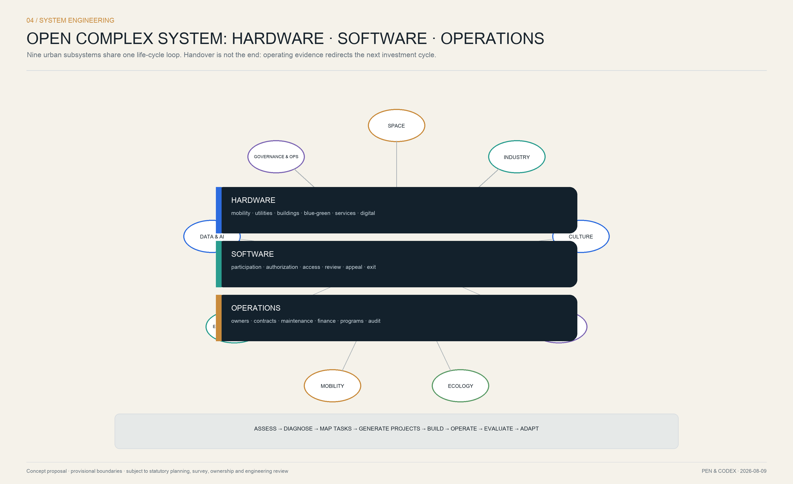

Figure 2-2. Concept rendering of the community interface. The image emphasizes the integration of spatial works and service operations; it is not a site photograph, and specific buildings, trees, and facilities must be positioned after survey and design development.

### 2.9 From Overall Objectives to Eight Engineering Packages

To prevent the proposal from remaining conceptual, subsequent design, project initiation, and procurement are organized under eight engineering packages:

| Package | Principal construction content | Operating documents delivered concurrently | Problems addressed |
|---|---|---|---|
| EP-01 Corridor Continuity and Cross-Corridor Stitching | Main spine, community entrances, intersections, under-bridge space, ring-road crossing pre-feasibility, continuous accessibility | Break-point ledger, detour plan, maintenance-boundary map | ISS-01, ISS-04 |
| EP-02 Transit, Walking/Cycling, and Last-Mile Mobility | Rail access, bike-and-ride, shared parking, delivery stations, intersection micro-renewal | Time-based road-space allocation, loading rules, safety inspections | ISS-01, ISS-02, ISS-04 |
| EP-03 Complete Communities and Municipal Renewal | Pipelines, elevators, fire safety, accessibility, embedded services, all-age space | Resident-deliberation records, funding and maintenance agreements, work-order mechanism | ISS-02, ISS-03 |
| EP-04 Existing Buildings and Shared Ground Floors | Structural strengthening, energy retrofit, divisible units, open ground floors, adaptive reuse | Spatial admission, opening hours, rent and operating rules | ISS-02, ISS-05 |
| EP-05 Blue-Green Resilience and Public Space | Stormwater detention, permeable paving, shade trees, ecological buffers, nighttime lighting | Ecological maintenance, extreme-weather and nighttime-safety plans | ISS-01, ISS-02, ISS-03 |
| EP-06 Public Issue Ledger and Participation Mechanism | Offline service desks, public interfaces, human review, and emergency interfaces | Responsibility matrix, data dictionary, objection and retirement process | ISS-03, ISS-06 |
| EP-07 Open Testing and Technology-Transfer Platform | Shared laboratories, sandbox street segments, proof-of-concept and release space | Testing standards, data authorization, incident review, procurement or retirement procedures | ISS-05, ISS-06 |
| EP-08 Implementation Coordination, Commercial Operations, and Funding | Implementation units, operating teams, annual programs, and evaluation mechanisms | Life-cycle costs, contractual KPIs, audits, and rolling investment plan | ISS-01–ISS-06 |

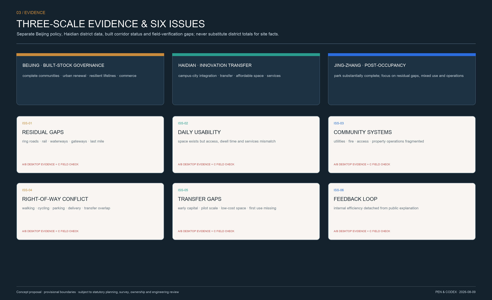

## 3. Overall Concept, Naming, and Visual Identity

### 3.1 Core Narrative

The overall concept is **"One Spine and Three Belts · Open Symbiosis."** The Jing-Zhang Railway Heritage Park is the green cultural spine perceived as a spatial continuum. The cultural, living-experience, and integrated-innovation belts are not three parallel land-use strips, but three service systems superimposed on the same urban transect. The "independence" of the Jing-Zhang Railway does not mean closure; it means turning knowledge into enduring public capability. The "openness" of open urban intelligence is likewise not unbounded; it means making rules, interfaces, responsibility, and evidence visible. Together, they form a three-part centennial narrative:

1. **Independent Construction:** railway engineering connected cities and the nation;
2. **Open Collaboration:** the Zhongguancun innovation network connects talent and industry;
3. **Trustworthy Co-Governance:** Urban Agents connect public problems, testing spaces, and human responsibility.

### 3.2 Brand and Naming System

The formal primary name is **"Centennial Jing-Zhang Open Intelligence Commons"** and the short public and international name is **"OPEN JING-ZHANG."** The hierarchy has five levels—overall brand, three belts, three zones, spatial components, and event brands—preserving the formal terms in the brief while remaining legible and memorable to the public:

| Level | Chinese-system identifier | English name | Main use |
|---|---|---|---|
| Overall brand | Centennial Jing-Zhang Open Intelligence Commons / OPEN JING-ZHANG | Centennial Jing-Zhang Open Intelligence Commons / OPEN JING-ZHANG | Proposal, gateways, international communication |
| B-CULT | Jing-Zhang Heritage Line / Centennial Jing-Zhang Cultural Belt | Heritage Line | Heritage, archives, wayfinding, cultural programs |
| B-LIFE | Everyday Jing-Zhang / Urban AI Living Experience Belt | Everyday AI Line | Community services, walking and cycling, commerce, all-age experience |
| B-INNO | Jing-Zhang Innovation / AI Integrated Innovation Belt | Fusion Innovation Line | University technology transfer, testing platforms, AI+ scenarios |
| Z1 / Z2 / Z3 | Zhongzhiyuan / Beijing AI Origin Community / Dazhongsi | Zhongzhiyuan / Beijing AI Origin Community / Dazhongsi | Formal key-area names take precedence; subtitles support communication |
| Components | Open Rail, Open Station, Open Interface, Truth Beacon, Contribution Mile | Open Rail / Station / Interface / Truth Beacon / Contribution Mile | Public space, wayfinding, facilities, and digital interfaces |
| Events | Open Jing-Zhang Season, Open Rail Week, Centennial Commons Night | Open Jing-Zhang Season / Open Rail Week / Centennial Commons Night | Annual operations and international exchange |

The logo uses two opposing railway lines to form the letters **J / Z**. Three nodes represent culture, living, and innovation, while the central void becomes an "open interface." Standard colors are Railway Charcoal `#14212B`, Centennial Copper `#C98B3C`, Everyday Teal `#2A9D8F`, and Innovation Electric Blue `#2D6CDF`. Drawings use the open, redistributable Noto Sans family; unauthorized corporate marks are prohibited. The logo clear space equals one quarter of the symbol height; minimum height is 12 mm in print and 32 px on screen. Use the reversed version on dark backgrounds; do not stretch, rotate, outline, or recolor it arbitrarily.

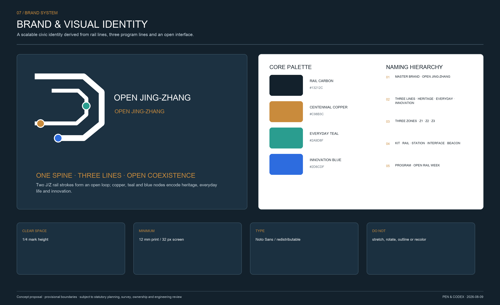

### 3.3 Coordination Loop among the Three Positionings, Five Functions, and Three Zones and Two Wings

The three positionings answer the brief verbatim in substance: the **Centennial Jing-Zhang Cultural Belt** sustains and adaptively reuses heritage; the **Urban AI Living Experience Belt** delivers complete communities, walking/cycling, commerce, and all-age experience; and the **AI Integrated Innovation Belt** enables research transfer, industrial testing, and AI+ public scenarios. The five functions are not slogans; they are jointly supported by spatial carriers and operating mechanisms [source:AGENT-TASKBOOK] [standard:PROJECT-AGENT-OPEN-CALL-TASKBOOK]:

| Five functions | Principal spatial carriers | Operating mechanism | Lead area |
|---|---|---|---|
| Full-Stack Independent AI Innovation System | Zhongzhiyuan trustworthy testing loop, computing and adaptation nodes | Common benchmarks, red teaming, model cards, standards output | Zhongzhiyuan + Zhongguancun Technology Services Wing |
| World-Class AI Innovation Ecosystem | AI Origin transfer stack, shared workshops, open ground floors | Project discovery—proof of concept—pilot maturation—first trial and use—industrialization | AI Origin + Zhongguancun Technology Services Wing |
| New Paradigm for AI+ Scenario Enablement | Sandboxes along Xiaoyue River, community and park nodes | Scenario list, data authorization, human review, retirement review | Xiaoyue River Scenario Enablement Wing |
| Intelligent and Vibrant AI City | Everyday Jing-Zhang line, Dazhongsi consumption and business gateway | Public-service floor, market operations, day–night programs, revenue reinvestment | Dazhongsi + Xiaoyue River Scenario Enablement Wing |
| Global Voice in AI Governance | Public issue ledger, trustworthy evaluation, international exchange hall | Open protocol, independent audit, collaborative standards, bilingual communication | Zhongzhiyuan + all three belts |

The "Three Zones and Two Wings" use the formal names in the brief. **Beijing AI Origin Community** carries the world-class innovation ecosystem and transfer core. **Zhongzhiyuan AI Independent Innovation Acceleration Area** carries the full-stack independent system and governance standards. **Dazhongsi AI Industry Cluster** carries AI-native new industries. The **Zhongguancun Technology Services Wing** connects westward to universities, research institutes, capital, and professional services. The **Xiaoyue River Scenario Enablement Wing** connects eastward to parks, communities, urban services, and real-world applications. Talent, research outputs, capital, and services enter from the Zhongguancun wing; the three zones validate and transfer them; and the Xiaoyue River wing opens real scenarios and public evaluation. Operating data then returns to standards, capital, and the next cycle of research and development, forming a loop of "factor input—research and validation—urban trial—public evaluation—standards output."

## Three-Level Scope Framework

The proposal turns the different scales announced in the call into nested working mechanisms [depth:three_level_scope_framework] [depth:overall_spatial_structure]:

| Level | Approximate announced area | Role in this proposal | Principal outputs |
|---|---:|---|---|
| Coordinated Research Area | 43.6 km² | Research on industry, talent, precedents, and future-city mechanisms | Open innovation ecosystem, cross-area collaboration interfaces, annual operating framework |
| Overall Design Area | 11.4 km² | Conceptual urban design for urban renewal and regulatory-plan-level depth | One axis, three stations and two wings; land-use capabilities; walking/cycling and blue-green systems; renewal project portfolio |
| Key-Area Detailed Design Area | 368.4 ha | Detailed design of three implementable prototypes | Spatial structure and first-phase scenarios for Zhongzhiyuan, AI Origin, and Dazhongsi |

The official announcement locates the project in Haidian District. The Coordinated Research Area extends north to the North Fifth Ring Road, south to Xizhimen Outer Street, west to Wanquan River Road, and east to the Beijing–Tibet Expressway. The Overall Design Area is approximately 11.4 square kilometers. The announced areas of Zhongzhiyuan, AI Origin Community, and Dazhongsi are approximately 192.1, 104.3, and 72.0 hectares respectively [source:OFFICIAL-ANNOUNCEMENT]. Xicheng District is considered only for coordination at the Beijing North Railway Station–Xizhimen southern gateway; Changping District is considered only for northern commuting and innovation links. Neither changes the project's administrative extent.

The Overall Design Area is organized by the Jing-Zhang green cultural spine rather than treating the three key areas as unrelated parks. Zhongzhiyuan asks whether AI can be trustworthy; AI Origin asks how innovation can transfer; Dazhongsi asks how technology can enter everyday consumption, business, and cultural experience. The two wings connect the main axis to universities, communities, research parks, and public services. Spatial data are provided in [data:geometry/site_boundary.geojson#SITE-001] and [data:geometry/key_areas.geojson#PROV-KEY-001].

The overall plan overlays OpenStreetMap roads, rail transit, waterways, public facilities, and research and education resources only as geographic context. The proposal boundary remains the repository's provisional polygon, shown as a dashed line. Every key area, project node, and strategic corridor is a conceptual recommendation [source:OSM-CONTEXT-20260809] [source:BOUNDARY-SOURCE].

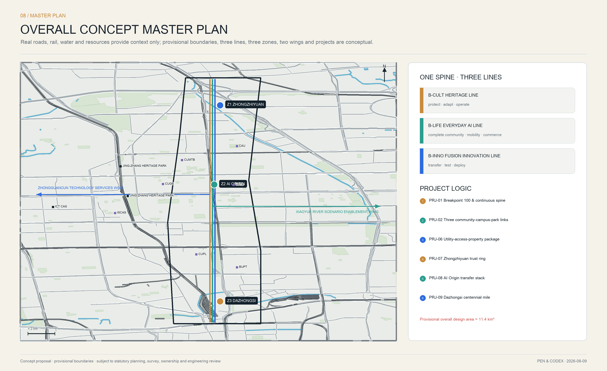

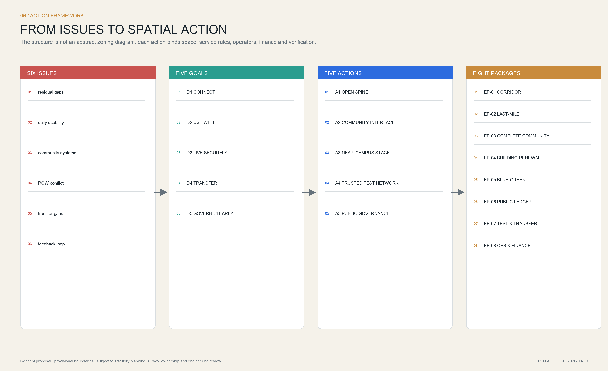

## Coordinated Research Area: Industry and Future City Research

### 5.1 Transferable Mechanisms, Not Replicated Forms

International precedents are used only to extract operating and spatial mechanisms, not as statutory planning controls for Beijing. Facts and transferable lessons are paired row by row:

| Precedent | Transferable mechanism | Jing-Zhang adaptation |
|---|---|---|
| Singapore one-north [source:CASE-ONE-NORTH] | Research, entrepreneurship, living, and testbeds are mixed under sustained public-sector operations | The three stations form a continuous environment of "research—testing—living—communication," not single-purpose office parks |
| Kendall Square, Cambridge [source:CASE-KENDALL] | Transit, public space, mixed use, and innovation spaces are coupled | Stations and walking/cycling organize open ground floors, entrepreneurial space, and community services |
| Knowledge Quarter, London [source:CASE-KQ-LONDON] | A membership network, common brand, and collaborative projects organize dispersed institutions | Establish a Jing-Zhang open-membership network across universities, parks, and communities |
| STATION F, Paris [source:CASE-STATION-F] | Startup projects, services, events, and exhibition are layered on one platform | Place a divisible collaboration stack and public release hall in AI Origin Community |
| MaRS, Toronto [source:CASE-MARS] | Thematic hubs, mentoring, and events connect industries | Create a shared hub for safety, standards, computing, and technology transfer in Zhongzhiyuan |
| Seoul DMC [source:CASE-SEOUL-DMC] | Content, media, AI, and data industries reinforce active public ground floors | Create a gateway for technology experience, international exchange, and cultural communication in Dazhongsi |

The precedent translation follows three boundaries: it borrows only mechanisms such as mixed use, membership networks, shared services, scenario testing, and long-term operations; it does not copy overseas development intensity or architectural form; and it does not claim that precedent institutions have entered partnerships. Every mechanism must pass Beijing planning, heritage, data-security, public-finance, and community-acceptance tests before entering the project portfolio.

### 5.2 Corridor Resource Map and Zhongguancun Technology Services Wing

An official 2021 planning interpretation states that nearly twenty universities and research institutes were distributed within the Jing-Zhang park's approximate 14-square-kilometer area of influence. This is only a historical structural baseline, not a substitute for a 2026 institution-by-institution survey [source:JINGZHANG-PLANNING-2021]. Using public directories and OSM contextual data, this round identifies Beijing Jiaotong University, Beijing University of Posts and Telecommunications, Beihang University, University of Science and Technology Beijing, China University of Political Science and Law's Xueyuan Road campus, China University of Mining and Technology–Beijing, China University of Geosciences–Beijing, China Agricultural University's East Campus, and candidate interfaces including the Institute of Computing Technology and Institute of Software of the Chinese Academy of Sciences. Names and locations must be verified by the responsible institutions and property owners during formal development [source:OSM-CONTEXT-20260809].

Resource coordination does not end with lines drawn around institutions. It uses a six-step register of "resource baseline—capability tag—spatial interface—collaboration mechanism—project placement—verification indicator":

| Resource type | Capability tags | Jing-Zhang spatial interface | Conceptual collaboration mechanism | Verification indicators |
|---|---|---|---|---|
| Universities and research institutes | Original research, talent, instruments, ethics, and academic review | Campus forecourts, shared classrooms, proof-of-concept units | One institution, one working group, one dedicated space; open research topics and joint mentors | Open-equipment hours, project matches, cross-institution reproducibility |
| Chinese Academy of Sciences and specialist institutes | Algorithms, systems software, trustworthy evaluation, domain models | Zhongzhiyuan testing loop, AI Origin transfer stack | Shared benchmarks, evaluation services, research roadshows | Testing cycle, issue closure rate, standards and tool outputs |
| Zhongguancun parks and technology services | Technology transfer, legal services, intellectual property, capital, international networks | Zhongguancun Technology Services Wing and three station service desks | Service vouchers, joint due diligence, pre-investment testing, international soft landing | Service-response time, financing and procurement conversion after validation |
| Communities, schools, hospitals, and parks | Real needs, public scenarios, user feedback | Xiaoyue River Scenario Enablement Wing and twelve scenario nodes | Small-entry scenario list, bounded time-space sandboxes, public acceptance | Service usability, satisfaction, completion of objection and retirement |
| Companies and developers | Products, engineering, open-source tools, operating capability | Affordable studios, first-trial street segments, open release halls | Scenario challenges, open-source contributions, procurement or retirement | Open-source reuse, scenario pass rate, months of sustained operation |

Haidian's technology-transfer policy explicitly identifies persistent gaps in early-stage capital, pilot maturation, low-cost transfer space, and routine coordination. The proposal therefore defines the Zhongguancun Technology Services Wing as a "service bus callable by individual projects," not a new enclosed park [source:HAIDIAN-TECH-TRANSFER-2026].

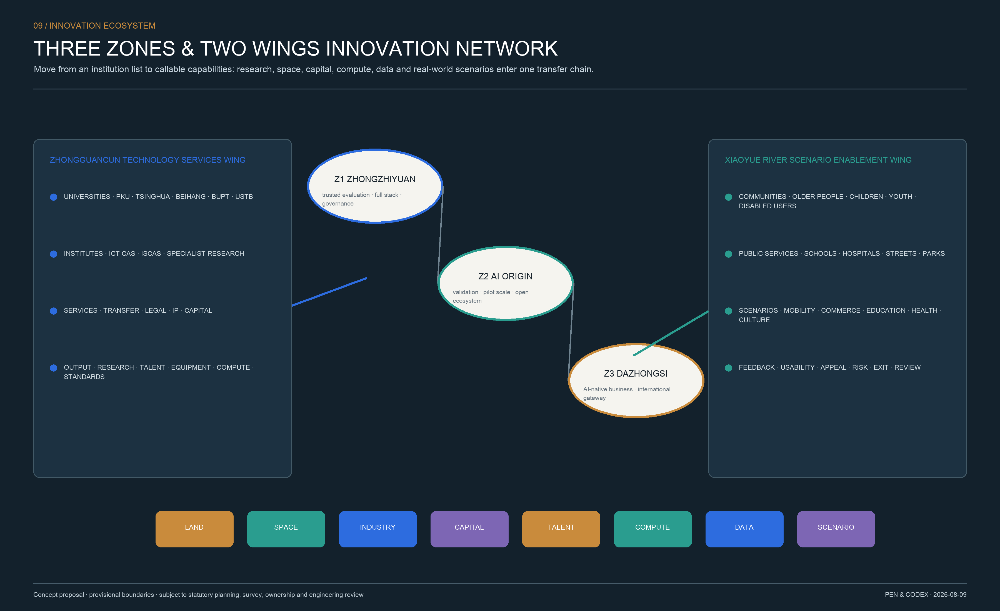

### 5.3 Eight Shared Resources of the Open Intelligence Commons

The industrial ecosystem is not measured only by company count. It is measured by whether the eight factors required by the brief—**land, space, industry, funding, talent, computing, data, and scenarios**—can continuously coordinate. Land supplies lawful renewal carriers; space provides affordable and divisible units; industry forms value chains and professional services; funding spans proof of concept through first trial and use; talent moves through cross-institution networks; computing is supplied in tiers; data are lawfully authorized; and scenarios provide real-world validation. Haidian's plans call for specialist research services, shared instruments, commissioned testing, industrial datasets, and standard test sets, providing a policy basis for the Open Intelligence Commons [source:HAIDIAN-14FIVE].

Each resource has a public directory, admission rules, maintenance responsibility, charging or subsidy arrangements, and a retirement mechanism. Public investment prioritizes reusable interfaces, common foundations, and safety capability. Market services compete above those interfaces but may not monopolize basic public capabilities. The eight factors are assigned as "one resource package per project," so projects do not have to search separately across departments for space, computing, data, and scenarios.

The proposal recommends an Open Jing-Zhang Commons Council. Public agencies protect bottom lines and conduct audits; community representatives hold agenda-setting rights; professional institutions conduct testing and risk assessment; universities and companies contribute tools and training; and independent observers publish an annual transparency report. The council does not replace statutory decision-making; it maintains scenario governance and the public protocol.

### 5.4 Six-Stage Transfer Chain from Research Output to Urban Value

1. **Problem Intake:** Communities, parks, and public agencies jointly publish real problems after confirming public value, data boundaries, and a responsible person.
2. **Proof of Concept:** Universities and startups use synthetic, de-identified, or authorized data for small-scale validation.
3. **Shared Testing:** Common benchmarks, red teams, and safety standards verify reliability in Zhongzhiyuan.
4. **Bounded Pilot:** The project enters AI Origin or a corridor node for a defined time and scope, with human fallback and stop conditions.
5. **Industrial Deployment:** Open procurement, market orders, specialist operations, or technology licensing create a sustained service while defining public-asset and intellectual-property boundaries.
6. **Scaling or Retirement:** Successful scenarios output standards and open-source tools; scenarios that fail on risk or benefit publish a review, restore the site, and retire.

This chain directly addresses ISS-05, insufficient technology transfer, and ISS-06, opaque governance feedback. It also turns communities from passive users into problem proposers and acceptance reviewers.

### 5.5 Regional Innovation Coordination

Jing-Zhang is not self-contained. Northward, Qinghe and the North Fifth Ring Road connect talent housing and commuting with Beiwei Community and Future Science City. To the northeast, the corridor connects with major scientific facilities and original research in Huairou Science City. To the southeast, it connects with engineering and scaled manufacturing in Beijing E-Town. To the southwest, the Zhongguancun Technology Services Wing connects core Haidian innovation resources. Across Beijing–Tianjin–Hebei, it can contribute trustworthy evaluation, open scenarios, and reusable standards. All are directions for coordination and do not imply that any related entity has committed to partnership. Regional coordination produces project directories, common interfaces, joint testing, short-term talent residencies, and mutual recognition of standards—not another large park.

## Overall Design Area: Urban Renewal and Regulatory-Plan-Level Urban Design

This chapter organizes urban renewal around the six problems identified in Chapter 2; conceptual zoning does not substitute for existing-condition evidence or a statutory regulatory plan.

### 6.1 Land-Use Capabilities Rather Than a Fabricated Regulatory Plan

Topologically continuous conceptual land-use areas are provided in [data:geometry/land_use.geojson#LAND-USE] [depth:land_use_layout]. Each area uses a verifiable `land_use_code`, while branded uses are expressed as additional capabilities: open research and transfer; education and research collaboration; community public services; innovation services and AI-native commerce; talent living; cultural communication; and parks and green space. The purpose is to verify that these capabilities form a continuous system accessible on foot and by rail, not to declare statutory land classes or ownership changes.

Conceptual building prototypes are provided in [data:geometry/buildings.geojson#BUILDINGS]. Fourteen prototypes control a form logic of "open ground floors, divisible scale, existing fabric first, and grouped placement along the axis." Because approved floor area ratio, height limits, coverage, setbacks, sunlight, fire-safety, and heritage conditions are unavailable, floor area ratio and building height remain unknown; no false precision is supplied [depth:development_intensity_controls] [depth:height_massing_character].

### 6.2 Demolish–Renovate–Retain Method

No real building receives a demolition conclusion before a complete existing-condition survey [depth:retain_renovate_demolish]. Subsequent decisions follow four steps: identify heritage and social value; assess structure and carbon; test functional adaptability and public value; and compare the life-cycle costs of retention, repair, addition, and replacement. Buildings in the current drawings are only massing and scenario prototypes. Their footprint [metric:building_footprint_area_sqm] and count [metric:design_prototype_count] are used for internal proposal checks.

Roads and connections are in [data:geometry/roads.geojson#ROADS]; blue-green and public spaces are in [data:geometry/green_space.geojson#GREEN-SPACE] and [data:geometry/public_space.geojson#PUBLIC-SPACE]. All are conceptual networks, not road red lines, utility corridors, or engineering schemes.

### 6.3 Five Spatial Action Packages

| Action package | Problems addressed | Spatial objects | Implementation principles |
|---|---|---|---|
| A1 Continuous Open Axis | ISS-01, ISS-04 | Nine-kilometer walking/cycling route, park entrances, transit access, ring-road crossings | Audit breaks first, then make lightweight interventions; study bridge and tunnel works separately |
| A2 Community Interface Belt | ISS-02, ISS-03 | Wall edges, ground floors of older compounds, pocket spaces, deliveries, and parking | Street-specific action, all-age design, time sharing, joint property management |
| A3 Near-Campus Transfer Stack | ISS-05 | Underused buildings near universities, shared workshops, proof-of-concept space | Low cost, small units, divisible space, operations planned first |
| A4 Trustworthy Testing Network | ISS-05, ISS-06 | Zhongzhiyuan, three station nodes, public-scenario sandboxes | Synthetic data first, red-team testing, human takeover, retirement possible |
| A5 Public Governance Layer | ISS-03, ISS-06 | Community deliberation stations, issue ledger, public status boards | No new siloed platform; connect to existing citizen-service response and community-planner mechanisms |

### 6.4 Superimposed Design of the Three Belts

**Centennial Jing-Zhang Cultural Belt | Heritage Line.** A six-stage chain of "in-situ conservation—environmental improvement—adaptive reuse—digital interpretation—public co-creation—annual operations" connects Beijing North Railway Station, the historic route, Qinghuayuan Railway Station, bridges, culverts and track components, the history of corridor research and education, and the history of Zhongguancun innovation. Authentic heritage remains primary and digital interpretation supplementary. Pseudo-historic reconstruction, theme-park treatment, and commerce that obscures heritage value are prohibited. The Qinghuayuan Railway Station protection area and construction-control zone must be overlaid after official GIS lines are obtained. No new building or underground work immediately adjoining the station is proposed before that verification [source:TSINGHUA-STATION-CONTROL].

**Urban AI Living Experience Belt | Everyday AI Line.** A 15-minute living circle and a "seamlessly connected urban ground floor" organize parks, communities, campuses, innovation parks, hospitals, and commerce. The north–south spine provides continuous walking and cycling; east–west interfaces bring residents to the park, rail transit, and public services. Toilets, drinking water, shade, seating, parent-and-child facilities, accessibility, wet-weather passage, nighttime lighting, deliveries, and emergency refuge are designed as infrastructure. AI appears only when needed, improving experience through navigation, translation, accessibility support, facility repair, and service matching rather than trading convenience for continuous surveillance [source:HAIDIAN-URBAN-RENEWAL-GUIDE].

**AI Integrated Innovation Belt | Fusion Innovation Line.** A digital infrastructure stack of "cloud—network—data—intelligence—edge—device" connects a spatial chain of "project discovery—proof of concept—pilot maturation—first trial and use—industrialization—scaling or retirement." AI+ scenarios cover research transfer, health care, education, commerce, transport, park maintenance, energy, culture, and emergency response. Every scenario identifies its users, pain point, space, data, construction entity, operator, indicators, human takeover, and retirement conditions [source:BEIJING-AI-EMPOWERMENT-2025].

The three belts share the same space but use fixed mapping colors, project codes, and performance measures. The Cultural Belt measures heritage conservation, archive access, and participation; the Living Experience Belt measures continuous access, service equity, dwell and consumption vitality; the Innovation Belt measures validation cycles, resource sharing, scenario performance, and standards output. Every construction project must serve at least two belts, and priority projects should serve all three, preventing separate construction programs for culture, public welfare, and industry.

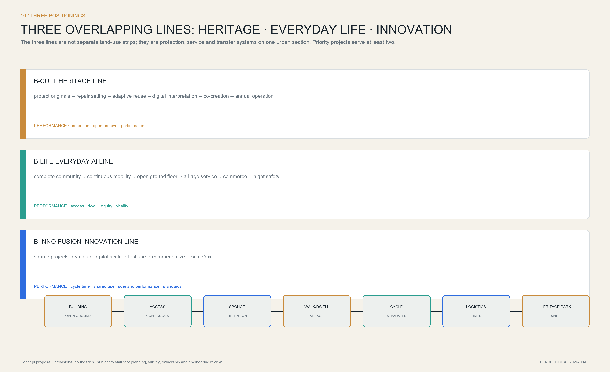

## Detailed Design of Key Areas

Each area starts from its own public problem and shares the same governance protocol [depth:three_key_area_detailed_design] [metric:key_area_count].

### 7.1 Zhongzhiyuan: Safety and Standards Station

**Positioning:** A gateway for independent AI innovation acceleration and trustworthy evaluation, corresponding to provisional extent PROV-KEY-001 [data:geometry/key_areas.geojson#PROV-KEY-001].

**Problem basis:** The northern area needs better external transport, park–community interfaces, and connections to Qinghe's blue-green system. Haidian also lacks a shared intermediary platform for standard testing, full-stack adaptation, and safety validation [source:JINGZHANG-OPEN-CALL] [source:HAIDIAN-WORK-REPORT-2026]. These are district-level tasks at present; parcel-specific vacancy, ownership, and ecological conditions still require verification.

**Spatial structure:** A "Trust Loop" connects a testing workshop, algorithm-transparency hall, open-computing station, and shared employee–resident garden. Visible testing spaces occupy street-facing ground floors; quiet research courtyards sit inside; logistics and safety buffers line the edge.

**Renewal method:** Adapt large-span existing buildings first; use reversible partitions for teams of different sizes; set new massing back from the main axis; and share meeting, equipment, and exhibition space through links.

**First-phase scenarios:** Urban Agent Trustworthy Evaluation Field and Robotics Open Street Segment. Every test discloses objectives, data fields, the responsible person, stop conditions, and incident review. High-risk tests run only within closed time windows and physical boundaries.

**First-phase actions:** First complete a Qinghe–park–community walking audit and existing-space inventory. Then pilot a "shared testing hall + standards laboratory + community observer gallery" in one existing building. Finally evaluate whether to extend it into a full-stack adaptation base. Acceptance focuses not on visitor numbers, but on shared-equipment hours, test reproducibility, safety-issue closure, and community-objection response time.

### 7.2 Beijing AI Origin Community: Collaboration and Transfer Station

**Positioning:** The core for open collaboration, youth learning, entrepreneurial transfer, and community co-governance, corresponding to provisional extent PROV-KEY-002 [data:geometry/key_areas.geojson#PROV-KEY-002].

**Problem basis:** Original university research faces a "nearest kilometer" before enterprise adoption, while campuses, innovation parks, and communities lack adequate walking/cycling and open interfaces. Young people need low-cost workspace and living services; surrounding residents need everyday services rather than one-off technology exhibitions [source:HAIDIAN-14FIVE] [source:HAIDIAN-URBAN-RENEWAL-ACTION].

**Spatial structure:** An "Open Table" plaza acts as a shared living room, surrounded by a release hall, prototype workshop, affordable studios for young people, community service station, and walking/cycling frontage along the railway. North–south lanes connect the main axis with surrounding neighborhoods.

**Renewal method:** Convert underused ground floors into small-scale, low-threshold spaces with long opening hours; retain recognizable industrial components and railway materials; use lightweight, demountable structures for additions.

**First-phase scenario:** Multimodal Public-Service Sandbox. Residents submit issues through text, voice, or images. The Agent provides traceable recommendations only; duty staff confirm, refer, and correct them. The public interface clearly distinguishes "machine recommendation / human decision."

**First-phase actions:** Use divisible 300–800-square-meter spaces as proof-of-concept units and 50–150-square-meter street-front spaces as community-service and first-release units. Establish a quarterly matching mechanism of "university output—community problem—proof of concept—bounded pilot." These areas are prototype ranges, not parcel controls. Placement follows building-safety, fire-safety, ownership, and operating assessments.

Figure 7-2. Concept rendering of the AI Origin collaboration and transfer courtyard. The image emphasizes relationships among adaptive reuse, divisible space, and a public ground floor; it is not a site photograph or definitive architectural scheme.

### 7.3 Dazhongsi: Experience and International Station

**Positioning:** A public gateway for AI experience, Jing-Zhang cultural narrative, and global open-source exchange, corresponding to provisional extent PROV-KEY-003 [data:geometry/key_areas.geojson#PROV-KEY-003].

**Problem basis:** The southern gateway is shaped by overlapping interfaces of the North Third Ring Road, Jingbao Road, Zhichun Road, Metro Line 13, and other urban systems. Public feedback on the regulatory plan addressed several interchanges and road connections. Renewal at Mingguang Village, Xiaozuta, and other corridor locations also shows that community parks, noise, illegal parking, and historical memory must be addressed together [source:JINGZHANG-CONTROL-FEEDBACK] [source:JINGZHANG-XIAOZUTA-2025].

**Spatial structure:** A "Centennial Milestone Plaza" connects a Jing-Zhang memory gallery, open release hall, urban experience center, international exchange courtyard, and community park. The rail-facing edge strengthens acoustic buffering; the city-facing edge provides an all-weather public ground floor. Commerce is layered across four interfaces—rail gateway, community daily life, technology experience, and nighttime culture—rather than spread as a continuous commercial carpet through the center of the park.

**Renewal method:** Public value and cultural continuity come first. Components that carry memory are retained wherever possible. New massing is recognizably contemporary but does not copy historic styles.

**First-phase scenarios:** Jing-Zhang Memory Agent, AI-Native Retail Laboratory, and Open Rail Week. The retail laboratory allows retail, food and beverage, cultural products, and service businesses to test intelligent guidance, accessible interaction, robot services, and digital product passports in specified areas and times. Facial profiling and differential pricing are prohibited by default; cash and human service remain available. Historical answers show sources and uncertainty; oral histories require consent. International events must leave behind open-source tools, teaching materials, or public facilities, not only a one-off exhibition.

**First-phase actions:** First audit pedestrian routes and four-quadrant transfers from Dazhongsi Station through the North Third Ring Road and Xiaozuta toward Beijing North Railway Station, producing separate lists for near-term micro-interventions and longer-term works. Concurrently pilot a "Centennial Milestone Plaza + community shared hall + nighttime safe route + adaptable commercial ground floor." Any ring-road crossing, bridge, tunnel, or rail project enters pre-feasibility only and is not claimed feasible in this proposal. Before commercial placement, conduct 24/7 surveys of footfall, business mix, rent, vacancy, deliveries, operating costs, and resident demand.

All three key areas use the same design-depth checklist:

| Key area | Lead functions | First-phase spatial prototype | Core AI scenarios | Commerce / public value | Prerequisite data | First-phase acceptance |
|---|---|---|---|---|---|---|
| Z1 Zhongzhiyuan | Full-stack independence + governance standards | Trust Loop, shared testing hall, community observer gallery | Trustworthy evaluation, Robotics Open Street Segment | Testing-service fees; open public observation and standards | Ownership, existing buildings, Qinghe ecology, logistics safety | Reproducibility, stop-response time, shared-equipment hours |
| Z2 AI Origin | World-class ecosystem + technology transfer | Open Table, transfer stack, affordable studios | Multimodal service, learning commons, open release | Low-rent small units + free community services | Building safety, fire safety, leasing, university–district access agreement | Matches, validation cycle, open hours |
| Z3 Dazhongsi | AI-native industries + international gateway | Centennial Milestone Plaza, adaptable ground floor, nighttime route | Intelligent commerce, Cultural Agent, international events | Market commerce reinvests in culture and public space | Footfall and rent, transport interfaces, heritage and acoustic conditions | Dwell time, repeat visits, public-revenue reinvestment |

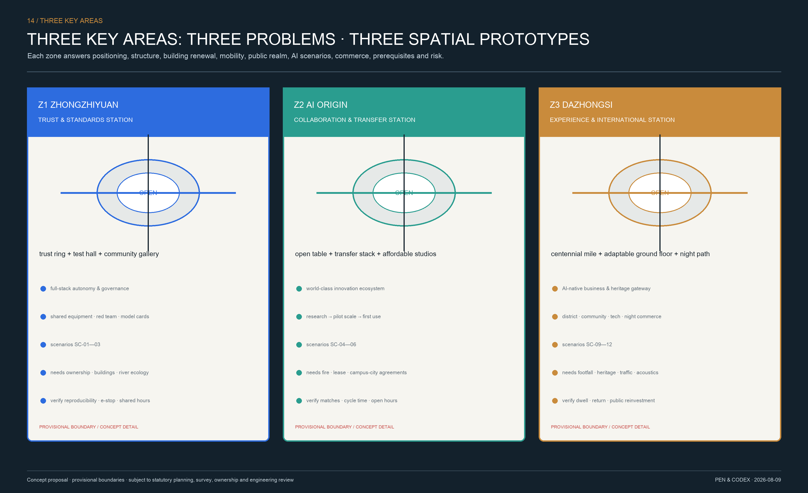

## AI Innovation Ecosystem, Personas, and AI+ Scenarios

### 8.1 Six Groups of Co-Builders

1. **Researchers and students:** need cross-institution facilities, data, and real problems, together with clear ethical boundaries;
2. **Open-source developers:** need short-term residencies, testing interfaces, peer review, and visible records of contribution;
3. **Startups:** need affordable space, computing, mentors, a first public scenario, and a procurement route;
4. **Established companies and investors:** need standards validation, industrial coordination, and long-term responsibility rather than closed showrooms;
5. **Residents:** children, older people, people with disabilities, and ordinary workers need understandable services, human fallback, and the right to opt out;
6. **Visitors:** need complex technologies translated into an urban story they can experience and question.

### 8.2 Twelve Scenario Cards and Scenario–Space–Operations Mapping

Every scenario card answers eleven fixed questions: user, real-world pain point, spatial carrier, AI/IoT capability, data source, construction entity, operator, human takeover, validation indicators, safety boundary, and retirement conditions. The table is the minimum executable version before detailed design:

| Code / scenario | Users and pain point | Space / capability | Data and boundary | Construction / operations | Validation and retirement |
|---|---|---|---|---|---|
| SC-01 Trustworthy Evaluation Field* | Research and procurement teams cannot compare system reliability | Z1 shared testing hall; benchmarks, red teaming, model cards | Synthetic/de-identified data first; tiered authorization of test sets | Science and technology authority / site owner; independent evaluator | Reproducibility, defect closure; suspend if inexplicable or high-risk |
| SC-02 Robotics Open Street Segment* | Companies lack complex real settings; pedestrians worry about safety | Z1 time-limited closed street segment; positioning, obstacle avoidance, dispatch | No facial recognition; raw video deleted at the edge | Site owner / safety facilities; licensed operator and on-site safety staff | Human-takeover latency, conflicts; retire after boundary crossing or failed emergency stop |
| SC-03 Urban Agent Integration Sandbox* | Cross-department interfaces are difficult to test before real deployment | Z1 integration room + limited digital sandbox; Agent orchestration | Simulation, public, or lawfully authorized data; no automated enforcement | Data / government-service departments; professional evaluator + responsible department | Correct tool use, privilege-overreach rate; seal after permission penetration |
| SC-04 Multimodal Public Service | Older people, newcomers, and people with disabilities struggle to express needs | Z2 offline service station; voice, text, and image assistance | Minimum fields, per-use consent, tiered retention | Subdistrict / service station; duty staff | Human confirmation rate, referral time; remove if basic rights are misdirected |
| SC-05 AI Learning Commons | Students and career changers lack cross-university courses and mentors | Z2 shared classroom; learning assistant, project matching | Learning record belongs to the learner; no automatic exclusion | Universities / site owner; mentors and education operator | Completion, mentor feedback; suspend discriminatory recommendation model |
| SC-06 Health-Service Navigation | Residents do not know where to obtain appropriate services | Community nodes; service search, accessible navigation | No diagnosis; health data are not retained by default | Health authority / service node; medical or social-work referral | Correct-referral rate, wait for human help; retire upon unauthorized diagnosis |
| SC-07 AI Walking and Cycling Navigation | Route continuity and accessibility information are inadequate | Everyday Jing-Zhang line; anonymous congestion, works, and accessibility notices | No persistent trajectory tracking; location processed on-device | Transport / park; professional operator + volunteer audit | Arrival time, incorrect directions; revert to static wayfinding if safe route is inaccurate |
| SC-08 Participatory Accessibility Audit | Barriers are difficult to identify and close continuously | Public space across three belts; crowdsourced records, work-order matching | Explicit consent; records facilities, not people | Urban management / subdistrict; joint review with disability representatives | Issue closure, review pass rate; no public promise without a responsible entity |
| SC-09 AI-Native Commerce | Consumer experience conflicts with privacy and fairness | Z3 adaptable ground floor; guidance, translation, robots, product passports | Facial profiling and differential pricing prohibited; cash and human channels retained | Property owner / merchant; commercial operator + consumer observer | Conversion, repeat visits, complaints; remove after discrimination or dark patterns |
| SC-10 Jing-Zhang Memory Agent | Historical materials are dispersed and the centennial story is difficult to understand | Cultural Belt memory gallery; knowledge graph, bilingual interpretation | Rights-cleared historical sources only, traceable citations, oral history withdrawable | Culture and tourism / heritage; joint editing by historians and communities | Citation accuracy, correction time; remove disputed history that lacks labeling |
| SC-11 Open Rail Week | Developer events are disconnected from real urban problems | Three-zone network; challenges, open courses, urban experience | Data authorized per project; sensitive source records remain closed | Council / site owner; developer-community operator | Tools retained, follow-on projects; discontinue a track without public outputs |
| SC-12 Contribution Mile | Public contributions are invisible and hard to correct | Physical beacons and digital archive along the corridor; version records | Display only voluntarily public contributions; allow withdrawal | Park / community; archive and community committee | Correction and withdrawal time; hide immediately when rights are unclear |

*SC-01 through SC-03 are the three industrial testing and validation scenarios. They may operate only within explicit physical boundaries and time windows, with an emergency stop and on-site supervision. SC-04 through SC-12 form a continuous route in which capability enters through the Zhongguancun Technology Services Wing, is validated in the three zones, and enters public experience through the Xiaoyue River Scenario Enablement Wing. Every scenario follows lawfulness, legitimacy, necessity, data minimization, tiered authorization, edge processing, final human decision, log auditing, appeal, and stop mechanisms [source:BEIJING-AI-EMPOWERMENT-2025].

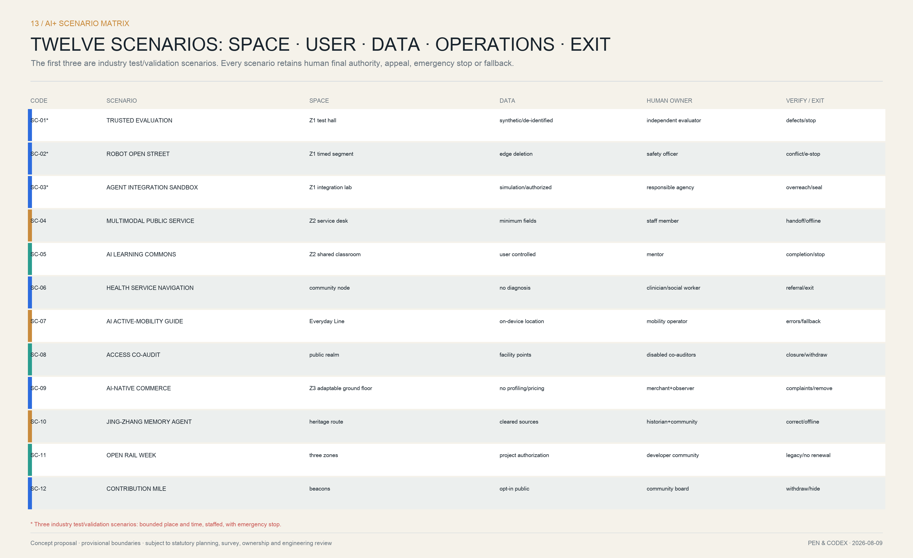

## Land Use, Building Scale, and Retain-Renovate-Demolish Strategy

Land-use, building, and area figures in this package are used for internal consistency, not submitted planning controls. The projected recalculated area of the provisional overall boundary is in [metric:site_area_sqm]. The total footprint of conceptual building prototypes is in [metric:building_footprint_area_sqm]. The prototype count is in [metric:design_prototype_count]. Each can be recalculated from the corresponding GeoJSON.

Massing in every key area follows three common principles: a continuous ground floor along public interfaces, permeable internal courtyards, and new massing that does not block heritage sightlines. No numerical commitment is made for floor area ratio or height. Parcel-level DRR and intensity comparisons begin only after official boundaries, existing-condition survey, ownership, heritage, aviation, sunlight, fire-safety, and municipal-infrastructure data are obtained.

## Transport, Rail, Municipal Infrastructure, and Public Services

### 10.1 Walking- and Cycling-First Open Mobility Network

The conceptual transport network uses the Jing-Zhang main axis as a continuous framework and three east–west "open branches" to connect communities, universities, and industrial areas [data:geometry/roads.geojson#ROADS] [depth:traffic_rail_slow_parking]. The internally recalculated length of walking, cycling, and cross-corridor connections is in [metric:open_mobility_length_m]. All alignments require subsequent overlay checks against rail safety, road red lines, accessible gradients, fire-safety access, and property entrances.

Parking follows "shared at the periphery, reduced inside, and time-separated loading." Robot tests do not occupy ordinary pedestrian space. Every critical intersection provides visual, tactile, and audible information. Rail nodes handle cross-district arrival, the main axis handles the last kilometer, and public-service nodes sit at intersections within a five- to ten-minute walk. Before formal design, establish the "Break Point 100" ledger. Each point records obstacle type, affected groups, ownership or maintenance entity, reversible micro-intervention, engineering option, budget order, closure status, and review date.

### 10.2 Municipal Lifelines Coordinated Above and Below Ground

Infrastructure follows four layers—"facility inventory—risk diagnosis—coordinated renewal—operating platform"—and applies life-cycle digitization to planning, construction, operation, and management [source:NATIONAL-RESILIENT-INFRA-2024] [depth:municipal_new_infrastructure]. Pipe diameter, depth, capacity, ownership, condition, and incident records are currently unavailable. Drawings therefore show only system types, renewal priorities, and coordination interfaces, not confirmed alignments or a decided utility tunnel.

| System | Required existing-condition survey | Conceptual construction action | Interface with public space / buildings | Operating and resilience indicators |
|---|---|---|---|---|
| Water supply | Diameter, pressure, leakage, secondary supply, water quality | Replace aging pipes, district metering, emergency water points | Coordinate one excavation with road renewal; jointly maintain public drinking water and fire supply | Leakage, low-pressure incidents, emergency-supply switchover time |
| Stormwater | Flooding points, drainage standard, catchments, sunken space | Source reduction, conveyance detention, terminal discharge, overflow routes | Rain gardens, permeable paving, floodable activity fields | Inundation depth/duration, effective detention, recovery time |
| Wastewater | Diameter, cross-connections, surcharging, pump stations | Separate stormwater and wastewater, repair misconnections, monitor priority nodes | Coordinate connections for toilets, food and beverage, and renewed buildings | Overflow incidents, misconnection closure, pump-station availability |
| Reclaimed water | Network coverage, quality, users, seasonal loads | Tiered use for landscaping, street cleaning, and water features | Park maintenance and building greywater interfaces | Substitution volume, water-quality compliance, outage degradation mode |
| Electricity | Substation capacity, peak/off-peak loads, dual supplies, aging cables | Distribution expansion, microgrids, storage, managed charging | Tier emergency power for test platforms, commerce, and parks | Peak load, backup duration, islanding success |
| Gas | Age, material, pressure regulation, encroachment, alarms | Renew high-risk segments, combustible-gas monitoring, sectional valves | Coordinate restaurant interfaces and works; sensors never replace inspection | Alarm response, shutoff time, encroachment closure |
| Heating / energy | Heat source, network balance, building demand, waste-heat potential | Building-efficiency retrofit, network balancing, renewable energy and waste-heat pre-study | Coordinate renewed buildings, energy stations, and public space | Energy use per floor area, fault recovery, renewable share |
| Communications and networks | Fiber routes, 5G coverage, operator ownership, blind spots | Diverse-route fiber, 5G/IoT, resilient communication | Shared poles for Truth Beacons, scenario nodes, and emergency broadcasting | Availability, latency, failover, blind-spot closure |
| Sanitation and solid waste | Collection routes, waste stations, commercial waste, recyclables | Sorted disposal, enclosed collection, time-separated loading, reuse workshops | Commercial back-of-house, community entrances, park-event schedules | Overflow incidents, sorting quality, nuisance complaints |
| Fire safety and emergency response | Fire-water supply, access, aerial-appliance standing areas, refuge | Add hydrants, clear access, emergency power and supply points | Public space doubles as assembly areas; wayfinding works offline | Response time, access availability, drill-issue closure |
| Integrated coordination | Ownership, elevation, maintenance access, near-term projects, excavation plans | "Utilities follow routes; utilities are built together," with one underground-network map | Roads, parks, and building renewal designed, built, and accepted together | Repeat excavation, data handover, work-order closure |

The facility inventory records, at minimum, ownership, age, material, burial depth, capacity, condition, and incidents. New sensors are designed, constructed, accepted, and commissioned together with primary works. Recent Beijing pipeline management emphasizes coordination between older-compound renewal and utilities, as well as synchronized handover of as-built and sensor data. The proposal therefore requires "one integrated utility-coordination map, one annual excavation plan, and one emergency switchover schedule" for each implementation unit [source:BEIJING-PIPE-LIFECYCLE-2025].

### 10.3 Cloud–Network–Data–Intelligence–Edge–Device Digital Foundation

The cloud provides public computing and model services; the network provides fiber, 5G, IoT, and resilient communications; the data layer provides catalogs, tiered authorization, and trusted spaces; the intelligence layer provides domain models and evaluation; the edge handles low-latency and sensitive data; and devices include robots, sensors, Truth Beacons, and mobile equipment. Each layer has separate security domains and responsible persons. When the network fails, lighting, evacuation, access control, fire broadcasting, and basic human services must continue independently.

Digital facilities follow "visible interfaces, least privilege, edge first, human takeover." Public Wi-Fi, environmental sensing, edge computing, and emergency power are integrated into maintainable street components. Public interfaces state purpose, data fields, retention, operator, and stop method. Screens are not duplicated merely for a "future" appearance, and no siloed platform is built parallel to existing government systems.

### 10.4 Public Services and Complete Communities

A 15-minute living-circle audit checks the capacity, service radius, opening hours, cost, and accessibility of education, health care, eldercare, childcare, culture, sports, toilets, fresh-food stores, convenience stores, community canteens, youth learning, and public legal services. Public responsibility guarantees basic services; commissioned operations and market services may supplement quality-enhancement services. Ground floors of schools, hospitals, parks, and innovation parks should open when feasible without compromising safety, education and health-care order, or lawful property rights. Service gaps must be verified in a field register; district-wide totals cannot substitute for site conclusions.

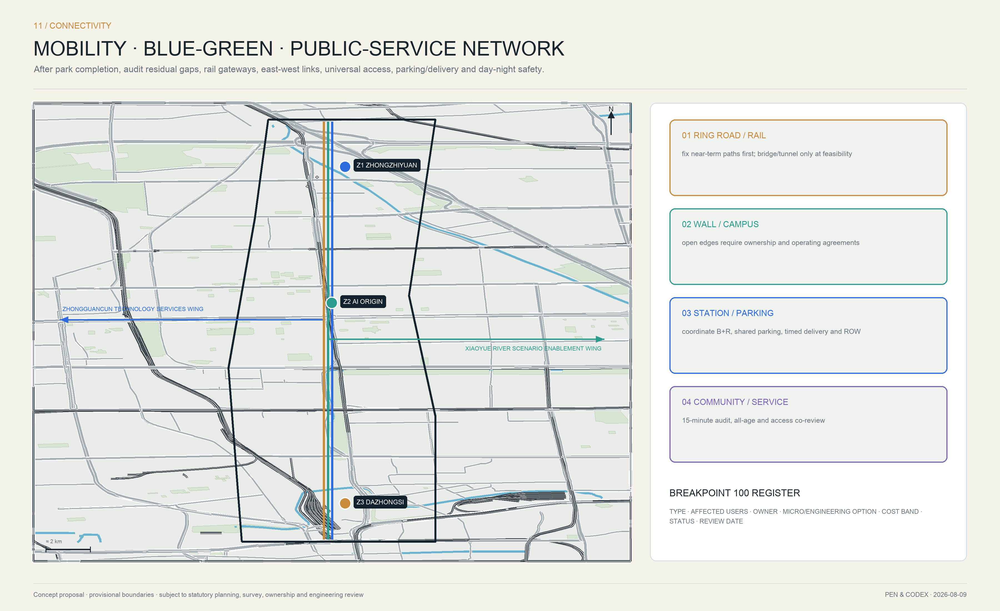

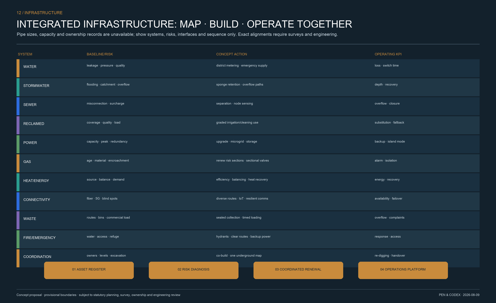

## Blue-Green Network, Public Space, and Urban Character

The blue-green system organizes railway edges, existing green spaces, and community public spaces into a continuous "Open Ecological Line" [data:geometry/green_space.geojson#GREEN-SPACE] [depth:blue_green_public_space]. The conceptual green-space ratio within the provisional boundary is in [metric:green_ratio], and the public-space ratio is in [metric:public_space_ratio]. Their functions may overlap and the figures cannot simply be added. Recalculate them when the official boundary and existing land classes become available.

### 11.1 Blue-Green Resilience and a Continuous Public Ground Floor

Spatial design follows "continuous main spine, accessible cross-connections, distributed sponge measures, and all-age sharing." Walking, running, and cycling remain legible from one another along the heritage-park main line. Xiaoyue River, Qinghe, and pocket green spaces support ecology and detention. East–west interfaces connect communities, innovation parks, campuses, and rail stations. Along the corridor, opening fenced greenery, public forecourts, and time-shared ground floors form a continuous public edge. Any proposal to remove walls, open campuses, or occupy green space requires ownership, safety, and ecological review and is not stated as confirmed implementation.

A typical community interface is organized from building to park as follows: adaptable open ground floor—a 2.0-meter continuous accessible strip—tree pits / rain gardens—walking and dwelling strip—clearly separated cycling strip—logistics and short-stay pocket—park walking/cycling spine. The dimension is only a starting point for conceptual clear-width checks and must be developed against site red lines, trees, fire access, and pedestrian volumes. Low-glare, tiered lighting secures principal nighttime routes; operating hours and color temperature are controlled in ecologically sensitive areas.

### 11.2 Public-Space Components and Physical Status Interfaces

Public space uses five replicable components:

- **Open Table:** a shared long table for learning, deliberation, and presentations;
- **Edge Canopy:** follows the rail edge and accommodates resting, wayfinding, and environmental sensors;
- **Quiet Dock:** low-stimulation space for older people, children, and neurodiverse users;
- **Truth Beacon:** shows scenario status, data extent, responsible person, and stop button;
- **Contribution Tile:** records public contributions that can be withdrawn or corrected.

The three landmarks are participatory public facilities rather than isolated sculptures. Zhongzhiyuan's "Monument to Independence" interprets independent engineering and trustworthy standards. AI Origin's "Open Commit Wall" turns public contributions into a searchable urban archive. Dazhongsi's "Agent Milestone Field" brings together a century of railway milestones and contemporary acts of collaboration. The cultural narrative runs from "Jing-Zhang Railway—Zhongguancun innovation—open urban intelligence" and distinguishes among evidence grades for fact, inference, and public memory.

Every component provides an unpowered mode, maintenance hatch, tactile and audio alternatives, a data notice, and a responsible person. Truth Beacons use three states: green for "routine service," copper for "bounded pilot," and red for "paused / human takeover." Decorative animation must not create a false impression of real-time status.

### 11.3 Living Heritage and Cultural Narrative System

Cultural resources use a four-class register: Class A, original fabric and statutory protected objects, including station buildings, tracks, bridges, culverts, and structures; Class B, historic settings and legible spatial patterns; Class C, memories of research, education, Zhongguancun innovation, and community life; and Class D, lawfully authorized oral histories, archives, and digital content. Class A prioritizes conservation and minimum intervention. Class B maintains spatial relationships. Classes C and D are activated through exhibitions, education, public art, and programs. Every resource is authenticated, its rights clarified, and its significance graded before display or adaptive reuse is decided.

The "Centennial Milestones" cultural route runs from the Beijing North Railway Station gateway and Qinghuayuan Railway Station and railway heritage, through memories of research and education around Xueyuan Road, to new innovation infrastructure in Zhongzhiyuan and AI Origin. Wayfinding identifies date, status as original / reconstructed / digitally interpreted, source, and accessibility information. The international narrative is: **From a railway built with independent engineering to an urban commons maintained through open intelligence.** Cultural commerce enters only when it neither obscures nor damages heritage and can reinvest in conservation; the use of proceeds and maintenance responsibility are disclosed.

### 11.4 Urban-Character Control Method

Urban character does not prescribe one "AI architectural style." It controls six relationships: heritage sightlines, public ground floors, massing articulation, rooftop equipment, nighttime brightness, and material life cycles. Existing buildings are repaired and adaptively reused first. New interventions use lightweight, reversible, recognizably contemporary language. Massing along the park remains fine-grained with permeable interfaces. Energy-intensive media facades, exaggerated forms, and unapproved corporate logos are excluded from core public space.

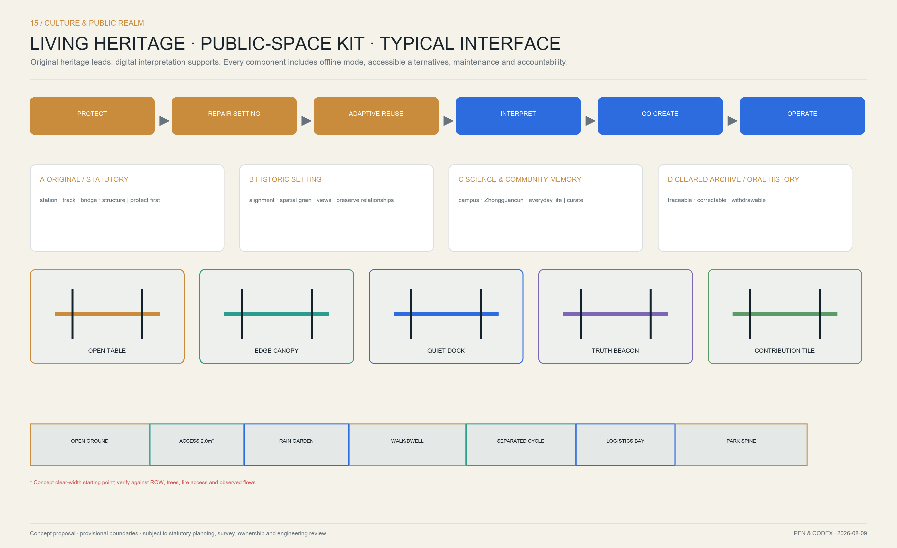

## Renewal Projects, Implementation Policy, and Phasing

**From planning recommendations to construction and operations.** Engineering packages bring the overall structure into the project portfolio; stage gates then progressively increase certainty. At concept stage, the proposal answers "is it worth doing, and what system should be used?" Pre-feasibility and schematic design later answer alignment, scale, investment, and engineering feasibility. Operational validation still follows construction handover; "built" is not automatically equivalent to "problem solved."

### 12.1 Commercial Planning and Reinvestment in Public Value

The commercial system follows Beijing's city–district–community hierarchy for commercial and consumer space and coordinates local vitality, international character, and technology. It proposes business mix and operating principles only and makes no commitment on rent, footfall, income, or payback [source:BEIJING-COMMERCIAL-PLAN]. Spatially, it forms a four-level network: Dazhongsi serves as a district-level technology-consumption and international-business gateway; AI Origin supports innovation services and youth-community commerce; Zhongzhiyuan supports producer services and employee amenities; and corridor community interfaces support everyday convenience and lightweight park services.

| User group / time | Basic needs | Appropriate businesses | Principal location | Public-value constraints |
|---|---|---|---|---|
| Residents / mornings, evenings, weekends | Breakfast, fresh food, repair, health, parent-and-child, eldercare | Community convenience, everyday services, community canteens | Community interfaces and Dazhongsi edges | Retain affordable basic services; do not displace them with event commerce |
| Students and young people / afternoons and evenings | Learning, social life, affordable food, short-term desks | Bookstores, shared learning, light food, maker retail | AI Origin Open Table and street-facing ground floors | Provide non-purchase seating, water, and long-dwell areas |
| Research and enterprise users / weekdays | Testing, legal services, capital, meetings, travel | Technology services, coworking, launches, business support | Zhongzhiyuan and Zhongguancun-wing service nodes | Publish shared-facility directories and fees; avoid private-club enclosure |
| Tourists and international visitors / weekends and event periods | Cultural understanding, tours, experience, mementos | Cultural exhibitions, cultural products, technology experience, distinctive food | Dazhongsi Centennial Milestone Plaza | Authentic heritage first; no theme-park or excessive influencer treatment |
| Cycling commuters and delivery workers / peaks | Supplies, storage, repair, loading | Cycling services, stations, time-shared delivery | Rail gateways and open branches | Do not occupy accessible or fire-safety access; define back-of-house routes |

Operations use four models. A **public foundation** guarantees free or low-cost services through government or property-holder responsibility. **Quasi-public services** use service procurement, concessions, or commissioned venue operations. **Market commerce** uses leases, joint operations, or revenue share. **Innovation services** use testing fees, memberships, training, events, exhibitions, and compliant sponsorship. Basic services attract daily use; quality services extend dwell time; innovation programs keep content current; and compliant operating proceeds are contractually reinvested in cleaning, landscaping, cultural conservation, free programs, and nighttime safety.

Before formal tenant recruitment, complete 24/7 surveys of footfall, business mix, rent, vacancy, consumer demand, deliveries, energy, and operating costs, and test baseline, prudent, and stress scenarios. Contractual KPIs jointly assess occupancy, merchant survival, complaints, retention of basic services, free seating, public opening hours, accessibility, energy use, and reinvestment in public value. Pop-ups or intelligent scenarios that repeatedly fail are removed to prevent subsidy dependence and homogenization.

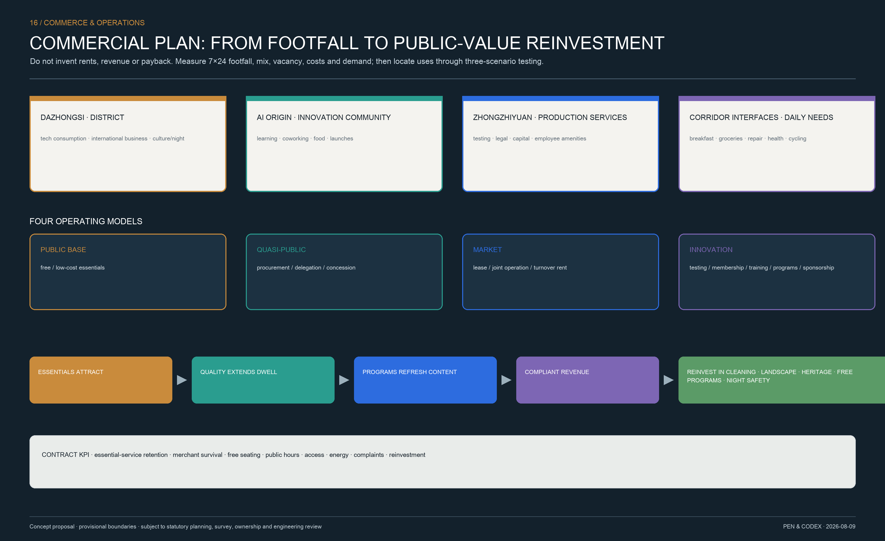

### 12.2 Twelve Problem-Oriented Projects

1. **PRJ-01 Break Point 100 and the Continuous Jing-Zhang Spine:** addresses ISS-01 and ISS-04;
2. **PRJ-02 Three Community–University–Park Open Branches:** addresses ISS-01 and ISS-05;
3. **PRJ-03 Rail Last Kilometer and Bike-and-Ride Nodes:** addresses ISS-01 and ISS-04;
4. **PRJ-04 Opening Fenced Greenery and Shared Ground Floors at Wall Interfaces:** addresses ISS-02;
5. **PRJ-05 All-Age Micro-Spaces and Time-Shared Delivery Stations:** addresses ISS-02 and ISS-04;
6. **PRJ-06 Older-Compound Pipeline–Accessibility–Property Coordination Package:** addresses ISS-03;
7. **PRJ-07 Zhongzhiyuan Trustworthy Evaluation Loop:** addresses ISS-05 and ISS-06;
8. **PRJ-08 AI Origin Proof-of-Concept and Transfer Stack:** addresses ISS-05;
9. **PRJ-09 Dazhongsi Centennial Milestone Plaza and Community Shared Hall:** addresses ISS-01 and ISS-02;
10. **PRJ-10 Distributed Public-Service Urban Agent Nodes:** addresses ISS-03 and ISS-06;
11. **PRJ-11 Open Ledger Issue Ledger and Contribution Archive:** addresses ISS-06;
12. **PRJ-12 Global Open Rail Week and Annual Public Audit:** addresses ISS-05 and ISS-06.

The twelve projects combine construction content and operating mechanisms from engineering packages EP-01 through EP-08. PRJ-01, for example, is not a standalone landscape project, but a combined project of corridor works, last-mile mobility, blue-green facilities, and long-term maintenance. PRJ-08 is not a standalone incubator, but a combined project of existing-building renewal, a testing and transfer platform, and commercial operations. The project list is a conceptual portfolio [depth:renewal_project_list], not a commitment to initiation, investment, or construction.

### 12.3 Six Implementation Gates: Each Step Answers Why Work May Continue

| Gate | Key question | Required outputs | Pass condition |
|---|---|---|---|
| SG0 Issue Confirmation | Is the problem real and does it have public value? | Field baseline, stakeholder map, problem-definition brief | Evidence is reproducible, affected groups participate, responsible department confirms |
| SG1 Concept Portfolio | Are spatial works needed, and is there a lower-cost alternative? | Option comparison, initial engineering package, risk and data boundaries | Digital platforms do not substitute for infrastructure; alternatives are compared completely |
| SG2 Pre-Feasibility | Are alignment, ownership, heritage, rail, municipal infrastructure, and funding feasible? | Survey, transport and municipal studies, cost range, operating intent | Major constraints identified; preliminary operations and maintenance commitments exist |
| SG3 Design and Joint Review | Do hardware, software, and operations close within one design? | Schematic design, service blueprint, data-impact assessment, life-cycle cost | Professional review, public comments, and risk controls are addressed together |
| SG4 Construction Handover | Do works meet safety, accessibility, maintenance, and opening requirements? | As-built records, operating manual, emergency drill, staff training | Acceptance covers service usability and human takeover, not only quantities |
| SG5 Operating Review | Has the project actually improved the problem, and should it expand or retire? | 6-, 12-, and 24-month evaluation, public review, incident and objection report | Expand when successful, correct when deficient, retire when risk is unacceptable |

These gates build "why this should be done" into the full project process. Every move to the next phase requires new evidence that reduces uncertainty. If official boundaries, ownership, heritage, road red lines, or municipal capacity remain unavailable, a project can advance no further than SG1. Ring-road crossings, bridges, tunnels, rail works, or large building projects must not be drawn as confirmed construction before completing SG2.

### 12.4 Three-Phase Spatial Implementation and Annual Programs

Spatial phasing is in [data:geometry/phasing.geojson#PHASING] [depth:phasing_implementation]:

- **Near term: establish baselines, close breaks, build trust (0–2 years).** Complete field baselines, Break Point 100, two community-interface micro-renewals, three controlled tests, Public Protocol 1.0, and an independent safety review.
- **Medium term: connect networks, fill service gaps, accelerate transfer (3–5 years).** Link the public ground floors and open branches of the three stations, roll out older-compound coordination packages, expand to twelve scenarios, and establish shared testing, scenario procurement, and talent residencies.
- **Long term: evaluate performance, enable retirement, support open replication (more than 5 years).** Roll spatial renewal in response to monitoring and resident review, allow mature scenarios to transfer and failed scenarios to retire, and contribute reusable standards to other cities.

Annual operations are a four-season cycle rather than one festival. The spring "Open Urban Problems Season" publishes problem lists from communities, innovation parks, and public agencies. Summer "Open Rail Week" runs controlled tests, open courses, and international co-creation. Autumn "Centennial Commons Night" links cultural performance, nighttime commerce, and release of results. Winter "Trustworthy City Audit Month" reviews accessibility, data, energy, commercial public value, and the Public Protocol. Every event must leave at least one durable result—closed issues, open-source tools, courses, standards, facilities, or long-term partnerships—or it does not enter the next annual budget.

The developer community combines resident maintainers, quarterly residency teams, university student groups, and community problem partners. International visitors enter through a bilingual experience route and are then connected to joint research, soft landing, testing services, or short-term talent residencies. Operating performance measures more than footfall and investment: it includes public-issue resolution, human coverage, correction time, successful retirement, shared-space hours, merchant survival, public-revenue reinvestment, and participation by community representatives.

### 12.5 Implementing Entities, Contracts, and Funding Logic

Projects are organized through an "implementation-unit coordinator + specialist operator + community co-governance unit." The coordinator manages cross-disciplinary plans, joint review, and public performance. Specialist operators run shared spaces, testing platforms, or public services. Community co-governance units hold permanent seats for problem submission, proposal review, construction oversight, and operating review. Public space, facilities, older compounds, and industrial space enter their respective lawful renewal pathways. Property-holder opinions, resident deliberation, joint review, public notice, construction, and operating responsibilities follow the Haidian renewal guidelines [source:HAIDIAN-URBAN-RENEWAL-GUIDE].

Funding combines government gap-filling, property-holder responsibility, specialist-operator investment, social capital, and scenario-service revenue without presuming a fiscal allocation or return. Construction contracts include opening hours, accessibility, energy, and maintenance costs in acceptance. Operating contracts include human service, objection handling, data minimization, facility condition, and retirement handover in their KPIs. Before any project enters the portfolio, it identifies who opens, who maintains, who pays, who bears risk, and when it retires, preventing construction investment and long-term operations from becoming disconnected.

## Metrics, Area Recalculation, and Compliance Matrix

Every known indicator is calculated from geometry or object counts in this package, and `metrics.json` records its formula, sources, confidence, and assumptions [depth:metrics_recalculation]:

| Indicator | Use | Status |
|---|---|---|
| Provisional overall-boundary area [metric:site_area_sqm] | Check data closure | Known and reproducible; not an official boundary area |
| Conceptual building footprint [metric:building_footprint_area_sqm] | Compare prototype scale | Known and reproducible; not an existing-building statistic |
| Conceptual green-space ratio [metric:green_ratio] | Compare blue-green continuity | Known and reproducible; update under the official boundary |
| Conceptual public-space ratio [metric:public_space_ratio] | Compare public value | Known and reproducible; functions may overlap with green space |
| Open mobility network length [metric:open_mobility_length_m] | Compare walking and cycling connectivity | Known and reproducible; not an engineering length |
| Number of building design prototypes [metric:design_prototype_count] | Check design coverage | Known object count |
| Number of key areas [metric:key_area_count] | Check coverage of the announcement | Known; count from announcement, boundaries provisional |

`floor_area_ratio` and `building_height_m` remain `unknown`. When official extents, the regulatory plan, and existing-condition survey become available, temporary geometry is replaced in one coordinate reference system, topology and metrics are rerun, and drawings, reports, and implementation lists are updated.

New performance indicators follow "measure the baseline first, then set the target": break closure rate, kilometers of continuous accessibility, 15-minute service coverage, shared-ground-floor opening hours, repeat-request rate, proof-of-concept-to-pilot cycle, identifiability of responsibility, objection-response time, and successful retirement rate. None currently receives a promised value. The first near-term output is a publicly reproducible baseline data dictionary.

Every chart uses three statuses. A **B baseline** requires official statistics, a facility register, or measured data. A **T proposal target** states year, extent, method, and responsible person. A **V verification indicator** evaluates a pilot through footfall, time, energy, satisfaction, safety events, and financial data. Haidian district-wide figures describe regional context only and cannot populate the baseline for the 11.4-square-kilometer area or a key area.

The requirements traceability system uses eight columns—"requirement—proposal section—figure—spatial object—indicator—source—gap—acceptance"—rather than pointing all twenty-three requirements to the same layers. Core mappings follow; the complete machine index is in `compliance_matrix.json`:

| Task | Dedicated text and figures | Spatial / operating evidence | Current status |
|---|---|---|---|
| Three positionings / five functions / Three Zones and Two Wings | 3.3, 6.4; overall plan and three-belts figure | B-CULT/B-LIFE/B-INNO, Z1–Z3, two-wing loop | Covered; official boundaries pending |
| Agent.1 Brand and overall concept | 3.1–3.3; logo/VI and overall plan | Five-level naming, logo standards, spatial structure | Covered |
| Agent.2 Innovation ecosystem | 5.1–5.5; innovation resource network | Six precedents, eight factors, six-stage transfer chain | Covered; willingness to collaborate pending |
| Agent.3 Scenarios and vibrant city | 8.1–8.2; scenario matrix | Twelve scenarios, three tests, six personas, retirement mechanism | Covered; site and data authorization pending |
| Agent.4 Public space and new industries | 7.3, 11, 12.1; public-space and commercial figures | Five components, three landmarks, Dazhongsi commercial system | Covered; engineering and market assessment pending |
| Agent.5 Integrated cultural narrative | 6.4, 11.3; cultural-system figure | Four resource classes, Centennial Milestones, bilingual narrative | Partially developed; heritage GIS and archives pending |
| Agent.6 Long-term operations | 12.1, 12.4–12.5; commercial-operations figure | Four-season program, developer community, contractual KPIs | Covered; entities and funding pending confirmation |
| Announcement overall and key-area design | 4, 6, 7, 9–11; overall plan and three-zone figure | Three-level scope, land use / transport / municipal / blue-green / character | Conceptual depth; regulatory-plan and existing-condition data pending |

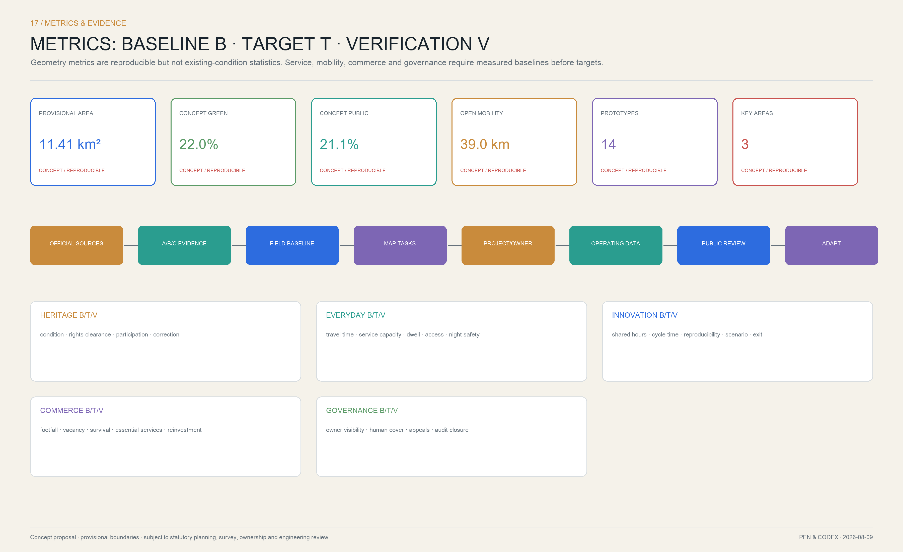

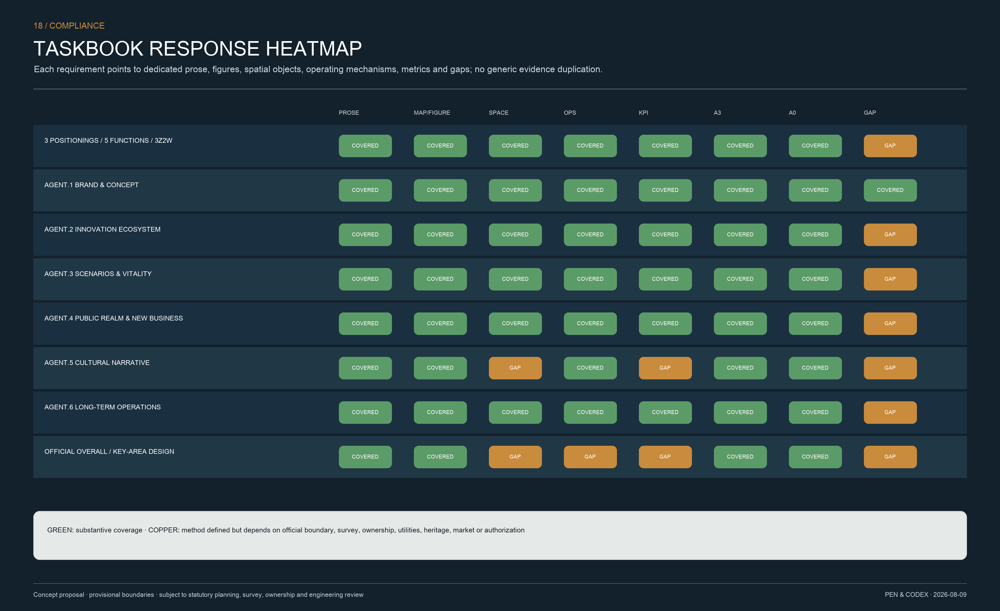

## Risk, Copyright, and Compliance

### 14.1 Data Gaps That Must Close in the Next Phase

- Official overall boundary, three key-area boundaries, and statutory parcels;
- Existing-building survey, ownership, property-holder intent, and lease relationships;
- Heritage and historic-building inventory, protection areas, and construction-control zones;
- Approved land use, floor area ratio, height, coverage, setbacks, sunlight, and fire-safety controls;
- Road red lines, rail-safety protection, municipal networks, sponge-city, and flood-control data;
- Population, employment, transport, environmental, energy, public-service, and market baselines;
- Confirmed operating entities, funding sources, procurement mechanisms, and long-term maintenance responsibility.

Constraints are in [data:geometry/constraints.geojson#CONSTRAINTS]. Until the gaps close, proposal areas, alignments, massing, project timing, and investment must not be represented as facts, approval conclusions, or construction commitments [depth:risk_missing_data].

The next-stage investigation advances six workstreams in parallel: data requests, GIS assessment, behavioral observation, facility survey, interviews and co-creation, and specialist testing.

| Survey package | Method and minimum sample framework | Outputs | Direct support |
|---|---|---|---|
| Space and ownership | Obtain official boundaries, regulatory plan, ownership, and building footprint / height / age / use; inspect every building | One existing-condition map, DRR assessment, spatial-opportunity inventory | Overall plan, key areas, intensity, implementation units |
| Transport and behavior | Weekday/weekend × morning/midday/evening/night counts; trajectories, waiting, and conflicts at key intersections; access audits at stations and entrances | Break Point 100, 24-hour footfall, walking/cycling and delivery heatmaps | Continuous spine, commercial placement, accessibility |
| Municipal infrastructure and resilience | Obtain water, drainage, electricity, gas, heating, communication, fire-safety, and flooding records; verify covers and facilities on site | One underground-utility map, risk zoning, coordinated excavation plan | Integrated infrastructure and phasing |
| Public services | Verify capacity, service radius, opening hours, cost, and accessibility; review separately for children, older people, young people, and people with disabilities | Fifteen-minute living-circle supply–demand table | Complete communities and Living Experience Belt |
| Commerce and operations | 24/7 footfall; business mix, vacancy, rent, average transaction, deliveries, energy, and merchant interviews; three-scenario assessment | Commercial baseline, business-fit analysis, life-cycle operating model | Dazhongsi and corridor commerce |
| Culture and ecology | Heritage lines, relics, veteran trees, sound, stormwater, and habitat survey; rights clearance for historical sources and oral history | Cultural-resource grading, conservation/activation list, ecological constraints | Cultural Belt, blue-green network, urban character |
| Innovation and scenarios | Institution-by-institution interviews with universities, institutes, companies, hospitals, and schools; verify equipment, space, data, procurement, and willingness to collaborate | Resource directory, scenario-authorization table, transfer-chain responsibility matrix | Innovation Belt, two wings, and twelve scenarios |

Public participation must include residents, students and researchers, merchants, property managers and owners, park operators, subdistricts, and professional departments. Children, older people, people with disabilities, night-shift workers, and delivery workers require separately accessible methods. Interview and behavioral data are de-identified and only statistical conclusions are published. Institution lists, personal opinions, and operating data lacking authorization do not enter the open package.

### 14.2 AI Scenario Bottom Lines

Urban Agents may not make final decisions that affect fundamental rights; public-space testing may not default to facial or persistent-trajectory collection; inexplicable scoring may not govern resident access, employment, health care, or education; and digitization may not replace offline services. Every scenario discloses its responsible entity, data inventory, model or rule version, human-review method, appeal channel, incident response, and retirement conditions.

### 14.3 Copyright and Attribution

**Pen & Codex** created the text, graphics, spatial-data processing, layout, and scenario system for this open co-creation. Precedents are used only for factual mechanism research and are cited. The package uses no third-party photographs, commercial basemaps, commercial marks, or restricted fonts. License and community-display boundaries are detailed in `report/copyright_statement.md`.

## 15. Conclusion: Make Urban Intelligence Shared Infrastructure That the City Maintains Together

The most powerful future for Centennial Jing-Zhang is not to package heritage as a technology showroom, but to make it once again an engineering project about public capability. The railway era answered "how to connect." The open-intelligence era answers "who defines the problem, how effectiveness is proven, and who assumes responsibility."

The Open Intelligence Commons therefore turns every spatial decision into a negotiable protocol, every AI scenario into a bounded, stoppable, reviewable public experiment, and every contribution into a traceable record along a centennial axis. Its completion is not a one-time handover, but a city learning continuously to maintain its own intelligent infrastructure together.

## References

Complete records of sources, URLs, uses, temporal coverage, licenses, and limitations are in `sources.json`. The sources with the greatest bearing on proposal judgments are:

1. Beijing Municipal Commission of Planning and Natural Resources, *Prequalification Announcement for the Centennial Jing-Zhang AI Innovation Belt International Urban Design Call*, 2026: establishes the project's location in Haidian District, three levels of scope, three key areas, and required depth [source:OFFICIAL-ANNOUNCEMENT].
2. Open City AI, latest GitHub README, Agent brief, and formal submission guide, 2026-08-09: establishes the three positionings, five functions, Three Zones and Two Wings, six Agent tasks, and v2 bilingual contract [source:GITHUB-LATEST] [source:AGENT-TASKBOOK].
3. Beijing Municipal Commission of Planning and Natural Resources, *Haidian's North–South Urban Green Heart: Planning the Jing-Zhang Railway Heritage Park*, 2021: verifies length, served subdistricts and towns, historical baseline of resource density, and structural breaks [source:JINGZHANG-PLANNING-2021].
4. Beijing Municipal Forestry and Parks Bureau, construction materials for Phases I and II of the Jing-Zhang Railway Heritage Park, 2023–2026: supports the judgment that the park has moved from phased construction into post-occupancy operational evaluation [source:JINGZHANG-PHASE1] [source:JINGZHANG-PHASE2-COMPLETE-2026].
5. Haidian statistical bulletin, Government Work Report, and 14th Five-Year Plan: used only as district-level context for population, industry, innovation, and public services, not extrapolated as parcel conditions [source:HAIDIAN-STATS-2024] [source:HAIDIAN-WORK-REPORT-2026] [source:HAIDIAN-14FIVE].
6. Haidian District Urban Renewal Implementation Guidelines and Action Plan: support policy language for complete communities, park–city integration, public deliberation, implementing entities, and long-term operations [source:HAIDIAN-URBAN-RENEWAL-GUIDE] [source:HAIDIAN-URBAN-RENEWAL-ACTION].
7. National documents on advancing urban renewal and urban-infrastructure lifelines: support "retain, renovate, and demolish in coordination, with retention, reuse, and improvement prioritized," life-cycle management, and above- and below-ground coordination [source:NATIONAL-URBAN-RENEWAL-2025] [source:NATIONAL-RESILIENT-INFRA-2024].
8. Haidian technology-transfer policy interpretation and Beijing AI Enablement Action: support the transfer chain, pilot maturation, real scenarios, classification and tiering, trusted data, and regulatory sandboxes [source:HAIDIAN-TECH-TRANSFER-2026] [source:BEIJING-AI-EMPOWERMENT-2025].
9. Beijing Special Plan for the Layout of Commercial and Consumer Space: supports district and community commercial hierarchies and coordination between public value and operations, not rent or income claims [source:BEIJING-COMMERCIAL-PLAN].
10. OpenStreetMap data snapshot, 2026-08-09: used only for geographic context such as roads, rail, waterways, universities, hospitals, and parks under ODbL attribution; it does not support official boundaries or regulatory controls [source:OSM-CONTEXT-20260809].

Standards applicability is in `standard_matrix.json` [standard:PROJECT-OFFICIAL-ANNOUNCEMENT], design-depth evidence is in `design_depth_matrix.json` [depth:metrics_recalculation], and recalculated indicators are in `metrics.json` [metric:site_area_sqm]. When official polygons, existing-condition survey, and regulatory-plan conditions become available, replace [data:geometry/site_boundary.geojson#SITE-001] and synchronously recalculate layers, ratios, figures, and PDFs. Until then, floor area ratio, building height, road red lines, ownership, municipal capacity, and DRR conclusions remain unknown or subject to professional confirmation.
