# 百年京张·开源智基

**Centennial Jing-Zhang Open Intelligence Commons · OPEN JING-ZHANG**

> 一脊三带，三区两翼，开放共生。把建成的京张绿色文化脊梁，升级为可生活、可创新、可持续运营的城市共同基础设施。

本方案的核心主张是：**以已经基本贯通的京张铁路遗址公园为绿色文化脊梁，将百年京张文化带、都市 AI 生活体验带和 AI 融合创新带叠合为一套开放式城市更新系统。** 一百多年前，京张铁路用自主工程建立城市之间的连接；今天，这条轴线再次以系统工程解决连接问题——既修补环路、轨道、围墙和大院造成的残余断点，也连接社区需求、高校知识、科研设施、产业服务、商业运营与公共决策。

因此，方案不是给城区覆盖一层“AI 皮肤”，也不是只提出治理倡议。它把城市更新视为一项持续运行的系统工程：先补齐步行、骑行、市政、公共服务、建筑更新和生态韧性等“硬件”，再把问题登记、场景测试、公众协商、数据规则和绩效反馈等“软件”嵌入空间，最后通过运营主体、资金机制和年度评估保证两者长期协同。

总体结构概括为 **“一脊三带、三区两翼、十二场景、八类基础设施、一个开放协议”**：一脊是京张绿色文化脊；三带是任务书明确的文化、生活体验、融合创新三带；三区是众智园、北京 AI 原点社区、大钟寺；两翼是中关村科技服务翼和小月河场景赋能翼；十二场景以公共协议接受准入、评测、人工复核和退出。所有内容按照“现状体检—问题诊断—任务落图—项目生成—建设实施—运营治理—绩效评估—动态维护”闭环组织。

## 0. 核心命题：为什么是京张，为什么是现在

**为什么是京张。** 它同时具备遗产轴线、线性公园、轨道交通、大学与科研机构、老旧社区和创新产业等多重城市系统，是观察海淀“园城融合”是否真正发生的典型剖面。这里的问题不是缺少单体项目，而是不同系统之间缺少连续接口：公园分段建成却未完全贯通，公共空间存在却未必方便日常进入，科研成果丰富却缺少低成本验证和公共场景转化路径，数字治理高效却仍需要让公众看得见责任和处理依据。

**为什么是现在。** 京张铁路遗址公园二期已于 2026 年 7 月整体完工，规划重心必须由“从零建设线性公园”转向运行后评估、残余断点修补、复合功能植入和长效运营；海淀正同步推进完整社区、市政管线、科技成果转化和人工智能创新街区建设。若绿化、道路、园区、社区、商业和数字平台继续分头投资，新的运维边界仍会抵消空间贯通的价值 [source:JINGZHANG-PHASE2-COMPLETE-2026] [source:HAIDIAN-URBAN-RENEWAL-ACTION]。

**最终要交付什么。** 不是一张理想化总图，而是一组可以分期立项、独立验收又能协同运行的工程包：连续慢行和横向缝合、社区基础设施与公共服务、既有建筑适应性更新、开放测试与成果转化空间、蓝绿韧性设施、公共问题账本及长期运营机制。每个工程包都必须同时写明物理载体、服务规则、运营责任、资金来源、风险边界和绩效指标。

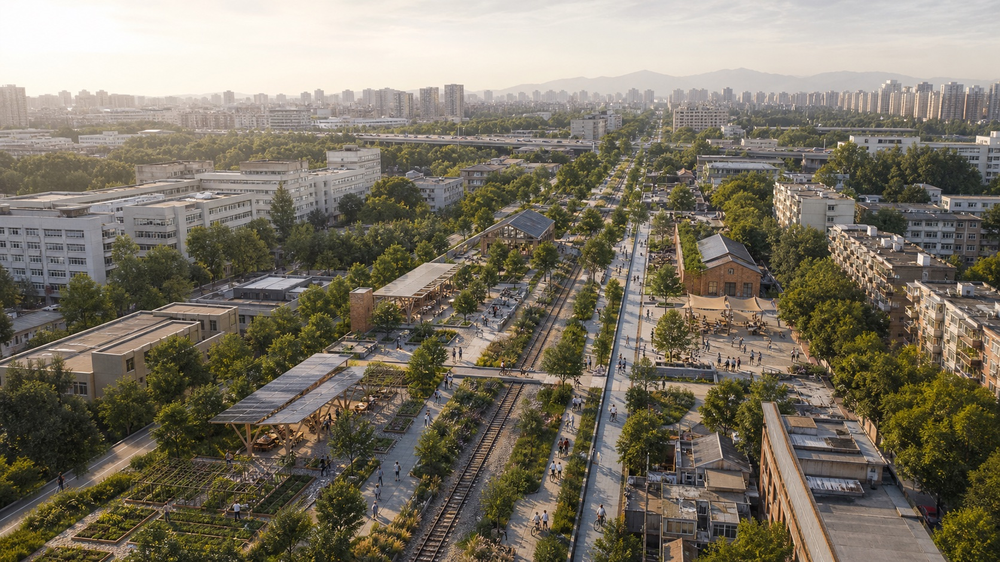

图 0-1　总体空间愿景概念效果图。该图用于表达空间气质、系统关系与公共生活场景，由本方案原创生成；并非现场照片，也不对应精确建筑或法定边界。

## 1. 设计依据与资料清单

### 1.1 项目依据

本提案响应《百年京张 AI 创新带城市设计开源征集》公告的三层工作范围、设计任务与成果要求 [source:OFFICIAL-ANNOUNCEMENT] [standard:PROJECT-OFFICIAL-ANNOUNCEMENT]。

智能体开放任务书进一步要求“概念品牌—创新生态—AI+场景—公共空间—文化叙事—长期运营”的完整证据链，本方案以六项任务作为章节、图纸与合规追踪的主索引 [source:AGENT-TASKBOOK] [standard:PROJECT-AGENT-OPEN-CALL-TASKBOOK]。

城市设计部分以《城市设计管理办法（中华人民共和国住房和城乡建设部令第35号）》作为空间塑造与建筑设计衔接的原则性参照 [standard:MOHURD-URBAN-DESIGN-MEASURES]；控规表达始终区分“已知条件、设计建议、待确认事项” [standard:MOHURD-CONTROL-DETAILED-PLANNING]；概念用地采用可校验分类，不以品牌名称替代法定用地分类 [standard:MNR-LAND-USE-CLASSIFICATION-GUIDE]。

建筑专业深度文件未随公开资料提供，因此仅列为下一阶段深化提醒，不声称达到施工图或审批深度 [standard:MOHURD-ARCH-DESIGN-DEPTH-2016]。

### 1.2 数据与证据边界

本包使用仓库现场数据包、来源登记表与处理后的事实包 [source:SITE-PACKAGE] [source:SOURCE-REGISTRY] [source:PROCESSED-FACT-PACK]。

总体范围采用仓库依据公告四至和约 11.4 平方公里生成的临时多边形 [source:BOUNDARY-SOURCE] [data:geometry/site_boundary.geojson#SITE-001]。三个重点片区同样是面向智能体生成和社区评审的临时粗略范围 [source:KEY-AREA-SOURCE] [data:geometry/key_areas.geojson#PROV-KEY-001]。

这些边界**不是官方红线**。本社区 GitHub 入口也不是政府或原征集组织方的官方报送渠道；本包仅用于开放共创、可复核讨论与后续正式深化。现状建筑普查、权属、文保控制线、道路红线、地下市政、批准容积率、高度及退线均缺失，所有对应结论均标注为概念建议 [data:geometry/constraints.geojson#CONSTRAINTS] [depth:existing_conditions_diagnosis] [depth:risk_missing_data]。

本轮补充调研以政府规划、统计公报、建设进展、公众意见采信和城市更新实施文件为主，形成的是**桌面基线**，不是现场调查的替代。正文采用三级证据：A 级为官方明确陈述或已公开数据；B 级为多个官方材料相互印证后的规划判断；C 级为需要通过现场测绘、行为观察、访谈或专业评估验证的假设。后文凡涉及“由此判断”“可能”“需核验”均属于 B 或 C 级，不把推断伪装成现状事实。

## 2. 北京—海淀—京张沿线桌面基线调研

### 2.1 北京城区：从增量扩张转向存量治理

《北京城市总体规划（2016年—2035年）》把人口资源环境矛盾、交通拥堵等“大城市病”作为治理导向，要求中心城区提高交通微循环效率，建设连续安全的步行和自行车网络，改善轨道站点最后一公里，并推进老旧小区的适老、无障碍、停车和长效物业治理 [source:BEIJING-MASTER-PLAN]。这意味着本项目的城市价值不能只用地标、活动或产业规模衡量，还必须回答四个基础问题：能否连续步行、能否公平使用公共服务、能否降低社区治理成本、能否在存量空间中形成长期运营。

**规划判断（B 级）**：京张沿线应被视作北京存量地区“城市修补”的纵向样本。AI 的首要用途不是增加屏幕和感知设备，而是帮助识别断点、协调多主体、公开决策依据并持续验证服务是否真正改善。

### 2.2 海淀区：创新密度高，但园城融合和成果转化仍是短板

海淀 2024 年末常住人口为 312.2 万人，其中常住外来人口 104.3 万人，占 33.4%；第三产业占地区生产总值 92.49% [source:HAIDIAN-STATS-2024]。这说明片区同时面对高密度居住、流动人才服务和知识型产业升级，而不能被简化成单一科技园区。

海淀“十四五”规划对自身问题有直接诊断：具有主导权的国际标准和引领性原创成果仍不足，科技成果转化规模与效率有待提高，高端产业集群优势尚未充分形成；同时，科技园区与城市经济、文化、社会、生态要素融合不足，功能复合性和宜居性不够，交通拥堵、环境压力和优质公共服务供给差距仍然存在 [source:HAIDIAN-14FIVE]。2026 年政府工作报告仍把新兴产业竞争优势、部分民生问题和基层治理效能列为需持续改进事项，并提出以空间“最近一公里”破解成果转化“最后一公里” [source:HAIDIAN-WORK-REPORT-2026]。

**规划判断（B 级）**：本方案不应再把“开源生态”停留在品牌层，而要转化为共享测试、标准验证、概念验证、低成本创业空间和公共场景采购等真实中间服务；同时把人才住房、社区服务、慢行和公共交往作为创新基础设施的一部分。

### 2.3 京张铁路遗址公园：空间基本贯通，任务转向片区融合与运营增效

京张高铁海淀段约 6 公里地下化后释放地面空间，遗址公园南起北京北站、北至北五环，全长约 9 公里，服务 9 个街镇。2021 年官方规划解读已指出地铁 13 号线平行、道路交叉、竖向复杂、产权多元和东西联系困难等结构性矛盾；一期约 2.5 公里、16.8 公顷于 2023 年开放 [source:JINGZHANG-PLANNING-2021] [source:JINGZHANG-PHASE1]。

二期已于 2026 年 7 月整体完工，北段清华东路至北五环约 30.01 公顷，南段同步实施相关配套，工程包含景观、院落、水排水、电气、架空线入地和铁路专项，并形成步行、跑步、骑行网络 [source:JINGZHANG-PHASE2-COMPLETE-2026]。因此，本方案不再把“新建 9 公里线性公园”作为创新点，而以运行后评估为起点，检查跨环路、跨轨道、跨河道、站点门户、社区入口和夜间开放形成的残余断点。

征集任务仍要求南北贯通、东西缝合、轨道站点一体化，以及停车、体育、创新交往等复合功能；控规反馈也显示北三环、四道口路、京包路、知春路等界面需深化 [source:JINGZHANG-OPEN-CALL] [source:JINGZHANG-CONTROL-FEEDBACK]。本轮规划判断是：建设重点应由“有没有公园”转向“是否真正可达、可横穿、可停留、可消费、可创新、可长期维护”。

### 2.4 社区治理与公共建设：硬件更新正在推进，长效协商和服务运营仍是关键

海淀城市更新行动明确提出，南部存量地区需要同步推进完整社区、老旧小区、一刻钟生活圈、嵌入式服务、管线、电梯和无障碍建设；人工智能创新街区还要为“一老一小”、青年创业者和创新人才补充普惠居住、就业、教育、医疗与文化服务 [source:HAIDIAN-URBAN-RENEWAL-ACTION]。2026 年海淀启动 35 个老旧小区自来水、雨污水、热力、电力和燃气管线改造，说明基础设施更新仍是持续任务 [source:HAIDIAN-PIPELINES-2026]。

北太平庄街道文慧园路的官方实地调研记录过一组典型矛盾：绿地有围栏但难进入、老旧小区停车紧张、外卖车占用人行空间、缺少老人休息和儿童活动设施。后续通过拆栏透绿、口袋花园、临时配送停车和错时共享车位改善 [source:WENHUIYUAN-STREET]。这一案例不能直接代表整条京张沿线，但能说明同一行政片区内“空间资源存在、日常可用性不足”的问题类型。

《海淀区城市更新实施指引》要求老旧小区更新自下而上提出需求、广泛征集居民意见、建立协商议事平台和长效管理机制；产业、设施与公共空间更新也都需要明确统筹主体、运营责任、资金和时序 [source:HAIDIAN-URBAN-RENEWAL-GUIDE]。因此，治理设计不能止于一次公示，而要覆盖“问题登记—共同议题—方案比选—施工监督—运营评价”的全过程。

### 2.5 数字治理：已有高强度应用基础，但仍需公共可解释层

海淀 2025 年接诉即办工作已经形成 2943 类四级分类场景，并将 497 类诉求从街镇调整至委办局以减轻基层负担；AI 已用于诉求解析、标签识别、法律条文推荐和结案环节 [source:HAIDIAN-12345-AI]。这说明本项目不应从零再建一个平行平台。

**规划判断（B 级）**：现有系统主要解决内部派单与处置效率；本方案应补充面向居民和场景参与者的“公共可解释层”——显示问题归属、处理依据、人工责任、计划时限、异议入口和复盘结果，同时坚持最少数据、线下通道和人工最终决定。是否存在具体的数据孤岛、重复填报或群体使用障碍，仍需街道和社区访谈核验（C 级）。

### 2.6 六类核心问题与成因归纳

| 编号 | 核心问题 | 官方证据 | 成因判断 | 对规划的直接要求 |
|---|---|---|---|---|
| ISS-01 | 南北廊道分段、东西联系和轨道接驳仍有断点 | 征集文件要求解决慢行断点；公园建成后仍需运行评估 | 环路、轨道、围墙、大院边界叠加，建设和管护主体不同 | 建立断点台账，先连社区入口、轨道站和跨环路节点 |
| ISS-02 | 公共空间“看得见但不一定日常可用” | 文慧园路曾有封闭绿地、步道占用和休憩设施不足 | 绿地、道路、商业和社区分别管理，日常需求未形成联合运营 | 拆栏透绿、共享首层、配送分时、全龄设施和夜间安全 |
| ISS-03 | 老旧小区设施更新与长效物业治理并存 | 更新行动和管线计划持续补齐管线、电梯、无障碍和服务设施 | 多产权、资金分担和后续维护复杂 | 以社区更新单元统筹工程、物业、公共服务和协商机制 |
| ISS-04 | 交通微循环、停车与慢行路权相互挤压 | 总体规划、控规反馈和区级任务持续关注微循环、节点和停车 | 过境交通、轨道换乘、配送和居住停车在有限空间叠加 | 外围共享停车、B+R、末端配送点、路口微改造和连续无障碍 |
| ISS-05 | 科技优势向产业与城市价值转化不足 | 海淀规划明确指出成果转化、标准主导权、产业集群和园城融合不足 | 高校、园区、企业、社区之间缺共享中试、数据、场景和采购接口 | 建设开放测试、概念验证、公共场景采购和低成本创业空间 |
| ISS-06 | 治理数字化强，但公众参与和反馈闭环需进一步制度化 | 已有接诉即办和 AI 辅助；更新指引要求全过程协商和运营责任 | 内部效率系统与公众可解释界面分离，项目制更新难形成长期学习 | 形成公开问题账本、人工责任、争议处理、退出和年度复盘 |

### 2.7 从问题到建设任务：五项目标的完整因果链

本方案把六类问题收敛为五个可执行目标：**连得上、用得好、住得稳、转得动、治得明**。这五句话只是便于公众记忆的简称；在实施层面，每项目标都必须落实到建设工程、运行机制、责任主体和验收指标，不能用“AI 场景”替代空间与制度修复。

| 目标及其必要性 | 硬件建设 | 软件与运营 | 牵头及协同主体 | 评估指标（先测基线） |
|---|---|---|---|---|
| **D1 连得上**：环路、轨道、围墙和大院边界叠加，使公园、社区与站点之间存在实际断点 | 连续步行骑行主轴、无障碍横穿、社区入口、轨道接驳、B+R 与分时装卸点 | “断点 100”动态台账、施工期间绕行信息、跨主体管护协议 | 规划自然资源、交通、园林、街道、轨道运营及产权单位 | 断点关闭率、连续无障碍里程、站点 10 分钟步行覆盖、冲突事件数 |
| **D2 用得好**：空间资源存在，但开放时段、设施配置和边界管理未必符合日常需要 | 拆栏透绿、开放首层、全龄微空间、遮阴雨棚、照明、卫生间与配送驿站 | 分时共享规则、活动排程、夜间巡护、无障碍共同审计 | 街道、社区、园林管护、公共建筑运营者及居民组织 | 15 分钟服务覆盖、开放时数、停留人数、老人儿童与残障使用满意度 |
| **D3 住得稳**：老旧小区的管线、无障碍、停车和物业维护相互牵连，单项改造容易反复开挖 | 给排水与能源管线、海绵设施、电梯与无障碍、垃圾分类、消防和小区公共空间协同更新 | 居民协商台、维修工单、资金共担方案、施工监督与长效物业协议 | 住建、城管、街道、业委会/物管会、物业与专业运营单位 | 重复诉求率、维修闭环时间、二次开挖次数、长效物业机制覆盖率 |
| **D4 转得动**：高校成果、企业能力与真实城市问题之间缺少低成本验证、中试和首个采购接口 | 共享实验室、概念验证单元、可拆分工作室、开放发布厅、有限试点街段 | 问题征集、数据授权、测试标准、导师与资本服务、场景采购或退出程序 | 科技、经信、园区、高校、企业、专业评测机构与社区 | 共享设施利用率、概念验证到试点周期、复现率、社区问题转化率 |
| **D5 治得明**：内部派单效率提高后，公众仍需知道责任、依据、时限、异议和复盘结果 | 线下服务台、真实信标、公开展示面、人工接管和应急断电接口 | 公共问题账本、模型与规则版本、人工复核、申诉、年度审计和退出机制 | 政务服务、街道、数据管理、独立审计、法律伦理团队与公众代表 | 责任可识别率、人工覆盖率、异议响应时间、退出成功率、年度整改完成率 |

目前只有总体边界和概念几何可复算；上述服务、交通、人口和治理指标必须在方案深化前完成基线调查。现场工作至少包括：工作日/周末和昼/夜四时段步行骑行计数，路口与围墙断点测绘，15 分钟生活圈设施核验，老旧小区与物业访谈，青年与老年人分组访谈，园区空置与共享设施调查，以及接诉即办匿名聚类分析。未完成前，不设置虚假的改善百分比。

### 2.8 “硬件—软件—运营”三层系统

规划落地不是“先建设、后治理”的线性过程，而是三个层级同步设计、同步交付：

1. **硬件层｜让服务有地方发生。** 包括道路与慢行、轨道接驳、公共空间、市政管线、既有建筑更新、公共服务设施、蓝绿系统和数字设施。每项硬件不仅满足工程规范，还要预留开放时段、维护通道、应急模式和多主体共用条件。
2. **软件层｜让空间按公共规则运行。** 包括问题登记、公众协商、数据授权、场景准入、人工复核、服务排程、风险处置、申诉退出和绩效公开。软件不是另建一个平台，而是把现有治理能力转换为公众能够理解和使用的规则界面。
3. **运营层｜让建设成果不在交付后失效。** 包括统筹主体、专项运营者、社区共治单元、资金组合、采购合同、维护预算、年度审计和迭代机制。任何项目如果没有明确“谁开放、谁维护、谁付费、谁担责、何时退出”，就不能进入实施库。

系统运行遵循同一条闭环：**问题与需求输入 → 物理载体建设 → 服务规则上线 → 责任主体运营 → 绩效与风险监测 → 公众复核 → 下一轮空间和规则调整。** 这样，硬件为治理提供稳定载体，治理为硬件确定真实需求，运营数据再反向决定下一阶段投资，而不是把空间建设和数字治理拆成两个互不相干的项目。

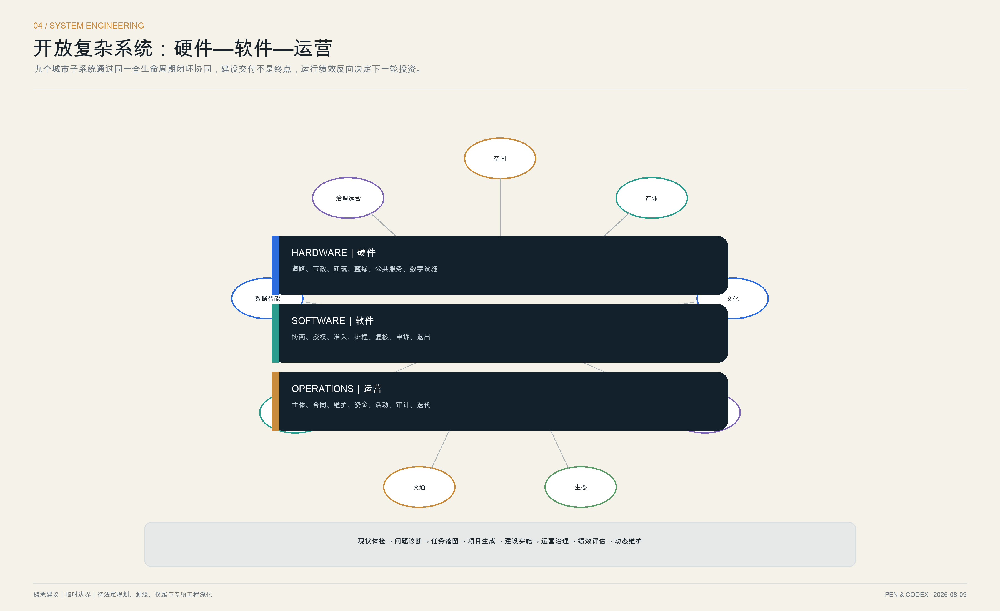

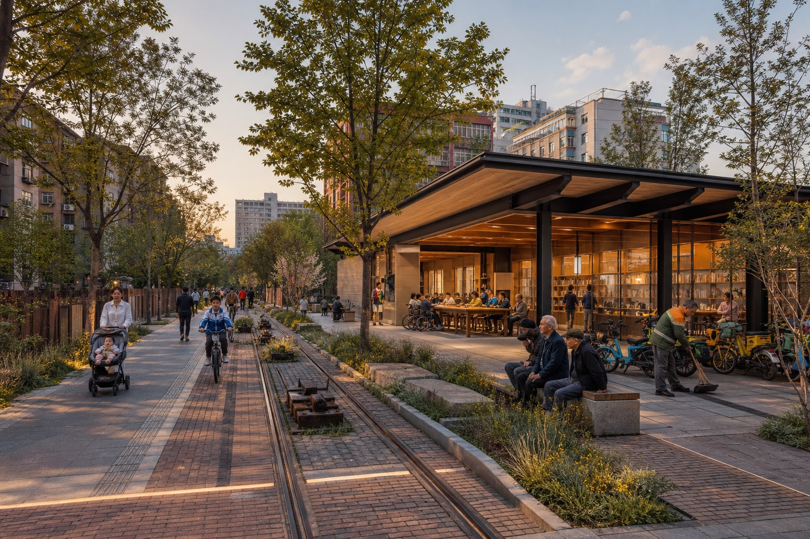

图 2-2　社区接口概念效果图。重点表达“空间工程 + 服务运营”的结合方式；并非现场照片，具体建筑、树木和设施须在测绘与方案深化后落位。

### 2.9 从总体目标到八个工程包

为避免方案停留在概念层，后续设计、立项与招采统一按照八个工程包组织：

| 工程包 | 主要建设内容 | 必须同步交付的运行文件 | 对应问题 |
|---|---|---|---|
| EP-01 廊道贯通与横向缝合 | 主轴、社区入口、路口、桥下、跨环路预可研、连续无障碍 | 断点台账、绕行方案、管护边界图 | ISS-01、ISS-04 |
| EP-02 公交慢行与末端交通 | 轨道接驳、B+R、共享停车、配送驿站、路口微改 | 路权时段、装卸规则、安全巡检 | ISS-01、ISS-02、ISS-04 |
| EP-03 完整社区与市政更新 | 管线、电梯、消防、无障碍、嵌入式服务、全龄空间 | 居民协商纪要、资金与维护协议、工单机制 | ISS-02、ISS-03 |
| EP-04 既有建筑与共享首层 | 结构加固、节能改造、可拆分单元、开放首层、适应性再利用 | 空间准入、开放时段、租金与运营规则 | ISS-02、ISS-05 |
| EP-05 蓝绿韧性与公共空间 | 雨洪调蓄、透水铺装、树荫、生态缓冲、夜间照明 | 生态养护、极端天气和夜间安全预案 | ISS-01、ISS-02、ISS-03 |
| EP-06 公共问题账本与参与机制 | 线下服务台、公开界面、人工复核和应急接口 | 权责清单、数据字典、异议与退出流程 | ISS-03、ISS-06 |
| EP-07 开放测试与成果转化平台 | 共享实验室、沙盒街段、概念验证与发布空间 | 测试标准、数据授权、事故复盘、采购或退出程序 | ISS-05、ISS-06 |
| EP-08 实施统筹、商业运营与资金 | 实施单元、运营团队、年度活动和评估机制 | 全寿命成本、合同 KPI、审计和滚动投资计划 | ISS-01—ISS-06 |

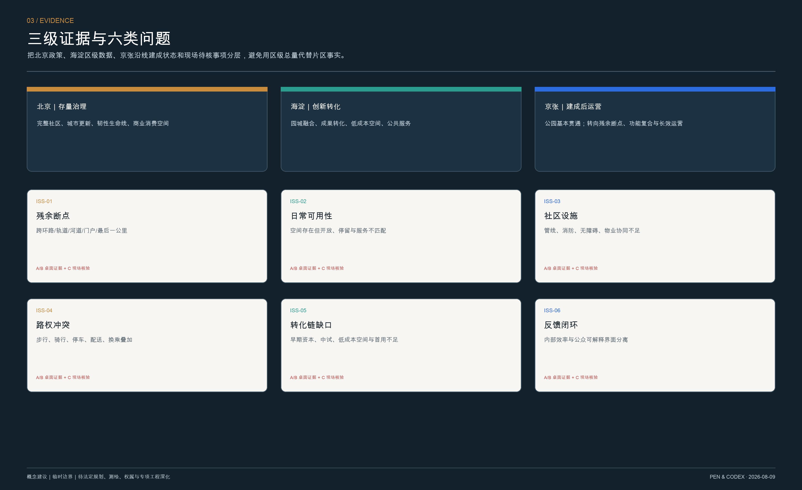

## 3. 总体概念、命名与视觉识别

### 3.1 核心叙事

总体概念为 **“一脊三带·开放共生”**。京张遗址公园是空间上可连续感知的绿色文化脊；文化、生活体验、融合创新三带并非三条平行用地，而是叠合在同一条城市剖面上的三套服务系统。京张铁路的“自主”不是封闭，而是让知识成为可持续的公共能力；开源城市智能的“开放”也不是无边界，而是让规则、接口、责任和证据都可见。二者构成三段百年叙事：

1. **自主建造**：以铁路工程连接城市与国家；
2. **开放协作**：以中关村创新网络连接人才与产业；
3. **可信共治**：以城市智能体连接公共问题、测试空间和人类责任。

### 3.2 品牌与命名体系

正式主名为 **“百年京张·开源智基”**，英文为 **“Centennial Jing-Zhang Open Intelligence Commons”**；面向公众和国际传播的短名为 **“开源京张｜OPEN JING-ZHANG”**。名称层级保持“总品牌—三带—三区—空间组件—活动品牌”五级，既保留任务书法定称谓，又让市民能够理解和记忆：

| 层级 | 中文名称 | 英文名称 | 主要用途 |
|---|---|---|---|
| 总品牌 | 百年京张·开源智基 / 开源京张 | Centennial Jing-Zhang Open Intelligence Commons / OPEN JING-ZHANG | 方案、门户、国际传播 |
| B-CULT | 京张文脉｜百年京张文化带 | Heritage Line | 遗产、档案、导视、文化活动 |
| B-LIFE | 京张日常｜都市 AI 生活体验带 | Everyday AI Line | 社区服务、慢行、商业、全龄体验 |
| B-INNO | 京张智创｜AI 融合创新带 | Fusion Innovation Line | 高校转化、试验平台、AI+场景 |
| Z1 / Z2 / Z3 | 众智园 / 北京 AI 原点社区 / 大钟寺 | Zhongzhiyuan / Beijing AI Origin Community / Dazhongsi | 重点区法定称谓优先，副标题用于传播 |
| 组件 | 开放轨、开放站、开放接口、真实信标、贡献里程 | Open Rail / Station / Interface / Truth Beacon / Contribution Mile | 公共空间、导视、设施及数字界面 |
| 活动 | 开源京张季、开放轨道周、百年共创夜 | Open Jing-Zhang Season / Open Rail Week / Centennial Commons Night | 年度运营与国际交流 |

Logo 由两条相向延伸的轨线构成字母 **J / Z**，三个节点分别代表文化、生活和创新，中央留白形成“开放接口”。标准色为铁路炭黑 `#14212B`、世纪铜金 `#C98B3C`、生活青绿 `#2A9D8F`、创新电蓝 `#2D6CDF`；图面使用开源可再分发的 Noto Sans 字族，禁止未经授权使用企业标识。Logo 安全区为符号高度的 1/4，印刷最小高度 12 mm，屏幕最小高度 32 px；深色底使用反白版本，禁止拉伸、旋转、描边和任意改色。

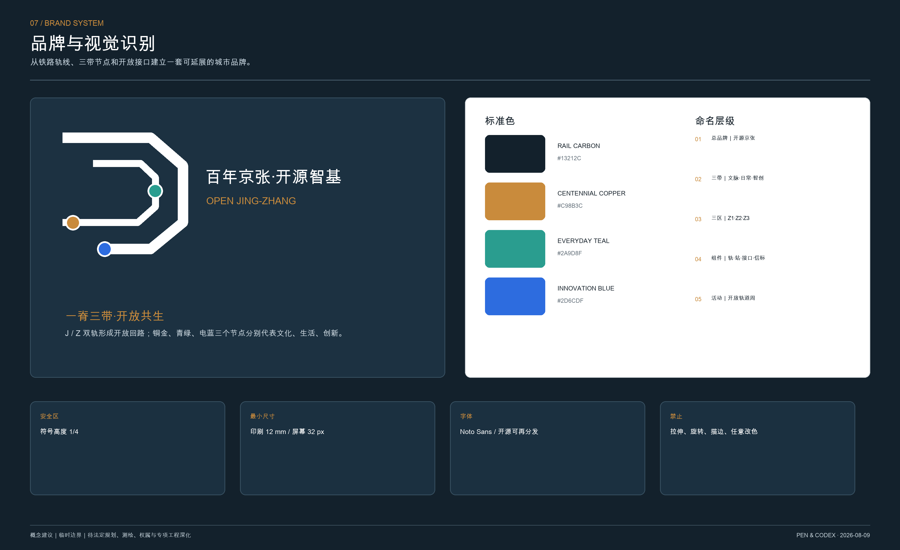

### 3.3 三大定位、五大功能与三区两翼的协同回路

三大定位按照任务书原文完整回应：**百年京张文化带**负责文脉赓续与活态利用，**都市 AI 生活体验带**负责完整社区、慢行商业与全龄体验，**AI 融合创新带**负责科研转化、产业测试和 AI+公共场景。五大功能不是口号，而是由空间载体和运营机制共同支撑 [source:AGENT-TASKBOOK] [standard:PROJECT-AGENT-OPEN-CALL-TASKBOOK]：

| 五大功能 | 主要空间载体 | 运行机制 | 牵引区域 |
|---|---|---|---|
| AI 全栈自主创新体系 | 众智园可信测试环、算力与适配节点 | 统一基准、红队评测、模型卡、标准输出 | 众智园 + 中关村科技服务翼 |
| 世界级 AI 创新生态 | AI 原点转化栈、共享工坊、开放首层 | 项目挖掘—概念验证—中试—首试首用—产业化 | AI 原点 + 中关村科技服务翼 |
| AI+ 场景赋能新范式 | 小月河沿线沙盒、社区与公园节点 | 场景清单、数据授权、人工复核、退出复盘 | 小月河场景赋能翼 |
| 智能化 AI 活力城市 | 京张日常线、大钟寺消费商务门户 | 公共服务保底、市场运营、昼夜活动、收益反哺 | 大钟寺 + 小月河场景赋能翼 |
| AI 治理全球话语权 | 公共问题账本、可信评测、国际交流厅 | 公开协议、独立审计、标准共创、双语传播 | 众智园 + 三带全域 |

“三区两翼”采用任务书正式名称：**AI 原点社区**承担世界级创新生态和转化核心，**众智园 AI 自主创新加速区**承担全栈自主体系和治理标准，**大钟寺 AI 产业聚集区**承担智能原生新业态；**中关村科技服务翼**向西连接高校、科研院所、资本与专业服务，**小月河场景赋能翼**向东连接公园、社区、城市服务与真实应用。工作流从中关村翼输入人才、成果、资金和服务，经三区完成验证与转化，再由小月河翼开放真实场景和公众评价，运行数据回到标准、资本和下一轮研发，形成“要素输入—研发验证—城市试用—公众评价—标准输出”的闭环。

## 4. 三层范围工作框架

本方案把公告的尺度差异转化为相互嵌套的工作机制 [depth:three_level_scope_framework] [depth:overall_spatial_structure]：

| 层级 | 公告约规模 | 本方案角色 | 主要成果 |
|---|---:|---|---|
| 统筹研究范围 | 43.6 km² | 产业、人才、案例与未来城市机制研究 | 开源创新生态、跨区协作接口、年度运营框架 |
| 总体设计范围 | 11.4 km² | 城市更新与控规深度的概念城市设计 | 一轴三站两翼、用地能力、慢行蓝绿系统、更新项目库 |
| 重点区域 | 368.4 ha | 三处可实施原型的详细设计 | 众智园、AI 原点、大钟寺的空间结构和首期场景 |

正式公告明确项目位于海淀区：统筹研究范围北至北五环、南至西直门外大街、西至万泉河路、东至京藏高速；总体设计约 11.4 平方公里；众智园、AI 原点社区、大钟寺公告面积分别约 192.1、104.3、72.0 公顷 [source:OFFICIAL-ANNOUNCEMENT]。西城区仅作为北京北站—西直门南端门户协同，昌平区仅作为北部通勤和创新联系协同，均不改写项目行政范围。

总体设计以京张绿色文化脊统领，而不是把三处重点区做成互不相干的园区。众智园回答“AI 是否可信”，AI 原点回答“创新如何转化”，大钟寺回答“技术如何进入日常消费、商务和文化体验”；两翼把主轴接入高校、社区、研发园区和公共服务。空间数据详见 [data:geometry/site_boundary.geojson#SITE-001] 与 [data:geometry/key_areas.geojson#PROV-KEY-001]。

总体规划图叠加开放街图道路、轨道、水系、公共设施与科研教育资源，只作为地理语境；方案边界仍采用仓库临时多边形并以虚线表达，所有重点区、项目节点和策略廊道均为概念建议 [source:OSM-CONTEXT-20260809] [source:BOUNDARY-SOURCE]。

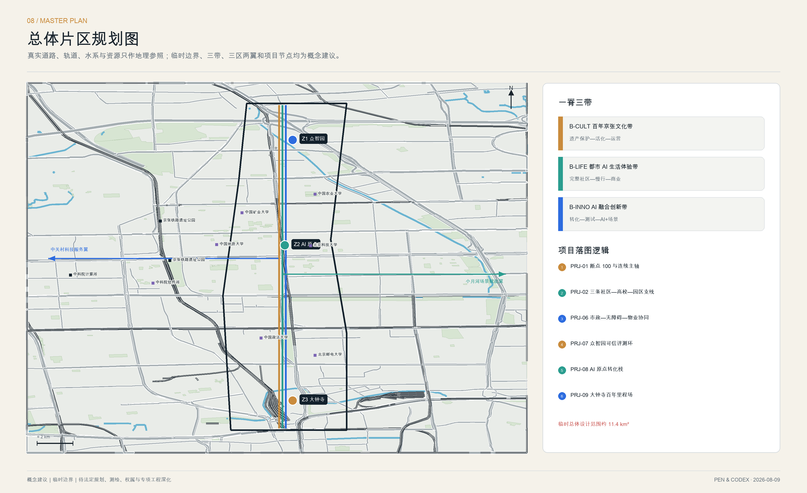

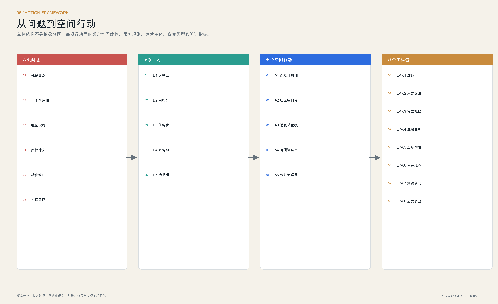

## 5. 统筹研究范围产业与未来城市研究

### 5.1 可迁移机制，而非照搬形态

国际案例仅用于提取运营和空间机制，不作为北京法定规划控制依据。各案例的事实来源与可迁移内容逐行对应：

| 案例 | 可迁移机制 | 京张转译 |
|---|---|---|
| 新加坡 one-north [source:CASE-ONE-NORTH] | 研发、创业、生活和试验场混合，公共机构持续运营 | 三站不是单一办公园，而是“研发—测试—生活—传播”的连续环境 |
| 剑桥 Kendall Square [source:CASE-KENDALL] | 轨道、公共空间、混合功能与创新空间耦合 | 以站点和慢行优先组织开放首层、创业空间与社区服务 |
| 伦敦 Knowledge Quarter [source:CASE-KQ-LONDON] | 以成员网络、共同品牌和项目协作组织分散机构 | 建立跨高校、园区和社区的“京张开放成员网络” |
| 巴黎 STATION F [source:CASE-STATION-F] | 把创业项目、服务、活动和展示叠合在同一平台 | 在 AI 原点社区设置可拆分的协作栈和公共发布厅 |
| 多伦多 MaRS [source:CASE-MARS] | 以主题化枢纽、导师服务和活动链接行业 | 在众智园形成安全、标准、算力和转化服务的共享枢纽 |
| 首尔 DMC [source:CASE-SEOUL-DMC] | 内容、媒体、AI 与数据产业和公共首层互促 | 在大钟寺形成技术体验、国际交流与文化传播门户 |

案例转译遵循三条边界：只吸收“混合功能、成员网络、共享服务、场景测试、长期运营”等机制；不复制国外强度和建筑形态；不把案例机构写成已建立合作。每项机制必须经过北京规划、文保、数据安全、公共财政和社区接受度检验后才可进入项目库。

### 5.2 沿线资源图谱与中关村科技服务翼

官方 2021 年规划解读显示，京张公园辐射约 14 平方公里范围内分布近 20 所高校和科研院所，该数字仅作为历史结构基准，不替代 2026 年逐项普查 [source:JINGZHANG-PLANNING-2021]。本轮利用公开名录和 OSM 语境数据识别北京交通大学、北京邮电大学、北京航空航天大学、北京科技大学、中国政法大学学院路校区、中国矿业大学（北京）、中国地质大学（北京）、中国农业大学东校区及中科院计算技术研究所、软件研究所等候选接口；名称和位置须在正式深化时由主管单位与权属方复核 [source:OSM-CONTEXT-20260809]。

资源统筹不以“画一圈连接线”结束，而建立“资源本底—能力标签—空间接口—合作机制—项目落位—验证指标”六步清单：

| 资源类型 | 能力标签 | 京张空间接口 | 概念合作机制 | 验证指标 |
|---|---|---|---|---|
| 高校与科研院所 | 原始创新、人才、仪器、伦理与学术评审 | 校门前场、共享教室、概念验证单元 | 一校一组一专属空间；开放课题与联合导师 | 可开放设备时数、项目配对数、跨机构复现率 |
| 中科院及专业研究机构 | 算法、系统软件、可信评测、行业模型 | 众智园测试环、AI 原点转化栈 | 共同基准、评测服务、研究成果路演 | 测试周期、问题关闭率、标准/工具输出 |
| 中关村园区与科技服务 | 技术转移、法务、知识产权、资本、国际网络 | 中关村科技服务翼与三站服务前台 | 服务券、联合尽调、投前测试、国际软着陆 | 服务响应时长、验证后融资/采购转化 |
| 社区、学校、医院与公园 | 真实需求、公共场景、用户反馈 | 小月河场景赋能翼、十二场景节点 | 小切口场景清单、有限时空沙盒、公众验收 | 服务可用性、满意度、异议与退出完成率 |
| 企业与开发者 | 产品、工程、开源工具、运营能力 | 可负担工作室、首试街段、开放发布厅 | 场景挑战、开源贡献、采购或退出 | 开源复用数、场景达标率、持续运营月数 |

海淀科技成果转化政策已明确早期资本、中试熟化、低成本转化空间和常态化协调仍有短板，方案据此把中关村科技服务翼定义为“可被项目逐项调用的服务总线”，而非新的封闭园区 [source:HAIDIAN-TECH-TRANSFER-2026]。

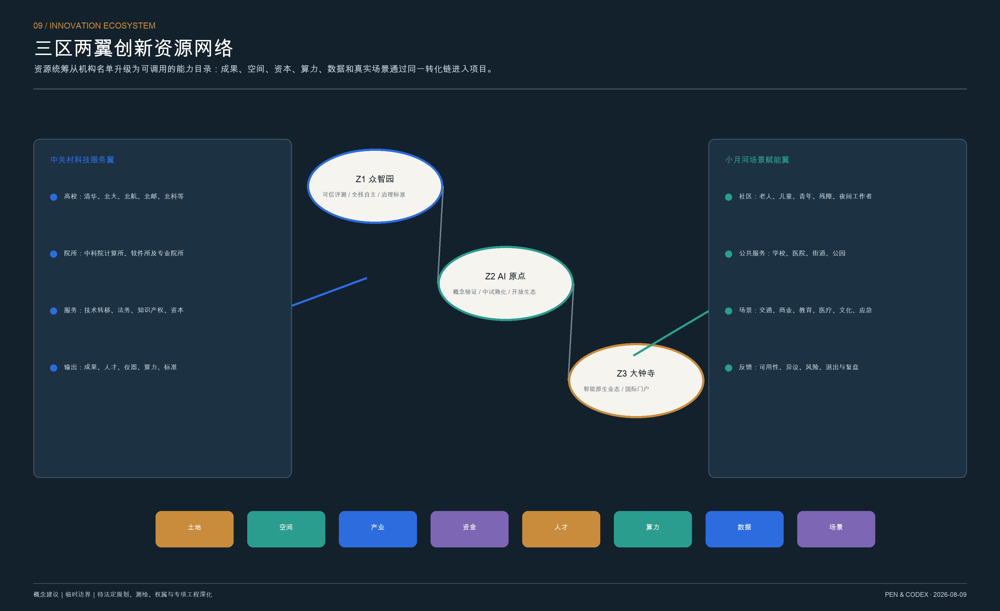

### 5.3 “开源智基”八类共同资源

产业生态不以“企业数量”作为唯一目标，而以任务书要求的 **土地、空间、产业、资金、人才、算力、数据、场景** 八类要素能否持续协同来衡量：土地提供依法更新的空间载体，空间提供可负担和可拆分单元，产业形成上下游和专业服务，资金覆盖概念验证到首试首用，人才通过跨机构网络流动，算力分级供给，数据依法授权，场景提供真实验证。海淀规划提出专业研发服务、共享仪器、委托检测、产业数据集和标准测试集，为“开源智基”提供政策依据 [source:HAIDIAN-14FIVE]。

每类资源建立公开目录、准入规则、维护责任、计费或补贴方式和退出机制。公共投入优先建设可复用接口、公共底盘和安全能力；市场服务在接口之上竞争，但不得垄断基本公共能力。八要素按“一项目一资源包”配置，避免项目在不同部门之间自行寻找空间、算力、数据和场景。

建议成立“京张开源智基理事会”：公共部门负责底线与审计，社区代表拥有议题提出权，专业机构负责测试和风险评估，高校与企业贡献工具和培训，独立观察员发布年度透明度报告。理事会不替代法定决策，只负责场景治理和公共协议维护。

### 5.4 从科技成果到城市价值的六级转化链

1. **问题入库**：社区、园区和公共部门共同发布真实问题，先确认公共价值、数据边界与责任人；
2. **概念验证**：高校和初创团队使用合成、脱敏或授权数据完成小规模验证；
3. **共享测试**：在众智园使用统一基准、红队和安全标准验证可靠性；
4. **有限试点**：进入 AI 原点或沿线节点，以明确时段、范围、人工兜底和停止条件运行；
5. **产业化落地**：通过公开采购、市场订单、专业运营或技术许可形成持续服务，并明确公共资产和知识产权边界；
6. **规模化或退出**：达标场景输出标准和开源工具，风险或效益不达标场景公开复盘、恢复场地并退出。

这条链直接对应 ISS-05“成果转化不足”和 ISS-06“治理反馈不透明”，也把社区从被动体验者变成问题提出者和验收者。

### 5.5 区域创新协同

京张不自我封闭：向北通过清河、北五环与北纬社区、未来科学城建立人才居住和通勤协同；向东北连接怀柔科学城的重大科技设施与原始创新；向东南连接北京经开区的工程化和规模制造；向西南依托中关村科技服务翼连接海淀核心创新资源；面向京津冀输出可信评测、开放场景和可复用标准。所有关系均为协同方向，不代表相关主体已承诺合作。区域协同的成果形式不是新增大型园区，而是项目目录、通用接口、联合测试、人才短驻和标准互认。

## 总体设计范围城市更新与控规深度城市设计

本章以第 2 章归纳的六类问题组织城市更新，不以概念分区替代现状证据或法定控规。

### 6.1 用地能力而非虚构控规

拓扑连续的概念用地分区见 [data:geometry/land_use.geojson#LAND-USE] [depth:land_use_layout]。每个分区采用可校验的 `land_use_code`，品牌化用途以附加能力表达：开源研发与转化、教育科研协作、社区公共服务、创新服务与智能原生商业、人才生活、文化传播及公园绿地。其目的，是校验各类能力是否在一条步行与轨道可达的连续系统中，而非宣布法定地类或权属调整。

概念建筑原型见 [data:geometry/buildings.geojson#BUILDINGS]。14 个原型控制“首层开放、尺度可分、存量优先、沿轴成组”的形态逻辑；由于批准容积率、限高、密度、退线、日照、消防及文保条件均未提供，容积率和建筑高度保持未知，不填写伪精确值 [depth:development_intensity_controls] [depth:height_massing_character]。

### 6.2 拆改留方法

在完整现状调查前，不给任何真实建筑下达拆除结论 [depth:retain_renovate_demolish]。后续采用四步决策：先识别历史和社会价值，再做结构与碳排评估，再检查功能适配与公共性，最后比较保留、修缮、加建、替换的全寿命成本。当前图中的建筑仅是体量和场景原型，其占地 [metric:building_footprint_area_sqm] 与数量 [metric:design_prototype_count] 用于方案内部复核。

道路和连接线见 [data:geometry/roads.geojson#ROADS]，蓝绿及公共空间见 [data:geometry/green_space.geojson#GREEN-SPACE]、[data:geometry/public_space.geojson#PUBLIC-SPACE]。它们均为概念网络，不代表道路红线、管线走廊或工程方案。

### 6.3 五个空间行动包

| 行动包 | 解决问题 | 空间对象 | 实施原则 |
|---|---|---|---|
| A1 连续开放轴 | ISS-01、ISS-04 | 9 公里慢行、公园入口、轨道接驳、跨环路节点 | 先审计断点，再做轻量微改；桥隧工程另行论证 |
| A2 社区接口带 | ISS-02、ISS-03 | 围墙边界、老旧小区首层、口袋空间、配送与停车 | 一街一策、全龄友好、分时共享、物业共管 |
| A3 近校转化栈 | ISS-05 | 高校周边低效楼宇、共享工坊、概念验证空间 | 低成本、小单元、可拆分、运营前置 |
| A4 可信测试网 | ISS-05、ISS-06 | 众智园、三站节点、公共场景沙盒 | 合成数据优先、红队测试、人工接管、可退出 |
| A5 公共治理层 | ISS-03、ISS-06 | 社区议事站、问题账本、公共状态牌 | 不另建孤岛平台，与现有接诉即办和责任规划师机制衔接 |

### 6.4 三带叠合的总体设计

**百年京张文化带｜京张文脉。** 采用“原物保护—环境整治—适应性利用—数字解释—公众共创—年度运营”六段链条，串联北京北站、历史线路、清华园车站、桥涵与轨道构件、沿线科研教育史和中关村创新史。真实遗存是主角，数字解释是辅助；禁止仿古复建、主题公园化和以商业覆盖文物价值。清华园车站保护范围与建设控制地带必须在取得正式 GIS 线后叠加，未校核前不提出紧贴站房的新建或地下工程 [source:TSINGHUA-STATION-CONTROL]。

**都市 AI 生活体验带｜京张日常。** 以 15 分钟生活圈和“无界连通的城市首层”组织公园、社区、校园、园区、医院和商业。南北主轴提供连续步行骑行，东西接口把居民送到公园、轨道和公共服务；公厕、饮水、遮荫、座椅、母婴、无障碍、雨天通行、夜间照明、配送和应急避难作为基础设施同步设计。AI 只在需要时出现，以导航、翻译、无障碍辅助、设施报修和服务匹配改善体验，不以持续监控换取便利 [source:HAIDIAN-URBAN-RENEWAL-GUIDE]。

**AI 融合创新带｜京张智创。** 以“云—网—数—智—边—端”数字基础设施连接“项目挖掘—概念验证—中试熟化—首试首用—产业化—规模化/退出”空间链。AI+场景覆盖科研转化、医疗、教育、商业、交通、公园运维、能源、文化和应急；每项场景写明用户、痛点、空间、数据、建设主体、运营主体、指标、人工接管与退出条件 [source:BEIJING-AI-EMPOWERMENT-2025]。

三带共享同一空间但采用固定制图色、项目编码和绩效：文化带看遗存保护、档案开放和活动参与；生活体验带看连续可达、服务公平、停留与消费活力；创新带看验证周期、资源共享、场景达标和标准输出。任何建设项目至少同时服务两带，重点项目应服务三带，避免文化、民生和产业各自建设。

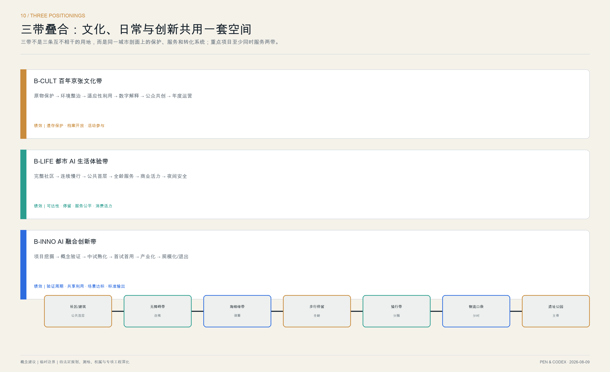

## 重点区域详细设计

三片区以各自的公共问题为出发点，并共享同一套治理协议 [depth:three_key_area_detailed_design] [metric:key_area_count]。

### 7.1 众智园：安全与标准站

**定位**：AI 自主创新加速与可信评测门户，对应临时范围 PROV-KEY-001 [data:geometry/key_areas.geojson#PROV-KEY-001]。

**问题起点**：北部片区需要提升对外交通、园区—社区界面和清河蓝绿联系，同时海淀缺少可共享的标准测试、全栈适配与安全验证中间平台 [source:JINGZHANG-OPEN-CALL] [source:HAIDIAN-WORK-REPORT-2026]。现阶段这些是片区级任务，具体到地块的空置率、权属和生态条件仍需核验。

**空间结构**：一条“可信环”串联测试工坊、算法透明厅、开放算力驿站和员工—居民共享花园；沿街首层布置可被看见的测试空间，中部保留安静研发庭院，边缘设置物流与安全缓冲。

**更新方法**：优先改造大开间存量建筑；以可逆隔断容纳不同尺寸团队；新增体量退让主轴，并以连廊共享会议、设备和展陈。

**首期场景**：城市智能体可信评测场、机器人开放街段。每次测试公布目标、数据字段、责任人、停止条件和事故复盘；高风险测试只在封闭时段和物理边界内进行。

**首期行动**：先完成清河—园区—社区步行审计和存量空间清单；再以一处既有建筑试建“共享测试大厅 + 标准实验室 + 社区观察席”；最后评估是否扩展到全栈适配基地。验收重点不是参观人数，而是共享设备时数、测试复现率、安全问题关闭率和社区异议响应时间。

### 7.2 北京 AI 原点社区：协作与转化站

**定位**：开放协作、青年学习、创业转化与社区共同治理的核心，对应临时范围 PROV-KEY-002 [data:geometry/key_areas.geojson#PROV-KEY-002]。

**问题起点**：高校原创成果到企业应用存在“最近一公里”，校区、园区和社区之间还存在慢行与开放界面不足；同时青年需要低成本工作空间和生活服务，周边居民需要日常服务而非一次性科技展 [source:HAIDIAN-14FIVE] [source:HAIDIAN-URBAN-RENEWAL-ACTION]。

**空间结构**：“开放桌”广场为共享客厅，四周形成发布厅、原型工坊、青年可负担工作室、社区服务站和沿轨慢行界面；南北向街巷把主轴连接到周边生活区。

**更新方法**：把低效首层改造成小尺度、低门槛、长时段开放空间；保留可识别的工业构件和铁路材料，新增部分以轻型、可拆卸结构介入。

**首期场景**：多模态公共服务沙盒。居民用文字、语音或图像提出问题，智能体只给出可追溯建议，值班人员负责确认、转办与纠错；公共界面明确显示“机器建议/人工决定”。

**首期行动**：以 300—800 平方米可拆分空间为概念验证单元，以沿街 50—150 平方米空间为社区服务和首发单元；建立“高校成果—社区问题—概念验证—有限试点”的季度配对机制。面积为原型区间，不是地块指标；落位须在房屋安全、消防、权属和运营测算后确定。

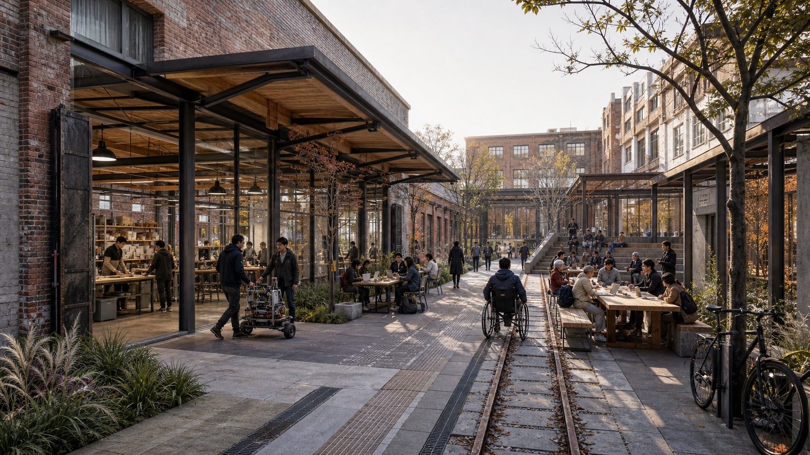

图 7-2　AI 原点协作与转化庭院概念效果图。重点表达适应性再利用、可拆分空间和公共首层之间的关系；并非现场照片或确定性建筑方案。

### 7.3 大钟寺：体验与国际站

**定位**：面向公众的 AI 体验、京张文化叙事和全球开源交流门户，对应临时范围 PROV-KEY-003 [data:geometry/key_areas.geojson#PROV-KEY-003]。

**问题起点**：南端受北三环、京包路、知春路、13 号线和多类城市界面叠加影响，控规公众意见已涉及多处立交和道路衔接；沿线明光村、笑祖塔等更新也显示社区公园、噪声、违停和历史记忆需要同时处理 [source:JINGZHANG-CONTROL-FEEDBACK] [source:JINGZHANG-XIAOZUTA-2025]。

**空间结构**：“百年里程场”串联京张记忆廊、开放发布厅、城市体验馆、国际交流庭院和社区公园；靠近轨道的一侧加强声环境缓冲，面向城市一侧形成全天候公共首层。商业以轨道门户、社区日常、科技体验和夜间文化四类界面分层，不在公园中心摊大饼式铺设商业。

**更新方法**：以公共性和文化连续性为第一标准，优先保留可承载记忆的构件；新体量保持可识别的当代性，但不复制历史样式。

**首期场景**：京张记忆 Agent、智能原生消费实验室与 Open Rail Week。消费实验室允许零售、餐饮、文创和服务企业在明确区域、明确时段测试智能导购、无障碍交互、机器人服务和数字产品护照；默认不做人脸画像，不设置差别定价，现金和人工服务始终可用。历史问答显示出处和不确定性，口述史必须取得授权；国际活动须留下开源工具、教学材料或公共设施，而不仅是一次性展会。

**首期行动**：先做大钟寺站—北三环—笑祖塔—北京北站方向的行人路径和四象限换乘审计，形成近端微改造与远期工程两张清单；同步试点“百年里程场 + 社区共享厅 + 夜间安全路径 + 可变商业首层”。任何跨环路、桥隧或轨道工程只进入预可研，不在本方案中宣称可行。商业落位前必须补做 7×24 小时客流、业态、租金、空置、配送、经营成本和居民需求调查。

三重点区采用同一设计深度检查表：

| 重点区 | 主导功能 | 首期空间原型 | 核心 AI 场景 | 商业/公共性 | 先决资料 | 首期验收 |
|---|---|---|---|---|---|---|
| Z1 众智园 | 全栈自主 + 治理标准 | 可信环、共享测试大厅、社区观察席 | 可信评测、机器人开放街段 | 测试服务收费；公共观察与标准开放 | 权属、存量建筑、清河生态、物流安全 | 复现率、停测响应、共享设备时数 |
| Z2 AI 原点 | 世界级生态 + 成果转化 | 开放桌、转化栈、可负担工作室 | 多模态服务、学习公社、开放发布 | 低租金小单元 + 社区免费服务 | 房屋安全、消防、租赁、校地开放协议 | 配对数、验证周期、开放时数 |
| Z3 大钟寺 | 智能原生业态 + 国际门户 | 百年里程场、可变首层、夜间路径 | 智能消费、文化 Agent、国际活动 | 市场商业反哺文化与公共空间 | 客流租金、交通界面、文保与声环境 | 停留时长、复访、公共收益回流 |

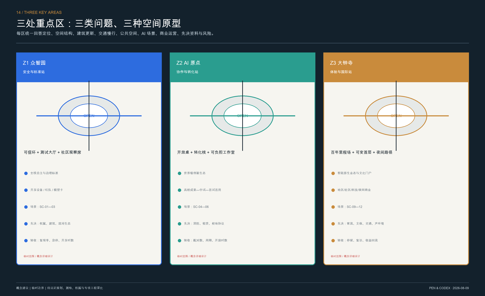

## 8. AI 创新生态、人才画像与 AI+ 场景

### 8.1 六类共同建设者

1. **研究人员与学生**：需要跨机构设施、数据和真实问题，也需要清楚的伦理边界；
2. **开源开发者**：需要短期驻留、测试接口、同行评审与可见的贡献记录；
3. **初创团队**：需要可负担空间、算力、导师、首个公共场景和采购路径；
4. **成熟企业与投资者**：需要标准验证、产业协同和长期责任，而非封闭展示厅；
5. **居民**：儿童、老人、残障人士和普通劳动者都需要易懂服务、人工兜底和退出权；
6. **访客**：需要把复杂技术转化为可体验、可质询的城市故事。

### 8.2 十二张场景卡与场景—空间—运营映射

每张场景卡固定回答十一个问题：使用者、现实痛点、空间载体、AI/IoT 能力、数据来源、建设主体、运营主体、人工接管、验证指标、安全边界、退出条件。下表是进入详细设计前的最小可执行版本：

| 编码 / 场景 | 用户与痛点 | 空间 / 能力 | 数据与边界 | 建设 / 运营 | 验证与退出 |
|---|---|---|---|---|---|
| SC-01 可信评测场＊ | 研发与采购方难以比较系统可靠性 | Z1 共享测试大厅；基准、红队、模型卡 | 合成/脱敏数据优先；测试集分级授权 | 科技主管/场地方；独立评测机构 | 复现率、缺陷关闭率；不可解释或高风险即停测 |
| SC-02 机器人开放街段＊ | 企业缺真实复杂环境，行人担忧安全 | Z1 限时封闭街段；定位、避障、调度 | 不做人脸识别；原始影像边缘删除 | 场地方/安全设施；持证运营与现场安全员 | 人工接管时延、冲突数；越界或急停失败即退出 |
| SC-03 城市智能体联调沙盒＊ | 多部门接口难在真实部署前验证 | Z1 联调室 + 小范围数字沙盒；Agent 编排 | 使用仿真、公开或依法授权数据；无自动执法 | 数据/政务部门；专业测评 + 责任部门 | 工具调用正确率、越权率；权限穿透即封存 |
| SC-04 多模态公共服务 | 老人、外来者和残障人士表达需求困难 | Z2 线下服务站；语音、文字、图像辅助 | 最少字段、当次授权、分级留存 | 街道/服务站；值班人员 | 人工确认率、转办时长；误导基本权益即下线 |
| SC-05 AI 学习公社 | 学生和转岗者缺跨校课程与导师 | Z2 共享教室；学习助手、项目匹配 | 学习档案归本人，不自动淘汰 | 高校/场地方；导师与教育运营方 | 完成率、导师反馈；歧视性推荐即停用模型 |
| SC-06 健康服务导航 | 居民不清楚何处获得合适服务 | 社区节点；服务检索、无障碍导航 | 不诊断、不默认保存健康数据 | 卫健/服务节点；医务或社工转介 | 正确转介率、人工等待；越权诊断即退出 |
| SC-07 AI 慢行导航 | 路径连续性与无障碍信息不足 | 京张日常线；匿名拥堵、施工、无障碍提示 | 不追踪长期轨迹，位置数据端侧处理 | 交通/公园；专业运营 + 志愿审计 | 到达时间、错误指引数；安全路线失真即回退静态导视 |
| SC-08 无障碍共同审计 | 障碍点难被持续发现和闭环 | 三带公共空间；众包记录、工单匹配 | 明示同意，只记录设施不识别人 | 城管/街道；残障代表共审 | 问题关闭率、复核通过率；无责任主体则不公开承诺 |
| SC-09 智能原生商业 | 消费体验与隐私、公平之间冲突 | Z3 可变首层；导购、翻译、机器人、产品护照 | 禁止人脸画像和差别定价；保留现金人工渠道 | 产权方/商户；商业运营 + 消费者观察员 | 转化、复访、投诉；歧视或暗黑模式即撤场 |
| SC-10 京张记忆 Agent | 史料分散，公众难理解百年脉络 | 文化带记忆廊；知识图谱、双语讲解 | 只用清权史料，出处可追溯，口述史可撤回 | 文旅/文保；史学与社区共同编辑 | 引用准确率、纠错时长；史实争议未标注即下线 |
| SC-11 开放轨道周 | 开发者活动与城市真实问题脱节 | 三区联动；挑战赛、公开课、城市体验 | 数据按项目授权，不开放敏感底账 | 理事会/场地方；开发者社区运营 | 留存工具、后续项目数；无公共产出则不续办赛道 |
| SC-12 贡献里程 | 公共贡献不可见、不可纠错 | 沿线真实信标与数字档案；版本记录 | 仅展示自愿公开贡献，允许撤回 | 公园/社区；档案与社区委员会 | 纠错和撤回时长；权属不清内容立即隐藏 |

＊SC-01—03 是三项产业测试验证场景，只能在明确物理边界、明确时段、可急停和有人值守的条件下运行。SC-04—12 构成从中关村科技服务翼输入能力、经三区验证、沿小月河场景赋能翼进入公共体验的连续路线。所有场景坚持合法、正当、必要、数据最小化、分级授权、边缘处理、人工最终决定、日志审计、申诉与停止机制 [source:BEIJING-AI-EMPOWERMENT-2025]。

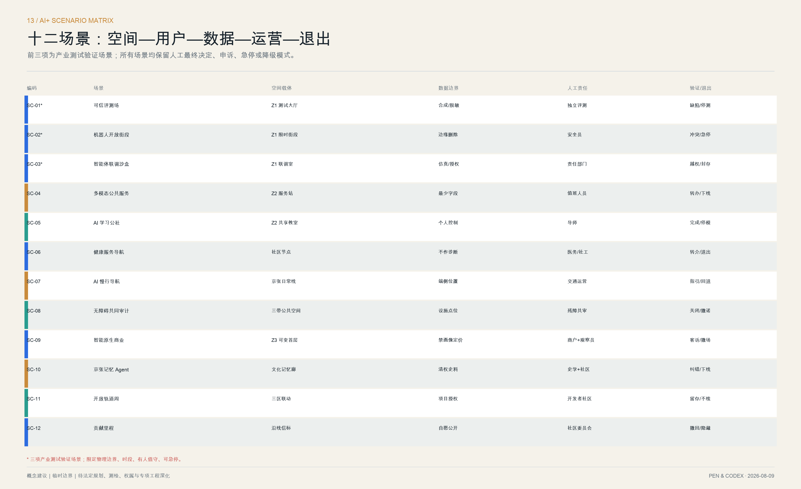

## 9. 用地、建筑规模与拆改留方案

本包的用地、建筑和面积数字用于内部一致性校核，而不是申报指标。临时总体边界的投影复算面积见 [metric:site_area_sqm]；概念建筑原型的占地总和见 [metric:building_footprint_area_sqm]；原型数量见 [metric:design_prototype_count]。这些数值均能从对应 GeoJSON 重算。

每个重点区的体量遵循三条共同原则：沿公共界面形成连续首层，内部保留可渗透庭院，新增体量不遮蔽历史识别线。具体容积率与高度不作数字承诺，待取得官方边界、现状测绘、权属、文保、航空、日照、消防和市政资料后，再开展地块级拆改留和强度比较。

## 10. 交通、轨道、市政与公共服务设施

### 10.1 慢行优先的开放移动网络

概念交通网络以京张主轴为连续骨架，以三条东西向“开放支线”连接社区、高校和产业片区 [data:geometry/roads.geojson#ROADS] [depth:traffic_rail_slow_parking]。步行、骑行及横向连接线的内部复算长度见 [metric:open_mobility_length_m]。所有线位都需在后续与轨道安全、道路红线、无障碍坡度、消防和产权出入口叠合校核。

停车采取“外围共享、内部减量、装卸分时”的原则；机器人测试不占用常态人行空间；每个关键路口同时提供视觉、触觉和声音提示。轨道节点承担跨区到达，主轴承担最后一公里，公共服务节点设置在 5—10 分钟步行可达的交汇处。正式设计前建立“断点 100”台账：每个点记录障碍类型、受影响人群、权属/管护主体、可逆微改方案、工程型方案、预算级别、关闭状态和复核日期。

### 10.2 地上地下统筹的市政生命线

基础设施采用“设施底账—风险诊断—协同更新—运行平台”四层方法，并落实规划、建设、运行、管理全生命周期数字化 [source:NATIONAL-RESILIENT-INFRA-2024] [depth:municipal_new_infrastructure]。当前没有管径、埋深、容量、权属、健康度和事故记录，故图面只表达系统类型、更新优先级与协调接口，不画成已确定线位或综合管廊。

| 系统 | 现状必须调查 | 概念建设动作 | 与公共空间/建筑接口 | 运营与韧性指标 |
|---|---|---|---|---|
| 给水 | 管径、压力、漏损、二次供水、水质 | 老旧管更新、分区计量、应急供水点 | 道路更新一次开挖；公共饮水与消防共享维护 | 漏损、低压事件、应急供水切换时间 |
| 雨水 | 易涝点、管渠标准、汇水分区、下凹空间 | 源头减排、过程调蓄、末端排放、溢流路径 | 雨水花园、透水铺装、可淹没活动场 | 积水深度/时长、调蓄有效率、恢复时间 |
| 污水 | 管径、混接错接、满管、泵站 | 雨污分流、混错接修复、重点节点监测 | 厕所、商业餐饮、更新建筑同步接驳 | 溢流事件、混接关闭率、泵站可用率 |
| 再生水 | 管网覆盖、水质、用户与季节负荷 | 绿化、道路冲洗、景观补水分级使用 | 公园养护和建筑中水接口 | 替代量、水质达标、断供降级模式 |
| 电力 | 变配电容量、峰谷负荷、双电源、老旧线缆 | 配电增容、微网、储能、充电有序接入 | 测试平台、商业、公园应急电源分级 | 峰值负荷、备用时长、孤岛运行成功率 |
| 燃气 | 年代、材质、调压、占压与报警 | 风险管段更新、可燃气监测、阀门分区 | 餐饮界面与施工协同，严禁感知替代巡检 | 报警响应、关断时间、占压关闭率 |
| 供热/能源 | 热源、热网平衡、建筑能耗、余热条件 | 建筑节能、热网调平、可再生能源和余热预研 | 更新建筑、能源站与公共空间统筹 | 单位面积能耗、故障恢复、可再生占比 |
| 通信与网络 | 光纤路由、5G 覆盖、运营商权属、盲点 | 多路由光纤、5G/物联网、韧性通信 | 真实信标、场景节点、应急广播共杆 | 可用率、时延、故障切换、盲点关闭率 |
| 环卫与固废 | 收运路线、桶站、商业垃圾、可回收物 | 分类投放、密闭收运、分时装卸、再利用工坊 | 商业后勤、社区入口、公园活动时段 | 满溢事件、分类质量、扰民投诉 |
| 消防与应急 | 消防水源、通道、登高面、避难场所 | 消火栓补点、通道清障、应急电源和物资点 | 公共空间兼作集合点，导视支持无网模式 | 到场时间、通道可用率、演练问题关闭率 |
| 综合协调 | 权属、标高、检修、近期项目与开挖计划 | “管路互随、管管同施”、地下管网一张图 | 道路、公园、建筑更新同步设计施工验收 | 二次开挖次数、数据移交率、工单闭环 |

设施底账至少记录权属、年代、材质、埋深、容量、健康度和事故；新增传感器与主体工程同步设计、同步施工、同步验收、同步投入使用。北京近期管线管理强调老旧小区与管线协同、竣工与传感数据同步移交，方案据此设置“每个实施单元一张综合管线协同图、一份年度开挖计划、一套应急切换表” [source:BEIJING-PIPE-LIFECYCLE-2025]。

### 10.3 “云—网—数—智—边—端”数字底座

云端提供公共算力和模型服务，网络提供光纤、5G、物联网和韧性通信，数据层建立目录、分级授权和可信空间，智能层提供行业模型与评测，边缘层处理低时延和敏感数据，终端包括机器人、传感器、真实信标和移动设备。不同层分别设安全域和责任人；网络失效时，照明、疏散、门禁、消防广播和基本人工服务必须独立运行。

数字设施遵循“可见接口、最小权限、边缘优先、人工接管”：公共 Wi-Fi、环境感知、边缘算力和应急电源集成进可开启检修的街道构件；公共界面显示用途、数据字段、保存周期、运营者和停止方式；不为“未来感”重复布设大屏，不建立与现有政务系统平行的孤岛平台。

### 10.4 公共服务与完整社区

以 15 分钟生活圈核查教育、医疗、养老、托育、文化、体育、公厕、菜店、便利店、社区食堂、青年学习和公共法律服务的容量、服务半径、开放时段与无障碍。基本保障类设施由公共责任兜底，品质提升类设施可通过委托运营和市场服务补充；学校、医院、园区、公园首层“可开放则开放”，但不得牺牲安全、教学医疗秩序或产权人合法权益。服务缺口必须用现场台账验证，不能用区级总量替代片区结论。

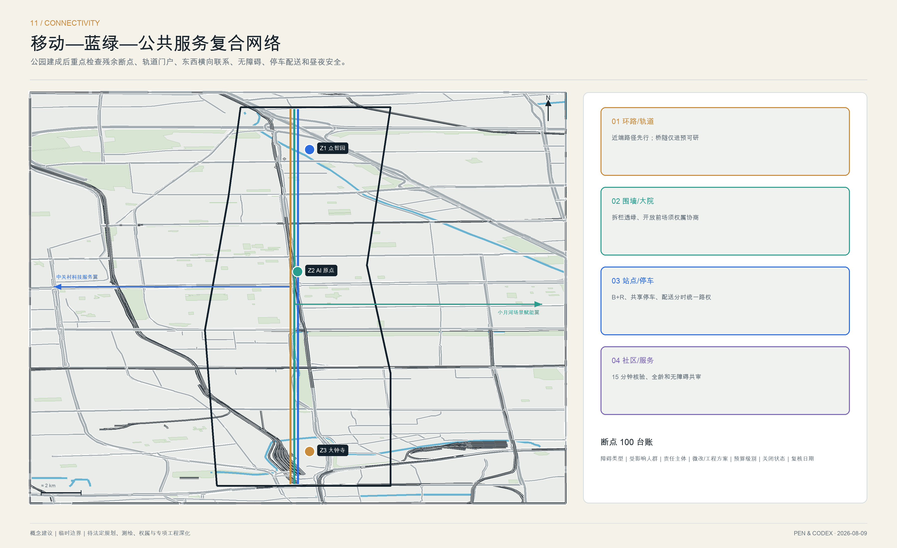

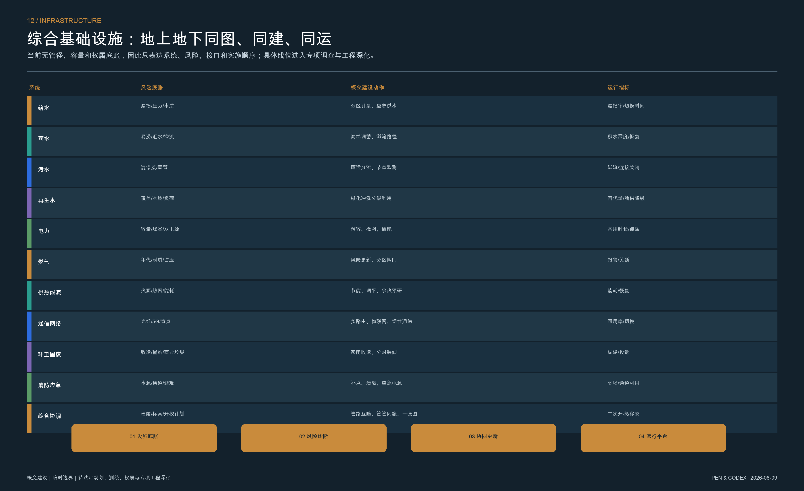

## 11. 蓝绿空间、公共空间与城市风貌

蓝绿系统将铁路边缘、既有绿地和社区公共空间组织成连续的“开放生态线” [data:geometry/green_space.geojson#GREEN-SPACE] [depth:blue_green_public_space]。临时边界内概念绿地比例见 [metric:green_ratio]，公共空间比例见 [metric:public_space_ratio]。两者功能可重叠，不能简单相加；待正式边界和现状地类到位后再复算。

### 11.1 蓝绿韧性与连续公共首层

空间设计以“主脊连续、横向可达、海绵分散、全龄共享”为原则：遗址公园主线保持步行、跑步、骑行相互可辨识；小月河、清河和口袋绿地承担生态与调蓄；东西向接口连接社区、园区、校园和轨道站；沿线首层通过拆栏透绿、开放前场和分时共享形成连续公共界面。任何拆墙、开放校园或占用绿地的建议都需权属、安全和生态论证，不作确定实施表述。

典型社区接口按从建筑到公园的顺序组织：可变开放首层—2.0 米连续无障碍带—树池/雨水花园—步行停留带—明确分隔的骑行带—物流与临停口袋—公园慢行主线。数值仅为概念净宽校核起点，须按现场红线、树木、消防和人流测算深化；夜间以低眩光分级照明保障主要路径，生态敏感区控制时段与色温。

### 11.2 公共空间组件与真实状态界面

公共空间采用五种可复制构件：

- **Open Table 开放桌**：供学习、评议和路演的共享长桌；
- **Edge Canopy 边缘雨棚**：串联轨道边界并容纳休息、导视和环境传感；
- **Quiet Dock 安静停靠点**：为老人、儿童、神经多样性人群提供低刺激空间；
- **Truth Beacon 真实信标**：显示场景运行状态、数据范围、责任人和停止按钮；
- **Contribution Tile 贡献铺装**：记录可撤回、可校正的公共贡献。

三处地标不是孤立雕塑，而是可参与的公共设施：众智园“自主之碑”讲述自主工程与可信标准；AI 原点“Open Commit Wall”把公开贡献转化为可检索的城市档案；大钟寺“Agent Milestone Field”用百年里程和当代协作事件构成时间场。文化叙事沿着“京张铁路—中关村创新—开源城市智能”展开，并明确事实、推断和公众记忆的不同证据等级。

每个构件必须提供无电模式、检修门、触觉与声音替代信息、数据说明和责任人。真实信标使用三种状态：绿色“常态服务”、铜色“有限试点”、红色“暂停/人工接管”；不得用装饰性动态屏制造虚假实时感。

### 11.3 活态遗产与文化叙事系统

文化资源分为四类台账：A 类原物与法定保护对象（站房、轨道、桥涵、构筑物）；B 类历史环境与可识别空间格局；C 类科研教育、中关村创新和社区生活记忆；D 类依法授权的口述史、档案和数字内容。A 类保护第一、最小干预；B 类维护空间关系；C/D 类通过展览、教育、公共艺术和活动活化。所有资源先核真、定权、定级，再决定展示或适应性利用。

文化线路采用“百年里程”编号，从北京北站门户、清华园车站及铁路遗存，到学院路科研教育记忆，再到众智园和 AI 原点的新型创新基础设施。导视同时显示年代、原物/复原/数字解释状态、来源和无障碍信息；国际传播主叙事为：**From a railway built with independent engineering to an urban commons maintained through open intelligence.** 文化商业只在不遮挡、不损害遗存且可反哺保护时进入，收益用途和维护责任公开。

### 11.4 城市风貌控制方法

风貌不规定一套“AI 建筑造型”，而控制六项关系：历史识别线、公共首层、体量分段、屋顶设备、夜景亮度、材料全寿命。既有建筑优先修缮和适应性再利用；新介入采用轻量、可逆、可识别的当代语言；沿公园体量保持细颗粒和可穿越界面；高耗能媒体立面、夸张异形和未经批准的企业标志不进入核心公共空间。

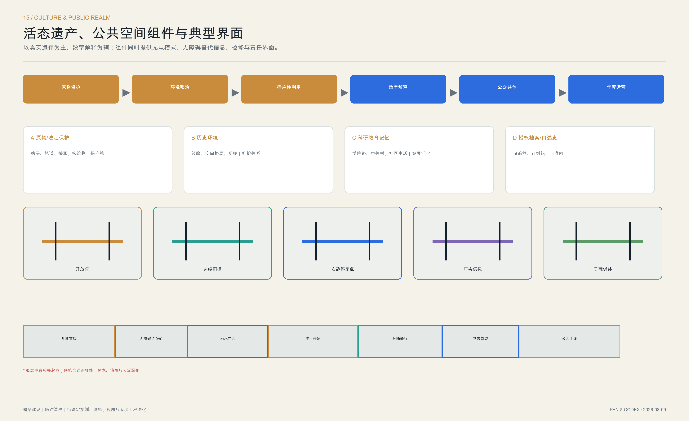

## 12. 更新项目清单、实施政策与分期计划

**从规划建议到建设运营。** 总体结构必须通过工程包进入项目库，再通过阶段关口逐步提高确定性。也就是说，概念方案阶段只回答“是否值得做、用什么系统方式做”；预可研和方案设计阶段才回答线位、规模、投资和工程可行性；施工交付之后还要经过运行验证，不能把“建成”直接等同于“问题解决”。

### 12.1 商业规划与公共价值回流

商业系统遵循北京商业消费空间“城市—地区—社区”层级和“烟火气、国际范、科技感”协同方向，但只提出业态与运营原则，不承诺租金、客流、收入或回本周期 [source:BEIJING-COMMERCIAL-PLAN]。空间上形成四级网络：大钟寺承担地区级科技消费与国际商务门户，AI 原点承担创新服务和青年社群商业，众智园承担生产性服务和员工配套，沿线社区接口承担便民生活与公园轻量服务。

| 客群 / 时段 | 基础需求 | 适宜业态 | 主要位置 | 公共性约束 |
|---|---|---|---|---|
| 居民 / 早晚与周末 | 早餐、菜店、修配、健康、亲子、养老 | 社区便民、生活服务、社区食堂 | 社区接口与大钟寺边缘 | 保留平价基本服务，不被活动商业挤出 |
| 学生与青年 / 午后夜间 | 学习、社交、低价餐饮、短期工位 | 书店、共享学习、轻餐、创客零售 | AI 原点开放桌与沿街首层 | 设置非消费座位、饮水和长时停留区 |
| 研发与企业 / 工作日 | 测试、法务、资本、会议、差旅 | 技术服务、联合办公、发布、商务配套 | 众智园与中关村翼服务节点 | 共享设施目录和收费公开，避免封闭会所化 |
| 游客与国际访客 / 周末活动期 | 文化理解、导览、体验、纪念 | 文化展陈、文创、技术体验、特色餐饮 | 大钟寺百年里程场 | 真实遗存优先；不主题公园化、不过度网红化 |
| 骑行通勤与配送 / 峰值时段 | 补给、寄存、维修、装卸 | 骑行服务、驿站、分时配送 | 轨道门户和开放支线 | 不侵占无障碍与消防通道，明确后勤流线 |

运营分为四种模型：**公共底盘**由政府或产权责任保障免费/低收费服务；**准公共服务**采用服务采购、特许或场馆委托；**市场商业**采用租赁、联营或营业额分成；**创新服务**采用测试费、会员、培训、活动、展陈和合规赞助。基础服务引流，品质服务延长停留，创新活动持续更新内容，合规经营收益按合同约定反哺保洁、绿化、文化保护、免费活动和夜间安全。

正式招商前必须完成 7×24 小时客流、业态、租金、空置率、消费需求、配送、能源和经营成本调查，建立基准情景、审慎情景和压力情景。合同 KPI 同时考核出租率、商户存续、客诉、基本服务保有、免费座位、公共开放时数、无障碍、能耗和公共收益回流；连续不达标的快闪或智能场景必须撤换，避免补贴依赖和同质化。

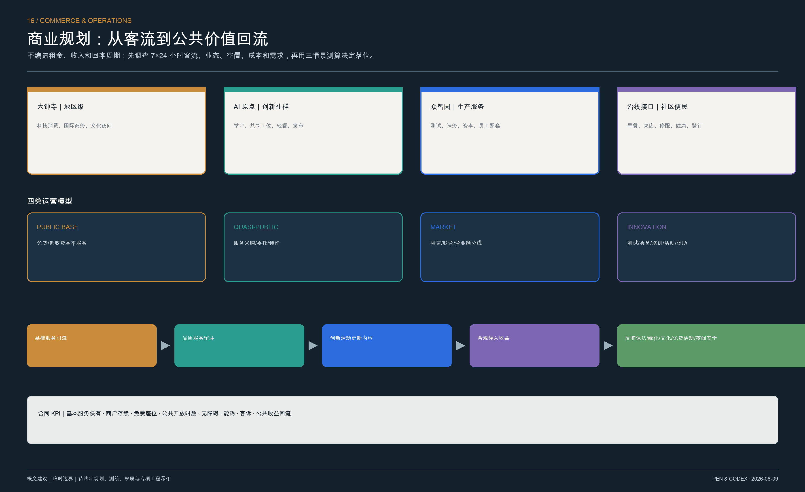

### 12.2 十二项问题导向项目

1. **PRJ-01 断点 100 与京张连续主轴**：对应 ISS-01、ISS-04；
2. **PRJ-02 三条社区—高校—园区开放支线**：对应 ISS-01、ISS-05；
3. **PRJ-03 轨道最后一公里与 B+R 节点**：对应 ISS-01、ISS-04；
4. **PRJ-04 围墙界面拆栏透绿与共享首层**：对应 ISS-02；
5. **PRJ-05 全龄微空间与配送分时驿站**：对应 ISS-02、ISS-04；
6. **PRJ-06 老旧小区管线—无障碍—物业协同包**：对应 ISS-03；
7. **PRJ-07 众智园可信评测环**：对应 ISS-05、ISS-06；
8. **PRJ-08 AI 原点概念验证与转化栈**：对应 ISS-05；
9. **PRJ-09 大钟寺百年里程场与社区共享厅**：对应 ISS-01、ISS-02；
10. **PRJ-10 分布式公共服务智能体节点**：对应 ISS-03、ISS-06；
11. **PRJ-11 Open Ledger 问题账本与贡献档案**：对应 ISS-06；
12. **PRJ-12 Global Open Rail Week 与年度公共审计**：对应 ISS-05、ISS-06。

十二个项目分别从 EP-01—EP-08 八个工程包中组合建设内容和运行机制。例如，PRJ-01 不是单一景观工程，而是廊道、末端交通、蓝绿设施和长期管护的联合项目；PRJ-08 也不是单一孵化器，而是既有建筑更新、测试转化平台与商业运营的联合项目。项目清单属于概念项目库 [depth:renewal_project_list]，不代表立项、投资或建设承诺。

### 12.3 六道实施关口：每一步都回答“为什么可以继续”

| 关口 | 关键问题 | 必备成果 | 通过条件 |
|---|---|---|---|
| SG0 议题确认 | 问题是否真实、是否具有公共价值 | 现场基线、利益相关方图谱、问题定义书 | 证据可复核，受影响群体参与，责任部门确认 |
| SG1 概念入库 | 是否需要空间工程，是否存在更低成本替代 | 多方案比选、初步工程包、风险与数据边界 | 不以数字平台替代基础设施；替代方案比较完整 |
| SG2 预可研 | 线位、权属、文保、轨道、市政和资金是否可行 | 测绘、交通与市政专题、成本区间、运营意向 | 重大约束已识别，运营和维护责任有初步承诺 |
| SG3 方案与联审 | 硬件、软件、运营是否在同一设计中闭合 | 方案设计、服务蓝图、数据影响评估、全寿命成本 | 专业审查、公众意见和风险控制同步落实 |
| SG4 建设交付 | 工程是否达到安全、无障碍、维护和开放要求 | 竣工资料、运行手册、应急演练、人员培训 | 不仅验收工程量，也验收服务可用性和人工接管 |
| SG5 运行复盘 | 项目是否真正改善问题，是否应扩展或退出 | 6/12/24 月评估、公众复核、事故与异议报告 | 达标则扩展，未达标则整改，风险不可接受则退出 |

这套关口把“为什么要做”写进项目全过程：每一次进入下一阶段，都必须用新的证据降低不确定性。如果官方边界、权属、文保、道路红线或市政容量尚未取得，项目最多只能停留在 SG1；任何跨环路、桥隧、轨道或大规模建筑工程，在完成 SG2 前不得在图面上表达为确定建设内容。

### 12.4 三阶段空间实施与年度活动

分期空间见 [data:geometry/phasing.geojson#PHASING] [depth:phasing_implementation]：

- **近期：补基线、关断点、建信任（0—2 年）**。完成现场基线、断点 100、两个社区接口微更新、三项受控测试、公共协议 1.0 和独立安全评审；
- **中期：连网络、补服务、促转化（3—5 年）**。三站公共首层和开放支线连成体系，老旧小区协同包滚动实施，场景扩展到十二项，建立共享测试、场景采购和人才驻留；
- **远期：评绩效、可退出、开放复制（5 年以上）**。依据监测和居民评议滚动更新空间，允许成熟场景转化、失败场景退出，并把可复用标准贡献给其他城市。

年度运营不是一次节庆，而是四季循环：春季“城市问题开源季”发布社区、园区和公共部门问题清单；夏季“开放轨道周”开展受控测试、公开课和国际共创；秋季“百年共创夜”联动文化展演、夜间商业和成果发布；冬季“可信城市审计月”完成无障碍、数据、能源、商业公共性和公共协议复盘。每项活动必须留下问题关闭、开源工具、课程、标准、设施或长期合作之一，否则不进入次年预算。

开发者社区采用“常驻维护者 + 季度驻留团队 + 高校学生社群 + 社区问题伙伴”结构；国际访客通过双语体验路线进入，随后导向联合研究、软着陆、测试服务或人才短驻。运营绩效不只看客流和投资，还看公开问题解决率、人工覆盖率、纠错时长、退出成功率、共享空间时数、商户存续、公共收益回流和社区代表参与度。

### 12.5 实施主体、合同与资金逻辑

以“实施单元统筹主体 + 专项运营者 + 社区共治单元”组织项目。统筹主体负责跨专业计划、联审和公共绩效，专项运营者负责共享空间、测试平台或公共服务的日常运行，社区共治单元拥有问题提出、方案评议、施工监督和运行复核的固定席位。公共空间、设施、老旧小区和产业空间分别依法进入相应更新路径；物业权利人意见、居民协商、联审、公示、施工和运营责任均按海淀更新指引落实 [source:HAIDIAN-URBAN-RENEWAL-GUIDE]。

资金采用政府补短板、产权主体履责、专业运营投入、社会资本参与和场景服务收益的组合，但不预设财政额度或回报率。建设合同必须把开放时数、无障碍可用性、能源与维护成本纳入验收；运营合同必须把人工服务、异议处理、数据最小化、设施完好率和退出交接写入 KPI。每个项目入库前先明确谁开放、谁维护、谁付费、谁承担风险、何时退出，避免建设投资与长期运维相互脱节。

## 13. 指标体系、面积复算与合规矩阵

所有已知指标均由本包几何或对象数量计算，并在 `metrics.json` 记录公式、来源、置信度和假设 [depth:metrics_recalculation]：

| 指标 | 用途 | 状态 |
|---|---|---|
| 临时总体边界面积 [metric:site_area_sqm] | 校核数据闭合 | 已知，可重算；不是官方红线面积 |
| 概念建筑占地 [metric:building_footprint_area_sqm] | 比较原型规模 | 已知，可重算；不是现状建筑统计 |
| 概念绿地比例 [metric:green_ratio] | 比较蓝绿连续性 | 已知，可重算；须按正式边界更新 |
| 概念公共空间比例 [metric:public_space_ratio] | 比较公共性 | 已知，可重算；可与绿地功能重叠 |
| 开放移动网络长度 [metric:open_mobility_length_m] | 比较慢行连通 | 已知，可重算；不是工程长度 |
| 建筑设计原型数 [metric:design_prototype_count] | 检查设计覆盖 | 已知，对象计数 |
| 重点片区数 [metric:key_area_count] | 检查公告任务覆盖 | 已知，数量来自公告、边界临时 |

容积率 `floor_area_ratio` 和建筑高度 `building_height_m` 保持 `unknown`。当官方范围、控规与现状测绘到位后，应以统一坐标系替换临时几何，重新运行拓扑检查和指标复算，再更新图纸、报告与实施清单。

本轮新增的绩效指标采用“先测基线、再定目标”的方式：断点关闭率、连续无障碍里程、15 分钟服务覆盖、共享首层开放时数、重复诉求率、概念验证到试点周期、责任可识别率、异议响应时间和退出成功率。它们目前均不得填入承诺值；近期第一项成果就是形成可公开复核的基线数据字典。

所有图表统一使用三种状态：**B 基线**必须有官方统计、设施台账或实测数据；**T 方案目标**必须写明年份、边界、算法和责任人；**V 验证指标**在试点后通过客流、时间、能耗、满意度、安全事件和财务数据评价。海淀区级数据只用来说明区域背景，不能直接填入 11.4 平方公里或重点区基线。

任务书逐项追踪采用“要求—正文章节—图号—空间对象—指标—来源—缺口—验收”八栏，而不是把 23 项要求重复指向同一组图层。核心映射如下，完整机器索引见 `compliance_matrix.json`：

| 任务 | 专属正文与图件 | 空间/运营证据 | 当前状态 |
|---|---|---|---|
| 三大定位 / 五大功能 / 三区两翼 | 3.3、6.4；总体规划图、三带图 | B-CULT/B-LIFE/B-INNO、Z1—Z3、两翼闭环 | 已覆盖；正式边界待替换 |
| Agent.1 品牌与总体概念 | 3.1—3.3；Logo/VI、总体规划图 | 五级命名、Logo 规范、空间结构 | 已覆盖 |
| Agent.2 创新生态 | 5.1—5.5；创新资源网络 | 6 案例、八要素、六级转化链 | 已覆盖；合作意愿待核 |
| Agent.3 场景与活力城市 | 8.1—8.2；场景矩阵 | 12 场景、3 测试、6 画像、退出机制 | 已覆盖；场地与数据待授权 |
| Agent.4 公共空间与新业态 | 7.3、11、12.1；公共空间/商业图 | 5 组件、3 地标、大钟寺商业系统 | 已覆盖；工程与市场测算待做 |
| Agent.5 文化融合叙事 | 6.4、11.3；文化系统图 | 四类资源、百年里程、双语叙事 | 部分深化；文保 GIS/档案待补 |
| Agent.6 长期运营 | 12.1、12.4—12.5；商业运营图 | 四季活动、开发者社区、合同 KPI | 已覆盖；主体与资金待确认 |
| 公告总体与重点区设计 | 4、6、7、9—11；总图和三区图 | 三层范围、用地/交通/市政/蓝绿/风貌 | 概念深度；控规与现状资料待补 |

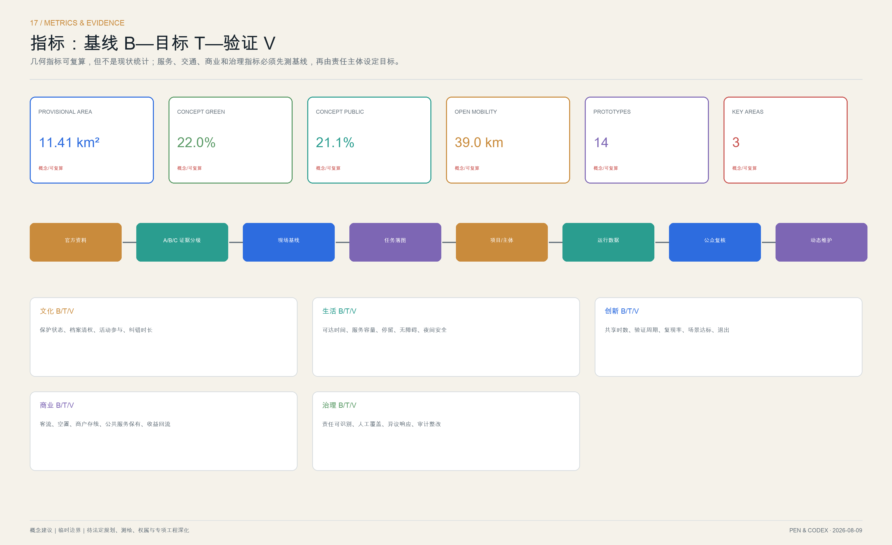

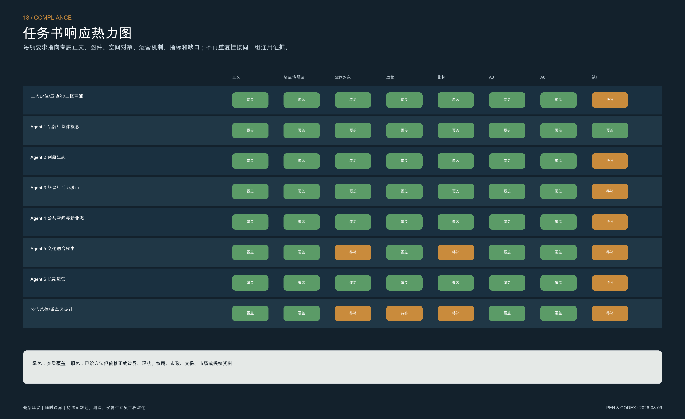

## 14. 风险、版权与合规说明

### 14.1 必须在下一阶段关闭的资料缺口

- 官方总体边界、三处重点片区边界和法定地块；
- 现状建筑测绘、权属、产权人意愿与租赁关系；
- 文物及历史建筑名录、保护范围与建设控制地带；
- 批准用地、容积率、高度、密度、退线、日照与消防控制；
- 道路红线、轨道安全保护、市政管网、海绵与防洪资料；
- 人口、就业、交通、环境、能耗、公共服务和市场基线；
- 正式运营主体、资金来源、采购机制和长期维护责任。

约束图见 [data:geometry/constraints.geojson#CONSTRAINTS]。在缺口关闭前，不将方案面积、线位、体量、项目时序或投资转述为事实、审批结论或建设承诺 [depth:risk_missing_data]。

下一阶段调查按“资料申请 + GIS 体检 + 行为观察 + 设施普查 + 访谈共创 + 专项检测”六条线同步进行：

| 调查包 | 方法与最小样本框架 | 形成成果 | 直接支撑 |
|---|---|---|---|
| 空间与权属 | 获取正式边界、控规、产权、建筑轮廓/高度/年代/用途；逐栋踏勘 | 现状一张图、拆改留评估、空间潜力清单 | 总图、重点区、强度与实施单元 |
| 交通与行为 | 工作日/周末 × 早中晚夜计数；关键路口轨迹、等待、冲突；站点和入口可达审计 | 断点 100、24 小时人流、慢行和配送热图 | 连续主轴、商业选址、无障碍 |
| 市政与韧性 | 调取给排水、电气、燃气、供热、通信、消防和积水资料；现场井盖/设施核验 | 地下管线一张图、风险分区、协同开挖计划 | 综合基础设施与分期 |
| 公共服务 | 核验容量、服务半径、开放时段、费用与无障碍；按儿童/老人/青年/残障复核 | 15 分钟生活圈供需表 | 完整社区和生活体验带 |
| 商业与运营 | 7×24 客流；业态、空置、租金、客单、配送、能耗和商户访谈；三情景测算 | 商业基线、业态适配、全寿命运营模型 | 大钟寺与沿线商业 |
| 文化与生态 | 文保线、遗存、古树、声环境、雨洪与生境调查；史料及口述史清权 | 文化资源分级、保护/活化清单、生态约束 | 文化带、蓝绿系统、风貌 |
| 创新与场景 | 高校/院所/企业/医院/学校逐项访谈；核验设备、空间、数据、采购与合作意愿 | 资源目录、场景授权表、转化链责任矩阵 | 创新带、两翼和 12 场景 |

公众参与至少覆盖居民、学生/科研人员、商户、物业/产权方、园区运营、街道和专业部门，并对儿童、老人、残障人士、夜间工作者与配送人员单独设置可达的参与方式。访谈和行为数据脱敏，只公布统计结论；未取得授权的机构名单、个人意见和经营数据不得进入开源包。

### 14.2 AI 场景底线

城市智能体不得自动作出影响基本权益的最终决定；不得以公共空间测试为由默认采集人脸和长期轨迹；不得把无法解释的评分用于居民准入、就业、医疗或教育；不得用“数字化”替代线下服务。每一项场景都要公开责任主体、数据清单、模型或规则版本、人工复核方式、申诉渠道、事故响应和退出条件。

### 14.3 版权与署名

文字、图形、空间数据加工、版式与场景体系由 **Pen & Codex** 为本次开放共创建立；案例只作事实性机制研究并列出来源。本包未使用第三方照片、商业底图、商业标识或受限字体。许可及社区展示边界详见 `report/copyright_statement.md`。

## 15. 结语：让城市智能成为共同维护的基础设施

百年京张最有力量的未来，不是把历史遗产包装成技术展厅，而是再次成为一项关于公共能力的工程：铁路时代解决“如何连接”，开源智能时代解决“由谁定义问题、如何证明有效、谁来承担责任”。

“开源智基”因此把每个空间决定都变成一项可讨论的协议，把每个 AI 场景都变成一次有限、可停、可复盘的公共试验，把每次贡献都留在一条可追溯的百年轴线上。它的完成状态不是一次交付，而是一座城市学会持续共同维护自己的智能基础设施。

## 参考资料

完整来源、网址、用途、时间范围、许可与限制记录在 `sources.json`。对本方案判断影响最大的资料如下：

1. 北京市规划和自然资源委员会，《百年京张 AI 创新带城市设计国际方案征集资格预审公告》，2026：确定项目位于海淀区、三层范围、三个重点区和任务深度 [source:OFFICIAL-ANNOUNCEMENT]。
2. Open City AI，最新版 GitHub README、智能体任务书和正式投稿指南，2026-08-09：确定三大定位、五大功能、三区两翼、六项 Agent 任务和 v2 双语契约 [source:GITHUB-LATEST] [source:AGENT-TASKBOOK]。
3. 北京市规划和自然资源委员会，《贯穿“南北”的海淀“城市绿心”——京张铁路遗址公园规划》，2021：用于核实长度、服务街镇、资源密度历史基准与结构性断点 [source:JINGZHANG-PLANNING-2021]。
4. 北京市园林绿化局，京张铁路遗址公园一期与二期建设资料，2023—2026：用于判断公园从分期建设转入建成后运营评估 [source:JINGZHANG-PHASE1] [source:JINGZHANG-PHASE2-COMPLETE-2026]。
5. 海淀区统计公报、政府工作报告和“十四五”规划：仅作为区级人口、产业、创新和公共服务背景，不外推为项目地块现状 [source:HAIDIAN-STATS-2024] [source:HAIDIAN-WORK-REPORT-2026] [source:HAIDIAN-14FIVE]。
6. 海淀区城市更新实施指引与行动方案：用于完整社区、园城融合、公众协商、实施主体和长期运营的政策口径 [source:HAIDIAN-URBAN-RENEWAL-GUIDE] [source:HAIDIAN-URBAN-RENEWAL-ACTION]。
7. 国家持续推进城市更新与城市基础设施生命线文件：用于“留改拆并举、以保留利用提升为主”、全生命周期和地上地下统筹 [source:NATIONAL-URBAN-RENEWAL-2025] [source:NATIONAL-RESILIENT-INFRA-2024]。
8. 海淀科技成果转化政策解读与北京市 AI 赋能行动：用于转化链、中试熟化、真实场景、分类分级、可信数据和监管沙盒 [source:HAIDIAN-TECH-TRANSFER-2026] [source:BEIJING-AI-EMPOWERMENT-2025]。
9. 北京商业消费空间布局专项规划：用于地区、社区商业层级和公共性—经营性协同，不作为租金与收益依据 [source:BEIJING-COMMERCIAL-PLAN]。
10. OpenStreetMap 2026-08-09 数据快照：只用于道路、轨道、水系、大学、医院、公园等地理语境，遵循 ODbL 署名，不支撑官方边界或控规 [source:OSM-CONTEXT-20260809]。

标准适用情况见 `standard_matrix.json` [standard:PROJECT-OFFICIAL-ANNOUNCEMENT]，成果深度证据见 `design_depth_matrix.json` [depth:metrics_recalculation]，复算指标见 `metrics.json` [metric:site_area_sqm]。当正式多边形、现状测绘和控规条件到位后，应替换 [data:geometry/site_boundary.geojson#SITE-001] 并同步重算图层、比例、图面与 PDF；在此之前，容积率、建筑高度、道路红线、权属、市政容量和拆改留结论均保持未知或待专业确认。
