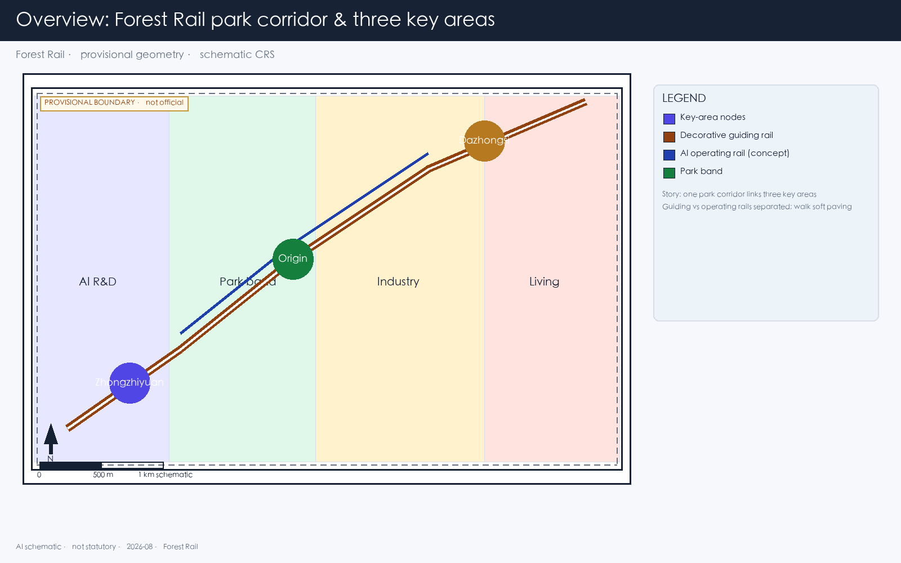
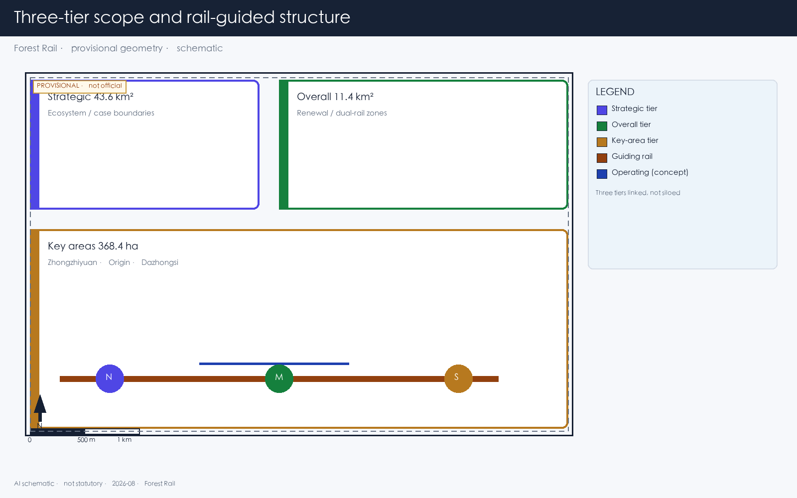
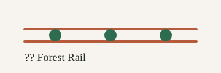
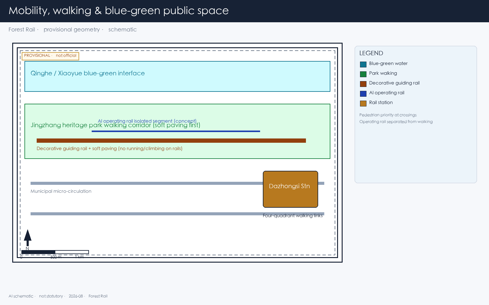
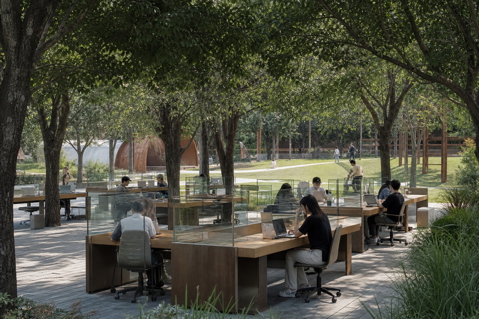
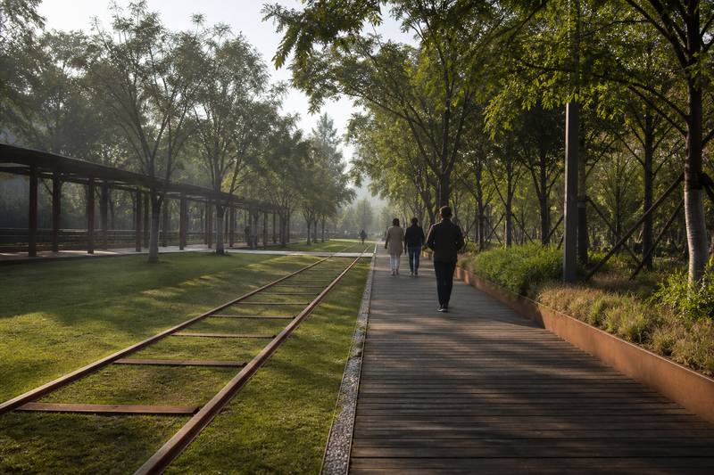
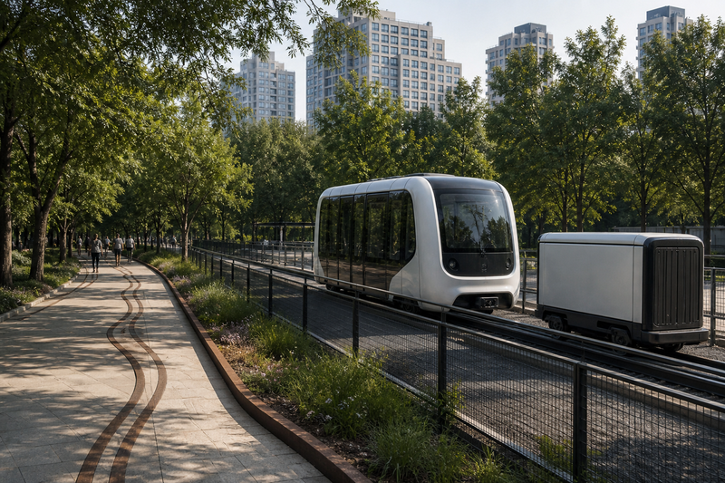
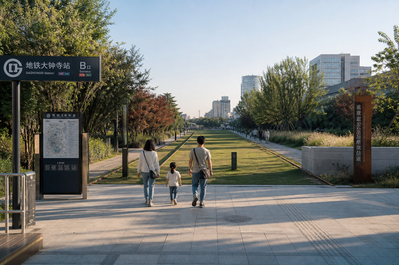
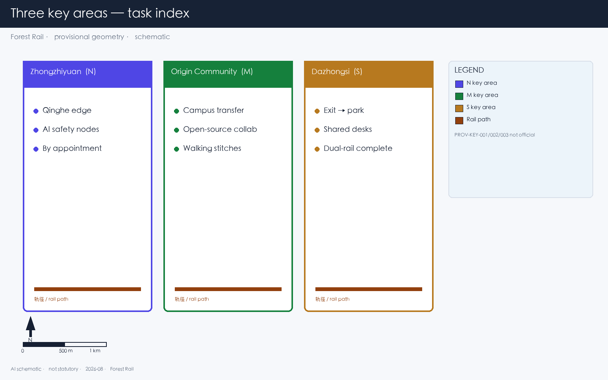
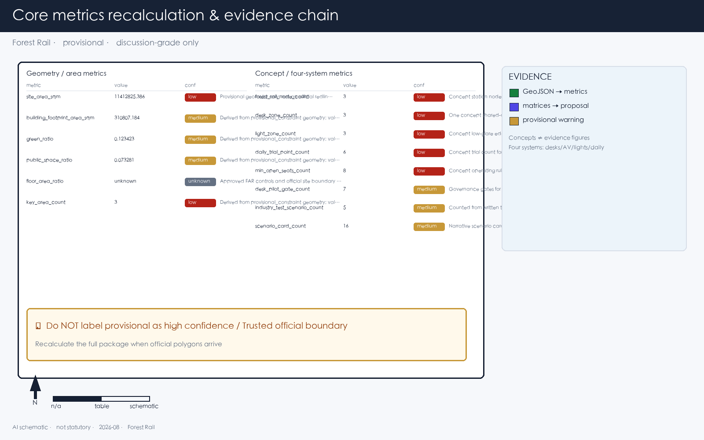

# Forest Rail

The Jingzhang Railway Heritage Park already left the rails in the city: people run, push strollers, and walk along the rails. This proposal does not reinvent that park or turn it into a tech showcase.

This proposal makes only three public promises: **Walkable, Sit-able, Thinkable**.

- **Walkable**: Wheelchairs, strollers, walkers, and transfer riders can read and complete lateral links among station–park–campus–yard via soft paving and guiding rails.
- **Sit-able**: Shade, rain shelter, quiet stay, and under-canopy shared desks are not gated by consumption; minimum open seats cannot be extinguished.
- **Thinkable**: People find quiet and creativity at the park layer; enterprises may claim **public-seat quotas** by rule (not private pods); AI dispatches only as undercurrent—on failure, revert to human and paper channels.

The proposal does not add a “future layer” on top of the park; it places technology inside daily rights, operating responsibility, and stoppable mechanisms. Current outputs come from public materials and the repo site package only—**no** field survey, resident interviews, footfall/OD study, tree census, or equipment testing. Nodes, phasing, and acceptance gates are concept suggestions for professional teams; GitHub merge ≠ official call eligibility, planning approval, funding, award, or implementation [source:AGENT-TASKBOOK].

## Urban Planning Master Judgment

Forest Rail answers **how to organize space and operations on this AI innovation belt**—not a smart-device checklist for the corridor.

1. **Park city as chassis**: The Jingzhang heritage corridor is the main space for public rights and everyday creativity; Zhongzhiyuan / Origin / Dazhongsi share one **replicable central park-layer unit**—different roles, not three unrelated showcase plots.
2. **AI as undercurrent dispatch**: The Forest Rail terminal back-office dispatches seats, lights, unbranded daily goods, and isolated-rail shuttles; people only feel quiet, sit-ability, and ask-a-human. Dispatch scope is park layer only—**not** district-wide building control.
3. **Spatial economy serves public floor**: Enterprise pack-year/quarter public seats form operating-revenue **assumptions** and well-being intent; they must not crowd out minimum open seats; revenue is not an investment promise [assumption:A-DESK-LEASE-001].
4. **Dual time horizon on one corridor**: Near-term minimum path = guiding rails + soft paving + canopy + human service + exit-ready terminal; the same corridor reserves section/clearance/title interfaces for an isolated operating format (higher-capacity forms including maglev are **interface reserve only**—**not** approved works, no route mileage, no investment amount) [assumption:A-RAIL-RESERVE-001].

Naming: *Forest Rail — the park layer of an AI city*.

- **Forest**: Look out and see trees, not a glass showcase.
- **Rail (dual partition)**: Guiding rails give direction; only **physically isolated** operating rails carry AI-dispatchable shuttles.
- **Forest Rail terminal**: Undercurrent dispatch of public seats/shared desks, low-glare lights, unbranded daily goods, and node open/close. No face ID, no brand ads.
- **Three nodes**: `FR-NODE-ZZY` / `FR-NODE-YY` / `FR-NODE-DZS` can relocate with official polygons [data:geometry/public_space.geojson#FR-NODE-DZS] [metric:forest_rail_node_count].

**Refusals:** district-wide building control, viral landmarks, light shows, planting strips posing as parks, private-pod desks, climbable decorative rails, surveillance-for-“smart” swaps, brand-store matrices, writing maglev as an approved buildable project.

**If AI fails, the park body (soft paving, canopy, minimum seats, human service) still stands alone.**

## Executive Brief

| Review question | Forest Rail urban-planning judgment | Verifiable outputs |
| --- | --- | --- |
| Core claim | Park-city chassis + AI undercurrent; replicable under-canopy desks (incl. enterprise pack-year public seats); minimum path and corridor-format reserve on one spine | Master judgment + four systems + Gates |
| Spatial response | One spine, three stations; guiding / isolated operating rails; station–campus–yard–river seams | 9 GeoJSON classes, three nodes, five evidence boards |
| Starting point | Near: soft paving, canopy, human + desk protocol; Mid: terminal and daily trials; Long: isolated operation / higher format only after Gate + specialist review | FR-01–09 + prerequisites |
| Public value | Walkable, Sit-able, Thinkable; minimum seats cannot be extinguished | [metric:min_open_seats_count] |
| Evidence & bounds | Provisional geometry recomputable; cases are mechanism-only; revenue/maglev are assumption or form reserve | metrics / assumptions / self_check |

## Design Basis and Source List

This proposal follows the Pre-qualification Announcement [source:OFFICIAL-ANNOUNCEMENT] [standard:PROJECT-OFFICIAL-ANNOUNCEMENT] and machine-readable site package materials [source:SITE-PACKAGE] [depth:existing_conditions_diagnosis].

Current data uses provisional boundaries (`geometry/site_boundary.geojson`, `geometry/key_areas.geojson`) with `official_boundary=false`. Recalculate everything when official polygons arrive. This does not block content scoring; spatial conclusions remain discussion-grade.

Background and provisional sources are **not** elevated to statutory authority [source:SOURCE-REGISTRY].

| Evidence class | How used | Can support | Cannot prove |
| --- | --- | --- | --- |
| Official task basis | Announcement + taskbook excerpt | Tier wording, three key-area names, agent tasks | Exact polygons, control metrics, engineering conditions |
| Provisional spatial basis | Repo provisional boundaries | Generation, topology checks, relative relations | Official redline, title, approval areas |
| Agent design data | Package GeoJSON / metrics | Concept nodes, capacity discussion, phasing sketches | Surveyed as-built, finalized keep/alter/demolish |
| Background cases | Public park and AI-ecosystem materials | Mechanism inspiration | Haidian performance KPIs, transplantable FAR |
| Tabletop evidence | `visual/assets/*tabletop*` | Local synthetic logic reproducible | Field performance, assigned operators |

Authority order: GeoJSON → metrics → matrices → sources/assumptions/self_check → proposal → figures → HTML → PDF.



## Three-Level Scope Framework

The three-tier frame follows the announcement [source:SITE-PACKAGE] [depth:three_level_scope_framework] [depth:overall_spatial_structure]:

| Tier | Announcement scope | Depth at this tier | Forest Rail judgment |
|------|-------------------|--------------------|----------------------|
| Coordinated research | **43.6 km²** (North Fifth Ring–Jingzang–Xizhimen Outer–Wanquan River) | Industry ecology + future urban form | Jingzhang corridor = park-city spine; three areas + wings via verify–translate–adopt loop |
| Overall design | **11.4 km²** (heritage park ±1–2 km) | Control-plan-depth urban design | One spine, dual-rail partition; under-canopy desk protocol; park-layer dispatch grammar; municipal interfaces as prerequisites |
| Key areas | **368.4 ha** (Zhongzhiyuan 192.1 / Origin 104.3 / Dazhongsi 72.0) | Detailed design / component atlas | Three stations share replicable park unit, different roles [metric:key_area_count] |

Announcement text areas are the formal scope; repo provisional polygons recalculate overall design at ~11,412,825 m², ~0.11% from 11.4 km²—**the two values do not substitute for each other**; recalculate the full chain when official polygons arrive [metric:site_area_sqm] [metric:announced_overall_design_area_sqm] [assumption:A-AREA-MISMATCH-001]. Full recalculation discipline: [depth:metrics_recalculation].

The three tiers are not siloed: coordinated research sets direction; overall design lands layers and capacity bounds; key areas verify whether components can deploy.



## Coordinated Research: Industry and Future City

Jingzhang is the existing narrative line—no new myth needed. 1909 opening; 2019 undergrounding left a surface heritage-park corridor [source:AGENT-TASKBOOK] [standard:PROJECT-AGENT-OPEN-CALL-TASKBOOK].

Narrow judgment: **do not invent a parallel greenway; connect the heritage park into three-station daily life.** Rust stays; people walk soft paving between rails. Zhongzhiyuan meets Qinghe; Origin meets campuses; Dazhongsi meets metro.

Naming: Forest Rail is both title and spatial description. International motif: *Forest Rail — the park layer of an AI city.* Minimal mark: rust twin rails + three canopy-green nodes in `assets/forest-rail-mark.svg` (see agent.5).

### Urban cases: mechanism transfer (background)

The following are public built/operating projects—**mechanism transfer only**; no FAR, investment, footfall KPI, or governance authority is transplanted.

| Case | Transferable urban-planning mechanism | Learn / do not learn | Cannot prove |
|------|--------------------------------------|----------------------|--------------|
| New York Central Park | Park as urban public-right chassis; multi-entry layered walking | **Learn** park over landscape show; **do not learn** closed mega-management | Haidian footfall/area targets |
| New York High Line | Abandoned rail → continuous public corridor | **Learn** rail-narrative reuse; **do not learn** elevated tourist consumption, climbing heritage | This case rail elevation/cost |
| Philadelphia Rail Park | Phased rolling opening | **Learn** light one-segment pilots; **do not learn** unfinished segments packaged as built | Phasing funds secured |
| London King's Cross | Exit straight into public space | **Learn** station–city stitching; **do not learn** mall-led complexes | Station OD |
| Singapore Gardens by the Bay | Central dashboard aggregates horticulture/visitor/security sensing; automation cuts patrol labor; smart without hijacking visitor experience | **Learn** “undercurrent ops”; **do not learn** greenhouse engineering copy-paste | Haidian sensing budget |
| Paris Station F | Old rail facility → high-density shared desks | **Learn** heritage space to shared density; **do not learn** private mega-landlord | Desk-count KPI |
| Singapore one-north / LaunchPad | District as testbed; low-barrier shared facilities | **Learn** scene openness; **do not learn** single SOE coordination copy | SOE structure |
| Toronto Quayside review lesson | Data governance, public accountability, exit upfront | **Learn** failure and exit made public; **do not learn** unvetted data platform | Directly deployable platform architecture |
| Shanghai Xuhui Runway Park | Relic → everyday linear space | **Learn** localized narrative; **do not learn** wide hardscape check-in decks | Materials approved |
| Jingzhang Heritage Park (built) | Rails left in city; daily life already walking | **Learn** incremental three-station daily links; **do not learn** parallel greenway redo | Interface retrofits approved |

This proposal's stance: push heritage rails from “viewable” to “guidable, co-workable, concept short-haul”; breakthroughs sit in **replicable park-city units** and **exit-ready AI undercurrent**.

Full case sources are registered in `sources.json` (`CASE-*`, background_only); the body does not dump every ID. Key citations in the table: [source:CASE-GARDENS-BY-THE-BAY], [source:CASE-AI-PARIS-STATIONF], [source:CASE-JZ-HERITAGE-PARK].

### Urban life organism · international motif & minimal mark (agent.5)

**Claim:** *Forest Rail — the park layer of an AI city.*

Park/forest is a regulator—soft paving and canopy quiet the mind before creativity. Public carriers are **shared desks and rest**, not office lobbies outdoors.

**Jingzhang three acts:** (1) 1909 daring engineering; (2) 2019 rails left as park; (3) this proposal—three stations on the park layer; safety first; fail back to walking and humans.

| Element | Rule |
|---------|------|
| Mark | `assets/forest-rail-mark.svg`: rust twin rails + three canopy nodes |
| Color | Rust `#B65A3C`, canopy `#2F6B4F`, paper white; no glow gradients |
| Clearance | ≥1× node diameter; no stretch/rotate/corporate rename |
| Wayfinding | Icons over long sentences; bilingual safety; not a government seal |



### Global AI innovation ecosystem cases & eight-factor map (agent.2)

| Case | Mechanism | Learn / do not learn | Non-transferable numbers |
|------|-----------|----------------------|--------------------------|
| Stanford Research Park | land·space·industry·talent | Learn campus–land–talent pipe; not low-density land supply | Rents/yield |
| London Knowledge Quarter | space·industry·data·scenes | Learn station-area knowledge renewal; not institute mass copy | Org counts |
| Singapore one-north / LaunchPad | land·space·compute·data·scenes | Learn district-as-testbed; not single SOE copy | Budget structure |
| Shenzhen Nanshan “Model Camp” | space·compute·data·scenes·talent | Learn public-factor bundling; not LLM-only towers | GPU quotas |
| Shanghai Zhangjiang AI hub mode | space·industry·compute·data·scenes | Learn vertical×AI; not single-track admin lead | Alliance lists |
| Paris Station F | space·scenes·compute·industry | Learn rail-facility shared density; not private mega-landlord | Desk KPIs |
| Toronto Vector Institute | talent·industry·capital·space | Learn nonprofit talent hub; not single institute as belt | Fund size |

Sources: [source:CASE-AI-STANFORD-RP]–[source:CASE-AI-TORONTO-VECTOR].

| Factor | Zhongzhiyuan | Origin | Dazhongsi |
|--------|--------------|--------|-----------|
| Land | Waterfront public interface permits | Near-campus scrap-space pool | Station-area temp permits |
| Space | Shared verification court / walks | Open-source hall / under-canopy study | Shared desks / daily points |
| Industry | Safety eval interface | Open-source transfer | Terminal / data-element interface |
| Capital | Soft co-create (no amounts) | Same | Same |
| Talent | Booked visits / coaching | Stay / OSS contribution | Commute work / visitors |
| Compute | Edge + eval nodes (concept) | Shared collab compute (concept) | Edge nodes (concept) |
| Data | Anonymous eval logs | Public OSS walls (no personal profiles) | Anonymous footfall / stockouts |
| Scenes | TEST-04 | TEST-05 | TEST-01/02/03 |
### Urban agent protocol: walking-gap detection (auditable)

| Step | Action | Who | How misreads are fixed |
|------|--------|-----|------------------------|
| 1 Collect | Anonymous heat + topology gap rules | Terminal sensors + network layer | No identity stored |
| 2 Candidates | Suspected-gap list with confidence | Algorithm | Low confidence ≠ auto construction |
| 3 Verify | Field walk / photo vs title constraints | Ops inspectors | Mark false_positive; feed rules |
| 4 Approve | Enter retrofit list | Project reviewer | Appealable; minutes archived |
| 5 Correct | Re-check after works | Ops + design | Safety or heritage veto stops |

The urban agent **does not replace planning approval** and does not output personal profiles.

### Industry test scenarios (agent.3 · ≥5 · six fields)

| Field | TEST-01 Daily restock | TEST-02 Seats/lights | TEST-03 Isolated AV shuttle | TEST-04 Safety-node booking | TEST-05 Near-campus desk fairness |
|------|------------------------|----------------------|-----------------------------|-----------------------------|-----------------------------------|
| Goal | Restock latency + fair siting | Min seats/human window not extinguished | E-stop / yield / fail-stop | Booked eval node ≠ open attraction | Noise-threshold close still keeps min seats |
| Site | Dazhongsi trials [data:geometry/public_space.geojson#FR-NODE-DZS] | Three desk zones (tabletop uses DZS) | Isolated concept segment | Zhongzhiyuan [data:geometry/public_space.geojson#FR-NODE-ZZY] | Origin [data:geometry/public_space.geojson#FR-NODE-YY] |
| Data | Anonymous footfall, stockouts | Noise/rain/density | Vehicle sensing, breach, E-stop logs | Booking slots, anonymous visits | Noise/density; no identity |
| Owner | Ops; human vendor admission | Ops; human service window | Safety assessor + ops; concept | Eval operator + human host | Ops + campus property talks |
| Stop | Low-demand nodes extinguished; privacy event | Below min seats; forced scan | Collision / E-stop fail / breach | Unbooked surge or data overreach | Wheelchair seats extinguished; forced app |
| Human review | Weekly siting audit | Daily min-supply check; tabletop PASS ≠ field authorization | Signed drills each trial | Booking spot checks | Weekly fairness audit |

[metric:industry_test_scenario_count] = 5. Tabletop: `node visual/assets/run_desk_tabletop.js --check` → [data:visual/assets/desk-tabletop-evidence.json]. **Until G2 is assigned, limited trial is NOT AUTHORIZED** [data:visual/assets/operations-matrix.json] [metric:desk_pilot_gate_count]. AV gates: [data:visual/assets/av-safety-gates.json].

## Overall Design: Corridor Renewal and Park-Layer Systems

Overall design follows urban-design and control-plan depth expectations [standard:MOHURD-URBAN-DESIGN-MEASURES] [standard:MOHURD-CONTROL-DETAILED-PLANNING] [depth:overall_spatial_structure]. Architectural depth remains conceptual until official conditions arrive and is bounded by [standard:MOHURD-ARCH-DESIGN-DEPTH-2016] as a disclosed data_gap.

### Corridor structure and ordinary complete path

```
Zhongzhiyuan FR-NODE-ZZY (N) ——rail—— Origin FR-NODE-YY (mid) ——rail—— Dazhongsi FR-NODE-DZS (S)
```

**Ordinary complete path (works without AI):** static wayfinding → continuous accessible soft paving → shade/rest → staffed service → optional digital aid. Refusing AI **must not** lower basic service.

| Role | Means | Job | Bound |
|------|-------|-----|-------|
| Decorative guiding rails | Rust / faux / ground paint + soft paving | Eyes follow rust; feet on soft paving | No climbing/running; no lights on decorative rails |
| AI operating rails (concept) | Isolated AV shuttle | Low-speed people + cargo; **safety first** | Separated from walking; not mature commercial |

### System grammar: continuous / withdrawable / fail-back

| Type | Members | Rule |
|------|---------|------|
| Continuous | Guiding rails, soft paving, canopy, min seats, edge lights, human service | Near-term must land; no AI dependency |
| Withdrawable | Terminal nodes, AV segments, unbranded daily points, sensors | Can stop; continuous layer still works |
| Fail-back | AV stop→walk+human; terminal offline→printed hours; daily point removed→min supply list | Written into acceptance |

### Lateral seams (relation interfaces)

| ID | Interface | Public job | Must not claim before verification |
|----|-----------|------------|------------------------------------|
| FR-OI-01 | Park–R&D yard | Shared entry/stay | Open passage already agreed |
| FR-OI-02 | Park–campus | Study/care/elder rest | Campus gates freely open |
| FR-OI-03 | Park–heritage | Traceable telling + protection cues | Enter protected scope / alter fabric |
| FR-OI-04 | Park–metro/bus | Last 500 m + accessible transfer | Station volumes already verified |
| FR-OI-05 | Park–blue-green | Heat/flood alternate routes | Drainage works approved |
| FR-OI-06 | Park–civic service | Human-takeover desk | Agency onboarding confirmed |
| FR-OI-07 | Park–logistics | People vs low-speed cargo time split | Robots already street-legal |
| FR-OI-08 | Park–night quiet | Light/noise vs resident rest | Night events permitted |
| FR-OI-09 | Park–edge compute | Power-fail degrade | Power headroom confirmed |

### Four systems

#### 1) Shared Desk Protocol

Under-canopy desks are a **replicable central park-layer unit**: Zhongzhiyuan / Origin / Dazhongsi share one protocol, different roles. Benchmarks Station F “heritage space → shared density” but no private pods and no consumption gate [source:CASE-AI-PARIS-STATIONF].

| Item | Content |
|------|---------|
| Objects | Under-canopy shared desks, bend seats, shelter hot desks; desk zone per station [metric:desk_zone_count] |
| Two seat types | **A public open seats**: first-come. **B enterprise pack-year/quarter public seats**: park or enterprise claims seat quota under same open/close/quiet/no-identity rules—**not private partitioned pods** |
| Spatial economy | Type B intent forms park operating-revenue assumption and district well-being; numbers not guaranteed in metrics—see [assumption:A-DESK-LEASE-001] |
| AI (undercurrent) | Noise/rain/anonymous density → open/close and power; quiet/discussion zones; no face ID |
| Hard constraints | Minimum open seats [metric:min_open_seats_count] cannot be crowded out by lease quota; no forced scan; wheelchair seats not extinguished |
| Gate | Environment over threshold may close zones; human window stays open; appeal path; G2 unassigned ⇒ NOT AUTHORIZED |
| Evidence | `visual/assets/run_desk_tabletop.js` / `desk-tabletop-evidence.json` |

#### 2) Safety-First AV Rail and Corridor-Format Reserve

Isolated rails are the **most dispatchable** AI-city infrastructure in this proposal: fully physically separated from walking, adjustable path, controllable speed, lower disturbance than opening walls—**not** proven by Haidian local statistics.

| Item | Content |
|------|---------|
| Partition | Guiding rails ≠ operating rails; operating rails **fully isolated** from walking |
| Near-term minimum path | Guiding rails + soft paving + signage only; operating rails on isolated concept segment |
| AI | Shifts, yield, daily restock; fail-stop; walking priority on recovery |
| Long-term reserve | Same corridor reserves section/clearance/title interfaces for isolated operating format; higher capacity (incl. maglev concept) is **form reserve only**—**not** approved works, no route mileage, no investment amount [assumption:A-RAIL-RESERVE-001] |
| Gate | No safety assessment/operator/E-stop drill ⇒ **NOT AUTHORIZED** [data:visual/assets/av-safety-gates.json] |
| Metrics | Unregistered precise km claims forbidden; all concept |

#### 3) Edge Light Protocol
Soft-paving edges + seat zones only [metric:light_zone_count]. No lights on decorative rails, no chase/projection/show. Fault → off or ultra-dim.

#### 4) Unbranded Daily Essentials
Trials [metric:daily_trial_point_count] → fit → open-admission stalls / quick-turnover shops. AI: stockouts, turnover, anonymous footfall; **fair siting** (low-demand keeps minimum supply). No brand logos, no face ID, no ads; human review escalation; weekly bias audit.

### Park-Layer Smart Dispatch (Undercurrent Ops)

Benchmarking Gardens by the Bay central-dashboard logic: sensing and rules feed an ops console, triggering alerts and open/close—**visitor side remains a quiet park** [source:CASE-GARDENS-BY-THE-BAY]. Forest Rail dispatch scope is park-layer four systems only—**not** district-wide building control.

| Dispatch domain | Inputs (minimum necessary) | Outputs | Fail-back |
|-----------------|----------------------------|---------|-----------|
| Desk open/close | Noise/rain/anonymous density | Zone open/close, power | Keep minimum seats + human window |
| Edge lights | Sun/time/density | Segment brightness | Off or ultra-dim |
| Unbranded daily | Stockouts/anonymous footfall | Restock suggestion, fair siting | Minimum supply list + human audit |
| Isolated shuttle | Vehicle sensing/E-stop state | Shift or halt | Immediate halt; walking priority |
| Node open/close | Weather/event permit | Trial-point open/close | Printed hours table |

Governance boundary (Quayside lesson): minimum data, auditable, appealable, exit-ready; no face ID, no personal profiles [source:CASE-TORONTO-QUAYSIDE].

### Accessibility and inclusion
Wheelchair: prefer flat; if slope ≤1:20 + handrail. Deaf/blind: tactile + low-glare lights; concept dedicated AV shuttle (tactile/voice/text/help). Low-digital / non-Chinese: no forced app; bilingual icons. Fair siting + appeal + human override.

### Safety section
AV collision/breach/E-stop fail → immediate stop, walk priority. Glare → dim/off. Climbing rust rails forbidden. No face ID. Offline → printed hours + human window.

## Land Use, Building Scale, and Retain-Renovate-Demolish Strategy

Renewal within overall design scope is handled in three categories. Any FAR, building height, or road redline control is split into **known materials / concept suggestion / pending professional confirmation**; missing official data is marked unknown—no fabricated numbers [assumption:A-CONTROLS-001].

- **Retain (concept suggestion)**: Built quality along the Jingzhang heritage corridor—intent to keep, pending title and quality census
- **Renovate (concept suggestion)**: Ground-floor program and facade needing adjustment—remove LED screens, increase under-canopy transparency—pending fire/title confirmation
- **Renew (pending professional confirmation)**: New opportunity on identified low-efficiency space—new height **should** stay below canopy; **must not** be written as approved height or FAR

Land use follows national classification [standard:MNR-LAND-USE-CLASSIFICATION-GUIDE] [depth:land_use_layout] [depth:development_intensity_controls], covering the design boundary without overlap [data:geometry/land_use.geojson#LU-001]. Building footprints and retain/renovate/renew classification are in [data:geometry/buildings.geojson#BLDG-001] [depth:retain_renovate_demolish] [depth:height_massing_character].

Building-footprint sketches are **not** an as-built census and **not** building-scale or density control metrics.

## Transport, Rail, Municipal Infrastructure, and Public Services

Transport responds to the announcement's requirements for rail station integration, road micro-circulation, walking network gaps, and green transport [depth:traffic_rail_slow_parking]. Municipal / new-infrastructure interfaces follow [depth:municipal_new_infrastructure].

Key interventions:

1. **Dazhongsi Station four-quadrant pedestrian connection**: Metro Line 13 Dazhongsi Station — establish walking connections across all four quadrants of the intersection, with rail paths extending from station exits into the district
2. **North Fifth Ring crossing node**: Pedestrian linkage where the heritage corridor crosses the North Fifth Ring Road (underpass or overhead facility) to maintain north-south continuity
3. **Rail path / municipal road intersections**: Pedestrians have priority at crossings; rail tracks embedded in road surface indicate direction; no traffic signals govern the rail path

Road and walking network layers remain within the submission boundary [data:geometry/roads.geojson#ROAD-001], cross-checked with public space and green space. With a provisional boundary, transport conclusions serve as design discussion only.



Municipal infrastructure covers edge-computing nodes, distributed energy, and traditional utility integration. Missing utility, energy, and drainage data are listed as prerequisites for detailed design, not fabricated.

## Blue-Green Network, Public Space, and Urban Character

Blue-green space follows the Jingzhang heritage corridor as its spine, coordinating Qinghe River, Xiaoyue River, and surrounding community movement [depth:blue_green_public_space] [standard:MOHURD-URBAN-DESIGN-MEASURES].

**The tree canopy layer is the primary character control mechanism**: native trees with crown spread ≥8m (Chinese Scholar Tree, ash, ginkgo, goldenrain tree), targeting ≥70% coverage of building rooftops. Trees are not pruned into geometric shapes. Building height below the canopy — this is the basic criterion for the urban forest.

Character principles:

- Building facades use materials that age: brick, concrete, wood. No smooth glass curtain walls
- Rust and grey-green are the base colors, derived from oxidized rail and tree canopy
- Rooftops are for greening or equipment, not sculptural form
- Public art accepts only site-history-related, aging-compatible works — iron, stone, wood. No stainless steel or lighting installations

Which elements are design recommendations versus those pending official confirmation is itemized in `standard_matrix.json`.

## Key Area Detailed Design

Equal-depth three-station blocks are required by [depth:three_key_area_detailed_design].

All three stations use the same structural block (location / park-layer role / Forest Rail terminal / AV/logistics / five components / must not / test-card binding), at equal depth—avoiding a Dazhongsi-only "showcase end". Current polygons are provisional [data:geometry/key_areas.geojson#PROV-KEY-001].

### Zhongzhiyuan AI Autonomous Innovation Accelerator

**Location**: Northern end, along Qinghe River [data:geometry/key_areas.geojson#PROV-KEY-001]; node [data:geometry/public_space.geojson#FR-NODE-ZZY].

**Park-layer role**: Qinghe waterfront quiet verification interface—set back buildings, under-canopy walks and stormwater grass slopes; safety evaluation translated into **by-appointment** collaboration nodes, not open attractions.

**Forest Rail terminal**: Appointment-only safety-node open/close; visitor seats retain minimum supply; riverside edge low-glare lights; optional unbranded daily points.

**AV/logistics (concept)**: Isolated-segment material/visitor short-haul extension only; not mixed with pedestrian flow before authorization.

| Component | Local rule | Must not | Must not claim before verification |
|-----------|------------|----------|-------------------------------------|
| **Canopy layer** | Spaced trees + stormwater grass slopes; scholar tree/ash, crown spread ≥8m | Geometric hedges; ornamental small trees as substitutes | Mature shade already achieved |
| **Rail path** | Riverbank guiding rails recessed; people walk soft paving | Elevated bridges, polish/paint, light strips on rails | "Natural wayfinding" already established |
| **Soft paving** | Permeable non-slip; gentle riverbank slopes | Large asphalt, polished stone | Rain-day passage already accepted |
| **Under-canopy desks** | Riverside open seats and light rest shelters | Private pods, viral photo-booth cabins | High utilization already proven |
| **Rust** | Natural oxidation as time marker | Faux-rust panels, artificial aging paint | Must be original rail rust |

**Must not**: Open-spectator safety evaluations; riverside light-show facades; personal profiling; autonomous delivery competing with pedestrian time; claiming an evaluation venue already built.

**Test-card binding**: TEST-04 safety-node booking.

### Beijing AI Origin Community

**Location**: Middle section, near universities [data:geometry/key_areas.geojson#PROV-KEY-002]; node [data:geometry/public_space.geojson#FR-NODE-YY].

**Park-layer role**: Near-campus under-canopy co-learning / open-source third space—rail paths stitch campus gates to the park, breaking wall gaps.

**Forest Rail terminal**: 24h collaboration zones open/close by noise threshold; hot-desk power; quiet/discussion partitions; minimum seats and human service window.

**AV/logistics (concept)**: Campus–park restock and accessible shuttle concept; human fallback before maturity.

| Component | Local rule | Must not | Must not claim before verification |
|-----------|------------|----------|-------------------------------------|
| **Canopy layer** | Spaced trees on campus–park axis; shade for discussion yards | Spherical/square tree arrays | Mature shade already achieved |
| **Rail path** | Guiding rails point to release hall; people walk soft paving | Elevated bridges, polish, lights on rails | "Direct nature connection" |
| **Soft paving** | Campus-street link: continuous permeable non-slip | Large asphalt, polished stone | Passage already accepted |
| **Under-canopy desks** | Shared hot-desks; quiet/discussion separated | Private pods, photo-booth cabins | "High collaboration" proven |
| **Rust** | Natural oxidation time marker | Faux-rust panels, artificial aging | Must be original rail rust |

**Must not**: talent-apartment-complex stacking; light shows; developer profiling; private-pod desks; claiming release hall already formally open.

**Test-card binding**: TEST-05 near-campus desk fairness.

### Dazhongsi AI Industry Cluster — Urban Forest

**Location**: Southern end, adjacent to Metro Line 13 Dazhongsi Station [data:geometry/key_areas.geojson#PROV-KEY-003]; node [data:geometry/public_space.geojson#FR-NODE-DZS].

**Park-layer role** (announcement ~**72.0 ha**): Station-into-park + **southern prototype of a replicable central park-layer unit**—exit into park, share one desk in that park; surrounding industry buildings may claim under-canopy pack-year public seats, making “replicable central park” daily station-area life—not a one-off viral installation.

**Forest Rail terminal**: Full seats/lights/daily trial operation; offline revert to printed rules.

**AV/logistics (concept)**: Daily restock + deaf/blind accessible shuttle extension concept; partitioned from walking; not commercial claims.

| Component | Local rule | Must not | Must not claim before verification |
|-----------|------------|----------|-------------------------------------|
| **Canopy layer** | Chinese scholar tree and ash, crown spread ≥8m, covering low-rise roofs | Geometric pruning, ornamental small trees | Rooftop coverage already met |
| **Rail path** | Each station quadrant (A/B/C/D) gets guiding rails into the park | Elevated bridges, polish, running/climbing on rails | "Natural station-to-park" accepted |
| **Soft paving** | Wheelchair prefer flat; continuous at same grade | Asphalt plazas, polished stone, step breaks | Accessibility already through |
| **Under-canopy desks** | Public open seats + enterprise pack-year public seats; glass partitions, same first-come rules | Private pods, LED facades, photo-booth cabins, lease crowding out minimum seats | "High synergy" or revenue proven |
| **Rust** | Natural oxidation time marker | Faux-rust panels, artificial aging paint | Must be original rail rust |

**Must not**: brand-store matrix; face monitoring/ad push; light shows; extinguishing all seats; claiming AV/maglev already commercial or approved.

**Dazhongsi Station integration**: From exits A/B/C/D, a rail path enters each quadrant. First view is park and rusted rail—not ad screens.

**Commercial & operations**: Unbranded daily trials → open-admission stalls; enterprise pack-year public seats as operating intent (assumption); low-demand keeps minimum supply.

**Test-card binding**: TEST-01 / TEST-02 / TEST-03.

Concept views (not formal evidence figures; spatial claims remain in GeoJSON / metrics / the five evidence diagrams):











All three key areas appear in `geometry/key_areas.geojson`. Current data is provisional constraint; the proposal, HTML, and self_check state that it cannot serve as approval or scoring basis.

## A Day Here: Personas and Scenarios

### Five User Personas

| Persona | Who | What they do on Forest Rail | Data boundary |
|---------|-----|----------------------------|---------------|
| **Walking commuter programmer** | AI engineer living nearby, walks to work daily | Exits Dazhongsi Station, walks 800m along the rail path to the office; eats lunch under the canopy; walks back along the rail path after work | No personal commute tracking; rail path foot traffic is anonymous counting only |
| **Parent walking with child** | Resident of surrounding neighborhoods | Pushes a stroller along the soft paving in the evening; child runs on soft paving beside the rails (not on the rusted rails); sits on under-canopy benches chatting | No family profiling; no commercial push notifications |
| **Corporate visitor** | Business guest of a major company | Arrives at Dazhongsi Station, rail path guides to company showroom; walks along rail path to next node after the meeting | Company logos and cases require rights clearance |
| **Solo freelancer** | Person without a fixed office | Finds an open shared desk in the park workstation precinct; opens when quiet, closes when crowded; hot-desk, no reserved seats | No recording of workstation user identity |
| **Retired daily walker** | 70-80 years old, lives nearby | Walks along the rail path every morning, sits on the bench at the curve watching trees; pavement must be non-slip | No health data collection |
| **Wheelchair user** | Person who uses a wheelchair | Uses continuous soft paving on no-slope / low-slope segments; accessible seats and turning space at station–park links | No mobility profiling |
| **Deaf or blind user** | Visitor or resident with hearing or vision loss | Moves by tactile guidance, low-glare edge lights, and (concept) dedicated AI rail shuttle | No face recognition; shuttle offers voice/text/tactile modes and on-demand human help |
| **Non-Chinese visitor & low digital literacy** | International guest or resident who avoids apps | Reads icons and bilingual signs to sit, shelter, and buy water; staffed help for complex steps | No forced registration or QR codes |

### Scenario Cards (≥10 · six-field protocol)

Each card uses six fields: service audience / minimum necessary data / spatial boundary / human reviewer / exit/appeal / stop condition. Table below is summary; full fields expand in test cards and operations matrix. [metric:scenario_card_count]

| # | Scenario | Spatial carrier | Service audience | Minimum data | Human review | Exit/stop |
|---|----------|----------------|------------------|--------------|--------------|-----------|
| 01 | Exit station, enter park | Dazhongsi Station exits | All arrivals | None | Station staff / ops | Ad screens block park view → rectify |
| 02 | Rail path walking | Full corridor | Commuters, walkers | Anonymous count optional | Patrol | Wet slip / heritage conflict → limit flow |
| 03 | Shared under-canopy workstations | Three-station desk zones | Freelancers, lunch-breakers | Noise/rain/density | Human service window | Below min seats → stop AI seat closure |
| 04 | Rusted rail curve bench | Curve segments | Elderly, parents with children | None | Patrol | Climbing risk → discourage |
| 05 | Company showroom along the rail | Dazhongsi ground floor | Visitors | No identity | Merchant compliance | Blocks park quiet → close display |
| 06 | Rainy day under-canopy shelter | Shelters + canopy | Everyone | Rain conditions | Human opens shelters | Ponding → close segment |
| 07 | Open-source launch hall | Origin Community | Developers, faculty/students | Public commit stream | Event host | Forced scan entry → stop |
| 08 | Inter-node autonomous shuttle (concept) | Isolated segments | Trial passengers | Vehicle sensing | Safety sign-off | E-stop fail → halt until re-review |
| 08b | Deaf/blind accessible shuttle (concept) | Fixed stops | Deaf/blind users | No face ID | Human assist button | Multimodal fail → stop |
| 09 | Night light-strip regulation | Soft paving edges | Night runners | Time/density | Ops | Glare complaint → dim |
| 10 | Qinghe innovation corridor | Zhongzhiyuan | Booked visitors | Booking slots | Host staff | Unbooked surge → close |
| 11 | Data element salon | Dazhongsi district | Enterprise, regulators | Authorized scope | Compliance officer | Overreach display → offline |
| 12 | University tech transfer street | Origin Community | Startups, investors | No profiling | Service desk | Disturbance → time limits |
| 13 | Unbranded daily-essentials trial points | Multi-site fronts | Residents, commuters | Stockouts/anonymous footfall | Weekly audit | Withdraw low-demand point → violation |
| 14 | High-fit nodes → formal stalls | High-fit nodes | Community vendors | Fit report | Admission committee | Brand monopoly → revoke |
| 15 | Wheelchair-accessible walking | No-slope segments | Wheelchair, strollers | None | Accessibility patrol | Broken slope → detour guidance |
| 16 | Minimum public supply | Low-demand nodes | Low-demand communities | Supply list | Daily patrol | Last water/seat extinguished → stop AI |

All AI governance follows data minimization, open sourcing, explainability, and human review. Seat/daily-point open/close must retain **staffed help and minimum public supply**; siting algorithms must not chase high footfall at the expense of basic service in low-demand communities. Urban intelligent agents assist in identifying walking network gaps, public space activity, and facility maintenance needs but do not replace planning approvals or output unauthorized personal profiles.

### Component Library and Quiet Honors (agent.4 · lightweight)

No viral check-in leaderboard. Reusable components and "quiet honors" record:

| Component ID | Name | Use | Honor record |
|--------------|------|-----|--------------|
| FR-C01 | Rust rail guide segment | Wayfinding | Contributor initials on optional node plaque (opt-in, can refuse) |
| FR-C02 | Under-canopy hot-desk unit | Shared work | Open-source contribution wall scroll (not personal profiles) |
| FR-C03 | Edge light module | Low-glare lighting | None |
| FR-C04 | Unbranded daily front | Daily essentials | Community service hours public ledger (aggregated) |
| FR-C05 | Human service kiosk | Non-AI equivalent service | Duty logbook |
| FR-C06 | Takeover E-stop post | AV/terminal shutdown | Drill records archived |

Three quiet landmarks (not attractions) remain: rusted rail curve with old scholar tree; rail path–Xiaoyue River crushed-stone square; old platform retaining wall.

### Annual Activities and Long-Term Operations (agent.6 · mechanism)

| Cadence | Activity | Open to | Conversion outlet | Stop condition |
|---------|----------|---------|-------------------|----------------|
| Quarterly | Under-canopy open-source tea | Developers, students | Origin release-hall pitch slots | Disturbance / forced commercial naming |
| Semi-annual | Unbranded daily fair-siting audit day | Residents, vendors | Siting adjustment briefing | Data overreach |
| Annual | Park-layer safety drill day | Ops / public observers | E-stop and offline-takeover script update | Below drill attendance → defer operating-rail discussion |
| Ongoing | Developer community: scenario cards as issues | Global developers | Reusable component PRs | Harassment / privacy leak → ban |

International outreach uses walkable visit routes and public evidence packs only—no parade stages.

## Renewal Project List and Phasing

Constrained by [depth:renewal_project_list] and [depth:phasing_implementation].

| ID | Project | Type | Key dependencies | Phase |
|----|---------|------|-----------------|-------|
| FR-01 | Dazhongsi Station four-quadrant rail path connection | Walking / rail integration | Rail station, intersection traffic organization | Near-term pilot |
| FR-02 | Rail path wayfinding segment installation (Dazhongsi) | Public space | Rusted rail sourcing, soft paving materials, drainage | Near-term pilot |
| FR-03 | Canopy layer planting (Dazhongsi) | Greening | Tree specification, soil improvement, utility avoidance | Near-term start, 3-5 year canopy maturity |
| FR-04 | Under-canopy workspace ground floor renovation | Building renovation | Ownership, ground-floor program adjustment | Medium-term |
| FR-05 | Zhongzhiyuan Qinghe innovation interface | Blue-green / industry | River blue line, ecology and flood control conditions | Medium-term |
| FR-06 | Origin Community campus walking integration | Walking | Campus boundary, wall removal negotiation | Medium-term |
| FR-07 | Inter-node AI operating rail concept segment (passenger short-haul + automatic cargo) | New infrastructure (concept) | Feasibility, safety assessment, separation; see PR-12 | Long-term / pending |
| FR-08 | Full rail path connection (three key areas linked) | Public space / walking | North Fifth Ring crossing, corridor ownership; see PR-03/05 | Long-term |
| FR-09 | Forest Rail terminal pilot (seats·lights·daily·access) | Ops / governance | Min supply, fair siting, staffed window; see PR-11/13/14 | Near-term pilot |

Near-term pilots can start with lightweight interventions (spread crushed stone, place benches, plant saplings) without waiting for all engineering conditions. Medium and long-term projects require confirmed regulatory plans, municipal engineering, and property rights.

**Prerequisites checklist** (actors, rights, cost band, acceptance, ops): see `report/narrative.md` [source:NARRATIVE-SUPPORT].

Phasing spatial evidence [data:geometry/phasing.geojson#PHASE-001].

## Metrics Framework

Recalculation discipline follows [depth:metrics_recalculation].

Metrics are divided into three categories:

| Type | Examples | Data source | Precision |
|------|----------|-------------|-----------|
| Spatial metrics calculable from submitted geometry | Boundary area, green ratio, public space ratio, building footprint | GeoJSON layers | Limited by provisional boundary |
| Control metrics requiring official regulatory plans | FAR, building height, building density, setbacks | Pending official plans | Currently marked unknown |
| Performance metrics requiring ongoing operational data | Rail path daily foot traffic, under-canopy workstation utilization, node access frequency | Post-operation collection | Currently design reference values |

Three categories enter `metrics.json`, `assumptions.json`, and `compliance_matrix.json` respectively. Full calculations are in `metrics.json`; this text explains design intent only.



Key spatial metrics can be verified against [metric:site_area_sqm] and [data:geometry/green_space.geojson#GREEN-001].

### Compliance Matrix Coverage

`compliance_matrix.json` maps each requirement from Announcement 1.3-1.5 and agent.1-agent.6:

| Requirement | Proposal section | Core evidence |
|-------------|-----------------|---------------|
| 1.3 World-class AI innovation ecosystem | Strategic research + eight factors | 7-case table + three-station factor map |
| 1.4 Three-tier scope | Three-tier scope | Task table per tier |
| 1.5.3.1 Zhongzhiyuan | Key areas: Zhongzhiyuan | PROV-KEY-001 + FR-NODE-ZZY + TEST-04 |
| 1.5.3.2 Origin Community | Key areas: Origin Community | PROV-KEY-002 + FR-NODE-YY + TEST-05 |
| 1.5.3.3 Dazhongsi | Key areas: Dazhongsi | PROV-KEY-003 + FR-NODE-DZS + TEST-01/02/03 |
| agent.1 Overall concept | Corridor structure + system grammar | One spine, three stations + continuous/withdrawable elements |
| agent.2 AI full-stack innovation | Global AI ecosystem + eight factors | CASE-AI-* |
| agent.3 AI+ scenarios | Personas / scenarios / test cards | 16 scenarios + 5 test cards + tabletop evidence |
| agent.4 Public space and landmarks | Component library + quiet landmarks | FR-C01–C06 |
| agent.5 Cultural narrative integration | Urban life organism + minimal mark | Claim sentence + forest-rail-mark.svg |
| agent.6 Global activities and long-term operations | Annual activities table + prerequisites | agent.6 table; report/narrative.md |

## Risk, Copyright, and Compliance

Missing-data and provisional-boundary handling: [source:SOURCE-REGISTRY] and [data:geometry/site_boundary.geojson#SITE-001] [depth:risk_missing_data].

All spatial conclusions are limited by provisional boundary. When official boundaries release, **recalculate the full chain**: nine GeoJSON groups, metrics, five evidence boards, A3/A0, HTML, and manifest—single-file swap is insufficient.

**Forbidden claims suppressed line by line** (`allowed_design_space.json`): this proposal **does not claim** official approval, approved regulatory plan, final title, confirmed construction scale, implementation guarantee, unsourced precise heritage controls, or unsourced precise road redlines. Enterprise pack-year seat revenue and corridor-format reserve (incl. maglev concept) are assumption/form reserve only—**not** investment or engineering promises.

### AI Operating Rail & Forest Rail Terminal (Concept)

- **Autonomous shuttles**: **safety first** — speed limit, E-stop, yield to walking and decorative-rail zones; stop on collision risk, boundary breach, or E-stop failure. May carry passengers and auto-configure cargo/materials pods (including restock for daily points). Conceptual suggestion, not a mature commercial claim.
- **Forest Rail terminal**: intelligently regulates public seats/shared desks, ground light strips / low-illuminance lights, and daily-essentials open/close/restock/rebalance at unbranded points; no face recognition, no brand ads; human override when offline; **retains minimum open seats, staffed windows, and basic supply in low-demand communities**.
- **Unbranded daily-essentials trial points**: start with no brand logos; AI outputs fit scores and supply suggestions only; upgrading to formal stalls requires human review and open admission; failed sites can be withdrawn; **must not withdraw low-demand nodes for footfall alone**.
- **Accessibility**: wheelchair routes avoid slopes where possible (unavoidable ramps ≤1:20 + handrails); **dedicated AI rail shuttle for deaf/blind users** reserved as concept (tactile + voice/text + human button); cognitive/low-literacy/non-Chinese users are not forced into apps — bilingual signage and staffed fallback.
- **Decorative guiding rails**: no climbing or running; physically separated from operating rails. Rails are the urban clue; the park prioritizes quiet and human–nature relationship.

### Copyright & bilingual equivalence

- Rights chain: `report/copyright_statement.md` [source:COPYRIGHT-STATEMENT] (per-asset; evidence boards are engineered diagrams)
- Bilingual check + prerequisites: `report/narrative.md` [source:NARRATIVE-SUPPORT]
- Figure footers cite package geometry/metrics + 2026-08 only — **no** hallucinated agencies, XX-city placeholders, or Working Draft seals

### Missing Data

Gaps listed in `missing_data_checklist.csv` — official boundaries, regulatory plans, roads, municipal engineering, heritage protection — enter `assumptions.json` and self-check. Conclusions lacking official conditions are downgraded to pending confirmation.

### Copyright (display)

The proposal provides bilingual versions (this file and `proposal.md`). Images, data, and code assets are documented in `sources.json` and `report/copyright_statement.md`. HTML pages do not load remote scripts, map tiles, fonts, iframes, or external APIs.

### Disclaimer

This proposal does not claim official approval, regulatory plan status, final property rights, final construction scale, or implementation guarantee.

## References

See [source:OFFICIAL-ANNOUNCEMENT], [source:AGENT-TASKBOOK], [source:SITE-PACKAGE], `sources.json`, `metrics.json`, `compliance_matrix.json`.

- brief/public-brief.md
- brief/site-package/design_brief.json
- brief/site-package/allowed_design_space.json
- data/processed/agent_fact_pack.md
- data/processed/project_scope_summary.csv
- data/processed/agent_task_requirements.csv
- data/processed/missing_data_checklist.csv
- Full source index: `sources.json`, `metrics.json`, `compliance_matrix.json`, `standard_matrix.json`, `design_depth_matrix.json`
