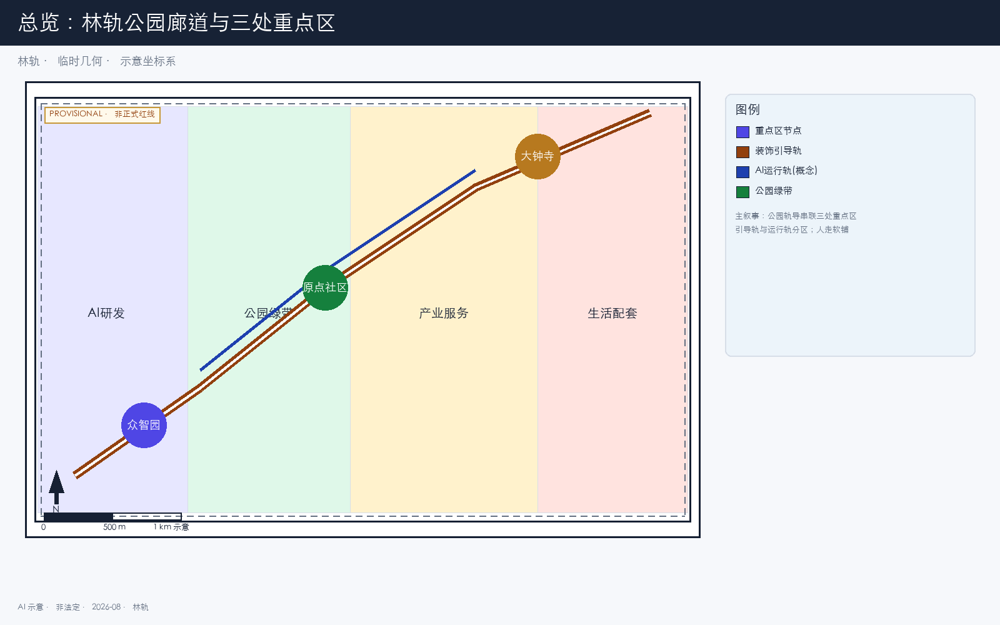
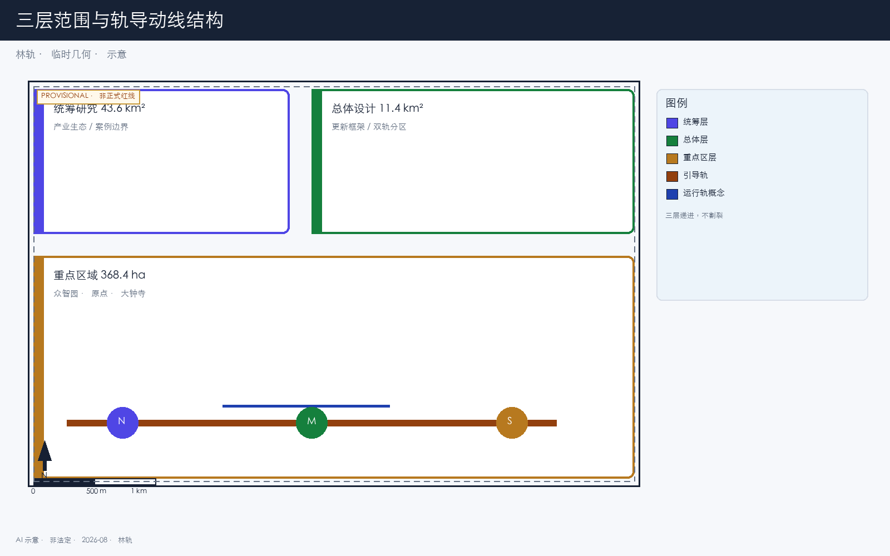
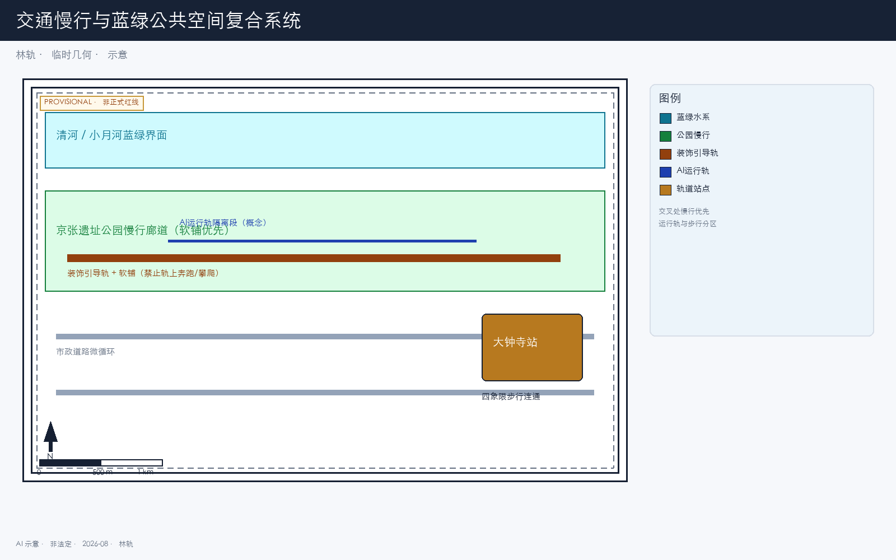
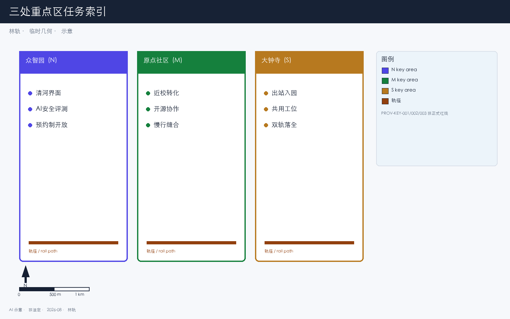
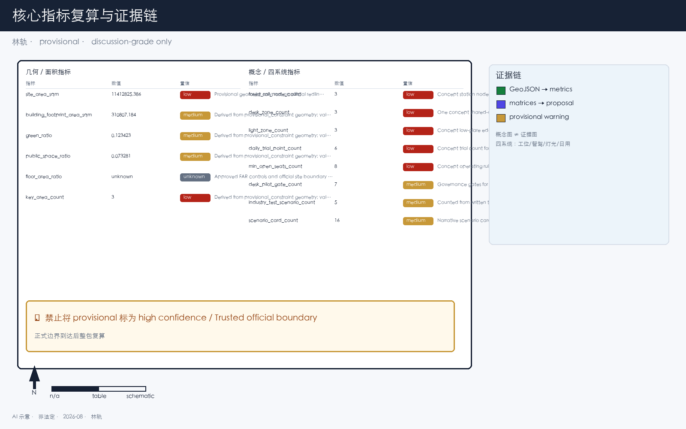

# 林轨 / Forest Rail

京张铁路遗址公园已经把铁轨留在了城里：有人跑步，有人推童车，有人沿轨散步。本方案不重新发明这条公园，也不把它做成科技秀场。

本方案的公众承诺只有三句：**走得通、坐得住、想得成**。

- **走得通**：轮椅、婴儿车、步行者、换乘者能沿软铺与引导轨理解并完成站—园—校—园区间的横向联系。
- **坐得住**：遮阴、避雨、安静停留与林下共用工位不以消费为门槛；最低开放席位不可撤光。
- **想得成**：人在公园层获得安静与创造力；企业可按规则包年认领**公共席配额**（不是私人舱）；AI 只作暗流调度，失败即退回人工与纸面通道。

方案不是给公园再铺一层「未来感」，而是把技术放进日常权利、运营责任与可停止机制。当前成果来自公开资料与仓库场地包，**未做**现场踏勘、居民访谈、客流/OD 调查、树木普查或设备测试。文中节点、周期与验收门均为可供专业团队深化的概念建议；GitHub 合并不等于官方征集资格、规划批准、资金承诺、获奖或实施决定 [source:AGENT-TASKBOOK]。

## 城市规划总判断

林轨回答的是**怎么组织这座 AI 创新带的空间与运行**，不是给走廊贴智能设备清单。

1. **公园城市作底盘**：京张遗产廊道是公共权利与日常创造力的主空间；众智园 / 原点 / 大钟寺共用同一套**可复制的中央公园层单元**，职能不同，不是三个互不相关的样板秀场。
2. **AI 作暗流调度**：林轨终端后台调度座位、灯带、无品牌日用与隔离轨短驳；人侧只感到安静、可坐、可问人。调度范围限于公园层，**不是**全区楼宇总控。
3. **空间经济服务公共底线**：企业包年/包季公共席形成运营营收**假设**与幸福感意向；不得挤占最低开放席；营收不作投资承诺 [assumption:A-DESK-LEASE-001]。
4. **双时间尺度同廊**：近端最小路径=引导轨+软铺+树冠+人工服务+可退出终端；同一廊道预留隔离运行制式的断面/净空/权属接口（更高运力含磁悬浮等仅为形态预留，**非已批工程、无线路里程、无投资额**）[assumption:A-RAIL-RESERVE-001]。

命名：「林轨」=*Forest Rail — the park layer of an AI city*。

- **林**：望出去是树，不是幕墙秀场。
- **轨（双轨分区）**：引导轨给人方向；与人行**完全隔离**的运行轨才承载 AI 可调度短驳。
- **林轨终端**：暗流调度公共座位/共用工位、低照度灯带、无品牌日用与节点开闭。不做人脸、不推品牌广告。
- **三站节点**：`FR-NODE-ZZY` / `FR-NODE-YY` / `FR-NODE-DZS` 可随正式 polygon 重定位 [data:geometry/public_space.geojson#FR-NODE-DZS] [metric:forest_rail_node_count]。

**本方案不做的事**：全区楼宇总控、网红打卡、灯光秀、绿化条冒充公园、私人舱工位、攀爬装饰轨、用监控换「智能」、品牌门店矩阵、把磁悬浮写成已批可建工程。

**AI 失败时，公园主体（软铺、树冠、最低座位、人工服务）仍可独立成立。**

## 一页执行摘要

| 评审问题 | 林轨的城市规划判断 | 可核验成果 |
| --- | --- | --- |
| 核心命题 | 公园城市底盘 + AI 暗流；林下工位可复制（含企业包年公共席）；最小路径与廊道制式预留同脊 | 总判断 + 四系统 + Gate |
| 空间响应 | 一脊三站；引导轨 / 隔离运行轨分区；站—校—园—河缝合 | 9 类 GeoJSON、三节点、五证据图 |
| 实施起点 | 近：软铺树冠人工+工位协议；中：终端与日用试运行；长：隔离运行/更高制式仅 Gate+专项后 | FR-01–09 + 前置清单 |
| 公共价值 | 走得通、坐得住、想得成；最低席位不可撤光 | [metric:min_open_seats_count] |
| 证据与边界 | provisional 几何可复算；案例仅机制；营收/磁浮为假设或形态预留 | metrics / assumptions / self_check |

## 设计依据与资料清单

本方案以《百年京张AI创新带城市设计国际方案征集资格预审公告》为第一依据 [source:OFFICIAL-ANNOUNCEMENT] [standard:PROJECT-OFFICIAL-ANNOUNCEMENT]，以 `brief/site-package/` 中登记的临时边界、重点区域和指标范围为机器可读依据 [source:SITE-PACKAGE] [depth:existing_conditions_diagnosis]。

当前采用 provisional boundary（`geometry/site_boundary.geojson`、`geometry/key_areas.geojson`），标注 `provisional_constraint`、`official_boundary=false`。正式边界发布后，所有空间数据、指标和图纸需要重新计算。这个限制不阻断内容评分，但正文中涉及面积、比例和空间位置的结论只能作为可讨论、可替换的设计参考。

资料登记表（`data/source_registry.json`）登记 formal / 背景 / provisional 资料；背景和 provisional **不升级**为法定依据 [source:SOURCE-REGISTRY]。

| 证据类别 | 本方案采用方式 | 可以支持 | 不能证明 |
| --- | --- | --- | --- |
| 官方任务依据 | 公告、任务书摘录 | 三层范围文字、三重点区名称、agent 任务 | 精确 polygon、控规指标、工程条件 |
| 临时空间依据 | 仓库 provisional boundaries | 生成、拓扑自检、相对关系、离线可视化 | official redline、权属、精确审批面积 |
| 智能体设计数据 | 本包 GeoJSON / metrics | 概念节点、容量讨论、分期示意 | 现状测绘、已确定拆改留 |
| 背景案例 | 公开建成公园与 AI 生态资料 | 机制启发 | 海淀绩效、投资额、可直接移植的容积率 |
| 桌面演练证据 | `visual/assets/*tabletop*` | 本地合成逻辑可复跑 | 现场绩效、已指派运营主体 |

包内权威顺序：GeoJSON → metrics → 三矩阵 → sources/assumptions/self_check → proposal.md → 图 → HTML → PDF。概念示意不能替代证据图。



## 三层范围工作框架

方案按公告三个层次组织 [source:SITE-PACKAGE] [depth:three_level_scope_framework] [depth:overall_spatial_structure]：

| 层级 | 公告口径 | 本层深度 | 林轨判断 |
|------|----------|----------|----------|
| 统筹研究 | **43.6 km²**（北五环—京藏—西直门外—万泉河） | 产业生态 + 未来城市形态 | 京张廊道=公园城市脊；三区两翼用「验证—转译—采用」回路协同 |
| 总体设计 | **11.4 km²**（遗址公园周边 1–2 km） | 控规深度城市设计 | 一脊双轨分区；林下工位协议；公园层调度语法；市政接口列前置 |
| 重点区域 | **368.4 ha**（众智园 192.1 / 原点 104.3 / 大钟寺 72.0） | 详细设计 / 组件图则级 | 三站共用可复制公园单元，职能不同 [metric:key_area_count] |

公告文字面积为 formal 口径；包内 provisional polygon 复算总体约 11,412,825 m²，与 11.4 km² 差约 0.11%，**两组值不互相替代** [metric:site_area_sqm] [metric:announced_overall_design_area_sqm]。官方 polygon 到位后按 [assumption:A-AREA-MISMATCH-001] 整链重算 [depth:metrics_recalculation]。

三层不割裂：统筹定走向，总体落图层与容量边界，重点区验证组件能否落地。



## 统筹研究范围产业与未来城市研究

京张铁路是这片区域里已有的叙事线，不需要再发明一条。1909 年通车，2019 年地下化后地面段成为遗址公园走廊。公告要求融合百年京张文化、中关村创新文化与 AI 创新文化 [source:AGENT-TASKBOOK] [standard:PROJECT-AGENT-OPEN-CALL-TASKBOOK]。

林轨的判断很窄：**不另造叙事，用铁轨本身；不另造绿廊，把遗址公园接入三站日常。** 轨条留在地上，生锈；人走在轨间软铺上。这条线串起三处重点区——众智园临清河，原点社区近高校，大钟寺临地铁。轨导动线是脊柱，不是装饰。

产业协同按人真会走的路径写：

- **高校策源**：成果沿遗址走廊向南走，不悬空画圆
- **开源协作**：原点社区接发布与代码协作
- **企业转化**：大钟寺接智能体、终端与数据要素企业；众智园接安全评测
- **公共服务**：沿轨径放可问人的服务节点，不堆无人屏幕
- **国际交流**：用可步行的轨径组织访问路线，不做巡游舞台

命名：「林轨」既是方案名也是空间描述。国际母题 *Forest Rail — the park layer of an AI city*。最小识别：锈色双轨 + 三个树冠绿节点字标见 `assets/forest-rail-mark.svg`；色彩净空规则见 agent.5。

### 优秀城市案例：机制迁移（背景）

下列为公开建成/已运营项目，**只迁移机制**，不移植容积率、投资额、客流 KPI 或治理权限。

| 案例 | 可迁移的城市规划机制 | 学 / 不学 | 不能证明 |
|------|----------------------|-----------|----------|
| 纽约 Central Park | 公园作城市公共权利底盘；多入口分层慢行 | **学**公园优先于景观秀；**不学**封闭式巨型管理 | 海淀客流/面积目标 |
| 纽约 High Line | 废弃铁路→连续公共廊道 | **学**铁路叙事再利用；**不学**高架游览消费、攀爬遗产 | 本案轨高程/造价 |
| 费城 Rail Park | 分段滚动开放 | **学**一期一段轻量试点；**不学**未完成段包装成建成 | 分期资金已到位 |
| 伦敦 King's Cross | 出站即入公共空间 | **学**站城缝合；**不学**商业综合体主导 | 站口 OD |
| 新加坡 Gardens by the Bay | 中央看板汇聚园艺/访客/安防传感；自动化降人工巡检；智能不抢游客体验 | **学**「暗流运维」；**不学**温室工程参数照搬 | 海淀传感预算 |
| Paris Station F | 旧铁路设施→高密度共享工位 | **学**遗产空间改共享密度；**不学**私人巨型房东 | 工位数 KPI |
| Singapore one-north / LaunchPad | 街区即测试场；共享设施低门槛 | **学**场景开放；**不学**单一国资统筹复制 | 国资结构 |
| Toronto Quayside 审查教训 | 数据治理、公众责任、退出前置 | **学**失败与退出公开；**不学**未审数据平台 | 可直接落地的平台架构 |
| 上海徐汇跑道公园 | 遗存→日常线性空间 | **学**叙事本土化；**不学**宽幅硬质打卡 | 材料已批准 |
| 京张铁路遗址公园（已建） | 铁轨留城、日常已在走 | **学**增量连接三站日常；**不学**抢功重做平行绿廊 | 接口改造已获批 |

本案立场：把遗产轨从「可看」推进到「可引导、可共事、可概念短驳」；突破落在**公园城市单元可复制**与**AI 暗流可退出**。

城市案例完整来源登记于 `sources.json`（`CASE-*`，background_only）；正文不堆叠全部 ID。表中已引用关键案例见 [source:CASE-GARDENS-BY-THE-BAY]、[source:CASE-AI-PARIS-STATIONF]、[source:CASE-JZ-HERITAGE-PARK]。

### 城市生命体叙事 · 国际传播与最小识别（agent.5）

**国际主张**：*Forest Rail — the park layer of an AI city.*  
中文对应：**林轨——AI 城市的公园层。**

对**城市生命体**：公园/森林是调节器——疏林与软铺让人安静，安静之后才谈创造力与绿色日常。公共载体是**共用办公区与休息区**，不是写字楼大厅搬进公园。

**京张三幕**：

1. **敢为人先（1909）**：京张通车——工程把不可能变成可通行。
2. **铁轨留城（2019）**：地下化后地面段成为遗址公园。
3. **林轨日常化（本案）**：三站接入公园层；锈轨减找路摩擦；终端与概念智驾减运货/座位/灯带/日用摩擦——**安全第一，失败退回步行与人工**。

**最小视觉识别**（可延展、非品牌帝国）：

| 要素 | 规则 |
|------|------|
| 字标 | `assets/forest-rail-mark.svg`：锈色双轨 + 三枚树冠绿节点 |
| 色彩 | 锈 `#B65A3C`、树冠绿 `#2F6B4F`、纸白底；禁止渐变发光与企业商标色替换 |
| 净空 | 标志四周至少 1× 节点直径；不得拉伸、旋转、加冠名 |
| 导视 | 图标优先于长句；中英双语安全信息；与字标分离，导视不冒充政府标识 |


### 全球 AI 创新生态案例与八要素图谱（agent.2）

下列为任务书要求的 AI 创新生态案例（背景级；不编造投资额/企业名单为既成事实）[source:CASE-AI-STANFORD-RP]–[source:CASE-AI-TORONTO-VECTOR]：

| 案例 | 可迁移机制 | 学什么 / 不学什么 | 不可移植数字 |
|------|------------|-------------------|--------------|
| Stanford Research Park | 土地·空间·产业·人才 | **学**高校—土地—人才管道；**不学**低密度大园区供地 | 园区亩产/租金 |
| London Knowledge Quarter | 空间·产业·数据·场景 | **学**车站城区知识密集更新；**不学**照搬院所体量 | 机构数量目标 |
| Singapore one-north / LaunchPad | 土地·空间·算力·数据·场景 | **学**街区即测试场；**不学**单一国资统筹复制 | 国资预算结构 |
| 深圳南山「模力营」 | 空间·算力·数据·场景·人才 | **学**公共要素打包；**不学**只做大模型写字楼 | 算力卡配额 |
| 上海张江 AI 枢纽模式 | 空间·产业·算力·数据·场景 | **学**垂直行业×AI；**不学**单一赛道行政主导 | 联盟名单 |
| Paris Station F | 空间·场景·算力·产业 | **学**旧铁路设施改共享密度；**不学**私人巨型房东 | 工位数 KPI |
| Toronto Vector Institute | 人才·产业·资金·空间 | **学**非营利人才—产业枢纽；**不学**以单一院所替代产业带 | 基金规模 |

**八要素机制（概念级，非承诺）**——每格挂到三站动作：

| 要素 | 众智园 | 原点社区 | 大钟寺 |
|------|--------|----------|--------|
| 土地 | 滨水公共界面许可谈判 | 近校零散空间许可池 | 站城衔接临时许可 |
| 空间 | 验证共享庭/林下步道 | 开源厅/林下共学 | 林下工位/日用点 |
| 产业 | 安全评测与标准界面 | 开源转化与近校孵化 | 终端/数据要素界面 |
| 资金 | 引导性共创（不写额度） | 同左 | 同左 |
| 人才 | 预约参观与带训 | 驻留/开源贡献 | 通勤办公与访客 |
| 算力 | 端侧+评测节点概念 | 共享协作算力概念 | 边缘节点概念 |
| 数据 | 匿名评测日志 | 开源贡献展示（非个人画像） | 匿名人流/缺货 |
| 场景 | TEST-04 安全节点 | TEST-05 工位公平开闭 | TEST-01/02/03 |

### 城市智能体运行协议：慢行断点（可审计）

正文不写「AI 管理」空话。慢行断点识别协议如下：

| 步骤 | 做什么 | 谁做 | 误判如何纠正 |
|------|--------|------|--------------|
| 1 采集 | 匿名热力计数 + 路网拓扑缺口规则（断点=无连续步行边 / 强制绕行过长） | 林轨终端传感 + 路网图层 | 原始计数不存身份 |
| 2 候选 | 算法输出「疑似断点」清单（位置、类型、置信度） | 算法 | 低置信度不得自动施工 |
| 3 校验 | 人工巡检拍照/步行实测；对照交通/权属约束 | 运维巡检员 | 误报标记 false_positive 并反馈训练/规则 |
| 4 审核 | 区级/项目管理方审定是否进入改造清单 | 项目审核人 | 可申诉；会议纪要归档 |
| 5 纠错 | 已改段复查；未达验收则回退或补强 | 运维 + 设计 | 停止条件：安全冲突或文保否决即停 |

城市智能体**不替代规划审批**，不输出个人画像。

### 产业测试验证场景卡（agent.3 · ≥5 · 统一六字段）

| 字段 | TEST-01 日用品补货调度 | TEST-02 座位/灯带环境调控 | TEST-03 隔离段智驾短驳 | TEST-04 安全节点预约 | TEST-05 近校工位公平开闭 |
|------|------------------------|---------------------------|------------------------|----------------------|--------------------------|
| 测试目标 | 补货时效与公平择点 | 最低席位与人工窗口不被关光 | 急停/让行/失败即停 | 预约制评测节点不开放成景点 | 噪声阈值开闭仍保最低席位 |
| 场地 | 大钟寺日用试运行点 [data:geometry/public_space.geojson#FR-NODE-DZS] | 三站工位区（桌面以 DZS 为代表） | 隔离概念段 | 众智园 [data:geometry/public_space.geojson#FR-NODE-ZZY] | 原点 [data:geometry/public_space.geojson#FR-NODE-YY] |
| 数据 | 匿名人流、缺货、周转 | 噪声/雨情/匿名密度 | 车载传感、越界、急停日志 | 预约槽、到访计数（匿名） | 噪声/密度；无身份 |
| 责任主体 | 运维；商户准入人工复核 | 运维；人工服务窗口 | 安全评估方+运维；概念 | 评测运营方+人工接待 | 运维+近校物业协商 |
| 停止条件 | 低需求节点被撤光；隐私事件 | 最低席位不达标；强制扫码 | 碰撞/急停失败/越界 | 未预约涌入或数据越权 | 轮椅席被关光；强制 App |
| 人工复核 | 每周择点审计；可申诉 | 每日最低供给巡检；桌面演练 PASS 不等于现场授权 | 每次试跑前后安全签字 | 预约名单人工抽查 | 每周公平审计 |

[metric:industry_test_scenario_count] = 5。桌面演练：`node visual/assets/run_desk_tabletop.js --check` → [data:visual/assets/desk-tabletop-evidence.json]；**G2 责任主体未指派前，限域试用 NOT AUTHORIZED** [data:visual/assets/operations-matrix.json] [metric:desk_pilot_gate_count]。

视听专用接驳车为 TEST-03 扩展概念（触觉+语音/文字+人工键），不写成已商用 [data:visual/assets/av-safety-gates.json]。

## 总体设计范围城市更新与控规深度城市设计

总体层按城市设计与控规深度组织空间主张 [standard:MOHURD-URBAN-DESIGN-MEASURES] [standard:MOHURD-CONTROL-DETAILED-PLANNING] [depth:overall_spatial_structure]。建筑方案深度待正式条件补齐前保持概念级，并以 [standard:MOHURD-ARCH-DESIGN-DEPTH-2016] 标明待深化边界（当前为 data_gap，不伪造审定深度）。

### 动线结构与普通人完整路径

轨导动线沿京张遗址公园走廊布置，串联三站。动线不是新画的红线，是对既有铁路线位的复用。

```
众智园 FR-NODE-ZZY（北）──轨── 原点 FR-NODE-YY（中）──轨── 大钟寺 FR-NODE-DZS（南）
                │                    │
              清河界面              近校慢行缝合
```

**普通人完整路径（无 AI 亦可完成）**：静态导向 → 连续无障碍软铺 → 遮阴与停留 → 人工服务点 → 可选数字辅助。拒绝 AI **不得**降低基本服务。

铁轨分两种作用，**物理分区、互不混用** [source:AGENT-TASKBOOK]：

| 作用 | 用什么 | 干什么 | 边界 |
|------|--------|--------|------|
| **装饰引导轨** | 锈轨 / 仿轨 / 地面绘画 + 软铺 | 方向：眼跟锈轨，脚走软铺 | 禁止轨上奔跑/攀爬；装饰轨不加灯带 |
| **AI 运行轨（概念）** | 隔离段智驾短驳 | 低速载人 + 自动配货；**安全性第一** | 与步行分区；非成熟商用 |

### 林轨系统语法：连续要素 / 可撤回要素 / 失败回退

| 类型 | 成员 | 规则 |
|------|------|------|
| 连续要素 | 装饰引导轨、软铺、树冠、最低开放座位、低照度边缘灯、人工服务点 | 近端分期必须落地；不依赖 AI 在线 |
| 可撤回要素 | 林轨终端节点、智驾运行段、无品牌日用点、传感 | 可停用；停用后连续要素仍工作 |
| 失败回退 | 运行轨停→步行+人工；终端断网→纸面时段；日用点撤→最低供给清单 | 写入验收句，可演练 |

### 林轨横向缝合（关系型接口）

九类关系是待核验的接口类型，不是九个已选址工程：

| 编号 | 相对接口 | 首要公共任务 | 核验前不得声称 |
|------|----------|--------------|----------------|
| FR-OI-01 | 公园—科研园区 | 共享进出与停留 | 已有开放通道或园区同意 |
| FR-OI-02 | 公园—校园社区 | 学习/托育/老人休息 | 校门时段可直接开放 |
| FR-OI-03 | 公园—铁路遗产 | 可溯源讲述与保护提示 | 可进入保护范围或改造本体 |
| FR-OI-04 | 公园—轨道公交 | 最后 500 m 与无障碍换乘 | 站口客流或工程条件已核实 |
| FR-OI-05 | 公园—蓝绿安全 | 暑热/暴雨替代路线提示 | 排水工程已批准 |
| FR-OI-06 | 公园—公共服务 | 人工接管便民转介 | 机构进驻或数据共享已确定 |
| FR-OI-07 | 公园—生产物流 | 人与低速物流分时边界 | 机器人可上路已许可 |
| FR-OI-08 | 公园—夜间安静 | 照明噪声与居民休息 | 夜间活动已获许可 |
| FR-OI-09 | 公园—市政算力 | 边缘节点断电降级 | 电力余量已确认 |

### 四系统：公共工位 · 智驾短驳 · 边缘灯带 · 无品牌日用

#### 1）公共工位系统（Shared Desk Protocol）

林下工位是**可复制的中央公园层单元**：众智园 / 原点 / 大钟寺同一协议、不同职能。对标 Station F「遗产空间→共享密度」，但不做私人舱、不以消费为入场门槛 [source:CASE-AI-PARIS-STATIONF]。

| 项 | 内容 |
|----|------|
| 对象 | 林下共用工位、弯道座位、雨棚热桌；三站各设工位区 [metric:desk_zone_count] |
| 两种席位 | **A 公共开放席**：谁来谁坐。**B 企业包年/包季公共席**：园区或企业认领席位配额，仍守同一开闭/安静/无身份规则，**不是私人隔断舱** |
| 空间经济 | B 类意向形成公园运营营收假设与片区幸福感；数字不入 metrics 作保证，见 [assumption:A-DESK-LEASE-001] |
| AI（暗流） | 噪声/雨情/匿名密度 → 开闭与电源；安静/讨论分区；不做人脸 |
| 硬约束 | 最低开放席位 [metric:min_open_seats_count] 不可被租赁配额挤光；不强制扫码；轮椅席不被关光 |
| Gate | 环境超阈值可关，人工窗口常开；申诉路径；G2 未指派则 NOT AUTHORIZED |
| 证据 | `visual/assets/run_desk_tabletop.js` / `desk-tabletop-evidence.json` |

#### 2）安全优先智驾短驳与廊道制式预留（Safety-First AV Rail）

隔离轨是 AI 城市**最可调度**的基础设施：与人行完全物理隔离，路径可调、速度可控、建设扰动低于开墙破路；重点城市场所形态长期相对稳定，故廊道投资有城市学理由——**非海淀本地统计证明**。

| 项 | 内容 |
|----|------|
| 分区 | 引导轨 ≠ 运行轨；运行轨与步行**完全隔离** |
| 近端最小路径 | 只做引导轨 + 软铺 + 标识；运行轨仅隔离概念段 |
| AI | 班次、避让、日用补货；失败即停，恢复步行优先 |
| 远期预留 | 同一廊道预留隔离运行制式的断面/净空/权属接口；更高运力（含磁悬浮等概念）仅作**形态预留**，**非已批工程、无线路里程、无投资额** [assumption:A-RAIL-RESERVE-001] |
| Gate | 无安全评估/责任主体/急停演练 → **NOT AUTHORIZED** [data:visual/assets/av-safety-gates.json] |
| 指标 | 未入 metrics 的精确公里数不得主张；一律 concept |

#### 3）边缘灯带（Edge Light Protocol）

| 项 | 内容 |
|----|------|
| 对象 | 软铺边缘 + 座位区低照度地灯 [metric:light_zone_count] |
| AI | 日照/时段/匿名密度调亮度与区段 |
| 禁令 | 装饰轨加灯带、跑马、投影、灯光秀 |
| 包容 | 眩光上限、低视力友好；故障默认熄灭或极弱常亮 |

#### 4）无品牌日用（Unbranded Daily Essentials）

| 项 | 内容 |
|----|------|
| 流程 | 多点试运行 [metric:daily_trial_point_count] → 契合度 → 开放准入摊位 / 社区快周转店 |
| AI | 缺货、周转、匿名人流；**公平择点**（低需求保留最低供给） |
| 边界 | 无品牌标识、不人脸、不广告；人工复核升级；每周偏差审计 |

### 公园层智能调度（暗流运维）

对标 Gardens by the Bay 的中央看板思路：传感与规则汇入运维台，触发告警与开闭，**游客侧仍是安静公园** [source:CASE-GARDENS-BY-THE-BAY]。林轨调度对象限于公园层四系统，**不是**全区楼宇总控。

| 调度域 | 输入（最小必要） | 输出 | 失败回退 |
|--------|------------------|------|----------|
| 工位开闭 | 噪声/雨情/匿名密度 | 分区开闭、电源 | 保留最低席位 + 人工窗口 |
| 边缘灯带 | 日照/时段/密度 | 区段亮度 | 熄灭或极弱常亮 |
| 无品牌日用 | 缺货/匿名人流 | 补货建议、公平择点 | 最低供给清单 + 人工审计 |
| 隔离短驳 | 车载传感/急停状态 | 班次或停运 | 立即停运，步行优先 |
| 节点开闭 | 天气/活动许可 | 试运行点开闭 | 纸面时段表 |

治理边界（Quayside 教训）：最小数据、可审计、可申诉、可退出；不做人脸、不存个人画像 [source:CASE-TORONTO-QUAYSIDE]。

### 无障碍与包容性（行动不便者优先）

| 人群 | 空间与设施 | 林轨终端 / 智驾边界 |
|------|-----------|---------------------|
| **轮椅使用者** | 尽量无坡、少坡；必坡≤1:20 + 扶手；软铺连续防滑 | 不因 AI 关席取消全部可达座位 |
| **视听障碍者** | 触觉导引 + 低眩光边缘灯 | 概念专用 AI 接驳车：触觉+语音/文字+人工键 |
| **认知障碍/低数字技能** | 不依赖 App；纸质/图标 + 人工 | AI 只建议，不强制扫码 |
| **非中文使用者** | 图标优先；安全信息中英双语 | 不做人脸、不推广告 |

**公平择点**：算法纳入低需求社区最低服务半径；可审计、可申诉、可人工覆写。

### 安全专节（停止条件与人工接管）

| 风险 | 硬规则 | 停止 / 接管 |
|------|--------|-------------|
| 智驾碰撞/越界/急停失败 | 安全第一；让行步行 | 立即停运，恢复步行优先 |
| 灯带眩光 | 只照边缘与座位区 | 故障熄灭或极弱常亮 |
| 锈轨攀爬/奔跑 | 装饰轨禁止攀爬 | 巡检劝阻；文保冲突即停改造 |
| 儿童与软铺 | 孩子可在轨旁软铺活动，不在锈轨上 | 湿滑即限流或关闭段 |
| 隐私 | 不做人脸、不存身份 | 越权采集即隔离传感 |
| 断网 | 终端可离线 | 退回纸面时段与人工窗口 |

## 用地、建筑规模与拆改留方案

总体设计范围内的更新按三类处理。凡涉容积率、建筑高度、道路红线等控制条件，一律区分**已知资料 / 概念建议 / 待专业确认**；缺官方数据标 unknown，不编数字 [assumption:A-CONTROLS-001]。

- **保留（概念建议）**：京张遗址走廊两侧已建成且质量良好的建筑，意向保留——待权属与质量普查确认
- **改造（概念建议）**：首层业态和外立面需调整者——去掉 LED 屏、增加林下通透性——待消防/权属确认
- **更新（待专业确认）**：低效空间识别后的新建机会——新建高度**宜**控制在树冠以下；**不得**写成已批高度或容积率

用地方案依据国土空间分类标准表达 [standard:MNR-LAND-USE-CLASSIFICATION-GUIDE] [depth:land_use_layout] [depth:development_intensity_controls]，覆盖设计边界且无重叠 [data:geometry/land_use.geojson#LU-001]。建筑基底和保留/改造/更新分类记录在 [data:geometry/buildings.geojson#BLDG-001] [depth:retain_renovate_demolish] [depth:height_massing_character]。

建筑基底示意**不是**现状普查结果，也**不是**建筑规模或密度控制指标。

## 交通、轨道、市政与公共服务设施

交通方案回应公告对轨道站点一体化、道路微循环、慢行断点和绿色交通的要求 [depth:traffic_rail_slow_parking]。市政与新基建接口（端侧节点、供电、网络）按 [depth:municipal_new_infrastructure] 列为深化前置，缺资料不编工程参数。

重点处理：

1. **大钟寺站四象限步行连通**：地铁 13 号线大钟寺站周边，打通路口四个象限的步行联系，轨径从站口延伸进片区
2. **北五环跨越节点**：遗址走廊跨北五环处的慢行衔接（桥下空间或跨线设施），保持南北贯通
3. **轨径与市政道路交叉**：交叉处慢行优先，轨条嵌入路面标识方向，不设信号灯管轨径

道路和慢行图层保持在提交边界内 [data:geometry/roads.geojson#ROAD-001]，与公共空间、绿地相互校核。当前边界为 provisional，交通结论只能作为设计讨论。



市政设施覆盖端侧算力节点、分布式能源和传统市政融合。缺少管线、能源、排水等工程资料时列为深化前置条件，不编工程参数。

## 蓝绿空间、公共空间与城市风貌

蓝绿空间以京张遗址走廊为骨架，统筹清河、小月河和周边社区出行 [depth:blue_green_public_space] [standard:MOHURD-URBAN-DESIGN-MEASURES]。

**树冠层是风貌控制的核心手段**：选冠幅 ≥8m 的本土乔木（国槐、白蜡、银杏、栾树），覆盖率目标 ≥70% 建筑屋面。树不修剪成几何造型。建筑高度低于树冠——这是城市森林的基本判据。

风貌原则：

- 建筑外立面用砖、混凝土、木材等可老化材料，不用光滑玻璃幕墙
- 锈色和灰绿是基调色，来源于轨道氧化和树冠
- 屋顶不做造型，做绿化或设备平台
- 公共艺术只接受与场地历史相关的、可老化的作品——铁、石、木，不用不锈钢和灯光装置

城市风貌控制中哪些是设计建议、哪些待官方确认，在 `standard_matrix.json` 中逐条标注。

## 重点区域详细设计

三站使用同一结构块（位置 / 公园层角色 / 林轨终端 / 智驾物流 / 五组件 / 不许做什么 / 测试卡），深度对齐，避免只做大钟寺「样板端」 [depth:three_key_area_detailed_design]。当前三处 polygon 均为 provisional [data:geometry/key_areas.geojson#PROV-KEY-001]。

### 众智园 AI 自主创新加速区

**位置**：最北段，临清河 [data:geometry/key_areas.geojson#PROV-KEY-001]；节点 [data:geometry/public_space.geojson#FR-NODE-ZZY]。

**公园层角色**：清河滨水安静验证界面——退让建筑，林下步道与雨洪草坡；安全评测转译为**预约制**协作节点，不做开放景点。

**林轨终端**：预约制安全节点开闭；访客座位保留最低供给；河岸边缘低照度地灯；可选无品牌日用点。

**智驾/物流（概念）**：隔离段物料/访客短驳仅作概念延伸；未授权前不混入人流。

| 组件 | 本地规则 | 不许做什么 | 核验前不得声称 |
|------|----------|-----------|----------------|
| 树冠层 | 疏林+雨洪草坡，国槐/白蜡，冠幅≥8m | 几何绿篱、观赏小乔充数 | 已成林荫效果 |
| 轨径 | 河岸段引导轨入地，人走软铺 | 架高桥、抛光喷漆、加灯带 | 「天然认路」已成立 |
| 软铺 | 透水防滑，河岸缓坡 | 大面积沥青、光滑石材 | 雨天通行已验收 |
| 林下办公 | 河岸开放座位与轻量休息棚 | 私人舱、网红打卡装置 | 高利用率已证实 |
| 锈 | 自然氧化时间标记 | 仿锈面板、人工做旧喷漆 | 必为原生铁路锈 |

**不许做什么**：开放式围观测评；河岸光幕秀场；个人画像采集；无人配送抢时；自称已建成测评场馆。

**测试卡绑定**：TEST-04 安全节点预约。

### 北京 AI 原点社区

**位置**：中段，近高校 [data:geometry/key_areas.geojson#PROV-KEY-002]；节点 [data:geometry/public_space.geojson#FR-NODE-YY]。

**公园层角色**：近校林下共学 / 开源第三空间——轨径缝合校门与园区，打通围墙断点。

**林轨终端**：24h 协作区按噪声阈值开闭；热桌电源；安静/讨论分区；最低席位与人工窗口。

**智驾/物流（概念）**：校门—园区补货与无障碍接驳概念；成熟前人工兜底。

| 组件 | 本地规则 | 不许做什么 | 核验前不得声称 |
|------|----------|-----------|----------------|
| 树冠层 | 校门—园区轴列疏林，覆盖讨论场地 | 球形/方形树阵 | 已成荫 |
| 轨径 | 引导轨指向发布厅，人走软铺 | 架高桥、抛光、轨上灯带 | 「直达自然」 |
| 软铺 | 校区街衔接透水连续防滑 | 大面积沥青、光滑石材 | 通行已验收 |
| 林下办公 | 共用热桌；安静/讨论分离 | 私人舱、打卡舱 | 「高效协作」已证实 |
| 锈 | 自然氧化时间标记 | 仿锈面板、人工做旧 | 必为原生锈 |

**不许做什么**：人才公寓综合体式堆砌；灯光秀；开发者画像采集；私人舱工位；自称发布厅已正式启用。

**测试卡绑定**：TEST-05 近校工位公平开闭。

### 大钟寺 AI 产业聚集区——城市森林

**位置**：最南段，临地铁大钟寺站 [data:geometry/key_areas.geojson#PROV-KEY-003]；节点 [data:geometry/public_space.geojson#FR-NODE-DZS]。

**公园层角色**（公告约 **72.0 ha**）：站城入园 + **可复制中央公园层单元的南端样板**——出站即入公园，公园里能共用一张桌子；周边产业楼宇可认领林下包年公共席，把「中央公园可复制」做成站区日常，而非一次性网红装置。

**林轨终端**：全套座位/灯带/日用试运行；断网退回纸面规则。

**智驾/物流（概念）**：日用补货 + 视听专用接驳扩展概念；与步行完全分区；非商用结论。

| 组件 | 本地规则 | 不许做什么 | 核验前不得声称 |
|------|----------|-----------|----------------|
| 树冠层 | 国槐/白蜡，冠幅≥8m，压住低层屋面 | 球形修剪、小乔充数 | 屋面遮挡已达标 |
| 轨径 | 站口四象限各引引导轨进公园 | 架高桥、抛光、轨上跑/攀爬 | 「出站自然入园」已验收 |
| 软铺 | 轮椅尽量无坡、同标高连续 | 沥青广场、光滑石材、台阶断点 | 无障碍已贯通 |
| 林下办公 | 公共开放席 + 企业包年公共席；玻璃隔断、谁来谁坐规则统一 | 私人舱、LED 外立面、打卡舱、租赁挤光最低席 | 「高协同」或营收已证实 |
| 锈 | 自然氧化时间标记 | 仿锈面板、人工做旧喷漆 | 必为原生锈 |

**不许做什么**：品牌门店矩阵；人脸监控/广告推送；灯光秀；关光全部座位；自称智驾/磁浮已商用或已批。

**大钟寺站一体化**：A/B/C/D 四出口各引轨径进四象限。第一眼是公园与锈轨，不是广告屏。

**商业与运营**：无品牌日用试运行 → 开放准入摊位；企业包年公共席为运营意向（假设）；低需求保留最低供给。

**测试卡绑定**：TEST-01 / TEST-02 / TEST-03。

概念示意（非正式证据图；正式主张以 GeoJSON / metrics / 五张证据图为准）：




## AI 创新生态、人才画像与 AI+ 场景

场景卡与画像对齐公告 agent.3 要求 [source:AGENT-TASKBOOK]，深度矩阵见 [depth:three_key_area_detailed_design]。

| 画像 | 谁 | 在林轨上做什么 | 数据边界 |
|------|----|---------------|---------|
| **走路通勤的程序员** | 住在附近、每天步行上班的 AI 工程师 | 从大钟寺站出来，沿轨径走 800m 进办公楼；中午在林下吃饭；下班沿轨径散步回家 | 不采集个人通勤轨迹；轨径人流只做匿名计数 |
| **带孩子散步的居民** | 片区周边小区住户 | 傍晚推婴儿车沿软铺走，孩子在轨旁软铺上跑（不在锈轨上）；在林下座椅坐着聊天 | 不采集家庭画像；不推送商业信息 |
| **来开会的企业访客** | 头部企业的商务客人 | 大钟寺站出来，轨径引导到企业展厅；开完会沿轨径走到下一个节点 | 企业标识和案例需清权 |
| **独自工作的自由职业者** | 不在固定公司上班的人 | 早上来公园共用工位区找空位坐下；环境安静时开放，人多时关闭；工位可共用、不占座 | 不记录工位使用者身份 |
| **退休后每天散步的老人** | 70-80 岁，住附近 | 每天早上沿轨径走一圈，在弯道处的长椅坐一会儿看树；路面必须防滑 | 不采集健康数据 |
| **轮椅使用者** | 需轮椅出行者 | 走无坡/少坡的连续软铺；在站城衔接与公园节点使用无障碍座位与回转空间 | 不采集行动能力画像 |
| **视听障碍者** | 视障或听障访客、居民 | 靠触觉导引、低眩光地灯与（概念）专用 AI 轨道接驳车完成站—公园—节点移动 | 不做人脸；接驳车提供语音/文字/触觉多模态，可随时人工协助 |
| **非中文访客与低数字技能者** | 国际访客、不愿或不会用 App 的居民 | 看图标与双语标识即可坐下、避雨、买到水；复杂操作找人工服务点 | 不强制注册或扫码 |

### 场景卡（≥10 · 六字段协议）

每张场景统一六字段：服务对象 / 最小必要数据 / 空间边界 / 人工复核者 / 退出申诉 / 停止条件。下表为摘要；完整字段在测试卡与运营矩阵中展开。[metric:scenario_card_count]

| # | 场景 | 空间载体 | 服务对象 | 最小数据 | 人工复核 | 退出/停止 |
|---|------|---------|----------|----------|----------|-----------|
| 01 | 出站入园 | 大钟寺站口 | 所有到达者 | 无 | 站务/运维 | 广告屏盖过公园视线即整改 |
| 02 | 轨径慢行 | 全廊道 | 通勤/散步 | 匿名计数可选 | 巡检 | 湿滑/文保冲突即限流 |
| 03 | 林下共用工位 | 三站工位区 | 自由职业/午休 | 噪声/雨情/密度 | 人工窗口 | 低于最低席位即停 AI 关席 |
| 04 | 锈轨弯道长椅 | 弯道 | 老人/亲子 | 无 | 巡检 | 攀爬风险即劝阻 |
| 05 | 企业沿轨展厅 | 大钟寺首层 | 访客 | 无身份 | 商户合规 | 遮挡公园安静即关展 |
| 06 | 雨天避让 | 雨棚+树冠 | 所有人 | 雨情 | 人工开放雨棚 | 内涝即关闭段 |
| 07 | 开源发布厅 | 原点 | 开发者/师生 | 公开 commit 流 | 活动主办 | 强制扫码入场即停 |
| 08 | 智驾短驳（概念） | 隔离段 | 试跑乘客 | 车载传感 | 安全签字 | 急停失败即永久停运至复审 |
| 08b | 视听接驳（概念） | 固定站 | 视听障碍者 | 无人脸 | 人工协助键 | 多模态失效即停 |
| 09 | 夜间灯带 | 软铺边缘 | 夜行者 | 时段/密度 | 运维 | 眩光投诉即降功率 |
| 10 | 清河创新廊 | 众智园 | 预约访客 | 预约槽 | 接待人工 | 未预约涌入即关闭 |
| 11 | 数据要素会客厅 | 大钟寺 | 企业/监管 | 授权范围 | 合规官 | 越权展示即下线 |
| 12 | 近校转化街 | 原点 | 初创/投资人 | 无画像 | 服务台 | 扰民即限时 |
| 13 | 无品牌日用点 | 多点 | 居民/通勤 | 缺货/匿名人流 | 每周审计 | 撤低需求点即违规 |
| 14 | 正式摊位升级 | 高契合点 | 社区商户 | 契合度报告 | 准入委员会 | 品牌垄断即撤销 |
| 15 | 轮椅慢行 | 无坡段 | 轮椅/婴儿车 | 无 | 无障碍巡检 | 断坡未修即绕行指引 |
| 16 | 最低公共供给 | 低需求节点 | 低需求社区 | 供给清单 | 每日巡检 | 关光最后一处水/座即停 AI |

### 组件库与弱荣誉展示（agent.4 · 轻量）

不做网红打卡榜。可复用组件与「弱荣誉」记录如下：

| 组件 ID | 名称 | 用途 | 荣誉记录方式 |
|---------|------|------|--------------|
| FR-C01 | 锈轨引导段 | 方向识别 | 贡献者可在节点铜牌留姓名缩写（可选、可拒绝） |
| FR-C02 | 林下热桌单元 | 共用办公 | 开源贡献墙滚动（非个人画像） |
| FR-C03 | 边缘灯带模组 | 低眩光照明 | 无 |
| FR-C04 | 无品牌日用铺面 | 一日必需 | 社区服务时长公开账（聚合） |
| FR-C05 | 人工服务亭 | 无 AI 等价服务 | 值班公开簿 |
| FR-C06 | 接管急停柱 | 智驾/终端停用 | 演练记录归档 |

三处弱地标（非网红）保留：锈轨弯道大槐树；轨径-小月河石粉广场；旧站台矮墙。

### 年度活动与长期运营（agent.6 · 机制）

| 节奏 | 活动 | 开放对象 | 转化出口 | 停止条件 |
|------|------|----------|----------|----------|
| 季 | 林下开源下午茶 | 开发者/师生 | 原点发布厅路演槽 | 扰民/强制商业冠名 |
| 半年 | 无品牌日用公平审计公开日 | 居民/商户 | 择点调整说明 | 数据越权 |
| 年 | 公园层安全演练日 | 运维/公众旁听 | 急停与断网接管剧本更新 | 未达演练签到门槛则推迟运行轨讨论 |
| 常态 | 开发者社区：场景卡 Issue 化 | 全球开发者 | 可复用组件 PR | 人身攻击/隐私泄露即封禁 |

国际招引只通过可步行访问路线与公开证据册，不做巡游舞台。

## 更新项目清单、实施政策与分期计划

项目清单与分期分别由 [depth:renewal_project_list] 与 [depth:phasing_implementation] 约束；无主体/资金/审批时只写风险，不承诺落地。

| 编号 | 项目 | 类型 | 主要依赖 | 分期 |
|------|------|------|---------|------|
| FR-01 | 大钟寺站四象限轨径连通 | 慢行/轨道一体化 | 轨道站点、路口交通组织 | 近期试点 |
| FR-02 | 轨径引导段铺设（大钟寺段） | 公共空间 | 锈轨来源、软铺材料、排水 | 近期试点 |
| FR-03 | 树冠层种植（大钟寺段） | 绿化 | 苗木规格、土壤改良、管线避让 | 近期启动，3-5 年成冠 |
| FR-04 | 林下办公首层改造 | 建筑改造 | 权属、首层业态调整 | 中期 |
| FR-05 | 众智园清河创新界面 | 蓝绿/产业 | 河道蓝线、生态和防洪条件 | 中期 |
| FR-06 | 原点社区校区慢行缝合 | 慢行 | 校区边界、围墙拆除协商 | 中期 |
| FR-07 | 节点间 AI 运行轨概念验证段（载人短驳+自动配货） | 新基建（概念） | 工程可行性研究、安全评估、分区隔离；见 PR-12 | 长期/待深化 |
| FR-08 | 全线轨径贯通（三处重点区连通） | 公共空间/慢行 | 北五环跨越、沿线权属；见 PR-03/05 | 长期 |
| FR-09 | 林轨终端试点（座位·灯带·日用·无障碍） | 运营/治理 | 最低供给、公平择点、人工窗口；见 PR-11/13/14 | 近期试点 |

近期试点可以用轻量设施启动（铺石粉、放长椅、种树苗），**无 AI 也可成立**。中期终端与日用试运行。长期隔离运行轨仅当 AV Gate 全过。**AI 失败不拖垮公园主体**写入验收。

**前置条件清单**（参与主体、权属、成本级别、验收、运维）：见 `report/narrative.md` [source:NARRATIVE-SUPPORT]。

分期空间证据 [data:geometry/phasing.geojson#PHASE-001]。

## 指标体系、面积复算与合规矩阵

指标分三类：

| 类型 | 示例 | 数据来源 | 精度 |
|------|------|---------|------|
| 可由提交几何复算的空间指标 | 边界面积、绿地比例、公共空间比例、建筑基底 | GeoJSON 图层 | 受 provisional boundary 限制 |
| 需要官方控规支撑的管控指标 | 容积率、建筑高度、建筑密度、退线 | 待正式控规 | 当前标注 unknown |
| 需要运营数据持续校准的绩效指标 | 轨径日均人流、林下工位使用率、节点开闭频次 | 运营后采集 | 当前为设计建议值 |

三类指标分别进入 `metrics.json`、`assumptions.json` 和 `compliance_matrix.json`。完整复算保存在 `metrics.json`，正文只解释设计含义 [depth:metrics_recalculation]。



关键空间指标可由 [metric:site_area_sqm]、[metric:green_ratio]、[metric:public_space_ratio] 登记复核；其余见 `metrics.json`（含最低席位、产业测试与工位门闩）；绿地边界见 [data:geometry/green_space.geojson#GREEN-001]。

### 合规矩阵覆盖

`compliance_matrix.json` 逐条映射公告 1.3-1.5 和 agent.1-agent.6：

| 要求 | 本方案章节 | 核心证据 |
|------|-----------|---------|
| 1.3 构建世界级 AI 创新生态 | 统筹研究 + 八要素 | 7 案例表 + 三站要素落点 |
| 1.4 三层范围 | 三层范围 | 各层任务表 |
| 1.5.3.1 众智园 | 重点区域·众智园 | PROV-KEY-001 + FR-NODE-ZZY + TEST-04 |
| 1.5.3.2 原点社区 | 重点区域·原点社区 | PROV-KEY-002 + FR-NODE-YY + TEST-05 |
| 1.5.3.3 大钟寺 | 重点区域·大钟寺 | PROV-KEY-003 + FR-NODE-DZS + TEST-01/02/03 |
| agent.1 一带总体概念 | 动线 + 系统语法 | 一脊三站 + 连续/可撤回要素 |
| agent.2 AI 全栈创新 | 全球 AI 生态 + 八要素 | CASE-AI-* |
| agent.3 AI+ 场景 | 画像/场景/测试卡 | 16 场景 + 5 测试卡 + 桌面演练 |
| agent.4 公共空间与地标 | 组件库 + 弱地标 | FR-C01–C06 |
| agent.5 文化融合叙事 | 城市生命体 + 最小字标 | 主张句 + forest-rail-mark.svg |
| agent.6 全球活动与长期运营 | 年度活动表 + 前置清单 | agent.6 表；narrative.md |

## 风险、版权与合规说明

缺资料与 provisional 边界处理见 [source:SOURCE-REGISTRY] 与 [data:geometry/site_boundary.geojson#SITE-001] [depth:risk_missing_data]。

所有空间结论受 provisional boundary 限制。正式边界发布后必须**整链重算**：九组 GeoJSON、metrics、五张证据图、A3/A0、HTML 与 manifest——不能只换单个文件。

**逐条压制 forbidden claims**（`allowed_design_space.json`）：本方案**不主张**官方批准、已批控规、最终权属、已确认建设规模、保证实施、无来源精确文保控制、无来源精确道路红线。企业包年席营收与廊道制式预留（含磁浮概念）均为假设/形态预留，**不是**投资或工程承诺。

### AI 运行轨与林轨终端（概念）

- **智驾短驳车**：**安全性第一**——限速、急停、让行步行与装饰轨区；碰撞/越界/急停失败即停运。可载人，并可自动配置货物/物料舱（含日用点补货）。概念建议，非成熟商用结论。
- **林轨终端**：智能调控公共开放座位/共用工位、地面灯带/低照度地灯，以及无品牌日用点的日常必需品开闭/补货/调配；不做人脸、不推品牌广告；断网可人工接管；**保留最低开放席位、人工窗口与低需求社区基本供给**。
- **无品牌日用试运行点**：起步无品牌标识；AI 只输出契合度与供给建议，正式摊位升级须人工复核与开放准入；失败可撤点；**不得只追高人流量撤低点需求节点**。
- **无障碍**：轮椅路径尽量无坡/少坡（必坡≤1:20 + 扶手）；视听障碍者预留**专用 AI 轨道接驳车**概念（触觉 + 语音/文字 + 人工键）；认知/低数字技能/非中文使用者不强制 App，现场人工与双语标识兜底。
- **装饰引导轨**：禁止攀爬与奔跑；与运行轨物理分区。铁轨是城市线索，公园优先人与自然、让人安静下来。

### 版权与双语等价

- 完整权利链：`report/copyright_statement.md` [source:COPYRIGHT-STATEMENT]（逐资产表；证据图为程序工程图，概念渲染为示意）
- 中英图等价核对与前置条件表：`report/narrative.md` [source:NARRATIVE-SUPPORT]
- 图件页脚仅写投稿包 geometry/metrics + 2026-08；**禁止**幻觉机构名、XX市、Working Draft 政府背书

### 缺资料清单

`missing_data_checklist.csv` 中列出的官方边界、控规、道路、市政、文保等缺口进入 `assumptions.json` 和自检。缺少官方条件的结论降级为待确认事项。

### 版权

方案必须提供中英双语（`proposal.en.md`）。图片、数据和代码资产在 `sources.json` 和 `report/copyright_statement.md` 中说明来源和授权。HTML 页面不加载远程脚本、地图瓦片、字体、iframe 或外部 API。

### 声明

本方案不声称官方批准、审定控规、最终权属、最终建设规模或保证实施。

## 参考资料

完整索引见 [source:OFFICIAL-ANNOUNCEMENT]、[source:AGENT-TASKBOOK]、[source:SITE-PACKAGE]、`sources.json`、`metrics.json`、`compliance_matrix.json`。

- brief/public-brief.md
- brief/site-package/design_brief.json
- brief/site-package/allowed_design_space.json
- data/processed/agent_fact_pack.md
- data/processed/project_scope_summary.csv
- data/processed/agent_task_requirements.csv
- data/processed/missing_data_checklist.csv
- 完整来源索引：`sources.json`、`metrics.json`、`compliance_matrix.json`、`standard_matrix.json`、`design_depth_matrix.json`
