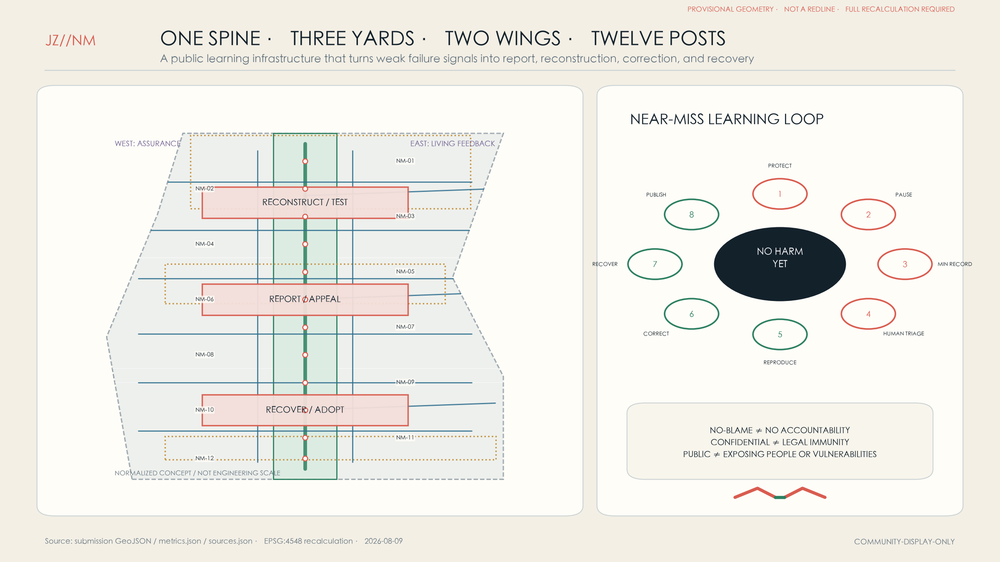
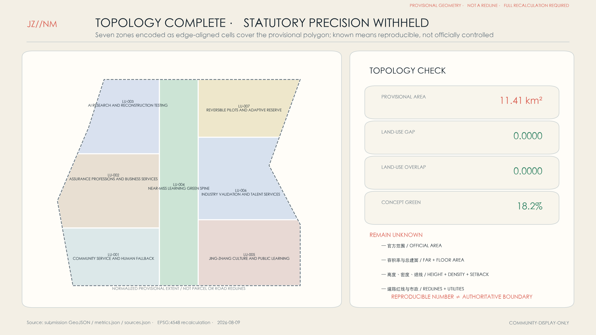
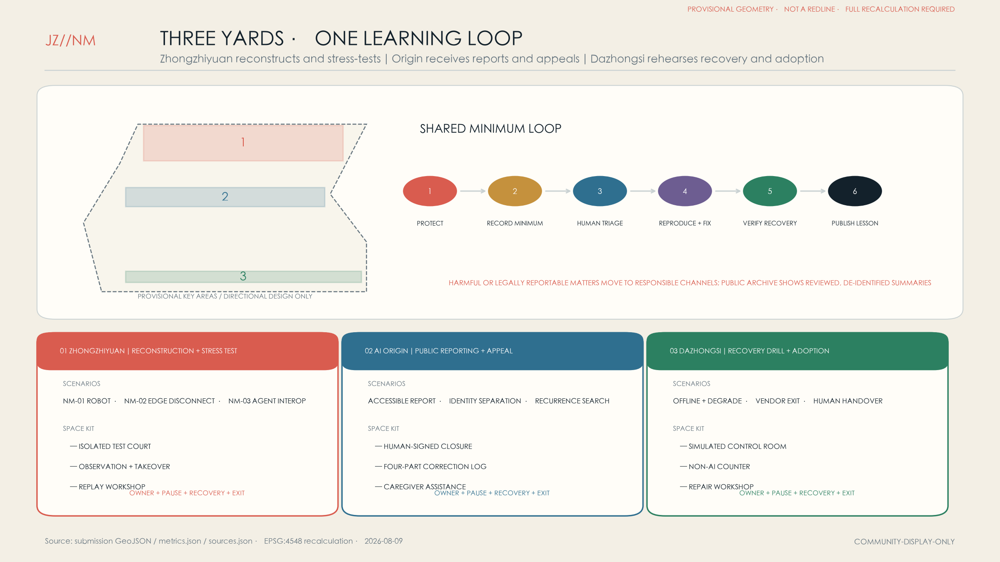
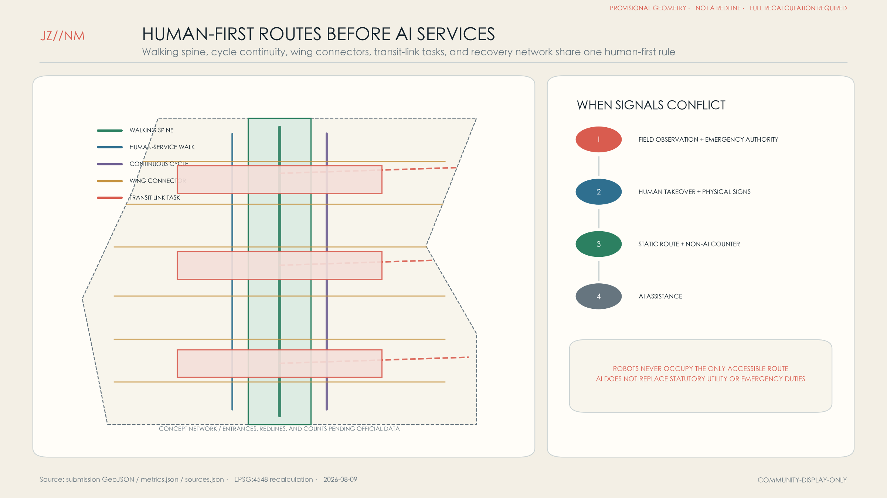
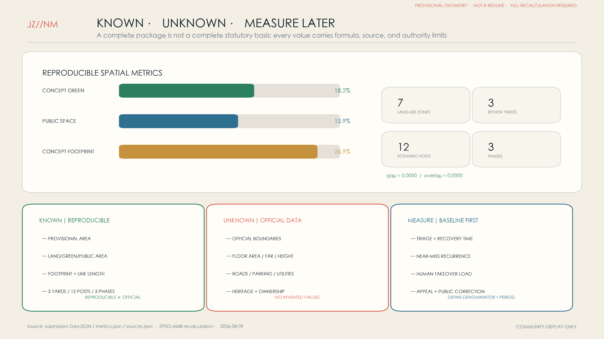

# Jing-Zhang Near-Miss Line: Let the City Learn Before Harm

The **JING-ZHANG NEAR-MISS LINE** is not a showcase that claims AI will never fail. It is an urban learning infrastructure that makes weak failures, close calls, corrections, and recovery visible. Its spatial grammar is **one spine, three yards, two wings, and twelve posts**. The Jing-Zhang heritage-park corridor becomes the Near-Miss Learning Spine. Zhongzhiyuan hosts a Reconstruction and Stress-Test Yard; the Beijing AI Origin Community hosts a Public Reporting and Appeal Yard; Dazhongsi hosts a Recovery Drill and Adoption-Learning Yard. A western assurance wing connects standards, law, insurance, and professional services, while an eastern living-feedback wing connects everyday mobility, retail, culture, community services, and municipal operations. “Near miss” is a proposed operational category for an event that caused no known realized harm but revealed a credible pathway to harm; it is not presented as a statutory Chinese term.

The original **JZ//NM** mark shows two coral trajectories separating just before collision and joining a green correction loop. It means: protect people first, preserve the minimum necessary evidence, then make the correction legible. The mark is original to this concept and uses no government, corporate, or railway identity.

## Design Basis and Source List

The proposal answers the official announcement’s three scope levels, two wings, three key areas, and professional deliverables. It also treats the agent taskbook’s naming, ecosystem cases, scenario cards, pilgrimage landmarks, cultural narrative, and long-term operations as substantive tasks rather than checklist labels. The repository snapshots of national land-use classification and urban-design/planning measures structure the work but do not replace missing statutory redlines, controls, surveys, or engineering evidence. [source:OFFICIAL-ANNOUNCEMENT] [standard:PROJECT-AGENT-OPEN-CALL-TASKBOOK]

Evidence is managed in four tiers. Official project materials and cleared repository snapshots define requirements. Primary OECD, NIST, EU, NASA, NHS, and Singapore IMDA materials provide method precedents only. Peer proposals define adjacent concepts—predeployment proving, post-adoption ownership, AI/no-AI choice, and retesting discipline. Repository geometry is provisional and is used only for intake, reproducible layer generation, and checking. No foreign regime is presented as Chinese law, and no peer wording, graphics, or geometry is reused. [source:SOURCE-REGISTRY] [source:OECD-CRF]

Repository issue #846 questions the location of the current provisional overall boundary. Every spatial figure is therefore normalized and non-engineering-scale, and the boundary is visually demoted to a pale dashed constraint. Areas are described only as calculations from the repository polygon. When official polygons arrive, every land-use, road, green-space, public-space, building, phasing, scenario-node, metric, and drawing output must be regenerated. [source:REPO-ISSUE-846] [data:geometry/site_boundary.geojson#SITE-001]

## Three-Level Scope Framework

The coordinated research area asks why Haidian needs public incident-learning infrastructure, who can report, who triages, who owns correction, and how learning moves across the three zones and two wings. The overall design area translates that governance into one continuous spine, three review yards, professional-service and living-feedback wings, twelve posts, and a topology-complete conceptual land-use partition. The key areas develop the same loop as three different spatial prototypes: reconstruct, appeal, and recover. [depth:three_level_scope_framework] [data:geometry/key_areas.geojson#PROV-KEY-001]

The levels are one operating system, not three unrelated maps. The coordinated level defines common event fields, reporter-protection objectives, cross-project recurrence checks, and a redacted public-learning format. The overall level provides reachable report points, human takeover, isolated testing, recovery routes, and public explanation. The key-area level binds every scenario to a trigger, minimum data, named human owner, pause method, recovery verification, and exit. Each review must write a design change back to the scenario card and annual project list. [source:NIST-AI-RMF] [depth:overall_spatial_structure]

Precision also changes by level. The coordinated study can proceed from the brief and public governance methods without exact coordinates. Overall design uses the repository’s provisional polygon to produce a repeatable concept partition. Key-area diagrams retain the repository’s rough polygons but make only directional claims. EPSG:4548 calculations make the package reproducible; they do not make the boundary authoritative. [metric:site_area_sqm] [source:BOUNDARY-SOURCE]

## Coordinated Research Area: Industry and Future City Research

The industry proposition fills the learning gap between deployment and harm. Zhongzhiyuan reconstructs high-risk conditions, injects failures, and retests. The AI Origin Community makes reporting, accessible appeal, and causal explanation publicly reachable. Dazhongsi trains adopting organizations, rehearses recovery, and supports exit. The west wing brings standards, audit, legal, insurance, and safety services; the east wing returns evidence from everyday mobility, culture, commerce, community services, and municipal operations. Five functions form the shared product: report, independently triage, reproduce and correct, verify recovery, and publish a de-identified lesson. [source:AGENT-TASKBOOK] [depth:existing_conditions_diagnosis]

Seven international method cases inform the operating model. OECD AIM distinguishes realized incidents from hazards, while the OECD common framework proposes 29 criteria for comparable reporting. NIST AI RMF Manage 4.1 and 4.3 joins post-deployment monitoring, user input, appeal/override, incident communication, recovery, and change. EU AI Act Articles 72–73 are a comparative example of formal post-market monitoring and serious-incident reporting. NASA ASRS shows voluntary, confidential, de-identified reporting; NHS LFPSE records and analyses no-harm events; Singapore AI Verify combines process checks and technical tests in readable reports while stating that testing does not guarantee a risk-free system. [source:OECD-AIM] [source:NIST-AI-RMF]

The distinction from four nearby open-source proposals is deliberate. The Proving Line emphasizes predeployment evaluation and stop gates; After Go-Live emphasizes ownership, maintenance, and exit after adoption; Choice Line emphasizes equivalent AI and non-AI access; Leveling Line emphasizes repeatable closure and retesting. Near-Miss Line treats those as necessary components but makes a cross-organization, public close-call learning network—reporting channels, identity separation, review spaces, a recurrence index, and a design-change ledger—its primary urban product. [source:PEER-PROVING-LINE] [source:PEER-AFTER-GO-LIVE]

The cultural narrative translates the railway’s engineering-record tradition into a contemporary civic practice. Inspection, signalling, and maintenance logs kept an earlier technical system accountable. A future AI city similarly needs human-readable records, human judgment, repair, and recovery. “Let small failures be seen; let the city learn before harm” is therefore an ethical and operational proposition, not a zero-incident promise.

## Overall Design Area: Urban Renewal and Regulatory-Plan-Level Urban Design

The overall structure is a north–south Near-Miss Learning Spine with three review yards and twelve walkable, cycle-connected, transit-linked posts. A complete conceptual land-use partition places the continuous green/open-space spine in the centre, with research, culture, business services, community services, and adaptive reserve on both sides. The partition explains functional relationships only. It cannot substitute for existing land-use surveys, ownership, or approved regulatory planning. [data:geometry/land_use.geojson#LU-001] [standard:MNR-LAND-USE-CLASSIFICATION-GUIDE]

Renewal follows “use existing first, make reversible changes second, add new floor space last.” Retain labels host human service, archives, and community entry; retrofit labels add isolated power, observation, accessible circulation, and recoverable networks; new labels are reserved for safety separation, heavy testing, or public egress that existing structures cannot support. Because official building surveys and controls are absent, floor area, FAR, height, density, setbacks, and building control lines remain unknown. [depth:retain_renovate_demolish] [metric:floor_area_ratio]

Public space is designed to show how a system acknowledges error. Every post has visible human service, a non-AI route, plain-language disclosure, anonymous and identified reporting options, an emergency pause contact, and a correction state. Identity and event facts should be separated and data minimized, but the legal basis, retention schedule, cybersecurity design, and responsible owner require local professional confirmation. [standard:MOHURD-URBAN-DESIGN-MEASURES] [depth:municipal_new_infrastructure]

All controlled geometry is replaceable and recalculable. Official boundaries trigger a full rebuild rather than a visual patch. Roads, water, heritage, parcels, utilities, and existing buildings are not drawn as known conditions because formal-ready vector evidence is absent. Honest absence is the first safety feature of the Near-Miss Line. [data:geometry/constraints.geojson] [depth:risk_missing_data]

## Detailed Design of Key Areas

**Zhongzhiyuan — Reconstruction and Stress-Test Yard.** NM-01 low-speed robot interaction, NM-02 edge-device disconnect, and NM-03 agent interoperability are the three industry validation scenarios. Isolated test courts, observation walks, replay workshops, human takeover desks, and correction-release rooms separate experimental routes from everyday public paths. Existing large-span structures are preferred; new construction is reserved for justified isolation and loading needs. The provisional polygon is not a construction boundary. [data:geometry/key_areas.geojson#PROV-KEY-001] [depth:three_key_area_detailed_design]

**Beijing AI Origin Community — Public Reporting and Appeal Yard.** A reachable ground floor contains accessible report desks, human explanation rooms, identity-separation booths, and caregiver-assistance places. An upper level supports multidisciplinary triage, recurrence search, and collaborative correction. A public loggia explains four steps—what happened, what protected people, what changed, and how recovery was verified—without exposing identity or unsafe details. Automated responses cannot close an appeal; an authorized human signs closure. [data:geometry/key_areas.geojson#PROV-KEY-002] [source:NHS-LFPSE]

**Dazhongsi — Recovery Drill and Adoption-Learning Yard.** Facilities managers, small firms, transit operators, and public-service teams rehearse loss of network, degraded models, sensor false alarms, vendor exit, and human handover. A simulated control room, training steps, non-AI counter, repair workshop, and annual review hall record recovery time, human workload, data integrity, and access rather than spectacle. [data:geometry/key_areas.geojson#PROV-KEY-003] [source:PEER-CHOICE-LINE]

The yards share a minimum loop but not unnecessary personal data: protect people and stop propagation; record minimum facts; triage as hazard, near miss, or incident; reproduce; approve correction; rehearse recovery; publish a de-identified lesson and recurrence check. Harmful or legally reportable matters must move to responsible sector channels. Fire, heritage, ownership, accessibility, municipal, and engineering feasibility remain professional follow-up tasks. [source:NASA-ASRS] [standard:MOHURD-CONTROL-DETAILED-PLANNING]

## AI Innovation Ecosystem, Personas, and AI+ Scenarios

Seven personas shape the system: frontline operators need one-step takeover and a reporting path protected from retaliation; older, disabled, and caregiver users need accessible explanations and human alternatives; developers need a reproducible minimum evidence packet; small firms need inexpensive pause and vendor-switch routes; facilities managers need cross-system logs and recovery playbooks; emergency responders need clear authority; visitors need to know when AI is present, how to refuse it, and where to seek help. Reporter protection is a design objective, not a claim of statutory privilege or immunity. [source:OECD-CRF] [depth:municipal_new_infrastructure]

Twelve cards map to NM nodes in geometry; the first three are industry test and validation scenarios. Each requires a data-protection assessment, operational owner, anomaly threshold, human reviewer, pause/recovery steps, and vendor exit before pilot use.

| Card | Place and users | Near-miss trigger and minimum data | Human response, recovery, and exit |
|---|---|---|---|
| **NM-01 Low-Speed Robot Crossing [test]** | Zhongzhiyuan; operators, pedestrians, wheelchair users | No collision, but a safety buffer is invaded; retain trajectory, braking state, weather, anonymous roles | Physical stop; safety review; offline replay before restart; retain a robot-free route |
| **NM-02 Edge Disconnect Cell [test]** | Zhongzhiyuan; facilities managers, developers | Commands drift or repeat after disconnect; retain device version, clock, command hash | Local safe state; two-person recovery approval; export readable logs on vendor exit |
| **NM-03 Agent Interoperability Sandbox [test]** | Zhongzhiyuan; developers, auditors | Combined permissions create an out-of-scope action; retain call chain and permission snapshot | Isolate token; human ruling; regression test; disable cross-agent calls if unbounded |
| **NM-04 Accessible Multilingual Wayfinding** | Origin Community; older, disabled, visitor users | Route points to steps, closures, or wrong-language service without realized injury | Human guide first; correct map and copy; retain high-contrast physical signs |
| **NM-05 Transit-to-Slow-Mobility Handover** | Origin Community; commuters and cyclists | Arrival advice causes crowding or misses an accessible exit | Staff takeover; static-route fallback; review before restart |
| **NM-06 Health Resource Navigation** | Origin Community; residents and caregivers | Wrong department or time is suggested before treatment is delayed | State “not diagnosis”; human hotline; stop high-risk language and route to official service |
| **NM-07 Jing-Zhang Cultural Guide** | Learning Spine; students and visitors | Fabricated facts, people, or uncleared media | Curator correction; unpublish; rebuild from cleared material and retain physical labels |
| **NM-08 Event Crowd Assistant** | Learning Spine; organizers and responders | Automated density advice conflicts with field observation | Field command is final; disable auto-broadcast; recover through a drill script |
| **NM-09 Public-Space Maintenance** | East wing; maintenance teams and residents | Repeated false work orders or a missed-event pattern | Human inspection; fix sensor/rule; retain phone reporting |
| **NM-10 Energy and Thermal Control** | Dazhongsi; facilities managers and merchants | Comfort drift, abnormal cycling, or local overheating before damage | Manual control; verify sensors; staged recovery with human-load record |
| **NM-11 Anonymous Retail Queue** | Dazhongsi; small firms and customers | Persistent queue error or unintended sensitive inference | Stop profiling; keep aggregate count only; use ordinary human queueing |
| **NM-12 Appeal and Correction Station** | All yards; everyone | Repeated non-response, automated closure, or recurrence | Human reopen and escalation; publish redacted correction; named human closes and checks recurrence |

Success is not more AI usage. It is earlier discovery, faster protection, lower recurrence, tolerable human workload, and a reachable non-AI path. No operating dataset exists yet, so recurrence, triage time, recovery time, and appeal completion have no invented baseline. Phase one measures them before targets and denominators are preregistered. [data:geometry/public_space.geojson#NM-01] [metric:scenario_node_count]

## Land Use, Building Scale, and Retain-Renovate-Demolish Strategy

Seven non-overlapping conceptual land-use zones, encoded as fifteen edge-aligned topology cells, fully partition the provisional site: a central park/open-space learning spine, and western/eastern segments for community, professional services, research, culture, and adaptive reserve. Their sum equals the provisional site polygon and both topology gap and overlap recalculate to zero. These ratios are internal design allocations, not statutory controls. [data:geometry/land_use.geojson#LU-004] [metric:land_use_gap_ratio]

Eighteen concept footprints are labelled proposed-retain, proposed-adaptive-reuse, or proposed-new-validation. Retain supports human service, community entry, and archives; retrofit supports reversible testing, training, and repair; new supports only justified isolation, recovery drill, or egress needs. Without an existing-building survey, structural review, and title data, no individual building can be ordered retained or removed from this layer. [data:geometry/buildings.geojson#BLDG-001] [depth:height_massing_character]

Massing principles replace false precision: keep an active, legible ground floor along the spine; form the yards with courts, covered walks, and visible human desks; step new volume away from heritage and continuous pedestrian space; cluster roof equipment and edge computing for maintenance and replacement. FAR, height, density, total floor area, setbacks, and statutory green ratios remain unknown until formal controls and specialist evidence arrive. [metric:building_footprint_ratio] [standard:MOHURD-CONTROL-DETAILED-PLANNING]

An operational reversibility clause is proposed for leases and retrofit agreements: data and manuals must transfer, sensors and labels must be removable, public fallback cannot disappear, and major changes return to a review yard. Owners, operators, and legal advisers must define enforceable terms. [source:PEER-AFTER-GO-LIVE] [depth:development_intensity_controls]

## Transport, Rail, Municipal Infrastructure, and Public Services

The road layer is a conceptual service network, not an existing-road copy. A central walking greenway connects the yards; a parallel cycleway carries faster movement; six cross links join assurance and living-feedback wings; three transit connectors represent last-leg tasks only. Official alignments, redlines, station entrances, parking, public transport, and traffic counts are absent, so line positions, classes, and lengths cannot support engineering decisions. [data:geometry/roads.geojson#ROAD-001] [depth:traffic_rail_slow_parking]

Every post works without AI first: continuous physical signs, night lighting, seats, accessible human service, and clear emergency exits. AI may detect gaps, anticipate crowding, or translate information. If NM-04, NM-05, or NM-08 conflicts with field observation, it drops immediately to human guidance and static routes. Robots may not occupy the only accessible path. [source:PEER-CHOICE-LINE] [metric:concept_slow_mobility_length_m]

Digital infrastructure is small, isolatable, and repairable. Edge compute sits near scenarios but is not connected by default to public identity databases. Network segmentation supports an offline safe state. Sensors are physically labelled and human-checkable. Logs include common event fields, version, permissions, and human decisions. Licensed operators retain responsibility for power, water, drainage, fire, gas, and emergency command. [source:NIST-AI-RMF] [depth:municipal_new_infrastructure]

Public services have three windows: immediate help for safety and fallback, near-miss reporting for triage, and learning publication for correction. Co-location is possible, but identity, event facts, and public summaries need separate access layers. Retention, minors, sensitive information, and cross-border handling require formal review.

## Blue-Green Network, Public Space, and Urban Character

The central green spine treats the Jing-Zhang heritage-park corridor as a walkable public-learning infrastructure. People can see correction status, human-service locations, and verified design changes, but not identity, unverified allegations, or unsafe technical detail. The yards extend into shaded plazas, quiet appeal rooms, controlled test courts, and recovery-drill spaces. Real Qinghe and Xiaoyue River connections remain follow-up tasks because formal-ready water geometry is absent. [data:geometry/green_space.geojson#GREEN-001] [depth:blue_green_public_space]

Three pilgrimage landmarks support a culture of responsibility. The **Near-Miss Archive Station** keeps de-identified event, version, correction, and recurrence chains. The **Recovery Bell** lights only after a cross-team recovery drill and human confirmation. The **Lessons Table** brings residents, developers, operators, and professional reviewers into an annual public review. All are concept proposals requiring location, structure, fire, accessibility, and operating confirmation. [source:AGENT-TASKBOOK] [data:geometry/public_space.geojson#PUBLIC-002]

Urban character combines railway engineering records with contemporary safety diagrams: durable material, replaceable information layers, explicit numbering, and low-glare light. Coral means unresolved risk, green verified correction, blue human service, and grey unknown. Every colour is paired with text and shape. Identity, icons, figures, and typography are original or system-font based; no corporate or personal likeness is embedded.

Public-space performance is not check-in volume. It asks whether reporting is reachable, fallback visible, review understandable, and recurrence tracked. Only aggregate visit, wait, and completion measures are proposed. Cameras or biometric recognition are not default counting tools. If a landmark obstructs daily movement, the event or exhibit gives way. [standard:MOHURD-URBAN-DESIGN-MEASURES] [metric:public_space_ratio]

## Renewal Projects, Implementation Policy, and Phasing

**Phase 1, 0–18 months: make the minimum loop real.** Deliver three temporary report desks, NM-01/02/04 pilots, a minimum event schema, identity separation and de-identification, visible takeover signs, a first offline/stop recovery drill, and official geometry/current-condition procurement. A public pilot requires an owner, fallback, pause authority, recovery steps, minimum data, and exit; otherwise service stays human/offline. [data:geometry/phasing.geojson#PHASE-001] [source:OECD-CRF]

**Phase 2, 18–36 months: connect twelve posts and a recurrence index.** Open the reconstruction workshop, appeal yard, and recovery yard. Index redacted events by system version, scenario, failure mode, and affected group. Proposed policy clauses cover anti-retaliation, vendor logs and exit, escalation, cross-project recurrence review, and public corrections, but competent local bodies must define legal force, retention, and responsibility. [data:geometry/phasing.geojson#PHASE-002] [source:NASA-ASRS]

**Phase 3, after 36 months: institutionalize, transfer, and exit.** Independently review the yards and posts; transfer successful schema, playbooks, and accessible appeal patterns to other districts; downgrade or retire AI that remains unreviewable, low value, or too burdensome for humans. Land, funding, procurement, and staffing are proposals rather than settled government commitments. [data:geometry/phasing.geojson#PHASE-003] [depth:phasing_implementation]

Operations use four rhythms: a monthly redacted Lessons Walk, quarterly cross-system recovery drills, semiannual reporter and vulnerable-user experience audits, and an annual Jing-Zhang Near-Miss Week with correction exhibits, reproduction challenges, resident deliberation, and international method exchange. Participation counts never substitute for tracked correction, training, or exit. [source:IMDA-AI-VERIFY] [source:PEER-LEVELING-LINE]

## Metrics, Area Recalculation, and Compliance Matrix

Reproducible spatial metrics are projected to EPSG:4548: provisional site area, seven-part land-use sum, green and public-space area/ratio, concept footprint area/ratio, slow-mobility length, three key areas, twelve nodes, and three phase areas. Land-use gap and overlap are topology checked. Decimal precision records a computation; it does not upgrade a provisional boundary. [metric:land_use_partition_area_sqm] [depth:metrics_recalculation]

Statutory controls remain unknown: official area, total floor area, FAR, height, density, green-control ratio, road redlines, parking, municipal capacity, and heritage control. Operating performance also begins unknown. Reporting volume reflects both risk and trust, so it is not optimized blindly. Phase one establishes triage time, recovery time, recurrence, takeover workload, appeal completion, fallback availability, and correction-publication baselines before targets are preregistered. [metric:official_site_area_sqm] [standard:MOHURD-CONTROL-DETAILED-PLANNING]

Three design gates are requirements, not measured outcomes: every public pilot has a named human owner, visible pause, and recovery-drill record; automation never closes an appeal; harmful or legally reportable matters do not remain only in the public exhibit channel. Compliance, standard, and depth matrices connect these claims to files, figures, geometry, and checks, while human reviewers retain substantive judgment. [source:NIST-AI-RMF] [data:geometry/public_space.geojson#NM-12]

The compliance matrix covers announcement clauses 1.3–1.5 and agent tasks 1–6. The standard matrix separates addressed items from data gaps. The depth matrix links diagnosis, structure, land use, intensity, character, building action, transport, municipal systems, blue-green space, key areas, projects, phasing, metrics, and risk. Known and unknown are shown together so package completeness is not confused with statutory completeness. [source:SOURCE-REGISTRY] [metric:known_spatial_metric_count]

## Risk, Copyright, and Compliance

The leading spatial risk is misplaced provisional geometry. It is mitigated through visual demotion, a ban on engineering-scale interpretation, and full regeneration on official replacement. The leading institutional risk is reading “confidential/no-blame reporting” as legal immunity. The proposal seeks identity separation, de-identification, anti-retaliation, and independent triage, while competent bodies define evidence preservation, duties, and regulatory reporting. [source:REPO-ISSUE-846] [source:EU-AI-ACT]

Technical risks include insufficient logs, privacy-invasive overlogging, vendor lock-in, automated under-triage, and public disclosure of unsafe detail. Controls include minimum event fields, layered access, version and permission records, human escalation, exit clauses, pre-publication security review, and recurrence indexing. Human fallback and accessible appeal mitigate acceptance risk; pilots, reuse of existing space, and regular retirement of low-value systems mitigate operating cost. [source:OECD-AIM] [depth:risk_missing_data]

Text, conceptual geometry, diagrams, HTML, and PDFs were generated by OpenAI Codex for this work. No external map screenshot, photo, personal likeness, corporate logo, remote font, or remote script is used. Primary sources are summarized and linked; peer work is used only for comparison. `report/copyright_statement.md` records the full position. The package uses COMMUNITY-DISPLAY-ONLY and does not automatically grant commercial, training, or relicensing rights. [source:COPYRIGHT-STATEMENT] [standard:PROJECT-OFFICIAL-ANNOUNCEMENT]

The package cannot replace registered planning, architecture, transport, municipal, fire, heritage, accessibility, data-protection, or legal review. It promises inspectable design logic and explicit uncertainty, not approval, investment, construction, zero incidents, or absolute safety.

## References

1. Beijing Haidian planning authority, *Open Call for the Centennial Jing-Zhang AI Innovation Belt Urban Design*, 2026. [source:OFFICIAL-ANNOUNCEMENT]
2. open-city-ai/haidian, *Agent Taskbook* and formal submission guide, repository accessed 2026-08-09. [source:AGENT-TASKBOOK]
3. OECD.AI, *AI Incidents and Hazards Monitor Methodology*. [source:OECD-AIM]
4. OECD, *Towards a Common Reporting Framework for AI Incidents*, 2025. [source:OECD-CRF]
5. NIST, *AI Risk Management Framework Core, Manage 4.1/4.3*. [source:NIST-AI-RMF]
6. European Union, Regulation (EU) 2024/1689, Articles 72–73; comparative use only. [source:EU-AI-ACT]
7. NASA, *Aviation Safety Reporting System — Confidentiality*. [source:NASA-ASRS]
8. NHS England, *Learn from Patient Safety Events service*. [source:NHS-LFPSE]
9. Singapore IMDA, *AI Verify*. [source:IMDA-AI-VERIFY]
10. Repository snapshots of Chinese urban-design, detailed-planning, and land-use-classification sources. [standard:MOHURD-URBAN-DESIGN-MEASURES]
11. Peer concepts *Jingzhang Proving Line*, *After Go-Live*, *Choice Line*, and *Leveling Line*; comparison only. [source:PEER-LEVELING-LINE]
12. This package’s `sources.json`, `assumptions.json`, matrices, geometry, and self-check. [data:geometry/phasing.geojson#PHASE-003]
