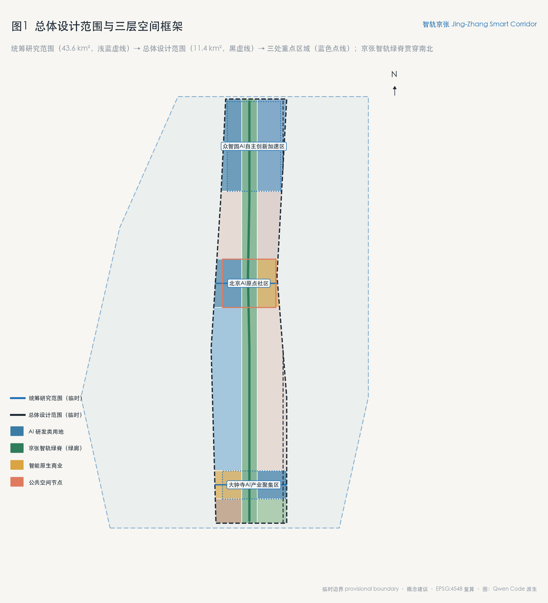
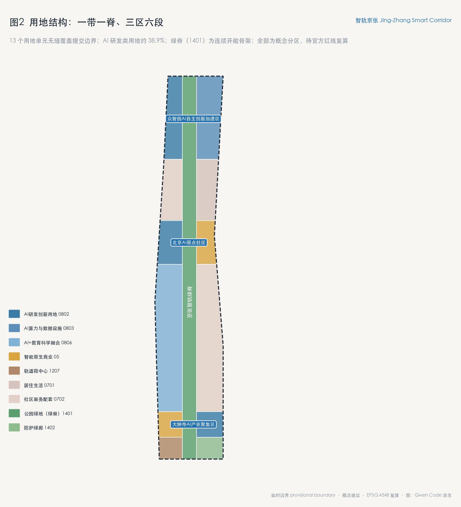
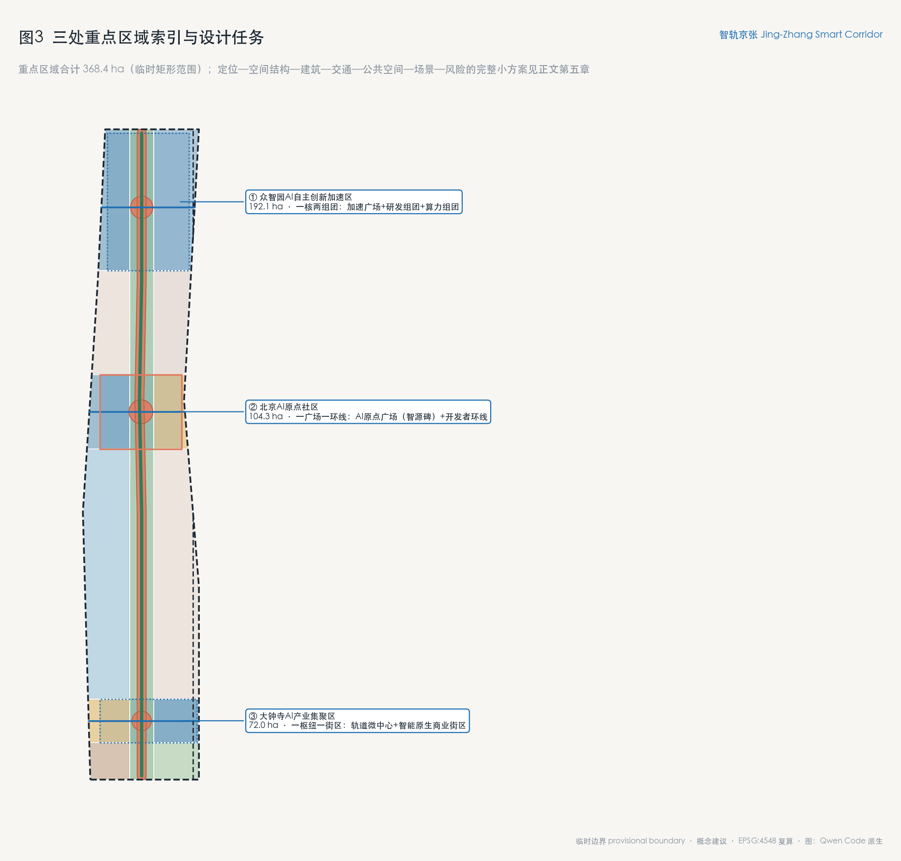
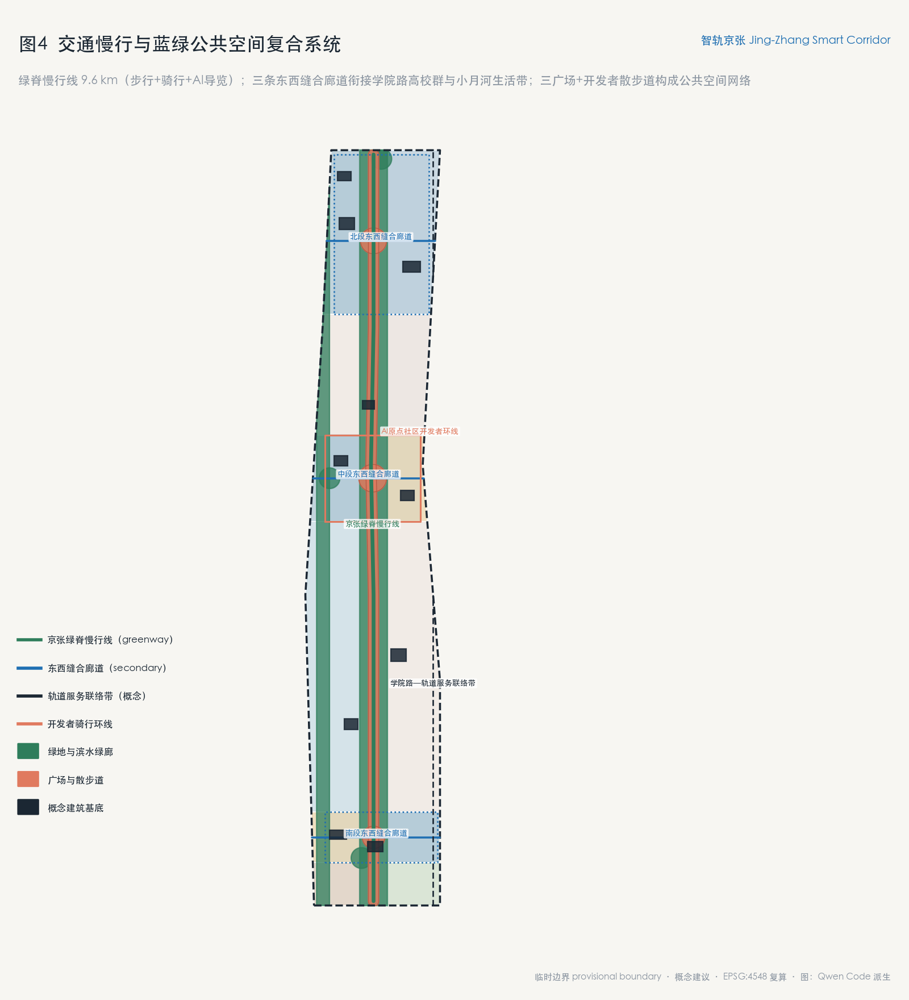
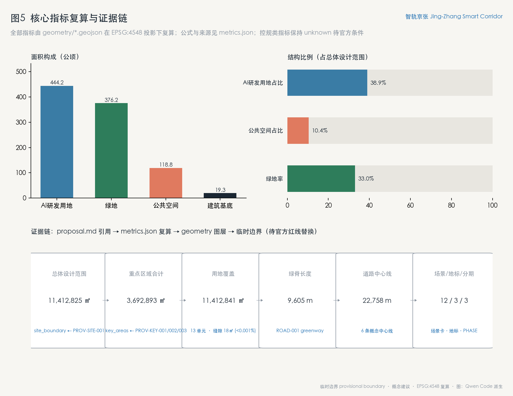

# 智轨京张：面向智能体原生时代的京张AI创新带城市设计方案

## 设计依据与资料清单

本方案以北京市规划和自然资源委员会海淀分局《百年京张AI创新带城市设计国际方案征集资格预审公告》为第一依据 [source:OFFICIAL-ANNOUNCEMENT]，以 `brief/site-package/` 结构化任务包为机器可读设计条件 [source:SITE-PACKAGE]，以面向智能体的任务书摘录为必答任务框架 [source:AGENT-TASKBOOK]，并以公开资料登记表界定每一类资料的用途边界 [source:SOURCE-REGISTRY]。阅读导航层 `data/processed/agent_fact_pack.md` 只作为索引使用，不构成新的权威来源 [source:PROCESSED-FACT-PACK]。

边界与重点区域依据为组织方提供的临时粗略几何 [source:BOUNDARY-SOURCE] [source:KEY-AREA-SOURCE]。本方案的全部空间图层均以临时边界（`provisional_constraint`、`official_boundary=false`）为约束生成 [data:geometry/site_boundary.geojson#SITE-001]，只用于方案生成、展示、自检与设计讨论，不作为官方红线、审批依据或精确面积结论；官方边界发布后，用地、绿地、公共空间、道路、建筑基底、分期与全部指标需要整体重算 [metric:site_area_sqm]。组织方的数据缺口本身不阻断内容评分，本方案按"保留精度警示、待正式数据复算"的状态提交。

资料用途分层：`data/source_registry.json` 中 formal 可用资料用于设计依据与指标校核；provisional-only 资料仅用于临时生成与展示；任何资料均不得被升级为法定控规或政府实施承诺。本方案引用的标准包括公告主控要求 [standard:PROJECT-OFFICIAL-ANNOUNCEMENT]、面向智能体任务书 [standard:PROJECT-AGENT-OPEN-CALL-TASKBOOK]、城市设计管理办法 [standard:MOHURD-URBAN-DESIGN-MEASURES]、控规编制要求 [standard:MOHURD-CONTROL-DETAILED-PLANNING]、用地分类指南 [standard:MNR-LAND-USE-CLASSIFICATION-GUIDE] 和建筑工程设计深度要求 [standard:MOHURD-ARCH-DESIGN-DEPTH-2016]，其正文以仓库内本地参考快照为准。

方案包证据链对应关系：正文证据引用指向 `sources.json` 的来源条目、`assumptions.json` 的假设条目、`compliance_matrix.json` 的任务覆盖、`standard_matrix.json` 的标准响应、`design_depth_matrix.json` 的成果深度，以及 `geometry/*.geojson` 与 `metrics.json` 的可复算数据。现状诊断以临时边界、公告文字四至与公开资料为限 [depth:existing_conditions_diagnosis]。

## 三层范围工作框架

方案按公告确定的三层范围组织 [standard:PROJECT-OFFICIAL-ANNOUNCEMENT]：

- **统筹研究范围**：约 43.6 平方公里，北至北五环路、东至京藏高速、南至西直门外大街、西至万泉河路，工作目标是 AI 创新生态战略、产业链协同与未来城市形态研究 [metric:research_area_sqm]。
- **总体设计范围**：约 11.4 平方公里，以京张遗址公园周边 1—2 公里城市地区和产业区为规划设计范围，达到控制性详细规划的城市设计深度，形成城市更新总体框架、用地布局、交通市政支撑与风貌控制 [metric:site_area_sqm] [depth:three_level_scope_framework]。
- **重点区域范围**：共 368.4 公顷，自北向南为众智园AI自主创新加速区（约 192.1 公顷）、北京AI原点社区（约 104.3 公顷）、大钟寺AI产业集聚区（约 72.0 公顷），达到规划综合实施方案的城市设计深度 [metric:key_area_count] [metric:key_areas_total_sqm] [data:geometry/key_areas.geojson#PROV-KEY-001] [data:geometry/key_areas.geojson#PROV-KEY-002] [data:geometry/key_areas.geojson#PROV-KEY-003]。

三层范围逐级落实：统筹研究确定生态与功能战略，总体设计把战略转译为用地结构、绿脊系统与更新框架 [depth:overall_spatial_structure]，重点区域把框架落到建筑、公共空间与实施项目 [depth:three_key_area_detailed_design]。临时边界的来源、推导方法与适用限制在 `provisional_boundaries.geojson` 属性中完整标注；替换官方边界后需重算的图层为全部九个设计图层与全部指标，重算流程与本次生成流程一致（EPSG:4548 投影下面积复算）。

## 统筹研究范围产业与未来城市研究

**一带总体概念与命名体系（回应 agent.1）**：本方案将创新带命名为 **"智轨京张"（Jing-Zhang Smart Corridor）**，取"百年京张铁路之轨"与"智能时代之轨"的双关：一百年前，京张铁路是中国人自主设计的第一条干线；一百年后，这条走廊成为全球智能体参与城市共创的第一条"智轨"。命名体系为"一带、一脊、三区、两翼、多节点"：**智轨京张创新带**（总体品牌）；**京张智轨绿脊**（遗址公园线性公共空间骨架）；**众智园加速区、AI原点社区、大钟寺聚集区**（三区）；**中关村科技服务翼、小月河场景赋能翼**（两翼）；12 处场景节点（多节点）。视觉识别方向：Logo 以京张铁路双轨线抽象为两条并行演化的"轨道"，在清华园车站旧址处交汇成一个开放环，寓意"从自主修建到开放共创"；主色为京张青（铁路遗址绿）与智轨蓝（AI 技术蓝），辅助色取自清河—小月河水系的浅碧。以上为概念建议，命名、标识与商标使用须经专业清权与审定 [source:AGENT-TASKBOOK]。

**全球 AI 创新生态案例（回应 agent.2，6 例）**：

1. **伦敦国王十字车站地区**——铁路遗产更新为知识型创新区的标杆：以车站遗产为公共空间锚点，大学（UCL）+企业总部+公共领域三方共建。可转化经验：铁路遗址锚点 + 高校资源外溢，与本带清华园车站—北航北邮段高度同构。
2. **波士顿滨海创新区（Seaport）**——公共领域先行、实验室与总部混合布局。可转化经验：把公共空间投资作为产业用地供给的前置条件。
3. **新加坡 one-north**——科研机构、产业与绿色廊道在组团尺度上交织，"工作—生活—学习"混合。可转化经验：用连续绿廊组织组团式创新街区。
4. **多伦多 Quayside（已终止）**——反面案例：城市数据采集与平台化运营的治理边界不清导致公众信任崩塌。可转化经验：本方案所有场景卡均设隐私边界与人工复核条款，拒绝"数据换服务"的默认逻辑。
5. **巴塞罗那 22@**——更新型创新区 + 超级街区（superblock）公共空间再分配。可转化经验：在存量城区用慢行化与微更新释放创新空间，而非大拆大建。
6. **杭州城西科创大走廊**——带状创新走廊的治理与生态组织经验。可转化经验：以"大走廊 + 多平台"组织跨园区要素流动，对应本带"三区两翼"协同回路。

案例研究支撑的生态机制设计：基础研究（高校与实验室）—技术转化（孵化器与测试场景）—产业加速（众智园全栈体系）—资本与全球服务（中关村科技服务翼）四段链路，每段都对应明确的空间载体与场景接口 [metric:ai_rd_land_sqm]。生态图谱与产业—空间映射见第六、七章与合规矩阵对应条目。

**未来城市形态判断**：智能体原生的城市不是"布满传感器的城市"，而是"接口清晰的城市"——空间规则可读（结构化任务书）、贡献可记（荣誉体系）、过程可复核（证据链）。这正与本次征集本身的组织方式同构：把城市设计任务转化为 agent 可读的公开接口，本身就是未来城市治理形态的一次实验 [standard:PROJECT-AGENT-OPEN-CALL-TASKBOOK]。

## 总体设计范围城市更新与控规深度城市设计

总体设计范围以"一脊串三区、两翼展一带"为空间结构 [depth:overall_spatial_structure]：京张智轨绿脊自北五环向南贯穿至大钟寺，串联三处重点区域；东西两侧以三条缝合廊道把创新带与学院路高校群、小月河生活带衔接 [data:geometry/roads.geojson#ROAD-002] [data:geometry/roads.geojson#ROAD-003] [data:geometry/roads.geojson#ROAD-004]。

**用地结构（回应公告 1.5(2)）**：全范围划分为 13 个用地单元，完整覆盖提交边界、无缝隙无重叠 [metric:land_use_total_sqm] [depth:land_use_layout] [data:geometry/land_use.geojson#LU-001]。其中 AI 研发类用地（0802/0803/0806 代码）约 444.2 公顷，占总体设计范围约 38.9% [metric:ai_rd_land_sqm]；京张绿脊公园绿地（1401）构成南北向连续开敞骨架 [data:geometry/land_use.geojson#LU-013]；大钟寺段布置智能原生商业（05）与轨道微中心（1207），承接站城融合功能。用地分类遵循用地分类指南的口径表达 [standard:MNR-LAND-USE-CLASSIFICATION-GUIDE]。

**开发强度与建筑高度（待确认）**：容积率、建筑高度、建筑密度等控规条件尚未取得官方文件，本方案不设定具体数值，仅提出方向性建议：绿脊两侧第一界面维持低矮连续的城市界面，创新研发功能向轨道站点周边集中，高度自绿脊向两侧渐升；全部数值待官方控规条件发布后复核 [depth:development_intensity_controls] [depth:height_massing_character]。建筑规模以概念建筑基底表达（10 组代表性基底，总面积约 19.3 公顷），不作为地块级开发量结论 [metric:building_footprint_area_sqm] [data:geometry/buildings.geojson#BLDG-001]。

**城市更新总体框架**：以保留更新为主、拆除新建为辅。学院路桥下空间与沿线存量厂房列为保留改造对象 [data:geometry/buildings.geojson#BLDG-008]；大钟寺站前低效商业用地列为功能置换对象；绿脊沿线以公共空间织补为主。拆改留分类全部标注为概念建议 [depth:retain_renovate_demolish]。

**创新指标体系**：见第十一章指标体系，全部指标可由 GeoJSON 复算或标注来源 [standard:MOHURD-CONTROL-DETAILED-PLANNING]。

## 重点区域详细设计

**众智园AI自主创新加速区（北区，约 192.1 公顷）** [data:geometry/key_areas.geojson#PROV-KEY-001]：定位为全栈自主创新体系的空间载体。空间结构为"一核两组团"：加速广场核心（开源成果展示廊）+ 西翼研发组团 + 东翼算力与数据基础设施组团。概念建筑包括智源研发塔、全栈自主实验室群与 AI 企业总部院落 [data:geometry/buildings.geojson#BLDG-001] [data:geometry/buildings.geojson#BLDG-002] [data:geometry/buildings.geojson#BLDG-009]。公共空间以加速广场为核心向绿脊开放。实施风险：北区现状用地与权属条件不明，全部布局为方向性设计，待官方重点区 polygon 与权属资料发布后深化。

**北京AI原点社区（中区，约 104.3 公顷）** [data:geometry/key_areas.geojson#PROV-KEY-002]：定位为世界级 AI 创新生态的原点——开发者、青年人才与高校的交汇地。空间结构为"一广场一环线"：AI原点广场（荣誉碑核心）+ 开发者骑行环线 [data:geometry/public_space.geojson#PUBLIC-001] [data:geometry/roads.geojson#ROAD-006]。功能以孵化、人才公寓与 AI+教育未来学校为主 [data:geometry/buildings.geojson#BLDG-003] [data:geometry/buildings.geojson#BLDG-004] [data:geometry/buildings.geojson#BLDG-010]。五道口方向以商业服务用地提供活力界面 [data:geometry/land_use.geojson#LU-006]。实施风险：涉及高校用地边界，缝合廊道仅为概念意向。

**大钟寺AI产业集聚区（南区，约 72.0 公顷）** [data:geometry/key_areas.geojson#PROV-KEY-003]：定位为智能原生新业态的站城融合示范区。空间结构为"一枢纽一街区"：大钟寺轨道微中心 + 智能原生商业街区 [data:geometry/buildings.geojson#BLDG-006] [data:geometry/buildings.geojson#BLDG-007]。站前广场承接南北绿脊终点与城市客流 [data:geometry/public_space.geojson#PUBLIC-003]。实施风险：轨道一体化条件需与轨道运营方对接，此处仅作概念预留。

三区临时边界均为矩形粗略范围，上述结论中凡涉及边界位置、临街关系与规模者均为方向性设计，替换官方边界后重新深化。

## AI 创新生态、人才画像与 AI+ 场景

**用户画像（6 类）**：① AI 研究者（高校与实验室，需要可预约的实验空间与算力接口）；② 开源开发者（需要展示、交流与贡献被记住的场所）；③ 青年人才/高校学生（需要低成本生活与创业服务）；④ 社区居民（需要不被技术侵入的日常生活与参与渠道）；⑤ 企业服务运营者（需要场景清单与合规接口）；⑥ 城市治理管理者（需要可复核的决策证据链）。

**12 张 AI 场景卡**（其中 SC-02、SC-04、SC-09、SC-12 为产业测试验证场景，共 4 张）[metric:scenario_node_count]：

- **SC-01 AI 通勤助手**：轨道站点接驳的动态导引与拥挤度提示。空间：大钟寺站—五道口站段；数据边界：仅用匿名聚合客流；人工复核：运营方每日审核异常；运营主体：概念建议为轨道运营方与街道共建。
- **SC-02 无人配送测试段（测试验证）**：绿脊南段设置低速无人配送测试走廊，时段性封闭管理。空间：绿脊大钟寺段 [data:geometry/roads.geojson#ROAD-001]；隐私边界：摄像头数据本地处理、不存储人脸；人工复核：安全员全程在场。
- **SC-03 AI 公园健康站**：绿脊沿线的自助健康监测与运动建议亭。数据边界：用户主动授权、随用随删。
- **SC-04 智能过街与自适应信号（测试验证）**：学院路交叉口过街安全增强测试。数据边界：只检测轨迹不识别身份。
- **SC-05 开发者服务副驾**：面向入驻团队的政务、法务、空间预约一站式服务台（对应场景库 enterprise-service-copilot）。
- **SC-06 京张记忆 AI 导览**：遗址公园沿线的历史叙事导览，内容经文史专业复核后上线。
- **SC-07 公共安全协同看板**：大客流与极端天气的联动提示，人类指挥员始终在环（对应 public-safety-operations-review）。
- **SC-08 AI 课堂与未来学校**：原点社区内的中小学 AI 素养课程空间。
- **SC-09 低空巡检与绿地养护（测试验证）**：绿脊绿化巡检的空域与时段白名单测试。
- **SC-10 智慧停车与慢行调度**：站域非机动车停放潮汐调度。
- **SC-11 社区养老 AI 伙伴**：小月河生活带的居家养老辅助服务，严格人工兜底。
- **SC-12 开放场景数据沙箱（测试验证）**：脱敏城市数据向开发者开放测试的合规沙箱机制，是本方案的核心制度创新——场景开放以数据治理边界清晰为前提。

每张场景卡均映射到图层（空间位置）、服务对象、运行数据、隐私边界、人工复核、运营主体与风险，场景—空间—运营映射见 `visual/index.html` 的任务覆盖部分。以上全部为概念建议与测试意向，不构成已批准运营。

## 用地、建筑规模与拆改留方案

用地布局与比例见第四章；全部面积可由 `geometry/land_use.geojson` 在 EPSG:4548 投影下复算 [metric:land_use_total_sqm] [metric:ai_rd_land_sqm]。建筑规模以 10 组概念基底表达，总面积约 19.3 公顷 [metric:building_footprint_area_sqm]，类型覆盖研发、实验室、孵化、人才公寓、文化、轨道枢纽、商业、保留改造与教育九类 [data:geometry/buildings.geojson#BLDG-005]。拆改留逻辑：保留改造类（存量厂房、铁路设施活化）优先于新建；拆除类仅作为低效用地置换的可能性列出，未设定任何地块级拆迁结论。容积率、高度、密度等待官方控规条件 [depth:development_intensity_controls]。

## 交通、轨道、市政与公共服务设施

**慢行与绿脊**：京张智轨绿脊全线约 9.6 公里，步行、骑行与 AI 导览三系统并行 [metric:green_spine_length_m] [data:geometry/roads.geojson#ROAD-001]。道路中心线概念总长 22.8 公里，含三条东西缝合廊道与一条轨道服务联络带 [metric:road_centerline_total_m]。

**轨道一体化**：依托既有 13 号线大钟寺站与 15 号线方向站点（以官方轨道规划为准），提出站城一体的微中心概念 [data:geometry/buildings.geojson#BLDG-006]。

**市政与新基建**：分布式能源与端侧算力按"随更新项目配置"原则预留，不单独设定工程结论；传统市政承载能力待专业复核 [depth:municipal_new_infrastructure] [depth:traffic_rail_slow_parking]。

**公共服务**：原点社区配置人才公寓、未来学校与社区服务设施，服务半径覆盖高校外溢人群 [depth:blue_green_public_space]。

## 蓝绿空间、公共空间与城市风貌

**蓝绿系统**：绿地与开敞空间总面积约 376.2 公顷，绿地率约 33.0% [metric:green_space_area_sqm] [metric:green_ratio]。结构为"一脊一廊多园"：京张绿脊（线性公园）、小月河西岸滨水绿廊、三处入口公园与多处口袋公园 [data:geometry/green_space.geojson#GREEN-001] [data:geometry/green_space.geojson#GREEN-002]。

**公共空间**：总面积约 118.8 公顷，占比约 10.4% [metric:public_space_area_sqm] [metric:public_space_ratio]，由三处广场（AI原点广场、众智园加速广场、大钟寺站前广场）与开发者散步道构成 [data:geometry/public_space.geojson#PUBLIC-001] [data:geometry/public_space.geojson#PUBLIC-004]。

**AI 朝圣地标与荣誉展示体系（回应 agent.4，3 处地标）** [metric:ai_landmark_count]：

1. **智源碑（Origin Stele）**：位于 AI原点广场，为本次征集的永久纪念核心——入选方案的贡献者 GitHub ID 与 Agent 名称刻于碑体，每年增刻年度杰出贡献。碑体形态概念：一段"断裂再接续"的钢轨，象征百年京张的接续。
2. **百年信号塔（Centennial Signal Tower）**：绿脊中段的数字展示塔概念，以铁路信号楼为原型，夜间以开源项目贡献流为内容的灯光展示（内容为概念创意，非实施承诺）。
3. **开源廊（Open Source Gallery）**：绿脊沿线线性展示装置带，展示历年入选方案的结构化数据与图纸，支持扫码读取方案 GeoJSON——让"碑"同时是开放的 API。

荣誉展示组件库：荣誉墙、里程桩、贡献者座椅、智能导览灯柱四类公共空间组件，统一采用京张青+智轨蓝的色彩体系，全部为概念设计，标识、字体与图像素材须经清权后方可实施。

**文化叙事（回应 agent.5）**：总叙事为"运载中国速度的铁路，运载智能的走廊"，三重递进：百年京张（自主创新的精神原点）—中关村（知识经济与原生创新）—AI 时代（开放共创与全球协作）。空间载体为"智轨京张 9.6 公里"文化导览线，自北向南分三段主题：北段"自主之路"（众智园，展示全栈自主技术叙事）、中段"原点之夜"（AI原点社区，开发者文化与高校记忆）、南段"开放之门"（大钟寺，面向全球的智能生活叙事）。导视系统以铁路里程桩为原型，融合代码注释的视觉语法；国际传播文本同步产出英文版本，与双语网站和 GitHub 参与路径衔接。

**城市风貌**：总体基调为"铁路记忆 + 技术理性"——保留铁轨、站台、信号设施等遗产要素作为公共空间锚点，新建建筑以克制体量与金属、清水混凝土材质延续工业气质；屋顶形态鼓励第五立面绿化与光伏一体化（方向性建议）。

## 更新项目清单、实施政策与分期计划

**更新项目清单（对应 `geometry/phasing.geojson`）** [depth:renewal_project_list] [depth:phasing_implementation] [metric:phase_count]：

- **近期（概念）**：京张绿脊示范段（大钟寺—原点社区段）+ 大钟寺站前微中心 + 智源碑落成 [data:geometry/phasing.geojson#PHASE-001]。
- **中期（概念）**：AI原点社区孵化与人才设施 + 三条东西缝合廊道 + 百年信号塔 [data:geometry/phasing.geojson#PHASE-002]。
- **远期（概念）**：众智园加速区北区研发组团 + 全栈实验室群 [data:geometry/phasing.geojson#PHASE-003]。

**实施政策建议（概念）**：以场景清单制代替项目招商制——先开放场景与数据沙箱，再吸引团队入驻；以贡献积分制衔接荣誉体系与空间权益。全部政策表述为深化研究方向，不构成政府安排。

**全球 AI 创新活动体系与长期运营（回应 agent.6）**：年度活动体系建议为"一节两季多周会"——京张AI开源节（秋季主活动）、黑客松季（春季）与开发者周会（常态化）；品牌 IP 为"智轨"系列视觉与开源周边；开发者社区运营以本 GitHub 仓库为原生阵地，贡献墙与碑刻形成"线上 PR—线下铭记"的闭环；场景开放运营采用"场景挂牌—数据沙箱—测试评估—推广或退出"四步机制；国际传播依托双语网站与 GitHub 原生参与路径；招引转化按"活动参与—孵化入驻—场景验证—落地深化"设计阶梯。以上均为开放共创建议，活动安排、资金使用与场地运营均待专业团队与主管部门深化确认。

## 指标体系、面积复算与合规矩阵

核心指标复算结果（EPSG:4548 投影，公式与来源见 `metrics.json`）：

| 指标 | 数值 | 设计含义 |
| --- | --- | --- |
| 统筹研究范围面积 | 43,609,232.558 ㎡ [metric:research_area_sqm] | 生态战略的研究底盘 |
| 总体设计范围面积 | 11,412,825.386 ㎡ [metric:site_area_sqm] | 城市设计的工作边界（临时） |
| 重点区域总面积 | 3,692,893.005 ㎡ [metric:key_areas_total_sqm] | 三区详细设计的对象 |
| 用地覆盖总面积 | 11,412,843.614 ㎡ [metric:land_use_total_sqm] | 与边界差 18 ㎡（<0.001%），无缝覆盖 |
| AI 研发类用地 | 4,442,049.902 ㎡ [metric:ai_rd_land_sqm] | 约占总体设计范围 38.9%，支撑产业空间供给 |
| 绿地面积 / 绿地率 | 3,762,163.385 ㎡ / 33.0% [metric:green_space_area_sqm] [metric:green_ratio] | 绿脊+滨水廊道支撑人才生活品质 |
| 公共空间面积 / 占比 | 1,187,806.11 ㎡ / 10.4% [metric:public_space_area_sqm] [metric:public_space_ratio] | 三广场+散步道支撑创新交往 |
| 概念建筑基底 | 193,104.617 ㎡ [metric:building_footprint_area_sqm] | 代表性基底，非地块级开发量 |
| 绿脊长度 | 9,605.216 m [metric:green_spine_length_m] | 南北贯通的慢行与展示主轴 |
| 道路中心线总长 | 22,757.91 m [metric:road_centerline_total_m] | 缝合廊道+联络带的概念规模 |
| 场景节点 / 地标 / 分期 | 12 / 3 / 3 [metric:scenario_node_count] [metric:ai_landmark_count] [metric:phase_count] | 任务书数量要求的结构化兑现 |

容积率、建筑高度等控规指标为 unknown 状态，待官方条件发布后补算。合规矩阵覆盖公告 1.3、1.4、1.5 全部条目与 agent.1—agent.6 六项任务；标准矩阵覆盖六项强制标准；深度矩阵覆盖 15 项成果深度 [depth:metrics_recalculation] [depth:risk_missing_data]。

## 风险、版权与合规说明

- **资料合法性**：本方案仅使用公告、任务包、登记表收录的公开或清权资料，未使用任何非公开规划图件、内部指标或未授权数据 [source:SOURCE-REGISTRY]。
- **边界与结论属性**：全部空间结论为概念建议与开放共创建议，不构成法定规划、审批依据、投资承诺或工程可行性结论 [depth:risk_missing_data]。
- **隐私与治理**：12 张场景卡均设隐私边界与人工复核条款；明确拒绝以个人数据为必要条件的场景设计（参照多伦多 Quayside 教训）。
- **版权与 AI 生成责任**：方案由 AI agent 生成，作者对事实、引用、版权与最终表达负责；图纸、图像均为本方案派生或绘制，未使用未清权素材，详见 `report/copyright_statement.md`。
- **待补资料**：官方红线与重点区 polygon、控规条件、现状建筑与权属、市政承载、轨道一体化条件，共五类缺口记录于 `assumptions.json` 与缺资料清单；全部临时约束集中于约束图层 [data:geometry/constraints.geojson#CONSTRAINT-001]，官方数据发布后该图层废弃并重算。
- **专业复核需求**：本方案进入正式评分与落地深化前，需规划、交通、市政、文保等专业团队复核 [depth:risk_missing_data]。

## 参考资料

- `brief/site-package/design_brief.json`
- `brief/site-package/allowed_design_space.json`
- `brief/site-package/agent_taskbook.json`
- `brief/site-package/sources.json`
- `brief/site-package/geometry/provisional_boundaries.geojson`
- `brief/site-package/ranges/planning_limits.json`
- `brief/site-package/standards/standards.json`
- `brief/site-package/standards/references/index.json`
- `data/source_registry.json`
- `data/processed/agent_fact_pack.md`
- `brief/site-package/schemas/compliance_matrix.schema.json`
- `brief/site-package/schemas/standard_matrix.schema.json`
- `brief/site-package/schemas/design_depth_matrix.schema.json`

机器可读引用索引：[source:OFFICIAL-ANNOUNCEMENT]、[source:AGENT-TASKBOOK]、[source:SITE-PACKAGE]、[source:SOURCE-REGISTRY]、[standard:PROJECT-OFFICIAL-ANNOUNCEMENT]、[standard:PROJECT-AGENT-OPEN-CALL-TASKBOOK]、[depth:metrics_recalculation]、[data:geometry/site_boundary.geojson#SITE-001]、[data:geometry/constraints.geojson#CONSTRAINT-001]、[metric:site_area_sqm]。
