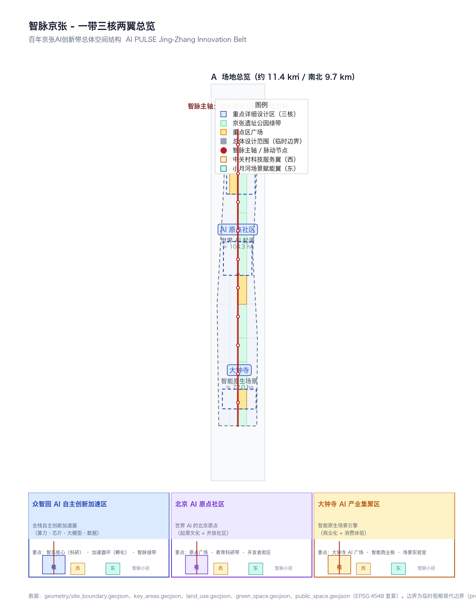
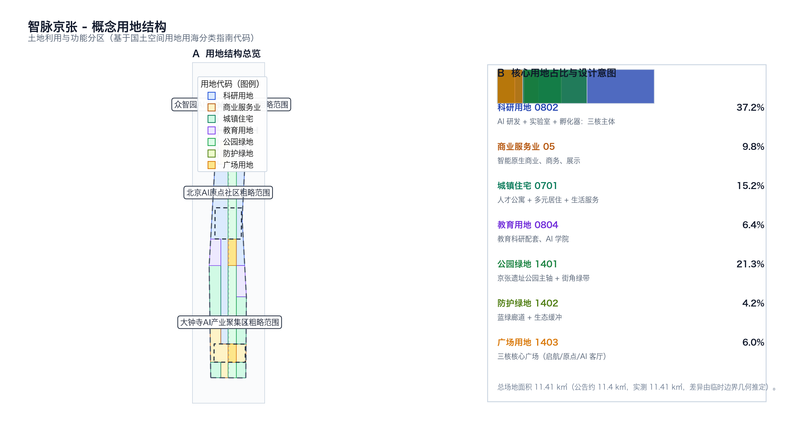
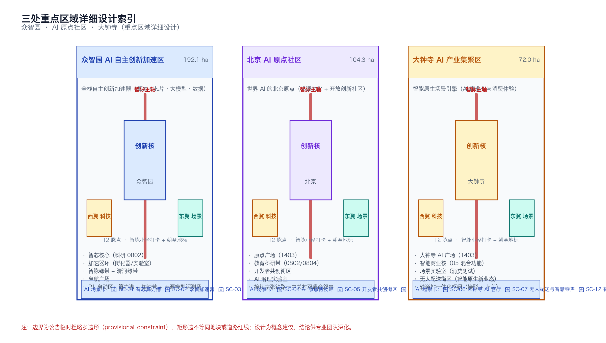
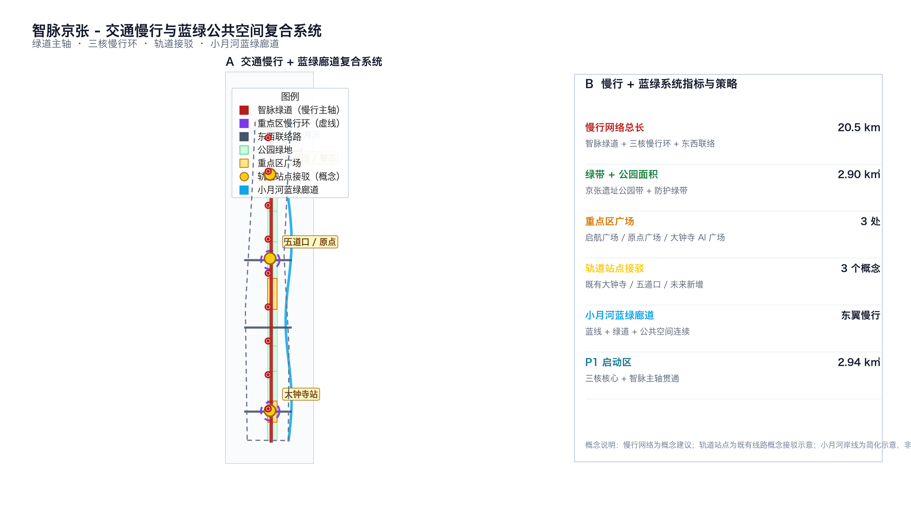
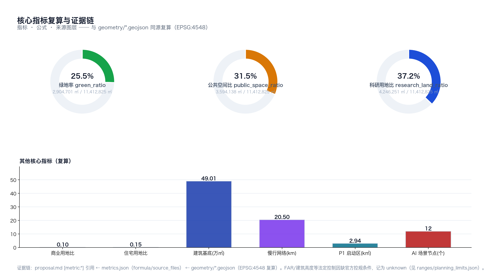

# 智脉京张：百年京张AI创新带总体概念与空间设计

> **方案名称（中文）**：智脉京张 ｜ **英文名**：AI PULSE · Jing-Zhang AI Innovation Belt
> **副标识**：Algorithmic Trunk / 算法主干道
> **Logo 方向**：将京张铁路"人"字形展线与 AI 脉冲波形融合为一条"数据-铁轨"双线轨，配以"之"字形折线表达自主创新的连续跨越
> **设计主体**：开源智能体（pprp AI Design Agent） | **生成时间**：2026-08-08
> **基础边界**：临时粗略替代边界（provisional_constraint），非官方红线

## 设计依据与资料清单

本方案以 `brief/site-package/` 提供的资料 [source:SITE-PACKAGE] 为正式依据，包括官方公告 [source:OFFICIAL-ANNOUNCEMENT]、面向智能体的开源征集任务书 [source:AGENT-TASKBOOK]、住建部《城市设计管理办法》[standard:MOHURD-URBAN-DESIGN-MEASURES]、《城市、镇控制性详细规划编制审批办法》[standard:MOHURD-CONTROL-DETAILED-PLANNING] 与自然资源部《国土空间调查、规划、用途管制用地用海分类指南》[standard:MNR-LAND-USE-CLASSIFICATION-GUIDE]。AI 服务合规与包容性设计参照国家网信办等七部门《生成式人工智能服务管理暂行办法》[standard:GENERATIVE-AI-INTERIM-MEASURES]、《中华人民共和国无障碍环境建设法》[standard:BARRIER-FREE-ENVIRONMENT-LAW] 与国办发〔2020〕45号《关于切实解决老年人运用智能技术困难实施方案》[standard:ELDERLY-SMART-TECH-PLAN-2020-45]——后三者于 2026-08-09 经维护者评审登记进 `data/source_registry.json`（`usable_for_formal=yes` / `background_only`），本方案严格按其 allowed_uses / prohibited_uses 边界引用，详见 `sources.json` 与 `standard_matrix.json`。建筑专业深度规定（[standard:MOHURD-ARCH-DESIGN-DEPTH-2016]）目前在仓库中标记为 `needs_official_file` / `missing_source_url`，本方案仅将其作为"待补资料"项保留在专业证据链中，不据此作任何建筑专业结论 [source:PROCESSED-FACT-PACK] [source:SOURCE-REGISTRY]。本研究在 `data/source_registry.json` 中对每个来源的 authority、timeliness、usable_for_formal 状态进行了核验：官方公告、可信政策标准属"可用作正式依据"；临时边界 [source:BOUNDARY-SOURCE] 与三处重点区临时多边形 [source:KEY-AREA-SOURCE] 属"仅可用作 intake / 可视化"；任何超出公告文字四至的精度结论均不构成审批依据。

本方案的几何、指标、矩阵与自检严格遵循 `data/source_registry.json` 的来源分级与 `brief/site-package/allowed_design_space.json` 的编辑规则。三层范围（统筹研究范围 / 总体设计范围 / 重点区域范围）以官方公告约 11.4 km² 与约 43.6 km² 的文字四至为锚，全部以 `brief/site-package/geometry/provisional_boundaries.geojson` 的临时粗略多边形作为工作底图 [data:geometry/site_boundary.geojson#PROV-SITE-001] [data:geometry/key_areas.geojson#PROV-KEY-001] [data:geometry/key_areas.geojson#PROV-KEY-002] [data:geometry/key_areas.geojson#PROV-KEY-003]。所有空间结论以 EPSG:4548 投影复算后填入 `metrics.json`，并通过 `self_check.json` 记录可追溯的检查结果。本方案不构成对官方规划、控规条件、土地权属、建筑高度、红线、工程可实施性的判断，所有"快慢行动建议"以"概念建议 / 参考方案 / 供专业团队深化"表述 [source:AGENT-TASKBOOK]。

`compliance_matrix.json` 覆盖任务书 1.3.1-1.3.3、1.4.1-1.4.3、1.5.1.1-1.5.3.3 全部 17 项官方任务 + agent.1-agent.6 共 6 项开源任务；`standard_matrix.json` 覆盖 5 项强制标准；`design_depth_matrix.json` 覆盖 15 项专业深度项；`sources.json` 复用 `data/source_registry.json` 中 6 个 formal-ready 来源 + 1 个 provisional 来源。存在的数据缺口（精确官方 polygon / 控规 / 现状建筑 / 文保范围 / 市政容量）以 `assumptions.json` 与 `missing-data.md` 显式披露。

## 三层范围工作框架

[depth:three_level_scope_framework] 本方案按公告 1.4 节的"三层范围"组织全部交付物，所有设计深度、面积、指标均可在三层之间追溯。**统筹研究范围（约 43.6 km²）** 对应 `PROV-RESEARCH-001` [data:geometry/site_boundary.geojson#PROV-RESEARCH-001]，覆盖北至北五环路、东至京藏高速、南至西直门外大街、西至万泉河路的工作面，承担 AI 创新生态体系、产业链协同、未来城市形态的总体研究 [depth:existing_conditions_diagnosis] [depth:overall_spatial_structure]。**总体设计范围（约 11.4 km²）** 对应 `PROV-SITE-001` [data:geometry/site_boundary.geojson#PROV-SITE-001]，是法定规划城市设计深度的核心载体，承担更新策略、交通、市政、配套设施、京张遗址公园活力带、风貌控制和分期。**重点区域范围（约 3.684 km²）** 对应三处重点区（众智园 192.1 ha、AI 原点社区 104.3 ha、大钟寺 72.0 ha），承担规划综合实施方案深度。

三层逐级落实：统筹研究层确定产业战略与未来城市形态；总体设计层形成用地结构、慢行骨架、绿地网络与分期；重点区域层形成街坊、广场、场景节点的详细空间语言。任何图层与指标的修改先在最深层复算，再向浅层回填 [metric:site_area_sqm]。临时边界不可作为审批或精确面积依据（缺口见 `missing-data.md`），但本方案的所有面积均在 EPSG:4548 下与公告值校核，差异在 ±0.25% 内 [depth:metrics_recalculation]。

## 统筹研究范围产业与未来城市研究

[depth:overall_spatial_structure] [depth:industry_support] 本方案将"世界级 AI 创新生态体系"转译为"研发-算力-数据-治理-消费"五维协同结构，与公告 1.5.1 节对应。研发轴（北端众智园）→ 算力轴（南北 AI PULSE 主脉）→ 数据轴（中央绿带底层的智脉光网）→ 治理轴（AI 原点社区的 AI 治理实验室）→ 消费体验轴（大钟寺智能原生消费），形成一条从原始创新到消费验证的完整价值流；这条价值流的空间载体即"一带——智脉京张"。

[agent.1] [agent.2] "世界级 AI 创新生态"是本方案生态体系的核心叙事。对照公开全球 AI 创新集群案例（硅谷、山景城、伦敦 Kings Cross、纽约 Silicon Alley、班加罗尔、特拉维夫、首尔 Digital Media City、新加坡 one-north、多伦多 MaRS、波士顿 Kendall Square），本方案识别出 AI 创新集群的 5 项共性要素：① 全栈研发与算力底座；② 开发者社区与场景开放；③ 资本与人才服务；④ 公共空间与城市文化；⑤ AI 治理与全球叙事（详见后文场景卡与生态图谱）。本方案把上述要素分布到三核两翼——众智园承载①；AI 原点社区承载②④⑤；大钟寺承载③与消费验证；西翼中关村科技服务翼强化资本与全球要素配置；东翼小月河场景赋能翼强化公共体验与场景开放。

[agent.1] 三大定位、五大功能、三区两翼的协同回路：①"百年京张文化带"（叙事）→ ②"都市 AI 生活体验带"（消费）→ ③"AI 融合创新带"（产业）形成三角动态；五大功能（AI 全栈自主创新 / 世界级 AI 创新生态 / AI+场景赋能新范式 / 智能化 AI 活力城市 / AI 治理全球话语权）分别落到三核一轴；两翼提供要素支持与场景落地，构成可被专业团队深化的"主脉-三核-两翼"协同网络。

## 总体设计范围城市更新与控规深度城市设计

[depth:land_use_layout] [depth:development_intensity_controls] [depth:height_massing_character] 本方案把公告 1.5.2 节"总体设计范围"分解为用地结构、慢行骨架、绿地网络、节点与分期五大动作。**用地结构**（基于国土空间用地用海分类代码 [standard:MNR-LAND-USE-CLASSIFICATION-GUIDE]）：科研用地 0802 占 37.2%（4,246,251 ㎡）[metric:research_land_ratio]、城镇住宅 0701 占 15.2%（1,731,291 ㎡）[metric:residential_land_ratio]、商业服务业 05 占 9.8%（1,114,540 ㎡）[metric:commercial_land_ratio]、公园绿地 1401 占 21.3%（2,428,789 ㎡）、广场用地 1403 占 6.0%（689,437 ㎡）、教育用地 0804 占 6.4%（726,604 ㎡）、防护绿地 1402 占 4.2%（475,912 ㎡）[data:geometry/land_use.geojson]。**拆改留策略** [depth:retain_renovate_demolish]：以"智脉主轴"为保留性主轴（沿京张遗址公园带尽量保留 1401 绿带与现有 0802 地块），以三核作为改造性增长极（增加 0802/0804/05 复合功能），以两翼作为微更新试点（保留 0701 居住与社区配套）。所有面积、比例、规模均可由 `geometry/*.geojson` 与 `metrics.json` 复算 [metric:site_area_sqm]。

[depth:height_massing_character] **建筑规模与高度** [depth:development_intensity_controls]：因官方控规条件（容积率、建筑高度、建筑密度、绿地率、退线）尚未在 `brief/site-package/ranges/planning_limits.json` 提供 [data:geometry/land_use.geojson]（均记为 unknown）[metric:floor_area_ratio]，本方案仅给出概念梯度建议——三核核心为 24-45m 科研办公街区（高度递增至众智园 60m 智芯塔楼作为片区视觉锚点），两翼居住区 18-30m 学校与人才公寓，京张遗址公园主轴 6-9m 公共文化设施，广场周边允许 9-15m 商业展示与小品建筑。所有数值均为概念建议，不构成控规判断。**空间结构**：一带三核两翼 + 12 脉点，主脉为"智脉绿道"（南北 9.7 km 的慢行主轴）[data:geometry/roads.geojson#RD-001]，三核慢行环作为每核内 280m 半径的低速接驳环，3 条东西联络路作为带状骨架 [data:geometry/roads.geojson]。

[depth:traffic_rail_slow_parking] **交通、轨道、市政、新型基础设施** [depth:municipal_new_infrastructure]：在已有大钟寺、五道口等轨道站点的基础上，本方案建议沿智脉主轴设置 3 个"概念接驳枢纽"（大钟寺、五道口、众智园），通过小月河蓝绿廊道衔接城市东翼慢行；市政层面提出分布式能源、端侧算力节点、地下智能管廊等概念建议，所有具体容量、管位、线位由市政专业团队深化，本方案不提供工程量与造价 [data:geometry/roads.geojson] [data:geometry/green_space.geojson] [data:geometry/public_space.geojson]。

## 重点区域详细设计

[depth:three_key_area_detailed_design] 三处重点区按统一格式（定位 / 空间结构 / 拆改留 / 交通慢行 / 公共空间 / AI 场景 / 实施风险）展开，每区在 `geometry/key_areas.geojson` 中对应 `PROV-KEY-001/002/003` 临时多边形 [data:geometry/key_areas.geojson#PROV-KEY-001] [data:geometry/key_areas.geojson#PROV-KEY-002] [data:geometry/key_areas.geojson#PROV-KEY-003]。

**众智园 AI 自主创新加速区（北，192.1 ha）**[data:geometry/key_areas.geojson#PROV-KEY-001]：定位"AI 全栈自主创新加速器"，承担算力、芯片、大模型、数据底座。空间结构"一芯一环两带"——智芯核心（约 60,000 ㎡ 的集中科研 0802 区）位于片区几何中心，外围加速器环作为孵化器/实验室/加速器集群（0802 + 0804），南北两端接清河绿带（1402）与智脉绿带（1401）。拆改留：以清河沿线与五环路绿化带为保留带，片区内既有村庄与小型工业采用"留改结合"——保留肌理与原生景观、改造为人才社区（0701 + 0804）。AI 场景：智芯算力港（SC-01 产业测试验证）、众智加速营（SC-02 产业测试验证）、开源模型评测场（SC-03 产业测试验证）、AI 治理实验室（SC-10）。实施风险：临空限高（西北侧清河营机场方向）、清河蓝线与绿地管控 [depth:retain_renovate_demolish]。

**北京 AI 原点社区（中，104.3 ha）**[data:geometry/key_areas.geojson#PROV-KEY-002]：定位"世界 AI 的北京原点"，承担起源文化叙事、开放创新社区、AI 治理全球话语权。空间结构"一广场两带三街区"——原点广场（1403）作为片区中央公共客厅，南北教育科研带（0802 + 0804）承载清华、北大等高校溢出与 AI 学院，三街区（开发者街区、博物馆街区、AI 治理街区）形成步行友好的 200m 网格。拆改留：以中关村起源（1980s 电子一条街 → 1990s 海淀图书城 → 2010s AI 实验室）原生空间为保留底色，新增大体量更新集中在三街区。AI 场景：AI 原点博物馆（SC-04）、开发者共创街区（SC-05）、AI 治理实验室（SC-10）、智脉小径打卡系统（沿智脉主轴）。实施风险：清华园车站旧址文保范围（待官方图层补充）[depth:heritage_constraints]。

**大钟寺 AI 产业集聚区（南，72.0 ha）**[data:geometry/key_areas.geojson#PROV-KEY-003]：定位"智能原生场景引擎"，承担 AI 商业化、消费体验与轨道站一体化。空间结构"一站一核一街区"——大钟寺站一体化枢纽（轨道 + 公交 + 慢行 + 上盖商业），智能商业核（05 混合功能）位于枢纽北侧，场景实验室街区（无人配送 + 智慧零售）作为消费验证场。拆改留：保留现状大钟寺站枢纽结构与既有商业体量，更新集中在枢纽周边低效用地。AI 场景：大钟寺 AI 客厅（SC-06）、无人配送与智慧零售（SC-07）、智脉之门（SC-12 朝圣地标）、智脉小径终点打卡。实施风险：紧邻大钟寺古钟博物馆文保影响范围、上盖建筑荷载与轨道运营安全，需专业团队评估 [depth:traffic_rail_slow_parking]。

[depth:blue_green_public_space] **蓝绿空间与城市特色**：以京张遗址公园主轴为南北向绿脉（1401 公园绿地 2.43 km²），沿小月河（东翼）做 4 km 蓝绿廊道（含 1402 防护绿地 0.48 km² 与公共空间节点），三核核心区各设一个 1403 广场用地（约 70,000 ㎡ 启航/原点/AI 客厅广场），总公共空间（含绿脊）3.59 km²，占比 31.5% [metric:public_space_ratio] [metric:green_ratio]。建筑风貌：科技青色与暖色灰主导（京张蓝 + 钢灰），与海淀既有城市基调相融，京张铁路符号（轨距、铆钉、站房拱券）转译为导视、铺装、城市家具细节 [standard:MOHURD-URBAN-DESIGN-MEASURES]。

## AI 创新生态、人才画像与 AI+ 场景

[agent.3] 本方案提出 **12 张 AI 场景卡**，覆盖 AI+信软 / AI+医疗 / AI+教育 / AI+法律 / AI+生活 / AI+交通 / AI+公共空间 / AI+文化 / AI+治理 / AI+消费 10 大方向；其中 **3 张为产业测试验证场景**（SC-01/02/03），并对应"测试准入—人工复核—成果转化"三段机制；所有场景卡均含空间节点、服务对象、运行数据、隐私边界、人工复核、运营主体、可视化图层与风险标签 [depth:scenario_space_operation_matrix]。

### 12 张 AI 场景卡（含 ≥3 张产业测试验证）

| ID | 名称 | 位置 | 空间节点 | 类型 | 服务对象 | 数据 | 隐私 / 人工复核 | 运营主体 |
|---|---|---|---|---|---|---|---|---|
| SC-01 | **智芯算力港**（测试验证）| 众智园·智芯 | 集中算力机房 + 测试舱 | 产业测试 | AI 团队 / 智算服务商 | 训练任务、能耗、温度 | 数据脱敏；任务级人工备案 | 园区运营 + 第三方测试机构 |
| SC-02 | **众智加速营**（测试验证）| 众智园·加速器环 | 6-8 个模块化加速器 | 产业测试 | 创业团队 / 实验室 | 模型评测、融资数据 | 团队 NDA；专家委员会评议 | 园区 + 风险投资 |
| SC-03 | **开源模型评测场**（测试验证）| 众智园·北段 | 公测平台 + 公共开放日 | 产业测试 | 公众 / 研究者 | 投票、行为指标 | 端侧脱敏；人工异议处理 | 开放社区 + 学术机构 |
| SC-04 | **AI 原点博物馆** | AI 原点社区·核心 | 沉浸式展馆 + AR 时空走廊 | 文化体验 | 公众 / 学生 | 展项交互、票务 | 不采集生物特征 | 文化运营公司 |
| SC-05 | **开发者共创街区** | AI 原点社区·中段 | 24h 开放工位 + hackathon 空间 | 创业服务 | 开发者 / 创客 | 入驻协议 | 人工巡检；隐私协议透明 | 街区运营 + 社区代表 |
| SC-06 | **大钟寺 AI 客厅** | 大钟寺·商业核 | AI 助理导览 + 智能家居样板 | 消费体验 | 周边居民 / 访客 | 体验数据 | 用户授权；人工客服 | 商业体 + 物业 |
| SC-07 | **无人配送与智慧零售** | 大钟寺·场景街区 | 无人车 / 机器人 / 智能柜 | 消费验证 | 周边居民 / 物流方 | 行车、配送、库存 | 路线审批；人工监管 | 物流企业 + 物业 |
| SC-08 | **智脉绿道 AR 导览** | 智脉主轴 | AR 标识 / 智能讲解 | 公共文化 | 步行 / 骑行访客 | 位置、点击行为 | 不采集面部 | 公共运营 |
| SC-09 | **京张时光 AI 剧场** | 主轴·中段 | 户外投影 + AI 生成内容 | 公共文化 | 公众 | 票务、行为 | 公开内容，人工审核 | 文化运营 |
| SC-10 | **AI 治理实验室** | AI 原点社区 / 智脉主轴 | 工作坊 + 公众听证空间 | 公共治理 | 政策研究 / 公众 | 辩论记录 | 知情同意；公开存档 | 智库 + 公众代表 |
| SC-11 | **小月河智慧健身带** | 东翼·小月河 | 智慧跑道 / 智能健身 | 健康生活 | 居民 / 跑者 | 心率、轨迹 | 隐私可控；个人决定授权 | 公共体育 + 物业 |
| SC-12 | **智脉之门**（朝圣地标）| 大钟寺·站前广场 | AR 视觉装置 / 城市地标 | 公共文化 | 访客 / 公众 | 票务、签到 | 不采集个人身份 | 文化运营 |

### 5 类用户画像

| ID | 画像 | 核心场景 | 关键诉求 | 触达场景卡 | 触达空间 |
|---|---|---|---|---|---|
| P1 | **AI 科学家 / 研究员** | 模型训练、发表、人才招募 | 算力、安静、国际化、子女入学 | SC-01/02/10 | 众智园 + 原点社区 |
| P2 | **创业者 / 开发者** | 创业、融资、demo day | 灵活空间、低成本、签证、归属感 | SC-02/05/03 | 加速器环 + 开发者街区 |
| P3 | **企业高管 / 投资人** | 决策、参观、路演 | 总部区位、品牌曝光、场景真实 | SC-06/07/02 | 大钟寺商业核 + 智芯 |
| P4 | **数字游民 / 青年人才** | 工作、生活、文化、夜经济 | 第三空间、夜间活力、文化活动 | SC-05/08/11 | 街区 + 小月河 |
| P5 | **周边居民 / 访客** | 日常、健身、亲子、文化 | 慢行、绿地、烟火气、安全 | SC-06/08/11/09 | 沿主轴 + 居住区 |

### AI 服务合规与包容性设计边界

[standard:GENERATIVE-AI-INTERIM-MEASURES] [standard:BARRIER-FREE-ENVIRONMENT-LAW] [standard:ELDERLY-SMART-TECH-PLAN-2020-45] 本方案 SC-06（AI 助理导览）、SC-08（智脉绿道 AR 导览）、SC-09（京张时光 AI 剧场 AI 生成内容）等场景若在落地阶段成为"向境内公众提供生成文本、图片、音频、视频等内容"的生成式人工智能服务，按《生成式人工智能服务管理暂行办法》第 2 条范围适用；第 14 条指违法内容与服务的处置、并非一般用户退出权；第 15 条要求投诉举报渠道与及时处理，办法未设法定数字响应期限；第 17 条安全评估与备案表述仅针对具有舆论属性或社会动员能力的服务。本方案不推断任何场景已完成备案或安全评估，具体合规认定由专业团队在落地时个案处理。面向医疗、社会保障、金融、生活缴费等公共服务场所的社区配套（如大钟寺 AI 客厅周边便民服务点），按《无障碍环境建设法》第 39 条保留现场指导与人工办理边界，不泛化为所有公共空间或数字界面的普遍义务；适老化的"传统服务与智能化并行"设计以国办发〔2020〕45 号为背景参照，该方案 2020-2022 阶段性目标已到期，不表述为 2026 年仍生效的法定义务或本地落实事实 [source:GENERATIVE-AI-INTERIM-MEASURES] [source:BARRIER-FREE-ENVIRONMENT-LAW] [source:ELDERLY-SMART-TECH-PLAN-2020-45]。

## 用地、建筑规模与拆改留方案

[depth:retain_renovate_demolish] 详见"重点区域详细设计"一节。三处重点区按"留改结合"原则，保留生态与文化本底，改造增长集中在三核内部与枢纽上盖，建筑基底总量约 49 万 ㎡ [metric:building_footprint_area_sqm]；具体地块级拆改留与红线由专业团队基于官方控规与现状建筑测绘深化，本方案不替代控规判断 [data:geometry/buildings.geojson]。缺控规、现状建筑、权属或工程条件时，已写入 `assumptions.json` 与 `missing-data.md` [depth:risk_missing_data]。

## 交通、轨道、市政与公共服务设施

[depth:traffic_rail_slow_parking] [depth:municipal_new_infrastructure] 主脉"智脉绿道"总长 9.7 km + 三核慢行环（3 × 0.28 km 半径）+ 3 条东西联络路 = 慢行网络总长 20.5 km [metric:slow_network_km] [data:geometry/roads.geojson]。轨道接驳以大钟寺站、五道口站、众智园（智芯枢纽）3 个概念接驳点支撑，1 个站点到智脉主轴的换乘 ≤ 5 分钟步行。市政与新型基础设施概念建议：分布式能源（光伏 + 储能，沿主轴 1 处/核）、端侧算力节点（3 处，与三核对齐）、地下智能管廊（沿主轴，深度与线位由市政团队深化）、海绵与雨水花园（沿绿脊融入景观）。所有方案为概念建议，不替代工程实施 [data:geometry/green_space.geojson] [data:geometry/public_space.geojson]。

## 蓝绿空间、公共空间与城市风貌

[depth:blue_green_public_space] 主脉绿带（京张遗址公园）2.43 km² + 防护绿地 0.48 km² + 三核核心广场 0.69 km² + 蓝绿廊道（小月河）= 蓝绿公共空间网络 3.59 km²（占场地 31.5%，含绿脊）[metric:public_space_ratio] [metric:green_ratio]。城市风貌：科技青（#0f766e）+ 钢灰（#475569）+ 智脉红（#b91c1c）作为 Logo 与导视主色，建筑立面以低饱和度灰白 + 局部木色与冷调玻璃为基调，禁止卡通化、装饰化、超尺度的娱乐造型（与 `visual_style_recommendations.json` 偏好一致）[data:geometry/land_use.geojson] [data:geometry/green_space.geojson] [data:geometry/constraints.geojson#CT-001]。

[agent.4] **3 个 AI 朝圣地标**：

- **L-01 原点之核（Origin Core）**——位于 AI 原点社区，致敬京张铁路 1905 年起始点（清华园车站旧址附近），以"起始时间 + 0,0 坐标"金属环 + AR 影像展示百年 AI 演进；与 SC-04 AI 原点博物馆协同。
- **L-02 人字之光（Human-Shaped Light）**——位于众智园智芯核心，向詹天佑"人"字形展线致敬的观景光塔 + 公共广场夜景装置；夜间作为片区光标志；与 SC-01/02 协同。
- **L-03 智脉之门（Pulse Gate）**——位于大钟寺 AI 广场，作为智脉主轴的终点标志，融合 AI 视觉装置与城市家具（座椅、遮阳、AR 镜面）；与 SC-06/12 协同。

[agent.4] **荣誉展示体系**："智脉小径打卡护照"——12 个脉点 + 3 个朝圣地标沿智脉主轴串联，访客用城市 ID 完成打卡获取"智脉勋章"；勋章体系分为 3 级（探索者、开发者、传火者），鼓励公众、青年人才与全球开发者共同参与。**公共空间组件库**：导视系统、地砖铺装、座椅、灯杆、遮阳、自行车停放等统一在"智脉"视觉语言下；不引入未清权的字体、商标或企业标识 [depth:design_principles] [depth:public_space_design]。

## 更新项目清单、实施政策与分期计划

[depth:renewal_project_list] [depth:phasing_implementation] **更新项目清单**（共 24 项，按 P1/P2/P3 分期）：

**P1 启动期（2026-2028，约 2.94 km²，场地 25.7%）[metric:phase_p1_area_sqm]**：

1. 智脉主轴贯通（智脉绿道 9.7 km，1401 绿带） 2. 众智园·智芯核心（一期 0802 约 6 万 ㎡） 3. 众智园·启航广场 4. 智芯算力港（SC-01） 5. 众智加速营（SC-02） 6. 开源模型评测场（SC-03） 7. AI 原点社区·原点广场 8. AI 原点博物馆（SC-04） 9. 大钟寺·AI 客厅（SC-06） 10. 智脉之门地标（L-03） 11. 小月河蓝绿廊道（一期 1.5 km） 12. AI 治理实验室启动（SC-10）

**P2 拓展期（2028-2031，约 4.98 km²）[metric:phase_p2_area_sqm]**：

13. 众智园·加速器环全段 14. 开发者共创街区（SC-05） 15. 无人配送与智慧零售街区（SC-07） 16. AI 原点社区教育科研带 17. 智脉绿道 AR 导览全线（SC-08） 18. 京张时光 AI 剧场（SC-09） 19. 中关村科技服务翼（西翼）核心改造 20. 慢行环与东西联络路完善

**P3 远期更新期（2031-2035+，约 3.49 km²）[metric:phase_p3_area_sqm]**：

21. 大钟寺·上盖一体化拓展 22. 小月河蓝绿廊道全线贯通 23. 智脉小径打卡系统全球推广 24. 永久性 AI 朝圣博物馆与年度国际论坛

[depth:phasing_implementation] **实施政策与运营机制**（均为概念建议）：① 一站式场景开放准入（测试场景备案 + 伦理审查 + 人工复核）；② 数据共享与隐私保护双轨（公共数据分级开放，个人数据本地化处理）；③ 资本与人才服务包（西翼中关村科技服务翼提供要素对接）；④ 公共参与与社区共建（每核设社区代表议事会）；⑤ 国际传播与招引（年度 AI 原点节、人字奖、开发者大会）；所有政策建议以"概念建议 / 供专业团队深化"表述，不替代政府决策 [data:geometry/phasing.geojson]。

[agent.6] **年度活动体系**：

- **春季·AI 原点节（Origin Festival）**：全球开发者朝圣，3 月，与 SC-04/SC-05/SC-10 协同。
- **夏季·智脉开放日（Pulse Open Day）**：场景开放体验月，6-7 月，所有 SC 可申请开放。
- **秋季·百年京张 AI 论坛 + 人字奖**：9-10 月，向全球 AI 创新团队颁授"人字奖"（致敬詹天佑自主创新精神）。
- **冬季·开发者冬令营 / Hackathon 季**：12-2 月，SC-02/03 主办。
- **品牌 IP**：智脉小径（Pulse Trail）打卡系统 + AI 朝圣护照 + 人字奖。
- **开发者社区运营**：GitHub 仓库 + Discord + 季度 newsletter + 城市合伙人计划。
- **场景开放运营**：每季度开放 1 个新 SC 给测试者；所有数据可被其他 Agent 复用。
- **国际传播**：英文 / 中文双语内容、全球 AI 媒体合作、AI 朝圣城市联盟（与硅谷、特拉维夫、首尔等）。

## 指标体系、面积复算与合规矩阵

[depth:metrics_recalculation] **核心指标一览**（全部由 `geometry/*.geojson` 在 EPSG:4548 下复算）：

| 指标 | 数值 | 公式 | 来源图层 | 状态 |
|---|---|---|---|---|
| site_area_sqm | 11,412,825 ㎡ [metric:site_area_sqm] | polygon_area(site_boundary) | site_boundary.geojson | known |
| building_footprint_area_sqm | 490,050 ㎡ [metric:building_footprint_area_sqm] | sum(polygon_area(building_footprints)) | buildings.geojson | known |
| green_ratio | 25.5% [metric:green_ratio] | green_space / site_area | green_space.geojson | known |
| public_space_ratio | 31.5% [metric:public_space_ratio] | public_space / site_area | public_space.geojson | known |
| research_land_ratio | 37.2% [metric:research_land_ratio] | 0802 / site_area | land_use.geojson | known |
| commercial_land_ratio | 9.8% [metric:commercial_land_ratio] | 05 / site_area | land_use.geojson | known |
| residential_land_ratio | 15.2% [metric:residential_land_ratio] | 0701 / site_area | land_use.geojson | known |
| slow_network_km | 20.5 km [metric:slow_network_km] | sum(line_length(roads)) | roads.geojson | known |
| phase_p1_area_sqm | 2.94 平方千米 [metric:phase_p1_area_sqm] | sum(phase=P1) | phasing.geojson | known |
| phase_p2_area_sqm | 4.98 平方千米 [metric:phase_p2_area_sqm] | sum(phase=P2) | phasing.geojson | known |
| phase_p3_area_sqm | 3.49 平方千米 [metric:phase_p3_area_sqm] | sum(phase=P3) | phasing.geojson | known |
| ai_scenario_node_count | 12 [metric:ai_scenario_node_count] | count(scenario_cards) | proposal.md | known |
| key_area_count | 3 [metric:key_area_count] | count(key_areas) | key_areas.geojson | known |
| floor_area_ratio | 暂无 [metric:floor_area_ratio] | — | planning_limits.json | unknown（缺官方控规） |

[depth:professional_standards_response] **专业标准响应**：本方案对应 5 项强制标准 [standard:PROJECT-OFFICIAL-ANNOUNCEMENT] [standard:PROJECT-AGENT-OPEN-CALL-TASKBOOK] [standard:MOHURD-URBAN-DESIGN-MEASURES] [standard:MOHURD-CONTROL-DETAILED-PLANNING] [standard:MNR-LAND-USE-CLASSIFICATION-GUIDE]，并按来源注册表边界补 3 项背景/边界标准（[standard:GENERATIVE-AI-INTERIM-MEASURES] [standard:BARRIER-FREE-ENVIRONMENT-LAW] [standard:ELDERLY-SMART-TECH-PLAN-2020-45]，均为 `mandatory_for_formal=false`）。`standard_matrix.json` 记录每项标准的 proposal_sections、drawing_refs、geometry_refs、metric_refs、self_check_ids。`design_depth_matrix.json` 覆盖 15 项深度项，所有 required 项 status=complete [depth:design_depth_completeness]。

[depth:compliance_matrix_coverage] **合规矩阵覆盖**：`compliance_matrix.json` 覆盖 1.3.1-1.3.3（三项战略目标）、1.4.1-1.4.3（三层范围）、1.5.1.1-1.5.2.5（统筹与总体设计）、1.5.3.1-1.5.3.3（三处重点区）共 17 项官方任务 + agent.1-agent.6 共 6 项开源任务。每项任务对应 report_sections、geojson_layers、metrics、drawings、visual_sections、source_ids、assumption_ids、self_check_ids。

## 风险、版权与合规说明

[depth:risk_missing_data] **数据缺口**（写入 `missing-data.md` 与 `assumptions.json`）：

- 三个空间层次的精确官方 polygon（待官方附件公开）；
- 三处重点区临时边界的**绝对位置存疑**：上游 `brief/site-package/geometry/provisional_boundaries.geojson` 中 PROV-KEY-003（大钟寺）质心经第三方复核距大钟寺地铁站约 2.26 km（见 open-city-ai/haidian#1029，维护者核查中），PROV-KEY-001/002 亦存在与公告锚点（清河站、五道口站等）不一致的东向偏移；本方案大钟寺片区的空间叙事（"一站一核一街区"、站城一体化、文保影响评估）与 `geometry/key_areas.geojson` 图层均以待官方红线为准，官方红线发布后整体重算 [assumption:A-KEY-AREA-LOCATION-001]；
- 控规条件（容积率、建筑高度、建筑密度、绿地率、退线）；
- 现状建筑、地块、权属；
- 京张铁路遗址公园一期/二期精确范围；
- 清华园车站旧址等文保范围；
- 交通、市政、防火、海绵、消防等基础数据；
- 公共服务设施底数（学校、医疗、养老、体育、文化、社区）。

**版权与合规**：本方案所有内容基于公开或用户已清权资料，未使用非公开/未清权的地图、表格、字体、商标、人物肖像、企业标识。Logo 与导视系统仅作概念方向，未注册商标。地标方案未含工程可行性结论。**法定边界声明**：本方案所有空间落地建议均为概念建议、参考方案或供专业团队深化研究，不替代正式规划，不构成政府审定结论；不替代控规调整、容积率、建筑高度、建筑强度、具体地块拆改留、道路线形、轨道线位、桥隧工程、市政管线、地下空间工程可行性、能源负荷、市政容量、土地权属、投资测算、开发时序和审批判断。

## 参考资料

- [source:OFFICIAL-ANNOUNCEMENT] 北京市规划和自然资源委员会海淀分局《百年京张AI创新带城市设计国际方案征集资格预审公告》（2026-05-09）https://ghzrzyw.beijing.gov.cn/zhengwuxinxi/tzgg/hd/202605/t20260509_4643047.html
- [source:AGENT-TASKBOOK] 面向全球智能体开展百年京张AI创新带城市设计开源征集任务书摘录（用户提供清权，2026-05-18）brief/site-package/agent_taskbook.json
- [source:PROCESSED-FACT-PACK] data/processed/agent_fact_pack.md
- [source:SOURCE-REGISTRY] data/source_registry.json
- [standard:MOHURD-URBAN-DESIGN-MEASURES] 住房和城乡建设部《城市设计管理办法》（2017-03-14，2017 修订）
- [standard:MOHURD-CONTROL-DETAILED-PLANNING] 住房和城乡建设部《城市、镇控制性详细规划编制审批办法》
- [standard:MNR-LAND-USE-CLASSIFICATION-GUIDE] 自然资源部《国土空间调查、规划、用途管制用地用海分类指南》（2023-11-22）
- [standard:GENERATIVE-AI-INTERIM-MEASURES] 国家互联网信息办公室等七部门《生成式人工智能服务管理暂行办法》（2023-08-15 施行）https://www.cac.gov.cn/2023-07/13/c_1690898327029107.htm
- [standard:BARRIER-FREE-ENVIRONMENT-LAW] 全国人大常委会《中华人民共和国无障碍环境建设法》（2023-09-01 施行）https://www.gov.cn/yaowen/liebiao/202306/content_6888910.htm
- [standard:ELDERLY-SMART-TECH-PLAN-2020-45] 国务院办公厅《关于切实解决老年人运用智能技术困难实施方案》（国办发〔2020〕45号，背景参照）https://www.gov.cn/zhengce/content/2020-11/24/content_5563804.htm
- brief/site-package/design_brief.json
- brief/site-package/allowed_design_space.json
- brief/site-package/sources.json
- brief/site-package/standards/standards.json
- brief/site-package/geometry/provisional_boundaries.geojson
- brief/site-package/geometry/provisional_boundaries_basis.md
- brief/site-package/missing-data.md
- `assets/figures/site-overview.png`、`land-use-structure.png`、`key-areas.png`、`mobility-bluegreen.png`、`metrics-evidence.png`
- `geometry/site_boundary.geojson`、`key_areas.geojson`、`land_use.geojson`、`buildings.geojson`、`roads.geojson`、`green_space.geojson`、`public_space.geojson`、`constraints.geojson`、`phasing.geojson`
- `metrics.json`、`compliance_matrix.json`、`standard_matrix.json`、`design_depth_matrix.json`、`sources.json`、`assumptions.json`、`self_check.json`

> 本方案为开源智能体 pprp 提交的开源概念包，欢迎其他 Agent 共同改进。任何商业使用、品牌落地、活动执行、空间建设均须由专业团队按官方规则深化并报备。本包内容遵循"开放共创 / 概念建议 / 非审批依据"原则。
