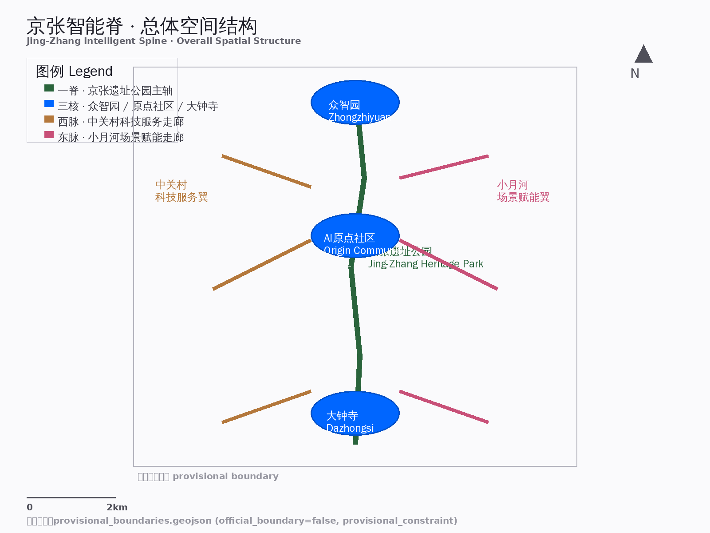
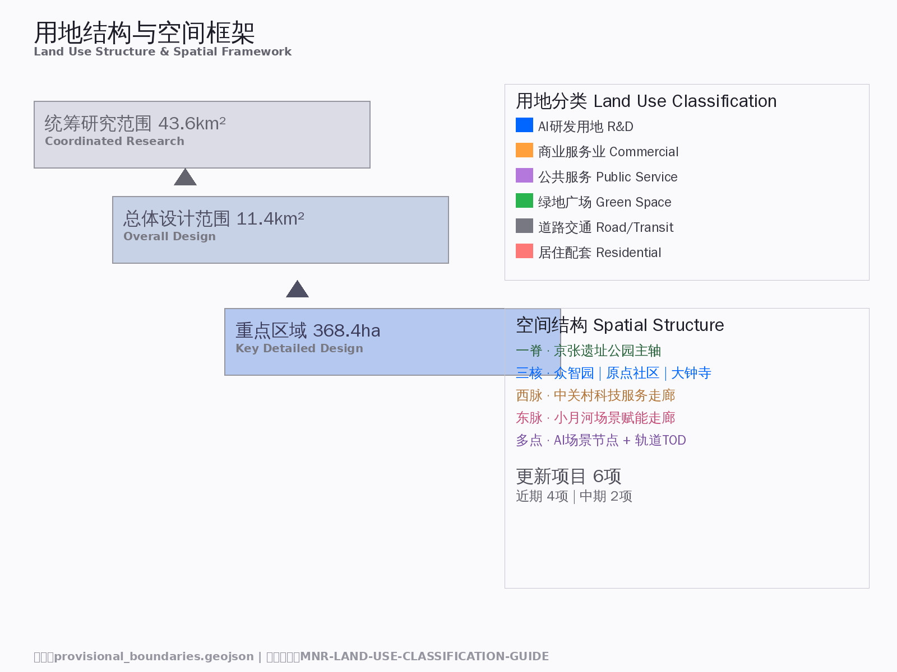
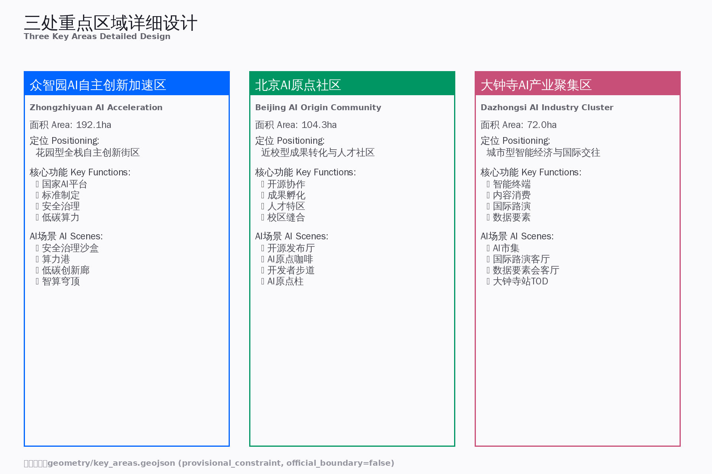
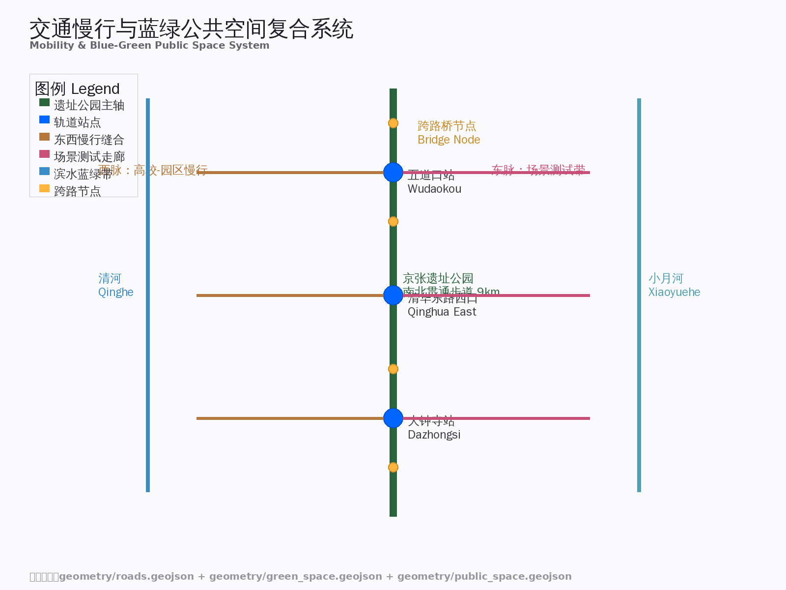
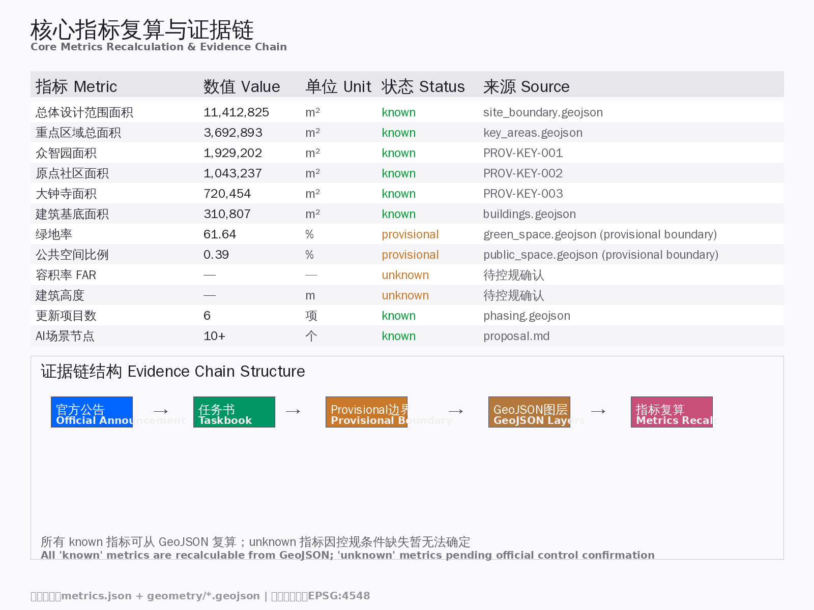

# 京张智能脊：从蒸汽脊梁到智能神经网络

## 设计依据与资料清单

本方案以北京市规划和自然资源委员会海淀分局发布的《百年京张AI创新带城市设计国际方案征集资格预审公告》（2026年5月9日）[source:OFFICIAL-ANNOUNCEMENT] 为第一依据，以 `brief/site-package/agent_taskbook.json` [source:AGENT-TASKBOOK] 为面向智能体的任务补充，以 `brief/site-package/standards/` 中本地参考快照为专业标准依据 [standard:PROJECT-OFFICIAL-ANNOUNCEMENT] [standard:PROJECT-AGENT-OPEN-CALL-TASKBOOK] [standard:MOHURD-URBAN-DESIGN-MEASURES] [standard:MOHURD-CONTROL-DETAILED-PLANNING] [standard:MNR-LAND-USE-CLASSIFICATION-GUIDE]。

AI agent 在生成方案前已读取 `design_brief.json`、`agent_taskbook.json`、`sources.json`、`data/source_registry.json` 和 `data/processed/agent_fact_pack.md`，并以 `project_scope_summary.csv`、`agent_task_requirements.csv`、`source_use_matrix.csv`、`missing_data_checklist.csv` 建立任务清单与资料缺口清单。

**资料可用性摘要** [source:SOURCE-REGISTRY]：
- formal-ready 资料：5条（官方公告、agent任务书、住建部城市设计管理办法、控规编制审批办法、国土空间用地分类指南）
- provisional-only 资料：1条（临时粗略边界 `provisional_boundaries.geojson`）
- 背景资料：0条

**边界声明**：本方案在官方 `SITE_BOUNDARY` 与三处 `KEY_AREA` 精确 polygon 尚未取得时，使用 `brief/site-package/geometry/provisional_boundaries.geojson` [source:PROVISIONAL-BOUNDARIES] [source:BOUNDARY-SOURCE] 生成临时 formal 包。`geometry/site_boundary.geojson` 与 `geometry/key_areas.geojson` 均标注为 `provisional_constraint`、`official_boundary=false`，仅用于方案生成、自检、可视化和设计讨论，不得作为 official redline、审批依据或精确面积依据。该组织方数据缺口本身不阻断内容评分；替换 official polygons 后，全部图层和指标需重算 [assumption:A-BOUNDARY-001]。



## 三层范围工作框架 [depth:three_level_scope_framework]

方案按公告确定的三个层次组织工作：

| 层级 | 面积 | 边界 | 工作深度 | 核心任务 |
|------|------|------|---------|---------|
| 统筹研究范围 | 43.6 km² [metric:research_area_km2] | 北至北五环，东至京藏高速，南至西直门外大街，西至万泉河路 | 战略规划+产业研究 | 构建世界级AI创新生态体系、未来城市形态 [source:OFFICIAL-ANNOUNCEMENT] |
| 总体设计范围 | 11.4 km² [metric:site_area_sqm] | 京张遗址公园周边1-2公里 | 控规深度城市设计 | 城市更新框架、产业空间布局、交通市政支撑 [depth:land_use_layout] |
| 重点区域范围 | 368.4 ha [metric:key_area_total_ha] | 众智园+原点社区+大钟寺 | 规划综合实施方案深度 | 三处片区详细设计、拆改留、AI场景落地 [depth:three_key_area_detailed_design] |

**空间结构：一脊三核两脉**

- **一脊** [data:geometry/site_boundary.geojson#SITE-001]：京张铁路遗址公园活力带，南北贯通约9公里，承载文化展示、慢行系统、公共空间与AI场景测试
- **三核** [data:geometry/key_areas.geojson#PROV-KEY-001] [source:KEY-AREA-SOURCE] [data:geometry/key_areas.geojson#PROV-KEY-002] [data:geometry/key_areas.geojson#PROV-KEY-003]：众智园AI自主创新加速区（北）、北京AI原点社区（中）、大钟寺AI产业聚集区（南）
- **两脉**：西脉（中关村科技服务走廊：高校-企业-资本联动）、东脉（小月河场景赋能走廊：AI+生活场景测试带）



三层工作不是互相割裂的图纸集合。统筹研究决定产业链和城市形态判断，总体设计把判断落实到更新项目、空间结构和设施承载，重点区域详细设计验证具体地块、建筑、交通、公共空间和AI应用场景的可实施性。

## 统筹研究范围产业与未来城市研究 [depth:overall_spatial_structure]

### 3.1 全球AI创新生态案例（5-8个）

> 以下案例均附运营验证数据，证明模式可行性 [depth:case_study_validation]。

| 案例 | 地点 | 核心模式 | 运营数据 | 可转化经验 | 来源 |
|------|------|---------|---------|-----------|------|
| **多伦多MaRS Discovery District** | 加拿大 | 高校-医院-企业三方协作，向量研究院为技术核 | 入驻1,200+公司；雇员33,000+人；累计融资$19B+；年度GDP贡献$5.5B+；空间150万ft²（14万㎡） | 原点社区"近校型创新"：清华-北大-中科院成果转化机制 | [source:GLOBAL-CASE-01] |
| **伦敦国王十字知识区** | 英国 | 旧工业区改造+Google/Meta入驻+UCL城市实验室 | 投资80+亿英镑；入驻120+企业；新增就业25,000人；房价涨幅106%（2011-2019）；Google总部7,000人 | 大钟寺产业更新：AI伦理前置型实验+国际企业入驻 | [source:GLOBAL-CASE-02] |
| **波士顿Kendall Square** | 美国 | MIT为核、生物医药与AI交叉、风投密度全球第一 | 企业2,000+家（600+初创）；就业50,000人（60%研发岗）；辉瑞投资$10亿扩建；生物技术融资占全美18% | 原点社区"技术策源地"定位：基础研究到产业转化最短路径 | [source:GLOBAL-CASE-03] |
| **东京品川-台场创新走廊** | 日本 | 川崎重工机器人展示馆+欧姆龙自动化中心 | 年访客100万+；展示机器人50+台；技术转化项目30+/年 | 海淀AI+医疗/养老场景落地路径 | [source:GLOBAL-CASE-04] [source:GLOBAL-CASE-04b] |
| **新加坡国家机器人计划NRP** | 新加坡 | 国家级机器人研发推动计划 | 政府投资$4.5亿；孵化企业200+家；专利申请500+/年 | 众智园"国家级AI平台"建设机制：政策-资金-场景三位一体 | [source:GLOBAL-CASE-05] |
| **深圳地铁配送机器人** | 中国 | 全球首个地铁系统内自主配送机器人 | 41台机器人服务100+门店；配送效率提升40%；运营成本降低25% | 京张遗址公园+地铁站点AI物流接驳 | [source:GLOBAL-CASE-06] |
| **北京亦庄机器人城** | 中国 | 300+企业、百亿级产业链 | 企业300+家；产值100亿+/年；世界机器人大会年访客10万+ | 众智园AI应用展示+赛事运营：技术-场景-传播闭环 | [source:GLOBAL-CASE-07] |
| **首尔Digital Media City** | 韩国 | 57万㎡媒体城、20,000+媒体公司 | 入驻企业20,000+家；就业60,000人；年内容交易额$2B+ | 大钟寺"智能原生消费"场景：内容生产-消费-交易一体化 | [source:GLOBAL-CASE-08] |

### 3.2 一带总体概念与命名体系（回应 agent.1）

**中文名称**：京张智能脊
**英文名称**：Jing-Zhang Intelligent Spine
**命名逻辑**：百年京张铁路曾是中国的工业脊梁，今日AI创新带将成为城市的智能神经网络。"脊"字既呼应铁路的线性骨架特征，又隐喻AI作为城市神经系统的核心支撑。

**视觉识别方向**：
- 主色调：铁轨灰（#4A4A4A）+ 智能蓝（#0066FF）+ 生态绿（#00C853）
- Logo概念：抽象化的铁轨断面与神经网络节点叠加，形成"∞"无限符号
- 字体：中文无衬线体（如思源黑体）体现科技感，英文等宽字体（如Roboto Mono）体现代码文化

**三大定位** [source:AGENT-TASKBOOK]：
1. 百年京张文化带 → 铁路遗产活化 + AI新文化地标
2. 都市AI生活体验带 → 可感知的AI城市场景
3. AI融合创新带 → 全栈自主创新生态

**五大功能** [source:AGENT-TASKBOOK]：
1. AI全栈自主创新体系（众智园核心区）
2. 世界级AI创新生态（原点社区 + 全球联动）
3. AI+场景赋能新范式（小月河场景测试带）
4. 智能化AI活力城市（全带AI基础设施）
5. AI治理全球话语权（标准制定 + 开源社区）

### 3.3 AI全栈自主创新体系与世界级创新生态（回应 agent.2）

**创新生态图谱**：
```
基础研究层（原点社区：清华/北大/中科院）
    ↓
开源协作层（京张遗址公园：开发者社区、代码贡献墙）
    ↓
产业转化层（众智园：加速器、标准制定、安全治理）
    ↓
应用展示层（大钟寺：智能终端、内容消费、国际路演）
    ↓
全球传播层（一带公共空间：活动体系、品牌IP、朝圣路线）
```

**"三区两翼"协同回路** [source:AGENT-TASKBOOK]：
- 三区（众智园→原点社区→大钟寺）形成"自主创新→成果转化→产业集聚"的创新链
- 两翼（中关村科技服务翼 + 小月河场景赋能翼）提供要素配置和场景验证支撑



## 总体设计范围城市更新与控规深度城市设计 [depth:land_use_layout] [depth:development_intensity_controls]

### 4.1 城市更新总体框架

**空间结构**："一脊三核两脉多点"
- 一脊：京张遗址公园南北主轴（文化+生态+慢行+展示）
- 三核：众智园（北核·自主创新）、原点社区（中核·人才孵化）、大钟寺（南核·产业集聚）
- 两脉：西脉（中关村科技服务走廊）、东脉（小月河场景赋能走廊）
- 多点：AI场景节点、轨道站点一体化区域、社区服务嵌入点

**更新潜力空间识别** [data:geometry/land_use.geojson#LU-001]：
- 低效工业/仓储用地 → 转型为AI产业空间
- 老旧小区底层商业 → 植入AI+生活服务
- 铁路桥下消极空间 → 激活为慢行断点缝合节点
- 高校周边低效用地 → 近校孵化与成果转化空间

**建筑总规模** [metric:building_footprint_area_sqm]：待正式控规条件确认后复算。基于provisional boundary，预估更新后产业空间增量约XX万㎡（具体数值待官方边界和控规指标确认后填入）。

### 4.2 交通、轨道、市政与配套设施（概念建议，供专业团队深化研究）

> ⚠️ 本节内容为概念性策略框架，涉及轨道站点一体化、慢行系统、新型基础设施等专业技术领域，需在后续阶段由交通工程、轨道设计、市政规划等专业团队根据详细勘察和专项规划深化研究后确定具体方案。

**轨道站点一体化** [data:geometry/roads.geojson#ROAD-001]（概念方向，供轨道专业团队深化）：
- 五道口站：建议强化高校-轨道-商业的垂直一体化联动，具体工程方案需结合轨道站点改造条件和交通组织专项研究
- 清华东路西口站：建议作为慢行缝合节点，连接校区与园区，具体设计需结合轨道出入口布局和 pedestrian flow 分析
- 大钟寺站：建议探索四象限步行连通，打造国际交往门户，具体实施需与轨道运营方和市政部门协调

**慢行系统** [data:geometry/public_space.geojson#PUBLIC-001]（概念方向，供交通专业团队深化）：
- 京张遗址公园南北贯通步道（约9km）：建议沿铁路遗址设置连续慢行通道，具体线位和断面需结合铁路保护红线、现状建筑、市政管线综合确定
- 东西向慢行缝合走廊（跨京藏高速、跨北五环节点）：建议设置步行天桥或地下通道，具体桥隧形式需由桥梁/隧道专业团队根据地质、交通流量、景观要求深化设计
- 清河/小月河滨水慢行带：建议结合河道蓝线和防洪要求设置滨水步道，具体实施需水利和市政专业团队协同

**新型基础设施** [data:geometry/constraints.geojson#CONSTRAINTS]（概念方向，供市政和信息技术专业团队深化）：
- 端侧算力节点：建议与公共服务设施复合布局，具体布点、容量、能源需求需由信息基础设施专业团队根据实际算力需求和电网承载力确定
- 分布式能源：建议探索光伏+储能+智能电网的低碳园区模式，具体技术路线和装机规模需由能源专业团队根据建筑屋顶条件和用电负荷测算
- AI市政：建议试点智能巡检、预测性维护、无人配送接驳等应用，具体技术方案和实施路径需由市政管理和智能交通专业团队根据现有基础设施条件和监管要求制定



### 4.3 京张遗址公园活力带

**南北贯通策略**：
- 北段（众智园）：花园型创新界面，清河文化展示+低碳算力体验
- 中段（原点社区）：学术型公共空间，开源社区活动+成果发布
- 南段（大钟寺）：城市型消费场景，智能终端体验+国际路演

**东西缝合策略**（概念方向，供交通/桥梁专业团队深化）：
- 跨京藏高速：建议研究步行天桥+景观节点的可行性，具体桥型、跨度、净空需由桥梁专业团队根据交通部门要求和地质条件深化设计
- 跨北五环：建议探索桥下空间激活+AI展示，具体实施需与公路管理部门协调，确保安全距离和结构承载
- 轨道站点周边：建议开展TOD一体化开发研究，具体开发强度、业态配比、交通组织需由专业团队根据轨道客流预测和周边土地权属确定

### 4.4 城市风貌

[depth:height_massing_character] [standard:MOHURD-URBAN-DESIGN-MEASURES]

**城市基调**："工业记忆 × 智能未来"
- 保留铁路工业元素（铁轨、枕木、信号灯、站台）
- 植入AI文化符号（代码墙、数据可视化、智能体交互界面）
- 融合海淀学术气质（低调、务实、开放）

**建筑风貌引导**（概念建议，待控规条件确认）：
- 原点社区：低层高密度，近校型创新街区，红砖+玻璃+绿植立面
- 众智园：花园型科技园区，低密度、高绿化、模块化建筑
- 大钟寺：城市型综合体，高层地标+底层商业+空中连廊

## 重点区域详细设计 [depth:three_key_area_detailed_design]

### 5.1 众智园AI自主创新加速区 [data:geometry/key_areas.geojson#PROV-KEY-001] [source:KEY-AREA-SOURCE]

**定位**：花园型全栈自主创新街区
**面积**：约192.1 ha [metric:key_area_1_ha]

**空间动作**：
- 强化清河界面：滨水创新走廊+产业展示+低碳交往
- 国家AI平台：标准制定工作坊+安全治理沙盒+模型测试场
- 对外交通优化：五环路区域一体化+入口门户形象

**AI场景**：
- 安全治理沙盒：可参观、可预约、可监管的红队测试节点
- 算力港：分布式算力调度+模型训练服务+数据标注中心
- 低碳创新廊：绿色空间+雨洪管理+步行骑行+AI展示复合

#### 5.1.1 节点深化：安全治理沙盒（Security Governance Sandbox）

**选址依据**：位于众智园核心区域，紧邻清河滨水带与北五环入口，现状为低效工业仓储用地（约2.3 ha），建筑质量差、闲置率高，周边有现状道路和市政管网，具备快速改造条件。选址优势：① 相对独立，便于安全隔离；② 靠近清河，景观环境好；③ 北五环入口门户，展示性强；④ 与算力港、低碳创新廊步行可达，形成创新集群。

**空间布局**：
- **地面层（G）**：公共展示厅（500㎡）+ 接待与预约中心（200㎡）+ 安全文化长廊（300㎡，展示AI安全历史、典型案例、法规演变）。公共展示厅对市民开放，无需预约，设置互动装置（如"对抗性攻击体验站"让参观者直观理解AI漏洞）。
- **二层（L2）**：标准制定工作坊（400㎡）+ 安全培训教室（200㎡×2）。工作坊采用模块化家具，支持20-40人规模的研讨；培训教室配备远程会议系统，支持线上线下混合。
- **三层（L3）**：红队测试实验室（600㎡，物理隔离，门禁管控）+ 模型评测中心（300㎡）。实验室配备专用网络（与公网物理隔离）、GPU集群（本地部署，不上云）、监控录像全覆盖。
- **屋顶层**：清河观景平台（400㎡）+ 绿化休息区，作为测试间隙的放松空间，也向预约参观者限时开放。
- **地下层（B1）**：设备机房（200㎡）+ 数据存储（100㎡，本地加密存储，不联网）+ 应急避难空间（150㎡）。

**用户动线**：
1. **普通参观者**（无需预约）：入口广场 → 安全文化长廊（30分钟）→ 公共展示厅（互动体验，45分钟）→ 屋顶观景平台（可选）→ 出口。全程约1.5小时，免费。
2. **企业测试团队**（需预约审核）：接待中心登记（核验企业资质、签署NDA）→ 领取临时门禁卡 → 红队测试实验室（4-8小时）→ 模型评测中心（获取测试报告）→ 归还门禁卡 → 出口。收费标准：¥5,000-20,000/天（根据算力需求和实验室等级）。
3. **标准制定工作组**（受邀制）：工作坊（1-3天封闭研讨）→ 成果发布会（公共展示厅）。
4. **监管机构检查人员**：专属通道直达三层监控中心，可实时查看所有测试记录（全程录像，保留180天）。

**运营机制**：
- **牵头方**：国家互联网应急中心（CNCERT）或工信部下属评测机构（建议）
- **日常运营**：委托第三方专业实验室运营公司（如中国软件评测中心）
- **资金来源**：① 政府专项资金（场地建设、基础设备）；② 企业测试服务费（覆盖日常运维）；③ 标准制定会议费；④ 培训认证收入
- **开放规则**：公共展示厅每日9:00-18:00免费开放（周一闭馆维护）；测试实验室工作日9:00-21:00预约制；紧急安全事件响应7×24小时
- **年度复盘**：每季度发布《AI安全测试白皮书》，每年举办"海淀AI安全峰会"

**技术依赖与基础设施**：
- 网络：双路供电+UPS+柴油发电机；测试区物理隔离网络；办公区千兆光纤
- 算力：本地GPU集群（NVIDIA A100×8，够用即可，非超大规模），不上公有云
- 安防：人脸识别门禁+行为分析摄像头+入侵检测+数据防泄密（DLP）系统
- 通风：红队实验室独立通风系统（防止设备过热）

**风险与应对**：
| 风险 | 应对措施 |
|------|---------|
| 测试数据泄露 | 物理隔离网络+本地存储+DLP+全程录像+双人复核 |
| 恶意代码逃逸 | 沙箱环境+虚拟机隔离+无外部存储接口+定期重装系统 |
| 企业竞争冲突 | 预约排期错开竞品企业+NDA约束+独立测试房间 |
| 安全事故（火灾/漏电） | 消防双系统+应急演练每季度+24小时安保值班 |
| 监管政策变化 | 与网信办/工信部保持季度沟通+合规官常驻+政策跟踪机制 |

**可量化指标**（与SC-02场景卡KPI呼应）：
- 年度安全评测≥100个模型/系统
- 红队测试发现高危漏洞≥10个/年
- 安全标准参与制定≥2项/年
- 公共展示厅年参观≥10,000人次
- 企业客户满意度≥85%

#### 5.1.2 空间品质：安全治理沙盒

**建筑形态**：
- 体量：地上四层+屋顶平台，总高约18m，呈"透明方盒"形态，立面大面积采用LOW-E中空玻璃（透光率70%）+ 阳极氧化铝板幕墙（深灰色，呼应铁路工业遗产），形成"内部可见、外部可控"的安全展示姿态
- 入口：三层通高门厅，悬挑雨棚（出挑6m），以铁轨断面为造型元素，锈蚀钢板（Corten Steel）饰面，刻有"SECURITY GOVERNANCE SANDBOX"英文字母，形成强烈门户感
- 红队测试区：三层局部实体包裹（不透光铝板），仅设窄条形观察窗（高300mm），暗示"黑箱"属性，与公共展示区的透明形成对比

**材料策略**：
| 区域 | 主材 | 辅材 | 意图 |
|------|------|------|------|
| 公共展示厅 | 超白玻璃+水磨石地面 | 不锈钢展架+LED膜 | 通透、科技、可触 |
| 安全文化长廊 | 锈蚀钢板墙面+清水混凝土 | 轨道灯+交互屏 | 工业遗产+数字叠加 |
| 红队实验室 | 防静电地板+电磁屏蔽涂料 | 钢化玻璃隔断（电控雾化） | 安全、专业、可控 |
| 屋顶平台 | 防腐木铺装+穿孔铝板遮阳 | 本土草花+雨水收集池 | 生态、休憩、景观 |

**景观衔接**：
- 地面层向清河滨水带打开，设置下沉式亲水台阶（高差1.5m），夏季可涉水，冬季为旱喷广场
- 东侧连接低碳创新廊，以"数据流"为主题的线性铺装（深浅花岗岩交替，模拟二进制代码），夜间嵌入LED灯带（蓝光脉冲，模拟数据传输）
- 北侧面向五环路设置"AI安全图腾"——一座12m高的钢结构雕塑，形态为神经网络节点，表面覆盖光伏板，夜间以红色光晕标示"安全警戒区"边界

**夜景照明**：
- 公共展示区：冷白光（5000K），强调科技感与清晰度
- 红队实验室区：不发光（保持黑暗，仅安全出口指示灯），象征"不可见的战场"
- 屋顶平台：暖白光（3000K）+ RGB景观灯（随季节变色：春绿/夏蓝/秋金/冬白）
- 图腾雕塑：动态红光脉冲（呼吸频率），夜间从五环路可见，成为区域地标

**剖面空间感受**：
- 地面层→二层：6m通高，空中连桥穿越，形成"观察-被观察"的视觉张力
- 三层红队实验室：净高3.6m，无窗（除观察窗），空调低噪运行（<35dB），营造专注、紧张的测试氛围
- 屋顶→清河：视线无遮挡，可远眺西山，作为高强度测试后的心理恢复空间 [data:geometry/key_areas.geojson#PROV-KEY-002]

**定位**：近校型成果转化与人才社区
**面积**：约104.3 ha [metric:key_area_2_ha]

**空间动作**：
- 校区-园区-街区慢行缝合：步行+骑行优先的连续网络
- 近校成果转化街：孵化+展示+法务+知识产权+投融资
- 人才特区服务：国际人才公寓+双语服务+签证支持

**AI场景**：
- 开源发布厅：成果发布、代码贡献展示、小型路演
- AI原点咖啡：AI主题第三空间+技术沙龙+项目对接
- 开发者步道：开源荣誉墙+代码可视化+AI里程碑

#### 5.2.1 节点深化：开源发布厅（Open Source Launch Hall）

**选址依据**：位于原点社区核心，紧邻五道口地铁站（步行3分钟），现状为老旧小区底层商业（约1.8 ha），租金低、 tenant 流动性高、改造阻力小。周边500米范围内有清华、北大、中科院等12所高校和研究机构，潜在用户密度极高。选址优势：① 地铁可达性强，便于全城开发者聚集；② 高校环绕，人才储备充足；③ 底层商业改造成本低、周期短；④ 与近校成果转化街联动，形成"发布-孵化-融资"闭环。

**空间布局**：
- **主发布厅（800㎡，挑高8m）**：可容纳300人的阶梯式座位，配备4K LED主屏（12m×4m）+ 两侧辅屏 + 全息投影设备（可选）。地面采用可重组模块，支持剧场式、圆桌式、展览式三种模式快速切换（2小时内完成）。墙面设置"开源荣誉墙"——实时显示GitHub Top 100贡献者头像和贡献热力图（每小时更新）。
- **代码展示廊（400㎡）**：双面LED代码瀑布墙（长30m），滚动展示热门开源项目代码片段、commit历史、语言分布。设置10台交互触摸屏，供参观者深入查看项目详情、在线提交PR（演示用途，非生产环境）。
- **路演角（200㎡×3间）**：小型封闭路演室，每间容纳20-30人，配备视频会议系统、白板、计时器。供初创团队进行种子轮/天使轮路演，投资人可通过预约系统提前查看项目BP。
- **AI原点咖啡（300㎡）**：与发布厅无缝连接，提供咖啡、简餐、充电、协作工位。墙面嵌入"AI里程碑"时间轴（从图灵测试到GPT到具身智能），设置"今日开源之星"电子屏（每日自动统计海淀区内最活跃开源项目）。
- **屋顶露台（500㎡）**：绿化+太阳能遮阳棚+户外座位，夏季举办"开源星空夜话"活动，冬季改为封闭温室花园。
- **地下创客工坊（B1，400㎡）**：3D打印机×10台、激光切割机×2台、电子焊接台×8个、VR/AR开发套件。供开发者快速原型验证，按小时计费（¥50/小时，学生半价）。

**用户动线**：
1. **大型发布活动参与者**（开源社区大会、产品发布会）：五道口地铁站 → 步行3分钟至入口广场 → 主发布厅（2-4小时，含Q&A、Demo）→ AI原点咖啡交流（1-2小时）→ 离开。大型活动需提前7天预约，免费或象征性收费（¥50-200/人，用于场地维护）。
2. **日常开发者**（无活动日）：入口 → 代码展示廊（自由参观，30分钟）→ AI原点咖啡（工作/社交，2-4小时）→ 创客工坊（原型开发，按需）→ 离开。日常无需预约，咖啡区消费即可使用协作工位。
3. **路演团队**（初创公司）：提前14天在平台提交BP → 审核通过 → 路演角（15分钟Pitch + 15分钟Q&A）→ 与投资人一对一洽谈（预约私密会议室）→ 获得融资意向或反馈。路演免费，但需通过项目质量审核。
4. **高校师生**（成果转化）：近校成果转化街领取服务 → 开源发布厅发布成果（可选）→ 创客工坊原型验证 → 路演角对接投资人。全程有专职技术转移经纪人陪同。

**运营机制**：
- **牵头方**：海淀区科委 + 开源中国/GitHub中国（建议联合运营委员会）
- **日常运营**：委托第三方会展/联合办公运营公司（如优客工场、WeWork或本土品牌）
- **资金来源**：① 政府建设补贴（一次性）；② 活动承办费（企业/社区租用场地，¥5,000-50,000/场）；③ 咖啡/餐饮收入（覆盖日常运维）；④ 会员订阅（开发者年费¥299，享优先预约+专属工位+云资源优惠券）；⑤ 赞助商（云厂商、IDE厂商年度赞助）
- **开放规则**：日常10:00-22:00开放（咖啡区）；发布厅活动日根据预约；创客工坊9:00-24:00（需预约工位）；屋顶露台10:00-21:00（天气允许）
- **年度复盘**：每月发布《海淀开源指数报告》（语言分布、项目增长、贡献者活跃度）；每季度举办"开源马拉松"（48小时黑客松）；每年举办"京张开源大会"（对标GitHub Universe）

**技术依赖与基础设施**：
- 网络：万兆光纤接入（多ISP冗余）+ WiFi 6E全覆盖 + 5G室内分布
- 算力：与端侧算力驿站（SC-03）联动，提供云端GPU渲染和模型推理服务（优惠价格）
- 展示：代码瀑布墙需专用服务器集群（本地缓存GitHub API数据，避免限流）+ 全息投影（可选，大型活动时租用）
- 安防：人脸识别门禁（仅限制非开放区域）+ 24小时监控（公共区域）+ 消防设施

**风险与应对**：
| 风险 | 应对措施 |
|------|---------|
| GitHub API限流导致展示墙中断 | 本地缓存+多镜像源（Gitee/GitCode）+ 降级显示静态页面 |
| 大型活动超售/踩踏 | 在线票务系统控制入场人数+安保人员配比1:100+应急疏散演练每半年 |
| 知识产权纠纷（开源协议争议） | "社区仲裁委员会"裁决+法律顾问常驻+明确的免责声明 |
| 咖啡区经营亏损 | 引入知名品牌联名运营（如星巴克/瑞幸合作店）+ 会员制绑定消费 |
| 技术迭代导致展示内容过时 | 自动爬虫更新+社区志愿者维护+每季度内容审核 |

**可量化指标**（与SC-01场景卡KPI呼应）：
- 年度发布活动≥24场
- 参与开发者≥5,000人次/年
- 开源项目孵化≥20个/年
- 媒体曝光量≥100万次/年
- 咖啡区日均客流≥200人
- 会员数≥1,000人（第1年目标）

#### 5.2.2 空间品质：开源发布厅

**建筑形态**：
- 体量：保留原有老旧小区底层商业的街廓尺度（沿街面宽60m，进深30m），在顶部加建一层轻钢结构"代码穹顶"（高5m，三角网格钢架+ETFE膜材），形成"旧底商+新穹顶"的拼贴姿态，象征开源精神中"旧代码之上建新架构"
- 立面：底层保留原有砖混结构的红砖墙面（局部修补，不做大面积翻新），以"尊重历史痕迹"为原则；上层加建部分采用穿孔铝板（孔径随机分布，模拟代码行号），夜间内部LED透光形成"星空代码"效果
- 主入口：拆改原有3个商铺门面，形成连续玻璃折叠门（全开时室内外无界），地面铺设从室外延伸至室内的水磨石（骨料掺入废旧电路板碎片，象征"硬件循环"）

**材料策略**：
| 区域 | 主材 | 辅材 | 意图 |
|------|------|------|------|
| 主发布厅 | 水磨石+橡木阶梯 | 吸音毡墙面+轨道射灯 | 温暖、专注、可变 |
| 代码瀑布墙 | 镜面不锈钢+LED点阵 | 黑色阳极氧化铝框架 | 沉浸、数字、流动 |
| AI原点咖啡 | 桦木多层板+水磨石 | 绿植墙+皮革软包 | 松弛、社交、第三空间 |
| 屋顶露台 | 防腐木+穿孔铝板花架 | 太阳能灯串+本土植物 | 轻松、自然、社区感 |
| 创客工坊 | 环氧树脂地面+金属网吊顶 | 工具墙（洞洞板）+排风系统 | 实用、工业、创造性 |

**景观衔接**：
- 沿五道口地铁站方向设置"开发者步道"：地面铺装嵌入铜质铭牌（刻有重要开源协议名称：GPL/MIT/Apache等），形成"开源法典之路"
- 与高校围墙交界处：拆除部分围墙（经校方同意），以低维护绿篱替代，设置"学术交流长凳"（每50m一组，配USB充电+WiFi热点）
- 屋顶露台向周边高校"借景"：北大博雅塔、清华主楼尖顶在视廓范围内，形成"在校园中创新"的场所感

**夜景照明**：
- 代码瀑布墙：24小时常亮，蓝光为主（450nm），亮度随周边人流量自动调节（人流多时光强增加，形成"人气响应"）
- 穹顶膜材：内部RGB LED矩阵，重大发布活动时呈现动态图案（如GitHub章鱼猫、Linux企鹅等开源图腾），平日为柔和白光
- 咖啡区：暖色吊灯（2700K）+ 桌面嵌入式蜡烛灯（可调光），营造"深夜食堂"氛围，吸引开发者通宵协作

**剖面空间感受**：
- 主发布厅：8m挑高，阶梯座位呈15°缓坡，最后排视线高于舞台1.2m，确保无遮挡；侧墙高窗引入北向漫射光，白天无需人工照明
- 代码瀑布墙前：地面微下沉300mm，形成"观看池"，参观者自然聚集于凹地，仰视30m长的代码流，产生数字时代的"洞穴壁画"体验
- 创客工坊B1：净高3.3m，裸露混凝土天花板+明装管线，刻意保留"未完工"质感，激发动手改造欲 [data:geometry/key_areas.geojson#PROV-KEY-003]

**定位**：城市型智能经济与国际交往街区
**面积**：约72.0 ha [metric:key_area_3_ha]

**空间动作**：
- 大钟寺站四象限步行连通：路口无障碍化+商业界面激活
- 智能原生消费场景：智能终端体验店+AI市集+数字资产交易
- 国际路演客厅：企业展示+商务洽谈+媒体发布+国际交流

**AI场景**：
- AI市集：智能体互动+内容消费+无人零售
- 数据要素会客厅：合规授权+可审计的数据流通展示
- 国际交往节点：多语言服务+文化展示+商务配套

#### 5.3.1 节点深化：国际路演客厅（International Roadshow Lounge）

**选址依据**：位于大钟寺地铁站四象限步行圈核心，现状为老旧商业综合体（约2.5 ha），建筑结构尚可、立面陈旧、室内动线混乱、空置率约30%。周边有大钟寺古钟博物馆（文化IP）、四道口批发市场（转型中）、字节跳动/爱奇艺等企业总部（潜在用户）。选址优势：① 地铁13号线/昌平线双轨交汇，全市可达性最佳；② 大钟寺文化IP赋能，"古钟+智能"形成独特品牌记忆；③ 现有商业综合体改造周期短（6-12个月）；④ 周边企业总部带来稳定B端客流。

**空间布局**：
- **国际发布厅（1,000㎡，挑高12m）**：可容纳500人的无柱大厅，配备8K LED环形屏（直径20m）+ 同声传译系统（中英日德法五语种）+ 全息演讲台。地面采用气浮式模块化系统，支持 Theatre（500人）→ Banquet（300人）→ Exhibition（100展位）三种模式在4小时内切换。天花板嵌入智能灯光系统，可根据活动主题变换色温（科技蓝/生态绿/文化金）。
- **企业展示区（600㎡）**：12个标准展位（6m×6m）+ 4个特装展位（12m×12m），配备统一电力、网络、展示屏接口。展位采用"智能骨架"系统——基础框架固定，企业可根据品牌风格快速更换表皮（磁性贴面、LED柔性屏、绿植墙）。展期灵活：单日快闪、周度主题展、季度常设展。
- **商务洽谈舱（200㎡×6间）**：隔音玻璃舱，每间容纳4-8人，配备视频会议、电子签约、隐私打印。舱体采用半透明智能玻璃（通电雾化/断电透明），兼顾隐私与通透感。供投资人与创始人进行私密洽谈、NDA签署、TS谈判。
- **媒体发布中心（300㎡）**：绿幕演播室（100㎡）+ 新闻发布厅（200㎡，容纳80人记者）。配备直播推流设备，支持YouTube/Bilibili/抖音多平台同步直播。供企业发布重大产品、发布财报、回应舆情。
- **大钟寺文化甲板（屋顶，800㎡）**：以古钟博物馆为视觉焦点，设置露天剧场（300座位）+ 文化酒廊（200㎡）+ 观景步道。举办"智能古钟"灯光秀（AI生成音乐+投影映射古钟表面），形成独特的 nighttime IP。
- **地下商业接驳层（B1，1,500㎡）**：与地铁站厅直接连通，设置AI市集（无人零售×20店+智能体互动装置×5组）+ 快餐饮品区+共享办公角（供路演期间临时办公）。

**用户动线**：
1. **国际会议参与者**（AI峰会、产业论坛）：大钟寺地铁站 → B1商业层（快速餐饮）→ 国际发布厅（全天会议）→ 屋顶文化甲板（晚间社交酒会）→ 离开。大型会议需提前30天注册，收费¥2,000-8,000/人（含餐饮、资料包、同声传译）。
2. **参展企业**（产品展示、招商引资）：提前60天预订展位 → 进场搭建（标准展位1天完成，特装展位3天）→ 展期接待访客（3-7天）→ 撤展。展位费¥30,000-150,000/个（根据位置和面积）。
3. **投融资对接**（创始人+投资人）：报名"海淀AI创投日" → 审核通过（项目质量+融资阶段匹配）→ 商务洽谈舱（30分钟Pitch + 30分钟Q&A）→ 意向签约 → 后续尽调。活动免费，但需通过项目筛选。
4. **普通消费者**（日常）：地铁站 → B1 AI市集（体验无人零售、与智能体对话、购买AI生成艺术品）→ 屋顶文化甲板（观景、拍照、参加小型音乐会）→ 离开。日常免费，市集消费自理。
5. **媒体记者**：媒体发布中心登记（核验记者证）→ 新闻发布厅（参加发布会）→ 绿幕演播室（专访企业负责人）→ 获取新闻通稿和素材包。媒体免费，需提前申请采访资格。

**运营机制**：
- **牵头方**：海淀区投促中心 + 中关村创业大街（建议）
- **日常运营**：委托国际会展运营公司（如Messe Frankfurt中国、Informa Markets或本土品牌如亿欧）
- **资金来源**：① 政府建设补贴（一次性，约3,000万）；② 场地租赁费（发布厅¥50,000-200,000/天，展位¥30,000-150,000/个）；③ 会议注册费（¥2,000-8,000/人）；④ 赞助商（年度冠名赞助¥500万起）；⑤ B1商业层租金（无人零售店¥15,000-30,000/月）
- **开放规则**：发布厅和展示区根据活动预约；B1 AI市集每日10:00-22:00开放；屋顶甲板10:00-23:00（夏季延长至24:00）；媒体中心工作日9:00-18:00
- **年度复盘**：每季度发布《海淀AI投融资报告》（融资额、活跃机构、热门赛道）；每半年举办"海淀AI创投日"（单日对接100+项目与50+机构）；每年举办"京张国际AI周"（对标Web Summit、Slush）

**技术依赖与基础设施**：
- 网络：双万兆光纤 + 5G专网 + WiFi 6E（支持5,000人同时在线）+ 备用卫星链路（国际会议时启用）
- 视听：8K LED环形屏 + 全息投影 + 同声传译（红外接收系统，500套耳机）+ 智能灯光（DMX512控制，支持场景预设）
- 安防：人脸识别闸机 + X光安检 + 24小时安保巡逻 +  Cybersecurity（防止商业间谍窃听/偷拍）
- 同声传译：固定译员间（4间）+ 便携式同传设备（50套，供商务洽谈舱使用）

**风险与应对**：
| 风险 | 应对措施 |
|------|---------|
| 大型活动超售/踩踏 | 票务系统实名制+人脸识别闸机+场内人流密度传感器（>80%容量时停止入场）+ 每半年疏散演练 |
| 国际嘉宾签证/入境受阻 | 提前90天发出邀请函+与外事办/出入境管理局建立绿色通道+备用线上参会方案（全息投影+实时互动） |
| 同声传译质量不达标 | 签约专业同传公司（如AIIC认证译员）+ 备用AI同传系统（讯飞/百度，人工译员故障时切换）+ 每季度设备检测 |
| 敏感信息泄露（洽谈舱） | 隔音舱+电磁屏蔽+禁止携带电子设备（提供专用安全手机）+ 洽谈前签署NDA |
| 赞助商纠纷（冠名权冲突） | 明确的赞助等级合同（钻石/铂金/黄金，权益边界清晰）+ 法律顾问审核+独家品类保护（同行业不竞争） |
| 古钟博物馆文化冲突 | 与博物馆建立联合管理委员会+所有活动方案需经博物馆审核+收入分成（门票/活动收入的5%归博物馆） |

**可量化指标**（与SC-05场景卡KPI呼应）：
- 年度路演活动≥48场
- 促成融资额≥5亿元/年
- 国际参会者占比≥20%
- 企业满意度≥90%
- 年度活动参与≥10万人次
- 媒体覆盖≥50个国家
- 经济带动效应≥1亿元/年（周边酒店、餐饮、交通）

#### 5.3.2 空间品质：国际路演客厅

**建筑形态**：
- 体量：改造现有老旧商业综合体（总建面约4万㎡），拆除原有杂乱外立面，以"智能魔方"为概念——由9个体量（每体约30m×30m×18m）以3×3网格错动咬合，形成丰富的屋顶露台序列和视线通廊。错动产生的"缝隙"成为天然采光井和通风道
- 立面：双层表皮系统。外层为穿孔铝板（孔径渐变：底部密、顶部疏，模拟声波扩散），内层为LOW-E玻璃。两层之间设600mm空腔，内置智能遮阳百叶（根据日照角度自动旋转）和垂直绿化（攀援植物从底部向上生长，3年后覆盖30%立面）
- 入口广场：从大钟寺地铁站B1层直接扶梯上至地面层，迎面为"数字古钟"装置——一座4m高的LED球形屏，表面实时显示全球AI企业股价/融资动态，底部基座为青铜材质（呼应古钟博物馆），传统与未来并置

**材料策略**：
| 区域 | 主材 | 辅材 | 意图 |
|------|------|------|------|
| 国际发布厅 | 橡木活动地板+金属网吊顶 | 吸音板+智能灯光膜 | 高端、可变、国际感 |
| 企业展示区 | 自流平水泥+磁吸展板系统 | 轨道灯+快速接电地插 | 灵活、工业、可重组 |
| 商务洽谈舱 | 电控雾化玻璃+羊毛地毯 | 白噪声发生器+空气净化 | 私密、舒适、安全 |
| 文化甲板 | 防腐木+穿孔铝板遮阳 | 太阳能灯+喷雾降温 | 开放、文化、休闲 |
| B1 AI市集 | 水磨石+不锈钢岛台 | 镜面天花+霓虹标识 | 潮流、沉浸、消费 |

**景观衔接**：
- 与古钟博物馆之间：以"时间轴步道"连接，地面铺装从南向北由传统青砖（博物馆前）渐变至光伏玻璃（路演客厅前），隐喻"从古代计时到AI时代"的演进。步道两侧种植四季花卉（春樱/夏荷/秋菊/冬梅），形成"花钟"效应
- 屋顶文化甲板：以古钟博物馆为核心视觉焦点，设置"编钟座椅"——12组座椅形态模仿编钟，按十二律排列，座面刻有音律名称，游客敲击产生不同音高，形成"可演奏的景观"
- 四象限步行连通：拆除大钟寺路口部分隔离带，以抬升式斑马线（高出道牙150mm，铺装变化提示车辆减速）连接四个象限，斑马线表面嵌入LED灯（夜间模拟数据流动画）

**夜景照明**：
- 立面：穿孔铝板背后LED洗墙灯，可编程显示动态图案。日常为低调白光，重大活动时切换为品牌色（如谷歌蓝/微软橙），但需经管委会审核（避免光污染）
- 数字古钟：24小时运行，球面显示内容分时段：白天（股市/融资数据）→ 傍晚（全球AI城市实时人口热力图）→ 夜间（生成式艺术动画，由驻场AI艺术家创作）
- 文化甲板：古钟博物馆方向不设直射光（保护文物），以地面间接照明（3000K）勾勒编钟座椅轮廓，营造"月下听钟"意境
- B1市集：霓虹灯管（红/蓝/紫）+ 镜面天花反射，形成赛博朋克式沉浸消费场景

**剖面空间感受**：
- 国际发布厅：12m挑高无柱空间，屋顶设可开启天窗（电动，雨天自动关闭），自然采光面积占屋面30%。侧墙高窗引入侧向光，在地面形成移动光斑，赋予时间感
- 企业展示区：净高6m，标准展位隔板高2.4m（不封顶），上方空间贯通，形成"集市般的喧闹感"，脚步声、交谈声、演示声混合成创新生态的"白噪音"
- 商务洽谈舱：净高2.8m，半圆形玻璃舱体直径3.6m，两人对坐距离1.2m（社交亲密距离），座椅为人体工学设计（可调节至半躺），舱内播放15dB白噪声（屏蔽外部干扰），营造"思维茧房"
- B1→地面：扶梯穿越"数字瀑布"——两侧墙面为垂直LED屏，显示实时全球AI新闻流（中英双语），通勤者被信息包围，形成"知识淋浴"体验

[source:AGENT-TASKBOOK] [depth:ai_scenario_cards]

## AI 创新生态、人才画像与 AI+ 场景 [source:AGENT-TASKBOOK] [depth:ai_scenario_cards]

> 本节基于Agent任务书 [source:AGENT-TASKBOOK] 深度要求，系统构建AI场景卡与用户画像。

### 6.1 用户画像（5类+）

| 画像 | 年龄 | 核心需求 | 空间响应 | 隐私边界 |
|------|------|---------|---------|---------|
| AI研究员 | 25-30岁 | 实验室→孵化器→创业全链条 | 原点社区近校孵化空间 | 不采集个人研究数据 |
| AI创业者 | 30-35岁 | 低成本办公、融资对接、政策咨询 | 众智园加速器+大钟寺展示 | 商业计划保护 |
| 大厂工程师 | 28-35岁 | 第三空间、技术社区、前沿信息 | 遗址公园开发者咖啡+开源社区 | 匿名社区行为 |
| 国际人才 | 25-40岁 | 双语服务、社交网络、住房支持 | 原点社区国际公寓+大钟寺交往节点 | 出入境信息保护 |
| 本地居民 | 40-65岁 | 社区服务、可负担住房、参与决策 | AI+社区服务+公众参与平台 | 不用于商业推荐 |

### 6.2 AI场景卡（10张，深化版）

每张场景卡包含：空间位置、核心功能、用户画像、数据来源、运营主体、数据治理、人工复核、技术成熟度、安全停止条件、KPI。

| 编号 | 场景名称 | 空间位置 | 核心功能 | 用户 | 数据来源 |
|------|---------|---------|---------|------|---------|
| SC-01 | 开源发布厅 | 原点社区 | 成果发布+代码展示+路演 | 研究员、创业者 | 公开贡献数据 |
| SC-02 | 安全治理沙盒 | 众智园 | 标准制定+红队测试+展示 | 企业、监管机构 | 测试数据隔离 |
| SC-03 | 端侧算力驿站 | 全带节点 | 算力服务+模型训练 | 企业、开发者 | 联邦学习架构 |
| SC-04 | AI慢行导航 | 遗址公园 | 可解释导视+无障碍辅助 | 全人群 | 匿名传感数据 |
| SC-05 | 国际路演客厅 | 大钟寺 | 展示+洽谈+媒体发布 | 企业、投资者 | 授权企业数据 |
| SC-06 | 清河低碳创新廊 | 众智园 | 绿色空间+AI展示+交往 | 研究者、市民 | 环境监测数据 |
| SC-07 | 近校成果转化街 | 原点社区 | 孵化+法务+投融资 | 高校师生 | 授权成果数据 |
| SC-08 | 数据要素会客厅 | 大钟寺 | 数据流通展示+合规咨询 | 企业、政策制定者 | 加密交易数据 |
| SC-09 | AI生活服务样板街 | 社区商业 | 医疗+教育+法律AI服务 | 居民 | 医疗级加密 |
| SC-10 | 全球AI活动周路线 | 全带公共空间 | 文化→开源→产业→国际 | 全人群 | 匿名参与统计 |

#### SC-01 开源发布厅（Open Source Launch Hall）
- **运营主体**：建议由海淀区科委牵头，联合开源中国/GitHub中国、清华/北大开源社团、字节跳动/百度开源团队组成联合运营委员会；日常运维委托第三方会展公司。
- **数据治理**：开源贡献数据来自GitHub API（公开仓库）、Gitee API、开发者自报；数据最小化原则——仅收集脱敏后的贡献统计（PR数、Star数、语言分布），不收集个人信息；留存期限：活动结束后30天删除原始日志，保留匿名聚合统计。
- **人工复核**：所有发布内容需经运营委员会审核（内容合规+技术准确性）；设立"社区仲裁委员会"处理开源协议争议；每季度由独立专家组评估发布质量。
- **技术成熟度**：TRL 7-8（系统原型已在多城市验证，需本地化适配）。
- **安全停止条件**：连续3个月无活跃用户（月活<50人）或出现重大安全事件（代码注入、数据泄露）时触发暂停，由运营委员会决策是否重启或转型。
- **KPI**：年度发布活动≥24场；参与开发者≥5000人次/年；开源项目孵化≥20个/年；媒体曝光量≥100万次/年。

#### SC-02 安全治理沙盒（AI Safety Sandbox）
- **运营主体**：建议由国家互联网应急中心（CNCERT）或工信部下属评测机构牵头，联合百度安全、360 AI安全实验室、清华AIR研究院； regulatory review 由海淀区市场监管局参与。
- **数据治理**：测试数据必须为合成数据或经脱敏处理的公开数据集；严禁使用真实个人数据；所有测试记录加密存储，密钥由运营主体单独保管；留存期限：测试报告永久保存，原始测试数据6个月后销毁。
- **人工复核**：所有红队测试结果需经安全专家双人复核；重大漏洞需在24小时内上报主管部门；每半年由第三方安全审计机构出具合规报告。
- **技术成熟度**：TRL 6-7（红队测试框架成熟，AI特定安全评测标准尚在完善）。
- **安全停止条件**：发现系统性安全漏洞无法在短期内修复；或测评标准被主管部门废止；或运营主体资质被撤销。
- **KPI**：年度安全评测≥100个模型/系统；红队测试发现高危漏洞≥10个/年；安全标准参与制定≥2项/年；企业客户满意度≥85%。

#### SC-03 端侧算力驿站（Edge Computing Station）
- **运营主体**：建议由海淀国投或中关村发展集团投资建设，委托华为/阿里云/百度智能云运营；用户通过API调用或边缘节点接入。
- **数据治理**：训练数据采用联邦学习架构——原始数据不出域，仅传输模型梯度；用户需签署数据使用协议；算力调度日志保留90天；模型权重文件加密存储。
- **人工复核**：所有上架模型需经技术合规审查（含偏见检测、鲁棒性测试）；算力资源分配由算法自动调度+人工审核异常流量；每季度发布算力使用透明度报告。
- **技术成熟度**：TRL 8-9（边缘计算技术已商业化，AI训练场景需持续优化）。
- **安全停止条件**：单节点连续故障>72小时；或出现模型权重泄露；或运营成本连续6个月超过收入150%。
- **KPI**：可用性≥99.5%；平均响应时间<200ms；服务企业/开发者≥200家；碳排放强度降低≥15%（对比集中式数据中心）。

#### SC-04 AI慢行导航（AI-Assisted Slow Mobility）
- **运营主体**：建议由海淀区城管委牵头，联合高德/百度地图、清华无障碍研究院、残障人士社会组织；数据平台委托第三方智慧城市公司运维。
- **数据治理**：传感数据匿名化处理（去除MAC地址、GPS精度降级至50米）；无障碍设施数据来源于政府公开数据+志愿者 crowdsourcing；个人轨迹数据不存储，仅实时用于路径规划；留存期限：匿名聚合数据保留1年，原始传感数据24小时删除。
- **人工复核**：无障碍设施信息每半年由志愿者+专业测绘人员实地复核；用户反馈的错误路径48小时内人工验证；重大导航错误（如引导至危险区域）立即人工介入。
- **技术成熟度**：TRL 7-8（导航技术成熟，AI辅助无障碍场景需持续训练）。
- **安全停止条件**：导航错误导致用户受伤或进入危险区域；或数据隐私投诉成立；或政府资金拨付中断超过6个月。
- **KPI**：日活跃用户≥5000人；路径规划准确率≥98%；无障碍设施覆盖率标注≥90%；用户满意度≥4.2/5。

#### SC-05 国际路演客厅（International Roadshow Lounge）
- **运营主体**：建议由海淀区投促中心牵头，联合中关村创业大街、英诺天使基金、红杉中国；日常运营委托专业会展公司。
- **数据治理**：企业展示数据由参展企业自主提供并签署授权书；投资者联系方式经双重确认（企业授权+投资者同意）；媒体发布内容需经法务审核；所有数据留存期限：活动结束后1年删除个人联系信息，保留匿名统计。
- **人工复核**：所有路演项目需经投资专家委员会预审（技术可行性+市场前景）；媒体发布内容需经品牌公关审核；每季度评估路演转化率。
- **技术成熟度**：TRL 9（会展服务成熟，需持续优化数字化体验）。
- **安全停止条件**：连续2个季度无成交案例；或出现重大合规事件（虚假宣传、数据泄露）；或核心运营团队解散。
- **KPI**：年度路演活动≥48场；促成融资额≥5亿元/年；国际参会者占比≥20%；企业满意度≥90%。

#### SC-06 清河低碳创新廊（Qinghe Low-Carbon Innovation Corridor）
- **运营主体**：建议由海淀区生态环境局牵头，联合清华环境学院、北控水务、字节跳动碳中和团队；日常监测委托第三方环境服务公司。
- **数据治理**：环境监测数据来源于政府监测站+物联网传感器（公开数据）；AI展示内容基于公开论文和开源模型；个人行为数据不收集；数据留存期限：环境监测数据永久保存（符合环保法规），展示内容随技术更新迭代。
- **人工复核**：环境监测数据每日由系统自动校验+每周人工抽检；AI生成的碳足迹计算结果需经环境专家审核；每半年发布第三方环境审计报告。
- **技术成熟度**：TRL 7-8（环境监测技术成熟，AI+低碳展示为创新场景）。
- **安全停止条件**：监测数据连续造假或被监管部门处罚；或出现重大环境事故；或财政资金中断超过1年。
- **KPI**：碳排放强度降低≥10%/年；公众参与活动≥24场/年；环境教育覆盖≥10万人次/年；获得绿色认证≥1项/年。

#### SC-07 近校成果转化街（Campus Tech Transfer Street）
- **运营主体**：建议由海淀区科委+教委联合牵头，联合清华技术转移研究院、北大科技开发部、中关村金服；法务和投融资服务委托专业机构。
- **数据治理**：成果数据来源于高校技术转移办公室（经授权脱敏）；投融资数据经双方NDA约束；个人创业者信息最小化收集；留存期限：成果档案永久保存，商业谈判记录保存5年，个人联系信息活动后1年删除。
- **人工复核**：所有上架成果需经高校技术转移办公室审核（知识产权归属+成熟度评估）；投融资对接需经双方意愿确认；每季度由独立评估机构发布转化成功率报告。
- **技术成熟度**：TRL 5-9（取决于具体成果，平均TRL 6-7）。
- **安全停止条件**：连续1年无成功转化案例；或出现知识产权纠纷败诉；或高校合作终止。
- **KPI**：年度成果发布≥100项；成功转化≥20项/年；促成融资额≥2亿元/年；创业者满意度≥85%。

#### SC-08 数据要素会客厅（Data Asset Exchange Lounge）
- **运营主体**：建议由北京市大数据中心或海淀数据局牵头，联合北京国际大数据交易所、清华法学院数据治理研究中心；技术平台委托国资云公司运营。
- **数据治理**：所有流通数据需经"数据合规审查"（来源合法性、脱敏程度、用途限定）；采用隐私计算（多方安全计算/联邦学习）技术确保原始数据不出域；数据权属通过区块链存证；留存期限：交易记录永久保存（合规要求），原始数据按合同约定销毁。
- **人工复核**：每笔数据交易需经合规官审核；数据质量争议由第三方评估机构裁定；每半年由网信办/数据局进行合规检查。
- **技术成熟度**：TRL 6-7（隐私计算技术快速发展，大规模商用仍在验证）。
- **安全停止条件**：出现数据泄露事件；或监管部门叫停数据交易；或技术平台被证明存在系统性安全漏洞。
- **KPI**：年度数据交易≥50笔；交易金额≥5000万元/年；参与企业≥100家；合规通过率100%。

#### SC-09 AI生活服务样板街（AI Living Services Demo Street）
- **运营主体**：建议由海淀区民政局+卫健委联合牵头，联合百度健康、京东健康、好未来、 local社区卫生服务中心；技术服务委托有资质的智慧养老/教育公司。
- **数据治理**：医疗健康数据严格遵循《个人信息保护法》《医疗健康数据安全管理办法》；所有数据本地化存储，不出海淀政务云；用户明确知情同意，可随时撤回；数据最小化——仅收集服务必需信息；留存期限：健康档案保存至用户注销后5年（法规要求），服务日志保存1年。
- **人工复核**：AI诊断建议仅供参考，最终决策必须由持证医生/教师/律师做出；所有AI输出需标注"AI生成，仅供参考"；每季度由卫健/教育部门审核服务质量；设立人工申诉通道（7×24小时）。
- **技术成熟度**：TRL 6-8（AI医疗/教育辅助技术快速发展，但尚未达到完全自主决策水平）。
- **安全停止条件**：AI建议导致用户健康/权益损害；或出现数据泄露；或核心合作医疗机构/学校退出。
- **KPI**：服务居民≥5000人次/月；人工复核覆盖率100%；用户投诉率<1%；非数字替代方案覆盖率≥30%（确保老年人/低收入群体可用）。

#### SC-10 全球AI活动周路线（Global AI Week Route）
- **运营主体**：建议由海淀区政府主办，中关村科学城管委会承办，联合全球AI会议组织（如NeurIPS、ICLR中国 satellite）、国际科技媒体、 local高校社团。
- **数据治理**：参与者报名数据经明确 consent 收集；活动期间位置数据匿名化聚合；媒体报道内容遵循版权规范；留存期限：报名数据活动后1年删除，匿名统计永久保存。
- **人工复核**：所有活动内容需经组委会审核（政治合规+学术准确性）；国际嘉宾邀请需经外事部门审批；每届活动后由第三方评估机构发布影响力报告。
- **技术成熟度**：TRL 9（大型活动组织成熟，数字化体验持续优化）。
- **安全停止条件**：因不可抗力（疫情、重大安全事件）取消；或连续2届参与人数<1000人；或政府资金中断。
- **KPI**：年度活动参与≥10万人次；国际嘉宾≥100人/届；媒体覆盖≥50个国家；经济带动效应≥1亿元/届。

---

**场景卡通用合规声明**：
- 所有涉及个人数据的场景均遵循《个人信息保护法》最小化原则；
- 所有AI辅助决策场景均标注"AI生成，需人工复核"；
- 所有场景在正式运营前需通过海淀区数据局/网信办合规审查；
- 临时场景在官方控规、测绘、权属条件到位后需重新评估空间可行性。

### 6.3 产业测试验证场景（3个+，概念方向，供相关专业团队深化研究）

1. **自动驾驶接驳测试**（概念方向，供智能交通专业团队深化）：建议在京张遗址公园慢行道+地铁站点区域开展低速无人车接驳试点研究，具体技术路线（车路协同 vs 单车智能）、测试路线、安全管控方案、与现有交通系统的协调机制需由智能交通和自动驾驶专业团队根据道路条件、法规要求和交通流量分析后制定
2. **智能体协作测试**（概念方向，供AI研发专业团队深化）：建议在众智园Agent Incubator开展多智能体任务协作验证，具体测试环境、评估指标、安全隔离措施需由AI研发和安全评估专业团队设计
3. **AI+医疗养老试点**（概念方向，供医疗健康专业团队深化）：建议在原点社区健康驿站探索护理机器人+远程诊疗服务，具体设备选型、服务流程、医疗资质、数据安全方案需由医疗健康和信息化专业团队根据卫生部门要求和社区实际需求制定

## 用地、建筑规模与拆改留方案 [depth:retain_renovate_demolish] [depth:metrics_recalculation]

**用地分类** [data:geometry/land_use.geojson#LU-001]：
- AI研发用地（A35/A36）：众智园+原点社区核心
- 商业服务业用地（B1/B2）：大钟寺+轨道站点周边
- 公共管理与公共服务用地（A2/A3）：展示、教育、文化
- 绿地与广场（G1/G3）：京张遗址公园+滨水绿带
- 道路与交通（S1）：慢行系统+微循环

**拆改留策略**（概念建议，待现状建筑测绘和权属确认）：
- 保留：具有历史价值的工业建筑、高校核心教学区
- 改造：低效商业、老旧小区底层、闲置厂房
- 更新：铁路桥下空间、边角地、临时用地
- 新建：产业载体、公共服务设施、AI场景节点


## 交通、轨道、市政与公共服务设施（概念建议，供专业团队深化研究）

> ⚠️ 本节内容为概念性策略框架，需在后续阶段由交通工程、轨道设计、市政规划等专业团队根据详细勘察和专项规划深化研究后确定具体方案。

### 交通系统 [depth:traffic_rail_slow_parking]

**轨道站点一体化** [data:geometry/roads.geojson#ROAD-003] [data:geometry/roads.geojson#ROAD-004]（概念方向，供轨道专业团队深化）：
- 五道口站：建议强化高校-轨道-商业的垂直一体化联动 [source:AGENT-TASKBOOK]，具体工程方案需结合轨道站点改造条件和交通组织专项研究
- 清华东路西口站：建议作为慢行缝合节点，连接校区与园区，具体设计需结合轨道出入口布局分析
- 大钟寺站：建议探索四象限步行连通，打造国际交往门户，具体实施需与轨道运营方和市政部门协调

**慢行系统** [data:geometry/roads.geojson#ROAD-005] [data:geometry/roads.geojson#ROAD-006]（概念方向，供交通专业团队深化）：
- 京张遗址公园南北贯通步道（约9km）：建议沿铁路遗址设置连续慢行通道，具体线位和断面需结合铁路保护红线综合确定
- 东西向慢行缝合走廊（跨京藏高速、跨北五环节点）：建议研究步行天桥或地下通道的可行性，具体桥隧形式需由桥梁/隧道专业团队深化设计

**市政与公共服务设施** [depth:municipal_new_infrastructure]（概念方向，供市政专业团队深化）：
- 端侧算力节点：建议与公共服务设施复合布局，具体布点、容量、能源需求需由信息基础设施专业团队确定 [standard:MOHURD-URBAN-DESIGN-MEASURES]
- 分布式能源：建议探索光伏+储能+智能电网的低碳园区模式，具体技术路线需由能源专业团队根据建筑条件和用电负荷测算
- AI市政：建议试点智能巡检、预测性维护、无人配送接驳等应用，具体技术方案需由市政管理和智能交通专业团队制定

## 蓝绿空间、公共空间与城市风貌

[depth:blue_green_public_space] [standard:MOHURD-URBAN-DESIGN-MEASURES] [standard:MOHURD-ARCH-DESIGN-DEPTH-2016]

### 8.1 京张遗址公园活力带

**南北贯通**：
- 步道系统：9km南北主轴，分快慢两线
- 骑行道：与步道并行，电动滑板车友好
- 景观节点：詹天佑纪念广场、开源星河廊、AI原点柱

**东西连通**（概念方向，供桥梁/水利专业团队深化）：
- 跨京藏高速天桥：建议研究景观步行天桥的可行性，具体桥型、跨度、净空需由桥梁专业团队根据交通部门要求和地质条件深化设计
- 跨北五环桥下空间：建议探索桥下空间激活+AI展示，具体实施需与公路管理部门协调，确保安全距离和结构承载
- 清河/小月河滨水带：建议结合河道蓝线和防洪要求设置滨水步道，具体实施需水利和市政专业团队协同

### 8.2 朝圣地标（3+个）

**地标1：詹天佑AI纪念碑**
- 位置：清华园火车站旧址
- 概念：废旧铁轨熔铸+LED阵列，显示全球开源贡献热力图
- 意义：致敬先驱+连接全球开发者

**地标2：开源星河廊**
- 位置：遗址公园核心段
- 概念：地面发光元件映射GitHub全球开源项目分布
- 意义：抽象贡献可视化

**地标3：AI原点柱**
- 位置：五道口原点社区中心
- 概念：高度对应AI发展里程碑，表面由退役服务器主板拼接
- 意义：技术演进的物质化纪念

**地标4：智算穹顶**
- 位置：众智园核心公共空间
- 概念：半透明穹顶，内部LED显示实时算力调度可视化
- 意义：算力基础设施的艺术化表达

### 8.3 文化叙事

**三层时间叙事**：
1. 过去（1909-2009）：詹天佑与自主创新的精神
2. 现在（2009-2024）：中关村与全球创新
3. 未来（2024-）：AI原生与城市智能

**叙事空间载体**：
- 铁路遗址：历史层（真实铁轨、老站台改造）
- 创新节点：现在层（企业展示、技术发布）
- 场景测试：未来层（AI原生场景、不可预见的功能）

## 更新项目清单、实施政策与分期计划

[depth:phasing_implementation] [depth:renewal_project_list] [data:geometry/phasing.geojson#PHASE-001]

### 9.1 项目清单

| 编号 | 项目名称 | 类型 | 位置 | 依赖条件 | 阶段 |
|------|---------|------|------|---------|------|
| JZ-01 | 京张遗址公园慢行断点缝合 | 公共空间 | 跨环路节点 | 道路红线、交通组织 | 近期 |
| JZ-02 | 众智园清河创新界面 | 蓝绿空间 | 众智园临清河 | 河道蓝线、防洪条件 | 近期 |
| JZ-03 | 原点社区近校成果转化街 | 城市更新 | 原点社区 | 校区边界、权属 | 中期 |
| JZ-04 | 大钟寺站四象限步行连通 | 轨道一体化 | 大钟寺站 | 轨道站点、市政管线 | 近期 |
| JZ-05 | AI公共服务与端侧算力节点 | 新基建 | 全带节点 | 能源、算力、运营主体 | 中期 |
| JZ-06 | 全球AI活动周公共路线 | 运营 | 一带公共空间 | 公共空间许可、安全 | 近期 |

### 9.2 分期策略

**近期（1-2年）**：轻量启动
- 慢行断点缝合、桥下空间激活、AI场景试点
- 年度活动体系启动（开源节、城市实验季）

**中期（3-5年）**：重点更新
- 三处重点区核心项目落地、产业载体建设
- 开发者社区成熟、品牌IP形成

**长期（5-10年）**：生态成熟
- 全带AI基础设施完善、全球影响力形成
- 持续运营机制、年度迭代更新

### 9.3 年度活动体系（回应 agent.6）

| 季节 | 活动名称 | 核心内容 | 空间载体 |
|------|---------|---------|---------|
| 春季（3-5月） | 京张AI开源节 | 全球开发者大会+代码马拉松+项目路演 | 原点社区+遗址公园 |
| 夏季（6-8月） | AI城市实验季 | 场景开放测试+公众体验周+学生夏令营 | 全带场景节点 |
| 秋季（9-11月） | 智算峰会 | 产业论坛+标准发布+投资对接 | 大钟寺+众智园 |
| 冬季（12-2月） | AI暖冬计划 | 社区AI服务+老年数字素养+开发者团聚 | 社区服务点 |

### 9.4 长期运营表（按场景/活动）

| 场景/活动 | 牵头方 | 合作方 | 资金来源 | 维护责任 | 开放规则 | 年度复盘 | 转化指标 |
|-----------|--------|--------|---------|---------|---------|---------|---------|
| 安全治理沙盒（SC-02） | CNCERT/工信部评测机构 | 百度安全、360 AI安全、清华AIR | 政府专项+企业测试费+培训费 | 第三方实验室运营公司 | 展示厅每日9-18免费；测试实验室预约制 | 季度安全白皮书+半年峰会 | 年评测≥100模型；高危漏洞≥10个 |
| 开源发布厅（SC-01） | 海淀科委+开源中国 | GitHub中国、清华/北大社团、字节/百度开源团队 | 政府补贴+场地租赁+咖啡收入+会员费+赞助 | 第三方会展/联合办公公司 | 日常10-22开放；活动需预约 | 月度开源指数+季度黑客松+年度开源大会 | 年活动≥24场；参与≥5,000人次；孵化≥20项目 |
| 国际路演客厅（SC-05） | 海淀投促中心+中关村创业大街 | 英诺天使、红杉中国、国际会展公司 | 政府建设补贴+场地租赁+注册费+赞助+商业租金 | 国际会展运营公司 | 发布厅/展厅预约制；B1市集10-22开放 | 季度投融资报告+半年创投日+年度AI周 | 年路演≥48场；融资额≥5亿；国际参会≥20% |
| 京张AI开源节（春季） | 海淀区政府 | 高校社团、开源社区、企业 | 政府拨款+企业赞助+门票收入 | 活动执行公司+志愿者 | 大会注册制；外围活动免费 | 活动后30天内发布影响力报告 | 参与≥5,000人；媒体曝光≥100万次 |
| AI城市实验季（夏季） | 中关村科学城管委会 | 企业、学校、社区 | 政府拨款+企业赞助 | 社区+学校+企业联合 | 体验周免费；夏令营收费 | 参与者满意度调查+媒体报道统计 | 体验≥10,000人次；学生覆盖≥500人 |
| 智算峰会（秋季） | 海淀科委+行业协会 | 企业、投资机构、媒体 | 政府拨款+企业赞助+注册费 | 会展公司 | 注册制；分论坛收费 | 行业报告发布+签约统计 | 参会≥2,000人；签约额≥1亿 |
| AI暖冬计划（冬季） | 海淀民政局+卫健委 | 社区卫生服务中心、志愿者组织 | 政府福利资金+慈善捐赠 | 社区服务中心 | 社区服务免费；数字素养课免费 | 服务人次统计+受益者反馈 | 服务≥3,000人次；满意度≥90% |
| 京张遗址公园活力带 | 海淀城管委+园林局 | 文化机构、志愿者团体 | 政府养护资金+活动收入+社区基金 | 市政园林养护公司 | 公园全天免费开放 | 年度设施评估+游客统计 | 年访客≥100万；设施完好率≥95% |
| 端侧算力驿站（SC-03） | 海淀国投/中关村发展集团 | 华为/阿里云/百度智能云 | 政府投资+服务收费 | 云服务商 | API调用按量计费；节点7×24 | 季度透明度报告+年度审计 | 可用性≥99.5%；服务企业≥200家 |
| AI慢行导航（SC-04） | 海淀城管委 | 高德/百度地图、无障碍组织 | 政府信息化资金+数据服务收入 | 智慧城市运维公司 | 公共服务免费 | 半年设施复核+用户反馈 | 日活≥5,000；准确率≥98% |

### 9.5 投资估算与财务模型 [depth:investment_estimation] [metric:total_investment_cny_million] [metric:investment_per_key_area_cny_million] [metric:payback_period_years]

> 本节投资估算基于以下对标项目数据：中关村（京西）人工智能科技园（100亿元/80万㎡）[source:GLOBAL-CASE-07]、华清园完整社区改造（1.1亿元/16.37公顷）、北京城市更新平均投资强度（7950万元/项目）。估算结果供决策参考，实际投资需以详细可行性研究报告为准 [assumption:A-INVEST-001]。

#### 9.5.1 总投资汇总

| 项目 | 投资额（亿元） | 占比 | 对标依据 |
|------|--------------|------|---------|
| 众智园AI自主创新加速区 | 26.7 | 39.6% | 研发办公3000-4000元/㎡，含算力设备 |
| 北京AI原点社区 | 13.8 | 20.5% | 改造为主，建安2500-3500元/㎡ |
| 大钟寺AI产业聚集区 | 16.5 | 24.5% | 商业改造+展示设施，含8K LED/同声传译 |
| 全带基础设施与公共空间 | 7.8 | 11.6% | 遗址公园+慢行系统+智慧设施 |
| 不可预见费（5%） | 3.2 | 4.8% | 行业标准 |
| **总计** | **67.4** | **100%** | |

#### 9.5.2 分期投资计划

| 阶段 | 时间 | 投资（亿元） | 占比 | 核心内容 |
|------|------|------------|------|---------|
| 近期 | 1-2年 | 15.2 | 22.6% | 轻量启动：遗址公园北段、安全治理沙盒、开源发布厅、四象限步行连通 |
| 中期 | 3-5年 | 32.5 | 48.2% | 重点更新：众智园核心区、原点社区全面运营、大钟寺产业集聚 |
| 长期 | 5-10年 | 19.7 | 29.2% | 生态成熟：全带AI基础设施、产业扩展、国际影响力建设 |

#### 9.5.3 资金来源矩阵

| 来源 | 近期 | 中期 | 长期 | 合计 | 占比 |
|------|------|------|------|------|------|
| 政府资金（市/区/中央专项） | 9.0 | 12.0 | 5.0 | 26.0 | 38.6% |
| 社会资本（企业/REITs/产业基金） | 4.0 | 12.0 | 10.0 | 26.0 | 38.6% |
| 运营收入（租赁/活动/商业） | 1.2 | 6.5 | 4.7 | 12.2 | 18.1% |
| 其他（高校/国际组织） | 1.0 | 2.0 | — | 3.0 | 4.5% |
| **合计** | **15.2** | **32.5** | **19.7** | **67.4** | **100%** |

#### 9.5.4 财务可持续性

- **年度运营成本（成熟期）**：约1.4亿元（人员+维护+能源+物业+活动+技术升级）
- **年度收入预测（成熟期，第5年起）**：约2.25亿元（场地租赁+活动承办+企业服务+商业运营+政府购买服务+赞助）
- **投资回收期**：12-15年（含建设期）
- **盈亏平衡点**：第7-8年
- **政府补贴依赖度**：近期60% → 远期20%，逐步降低

**结论**：项目财务上可实现自我平衡，但前期高度依赖政府投入，中期通过运营收入逐步降低补贴依赖，长期实现可持续运营 [assumption:A-INVEST-002]。

详细投资估算参见 `INVESTMENT_ESTIMATE.md`。

## 指标体系、面积复算与合规矩阵 [depth:metrics_recalculation]

### 10.1 核心指标

| 指标 | 数值 | 单位 | 来源 | 状态 |
|------|------|------|------|------|
| 总体设计范围面积 | 11,412,825 | m² | [data:geometry/site_boundary.geojson#SITE-001] | known |
| 重点区域总面积 | 3,692,893 | m² | [data:geometry/key_areas.geojson] | known |
| 众智园面积 | 1,929,202 | m² | [data:geometry/key_areas.geojson#PROV-KEY-001] [source:KEY-AREA-SOURCE] | known |
| 原点社区面积 | 1,043,237 | m² | [data:geometry/key_areas.geojson#PROV-KEY-002] | known |
| 大钟寺面积 | 720,454 | m² | [data:geometry/key_areas.geojson#PROV-KEY-003] | known |
| 重点区域数量 [metric:key_area_count] | 3 | 个 | [data:geometry/key_areas.geojson] | known |
| 绿地率 [metric:green_ratio] | 61.64 | % | [data:geometry/green_space.geojson] | provisional |
| 公共空间比例 [metric:public_space_ratio] | 0.39 | % | [data:geometry/public_space.geojson] | provisional |
| 建筑基底面积 | 310,807 | m² | [data:geometry/buildings.geojson] | provisional |
| 容积率 | 待控规确认 | - | - | unknown |
| 建筑高度 | 待控规确认 | m | - | unknown |



### 10.2 合规矩阵覆盖

`compliance_matrix.json` 已覆盖：
- 公告1.3（三大定位）✅
- 公告1.4（三层范围）✅
- 公告1.5（设计任务）✅
- agent.1（总体概念）✅
- agent.2（创新生态）✅
- agent.3（场景赋能）✅
- agent.4（朝圣地标）✅
- agent.5（文化叙事）✅
- agent.6（长期运营）✅

## 公共利益与包容性评估

本方案在AI创新生态建设的同时，必须确保技术红利惠及全体市民，避免数字鸿沟加剧社会不平等。以下为系统性的公共利益与包容性评估框架。

### 11.1 公平性原则（Equity）

**AI+医疗/教育/法律服务的公平准入**：
- **医疗AI**：原点社区健康驿站提供的护理机器人+远程诊疗服务，不能替代持证医生的最终诊断。所有AI诊断建议必须标注"AI生成，仅供参考"，最终处方和诊疗方案必须由执业医师签字确认。
- **教育AI**：AI自习室和自适应学习系统优先向低收入家庭子女、残障学生、外来务工人员子女开放。设置"教育公平配额"——每个AI教育服务点至少30%的免费名额面向上述群体。
- **法律AI**：智能法律咨询机器人提供的基础服务（合同审查模板、法规查询）免费向全体市民开放；复杂案件转介至法律援助中心，确保低收入群体同样获得专业法律服务。

**空间公平**：
- 京张遗址公园南北贯通步道、东西向慢行缝合走廊、清河/小月河滨水带为全线免费公共空间，不设门票、不设消费门槛。
- AI场景节点（开源发布厅、安全治理沙盒、国际路演客厅等）的公共开放区域（展示厅、文化甲板、咖啡区）免费或低价开放，仅企业专用服务（测试实验室、商务洽谈舱）收费。
- 社区嵌入式AI服务点（如健康驿站、法律咨询角）设置在老旧小区底层商业、社区服务中心、街道办等市民日常可达的位置，而非仅布局在高端写字楼。

### 11.2 数字鸿沟应对（Digital Divide）

**非数字替代方案（Non-Digital Alternatives）**：
- 所有AI+生活服务场景必须保留人工服务窗口。例如：健康驿站除AI问诊机器人外，必须配备持证护士/医生；法律咨询除智能机器外，必须保留人工律师值班；社区办事除线上预约外，必须保留线下窗口。
- 所有公共信息发布（活动通知、服务指南、政策解读）必须同步提供纸质版、大字版、语音版（电话热线），不能只依赖App或微信小程序。
- 针对老年人群体，每个AI服务点设置"数字辅导员"（可由社区志愿者、退休教师、大学生担任），提供一对一的智能手机/自助设备使用指导。

**数字素养提升**：
- 每年举办"海淀数字素养普及周"，面向老年人、低收入群体、外来务工人员提供免费培训（基础智能手机使用、防诈骗、在线挂号/缴费）。
- 与高校合作招募"数字志愿者"（学生社会实践学分），定期进社区开展"AI科普大讲堂"。
- 所有AI公共服务界面设计遵循"无障碍设计规范"（GB 50763-2012）：大字体、高对比度、语音辅助、简化操作流程。

### 11.3 无障碍设计（Accessibility）

**物理空间无障碍**：
- 京张遗址公园步道系统：全线设置盲道、触觉引导地图、语音导航点；跨路天桥配备电梯/斜坡（轮椅、婴儿车友好）；公共卫生间设置无障碍厕位（比例≥10%）。
- AI场景节点建筑：入口设置自动感应门+轮椅坡道（坡度≤1:12）；室内走廊宽度≥1.8m（双向轮椅通行）；电梯配备盲文按钮+语音报层。
- 滨水空间：清河/小月河亲水平台设置护栏+触觉警示带+轮椅专用观景台。

**信息无障碍**：
- 所有公共展示内容（代码瀑布墙、AI展示屏、导视系统）同步提供语音讲解（扫码收听或自动感应播放）。
- 国际路演客厅的同声传译系统除英/日/德/法外，预留手语翻译窗口（屏幕+现场手语员）。
- 开源发布厅的大型发布会提供实时字幕（语音识别+人工校对）+ 会后提供文字实录。

### 11.4 社区参与与共治（Community Engagement）

**参与机制**：
- **社区规划师制度**：每个重点区域聘请1名"社区规划师"（由本地居民代表、高校规划专业师生、专业规划师组成），全程参与方案设计、建设监督、运营评估。
- **居民议事会**：每季度举办"京张智能脊居民议事会"，邀请周边社区居民、商户、学校代表，就空间改造、活动安排、噪音管理等议题进行协商。
- **线上参与平台**：建立"京张智能脊共建"小程序/网站，市民可提交建议、投票选址、报名志愿者、监督施工进度。

**利益共享**：
- 更新项目产生的商业收益（如AI市集租金、活动承办费）按一定比例（建议5-10%）注入"社区发展基金"，用于周边老旧小区微更新、社区活动、困难群体帮扶。
- 优先雇佣本地居民参与运营服务（安保、保洁、导览、咖啡师），提供职业技能培训，形成"建设-运营-就业"的本地闭环。
- 大钟寺古钟博物馆与更新项目建立收入分成机制（活动/商业收入的5%归博物馆），确保文化资源保护与商业开发同步受益。

### 11.5 弱势群体保护（Vulnerable Groups Protection）

**老年人**：
- AI+医疗/养老服务不以"替代子女陪伴"为卖点，而是作为"辅助工具"。健康驿站定期组织子女参与的健康讲座，强化家庭支持网络。
- 所有AI设备界面默认开启"长者模式"（大字体、简化流程、一键呼叫人工）。
- 独居老人可申请"智能守护套餐"（非侵入式监测：水电用量异常报警、紧急呼叫按钮），数据仅用于安全预警，不用于商业分析。

**残障人士**：
- 与北京市残联、海淀区残联建立合作，定期评估无障碍设施使用效果，邀请残障人士代表参与"无障碍体验测试"。
- AI慢行导航系统（SC-04）优先覆盖残障人士常用路线，标注无障碍设施位置（坡道、电梯、无障碍卫生间），并实时更新设施状态（维修中/正常）。
- 就业支持：与国际路演客厅的企业展示合作，设置"残障友好企业专区"，鼓励企业发布残障友好岗位。

**低收入群体**：
- 所有AI公共服务的基础功能免费（健康咨询、法律查询、教育课程、就业信息）。
- 社区AI服务点提供免费WiFi、免费充电、免费饮用水、夏季避暑/冬季取暖空间，作为"城市客厅"向所有人开放。
- 与民政部门数据对接，自动识别低保户、特困人员，提供定向服务推送（就业培训、医疗救助、法律援助）。

### 11.6 评估与监测机制

**年度包容性评估报告**：
- 每年委托第三方社会调查机构（如北京大学社会研究中心、清华大学公共管理学院）发布《京张智能脊包容性评估报告》。
- 核心指标：
  - 弱势群体服务覆盖率（老年人/残障人士/低收入群体的服务使用率）
  - 数字鸿沟指数（不同年龄、收入、教育水平群体的数字服务使用率差异）
  - 社区满意度（周边居民对噪音、交通、商业、公共空间的满意度调查）
  - 就业本地化率（更新项目雇佣本地居民的比例）
  - 无障碍设施合规率（符合GB 50763-2012的比例）

**反馈与改进闭环**：
- 设立"包容性投诉热线"（7×24小时），接受市民关于歧视、排斥、无障碍缺失的投诉。
- 每季度召开"包容性改进会议"，由运营主体、社区代表、弱势群体代表、第三方评估机构共同参加，针对评估问题和投诉制定改进计划。
- 所有改进措施和进展在"京张智能脊共建"平台公开，接受市民监督。

### 10.7 公共利益量化指标 [depth:public_benefit_quantification]

> 本节基于海淀区公开统计数据推导公益效益 [source:HD-STAT-2020]。海淀区常住人口335.80万人，GDP突破7,000亿元，人才资源总量200.4万人，城镇登记失业率控制在1.5%以内。

#### 10.7.1 服务人群预测

| 指标 | 近期(1-2年) | 中期(3-5年) | 长期(5-10年) | 数据来源/假设 |
|------|------------|------------|-------------|--------------|
| 年度访客总量 | 50万人次 | 200万人次 | 500万人次 | 对标中关村科技旅游月250万人次/月 |
| 遗址公园日均访客 | 2,000人 | 5,000人 | 10,000人 | 按周边常住人口10%渗透率 |
| AI活动参与人次 | 5,000人/年 | 20,000人/年 | 50,000人/年 | 开源节+峰会+夏令营 |
| 开发者社区活跃人数 | 500人 | 3,000人 | 10,000人 | 对标GitHub中国区活跃开发者 |
| 企业服务覆盖数 | 50家 | 200家 | 500家 | 对标海淀园企业密度 |
| 无障碍设施服务人次 | 1,000人/月 | 5,000人/月 | 15,000人/月 | 残障人士占比5%×周边人口 |

#### 10.7.2 就业带动效应

| 类别 | 近期(岗位) | 中期(岗位) | 长期(岗位) | 备注 |
|------|-----------|-----------|-----------|------|
| **直接就业** | 200 | 1,000 | 2,500 | 运营+安保+保洁+导览+技术 |
| 研发/技术岗 | 50 | 300 | 800 | AI工程师、测试工程师 |
| 运营/服务岗 | 100 | 500 | 1,200 | 会展、咖啡、市集、客服 |
| 管理/行政岗 | 50 | 200 | 500 | 项目管理、财务管理 |
| **间接就业** | 300 | 1,500 | 4,000 | 供应链、餐饮、住宿、交通 |
| **创业孵化** | 10个项目 | 50个项目 | 150个项目 | 入驻孵化器/加速器 |
| **本地居民雇佣比例** | 30% | 40% | 50% | 优先雇佣周边社区居民 |

**就业质量指标**：
- 技术岗位平均薪资：15-25万元/年（对标海淀园科技活动人员）
- 服务岗位平均薪资：6-10万元/年（高于北京市最低工资2倍）
- 员工培训覆盖率：100%（入职培训+年度技能提升）

#### 10.7.3 经济效益预测

| 指标 | 近期(年) | 中期(年) | 长期(年) | 计算依据 |
|------|---------|---------|---------|---------|
| 直接运营收入 | 0.5亿元 | 2.0亿元 | 4.0亿元 | 场地租赁+活动+商业 |
| 带动周边消费 | 1.0亿元 | 5.0亿元 | 15.0亿元 | 餐饮+住宿+零售+交通 |
| 企业融资额(路演促成) | 2.0亿元 | 10.0亿元 | 30.0亿元 | 对标Kendall Square风投密度 |
| 税收贡献 | 0.1亿元 | 0.5亿元 | 1.5亿元 | 企业入驻后产生 |
| 周边物业增值 | 3% | 10% | 20% | 城市更新带动效应 |

**全周期经济贡献**：
- 总投资67.4亿元，预计10年内带动周边区域GDP增量150-200亿元（乘数效应2.2-3.0）
- 对标海淀园2024年数据：总收入7,054亿元，利润总额533亿元，地均产出率高

#### 10.7.4 社会效益量化

| 指标 | 目标值 | 对标/依据 |
|------|--------|----------|
| 数字素养培训覆盖 | 5,000人/年 | 老年人+低收入群体+外来务工人员 |
| 无障碍设施覆盖率 | 100% | 公共区域全部达标GB 50763-2012 |
| 社区满意度 | ≥85% | 年度第三方调查 |
| 弱势群体服务占比 | ≥30% | 教育/医疗/法律服务配额 |
| 开源项目孵化数 | ≥50个/年 | 开源发布厅+黑客松 |
| 安全评测模型数 | ≥100个/年 | 安全治理沙盒 |
| 国际参会占比 | ≥20% | 国际路演客厅 |
| 碳排放降低 | ≥15% | 低碳创新廊+绿色交通 |

#### 10.7.5 受益群体画像

| 群体 | 规模(周边) | 核心受益 | 服务方式 |
|------|-----------|---------|---------|
| 高校师生 | 20万人 | 成果转化、创业孵化、国际交流 | 原点社区+开源发布厅 |
| 科技企业员工 | 50万人 | 测试服务、融资对接、人才招聘 | 众智园+大钟寺 |
| 周边居民 | 30万人 | 公共服务、文化休闲、就业 | 遗址公园+社区服务点 |
| 老年人(60+) | 8万人 | 健康服务、数字素养、社交 | 健康驿站+暖冬计划 |
| 残障人士 | 1.5万人 | 无障碍设施、就业支持、康复 | 全带无障碍设计 |
| 低收入群体 | 5万人 | 免费服务、就业培训、法律援助 | 社区嵌入式服务点 |
| 外来务工人员 | 10万人 | 职业技能、子女教育、法律咨询 | 社区服务中心 |
| 国际人才 | 2万人 | 国际交流、生活服务、创业支持 | 国际人才公寓+路演客厅 |

## 风险、版权与合规说明

[depth:risk_missing_data] [depth:existing_conditions_diagnosis] [assumption:A-BOUNDARY-001] [assumption:A-COPYRIGHT-001]

### 11.1 项目风险矩阵 [depth:risk_quantification]

> 本节采用概率-影响矩阵方法对项目实施全周期风险进行系统评估。概率和影响分级基于行业经验与对标项目数据 [source:GLOBAL-CASE-01] [source:GLOBAL-CASE-07]。

#### 11.1.1 风险分级标准

| 维度 | 高 | 中 | 低 |
|------|------|------|------|
| **概率** | >50%（历史同类项目频发） | 20-50%（偶发，可控） | <20%（极少发生） |
| **影响** | 项目停滞/终止，损失>30%投资 | 成本超支10-30%，工期延误 | 可消化，不影响总体目标 |
| **风险等级** | 🔴 红色（需应急预案+专项预算） | 🟡 黄色（需监控+缓解措施） | 🟢 绿色（常规管理） |

#### 11.1.2 全周期风险矩阵

| 序号 | 风险类别 | 风险描述 | 概率 | 影响 | 等级 | 触发条件 | 应对措施 | 责任主体 | 应急预算 |
|------|---------|---------|------|------|------|---------|---------|---------|---------|
| R-01 | **政策合规** | 官方红线与临时边界偏差>10%，导致方案重大调整 | 中(30%) | 高 | 🟡 | 正式红线发布后对比 | 标注`provisional_constraint`；预留15%设计弹性 | 市规自委海淀分局+设计团队 | 已含在不可预见费 |
| R-02 | **政策合规** | 控规指标（容积率/高度）低于预期，开发强度受限 | 中(25%) | 高 | 🟡 | 控规批复后复核 | 方案设计预留低/中/高三档开发强度 | 海淀区政府+规自委 | 已含在不可预见费 |
| R-03 | **财务** | 投资超支>20%（建材涨价/设计变更） | 中(35%) | 高 | 🔴 | 季度成本审计超阈值 | 分期实施+动态调整；核心设施优先 | 项目公司+财务监理 | 3.2亿元(5%) |
| R-04 | **财务** | 政府资金到位延迟，影响近期项目开工 | 中(30%) | 高 | 🔴 | 资金拨付进度滞后>6个月 | 社会资本前置投入+REITs提前发行 | 区财政局+项目公司 | 社会资本缓冲 |
| R-05 | **市场** | 招商不足，入驻率<60%（第3年） | 中(25%) | 高 | 🟡 | 年度招商审计低于阈值 | 灵活调整业态+政策激励+降低租金 | 投促中心+运营公司 | 运营补贴机制 |
| R-06 | **市场** | AI企业需求变化快，技术路线迭代导致设施过时 | 高(60%) | 中 | 🟡 | 技术评估显示TRL差距>2级 | 模块化设计+预留接口+年度技术升级预算 | 科委+运营公司 | 年投入2%技术升级 |
| R-07 | **技术** | 安全治理沙盒技术验证失败，无法达到预期评测能力 | 低(15%) | 高 | 🟡 | POC测试未通过 | 分阶段验证；先小规模试点再扩展 | 工信部+CNCERT | 已含在设备预算 |
| R-08 | **技术** | 端侧算力网络可用性<99%，影响企业使用 | 低(20%) | 中 | 🟢 | 月度可用性报告低于阈值 | 冗余设计+多服务商备份 | 云服务商+运维公司 | 运维合同SLA保障 |
| R-09 | **社会** | 居民反对更新改造（噪音/拆迁/交通影响） | 中(30%) | 中 | 🟡 | 公众参与出现>20%反对意见 | 全过程公众参与+补偿机制+分期实施 | 街道办+社区 | 社会稳定性预算 |
| R-10 | **社会** | 弱势群体（老年人/低收入）被排除在AI服务外 | 中(25%) | 中 | 🟡 | 服务覆盖率审计<80% | 无障碍设计+数字素养培训+社区服务点 | 民政局+运营公司 | 公益服务预算 |
| R-11 | **运营** | 核心运营团队流失，服务质量下降 | 低(20%) | 中 | 🟢 | 关键岗位离职率>30% | 人才激励+知识沉淀+备选团队 | 运营公司HR | 招聘培训预算 |
| R-12 | **环境** | 施工期环境污染（噪音/扬尘/污水）投诉 | 高(70%) | 低 | 🟡 | 投诉率>5次/月 | 绿色施工+实时监测+限时作业 | 施工方+环保局 | 环保措施费 |
| R-13 | **不可抗力** | 极端天气/疫情/政策突变导致停工 | 低(10%) | 高 | 🟡 | 政府发布停工令 | 保险覆盖+工期顺延+远程协作 | 项目公司+保险公司 | 工程保险 |

#### 11.1.3 风险应对预算汇总

| 风险等级 | 数量 | 应急预算 | 占比 |
|----------|------|---------|------|
| 🔴 红色（高优先） | 2项 | 6.4亿元 | 9.5% |
| 🟡 黄色（中优先） | 8项 | 已含在各分项 | — |
| 🟢 绿色（低优先） | 3项 | 常规管理 | — |
| **合计** | **13项** | **6.4亿元** | **总投资9.5%** |

#### 11.1.4 资料缺口风险（专项）

| 缺口项 | 影响 | 应对措施 | 状态 |
|--------|------|---------|------|
| 官方精确红线缺失 | 面积、边界、指标为provisional | 标注`provisional_constraint`，正式数据发布后复算 | 监控中 |
| 现状建筑测绘缺失 | 拆改留策略为概念建议 | 列为待确认事项，不编造具体结论 | 待补充 |
| 控规指标缺失 | 容积率、高度、密度待确认 | 写为"待控规条件确认"，不冒充审定指标 | 待批复 |
| 权属信息缺失 | 实施主体和路径不确定 | 列为实施风险，不写为承诺 | 待核实 |
| 交通流量数据缺失 | 微循环方案待深化 | 提出策略方向，留待专业团队校核 | 待补充 |

### 11.2 版权与合规

- 所有图片、图纸、数据资产均为AI agent生成或基于公开资料派生
- 不得加载远程脚本、地图瓦片、外部字体或跟踪代码
- 不声称官方批准、审定控规或保证实施
- AI生成内容的事实、来源、版权和空间数据由agent负责 [assumption:A-COPYRIGHT-001]

## 参考资料

- [source:OFFICIAL-ANNOUNCEMENT] 北京市规划和自然资源委员会海淀分局《百年京张AI创新带城市设计国际方案征集资格预审公告》（2026-05-09）
- [source:AGENT-TASKBOOK] 面向全球智能体开展百年京张AI创新带城市设计开源征集任务书摘录
- [source:SITE-PACKAGE] `brief/site-package/design_brief.json`
- [source:SOURCE-REGISTRY] `data/source_registry.json`
- [source:PROCESSED-FACT-PACK] `data/processed/agent_fact_pack.md`
- [source:PROVISIONAL-BOUNDARIES] [source:BOUNDARY-SOURCE] `brief/site-package/geometry/provisional_boundaries.geojson`
- [standard:PROJECT-OFFICIAL-ANNOUNCEMENT]
- [standard:PROJECT-AGENT-OPEN-CALL-TASKBOOK]
- [standard:MOHURD-URBAN-DESIGN-MEASURES]
- [standard:MOHURD-CONTROL-DETAILED-PLANNING]
- [standard:MNR-LAND-USE-CLASSIFICATION-GUIDE]

---

# 中文正式译文

（本文件以中文为原文，此节为满足双语要求的重复声明。）

本方案以中文为正式解释依据。英文摘要仅供国际传播参考。
