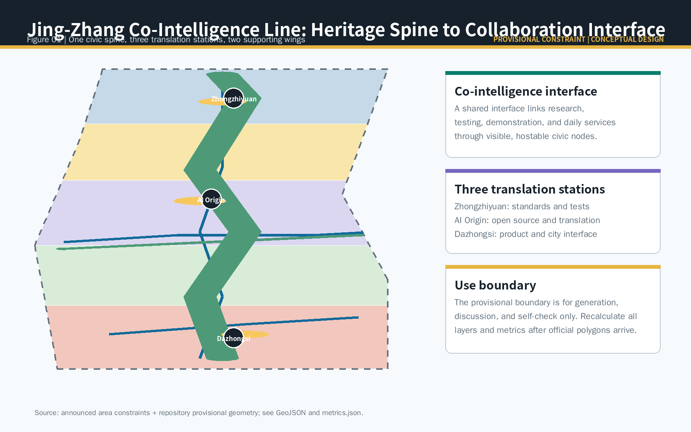
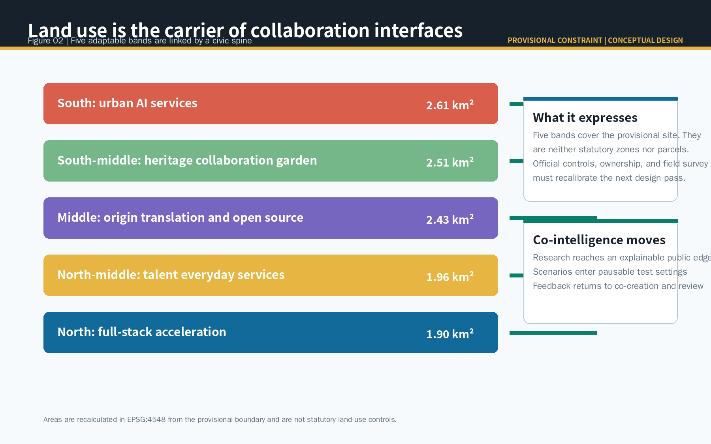
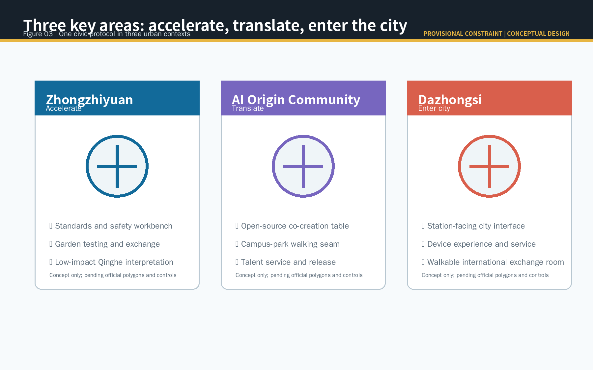
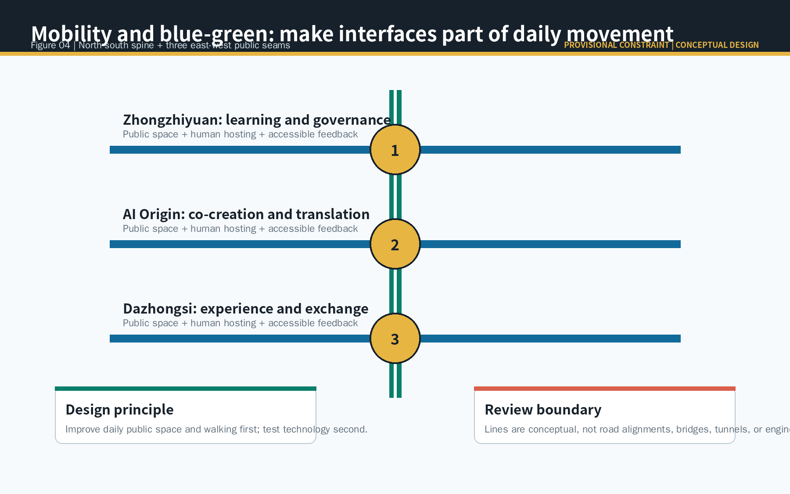
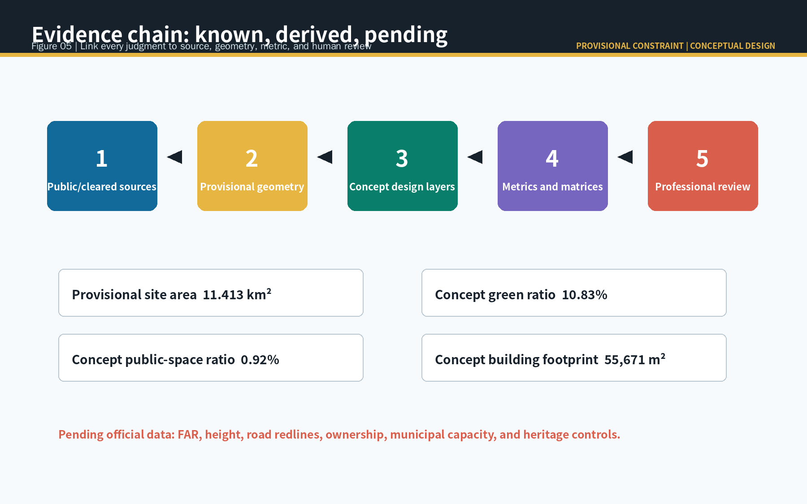

# Jing-Zhang Co-Intelligence Line / 京张共智线

## Design Basis and Source List

The Co-Intelligence Line reads the Centennial Jing-Zhang heritage as a civic collaboration interface, not as a new planning boundary. It proposes a spatial language for later professional testing: research is explained in public, scenario trials have human hosts and stop controls, and use feedback returns to open communities and professional review. The official announcement establishes tasks, scope levels, and approximate areas; the Agent taskbook establishes public-interest, copyright, and conceptual-design limits [source:OFFICIAL-ANNOUNCEMENT] [source:AGENT-TASKBOOK].

No cleared exact polygon, statutory control, ownership record, existing-building survey, or municipal-capacity file is present in the public package. This package uses only registered provisional geometry and public or cleared sources, visibly marking every rough boundary as a provisional constraint. Figure 01 links sources, geometry, design layers, metrics, and professional review as one evidence chain [source:BOUNDARY-SOURCE] [depth:existing_conditions_diagnosis].

## Three-Level Scope Framework

The coordinated research area, approximately 43.6 square kilometres in the announcement, is the research layer for ecosystem, culture, and the Three Areas and Two Wings. The overall design area, approximately 11.4 square kilometres, is the conceptual layer for renewal, public space, and mobility. The three key areas test how acceleration, translation, and entry into city life work spatially. These are successive questions, from who collaborates, to where collaboration occurs, to how it becomes daily life [standard:PROJECT-OFFICIAL-ANNOUNCEMENT] [depth:three_level_scope_framework].

The submitted overall geometry recalculates to 11.413 square kilometres. This is a repeatable reading of provisional geometry, not an official redline or precise statutory area. When cleared official polygons arrive, the boundary, land use, green space, public space, buildings, roads, phasing, figures, and metrics must all be recalculated together [data:geometry/site_boundary.geojson#SITE-001] [metric:site_area_sqm].

## Coordinated Research Area: Industry and Future City Research

The proposal is named Jing-Zhang Co-Intelligence Line. Its identity is a dark-jade line of three open interface rings, linking rail heritage, civic collaboration, and reversible AI service. It uses no corporate mark, portrait, or unlicensed typeface. The three project positions become spatial relationships: the Jing-Zhang culture belt supplies time and memory, the urban AI-life belt supplies places to stay, and the AI integration belt supplies a research-to-service translation chain.

Five functions form a loop through Three Areas and Two Wings. Zhongzhiyuan hosts full-stack research, standards, and safety discussion; the AI Origin Community hosts open-source collaboration, talent, and translation; Dazhongsi hosts city-facing product, international exchange, and everyday experience. The Zhongguancun service wing supplies professional support, while the Xiaoyuehe wing turns permitted observation into public feedback. Every part is a conceptual recommendation, not a settled investment, policy, land-use, or recruitment arrangement [source:AGENT-TASKBOOK] [depth:overall_spatial_structure].

Six ecosystem cases offer mechanisms rather than copied facts: Mila links research, venture support, and public-interest policy; Vector bridges research, talent, and adoption; AI Singapore organizes public capability and applied trials; Barcelona Supercomputing Center exemplifies research-computing collaboration; Helsinki’s AI Register makes public-service AI inspectable; STATION F layers heritage reuse, founder service, and public programming. The lesson is to design place, rules, hosts, and feedback together [source:CASE-MILA] [source:CASE-VECTOR] [source:CASE-HELSINKI].

## Overall Design Area: Urban Renewal and Regulatory-Plan-Level Urban Design

One north-south co-intelligence walking spine and three east-west civic seams organize the concept. The spine connects heritage interpretation, garden stays, and scenario displays; the seams connect learning, service, stations, and community life to that shared spine. Technology appears only after walking, resting, accessibility, and public exchange are supported. Road features show a conceptual network, not road redlines, bridges, tunnels, or engineering alignments [data:geometry/roads.geojson#ROAD-001] [depth:traffic_rail_slow_parking].

Renewal means repairing interfaces, not predetermining demolition. Reusable spaces can first host open-source worktables, releases, talent service, and civic events. Other carriers are labelled only as retain, renovate, or new-build options, pending ownership, survey, structural safety, heritage, and statutory information. FAR, height, setbacks, parcel actions, and engineering feasibility remain pending official data [standard:MOHURD-CONTROL-DETAILED-PLANNING] [depth:renewal_project_list].

## Detailed Design of Key Areas

Zhongzhiyuan is the acceleration interface: garden exchange connects full-stack research, trustworthy evaluation, standards discussion, and Qinghe interpretation, with open testing conditioned by registration, notice, human presence, and stopping rules. The AI Origin Community is the translation interface: open-source co-creation tables, release space, talent services, and campus-park walking seams support movement from research to use. Dazhongsi is the city-entry interface: a station-facing civic edge, device experience, commercial service, and international exchange make responsibility and feedback visible when products meet daily life [data:geometry/key_areas.geojson#PROV-KEY-001] [depth:three_key_area_detailed_design].

All three polygons are provisional and rough. The moves above therefore describe suitable spatial types and civic edges, not determinations about specific parcels, company buildings, or ownership. Later work must use official scope, field survey, accessibility review, traffic organization, and public participation, always retaining options to pause, alter, or decline a pilot.

## AI Innovation Ecosystem, Personas, and AI+ Scenarios

Five user groups guide inclusion: open-source developers need collaboration and evaluation; university students and researchers need safe cross-campus exchange and translation; early teams need service navigation and small trials; nearby residents and older people need low-friction, low-disturbance civic service; operators need controllable maintenance and feedback tools. Personas are an inclusion test, never a basis for tracking, profiling, or commercial recommendation.

Ten scenario cards unite space, data, human review, and operations: 01 open-source release hall; 02 model-evaluation workbench; 03 enterprise-service navigation; 04 accessible walking-gap review; 05 public-event safety checklist; 06 city-memory guide; 07 talent-life navigation; 08 low-disturbance environmental maintenance collaboration; 09 device experience and complaint loop; and 10 public AI rule display. Cards 02, 03, and 09 are industry validation settings: each needs purpose limitation, minimum data, human review, appeal, and stop conditions and cannot be described as approved operations [source:AGENT-TASKBOOK] [data:geometry/public_space.geojson#PUBLIC-001].

Zhongzhiyuan hosts evaluation and rule display; AI Origin hosts release, service, and learning; Dazhongsi hosts device experience and public feedback; the heritage spine hosts walking review, guides, and event checklists. The Xiaoyuehe wing provides a controlled method for observation and feedback, not personal trajectory collection or automated public decision [standard:PROJECT-AGENT-OPEN-CALL-TASKBOOK] [depth:municipal_new_infrastructure].

## Land Use, Building Scale, and Retain-Renovate-Demolish Strategy

Five conceptual functional bands fully cover the provisional overall area: urban AI service, heritage collaboration garden, origin translation and open source, talent daily service, and full-stack acceleration interface. They are used to inspect spatial relationships and recompute areas, not to recommend statutory zoning or parcel reclassification. Land-use codes follow the package’s terminology; statutory conclusions require official maps and professional confirmation [standard:MNR-LAND-USE-CLASSIFICATION-GUIDE] [data:geometry/land_use.geojson#LU-003].

The building layer records six conceptual carriers as retain, renovate, or new-build options. Their footprint can be recomputed, but does not claim floor area, FAR, investment, or construction commitment. With official controls absent, height, intensity, and parcel action remain pending. This keeps attention on sustainable public interfaces and adaptive renewal rather than fabricated control values [data:geometry/buildings.geojson#BLDG-001] [metric:building_footprint_area_sqm] [depth:retain_renovate_demolish].

## Transport, Rail, Municipal Infrastructure, and Public Services

Mobility begins with stations, walking, cycling, accessibility, and cycle parking as the prerequisites for civic collaboration. The north-south spine links the three key areas, while three east-west seams serve their daily entrances. AI may sort hints from public material and human feedback, but route judgement must be reviewed by transport, accessibility, operations, and public-participation processes; it cannot replace field survey [source:SCENARIO-TRAFFIC] [data:geometry/roads.geojson#ROAD-002].

Municipal and new infrastructure follows a confirm-capacity-before-deployment principle. Professional deepening may study maintainable connectivity, public charging, low-power sensing, notices, and staffed points, but this proposal makes no claim about energy load, pipelines, communication capacity, parking quantity, or engineering. Digital services must sit beside staffed offline access so people without devices receive equivalent service [depth:traffic_rail_slow_parking] [depth:municipal_new_infrastructure].

## Blue-Green Network, Public Space, and Urban Character

The blue-green network is not a technological backdrop. Heritage walking, resting, shade, accessibility, and civic exchange are the precondition for any scenario. The concept green ratio is 10.83% and the concept public-space ratio is 0.92%; both are recalculated from provisional boundary and design layers, so they describe the proposal representation rather than formal controls [data:geometry/green_space.geojson#GREEN-001] [metric:green_ratio] [metric:public_space_ratio].

Three AI pilgrimage nodes are the Standards and Safety Workbench, Open-source Co-creation Table, and City Interface Living Room. They are low-impact civic components, not monumental objects: the workbench exposes rules and test limits, the table enables face-to-face deliberation, and the living room provides experience, complaint, and follow-up. Interface rings, year marks, and contribution records connect rail heritage, Zhongguancun innovation culture, and AI culture [standard:MOHURD-URBAN-DESIGN-MEASURES] [depth:blue_green_public_space].

## Renewal Projects, Implementation Policy, and Phasing

The project list is a learning sequence, not a promised construction schedule. Near term establishes the co-creation table, accessible walking review, and public service navigation in the AI Origin Community. Medium term develops the standards and safety workbench, garden exchange, and permitted testing rules in Zhongzhiyuan. Long term studies station-facing service, product experience, and international exchange in Dazhongsi. Every phase depends on official scope, ownership, funding, operations, safety, and public feedback and may pause, change, or not proceed [data:geometry/phasing.geojson#PHASE-001] [depth:phasing_implementation].

The operating recommendation is a Co-Intelligence Season rather than a one-off festival: spring open-contribution week, summer civic-scenario day, autumn trustworthy-AI and accessibility review week, and winter knowledge archive and peer exchange. Communities maintain scenario rules and versions; public-space operators maintain hosts, notices, and feedback; professionals review space, data, and safety. Branding, international communication, collaboration, and translation are propositions for later operators, not governmental or investment promises [source:AGENT-TASKBOOK] [depth:renewal_project_list].

## Metrics, Area Recalculation, and Compliance Matrix

The package distinguishes three metric classes: announcement area facts, concept-space quantities reproducible from provisional geometry, and statutory control values pending official data. Overall area, five land-use bands, green space, public space, conceptual building footprints, network length, and three key areas have GeoJSON and EPSG:4548 formulas. FAR, height, road redlines, ownership, and municipal capacity are explicitly unknown. This distinction prevents a provisional diagram from being mistaken for a statutory fact [metric:site_area_sqm] [metric:key_area_count] [depth:metrics_recalculation].

The compliance matrix covers the announcement tasks and agent.1 to agent.6. The standards matrix addresses urban design, regulatory-plan depth, and land-use classification. The design-depth matrix connects diagnosis, structure, transport, blue-green space, key areas, project list, phasing, metrics, and risk to narrative, layers, drawings, and self-check. Figure 05 makes the chain visible so no visual artifact carries authority alone [source:SOURCE-REGISTRY] [depth:risk_missing_data].

## Risk, Copyright, and Compliance

The major risks are rough boundary position and precision, missing controls and surveys, AI scenarios that could cause excessive monitoring or unsafe automation, and unverified public-space access and operating capacity. Mitigations are direct: no claim of official approval, no unauthorised personal data, no algorithmic final decision, and no representation of conceptual lines as engineering. Each test needs purpose limits, minimum data, human review, appeal, logging, and stop conditions. Official data requires regeneration of layers, drawings, HTML, metrics, and self-check [source:BOUNDARY-SOURCE] [depth:risk_missing_data].

Text, geometry, figures, PDFs, and static HTML are generated by the declared AI agent. Public or cleared sources, use limits, and retrieval dates are recorded in `sources.json`. No corporate mark, portrait, commercial base map, or remote image is used. The copyright statement describes the CC BY 4.0 licence and source limits; final planning, engineering, investment, and approval decisions remain with qualified professionals and statutory process.

## References

1. Haidian District Branch of Beijing Municipal Commission of Planning and Natural Resources, *Prequalification Announcement for the Centennial Jing-Zhang AI Innovation Belt Urban Design International Call*, 2026-05-09.
2. Cleared summary of the open call taskbook for global agents, 2026-05-18.
3. Ministry of Housing and Urban-Rural Development, *Urban Design Management Measures*, 2017.
4. Ministry of Housing and Urban-Rural Development, *Measures for the Preparation and Approval of Regulatory Detailed Plans for Cities and Towns*.
5. Ministry of Natural Resources, *Land and Sea Use Classification Guide for Territorial Spatial Survey, Planning and Control*, 2023.
6. Public pages from Mila, Vector Institute, City of Helsinki AI Register, and STATION F, retrieved 2026-08-11; used only for mechanism comparison, as listed in sources.json.

These references document the sources behind the proposal's main judgments; the structured source register retains full permissions, use limits, and retrieval dates [source:SOURCE-REGISTRY].
