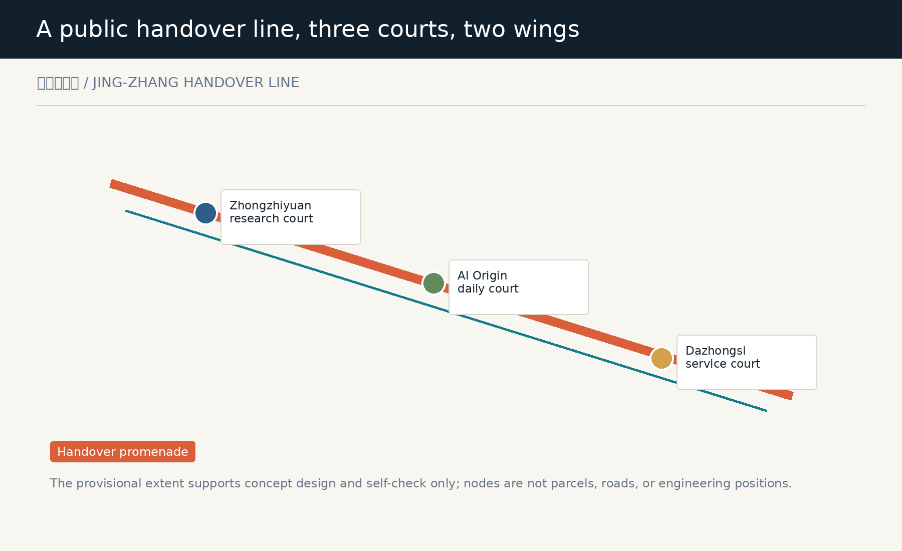
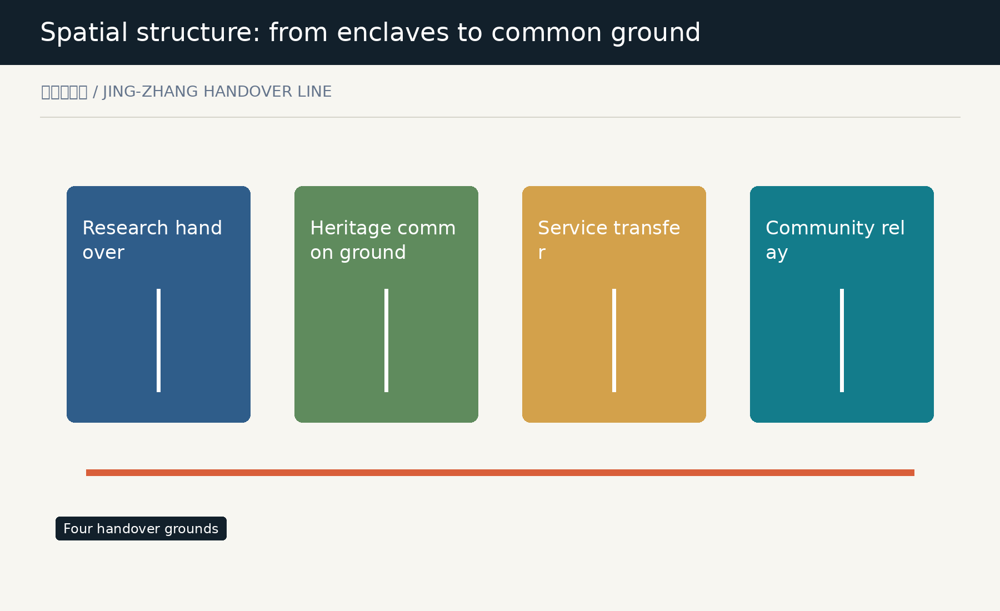
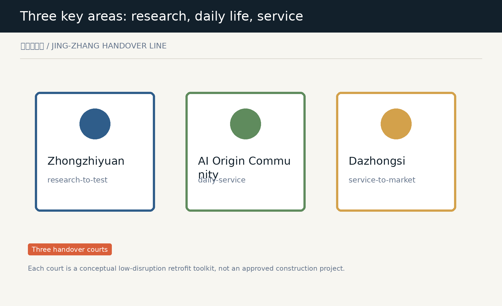
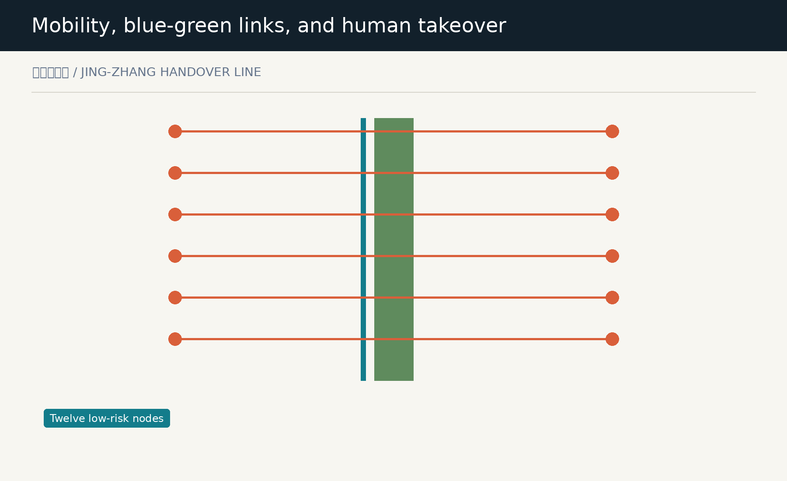
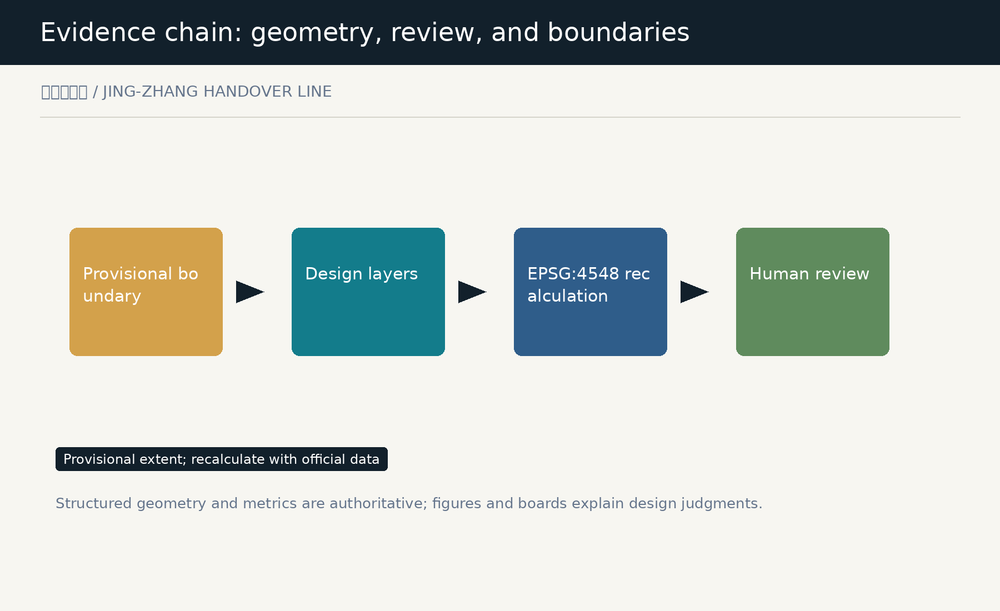

# Jing-Zhang Handover Line

**Make every move from model to city legible, reversible, and held by people.**

## Design Basis and Source List

The Jing-Zhang Handover Line treats an innovation belt as an urban system that must hand work over continuously: research reaches public testing, public services retain a human takeover, and even failure or withdrawal leaves a readable trace. The brief calls for the integration of industry, city, and talent; this proposal therefore makes each transfer understandable, pausable, and corrigible for people who use it. [source:OFFICIAL-ANNOUNCEMENT]
This package uses only repository-listed public, cleared, or provisional materials. The overall boundary and key areas are provisional constraints rather than redlines. International references transfer public mechanisms for registers, explanation, feedback, and testing; they do not transfer a foreign policy or institution. [source:SOURCE-REGISTRY]
Evidence combines the provisional boundary, recalculable design layers, metrics, matrices, and conditions for human review. Structured data is authoritative; figures and A3/A0 boards explain the judgment. The whole package must be recalculated when official inputs change. [depth:existing_conditions_diagnosis]

## Three-Level Scope Framework

The 43.6 km2 coordinated research area assembles the collaboration of universities, firms, communities, and the two wings. The 11.4 km2 overall design area organizes one continuous handover promenade. The three key areas then prototype research, daily-life, and service handovers for further professional design. [source:OFFICIAL-ANNOUNCEMENT]
The line is not a new planning redline. It is a conceptual sequence of walking, cycling, and public exchange along the heritage park and adjacent civic ground. Its three courts are a research court, a daily court, and a service court; the two wings support technology services and low-risk scenario work. [data:geometry/site_boundary.geojson#SITE-001]
Provisional calculations compare only the internal structure of this package. Statutory parcels, road lines, ownership, engineering limits, and precise area claims remain subject to official attachments rather than diagrammatic inference. [metric:site_area_sqm]

## Coordinated Research Area: Industry and Future City Research

The industry strategy is organized around handover capacity instead of a tenant list: universities and research institutions frame questions and methods, firms offer verifiable services, communities and visitors give everyday feedback, and qualified people retain the final judgment to launch, pause, or withdraw. [depth:overall_spatial_structure]
Six reference mechanisms are used as transferable working methods: the Helsinki AI Register, Amsterdam algorithm practice, the UK ATRS, AI Verify, European testing and experimentation facilities, and the NIST AI RMF. They inform legible disclosure, responsibility records, low-risk testing, independent checking, and exit records, without creating any commitment for Haidian. [source:CASE-HELSINKI]
The identity uses two lines that never fully overlap: one carries the enduring memory of the Jing-Zhang railway; the other records a traceable human-machine handover. Orange marks handover points that must be seen, while teal-green marks slow mobility and common ground rather than an inaccessible AI black box. [standard:MOHURD-URBAN-DESIGN-MEASURES]

## Overall Design Area: Urban Renewal and Regulatory-Plan-Level Urban Design

The overall design does not predetermine demolition or development intensity. It proposes four reversible spatial roles: research and validation handover, heritage common ground, service transfer, and community relay. The complete land-use partition conveys conceptual relationships and must be corrected through official controls, ownership, and existing-condition surveys. [data:geometry/land_use.geojson#LU-001]
Renewal starts with low-disruption interfaces: adaptable ground-floor service counters, continuous shade and accessible waiting surfaces, removable information and exhibition layers in existing spaces, and human review rooms beside civic space. These are reference moves, not retain-renovate-demolish decisions for a specific parcel. [depth:urban_renewal_framework]
Height, FAR, density, setbacks, and municipal capacity remain pending official control conditions. The package records uncertainty in metrics and risks instead of manufacturing precision with a concept drawing. [metric:floor_area_ratio]

## Detailed Design of Key Areas

The Zhongzhiyuan research court serves research-to-test transfer: model evaluation, standards discussion, accessible explanation, and human review meet at a garden-like civic interface. It is not an approved testing facility; it is a spatial reference for professional teams organizing openness and safety. [data:geometry/key_areas.geojson#PROV-KEY-001]
The AI Origin daily court serves test-to-everyday transfer. It places near-campus walking, result explanation, support for low digital confidence, and family-care waiting in one ordinary route where AI services, human assistance, and exit paths can be encountered together. [data:geometry/key_areas.geojson#PROV-KEY-002]
The Dazhongsi service court serves product-to-public-interface transfer through station-facing walking, exhibition, repair, and small collaboration space. Exact station integration and intersection organization require official confirmation. [data:geometry/key_areas.geojson#PROV-KEY-003]

## AI Innovation Ecosystem, Personas, and AI+ Scenarios

Six user groups shape the handover spaces: researchers need public testing and peer review; students need low-threshold learning and showing; small teams need reversible trials; residents and carers need human help; visitors need a clear cultural route; and operators need an accountable log for pauses and handovers. [source:AGENT-TASKBOOK]
Twelve scenario cards include three industry-test types: model explanation and evaluation, accessible handover, and merchant-service fallback; three daily services; three cultural experiences; and three operational supports. Every scenario assumes low risk, minimal data, human presence, and a stop option. [metric:scenario_card_count]
Scenario nodes are not a real-time surveillance network. They show who is responsible, what non-digital alternative exists, and where questions can be raised. Personal data, real deployment, and vendor system integration are outside this proposal's authorization. [standard:GENERATIVE-AI-INTERIM-MEASURES]

## Land Use, Building Scale, and Retain-Renovate-Demolish Strategy

The land-use layer fully covers the provisional overall area and carries roles for research validation, heritage common ground, service transfer, and community relay. These names are urban-design language rather than an approved land-use designation; the partition and ratios must be rebuilt after official boundaries and control units arrive. [depth:land_use_layout]
Six conceptual building interfaces use three actions: retain-and-adapt, renovate, and reversible infill. They do not infer ownership or existing-condition demolition. They guide later surveys toward where ground floors, canopies, signs, accessibility, and shared rooms may improve the handover experience. [data:geometry/buildings.geojson#BLDG-01]
Only building-footprint area is recalculated here. Total floor area and development intensity require measured existing conditions, ownership, fire safety, utilities, heritage review, and statutory approval. [metric:building_footprint_area_sqm]

## Transport, Rail, Municipal Infrastructure, and Public Services

The handover promenade links three courts and twelve nodes in a conceptual walking, cycling, and resting network. Three east-west stitching lines express an intention to connect; they are not road works, bridge or tunnel schemes, or approved traffic arrangements. [data:geometry/roads.geojson#HANDOVER-SPINE]
Public services follow the principle of legible relay: each node should offer accessible arrival, a non-digital alternative, human assistance, quiet waiting, and visible service explanation. Standards, parking supply, rail integration, and municipal networks require verification against competent-authority data. [standard:BARRIER-FREE-ENVIRONMENT-LAW]
Edge computing, distributed energy, and digital infrastructure appear only as interfaces for later study. They cannot be read as installed equipment, capacity, or an engineering commitment. [depth:transport_rail_municipal_facilities]

## Blue-Green Network, Public Space, and Urban Character

Three green handover courts and three civic courts combine shade, rainwater pause, slow-mobility rest, open explanation, and human review into common ground. Green and public-space areas are calculated from concept layers for structural comparison only, not as statutory green or water controls. [data:geometry/green_space.geojson#GREEN-01]
Urban character avoids theatrical technology symbols. It uses legible double-line wayfinding, low-reflectance materials, quiet service interfaces, and replaceable exhibition components to connect railway heritage, innovation culture, and daily life. Detailed height, massing, color, and heritage limits remain pending. [standard:MOHURD-URBAN-DESIGN-MEASURES]
Three pilgrimage landmarks organize the civic courts: the Handover Clock signals service state, the Contribution Table records attributable public knowledge, and the Review Gate signals human takeover and exit. They are conceptual public-space components, not approved installations. [metric:landmark_count]

## Renewal Projects, Implementation Policy, and Phasing

The first phase prioritizes three civic courts and information components to test how a handover can be understood without large construction. The second connects the promenade to the two wings; the third can study additional interfaces only after official boundaries, controls, ownership willingness, and professional evaluation are available. [data:geometry/phasing.geojson#PHASE-1]
Every phase has a stop condition. Missing data, inaccessible service, unanswered complaints, unclear data boundaries, or no accountable human owner return a scenario to non-digital service or stop its display. This turns implementation from irreversible promotion into a reviewable learning process. [depth:renewal_projects_and_phasing]
Policy, funding, tenanting, operating entities, and event calendars remain questions for further work. This proposal represents no government commitment and no invitation, approval, or promise to a project, firm, or person. [source:AGENT-TASKBOOK]

## Metrics, Area Recalculation, and Compliance Matrix

Core metrics include provisional extent, green and public-space areas and ratios, conceptual building footprint, twelve handover nodes, twelve scenario cards, and three landmark types. Areas are recalculated in EPSG:4548 from submitted geometry and must update together when official extents replace it. [metric:green_ratio]
The compliance matrix maps announcement sections 1.3, 1.4, and 1.5 plus agent.1 through agent.6. The standards matrix addresses urban design, control planning, accessibility, land-use classification, and generative-AI governance; the depth matrix connects each task to prose, layers, metrics, boards, and self-check. [depth:metrics_recalculation_and_compliance]
Recalculation is not statutory validity. Provisional boundaries, key-area locations, building, and road layers support conceptual comparison only; official files are required for scoring, approval, controls, or engineering design. [source:BOUNDARY-SOURCE]

## Risk, Copyright, and Compliance

The principal risk is mistaking provisional geometry or concept nodes for an official redline, real deployment, or confirmed project. The package states provisional status in figures, HTML, sources, assumptions, and metrics, while official boundaries, controls, ownership, utilities, and engineering remain prerequisites. [source:BOUNDARY-SOURCE]
AI risk is bounded by minimal data, understandable explanation, accountable people, non-digital alternatives, appeal, and shutdown. Scenario cards do not collect personal trajectories, call a real model or city system, or present synthetic content as resident opinion or operating evidence. [standard:GENERATIVE-AI-INTERIM-MEASURES]
Text, geometry, Canvas figures, PDFs, and offline HTML are authored by the declared agent or use the public or cleared materials listed in sources.json. International cases name public mechanisms and purposes only; no third-party imagery, trademark, map, or proprietary content is copied. [source:CASE-ATRS]

## References

Project sources include the Haidian Planning and Natural Resources announcement, the repository taskbook, provisional boundary materials, the public source registry, and local standard snapshots. International references include the Helsinki AI Register, Amsterdam algorithm practice, UK ATRS, AI Verify, EU TEF, and NIST AI RMF; sources.json records URLs, retrieval date, license notes, and use limits. [source:OFFICIAL-ANNOUNCEMENT]
The package uses no commercial map tiles, news photography, unclear remote sensing imagery, personal data, or non-public planning materials. Citation is not an endorsement of a source, organization, or foreign policy, and it does not imply that any mechanism has been adopted in Haidian. [source:SOURCE-REGISTRY]
After submission, new official boundaries, controls, professional review, and community feedback should trigger an update of geometry, metrics, figures, boards, risk register, and scenario cards. Until then, the Handover Line is an open conceptual urban-design proposal. [depth:risk_and_data_gap_register]

## Scenario Cards and Operating Rules

| Card | Spatial carrier | Handover rule | Human fallback |
| --- | --- | --- | --- |
| SC-01 | Model explanation and evaluation | State purpose and limits | Human explanation |
| SC-02 | Accessible handover | Check accessibility first | On-site help |
| SC-03 | Merchant fallback | Fallback on failure | Offline service |
| SC-04 | Mobility inquiry | Minimum information | Paper wayfinding |
| SC-05 | Family care relay | User consent | Carer present |
| SC-06 | Civic repair request | No personal location | Human intake |
| SC-07 | Railway narrative | Visible source | Human guide |
| SC-08 | Contribution display | Attribution and withdrawal | Human editor |
| SC-09 | Open story point | No face collection | Offline message |
| SC-10 | Appointment handover | No automated decision | Human booking |
| SC-11 | Human review room | Pause on dispute | Professional review |
| SC-12 | Retirement record wall | Record exit reason | Paper access |
