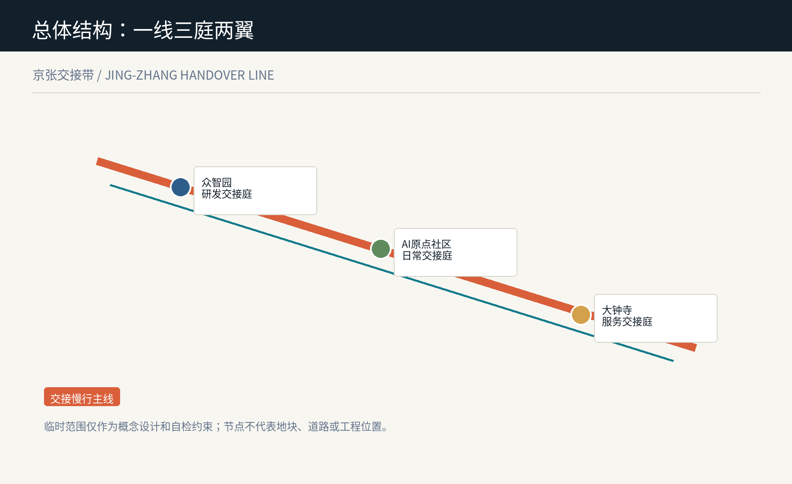
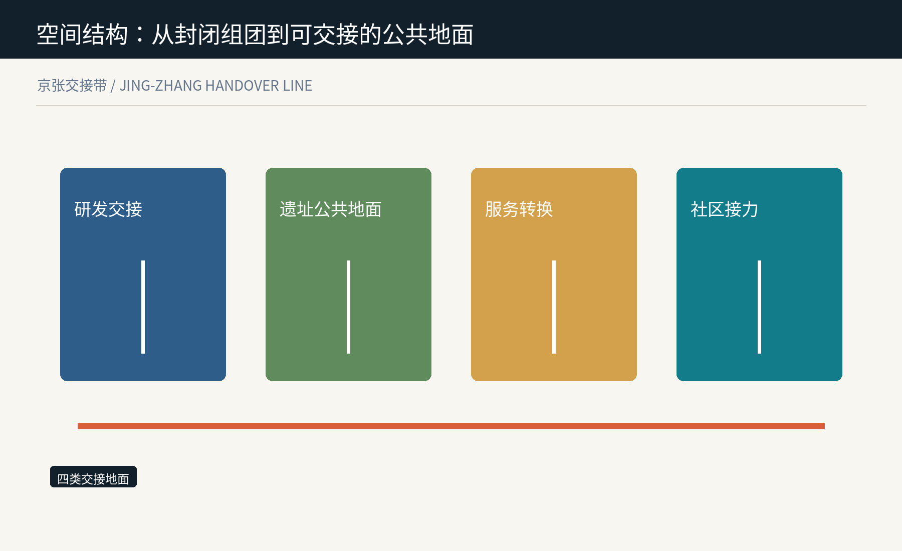
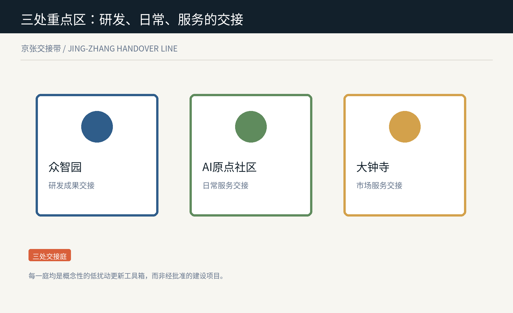
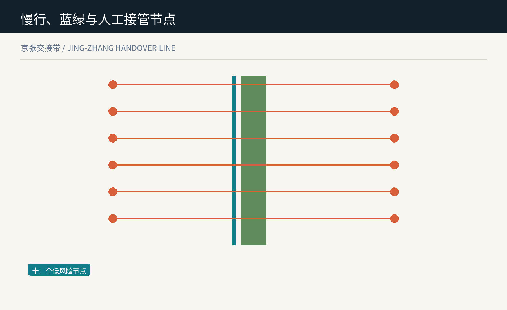
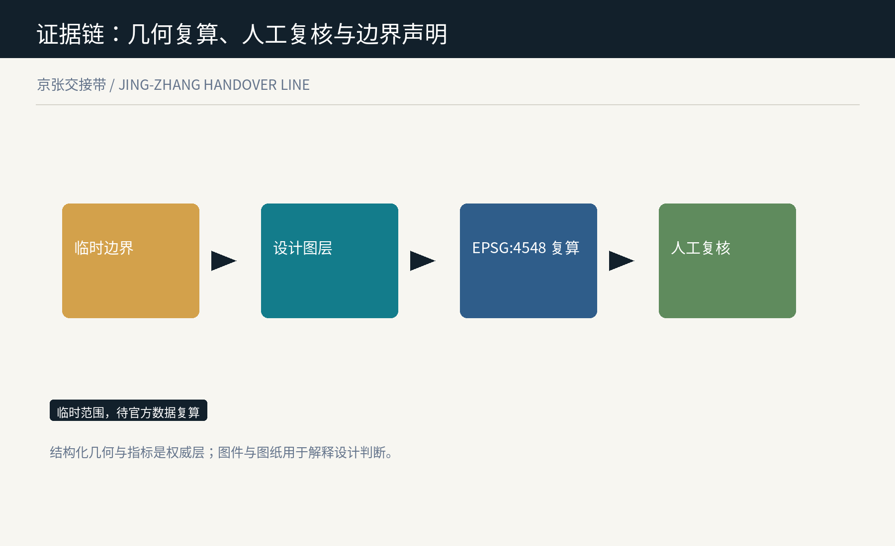

# 京张交接带 / Jing-Zhang Handover Line

**让每次从模型到城市的转接，都可读、可逆、有人接手。**

## 设计依据与资料清单

京张交接带把创新带理解为一套需要持续交接的城市系统：研究成果进入公共测试、公共服务回到人工接管、失败或退出也要留下可读的空间痕迹。公告所要求的产业、城市与人才融合不是把更多模型放进街区，而是让每次转接都能被使用者理解、暂停和修正。[source:OFFICIAL-ANNOUNCEMENT]
本包只使用仓库登记的公开、清权或临时资料；总体边界与重点区均是临时约束范围，不是红线。国际案例只转译公开登记、可解释、反馈与测试机制，不移植其制度或政策。[source:SOURCE-REGISTRY]
设计证据由临时边界、可复算设计图层、指标、矩阵和人工复核条件组成。结构化数据为权威层，图件与 A3/A0 图纸只解释判断；官方资料更新时整包重算。[depth:existing_conditions_diagnosis]

## 三层范围工作框架

43.6 平方公里统筹研究范围用于编织高校、企业、社区与两翼的协作关系；11.4 平方公里总体设计范围用于组织一条连续的交接慢行主线；三处重点区则把研发、日常与服务三种交接做成可被专业团队继续深化的空间原型。[source:OFFICIAL-ANNOUNCEMENT]
一线不是新的规划红线，而是沿遗址公园和周边公共空间串联的概念性慢行与公共交往序列。三庭是研发交接庭、日常交接庭和服务交接庭；两翼分别提供科技服务与低风险场景赋能。[data:geometry/site_boundary.geojson#SITE-001]
临时范围的计算结果只用于比较本包内部的设计比例。涉及法定地块、道路红线、权属、工程边界和精确面积的判断都等待正式附件，而不是由图面替代。[metric:site_area_sqm]

## 统筹研究范围产业与未来城市研究

产业策略以“交接能力”而非单一招商清单组织：高校与研究机构提供问题和方法，企业提供可验证的产品服务，社区与访客提供日常反馈，专业人员保留是否上线、暂停或退出的最终判断。[depth:overall_spatial_structure]
六组参考机制被作为可转译的工作法：赫尔辛基 AI 登记、阿姆斯特丹算法透明实践、英国 ATRS、AI Verify、欧盟测试与实验设施、NIST 风险管理框架。它们分别启发可读说明、责任登记、低风险测试、独立核验与退出记录，不构成对海淀的制度承诺。[source:CASE-HELSINKI]
视觉识别以两条不完全重合的线为母题：一条是百年京张的连续记忆，一条是每次人机交接留下的可追溯路径。橙色表示需要被看见的交接点，青绿表示慢行与公共地面，避免把 AI 叙事化为不可接近的黑箱。[standard:MOHURD-URBAN-DESIGN-MEASURES]

## 总体设计范围城市更新与控规深度城市设计

总体设计不预设拆迁或强度结论，而提出四类可逆的空间角色：交接研发与验证、遗址公共地面、服务转换、社区接力。它们通过同一份完整用地分区图表达概念性功能关系，日后应由正式控规、产权和现状调查校正。[data:geometry/land_use.geojson#LU-001]
更新首先从低扰动接口开始：临街首层的可转换服务台、连续遮荫与无障碍等候面、既有空间的可拆卸信息与展陈界面，以及与公共空间相邻的人工复核室。所有动作是参考方案，不给出特定地块的拆改留结论。[depth:urban_renewal_framework]
建筑高度、容积率、密度、退界和市政容量均待正式控制条件补齐。本包把不确定性写入指标和风险，而不以概念图去制造精确性。[metric:floor_area_ratio]

## 重点区域详细设计

众智园交接庭服务“研究到测试”：把模型评估、标准讨论、可访问展示和人工复核安排在可相遇的花园型公共界面；它不是已批准的实验设施，而是帮助专业团队组织开放与安全边界的参考空间。[data:geometry/key_areas.geojson#PROV-KEY-001]
AI 原点日常交接庭服务“测试到日常”：围绕近校慢行、成果说明、低数字能力支持和家庭照护等候，把 AI 服务的说明、人工协助和退出路径放在同一段日常路线中。[data:geometry/key_areas.geojson#PROV-KEY-002]
大钟寺服务交接庭服务“产品到公共界面”：用面向轨道站点的步行、展示、维修与小型协作空间，支持智能体、终端和内容服务被比较、被询问和被撤回。准确站城关系与四象限组织必须由官方资料确认。[data:geometry/key_areas.geojson#PROV-KEY-003]

## AI 创新生态、人才画像与 AI+ 场景

六类使用者共同决定交接空间：研究者需要公开测试与同行复核，学生需要低门槛的学习与展示，小微团队需要可退出的试用环境，居民和照护者需要人类协助，访客需要清楚的文化路线，运营人员需要可记录的暂停与交接台账。[source:AGENT-TASKBOOK]
十二张场景卡分为三类产业测试：模型说明与评测台、无障碍交接台、商户服务回退台；三类日常服务：慢行问询、家庭照护转接、公共维修派单；三类文化体验：铁路叙事、贡献展示、开放讲述；三类运营支持：预约、人工复核、退役记录。每一类都以低风险、最小数据、人工在场和可停用为前提。[metric:scenario_card_count]
场景节点不是实时监控网络。节点的作用是让使用者看见谁负责、有什么替代方式以及在哪里提出问题；需要个人数据、真实部署或供应商系统接入的事项均不在本方案授权范围内。[standard:GENERATIVE-AI-INTERIM-MEASURES]

## 用地、建筑规模与拆改留方案

用地层完整覆盖临时总体范围，分别承载研发验证、遗址公共地面、服务转换和社区接力。其功能名称是城市设计语言而非用地性质批复，待正式边界和控制单元发布后应重建分区并复算比例。[depth:land_use_layout]
六处概念建筑接口按“保留适配、更新、可逆嵌入”三种行动表达，不依据产权或现状判定拆除。它们用于提示未来调查应关注何处可以通过首层、雨棚、导视、无障碍和共享房间改善交接体验。[data:geometry/buildings.geojson#BLDG-01]
本包仅复算建筑基底面积，不推导总建筑面积或开发强度。专业团队需以现状测绘、权属、消防、市政、历史文化与审批条件为准完成后续判断。[metric:building_footprint_area_sqm]

## 交通、轨道、市政与公共服务设施

交接慢行主线将三处公共庭和十二个节点串为连续步行、骑行与休憩的概念网络；三条东西向缝合建议线只表达连接意图，不等同于道路工程、桥隧方案或交通组织批准。[data:geometry/roads.geojson#HANDOVER-SPINE]
公共服务设施以“看得懂的接力”为原则：每个节点应有无障碍到达、非数字替代、人工求助、安静等候和可见的服务说明。设施规格、停车数量、轨道接驳和市政管线均需另行以主管部门资料核验。[standard:BARRIER-FREE-ENVIRONMENT-LAW]
端侧算力、分布式能源和数字基础设施只作为可研究的接口类型，不能被解释为已经具备的设备、容量或工程承诺。[depth:transport_rail_municipal_facilities]

## 蓝绿空间、公共空间与城市风貌

三处交接绿庭与三处公共庭把树荫、雨水停留、慢行休憩、公开说明和人工复核组合为同一张公共地面。绿地与公共空间面积来自提交的概念图层，用来比较方案结构而非替代正式绿线或水系控制。[data:geometry/green_space.geojson#GREEN-01]
城市风貌不靠夸张技术符号，而以可读的双线导视、低反射材料、安静的服务界面和保留可更换的展陈构件回应铁路遗产、创新文化与日常生活。详细建筑高度、体量、色彩和遗产边界均待官方资料补齐。[standard:MOHURD-URBAN-DESIGN-MEASURES]
公共庭以三个朝圣地标组织：交接钟提示服务状态，贡献台记录可署名的公共知识，复核门提示人工接管与退出权。它们是概念性公共空间组件，不等于已获批的装置项目。[metric:landmark_count]

## 更新项目清单、实施政策与分期计划

先行阶段优先以三处公共庭和信息组件测试“如何交接”，不依赖大规模建设；协同阶段把慢行主线与科技服务翼、场景赋能翼的合作机制串联；扩展阶段才在正式边界、控制条件、权属意愿和专业评估充分后研究更多接口。[data:geometry/phasing.geojson#PHASE-1]
每一阶段都应有停止条件：资料不足、无障碍未达、投诉未回应、数据边界不清或人工责任人缺位时，场景回到非数字服务或停止展示。这样把实施从不可逆的宣传动作改为可复核的学习过程。[depth:renewal_projects_and_phasing]
政策、资金、招商、运营主体和活动排期均只是待深化议题。本方案不代表任何部门承诺，也不构成对项目、企业或个人的邀请或审批。[source:AGENT-TASKBOOK]

## 指标体系、面积复算与合规矩阵

核心指标包括临时范围面积、绿地与公共空间面积及比例、概念建筑基底、十二个交接节点、十二张场景卡和三类地标。面积全部在 EPSG:4548 中从提交几何复算，且随着正式范围替换而整体更新。[metric:green_ratio]
合规矩阵逐条覆盖公告 1.3、1.4、1.5 与 agent.1 至 agent.6；专业标准矩阵回应城市设计、控规、无障碍、用地分类和生成式 AI 治理；深度矩阵把每个要求回接到正文、图层、指标、图纸与自检。[depth:metrics_recalculation_and_compliance]
可复算不等于具有法定效力。临时边界、重点区位置、建筑和道路图层只支持概念比较，任何正式评分、审批、控制指标或工程设计都必须使用发布的官方文件。[source:BOUNDARY-SOURCE]

## 风险、版权与合规说明

最大风险是把临时几何或概念节点误读为官方红线、真实部署或已定项目。本包在图面、HTML、来源、假设和指标中持续标明临时性，并将正式边界、控规、权属、市政和工程条件列为前置依赖。[source:BOUNDARY-SOURCE]
AI 风险以最小数据、解释说明、人工责任、非数字替代、申诉和停用为底线。场景卡不要求采集个人轨迹，不调用真实模型或城市系统，也不以合成内容冒充居民意见或运营成果。[standard:GENERATIVE-AI-INTERIM-MEASURES]
文字、图层、Canvas 图件、PDF 与离线 HTML 均由作者智能体生成或来自本包列明的公开/清权资料。国际案例仅引用公开页面中的机制名称和用途，不复制第三方图像、商标、地图或专有内容。[source:CASE-ATRS]

## 参考资料

项目依据包括北京市规划和自然资源委员会海淀分局公告、仓库任务书、临时边界资料、公开来源登记表和本地标准快照。国际参考包括赫尔辛基 AI Register、阿姆斯特丹算法实践、英国 ATRS、AI Verify、欧盟 TEF 与 NIST AI RMF；具体链接、获取日期、许可与用途限制保存在 sources.json。[source:OFFICIAL-ANNOUNCEMENT]
本方案没有使用商业地图瓦片、新闻图片、未清权遥感图、个人数据或非公开规划资料。引用不是对其内容、机构或制度的背书，也不表示这些机制已经在海淀采用。[source:SOURCE-REGISTRY]
提交后应以新发布的官方边界、控制条件和社区/专业反馈为触发器更新 geometry、metrics、图件、图纸、风险登记与场景卡；在此之前，交接带仅作为开放的概念性城市设计提案。[depth:risk_and_data_gap_register]

## 交接场景卡与运营规则

| 场景 | 空间载体 | 交接规则 | 人工兜底 |
| --- | --- | --- | --- |
| SC-01 | 模型说明与评测台 | 公开用途与限制 | 人工解释 |
| SC-02 | 无障碍交接台 | 先验收可达性 | 现场协助 |
| SC-03 | 商户服务回退台 | 失败即回退 | 线下服务 |
| SC-04 | 慢行问询点 | 最小信息 | 纸质导视 |
| SC-05 | 家庭照护转接 | 使用者同意 | 照护者在场 |
| SC-06 | 公共维修派单 | 不定位个人 | 人工受理 |
| SC-07 | 铁路叙事点 | 来源可见 | 讲解员 |
| SC-08 | 贡献展示台 | 可署名与撤回 | 人工编辑 |
| SC-09 | 开放讲述台 | 不收集人脸 | 线下留言 |
| SC-10 | 预约交接台 | 不自动决定 | 人工预约 |
| SC-11 | 人工复核室 | 争议可暂停 | 专业复核 |
| SC-12 | 退役记录墙 | 记录退出理由 | 纸本查阅 |
