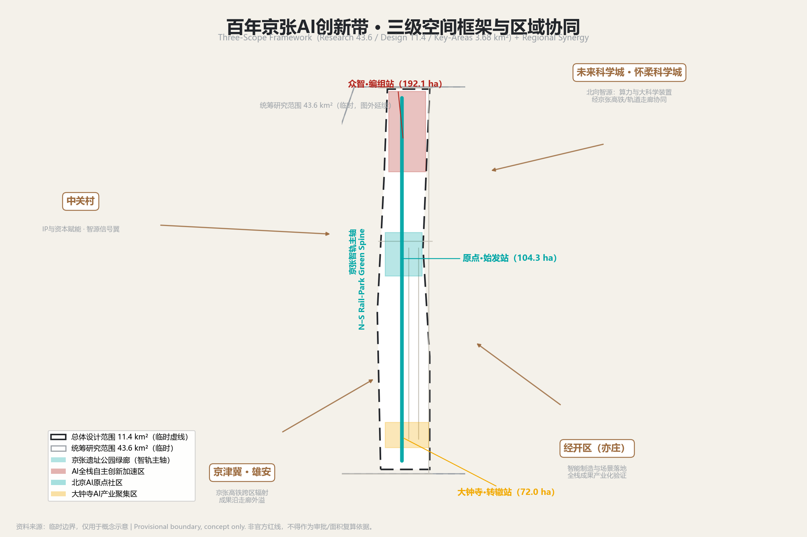
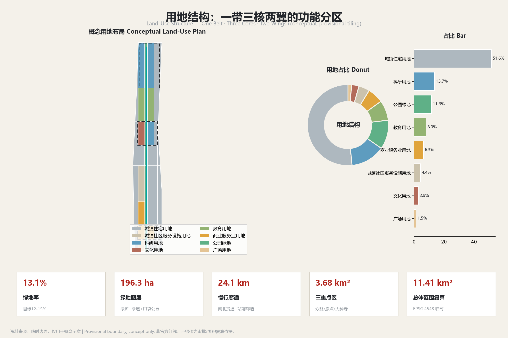
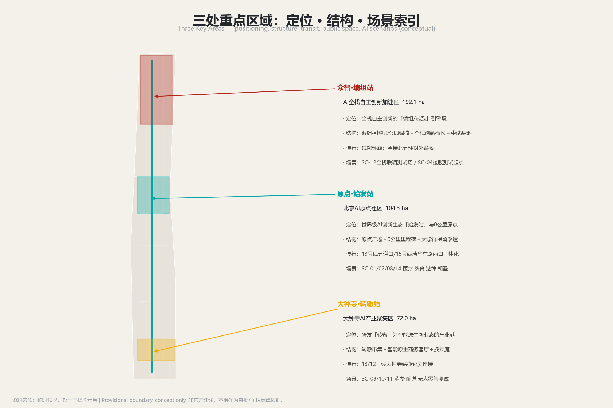
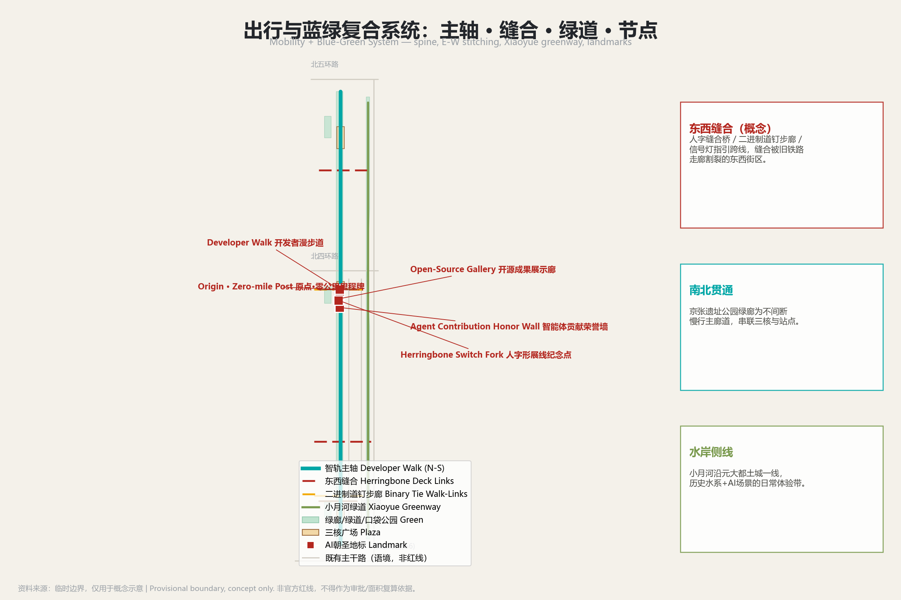
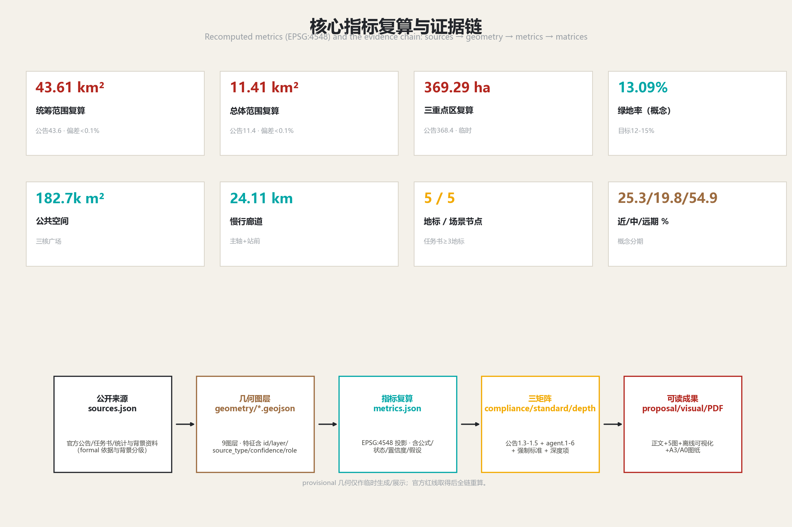

# 百年京张AI创新带城市设计 · 京张智轨概念方案

> 本方案为开放共创的**概念建议与参考方案**，供专业团队、规划主管部门与运营团队深化研究。全部空间、面积、实施与运营表述均标注 provisional/conceptual；容积率、建筑高度、建筑密度、道路红线、地块权属、文保控制线等法定指标**一律待正式数据补齐（待确认）**，不构成政府审定结论、拆除决策、投资承诺、已批准活动或工程可行性结论。本方案不编造企业名单、投资金额或政府承诺。所有证据可追溯至 `sources.json`、`metrics.json` 与三个矩阵文件。

## 设计依据与资料清单

本方案的设计依据分为四类。**第一类·官方正式依据（formal-ready）**：百年京张AI创新带城市设计国际方案征集资格预审公告（2026-05-09）[source:DATA-SRC-OFFICIAL-ANNOUNCEMENT-20260509]，提供项目名称、组织、三层范围文字四至、约面积与设计任务 [standard:PROJECT-OFFICIAL-ANNOUNCEMENT]；以及两份官方方法标准——住建部《城市设计管理办法》[source:DATA-SRC-MOHURD-URBAN-DESIGN-MEASURES]与《城市、镇控制性详细规划编制审批办法》[source:DATA-SRC-MOHURD-CONTROL-DETAILED-PLANNING]，构成城市设计与控规深度的方法框架。**第二类·已清权任务依据**：面向全球智能体的任务书摘录（2026-05-18）[source:DATA-SRC-AGENT-TASKBOOK-20260518]，明确六大任务与边界条款。

**第三类·临时几何数据（provisional_only）**：仓库维护者依据公告文字四至与约面积推定的三层范围与三处重点区临时粗略 polygon [source:DATA-SRC-PROVISIONAL-BOUNDARIES-20260605]，仅用于生成、展示与intake自检，不可作为官方红线或精确面积依据。**第四类·公开背景资料（background only）**：海淀区、京张铁路、京张高铁、小月河、地铁线路等维基百科与公开报道，以及全球八个AI创新生态案例，仅用于理解背景与提取可借鉴机制，不作正式控制结论。

官方公告可作为正式任务依据，但其中的文字四至和面积值不能替代 official GIS/CAD polygon；资格预审文件下载仍受密码保护，公开渠道未找到可验证坐标系的精确红线 [source:DATA-SRC-PROVISIONAL-BOUNDARIES-20260605]。用地分类引用自然资源部《国土空间调查、规划、用途管制用地用海分类指南》统一语义 [source:DATA-SRC-MNR-LAND-USE-CLASSIFICATION-202311]。AI场景与数据治理遵循《生成式人工智能服务管理暂行办法》与个人信息保护、数据安全要求，并落实《无障碍环境建设法》与老年人智能技术应用政策框架 [standard:GENERATIVE-AI-INTERIM-MEASURES][standard:BARRIER-FREE-ENVIRONMENT-LAW][standard:ELDERLY-SMART-TECH-PLAN-2020-45]。完整来源、指标、标准、深度与合规覆盖见 `sources.json`、`metrics.json`、`compliance_matrix.json`、`standard_matrix.json`、`design_depth_matrix.json`，机器索引不在此逐条抄录。

**EN — Design Basis & Source List.** The proposal rests on four evidence tiers. (1) Formal-ready official sources: the open-call qualification-pre-qualification announcement (2026-05-09) [source:DATA-SRC-OFFICIAL-ANNOUNCEMENT-20260509] supplying the name, organizers, text-based extents, approximate areas and design tasks; plus the MOHURD Urban Design Measures [source:DATA-SRC-MOHURD-URBAN-DESIGN-MEASURES] and the MOHURD Control-Detailed-Planning Measures [source:DATA-SRC-MOHURD-CONTROL-DETAILED-PLANNING] as the methodological frame. (2) Rights-cleared task basis: the agent taskbook (2026-05-18) [source:DATA-SRC-AGENT-TASKBOOK-20260518] defining the six tasks and boundary clauses. (3) Provisional geometry only: the maintainers' rough polygons for the three scopes and three key areas [source:DATA-SRC-PROVISIONAL-BOUNDARIES-20260605], usable only for generation, display and intake self-checks, never as an official red line. (4) Background only: Wikipedia/news facts on Haidian, the Jingzhang Railway and HSR, Xiaoyue River and metro lines, plus eight global AI-ecosystem cases. Land-use codes follow the MNR land-use classification guide [source:DATA-SRC-MNR-LAND-USE-CLASSIFICATION-202311]; AI scenarios follow the interim generative-AI measures, the barrier-free planning and the elderly smart-tech policy [standard:GENERATIVE-AI-INTERIM-MEASURES][standard:ELDERLY-SMART-TECH-PLAN-2020-45]. Full machine indices live in `sources.json`, `metrics.json` and the three matrices.

## 三层范围工作框架

**统筹研究范围（Coordinated Research Area，约43.6 km²）**：北至北五环路、东至京藏高速、南至西直门外大街、西至万泉河路，公告约面积43.6 km² [metric:research_area_declared]，provisional polygon 复算约43.61 km² [metric:research_area_calculated]。工作目标为产业战略与未来城市研究：回答世界级AI创新生态、产业链协同、三区两翼、未来AI城市形态与AI+交通绿色空间体系，输出概念、命名、生态机制与区域协同，不落到具体地块。

**总体设计范围（Overall Design Area，约11.4 km²）**：京张遗址公园周边1-2公里，北至北五环路、东至学院路/西土城路、南至西直门外大街、西至大钟寺东路/荷清路，公告约面积11.4 km² [metric:site_area_declared]，provisional polygon 复算约11.41 km² [metric:site_area_calculated]。工作目标为城市更新与控规深度城市设计：形成一带三核两翼的空间结构、功能布局、创新指标体系、更新框架、交通轨道、市政配套与风貌控制，达到控制性详细规划深度 [standard:MOHURD-CONTROL-DETAILED-PLANNING]。

**重点区域范围（Key-Area Detailed Design Area，约368.4 ha）**：三处重点片区合计公告约面积368.4 ha [metric:key_area_total_declared]，provisional polygon 复算约369.29 ha [metric:key_area_total_calculated]，分别对应众智园AI自主创新加速区（公告192.1 ha [metric:key_area_zhongzhiyuan_declared]）、北京AI原点社区（公告104.3 ha [metric:key_area_origin_declared]）、大钟寺AI产业聚集区（公告72.0 ha [metric:key_area_dazhongsi_declared]）。工作目标为规划综合实施方案深度的重点片区详细设计，逐片形成定位、空间结构、建筑更新、交通慢行、公共空间、AI场景与实施风险的完整小方案。

**临时边界使用限制（重要）**：本方案全部空间主张基于仓库临时粗略 polygon [source:DATA-SRC-PROVISIONAL-BOUNDARIES-20260605]，其矩形边仅作生成、讨论与临时复算，不可解释为地块、道路红线或精确面积。官方红线未取得（资格预审文件受密码保护），故所有面积复算标注 provisional；一旦取得 official polygon，需重算三层范围、三处重点区、绿地率、公共空间、分期与用地占比等全部相关指标，本方案结论仅具方向性。

**EN — Three-Scope Working Framework.** The Coordinated Research Area (~43.6 km², declared [metric:research_area_declared]; ~43.61 km² recalculated [metric:research_area_calculated]) addresses industrial strategy and future-city research: world-class AI ecosystem, industrial-chain synergy, the Three Zones–Two Wings, future AI urban form and AI-enabled transport and green-space systems. The Overall Design Area (~11.4 km², declared [metric:site_area_declared]; ~11.41 km² recalculated [metric:site_area_calculated]) carries urban renewal and control-detailed-planning-depth design: the One-Belt–Three-Cores–Two-Wings structure, function mix, innovation indicators, renewal framework, transport/rail, municipal and character controls [standard:MOHURD-CONTROL-DETAILED-PLANNING].

The Key-Area Detailed Design Area (~368.4 ha declared [metric:key_area_total_declared]; ~369.29 ha recalculated [metric:key_area_total_calculated]) spans the three key areas (Zhizhi accelerator 192.1 ha, Beijing AI Origin community 104.3 ha, Dazhongsi cluster 72.0 ha) at integrated-planning-implementation depth. **Provisional-boundary limitation:** all spatial claims rest on the maintainers' rough rectangles [source:DATA-SRC-PROVISIONAL-BOUNDARIES-20260605]; their edges are not plots, road red lines or precise areas. Official red lines are pending (the pre-qualification download is password-protected), so all area recalculations are labeled provisional and must be rerun once official polygons arrive.

## 统筹研究范围产业与未来城市研究

### 总体概念、命名与Logo

本方案提出主导概念**「人字形智轨」（JZ AI-Rail）**：以1909年京张铁路"人字形"展线的"分岔—重连"精神为基因，把中国首条自主干线铁路转化为AI时代的创新回路 [source:DATA-SRC-OFFICIAL-ANNOUNCEMENT-20260509]。口号**「一个人字，两次通车，无限回路」**——第一次通车（1909京张铁路）开中国自主工程先河，第二次通车（2019京张高铁入地）把旧线空间还给城市，而"无限回路"指向三区两翼永不停止的迭代闭环 [source:SRC-WIKI-JZ][source:SRC-WIKI-JZHSR]。命名采用「里程牌＋信号灯＋道岔」语法：以五道口原点为0公里虚拟里程牌，各节点获虚拟里程牌号（TR码），用信号三色编码阶段。三核命名为**众智·编组站**（北段全栈加速）、**原点·始发站**（中段AI生态原点）、**大钟寺·转辙站**（南段产业转辙）；两翼为**智源·信号翼**（中关村科技服务翼，资本与IP）与**小月河·场景支线**（小月河场景赋能翼，场景与活力城市）[depth:key_area_names][depth:wing_names]。Logo方向为**「人字形钢轨＋光标」**：两条钢轨自底部分岔、于顶点汇聚，同时可读作"人"字、网络分叉与光标插入点，轨枕以二进制0/1排布 [depth:logo_direction]。命名与Logo均为概念方向，不涉及授权字体或商标。

### 三大定位、五大功能与三区两翼协同回路

**三大定位**各有落点：百年京张文化带由京张遗址公园智轨主轴承载历史轨与遗产叙事；都市AI生活体验带由小月河场景支线与沿线站点承载，让AI成为可感知的日常；AI融合创新带由三核承担，把研究、加速与产业融合成一条会生长的轨道 [standard:PROJECT-AGENT-OPEN-CALL-TASKBOOK]。

**五大功能**与空间一一对应（待正式控规数据补齐后细化）：AI全栈自主创新体系落于众智·编组站；世界级AI创新生态落于原点·始发站；AI+场景赋能新范式落于小月河场景支线；智能化AI活力城市落于大钟寺转辙站及整体都市空间；AI治理全球话语权由众智园与全球回流环共同支撑。

**三区两翼协同回路**：原点社区（研究/生态）→ 众智园（加速/全栈）→ 大钟寺（产业/智能原生）→ 小月河翼（场景测试与活力反馈）→ 智源信号翼（全球要素、中关村IP与资本回流）→ 再投入原点研究，形成「研—聚—产—景—资」闭环比 [source:DATA-SRC-AGENT-TASKBOOK-20260518]。区域协同上，向北经京张高铁/轨道走廊联通未来科学城与怀柔科学城算力与大科学装置，向东南与经开（亦庄）协同承接产业化验证，向西北以京张高铁辐射京津冀 [source:DATA-SRC-OFFICIAL-ANNOUNCEMENT-20260509]。

### 世界级AI创新生态：五段式全栈链条与全球案例

沿智轨纵轴组织五段式全栈链条——**基础研究→技术研发→孵化加速→产业转化→资本服务**，使创新主体沿廊道"毕业不离带" [depth:feedback_loop_zh]。基础研究锚定原点社区，依托学院路大学群国家重点实验室开放共享，与未来科学城/怀柔科学城大科学装置形成"北向智源"协同；技术研发在原点与众智园布局大模型、具身智能、多智能体研发楼；孵化加速以众智园为"编组站"，设中试基地与测试验证场，以算力券让早期团队按需取算力；产业转化锚定大钟寺，联动小月河翼把医疗、教育等可信场景作为需求侧引擎；资本服务由智源·信号翼承担，运营中关村IP并提供梯度资本与全球要素配置 [source:DATA-SRC-AGENT-TASKBOOK-20260518]。

机制上落实**八大要素**：土地（众智园/大钟寺预留"留白+弹性开发"用地，指标待官方控规）、空间（沿轴组织可步行混合街区）、产业（五段链条梯度升级）、资金（种子—研发—加速—产业—并购梯度资本，不承诺投资额）、人才（原点社区全球人才栖息地）、算力（共享池+算力券）、数据（数据基础制度先行区合规框架下的沙盒与跨境通道）、场景（小月河支线注入日常）[standard:MOHURD-URBAN-DESIGN-MEASURES]。

本机制借鉴八个全球AI创新生态案例的可读摘要：**Kendall Square**（大学锚点+业主/居民协会，原点社区）；**Mission Bay**（单一再开发载体整合棕地与住房可负担）；**King's Cross**（铁路遗产廊道变创新区公共客厅、国家旗舰AI机构入区，京张遗址公园主轴）；**one-north**（任务型土地机构排序全链条，众智园全栈）；**Digital Media City**（基础设施先行+锚点租户，京张棕地再造）；**Jätkäsaari**（城市living lab，小月河场景翼）；**杭州未来科技城**（国家实验室+龙头企业锚点、高铁即创新基础设施，北向智源）；**深圳南山**（大学城+总部+国家实验室垂直整合，海淀大学带）[source:EXT-GLOBAL-001][source:EXT-GLOBAL-004][source:EXT-GLOBAL-008]。八案例的可转化机制逐条见下方案例研究表（case_study_table），均为概念借鉴，不构成对任何企业或政府的承诺。

**案例研究表（case_study_table）**：

| 案例 | 城市/国家 | 核心机制 | 对本带的转化借鉴（概念） | 来源 |
|------|----------|---------|------------------------|------|
| Kendall Square | 剑桥（美国） | 世界级研究锚点＋业主/居民协会式低成本公共协调层 | 原点社区基础研究锚点与低成本协调机制 | [source:EXT-GLOBAL-001] |
| Mission Bay | 旧金山（美国） | 单一再开发载体打包棕地整合、整治与分期混合开发 | 京张铁路棕地廊道再开发组织；住房可负担纳入创新生态 | [source:EXT-GLOBAL-002] |
| King's Cross | 伦敦（英国） | 铁路遗产廊道成为创新区公共客厅，国家旗舰AI机构入区 | 京张遗址公园主轴定位，AI作为城市功能 | [source:EXT-GLOBAL-003] |
| one-north | 新加坡 | 任务型土地机构物理排序研究—孵化—企业链条，"毕业不离区" | 众智园全栈自主体系与主题片区组织 | [source:EXT-GLOBAL-004] |
| 首尔数字媒体城 DMC | 首尔（韩国） | 基础设施先行＋土地补贴吸引锚点租户，文化锚点催化集群 | 京张棕地再造与大钟寺产业港 | [source:EXT-GLOBAL-005] |
| Jätkäsaari | 赫尔辛基（芬兰） | 城市living lab：智慧基础设施在真实居民中部署、监测、迭代 | 都市AI生活体验带与小月河场景赋能翼 | [source:EXT-GLOBAL-006] |
| 杭州未来科技城 | 杭州（中国） | 国家基础研究实验室＋龙头企业锚点，高铁/轨道即创新基础设施 | 北向智源协同与原点社区全球人才种子机制 | [source:EXT-GLOBAL-007] |
| 深圳南山 | 深圳（中国） | 大学城＋总部＋国家实验室垂直整合，人才公园提升保留 | 海淀大学带结构类比与滨水人才空间 | [source:EXT-GLOBAL-008] |

**EN — Industrial & Future-City Study (Coordinated Research Area).** The leading concept is the **Herringbone Intelligence-Rail (JZ AI-Rail)** [source:DATA-SRC-OFFICIAL-ANNOUNCEMENT-20260509], slogan "One Herringbone · Two Openings · Infinite Loops". Naming uses a "mile-marker + signal + switch" grammar: the three cores are Zhizhi Marshaling Yard (full-stack acceleration), Origin Terminus (ecosystem origin) and Dazhongsi Switch (industrial interchange); the two wings are the Zhixin Signal Wing (Zhongguancun capital & IP) and the Xiaoyue River Scenario Branch [depth:key_area_names][depth:wing_names]. The three positionings, five functions and the Three-Zones–Two-Wings feedback loop ("research—aggregate—industry—scenario—capital") are each mapped to space [source:DATA-SRC-AGENT-TASKBOOK-20260518]. Regionally the belt links north to the Future Sci-Tech and Huairou science cities via the Jingzhang HSR corridor, southeast to the E-Town for industrialization, and northwest across the Beijing–Tianjin–Hebei region. A five-stage full-stack chain—basic research→R&D→incubation→industrialization→capital services—runs along the spine so actors "graduate without leaving the belt" [depth:feedback_loop_zh], supported by eight factor mechanisms (land, space, industry, capital, talent, compute, data, scenario) [standard:MOHURD-URBAN-DESIGN-MEASURES]. Eight global cases inform the design: Kendall Square, Mission Bay, King's Cross, one-north, Seoul DMC, Jätkäsaari, Hangzhou Future Sci-Tech City and Shenzhen Nanshan [source:EXT-GLOBAL-001/002/003/004/005/006/007/008].

## 总体设计范围城市更新与控规深度城市设计

### 空间结构与功能布局

总体设计范围以「一带三核两翼·智轨编织」组织：**一带**为京张遗址公园智轨绿廊（历史轨、数据流、生活带的复合主轴），北起北五环众智园，经五道口原点，南至大钟寺/蓟门桥；**三核**为众智·编组站、原点·始发站、大钟寺·转辙站；**两翼**为智源·信号翼与小月河·场景支线；加多节点（沿线AI站点与场景节点）[depth:spatial_structure]。在主轴上叠加纵向主回环（研究—加速—产业）、横向赋能回环（两翼注入资本/IP/场景/活力）与全球回流环（全球要素经中关村回流原点）。

概念用地布局（provisional，非官方地类底数）在总体设计范围内形成功能分区：城镇住宅用地约51.6%、科研用地约13.7%、公园绿地约11.6%、教育用地约8.0%、商业服务业用地约6.3%、城镇社区服务设施用地约4.4%、文化用地约2.9%、广场用地约1.5%，并精确铺满且共享边 [metric:land_use_tiling_exact]，其中住宅、科研、公园绿地占比由分区复算 [metric:land_use_share_0701][metric:land_use_share_0802]。该比例支撑"研—聚—产—景—资"的逻辑：科研与教育用地承载全栈链条头尾，绿地与广场支撑创新交往与人才生活，商业与社区服务服务日常，文化用地承载京张/中关村/AI三层叙事 [standard:MNR-LAND-USE-CLASSIFICATION-GUIDE]。上述地类占比为概念建议，官方控规用地分类与占比待确认。

### 城市更新总体框架与待确认控规条件

城市更新遵循"保留、改造、拆除、新建"分类的拆改留框架，作为概念指引而非结论：优先保留具有史实、文化、社区价值的建筑与空间（京张旧线路基、清华园站旧址记忆、高校与既有社区）[source:SRC-WIKI-JZ]；改造低效产业与老旧街区为弹性"AI-ready"空间；在众智园、大钟寺预留"留白+弹性开发"用地适配快速迭代产业。**重要：官方容积率、建筑高度、建筑密度、建筑控制线、绿地率、退线、道路红线、地块权属、文保控制线均未取得，一律标注待正式数据补齐（待确认）**，本方案不给出任何审定数值 [standard:MOHURD-CONTROL-DETAILED-PLANNING][metric:far_height_density_controls]。建筑总规模、开发强度与拆改留比例均待控规与现状底数补齐后由专业团队复算。

更新对象与功能比例、公共空间、交通组织、市政承载、风貌控制相互支撑：绿地率概念值约13% [metric:green_space_ratio]支撑人才生活与创新交往；公共空间约18.27万m² [metric:public_space_area]作为三核会客厅；智轨主轴慢行廊道约24.11km [metric:corridor_length_m]组织创新交往与交通；风貌控制以"钢轨的硬度＋光标的轻盈"为基调，以城市设计总导则锚定公共空间、城市气质与建筑控制方向 [standard:MOHURD-URBAN-DESIGN-MEASURES]。

**EN — Urban Renewal & Control-Depth Design (Overall Design Area).** The Overall Design Area is organized as "One Belt · Three Cores · Two Wings — Intelligence-Rail Weave" [depth:spatial_structure]: the Jingzhang Heritage Park corridor as the composite spine, the three cores, the two wings, plus way-side scenario nodes, overlaid with a longitudinal feedback loop, a transversal empowerment loop and a global return loop. Conceptual land use (provisional) yields about 51.6% residential, 13.7% research, 11.6% park green, 8.0% education, 6.3% commerce, 4.4% community service, 2.9% culture and 1.5% plaza, exactly tiled with shared edges [metric:land_use_tiling_exact], with residential, research and park-green shares recalculated [metric:land_use_share_0701][metric:land_use_share_0802] [standard:MNR-LAND-USE-CLASSIFICATION-GUIDE].

The renewal framework follows a retain–renovate–demolish–build concept: retain heritage and community value (old roadbed, Qinghuayuan Station memory, universities), renovate low-efficiency stock into elastic "AI-ready" space, and reserve "blank + flexible" plots at Zhizhi and Dazhongsi. **Official FAR, height, density, set-backs, road red lines, ownership and heritage-control lines are all missing and marked 待确认** [standard:MOHURD-CONTROL-DETAILED-PLANNING][metric:far_height_density_controls]. Concept green ratio ~13% [metric:green_space_ratio], public space ~182.7k m² [metric:public_space_area] and a ~24.11 km spine corridor [metric:corridor_length_m] underpin the design [standard:MOHURD-URBAN-DESIGN-MEASURES].

## 重点区域详细设计

三处重点片区均基于临时粗略 polygon [source:DATA-SRC-PROVISIONAL-BOUNDARIES-20260605]，结论只能作为方向性设计，法定指标待正式数据补齐。各区均形成"定位＋空间结构＋建筑更新＋交通慢行＋公共空间＋AI场景＋实施风险"的可读小方案。

### 众智园AI自主创新加速区（众智·编组站，192.1 ha）

定位为AI全栈自主创新的"编组/试跑"引擎段 [depth:key_area_names]。空间结构：以编组·引擎段公园为北段绿核，组织全栈创新街区、中试基地、测试验证场与算力共享机房。建筑更新（概念）：以弹性"AI-ready"产业用地适配快速迭代，具体开发强度待控规。交通慢行：承接智轨主轴北段与北五环对外联系，设试跑环廊慢行系统。公共空间：试跑环廊、编组休憩平台、引擎检修角 [depth:park_segment_engine]。AI场景：SC-12众智园全栈联调测试场（产业测试验证）、SC-04自动驾驶接驳测试段起点。实施风险：北端区位与算力设施依赖、产业快速迭代下的用地弹性需求，均待评估。

### 北京AI原点社区（原点·始发站，104.3 ha）

定位为世界级AI创新生态的"始发站"与0公里原点，承载学院路大学群与五道口"宇宙中心"的创新记忆 [source:EXT-HD-024][source:EXT-HD-025]。空间结构：以原点·始发段公园为仪式性绿核，组织基础研究、孵化器、众创空间与全球人才社区。建筑更新（概念）：高校与既有社区以保留改造为主，具体拆改留待现状底数。交通慢行：与13号线五道口、15号线清华东路西口一体化接驳 [source:SRC-WIKI-M13][source:SRC-WIKI-M15]，设原点广场与清华东路西口接驳口。公共空间：原点广场、0公里里程碑、生态起始台。AI场景：SC-01智慧健康、SC-02自适应学习舱、SC-08智能法律舱、SC-14原点朝圣导览。实施风险：高校园区与既有社区权属复杂、轨道接驳规模待评估。

### 大钟寺AI产业聚集区（大钟寺·转辙站，72.0 ha）

定位为AI从研发"转辙"到智能原生新业态与都市消费的产业港 [source:DATA-SRC-OFFICIAL-ANNOUNCEMENT-20260509]。空间结构：以转辙·产业段公园为南段公共核，组织智能原生消费街区、转辙市集、智能原生商务客厅与数字孪生底座节点。建筑更新（概念）：不涉及企业建筑或权属空间改造，以柔性公共空间与弹性业态为主。交通慢行：以"换乘庭"连接13/12号线大钟寺站与商务空间 [source:SRC-WIKI-M13][source:SRC-WIKI-M12]，设产业港换乘庭。公共空间：转辙市集、智能原生商务客厅、滨水活力节点。AI场景：SC-03智能原生消费、SC-10机器人末端配送验证、SC-11无人零售与智慧巡检试验街区（产业测试）。实施风险：既有商业与交通枢纽界面整合、测试场景时段路段划定，均待专业深化。

**EN — Key-Area Detailed Design.** All three key areas rest on provisional polygons [source:DATA-SRC-PROVISIONAL-BOUNDARIES-20260605]; conclusions are directional only, with statutory controls pending. **Zhizhi AI Acceleration Area (Zhizhi Marshaling Yard, 192.1 ha)** is the full-stack "marshaling/test-run" engine depot [depth:key_area_names]: an engine-segment park core, full-stack innovation blocks, a pilot/test field and shared compute, with a test-run loop and marshaling stage [depth:park_segment_engine], hosting SC-12 full-stack integration testing and starting the SC-04 shuttle test. **Beijing AI Origin Community (Origin Terminus, 104.3 ha)** is the "departure yard" and 0-km origin rooted in the Xueyuan Lu university cluster and Wudaokou [source:EXT-HD-024][source:EXT-HD-025]: an origin plaza, 0-km post, transit integration with Lines 13/15 [source:SRC-WIKI-M13][source:SRC-WIKI-M15], hosting SC-01/02/08/14.

**Dazhongsi AI Industry Cluster (Dazhongsi Switch, 72.0 ha)** is the interchange where AI "switches" into native-AI retail and urban life [source:DATA-SRC-OFFICIAL-ANNOUNCEMENT-20260509]: a switch market, native-business lounge and "interchange court" linking Lines 13/12 [source:SRC-WIKI-M13][source:SRC-WIKI-M12], hosting SC-03/10/11 (the latter two are industry test scenarios). Ownership and heritage interfaces, transit scale and test-zone boundaries all await professional deepening.

## AI 创新生态、人才画像与 AI+ 场景

### 用户画像（7类）

面向全球AI人才与多代人城市生活，本方案提出7类用户画像（persona_table）[depth:personas]：

| 画像 | 代号 | 核心需求（概念） |
|------|------|----------------|
| AI研究员 | P-01 | 开放测试场、共享算力、脱敏合规数据 |
| AI创业公司创始人 | P-02 | 场景测试段、法律与政务支持、资本网络 |
| 高校学生 | P-03 | 低门槛学习实训、夜间活力与可负担生活 |
| 社区老年人 | P-04 | 被AI照顾而非被技术排除，保留人工窗口 |
| 带娃家庭 | P-05 | 安全亲子公共空间、教育与健康服务 |
| 配送骑手 | P-06 | 智能调度与机器人协同、权益保障渠道 |
| 国际访客/开发者朝圣者 | P-07 | 多语言连贯叙事、可体验的AI地标与路线 |

每类画像映射到对应场景与空间节点，支撑"工作—生活—社交—学习"一体化城区。

### AI场景卡（14张，含4张产业测试验证场景）

本方案提出14张场景卡，覆盖医疗、教育、商业、交通、养老、政务、公共空间、法律、生活服务、产业、科研、城市运营与文旅；其中4张为**产业测试验证场景**（test_scenario）。列表如下（各卡服务流程、数据与隐私边界等完整字段可在 `visual/index.html` 场景卡板块查阅）：

| ID | 场景 | 门类 | 锚点（概念） | 面向用户 | 成熟度 |
|----|------|------|------------|---------|--------|
| SC-01 | AI+医疗·智慧健康随行 | 医疗 | 原点社区及学院路三甲周边 | 慢性病者、老人、家属 | 试点 |
| SC-02 | AI+教育·自适应学习舱 | 教育 | 原点社区五道口一带 | 学生、终身学习者 | 试点 |
| SC-03 | AI+商业·智能原生消费街区 | 商业 | 大钟寺转辙站街区 | 白领、游客、家庭 | 推广 |
| SC-04 | AI+交通·自动驾驶接驳测试段 | 交通(测试) | 众智园至原点智轨主轴测试段 | 通勤者、测试企业 | 试点(测试) |
| SC-05 | AI+养老·智慧适老在身边 | 养老 | 原点/大钟寺既有住宅区 | 老年人、家属 | 试点 |
| SC-06 | AI+政务·一站式智能政务办理 | 政务 | 原点/大钟寺政务节点 | 市民、企业、老人 | 推广 |
| SC-07 | AI+公共空间·无障碍智能导视 | 公共空间 | 京张遗址公园智轨主轴 | 视障/行动不便者、老人 | 试点 |
| SC-08 | AI+法律·智能法律服务舱 | 法律 | 原点社区众创空间旁 | 创业者、企业主 | 试点 |
| SC-09 | AI+生活服务·社区生活管家 | 生活服务 | 小月河支线沿线社区 | 上班族、家庭、老人 | 推广 |
| SC-10 | AI+产业·机器人末端配送验证 | 产业(测试) | 大钟寺至原点选定街道段 | 员工、居民、机器人企业 | 试点(测试) |
| SC-11 | AI+产业·无人零售与智慧巡检试验街区 | 商业/产业(测试) | 大钟寺智能原生试验街区 | 消费者、商户、机器人企业 | 试点(测试) |
| SC-12 | AI+科研·众智园全栈联调测试场 | 科研/产业(测试) | 众智·编组站全栈创新区 | AI企业、科研机构、开发者 | 试点(测试) |
| SC-13 | AI+城市运营·数字孪生城市底座 | 城市运营 | 统筹研究范围整体 | 规划、运营、应急部门 | 试点 |
| SC-14 | AI+文旅·原点朝圣体验导览 | 文旅 | 原点0公里里程牌及主轴 | 游客、开发者朝圣者 | 推广 |

每张卡均含服务流程、数据使用与隐私边界、人工复核检查点、运营模型与成熟度，并映射到空间节点。以SC-01为例：社区健康终端→用户自愿授权上传体征与主诉→AI分诊与随访建议→家庭签约医生/社区站人工复核→必要时线下转诊三甲；隐私边界为仅采集自愿上传的非敏感健康数据、不采集原始病历，显著标注"AI辅助提示、非诊疗结论" [standard:GENERATIVE-AI-INTERIM-MEASURES]。

### 产业测试验证场景与隐私、人工复核边界

4个产业测试验证场景把一带作为AI"真实城市试验场"而非展厅：SC-04自动驾驶接驳（安全员在车、限定测试段）、SC-10机器人末端配送（限定时段路段）、SC-11无人零售与智慧巡检试验街区、SC-12众智园全栈联调测试场。这些场景遵循同一原则：范围与时段明确划定、数据脱敏、运营与安全以法律法规及审批为准、绝不表述为已批准运营。

隐私与人工复核硬边界：数据最小化、匿名化脱敏、明确同意与删除权、禁止无差别持续监控、高风险场景设人类专家复核检查点、为老年人与非智能终端群体保留现金与人工窗口并行 [standard:ELDERLY-SMART-TECH-PLAN-2020-45]。凡健康、法律、政务、资金、养老等高风险建议，AI仅作辅助并显著标注"非最终结论"，最终判断由人类与专业团队完成 [source:DATA-SRC-AGENT-TASKBOOK-20260518]。

**EN — AI Innovation Ecosystem, Personas & AI+ Scenarios.** Seven personas (AI researcher, startup founder, student, elderly resident, family with children, delivery rider, international developer-pilgrim) each map to scenarios and spatial nodes [depth:personas]. Fourteen scenario cards are proposed (SC-01…SC-14) across healthcare, education, commerce, transport, eldercare, government, public space, legal, daily life, industry, research, city operation and tourism, of which four (SC-04/10/11/12) are industry testing-and-validation scenarios. Each card states its service flow, data-use and privacy boundary, human-review checkpoint, operator model and maturity; e.g. SC-01 collects only voluntarily uploaded non-sensitive health data, never raw medical records, and passes through a contracted-doctor human-review checkpoint labeled "AI assistance, not a diagnosis" [standard:GENERATIVE-AI-INTERIM-MEASURES]. Test scenarios operate on bounded scope/time with de-identified data and are never described as approved operations. Hard privacy and human-review boundaries include data minimization, anonymization, consent and deletion rights, no indiscriminate monitoring, human-expert checkpoints for high-stakes advice, and parallel cash/human channels for the elderly [standard:ELDERLY-SMART-TECH-PLAN-2020-45]; AI output is auxiliary and labeled non-final, with human and professional final judgment [source:DATA-SRC-AGENT-TASKBOOK-20260518].

## 用地、建筑规模与拆改留方案

概念用地布局（provisional）在总体设计范围内精确铺满且共享边 [metric:land_use_tiling_exact]，形成前述功能比例（住宅约51.6%、科研约13.7%、公园绿地约11.6%、教育约8.0%、商业约6.3%、社区服务约4.4%、文化约2.9%、广场约1.5%）[metric:land_use_share_1401][metric:land_use_share_0804][metric:land_use_share_05]。绿地与公共空间：绿地率概念值约13%，绿地图层面积约196.28万m²（京张遗址公园绿廊+小月河绿道+口袋公园）[metric:green_space_ratio][metric:green_layer_area]；公共空间约18.27万m²（三核广场）[metric:public_space_area]。慢行廊道长度约24.11km [metric:corridor_length_m]。

**建筑规模与开发强度**：官方容积率、建筑高度、建筑密度、建筑基底、建筑控制线、退线均未取得，本方案一律标注**待正式数据补齐（待确认）** [metric:far_height_density_controls][standard:MOHURD-CONTROL-DETAILED-PLANNING]，不给出任何建筑总规模或开发强度数值。建筑基底、建筑规模与空间供给策略（弹性"AI-ready"产业空间、留白+弹性开发）为概念方向，待控规与现状建筑底数补齐后复算。

**拆改留分类（概念指引，非结论）**：保留——京张旧线路基与遗址公园、清华园站旧址记忆节点、高校与既有社区、具有文化价值的建筑 [source:SRC-WIKI-JZ]；改造——低效产业与老旧街区改造为弹性创新空间；拆除与新建——仅在控规与现状调查明确后，由专业团队按保留/改造/拆除/新建分类细化，本方案不指定任何具体拆除或建设结论 [source:DATA-SRC-MOHURD-CONTROL-DETAILED-PLANNING]。运营策略上，以"公共算力平台+入驻企业共建的中立运营"支撑全栈测试场，以多方共建、公益优先、成熟再推广为原则。

**EN — Land Use, Building Scale & DRR.** Conceptual land use (provisional) tiles the Overall Design Area exactly with shared edges [metric:land_use_tiling_exact], yielding the shares above [metric:land_use_share_1401][metric:land_use_share_0804][metric:land_use_share_05]; green ratio ~13% (green layer ~1.96M m² across the heritage spine, Xiaoyue greenway and pocket parks) [metric:green_space_ratio][metric:green_layer_area]; public space ~182.7k m² [metric:public_space_area]; slow-mode corridor ~24.11 km [metric:corridor_length_m].

**Official FAR, height, density, footprint, control lines and set-backs are missing and marked 待确认** [metric:far_height_density_controls][standard:MOHURD-CONTROL-DETAILED-PLANNING]; no building-total or intensity figures are given. The demolish-renovate-retain (DRR) classification is a conceptual guide, not a conclusion: retain the old roadbed, heritage-park spine, Qinghuayuan Station memory and existing communities [source:SRC-WIKI-JZ]; renovate low-efficiency stock into elastic innovation space; any demolition/new-build is deferred to professional deepening once control and current-building data arrive [source:DATA-SRC-MOHURD-CONTROL-DETAILED-PLANNING]. Operation follows neutral co-build, public-interest-first, scale-after-maturity principles.

## 交通、轨道、市政与公共服务设施

**道路微循环与慢行断点**：以京张遗址公园智轨主轴为南北贯通慢行主廊道（概念线位约24.11km [metric:corridor_length_m]），以"人字缝合桥"、二进制道钉步道连线、信号灯指引跨线缝合被旧铁路走廊割裂的东西街区，保障慢行连续与交通安全 [source:DATA-SRC-OFFICIAL-ANNOUNCEMENT-20260509][standard:MOHURD-URBAN-DESIGN-MEASURES]。道路名称仅作上下文，不代表道路红线或断面，道路红线与断面待官方交通专项确认 [metric:corridor_length_m]。

**轨道站点一体化**：依托既有轨道网做强站点接驳——13号线五道口/知春路/大钟寺 [source:SRC-WIKI-M13]、15号线清华东路西口/六道口 [source:SRC-WIKI-M15]、12号线大钟寺/蓟门桥 [source:SRC-WIKI-M12]、昌平线南延学清路/学院路/西土城 [source:SRC-WIKI-CPL]、10号线西土城/北土城 [source:SRC-WIKI-M10]。概念上以"换乘庭/接驳口"把轨道站与商务、公共空间一体化组织，站区慢行接驳与一体化规模待专业评估。

**停车与非机动车组织、对外交通**：以轨道+慢行+低速接驳（含SC-04自动驾驶接驳测试段）组织低碳出行；停车与非机动车停放按轨道站150-500米辐射设置公共自行车与共享停靠，具体规模待道路红线与交通专项确认 [source:EXT-HD-037]。

**创新服务平台、人才生活服务与新型基础设施**：以原点社区为全球人才栖息地，配套创新服务平台（法律舱、政务站、孵化器）；以分布式能源、端侧算力、感知与数字孪生底座融合传统市政设施，作为概念性新型基础设施方向；市政管线、消防、防洪排涝与海绵城市条件待官方市政专项，本方案只做体系建议，不出工程可行性结论 [standard:MOHURD-URBAN-DESIGN-MEASURES]。

**EN — Transport, Rail, Municipal & Public Services.** The Jingzhang Heritage Park spine serves as an unbroken north-south slow-mode corridor (~24.11 km [metric:corridor_length_m]); herringbone deck links, binary tie walk-links and signal-marker crossings stitch the east-west severed quarters with continuous, safe slow mobility [source:DATA-SRC-OFFICIAL-ANNOUNCEMENT-20260509][standard:MOHURD-URBAN-DESIGN-MEASURES]; road names are context only, not red lines. Transit-station integration builds on existing lines—13 (Wudaokou/Dazhongsi) [source:SRC-WIKI-M13], 15 (Qinghua East Rd W.) [source:SRC-WIKI-M15], 12 (Dazhongsi/Jimen Bridge) [source:SRC-WIKI-M12], Changping south extension [source:SRC-WIKI-CPL], 10 (Xitucheng/Beitucheng) [source:SRC-WIKI-M10]—via conceptual interchange courts and confluences, with scale pending assessment. Low-carbon mobility is rail + slow-mode + low-speed shuttles (incl. the SC-04 test segment). The Origin community hosts innovation-service platforms (legal pods, government nodes, incubators) and global talent housing; distributed energy, edge compute, sensing and a digital-twin base are conceptual new-infrastructure directions fused with conventional municipal systems, with municipal/safety engineering left to official special studies.

## 蓝绿空间、公共空间与城市风貌

### 京张遗址公园活力带

京张遗址公园为智轨主轴，自北五环众智园经五道口原点至大钟寺，南北贯通、串联三核 [source:DATA-SRC-OFFICIAL-ANNOUNCEMENT-20260509]。概念上按三段赋予差异化母题：北段"编组·引擎段"以试跑、编组为意象（试跑环廊、编组休憩平台）；中段"原点·始发段"以始发、生态为意象（原点广场、0公里里程碑）；南段"转辙·产业段"以转辙、换乘为意象（智能原生市集、商务客厅）[depth:park_segment_engine][depth:park_segment_origin][depth:park_segment_switch]。绿地图层含京张遗址公园绿廊、小月河绿道与口袋公园 [data:geometry/green_space.geojson#GS-PARK-SPINE][data:geometry/green_space.geojson#GS-XIAOYUE-GREENWAY]。小月河沿元大都土城一线，与元大都城墙遗址连成历史蓝绿廊道 [source:EXT-HD-052]，构成"都市AI生活体验带"的水岸侧线；岸线、绿道宽度与开放空间以官方蓝线绿线规划为准。

### AI朝圣地标（5处）

本方案提出五处概念性地标，其中三处为核心必选：**开发者散步道**（沿旧铁轨线形的线性步道，把巡检/道岔/信号意象编码为开发者思考路径）[data:geometry/public_space.geojson#PS-LM-DEVELOPER-WALK]；**开源成果展示廊**（以"列车车厢"为单元的展廊，强调可复现、可运行）[data:geometry/public_space.geojson#PS-LM-OPEN-SOURCE-GALLERY]；**智能体贡献荣誉墙**（以车站印章/里程碑为母题的荣誉展示，记录贡献并区分提交/评审/入选/落地四态）[data:geometry/public_space.geojson#PS-LM-AGENT-HONOR-WALL]；**原点·零公里里程碑**（0公里虚拟里程牌，呼应"一个人字，两次通车，无限回路"）[data:geometry/public_space.geojson#PS-LM-ORIGIN-ZERO-MILE]；**人字形道岔分岔点**（纪念1909人字形展线的分岔精神转化为AI创新回路）[data:geometry/public_space.geojson#PS-LM-HERRINGBONE-SWITCH]。五处地标均以钢轨墨、信号红、智轨青的低调材质与等宽数字编码表达，内容以真实史实、真实里程碑与已授权贡献者信息为准，不虚构名单、不娱乐化、不网红化、不低俗化 [standard:MOHURD-URBAN-DESIGN-MEASURES]。地标均为概念选址，正式选址待专业团队与文保部门核定。

### 百年三部曲文化叙事与文化导览路线

本方案把百年京张文化、中关村文化与AI新文化融为一条叙事主轴——**「百年三部曲：一个人字，三次启程」**（国际传播主题句：一条轨道，三次启程 / One Track · Three Departures）：**第一部·自主之路（1909）**，京张铁路以"人字形"展线开中国自主工程先河，空间载体为遗址公园钢轨铺装段与清华园站旧址记忆节点 [source:SRC-WIKI-JZ]；**第二部·创新之路（中关村自主创业）**，从"电子一条街"到"中国硅谷"，空间载体为学院路大学群与中关村科技服务翼；**第三部·智能之路（AI时代开放共创）**，从"自主设计"到"自主智能"，空间载体为三核与AI朝圣地标。三部曲共享同一条轨道，表达载体包括钢轨/道岔铺装、二进制道钉、车站印章节点、0公里里程牌、代码诗与钢轨铭文（文化标识系统与全带Logo同源分层，不混用）[depth:signage_direction]。

文化导览路线（概念选线与概念估算长度，正式选线待专业团队核定）规划三条：

| 路线 | 主题 | 主要节点（序） | 长度（概念估算） |
|------|------|--------------|----------------|
| 百年京张记忆线 | 历史轨：铁路遗产与车站记忆 | 原点·始发站0公里里程牌 → 清华园站旧址记忆节点 → 遗址公园钢轨铺装段 → 大钟寺·转辙站 → 蓟门桥·元大都城墙遗址 | 约4.5 km |
| AI朝圣线 | 智能轨：开发者朝圣环线 | 原点·始发站 → 清华科技园/学院路大学群 → 智源·信号翼 → 众智·编组站 → 小月河·场景支线 → 大钟寺·转辙站（换乘回原点） | 约5 km 环线 |
| 小月河·元大都水岸记忆线 | 生活轨：历史水系与AI日常 | 北土城·元大都城墙遗址 → 小月河岸线·场景支线 → 蓟门桥·古蓟门意象 | 约3 km |

每条路线设停留时刻（里程诵读、场景实验室、桥头观景等），以车站印章打卡与多语言叙事串联，形成"可阅读、可行走、可传播"的文化系统 [source:DATA-SRC-AGENT-TASKBOOK-20260518]。

**EN — Centennial Trilogy & Cultural Routes.** The three cultures fuse into one arc, **"The Centennial Trilogy: One Herringbone · Three Departures"** (One Track · Three Departures): Part One, the Road of Self-Reliance (the 1909 herringbone railway, carried by the rail-paving section and the Qinghuayuan Station memory node) [source:SRC-WIKI-JZ]; Part Two, the Road of Innovation (Zhongguancun from electronics street to innovation hub, carried by the university cluster and the tech-service wing); Part Three, the Road of Intelligence (AI-age open co-creation, carried by the three cores and the pilgrimage landmarks). Expression carriers include rail/switch paving, binary ties, station-seal nodes, the 0-km post, code poetry and rail inscriptions; the cultural identity is layered from, but never confused with, the belt logo [depth:signage_direction]. Three conceptual tour routes are proposed (alignment and lengths are conceptual estimates pending professional confirmation): the Centennial Jingzhang Memory Line (~4.5 km), the AI Pilgrimage Line (~5 km loop) and the Xiaoyue River · Yuan Capital Waterfront Memory Line (~3 km), each with dwell moments, station-seal check-ins and multilingual storytelling [source:DATA-SRC-AGENT-TASKBOOK-20260518].

### 城市风貌、导视与公共空间组件库

城市气质为"钢轨的硬度＋光标的轻盈"：既有百年工程的笃定，又有开源协作的开放。导视采用与Logo同源但分层的**车站文化导视系统**（车站印章、里程牌、时刻表、信号三色、道钉铺装、钢轨铭文）[depth:signage_direction]。公共空间组件库提出七个可复用组件（智能路由座椅、交互式铁路记忆装置、智能体信息亭、露天演示舞台、二进制道钉地灯、信号灯指引桩、可复现成果台），均遵循"名称＋行为＋隐私说明"，以人字形道岔、里程牌、信号灯、二进制道钉为母题，与全带视觉识别一致 [source:DATA-SRC-OFFICIAL-ANNOUNCEMENT-20260509]。

**EN — Blue-Green Space, Public Space & Urban Character.** The Jingzhang Heritage Park is the spine, sequenced conceptually into an engine segment (north, at Zhizhi), an origin segment (central, with the 0-km post) and a switch segment (south, at Dazhongsi) [depth:park_segment_engine][depth:park_segment_origin][depth:park_segment_switch]; the green layer includes the heritage spine, the Xiaoyue greenway and pocket parks [data:geometry/green_space.geojson#GS-PARK-SPINE][data:geometry/green_space.geojson#GS-XIAOYUE-GREENWAY]. The Xiaoyue River courses along the Yuan-dynasty rampart as a historic blue-green corridor [source:EXT-HD-052].

Five conceptual landmarks are proposed (≥3 core): the Developer Walk [data:geometry/public_space.geojson#PS-LM-DEVELOPER-WALK], the Open-Source Gallery [data:geometry/public_space.geojson#PS-LM-OPEN-SOURCE-GALLERY], the Agent Contribution Honor Wall [data:geometry/public_space.geojson#PS-LM-AGENT-HONOR-WALL], the Origin Zero-mile Post [data:geometry/public_space.geojson#PS-LM-ORIGIN-ZERO-MILE] and the Herringbone Switch Fork [data:geometry/public_space.geojson#PS-LM-HERRINGBONE-SWITCH]—all restrained, fact-based and non-kitsch [standard:MOHURD-URBAN-DESIGN-MEASURES].

Urban character is "the firmness of a rail, the lightness of a cursor"; wayfinding uses a station-culture system (seals, mile posts, timetables, signal three-colour, tie paving, rail inscriptions) [depth:signage_direction], and a seven-component public-space kit follows a "name + behaviour + privacy" rule [source:DATA-SRC-OFFICIAL-ANNOUNCEMENT-20260509].

## 更新项目清单、实施政策与分期计划

### 更新项目清单（按概念分期）

本方案提出概念性更新项目清单并对应分期图层 [data:geometry/phasing.geojson#PH-PHASE-NEAR/MID/LONG]。**近期（0-3年，约25.3%）** [metric:phasing_share_near]：激活原点社区与智轨主轴——原点广场与0公里里程碑、清华园站旧址记忆节点、开发者散步道、智轨主轴慢行缝合、道岔实验室与公众开放日；**中期（3-6年，约19.8%）** [metric:phasing_share_mid]：众智园全栈加速区——中试基地、测试验证场、算力共享机房、编组·引擎段公园；**长期（6-10年，约54.9%）** [metric:phasing_share_long]：大钟寺产业区与南段缝合——转辙市集、智能原生商务客厅、产业港换乘庭、小月河滨水活力段。分期为概念时序建议，实施时序与范围待确认。

### 实施政策、公众参与与运营维护

政策建议（概念方向）：以"政府引导＋专业运营＋社区共治"多方结构衔接规划与实施；以弹性产业用地、场景开放测试床、算力券与人才服务等政策工具支撑产业落地；不作出任何投资、招商、资金或财政承诺。公众参与：以年度回路大会、公众开放日、贡献台账与荣誉体系让市民与开发者共同深化。运营维护：朝圣地标由专业运营团队＋驻地策展人＋社区志愿者共同守护，以"朝圣路线＋主题月＋快闪"组织日常，运维基金为方向性建议而非投资承诺 [source:DATA-SRC-AGENT-TASKBOOK-20260518]。

### 全球AI创新活动体系与长期运营

**年度活动体系**：旗舰档——每年9月「京张AI共创周」（原点·始发站＋主轴）与「京张智轨·国际AI论坛」；季度信号季——春分·代码道岔（新创立项）、夏至·编组试跑（全栈演示与评测）、秋分·转辙换乘（产业接驳）、冬至·一年回流（年度回路大会）；周度与常态——「道岔实验室」周度开源审查、全球章节月度连线、每月公众开放日；黑客松与AI原生赛事——「沿轨共创马拉松」系列与「多智能体城市场景Jam」。**品牌IP体系**分三层（主品牌京张智轨→活动家族→荣誉与实物IP），沿用TR码与信号三色。**开发者社区运营**按"旅客→编组员→始发员→站长"分级，以贡献台账为核心记忆，形成"贡献—认可—再投入"回路。**AI场景开放运营**以"发布→申请→安全审查→沙盒许可→数据治理→日落规则"六阶段开放测试床，保留人工复核节点。**国际传播与招引转化**采用"访客→贡献者→团队→企业"概念漏斗，经编组试跑—转辙换乘对接中关村IP与资本回流。**长期治理**以"政府引导＋专业运营＋社区共治＋专家国际顾问"为方向，以年度回路大会复盘KPI并把成果回流公共知识库。上述全部活动、招商、资金、政策与运营安排均为**概念建议或深化方向**，不表述为已确定政府安排或投资承诺 [source:DATA-SRC-AGENT-TASKBOOK-20260518]。

**EN — Renewal Projects, Policy & Phasing.** A conceptual project list maps to the phasing layer [data:geometry/phasing.geojson#PH-PHASE-NEAR/MID/LONG]: near-term (0–3y, ~25.3% [metric:phasing_share_near]) activates the Origin and the spine (Origin plaza, 0-km post, Qinghuayuan Station memory node, Developer Walk, spine stitching, Switch Lab, open days); mid-term (3–6y, ~19.8% [metric:phasing_share_mid]) builds the Zhizhi full-stack accelerator (pilot base, test field, shared compute, engine-segment park); long-term (6–10y, ~54.9% [metric:phasing_share_long]) delivers Dazhongsi and southern stitching (switch market, native-business lounge, interchange court, Xiaoyue waterfront). Policy is conceptual (government guidance + professional operation + community co-governance; elastic land, open testbeds, compute vouchers, talent services), with no investment or fiscal commitments. Public participation runs through the annual assembly, open days, the contribution ledger and the honor system; landmarks are kept alive by a professional team, resident curators and volunteers [source:DATA-SRC-AGENT-TASKBOOK-20260518]. The global event system comprises the flagship Jingzhang AI Co-creation Week and the International Forum, four signal seasons, weekly Switch Lab, monthly global-chapter links and open days, plus track-side co-creation marathons and a multi-agent city Jam; brand IP stacks in three layers; the developer community runs on a contribution ledger; scenario access follows a six-stage open-testbed flow with human-review nodes; communication uses a visitor→contributor→team→company funnel; long-term governance is government-guided, professionally operated and community co-governed. All are conceptual deepening directions, never confirmed government arrangements or commitments [source:DATA-SRC-AGENT-TASKBOOK-20260518].

## 指标体系、面积复算与合规矩阵

本方案核心指标及其设计含义如下（复算结果见 `metrics.json`，合规覆盖见三个矩阵）。

**面积类·统筹与总体范围**：统筹研究范围公告约43.6 km² / 复算约43.61 km² [metric:research_area_declared][metric:research_area_calculated]；总体设计范围公告约11.4 km² / 复算约11.41 km² [metric:site_area_declared][metric:site_area_calculated]。面积在 EPSG:4548 下经真投影计算，偏差<0.01%；provisional polygon 复算面积仅具方向性，官方红线取得后须重算。

**面积类·重点区**：三处重点区合计公告约368.4 ha / 复算约369.29 ha [metric:key_area_total_declared][metric:key_area_total_calculated]，其中众智园192.1 ha [metric:key_area_zhongzhiyuan_declared]、原点104.3 ha [metric:key_area_origin_declared]、大钟寺72.0 ha [metric:key_area_dazhongsi_declared]。

**生态与公共类**：绿地率概念值约13.09%（目标12-15%），支撑人才生活与创新交往 [metric:green_space_ratio]；公共空间约18.27万m²，作为三核会客厅与创新交往场所 [metric:public_space_area]；慢行廊道约24.11km，支撑创新交往与低碳出行 [metric:corridor_length_m]；绿地图层约196.28万m² [metric:green_layer_area]。**指标含义**：绿地率通过改善宜居与生态支撑人才吸引与留存；公共空间通过承载会面、路演、共创支撑创新交往；慢行廊道把研究—加速—产业串联为可步行混合街区。

**场景与地标类**：朝圣地标5处（任务书要求≥3）[metric:landmark_count]、场景节点5处 [metric:scenario_node_count]，支撑"可体验、可展示、可推广、可监测"的AI公共空间。**开发强度类**：官方容积率/建筑高度/建筑密度未取得，全部标注待确认 [metric:far_height_density_controls]。**分期类**：近期25.3%/中期19.8%/长期54.9% [metric:phasing_share_near][metric:phasing_share_mid][metric:phasing_share_long]，支撑实施时序安排。

**合规矩阵**：`compliance_matrix.json` 逐项核对六大任务的展开、边界条款与硬边界；`standard_matrix.json` 覆盖MOHURD城市设计/控规、MNR用地分类、生成式AI、无障碍、适老等标准；`design_depth_matrix.json` 覆盖land_use_layout、spatial_structure、feedback_loop、station_integration、key_area_names、wing_names、logo_direction、personas、conceptual等深度项。所有指标均能被 geometry、metrics 或可信来源复算；缺控规、现状建筑、权属或工程条件之处均写成待确认，不伪装为审定指标。

**EN — Indicators & Area Recalculation.** Research area declared ~43.6 km² / recalculated ~43.61 km² [metric:research_area_declared][metric:research_area_calculated]; site ~11.4 / ~11.41 km² [metric:site_area_declared][metric:site_area_calculated]; key areas ~368.4 ha declared / ~369.29 ha recalculated [metric:key_area_total_declared][metric:key_area_total_calculated] (Zhizhi 192.1, Origin 104.3, Dazhongsi 72.0 ha). Areas are computed in EPSG:4548 (<0.01% deviation) and are provisional pending official red lines.

*Green ratio ~13.09% [metric:green_space_ratio] supports livability and talent retention; public space ~182.7k m² [metric:public_space_area] supports innovation exchange; the ~24.11 km corridor [metric:corridor_length_m] makes the ecosystem walkable; 5 landmarks [metric:landmark_count] and 5 scenario nodes [metric:scenario_node_count] deliver experiential AI public space.

*FAR/height/density remain 待确认 [metric:far_height_density_controls]; phasing is 25.3/19.8/54.9% [metric:phasing_share_near][metric:phasing_share_mid][metric:phasing_share_long]. Compliance, standard and design-depth matrices (`compliance_matrix.json`, `standard_matrix.json`, `design_depth_matrix.json`) trace the six tasks, boundary clauses and depth items; every indicator is recomputable from geometry, metrics or credible sources, with missing control/current-building/ownership/engineering data marked pending.*

## 风险、版权与合规说明

**资料合法性**：本方案仅使用官方公告、任务书、临时几何与公开背景资料，来源与许可见 `sources.json` 与 `source_registry.json`；临时粗略 polygon 仅作生成与展示，不作为官方红线或审批依据 [source:DATA-SRC-PROVISIONAL-BOUNDARIES-20260605]。**版权授权**：命名、Logo、导视、字体、图像、人物与企业标识均须清权；本方案仅给出方向，不指定授权字体或商标，地标与导视内容以真实史实与已授权信息为准。**非公开资料排除**：本方案不使用非公开、个人隐私或指定供应商资料作为必要条件。**隐私保护**：AI场景遵循数据最小化、匿名化、同意删除权、禁止过度监控与人工复核边界 [standard:GENERATIVE-AI-INTERIM-MEASURES]。**AI生成责任**：本方案全部内容为AI生成的开放共创概念建议，供专业团队深化，不构成法定规划结论、拆除决策、投资承诺、已批准活动或工程可行性结论。**官方批准/实施承诺禁用**：所有活动、招商、资金、政策、分期与运营安排均为概念建议，不表述为已确定政府安排。**待补资料**：官方红线、控规FAR/高度/密度、道路红线与断面、地块权属、现状建筑、文保控制线、市政与公共服务设施底数均待补齐（完整清单见 `assumptions.json` 与本节所列事项）。**专业复核**：本成果须经专业规划、市政、交通、文保与运营团队及主管部门复核后方可深化，阅读版与版权声明见 `report/proposal.html` 与 `report/copyright_statement.md`。

**EN — Risk, Copyright & Compliance.** Only official announcements, the taskbook, provisional geometry and public background sources are used; licences are in `sources.json` and the provisional polygons are generation/display only, never official red lines [source:DATA-SRC-PROVISIONAL-BOUNDARIES-20260605]. All naming, logo, wayfinding, fonts, images, persons and enterprise marks require rights clearance; only directions are given, no licensed fonts or trademarks, and landmarks use real, authorized content. No non-public, personal-privacy or vendor-locked data is a precondition. AI scenarios follow data minimization, anonymization, consent/deletion, no over-surveillance and human-review boundaries [standard:GENERATIVE-AI-INTERIM-MEASURES]. All content is AI-generated open co-creation conceptual suggestion for professional deepening—not statutory planning conclusions, demolition decisions, investment commitments, approved events or engineering feasibility. All events, investment, policy, phasing and operations are conceptual, never confirmed government arrangements. Pending data (official red lines, FAR/height/density, road red lines, ownership, current buildings, heritage-control lines, municipal/service baselines) is catalogued in `assumptions.json` and the items enumerated above. Professional planning, municipal, transport, heritage and operations review is required before deepening; the reading version and copyright statement are `report/proposal.html` and `report/copyright_statement.md`.

## 参考资料

以下为真正影响本方案判断的主要材料（人类可读，完整机器索引见 `sources.json` 与三个矩阵）：

1. 百年京张AI创新带城市设计国际方案征集资格预审公告，北京市规划和自然资源委员会海淀分局，2026-05-09，https://ghzrzyw.beijing.gov.cn/ 。
2. 面向全球智能体的"百年京张AI创新带城市设计开源征集"任务书摘录，用户提供已清权文档，2026-05-18。
3. 住建部《城市设计管理办法》（2017），https://www.mohurd.gov.cn/ 。
4. 住建部《城市、镇控制性详细规划编制审批办法》，https://www.gov.cn/ 。
5. 自然资源部《国土空间调查、规划、用途管制用地用海分类指南》（2023-11），https://www.gov.cn/ 。
6. 京张铁路、京张城际铁路、小月河、海淀区、北京地铁13/15/12/昌平线等维基百科条目，2026-08-10检索。
7. 京张铁路遗址公园一期/二期开放与规划总长约9公里公开报道，2026-08-10检索。
8. 全球AI创新生态案例（Kendall Square、Mission Bay、King's Cross、one-north、Seoul DMC、Jätkäsaari、杭州未来科技城、深圳南山），维基百科，2026-08-10检索。
9. 海淀区AI产业规模、企业数量与大模型备案等公开报道与政策文件，2026-08-10检索。
10. 仓库临时粗略 polygon（provisional_boundaries.geojson）与提交包几何/指标文件，2026-08-07/10校核。

本方案的每一项判断均可追溯至 [source:DATA-SRC-OFFICIAL-ANNOUNCEMENT-20260509] 与 [source:DATA-SRC-AGENT-TASKBOOK-20260518] 以及各规范标准 [standard:...]、设计深度 [depth:...]、指标 [metric:...] 与数据 [data:...] 命名的登记来源。