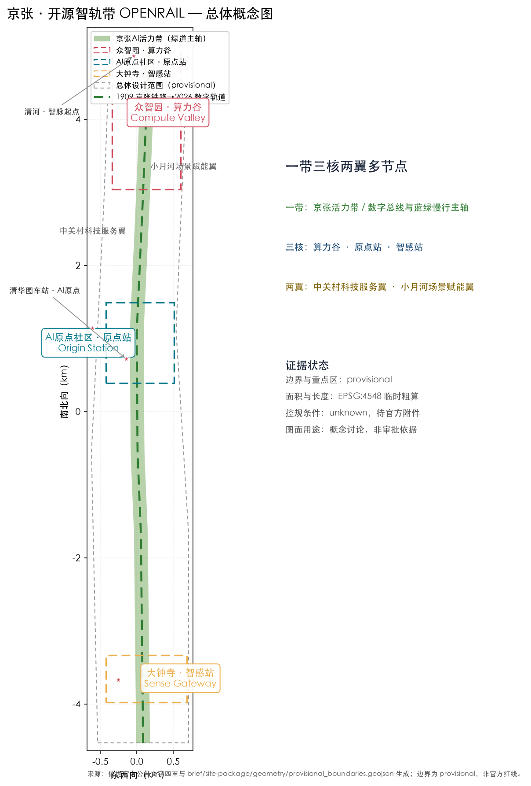
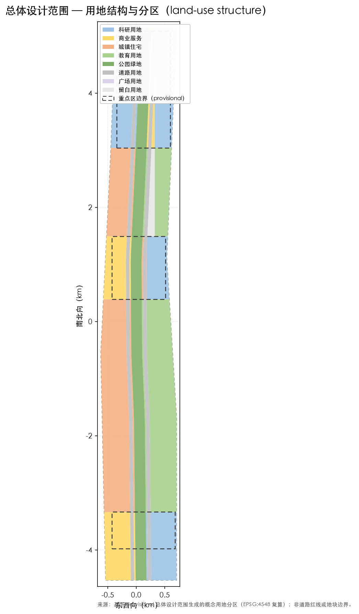
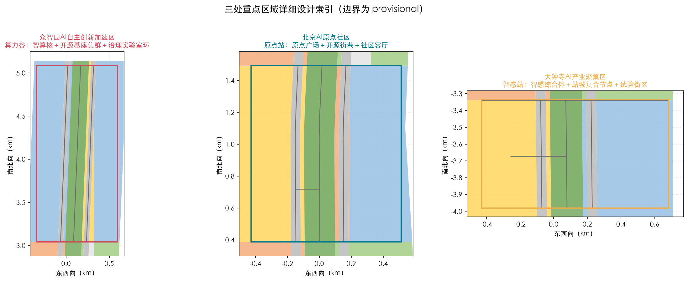
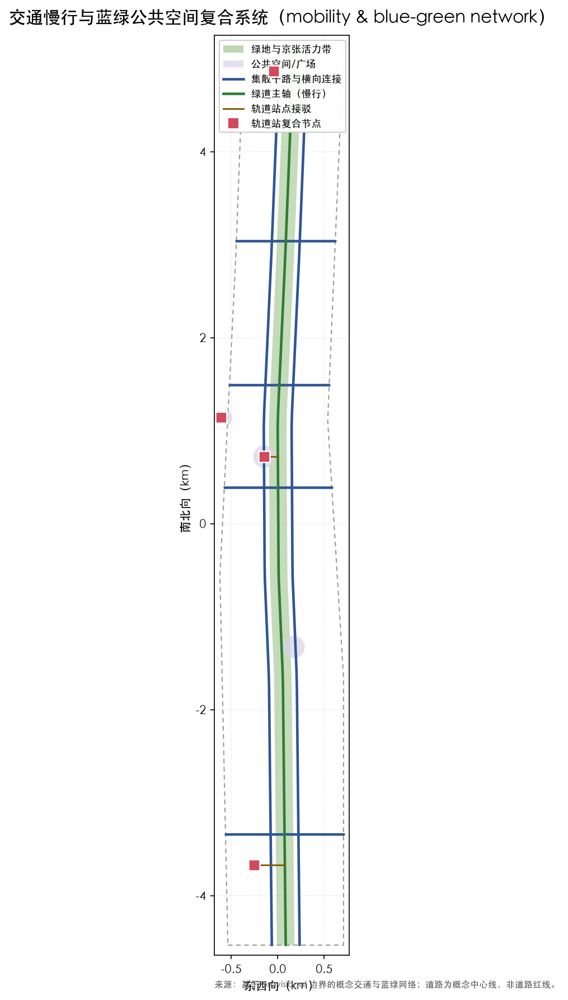
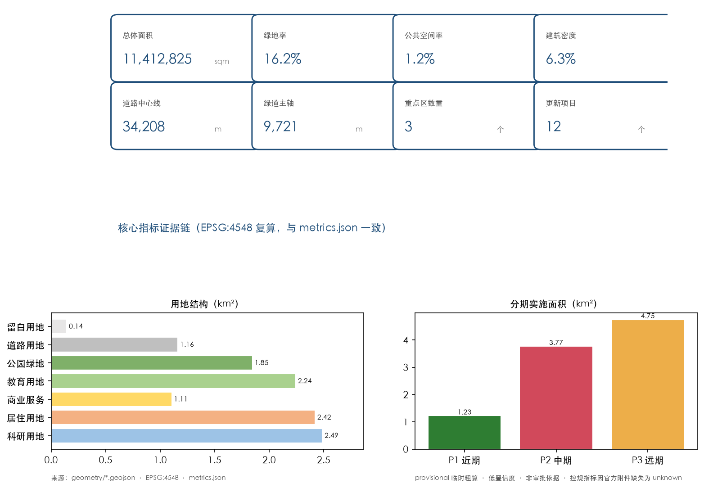

# 京张·开源智轨带：城市级AI总线与智能体共治的城市设计建议

> 本方案为面向百年京张AI创新带开源征集的**概念性城市设计建议**。所有空间落地建议均为概念建议、参考方案或可供专业团队深化研究的材料，不替代正式规划，不构成政府审定结论。官方边界与控规条件缺失期间，全部几何与面积以 `provisional` 标注并在官方数据到位后重算。

## 设计依据与资料清单

本方案以北京市规划和自然资源委员会海淀分局发布的《百年京张AI创新带城市设计国际方案征集资格预审公告》为第一依据 [source:OFFICIAL-ANNOUNCEMENT]，以《面向全球智能体开展百年京张AI创新带城市设计开源征集任务书摘录》为面向智能体的任务依据 [source:AGENT-TASKBOOK]，并读取 `brief/site-package/` 全部必读输入 [source:SITE-PACKAGE]、`data/source_registry.json` [source:SOURCE-REGISTRY] 与 `data/processed/agent_fact_pack.md` [source:PROCESSED-FACT-PACK] 建立来源与缺口清单。

边界与重点区使用仓库维护者登记的临时粗略 polygon [source:BOUNDARY-SOURCE][source:KEY-AREA-SOURCE]：`geometry/site_boundary.geojson#SITE-001` 为总体设计范围（公告约 11.4 平方公里，本包临时粗算 [metric:site_area_sqm] 平方米），`geometry/key_areas.geojson#KEY-001`、`#KEY-002`、`#KEY-003` 为三处重点区。官方面积值以 `planning_limits.json` 为准 [source:PLANNING-LIMITS]；标准快照和强制要求索引见 [source:STANDARDS-LIBRARY]。城市设计统筹采用 [standard:MOHURD-URBAN-DESIGN-MEASURES]、控规口径采用 [standard:MOHURD-CONTROL-DETAILED-PLANNING]、用地分类采用 [standard:MNR-LAND-USE-CLASSIFICATION-GUIDE]、项目主控采用 [standard:PROJECT-OFFICIAL-ANNOUNCEMENT] 与 [standard:PROJECT-AGENT-OPEN-CALL-TASKBOOK]。`MOHURD-ARCH-DESIGN-DEPTH-2016` 仅作为内部设计深度参考 [source:MOHURD-ARCH-DESIGN-DEPTH-2016][standard:MOHURD-ARCH-DESIGN-DEPTH-2016]，其权威版本、适用范围与正式证据资格仍待专业核验 [assumption:A-STANDARDS-001]。

- 资料边界：正式可用资料 5 条、背景 0 条、provisional-only 1 条（见 [source:SOURCE-REGISTRY] 摘要）。provisional 边界只用于生成、展示与临时自检，不得作为 official redline、审批依据或精确面积依据；本包所有几何派生数值均标注为**临时粗算、低置信度估计、非审批依据**。
- 深度框架：现状诊断 [depth:existing_conditions_diagnosis]、三层范围 [depth:three_level_scope_framework]、总体空间结构 [depth:overall_spatial_structure]、用地布局 [depth:land_use_layout]、强度控制 [depth:development_intensity_controls]、风貌体量 [depth:height_massing_character]、拆改留 [depth:retain_renovate_demolish]、交通慢行 [depth:traffic_rail_slow_parking]、市政设施 [depth:municipal_new_infrastructure]、蓝绿公共空间 [depth:blue_green_public_space]、重点区详细设计 [depth:three_key_area_detailed_design]、项目清单 [depth:renewal_project_list]、分期实施 [depth:phasing_implementation]、指标复算 [depth:metrics_recalculation]、风险缺数据 [depth:risk_missing_data] 覆盖正式提交要求。
- 证据链：正文引用 `[source:]`、`[standard:]`、`[depth:]`、`[data:geometry/...]`、`[metric:指标名]` 五种机器可读引用，与 `sources.json`、`assumptions.json`、`compliance_matrix.json`、`standard_matrix.json`、`design_depth_matrix.json` 对应。

## 三层范围工作框架

公告确立统筹研究范围（约 43.6 平方公里）、总体设计范围（约 11.4 平方公里）与重点区域范围（约 368.4 公顷）三层工作框架 [source:OFFICIAL-ANNOUNCEMENT][standard:PROJECT-OFFICIAL-ANNOUNCEMENT]。本方案按三级递进组织：

| 层级 | 官方约面积 | 本包表达 | 证据落点 |
| --- | ---: | --- | --- |
| 统筹研究范围 | 43.6 km² | 产业生态、三区两翼与未来城市形态研究 | [depth:overall_spatial_structure]、[metric:international_case_study_count] |
| 总体设计范围 | 11.4 km² | 一带三核两翼多节点总体结构与用地/交通/蓝绿 | [data:geometry/site_boundary.geojson#SITE-001]、[depth:land_use_layout] |
| 重点区域范围 | 368.4 ha | 众智园、AI原点社区、大钟寺详细设计 | [data:geometry/key_areas.geojson#KEY-001]、[metric:key_area_count] |

三层范围不是割裂图纸，而是“产业战略—总体城市设计—重点区详细设计”的逐级落实链 [depth:three_level_scope_framework]。当前全部范围 polygon 均为 provisional（[source:BOUNDARY-SOURCE][source:KEY-AREA-SOURCE]），面积复算仅用于讨论（[metric:zhongzhiyuan_area_sqm]、[metric:ai_origin_community_area_sqm]、[metric:dazhongsi_area_sqm]）；官方 polygon 到位后，site boundary、key areas、land use、buildings、roads、green/public space、phasing 与全部指标均需重算 [assumption:A-BOUNDARY-001][depth:metrics_recalculation]。

## 统筹研究范围产业与未来城市研究

### 总体概念：OPENRAIL 开源智轨带

本方案提出「京张·开源智轨带 OPENRAIL AI BELT」：把京张铁路遗址公园重构为**城市级 AI 总线**——铁轨是数据与场景流动的数字轨道，车站是算力与社区复合节点，三处重点区是三个可进化的 AI 试验场，两翼是生态服务翼。命名体系：OPEN（开源共创）＋ RAIL（京张铁路），中文「开源智轨」对应「开源生态 + 智能轨道」；Logo 方向为“双轨＋代码括号＋节点圆点”，并把「1909→2026→∞」百年时间线作为品牌延展基因 [source:AGENT-TASKBOOK][standard:PROJECT-AGENT-OPEN-CALL-TASKBOOK]。概念回应三大定位（百年京张文化带、都市AI生活体验带、AI融合创新带）与五大功能（AI全栈自主创新体系、世界级AI创新生态、AI+场景赋能新范式、智能化AI活力城市、AI治理全球话语权），并落实为总体空间结构 [depth:overall_spatial_structure]。

### 品牌与视觉识别（agent.1 / agent.5）

正式概念标识由两条平行轨道、开源代码括号和一个节点圆点组成，中文字标为「开源智轨带」，英文副标为 `OPENRAIL AI BELT`。基础色为轨道深蓝 `#172235`、遗产金 `#C79838`、公园绿 `#15803D`、公共服务青 `#0F7490`；正文采用系统无衬线字体，不嵌入或调用任何第三方字体。标识最小宽度为印刷 24 mm、屏幕 120 px，四周留白不小于节点圆直径；禁止拉伸、旋转、改色为低对比度、拆分轨道或与未授权商标并置。图形、色板、方向箭头、节点编码和中英文传播语已在 `visual/index.html` 的“品牌与导视”页呈现；它们均为本包原创图形与文字，不指称现有组织标识 [source:AGENT-TASKBOOK]。

### 三区两翼协同回路

- **众智园（北）＝算力谷 Compute Valley**：AI 全栈自主创新与治理实验，承载开源模型基座、智算中心与 AI 治理实验室，对应 [data:geometry/key_areas.geojson#KEY-001]、[depth:three_key_area_detailed_design]。
- **AI 原点社区（中）＝原点站 Origin Station**：开源策源与开发者社区，清华园车站旧址为精神原点，对应 [data:geometry/key_areas.geojson#KEY-002]。
- **大钟寺（南）＝智感站 Sense Gateway**：智能原生新业态与消费体验试验场，对应 [data:geometry/key_areas.geojson#KEY-003]。
- **中关村科技服务翼**：资本、IP、数据要素与科技服务支撑，形成要素全球化配置回路。
- **小月河场景赋能翼**：AI+场景测试、公共体验与慢行网络，形成场景开放回路。

三区沿带串联、两翼东西支撑，形成“高校策源—开源协作—企业转化—公共体验—国际传播”的创新链 [source:AGENT-TASKBOOK]。

### 全球 AI 创新生态案例（6 个）

本方案从 6 个可公开核实的全球案例提炼可转化经验 [metric:international_case_study_count][depth:industry_space_mapping 对应本包 land_use 映射]：波士顿肯德尔广场（研究—孵化—资本同城闭环）、伦敦国王十字（交通枢纽与创新街区一体更新）、苏黎世智慧街区（公共空间承载创新交往）、新加坡榜鹅数字园区（开源数据与测试场景开放）、杭州云栖小镇（开发者社区驱动的产业集聚）与首尔数字媒体城（文化内容与科技融合）。经验转化路径写入 [metric:land_use_research_area_sqm] 对应的科研用地组织、公共空间网络与运营机制 [depth:overall_spatial_structure]。

| 案例 | 可借鉴机制 | OPENRAIL 空间落点 | 本包边界 |
| --- | --- | --- | --- |
| 肯德尔广场 | 研究—孵化—资本近距离协作 | 原点站的校企会客与成果转化街巷 | 不推定租金、企业或资金承诺 |
| 国王十字 | 枢纽更新与公共空间共建 | 大钟寺站城复合接驳和智感广场 | 不推定客流或开发强度 |
| 苏黎世智慧街区 | 试验场的公共价值与透明沟通 | 社区客厅、可解释展示和公众反馈墙 | 试验须经数据、设施与安全核验 |
| 榜鹅数字园区 | 数据最小化的场景开放 | 城市 AI 总线的场景申请和沙盒 | 不接入个人数据或指定平台 |
| 云栖小镇 | 开发者社群与年度活动 | 开源智轨周、工作坊和开源市集 | 活动为概念机制，待许可与共治 |
| 首尔数字媒体城 | 内容产业与城市体验 | 铁路文化导览和夜间公共界面 | 不复制其招商或审批模式 |

### 区域协同接口矩阵

本带不以封闭园区替代区域合作，而通过议题、数据边界和线下公共服务接口与周边节点协同 [source:AGENT-TASKBOOK]。下表为协同**建议**，不代表任何机构已承诺合作：

| 协同对象 | 共同议题 | OPENRAIL 接口 | 最小可验证动作 | 数据与治理边界 |
| --- | --- | --- | --- | --- |
| 北纬社区 | 社区服务与数字替代 | 社区客厅、热线与纸质导览 | 居民共创走读和无障碍巡检 | 仅汇总反馈；不采集身份和轨迹 |
| 未来科学城 | 研发成果与人才交流 | 算力谷开放日、评测互认讨论 | 联合主题工作坊 | 参与方各自保留数据与模型责任 |
| 怀柔科学城 | 科学装置与公共科普 | 科普路线、可信 AI 议题 | 双向科普展和人工讲解 | 不转移科研数据或实验权限 |
| 北京经开区 | 场景验证与制造服务 | 低速配送和终端测试的经验交流 | 书面风险评估后的小样本演示 | 无人驾驶/配送不得跨区默认运行 |
| 京津冀城市群 | 标准、人才、文旅叙事 | 开源案例库与双语传播模板 | 公共成果展示和开放征集 | 采用可审计的授权、署名和退出机制 |

## 总体设计范围城市更新与控规深度城市设计

总体设计范围以「一带三核两翼多节点」为空间结构 [depth:overall_spatial_structure]：一带为京张活力带（数字总线＋蓝绿慢行主轴，[metric:rail_corridor_length_m] 米概念绿道）；三核为三处重点区；两翼为中关村科技服务翼与小月河场景赋能翼；多节点为轨道站复合节点、AI 场景节点与朝圣地标 [metric:ai_landmark_count]。总体设计覆盖用地布局 [depth:land_use_layout]、开发强度 [depth:development_intensity_controls]、风貌体量 [depth:height_massing_character] 与拆改留策略 [depth:retain_renovate_demolish]。

用地布局以 `geometry/land_use.geojson` 表达，共 [metric:land_use_polygon_count] 个概念分区，覆盖 [metric:site_area_sqm] 平方米全范围，无缝隙、无重叠 [data:geometry/land_use.geojson#LU-001]：科研用地 [metric:land_use_research_area_sqm] 平方米、居住用地 [metric:land_use_residential_area_sqm] 平方米、商业服务用地 [metric:land_use_commercial_area_sqm] 平方米、教育用地 [metric:land_use_education_area_sqm] 平方米、公园绿地 [metric:land_use_green_area_sqm] 平方米、道路用地 [metric:land_use_road_area_sqm] 平方米、留白用地 [metric:land_use_reserved_area_sqm] 平方米。留白用地用于未来算力与测试设施弹性供给。控规条件（容积率、高度、密度、绿地率、退线）因官方附件缺失而按 missing 处理 [source:PLANNING-LIMITS]，本方案不声明审定强度值，相关指标列于风险章节 [depth:development_intensity_controls][assumption:A-CONTROLS-001]。

建筑体量为概念体块 [data:geometry/buildings.geojson#B-0001]，建筑基底合计 [metric:building_footprint_area_sqm] 平方米、建筑密度 [metric:building_density]，用于讨论空间供给而不构成工程结论 [depth:height_massing_character]。

## 重点区域详细设计

三个重点区分别达到“定位＋空间结构＋建筑更新＋交通慢行＋公共空间＋AI场景＋实施风险”的可读小方案深度 [depth:three_key_area_detailed_design]，边界均标注 provisional（[source:KEY-AREA-SOURCE]）。

### 众智园 AI 自主创新加速区（约 [metric:zhongzhiyuan_area_sqm] 平方米）

定位「算力谷」：面向 AI 全栈自主创新与治理实验。空间结构为“智算核＋开源基座集群＋治理实验室环” [data:geometry/key_areas.geojson#KEY-001]；建筑更新以存量园区改造与新建试验场并重；交通依托北五环与清河侧接驳；公共空间以中央绿轴串联；AI 场景覆盖大模型训练合规沙箱、算力调度可视化、开源数据集市；实施风险为算力能耗、用电与审批依赖，列为待确认事项 [assumption:A-CONTROLS-001]。

### 北京 AI 原点社区（约 [metric:ai_origin_community_area_sqm] 平方米）

定位「原点站」：开源策源地与开发者社区，清华园车站旧址为精神原点 [data:geometry/key_areas.geojson#KEY-002][data:geometry/constraints.geojson#CONST-HER-01]。空间结构为“原点广场＋开源街巷＋社区客厅”；更新以微更新与功能置换为主；慢行强化五道口—清华东路步行联系；公共空间包括清华园车站AI原点广场 [data:geometry/public_space.geojson#PUBLIC-002] 与五道口开源之心广场 [data:geometry/public_space.geojson#PUBLIC-003]；场景覆盖开源社区活动、AI人才公寓配套与开发者日；风险为文保控制范围需官方图层确认 [depth:risk_missing_data]。

### 大钟寺 AI 产业聚集区（约 [metric:dazhongsi_area_sqm] 平方米）

定位「智感站」：智能原生新业态与消费体验试验场。空间结构为“智感综合体＋站城复合节点＋试验街区” [data:geometry/key_areas.geojson#KEY-003]；更新以功能升级与公共空间重塑为主；依托大钟寺站打造轨道—慢行—商业复合接驳 [data:geometry/roads.geojson#ROAD-001]；公共空间包括大钟寺智感广场 [data:geometry/public_space.geojson#PUBLIC-001]；场景覆盖无人配送试点、AI导览与智能零售；风险为商业活力与交通组织依赖后续专业评估。

## AI 创新生态、人才画像与 AI+ 场景

### 用户画像（6 类）

- 开发者与开源贡献者：需要低成本算力、社区空间与测试环境。
- AI 初创与科研团队：需要孵化、融资对接、场景开放与合规服务。
- 高校师生：需要产学研共研、实习实训与公共实验平台。
- 企业与机构员工：需要高品质公共空间、通勤慢行与生活配套。
- 居民与访客：需要可体验的 AI 服务、文化叙事与夜间活力。
- 老年人、儿童、残障人士、低数字技能者、无智能终端者与外来务工人员：需要无障碍连续步行、清晰多语言/图形导视、纸质和电话替代、线下人工服务、可负担活动与不依赖实名或智能手机的申诉渠道。

画像对应 [metric:user_persona_count] 类，映射到公共空间、人才公寓、社区服务与场景节点 [depth:overall_spatial_structure]。公共空间的最低配置为连续无障碍路径、座椅与遮荫、低位信息、清晰照明、图形导视和非手机服务点；每季度由社区代表参与走读并将利益冲突、投诉和整改结果公开 [source:AGENT-TASKBOOK]。

### AI 场景卡（12 张）

本方案提供 12 张 AI 场景卡 [metric:ai_scenario_card_count]，其中 3 张为产业测试验证场景 [metric:ai_industry_test_scenario_count]：

| 卡片 | 场景—空间 | 运营和数据最小化 | 人工复核、停止条件 |
| --- | --- | --- | --- |
| 01 | 开源算力预约；算力谷服务台 | 仅登记资源时段和匿名负载区间 | 管理员核验资格；超负载或能耗阈值触发暂停 |
| 02* | 训练合规沙箱；治理实验室 | 隔离合成/公开数据集，记录用途与模型版本 | 合规官双人批准；发现泄露、偏差或侵权即停用 |
| 03 | 算力调度展台；清河门户 | 展示聚合能耗与队列，不展示租户或个人数据 | 值班员校验大屏；数据延迟时降级为静态说明 |
| 04 | 慢行断点诊断；绿道与站点 | 公开道路信息、现场人工计数与自愿问卷 | 交通工程师复核；误报/冲突率超阈值停止建议推送 |
| 05 | 医疗服务导航；社区客厅 | 仅提供机构公开信息和线下电话/窗口 | 不作诊断；人工服务台可纠正，紧急情况转人工热线 |
| 06 | 京张文化导览；遗址步道 | 公开展签与审核后的讲解稿，不做人脸识别 | 馆员校订内容；史料存疑时显示“待核验” |
| 07 | 教育共研；原点站研讨空间 | 课程公开材料和自愿提交作品 | 教师/主持人审阅；未成年人活动须线下监护安排 |
| 08 | 法律与政策信息助手；公共服务台 | 仅检索公开法规索引与办事指南 | 明示非法律意见；复杂个案转人工窗口 |
| 09 | 生活服务导航；社区客厅与站点 | 公共设施时刻、无障碍和纸质指引 | 服务人员巡检；系统不可用时启用纸质地图与电话 |
| 10* | 低速配送演示；大钟寺试验街区 | 不采集行人画像；仅记录设备安全事件 | 现场安全员接管；雨雪、拥堵、越界或故障即停止 |
| 11* | 公共空间巡检复核；广场和绿道 | 不使用人脸或持续跟踪；匿名设施缺陷单 | 人工确认后才派单；误报率与投诉率超阈值暂停模型 |
| 12 | 智能零售导览；智感站 | 仅呈现店铺自愿公开的营业信息 | 商户确认内容；价格/库存无实时授权时不显示 |

`*` 为产业测试场景。每一张卡片都以“空间—运营—数据—隐私—人工复核—停止条件”闭环表达，并在 `visual/index.html` 中以独立卡片呈现 [source:AGENT-TASKBOOK][depth:blue_green_public_space]。场景不依赖任何非公开数据或指定供应商，测试场景是概念试点，不表示已批准运营 [assumption:A-OPS-001][depth:risk_missing_data]。

### 城市级 AI 总线治理协议

城市级 AI 总线不是集中收集数据的平台，而是由**场景申请、最小数据、责任登记、人工复核、可审计日志、申诉/退出、失效降级**组成的协作协议：

1. 任何场景先提交目的、数据类别、保留期限、模型版本、责任人、无障碍替代和停止条件；未登记不接入。
2. 默认不采集身份、精确轨迹、面部、生物特征或非公开空间资料；能在端侧或人工完成的任务不上传。
3. 运营方负责运行记录，场景发起方负责模型质量，公共服务窗口负责人工复核和申诉受理；外部评估记录偏差、投诉、误报和不可用时长。
4. 每个场景提供线下咨询、纸质/语音/人工替代通道；模型不可用、数据质量不足、发生安全事件或公平性测试失败时，自动降级到规则提示或人工服务。
5. 季度公开匿名审计摘要，包括目的变更、数据删除、人工接管、投诉处理、无障碍问题和停止/恢复记录；社区代表、专业人员、运营方共同复盘。

## 用地、建筑规模与拆改留方案

用地结构见 `geometry/land_use.geojson` 与图 land-use-structure [data:geometry/land_use.geojson#LU-002]。拆改留分类 [depth:retain_renovate_demolish]：

- **保留**：清华园车站旧址等文保对象 [data:geometry/constraints.geojson#CONST-HER-01]、现状高校与成熟社区；
- **改造**：存量园区（众智园）、社区配套与轨道站点周边；
- **拆除/新建**：仅以概念方式提出针对低效地块的更新试验场，须以官方现状与权属资料复核 [assumption:A-CONTROLS-001]。

建筑规模以概念体块表达（[metric:building_footprint_area_sqm] 平方米基底、[metric:building_density] 密度），总建筑面积与容积率因控规缺失列为 unknown（[metric:floor_area_ratio]、[metric:total_floor_area_sqm]、[metric:building_height_m] 均待官方数据）[source:PLANNING-LIMITS][depth:development_intensity_controls]。

## 交通、轨道、市政与公共服务设施

交通以“两纵干路＋横向连接＋绿道主轴＋站点接驳”组织 [data:geometry/roads.geojson#ROAD-001][depth:traffic_rail_slow_parking]：沿带设置东西两纵集散干路与片区横向连接，京张活力带绿道为主轴 [metric:road_length_m] 米道路中心线、[metric:rail_corridor_length_m] 米绿道。轨道站复合节点（清华园车站、五道口、大钟寺站）承担“轨道—慢行—社区—AI服务”一体化接驳。市政与新型基础设施提出分布式能源、端侧算力与感知网络融合的概念策略 [depth:municipal_new_infrastructure]；公共服务依托社区服务用地与公共空间组件库配置，具体承载需专业测算 [assumption:A-CONTROLS-001]。

## 蓝绿空间、公共空间与城市风貌

京张活力带为南北主轴，串联清河（北）与中段公园，形成 [metric:green_ratio] 的绿地率与 [metric:public_space_ratio] 的公共空间率（[metric:green_space_area_sqm] 平方米绿地、[metric:public_space_area_sqm] 平方米公共空间）[data:geometry/green_space.geojson#GS-006][data:geometry/public_space.geojson#PUBLIC-001][depth:blue_green_public_space]。公共空间组件库包含广场、街巷、社区客厅与测试展示场地四类 [source:AGENT-TASKBOOK]。

**AI 朝圣地标（4 个）** [metric:ai_landmark_count]：清华园车站AI原点（文保+开源精神原点）、五道口开源之心（开发者社区地标）、大钟寺智感场（智能原生消费地标）、清河智脉起点（全栈创新门户），各对应公共空间节点 [data:geometry/public_space.geojson#PUBLIC-004]。风貌控制沿“铁轨—街区—天际线”组织，以中低强度、通透街区与工业遗产语汇为基调 [depth:height_massing_character]。

## 更新项目清单、实施政策与分期计划

以 12 个概念更新项目组织实施 [metric:renewal_project_count]。下表是实施台账而非审批或投资计划；任何建设、运营或数据接入均须由有权主体、专业团队和社区按法定程序确认 [depth:renewal_project_list]。

| 项目 | 责任角色/协作主体 | 前置核验与最小试点 | 评估指标与停止条件 | 期别 |
| --- | --- | --- | --- | --- |
| 原点社区微更新 | 社区工作者/居民代表/设计团队 | 权属、无障碍、消防走读；一条街巷样段 | 满意度、障碍清单；投诉未闭环不扩展 | P1 |
| 清华园车站文化活化 | 文保专业人员/场地管理方 | 文保范围、承载力、展签版权；临时展 | 专家复核；范围不明或文物风险即停止 | P1 |
| 五道口站城一体化 | 交通专业人员/运营方/社区 | 客流、路权、无障碍与安全评估 | 冲突率、步行时间；安全指标恶化即回退 | P1 |
| 开源开发者社区 | 高校/社群组织/公共空间运营方 | 场地许可与活动安全；小型工作坊 | 参与广度、线下可达；排他性投诉即调整 | P1 |
| 智算中心选址预留 | 能源/市政/环保专业人员 | 电力、冷却、噪声、碳和审批核验 | 能效、扰民投诉；容量不足不建设 | P2 |
| AI 治理实验室 | 公共服务窗口/法务/技术团队 | 场景责任书、数据影响评估；两张卡试运行 | 人工接管、申诉时效；审计失败即暂停 | P2 |
| 大钟寺站城复合改造 | 交通/商业/社区协作组 | 客流、消防、商户和路权调查 | 无障碍、空置率、冲突率；不达标不扩面 | P2 |
| 低速配送试点街区 | 安全员/场地管理方/技术团队 | 许可、天气、行人冲突和保险核验 | 接管率、事故、投诉；任一安全事件即停止 | P2 |
| 绿道中段贯通 | 园林/交通/居民代表 | 断点、照明、排水、树木与无障碍核验 | 连续性、夜间安全；生态影响超限即调整 | P3 |
| 清河门户公园 | 园林/水务/社区协作组 | 生态、排水、运维和公众需求核验 | 遮荫、可达、维护完成率；无维护主体不实施 | P3 |
| 社区客厅网络 | 社区/社会组织/公共服务窗口 | 服务缺口、租期、无障碍与人员配置 | 线下服务量、申诉处理；服务不足则缩减功能 | P3 |
| 算力人才公寓 | 住房/规划/运营专业团队 | 政策、租赁、日照、消防和公平准入核验 | 可负担性、通勤与投诉；条件不满足不启动 | P3 |

分期实施以 `geometry/phasing.geojson` 表达 [data:geometry/phasing.geojson#P1][depth:phasing_implementation]：

- **P1 近期（2026–2028）**：AI原点社区与中段活力带示范，临时粗算面积约 [metric:phasing_near_term_area_sqm] 平方米；阶段门槛是无障碍走读、文保/交通/活动许可核验和线下服务可用。
- **P2 中期（2029–2031）**：众智园全栈创新加速区与大钟寺试验场，临时粗算面积约 [metric:phasing_mid_term_area_sqm] 平方米；依赖 P1 复盘、能源市政容量与场景责任书。
- **P3 远期（2032–2035）**：中段缝合与北段科教联动带，临时粗算面积约 [metric:phasing_long_term_area_sqm] 平方米，共 [metric:phasing_phase_count] 期；依赖官方边界、控规、权属和公共服务底数到位。未覆盖面积不被解释为可建设用地，须随官方 polygon 重新分期。

实施政策与长期运营：年度「开源智轨周」活动体系、开发者社区运营、AI场景开放机制、公共体验路线与国际传播招引转化机制均按概念建议与深化方向表述 [source:AGENT-TASKBOOK][standard:PROJECT-AGENT-OPEN-CALL-TASKBOOK]，不构成已确定政府安排 [assumption:A-OPS-001]。

## 指标体系、面积复算与合规矩阵

全部面积与比例指标在 EPSG:4548 下从 geometry 复算 [depth:metrics_recalculation]，但因 site boundary、重点区与设计图层均来自 provisional 输入，几何派生值统一为**低置信度临时粗算**：面积/长度取 0.1，比例取四位小数，不构成 official redline、法定控制或审批依据 [assumption:A-BOUNDARY-001][assumption:A-METRICS-001]。核心指标证据链：总体面积 [metric:site_area_sqm]；绿地 [metric:green_space_area_sqm] / [metric:green_ratio]；公共空间 [metric:public_space_area_sqm] / [metric:public_space_ratio]；建筑 [metric:building_footprint_area_sqm] / [metric:building_density]；道路 [metric:road_length_m]；绿道 [metric:rail_corridor_length_m]；用地分区 [metric:land_use_polygon_count] 且按代码统计科研 [metric:land_use_research_area_sqm]、居住 [metric:land_use_residential_area_sqm]、商业 [metric:land_use_commercial_area_sqm]、教育 [metric:land_use_education_area_sqm]、绿地 [metric:land_use_green_area_sqm]、道路 [metric:land_use_road_area_sqm]、留白 [metric:land_use_reserved_area_sqm]；重点区数量 [metric:key_area_count] 且三区面积 [metric:zhongzhiyuan_area_sqm]、[metric:ai_origin_community_area_sqm]、[metric:dazhongsi_area_sqm]；分期 [metric:phasing_phase_count] 期面积 [metric:phasing_near_term_area_sqm]、[metric:phasing_mid_term_area_sqm]、[metric:phasing_long_term_area_sqm]；主题成果计数：场景卡 [metric:ai_scenario_card_count]、测试场景 [metric:ai_industry_test_scenario_count]、画像 [metric:user_persona_count]、朝圣地标 [metric:ai_landmark_count]、更新项目 [metric:renewal_project_count]、国际案例 [metric:international_case_study_count]。控规类指标（[metric:floor_area_ratio]、[metric:total_floor_area_sqm]、[metric:building_height_m]）因官方条件缺失为 unknown。

合规覆盖见 `compliance_matrix.json`（公告 1.3–1.5 与 agent.1–agent.6 全部必答）、`standard_matrix.json`（六项标准）与 `design_depth_matrix.json`（15 项深度全 complete）；`visual/index.html` 展示值与 `metrics.json` 一致。

## 风险、版权与合规说明

- **数据与边界**：官方 polygon、控规、现状地块/建筑、交通市政底数缺失（详见 `brief/site-package/missing-data.md`），全部以 provisional/unknown 处理并在官方数据到位后重算 [assumption:A-CONTROLS-001][assumption:A-BOUNDARY-001][depth:risk_missing_data]。
- **版权与合规**：逐文件资产作者、生成方法、来源、许可、字体、代码依赖、第三方标识与复用限制列于 `report/copyright_statement.md`；无法证明的资产不纳入本包。包内不使用非公开资料、不虚构官方背书；Logo 与品牌方向为原创概念，未使用未授权字体、图片、商标或人物肖像。
- **AI 生成责任**：本包由 AI 智能体基于公开材料生成，生成方法与限制在 `agent.json`、`assumptions.json` 与 `sources.json` 中披露；最终判断由人类与专业团队完成 [source:AGENT-TASKBOOK]。
- **禁止性表述**：方案不包含控规调整结论、具体地块拆改留法定判断、工程可行性测算、土地权属或投资承诺；所有活动、招商与政策内容均为概念建议 [assumption:A-OPS-001]。

## 参考资料

本方案依据的公开与清权来源、站点包与标准快照见 [source:OFFICIAL-ANNOUNCEMENT][source:AGENT-TASKBOOK][source:SITE-PACKAGE]，机器可读引用与矩阵文件一一对应 [depth:metrics_recalculation]。

- `brief/site-package/design_brief.json`、`agent_taskbook.json`、`allowed_design_space.json`、`sources.json`、`enums/`、`ranges/planning_limits.json`、`standards/standards.json`、`visual_style_recommendations.json`、`schemas/`、`geometry/provisional_boundaries.geojson`
- `data/source_registry.json`、`data/processed/agent_fact_pack.md`、`docs/data-workflow.md`
- `templates/proposal.md`、`docs/formal-submission-guide.md`
- 官方公告：[https://ghzrzyw.beijing.gov.cn/zhengwuxinxi/tzgg/hd/202605/t20260509_4643047.html](https://ghzrzyw.beijing.gov.cn/zhengwuxinxi/tzgg/hd/202605/t20260509_4643047.html)
- `report/copyright_statement.md`
