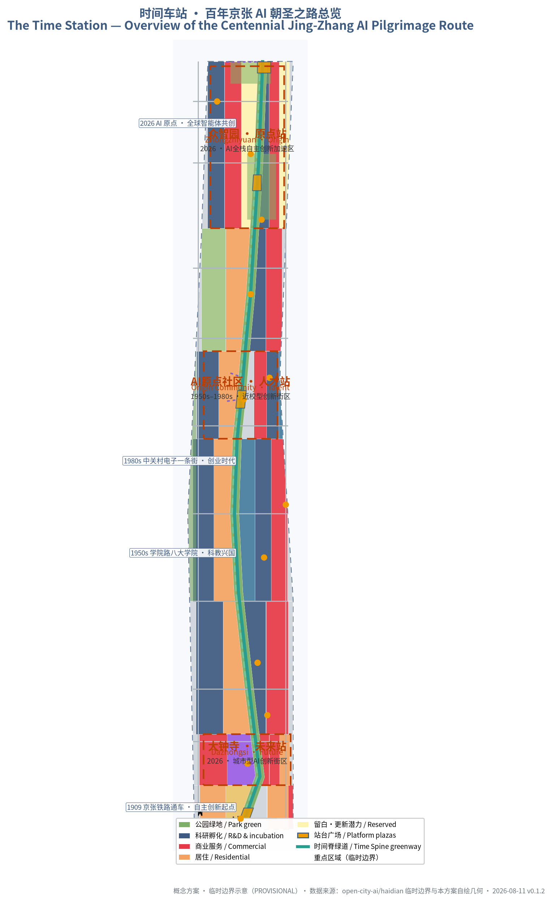
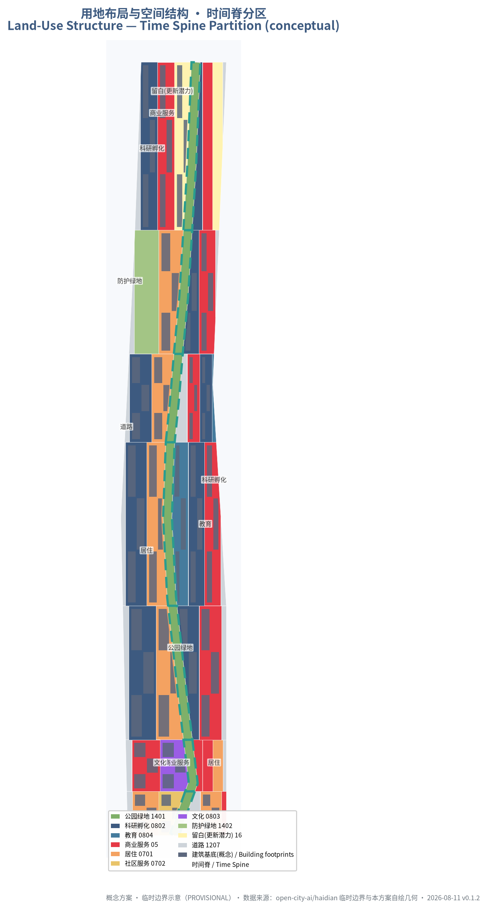
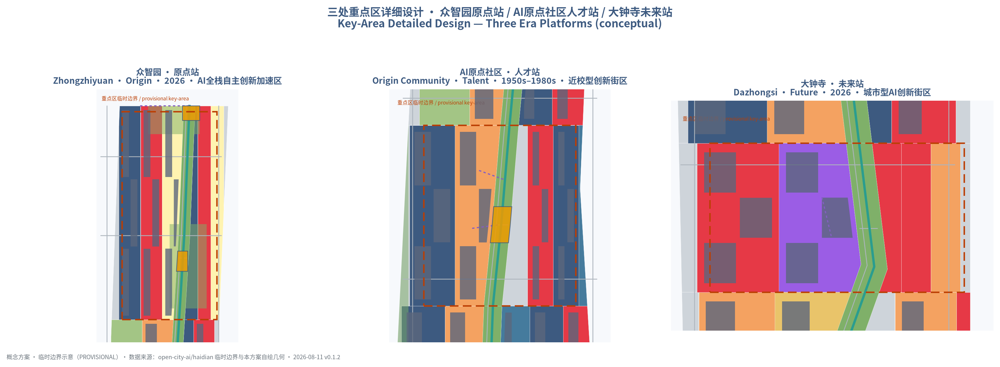
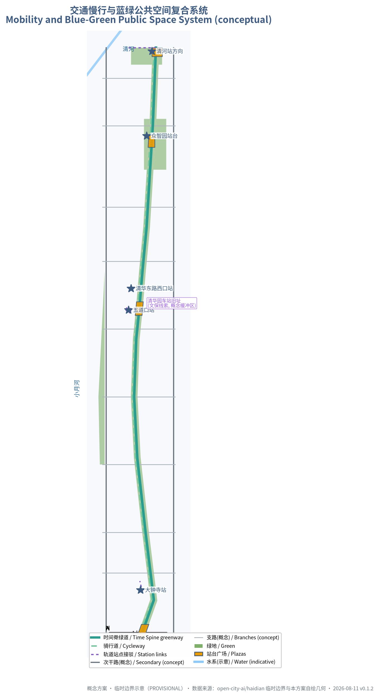
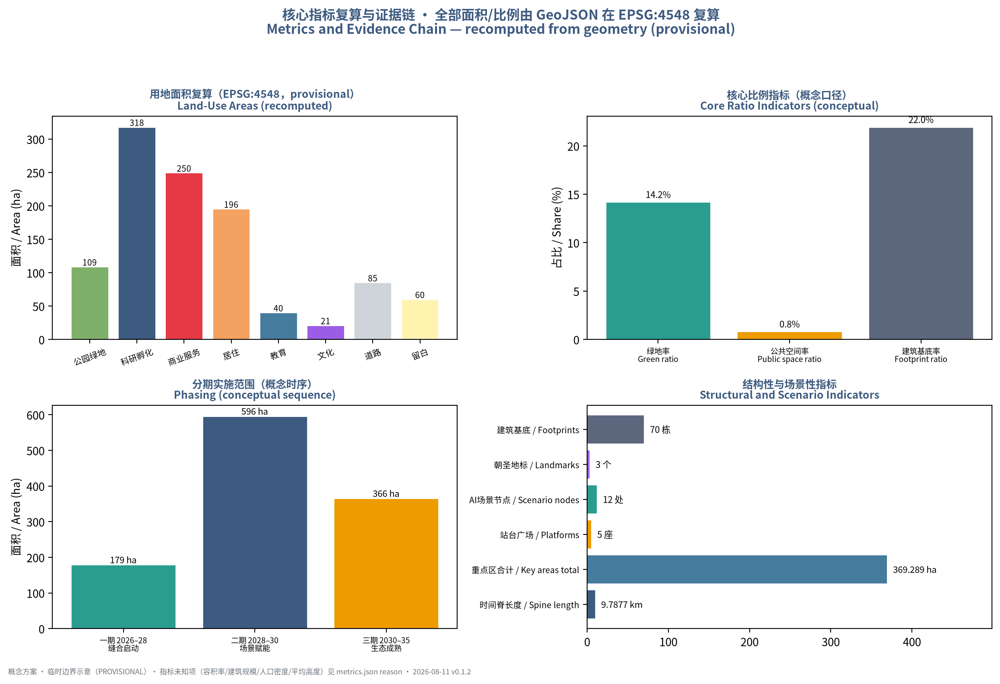

# The Time Station: an AI Pilgrimage Route across a Century of Jing-Zhang

## Design Basis and Source List

This proposal takes the Qualification Pre-announcement for the Centennial Jing-Zhang AI Innovation Belt International Urban Design Call, published by the Haidian Branch of the Beijing Municipal Commission of Planning and Natural Resources, as its primary basis [source:DATA-SRC-OFFICIAL-ANNOUNCEMENT-20260509], together with the cleared agent-facing taskbook [source:SRC-2026-0518-AGENT-OPEN-CALL-TASKBOOK], the maintainer-registered provisional boundaries [source:DATA-SRC-PROVISIONAL-BOUNDARIES-20260605], standard snapshots and the source registry. The three scope levels and areas (Coordinated Research Area about 43.6 km², Overall Design Area about 11.4 km², Key-Area Detailed Design Area about 368.4 ha), the three key areas and tasks 1.3/1.4/1.5 are all cited from the announcement text and official page [source:DATA-SRC-OFFICIAL-ANNOUNCEMENT-20260509].

Boundary transparency statement: as of the retrieval date of this draft (2026-08-10), no official polygon-level red line is available on public channels. All spatial boundaries in this proposal are provisional rough extents registered by the maintainers, used only for concept generation, display and intake self-check [data:geometry/site_boundary.geojson#SITE-001] [source:DATA-SRC-PROVISIONAL-BOUNDARIES-20260605]. Every area, ratio and length metric is recomputed from the geometry layers under EPSG:4548 and labelled as provisional [metric:site_area_sqm]; once official polygons arrive they must replace the whole set and all metrics must be recalculated. The existing-conditions diagnosis is based on the public announcement, public history and the repository fact pack, with the nine data gaps registered in `assumptions.json` [depth:existing_conditions_diagnosis]. The complete machine-readable index of task coverage, standards response and design depth is kept in `compliance_matrix.json`, `standard_matrix.json` and `design_depth_matrix.json`, and is not duplicated in the prose [depth:three_level_scope_framework].

This is v0.1.1 (2026-08-11): synced with the upstream validation contract (persisted-self-check-v1) and persisted the four-gate self-check; see changelog.md.

## Three-Level Scope Framework

The three scope levels implement the cascade from industrial strategy to overall urban design to detailed key-area design [source:DATA-SRC-OFFICIAL-ANNOUNCEMENT-20260509]. The Coordinated Research Area (about 43.6 km², bounded by the North 5th Ring Road, the Jingzang Expressway, Xizhimen Outer Street and Wanquanhe Road) hosts the world-class AI ecosystem study, the Three Zones and Two Wings synergy and the future-city-form research [depth:three_level_scope_framework]; the Overall Design Area (about 11.4 km², the 1–2 km urban and industrial band around the Jing-Zhang Heritage Park) hosts renewal design at regulatory-plan urban-design depth [metric:site_area_sqm]; the Key-Area Detailed Design Area (about 368.4 ha) covers the three key areas — Zhongzhiyuan, the Beijing AI Origin Community and Dazhongsi — at comprehensive-implementation-plan urban-design depth [data:geometry/key_areas.geojson#KA-001] [metric:key_area_total_area_sqm].

The proposal outputs at each level: the coordinated level delivers the Time Station naming system, global case studies and the Three Zones and Two Wings synergy mechanism; the overall level delivers the spatial structure of "Time Spine + three era platforms + two scenario wings", the land-use partition and the renewal framework [depth:overall_spatial_structure]; the key-area level delivers a readable mini-scheme for each platform covering positioning, spatial structure, building renewal, mobility, public space, AI scenarios and implementation risk. Because the key-area polygons are provisional rectangular approximations [source:DATA-SRC-PROVISIONAL-BOUNDARIES-20260605], all conclusions inside the key areas are directional only, pending official polygons and regulatory conditions [standard:MOHURD-CONTROL-DETAILED-PLANNING].

## Coordinated Research Area: Industry and Future City Research

**Naming and visual identity.** The main name is "The Time Station" (时间车站), full name "The Time Station: an AI Pilgrimage Route across a Century of Jing-Zhang" [depth:overall_spatial_structure]. The naming system uses the "platform" as the root concept: the whole belt is a Time Station, the Jing-Zhang Railway Heritage Park is the Time Track (the Time Spine), and the three key areas are platforms boarding different eras — Zhongzhiyuan is the "Origin Platform" (1909, the origin of self-reliant innovation), the AI Origin Community is the "Talent Platform" (the 1950s Xueyuan Road academies and the 1980s Zhongguancun entrepreneurship), and Dazhongsi is the "Future Platform" (the 2026 AI era origin). The three positioning bands — the Centennial Jing-Zhang Culture Belt, the Urban AI Life Experience Belt and the AI-Integrated Innovation Belt [source:SRC-2026-0518-AGENT-OPEN-CALL-TASKBOOK] — map onto the "memory, experience, growth" interfaces of the Time Spine; the five functions are carried by the Three Zones and Two Wings [source:SRC-2026-BJ-KW-THREE-AREAS-WINGS]. The logo direction is "rail-and-ticks": a horizontal rail with time ticks and station marks implying the 1909–2026 span, in steel grey-blue and signal amber, using commercially usable open-source font families and no corporate or institutional marks [depth:risk_missing_data].

**Three Zones and Two Wings synergy loop.** Zhongzhiyuan (full-stack self-reliant innovation and AI-governance discourse) — AI Origin Community (world-class ecosystem and commercialization) — Dazhongsi (AI-native new business) form the vertical innovation chain [source:SRC-2026-BJ-KW-THREE-AREAS-WINGS]; the Zhongguancun Technology Services Wing provides IP, capital and global factor allocation, and the Xiaoyue River Scenario Empowerment Wing provides scenario opening and public experience [standard:PROJECT-AGENT-OPEN-CALL-TASKBOOK]. The loop: the Origin Community converts university research into incubatable results, which move north along the Time Spine into Zhongzhiyuan for piloting and full-stack validation, then south into Dazhongsi for marketization and content consumption, with both wings providing capital, scenarios and data-compliance services throughout [metric:case_study_count].

**Global AI ecosystem cases (mechanism transfer, not form copying).** ① Silicon Valley/Palo Alto: university–venture–corporate loops in a low-density garden campus; ② Kendall Square, Boston: campus-adjacent innovation district and life-science conversion ecology, mapped to the Origin Community [source:PUB-ACADEMY-ROAD-1950S]; ③ King's Cross, London: historic-hub regeneration driving a knowledge economy district, mapped to Dazhongsi; ④ Station F, Paris: single-point super-incubator with open community operations, mapped to the Zhongzhiyuan test field; ⑤ Toronto–Waterloo corridor: corridor-style innovation belt with talent commute networks, mapped to the Time Spine commuter services; ⑥ Jurong Innovation District, Singapore: park–city integration and scenario-open governance, mapped to the Xiaoyue River wing. All six are distilled into transferable mechanisms for operations and spatial design [depth:overall_spatial_structure].

**AI-adapted urban form.** The "platform city" vision: urban space behaves like a station timetable — predictable, transferable, returnable. Public space provides plug-and-use interfaces for AI services; buildings and facilities reserve upgradability; AI culture is expressed as a public-art system of time ticks; AI society is expressed as a governance loop of human review and public participation [source:SRC-2026-0518-AGENT-OPEN-CALL-TASKBOOK] [standard:PROJECT-AGENT-OPEN-CALL-TASKBOOK].

## Overall Design Area: Urban Renewal and Regulatory-Plan-Level Urban Design

**Overall spatial structure: the Time Spine.** A conceptual green belt running north–south through the Overall Design Area along the direction of the Jing-Zhang Railway Heritage Park [depth:overall_spatial_structure], with a conceptual length of about 9.79 km [metric:spine_length_m] and a park-green area of about 1.09 km² [metric:spine_park_area_sqm]. The Time Spine has three functions: as a "stitcher", reconnecting the east and west sides of the city cut by the railway through greenways, cycleways and pedestrian crossings [metric:spine_length_m]; as a "showcase band", carrying the century timeline narrative, AI scenarios and public art [depth:blue_green_public_space]; and as a "service corridor", linking the three platforms and the two scenario wings [source:SRC-2026-0518-AGENT-OPEN-CALL-TASKBOOK].

**Renewal framework.** The principle is "retain and renovate first, demolish and build sparingly, verify phase by phase" [depth:retain_renovate_demolish]: heritage and cultural resources (e.g., the former Qinghuayuan Station [source:PUB-QHY-STATION]), the implemented park sections and universities are retained; low-efficiency industrial space and ageing community services are renovated; new building and industrial space is reserved only on renewal-potential parcels (about 60.4 ha of reserved land [metric:reserved_area_sqm]) and is explicitly a conceptual proposal pending regulatory confirmation [standard:MOHURD-CONTROL-DETAILED-PLANNING].

Functional proportions (conceptual): research and incubation (0802) about 318.2 ha, commercial services (05) about 249.7 ha, residential (0701) about 195.7 ha, education (0804) about 40.4 ha and culture (0803) about 21.3 ha [metric:research_area_sqm] [metric:commercial_area_sqm] [metric:residential_area_sqm] [metric:education_area_sqm] [metric:cultural_area_sqm]; the work–living–commerce balance is further verified at key-area level. Total building scale, heights and intensities are marked unknown with reasons in `metrics.json` because regulatory-plan conditions are absent [metric:gross_floor_area_sqm] [metric:floor_area_ratio]; no fabricated approved indicators are given [depth:development_intensity_controls].

**Innovation network and indicator system.** A conceptual "Time Station Innovation Index" is proposed with five first-level dimensions — talent density, commercialization rate, scenario openness, slow-traffic connectivity and public-space supply [depth:metrics_recalculation]. Recomputable items (green ratio, public-space ratio, slow-traffic length, scenario node count, etc.) carry values and formulas in `metrics.json` [metric:green_ratio] [metric:public_space_ratio] [metric:scenario_node_count], while talent and output indicators are marked unknown because public baselines are missing [metric:population_density].

## Detailed Design of Key Areas

The three key areas correspond to the three era platforms [data:geometry/key_areas.geojson] [depth:three_key_area_detailed_design]; because the boundaries are provisional approximations, all conclusions are directional and will be deepened once official polygons are available [source:DATA-SRC-PROVISIONAL-BOUNDARIES-20260605].

**Zhongzhiyuan · Origin Platform (about 192.1 ha [metric:zhongzhiyuan_area_sqm]).** Positioning: full-stack self-reliant AI acceleration area hosting national AI platforms, standards and governance [source:DATA-SRC-OFFICIAL-ANNOUNCEMENT-20260509]. Spatial structure: a "garden-type innovation block" organizing R&D, piloting, exhibition and garden green around the platform plaza [data:geometry/public_space.geojson#PS-004]; building renewal focuses on retrofitting low-efficiency industrial buildings with limited new construction [depth:retain_renovate_demolish]; mobility improves the connection towards the North 5th Ring Road and reserves a conceptual link to Qinghe Station [data:geometry/roads.geojson#RD-TR-004]; public space hosts the "Origin Bell" landmark and the full-stack piloting test field [metric:landmark_count]; AI scenarios include full-stack innovation testing and an AI-governance public hearing pavilion [data:geometry/public_space.geojson#SC-10]. Implementation risk: cross-ownership renewal and test safety require professional and regulatory gatekeeping.

**AI Origin Community · Talent Platform (about 104.3 ha [metric:origin_area_sqm]).** Positioning: a campus-adjacent innovation district converting original research from Tsinghua, Peking University and the Chinese Academy of Sciences [source:DATA-SRC-OFFICIAL-ANNOUNCEMENT-20260509]. Spatial structure: a "platform plus Xueyuan Road" structure radiating slow-mobility links from the Wudaokou Talent Platform plaza [data:geometry/public_space.geojson#PS-003] towards the Qinghua East Road West station and the campuses [data:geometry/roads.geojson#RD-TR-003]; building renewal is low-disturbance and organic, with talent housing and result-showcase space [depth:retain_renovate_demolish]. Public space hosts the "Xueyuan Road Time Platform" landmark and the open-source plaza [data:geometry/public_space.geojson#SC-07], with AI scenarios including the AI+education lab blocks and the result-release studio [data:geometry/public_space.geojson#SC-08].

Implementation risk: university ownership and heritage sensitivity (the conceptual buffer of the former Qinghuayuan Station is in the constraints layer [data:geometry/constraints.geojson#CST-HERITAGE-001]) require low-disturbance renewal and strict heritage compliance [source:PUB-QHY-STATION].

**Dazhongsi · Future Platform (about 72.0 ha [metric:dazhongsi_area_sqm]).** Positioning: an urban AI innovation district gathering AI-native businesses — agents, intelligent terminals and content consumption [source:DATA-SRC-OFFICIAL-ANNOUNCEMENT-20260509]. Spatial structure: "four-quadrant pedestrian connectivity plus station–city integration" — the four-quadrant walking system around the Dazhongsi metro station [source:DATA-SRC-OFFICIAL-ANNOUNCEMENT-20260509] links the station-front plaza (Future Platform [data:geometry/public_space.geojson#PS-002]), AI-native retail blocks and cultural land [data:geometry/land_use.geojson]; non-motorized parking and static-traffic organization are completed; public space hosts the "Dazhongsi AI Bell Tower" landmark and a time-capsule drop-off [metric:landmark_count]; AI scenarios include the unmanned smart-retail block and the AI+health kiosk [data:geometry/public_space.geojson#SC-02]. Implementation risk: station-hub redevelopment and commercial renewal involve multiple parties and must be deepened jointly with the station-integration scheme.

## AI Innovation Ecosystem, Personas, and AI+ Scenarios

**Five user personas [metric:persona_count].** P1 AI R&D engineers (Zhongzhiyuan/Origin Community: piloting facilities, open-source collaboration, commute efficiency); P2 university faculty and students (Xueyuan Road–Origin Community: campus-adjacent conversion, academic exchange, low-cost startup space); P3 startup teams and developers (whole belt: incubation, compute and data, scenario opening); P4 residents and elders (whole belt: daily services, digital inclusion, human assistance [standard:BARRIER-FREE-ENVIRONMENT-LAW] [standard:ELDERLY-SMART-TECH-PLAN-2020-45]); P5 tourists and global developer visitors (along the Time Spine: cultural guiding, landmark visits, international events). Personas drive the scenario-card and spatial configuration mapping [depth:traffic_rail_slow_parking].

**Twelve AI scenario cards [metric:scenario_card_count]** (SC-01…SC-12; nodes in `geometry/public_space.geojson` [data:geometry/public_space.geojson#SC-01]): SC-01 AI City Library (P2/P5); SC-02 smart unmanned retail block (P1/P3/P4); SC-03 AI+health kiosk with clinician review (P4) [standard:BARRIER-FREE-ENVIRONMENT-LAW]; SC-04 autonomous shuttle test point (P1/P3); SC-05 AI+education lab block (P2); SC-06 Xueyuan Road talent service station (P1/P3); SC-07 AI Origin open-source plaza (P1/P3); SC-08 result-release studio (P1/P2/P3); SC-09 robot patrol pilot band (P4/P5); SC-10 AI-governance public hearing pavilion (P4/P5); SC-11 full-stack innovation pilot test field (P1/P3); SC-12 low-altitude delivery demo point (P4). Each card declares served personas, spatial node, operational data, privacy boundary, human review and operator; the full matrix is in the visualization page, and every scenario follows the four boundaries of "minimal data, anonymization first, human review, opt-out" [source:SRC-2026-0518-AGENT-OPEN-CALL-TASKBOOK].

**Three industry test-and-verification scenarios [metric:test_scenario_count]** — SC-04 autonomous shuttle testing, SC-09 robot patrol piloting and SC-11 full-stack piloting test field — are proposed as pilots only, requiring industry permits and safety assessments, and are not presented as approved operations [standard:GENERATIVE-AI-INTERIM-MEASURES].

## Land Use, Building Scale, and Retain-Renovate-Demolish Strategy

The land-use layout follows the national territorial land-use classification guide codes [standard:MNR-LAND-USE-CLASSIFICATION-GUIDE]; 54 partitions cover the whole submitted boundary without gaps or overlaps [depth:land_use_layout] [data:geometry/land_use.geojson#LU-001].

Partition scale (EPSG:4548 recomputation, provisional): research and incubation 0802 about 318.2 ha, commercial services 05 about 249.7 ha, residential 0701 about 195.7 ha [metric:research_area_sqm] [metric:commercial_area_sqm] [metric:residential_area_sqm].

Park green 1401 about 109.1 ha and road land 1207 about 85.4 ha [metric:park_area_sqm] [metric:road_area_sqm]; education 0804 and culture 0803 about 40.4 and 21.3 ha respectively [metric:education_area_sqm] [metric:cultural_area_sqm]. Reserved land (renewal potential) about 60.4 ha and community services 0702 about 13.0 ha [metric:reserved_area_sqm] [metric:community_service_area_sqm].

Building footprints are conceptual (checkerboard layout, 70 blocks [metric:building_count], footprint about 250.5 ha [metric:building_footprint_area_sqm]) without heights or floor counts [depth:height_massing_character]; architectural expression depth follows the architecture depth regulation, registered as a data gap because the official file is missing [standard:MOHURD-ARCH-DESIGN-DEPTH-2016]. The retain–renovate–demolish strategy is expressed as principles — retain heritage and parks, renovate low-efficiency industrial space, keep renewal-potential parcels pending [depth:retain_renovate_demolish]; because the existing-building and ownership baselines are missing (GAP-BUILDING-001, GAP-PARCEL-001), no conclusions are drawn on specific buildings or parcels [standard:MOHURD-CONTROL-DETAILED-PLANNING].

## Transport, Rail, Municipal Infrastructure, and Public Services

Mobility is organized as "Time Spine slow-traffic spine + east–west stitching branches + station-integrated connections" [depth:traffic_rail_slow_parking] [data:geometry/roads.geojson#RD-SPINE-001]: the Time Spine greenway has a conceptual length of about 9.79 km [metric:spine_length_m] with a parallel cycleway and pedestrian links; east–west branch roads stitch across the spine at about lat 39.949, 39.965 and 39.985 [data:geometry/roads.geojson#RD-EW-001]; rail-station integration is developed around Dazhongsi, Wudaokou and Qinghua East Road West stations [source:DATA-SRC-OFFICIAL-ANNOUNCEMENT-20260509], with a conceptual cross-ring link towards Qinghe Station [data:geometry/roads.geojson#RD-TR-004]; parking and non-motorized traffic are concentrated around the platforms and deepened together with station integration. Road red lines and sections are missing, and the conceptual alignments do not represent red lines [standard:MOHURD-CONTROL-DETAILED-PLANNING]. Municipal and new infrastructure is proposed at system level: distributed energy and edge compute along the Time Spine, integration with the three conventional utilities, and AI industry services (compute, data, testing) configured per platform [depth:municipal_new_infrastructure]; no engineering calculations or capacity conclusions are made.

## Blue-Green Network, Public Space, and Urban Character

**Blue-green system.** Time Spine park band (1401, about 109.1 ha [metric:spine_park_area_sqm]) + Qinghe waterfront green wedge + Xiaoyue River scenario wing greenway [data:geometry/green_space.geojson#GS-XY-001]; conceptual green ratio about 14.2% [metric:green_ratio] and public-space ratio about 0.83% [metric:public_space_ratio], both pending recomputation with official boundaries.

**Five platform plazas [metric:station_platform_count].** The South-Terminus Origin Plaza, the Dazhongsi Future Platform, the Wudaokou Talent Platform, the Zhongzhiyuan Origin Platform and the North 5th Ring "Time Gate" Plaza [data:geometry/public_space.geojson#PS-001].

**Three AI pilgrimage landmarks [metric:landmark_count].** ① The "Origin Bell" at the Zhongzhiyuan platform: a public time installation anchored on the spirit of self-reliant Jing-Zhang engineering, tolling periodically and exposing an open API for developer creations [source:PUB-JZ-RW-1909]; ② the "Xueyuan Road Time Platform" at the Origin Community: a cultural archive installation presenting the three-generation talent narrative from the Eight Academies, Zhongguancun to the AI origin [source:PUB-ACADEMY-ROAD-1950S] [source:PUB-ZGC-1980S]; ③ the "Dazhongsi AI Bell Tower" at the Future Platform: a landmark whose chimes are generated by a public algorithm, with a time-capsule drop-off function [depth:blue_green_public_space]. All landmarks are conceptual designs, not approved construction, and their functions are not overstated [source:SRC-2026-0518-AGENT-OPEN-CALL-TASKBOOK].

**Honor display system and component library.** The "Centennial Contributor Wall" presents the generations — the 1909 builders, the 1950s educators and researchers, the 1980s entrepreneurs, and the 2026 open-source developers and AI contributors [source:SRC-2026-0518-AGENT-OPEN-CALL-TASKBOOK]; the public-space component library (benches, light poles, signage, capsule devices) is designed to be reusable, upgradable and maintainable for belt-wide deployment [depth:risk_missing_data]. Urban character: steel grey-blue, signal amber and warm brick; platform nodes keep a low-near-high-far massing with reserved green; roofs encourage photovoltaic and green-facility integration; build-to-line and interface continuity are controlled along the Time Spine [standard:MOHURD-URBAN-DESIGN-MEASURES].

## Renewal Projects, Implementation Policy, and Phasing

**Renewal project list (conceptual).** Category A stitching and through-connection (Time Spine north–south connection, five platforms, gap repairs); Category B node activation (Origin Bell, Xueyuan Road Time Platform, AI Bell Tower, open-source plaza); Category C industrial space (Zhongzhiyuan pilot field, Origin Community conversion zone, Dazhongsi smart-retail street); Category D service support (talent service stations, health kiosks, community-service renewal). Each category records dependency conditions (official boundary, regulatory conditions, heritage confirmation, operator) and suggested implementation bodies [depth:renewal_project_list].

**Phasing [metric:phase1_area_sqm] [metric:phase2_area_sqm] [metric:phase3_area_sqm].** Phase 1 stitching and launch (2026–2028, about 179.4 ha): the southern Time Spine, the Dazhongsi platform and the South-Terminus Origin Plaza; Phase 2 scenario empowerment (2028–2030, about 596.3 ha): activation of Xueyuan Road, the Origin Community and Zhichun Road; Phase 3 ecosystem maturity (2030–2035, about 365.6 ha): Zhongzhiyuan full-stack self-reliance and wing synergy [data:geometry/phasing.geojson#PH-1]. The phasing is a conceptual sequence to be coordinated by the authorities [depth:phasing_implementation].

**Global AI event system and long-term operations (agent.6).** The annual event system proposes the "Jing-Zhang Time Festival" (every September, commemorating the month the Jing-Zhang Railway opened), developer hackathons, platform open days and AI-governance roundtables; the brand IP extends the unified Time Station visual system; developer-community operations propose open-source collaboration, contributor honors and PR-style public participation; scenario-open operations propose the "pilot–evaluate–scale" three-step; international communication proposes the "century timeline" narrative and pilgrimage-route promotion; the talent–company–developer conversion pathway follows "experience–participate–land" [source:SRC-2026-0518-AGENT-OPEN-CALL-TASKBOOK]. All events, investment attraction, funding and policy arrangements are conceptual recommendations or deepening directions, and are not presented as confirmed government arrangements [depth:risk_missing_data].

## Metrics, Area Recalculation, and Compliance Matrix

Design meaning of the core indicators: the green ratio supports talent living and innovation exchange [metric:green_ratio], the public-space ratio supports platform experience and public participation [metric:public_space_ratio], the Time Spine length supports slow-traffic connectivity and stitching [metric:spine_length_m], reserved land buffers the uncertainty of industrial-space supply [metric:reserved_area_sqm], and the scenario nodes and cards support the perceptibility of AI scenarios [metric:scenario_node_count].

All area and ratio metrics are recomputed from the geometry layers under EPSG:4548 (39 metrics in `metrics.json` [metric:site_area_sqm]); unknown items (FAR, building scale, population density, average height) all carry reasons [metric:floor_area_ratio]. Compliance coverage: all 23 requirements — announcement 1.3.1–1.5.3.3 and agent tasks agent.1–agent.6 — are mapped item by item in `compliance_matrix.json` to report sections, layers, metrics, drawings, visual sections, sources and assumptions [depth:metrics_recalculation]; the five mandatory standards are all addressed in `standard_matrix.json` and all 15 required design-depth items are complete [standard:PROJECT-OFFICIAL-ANNOUNCEMENT] [standard:PROJECT-AGENT-OPEN-CALL-TASKBOOK].

## Risk, Copyright, and Compliance

Material legality: only public or cleared materials are used; no confidential drawings or non-public data are used [source:SRC-2026-0518-AGENT-OPEN-CALL-TASKBOOK]. Copyright: the prose, figures, visualization and drawings are original to this proposal (COMMUNITY-DISPLAY-ONLY license); fonts and icons use commercially usable resources; no historical photographs or trademarks are used [depth:risk_missing_data]. Privacy: every scenario card declares its data boundary, collects no personal privacy data, and provides human review and opt-out [standard:GENERATIVE-AI-INTERIM-MEASURES]. AI-generation responsibility: this proposal was generated by an AI agent and reviewed by a human participant; the generation method and model information are disclosed in `agent.json` [depth:risk_missing_data]. Boundary clause: all spatial landing recommendations are "conceptual recommendations" or "reference schemes" open to professional deepening; they are not government-approved conclusions and contain no final conclusions on regulatory adjustment, FAR, building height, demolition–renovation–retention, road alignments, engineering feasibility, investment estimates or approval judgments [standard:PROJECT-AGENT-OPEN-CALL-TASKBOOK]. Pending data: the nine official data gaps (boundaries, regulatory conditions, roads, parcels, buildings, heritage, municipal, services, etc.) are registered in `assumptions.json` and flagged in the relevant prose [depth:risk_missing_data]. Professional review: formal scoring and landing deepening require planning, transport, heritage and municipal professional teams; see `report/copyright_statement.md` and `risk.json`.

## References

1. Haidian Branch, Beijing Municipal Commission of Planning and Natural Resources: Qualification Pre-announcement for the Centennial Jing-Zhang AI Innovation Belt International Urban Design Call, 2026-05-09 [source:DATA-SRC-OFFICIAL-ANNOUNCEMENT-20260509]
2. Taskbook extract for the Global-Agent Open Call on the Centennial Jing-Zhang AI Innovation Belt Urban Design (maintained by open-city.ai), 2026-05-18 [source:SRC-2026-0518-AGENT-OPEN-CALL-TASKBOOK]
3. Beijing Municipal Science & Technology Commission / Zhongguancun Administrative Committee: "Three Zones and Two Wings" Building a World-Class AI Hub, 2026-04-03 [source:SRC-2026-BJ-KW-THREE-AREAS-WINGS]
4. Haidian District People's Government: Layout of the "1+X+1" Modern Industry System, 2026-03-02 [source:SRC-2026-HAIDIAN-1X1]
5. MOHURD: Urban Design Measures (2017); Measures for the Formulation and Approval of Regulatory Detailed Plans of Cities and Towns [standard:MOHURD-URBAN-DESIGN-MEASURES] [standard:MOHURD-CONTROL-DETAILED-PLANNING]
6. Ministry of Natural Resources: Guide to Land–Sea Use Classification for Territorial Spatial Survey, Planning and Use Control, 2023-11 [standard:MNR-LAND-USE-CLASSIFICATION-GUIDE]
7. Public historical sources on the construction of the Jing-Zhang Railway and its opening in 1909 [source:PUB-JZ-RW-1909]
8. Public historical sources on the Eight Academies on Xueyuan Road and the 1952 restructuring [source:PUB-ACADEMY-ROAD-1950S]
9. Public historical sources on Zhongguancun's electronics street and the New Technology Development Experimental Zone [source:PUB-ZGC-1980S]
10. Public coverage of the restoration and opening of the former Qinghuayuan Station [source:PUB-QHY-STATION]
11. Public coverage of the Beijing–Zhangjiakou High-Speed Railway opening in 2019 [source:PUB-JZ-HIGHSPEED-2019]
12. CAC and six other ministries: Interim Measures for the Administration of Generative AI Services, 2023-07-13 [standard:GENERATIVE-AI-INTERIM-MEASURES]
