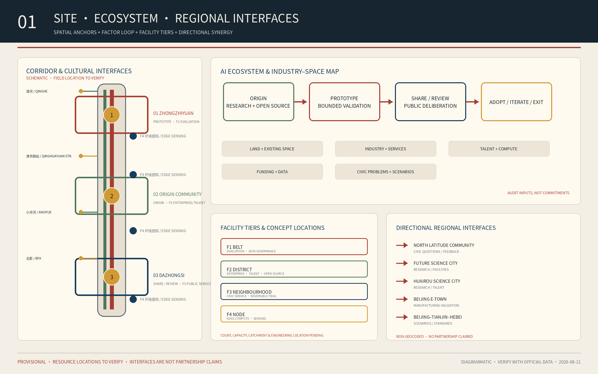
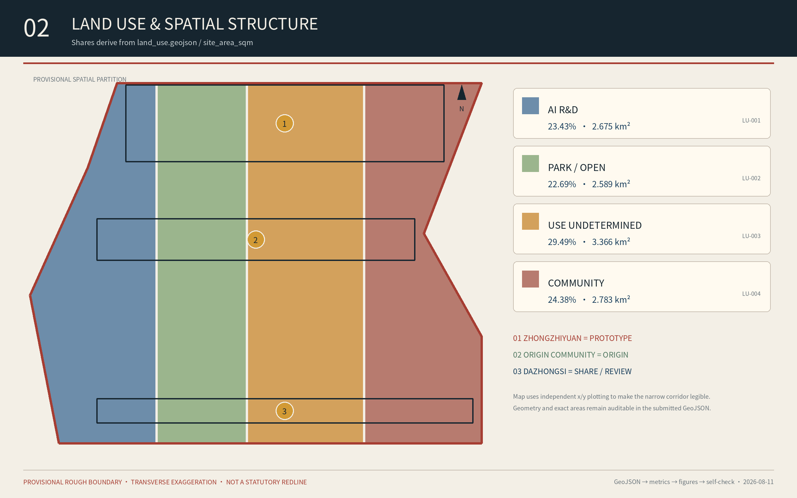
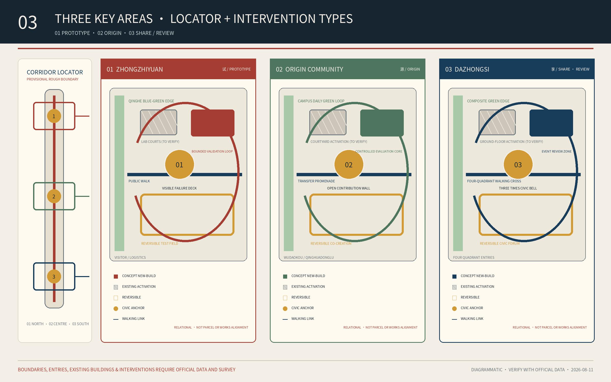
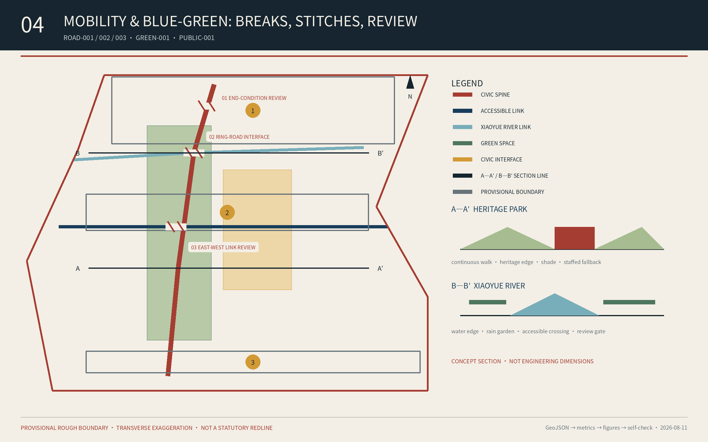
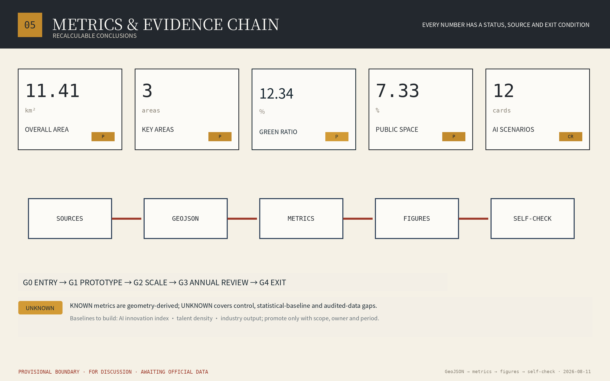

# Three Times, One Line — Jing-Zhang Civic AI Commons

> Use the century-old Jing-Zhang corridor as a civic framework in which research, industry, communities, and culture define problems, test technology, review outcomes, and share value, turning AI from a closed-campus supply into a common urban capability.

## Design Basis and Source List

The proposal is grounded in the official prequalification announcement, the agent taskbook, the public site package, and local snapshots of mandatory professional standards. Confirmed public scope figures are **official announced approximate references**: a 43.6 km² Coordinated Research Area, an approximately 11.4 km² Overall Design Area, and 368.4 ha across three key areas—Zhongzhiyuan 192.1 ha, Beijing AI Origin Community 104.3 ha, and Dazhongsi 72.0 ha. [source:OFFICIAL-ANNOUNCEMENT] [source:AGENT-TASKBOOK] [standard:PROJECT-OFFICIAL-ANNOUNCEMENT]

Exact official polygons, road redlines, parcels, buildings, ownership, municipal systems, and regulatory controls are not fully public. This package uses the repository's registered provisional geometry only for conceptual structure, visualisation, and review discussion. Routes, nodes, land-use partitions, and phasing are not statutory plans or implementation commitments and must be recalculated when official data becomes available. [source:BOUNDARY-SOURCE] [source:SOURCE-REGISTRY] [depth:risk_missing_data]

Six external cases are drawn only from official institutional or government pages: Station F, Takanawa Gateway City, MIT Kendall Square, 22@Barcelona, LaunchPad @ one-north, and Smart Kalasatama. They provide transferable mechanisms, not directly transferable scales or controls. [source:CASE-STATION-F] [source:CASE-TAKANAWA] [source:CASE-KALASATAMA]

## Three-Level Scope Framework

The **43.6 km² Coordinated Research Area** frames the innovation ecosystem and regional coordination; the **11.4 km² Overall Design Area** frames spatial structure, renewal, mobility, infrastructure, blue-green systems, and character; the **368.4 ha Key-Area Detailed Design Area** frames function, space, scenarios, and implementation in the three districts. All levels share one system: One Line, Three Commons, six types of Commons Stations, and a two-way loop. [standard:PROJECT-OFFICIAL-ANNOUNCEMENT] [depth:three_level_scope_framework] [metric:overall_design_area_sqm]

- **One Line**: a conceptual Civic Intelligence Spine composed of Jing-Zhang heritage, the heritage park, walking and cycling links, open ground floors, wayfinding, and operation. Continuity does not mean continuous construction.
- **Three Commons**: the AI Origin Community is the Origin, Zhongzhiyuan is the Prototype Commons, and Dazhongsi is the Share / Review interface. These are leading roles rather than exclusive land-use zones.
- **Six Commons Stations**: learning, mobility, care, climate, production, and culture/deliberation. A station combines space, service, and operation and can occupy an existing building, courtyard, street corner, or green space.
- **Two-way loop**: technology moves from research to prototype, bounded trial, independent review, and adoption or exit; needs move from civic problems to open calls, co-definition, research response, and use feedback.

The three times are civic time represented by Dazhongsi, engineering time embodied by the Jing-Zhang railway, and computational time represented by AI. One Line places the three districts on one research-validation-sharing track. Civic AI means shared judgement and action, not a landscape filled with devices. [source:AGENT-TASKBOOK] [depth:overall_spatial_structure]

## Official Task Framework: Three Positionings, Five Functions, Three Areas and Two Wings

The proposal explicitly adopts the taskbook's three positionings: the **Centennial Jing-Zhang Cultural Belt**, **Metropolitan AI Life Experience Belt**, and **AI Convergence Innovation Belt**. They are implemented through verifiable railway-cultural interpretation, public experiences that retain human access and exit, and a research-to-bounded-validation-to-adoption-or-exit loop rather than as promotional slogans. [source:AGENT-TASKBOOK] [standard:PROJECT-AGENT-OPEN-CALL-TASKBOOK]

The five official functions are translated into spatial and operating mechanisms. The **full-stack independent AI innovation system** is anchored by testing, validation, and safety governance at Zhongzhiyuan; the **world-class AI innovation ecosystem** by university, open-source, talent, and release networks at the Origin Community; the **AI+ scenario-empowerment paradigm** by twelve cross-district scenarios and the Xiaoyue River experience path; the **intelligent and vibrant AI city** by public service, mobility, blue-green, and night-use evidence; and **global discourse on AI governance** by published rules, independent review, appeal, exit, and bilingual communication. [source:AGENT-TASKBOOK] [depth:overall_spatial_structure]

Beyond the three areas, two wings connect resources and real situations to the same loop. The **Zhongguancun Technology Service Wing** links intellectual property, professional services, capital interfaces, and global collaboration without promising investment or policy. The **Xiaoyue River Scenario-Empowerment Wing** links waterfront public space, community needs, environmental sensing, and bounded trials without presenting conceptual alignments as engineering works. The wings feed inputs and real problems into the Origin–Prototype–Civic loop and return reviewed capabilities to enterprises and public life. [data:geometry/key_areas.geojson#PROV-KEY-001] [depth:three_level_scope_framework]

## Coordinated Research Area: Industry and Future City Research

The proposal treats a **validated urban scenario**, rather than a company or tower count, as the basic unit of the innovation ecosystem. A five-gate process structures the chain: publish the problem, co-design a prototype, conduct a bounded sandbox, commission independent review, then adopt, iterate, or exit. Universities, companies, communities, operators, and independent assessors have explicit roles at each gate. [source:AGENT-TASKBOOK] [standard:PROJECT-AGENT-OPEN-CALL-TASKBOOK] [depth:existing_conditions_diagnosis]

Station F and 22@ show how heritage can become innovation infrastructure while warning against displacement. Kendall Square and one-north show how research anchors, affordable modular space, and innovation-space quotas can protect early-stage teams. Takanawa and Smart Kalasatama show that urban testbeds require data governance, a long-lived intermediary, and an explicit path from pilot to operation. [source:CASE-STATION-F] [source:CASE-22BARCELONA] [source:CASE-KENDALL]

Five functions are proposed: research and open-source collaboration; testing, validation, and safety governance; technology transfer and enterprise services; talent life and public services; and cultural communication and international events. Fig.01 maps land, space, industry, funding, talent, compute, data, and scenarios as auditable inputs passing through Origin, Prototype, and Share / Review before results return to public life as adopt, iterate, or exit decisions; it does not claim secured funding, projects, or institutions. [source:CASE-ONE-NORTH] [source:CASE-TAKANAWA] [depth:overall_spatial_structure]

**Coordination with the official “Two Zones and One Belt” framework uses an interface ledger rather than invented boundaries.** Until its exact boundaries, authorities, and project list are supplied, the proposal defines only four auditable interfaces: university and research outputs entering Origin through open-source and evaluation; enterprise needs entering Zhongzhiyuan through validation; mature scenarios entering Dazhongsi and Xiaoyue River through civic review; and railway heritage, park, and cultural resources entering bilingual publication through content review. Each interface records inputs, accountable actor type, evidence, adoption or rejection reasons, and exit conditions. It does not imply an established inter-district authority or investment commitment. [source:OFFICIAL-ANNOUNCEMENT] [source:AGENT-TASKBOOK] [depth:three_level_scope_framework]

The requested planning indicators follow a define–baseline–target sequence. `ai_innovation_index` combines open-source contribution, independently reviewed scenarios, research-to-pilot conversion, and closed findings; `ai_talent_density_per_sqkm` requires a privacy-cleared talent definition and official denominator; `ai_industry_output_cny` requires audited data, sector scope, and de-duplication rules. All three remain `unknown`, with formulas, gaps, and dependencies recorded in `metrics.json`; no invented target substitutes for a missing baseline. [metric:ai_innovation_index] [metric:ai_talent_density_per_sqkm] [metric:ai_industry_output_cny]

The same interface ledger addresses the taskbook's named regional-synergy dimension: **North Latitude Community, Future Science City, Huairou Science City, Beijing E-Town, and Beijing–Tianjin–Hebei** respectively contribute community questions and feedback, authorised research and facility collaboration, manufacturing-validation needs, and cross-regional scenario or standards questions. Fig.01 maps only input–validation–return relationships; it invents no boundary and claims no existing partnership, funding, or policy arrangement. [source:AGENT-TASKBOOK] [depth:three_level_scope_framework]

The planning-indicator framework treats the brief's **AI innovation index, talent density, and industry output** as baselines to be built, not current achievements. `metrics.json` records all three as `unknown`: the innovation index awaits common weights, a scenario ledger, and independent review; talent density awaits a privacy-safe population definition and official denominator; output awaits audited enterprise data, an industry perimeter, and de-duplication rules. A value becomes known only when its baseline, definition, accountable owner, and reporting period are fixed. [metric:ai_innovation_index] [metric:ai_talent_density_per_sqkm] [metric:ai_industry_output_cny]

## Overall Design Area: Urban Renewal and Regulatory-Plan-Level Urban Design

The Jing-Zhang Railway Heritage Park and the conceptual Civic Intelligence Spine provide the main structure; the blue-green walking and cycling network provides the public base; the three key areas and distributed Commons Stations provide anchors. `land_use.geojson` remains a topologically closed conceptual partition within the provisional boundary and uses public land-use classifications. It tests the coexistence of innovation, open space, and daily life, but does not propose a statutory land-use amendment. [data:geometry/land_use.geojson#LU-001] [standard:MNR-LAND-USE-CLASSIFICATION-GUIDE] [depth:land_use_layout]

Renewal follows a low-regret order: improve shade, seating, accessibility, walking, open ground floors, and public services before digital systems; use existing space and reversible installations before durable construction; and define operation, maintenance, accountability, and exit before building. [standard:MOHURD-URBAN-DESIGN-MEASURES] [depth:renewal_project_list]

FAR, height, density, setbacks, road redlines, and utility capacities remain `unknown` until official regulatory and engineering data is available. Provisional geometric calculations are never represented as approved controls, and no parcel-level demolish-renovate-retain conclusion is made. [source:SITE-PACKAGE] [standard:MOHURD-CONTROL-DETAILED-PLANNING] [depth:development_intensity_controls]

The facility system has four levels: belt-wide shared evaluation and data governance; district enterprise and talent services; neighbourhood public services and reversible trials; and node-scale edge compute and environmental sensing. Fig.01 marks their conceptual locations as F1–F4: shared evaluation at Zhongzhiyuan, enterprise and talent services at Origin, civic services at Dazhongsi and neighbourhood interfaces, and environmental sensing along Xiaoyue River and public nodes. Quantities, capacities, catchments, and engineering locations remain pending until needs, road redlines, municipal capacity, and operators are confirmed. [source:OFFICIAL-ANNOUNCEMENT] [depth:municipal_new_infrastructure]

Facilities use a three-level standard: **public base, shared industry services, and scenario-specific controls**. The public base includes continuous accessibility, shade, lighting, wayfinding, emergency support, and staffed service. Shared services include compute interfaces, model evaluation, compliance advice, releases, and talent support. Scenario controls include bounded test areas, emergency stops, separation, data expiry, and exit facilities. Public-base functions cluster at transit and civic anchors; the Origin Community hosts open-source and evaluation; Zhongzhiyuan hosts observable testing; and Dazhongsi hosts demonstration, review, and transfer. Capacity and engineering locations remain subject to official data and specialist studies. [source:OFFICIAL-ANNOUNCEMENT] [depth:municipal_new_infrastructure]

The Beijing Municipal Forestry and Parks Bureau announced completion of the Heritage Park Phase II supporting works in July 2026, including a north–south connected and east–west linked fishbone walking network. The proposal therefore treats corridor continuity as an existing-condition baseline rather than an unbuilt vision. Its **condition-review ledger** checks the south and north ends, ring-road interfaces, station quadrants, and the Xiaoyue River connection for local safety, accessibility, ownership, and survey conditions before any supplemental link is proposed. Fig.04 uses the A—A′ and B—B′ sections and review points as a verification sequence, not approved landscape-project locations. [source:JINGZHANG-PARK-PHASE2] [data:geometry/roads.geojson#ROAD-003] [depth:traffic_rail_slow_parking]

## Detailed Design of Key Areas

The three key areas use one comparable anatomy: a civic anchor, a portfolio of scenarios, blue-green walking links, and operating gates. [data:geometry/key_areas.geojson#PROV-KEY-001] [depth:three_key_area_detailed_design] [metric:key_area_count]

Fig.03 makes the correspondence explicit through one provisional corridor locator and three enlarged conceptual studies: **01 Zhongzhiyuan=Prototype, 02 Origin Community=Origin, 03 Dazhongsi=Share / Review**. Each study distinguishes a civic anchor, primary walking link, blue-green edge, existing-space-first area, and bounded test or review zone. These are spatial-organisation diagrams, not official parcel renewal, building-scale, demolish-retain, or road-redline plans. [data:geometry/key_areas.geojson#PROV-KEY-001] [source:SITE-PACKAGE]

### Zhongzhiyuan AI Independent Innovation Acceleration Area: Prototype

Prototype Commons is proposed as a civic anchor for bounded embodied-AI, edge-device, drone-inspection, and safety-governance testing. It connects the Qinghe interface, shared laboratories, and observable test routes. Human-robot environments require speed limits, emergency stops, insurance, published test windows, and robot-free zones. The district presents testing, failure, and exit, not only finished products. [data:geometry/key_areas.geojson#PROV-KEY-001] [source:AGENT-TASKBOOK]

Its concept plan has four layers: Qinghe blue-green edge, validation loop, shared laboratory courts, and Visible Failure Deck. Public walking remains continuous outside; test routes loop internally and can close; logistics and visitors use separate entries. Missing building, green-space, water, and Fifth Ring surveys mean the diagram expresses relationships and gates, not development scale, works alignments, or retain–renovate–demolish decisions. [depth:three_key_area_detailed_design]

### Beijing AI Origin Community: Origin

Open Source Court is proposed as an interface among university research, open-source communities, releases, evaluation, talent services, and everyday life. Existing courtyards and ground floors can host shared tools, civic problem tables, and model-safety evaluation. Enterprise data remains in controlled environments and is destroyed at expiry. [data:geometry/key_areas.geojson#PROV-KEY-002] [source:CASE-KENDALL]

Its concept plan links campus interfaces, Open Source Court, a transfer promenade, and a daily-service loop. Walking connections toward Wudaokou and Qinghuadongluxikou come first; open ground floors connect display, evaluation, mentors, and talent services, while controlled data environments sit inside. Before ownership, fire, and traffic evidence is supplied, interventions remain low-disturbance and reversible. [depth:three_key_area_detailed_design]

### Dazhongsi AI Industry Cluster: Share / Review

Three Times Forum is proposed for civic review, cultural exhibitions, international demonstrations, and scenario transfer. Around the station and its four quadrants, priority is given to walking, wayfinding, public commercial interfaces, and event operations. Heritage-sensitive locations use existing-space activation or reversible intervention. [data:geometry/key_areas.geojson#PROV-KEY-003] [source:CASE-22BARCELONA]

Its concept plan combines a four-quadrant pedestrian cross, Three Times Forum, public commercial edges, and composite green-space use. The quadrants provide interfaces for continuous crossings, cycle parking, staffed service, and event dispersal, while the forum publishes adoption and stop decisions. Crossing type, station integration, and green-space facilities require transport, municipal, and park design development. [depth:three_key_area_detailed_design]

## AI Innovation Ecosystem, Personas, and AI+ Scenarios

Nine key personas are an older person living alone; a blind or wheelchair commuter; a small merchant; a school-age learner; a startup engineer; a frontline maintenance or property worker; an emergency responder; a data-governance officer; and an everyday visitor or runner. Every scenario specifies place, beneficiary, spatial requirements, operator type, data boundary, success signal, and rollback. [source:AGENT-TASKBOOK] [depth:risk_missing_data]

The six `scenarios` slugs in the front matter are taxonomy entries **defined by this submission**; the twelve rows below are place-, user-, and operation-specific scenario instances, four of which are industrial-validation scenarios. The two levels answer different questions—task category versus where, for whom, and under what operating boundary—and their counts are not interchangeable. [source:AGENT-TASKBOOK] [depth:risk_missing_data]

| # | Scenario and place | Type | Space and operation | Data boundary, success, and rollback |
| --- | --- | --- | --- | --- |
| 01 | Edge eldercare alert; neighbourhood | Public value | Voluntary enrolment, edge devices, community terminal | Raw media stays local; track response and false alerts; one-step opt-out and human follow-up |
| 02 | Multimodal accessible navigation; Origin–Dazhongsi | Public value | Continuous accessible path, audio beacons, physical signs, user-led audit | Route processing on device; track travel time and detours; human assistance remains available |
| 03 | SME operating copilot; Dazhongsi | Public value | Voluntary merchant terminal and public training | Merchant-owned and exportable data; fairness audit; no competitor surveillance |
| 04 | Heritage interpretation and inspection; heritage park | Public value | Traceable archive, AR triggers, approved inspection routes | No facial recognition; track early fault discovery and learning; peak-hour flight ban and expert review |
| 05 | Water quality and flood sensing; Xiaoyue River | Public value | Water and level sensors with graded alerts | Environmental data only; track warning lead time; paired calibration and human inspection |
| 06 | Embodied-robot open test commons; Zhongzhiyuan | **Industrial validation** | Bounded floors and hours, mixed-traffic signs, emergency stop, insurance | On-site retention and deletion; track safety tests and conflicts; immediate stop authority |
| 07 | Drone inspection sandbox; desktop simulation or approved closed test site | **Industrial validation** | Desktop simulation by default; temporary isolated flights and ground observation only after airspace, public-security/civil-aviation, heritage, and park-management approvals | Target-limited and masked imagery; track hazardous-work substitution; stop without every permit or when contested; no routine operation over the heritage park or waterfront |
| 08 | Domestic edge-device validation bed; Origin | **Industrial validation** | Open lab, anonymised mirrored loads, interoperability benchmark | Vendor isolation; track test cycle and report use; graded disclosure and appeal |
| 09 | Model safety and compliance evaluation; Origin | **Industrial validation** | Enclosed compute, red-team tools, compliance knowledge base | No model-weight retention, expiry deletion; track remediation closure; quarterly benchmark update |
| 10 | Transit crowd forecast and tidal guidance; Dazhongsi | Public value | Anonymous counts, variable signs, staffed guidance | No identity links, short raw retention; revert to staffed response if prediction fails |
| 11 | Inclusive adaptive lighting; Xiaoyue River | Public value | Presence lighting, shade, help points, conventional-lighting redundancy | Presence only; track night use and energy; conventional lighting remains when devices fail |
| 12 | Civic participation ledger; all three districts | Public value | Online/offline deliberation and a public adopted–rejected–reason list | Minimal records, anonymity, non-tradable points; return to in-person deliberation if platform fails |

The four industrial-validation scenarios gate entry into public-value pilots. Technology that has not passed safety, compliance, interoperability, and civic-value review does not enter live space. When a public service exits, its non-digital or human channel cannot be removed at the same time. [source:CASE-KALASATAMA] [source:AGENT-TASKBOOK]

## Land Use, Building Scale, and Retain-Renovate-Demolish Strategy

The conceptual land-use structure includes AI research and innovation, parks and open space, use-undetermined reserve land, and community support. LU-003 uses code 16 because its formal use is not yet established; industry and commercial services remain programme directions for later control-plan and needs review. The topology closes within the provisional boundary to test coexistence, not to establish statutory land use. [data:geometry/land_use.geojson#LU-001] [metric:site_area_sqm] [depth:land_use_layout]

Retain-renovate-demolish decisions require three steps: confirm ownership, structure, heritage, and fire conditions; compare retention, adaptation, and renewal by public value, carbon, and fit; then establish parcel conclusions. The building layer is a conceptual demonstration footprint only. Total floor area, intensity, and height await official data. [data:geometry/buildings.geojson#BLDG-001] [metric:building_footprint_area_sqm] [depth:retain_renovate_demolish]

**Visible building and renewal evidence.** `buildings.geojson` contains only one conceptual new-build demonstration base, BLDG-001. Fig.03 separately uses diagram symbols for existing-space-first activation, reversible intervention, and a conceptual new-build test area; these are method zones, not surveyed buildings or parcel geometry. They show the low-disturbance comparison sequence without confirming that any building will be retained, adapted, or demolished. Parcel conclusions await structure, ownership, heritage, and fire evidence and professional review. [data:geometry/buildings.geojson#BLDG-001] [source:SITE-PACKAGE] [depth:risk_missing_data]

Station F, Kendall Square, and one-north support reusing large-span heritage space, parking, or inactive ground floors for shared labs, events, early-stage teams, and daily services. Affordable-space and public-access clauses are needed so innovation does not only produce higher rents. [source:CASE-STATION-F] [source:CASE-KENDALL] [source:CASE-ONE-NORTH]

## Transport, Rail, Municipal Infrastructure, and Public Services

Mobility follows "walk first, connect second, digitise third": use the Phase II north–south and east–west walking network as the baseline; review the Heritage Park–Xiaoyue River interface and four-quadrant station access; then supplement accessible routes and cycle parking before adding anonymous counts, explainable navigation, and event guidance. Supplemental alignments remain subject to road redlines, traffic studies, and surveys. [data:geometry/roads.geojson#ROAD-001] [data:geometry/roads.geojson#ROAD-003] [depth:traffic_rail_slow_parking]

New Infrastructure adopts a distributed "telegraph-pole rhythm": edge compute, data interfaces, energy, and environmental sensing appear only behind a defined use case and accountable operator. Every facility registers purpose, data boundary, responsibility, human intervention, and expiry. No lawful data, operator, or exit means no start. [source:CASE-TAKANAWA] [depth:municipal_new_infrastructure]

Facility admission requires five conditions together: real users with a non-digital alternative; lawful minimum data; an accountable actor who can attend; energy, network, and maintenance capacity; and shutdown/removal paths. Belt-wide facilities are shared first, district facilities avoid duplication, and neighbourhood/node facilities begin as reversible trials. Formal catchments, quantities, and capacities await baseline surveys and specialist plans. [standard:MOHURD-CONTROL-DETAILED-PLANNING] [depth:municipal_new_infrastructure]

Public services prioritise ageing and children, accessibility, talent life, small merchants, and frontline workers. AI may augment service but cannot replace planning approval, medical diagnosis, emergency command, or civic decisions. [standard:MOHURD-CONTROL-DETAILED-PLANNING] [depth:risk_missing_data]

## Blue-Green Network, Public Space, and Urban Character

The heritage park and Xiaoyue River form a public blue-green base connecting the three key areas through walking loops, cycling links, shade, rain gardens, cooling stations, and civic anchors. A break must be documented before a stitching proposal is made. Sections are conceptual diagrams, not approved engineering dimensions. [data:geometry/green_space.geojson#GREEN-001] [data:geometry/public_space.geojson#PUBLIC-001] [depth:blue_green_public_space]

Spatial review identifies three interface types for field verification on the existing connected network: actual continuity quality at the north and south ends, safe and accessible conditions around ring-road structures, and east–west access from universities, campuses, and communities to the park and Xiaoyue River. The landmark sequence is Visible Failure Deck in the north, Open Contribution Wall in the middle, and Three Times Civic Bell in the south. Fig.01 uses schematic “field location to verify” markers for Qinghuayuan Station, Qinghe, Xiaoyue River, and the Beijing Film Academy cultural interface so each enters a verified-history–spatial-marker–bilingual-content–public-correction workflow; generated graphics never replace heritage survey. [source:JINGZHANG-PARK-PHASE2] [depth:traffic_rail_slow_parking]

Landmarks are three civic anchors plus distributed "Centennial Marks", not isolated megastructures. Seating, wayfinding, shade, and information record verified history, the problem under test, data boundaries, accountability, feedback, and project stage. The landmark becomes readable civic governance. [source:AGENT-TASKBOOK] [standard:MOHURD-URBAN-DESIGN-MEASURES]

The identity uses the switchback chevron, railway sleepers, archival paper, brick red, indigo, and amber evidence chips. It excludes cyber-neon, invented heritage, and company branding. Historical evidence, oral history, and AI-generated content are separately labelled. [source:OFFICIAL-ANNOUNCEMENT] [depth:height_massing_character]

The cultural-resource register begins with resources explicitly named by the brief: **Qinghuayuan Railway Station, Jing-Zhang railway history, Beijing Film Academy art resources, and the Qinghe and Xiaoyue River blue-green systems**. They support engineering archives and wayfinding, railway time marks, film and public-art co-production, and ecological observation and waterfront learning. Every item requires source, date, rights, and professional review before entering signs, exhibitions, or AI interpretation; unverified stories, images, or generated content never enter the historical-fact layer. [source:OFFICIAL-ANNOUNCEMENT] [depth:height_massing_character]

### Three AI Pilgrimage Landmarks and the Honour-Display System

The three landmarks are reversible civic interfaces rather than megastructures. Zhongzhiyuan's **Visible Failure Deck** publishes test conditions, incidents, and exits; the Origin Community's **Open Contribution Wall** credits verifiable code, data, methods, and contributors; Dazhongsi's **Three Times Civic Bell** juxtaposes verified Jing-Zhang history, current public questions, and the annual adopted–stopped ledger. Honour displays use four fields—problem, contribution, evidence, and civic outcome—rather than finance, traffic, or implied government endorsement. People and institutions can correct records or withdraw sensitive information, and AI-generated material is explicitly labelled. [source:AGENT-TASKBOOK] [depth:blue_green_public_space]

### Public-Space Component Library and Cultural Communication

The component library contains Centennial Mark seating, visual and tactile wayfinding, shade and rain cover, movable co-design tables, trial-boundary markers, data-purpose plaques, staffed service desks, and non-digital entrances. Components share brick red, indigo, amber, and the switchback motif while adapting material and duration to heritage, neighbourhood, test, and waterfront settings. The narrative joins Jing-Zhang's engineering service and open connection, Zhongguancun's problem-led and collaborative experimentation, and an AI culture that is verifiable, appealable, and stoppable. Its international line is: **A century of infrastructure becomes a century of civic intelligence**, without presenting the concept as approved or built. [source:OFFICIAL-ANNOUNCEMENT] [source:AGENT-TASKBOOK] [depth:height_massing_character]

## Coverage Index of the Six Agent Tasks

The mapping between the taskbook's six agent tasks and this proposal is listed below for fast review; detailed mechanisms appear in the chapters and in `compliance_matrix.json`. [source:AGENT-TASKBOOK] [standard:PROJECT-AGENT-OPEN-CALL-TASKBOOK]

| Task | Covered in |
| --- | --- |
| agent.1 Overall concept and functional coordination | The "Three Times, One Line" name in Chinese and English, the visual identity direction, "Three-Level Scope Framework", "Official Task Framework: Three Positionings, Five Functions, Three Areas and Two Wings", and Fig.01-02 |
| agent.2 Full-stack independent AI innovation and world-class ecosystem | Six official case mechanisms, the five-gate innovation chain, Zhongzhiyuan full-stack validation, the Origin Community ecosystem, and the two-wing support mechanisms |
| agent.3 AI+ scenario empowerment and a lively intelligent city | Twelve scenario cards including four industrial-validation scenarios, nine personas, the scenario-space-operation mapping, privacy and human-review boundaries, and the Xiaoyue River public experience path |
| agent.4 AI public space, intelligent-native business, and pilgrimage landmarks | Heritage-park public space with east-west stitching and north-south connection concepts, Dazhongsi civic-review and transfer scenarios, the three pilgrimage nodes, the honor display system, and the component library |
| agent.5 Cultural fusion narrative | The culture chapter: Jing-Zhang historical resources, Zhongguancun innovation culture, the spatial culture system, signage direction, and international communication copy |
| agent.6 Event system and long-term operation | The 1+2+4+12+365 annual system, brand and communication visual direction, developer-community and open-scenario operating mechanisms, and talent and conversion pathways |

## Self-Check Status and Material Boundary Statement

Local self-checks are complete: `self_check.json` records deterministic validation, spatial review, visual review, and professional-evidence review as passed, and the package is marked ready for formal review. One known reservation remains: the site boundary and the three key areas use the repository's registered provisional geometry, logged by the self-check as a minor notice that does not block content scoring; all layers must be replaced and metrics recalculated when official geometry arrives. Every spatial statement in this proposal is a conceptual recommendation or reference scheme for professional teams to develop further. It does not replace statutory planning, does not constitute a government approval conclusion, and contains no statutory judgements on FAR, building height, demolition-retention, road redlines, or engineering feasibility. [source:AGENT-TASKBOOK] [source:SITE-PACKAGE] [depth:risk_missing_data]

## Renewal Projects, Implementation Policy, and Phasing

Implementation follows small validation, evidence-based expansion, rolling renewal, and exit when performance fails. [data:geometry/phasing.geojson#PHASE-001] [depth:phasing_implementation]

| Bundle | Years 0–2 | Years 3–5 | Years 6–10 | Gate |
| --- | --- | --- | --- | --- |
| Governance and data | Project register, data catalogue, risk ledger, civic channel | Standard contracts, interfaces, independent review | Revise governance and retire closed systems | No ownership, authority, operation, or lawful data means no start |
| Civic anchors | Existing space and reversible installations | Durable works only for proven high-use spaces | Adapt or exit as demand changes | No long-term operating funds means no permanent build |
| Open scenarios | Publish needs and test 3–5 bounded prototypes | Passed pilots enter procurement, R&D, or partnership | Maintain technology exit and substitutes | No real users or lawful data means stop |
| Blue-green mobility | Audit breaks, shade, seating, accessibility | Connect after survey and review | Renew facilities and maintenance | Public interest, safety, and ecology gate expansion |
| Community and talent | Portal, docs, mentors, service desk | Residency, courses, internships, project evaluation | Alumni return and talent ladder | Registration without contribution triggers redesign |
| Events and communication | 1+2+4+12 calendar and bilingual library | International online nodes and conversion | Stable identity and partnerships | Two cycles without project conversion trigger downgrade |

The annual system is 1+2+4+12+365: one flagship event, two scenario weeks, four quarterly portfolio reviews and open days, twelve developer or talent events, and a year-round problem library and bilingual platform. The annual report names adopted, changed, and stopped projects, not only successes. [source:CASE-KALASATAMA] [source:CASE-ONE-NORTH]

The conceptual governance system comprises a public coordinating actor, project office, professional operators, scenario owners, ecosystem partners, and independent assurance. Each project has one accountable actor type, with construction and long-term operation identified together. Commercial partnership cannot replace public decision or statutory process. [depth:renewal_project_list]

## Metrics, Area Recalculation, and Compliance Matrix

`metrics.json` separates known values recalculated from submitted geometry from unknown values dependent on official controls, engineering, or operating baselines. The provisional submitted overall area is approximately 11.41 km² and the key-area count is three. Green and public-space ratios describe the submitted conceptual layers, not official planning controls. [metric:site_area_sqm] [metric:green_ratio] [metric:public_space_ratio]

The latest persisted package status is **formal-review-ready**: deterministic validation, spatial review, visual packaging, and professional evidence all report **PASS**. The retained warning is that the overall and three key-area boundaries remain provisional geometry because organizer-owned precision data is unavailable. The warning does not remove content-review eligibility and must never be omitted or promoted into an official redline. [source:SITE-PACKAGE] [depth:risk_missing_data]

Conceptual performance directions include at least twelve initial scenarios; a non-digital or human fallback for every public-service scenario; published purpose, data boundary, accountability, and expiry for every deployment; at least two public reviews per scenario; and preference for existing-space activation or reversible intervention. These require baseline calibration and are not stored as known metrics. [source:AGENT-TASKBOOK] [depth:metrics_recalculation]

`compliance_matrix.json` covers announcement items 1.3, 1.4, 1.5 and agent.1–agent.6; `standard_matrix.json` covers all mandatory standards; `design_depth_matrix.json` covers diagnosis, scope, structure, land use, buildings, transport, infrastructure, blue-green systems, key areas, projects, phasing, recalculation, and risk. [standard:PROJECT-AGENT-OPEN-CALL-TASKBOOK] [depth:metrics_recalculation]

## Risk, Copyright, and Compliance

Primary controls are: do not locate precisely without exact geometry; use only verified heritage evidence; do not place AI infrastructure ahead of basic public improvements; minimise data and avoid identity by default; share tools and evaluation to prevent duplication; do not deploy without operating funds; retain non-digital access; assess rent, displacement, and local-business impacts; and assess map-review or approval-number obligations before publishing map-like graphics. [source:SOURCE-REGISTRY] [depth:risk_missing_data]

Immediate suspension triggers include a major safety, privacy, or rights event; unlawful or undeletable data; two consecutive review cycles below core goals; construction without an operator or maintenance funds; or a material partner conflict or compliance failure. Exit closes accounts and interfaces, deletes or returns data, disposes of assets, migrates users, and archives learning. [source:CASE-KALASATAMA] [standard:MOHURD-URBAN-DESIGN-MEASURES]

This package does not claim official approval, statutory controls, final ownership, final investment, or institutional commitments. Figures are redrawn from this package's GeoJSON and metrics using open Noto/DejaVu fonts. No remote image, map tile, company trademark, portrait, or restricted asset is used. See `report/copyright_statement.md`. [source:SITE-PACKAGE] [depth:risk_missing_data]

## References

- Beijing Municipal Commission of Planning and Natural Resources, Haidian Branch: official prequalification announcement. [source:OFFICIAL-ANNOUNCEMENT]
- Centennial Jing-Zhang AI Innovation Belt agent taskbook and public site package. [source:AGENT-TASKBOOK] [source:SITE-PACKAGE]
- Official case pages for Station F, Takanawa Gateway City, MIT Kendall Square, 22@Barcelona, LaunchPad @ one-north, and Smart Kalasatama. [source:CASE-STATION-F] [source:CASE-TAKANAWA] [source:CASE-KENDALL]
- Complete machine-readable sources, licensing, and usage are in `sources.json`; professional standards are in `standard_matrix.json`.
