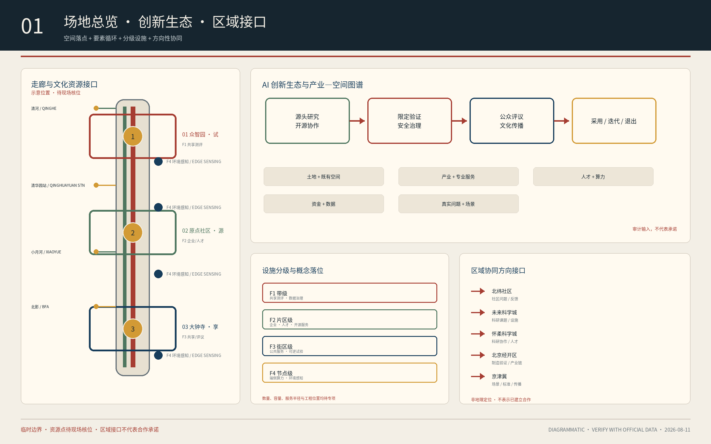
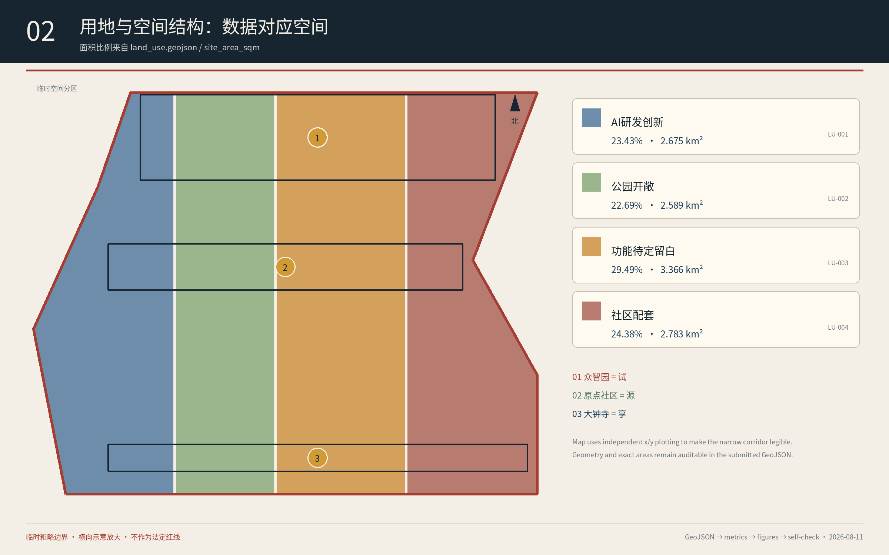
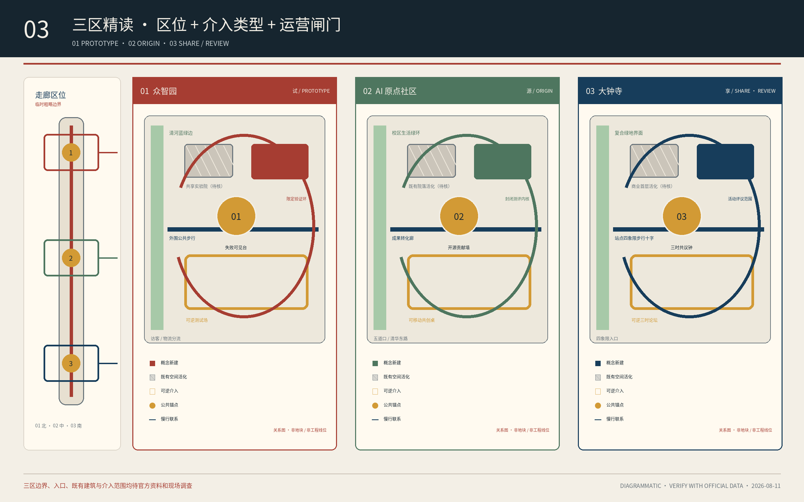
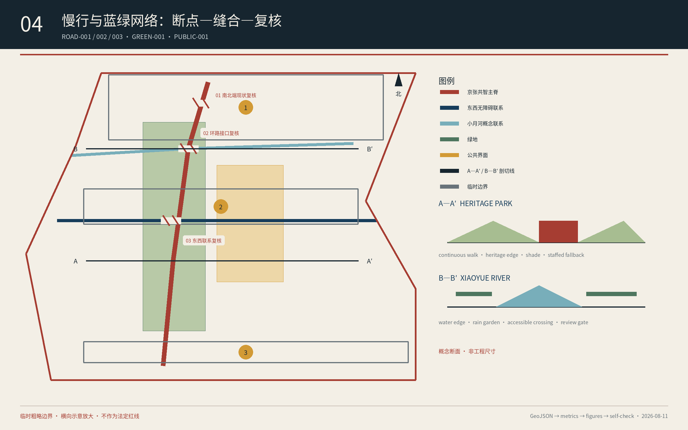
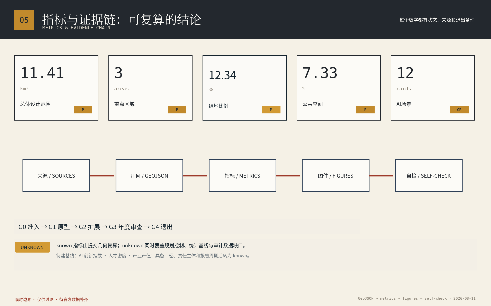

# 三时共轨·京张共智带

**THREE TIMES, ONE LINE — Jing-Zhang Civic AI Commons**

> 以百年京张为公共骨架，使科研、产业、社区与文化共同定义问题、试验技术、评估结果并分享收益，让 AI 从封闭园区中的技术供给转化为城市共同能力。

## 设计依据与资料清单

方案以官方资格预审公告、面向智能体任务书、场地包与专业标准本地快照为主要依据。官方公开且可确认的空间数字均为**公告参考约数**：统筹研究范围约 43.6 km²、总体设计范围约 11.4 km²、三处重点区域合计 368.4 ha，其中众智园 192.1 ha、北京 AI 原点社区 104.3 ha、大钟寺 72.0 ha。[source:OFFICIAL-ANNOUNCEMENT] [source:AGENT-TASKBOOK] [standard:PROJECT-OFFICIAL-ANNOUNCEMENT]

官方精确边界、道路红线、现状地块、建筑、权属、市政和控规指标尚未完整公开。本包沿用仓库登记的临时粗略边界，仅用于概念结构、图件生成和审查讨论；所有路线、节点、用地和分期均不构成法定规划或实施承诺。正式数据到位后需替换所有相关图层并复算指标。[source:BOUNDARY-SOURCE] [source:SOURCE-REGISTRY] [depth:risk_missing_data]

方案外部案例只采用机构、政府或项目官方页面：Station F 的铁路货站再利用、高轮网关城的都市 OS、MIT Kendall Square 的研究机构主导更新、22@Barcelona 的创新区与城市实验室、one-north 的模块化创业空间、Smart Kalasatama 的敏捷试点。它们提供机制，不提供可直接复制的规模和控制指标。[source:CASE-STATION-F] [source:CASE-TAKANAWA] [source:CASE-KALASATAMA]

## 三层范围工作框架

**统筹研究范围 43.6 km²**回答创新生态与区域协同；**总体设计范围 11.4 km²**回答空间结构、更新、交通、市政、蓝绿与风貌；**重点区域 368.4 ha**回答三处片区的功能、空间、场景与实施。三层工作共同使用“一轨、三场、六类共智站、双向循环”骨架。[standard:PROJECT-OFFICIAL-ANNOUNCEMENT] [depth:three_level_scope_framework] [metric:overall_design_area_sqm]

- **一轨**：以京张历史线索、遗址公园、慢行网络和创新界面组织概念性“共智主脊”。连续性来自路径、开放首层、导视与运营，不等于连续建设。
- **三场**：AI 原点社区为“源”，众智园为“试”，大钟寺为“享”。三区是主导分工，不是排他性功能分区。
- **六类共智站**：学习、移动、照护、气候、生产、文化/协商。每个“站”是空间、服务和运营组合，可嵌入既有建筑、院落、街角和绿地。
- **双向循环**：技术由研究进入原型、限定试验、独立评估，再扩散或退出；需求由社区问题进入公开征集、共同定义、科研响应和使用反馈。

“三时”把大钟寺所代表的文明时间、京张铁路承载的工程时间、AI 代表的计算时间共同放入公共生活；“共轨”表示三区进入同一条研发—验证—共享轨道；“共智”强调建设共同判断与行动能力，而非堆叠设备。[source:AGENT-TASKBOOK] [depth:overall_spatial_structure]

## 官方任务框架：三大定位、五大功能与三区两翼

方案明确响应任务书的三大定位：**百年京张文化带、都市 AI 生活体验带、AI 融合创新带**。三者分别以可核实的铁路文化叙事、可退出且保留人工入口的公共体验、以及从研究到限定验证再到采用或退出的创新闭环落地，不把定位简化为宣传口号。[source:AGENT-TASKBOOK] [standard:PROJECT-AGENT-OPEN-CALL-TASKBOOK]

五大功能采用任务书原名并转译为空间与运营机制：**AI 全栈自主创新体系**由众智园的测试验证与安全治理承载；**世界级 AI 创新生态**由原点社区的高校、开源、人才与成果发布网络承载；**AI+场景赋能新范式**由跨三区的十二个场景和小月河公共体验路径承载；**智能化 AI 活力城市**由公共服务、慢行、蓝绿和夜间使用共同检验；**AI 治理全球话语权**由公开规则、第三方评估、申诉、退出与双语传播形成。[source:AGENT-TASKBOOK] [depth:overall_spatial_structure]

三区之外，两翼负责把资源和场景接入同一循环：**中关村科技服务翼**连接知识产权、专业服务、资本对接与全球协作，但不预设投资或政策承诺；**小月河场景赋能翼**连接水岸公共空间、社区需求、环境感知和限定试验，但不把概念线位表述为工程方案。两翼分别把“要素”与“真实问题”送入源—试—享循环，再把经评估的能力返回企业与公共生活。[data:geometry/key_areas.geojson#PROV-KEY-001] [depth:three_level_scope_framework]

## 统筹研究范围产业与未来城市研究

方案把**经过验证的城市场景**而非企业数量或塔楼数量作为创新生态基本单位。创新链由“问题公开—共创原型—限定沙盒—独立评估—采用、迭代或退出”五道门组织；高校、企业、社区、运营机构和第三方评估者在每道门承担清晰角色。[source:AGENT-TASKBOOK] [standard:PROJECT-AGENT-OPEN-CALL-TASKBOOK] [depth:existing_conditions_diagnosis]

六个国际案例形成三组机制对照：Station F 与 22@ 说明遗产可以成为创新载体但必须防止空间排斥；Kendall Square 与 one-north 说明研究机构、低成本空间和创新空间配额可保护早期团队；高轮网关城与 Smart Kalasatama 说明真实城市试验需要数据治理、中介组织和试点转化机制。[source:CASE-STATION-F] [source:CASE-22BARCELONA] [source:CASE-KENDALL]

建议形成五类功能：源头研究与开源协作、测试验证与安全治理、成果转化与企业服务、人才生活与公共服务、文化传播与国际活动。图 01 的生态图谱把土地、空间、产业、资金、人才、算力、数据和场景作为可审计输入，依次进入原点社区“源”、众智园“试”和大钟寺“享”，再以采用、迭代或退出结果返回公共生活；它不代表已落实的资金、项目或组织承诺。[source:CASE-ONE-NORTH] [source:CASE-TAKANAWA] [depth:overall_spatial_structure]

**“两区一带”协同采用接口台账而非虚构新边界。**在正式“两区一带”空间边界、组织权限和项目清单补齐前，本方案只定义四类可核验接口：高校与科研成果进入原点社区的开源/测评接口，企业需求进入众智园的验证接口，成熟场景进入大钟寺和小月河的公众评议接口，以及京张遗产、公园和文化资源进入双语传播的内容审查接口。每个接口记录输入、责任主体类型、证据、采用/拒绝理由和退出条件；不得据此声称已建立跨区行政协调或投资安排。[source:OFFICIAL-ANNOUNCEMENT] [source:AGENT-TASKBOOK] [depth:three_level_scope_framework]

任务书要求的规划指标采用“先定义、后基线、再定目标”框架。`ai_innovation_index` 由开源贡献、通过独立复核的场景、研究到试点转化和关闭问题组成；`ai_talent_density_per_sqkm` 需要隐私合规的人才口径与正式分母边界；`ai_industry_output_cny` 需要审计数据、产业范围和去重规则。三项当前均为 `unknown`，在 `metrics.json` 中记录公式、缺口和依赖，不以虚构目标值替代基线。[metric:ai_innovation_index] [metric:ai_talent_density_per_sqkm] [metric:ai_industry_output_cny]

区域协同采用同一接口台账连接任务书点名的**北纬社区、未来科学城、怀柔科学城、经开区与京津冀**：北纬社区提供社区问题与使用反馈，未来科学城和怀柔科学城提供经授权的科研课题与设施协作，经开区提供制造验证需求，京津冀提供跨区域场景与标准互认议题。图 01 只画输入—验证—返回关系，不画未经发布的边界，也不声称已成立合作、资金或政策安排。[source:AGENT-TASKBOOK] [depth:three_level_scope_framework]

规划指标框架把任务书提出的 **AI 创新指数、人才密度、产值规模**作为待建基线，而非当前成果数字。`metrics.json` 将三项均登记为 `unknown`：创新指数等待统一权重、场景台账与第三方复核；人才密度等待隐私合规的人才口径和官方分母；产值规模等待经审计企业数据、行业边界与去重规则。三项只在基线、口径、责任主体和报告周期齐备后转为 known。[metric:ai_innovation_index] [metric:ai_talent_density_per_sqkm] [metric:ai_industry_output_cny]

## 总体设计范围城市更新与控规深度城市设计

总体结构以京张遗址公园及概念性共智主脊为骨架，以蓝绿慢行网络为公共底盘，以三处重点区域和分布式共智站为节点。现有 `land_use.geojson` 在临时边界内保持拓扑闭合，用地分类按公开国土空间分类指南表达；比例仅代表概念性设计分区，不替代法定用地。[data:geometry/land_use.geojson#LU-001] [standard:MNR-LAND-USE-CLASSIFICATION-GUIDE] [depth:land_use_layout]

更新优先级为：先改善遮阴、座椅、无障碍、慢行、开放首层和公共服务，再配置数字设施；先使用既有空间和可逆设施，再依据使用证据决定耐久化改造；先明确运营、维护和退出，再进入建设。[standard:MOHURD-URBAN-DESIGN-MEASURES] [depth:renewal_project_list]

容积率、建筑高度、密度、退线、道路红线和市政容量均为 `unknown`，必须在正式控规和工程条件到位后确认。方案不将临时几何复算值升级为审定指标，也不对拆改留作地块级结论。[source:SITE-PACKAGE] [standard:MOHURD-CONTROL-DETAILED-PLANNING] [depth:development_intensity_controls]

设施体系分为四级：带级共享测评与数据治理设施、片区级企业/人才综合服务设施、街区级公共服务与可逆试验设施、节点级端侧算力和环境感知设施。图 01 以 F1—F4 标记其概念落位：F1 对应众智园共享测评，F2 对应原点社区企业/人才服务，F3 对应大钟寺与社区公共服务，F4 沿小月河和公共节点布置环境感知；数量、容量、服务半径和工程位置在需求调查、道路红线、市政容量与运维主体确认前保持待定。[source:OFFICIAL-ANNOUNCEMENT] [depth:municipal_new_infrastructure]

设施体系采用“公共底座—产业共用—场景专用”三级标准：公共底座包含连续无障碍、遮阴、照明、导视、应急与人工服务；产业共用层包含共享算力接口、模型测评、合规咨询、成果发布和人才服务；场景专用层包含限定测试区、急停、隔离、数据到期与退出设施。空间布局原则为轨道站点和公共锚点优先公共底座，原点社区布置开源与测评，众智园布置可观察测试，大钟寺布置展示、评议和转化；具体容量与工程位置待正式资料和专项论证。[source:OFFICIAL-ANNOUNCEMENT] [depth:municipal_new_infrastructure]

北京市园林绿化局已于 2026 年 7 月公告京张铁路遗址公共空间二期配套项目完工，并明确形成南北联通、东西联动的鱼骨状慢行网络。因此本方案不再把走廊整体贯通当作待建愿景，而是在已建公共空间基础上建立“现状复核台账”，核对南北端、环路接口、轨道站点四象限和小月河横向联系的微观安全、无障碍与权属条件；只有现场测绘、交通和无障碍审查通过后，才把概念连线转为补强方案。图 04 的 A—A′、B—B′断面和复核点仅表达核查顺序，不代表已确定景观工程位置。[source:JINGZHANG-PARK-PHASE2] [data:geometry/roads.geojson#ROAD-003] [depth:traffic_rail_slow_parking]

## 重点区域详细设计

三处重点区域共用同一“公共锚点—场景组合—蓝绿慢行—运营闸门”解剖方法，形成可比较但不同质的设计。[data:geometry/key_areas.geojson#PROV-KEY-001] [depth:three_key_area_detailed_design] [metric:key_area_count]

图 03 以一张临时走廊区位图和三张放大的概念性精读图明确对应关系：**01 众智园=试、02 原点社区=源、03 大钟寺=享**。每张精读图都区分公共锚点、主要慢行联系、蓝绿界面、既有空间优先利用和限定测试/评议范围；这些图只表达空间组织语法，不替代更新地块、建筑规模、拆改留或道路红线的正式设计。[data:geometry/key_areas.geojson#PROV-KEY-001] [source:SITE-PACKAGE]

### 众智园 AI 自主创新加速区：试

建议以“共试场 Prototype Commons”为公共锚点，组织具身智能、边缘设备、低空巡检与安全治理的限定测试。空间上优先连接清河界面、共享实验空间和可观察的测试路线；人机混行区域设置限速、急停、责任保险、公开时段和无机器人区。这里展示测试过程、失败和退出，不只展示成品。[data:geometry/key_areas.geojson#PROV-KEY-001] [source:AGENT-TASKBOOK]

概念平面采用“清河蓝绿边—验证环—共享实验院—失败可见台”四层结构：外围公共步行连续，试验路线在内部成环并可封闭，物流与访客入口分离。现状建筑、绿地、水系和五环接口缺正式测绘，因此图中只表达关系和闸门，不表达建筑规模、工程线位或拆改留结论。[depth:three_key_area_detailed_design]

### 北京 AI 原点社区：源

建议以“开源院 Open Source Court”为公共锚点，把高校源头创新、开源社区、成果发布、测评、人才服务和近校生活缝合。优先利用既有院落和首层形成共享工具平台、城市问题共创桌和模型安全测评空间；任何企业数据在封闭环境运行并到期销毁。[data:geometry/key_areas.geojson#PROV-KEY-002] [source:CASE-KENDALL]

概念平面采用“校区接口—开源院—成果转化廊—生活服务环”：五道口与清华东路西口方向的慢行联系优先，开放首层串联展示、测评、导师和人才服务，封闭数据环境退至内部。建筑权属、消防和交通资料补齐前只提出低扰动、可逆介入顺序。[depth:three_key_area_detailed_design]

### 大钟寺 AI 产业聚集区：享

建议以“三时论坛 Three Times Forum”为公共锚点，承担公共评议、文化展览、国际路演和场景成果转化。围绕轨道站点与四象限步行联系，优先改善人行、导视、商业公共界面和事件组织；涉及遗产敏感空间时采用既有空间活化或可逆介入。[data:geometry/key_areas.geojson#PROV-KEY-003] [source:CASE-22BARCELONA]

概念平面采用“站点四象限步行十字—三时论坛—商业公共界面—绿地复合使用”结构：四个象限分别设置连续过街、非机动车停放、人工服务和活动集散接口，论坛承担采用/停止清单的公开评议。具体过街方式、站城一体化和绿地复合设施须由交通、市政与公园专业深化。[depth:three_key_area_detailed_design]

## AI 创新生态、人才画像与 AI+ 场景

九类核心画像包括独居老人、视障及轮椅通勤者、小微商户、中学生与研学群体、初创工程师、一线养护与物业人员、应急响应员、数据治理与合规人员、普通游客与夜跑者。每个场景都定义地点、受益人、空间、运营者类型、数据边界、成功指标和回退机制。[source:AGENT-TASKBOOK] [depth:risk_missing_data]

文件头的 6 个 `scenarios` slug 是**本提交定义的**场景类别索引；下表 12 行是落到具体空间、用户和运营边界的场景实例，其中 4 个标为产业验证。两者分别回答“属于哪类任务”和“在哪里、为谁、如何运行”，数量不可互相替代。[source:AGENT-TASKBOOK] [depth:risk_missing_data]

| # | 场景与地点 | 类型 | 空间与运营 | 数据边界、指标与回退 |
| --- | --- | --- | --- | --- |
| 01 | 独居老人边缘预警；社区 | 公共价值 | 自愿签约，户内或楼道边缘设备，社区服务终端 | 原始音视频不出户；关注响应时间和误报；可一键退出并保留人工回访 |
| 02 | 多模态无障碍导航；原点—大钟寺 | 公共价值 | 连续无障碍路径、听觉信标、实体导视，公益组织共同验收 | 轨迹端侧处理；关注通行时长与绕行；导航失效时人工服务并行 |
| 03 | 小微商户经营助手；大钟寺 | 公共价值 | 商户自愿使用的轻量终端和公共培训 | 数据归商户并可导出；审计公平性；不得用于竞品监控 |
| 04 | 遗产解说与结构巡检；遗址公园 | 公共价值 | 可溯源数字档案、AR 触发点、经审查的巡检路线 | 不做人脸识别；关注病害发现和研学参与；高峰禁飞、内容双审 |
| 05 | 水质与汛情监测；小月河 | 公共价值 | 水质、水位传感与分级警示 | 仅环境数据；关注预警提前量；双传感互校并保留人工巡检 |
| 06 | 具身机器人开放测试场；众智园 | **产业验证** | 限定楼层和时段、人机混行标识、急停与保险 | 场内留存并定期清除；关注安全测试与冲突；可随时叫停 |
| 07 | 低空巡检沙盒；桌面仿真/经批准封闭试验场 | **产业验证** | 默认桌面仿真；仅在空域、公安/民航、文保/公园管理等审批完成后设置临时隔离试飞与地面观察 | 影像限定目标并打码；关注高危作业替代；未取得全部许可或出现争议即停止，不在遗址公园或水岸常态运行 |
| 08 | 国产边缘设备验证床；原点社区 | **产业验证** | 开放实验室、脱敏镜像负载、互操作基准 | 厂商数据隔离；关注验证周期和报告使用；分级披露并允许申诉 |
| 09 | 大模型安全与合规测评；原点社区 | **产业验证** | 封闭算力、红队工具和合规知识库 | 不留模型权重，数据到期销毁；关注修复闭环；季度更新样本库 |
| 10 | 枢纽人流预测与潮汐疏导；大钟寺 | 公共价值 | 匿名计数、可变导视和人工疏导 | 不关联身份，原始数据短期清除；预测失效切换人工预案 |
| 11 | 适老适幼照明与环境调节；小月河 | 公共价值 | 感应照明、遮阴、求助柱和传统照明冗余 | 仅存在感应；关注夜间使用和能耗；设备故障不撤传统照明 |
| 12 | 公众参与治理平台；跨三区 | 公共价值 | 线上线下议事、公开的采纳—拒绝—理由清单 | 最小化记录、可匿名、积分不可交易；平台失效回到线下议事 |

四个产业验证场景构成公共场景的前置门槛。技术未通过安全、合规、互操作和公共价值评估，不得进入真实空间；任何公共服务场景退出时，非数字入口与人工服务不得同时撤除。[source:CASE-KALASATAMA] [source:AGENT-TASKBOOK]

## 用地、建筑规模与拆改留方案

概念用地结构由 AI 研发创新、公园绿地与开敞空间、功能待定留白、社区服务与配套四类组成，全部在提交临时边界内闭合。LU-003 使用代码 16 记录正式用途尚未明确，产业与商业服务仅作为后续控规和需求论证的方向性设想；该结构用于检验“创新、公共空间和生活服务必须并存”，不是提出法定用地调整。[data:geometry/land_use.geojson#LU-001] [metric:site_area_sqm] [depth:land_use_layout]

拆改留采用三步法：第一步确认产权、结构、文保和消防；第二步按公共价值、碳成本和适配性比较保留、改造与更新；第三步才提出地块级结论。当前建筑图层仅表达概念性示范基底，建筑总规模、强度和高度待正式资料确认。[data:geometry/buildings.geojson#BLDG-001] [metric:building_footprint_area_sqm] [depth:retain_renovate_demolish]

**建筑与更新证据的可见性说明。**`buildings.geojson` 只包含一个概念性新建示范基底 BLDG-001；图 03 另以图解符号区分“既有空间优先活化、可逆介入、概念性新建测试区”，这些符号是方法分区而不是现状建筑或地块几何。它们只说明低扰动更新的比较顺序，不代表任何一栋建筑已被确认保留、改造或拆除；结构、权属、文保与消防资料补齐后，才可由专业团队形成地块级结论。[data:geometry/buildings.geojson#BLDG-001] [source:SITE-PACKAGE] [depth:risk_missing_data]

参考 Station F、Kendall Square 和 one-north，优先把大跨度遗产空间、停车或低效首层转化为共享实验、公共活动、早期团队和生活服务空间；同时设置可负担空间和公共开放条款，避免创新更新只带来租金上涨。[source:CASE-STATION-F] [source:CASE-KENDALL] [source:CASE-ONE-NORTH]

## 交通、轨道、市政与公共服务设施

交通策略以“先步行、再接驳、后数字”为序：在京张二期已形成的南北联通、东西联动慢行网络基础上，复核遗址公园与小月河接口、改善轨道站点四象限步行联系，再补强连续无障碍路径、骑行与停放系统，最后叠加匿名计数、可解释导航和活动疏导。具体补强线位仍需道路红线、交通组织和现场测绘确认。[data:geometry/roads.geojson#ROAD-001] [data:geometry/roads.geojson#ROAD-003] [depth:traffic_rail_slow_parking]

新型基础设施采用分布式“电报杆节奏”：端侧算力、数据接口、能源与环境感知只在明确场景和责任后布置。所有设施登记用途、数据边界、责任主体、人工干预和到期时间；无合法数据、运维主体或退出方案不得启动。[source:CASE-TAKANAWA] [depth:municipal_new_infrastructure]

设施准入标准不是设备清单，而是五个同时满足的条件：有真实用户和非数字替代、有合法最小数据、有可到场责任主体、有能源/网络/维护能力、有停机和拆除路径。带级设施优先共用，片区设施避免重复，街区和节点设施先以可逆部署验证；正式服务半径、数量和容量待基线调查后写入专业专项。[standard:MOHURD-CONTROL-DETAILED-PLANNING] [depth:municipal_new_infrastructure]

公共服务优先覆盖适老适幼、无障碍、人才生活、小微商户和一线运维人员。AI 只能增强服务，不替代规划审批、医疗诊断、应急指挥或公众决定。[standard:MOHURD-CONTROL-DETAILED-PLANNING] [depth:risk_missing_data]

## 蓝绿空间、公共空间与城市风貌

京张遗址公园与小月河构成蓝绿公共底盘，建议用步行环、骑行环、遮阴节点、雨水花园、清凉驿站和公共锚点连接三处重点区域。断点必须先标“断”，再提出“缝”；所有断面均为概念线稿，不表达审定工程尺寸。[data:geometry/green_space.geojson#GREEN-001] [data:geometry/public_space.geojson#PUBLIC-001] [depth:blue_green_public_space]

空间复核在既有连通基础上明确三类待核接口：遗址公园南端与北端的实际连续品质、上跨环路处的安全与无障碍条件、东西向高校/园区/社区到遗址公园和小月河的可达性。标志节点依次为北端“失败可见台”、中段“开源贡献墙”、南端“三时共议钟”；图 01 以“待现场核位”的示意点标出清华园火车站、清河、小月河与北影文化接口，使其进入“史料核验—空间标识—双语内容—公众更正”流程，不以生成图替代遗产调查。[source:JINGZHANG-PARK-PHASE2] [depth:traffic_rail_slow_parking]

地标采用三个公共锚点与分布式“百年刻度”，不追求孤立巨构。百年刻度以座椅、标识、遮阴和信息装置记录经核实的京张历史、当前场景问题、数据使用边界、责任主体、反馈方式和项目阶段，使地标成为可阅读的公共制度。[source:AGENT-TASKBOOK] [standard:MOHURD-URBAN-DESIGN-MEASURES]

视觉识别使用“人字折返纹、铁路枕木、档案纸、砖红、黛蓝和琥珀证据芯片”，不使用赛博霓虹、虚构遗产或企业标识。历史材料、口述史和 AI 生成内容必须分别标注。[source:OFFICIAL-ANNOUNCEMENT] [depth:height_massing_character]

文化资源目录明确从任务书点名的**清华园火车站、京张铁路历史文化、北影艺术资源、清河与小月河蓝绿空间**开始，分别对应工程档案与导览、铁路文化刻度、影像与公共艺术共创、生态观察与水岸公共教育。每项内容先完成来源、年代、版权和专业审读，再进入导视、展陈或 AI 解说；未经核实的传说、影像和生成内容不得进入“历史事实”层。[source:OFFICIAL-ANNOUNCEMENT] [depth:height_massing_character]

### 三处 AI 朝圣地标与荣誉展示体系

三处地标均是可逆的公共制度界面，而非巨构：众智园“**失败可见台**”展示测试条件、事故与退出记录；原点社区“**开源贡献墙**”展示可复核的代码、数据、方法与贡献者署名；大钟寺“**三时共议钟**”把经核实的京张历史、公众议题和年度采用—停止清单并置。荣誉展示采用“问题—贡献—证据—公共结果”四栏，不以融资额、流量或政府背书排名；个人与机构可申请更正、撤回敏感信息，AI 生成内容单独标识。[source:AGENT-TASKBOOK] [depth:blue_green_public_space]

### 公共空间组件库与文化传播

组件库由百年刻度座椅、实体与触觉导视、遮阴雨棚、可移动共创桌、试验边界标识、数据用途牌、人工服务台和无数字入口组成。组件共享砖红、黛蓝、琥珀和人字折返纹，但按遗产、社区、测试和水岸场景调整材料与部署周期。文化叙事把京张“工程报国与开放联通”、中关村“问题驱动、开放协作与敢为人先”、AI 新文化“可验证、可申诉、可退出”连成一条国际可读的故事线：**A century of infrastructure becomes a century of civic intelligence**，但不把概念成果描述为已批准或已建成。[source:OFFICIAL-ANNOUNCEMENT] [source:AGENT-TASKBOOK] [depth:height_massing_character]

## 六项智能体任务覆盖索引

本方案对任务书六项智能体任务的对应关系如下，供评审快速定位；详细机制见各章节与 `compliance_matrix.json`。[source:AGENT-TASKBOOK] [standard:PROJECT-AGENT-OPEN-CALL-TASKBOOK]

| 任务 | 覆盖章节与产出 |
| --- | --- |
| agent.1 总体概念与功能统筹 | “三时共轨”命名与中英文名称、视觉识别方向、“三层范围工作框架”“官方任务框架：三大定位、五大功能与三区两翼”及图 01、图 02 |
| agent.2 AI 全栈自主创新体系与创新生态 | “统筹研究范围产业与未来城市研究”六个官方案例机制对照、五道门创新链、众智园全栈验证与原点社区生态、两翼支撑机制 |
| agent.3 AI+场景赋能与智能化活力城市 | 十二张场景卡（含四个产业验证场景）、九类用户画像、场景—空间—运营映射、隐私与人工复核边界、小月河场景赋能翼公共体验路径 |
| agent.4 AI 公共空间、智能原生业态与朝圣地标 | 遗址公园公共空间与东西缝合、南北贯通策略、大钟寺公共评议与成果转化场景、三处朝圣节点、荣誉展示体系与公共空间组件库 |
| agent.5 文化融合叙事 | “京张文化、中关村文化与 AI 新文化叙事及国际传播”：历史资源系统、中关村创新文化、空间文化系统、导视标识方向、国际传播文案 |
| agent.6 活动体系与长期运营 | “更新项目清单、实施政策与分期计划”的 1+2+4+12+365 年度活动体系、品牌与传播视觉方向、开发者社区与场景开放运营机制、人才与成果转化路径 |

## 自检状态与材料边界说明

本提交包已完成本地自检，`self_check.json` 记录确定性校验、空间审查、视觉审查与专业证据审查均为通过状态，包状态为可进入正式评审。已知保留事项为：场地边界与三处重点区域使用仓库登记的临时粗略边界，自检以轻微提示登记，不阻塞内容评分；正式几何到位后须替换图层并复算全部指标。本方案所有空间落地表述均为“概念建议”“参考方案”，可供专业团队深化研究，不替代正式规划，不构成政府审定结论，也不包含容积率、建筑高度、拆改留、道路红线或工程可行性等法定判断。[source:AGENT-TASKBOOK] [source:SITE-PACKAGE] [depth:risk_missing_data]

## 更新项目清单、实施政策与分期计划

实施遵循“小规模验证—按证据扩展—滚动更新—不达标退出”。[data:geometry/phasing.geojson#PHASE-001] [depth:phasing_implementation]

| 项目包 | 0—2 年 | 3—5 年 | 6—10 年 | 阶段闸门 |
| --- | --- | --- | --- | --- |
| 治理与数据底座 | 建项目表、数据目录、风险台账和公众渠道 | 标准合同、接口与第三方评估 | 定期修章、淘汰封闭技术 | 无产权、权限、运维或数据责任不得启动 |
| 公共锚点 | 既有空间与可逆设施首试 | 对高使用率空间耐久化 | 按需求置换或退场 | 无长期运营资金不得永久建设 |
| 场景开放 | 需求清单与 3—5 类小规模验证 | 通过者进入采购、研发或合作 | 建技术退出和替代机制 | 无真实用户或合法数据即停止 |
| 蓝绿慢行 | 断点调查、遮阴、座椅、无障碍 | 依据测绘补足连通 | 更新设施和维护机制 | 公共利益、安全与生态不通过不得扩展 |
| 社区与人才 | 门户、文档、导师与服务台 | 驻留、课程、实习和项目评价 | 校友回流与人才梯队 | 注册增长但贡献下降则重构 |
| 活动与传播 | 建 1+2+4+12 日历和双语内容库 | 海外线上节点与成果转化 | 稳定品牌与合作网络 | 连续两期无项目转化则降级 |

年度运营为“1+2+4+12+365”：一次旗舰活动、两次场景成果周、四次季度组合审查和公众开放日、十二次开发者或人才活动、全年在线问题库和双语内容平台。每年公开采用、修改和停止清单，而非只公布成功案例。[source:CASE-KALASATAMA] [source:CASE-ONE-NORTH]

治理建议包括公共协调主体、项目办公室、专业运营主体、场景责任主体、生态伙伴和独立保障机制。每个项目只能有一个最终负责主体类型，建设和长期运营责任必须同时明确；商业合作不得替代公共决策和法定程序。[depth:renewal_project_list]

## 指标体系、面积复算与合规矩阵

`metrics.json` 区分可由提交几何复算的 known 指标与依赖正式控规、工程或运营基线的 unknown 指标。临时总体范围复算约 11.41 km²，三处重点区域数量为 3；绿地和公共空间比例仅对应提交概念图层，不是官方控制指标。[metric:site_area_sqm] [metric:green_ratio] [metric:public_space_ratio]

本包最新持久化自检状态为 **formal-review-ready**：确定性校验、空间审查、视觉打包和专业证据四门均为 **PASS**。唯一保留提示是三处重点片区及总体边界仍为组织方资料缺口下的 provisional geometry；该提示不改变内容评审资格，也不得被省略或升级为官方红线。[source:SITE-PACKAGE] [depth:risk_missing_data]

建议性绩效目标包括：首期形成不少于 12 个场景原型；所有公共服务场景保留非数字入口或人工兜底；所有部署公开用途、数据边界、责任主体与到期时间；每个场景至少两轮公开评估；近期创新空间优先由既有空间活化或可逆介入形成。以上均须在基线调查后校准，不写入 `metrics.json` 的 known 数值。[source:AGENT-TASKBOOK] [depth:metrics_recalculation]

`compliance_matrix.json` 覆盖公告 1.3、1.4、1.5 与 agent.1—agent.6；`standard_matrix.json` 覆盖全部 mandatory 专业标准；`design_depth_matrix.json` 覆盖现状、范围、结构、用地、建筑、交通、市政、蓝绿、重点区、项目、分期、复算和风险。[standard:PROJECT-AGENT-OPEN-CALL-TASKBOOK] [depth:metrics_recalculation]

## 风险、版权与合规说明

主要风险及控制为：精确几何缺失时不定点；遗产叙事只用可核实史料；AI 设施不先于基础公共改善；数据最小化并默认不依赖身份识别；三区共享工具和评估避免重复建设；无运营预算不部署；所有公共服务保留非数字渠道；更新项目评估租金、排斥和本地经营影响；公开图件发布前另行评估地图审核与审图号义务。[source:SOURCE-REGISTRY] [depth:risk_missing_data]

立即暂停条件包括重大安全、隐私或公共权益事件；无合法数据来源或无法删除；连续两个评价周期低于核心目标；资本建设前仍无运营主体和运维资金；合作方存在重大利益冲突或合规问题。退出时完成数据删除、接口撤销、资产处置、用户迁移和经验归档。[source:CASE-KALASATAMA] [standard:MOHURD-URBAN-DESIGN-MEASURES]

本包不声称官方批准、审定控规、最终土地权属、最终投资或任何机构承诺。图件由本包 GeoJSON 与指标重新绘制，字体为本机开源 Noto/DejaVu 字体；未使用远程图片、地图瓦片、企业商标、肖像或第三方受限素材。完整版权声明见 `report/copyright_statement.md`。[source:SITE-PACKAGE] [depth:risk_missing_data]

## 参考资料

- 北京市规划和自然资源委员会海淀分局：《百年京张 AI 创新带城市设计国际方案征集资格预审公告》。[source:OFFICIAL-ANNOUNCEMENT]
- 百年京张 AI 创新带面向智能体任务书与场地包。[source:AGENT-TASKBOOK] [source:SITE-PACKAGE]
- Station F、Takanawa Gateway City、MIT Kendall Square、22@Barcelona、LaunchPad @ one-north、Smart Kalasatama 官方案例页面。[source:CASE-STATION-F] [source:CASE-TAKANAWA] [source:CASE-KENDALL]
- 完整机器可读来源、许可与用途见 `sources.json`；专业标准见 `standard_matrix.json`。
