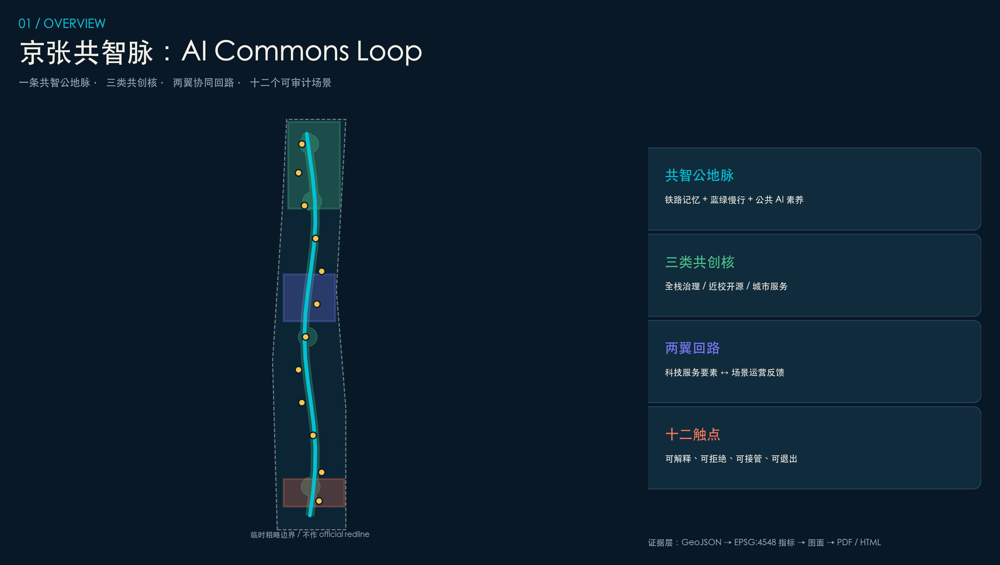
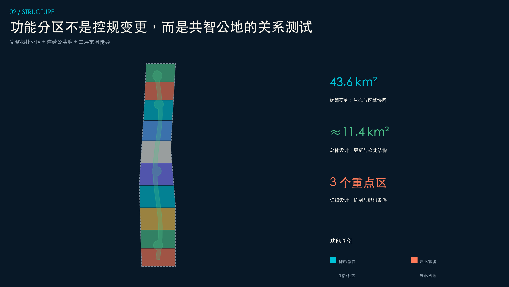
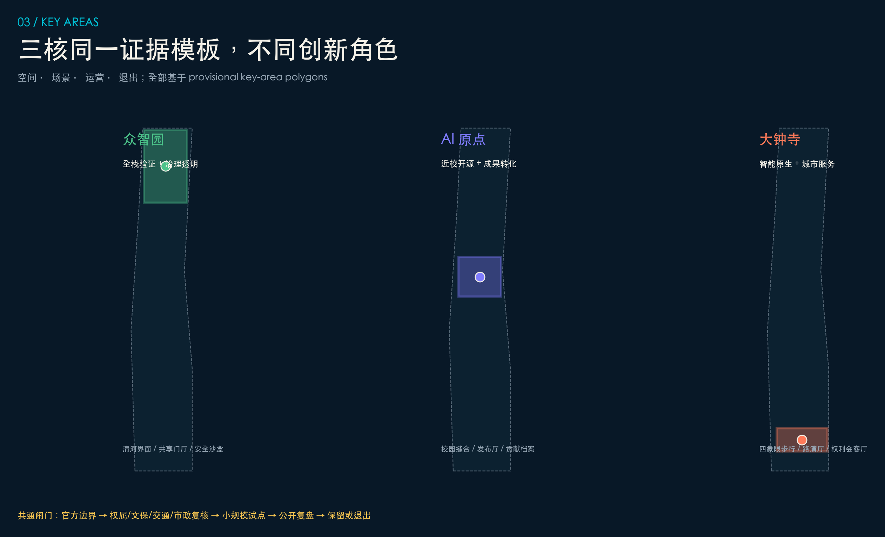
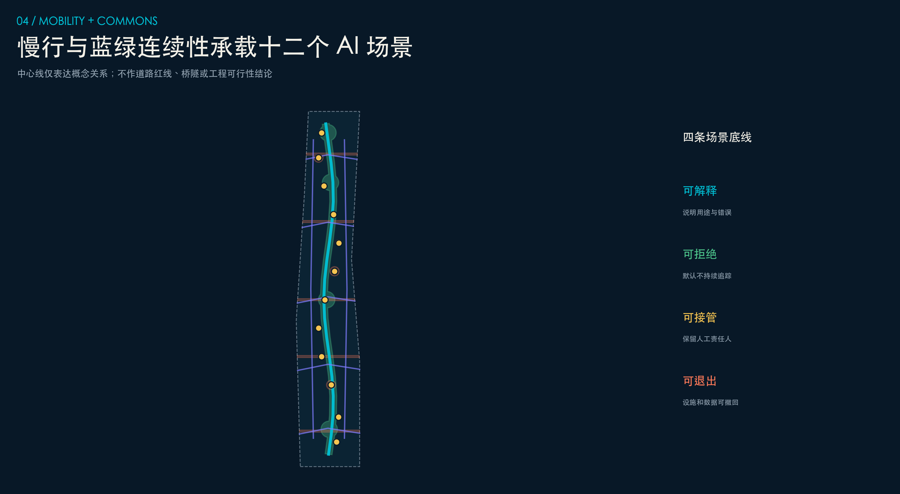
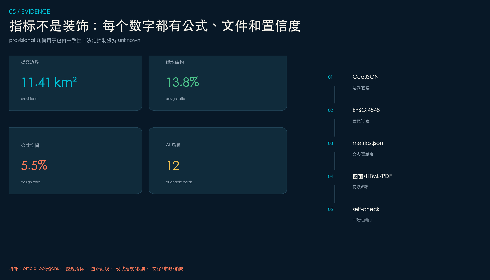

# Coexistence of Intelligent Railways: Jing-Zhang Co-Intelligence Loop AI Commons Loop

## Design Basis and Source List

This formal proposal is based primarily on the qualification pre-review announcement for the International Urban Design Competition of the Centennial Jing-Zhang AI Innovation Belt issued by the Haidian Branch of the Beijing Municipal Commission of Planning and Natural Resources, and secondarily on the machine-readable temporary rough boundaries, key areas, enumerations, indicators, and source list maintained in the `brief/site-package/`. The AI agent must read `design_brief.json`, `allowed_design_space.json`, `sources.json`, `enums/`, `ranges/`, `schemas/`, `data/source_registry.json`, and `data/processed/agent_fact_pack.md` before generating the scheme. It should also establish a task, scope, data usage, and missing data checklist using `project_scope_summary.csv`, `agent_task_requirements.csv`, `source_use_matrix.csv`, and `missing_data_checklist.csv`. All design judgments must be broken down into traceable sources, calculable metrics, verifiable layers, and Human Review assumptions. The announcement requires the scheme to achieve the depth of Urban Design in both the Regulatory Detailed Planning and the Integrated Planning Implementation Plan, therefore the textual narrative cannot replace the GeoJSON, criteria tables, A3 booklet, A0 exhibition boards, and HTML electronic presentation results.

This section of the Evidence Chain cites [source:OFFICIAL-ANNOUNCEMENT], [source:AGENT-TASKBOOK], [source:SITE-PACKAGE], [source:SOURCE-REGISTRY], [source:PROCESSED-FACT-PACK], [source:BOUNDARY-SOURCE], [source:KEY-AREA-SOURCE], [standard:PROJECT-OFFICIAL-ANNOUNCEMENT], [standard:PROJECT-AGENT-OPEN-CALL-TASKBOOK], [standard:MOHURD-URBAN-DESIGN-MEASURES], [standard:MOHURD-CONTROL-DETAILED-PLANNING], [standard:MNR-LAND-USE-CLASSIFICATION-GUIDE] [standard:MOHURD-ARCH-DESIGN-DEPTH-2016] and [depth:existing_conditions_diagnosis], used to explain that the proposal is not an independent visionary text but is organized from the announcement, agent-oriented task statement, standards, boundaries, processing package, and data list.

The boundaries for the use of the registration form are as follows:

- data/source_registry.json Registers the purposes for which publicly available, clarificatory, and interim data are used.
- Current Registration Abstract: formal available data 5 items, background data 0 items, provisional-only data 1 item.
- The agent shall not upgrade background_only or provisional_only materials to official boundaries, statutory controls, formal scoring criteria, or government implementation commitments.

`data/processed/agent_fact_pack.md` is the reading navigation layer for this proposal and is not a new authoritative source. [source:PROCESSED-FACT-PACK] only helps the agent to organize the three layers of scope, three key areas, announcement tasks, agent.1-agent.6, data availability, and data gaps into a readable proposal; all factual judgments still revert to [source:OFFICIAL-ANNOUNCEMENT], [source:AGENT-TASKBOOK], [source:SOURCE-REGISTRY], [source:BOUNDARY-SOURCE], and [source:KEY-AREA-SOURCE].

This scaffold uses `brief/site-package/geometry/provisional_boundaries.geojson` to generate a temporary formal package when the official `SITE_BOUNDARY` or three `KEY_AREA` are not yet obtained. The `geometry/site_boundary.geojson` and `geometry/key_areas.geojson` in the submission package must both be marked as `provisional_constraint`, with `official_boundary=false`, and can only be used for concept generation, self-checking, visualization, and design discussions. They cannot be used as official redlines, approval references, or precise area references, nor can they serve as legal control conclusions. The absence of this organizational data gap does not prevent content scoring. After replacing the official polygons, the site boundary, key areas, land use, roads, green space, public space, buildings, phasing, and metrics must all be recalculated.

The assessable state generated by this scaffolding is: **Provisional Boundary, retaining accuracy alerts and awaiting recalculations after the formal data is released; content scoring is not blocked**. Therefore, the spatial structure, scenes, projects, and indicators in the main text are written according to the principle of being "discussable, reviewable, and recalculable after the Official Boundary is replaced"; when the official boundary and the key area polygon are updated, the agent must rerun the scaffolding, perform self-inspection, and generate the drawings/HTML, and cannot merely replace a single file.

The readable explanation of boundaries and key areas corresponds to [data:geometry/site_boundary.geojson#SITE-001], [data:geometry/key_areas.geojson#PROV-KEY-001] and [metric:site_area_sqm], [metric:key_area_count]. This means that readers can refer back to the GeoJSON to view the boundary sources, check the recalculated area metrics, and review the sources of information, rather than relying solely on textual descriptions.

## Three-Level Scope Framework

The proposal is organized according to the three levels defined in the announcement: the Coordinated Research Area focuses on the 43.6 square kilometers of AI industry ecosystem, strategic positioning, innovation chain, and future urban form; the Overall Design Area focuses on the 11.4 square kilometers of urban and industrial areas surrounding the Jing-Zhang heritage park within 1-2 kilometers, requiring the formation of an overall framework for Urban Renewal, industrial space layout, traffic and municipal support, and Urban Character control; the Key-Area Detailed Design Area focuses on 368.4 hectares of three detailed design regions, requiring the clarification of functional types, building scale, classification of demolish–renovate–retain strategy, Public Space connectivity, and traffic organization. The three layers of scope are mapped to `compliance_matrix.json` to ensure that the required tasks in sections 1.3, 1.4, and 1.5 of the announcement, as well as agent.1-agent.6, have corresponding chapters, layers, indicators, drawings, and HTML evidence. (Demolish–Renovate–Retain Strategy)

The depth items of the three-level work framework are constrained by [depth:three_level_scope_framework] and [depth:overall_spatial_structure], spatial evidence is based on [data:geometry/site_boundary.geojson#SITE-001] and [data:geometry/key_areas.geojson#PROV-KEY-001], tasks are based on [standard:PROJECT-OFFICIAL-ANNOUNCEMENT], and the scope index is navigated by the three-level scope table in [source:PROCESSED-FACT-PACK] `project_scope_summary.csv`.

Three-layer work is not a collection of disjointed drawings. Integrated research determines the industrial chain and urban form, and the overall design translates these determinations into the implementation of update projects, spatial structure, and facility bearing. Detailed design in key areas verifies the feasibility of specific plots, buildings, transportation, Public Spaces, and AI application scenarios. When generating a scheme, the agent must first lock the current submitted official or provisional boundaries and constraints before generating land use, buildings, roads, green spaces, public spaces, phased development, and AI service nodes. Finally, these layers are recalculated to explain which conclusions are still subject to the provisional boundary. Any areas, proportions, scales, or project quantities that cannot be recalculated from structured data must not be written into the formal conclusions.

The overall concept of this proposal is the "Jing-Zhang Co-Innovation Pulse": with the Jing-Zhang Heritage Park as the main axis of history and Public Space, the Zhongzhiyuan, Beijing AI Origin Community, and Dazhongsi serve as innovation anchor points, and the universities, enterprises, communities, and rail stations form the daily network. This creates a spatial organization of "one belt, three cores, multiple point scenarios, and a composite ring of blue and green slow travel." Here, "one belt" is not an additional new red line drawn, but rather translates the three layers of the announced scope into a working method; "three cores" correspond to the three key areas; "multiple point scenarios" correspond to the operational nodes for AI+ public services, industrial services, and urban life; and "composite ring" corresponds to the integrated connection of pedestrian paths, green spaces, public spaces, and activity routes.

| Level | Design Issue | Solution Approach | Data Focus |
| --- | --- | --- | --- |
| Coordinated Research Area | How should AI industry ecosystems and future urban forms be organized? | Establish an "academic source-innovation - open-source collaboration - enterprise transformation - public experience - international dissemination" innovation chain | compliance_matrix.json, standard_matrix.json |
| Overall Design Area | Industrial space, Urban Renewal, transportation and municipal facilities, and appearance and style how to be represented on the map | Land use, buildings, roads, green spaces, Public Spaces, and phased layers are expressed together. | [data:geometry/land_use.geojson#LU-001], [data:geometry/roads.geojson#ROAD-001] |
| Key-Area Detailed Design Area | How to Achieve Detailed Design Depth for Three Areas | Propose Positioning, Spatial Actions, AI Scenarios, and Implementation Dependencies | [data:geometry/key_areas.geojson#PROV-KEY-001], [data:geometry/key_areas.geojson#PROV-KEY-002], [data:geometry/key_areas.geojson#PROV-KEY-003] |

## Coordinated Research Area: Industry and Future City Research

The proposal rewrites the "Industrial Park" issue as the "Innovation Commons" issue: not by gathering resources through closed-off campuses and one-off image projects, but by connecting shared, reservable, and auditable public interfaces that link university innovation origins, open-source collaboration, corporate transformation, resident experience, and international dissemination. The overall main name is "Jing-Zhang Co-Knowledge Vein," with the English working name as **Jing-Zhang AI Commons Loop**; "Vein" refers to the century-long railway timeline and the continuity of north-south Public Spaces, while "Co-Knowledge" signifies the circulation of knowledge, computing power, data, scenarios, and honor records within the boundary of public interest. [source:AGENT-TASKBOOK] [standard:PROJECT-AGENT-OPEN-CALL-TASKBOOK] [depth:overall_spatial_structure]

Visual identity employs an original geometric syntax of "sleepers + dialogue loop": two parallel lines represent the Jing-Zhang historical trajectory, three open nodes represent three key areas, and an open loop represents the continuous integration of new contributions. The main color "railroad deep blue" is used for the evidence layer, "common ground green" for open sharing, and "governance coral" for risk and Human Review. The logo only provides geometric direction, avoiding the use of third-party trademarks, fonts, or celebrity images; it is available for in-depth research by professional branding teams.

The spatial structure is "one vein, three cores, two wings, and twelve touchpoints": the one vein is the Co-Intelligence Commons of the Jing-Zhang Heritage Park; the northern Zhongzhiyuan forms the full-stack validation and governance core, the central Origin Community forms the near-school open-source transformation core, and the southern Dazhongsi forms the intelligent native urban service core; the Zhongguancun Technology Services Wing provides capital, legal, intellectual property, and international connections, while the Xiaoyue River Scenario Enablement Wing provides public testing, resident experience, and operational feedback. The twelve touchpoints transform the three core positions and five functional areas into experiential and auditable daily interfaces, rather than new statutory redlines.[data:geometry/roads.geojson#ROAD-001] [data:geometry/public_space.geojson#PUBLIC-001]

### Six Global Mechanism Case Studies for Comparison

The table below compares only the organizational mechanisms, and does not include the area, investment, performance, or spatial control data from the cases, all of which are marked as background-only:

| Case | Verifiable Mechanism | Transformation for Jing-Zhang | Utilized Boundaries |
| --- | --- | --- | --- |
| Toronto Vector Institute [source:CASE-VECTOR] | Establish a Bridge Institution between Research, Talent, and Industry Adoption | Set up a "One-Stop Entry, Multiple Referrals" Technology Adoption Platform | Do not Duplicate Funding or Enterprise Lists |
| Montreal Mila / Mile-Ex [source:CASE-MILA] | Research, entrepreneurship, corporate experimentation, and community exchange closely coupled | The original community adopts "open ground floor + quiet research and development levels" | Do not infer local building scale |
| AI Singapore [source:CASE-AISG] | Research, Talent, Open Source Tools, Industry Co-Creation Integrated | Establish a Training-Testing-Review Closed Loop for Scenario Sandbox | No Reliance on National Policy Promises |
| Seoul AI Hub [source:CASE-SEOUL] | Startup Space, Expert Cultivation, and Community Exchange Co-located | Zhongzhiyuan Sets Up Shared Evaluation and Transparent Research Interface | Not Referencing Real-Time Performance for Local Targets |
| Amii [source:CASE-AMII] | Basic Research, Responsible Adoption, and Coordinated Skill Framework | Embed Governance Review in Each Scenario Card | Do Not Treat Institutional Practices as Local Approval Policies |
| Paris STATION F [source:CASE-STATIONF] | A large entrepreneurial community providing multiple service entry points | Dazhongsi constructs a walkable urban-type service living room | Does not replicate park campus scale or operational contract |

Case refinement into "Six Operational Interfaces": Research Interface, Open Source Interface, Testing Interface, Enterprise Services Interface, Public Experience Interface, and International Communication Interface. Each interface notes the spatial carrier, data permissions, Human Review, operational subject recommendations, and exit mechanisms, thereby responding to the world-class AI Innovation Ecosystem without fabricating companies, output values, investments, or government promises. [source:OFFICIAL-ANNOUNCEMENT] [depth:existing_conditions_diagnosis]

## Overall Design Area: Urban Renewal and Regulatory-Plan-Level Urban Design

The overall design adopts an update judgment principle of "prioritizing public interest before capacity; reversible before permanent." The `land_use.geojson` is used to divide the same boundary to form a complete and seamless functional zoning, illustrating the relationships between industry, living, education, services, and open spaces; it is not a modification of the control plan. [data:geometry/land_use.geojson#LU-001] [standard:MNR-LAND-USE-CLASSIFICATION-GUIDE] [depth:land_use_layout]

Functional organization follows four rules: prioritize the placement of open ground floors, galleries, shared meeting spaces, and public services along the Co-Intelligence Axis; arrange quiet R&D and controlled testing within the three cores; provide interfaces for intellectual property, computing power, legal services, and scenario operations in the wings; and locate residential and community services within a daily walking distance, not replacing facility baselines with the slogan of balanced employment and residence. Prototype buildings avoid Public Spaces and blue-green veins, adopting small footprints, modular, and adaptable evidence layers, but not corresponding to current individual units or ownership. [data:geometry/buildings.geojson#BLDG-001] [depth:retain_renovate_demolish]

Building updates use a four-level method of "Leave, Modify, Add, and Remove" without directly specifying the demolition targets: objects of value and those that are well-suited are prioritized for retention; those that can be improved through first-floor openness and equipment upgrades are recommended for renovation; additions are only studied after revalidation of ownership, control plans, fire safety, and structural integrity; temporary structures are allowed to be removed. Currently, only the "Reversible Update Prototype" is drawn, with the total gross floor area, Floor Area Ratio, Building Height, density, setback distances, and specific demolish–renovate–retain strategies all awaiting official control plans and site investigations. [standard:MOHURD-CONTROL-DETAILED-PLANNING] [depth:development_intensity_controls] [depth:height_massing_character] (Demolish–Renovate–Retain Strategy)

Conceptual Recommendation: The appearance is not a uniform technological skin, but rather "Railway Material Memory + Zhongguancun Editable Interface + Transparent Governance in the AI Era": the lower layer interface is durable, simple, and touchable; the public layer allows contributions of records, model descriptions, and updates to activity information; the quiet research and development layer controls glare and advertising interference. All controls are conceptual recommendations, available for professional teams to deepen research after the preservation, solar access, fire safety, structural, and control plan conditions are met.

## Detailed Design of Key Areas

Three temporary key areas polygons are only used for organizing design discussions and are retained with light dashed lines for expression. [data:geometry/key_areas.geojson#PROV-KEY-001] [data:geometry/key_areas.geojson#PROV-KEY-002] [data:geometry/key_areas.geojson#PROV-KEY-003] [depth:three_key_area_detailed_design]

| Key Area | Core Contradiction | Three Spatial Actions | First Batch of Concept Projects | Preliminary Review |
| --- | --- | --- | --- | --- |
| Zhongzhiyuan Full Stack Validation and Governance Core | How can high-intensity research and development and open exchange be compatible? | Create a low-carbon test garden along Qinghe interface; set up an appointment shared lobby at the enclosed boundary; form a standard and governance display node at the northern portal. | Safety Governance Sandbox, Edge-side Computing Station, Qinghe Algorithm Garden | Blue Line Qinghe, flood control, Fifth Ring Road traffic, park district ownership |
| AI Origin Near School Open Source Transformation Core | How can campus outcomes bridge the "last mile" without disrupting the community? | School-Garden-Street Slow-Travel Seam; First Floor Forms Open Source Publishing and Intellectual Property Services; Nighttime Activities Graded | Open Source Exhibition Hall, Technology Transfer Street, Contribution Archive | campus boundaries, fire safety, community capacity, existing buildings |
| Dazhongsi Intelligent Native Urban Service Core | How rail transit passenger flow, enterprise services, and public life can mutually benefit | Quadrant Prioritizing Pedestrian Access; Station-City Living Room Connecting Enterprises and Communities; Green Spaces Embedded with Exitable Consumption Testing | Intelligent Body Exhibition Hall, Data Rights Living Room, Explainable Services Street | Rail Transit Protection, Right-of-Way, Underground Pipelines, Commercial Ownership Rights |

Each district adopts the same "Space-Scenario-Operation-Exit" template: space defines publicness and safety boundaries; scenario outlines minimum data; operation specifies suggested responsible parties and Human Review; exit clauses ensure that in the event of a pilot failure, the project can be removed and restored. This ensures that detailed design is verifiable while avoiding pseudo-precise conclusions in the absence of official boundaries, ownership, and engineering documentation. [source:BOUNDARY-SOURCE] [source:KEY-AREA-SOURCE]

## AI Innovation Ecosystem, Personas, and AI+ Scenarios

Six user personas are as follows: Basic researchers require quiet, deep workspaces and interdisciplinary collisions; open-source developers need contributions that are memorable and have low barriers to collaboration; startup teams need computational power, testing, legal support, and early users; enterprise product teams need compliance validation and international launches; nearby residents need low-impact, barrier-free, and trustworthy public services; visitors and teenagers need experiences that are understandable, participatory, and not overly surveilled. These personas are not derived from individual tracking but are used for spatial needs assumptions. [source:AGENT-TASKBOOK] [depth:existing_conditions_diagnosis]

### Twelve AI Scene Cards

| # | Scenario / Type | Space | Minimum Data and Human Review | Operations and Exit |
| --- | --- | --- | --- | --- |
| 01 | Open Release Hall | Origin Community | Publish only project metadata; release after author confirmation | Curated by the community; can be deleted or corrected |
| 02 | Model Safety Governance Sandbox / **Industrial Testing** | Zhongzhiyuan | Isolated Test Set; Expert Approved Testing Scope | Appointment-Based; Failed Models Not Externally Released |
| 03 | End-Side Computing and Energy Efficiency Test Station / **Industrial Testing** | Zhongzhiyuan | Equipment Remote Telemetry Anonymous Aggregation; Engineer Verification | Small-Scale Retrievable Equipment |
| 04 | Barrier-Free Slow Travel Assistance | Jing-Zhang Co-Intelligence Network | User Proactively Requests, Short-Term Location; Human Customer Service as Backup | Default Off Continuous Tracking |
| 05 | Dazhongsi Intelligent Body Showroom / **Industrial Testing** | Dazhongsi | Synthesized or Authorized Data; Red Team Review | Test Data Cleared at Event End |
| 06 | Qinghe Algorithm Garden | Northern Blue-Green Interface | Environmental data is aggregated only; ecological experts review | No control over natural systems, merely explain |
| 07 | School Nearby Conversion Result Showcase | Origin Community | Voluntary Project Registration; Legal Verification by Staff | Referral System, No Financing Commitment |
| 08 | Data Rights Parlour | Dazhongsi | Simulated Authorized Ledger; Privacy Officer Review | Public Inquiry and Appeal |
| 09 | AI-Led Living Services Sample Street | Community Interface | Explicit Consent; No Facial Recognition | Staff Can Take Over at Any Time |
| 10 | Public Space Maintenance Assistant | Co-Intelligence Commons | Construction Tickets, Non-Personal Images; Manual Dispatch | No Automatic Punishment or Enforcement |
| 11 | Jing-Zhang Memory Dialogue Station | Historical Node | Reviewed and Registered in Clear Title Records; Historical Facts Edited and Re-verified | Errors Traced and Revised |
| 12 | Global AI Commons Week Route | One Public Space | Minimal Registration; Safe Human Command During Events | Reviewed Annually, No Commitment to Fixed Annual Hosting |

Three categories of industrial test scenarios all adopt a "pre-test clear rights—test isolation—post-test review—exit if not passing" gate; urban service scenarios adopt four public interest rules of "explainable—refusable—human takeover—appealable". No intelligent entity shall replace the final human decision in planning approval, police enforcement, medical diagnosis, or resource allocation. [data:geometry/public_space.geojson#PUBLIC-001] [data:geometry/roads.geojson#ROAD-001] [metric:scenario_node_count] [depth:municipal_new_infrastructure]

### Three AI Pilgrimage Sites and Honor System

"Open Source Origin Archive" records verifiable open source contributions rather than celebrity worship; "Full-Stack Transparency Tower" showcases models, computational power, data, and governance relationships through explainable cross-sections; "Centennial Signal Box" translates railway signaling language into a public AI literacy device; "Urban Agent Theater" serves as a variable showcase and public interrogation space. The landmarks are lightweight, reversible, low-glare concept components that require review by conservation, structural, fire safety, and copyright professionals. Honor displays only accept verifiable contributions, allowing for corrections and revocations, and include teams, maintainers, data contributors, and public feedback providers in the record.

## Land Use, Building Scale, and Retain-Renovate-Demolish Strategy

The zoning districts only carry out the "functional relationship test": research and industrial services are close to the three cores, residential and community services form daily support, while the co-creation commons and park green spaces maintain a north-south continuity. Each polygon is clipped by the same submitted boundary, sharing adjacent coordinates with no gaps or overlaps; areas are recalculated in EPSG:4548. [data:geometry/land_use.geojson#LU-001] [metric:land_use_0802_area_sqm] [metric:land_use_05_area_sqm] [metric:land_use_0701_area_sqm] [metric:land_use_0702_area_sqm] [metric:land_use_1401_area_sqm] [metric:land_use_1403_area_sqm] [metric:land_use_0804_area_sqm] [depth:land_use_layout]

Building layers are a set of over a dozen reversible prototype layers that do not correspond to actual buildings. The prototypes prioritize small footprints, transparent ground floors, and variable shared spaces; the building density is merely the geometric ratio of the prototype to the provisional boundary, not a definitive metric. [data:geometry/buildings.geojson#BLDG-001] [metric:building_footprint_area_sqm] [metric:building_density] [depth:height_massing_character] (Building Coverage Ratio)

Formal deepening must first overlay the current building outlines, era, structure, use, ownership, control plan, fire safety, solar access, and cultural heritage conditions. Then, form evidence cards for each building detailing "retention/renovation/function conversion/addition/removal to be argued." At present, no existing buildings are designated for demolition, and no total building scale, Floor Area Ratio (), or height is confirmed.

## Transport, Rail, Municipal Infrastructure, and Public Services

Traffic design is based on the principles of "priority for slow travel continuity, clear transit transfers, and micro-circulation for motor vehicles." A north-south shared smart slow travel main artery connects the three cores, five east-west stitching lines connect universities, parks, and communities, and two wing connector lines express the relationships between technology services and scenario empowerment. All lines are conceptual centerlines, not road redlines or engineering positions. [data:geometry/roads.geojson#ROAD-001] [metric:road_centerline_length_m] [depth:traffic_rail_slow_parking]

Dazhongsi station concept strategy prioritizes pedestrian crosswalks at grade, legible quadrants paths, orderly non-motorized vehicle parking, and accessible transfer information; Wudaokou and Qinghua Donglu Xi Street concept strategy aims to reduce campus-street detours, with the installation of shared atriums and continuous canopy interfaces; the Fifth Ring and underbridge spaces only propose "discontinuity identification and multi-disciplinary consultation," without determining the feasibility of bridges and tunnels. [source:OFFICIAL-ANNOUNCEMENT]

New Infrastructure adopts "small sites, low loads, and easy exit": edge-side computational nodes are co-located with public services, with default non-storage of personal raw data; distributed energy only proposes load coordination and energy efficiency display interfaces; municipal, fire safety, flood prevention, drainage, pipeline, and communication capacities are all listed as pre-verification items. [data:geometry/constraints.geojson#CONSTRAINTS] [depth:municipal_new_infrastructure]

## Blue-Green Network, Public Space, and Urban Character

The blue-green system reduces the provisional boundary to light constraints, with the Jing-Zhang Heritage Park's directional north-south co-intelligence axis as the main focus. Continuous green belts, along with four portal/hub park prototypes, form a "walkable, stoppable, understandable, and exitable" Public Space; five east-west stitching interfaces overlay pedestrian, cycling, rain garden, resting, and public AI literacy facilities. [data:geometry/green_space.geojson#GREEN-001] [data:geometry/public_space.geojson#PUBLIC-001] [metric:green_space_area_sqm] [metric:green_ratio] [metric:public_space_area_sqm] [metric:public_space_ratio] [depth:blue_green_public_space]

Culture narratives adopt "three times": railway time records a century of engineering, migration, and urban growth; Zhongguancun time records experiments, open-source efforts, failures, and re-entrepreneurship; AI time emphasizes model iterations, responsibility, and reversibility. Signage uses "mile markers" to indicate spatial positions, "version numbers" to denote content updates, and "responsibility cards" to explain data sources, model purposes, and human contacts. International communication phrases include **A century on the rail, a commons for intelligence**, with a formal Chinese explanation of "on the trajectory of a century, co-building a public-interest intelligent commons." [standard:MOHURD-URBAN-DESIGN-MEASURES]

Avoid dominance by large screens and excessive lighting at all nodes: historical nodes should focus on materials, scales, and sounds; innovation nodes should prioritize open interfaces and contribution records; and life nodes should emphasize barrier-free access, shading, seating, drinking fountains, and restrooms for basic experiences. The implementation scope for Qinghe, Xiaoyuehe, cultural preservation controls, and existing parks has not been provided with precise attachments; therefore, low-disturbance measures must be maintained and reviewed by experts in ecology, cultural preservation, and transportation. [depth:risk_missing_data]

## Renewal Projects, Implementation Policy, and Phasing

Update projects are organized in the order of " reversible public layer first—then collaborative updates—followed by long-term governance." Phase one focuses on lightweight signage, open activities, Public Space maintenance, and three types of test sandboxes; phase two, after property rights verification and traffic validation, studies near-school conversion outcomes, track connections, and opens the park boundary; phase three discusses permanent buildings and engineering projects only after official control plans, municipal, and cultural heritage data are complete. [data:geometry/phasing.geojson#PHASE-001] [metric:phase_001_area_sqm] [metric:phase_002_area_sqm] [metric:phase_003_area_sqm] [depth:phasing_implementation]

| Project | Conceptual Outcomes | Decision Gates | Exit When Failed |
| --- | --- | --- | --- |
| C-01 Collaborative Intelligence Signage and Responsibility Cards | 12 Unified Touchpoints for Recognition | Heritage Conservation, Accessibility, Copyright | Removal and Restoration of Site |
| C-02 Open Source Origin Exhibition Hall | Release, Contribution, and Error Correction Process | Ownership, Fire Safety, Operating Entity | Convert to General Community Activity Space |
| C-03 Zhongzhiyuan | Appointment for Evaluation and Public Explanation | Data Rights Clarification, Cybersecurity, Expert Review | Disable External Access and Destroy Test Data |
| C-04 Dazhongsi Intelligent Body Showroom | Synthetic Data Demonstration and International Exchange | Track Protection, Commercial Ownership, Event Safety | Revised into a Regular Showroom for Business Meetings |
| C-05 Multidisciplinary Consultation for Slow-Travel Hotspots | List of Hotspots and Alternative Routes | Road Right-of-Way, Traffic Simulation, Utilities | Preserve Information for Improvement, No Implementation of Engineering |
| C-06 AI Commons Week | Annual Agenda, Developer Community, Public Engagement | Site Permits, Security, Budget, and Partner Clearing | Shift to Distributed Small-Scale Events |

Annual operations propose a seasonal rhythm: Spring Open Season and Talent Season, Summer Public Scene Testing Season, Autumn Global AI Commons Week, and Winter Governance Review and Honor Archiving. Developers enter the community from activity registration, from issue tracking into small-scale validation, and from review into public knowledge repositories; enterprises enter from demand diagnosis into controlled testing; residents enter from issue proposal into co-creation and appeal. All activities are suggested mechanisms and do not constitute definitive arrangements, business development commitments, or funding commitments. [depth:renewal_project_list] [source:AGENT-TASKBOOK]

## Metrics, Area Recalculation, and Compliance Matrix

Metrics are divided into three groups: geometrically recalculable, officially pending, and operational trials. Geometric metrics are derived from the submitted GeoJSON and are subject to the precision of the provisional boundary; officially pending metrics are kept as unknown; operational metrics only define the data collection method without pre-setting performance targets. [depth:metrics_recalculation]

Current machine-readable known metric indices are: [metric:site_area_sqm] [metric:building_footprint_area_sqm] [metric:building_density] [metric:green_space_area_sqm] [metric:green_ratio] [metric:public_space_area_sqm] [metric:public_space_ratio] [metric:key_area_count] [metric:scenario_node_count] [metric:road_centerline_length_m] [metric:land_use_05_area_sqm] [metric:land_use_0701_area_sqm] [metric:land_use_0702_area_sqm] [metric:land_use_0802_area_sqm] [metric:land_use_0804_area_sqm] [metric:land_use_1401_area_sqm] [metric:land_use_1403_area_sqm] [metric:phase_001_area_sqm] [metric:phase_002_area_sqm] [metric:phase_003_area_sqm]. Among these, the site, land use, green spaces, Public Spaces, building prototypes, and phased areas have been recalculated in EPSG:4548; only the conceptual centerline lengths of the roads are included; and the number of scenes is derived from twelve scene cards. The Floor Area Ratio, total gross floor area, road areas, and proportions are marked as unknown because official conditions are missing, and no design values are used to fill in the gaps. [data:geometry/site_boundary.geojson#SITE-001] [data:geometry/land_use.geojson#LU-001]

The metrics use two hard boundaries: first, the calculated area of the provisional polygon is only used for within-polygon consistency and does not replace the announcement "approximately 11.4 square kilometers" or the official redline; second, the prototype Building Coverage Ratio, green space, and Public Space proportions are only used for comparative design structure and are not statutory metrics. `compliance_matrix.json` maps announcement 1.3, 1.4, and 1.5 to chapters, layers, metrics, drawings, sources, assumptions, and self-checks; `standard_matrix.json` and `design_depth_matrix.json` record professional evidence and data gaps. [source:SOURCE-REGISTRY] [source:PROCESSED-FACT-PACK]

## Risk, Copyright, and Compliance

This scheme is an open-source AI co-creation proposal, not intended to replace formal planning nor to constitute official government approval. Spatial implementation descriptions are all Conceptual Recommendations, reference schemes, or topics for further in-depth research by professional teams. official boundary, three key areas polygon, control plan, road red lines, existing buildings, ownership, cultural heritage, blue-green lines, municipal facilities, fire safety, and public service baselines are missing, and have been noted in the assumptions; once official documentation is available, all layers, indicators, graphics, HTML, and PDF must be recalculated starting from the boundary. [source:SITE-PACKAGE] [source:BOUNDARY-SOURCE] [data:geometry/constraints.geojson#CONSTRAINTS] [depth:risk_missing_data]

AI risks are controlled through four layers: "data—model—space—operation." Data should be minimized and revocable; models should explain their scope and error modes; space facilities should be non-intrusive, accessible, and revocable; operation should retain human oversight, appeal mechanisms, event records, and annual reviews. Continuous personal tracking, automatic enforcement, unauthorized facial recognition, and using recommendations as the basis for allocating public resources are prohibited. Smart bodies should not replace statutory approvals.

Five core images, offline HTML, and PDF are all generated deterministically by local scripts based on the submission GeoJSON, metrics, and main text, without using commercial maps, remote basemaps, news images, third-party trademarks, or celebrity portraits. The cases only reference institutional public webpages for background-only mechanisms. Copyright and generation methods are described in `report/copyright_statement.md`; the Chinese text controls the explanatory content. [standard:MOHURD-ARCH-DESIGN-DEPTH-2016]

## References

- brief/public-brief.md
- brief/site-package/design_brief.json
- brief/site-package/allowed_design_space.json
- brief/site-package/enums/
- brief/site-package/ranges/planning_limits.json
- data/processed/agent_fact_pack.md
- data/processed/project_scope_summary.csv
- data/processed/agent_task_requirements.csv
- data/processed/source_use_matrix.csv
- data/processed/missing_data_checklist.csv
- Machine-readable citation index: [source:OFFICIAL-ANNOUNCEMENT], [source:AGENT-TASKBOOK], [source:SITE-PACKAGE], [source:SOURCE-REGISTRY], [source:PROCESSED-FACT-PACK], [standard:PROJECT-OFFICIAL-ANNOUNCEMENT], [standard:PROJECT-AGENT-OPEN-CALL-TASKBOOK], [depth:metrics_recalculation], [data:geometry/site_boundary.geojson#SITE-001], [metric:site_area_sqm]
