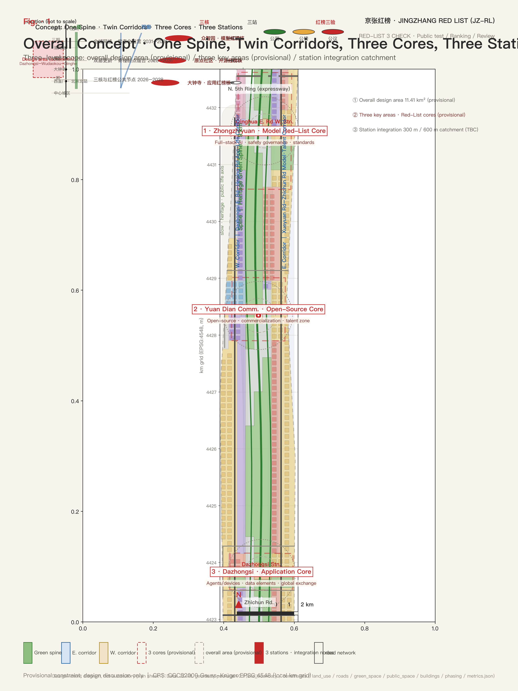
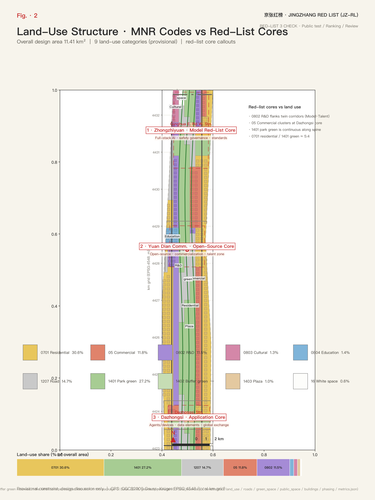
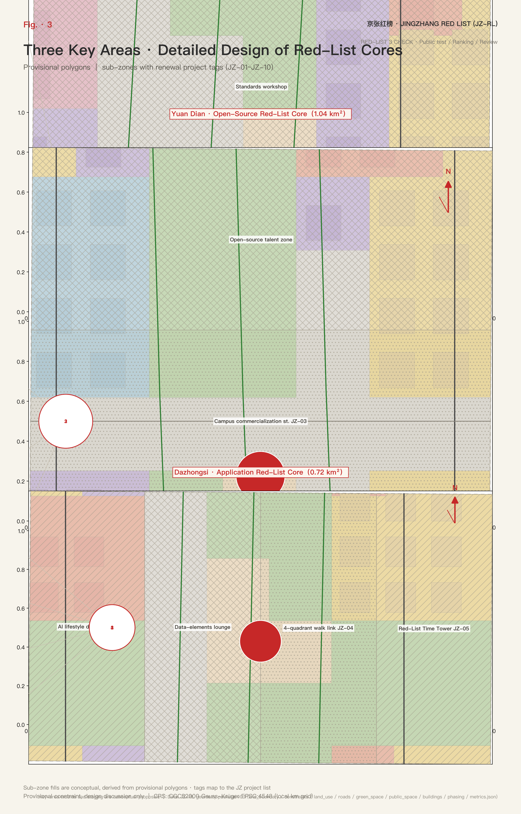
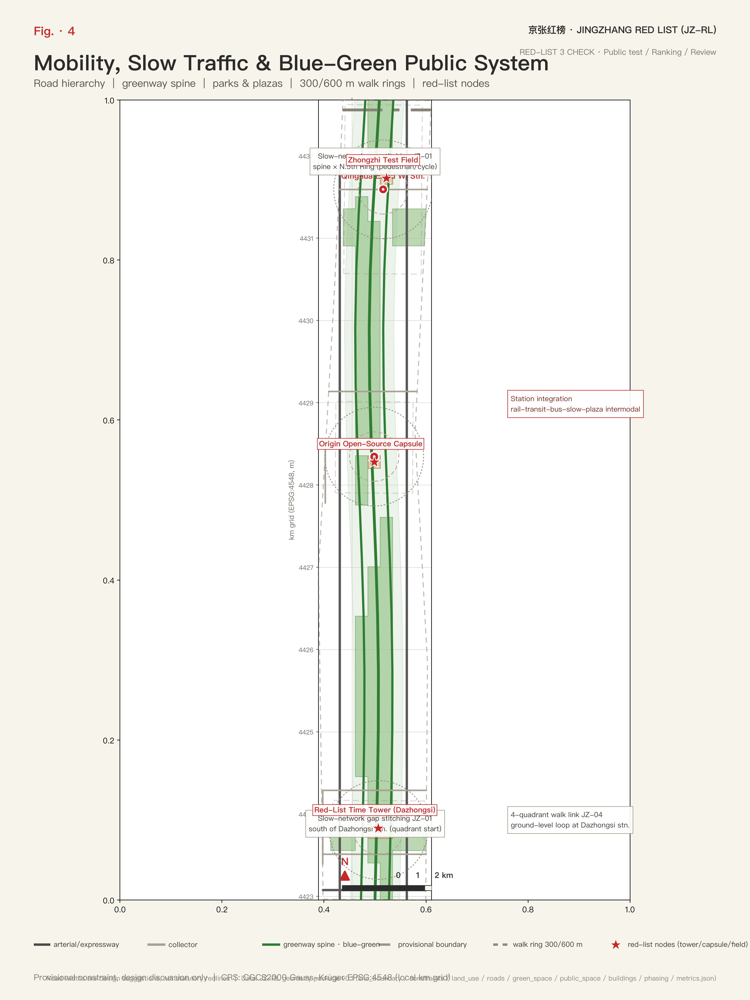
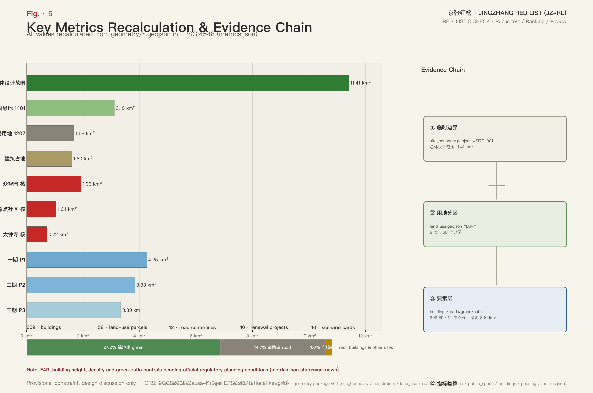

# JINGZHANG RED LIST: Urban Design Proposal for the Centennial Jing-Zhang AI Innovation Belt Open-Evaluation Corridor

## Design Basis and Source Inventory

This proposal takes the Pre-Qualification Announcement for the International Urban Design Solicitation for the Centennial Jing-Zhang AI Innovation Belt, published by the Haidian Branch of the Beijing Municipal Commission of Planning and Natural Resources, as its primary basis; the urban-renewal and regulatory-planning design-depth requirements, the three-level scope framework and the agent task system defined in the announcement constitute the response framework of this proposal [source:OFFICIAL-ANNOUNCEMENT] [standard:PROJECT-OFFICIAL-ANNOUNCEMENT]. This is not a standalone vision document but a verifiable deliverable organised from the announcement, the site package and the agent task book; every design judgment can be traced back to a source, a layer and a metric. The prose carries only the judgments, while the complete machine-auditable index is kept in structured files.

The site package registers the permitted uses of public, cleared and provisional sources; the boundary and key-area polygons both come from the maintainer-registered provisional inference source and may only be used for proposal generation, self-check and design discussion [source:SITE-PACKAGE] [source:SOURCE-REGISTRY]. The overall-area boundary comes from the provisional boundary source, and the three key-area boundaries come from the rough polygons in the same registered source; both are labelled provisional constraints and must not be used as statutory boundaries, approval bases or precise-area bases [source:BOUNDARY-SOURCE] [source:KEY-AREA-SOURCE]. The fact-processing layer organises the three-level scope, the three key areas, the announcement tasks, the six agent tasks, data availability and data gaps into a readable navigation layer, but factual judgments still need to be checked against the registered original materials [source:PROCESSED-FACT-PACK].

The understanding of existing conditions builds on the diagnosis in the site package. The judgments this proposal makes about existing conditions include: multiple slow-traffic gaps along the Jing-Zhang heritage park corridor, uneven functional mix across the three key areas, a road system dominated by arterials and local streets with insufficient slow-traffic network continuity, and green and heritage resources surrounding the belt while public disclosure spaces are scarce. These judgments are the starting point for the renewal moves that follow and correspond to the existing-conditions diagnosis item of design depth [depth:existing_conditions_diagnosis] [data:geometry/site_boundary.geojson#SITE-001] [metric:site_area_sqm].

All spatial outputs of this proposal are generated from provisional constraints: the overall design area is approximately 1,141.3 ha with three key areas; the area figures are recomputed from provisional polygons and must be fully recalculated when official boundaries are released. The structures, projects and metrics in the prose are written on the principle of "discussable, reviewable, recalculable after replacement with the official boundary"; provisional conclusions neither block content scoring nor may they be upgraded into statutory control conclusions [source:BOUNDARY-SOURCE] [source:AGENT-TASKBOOK].

## Three-Level Scope Working Framework

Following the announcement, the proposal organises its work in three levels: the coordinated research area focuses on the AI industry ecosystem, the innovation chain and future city forms across approximately 43.6 km²; the overall design area focuses on the urban area around the Jing-Zhang heritage park of approximately 11.4 km², requiring an overall urban-renewal framework, industrial spatial layout, transport/municipal support and urban-character control; the key detailed-design area covers three detailed design districts that must reach the depth of a regulatory-plan urban design implementation scheme [depth:three_level_scope_framework]. The three levels are not disconnected drawing sets: the coordinated research answers industry and city-form judgments, the overall design turns judgments into renewal projects, spatial structure and facility capacity, and the key areas verify the implementability of parcels, buildings, transport and public space.

The overall concept is the JINGZHANG RED LIST (JZ-RL): the centennial Jing-Zhang railway tradition of "signals–platforms–timetables–inspection stamps" is translated into an open-evaluation corridor for global AI. The core mechanism is the "Red-List Three Verification" — every AI product or city AI service that goes live on the belt must pass public testing, public ranking/disclosure (open evaluation, ranking and red-black signal language), and public review with rollback; the three steps together form one "Red-List Service". Here "red line" expresses only the public constraint of evaluation and rollback; it is not an official planning red line. The spatial skeleton is "one spine, two corridors, three cores, three stations": the spine is the 9 km green backbone of the Jing-Zhang heritage park; the two corridors are the Xueyuan Rd–Zhichun Rd "Model·Talent" innovation corridor and the Dazhongsi East Rd–Heqing Rd "Application·Life" experience corridor; the three cores are Zhongzhiyuan as the "Model Red-List Core", the Beijing AI Origin Community as the "Open-Source Red-List Core", and Dazhongsi as the "Application Red-List Core"; the three stations are Dazhongsi, Wudaokou and Qinghua East Rd West stations as transit-integrated Red-List nodes (station locations are approximate and pending official verification) [depth:overall_spatial_structure] [data:geometry/site_boundary.geojson#SITE-001] [data:geometry/key_areas.geojson#PROV-KEY-001].

The "three areas and two wings" are written as conceptual synergy: the three areas are the three key areas; the two wings are the Zhongguancun technology-service wing and the Xiaoyue River scenario-empowerment wing, responsible respectively for global factor allocation, Zhongguancun IP and capital empowerment, and open scenarios for an AI-vibrant city. The two wings are expressed as conceptual suggestions and are not drawn as statutory boundaries [standard:PROJECT-OFFICIAL-ANNOUNCEMENT] [source:PROCESSED-FACT-PACK].

| Level | Design question | Proposal answer | Data anchor |
| --- | --- | --- | --- |
| Coordinated research area | How to organise the AI industry ecosystem and future city forms | Build an "university origin–open-source collaboration–enterprise conversion–public experience–international communication" innovation chain with a Red-List evaluation mechanism | [data:geometry/site_boundary.geojson#SITE-001]、[metric:site_area_sqm] |
| Overall design area | How to map industry space, renewal framework, transport/municipal and character | Express the one-spine-two-corridors-three-cores skeleton through land-use, building, road, blue-green and phasing layers | [data:geometry/land_use.geojson#LU-001-01]、[data:geometry/roads.geojson#ROAD-A1] |
| Key detailed-design area | How the three districts reach detailed design depth | Positioning, spatial moves, AI scenarios and implementation dependencies per district | [data:geometry/key_areas.geojson#PROV-KEY-001]、[data:geometry/key_areas.geojson#PROV-KEY-002]、[data:geometry/key_areas.geojson#PROV-KEY-003] |

## Coordinated Research Area: Industry and Future City

The judgment of the coordinated research area is that the competitiveness of the Jing-Zhang innovation belt lies not only in computing power and models, but in the institutional supply of "openly verifiable" quality. The proposal organises the industry ecosystem around five functions — the full-stack independent innovation system for AI (Zhongzhiyuan), a world-class AI innovation ecosystem (Origin Community), a new AI+ scenario empowerment paradigm (Dazhongsi and the scenario-card system), an intelligent AI-vibrant city (blue-green slow-mobility composite ring and AI public services), and global discourse on AI governance (the Red-List evaluation mechanism, international public review and the annual Red-List Congress) [standard:PROJECT-AGENT-OPEN-CALL-TASKBOOK] [source:AGENT-TASKBOOK]. These requirements come from the publicly solicited agent task book and belong to the category of conceptual suggestions and reference schemes, not statutory industrial planning.

**Naming system and Logo direction.** The master brand is JINGZHANG RED LIST (JZ-RL), with sub-brands "Zhongzhi·Testing Field", "Origin·Open-Source Pod" and "Dazhongsi·Application Lane", corresponding to the model-testing, open-source collaboration and application-experience functions of the three cores. The Logo visual motif is the three-colour signal light (green = pass, amber = retest, red = rollback) overlaid with timetable rail ticks and a ranking barcode, forming the "Red-List Three Verification" identity system. The motif runs through wayfinding, public art and digital interfaces, making "evaluation and rollback" a perceptible public language of the belt and translating the signal discipline of the railway age into a public-trust rule for the AI age.

**Cultural narrative.** The proposal organises a continuous narrative: the 1909 Jing-Zhang Railway (Zhan Tianyou's zigzag alignment, Qinghuayuan Station, signal and timetable culture) → Zhongguancun (from Electronics Street to the national independent-innovation demonstration zone) → the new AI culture (open source, evaluation, public review, rollback) [depth:overall_spatial_structure]. The railway age used signals to guarantee safety, the Zhongguancun age used markets to test innovation, and the AI age uses public testing, public ranking and public review to guarantee trust. This narrative responds to the three-position framework of the centennial Jing-Zhang cultural belt, the urban AI life-experience belt and the AI-converged innovation belt, corresponding to three public lists: the "Cultural Red List", the "Life Red List" and the "Industry Red List".

The six AI ecosystem cases (conceptual suggestions) are [metric:ai_ecosystem_case_count]:

| No. | AI ecosystem case | Spatial carrier | Operations highlights |
| --- | --- | --- | --- |
| EC-01 | Full-stack independent innovation platform | Zhongzhiyuan testing field | Proprietary-model testing, standards workshops, safety-governance exhibitions |
| EC-02 | Open-source foundation-model community | Origin Community open-source pod | Contributor honour wall, results launch hall, developer collaboration space |
| EC-03 | Agent interop standards workshop | Enterprise clusters along the twin corridors | Industry standards discussion, interop testing methodology co-development |
| EC-04 | Data-element compliant circulation service | Dazhongsi data-element salon | Authorised, compliant, auditable circulation service interface |
| EC-05 | AI+ public service operator | Life Red-List node network | AI-operated models for health, education and life services |
| EC-06 | Global AI Red-List Congress | Red-List Tower and public route | Annual ranking, international evaluator invitations, pilgrimage festival |

Future-city-form research answers how AI changes work, life, social life and public services: AI transport systems, continuous green space, innovation-service facilities and an international work-life atmosphere should be realised as locatable function zones, nodes and corridors rather than generic technology visions; the coordination of character, public space and building layout is organised according to the professional requirements of the Urban Design Administration Measures [standard:MOHURD-URBAN-DESIGN-MEASURES]. Global AI innovation events, developer communities, open scenarios and pilgrimage routes are all conceptual suggestions and reference schemes for professional teams to deepen; they are not confirmed government activities or implementation arrangements.

## Overall Design Area: Urban Renewal at Regulatory-Plan Urban-Design Depth

The overall design area must reach the urban-design depth of a regulatory detailed plan. The proposal accordingly organises land-use structure, building scale, the renewal project list, implementation-policy suggestions and comprehensive carrying-capacity assessment, and makes explicit which content is statutory regulatory-plan content and which awaits official data [standard:MOHURD-CONTROL-DETAILED-PLANNING]. The core judgment of this scope is: while retaining the existing residential and public-space base, research and commercial land become the renewal increment, and an "evaluation–conversion–disclosure" AI spatial chain is organised around the three cores [data:geometry/land_use.geojson#LU-001-01] [data:geometry/buildings.geojson#BLDG-0001] [metric:building_footprint_area_sqm].

The generated site shows: residential land approximately 3.489 million m² (30.6%), park green space approximately 3.105 million m² (27.2%), roads approximately 1.678 million m² (14.7%), commercial approximately 1.345 million m² (11.8%), research approximately 1.315 million m² (11.5%), plus education, cultural, plaza and reserved land. This structure shows that the scope is first of all a life- and ecology-first area; renewal should do "acupuncture-style" upgrading around green corridors and transit stations rather than large-scale demolition and reconstruction [depth:development_intensity_controls] [data:geometry/land_use.geojson#LU-003-02] [data:geometry/land_use.geojson#LU-004-03].

On building scale, the layer records 309 building footprints totalling approximately 1.602 million m², mostly retained, with research and commercial as the new-build direction [metric:building_count] [data:geometry/buildings.geojson#BLDG-0001]. Floor area ratio, building height, building density and green-ratio controls currently lack official regulatory-plan conditions; this proposal marks them all as pending official control conditions and never substitutes inferred values for approved indicators; formal deepening must rely solely on official regulatory detailed-plan conditions [depth:development_intensity_controls] [metric:floor_area_ratio] [metric:building_height_m].

## Key Areas: Detailed Design

The three key areas correspond to the Red-List cores: Zhongzhiyuan = "Model Red-List Core", responsible for full-stack independent AI innovation, safety governance and standards development; the Beijing AI Origin Community = "Open-Source Red-List Core", responsible for open-source ecosystems, result conversion and a talent special zone; Dazhongsi = "Application Red-List Core", responsible for agents, intelligent terminals, content consumption, data elements and international exchange [data:geometry/key_areas.geojson#PROV-KEY-001] [data:geometry/key_areas.geojson#PROV-KEY-002] [data:geometry/key_areas.geojson#PROV-KEY-003]. The three cores map one-to-one onto Red-List services: the testing field runs the "model service", the open-source pod runs the "community service", and the application lane runs the "life service", making the evaluation mechanism the daily operational content of the three districts rather than an add-on activity.

Detailed design depth requires seven categories to be complete — function and format, building scale, building form, retain/renovate/demolish classification, public-space system, transport organisation and implementation projects — checked by the design-depth matrix [depth:three_key_area_detailed_design] [standard:MOHURD-ARCH-DESIGN-DEPTH-2016]. The key-area areas are recomputed from provisional polygons: Zhongzhiyuan approximately 192.9 ha, Origin Community approximately 104.3 ha, Dazhongsi approximately 72.0 ha; precise areas must be recalculated when official key-area polygons are released [metric:key_area_area_sqm] [metric:key_area_count].

| Key district | Design positioning | Spatial moves | AI scenarios and operation carriers |
| --- | --- | --- | --- |
| Zhongzhiyuan AI acceleration area | Garden-type full-stack innovation and testing district | Strengthen the Qinghe interface, low-carbon innovation spaces and external transport; green space carries open testing and safety-governance displays | Model public testing field, safety red-team sandbox, standards workshop, Zhongzhi testing field |
| Beijing AI Origin Community | Near-campus result-conversion and open-source talent community | Sew campus, park and neighbourhood through slow mobility; complete results-launch, talent-service and residential support | Open-source launch hall, commercialisation street, Origin open-source pod |
| Dazhongsi AI industry cluster | Urban smart-economy and international-exchange district | Dazhongsi station integration, four-quadrant pedestrian connectivity, commercial and anchor-enterprise public-environment renewal | Agent interop testing alley, data-element salon, international roadshow lounge, Red-List Tower |

The district positioning, areas and spatial moves above are conceptual suggestions and reference schemes for professional teams to deepen; they are not statutory controls or implementation commitments [source:KEY-AREA-SOURCE] [depth:three_key_area_detailed_design].

## AI Innovation Ecosystem, Talent Profiles and AI+ Scenarios

The proposal builds spatial demand profiles for AI talent and enterprises, covering R&D offices, open-source collaboration, results launch, enterprise services, talent housing, social learning, consumption and sports/leisure. The five user personas and their spatial responses are [metric:user_persona_count]:

| Persona | Typical needs | Spatial response | Data and privacy boundary |
| --- | --- | --- | --- |
| Open-source developer | Launch, collaborate, test, community reputation | Origin open-source pod, public code wall, night collaboration space | No personal behavioural tracking; activity data aggregated only |
| Startup team | Low-cost offices, compute entry, product testbed | Zhongzhi shared testing field, edge-compute service points, standards-governance advisory | Compute and data services require separate authorisation |
| Anchor-enterprise visitor | Showcase, business, international reception, recruiting | Dazhongsi international roadshow lounge, transit connection, public space around enterprises | Enterprise logos and cases require cleared rights |
| Surrounding resident | Commuting, leisure, community service, low-disruption renewal | Heritage park slow loop, embedded community services, graded event management | Resident profiles never used for commercial recommendation |
| University student and faculty | Result conversion, cross-campus collaboration, daily slow mobility | Campus–park slow-mobility sewing, conversion stations, AI education experience points | Campus data and research results require authorisation |

Ten AI scenario cards locate industry scenarios and city-function scenarios in concrete spatial carriers [metric:scenario_card_count]:

| Scenario card | Spatial carrier | Design description |
| --- | --- | --- |
| 01 Model public testing field | Zhongzhiyuan testing field | Open multimodal public testing of proprietary models; results enter the Industry Red List |
| 02 Safety red-team sandbox | Zhongzhiyuan | Visitable, bookable, supervised safety evaluation and red-team drills |
| 03 Open-source launch hall | Origin Community | Results launch, code-contribution display, small roadshows |
| 04 Commercialisation street | Origin Community near-campus block | Incubation, display, legal, IP and financing services in series |
| 05 Agent interop testing alley | Dazhongsi district | Public testing of agent interoperation and responsibility boundaries |
| 06 Data-element salon | Dazhongsi district | Circulation service interface premised on compliance, authorisation, auditability |
| 07 AI life-service demo street | Community–commercial junction | Small-scale blocks with AI-enabled health, education, legal and life services |
| 08 Edge-compute station | Belt-wide nodes | New-infrastructure prototype combining edge compute and distributed energy |
| 09 International roadshow lounge | Dazhongsi | International showcase and deal-making for agents, terminals and content enterprises |
| 10 Red-List Tower public disclosure | Dazhongsi station forecourt | Public disclosure venue for quarterly rankings and the annual launch |

The three industry test/validation scenarios are the standard subjects of a Red-List service: ① multimodal consistency public testing of proprietary models, verifying output consistency across image, speech and text; ② agent interoperation and safety-responsibility evaluation, verifying cross-platform collaboration and responsibility boundaries; ③ data-element circulation sandbox and compliance verification, verifying the authorisation chain and auditability [metric:industry_test_scenario_count]. The three scenarios sit respectively in the Zhongzhiyuan testing field, the Dazhongsi testing alley and the data-element salon, becoming bookable public testing services for enterprises.

The three AI pilgrimage landmarks turn the cultural narrative into accessible space: ① the Red-List Tower (in front of Dazhongsi station; public disclosure and annual launch venue); ② the Origin open-source pod (Origin Community; open-source honour wall and results launch hall); ③ the Zhongzhi testing field (Zhongzhiyuan; public evaluation and safety red-team display) [metric:pilgrimage_landmark_count]. On AI governance, city agents may assist in identifying slow-traffic gaps, public-space heat, facility maintenance and enterprise-service demand, but must not replace planning approval, output unauthorised personal profiles, or claim official implementation commitments [source:AGENT-TASKBOOK].

## Land Use, Building Scale and Retain/Renovate/Demolish

Land-use classification follows the public national standard for land classification for survey, planning and use controls, forming a complete, closed land-use partition [standard:MNR-LAND-USE-CLASSIFICATION-GUIDE] [depth:land_use_layout]. The land-use structure recomputed from provisional scope is: residential 30.6% (approx. 3.489 million m²), park green 27.2% (approx. 3.105 million m²), roads 14.7% (approx. 1.678 million m²), commercial 11.8% (approx. 1.345 million m²), research 11.5% (approx. 1.315 million m²), education approx. 157,000 m², cultural approx. 149,000 m², plazas approx. 1.0% (113,000 m²), reserved approx. 0.6% (63,000 m²) [metric:land_use_area_sqm] [data:geometry/land_use.geojson#LU-001-01] [data:geometry/land_use.geojson#LU-005-02].

The design intent of each class follows: the high residential share supports the judgment of a "work-life balanced AI life city", with renewal focused on quality improvement rather than function replacement [data:geometry/land_use.geojson#LU-001-02]; the high park-green share overlaps the heritage-park spine and is the shared carrier of Red-List public disclosure, slow mobility and community life [data:geometry/land_use.geojson#LU-003-02] [data:geometry/land_use.geojson#LU-003-04]. Research and commercial land concentrates around the three cores and the twin corridors, forming the "evaluation–conversion–disclosure" AI spatial chain: research clusters in Zhongzhiyuan and along the Xueyuan Rd side, while commercial and content consumption cluster on the Dazhongsi side [data:geometry/land_use.geojson#LU-004-03] [data:geometry/land_use.geojson#LU-004-04]. Education land sews campuses and parks together [data:geometry/land_use.geojson#LU-006-01], cultural land carries railway heritage memory [data:geometry/land_use.geojson#LU-007-01], plaza land hosts station-front disclosure and festivals [data:geometry/land_use.geojson#LU-009-01], and reserved land keeps flexibility for future AI facilities.

Building-scale and intensity indicators stay consistent with the metrics file: building footprint approx. 1.602 million m² across 309 buildings, mostly retained [metric:building_footprint_area_sqm] [metric:building_count]. FAR, height and density control conditions all await official data; no fixed values are used to create false precision [metric:floor_area_ratio] [metric:building_height_m] [metric:building_density]; the green-ratio control likewise awaits official regulatory conditions [metric:green_ratio_control].

The retain/renovate/demolish method follows "retain first, acupuncture renewal": residential and public facility bases are retained, while targeted renewal is organised on low-efficiency research and aging commercial parcels, with per-parcel classification checked by the design-depth matrix [depth:retain_renovate_demolish] [data:geometry/buildings.geojson#BLDG-0001]. Height, massing and character guidance is a deepening item proposed as a three-level gradient around the Qinghe interface, transit-station surroundings and heritage surroundings; specific values follow official regulatory conditions [depth:height_massing_character] [data:geometry/buildings.geojson#BLDG-0002].

## Transport, Transit, Municipal Facilities and Public Services

The transport scheme is organised around "transit as skeleton, slow mobility as network, Red-List nodes as anchors". The three transit-integrated nodes — Dazhongsi, Wudaokou and Qinghua East Rd West stations — anchor the Application Red-List Core, the eastern end of the Xueyuan Rd innovation corridor and the Qinghua East Rd interface respectively, serving as the arrival-departure hubs of the "Red-List services" [data:geometry/constraints.geojson#STN-DAZHONGSI] [data:geometry/constraints.geojson#STN-WUDAOKOU] [data:geometry/constraints.geojson#STN-QINGHUA]. Station integration, road micro-circulation, bicycle parking, parking supply and slow-traffic gap mending are governed by the transport/transit/slow-mobility/parking depth item; station locations and integration schemes are expressed under provisional constraints and await official verification [depth:traffic_rail_slow_parking].

The road system is expressed by 12 design centre lines: the Xueyuan Rd-direction arterial and North 5th Ring expressway carry external traffic [data:geometry/roads.geojson#ROAD-A1] [data:geometry/roads.geojson#ROAD-R5], the Dazhongsi East Rd–Heqing Rd-direction arterial carries the connection between the twin corridors [data:geometry/roads.geojson#ROAD-XZM], three greenway centre lines organise the spine slow traffic [data:geometry/roads.geojson#ROAD-S1], and collector roads organise block micro-circulation [metric:road_centerline_count]. Road areas are design corridor widths, not statutory road red lines; all road-red-line conclusions await official regulatory conditions. The slow-traffic nodes crossing the North 5th Ring and the heritage park, and the connection relationships at Wudaokou and Qinghua East Rd West stations, are expressed as conceptual suggestions [data:geometry/roads.geojson#ROAD-L1] [data:geometry/roads.geojson#ROAD-L2].

On municipal and new infrastructure, the proposal places edge-compute stations combined with distributed energy alongside AI public-service nodes, and co-locates innovation service platforms, talent life-service facilities and conventional municipal facilities; service radii and operation models are deepened in the implementation stage [depth:municipal_new_infrastructure] [data:geometry/public_space.geojson#PUBLIC-009-01]. Where pipeline, energy, drainage, flood and fire-engineering data are missing, they are listed as preconditions for formal deepening and are not written into approved conclusions.

## Blue-Green Space, Public Space and Urban Character

Blue-green space takes the 9 km green spine of the Jing-Zhang heritage park as its skeleton, coordinates movement needs across the Qinghe, the Xiaoyue River, universities, enterprises and communities, and forms a north-south continuous, east-west connected walking and cycling system. The spine is expressed in segments as green-space clusters [data:geometry/green_space.geojson#GREEN-003-01], the greenway centre line organises the slow-mobility mainline [data:geometry/roads.geojson#ROAD-S1], and slow-traffic gaps and overpass nodes at the ring road are listed among near-term mending projects [depth:blue_green_public_space] [data:geometry/green_space.geojson#GREEN-003-02]. The green ratio is approximately 27.2% and plazas approximately 1.0%; the design meaning of the blue-green public space is that the spine simultaneously carries daily slow mobility, community exchange and Red-List disclosure, and the public-space ratio is the spatial guarantee of the Red-List public-review mechanism [metric:green_ratio] [metric:public_space_ratio].

There are three plaza/station-front public spaces, carrying ranking disclosure, festivals and pilgrimage events; the Dazhongsi station-front plaza is the site of the Red-List Tower [data:geometry/public_space.geojson#PUBLIC-009-02] [data:geometry/public_space.geojson#PUBLIC-009-03]. Total green area is approximately 3.105 million m², consistent with the blue-green layer [metric:green_area_sqm] [data:geometry/public_space.geojson#PUBLIC-009-01]. Urban-character coordination is organised per the Urban Design Administration Measures on the coordination of character, public space and building layout [standard:MOHURD-URBAN-DESIGN-MEASURES] [depth:blue_green_public_space]. The character scheme fuses three layers of memory — Jing-Zhang railway history, Zhongguancun innovation and the new AI culture: heritage anchors such as Qinghuayuan Station, the three-colour signal motif running through wayfinding, public art and digital interfaces, and guidance on building tone, massing, roof forms and interfaces; all brands, fonts, images, portraits and enterprise logos require cleared rights [source:SITE-PACKAGE].

## Renewal Project List, Implementation Policy and Phasing

The proposal puts forward ten renewal projects covering public space, transit integration, industrial carriers, new infrastructure and brand operations, forming three types of levers: "Red-List nodes–spatial mending–industrial carriers" [depth:renewal_project_list] [metric:renewal_project_count]:

| No. | Project | Type | Main dependencies |
| --- | --- | --- | --- |
| JZ-01 | Heritage park slow-traffic gap mending | Public space/slow mobility | Road red lines, under-bridge space, traffic organisation review |
| JZ-02 | Zhongzhiyuan Qinghe innovation interface | Blue-green/industry display | River blue line, ecological and flood conditions |
| JZ-03 | Origin Community near-campus commercialisation street | Renewal/industry service | Campus boundary, ownership, ground-floor uses |
| JZ-04 | Dazhongsi station four-quadrant pedestrian connectivity | Transit integration/slow mobility | Station, junction, municipal pipelines |
| JZ-05 | Red-List Tower and disclosure kiosk network | Public disclosure/new infrastructure | Public-space permits, operators |
| JZ-06 | Origin open-source pod | Industrial carrier/culture | Campus–locality collaboration, ownership, operations |
| JZ-07 | Zhongzhi testing field and safety red-team sandbox | Industrial carrier/governance | Standards, safety and supervision mechanisms |
| JZ-08 | Data-element salon | Industrial carrier/governance | Data compliance, authorisation, audit mechanisms |
| JZ-09 | AI life-service demo street | Block renewal/public service | Format admission, operations and evaluation mechanisms |
| JZ-10 | Global AI Red-List Congress public route | Operations/brand | Public-space permits, event safety, rights clearance |

Implementation phasing is strictly distinguished from the solicitation period: the solicitation period is the 100-day deliverable time constraint; implementation phasing is the urban-renewal progression path; the two must not be confused. The proposal sets out three phases — Phase 1 (2026–2028) builds the three cores and the Red-List public nodes (Tower, open-source pod, testing field) and pilots station integration; Phase 2 (2028–2031) advances the twin-corridor renewal and the mending of spine slow-traffic gaps; Phase 3 (2031–2035) forms the belt-wide network, routine operations and the annual Red-List Congress brand; the implementation rhythm and spatial extents are shown in the phasing layer [depth:phasing_implementation], with Phase 1, Phase 2 and Phase 3 corresponding respectively to [data:geometry/phasing.geojson#PHASE-01-01] [data:geometry/phasing.geojson#PHASE-02-01] [data:geometry/phasing.geojson#PHASE-03-01]. The three-phase spatial extent is recomputed from the phasing layer: Phase 1 approx. 4.251 million m², Phase 2 approx. 3.830 million m², Phase 3 approx. 3.332 million m²; phasing is a design suggestion, not an implementation commitment [metric:phase_area_sqm] [data:geometry/phasing.geojson#PHASE-01-02].

Long-term operations are framed as a three-tier Red-List system: daily public-testing services operated by platforms, quarterly rankings reviewed by a public-review council, and the annual Red-List Congress and pilgrimage festival co-built by multiple parties; supported by developer-community operations, monthly open-scenario days and bi-monthly public-review sessions, and by international outreach inviting global evaluators to the Congress. Developer communities and open-scenario days can start with lightweight facilities and activities, while the annual Congress and large facilities must await official regulatory, municipal, transport and ownership conditions; the objects, frequency, responsibility boundaries and conversion paths of operations are further clarified in the implementation stage, and this proposal offers only conceptual suggestions [source:AGENT-TASKBOOK] [depth:phasing_implementation].

## Indicator System, Area Recalculation and Compliance Matrix

The indicator system turns spatial conclusions into verifiable numbers. Core indicators include: overall design area approx. 1,141.3 ha, three key areas, green ratio approx. 27.2%, plaza ratio approx. 1.0%, road ratio approx. 14.7%, building footprint approx. 1.602 million m² across 309 buildings, 10 renewal projects, 10 AI scenario cards, 3 industry test scenarios, 5 user personas, 3 pilgrimage landmarks and 6 AI ecosystem cases — all recomputable from the submitted geometry or the prose. Recalculation rules and formulas are kept in the metrics file [depth:metrics_recalculation]: site boundary area [metric:site_area_sqm], key-area count [metric:key_area_count] and green ratio [metric:green_ratio] among them. Formulas, sources and confidence are kept in the metrics file; the prose explains design meaning only and does not repeat the machine index.

Indicators fall into three classes: first, spatial indicators directly recomputable from the submitted geometry, such as boundary area, green ratio, plaza ratio, building footprint and phasing areas [metric:road_ratio] [metric:public_space_ratio]; second, control indicators requiring official regulatory-plan support, such as FAR, height, density and green-ratio controls, currently all pending official data; third, performance indicators requiring operational data for continuous calibration, such as the AI innovation index, talent density, scenario-use frequency and public-review participation — these are operational visions, not approved planning conditions [metric:land_use_polygon_count]. The task-coverage matrix, professional-standards matrix and design-depth matrix record respectively the response to announcement and agent tasks, the coverage of professional standards and the design-depth self-check; if any mandatory task is uncovered, the proposal must not enter professional scoring [standard:PROJECT-OFFICIAL-ANNOUNCEMENT] [depth:metrics_recalculation].

## Risks, Copyright and Compliance

**Bilingual requirement.** The primary file of this proposal is Chinese, and a complete English version is provided as a companion translation; text-bearing figures and digital deliverables also provide counterpart language copies, with terminology preferring the event-recommended glossary. If any required translation is missing, the submission flow is blocked, so bilingual deliverables are maintained in step with the prose [source:PROCESSED-FACT-PACK].

**Precision warning on provisional constraints.** The overall boundary and key-area polygons are provisional constraints with rough inferred precision; they must not be used for precise areas, ownership judgments or statutory controls. When official boundaries are released, land use, buildings, roads, blue-green, phasing and all metrics must be fully recalculated — not by replacing a single file [source:BOUNDARY-SOURCE] [source:KEY-AREA-SOURCE] [depth:risk_missing_data]. The official boundary, key area, regulatory-plan, road-red-line, ownership, municipal, fire and heritage conditions listed in the missing-data checklist all enter the assumptions file and the risk chapter; any conclusion relying on such gaps is downgraded to a pending-confirmation item [source:SITE-PACKAGE].

This proposal does not claim official approval, approved regulatory plans, final land ownership, final construction scale or guaranteed implementation; all spatial and operational content appears as conceptual suggestions, reference schemes or material for professional teams to deepen, and all spatial ideas in the agent task book are transcribed on this basis, constituting neither statutory planning nor implementation commitments [standard:MOHURD-CONTROL-DETAILED-PLANNING] [depth:risk_missing_data]. Images, drawings, data and code assets all declare source, licence and authorisation status; HTML deliverables load no remote scripts, tiles, fonts or external interfaces.

## References

- brief/public-brief.md (announcement file, primary basis)
- brief/site-package/design_brief.json (structured design task description)
- brief/site-package/allowed_design_space.json (permitted design space)
- brief/site-package/ranges/planning_limits.json (planning limits)
- data/source_registry.json, data/processed/agent_fact_pack.md (source registry and fact-processing layer)
- data/processed/project_scope_summary.csv, agent_task_requirements.csv, source_use_matrix.csv, missing_data_checklist.csv
- Complete machine index: sources.json, metrics.json, compliance_matrix.json, standard_matrix.json, design_depth_matrix.json, assumptions.json
- This chapter's directory entries follow the site-package registry; full provenance and licences are in the structured source list [source:SITE-PACKAGE] [source:SOURCE-REGISTRY]
