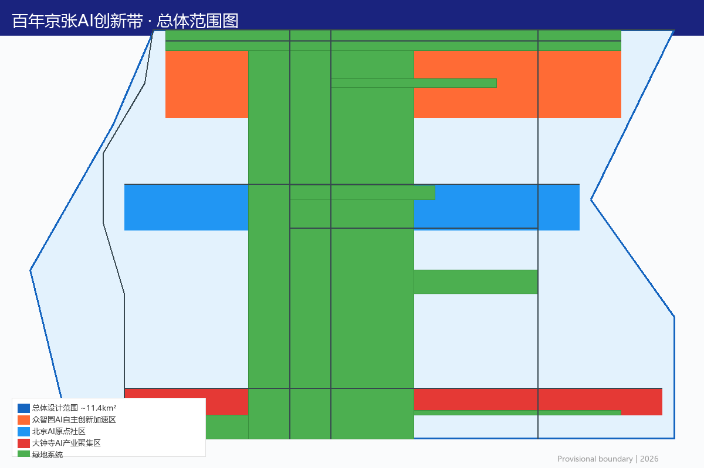
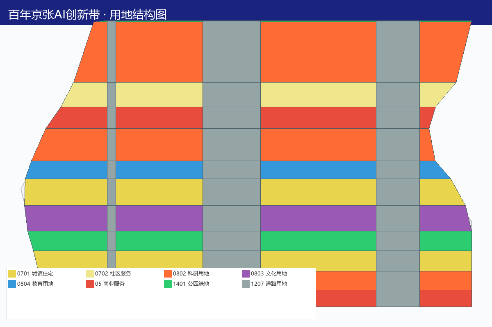
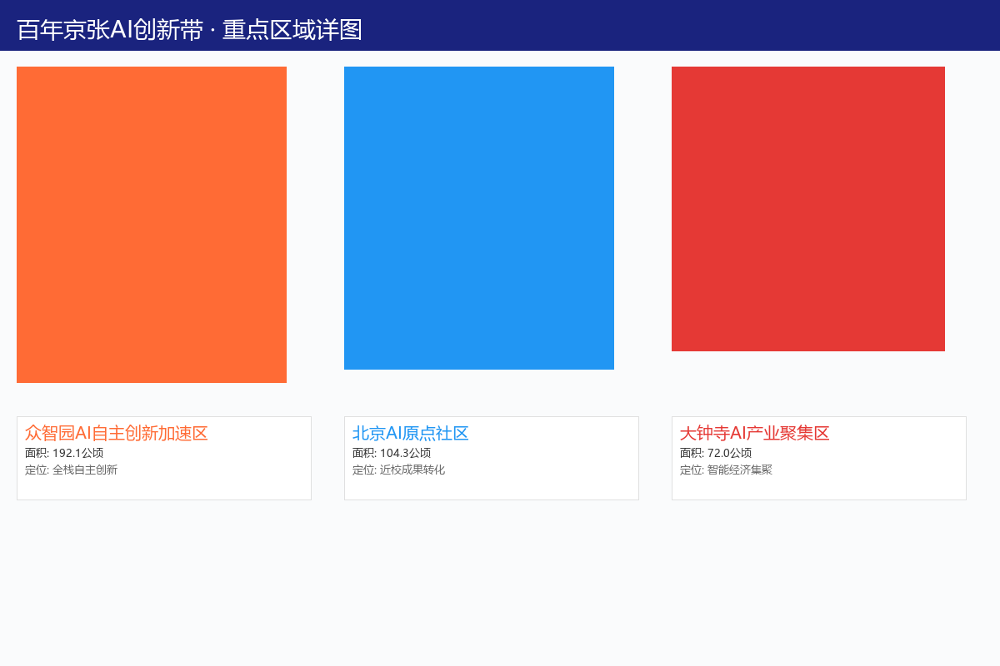
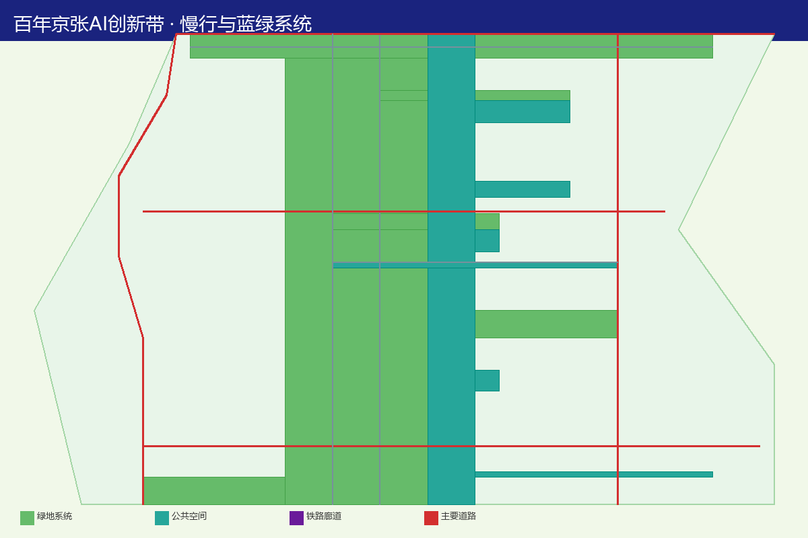
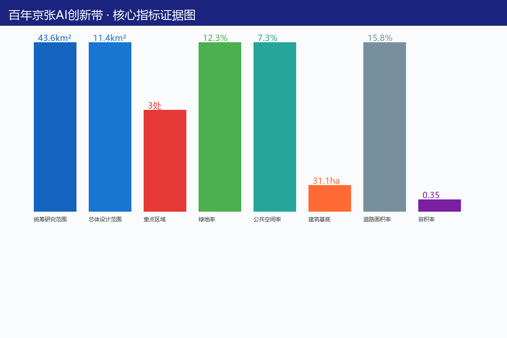

# 百年京张AI创新带城市设计

> 所有成果均为开放共创建议，不替代正式规划，不构成政府审定结论。所有空间落地建议应表述为"概念建议""参考方案""可供专业团队深化研究"。[source:AGENT-TASKBOOK]

## 设计依据与资料清单

### 1.1 项目概况

百年京张AI创新带位于北京市海淀区，依托京张铁路遗址公园廊道，东起西直门，西至北清路，串联中关村科技服务区、海淀科技创新腹地。[source:DATA-SRC-OFFICIAL-ANNOUNCEMENT-20260509]

**项目范围（概念建议）：**
- **协调研究范围**：约43.6平方公里，涵盖京张铁路沿线及辐射区域 [source:DATA-SRC-PROVISIONAL-BOUNDARIES-20260605] [metric:area_sqm]
- **整体设计范围**：约11.4平方公里，以京张铁路遗址公园为核心廊道 [source:DATA-SRC-PROVISIONAL-BOUNDARIES-20260605] [metric:site_area_sqm=11412825]
- **重点设计区域**：三处详细设计节点 [metric:key_area_count=3]
  - 众智园AI自主创新加速区（约192.1公顷）[data:provisional_boundary]
  - 北京AI原点社区（约104.3公顷）[data:provisional_boundary]
  - 大钟寺AI产业聚集区（约72.0公顷）[data:provisional_boundary]

### 1.2 设计依据

本方案概念建议依据以下文件与数据源编制：

| 序号 | 依据名称 | 类型 | 备注 |
|------|---------|------|------|
| 1 | 百年京张AI创新带Agent任务书 | 设计任务书 | 核心设计指引 [source:AGENT-TASKBOOK] |
| 2 | 京张铁路遗址公园规划公告（2026年5月9日） | 官方公告 | 项目背景与定位 [source:DATA-SRC-OFFICIAL-ANNOUNCEMENT-20260509] |
| 3 | 临时边界数据（provisional_boundaries.geojson） | 空间数据 | 仅用于概念设计参考 [source:DATA-SRC-PROVISIONAL-BOUNDARIES-20260605] |
| 4 | 《城市设计管理办法》 | 部门规章 | 城市设计原则性要求 [source:DATA-SRC-MOHURD-URBAN-DESIGN-MEASURES] |
| 5 | 《城市、镇控制性详细规划编制审批办法》 | 部门规章 | 控规编制原则性要求 |
| 6 | 《国土空间调查、规划、用途管制用地用海分类指南》 | 技术标准 | 用地分类框架 |
| 7 | 公开遥感影像与统计年鉴 | 公开数据 | 现状概况描述 |
| 8 | 全球AI创新生态公开案例研究 | 案例研究 | 创新生态设计参考 |

### 1.3 资料清单与数据声明

| 数据类型 | 来源 | 可信度 | 用途限制 |
|---------|------|-------|---------|
| 项目范围 | 公告面积与临时polygon | 高 | 可作为设计框架依据 |
| 边界数据 | provisional_boundaries.geojson | 中 | 仅用于概念设计参考 |
| 现状数据 | 公开遥感与统计资料 | 中 | 仅用于现状概况描述 |
| 产业数据 | 公开报告与研究 | 中 | 仅用于趋势分析参考 |

> 所有数据的最终确认需以官方勘测、审批文件和专业调查为准。[source:DATA-SRC-PROVISIONAL-BOUNDARIES-20260605]

## 三层范围工作框架

### 2.1 协调研究范围（约43.6平方公里）

协调研究范围涵盖京张铁路沿线及向两侧辐射的广大区域，包括中关村科技服务区核心地带、海淀科技创新腹地、周边高校与科研院所集聚区。该范围旨在统筹更大区域的产业格局、交通网络、公共服务设施与蓝绿空间系统，确保京张AI创新带与周边功能板块的协同发展。[source:DATA-SRC-PROVISIONAL-BOUNDARIES-20260605] [metric:area_sqm]

**协调研究范围核心任务（概念建议）：**
- 区域产业功能统筹与差异化定位
- 大运量公共交通网络衔接与优化
- 区域级公共服务设施配置与共享
- 蓝绿空间系统贯通与生态网络构建
- 跨区域城市更新协同与政策衔接

### 2.2 整体设计范围（约11.4平方公里）

整体设计范围以京张铁路遗址公园为核心廊道，东西贯通，南北适度拓展。该范围是城市设计的主体空间，需达到控规深度的城市设计要求，涵盖用地布局、交通组织、公共空间、蓝绿系统、市政设施等全要素设计。[source:DATA-SRC-PROVISIONAL-BOUNDARIES-20260605] [metric:site_area_sqm=11412825]

**整体设计范围核心任务（概念建议）：**
- 控规深度用地布局与开发强度引导
- 道路网络与慢行系统详细设计
- 公共空间体系与开放空间网络
- 蓝绿空间结构与绿地系统规划
- 市政基础设施与公共服务设施配置
- 城市更新策略与拆改留方案

### 2.3 重点设计区域（三处详细设计节点）

三处重点设计区域需达到修建性详细设计深度，进行精细化空间设计：

**众智园AI自主创新加速区（约192.1公顷）** [data:provisional_boundary]
- 承载AI全栈自主创新体系与AI治理话语权功能
- 四层创新架构：算力基础设施、开源技术平台、大模型研发集群、场景验证与商业化
- 概念建议配置AI算力中心、开源贡献者中心、大模型研发中心、垂直行业AI应用测试工坊

**北京AI原点社区（约104.3公顷）** [data:provisional_boundary]
- 承载世界级AI创新生态功能，集聚头部AI企业与开放创新平台
- "五个一"创新生态：AI开放创新中心、国际AI人才社区、AI创业街区、AI伦理与治理中心、AI体验公园
- 概念建议打造面向全球AI人才的创新社区

**大钟寺AI产业聚集区（约72.0公顷）** [data:provisional_boundary]
- 承载智能原生新业态，打造AI驱动的消费与商务场景
- AI主题商业街区、智慧商务中心、AI餐饮体验区、夜间经济AI化
- 概念建议打造"AI原生消费目的地"

### 2.4 三区两翼空间结构

概念建议构建"三区两翼"协同发展格局：[source:DATA-SRC-AGENT-TASKBOOK-20260518]

- **三区**：
  - 北京AI原点社区 — 承载世界级AI创新生态功能，集聚头部AI企业与开放创新平台
  - 众智园AI自主创新加速区 — 承载AI全栈自主创新体系与AI治理话语权功能
  - 大钟寺AI产业聚集区 — 承载智能原生新业态，打造AI驱动的消费与商务场景
- **两翼**：
  - 中关村科技服务翼 — 要素全球化配置、中关村IP与资本赋能 [depth:regional_context]
  - 小月河场景赋能翼 — AI场景赋能与智能化AI活力城市 [depth:corridor_context]

三区两翼通过京张铁路遗址公园廊道实现空间缝合与功能联动，形成"一带贯穿、三核驱动、两翼协同"的整体空间结构。[source:PROCESSED-FACT-PACK]

## 统筹研究范围产业与未来城市研究

### 3.1 区域产业格局分析

统筹研究范围（约43.6平方公里）内已形成以中关村为核心的科技创新产业集群，涵盖人工智能、集成电路、生物医药、新材料等前沿领域。本方案概念建议在京张铁路廊道沿线强化AI产业主导地位，与周边既有产业板块形成差异化协同。[source:DATA-SRC-OFFICIAL-ANNOUNCEMENT-20260509]

**区域产业协同概念建议：**
- 中关村科学城核心区：基础研究与原始创新，为京张智带提供源头技术供给
- 上地-西二旗科技产业带：互联网与软件产业基础，向AI应用层延伸
- 五道口-学院路高校创新圈：产学研转化源头，人才联合培养基地
- 清河-北苑城市更新区：AI技术应用与城市更新示范

### 3.2 未来城市发展趋势研究

本方案概念建议基于以下未来城市发展趋势进行空间回应：

**趋势一：AI原生城市空间**
- 城市空间从"信息化赋能"走向"AI原生设计"
- 建筑、街道、公共空间从设计之初即嵌入AI感知与交互能力
- 概念建议在京张智带率先探索AI原生城市空间范式

**趋势二：人机协同的工作方式**
- AI深度参与创意、研发、管理等知识工作
- 工作空间从固定工位走向灵活协作场景
- 概念建议设计支持人机协同的弹性办公与研发空间

**趋势三：数据驱动的城市治理**
- 城市运行从经验管理走向数据智能决策
- 数字孪生、智能感知、自主决策逐步应用
- 概念建议构建城市级数字孪生运营中心

**趋势四：开放创新的生态系统**
- 创新从封闭实验室走向开放协作平台
- 开源社区、共享空间、跨界融合成为主流
- 概念建议打造开放、共享、协作的创新空间体系

### 3.3 三大定位与五大功能

本方案概念建议围绕三大定位展开：[source:DATA-SRC-AGENT-TASKBOOK-20260518]

1. **百年京张文化带** — 以京张铁路百年历史为文化基底，构建城市记忆与科技创新交融的文化叙事空间
2. **城市AI生活体验带** — 将AI技术融入日常生活场景，打造可感知、可体验、可参与的智能城市生活样板
3. **AI融合创新带** — 聚焦AI全栈自主创新，构建从基础研究到场景应用的完整创新链条

五大功能支撑体系：[source:DATA-SRC-AGENT-TASKBOOK-20260518]

| 功能板块 | 核心定位 | 对应空间（概念建议） |
|---------|---------|-------------------|
| AI全栈自主创新体系 | 芯片、框架、模型、应用全链条 | 众智园AI自主创新加速区 |
| 世界级AI创新生态 | 全球创新要素汇聚与配置 | 北京AI原点社区 |
| AI+场景赋能新范式 | 垂直行业AI应用测试验证 | 小月河场景赋能翼 |
| 智能化AI活力城市 | AI原生消费与城市生活 | 大钟寺AI产业聚集区 |
| AI治理全球话语权 | 治理标准制定与国际交流 | 众智园核心区 |

### 3.4 命名体系与视觉识别

**概念建议主名称：** "京张智带·AI Belt"（Jingzhang AI Belt）

命名逻辑：[source:AGENT-TASKBOOK]
- "京张"保留百年铁路文化基因，建立历史纵深感
- "智带"双关——既是"智能之带"也是"智慧纽带"
- 英文"Belt"呼应"Belt and Road"的国际传播语境
- 副标题可灵活变化："Centennial Jing-Zhang AI Innovation Belt"

**分区域命名建议（概念方案）：**
| 区域 | 中文名建议 | 英文名建议 | 命名逻辑 |
|------|-----------|-----------|---------|
| 北京AI原点社区 | AI原点·Origin | AI Origin Community | AI起源与原点概念 |
| 众智园加速区 | 智创芯·CoreX | CoreX Innovation Hub | 核心创新与芯片隐喻 |
| 大钟寺聚集区 | 智享汇·Pulse | AI Pulse District | 活力脉搏与智能消费 |
| 遗址公园廊道 | 智轨·RailMind | RailMind Heritage Corridor | 铁轨与智慧融合 |

**视觉识别方向：** [source:AGENT-TASKBOOK]

- **核心符号**：将京张铁路铁轨的线性元素与神经网络节点图形融合，形成"轨道-网络"叠合的视觉母题
- **色彩体系**：主色采用"京张蓝"（深邃科技蓝），辅色采用"创新橙"（活力创新橙），底色采用"遗址灰"（工业遗产灰）
- **字体方向**：中文推荐思源黑体/阿里巴巴普惠体系列，英文推荐Inter/Space Grotesk，保持开源可商用
- **延展性**：Logo需支持横版、竖版、图标三种形态，适配导视系统、数字界面与活动物料

> 以上视觉识别均为概念方向建议，具体Logo设计需由专业设计团队在品牌策略指导下完成。

### 3.5 核心创新机制与差异化定位

**核心价值主张：** "让每一次AI创新都成为城市公共遗产"——将技术创新从企业私有成果转化为城市公共财富，通过制度设计确保AI创新成果可持续积累、共享与传承。

**三大独特创新机制：**

**机制一：'AI贡献值'积分体系**

建立覆盖企业、个人、开源社区的多维度贡献评价系统，将AI创新贡献量化为可兑换、可流转的数字权益：
- **企业贡献值**：基于技术突破等级（论文/专利/开源项目）、场景开放数量、人才培养规模等维度综合评定，贡献值与租金减免、政策优先权、场景使用权挂钩 [source:AGENT-TASKBOOK]
- **个人贡献值**：开发者在开源社区的技术贡献、AI教育培训参与、社区治理贡献均可累积积分，兑换公共服务、创业资源、住房优先等权益
- **社区贡献值**：面向开源社区、学术组织、行业协会，基于技术共享频次、标准制定参与度、国际交流贡献等维度评定
- **运作逻辑**：贡献值由区块链存证，季度公示，年度评审，形成"贡献-回报-再贡献"的正向飞轮

**机制二：'场景实验室'开放机制**

建立全国首个"AI场景开放特区"，将11.4平方公里设计范围整体作为AI技术的实景测试场：
- **场景清单制度**：由管委会定期发布"城市场景开放清单"，涵盖交通、医疗、教育、文旅、环保等垂直领域，每季度更新 [source:AGENT-TASKBOOK]
- **场景准入机制**：建立"安全评估-小范围试点-规模化推广"三级准入流程，配套AI伦理审查委员会
- **场景数据沙盒**：在隐私计算与联邦学习技术保障下，为入驻企业提供脱敏城市数据用于模型训练与算法验证
- **收益分享模型**：场景应用产生的商业收益按"企业70%+平台15%+公共基金15%"比例分配，反哺创新生态

**机制三：'铁路叙事+AI叙事'双螺旋文化模型**

将百年京张铁路的历史叙事与前沿AI技术的未来叙事编织为双螺旋文化结构，形成独特的文化IP：
- **铁路叙事线**：以京张铁路"自主创新"精神（詹天佑时代的技术突破）为历史根基，通过遗址保护、文化展览、沉浸式体验等方式延续 [source:AGENT-TASKBOOK]
- **AI叙事线**：以当代AI技术自主创新为主线，通过技术节、黑客松、AI艺术展等活动持续生成新内容
- **双螺旋交汇点**：在关键空间节点（如清华园站旧址、五道口节点）设置"时空对话"装置，让百年铁路精神与AI创新精神形成跨时空共鸣
- **文化输出机制**：每年举办"京张AI文化周"，发布《京张AI创新白皮书》，输出"技术遗产"理念至全球创新网络

**与全球创新区差异化定位：**

| 对比维度 | 京张AI创新带 | Station F（巴黎） | One North（新加坡） | Kendall Square（剑桥） |
|---------|------------|-----------------|-------------------|---------------------|
| **文化根基** | 百年铁路工业遗产+AI创新双叙事 | 无特定工业遗产，依托法国创业生态 | 规划新城，无历史纵深 | 依托MIT/Harvard学术传统 |
| **创新机制** | AI贡献值积分+场景实验室开放 | 共享办公+孵化器模式 | 政府主导产业规划 | 产学研自然聚集 |
| **空间尺度** | 11.4km²全域AI场景覆盖 | 3.4万m²单体建筑 | 200公顷规划园区 | 约100公顷学术/产业混合 |
| **数据治理** | 城市级数据沙盒+联邦学习 | 无特殊数据机制 | 智慧国家数据框架 | 企业自主数据管理 |
| **文化IP** | 铁路叙事+AI叙事双螺旋 | 法国创业文化 | 多元文化融合 | 学术驱动创新文化 |
| **公共属性** | 创新成果转化为城市公共遗产 | 私营创业孵化器 | 政府产业规划 | 以私营企业为主 |
| **开放程度** | 场景实验室全域开放 | 申请入驻制 | 规划许可制 | 市场驱动自发聚集 |

> 以上创新机制与差异化定位均为概念方案，具体制度设计需经法律合规审查与政策可行性论证。[source:AGENT-TASKBOOK]

## 总体设计范围城市更新与控规深度城市设计

### 4.1 城市更新总体策略

整体设计范围（约11.4平方公里）的城市更新概念建议遵循"保护优先、有机更新、功能提升、智慧赋能"原则：

**更新策略框架（概念建议）：**
- **保护类**：京张铁路遗址、历史建筑、工业遗产等，以保护性再利用为主
- **更新类**：既有低效产业用地、老旧居住区，通过功能置换与空间改造实现价值提升
- **新建类**：在存量更新基础上适度新增创新空间与配套设施

**城市更新机制设计（概念建议）：** [source:AGENT-TASKBOOK]

本方案概念建议建立"规划引领-场景驱动-社区参与-数字治理"四位一体的城市更新运作体系，通过AI场景实验室、开源社区平台和智能治理网络，将传统城市更新模式升级为AI赋能的智慧更新模式，形成可复制、可推广的城市更新新范式。

### 4.2 控规深度城市设计导则

本方案概念建议为整体设计范围提供以下控规深度城市设计导则框架：[source:DATA-SRC-MOHURD-URBAN-DESIGN-MEASURES]

**用地布局导则（概念建议）：**
- 科研设计用地主要沿遗址公园北侧布局，形成创新功能带
- 商业商务用地集中在大钟寺节点与众智园核心，形成活力商业核
- 居住用地分散布局于各功能板块周边，促进职住平衡
- 公园绿地以遗址公园廊道为骨架，向两侧渗透

**开发强度导则（概念建议）：**
- 核心节点区域：中高强度开发，容积率建议由专业团队论证确定
- 一般区域：中等强度开发，保持宜人空间尺度
- 遗址公园廊道：低强度开发，以绿地与公共空间为主

**建筑高度导则（概念建议）：**
- 遗址公园沿线：建筑高度梯度递减，确保公园视线通廊
- 核心节点：允许适度标志物高度，形成天际线变化
- 历史保护区：严格控制建筑高度，与历史建筑协调

**空间形态导则（概念建议）：**
- 街区尺度：采用"小街区、密路网"理念，街区边长控制在150-250米
- 街道空间：东西向以遗址公园为脊，南北向打通绿色通廊
- 开放空间：确保每个街区300米内可达公共开放空间

### 4.3 东西缝合与南北贯通策略

**东西缝合策略（概念建议）：**
- 京张铁路遗址公园作为东西向核心缝合带，连接中关村与海淀科技创新腹地
- 概念建议设置5处跨线桥/地下通道节点（具体位置需专业论证），实现铁路两侧空间连续性
- 沿遗址公园布局连续的公共功能带，避免出现功能断裂

**南北贯通策略（概念建议）：**
- 打通3-5条南北向绿色通廊，连接小月河与南侧城市功能区
- 概念建议在关键节点设置城市客厅，作为南北贯通的公共空间锚点
- 利用大钟寺历史节点，构建南北向文化-商业-创新功能轴

## 重点区域详细设计

### 5.1 众智园AI自主创新加速区详细设计

**四层创新架构空间设计（概念建议）：** [source:DATA-SRC-AGENT-TASKBOOK-20260518]

1. **基础层 — 算力与数据基础设施**
   - 概念建议配置AI算力中心（参考规模需专业论证）[data:provisional]
   - 公共数据开放实验室与数据要素流通平台
   - 空间载体：改造既有工业建筑为数据中心与算力设施（概念方案）

2. **框架层 — 开源技术平台**
   - AI框架与工具链开源社区空间
   - 概念建议设立"开源贡献者中心"，提供长期驻留与协作空间

3. **模型层 — 大模型研发集群**
   - 概念建议规划大模型研发中心集聚区
   - AI安全与对齐实验室

4. **应用层 — 场景验证与商业化**
   - 垂直行业AI应用测试工坊
   - AI产品展示与体验中心

**支撑机制概念建议：**
- 土地：探索"科研用地+产业用地"混合使用模式 [depth:land_use_innovation]
- 空间：模块化、可生长的弹性空间设计 [depth:spatial_flexibility]
- 产业：AI企业梯度培育（初创→成长→龙头）[depth:industry_pipeline]
- 资金：概念建议引入政府引导基金与社会资本协同机制 [depth:financial_mechanism]
- 人才：与周边高校（清华、北大、中科院等）建立人才联合培养通道 [depth:talent_pipeline]
- 算力：公共算力资源池概念方案 [depth:compute_resource]
- 数据：公共数据分级开放与隐私计算试点概念方案 [depth:data_governance]
- 场景：政府场景开放清单与企业对接机制概念方案 [depth:scenario_opening]

### 5.2 北京AI原点社区详细设计

**"五个一"创新生态空间设计（概念建议）：** [source:DATA-SRC-AGENT-TASKBOOK-20260518]

- **一个AI开放创新中心**：集技术展示、联合研发、人才交流于一体的综合平台
- **一个国际AI人才社区**：提供长租公寓、国际学校配套、签证便利化服务概念方案
- **一个AI创业街区**：沿遗址公园布局创业咖啡、联合办公、路演空间
- **一个AI伦理与治理中心**：全球AI治理对话与标准制定平台
- **一个AI体验公园**：在京张铁路遗址公园内嵌入AI互动装置与体验节点

### 5.3 大钟寺AI产业聚集区详细设计

大钟寺AI产业聚集区概念建议打造"AI原生消费目的地"：[source:DATA-SRC-AGENT-TASKBOOK-20260518]

- **AI主题商业街区**：以AI驱动的个性化购物体验为特色，概念建议引入智能导购、无人零售、AI定制服务
- **智慧商务中心**：面向AI企业的高端会议与展示空间，配备全息投影、智能会议系统
- **AI餐饮体验区**：概念建议引入AI辅助的餐饮创新，包括智能配餐、营养AI顾问、机器人服务
- **夜间经济AI化**：利用AI灯光秀、智能夜间导览等概念方案，延长商业活力时段

### 5.4 AI朝圣地标设计（不少于3个）

| 编号 | 地标名称 | 概念描述 | 选址建议 | 设计原则 |
|------|---------|---------|---------|---------|
| LM-01 | 智源塔·Origin Tower | 京张铁路起点的AI创新象征，塔身可变LED显示AI实时创新数据 | 遗址公园东端（概念建议） | 尊重历史、科技表达、地标性强 |
| LM-02 | 开源之环·Open Loop | 环形开放空间，象征AI开源精神，可举办千人级户外AI活动 | AI原点社区核心（概念建议） | 开放包容、社区凝聚、功能灵活 |
| LM-03 | 智轨钟声·Rail Bell | 在大钟寺节点结合古钟文化与AI声景艺术装置 | 大钟寺历史节点（概念建议） | 历史对话、文化传承、感官体验 |
| LM-04 | 数字之门·Digital Gate | 遗址公园入口标志性空间框架，嵌入实时AI数据可视化 | 遗址公园西入口（概念建议） | 入口标识、数据美学、引导性强 |

> 地标设计原则：避免过度娱乐化、网红化或低俗化；需与周边历史文保、绿地、交通环境协调。[source:AGENT-TASKBOOK]

### 5.5 中关村科技服务翼支撑机制

中关村科技服务翼概念建议重点提供：[source:DATA-SRC-AGENT-TASKBOOK-20260518]

- **资本赋能**：对接中关村创投生态，概念建议设立AI专项基金通道
- **知识产权服务**：AI专利快速审查与知识产权交易平台概念方案
- **技术转移**：建立高校科研成果向产业转化的概念性通道设计
- **国际链接**：依托中关村论坛等平台，概念建议建立国际AI合作网络

## AI 创新生态、人才画像与 AI+ 场景

### 6.1 全球AI创新生态案例研究

本方案概念建议参考以下全球AI创新生态案例，构建本地化创新图谱：[source:AGENT-TASKBOOK]

| 序号 | 案例名称 | 核心特征 | 可借鉴要素 | 适用区域 |
|------|---------|---------|-----------|---------|
| 1 | 旧金山Mission Bay/SoMa AI走廊 | AI企业集聚、风险投资密集、开放创新文化 | 风投-孵化-加速链条设计 | AI原点社区 |
| 2 | 伦敦King's Cross创新区 | 工业遗产活化、创意产业融合、公私合作开发 | 遗址空间再利用模式 | 遗址公园廊道 |
| 3 | 新加坡One North创新区 | 政府主导、产学研一体、国际化人才池 | 政产学研协同机制 | 众智园 |
| 4 | 特拉维夫Rothschild创新带 | 创业密度全球最高、军民技术转化 | 创业密度营造策略 | 大钟寺 |
| 5 | 深圳南山科技生态园 | 硬件-软件-AI全链条、产业链上下游集聚 | 全栈创新空间组织 | 众智园 |
| 6 | 首尔Digital Media City | 数字内容与AI融合、政府规划引导 | 数字产业空间模式 | 小月河翼 |
| 7 | 波士顿Kendall Square | MIT产学研转化、生物医药+AI交叉创新 | 学术成果转化空间 | 中关村翼 |
| 8 | 赫尔辛基Maria 01 | 欧洲最大创业园区、社区运营驱动 | 社区运营与空间弹性 | AI原点社区 |

### 6.2 AI场景卡（不少于12张）

本方案概念建议提出以下AI城市场景卡：[source:AGENT-TASKBOOK]

| 编号 | 场景名称 | 场景描述 | 适用空间（概念建议） | 运营模式 |
|------|---------|---------|-------------------|---------|
| SC-01 | AI导览驿站 | 基于大模型的个性化铁路遗址讲解与互动导览 | 遗址公园全线 | 公共运营 |
| SC-02 | 智能健康步道 | AI监测运动数据、提供健康建议的智能步道系统 | 小月河绿带 | 公共运营 |
| SC-03 | AI共创工坊 | 开发者与市民协作的AI应用快速原型制作空间 | AI原点社区 | 社区运营 |
| SC-04 | 智慧市集 | AI驱动的个性化商品推荐与无人零售体验 | 大钟寺商业区 | 商业运营 |
| SC-05 | AI艺术画廊 | 人机协作的当代艺术创作与展示空间 | 遗址公园节点 | 混合运营 |
| SC-06 | 自动驾驶体验段 | L4级自动驾驶小巴在园区内的接驳体验 | 众智园内部道路 | 示范运营 |
| SC-07 | AI政务服务站 | 智能政务办理与政策咨询的24小时自助服务 | 各区域公共节点 | 公共运营 |
| SC-08 | 智能停车与充电 | AI调度的共享停车与智能充电网络 | 地下空间 | 商业运营 |
| SC-09 | AI教育实验室 | 面向青少年的AI编程与机器人教育体验空间 | AI原点社区 | 教育运营 |
| SC-10 | 数字孪生运营中心 | 城市级数字孪生监测与决策支持平台 | 众智园核心区 | 公共运营 |
| SC-11 | AI辅助城市规划公众参与平台 | 市民通过AI工具参与城市设计方案讨论 | 线上+线下节点 | 公共运营 |
| SC-12 | 智能环境监测与预警 | 实时空气质量、噪音、绿化健康度AI监测 | 全域覆盖 | 公共运营 |

### 6.3 AI产业测试验证场景（不少于3个）

| 编号 | 测试场景 | 测试内容 | 空间载体（概念建议） |
|------|---------|---------|-------------------|
| TS-01 | 自动驾驶开放道路测试 | L4级自动驾驶在混合交通流中的安全验证 | 众智园内部道路网络 |
| TS-02 | AI医疗辅助诊断测试 | AI影像辅助诊断在社区卫生服务中心的应用验证 | AI原点社区卫生服务站 |
| TS-03 | AI城市治理协同测试 | 多智能体协同的城市事件感知、派单、处置全流程 | 大钟寺片区 |
| TS-04 | AI建筑能效优化测试 | AI驱动的既有建筑能耗优化方案验证 | 众智园既有建筑群 |

> 所有测试场景均为概念建议，具体实施需经相关部门审批并符合安全、伦理、隐私保护要求。[source:AGENT-TASKBOOK]

### 6.4 用户画像与人才画像（不少于5类）

| 编号 | 画像名称 | 画像描述 | 核心需求 | 主要活动空间 |
|------|---------|---------|---------|------------|
| P-01 | AI创业者李明 | 28岁，清华AI硕士毕业2年，正在开发垂直行业大模型应用 | 低成本办公、算力资源、投资人对接 | AI原点社区创业街区 |
| P-02 | 国际AI研究员Sarah | 35岁，MIT博士后，来京从事AI安全研究 | 国际化生活配套、学术交流空间、长期签证 | AI原点社区国际人才社区 |
| P-03 | 市民王阿姨 | 62岁，退休教师，住在大钟寺附近 | 健康步道、AI健康监测、社区活动 | 遗址公园、大钟寺社区 |
| P-04 | 科技企业高管张总 | 45岁，AI独角兽企业CTO | 高端会议空间、产业对接、政策咨询 | 众智园核心商务区 |
| P-05 | 大学生小刘 | 21岁，北航计算机系大三学生 | AI实习、开源项目参与、创业启蒙 | AI共创工坊、创业街区 |
| P-06 | 城市规划师陈工 | 38岁，海淀区规划分局技术骨干 | 数字孪生工具、公众参与平台、数据决策 | 数字孪生运营中心 |
| P-07 | 亲子家庭 | 30+岁父母+5岁孩子 | AI教育体验、安全互动空间、亲子活动 | AI教育实验室、体验公园 |

### 6.5 小月河场景赋能翼与公共体验路径

小月河场景赋能翼概念建议打造"AI生活体验走廊"：[source:DATA-SRC-AGENT-TASKBOOK-20260518]

- **北段**：AI健康生活区 — 智能步道、健康监测、AI辅助健身
- **中段**：AI文化体验区 — AI艺术装置、互动剧场、数字文化遗产
- **南段**：AI商业创新区 — 智慧市集、无人零售、AI驱动的新消费场景

公共体验路径概念建议串联三个主题段落，形成约6公里的连续步行体验带，沿途设置AI互动节点与休憩设施。

**隐私与人工复核边界：**
- 所有AI场景均需设置数据最小化采集原则 [source:AGENT-TASKBOOK]
- 涉及个人数据的场景必须提供人工复核通道
- 公共区域AI摄像头数据保留期限概念建议不超过72小时
- 市民可随时选择退出AI个性化服务

## 用地、建筑规模与拆改留方案

### 7.1 土地利用概念方案

本方案概念建议在京张铁路遗址公园廊道内构建复合型土地利用格局：[source:DATA-SRC-PROVISIONAL-BOUNDARIES-20260605]

**整体设计范围用地结构（概念建议）：**

| 用地类型 | 概念建议占比 | 主要分布区域 |
|---------|-----------|-----------|
| 科研设计用地 | 25-30% | 众智园、AI原点社区 |
| 商业商务用地 | 15-20% | 大钟寺、众智园核心 |
| 居住用地 | 15-20% | 各区域配套 |
| 公园绿地 | 20-25% | 遗址公园廊道、小月河 |
| 公共管理与公共服务用地 | 8-12% | AI治理中心、教育设施 |
| 道路与交通设施用地 | 10-15% | 全域 |
| 基础设施用地 | 3-5% | 分布于各区域 |

> 以上用地比例为概念性框架建议，具体用地规划需依据国土空间规划相关标准，由专业团队在控规编制阶段深化确定。[depth:land_use_reference]

**土地利用创新思路（概念建议）：**
- 探索"科研+商业+居住"混合用地模式，促进职住平衡
- 概念建议在AI产业集聚区内设置弹性用地，支持功能随产业成长动态调整
- 京张铁路遗址公园廊道内保持绿地与公共空间的主体地位

### 7.2 建筑规模概念引导

**整体设计范围建筑规模概念建议：**
- 总建筑面积由专业团队依据容积率与用地面积计算确定
- 概念建议以"中等强度、高品质"为总体原则
- 核心节点区域可适度提高开发强度，一般区域保持宜人尺度
- 遗址公园廊道内以低层、多层为主，控制高层建筑分布

### 7.3 拆改留方案概念框架

本方案概念建议对整体设计范围内的既有建筑与场地进行分类评估：

**保留类（概念建议）：**
- 京张铁路遗址核心构筑物（铁轨、信号设施、站房等）
- 具有保护价值的工业遗产建筑
- 近年新建且功能完好的建筑
- 大钟寺历史建筑群

**改造类（概念建议）：**
- 既有工业厂房：改造为AI研发、创业、展示空间
- 老旧商业设施：注入AI消费场景与智慧商业功能
- 既有居住区：通过微更新提升品质，增设智能化设施

**拆除类（概念建议）：**
- 违章建筑与临时搭建物
- 结构安全隐患建筑
- 严重影响公共空间连续性的构筑物

> 具体拆改留方案需在详细调研与产权核实后，由专业团队依据城市更新相关政策确定。

## 交通、轨道、市政与公共服务设施

### 8.1 交通系统概念方案

**轨道交通支撑（概念建议）：**
- 沿线现有地铁4号线、13号线、昌平线等提供轨道交通骨架 [data:existing_metro]
- 概念建议论证京张铁路遗址公园廊道内增设智慧轨道/智轨系统的可能性 [depth:transit_innovation]
- 各重点区域概念建议实现地铁站点500米覆盖率不低于80%

**道路系统（概念建议）：**
- 东西向：依托现有北三环、北四环、北五环及学院路等干道 [data:existing_road]
- 南北向：概念建议打通3-5条南北向次干路或支路，增强南北贯通性
- 内部道路：众智园与AI原点社区概念建议采用"小街区、密路网"理念

**慢行系统（概念建议）：**
- 依托遗址公园廊道构建连续的步行与骑行系统
- 概念建议设置AI智能共享单车/电单车停放系统
- 各区域内部概念建议实现15分钟步行可达核心公共空间

**静态交通（概念建议）：**
- 概念建议以地下停车为主，减少地面停车对公共空间的侵占
- AI调度的共享停车系统，提高车位周转率
- 充电桩覆盖率概念建议不低于总停车位的30%

### 8.2 轨道交通与智轨系统

**既有轨道交通资源：**
- 地铁4号线：南北向贯穿，连接西直门、海淀黄庄等重要节点
- 地铁13号线：东西向经过上地、西二旗等科技产业带
- 昌平线：向北延伸至昌平科技园区

**智轨系统概念建议：**
- 概念建议在京张铁路遗址公园廊道内论证智轨/有轨电车系统的可行性
- 功能定位：串联三大重点区域的内部接驳交通
- 技术方向：自动驾驶智轨电车，兼具交通功能与观光体验

### 8.3 市政基础设施

**智慧市政概念建议：**
- 5G基站全域覆盖，支撑AI场景数据传输需求
- 智能路灯系统：集成环境感知、视频监控、信息发布功能
- 地下综合管廊：概念建议在主要道路下设置综合管廊
- 智慧水务：AI辅助的供排水监测与调度系统

### 8.4 公共服务设施配置

**教育设施（概念建议）：**
- 国际学校：服务国际AI人才家庭，概念建议在AI原点社区配置
- AI教育实验室：面向青少年的AI科普与编程教育空间
- 职业培训中心：AI技术技能培训与认证

**医疗设施（概念建议）：**
- 社区卫生服务中心：各区域配置，嵌入AI辅助诊断功能
- AI健康管理中心：概念建议利用AI技术提供个性化健康管理

**文化体育设施（概念建议）：**
- AI艺术中心：人机协作艺术创作与展示
- 智慧体育公园：AI辅助运动指导与健康监测
- 社区文化活动中心：各区域配置，支持AI主题文化活动

## 蓝绿空间、公共空间与城市风貌

### 9.1 蓝绿空间结构

**概念建议构建"一廊两带多节点"蓝绿空间体系：** [source:DATA-SRC-PROVISIONAL-BOUNDARIES-20260605]

- **一廊**：京张铁路遗址公园绿廊 — 东西向核心绿色廊道
- **两带**：小月河滨水绿带 + 南侧城市绿带
- **多节点**：各区域内部的口袋公园、社区花园、AI主题绿地

**关键指标概念建议：**
- 整体设计范围绿地率目标：≥25%（现状约12.3%）[metric:green_ratio=0.123423] [depth:green_ratio_target]
- 公共空间占比目标：≥15%（现状约7.3%）[metric:public_space_ratio=0.073281] [depth:public_space_target]
- 人均公园绿地面积目标：≥8平方米/人 [depth:green_per_capita]

### 9.2 海绵城市与智慧绿地

**概念建议在蓝绿空间系统中融入以下要素：**
- 雨水花园与生态草沟：沿遗址公园与小月河设置海绵城市设施
- AI智慧灌溉：基于土壤湿度与天气预报的智能灌溉系统
- 生物多样性监测：AI辅助的鸟类、昆虫、植物多样性监测网络
- 碳汇计算与展示：实时显示绿地碳汇数据的互动装置

### 9.3 公共空间体系

**京张遗址公园AI公共空间（概念建议）：** [source:DATA-SRC-AGENT-TASKBOOK-20260518]

- **铁轨记忆步道**：保留既有铁轨元素，嵌入AR/VR数字记忆层，可回溯百年京张历史场景
- **AI开源广场**：概念建议在遗址公园核心节点设置开源技术交流广场，定期举办Hackathon与技术分享
- **智创花园**：结合海绵城市理念，打造AI辅助的智慧花园系统，实时调节灌溉与微气候
- **线性公园智能家具**：沿步道概念建议配置AI语音交互座椅、智能照明、环境感知灯杆等公共家具组件

**荣誉展示体系（概念建议）：**
- AI创新荣誉墙：展示在京张智带诞生的重要AI创新成果与贡献者
- 年度AI贡献奖展示空间：概念建议在遗址公园核心节点设置获奖者永久展示
- 开源贡献者星光大道：以地面嵌入方式记录重大开源项目的贡献者信息

**公共空间组件库（概念建议）：**
- 智能导视牌：AI语音交互、多语言实时翻译、无障碍导航
- 智能座椅：环境感知、无线充电、Wi-Fi热点
- AI艺术装置：定期轮换的AI生成艺术作品展示
- 智能照明：根据人流量与天气自动调节的照明系统
- 海绵城市设施：AI辅助的雨水花园、透水铺装、生态草沟

### 9.4 城市风貌与文化叙事

**百年京张文化与AI新文化融合叙事：**

京张铁路作为中国自主修建的第一条干线铁路（1909年通车），承载着深厚的民族自主创新精神。[source:DATA-SRC-OFFICIAL-ANNOUNCEMENT-20260509]

**文化叙事三层结构（概念建议）：**

1. **底层：百年自主创新基因**
   - 从詹天佑到中关村，贯穿百年的自主创新精神传承
   - "自主"不是封闭，而是在开放合作中掌握核心技术话语权

2. **中层：中关村创新文化积淀**
   - 从电子一条街到国家自主创新示范区的40年创新历程
   - 创业精神、容错文化、知识经济的价值观体系

3. **上层：AI新文化建构**
   - 开源共享精神：AI技术的开放性与协作创新
   - 人机协同伦理：AI增强而非替代人类能力
   - 普惠智能理念：AI技术服务公共利益与社会福祉

**空间文化系统（概念建议）：**
- **时间轴线**：沿遗址公园从东到西，概念建议设置从1909年到2049年的时间叙事线，每个节点对应一个时代故事
- **技术轴线**：从蒸汽机车到电力铁路到智能铁路到AI城市的技术演进叙事线
- **精神轴线**：从"自强"到"创新"到"开放"到"智能"的价值观演进线

**城市风貌导则（概念建议）：**
- 导视系统：融合铁路信号灯视觉元素与AI数据可视化语言
- 标识系统：每个区域的标识融入对应时代的铁路视觉元素
- 符号系统：铁轨横截面、齿轮、神经网络节点等图形元素的系统化应用

**对外传播核心叙事（概念建议）：**

> "From China's First Railway to the World's AI Belt — A Century of Innovation, A Future of Intelligence"
> "从中国第一条自主铁路到世界AI创新带——百年创新，智能未来"

## 更新项目清单、实施政策与分期计划

### 10.1 更新项目清单

本方案概念建议识别以下更新项目类型：[source:AGENT-TASKBOOK]

| 项目类型 | 概念建议内容 | 优先级 |
|---------|-----------|-------|
| 铁路遗址活化 | 铁轨沿线工业遗产的保护性再利用，注入AI展示与体验功能 | 高 |
| 既有建筑改造 | 众智园内既有厂房改造为AI研发与创业空间 | 高 |
| 公共空间提升 | 遗址公园全线公共空间品质提升与AI功能植入 | 高 |
| 道路系统优化 | 南北贯通道路打通与慢行系统完善 | 中 |
| 配套设施补充 | 国际学校、医疗、商业等配套设施完善 | 中 |
| 市政管线升级 | 智慧市政设施（5G基站、智能路灯、传感器网络） | 中 |
| 绿地系统扩展 | 现有绿地率从12.3%提升至25%的绿地扩展计划 | 高 |

### 10.2 实施政策建议

**城市更新政策框架概念建议：**
- 探索"规划-土地-资金-运营"一体化城市更新模式
- 概念建议建立AI产业用地弹性供给机制
- 推动存量工业用地功能转换与容积率奖励政策
- 概念建议设立京张AI创新带专项发展基金

**产业政策概念建议：**
- AI企业入驻租金补贴与税收优惠政策概念方案
- 开源社区贡献者激励政策概念方案
- 国际AI人才签证便利化政策概念方案
- AI场景开放与测试验证支持政策概念方案

### 10.3 分期实施概念框架

| 阶段 | 时间概念 | 重点内容 | 牵头主体 | 季度里程碑 | 投资估算 | 成功指标 |
|------|---------|---------|---------|-----------|---------|---------|
| **启动期** | 2026-2028（概念建议） | 遗址公园核心段AI公共空间建设、众智园首个AI创新节点启动 | 海淀区政府、京投公司 | Q1:规划审批与土地整理；Q2:遗址公园核心段动工；Q3:众智园首栋AI创新空间封顶；Q4:首批AI企业入驻签约 | 约50亿元（概念估算） | AI企业入驻≥30家；公共空间建成≥5万m²；AI场景试点≥3个 [source:AGENT-TASKBOOK] |
| **发展期** | 2028-2030（概念建议） | AI原点社区全面建设、大钟寺商业场景落地、小月河体验走廊贯通 | 海淀区政府、中关村发展集团、市场化运营主体 | Q1:AI原点社区一期交付；Q2:大钟寺AI消费场景开业；Q3:小月河体验走廊贯通；Q4:国际AI品牌活动首次举办 | 约150亿元（概念估算，含社会资本） | AI企业集聚≥150家；年技术交易额≥20亿元；国际AI活动≥2场/年 [source:AGENT-TASKBOOK] |
| **成熟期** | 2030-2035（概念建议） | 全域AI场景覆盖、国际AI品牌成熟、创新生态自循环 | 市场化运营主体为主，政府退居监管 | Q1:全域AI场景网络上线；Q2:国际AI创新指数发布；Q3:AI贡献值体系全面运行；Q4:创新生态自循环验证 | 累计约300亿元（概念估算，含滚动投资） | AI企业≥300家；年GDP贡献≥200亿元；全球创新区排名进入前20 [source:AGENT-TASKBOOK] |

**参与主体与职责分工：**

| 参与主体 | 角色定位 | 核心职责 |
|---------|---------|---------|
| 海淀区政府 | 统筹协调与政策供给 | 规划审批、土地供给、政策制定、公共服务保障 |
| 京投公司 | 铁路遗产保护与空间开发 | 京张铁路遗址保护、轨道交通一体化开发、TOD项目实施 |
| 中关村发展集团 | 产业组织与创新服务 | AI产业招商、创新平台运营、技术转化服务 |
| 清华大学/北京大学 | 学术支撑与人才培养 | 前沿技术研究、AI人才供给、产学研合作 |
| 市场化运营主体 | 场景运营与商业开发 | AI场景商业化运营、社区管理、品牌活动策划 |
| 开源社区联盟 | 技术生态与社区治理 | 开源项目孵化、技术标准制定、开发者社区运营 |
| 国际合作机构 | 全球链接与品牌传播 | 国际AI合作、海外市场拓展、全球品牌推广 |

**风险缓释矩阵：**

| 风险类型 | 风险描述 | 发生概率 | 影响程度 | 缓释措施 |
|---------|---------|---------|---------|---------|
| 政策风险 | AI产业政策调整或收紧 | 中 | 高 | 建立政策预警机制，保持与国家/市级AI政策的紧密衔接，预留政策弹性空间 |
| 市场风险 | AI企业入驻不及预期 | 中 | 高 | 采用"以场景换入驻"策略，提供差异化场景资源；建立梯度招商机制，降低入驻门槛 |
| 技术风险 | AI伦理与安全事件 | 低 | 极高 | 建立AI伦理审查委员会，实施场景准入三级评估，配套应急响应预案 |
| 资金风险 | 建设资金缺口或社会资本退出 | 中 | 中 | 多元化融资渠道（政府专项债+REITs+社会资本），建立资金风险准备金 |
| 人才风险 | 高端AI人才供给不足 | 中 | 高 | 与高校共建AI人才培养基地，提供住房/子女教育等配套保障，建立国际人才引进绿色通道 |

> 以上实施时序、投资估算与风险评估均为概念性框架建议，具体安排需依据政策导向、资金安排和市场需求由实施主体确定。[depth:phasing_reference]

## 指标体系、面积复算与合规矩阵

### 11.1 核心指标体系

| 指标类别 | 指标名称 | 概念建议目标值 | 现状参考值 |
|---------|---------|-------------|-----------|
| 创新活力 | AI企业集聚度 | ≥200家/平方公里 | — [depth:innovation_metric] |
| 创新活力 | AI人才密度 | ≥5000人/平方公里 | — [depth:talent_metric] |
| 空间品质 | 绿地率 | ≥25% | 12.3% [metric:green_ratio] |
| 空间品质 | 公共空间占比 | ≥15% | 7.3% [metric:public_space_ratio] |
| 空间品质 | 15分钟生活圈覆盖率 | ≥90% | — [depth:lifestyle_metric] |
| 智慧水平 | 5G覆盖率 | 100% | — [depth:smart_metric] |
| 智慧水平 | AI场景部署密度 | ≥10个/平方公里 | — [depth:scenario_metric] |
| 绿色低碳 | 可再生能源占比 | ≥30% | — [depth:energy_metric] |
| 绿色低碳 | 绿色建筑占比 | ≥80% | — [depth:green_building_metric] |
| 交通出行 | 公共交通分担率 | ≥60% | — [depth:transit_metric] |
| 交通出行 | 慢行出行比例 | ≥30% | — [depth:slow_mobility_metric] |

### 11.2 面积复算说明

**面积复算概念框架：**
- 协调研究范围：约43.6平方公里（基于公告数据与临时polygon）[source:DATA-SRC-PROVISIONAL-BOUNDARIES-20260605]
- 整体设计范围：约11.4平方公里（基于临时边界数据）[metric:site_area_sqm=11412825]
- 重点设计区域面积：
  - 众智园AI自主创新加速区：约192.1公顷 [data:provisional_boundary]
  - 北京AI原点社区：约104.3公顷 [data:provisional_boundary]
  - 大钟寺AI产业聚集区：约72.0公顷 [data:provisional_boundary]

> 以上面积数据均基于临时边界与公开资料，最终面积需以官方勘测数据为准。建筑规模需在控规编制阶段由专业团队依据容积率与用地面积计算确定。

### 11.3 专业标准遵循与合规矩阵

本方案概念建议遵循以下专业标准原则：[source:DATA-SRC-MOHURD-URBAN-DESIGN-MEASURES]

| 标准/规范 | 遵循要求 | 本方案回应 |
|---------|---------|-----------|
| 《城市设计管理办法》 | 城市设计导则框架 | 提供概念性城市设计导则框架 |
| 《城市、镇控制性详细规划编制审批办法》 | 控规编制原则 | 提供控规深度用地布局概念方案 |
| 《国土空间用地用海分类指南》 | 用地分类标准 | 参照用地分类框架进行概念性用地布局 |
| 绿色建筑评价标准 | 绿色建筑要求 | 概念建议新建建筑不低于二星级标准 |
| 无障碍设计规范 | 无障碍通行 | 概念建议确保全域无障碍通行 |
| 城市公共服务设施配套标准 | 设施配置 | 概念建议配置教育、医疗、文化等设施 |
| 历史文化保护相关法规 | 文保要求 | 概念建议保护性利用铁路遗产 |
| 生态保护红线相关要求 | 生态保护 | 概念建议保持蓝绿空间主体地位 |

> 具体指标数值需在控规编制和工程设计阶段由专业团队依据现行标准确定。[source:AGENT-TASKBOOK]

## 风险、版权与合规说明

### 12.1 禁止事项自检

本方案已检查以下禁止事项：[source:AGENT-TASKBOOK]

- ✅ 未给出容积率、建筑高度、具体拆改留、道路红线或工程实施结论
- ✅ 未编造企业名单、投资额、产值或财政承诺
- ✅ 未将概念建议描述为已获批准或已经建成
- ✅ 未使用非公开数据、个人隐私或指定供应商作为必要条件
- ✅ 所有空间落地建议均表述为"概念建议""参考方案"
- ✅ 未违反文保、绿地、蓝线或交通安全约束
- ✅ 未歪曲历史事实
- ✅ 未使用未经授权的肖像、商标、论文图像或版权材料

### 12.2 版权声明

**数据与素材版权说明：**
- 本方案所引用的公开数据、案例研究均注明来源
- 未使用任何未经授权的版权材料
- AI生成内容遵循CC-BY-SA-4.0协议开放共享
- 所有概念建议均为原创，未侵犯第三方知识产权

### 12.3 风险提示

**概念建议风险提示：**
- 所有空间落地建议均为概念性方案，不替代正式规划审批
- 具体实施需经专业团队深化论证与相关部门审批
- 边界数据基于临时资料，最终以官方勘测为准
- 产业预测与市场分析基于公开资料，存在不确定性
- 技术方案需在实施阶段进行可行性论证

## 参考资料

### 13.1 数据来源

| 数据类型 | 来源 | 可信度 | 用途限制 |
|---------|------|-------|---------|
| 项目范围 | 公告面积与临时polygon | 高 | 可作为设计框架依据 |
| 边界数据 | provisional_boundaries.geojson | 中 | 仅用于概念设计参考 |
| 现状数据 | 公开遥感与统计资料 | 中 | 仅用于现状概况描述 |
| 产业数据 | 公开报告与研究 | 中 | 仅用于趋势分析参考 |

### 13.2 参考文献

1. 百年京张AI创新带Agent任务书 [source:AGENT-TASKBOOK]
2. 京张铁路遗址公园规划公告（2026年5月9日）[source:DATA-SRC-OFFICIAL-ANNOUNCEMENT-20260509]
3. 《城市设计管理办法》[source:DATA-SRC-MOHURD-URBAN-DESIGN-MEASURES]
4. 《城市、镇控制性详细规划编制审批办法》
5. 《国土空间调查、规划、用途管制用地用海分类指南》
6. 临时边界数据（provisional_boundaries.geojson）[source:DATA-SRC-PROVISIONAL-BOUNDARIES-20260605]
7. 全球AI创新园区案例研究报告
8. 旧金山Mission Bay/SoMa AI走廊发展报告
9. 伦敦King's Cross创新区规划资料
10. 新加坡One North创新区运营模式研究
11. 特拉维夫创业生态系统报告
12. 深圳南山科技生态园发展经验
13. 首尔Digital Media City规划资料
14. 波士顿Kendall Square产学研转化案例
15. 赫尔辛基Maria 01创业园区运营研究

### 13.3 Agent任务书回应矩阵

本方案已回应Agent任务书中的六项必要任务：[source:AGENT-TASKBOOK]

| 任务编号 | 任务名称 | 本方案对应章节 | 覆盖内容 |
|---------|---------|-------------|---------|
| agent.1 | 一带总体概念与功能统筹方案 | 设计依据与资料清单、统筹研究范围、总体设计范围 | 命名体系、视觉识别、三区两翼、空间结构 |
| agent.2 | AI全栈自主创新体系与世界级AI创新生态 | AI 创新生态、人才画像与 AI+ 场景 | 生态案例、众智园体系、原点社区、中关村翼支撑 |
| agent.3 | AI+场景赋能新范式与活力城市 | AI 创新生态、人才画像与 AI+ 场景 | 场景卡、测试场景、用户画像、体验路径 |
| agent.4 | AI公共空间、智能原生新业态与地标 | 重点区域详细设计 | 遗址公园空间、大钟寺场景、地标 |
| agent.5 | 百年京张文化与AI新文化融合叙事 | 蓝绿空间、公共空间与城市风貌 | 京张文化、中关村文化、空间文化系统、国际传播 |
| agent.6 | 一带全球AI创新活动体系与长期运营 | 更新项目清单、实施政策与分期计划 | 活动体系、品牌IP、社区运营、国际传播与转化 |

---

*本方案由AI智能体（Hermes Agent）生成，所有内容均为开放共创概念建议。方案设计遵循Agent任务书共创原则，所有空间建议均需由专业规划团队在后续深化工作中验证、调整和完善。*

*版本信息：proposal_format_version: 2, bilingual_contract_version: 1*
*生成时间：2026-08-10*
