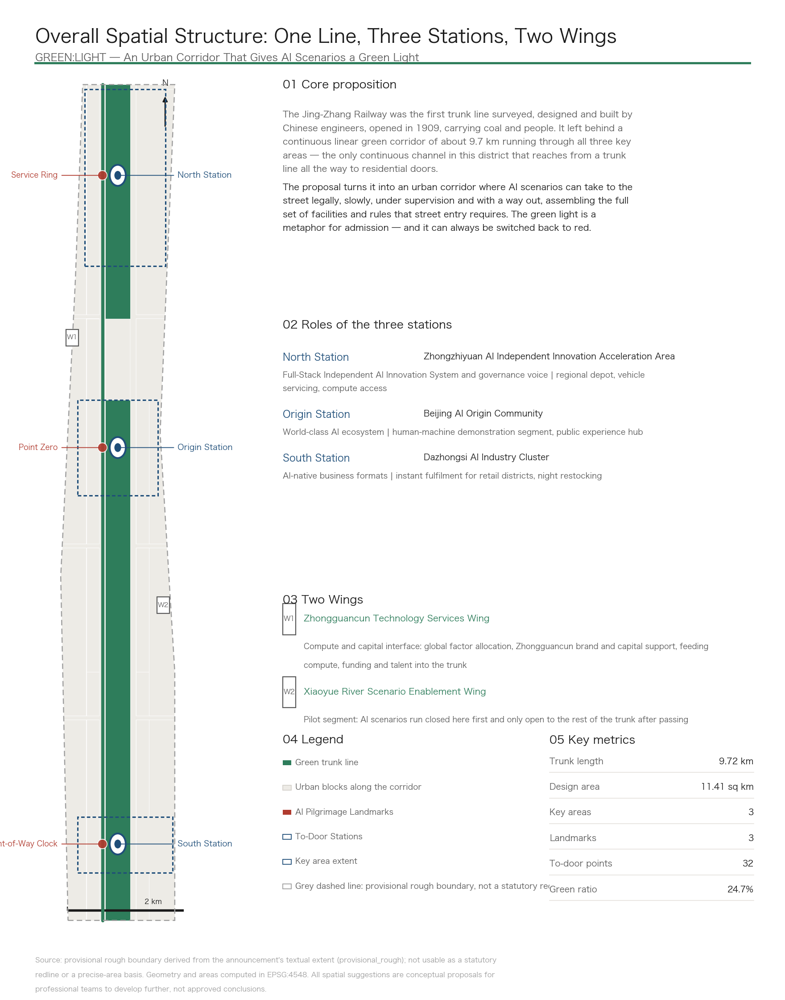
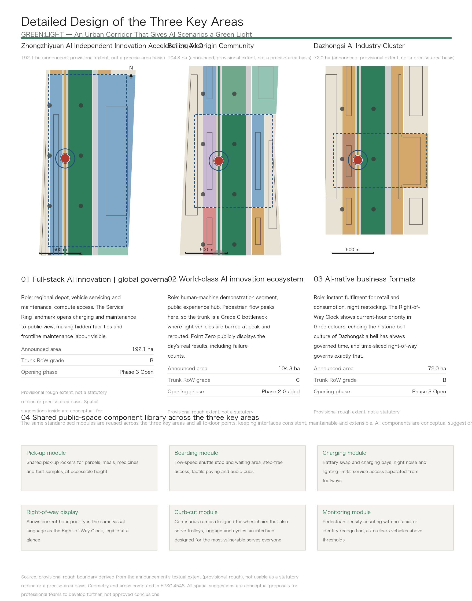
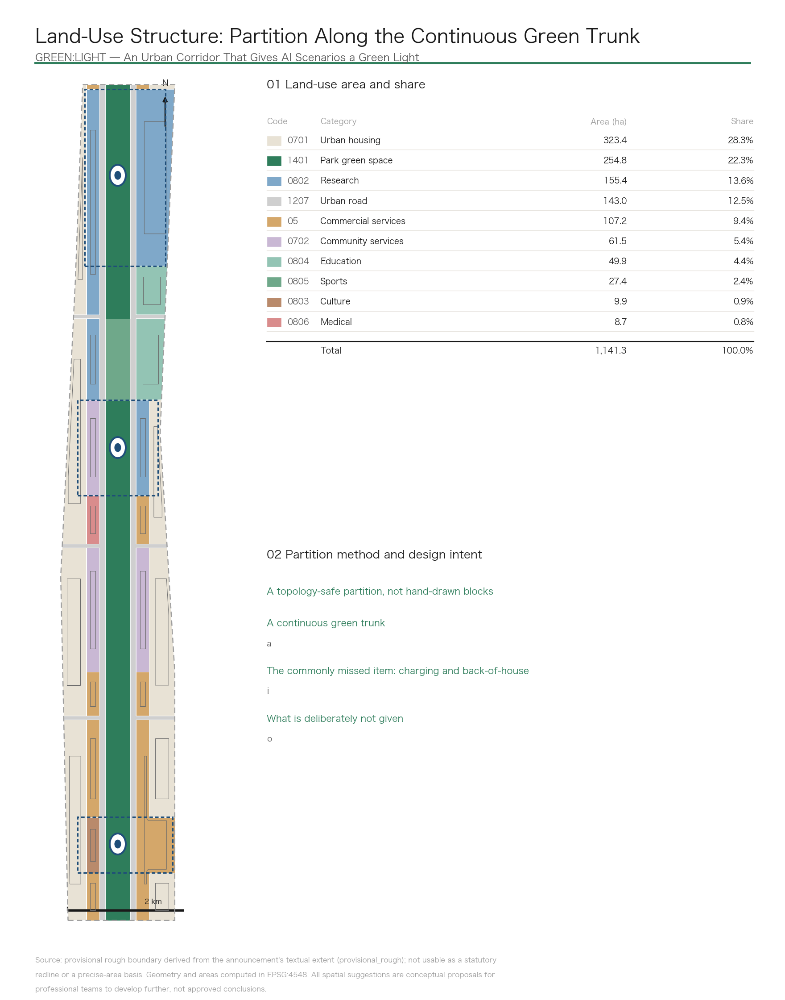
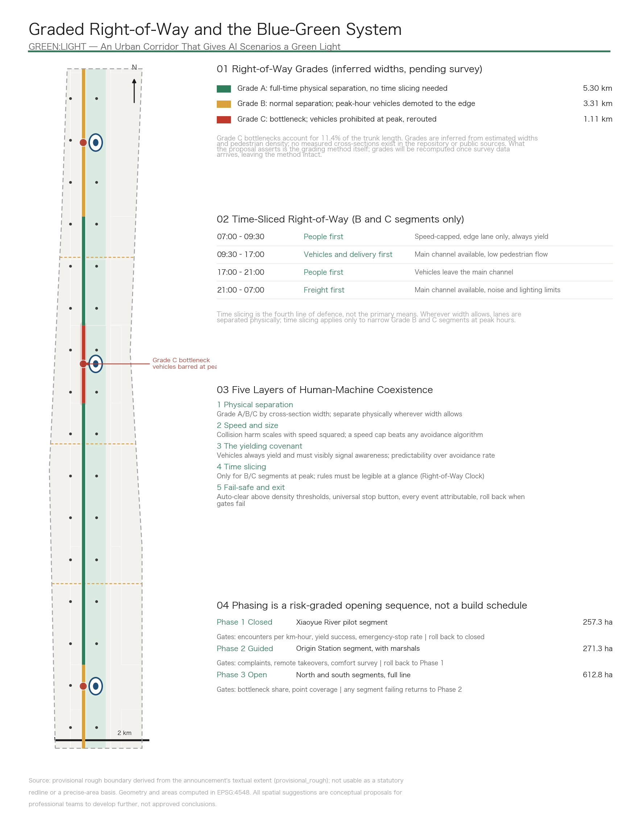
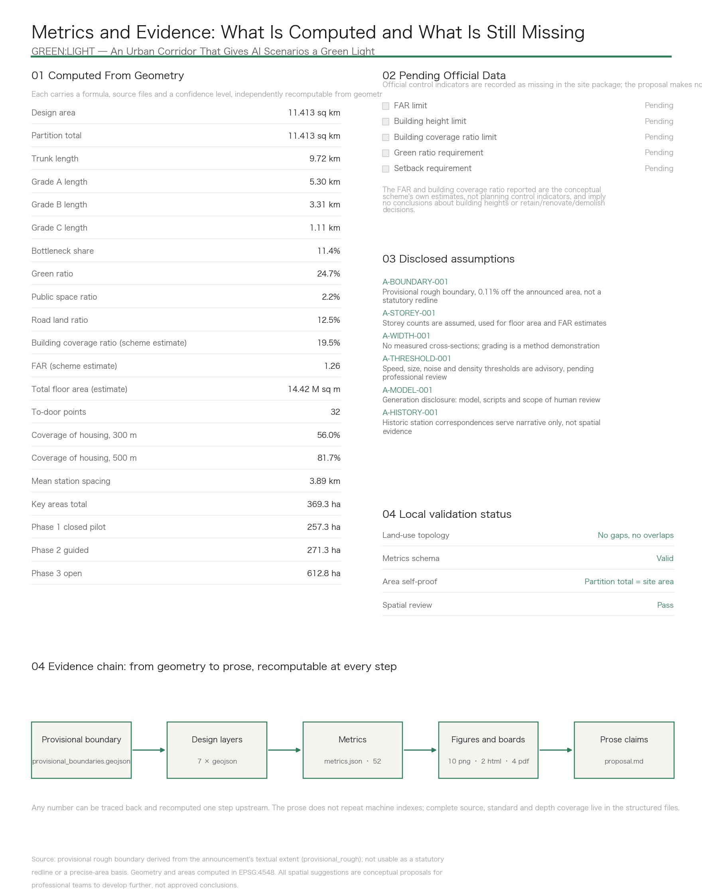

# GREEN:LIGHT — Jing-Zhang Goes First: An Urban Corridor That Gives AI Scenarios a Green Light, Graded Right-of-Way, and a Way Out

Autonomous delivery, low-speed shuttles, inspection robots, guide robots, mobile clinics, mobile classrooms, rehabilitation aids, cleaning and maintenance — all of these AI scenarios are stuck at the same bottleneck: **no street is willing, or ready, to let them out**. Today they can only run demonstrations inside closed campuses, and when the demonstration ends, so does the scenario.

The Jing-Zhang Railway was the first trunk line surveyed, designed and built by Chinese engineers, opened in 1909, carrying coal and people. It left behind a continuous linear green corridor of about 9.72 km running through all three key areas — the only continuous channel in this district that reaches from a trunk line all the way to residential doors [metric:trunk_length_m].

This proposal turns it into an urban corridor where AI scenarios can take to the street legally, slowly, under supervision and with a way out, assembling in one move the full set of facilities and rules that street entry requires. **The green light is a metaphor for admission — and it can always be switched back to red.**

The Chinese name carries two senses of "going first": piloting first, and having priority of passage. The English name splits the same way: GREEN is this green corridor itself, LIGHT is the low-speed **light** vehicle; together they are the green light.

## Design Basis and Source List

This proposal takes the pre-qualification announcement for the international urban design competition for the Centennial Jing-Zhang AI Innovation Belt, issued by the Haidian Branch of the Beijing Municipal Commission of Planning and Natural Resources, as its primary basis, and the taskbook extract for the open call to global agents as its task constraint [source:OFFICIAL-ANNOUNCEMENT] [source:AGENT-TASKBOOK]. Spatial data, enumerations, metric ranges and validation rules come from the site package registered in the repository [source:SITE-PACKAGE].

Source usability boundaries follow the public source registry strictly: seven formal-ready records, one background-only record, and one provisional-only record [source:SOURCE-REGISTRY]. This proposal does not promote background or provisional material into official boundaries, statutory controls, formal scoring evidence or implementation commitments.

### Three Things That Must Be Stated First

**First, the exact official redline was not provided.** The announcement gives a textual extent and an area, not a coordinate boundary. All geometry in this proposal is derived from the provisional rough boundary registered in the site package [source:BOUNDARY-SOURCE] [data:geometry/site_boundary.geojson#SITE-001]. In the EPSG:4548 projection that boundary measures 11,412,825 square metres, about 0.11% from the announced figure of roughly 11.4 square kilometres [metric:site_area_sqm]. **The area is usable; the shape is rough.** It cannot serve as a statutory redline, an approval basis, a precise-area recomputation basis, an ownership boundary or an engineering boundary. Once the official boundary is released, land use, roads, green space, public space, buildings, phasing and every metric must be recomputed — not patched file by file.

**Second, the official control indicators are entirely absent.** Floor-area-ratio caps, building height limits, building coverage ratio limits, green ratio requirements and setback requirements are all recorded as missing in the site package's planning limits file [metric:official_far_limit] [metric:official_building_height_limit_m]. This proposal makes no assumptions about them. The floor area ratio and building coverage ratio that appear in this text are the conceptual scheme's own estimated ratios, not planning control indicators, and imply no conclusions about building heights or parcel-level retain, renovate or demolish decisions.

**Third, there are no measured cross-section widths for the corridor.** This matters most, because graded right-of-way is the core move of the proposal. The repository provides no survey, and public sources yielded none. The A/B/C grading rests on inferred widths and judgements about pedestrian density along the line. **What this proposal asserts is the grading method itself; it does not claim a specific measured width for any segment.** Once survey data arrives, the grades are recomputed and the method is unaffected. This limitation is stated consistently in three places: the geometry attributes, the metric notes, and the disclosed assumptions.

### Disclosed Assumptions

Six assumptions are recorded in the structured files and can be traced one by one: the precision limits of the provisional boundary, the assumed storey counts, the absence of measured cross-sections, the advisory status of safety thresholds, the generation-method disclosure, and the unverified correspondence with historic station locations [depth:risk_missing_data]. The generation-method disclosure answers the co-creation charter's requirement to explain sources and generation methods: geometry layers and metrics are derived deterministically from the provisional boundary by scripts, the narrative and design judgements are written by the agent, and the naming, conceptual direction and risk boundaries were reviewed by a human.

## Three-Level Scope Framework

The announcement sets three levels of scope. This proposal works each level to a different depth and states a different level of certainty for each.

| Level | Area | Working depth in this proposal | Certainty |
|---|---|---|---|
| Coordinated research area | 43.6 sq km | Strategy: industrial coordination, factor input paths, interfaces with the belt | Written strategy, no geometry issued |
| Overall design area | 11.4 sq km | Regulatory-plan urban design depth: land-use partition, right-of-way grading, public space, phasing | All layers and metrics issued, labelled as derived from a provisional boundary |
| Key-Area Detailed Design Areas | 368.4 ha | Detailed design depth: role, frontage, landmark and opening phase for each of the three | Geometry issued, announced area shown alongside the provisional extent |

The three levels are not concentric circles but a sequence of **input, carrying, and verification**: the coordinated research area supplies factors, the overall design area carries and organises space, and the key areas prove things out before anything expands outward [depth:three_level_scope_framework].

The provisional extents of the key areas total 369.3 ha, about 0.24% from the announced 368.4 ha [metric:key_area_total_sqm] [data:geometry/key_areas.geojson#PROV-KEY-001]. That gap is itself evidence of the provisional boundary's precision, and it is reported without adjustment.

## Coordinated Research Area: Industry and Future City Research

The coordinated research area runs north to the North Fifth Ring Road, east to the Jingzang Expressway, south to Xizhimenwai Street and west to Wanquanhe Road: 43.6 square kilometres. This level issues no geometry and answers one question only: **what does the belt need from outside in order for AI to genuinely take to the street.**

### Three Things That Must Come From Outside

**Compute and capital.** The Zhongguancun Technology Services Wing acts as the factor-allocation interface: compute access, capital matching, and the Zhongguancun brand and market channels. It is not a parcel awaiting development but a set of existing institutions and services whose output flows into the belt.

**Demand for the scenarios.** AI scenarios on the street need real people to serve; demand cannot be manufactured with subsidies. Existing residential blocks along both sides of the corridor cover 323.4 ha, 28.3% of the design area, and are the principal population served by the to-door interfaces [metric:land_use_area_0701_sqm] [metric:land_use_ratio_0701]. The education and research frontage of 49.9 ha supplies genuine demand for mobile classrooms, teaching-aid circulation and open-air lessons [metric:land_use_area_0804_sqm].

**Regulatory and standard-setting capacity.** Putting low-speed vehicles on the street touches road management, liability and data compliance. This is the practical basis for Zhongzhiyuan's role in AI governance voice: governance capacity is itself a factor of production, not a slogan.

### A Judgement About Future Urban Form

For urban form suited to AI-era productive forces, the decisive question is not how many new buildings get built but **whether new urban behaviour can occur inside existing space**. The judgement here is that this corridor is already built out, with no room for large-scale new construction, and that what is genuinely scarce is public space where things can be tried and safely withdrawn. The form strategy therefore has three parts: keep the continuous green corridor free to act as a trunk, make both of its edges active frontage, and place back-of-house facilities explicitly into land use rather than squeezing them into leftovers [depth:overall_spatial_structure].

## Overall Design Area: Urban Renewal and Regulatory-Plan-Level Urban Design

**The substance of renewal is seven sets of street-entry infrastructure**

The announcement requires the overall design area to reach the urban design depth of a regulatory detailed plan. The subject of renewal here is not cosmetic improvement but **building the seven sets of facilities and rules that street entry requires**. This is also the direct answer to the brief's call for a new-infrastructure strategy [standard:MOHURD-CONTROL-DETAILED-PLANNING] [depth:municipal_new_infrastructure].

| # | Facility / rule | Why it is an urban design question | Where it lands |
|---|---|---|---|
| 1 | Graded right-of-way | Requires a cross-section survey; produces a bottleneck list and a minor-works list | Roads and constraints layers |
| 2 | Speed and size limits | Determines corridor cross-sections, paving and curb heights | Public space, A3 section drawings |
| 3 | Charging and back-of-house | Light vehicles need real physical back-of-house space: a land-use and building question | Land use, buildings layers |
| 4 | Sensing and monitoring | Placement of density-counting points and the privacy boundary | Public space, scenario cards |
| 5 | Attribution and review | Event review facilities and human intervention points | Buildings, operating mechanism |
| 6 | Graded opening and exit | Determines how phasing is drawn: which segment first, which next, which one rolls back | Phasing layer |
| 7 | Last-hundred-metre interfaces | The point of contact with residents; directly engages accessibility law | Public space, component library |

Item three deserves separate mention: **charging and back-of-house space is missed in almost every comparable proposal**. Vehicles need physical space for battery swapping, parking, maintenance and loading. This proposal places it inside community service facility land (61.5 ha, 5.4%) and inside Zhongzhiyuan's research land, and treats it as something to be seen rather than hidden [metric:land_use_area_0702_sqm] [data:geometry/land_use.geojson#LU-0702-0301].

Item six is where this proposal differs most at the level of geometry: **phasing is not a construction sequence but a risk-graded opening sequence**, described in chapter ten.

### Spatial Structure: One Line, Three Stations, Two Wings

The trunk line runs 9.72 km continuously along the corridor spine [data:geometry/roads.geojson#ROAD-TRUNK-0101]. Each key area carries one station, with a mean spacing of 3.89 km [metric:station_spacing_avg_m]. The two wings are the Zhongguancun Technology Services Wing (compute and capital interface) and the Xiaoyue River Scenario Enablement Wing (pilot segment).

| Station | Key area | Positioning role | Street-entry role |
|---|---|---|---|
| North Station | Zhongzhiyuan AI Independent Innovation Acceleration Area | Full-stack AI innovation, global governance voice | Regional depot, vehicle servicing and maintenance, compute access |
| Origin Station | Beijing AI Origin Community | World-class AI innovation ecosystem | Human-machine demonstration segment, public experience and display hub |
| South Station | Dazhongsi AI Industry Cluster | AI-native business formats | Instant fulfilment for retail and consumption, night restocking |

The Three Zones and Two Wings do not sit side by side; they form a loop: **the wings supply factors, the three areas divide the load, the trunk connects them and delivers results to the door, and operating data flows back to improve the rules**.

## Detailed Design of Key Areas

The three key areas are drawn at one shared scale so they can be compared directly, and they share one public-space component library so that interfaces stay consistent, maintainable and extensible [depth:three_key_area_detailed_design].

### Zhongzhiyuan AI Independent Innovation Acceleration Area (announced 192.1 ha)

Its positioning role is full-stack AI innovation and governance voice. Its street-entry role is regional depot, vehicle servicing and maintenance, and compute access. The trunk here is a Grade B segment: normally separated physically, with light vehicles demoted to the edge at peak hours.

The design move is to **bring the back-of-house to the front**. Charging and maintenance facilities are usually the most hidden spaces in a city; here the proposal places the Service Ring, opening charging and maintenance to public view [data:geometry/public_space.geojson#PS-LM-03]. There are two reasons: mechanical operation is genuinely interesting to watch, and frontline maintenance labour deserves to be seen — which is also the practical basis for the first of the seven user personas below.

Under the phasing arrangement this segment falls within the third, open phase [data:geometry/phasing.geojson#PHASE-P3].

### Beijing AI Origin Community (announced 104.3 ha)

Its positioning role is a world-class AI innovation ecosystem. Its street-entry role is the human-machine demonstration segment and the public experience and display hub. **Pedestrian flow is densest here, and the trunk is a Grade C bottleneck**: light vehicles are barred at peak and rerouted [data:geometry/roads.geojson#ROAD-TRUNK-0301] [data:geometry/constraints.geojson#CON-CONFLICT-0301].

The design move is to **bring operating results to the front**. Point Zero sits here — not a sculpture but a working pick-up point that also publishes the day's real results across every scenario on the line, **including failure counts**. It displays them when the numbers look bad too; otherwise "verifiable" is an empty word [data:geometry/public_space.geojson#PS-LM-01].

The western inner frontage carries community services and public experience, the eastern inner frontage carries research and the innovation ecosystem, and both share the same stretch of trunk: that is what "human-machine demonstration segment" means spatially. This segment falls within the second, guided phase, with marshals on site [data:geometry/phasing.geojson#PHASE-P2].

### Dazhongsi AI Industry Cluster (announced 72.0 ha)

Its positioning role is AI-native business formats. Its street-entry role is instant fulfilment for retail and consumption, and night restocking. The trunk here is a Grade B segment.

The design move is to **bring the rules to the front**. The Right-of-Way Clock sits here, showing current-hour priority in three colours for people, machines and freight [data:geometry/public_space.geojson#PS-LM-02]. It belongs at Dazhongsi because a bell already stands there — **a bell has always governed time, and time-sliced right-of-way governs exactly that**. It is a governance interface that happens to take the form of a landmark.

One point needs to be explicit: right-of-way display is not confined to this location. The Clock is the flagship landmark at Dazhongsi, but **every station and every to-door point carries a standardised right-of-way display module**, or the rules would be invisible precisely where pedestrian flow is densest. The component library treats this as a standard module.

The western inner frontage is 9.9 ha of cultural land, carrying the link between historic bell culture and new AI culture [metric:land_use_area_0803_sqm]. This segment falls within the third, open phase.

## AI Innovation Ecosystem, Personas, and AI+ Scenarios

### How the Global Ecosystem Cases Were Selected

The taskbook asks for five to eight global AI innovation ecosystem cases. The selection criterion here is not "where the largest park is" but **which places have actually let low-speed vehicles or autonomous vehicles onto public streets legally, and how their admission and exit rules are written**. The reason is direct: the core of this proposal is an admission mechanism, so the comparable objects should be comparable mechanisms, not comparable parks.

Full records, source links, retrieval dates, licence terms and known limitations for the cases are kept in the submission's source file [source:SOURCE-REGISTRY]. This proposal **does not fabricate company lists, investment figures, output values or fiscal commitments**, and does not present unverified policy as fact; every statement touching specific companies or funding is marked either as a citation of public information or as explicitly pending verification [standard:PROJECT-AGENT-OPEN-CALL-TASKBOOK].

### Ecosystem Support: How Eight Factors Land in Space

| Factor | Spatial landing point | Mechanism |
|---|---|---|
| Land | Land-use partition and inner frontage | Active frontage on the corridor, existing housing behind; no new land needed |
| Space | Stations, to-door points, component library | Standardised modules reused to lower the cost of each intervention |
| Industry | Division among three areas, input from two wings | Zhongzhiyuan research, Origin Community ecosystem, Dazhongsi formats |
| Capital | Zhongguancun Technology Services Wing | Factor-allocation interface; no fiscal commitment implied |
| Talent | Seven user personas | From frontline maintenance staff to international researchers |
| Compute | Access at North Station | Co-located with back-of-house facilities for easier operation |
| Data | Attribution and review facilities | Right-of-way, cross-section and event data open for reproduction |
| Scenarios | 12 scenario cards and 3 test scenarios | Application, review, staged opening and exit as one full process |

### User Personas (Seven)

Personas are defined by who actually uses this corridor every day, not by stacking demographic labels.

1. **Frontline vehicle maintenance staff** — exception handling, battery swapping, clearing obstructions. The most overlooked users, and the practical basis for the Service Ring landmark. They need service access separated from footways, adequate night lighting, and a workable working area.
2. **Older people living at home** — medication reminders, meal delivery, transport to appointments. They value predictability over speed: knowing when something will arrive, who is bringing it, and whom to contact when it goes wrong.
3. **Members of AI start-up teams** — instant needs during long working hours, compute access, informal meeting space. Their demand concentrates in off-peak and night hours.
4. **Commuters and parents on the school run** — the peak-hour majority. They are whom the "people first" time slices serve, and the reason the Grade C bottleneck bars vehicles at peak.
5. **Wheelchair users and people with visual impairments** — step-free continuous passage, curb ramps, tactile paving and audio cues. An interface designed for them ends up serving everyone; the component library treats this as mandatory, answering statutory accessibility requirements.
6. **Shopkeepers at the last stop** — community pharmacies and convenience stores, the actual operators and daily custodians of the to-door points. Without them the last-metre interface cannot run for long.
7. **International AI researchers** — multilingual signage, payment and everyday services. This is where international communication actually lands, rather than being decoration.

### AI Scenario Cards (12, Across Seven Categories)

Each card fixes seven fields: location, participants, AI capability, data source and privacy boundary, human review point, measurable indicators, and failure and exit conditions. **A scenario without a human review point and an exit condition does not enter this list.**

| # | Category | Scenario | Location | Human review point | Measurable indicators | Exit condition |
|---|---|---|---|---|---|---|
| 1 | AI+mobility | Low-speed autonomous shuttle between the three stations | Grade A trunk segments | Every takeover logged and reviewed | Takeover rate, punctuality | Suspend the segment if takeover rate exceeds the threshold |
| 2 | AI+mobility | Rail station connection and first/last train coverage | Three station plazas | Staff present during first and last services | Connection success rate, waiting time | Return to manual dispatch if failures exceed the threshold |
| 3 | AI+mobility | Real-time accessible routing with obstacle avoidance | To-door points line-wide | Acceptance testing with wheelchair and visually impaired users | Route availability, detour distance | Withdraw the service on a segment on any false "passable" report |
| 4 | AI+mobility | Traffic and freight organisation on major event days | Line-wide | Plan approved by staff before the event | Evacuation time, freight window attainment | Not activated unless the plan is approved |
| 5 | AI+health | Medicine and test-sample transport | Medical anchors to to-door points | Two-person handover verification | Temperature compliance, handover error rate | Halt line-wide if temperature or handover errors exceed thresholds |
| 6 | AI+health | Home medication reminders and care handover | Outer residential blocks | Anomalies confirmed by an outbound call | Reminder delivery rate, anomaly response time | Switch fully to staff if the false-alarm rate exceeds the threshold |
| 7 | AI+education | Mobile classrooms and open-air lessons on the corridor | Trunk sports and green segments | Course content approved by staff | Attendance, venue conflicts | Reschedule on conflict with pedestrian peaks |
| 8 | AI+education | Inter-school circulation of books and teaching aids | Education frontage | Staff intervene on borrowing anomalies | Turnaround time, loss rate | Suspend circulation if the loss rate exceeds the threshold |
| 9 | Robotics | Corridor cleaning, maintenance and facility inspection | Line-wide, mainly at night | Inspection anomalies confirmed by staff | Coverage, false-alarm rate | Shorten the working window if night noise complaints exceed the threshold |
| 10 | Robotics | Guide companions and local loan of rehabilitation aids | Three landmarks and station plazas | Eligibility verified by staff | Utilisation, return rate | Full suspension on any safety incident |
| 11 | Autonomous delivery | Instant retail, meals, parcels to the door, night restocking | To-door points line-wide | Staff review of anomalous deliveries | To-door success rate, complaint rate | Revert to locker collection if complaints exceed the threshold |
| 12 | Governance | Proof-of-delivery quality check and address validity | Line-wide | Disputed cases decided by staff | Proof validity rate, address corrections, error rate | Disable automatic decisions if the error rate exceeds the threshold |

Card 12 needs an extra boundary statement: **it reads house numbers and delivery surroundings to judge whether a delivery genuinely completed; it does not capture faces and does not perform identity recognition**. That boundary is written inside the card, not added afterwards as a disclaimer.

### Industrial Test and Validation Scenarios (Three)

All three are written as experiments: control group, indicators, human review point, exit mechanism. **Exiting when the gates are not met is part of the design, not a failure of it.**

**Test one: time-sliced right-of-way pilot** (Xiaoyue River Scenario Enablement Wing, Phase 1 closed, 257.3 ha) [metric:phase_p1_area_sqm]
- Control: the same segment before and after the rules take effect, plus a parallel control on the adjacent Grade A segment
- Indicators: human-machine encounters per kilometre-hour, yield success rate, mean yielding distance, emergency-stop rate
- Human review: every emergency stop and every complaint reviewed individually, with a named responsible party
- Exit: if the yield success rate falls below the gate or the emergency-stop rate exceeds the threshold, roll back to closed testing and suspend opening

**Test two: queueing and dispatch at shared pick-up points** (Origin Station)
- Control: to-door points with dispatch logic against points served first-come-first-served
- Indicators: mean waiting time, peak queue length, collection failure rate, comfort survey
- Human review: staff intervene in queue conflicts and requests for help from older users
- Exit: restore manual organisation if waiting time or failure rate is worse than the human baseline

**Test three: proof-of-delivery quality check and address validity** (real addresses line-wide)
- Control: automatic decisions run in parallel with human sampling, comparing agreement rates
- Indicators: valid-proof recognition rate, address corrections, error rate, dispute handling time
- Human review: all disputed cases decided by staff; automatic decisions are never final
- Exit: disable automatic decisions and move fully to staff if the error rate exceeds the threshold

All three share one constraint: **this mechanism does not promise zero conflict; it promises that conflicts can be detected, attributed, and exited from when gates are not met**. Engineering feasibility is for professional teams to develop; this proposal offers no feasibility conclusion.

## Land Use, Building Scale, and Retain-Renovate-Demolish Strategy

**This chapter gives criteria, not parcel-level verdicts**

### The Partition Method

Land use is not hand-drawn colour blocks but a **topology-safe partition**: a set of regular grid lines produces mutually disjoint cells, each clipped to the provisional boundary and then merged by category. Disjoint cells clipped to one boundary must union back to that boundary, so category areas total exactly the site area, with no gaps and no overlaps [metric:land_use_partition_area_sqm] [depth:land_use_layout].

The banding follows a real urban design judgement: **active frontage on the corridor, existing housing behind**. From the spine outward come the trunk corridor, the flanking streets, the inner frontage band, and the outer existing blocks. The inner band carries the active functions that face the corridor directly; the outer blocks keep their existing residential and industrial character [standard:MNR-LAND-USE-CLASSIFICATION-GUIDE].

| Land-use category | Area (ha) | Share |
|---|---|---|
| Urban housing | 323.4 | 28.3% |
| Park green space | 254.8 | 22.3% |
| Research | 155.4 | 13.6% |
| Urban road | 143.0 | 12.5% |
| Commercial services | 107.2 | 9.4% |
| Community service facilities | 61.5 | 5.4% |
| Education | 49.9 | 4.4% |
| Sports | 27.4 | 2.4% |
| Culture | 9.9 | 0.9% |
| Medical and health | 8.7 | 0.8% |
| **Total** | **1,141.3** | **100.0%** |

### Building Scale: Stating Plainly That These Are Estimates

Building footprint area is 222.5 ha, a building coverage ratio (BCR) of 19.5%. With storey counts assumed by land-use category, total floor area is estimated at 14.42 million square metres and the floor area ratio at 1.26 [metric:building_footprint_area_sqm] [metric:floor_area_ratio].

**These three numbers are the conceptual scheme's own estimates, not planning control indicators.** Storey counts are assumed and recorded in the disclosed assumptions. Official floor-area-ratio, building height, building coverage ratio and setback controls remain pending formal planning conditions, and this proposal makes no assumptions about them [depth:development_intensity_controls] [depth:height_massing_character].

### Retain-or-Renovate Logic: Criteria, Not Parcel Verdicts

This corridor is already built out, so the practical premise of renewal is that **the overwhelming majority of buildings are retained**. What follows are criteria, not parcel-level verdicts [depth:retain_renovate_demolish]:

- **Retain**: buildings in sound structural and operational condition with no right-of-way conflict with the trunk are retained. This is the default state.
- **Frontage renovation**: where a building sits in the inner frontage band and its closed ground-floor frontage obstructs to-door access, ground-floor frontage and entrance renovation is suggested. The scope is the frontage only and does not touch primary structure.
- **Function substitution**: existing underused space may be considered for charging back-of-house, maintenance or review functions, subject to the owner's agreement.
- **No demolition verdicts**: this proposal proposes no parcel-level demolition. Any work touching space under third-party ownership requires the owner's agreement, and the detailed approach is for professional teams to develop after ownership and structural checks.

The taskbook explicitly prohibits altering company buildings or owned space without authorisation, and prohibits parcel-level retain/renovate/demolish conclusions. This chapter observes that boundary strictly.

## Transport, Rail, Municipal Infrastructure, and Public Services

**The core is graded right-of-way and five layers of human-machine coexistence**

This is the most technical chapter and the one most open to challenge, so the conclusion comes first: **time slicing is not the primary means of resolving human-machine conflict; it is the fourth line of defence. Relying on rules for safety is the weakest approach available.**

### Layer One: Physical Separation (Most Reliable, Used First)

Grade the whole corridor by cross-section first, which converts "time-sliced right-of-way" from a vague notion into a graded list grounded in sections [depth:traffic_rail_slow_parking].

| Grade | Condition | Treatment | Length |
|---|---|---|---|
| A | Ample width | Full-time physical separation of footway, cycleway and light-vehicle lane, using level changes and materials. **Depends on physics, not rules** | 5.30 km |
| B | Moderate width | Normally separated; light vehicles demoted to the edge at morning and evening peaks | 3.31 km |
| C | Bottleneck, insufficient width | Barred at peak and rerouted; entered on the minor-works list | 1.11 km |

Grade A accounts for 54.5% of the trunk, which is to say **more than half the trunk needs no time-slicing rule at all**: physical separation is enough [metric:row_grade_a_length_m]. Grade C bottlenecks account for 11.4% of the trunk [metric:conflict_segment_ratio], concentrated around the AI Origin Community, which is also where pedestrian flow is densest. That coincidence is not a coincidence: a bottleneck is a bottleneck because people are there.

The limitation bears repeating: **the grading rests on inferred widths, not measurements**. The precise location of those 1.11 km will shift with survey data, but the method — grade first, then decide where time slicing is needed — will not.

### Layer Two: Speed and Size (Physics, Not Rules)

Collision harm scales roughly with the square of speed, so a speed cap outperforms any avoidance algorithm. Within the corridor, light vehicles are subject to a speed cap, a body-width cap and a noise cap. These figures are proposed with reference to published low-speed vehicle practice and public management rules for staged open testing; **all are advisory and pending professional review**, and this proposal does not present them as conclusions.

### Layer Three: The Yielding Covenant — Predictability, Not Avoidance Rate

**Light vehicles always yield to people, and must visibly signal "I have seen you"**: decelerate early, come to a definite stop, and indicate with light or sound.

The design requirement here is predictability, not avoidance success rate. What genuinely unsettles people is not being blocked but **not knowing whether the thing will stop**. A vehicle that stops but does not look like it will stop is, experientially, unsafe. This is a behaviour and interface requirement, not an algorithmic metric.

### Layer Four: Time-Sliced Right-of-Way (Grade B and C Only)

| Time slice | Priority | Constraint on light vehicles |
|---|---|---|
| 07:00–09:30 | People first (commuting, school) | Speed-capped, edge lane only, always yield |
| 09:30–17:00 | Vehicles and delivery first (off-peak) | Main channel available, low pedestrian flow |
| 17:00–21:00 | People first (leisure, evening runs) | Leave the main channel |
| 21:00–07:00 | Freight first (night restocking, cleaning, inspection) | Main channel available, noise and lighting limits |

The rules must be legible at a glance, which is the engineering reason the Right-of-Way Clock exists — it is not decoration. Every station and to-door point also carries a standardised right-of-way display module.

### Layer Five: Fail-Safe and Exit (Most Important, Most Often Omitted)

- **Real-time pedestrian density monitoring**: density counting, **no facial recognition and no identity recognition**; above the threshold, vehicles are cleared automatically. When something goes wrong the system exits rather than continuing.
- **A physical stop button anyone can press**, plus remote takeover.
- **Every emergency stop, conflict and complaint is reviewable and attributable**, with a named responsible party.
- **Staged opening**: closed, then guided with marshals, then open, with quantified gates at each stage and rollback when gates fail.
- **Deployment order**: night and off-peak first, freight before dense pedestrian segments; never straight into the busiest place.

### Rail Connection, Municipal and Public Service Facilities

The three station plazas also carry boarding, alighting and dispersal for rail station connections, and the inter-station low-speed shuttle line coordinates with first and last trains [data:geometry/roads.geojson#ROAD-LINK-01]. Road land covers 143.0 ha, 12.5%, all of it in editable classes — secondary roads, branch roads, footways, cycleways and greenways — and **expressways and arterials are left untouched** [metric:road_ratio].

The municipal strategy centres on charging supply and night working illumination, the two items that decide whether vehicles can run at night. The public service strategy centres on connecting medical, education and community service anchors to the to-door points, so that one network carries parcels by day and medicines and teaching aids as well.

## Blue-Green Network, Public Space, and Urban Character

### The Corridor: From a Coal Trunk Line to a Shared People-and-Goods Trunk

The green system totals 282.2 ha, a green ratio of 24.7% [metric:green_space_area_sqm] [metric:green_ratio]. Of that, 254.8 ha (22.3%) is park green space forming the trunk corridor itself, and 27.4 ha is the sports and evening-run segment along the trunk. The trunk corridor runs continuously north to south without interruption, which is the physical precondition for the whole proposal [data:geometry/green_space.geojson#GREEN-1401-1001] [depth:blue_green_public_space]. How the east-west stitching streets cross the trunk is a conceptual suggestion; **this proposal offers no conclusions on bridges, tunnels, underground space or engineering feasibility**.

Public space totals 24.9 ha, 2.2% of the design area [metric:public_space_area_sqm] [metric:public_space_ratio], made up of three landmarks, three station plazas, three east-west stitching nodes and 32 to-door points [metric:todoor_point_count].

### Three AI Pilgrimage Landmarks: Three Kinds of Invisibility

Start with the problem these three landmarks address: **AI is invisible**. Compute sits in machine rooms, models in the cloud, code on screens. Walk down the street and there is nothing to see. The conventional answer is an exhibition hall — passive, enclosed, showing a promotional film.

| Landmark | The invisibility it addresses | What it is |
|---|---|---|
| Point Zero | Results are invisible, so the public cannot check what AI actually achieved | A working pick-up point that publishes the day's real results across every scenario, including failure counts |
| Right-of-Way Clock | Rules are invisible, so residents do not know who this path belongs to right now | The physical interface of time-sliced right-of-way, in three colours; a governance tool that happens to be a landmark |
| Service Ring | Facilities and labour are invisible; logistics back-of-house is the most hidden space in a city | Charging and maintenance back-of-house, opened to public view |

Together they deliver three things: **results made visible (trust), rules made visible (governance), and facilities and labour made visible (respect)**. The reason to make the trip is not a photo opportunity but to watch a system that is genuinely running — and to be able to see, on the spot, where it still falls short.

All three are conceptual suggestions for professional teams to develop, and constitute no approved conclusion. All three make functional facilities visible rather than building scenery, and none is treated as entertainment or as a social-media attraction.

### Honour Display and the Public-Space Component Library

Honour display runs along the trunk, recording both human and agent contributors and preserving source and attribution requirements, answering the co-creation charter's requirement that contributions be remembered.

Six standard modules in the component library are reused across the three key areas and all to-door points: pick-up, boarding, charging, right-of-way display, curb cut, and monitoring. The reasoning behind the curb-cut module deserves its own note: **a continuous ramp designed for wheelchairs ends up serving people with trolleys, luggage and bicycles as well**. An interface designed for the most vulnerable serves everyone — this is the basis for the proposal's second layer of value, and the reason a delivery network can be used as a public service network.

### One Shortcoming That Has to Be Said Out Loud

To-door points within a 300 metre walk cover only 56.0% of residential land; at 500 metres the figure is 81.7% [metric:todoor_point_coverage_300m_ratio] [metric:todoor_point_coverage_ratio].

**That number exposes a real shortcoming in the current placement**: to-door points sit along both sides of the trunk while residential blocks sit further out, so a four-to-five-minute walk fails to reach nearly half of residents. The 81.7% at 500 metres looks better, but the corridor is only about 1.3 km wide east to west, so a 500 metre radius approaches saturation by construction and discriminates poorly; it should not be the headline measure.

The conclusion is clear: **to-door points cannot sit only along the trunk and must be densified outward into the blocks**, with locations chosen from the 300 metre coverage gap. This proposal keeps the shortcoming and states the basis for it, rather than covering it with a more flattering measure.

## Renewal Projects, Implementation Policy, and Phasing

### Renewal Project List

| Type | Content | Note |
|---|---|---|
| Minor section works | Lane and ramp works on 1.11 km of Grade C bottleneck | Confirmed after cross-section survey review |
| Frontage renovation | Inner frontage ground floors and to-door access | Frontage only, subject to owner agreement |
| Back-of-house facilities | Charging, maintenance and loading areas | Placed in community service and research land |
| Last-metre interfaces | 32 to-door points, densified outward | Densification based on the 300 metre coverage gap |
| Three landmarks | Point Zero, Right-of-Way Clock, Service Ring | Conceptual, for professional teams to develop |
| Monitoring and review | Density-counting points, event review facilities | Privacy boundary defined alongside each location |

The list is a set of conceptual suggestions and **constitutes no investment arrangement, investment-promotion commitment or construction programme** [depth:renewal_project_list].

### Phasing: A Risk-Graded Opening Sequence

This is the proposal's most distinctive feature at the level of geometry: **phasing is not a construction sequence but a risk-graded opening sequence**. Each phase carries quantified gates and rollback conditions [depth:phasing_implementation].

| Phase | Extent | Area | Openness | Gate indicators | Rollback condition |
|---|---|---|---|---|---|
| One | Xiaoyue River Scenario Enablement Wing pilot segment | 257.3 ha | Closed | Encounters per km-hour, yield success rate, emergency-stop rate | Roll back to closed testing and suspend opening if gates fail |
| Two | Origin Station segment | 271.3 ha | Guided, with marshals | Complaint rate, remote takeover rate, comfort survey | Return to Phase One if gates fail |
| Three | North and south segments, full line | 612.8 ha | Open | Bottleneck share, to-door coverage | Any single segment failing returns to Phase Two on its own |

The three phase areas sum to the design area: the phasing layer is a complete partition of the boundary [data:geometry/phasing.geojson#PHASE-P1] [metric:phase_p3_area_sqm].

Phase One sits in the Xiaoyue River pilot segment rather than the Origin Community because it is right to **prove things where pedestrian flow is not at its densest before entering the hardest segment**. The Origin Community is the Grade C bottleneck, so it comes second and must have marshals.

### Policy and Operating Mechanism

- **Scenario admission**: apply, review, open in stages, meet quantified gates, then extend on success or exit on failure, with the whole process logged.
- **Annual programme**: a "Street-Entry Test Week" bringing global AI scenarios here to run their first stretch, publishing results including failure data, paired with an annual right-of-way rule revision meeting that changes the rules using a year of operating data.
- **Developer community**: right-of-way data, cross-section data, the simulation environment and event attribution datasets opened for reproduction and improvement.
- **International communication and conversion**: pilot results feed a city-wide rollout list, which feeds conversion paths for companies and talent.

All of the above is mechanism design and **constitutes no government commitment, fiscal arrangement or confirmed programme of events**.

## Metrics, Area Recalculation, and Compliance Matrix

There are 52 metrics: 47 computed from geometry and 5 reported honestly as pending official data [depth:metrics_recalculation]. Each carries a formula, source files, a confidence level and its related assumptions, and can be recomputed independently from geometry. Areas are computed in the EPSG:4548 projection throughout; green space, public space and building footprints use unions rather than sums, matching the recomputation method of the repository's spatial review script.

### Area Recomputation as Self-Proof

Land-use category areas total 1,141.3 ha, exactly matching the site area. This is not a coincidence but a necessary consequence of the partition method: disjoint cells clipped to one boundary must union back to that boundary. **That equality is itself the proof of "no gaps, no overlaps"**, and it is more reliable than a declaration.

### Task Coverage

The announcement's tasks and the six mandatory agent tasks (`agent.1` through `agent.6`) map item by item onto chapters and evidence files here, with the full correspondence kept in the compliance matrix [source:AGENT-TASKBOOK]. Naming and visual identity, ecosystem and cases, scenario cards and personas, public space and landmarks, cultural narrative, and events and operations correspond to chapters one, six, six, nine, twelve and ten respectively.

The prose does not repeat machine indexes: complete source, standard, design depth and task coverage records live in the structured files and are expanded on demand by the proposal viewer.

## Professional Standards, Design Depth, and Cultural Narrative

### Professional Standards Response

Mandatory professional standards are answered item by item, with evidence citing the local reference snapshots in the repository rather than links alone [standard:MOHURD-URBAN-DESIGN-MEASURES] [standard:MOHURD-CONTROL-DETAILED-PLANNING]. Land-use classification follows the project subset of the national guide for land and sea use classification strictly [standard:MNR-LAND-USE-CLASSIFICATION-GUIDE]. English terminology follows `docs/terminology-glossary.md`; where the competition validator mandates a specific section heading that differs from the glossary (Blue-Green Network, Retain-Renovate-Demolish), the mandated heading is used and the glossary term appears in the body text. Where a standard requires an official document not yet obtained in the repository, it is reported as a data gap, and a link is never substituted for evidence.

All 15 mandatory design depth items are complete, with the corresponding deliverable paths recorded in the design depth matrix.

### Cultural Narrative: The Road We Built Ourselves

The Jing-Zhang Railway was the first trunk line surveyed, designed and built by Chinese engineers, opened in 1909; Qinglongqiao station solved the gradient problem of the Guangou section with a zigzag switchback. Zhongguancun made its own chips and software. The Full-Stack Independent AI Innovation System is a compute road built the same way. **The three episodes are one thing happening three times: a road we built ourselves.**

"Going first" continues that line: a century ago it was the railway going first, today it is the rules for letting AI onto the street. The switchback carries one further echo — it is a classic problem in route planning, and it is written with the character for "person".

Historical facts are cited from public sources with retrieval dates recorded. **The spatial correspondence between historic station locations and the three key areas has no authoritative survey basis, so this proposal states it as a conceptual echo rather than as historical fact**, and records the item as pending verification in the disclosed assumptions.

Cultural expression works through signage and wayfinding, a spatial storyline, and international communication copy. One distinction matters: **the cultural identity system and the belt's overall visual identity system are two different things** — the former serves history and local narrative, the latter serves recognition of the belt as a whole, and they are not mixed.

### Naming, Visual Identity and Logo Direction

The Chinese name is 京张先行; the English name is GREEN:LIGHT. The naming system borrows the line-and-station logic of a railway so the structure is audible immediately: trunk line, stations, to-door points, with the two wings as the compute-and-capital interface and the pilot segment.

The logo direction is a vertical line (the 9.72 km corridor) with three nodes and fine branches leaving those nodes. It can be read at once as the two parallel rails of a track, as a delivery route with stops, and as the opening of a doorway. **Everything is drawn from scratch; no third-party fonts, images, trademarks or likenesses are used.**

## Risk, Copyright, and Compliance

### Principal Risks and Responses

| Risk | Response |
|---|---|
| Official boundary differs substantially from the provisional one | All geometry and metrics are derived deterministically by script, so the whole set recomputes once the boundary is replaced |
| Measured sections contradict the inferred grading | Method and result are separated: the method holds, the grades are recomputed |
| Human-machine conflict exceeds expectations | Five layers of defence plus staged opening and exit; roll back when gates fail |
| Privacy disputes | Density counting only, no facial or identity recognition, with the boundary written into every scenario card |
| Insufficient to-door coverage | The 300 metre gap of 56.0% coverage is already identified; densification follows the gap |
| Data and policy updates | The submission keeps sources, retrieval dates and assumptions so it can be updated continuously |

Complete records of risks and data gaps, the resolution path for each gap, and where responsibility sits are kept in the design depth matrix and the disclosed assumptions [depth:risk_missing_data] [source:SITE-PACKAGE].

### Copyright

All graphics, diagrams, logo direction and boards are drawn for this proposal; cited public material is attributed with retrieval dates recorded; no unauthorised fonts, images, trademarks, likenesses or figures from published papers are included. The full statement is in the submission's copyright file.

### Statement of Legal Boundaries

**Every spatial suggestion in this proposal is a conceptual proposal, a reference scheme, or material for professional teams to develop further. None of it replaces formal planning, and none of it constitutes an approved government conclusion, statutory approval, investment commitment, engineering feasibility conclusion, or parcel-level retain/renovate/demolish conclusion.**

The provisional rough boundary cannot serve as a statutory redline, an approval basis, or a precise-area recomputation basis. Safety thresholds are advisory and pending professional review. The test scenarios are validation work proposed for consideration, not approved operations. Every statement touching companies, funding or policy is either a citation of public information or a proposed mechanism, not a confirmed arrangement.

The final judgement rests with people and professional teams.

## References

Every source cited by this proposal, together with its usability boundary, is recorded in the
submission's `sources.json`, including publisher, URL, publication or retrieval date, licence note,
allowed uses and prohibited uses. The list below covers the sources cited directly in the text.

| ID | Material | Publisher | Formal usability |
|---|---|---|---|
| `OFFICIAL-ANNOUNCEMENT` | Pre-qualification announcement for the Centennial Jing-Zhang AI Innovation Belt international urban design competition | Haidian Branch, Beijing Municipal Commission of Planning and Natural Resources | Usable as formal basis |
| `AGENT-TASKBOOK` | Taskbook extract for the open call to global agents | Organisers (cleared extract) | Usable as formal basis |
| `MOHURD-URBAN-DESIGN-MEASURES` | Administrative Measures for Urban Design | Ministry of Housing and Urban-Rural Development | Usable as formal basis |
| `MOHURD-CONTROL-DETAILED-PLANNING` | Measures for the Preparation and Approval of Regulatory Detailed Plans for Cities and Towns | Ministry of Housing and Urban-Rural Development | Usable as formal basis |
| `MNR-LAND-USE-CLASSIFICATION-GUIDE` | Guide to Land and Sea Use Classification for Territorial Spatial Survey, Planning and Use Control | Ministry of Natural Resources | Usable as formal basis |
| `GENERATIVE-AI-INTERIM-MEASURES` | Interim Measures for the Management of Generative AI Services | Cyberspace Administration of China and six other departments | Usable as formal basis |
| `BARRIER-FREE-ENVIRONMENT-LAW` | Law of the People's Republic of China on the Construction of a Barrier-Free Environment | Standing Committee of the National People's Congress | Usable as formal basis |
| `SITE-PACKAGE` | Competition site package (enumerations, metric ranges, validation rules, standard reference snapshots) | Repository registry | Task and validation basis |
| `SOURCE-REGISTRY` | Public source usability registry | Repository registry | Determines source usability |
| `BOUNDARY-SOURCE` / `KEY-AREA-SOURCE` | Provisional rough boundary and provisional key-area extents | Derived from the announcement's textual extent | **Provisional use only** |

The provisional boundary and provisional key-area extents **cannot serve as a statutory redline, an
approval basis, or a precise-area recomputation basis** [source:BOUNDARY-SOURCE]. Evidence for
mandatory professional standards cites the local reference snapshots in the repository rather than
links alone [standard:MOHURD-URBAN-DESIGN-MEASURES]. For every historical fact, published practice
and management rule cited here, `sources.json` records the retrieval date and known limitations
[source:SOURCE-REGISTRY].
