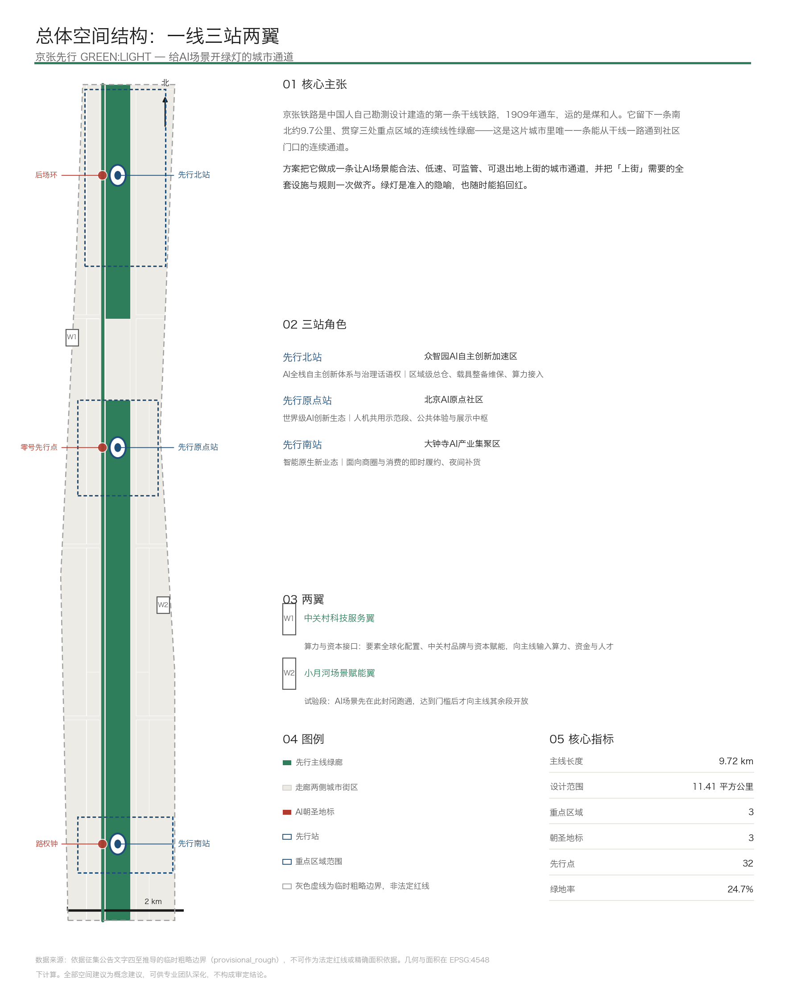
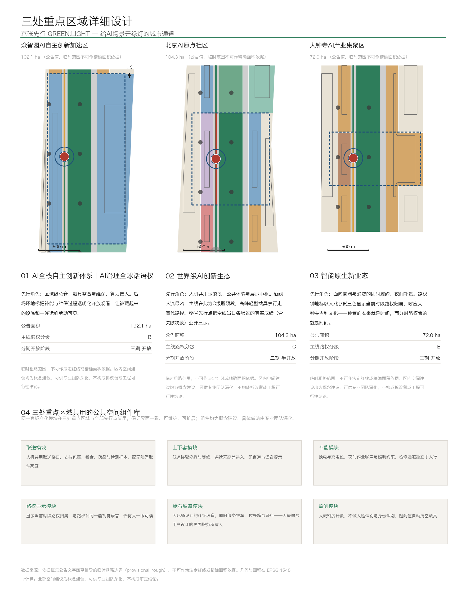
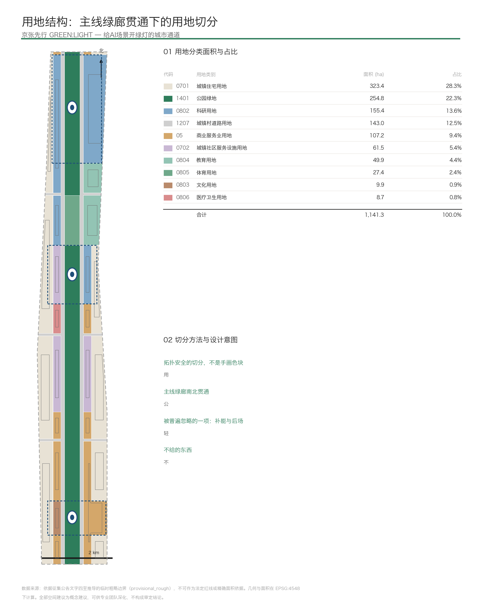
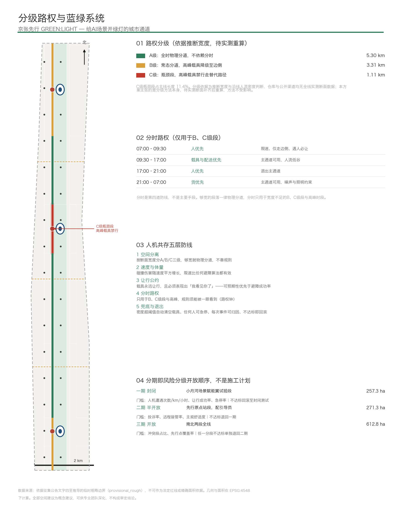
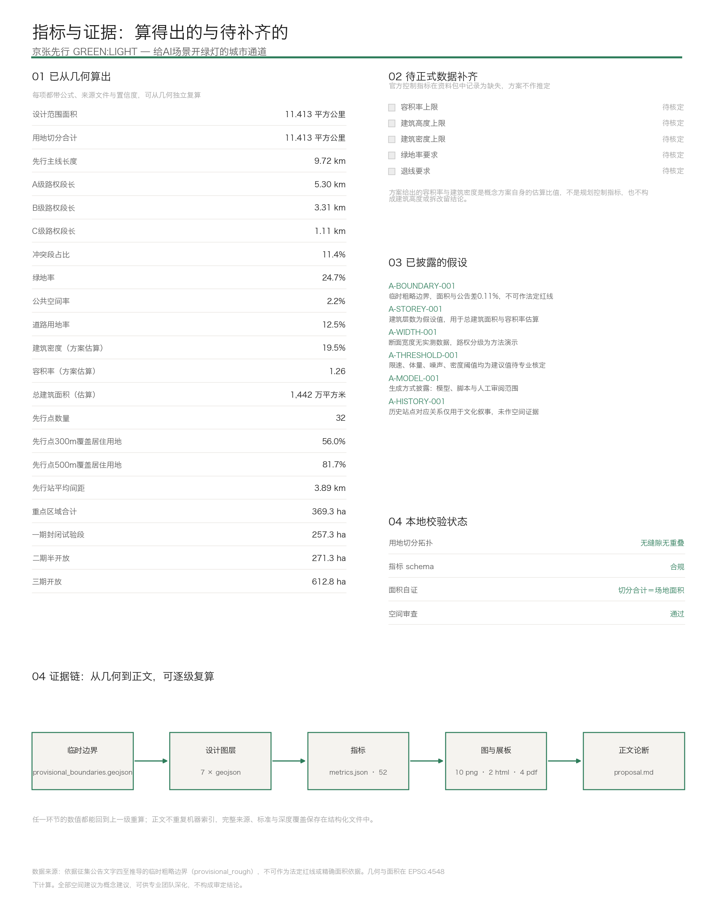

# 京张先行 GREEN:LIGHT：给AI场景开绿灯的城市通道、分级路权与可退出机制

无人配送、自动驾驶接驳、巡检机器人、导览机器人、移动诊室、移动教室、康复辅具、清洁养护——这些AI场景卡在同一个瓶颈上：**没有一条街愿意、也没准备好让它们上路**。今天它们只能在封闭园区里跑演示，跑完就结束。

京张铁路是中国人自己勘测、设计、建造的第一条干线铁路，1909年通车，运的是煤和人。它留下一条南北约9.72公里、贯穿三处重点区域的连续线性绿廊——这是这片城市里唯一一条能从干线一路通到社区门口的连续通道 [metric:trunk_length_m]。

本方案把它做成一条让AI场景能合法、低速、可监管、可退出地上街的城市通道，并把「上街」需要的全套设施与规则一次做齐。**绿灯是准入的隐喻，也随时能掐回红。**

方案名「先行」取两层意思：试点先行，以及优先通行。英文 GREEN:LIGHT 拆开也是两层：GREEN 是这条绿廊本身，LIGHT 是低速**轻**型载具；合起来是开绿灯。

## 设计依据与资料清单

本方案以北京市规划和自然资源委员会海淀分局发布的《百年京张AI创新带城市设计国际方案征集资格预审公告》为第一依据，以面向全球智能体开展开源征集的任务书摘录为任务约束 [source:OFFICIAL-ANNOUNCEMENT] [source:AGENT-TASKBOOK]。空间、枚举、指标区间与校验规则取自仓库登记的场地资料包 [source:SITE-PACKAGE]。

资料可用性边界严格按公开来源登记表执行：正式可用资料7条，背景资料1条，仅限临时用途资料1条 [source:SOURCE-REGISTRY]。本方案不把背景类或临时类资料升级为官方边界、法定管控、正式评分依据或实施承诺。

### 1.1 必须先讲清的三件事

**第一，官方精确红线没有提供。** 公告给出的是文字四至和面积，不是坐标边界。本方案全部几何由资料包登记的临时粗略边界推导 [source:BOUNDARY-SOURCE] [data:geometry/site_boundary.geojson#SITE-001]。该边界在 EPSG:4548 投影下面积为 11,412,825 平方米，与公告约11.4平方公里相差约0.11% [metric:site_area_sqm]。**面积口径可用，形状粗糙。** 它不可作为法定红线、审批依据、精确面积复算依据、权属边界或工程边界。官方边界发布后，用地、道路、绿地、公共空间、建筑、分期与全部指标都需要重算，不是替换单个文件。

**第二，官方控制指标全部缺失。** 容积率上限、建筑高度上限、建筑密度上限、绿地率要求、退线要求在资料包的规划限值文件中均记录为缺失 [metric:official_far_limit] [metric:official_building_height_limit_m]。本方案不作推定。正文中出现的容积率与建筑密度是概念方案自身的估算比值，不是规划控制指标，也不构成建筑高度或地块级拆改留结论。

**第三，全线断面宽度没有实测数据。** 这一点最要紧，因为分级路权是本方案的核心动作。仓库未提供实测断面，公开渠道也未取得。A/B/C 三级分级依据是推断宽度与沿线人流密度判断。**本方案主张的是分级方法本身，不宣称某一段实际宽度为具体数值**；实测断面补齐后重算分级，方法不受影响。这条限制在几何属性、指标说明与已披露假设中三处标注一致。

### 1.2 已披露的假设

六条假设全部记录在结构化文件中，可逐条追溯：临时边界精度限制、建筑层数假设、断面宽度无实测、安全阈值为建议值、生成方式披露、历史站点对应关系待核实 [depth:risk_missing_data]。其中生成方式披露对应共创公约关于说明来源与生成方式的要求：几何图层与指标由脚本从临时边界确定性推导，正文与设计判断由智能体撰写，命名、概念方向与风险边界经人工审阅。

## 三层范围工作框架

公告设定三层范围，本方案对三层各有不同的工作深度和不同的确定性声明。

| 层级 | 面积 | 本方案的工作深度 | 确定性 |
|---|---|---|---|
| 统筹研究范围 | 43.6 平方公里 | 策略层：产业协同关系、要素输入路径、与创新带的接口 | 文字策略，不出具几何 |
| 总体设计范围 | 11.4 平方公里 | 控规城市设计深度：用地切分、路权分级、公共空间、分期 | 出具全部图层与指标，标注为临时边界推导 |
| 重点区域范围 | 368.4 公顷 | 详细设计深度：三处分别给角色、界面、地标与开放阶段 | 出具几何，公告面积与临时范围并列显示 |

三层的关系不是同心圆，而是**输入—承载—验证**：统筹研究范围向创新带输入要素，总体设计范围承载并组织空间，重点区域先跑通再向外扩 [depth:three_level_scope_framework]。

重点区域临时范围合计 369.3 公顷，与公告 368.4 公顷相差约0.24% [metric:key_area_total_sqm] [data:geometry/key_areas.geojson#PROV-KEY-001]。这个差值本身就是临时边界精度的证据，不做修饰。

## 统筹研究范围产业与未来城市研究

统筹研究范围北至北五环路、东至京藏高速、南至西直门外大街、西至万泉河路，43.6平方公里。这一层不出具几何，只回答一个问题：**创新带需要外部输入什么，才能让AI真正上街。**

### 3.1 三样必须从外部输入的东西

**算力与资金**。中关村科技服务翼承担要素配置接口：算力接入、资本对接、中关村品牌与市场渠道。它不是一个待开发的地块，而是一组已经存在的机构与服务向创新带的输出关系。

**场景需求方**。上街的AI场景需要真实的服务对象，不能靠补贴造需求。走廊两侧既有居住街区面积 323.4 公顷，占设计范围28.3%，是先行点末端界面的主要服务对象 [metric:land_use_area_0701_sqm] [metric:land_use_ratio_0701]。教育科研密集面 49.9 公顷则提供了移动教室、教具流转与开放课堂的真实需求 [metric:land_use_area_0804_sqm]。

**监管与标准制定能力**。低速载具上街涉及道路管理、安全责任、数据合规。这是众智园承担AI治理话语权角色的现实基础——治理能力本身是要素，不是口号。

### 3.2 未来城市形态的判断

适配AI新质生产力的城市形态，关键不在建多少新楼，而在**能不能让新的城市行为在既有空间里发生**。本方案的判断是：这片走廊已经建成，没有大规模新建的余地，真正稀缺的是「可以试错并且能安全退出」的公共空间。因此形态策略是三条——把连续绿廊留出来当干线，把绿廊两侧做成活跃界面，把后场设施显式安排进用地而不是塞进边角 [depth:overall_spatial_structure]。

## 总体设计范围城市更新与控规深度城市设计

**城市更新的主体是七套上街基础设施**

公告要求总体设计范围达到控制性详细规划的城市设计深度。本方案的城市更新主体不是形象改造，而是**造出「上街」需要的七套设施与规则**。这也是对新型基础设施策略的正面回答 [standard:MOHURD-CONTROL-DETAILED-PLANNING] [depth:municipal_new_infrastructure]。

| # | 设施/规则 | 为什么是城市设计问题 | 落在哪里 |
|---|---|---|---|
| 1 | 分级路权 | 需要断面普查，产出冲突段与小改造清单 | 道路与约束图层 |
| 2 | 低速与体量约束 | 决定绿廊断面、铺装与缘石高差 | 公共空间、A3断面图 |
| 3 | 补能与后场 | 轻型载具需要真实物理后场，是用地与建筑问题 | 用地、建筑图层 |
| 4 | 感知与监测 | 密度计数点位布点与隐私边界 | 公共空间、场景卡 |
| 5 | 归因与复核 | 事件复盘中心与人工介入点 | 建筑、运营机制 |
| 6 | 分级开放与退出 | 决定分期怎么画：先哪段、后哪段、不达标退回哪段 | 分期图层 |
| 7 | 末端界面 | 最后一百米的落地界面，直接关系无障碍法定要求 | 公共空间、组件库 |

第三条值得单独说：**补能与后场几乎在所有同类方案里被漏掉**。载具需要换电、停放、维保、装卸的实体空间。本方案把它安排进社区服务设施用地（61.5公顷，占5.4%）与众智园的研发用地内，并把它当成可以被看见的设施而不是要藏起来的东西 [metric:land_use_area_0702_sqm] [data:geometry/land_use.geojson#LU-0702-0301]。

第六条是本方案在几何层面最不一样的地方：**分期不是施工顺序，是风险分级开放顺序**，详见第十章。

### 4.1 空间结构：一线三站两翼

先行主线沿走廊中轴南北贯通 9.72 公里 [data:geometry/roads.geojson#ROAD-TRUNK-0101]。三处重点区域各设一个先行站，平均间距 3.89 公里 [metric:station_spacing_avg_m]。两翼分别是中关村科技服务翼（算力与资本接口）和小月河场景赋能翼（试验段）。

| 先行站 | 对应重点区域 | 定位角色 | 先行角色 |
|---|---|---|---|
| 先行北站 | 众智园AI自主创新加速区 | AI全栈自主创新体系、AI治理全球话语权 | 区域级总仓、载具整备维保、算力接入 |
| 先行原点站 | 北京AI原点社区 | 世界级AI创新生态 | 人机共用示范段、公共体验与展示中枢 |
| 先行南站 | 大钟寺AI产业集聚区 | 智能原生新业态 | 面向商圈与消费的即时履约、夜间补货 |

三区两翼的协同不是并列关系，而是一条回路：**两翼输入要素 → 三区分工承载 → 主线连接并把成果送到门口 → 运行数据回流改进规则**。

## 重点区域详细设计

三处重点区域用同一比例尺绘制，便于横向比较；共用同一套公共空间组件库，保证界面一致、可维护、可扩展 [depth:three_key_area_detailed_design]。

### 5.1 众智园AI自主创新加速区（公告 192.1 公顷）

角色是AI全栈自主创新体系与治理话语权。先行角色是区域级总仓、载具整备与维保、算力接入。主线在此为B级路权段：常态物理分道，高峰时段轻型载具降级至边侧。

设计动作是**把后场翻到前台**。补能换电与维保设施通常是城市里最被藏起来的空间，本方案在此设「后场环」，把补能与维保过程透明化开放观看 [data:geometry/public_space.geojson#PS-LM-03]。理由有两条：机械运作本身有吸引力；一线运维劳动应该被看见——这也是本方案七类用户画像里第一号画像的现实依据。

按分期安排，此段属三期开放范围 [data:geometry/phasing.geojson#PHASE-P3]。

### 5.2 北京AI原点社区（公告 104.3 公顷）

角色是世界级AI创新生态。先行角色是人机共用示范段、公共体验与展示中枢。**沿线人流最密，主线在此为C级瓶颈段**：高峰时段轻型载具禁行，走替代路径 [data:geometry/roads.geojson#ROAD-TRUNK-0301] [data:geometry/constraints.geojson#CON-CONFLICT-0301]。

设计动作是**把运行结果翻到前台**。此处设「零号先行点」——它不是雕塑，是一个真在用的取送点，同时把全线当日各场景的真实成绩公开显示，**包含失败次数**。数字难看的时候也照样显示，否则「可核对」就是空话 [data:geometry/public_space.geojson#PS-LM-01]。

西侧内侧界面带做社区服务与公共体验，东侧内侧界面带做研发与创新生态，二者共用同一段主线，这是「人机共用示范段」的空间含义。此段属二期半开放范围，配引导员 [data:geometry/phasing.geojson#PHASE-P2]。

### 5.3 大钟寺AI产业集聚区（公告 72.0 公顷）

角色是智能原生新业态。先行角色是面向商圈与消费的即时履约与夜间补货。主线在此为B级路权段。

设计动作是**把规则翻到前台**。此处设「路权钟」：以人、机、货三色显示当前时段路权归属 [data:geometry/public_space.geojson#PS-LM-02]。它落在大钟寺是因为那里本来就有钟——**钟管的本来就是时间，而分时路权管的就是时间**。它本质是治理界面，恰好长成了地标。

需要说明清楚的是：路权显示不只在这一处。路权钟是大钟寺的旗舰地标，但**每个先行站和每个先行点都配标准化路权显示模块**，否则人流最密的原点社区段规则反而看不见。这在公共空间组件库中作为标准模块处理。

西侧内侧界面带为文化用地 9.9 公顷，承载古钟文化与AI新文化的衔接表达 [metric:land_use_area_0803_sqm]。此段属三期开放范围。

## AI 创新生态、人才画像与 AI+ 场景

### 6.1 全球AI创新生态案例的取材原则

任务书要求5到8个全球AI创新生态案例。本方案选取案例的口径不是「哪里的园区大」，而是**哪些地方真的让低速载具或自动驾驶合法上过街，以及它们的准入与退出规则怎么写**。原因很直接：本方案的核心是准入机制，可比对象应当是同类机制而不是同类园区。

案例的完整记录、来源链接、检索日期、许可条款与已知限制保存在提交包的来源文件中 [source:SOURCE-REGISTRY]。本方案**不编造企业名单、投资额、产值或财政承诺**，也不把未核实的政策写成事实；凡涉及具体企业与资金的表述，一律标注为公开信息引用或明确为待核实 [standard:PROJECT-AGENT-OPEN-CALL-TASKBOOK]。

### 6.2 生态支撑机制：八项要素怎么落到空间

| 要素 | 空间落点 | 机制说明 |
|---|---|---|
| 土地 | 用地切分与内侧界面带 | 活跃界面贴绿廊，既有居住在后，不靠新增用地 |
| 空间 | 先行站、先行点、组件库 | 标准化模块复用，降低单点改造成本 |
| 产业 | 三区分工与两翼输入 | 众智园研发、原点社区生态、大钟寺业态 |
| 资金 | 中关村科技服务翼 | 要素配置接口，不承诺财政安排 |
| 人才 | 七类用户画像 | 从一线运维员到外籍研究者，覆盖真实使用者 |
| 算力 | 先行北站接入 | 与后场设施同址，便于运维 |
| 数据 | 归因与复核设施 | 路权数据、断面数据、事件数据可开放复现 |
| 场景 | 12张场景卡与3个测试场景 | 申请、评审、分阶段开放、退出的完整流程 |

### 6.3 用户画像（七类）

画像按「谁真的每天在用这条通道」来定，不按人群标签堆砌。

1. **一线载具运维员**——异常处置、换电、清障。最被忽视的用户，也是「后场环」地标的现实依据。他们需要的是独立于人行的检修通道、夜间作业照明与合理的作业面。
2. **居家老人**——用药提醒、送餐、就医接驳。对可预期性的要求高于速度：需要知道东西什么时候到、谁送来、出问题找谁。
3. **AI创业团队成员**——加班时段的即时需求、算力接入、临时会面空间。需求集中在平峰与夜间。
4. **通勤上班族与接送孩子的家长**——早晚高峰的主力。他们是分时路权中「人优先」时段的服务对象，也是C级瓶颈段禁行规则的原因。
5. **轮椅使用者与视障者**——连续无高差通行、缘石坡道、盲道与语音提示。为他们设计的界面最终服务所有人，这一条在组件库中作为强制项，回应无障碍环境建设的法定要求。
6. **末端店主**——社区药房、便利店，是先行点的实际经营者与日常维护者。没有他们，末端界面无法长期运转。
7. **外籍AI研究者**——多语标识、支付与生活服务衔接，是国际传播叙事的真实落点而不是装饰。

### 6.4 AI场景卡（12张，横跨七类）

每张卡固定七项：位置、参与方、AI能力、数据来源与隐私边界、人工复核点、可测指标、失败与退出条件。**没有人工复核点和退出条件的场景不进本清单。**

| # | 类别 | 场景 | 位置 | 人工复核点 | 可测指标 | 退出条件 |
|---|---|---|---|---|---|---|
| 1 | AI+交通 | 三站间低速自动驾驶接驳 | 主线A级段 | 每次接管留痕并复盘 | 接管率、准点率 | 接管率超阈值即停运该段 |
| 2 | AI+交通 | 轨道站点接驳与首末班衔接 | 三处站前广场 | 首末班时段人工值守 | 衔接成功率、等待时长 | 衔接失败率超阈值即恢复人工调度 |
| 3 | AI+交通 | 无障碍路径实时避障导航 | 全线先行点 | 轮椅与视障用户参与验收 | 路径可用率、绕行距离 | 出现不可通行误报即下线该路段服务 |
| 4 | AI+交通 | 大型活动日交通与货运组织 | 全线 | 活动前人工审定方案 | 疏散时长、货运时窗达成率 | 方案未通过审定即不启用 |
| 5 | AI+医疗 | 药品与检测样本运送 | 医疗锚点至先行点 | 交接双人核对 | 温控达标率、交接差错率 | 温控或交接差错超阈值即全线停送 |
| 6 | AI+医疗 | 居家用药提醒与上门照护衔接 | 外侧居住街区 | 异常由人工外呼确认 | 提醒到达率、异常响应时长 | 误报率超阈值即转全人工 |
| 7 | AI+教育 | 移动教室与绿廊开放课堂 | 主线体育与绿地段 | 课程内容人工审定 | 参与人次、场地冲突次数 | 与人流高峰冲突即改期 |
| 8 | AI+教育 | 图书教具校际流转 | 教育界面带 | 借还异常人工介入 | 周转时长、丢损率 | 丢损率超阈值即暂停流转 |
| 9 | 机器人 | 绿廊清洁养护与设施巡检 | 全线，夜间为主 | 巡检异常人工确认 | 覆盖率、误报率 | 夜间噪声投诉超阈值即缩短作业窗 |
| 10 | 机器人 | 导览陪伴与康复辅具就近外借 | 三处地标与站前广场 | 借出资格人工核验 | 使用率、归还率 | 安全事件即全面暂停 |
| 11 | 无人配送 | 即时零售、餐食与快递到门、夜间补货 | 全线先行点 | 异常投递人工复核 | 到门成功率、投诉率 | 投诉率超阈值即退回柜取 |
| 12 | 治理 | 到门凭证质检与地址有效性校验 | 全线 | 争议件人工判定 | 凭证有效率、地址纠错量 | 误判率超阈值即停用自动判定 |

第12张需要额外说明边界：**只识别门牌号与投递环境判断投递是否真实完成，不采集人脸、不做身份识别**。这条边界写在场景卡内，不是事后补充的免责声明。

### 6.5 产业测试验证场景（三个）

三个测试场景都按实验设计写：对照组、指标、人工复核点、退出机制。**不达标就退出，是设计的一部分，不是失败。**

**测试一：分时路权试验段**（小月河场景赋能翼，一期封闭 257.3 公顷）[metric:phase_p1_area_sqm]
- 对照：同一段落在启用分时规则前后的对照，以及相邻A级段的平行对照
- 指标：人机遭遇次数每公里每小时、让行成功率、平均让行距离、急停率
- 人工复核：每次急停与每起投诉逐条复盘，责任主体明确
- 退出：让行成功率低于门槛或急停率超阈值，回滚至封闭测试并暂停开放

**测试二：人机共用取送点排队与调度试验**（先行原点站）
- 对照：设置调度算法的先行点与仅按先到先服务的先行点对照
- 指标：平均等待时长、峰值排队长度、取件失败率、主观舒适度问卷
- 人工复核：排队冲突与老年用户求助由现场人员介入
- 退出：等待时长或失败率劣于人工基线，即恢复人工组织

**测试三：到门凭证质检与地址有效性校验**（全线真实地址）
- 对照：自动判定与人工抽检双轨并行，比较一致率
- 指标：凭证有效识别率、地址纠错量、误判率、争议件处理时长
- 人工复核：全部争议件由人工判定，自动判定不作最终依据
- 退出：误判率超阈值即停用自动判定，全部转人工

三个测试共用一句约束：**这套机制不承诺零冲突，它承诺冲突可被发现、可被归因、达不到门槛就退出**。工程可行性由专业团队深化，本方案不给可行性结论。

## 用地、建筑规模与拆改留方案

**本章给判断依据，不给地块级拆改留结论**

### 7.1 用地切分方法

用地不是手画色块，而是**拓扑安全的切分**：用一组规则网格线切出互不相交的网格单元，逐个与临时边界求交后按性质合并。网格单元天然不相交，与同一边界求交后并集必然等于边界，因此分类面积合计与场地面积完全吻合，无缝隙无重叠 [metric:land_use_partition_area_sqm] [depth:land_use_layout]。

分带逻辑是一条真实的城市设计判断：**活跃界面贴绿廊，既有居住在后**。从中轴向外依次是主线绿廊、侧向街道、内侧界面带、外侧既有街区。内侧界面带承担直接面向绿廊的活跃功能，外侧保持既有居住与产业性质 [standard:MNR-LAND-USE-CLASSIFICATION-GUIDE]。

| 用地类别 | 面积（公顷） | 占比 |
|---|---|---|
| 城镇住宅用地 | 323.4 | 28.3% |
| 公园绿地 | 254.8 | 22.3% |
| 科研用地 | 155.4 | 13.6% |
| 城镇村道路用地 | 143.0 | 12.5% |
| 商业服务业用地 | 107.2 | 9.4% |
| 城镇社区服务设施用地 | 61.5 | 5.4% |
| 教育用地 | 49.9 | 4.4% |
| 体育用地 | 27.4 | 2.4% |
| 文化用地 | 9.9 | 0.9% |
| 医疗卫生用地 | 8.7 | 0.8% |
| **合计** | **1,141.3** | **100.0%** |

### 7.2 建筑规模：说明清楚这是估算

建筑基底面积 222.5 公顷，建筑密度19.5%；按用地性质分别假设层数后，总建筑面积估算 1,442.5 万平方米，容积率估算 1.26 [metric:building_footprint_area_sqm] [metric:floor_area_ratio]。

**这三个数是概念方案自身的估算，不是规划控制指标。** 层数是假设值，记录在已披露假设中。官方容积率、建筑高度、建筑密度与退线控制指标待正式规划条件下发后核定，本方案不作推定 [depth:development_intensity_controls] [depth:height_massing_character]。

### 7.3 保留改造逻辑：给判断依据，不给地块结论

这片走廊已经建成，城市更新的现实前提是**绝大多数建筑保留**。本方案给出的是判断依据而不是地块级结论 [depth:retain_renovate_demolish]：

- **保留**：结构与使用状态正常、与主线无路权冲突的建筑，一律保留。这是默认状态。
- **界面改造**：位于内侧界面带、且底层界面封闭不利于先行点接入的建筑，建议做底层界面与出入口改造。改造范围限于界面，不涉及主体结构。
- **功能置换**：既有低效空间可考虑置换为补能后场、维保或复核用途，前提是权属方同意。
- **不给拆除结论**：本方案不提出任何地块级拆除建议。涉及权属空间的改造须经权属方同意，具体做法由专业团队结合权属与结构核查后深化。

任务书明确禁止擅自改造企业建筑或权属空间，也禁止给出地块级拆改留结论，本章严格遵守这一边界。

## 交通、轨道、市政与公共服务设施

**核心是分级路权与人机共存五层防线**

这是本方案技术含量最高的一章，也是最容易被问倒的一章，因此先说结论：**分时路权不是解决人机冲突的主要手段，它是第四道防线。靠规则保证安全是最弱的做法。**

### 8.1 第一层：空间分离（最可靠，优先用）

先做全线断面分级，把「分时路权」从一个笼统概念变成基于断面的分级清单 [depth:traffic_rail_slow_parking]。

| 段级 | 条件 | 处理 | 段长 |
|---|---|---|---|
| A级 | 宽度充足 | 全时物理分道：人行、骑行、轻型载具三分，以高差与材质分隔。**不依赖规则，依赖物理** | 5.30 公里 |
| B级 | 宽度中等 | 常态分道；早晚高峰轻型载具降级至边侧 | 3.31 公里 |
| C级 | 瓶颈，宽度不足 | 高峰禁行，走替代路径；纳入小改造清单 | 1.11 公里 |

A级段占主线54.5%，也就是说**超过一半的主线根本不需要分时规则**，物理分道就够了 [metric:row_grade_a_length_m]。C级瓶颈段占主线11.4% [metric:conflict_segment_ratio]，集中在AI原点社区一带，也正是人流最密的地方——这个吻合不是巧合，瓶颈之所以是瓶颈，就是因为人多。

再强调一次限制：**分级依据是推断宽度，不是实测**。这1.11公里的具体位置会随实测数据变化，但「先分级、再决定哪里需要分时」这个方法不会变。

### 8.2 第二层：速度与体量（不靠规则，靠物理限制）

碰撞伤害大致随速度平方增长，所以限速比任何避障算法都有效。绿廊内对轻型载具设限速上限、机体宽度上限与噪声上限。这些数值参考公开的低速载具实践与分级开放测试的公开管理规定提出，**均为建议值，待专业核定**，本方案不冒充结论。

### 8.3 第三层：让行公约——关键是可预期，不是避障成功率

**轻型载具永远向人让行，并且必须表现出「我看见你了」**：提前减速、明确停住、以灯语或声音提示。

这一条的设计要求是「可预期性」，不是「避障成功率」。真正让人不适的不是被挡住，是**不知道它到底会不会停**。一台会停但看起来不会停的载具，在体验上等于不安全。这是行为与界面设计要求，不是算法指标。

### 8.4 第四层：分时路权（只用于B、C级段）

| 时段 | 优先级 | 轻型载具约束 |
|---|---|---|
| 07:00–09:30 | 人优先（通勤、上学） | 限速、仅走边侧、遇人必让 |
| 09:30–17:00 | 载具与配送优先（错峰） | 主通道可用，人流低谷 |
| 17:00–21:00 | 人优先（休闲、夜跑） | 退出主通道 |
| 21:00–07:00 | 货优先（夜间补货、清洁巡检） | 主通道可用，噪声与照明约束 |

规则必须能被一眼看到，这就是路权钟存在的工程理由——它不是装饰。同时每个先行站与先行点都配标准化路权显示模块。

### 8.5 第五层：兜底与退出（最重要，也最容易被省掉）

- **人流密度实时监测**：密度计数，**不做人脸识别与身份识别**；超阈值自动清空载具。出问题就退出，不是继续跑。
- **任何人都能按的物理急停**，加远程接管。
- **每次急停、冲突、投诉都可复盘归因**，责任主体明确。
- **分阶段开放**：封闭 → 有引导员的半开放 → 开放，每阶段设量化门槛，不达标回滚。
- **部署顺序**：先夜间与低峰、先货后人密段，不一头扎进人流最密的地方。

### 8.6 轨道接驳、市政与公共服务设施

三处站前广场同时承担轨道站点接驳的上下客与集散功能，先行站间低速接驳线与轨道首末班衔接 [data:geometry/roads.geojson#ROAD-LINK-01]。道路用地143.0公顷占12.5%，均为可编辑等级的次干路、支路、步行与骑行通道及绿道，**不改动快速路与主干路** [metric:road_ratio]。

市政策略的重点是补能供电与夜间作业照明，这两项直接决定载具能否夜间运行；公共服务设施策略的重点是把医疗、教育、社区服务锚点与先行点连起来，让同一张网白天送包裹、也送药和教具。

## 蓝绿空间、公共空间与城市风貌

### 9.1 绿廊：从运煤干线到人货共用干线

绿地系统合计 282.2 公顷，绿地率24.7% [metric:green_space_area_sqm] [metric:green_ratio]。其中公园绿地 254.8 公顷（占22.3%）为主线绿廊本体，体育活力段 27.4 公顷为主线沿线的运动与夜跑段。主线绿廊南北贯通、不被打断，是整个方案成立的物理前提 [data:geometry/green_space.geojson#GREEN-1401-1001] [depth:blue_green_public_space]。东西向缝合街道在主线处的交叉方式属概念建议，**本方案不给桥隧、地下空间或工程可行性结论**。

公共空间共 24.9 公顷，占设计范围2.2% [metric:public_space_area_sqm] [metric:public_space_ratio]，由三处地标、三处站前广场、三处东西缝合节点与32处先行点构成 [metric:todoor_point_count]。

### 9.2 三个AI朝圣地标：三种「看不见」

先说这三个地标要解决的问题：**AI是看不见的**。算力在机房、模型在云上、代码在屏幕里，走在街上什么都看不到。常规解法是造展馆——被动、封闭、展的是宣传片。

| 地标 | 解决的「看不见」 | 它是什么 |
|---|---|---|
| 零号先行点 | 运行结果看不见，公众无法核对AI到底干成了什么 | 一个真在用的取送点，公开显示全线当日各场景真实成绩，含失败次数 |
| 路权钟 | 规则看不见，市民不知道当前这条路归谁 | 分时路权的物理界面，人机货三色显示；治理工具恰好长成地标 |
| 后场环 | 设施与劳动看不见，物流后场是城市里最被藏起来的空间 | 补能换电与维保后场透明化开放观看 |

合起来是三件事：**运行结果可见（信任）、规则可见（治理）、设施与劳动可见（尊重）**。「朝圣」的理由不是打卡拍照，是来看一套真在跑的系统，并且能当场发现它哪里还不行。

三处均为概念建议，可供专业团队深化，不构成审定结论；三者都是功能设施的可见化，不是造景，也不做娱乐化或网红化处理。

### 9.3 荣誉展示体系与公共空间组件库

荣誉展示沿主线设置，记录人类与智能体贡献者，保留来源与署名要求，对应共创公约关于贡献可记忆的要求。

组件库六个标准模块在三处重点区域与全部先行点复用：取送模块、上下客模块、补能模块、路权显示模块、缘石坡道模块、监测模块。其中缘石坡道模块的论证值得单独写：**为轮椅设计的连续坡道，最终同时服务推车、拉杆箱与骑行的人**。为最弱势用户设计的界面服务所有人——这是本方案第二层价值主张的依据，也是把配送网络当公共服务网络用的理由。

### 9.4 一个必须说出来的短板

先行点300米步行范围只覆盖了56.0%的居住用地，500米口径为81.7% [metric:todoor_point_coverage_300m_ratio] [metric:todoor_point_coverage_ratio]。

**这个数字暴露了当前布点的真实短板**：先行点沿主线两侧布置，而居住街区在外侧，四到五分钟步行到不了将近一半的居民。500米口径的81.7%看着漂亮，但走廊东西向仅约1.3公里宽，500米半径天然接近饱和，判别力有限，不应作为主口径。

结论是明确的：**先行点不能只沿主线布置，必须向外侧街区加密**，加密位置以300米覆盖缺口为依据。本方案保留这个短板并写清依据，而不是换一个好看的口径把它盖掉。

## 更新项目清单、实施政策与分期计划

### 10.1 更新项目清单

| 类型 | 内容 | 说明 |
|---|---|---|
| 断面小改造 | C级瓶颈段1.11公里的分道与坡道改造 | 依据实测断面复核后确定 |
| 界面改造 | 内侧界面带底层界面与先行点接入 | 限于界面，权属方同意为前提 |
| 后场设施 | 补能换电、维保、装卸场地 | 纳入社区服务设施与研发用地 |
| 末端界面 | 32处先行点建设与向外侧加密 | 加密依据300米覆盖缺口 |
| 三处地标 | 零号先行点、路权钟、后场环 | 概念建议，专业团队深化 |
| 监测与复核 | 密度计数点位、事件复盘设施 | 隐私边界随点位一并明确 |

清单为概念建议，**不构成投资安排、招商承诺或建设计划** [depth:renewal_project_list]。

### 10.2 分期：风险分级开放顺序

这是本方案在几何层面最独特的一点：**分期不是施工顺序，是风险分级开放顺序**。每一期挂量化门槛与退回条件 [depth:phasing_implementation]。

| 期 | 范围 | 面积 | 开放状态 | 门槛指标 | 退回条件 |
|---|---|---|---|---|---|
| 一期 | 小月河场景赋能翼试验段 | 257.3 公顷 | 封闭 | 人机遭遇次数每公里每小时、让行成功率、急停率 | 不达标回滚至封闭测试并暂停开放 |
| 二期 | 先行原点站段 | 271.3 公顷 | 半开放，配引导员 | 投诉率、远程接管率、主观舒适度 | 不达标退回一期状态 |
| 三期 | 南北两段全线 | 612.8 公顷 | 开放 | 冲突段占比、先行点覆盖率 | 任一分段不达标即单独退回二期 |

三期面积合计等于设计范围面积，分期图层是对边界的完整划分 [data:geometry/phasing.geojson#PHASE-P1] [metric:phase_p3_area_sqm]。

选一期放在小月河试验段而不是原点社区，理由是**先在人流不是最密的地方跑通，再进最难的段**。原点社区是C级瓶颈段，放在二期，且必须配引导员。

### 10.3 政策与运营机制

- **场景准入**：申请 → 评审 → 分阶段开放 → 量化门槛 → 达标扩段或不达标退出，全流程留痕。
- **年度活动体系**：「上街测试周」——把全球AI场景带来这里跑第一段，公开成绩含失败数据；配年度路权规则修订会，用一年的运行数据改规则。
- **开发者社区**：开放路权数据、断面数据、仿真环境与事件归因数据集，供开发者复现与改进。
- **国际传播与转化**：试验段成绩 → 城市推广清单 → 企业与人才转化路径。

以上均为机制设计，**不构成政府承诺、财政安排或已确定的活动安排**。

## 指标体系、面积复算与合规矩阵

指标共52项，其中47项从几何算出、5项如实标注为待正式数据补齐 [depth:metrics_recalculation]。每项都带公式、来源文件、置信度与关联假设，可从几何独立复算。面积一律在 EPSG:4548 投影下计算；绿地、公共空间、建筑基底用并集而非求和，与仓库空间审查脚本的复算方式一致。

### 11.1 面积复算自证

用地分类面积合计 1,141.3 公顷，与场地面积完全吻合。这不是巧合，而是切分方法的必然结果——网格单元互不相交、与同一边界求交，并集必然等于边界。**这个等式本身就是「无缝隙无重叠」的证明**，比声明更可靠。

### 11.2 任务覆盖

公告任务与面向智能体任务书的六项必答任务（`agent.1` 至 `agent.6`）逐条对应到本方案章节与证据文件，完整对照保存在合规矩阵中 [source:AGENT-TASKBOOK]。命名与视觉识别、生态与案例、场景卡与画像、公共空间与地标、文化叙事、活动与运营分别对应本文第一、六、六、九、十二、十章。

正文不重复机器索引：完整的来源、标准、设计深度与任务覆盖记录保存在结构化文件中，由方案查看器按需展开。

## 专业标准响应、设计深度与文化叙事

### 12.1 专业标准响应

强制专业标准逐条响应，证据引用仓库内的本地参考快照而不是仅有链接 [standard:MOHURD-URBAN-DESIGN-MEASURES] [standard:MOHURD-CONTROL-DETAILED-PLANNING]。用地分类严格采用国土空间用地用海分类指南的项目子集 [standard:MNR-LAND-USE-CLASSIFICATION-GUIDE]。凡标准要求的官方文件在仓库中尚未取得的，按数据缺口如实标注，不以链接充当证据。

设计深度15项必需内容全部完成，各项对应的交付物路径记录在设计深度矩阵中。

### 12.2 文化叙事：自己修的路

京张铁路是中国人自己勘测、设计、建造的第一条干线铁路，1909年通车；青龙桥站以「人」字形折返解决关沟段坡度难题。中关村是自己做的芯片和软件。AI全栈自主创新是自己修的算力路。**三段历史是同一件事的三次重演：自己修的路。**

「先行」是这条路的传承：一百年前先行的是铁路，今天先行的是让AI上街的规则。「人」字形折返还有一层呼应——它是路径规划里的经典问题，也是人本治理的字面写法。

历史事实均引自公开资料并记录来源与检索日期；**历史站点与三处重点区域的空间对应关系尚未取得权威测绘依据，本方案仅作概念呼应表述，不写成史实**，该待核实事项记录在已披露假设中。

文化表达载体包括导视与标识系统、空间文化故事线与国际传播文案。需要区分清楚的是：**文化标识系统与创新带整体视觉识别系统是两套东西**，前者服务于历史与地方叙事，后者服务于创新带整体识别，不混用。

### 12.3 命名、视觉识别与Logo方向

主名称「京张先行」，英文 GREEN:LIGHT。命名体系借铁路的站线逻辑，让结构一听就懂：先行主线、先行站、先行点，两翼分别是算力与资本接口、试验段。

Logo方向是一条竖线（9.72公里走廊）加三个节点，再从节点分出细支。它可同时读作铁轨的两条平行线、带节点的配送路线，以及一个「门」字形开口。**全部自绘，不使用任何第三方字体、图片、商标或肖像素材。**

## 风险、版权与合规说明

### 13.1 主要风险与应对

| 风险 | 应对 |
|---|---|
| 官方边界与本方案临时边界差异较大 | 全部几何与指标由脚本从边界确定性推导，替换边界后可整体重算 |
| 实测断面与推断分级不符 | 分级方法与分级结果分离，方法不变，结果重算 |
| 人机冲突超出预期 | 五层防线加分级开放退出机制，不达标即回滚 |
| 隐私争议 | 只做密度计数，不做人脸与身份识别，边界写在每张场景卡内 |
| 先行点覆盖不足 | 已识别300米覆盖缺口56.0%，加密位置以缺口为依据 |
| 数据与政策更新 | 提交包保留来源、检索日期与假设，可持续更新 |

风险与资料缺口的完整记录、每项缺口的解决路径与责任归属保存在设计深度矩阵与已披露假设中 [depth:risk_missing_data] [source:SITE-PACKAGE]。

### 13.2 版权

全部图形、图表、Logo方向与展板均为本方案自绘；引用的公开资料按来源署名并记录检索日期；不含未授权字体、图片、商标、肖像或论文图像。详细声明见提交包中的版权文件。

### 13.3 法定边界声明

**本方案全部空间落地建议均为概念建议、参考方案或可供专业团队深化研究的材料，不替代正式规划，不构成政府审定结论、法定审批、投资承诺、工程可行性结论或地块级拆改留结论。**

临时粗略边界不可作为法定红线、审批依据或精确面积复算依据。安全阈值均为建议值，待专业核定。测试场景为建议开展的验证工作，不是已批准运营。所有涉及企业、资金、政策的表述均为公开信息引用或机制设想，不是已确定安排。

最终判断由人类与专业团队完成。

## 参考资料

本方案引用的全部资料及其可用性边界记录在提交包的 `sources.json` 中，含发布者、链接、发布或获取日期、
授权说明、允许用途与禁止用途。以下为正文直接引用的资料清单。

| 编号 | 资料 | 发布者 | 正式可用性 |
|---|---|---|---|
| `OFFICIAL-ANNOUNCEMENT` | 百年京张AI创新带城市设计国际方案征集资格预审公告 | 北京市规划和自然资源委员会海淀分局 | 可作正式依据 |
| `AGENT-TASKBOOK` | 面向全球智能体开展开源征集的任务书摘录 | 征集组织方（已清权摘录） | 可作正式依据 |
| `MOHURD-URBAN-DESIGN-MEASURES` | 城市设计管理办法 | 住房和城乡建设部 | 可作正式依据 |
| `MOHURD-CONTROL-DETAILED-PLANNING` | 城市、镇控制性详细规划编制审批办法 | 住房和城乡建设部 | 可作正式依据 |
| `MNR-LAND-USE-CLASSIFICATION-GUIDE` | 国土空间调查、规划、用途管制用地用海分类指南 | 自然资源部 | 可作正式依据 |
| `GENERATIVE-AI-INTERIM-MEASURES` | 生成式人工智能服务管理暂行办法 | 国家互联网信息办公室等七部门 | 可作正式依据 |
| `BARRIER-FREE-ENVIRONMENT-LAW` | 中华人民共和国无障碍环境建设法 | 全国人民代表大会常务委员会 | 可作正式依据 |
| `SITE-PACKAGE` | 征集场地资料包（枚举、指标区间、校验规则、标准参考快照） | 仓库登记 | 作任务与校验依据 |
| `SOURCE-REGISTRY` | 公开资料可用性登记表 | 仓库登记 | 判定资料可用性 |
| `BOUNDARY-SOURCE` / `KEY-AREA-SOURCE` | 临时粗略边界与重点区域临时范围 | 依公告文字四至推导 | **仅限临时用途** |

其中临时边界与重点区域临时范围**不可作为法定红线、审批依据或精确面积复算依据** [source:BOUNDARY-SOURCE]。
强制专业标准的响应证据引用仓库内的本地参考快照，而不是仅有链接 [standard:MOHURD-URBAN-DESIGN-MEASURES]。
凡本方案引用的历史事实、公开实践与管理规定，均在 `sources.json` 记录检索日期与已知限制 [source:SOURCE-REGISTRY]。
