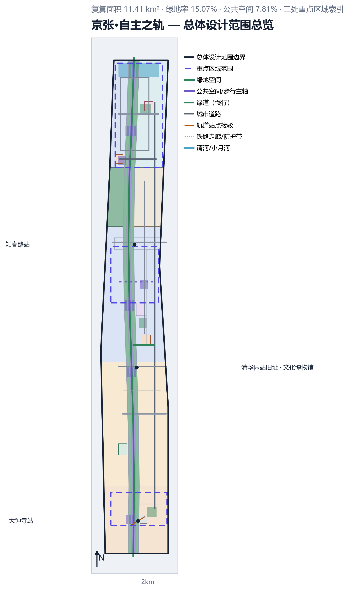
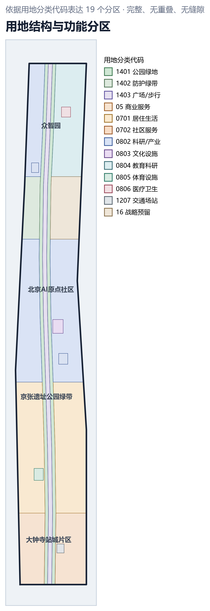
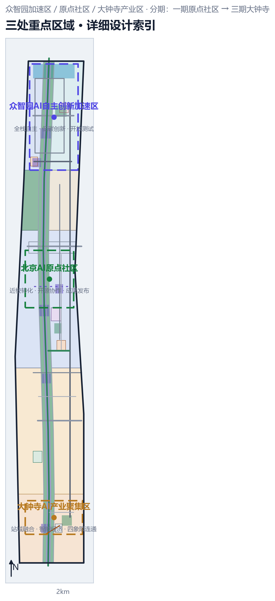
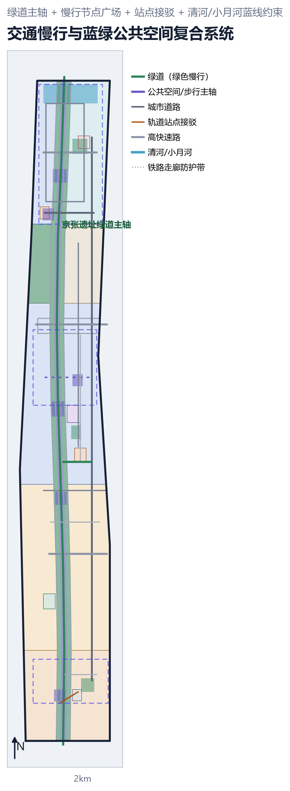
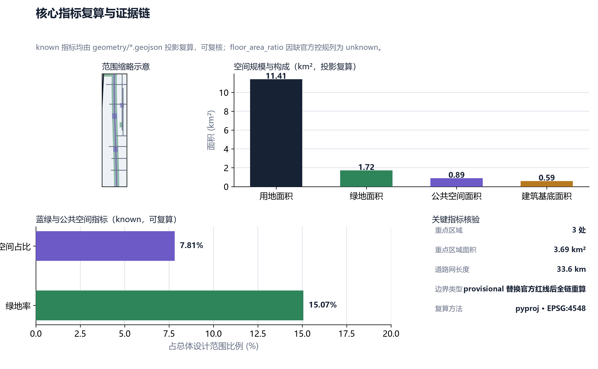

# Jing-Zhang·Autonomous Track —— Autonomous Innovation Belt Urban Design

> **One Sentence Solution**: In 1909, Zhan Tianyou erected the "person" character-shaped railway at Badaling, using an act of indigenous innovation to rewrite Chinese railway history; in 2026, at the original point of this corridor, we will write the "person" as two intersecting tracks—historical autonomy and AI autonomy—allowing young people to walk along the century-old track and return the answer of the AI era to the land.
>
> **Main Track**: Youth-Friendly Public Space. **Participants**: Yun Yuan Chen Jing (GitHub: rain1andsnow2a). **Submission Date**: 2026-08-06.

## Design Basis and Source List

All geometric elements, metrics, and descriptions in this proposal are based on publicly available data and maintain a complete Evidence Chain (source → processing script → geometry/metrics), ensuring that any numbers can be verified within the submission package.

**List of Documentation (source links)**: The site package and existing documentation list come from `[source:SITE-PACKAGE]`; the index of publicly citable resources comes from `[source:SOURCE-REGISTRY]`; the processed results of the "fact package" derived from original materials come from `[source:PROCESSED-FACT-PACK]`; the overall scope boundaries and Key-Area Detailed Design Area are recognized from `[source:BOUNDARY-SOURCE]` and `[source:KEY-AREA-SOURCE]`; the official announcement and task book for the solicitation activity come from `[source:OFFICIAL-ANNOUNCEMENT]` and `[source:AGENT-TASKBOOK]`.

**Approach (depth chain)**: Design follows the complete chain of "current condition diagnosis → three-level scope framework → overall spatial structure → Land-Use Layout → key areas → Phased Implementation → metrics recalculation" `[depth:existing_conditions_diagnosis]` `[depth:three_level_scope_framework]` `[depth:overall_spatial_structure]` `[depth:land_use_layout]` `[depth:metrics_recalculation]`. Diagnostic basis: overall scope boundary `[data:geometry/site_boundary.geojson#SITE-001]` recalculated area `[metric:site_area_sqm]`. The rail corridor and track safety constraints, blue line constraints for Qinghe and Xiaoyuehe rivers, and seven other constraints have been documented `[data:geometry/constraints.geojson#CONS-001]` `[data:geometry/constraints.geojson#CONS-004]`.

**Standard References (standard):** The call for entries announcement `[standard:PROJECT-OFFICIAL-ANNOUNCEMENT]` and the open call task book `[standard:PROJECT-AGENT-OPEN-CALL-TASKBOOK]` serve as the framework for form and content; urban design should deeply reference the spirit of the Measures for the Administration of Urban Design `[standard:MOHURD-URBAN-DESIGN-MEASURES]` and the in-depth requirements of the control detailed planning `[standard:MOHURD-CONTROL-DETAILED-PLANNING]`; land use classification should follow the Guide for the Classification of Land Use and Sea Use in Territorial Spatial Investigation, Planning, and Control `[standard:MNR-LAND-USE-CLASSIFICATION-GUIDE]`; and architectural depth expression should refer to the Regulations for the Preparation of Architectural Design Documents (2016) `[standard:MOHURD-ARCH-DESIGN-DEPTH-2016]`.

**Honest Disclosure (Data Gaps)**: Official approved control plans and land balance sheets are not provided in the publicly available data. Therefore, Floor Area Ratio and other intensity-related metrics can only be based on the publicly available geometry. Related risks are detailed in the "Risk, Copyright, and Compliance" section `[depth:risk_missing_data]`.

## Three-Level Scope Framework

**Hierarchy of Research and Design Scope**: Following the conventional depth of Urban Design work, this plan establishes a three-layer framework of "Coordinated Research Area → Overall Design Area → Key-Area Detailed Design Area" `[depth:three_level_scope_framework]`.

**First Level Coordinated Research Area**: The research scope is centered on the Jing-Zhang high-speed rail corridor as its backbone, with the industrial and residential areas on both sides serving as wings. The research covers the impact belt on the northern part of Haidian due to the corridor, serving as the foundation for industrial and future urban research. The delineation of this level refers to the method used by `[source:BOUNDARY-SOURCE]` to define the boundaries of the corridor.

**Second Layer Overall Design Area**: This refers to the quantifiable design area submitted, based on the submitted `[data:geometry/site_boundary.geojson#SITE-001]`. The projected recalculated area is `[metric:site_area_sqm]`, approximately 11.41 km². The overall design area encompasses the complete Jing-Zhang Heritage Park green belt (LU-001/002/003) and the three key areas within their respective blocks, ensuring that the spatial structure of "one axis and two wings with three zones" can be self-consistently implemented.

**Third Layer Key-Area Detailed Design Area**: The three key areas of Zhongzhiyuan AI Independent Innovation Acceleration Area, Beijing AI Origin Community, and Dazhongsi AI Industry Cluster, with their boundaries and areas derived from `[source:KEY-AREA-SOURCE]`. The three areas combined have a total area of `[metric:key_area_area_sqm]` and a count of `[metric:key_area_count]` areas, as detailed in the "Key-Area Detailed Design" section.

**Depth of Scope**: The three-layer scope is applied to the site, buildings, transportation, and blue-green four specializations. Each specialization achieves the control plan depth within the Overall Design Area and the detailed design depth in the key areas `[depth:overall_spatial_structure]`. The nature of the boundary is annotated as provisional in the geometric layer. After the Official Planning Boundary is announced, the entire chain must be recalculated `[depth:risk_missing_data]`.

## Coordinated Research Area: Industry and Future City Research

**Industrial Status Assessment**: The Jing-Zhang corridor is located in the northern innovation belt of Haidian, with a concentration of universities and research institutions. It has formed an emerging industrial cluster centered around artificial intelligence. The existing industries within the Coordinated Research Area are primarily research and office-based. The current buildings as reflected in `[data:geometry/buildings.geojson#BLDG-001]` are mainly focused on research and development, office spaces, and education, with a combined Building Footprint area of `[metric:building_footprint_area_sqm]`, serving as the material foundation of the industrial space.

**Future City Research**: We judge that the next decade of the corridor belongs to 'Innovative On-Site Laboratories' — the entire chain from technological prototypes, pilot testing, open-source collaboration to the release of results and living services should occur within the blocks, rather than in closed-off parks `[depth:overall_spatial_structure]`. Based on this, the spatial organization of the corridor does not pursue large-scale demolition and reconstruction, but instead translates the existing spaces into 'innovative blocks that can grow': inefficient business buildings are updated into co-creation workshops, trackside protective greenbelts are transformed into green pedestrian zones accessible to young people, and three track stations become nodes for innovative releases and public life.

**Traffic Context**: The corridor along the corridor has multiple expressways and major city roads `[data:geometry/roads.geojson#ROAD-003]`, with a road network length of `[metric:road_network_length_m]`. We consider this as a real constraint for improving 'walkability': the North Third Ring Road, North Fourth Ring Road, and North Fifth Ring Road divide the corridor into three segments. The plan uses the main greenway axis `[data:geometry/roads.geojson#ROAD-007]` and pedestrian nodes to stitch these fragmented neighborhoods back together, making commuting a form of walking between industrial zones.

**Relation to the Track**: Youth-friendly Public Space is not merely a green decorative element but rather the spatial infrastructure for innovation industries—where young people commute, interact, co-create, and showcase their work. The quality of public space directly determines talent retention. This judgment runs through the overall spatial structure `[depth:overall_spatial_structure]` of "One Axis, Two Wings, Three Zones".

## Overall Design Area: Urban Renewal and Regulatory-Plan-Level Urban Design

**Spatial Structure: One Axis and Two Wings with Three Zones**. One axis is the "Autonomous Track" central pedestrian main axis `[data:geometry/land_use.geojson#LU-003]`, longitudinally traversing along the Jing-Zhang heritage green belt. Two wings are the West Wing near-school innovation wing (on the side of the Beijing AI Origin Community) and the East Wing industrialization wing (on the side of the Zhongzhiyuan). Three zones are three key areas. This structure is implemented in the `[depth:overall_spatial_structure]` and `[depth:land_use_layout]` depth items.

**Land-Use Layout**: Within the Overall Design Area, 19 land-use zones `[data:geometry/land_use.geojson#LU-001]` are delineated, covering categories such as park green spaces (1401), protective greenbelts (1402), public squares and pedestrian areas (1403), commercial services (05), residential areas (0701), community services (0702), research and industry (0802), culture (0803), education (0804), sports (0805), healthcare (0806), transportation hubs (1207), and strategic reserves (16). These zones are designed to be comprehensive, non-overlapping, and seamless. Greenbelts are kept continuous, with `[data:geometry/land_use.geojson#LU-001]` and `[data:geometry/land_use.geojson#LU-002]` located on either side of the main axis, and `[data:geometry/land_use.geojson#LU-010]` serving as a protective greenbelt along the rail corridor.

**Development Intensity and Height Morphology**: Official control indicators are not provided in the publicly available materials. Development intensity is controlled according to the principle of "proximity to tracks, high density, and integration with the city near stations, low density near green spaces, and station-city integration" `[depth:development_intensity_controls]`: Within a 500-meter radius of track stations, medium to high density station-city integration is allowed `[data:geometry/land_use.geojson#LU-004]`, while the areas adjacent to green belts are primarily characterized by medium to low intensity research and residential uses `[depth:height_massing_character]`, avoiding high-rise buildings lining up along the green spaces to oppress pedestrian experiences.

**Demolish–Renovate–Retain Strategy**: Overall, the approach is based on "retaining and renovating as the main focus, with minimal demolition as a supplement" `[depth:retain_renovate_demolish]`. Among the existing buildings `[data:geometry/buildings.geojson#BLDG-002]`, the quality sections that are well-preserved and suitable for industrial functions will be retained; inefficient office buildings will be transformed into co-creation spaces; and only a few structures that impede the continuity of the pedestrian axis and the blue-green system will be demolished. The retention strategy ensures that the update costs are manageable and that the neighborhood life continues.

## Detailed Design of Key Areas

The three key areas are designed with the principle of "youth accessibility, stayability, and co-creation," with boundaries, areas, and sources noted in `[data:geometry/key_areas.geojson#PROV-KEY-001]` `[data:geometry/key_areas.geojson#PROV-KEY-002]` `[data:geometry/key_areas.geojson#PROV-KEY-003]`. The total area of the three key areas is `[metric:key_area_area_sqm]`, with a count of `[metric:key_area_count]`. For more detailed design information, see `[depth:three_key_area_detailed_design]`.

**Zhongzhiyuan AI Independent Innovation Acceleration Area**: Located at the northern segment of the corridor, it is organized around the themes of 'full-stack autonomy, low-carbon innovation, and open testing'. Core actions include constructing the main ring road `[data:geometry/roads.geojson#ROAD-008]` and `[data:geometry/roads.geojson#ROAD-015]` and the east-west connecting road to link the existing office park into an open district; reserving space for a smart medical center `[data:geometry/land_use.geojson#LU-019]` and a talent apartment community service station `[data:geometry/land_use.geojson#LU-016]`; and setting up a shared test field for low-speed delivery and autonomous shuttle services.

**Item 2: Beijing AI Origin Community**: Located in the middle of the corridor, adjacent to the university, it is the site of near-campus transformation and open-source collaboration. Core actions: centered around the pedestrian street `[data:geometry/roads.geojson#ROAD-012]`, the "AI Origin Community" brings its existing vision to specific streets; it configures a comprehensive service station `[data:geometry/land_use.geojson#LU-017]`; and it builds the Jing-Zhang Railway Cultural Museum `[data:geometry/land_use.geojson#LU-014]` next to the old site of Tsinghua University station, making the "origin of independent innovation" visible, accessible, and participatory.

**Item 3 Dazhongsi AI Industry Cluster**: Located at the southern segment of the corridor, this area is anchored by Dazhongsi Station and serves as a pilot for station-city integration and intelligent economy. Core actions include organizing the 'track + greenway + walking' last mile with a station front integrated transportation hub `[data:geometry/land_use.geojson#LU-015]` and station front connections `[data:geometry/roads.geojson#ROAD-013]`; enhancing station-city commercial streets `[data:geometry/land_use.geojson#LU-004]` and station front commercial services `[data:geometry/land_use.geojson#LU-005]` to complement living amenities; and serving young people's daily sports with the Dazhongsi Sports Park land use `[data:geometry/land_use.geojson#LU-018]`.

**Main Axis Between Three Zones**: The three key areas are connected by the "Path of Autonomy" central pedestrian axis `[data:geometry/land_use.geojson#LU-003]`, making it possible to walk from one area to the adjacent ones in 20-30 minutes, thereby encouraging cross-zone interaction rather than isolated development.

## AI Innovation Ecosystem, Personas, and AI+ Scenarios

**AI Innovation Ecosystem**: The Public Spaces in the corridor are themselves carriers of the innovation ecosystem. We define the ecosystem as "the flow of four elements—technology, talent, capital, and life—within the same street district." We implement this flow through three mechanisms—AI Curator, Open Source Data Sets, and Shared Test Fields—mapped onto the space `[depth:overall_spatial_structure]`.

**Ten Scenario Cards (AI-Enabled Scenario)**:

| # | Scenario Card | Target User | Spatial Location |
|---|--------|----------|----------|
| 1 | Jing-Zhang Relic Park AI Cultural Guide (`ai-cultural-guide`): AR Explanation of a Century of Railway History and Stories of Independent Innovation | Visitors, Young Students | Green Space `[data:geometry/green_space.geojson#GREEN-001]` |
| 2 | Youth Health Service Navigation (`ai-health-service-navigation`): From the 'AI Origin Community' to the Smart Medical Center | Community Youth | Origin Community |
| 3 | Optimization of Last-Mile Walk/Bike Transfer for Track+Greenway Slow Travel (`ai-traffic-walkability`): Optimal Path for the Last Kilometer at Three Stations | Commute Youth | Greenway Main Axis `[data:geometry/roads.geojson#ROAD-007]` |
| 4 | Small and Medium Enterprise Copilot Service (`enterprise-service-copilot`): A one-stop governmental and business AI assistant in the Public Spaces of Zhongzhiyuan | Startup Team | Zhongzhiyuan |
| 5 | Public Space Safety Operations Review (`public-safety-operations-review`): Intelligent review of holiday foot traffic and nighttime activity, providing feedback to the operator | Operator, Youth | Forecourt `[data:geometry/public_space.geojson#PUBLIC-001]` |
| 6 | Shared Right-of-Way for Low-Speed Delivery Robots (`robot-delivery-low-speed`): Greenway Diversion for Low-Speed Delivery, Prioritizing Youth Walking/Riding | Residents, Delivery Personnel | Slow-Moving Alleys `[data:geometry/roads.geojson#ROAD-012]` |
| 7 | Youth Night School · Autonomous Track Exhibition: Monthly AI Theme Public Lecture and Street Exhibition | General Youth | AI Innovation Square `[data:geometry/public_space.geojson#PUBLIC-005]` |
| 8 | Pocket Park Co-Creation Workshop Reservation: Mini Co-Creation Workshops within the Green Belt are Available upon Request | Makers, Students | Pocket Park `[data:geometry/green_space.geojson#GREEN-005]` |
| 9 | Front Station Plaza AI Accessibility Guide: Multilingual, Accessible, and Vision-Friendly Intelligent Guidance | Accessibility and Visitors | Front Station Plaza `[data:geometry/public_space.geojson#PUBLIC-003]` |
| 10 | Green Belt Carbon Sink · Microclimate Station: Youth Outreach Network for Open Environmental Data | Students, Research | Protective Green Belt `[data:geometry/green_space.geojson#GREEN-003]` |

**Five User Personas:**

- **Ahuo (Third-Year Intern)**: At an AI startup in Zhongzhiyuan, I take a 20-minute walk along the main axis of the greenway during my lunch break to relieve stress, and play basketball in Dazhongsi Sports Park in the evening—"I choose the company based on whether the neighborhood allows me to take a stroll."
- **Old Tang (Startup Team CTO)**: Work at the original community office, commuting via the pedestrian interior street to complete "walking and thinking," and participate in street corner roadshows on weekends for "being seen, receiving investment, and getting feedback."
- **Ms. Lin (an office worker from Haidian)**: After exiting Dazhongsi Station through the station square, she picks up her child from school and hopes for Public Spaces that are "visible, safe to walk in, and bright at night."
- **Xia Man (Youth Cultural Curator)**: Operating "Autonomy Track Curating" requires bookable performance nodes and flexible spaces that can be set up at any time.
- **Zijin (Visually Impaired)**: Relying on the station square's AI accessibility guidance and continuous accessible ramps, Public Space is the answer to whether they "dare to go out alone."

**Ecological Case Studies (Six Cases)**: 1. Open Data Set Co-construction — All 9 geometric layers in this submission are open, allowing any institution to recalculate them; 2. University Joint Design Workshop — Invite universities around, such as Peking University and Tsinghua University, to do a "Corridor Micro-Update" course design using real geometric data; 3. Monthly AI Roadshow and "Autonomy Track" Street Curating — Move the results exhibition from the gallery to the square `[data:geometry/public_space.geojson#PUBLIC-005]`; 4. Dual Appointment of Talent Between Enterprises and Street Blocks — Enterprise employees serve as "Youth Managers" in the street block; 5. Shared Test Site — Low-speed delivery, unmanned shuttle services, etc., can apply for road testing at the Zhongzhiyuan test site `[data:geometry/land_use.geojson#LU-012]`; 6. Pocket Park Adoption Plan — Adopted by neighbors and entrepreneurs `[data:geometry/green_space.geojson#GREEN-005]`, Public Spaces are co-built by users.

**Relationship to the Main Raceway**: All of the above scenarios depend on the "Public Space" as a common stage: green belts, squares, pedestrian internal streets, and station front connections, forming the foundation of the scene for youth-friendly public spaces `[depth:blue_green_public_space]`.

## Land Use, Building Scale, and Retain-Renovate-Demolish Strategy

**Land Use Balance Principle**: Prioritize "protect green belts, protect main axes, protect innovative spaces" `[depth:land_use_layout]`. The combined area of green belts and protective green belts `[metric:green_space_area_sqm]`, the combined area of Public Spaces `[metric:public_space_area_sqm]`, the proportion of public spaces `[metric:public_space_ratio]`, and the green space ratio `[metric:green_ratio]`—these numbers are the first evidence of being "youth-friendly".

**Building Scale**: Current Building Footprint area `[metric:building_footprint_area_sqm]`, primarily focused on research office and educational uses `[data:geometry/buildings.geojson#BLDG-001]`. The update does not add significant massing, but rather activates the existing space through 'mixed-use': ground-level retail, mid-level offices, and rooftop shared terraces, ensuring the building engages with Public Space rather than isolating it `[depth:height_massing_character]`.

**Tiered Demolish–Renovate–Retain List** `[depth:retain_renovate_demolish]`:  (Demolish–Renovate–Retain Strategy)

- **Preserve (about seven-tenths):** quality buildings and functionally appropriate existing structures and all historical remnants, including the old Tsinghua Garden Station site `[data:geometry/land_use.geojson#LU-014]`.
- **Rehabilitation (approximately 25%)**: Low-efficiency business buildings, street facades, and station front spaces will be transformed into co-creation workshops, youth apartments, and community service stations `[data:geometry/land_use.geojson#LU-016]` `[data:geometry/land_use.geojson#LU-017]`.
- **Micro-Removal (Approximately Half):** Only limited structures that block the pedestrian main axis `[data:geometry/land_use.geojson#LU-003]` and disrupt blue-green connectivity are permitted.

**Phased Integration**: The Demolish–Renovate–Retain Strategy is bound to the phased plan (`[depth:phasing_implementation]`). Phase one will first implement "low-cost reversible updates" in the original community, validating the mechanism before promoting it to avoid the disruption caused by a one-time large-scale demolition.

## Transport, Rail, Municipal Infrastructure, and Public Services

**Pedestrian and Cyclist Priority**: With a greenway main axis of approximately 9.8 km `[data:geometry/roads.geojson#ROAD-007]` serving as the green backbone for pedestrian and cyclist priority, complemented by pedestrian inner streets `[data:geometry/roads.geojson#ROAD-012]` and the eastern branch of the greenway `[data:geometry/roads.geojson#ROAD-017]`, a dual network for 'walking + cycling' `[depth:traffic_rail_slow_parking]` is formed. The total length of the road network is `[metric:road_network_length_m]`.

**Track Transfer**: Relying on the stations along the Jing-Zhang High-Speed Railway, organize front-of-station transfers `[data:geometry/roads.geojson#ROAD-013]` and side streets `[data:geometry/roads.geojson#ROAD-014]` to achieve the last mile of 'track + greenway + walking'. High and expressways `[data:geometry/roads.geojson#ROAD-003]` `[data:geometry/roads.geojson#ROAD-004]` `[data:geometry/roads.geojson#ROAD-005]` will pass through in a three-dimensional overpass and underpass manner through the greenway, stitching together the fragmented neighborhoods.

**Parking Strategy**: Public parking should be concentrated around rail stations, with bike-sharing and shared parking along the greenway to reduce the impact of motor vehicles on the pedestrian axis `[depth:traffic_rail_slow_parking]`.

**Urban Infrastructure and New Infrastructure**: Utilize protective green belts along the rail corridor `[data:geometry/land_use.geojson#LU-010]` to arrange combined utility tunnels and microclimate stations, opening environmental data services for public education and research `[depth:municipal_new_infrastructure]`. Public service facilities are configured according to a 5-minute living circle: community service stations `[data:geometry/land_use.geojson#LU-016]` `[data:geometry/land_use.geojson#LU-017]`, smart healthcare centers `[data:geometry/land_use.geojson#LU-019]`, and sports parks `[data:geometry/land_use.geojson#LU-018]`.

## Blue-Green Network, Public Space, and Urban Character

**Blue-Green System**: Qinghe (north side) `[data:geometry/constraints.geojson#CONS-004]` and Xiaoyuehe `[data:geometry/constraints.geojson#CONS-005]` are blue line constraints, with green belts continuously arranged along the Jing-Zhang corridor: Jing-Zhang Heritage Park green belt `[data:geometry/green_space.geojson#GREEN-001]` `[data:geometry/green_space.geojson#GREEN-002]`, track-side protective green belt `[data:geometry/green_space.geojson#GREEN-003]`, Dazhongsi Community Park `[data:geometry/green_space.geojson#GREEN-004]`, and Origin Community Pocket Park `[data:geometry/green_space.geojson#GREEN-005]`. Zhongzhiyuan Community Park `[data:geometry/green_space.geojson#GREEN-006]`, green space area `[metric:green_space_area_sqm]`, green space ratio `[metric:green_ratio]` `[depth:blue_green_public_space]`.

**Public Space System**: With the "Autonomous Track" central pedestrian axis `[data:geometry/public_space.geojson#PUBLIC-000]` as its spine, it connects the front plaza `[data:geometry/public_space.geojson#PUBLIC-001]`, Tsinghua Garden Station Central Plaza `[data:geometry/public_space.geojson#PUBLIC-002]`, Zhongzhiyuan Station Front Plaza `[data:geometry/public_space.geojson#PUBLIC-003]`, Zhi Chun Lu Slow Travel Node Plaza `[data:geometry/public_space.geojson#PUBLIC-004]`, and AI Innovation Plaza `[data:geometry/public_space.geojson#PUBLIC-005]`. Public Space The original point community vitality square `[data:geometry/public_space.geojson#PUBLIC-006]` totals 7 instances, with a combined public space area of `[metric:public_space_area_sqm]` square meters, representing a proportion of `[metric:public_space_ratio]`. Three track station forecourt areas are all designed as 'spaces for lingering' rather than 'spaces for passing through' — seating, shade trees, performances, power outlets, and shelter from the rain, encouraging young people to stay `[depth:blue_green_public_space]`.

**Urban Character: Autonomous Tracks**. The thematic element is the character "ren" (person): the paving, seating, and lampposts along the pedestrian axis all echo the moment when "two tracks intersect to form a person." The character is not a nostalgic symbol but a translation of "innovation and self-reliance" into a space that can be experienced—outdoor, open, and modifiable. The Public Space itself is a constantly rewritten exhibit by the youth `[depth:height_massing_character]`.

**Sacred Sites of Innovation (Four Locations)**: 1 **Old Site of Tsinghua Garden Station·Jing-Zhang Railway Cultural Museum** `[data:geometry/land_use.geojson#LU-014]` — a real-world classroom for the origin of independent innovation; 2 **Jing-Zhang Heritage Park Green Belt + Rhombus Cultural Node** `[data:geometry/green_space.geojson#GREEN-001]` — an experience of walking on a century-old railway track; 3 **Dazhongsi Station-City Node** `[data:geometry/public_space.geojson#PUBLIC-001]` — the intersection of tracks, city, and life; 4 **Original Community Vital Plaza** `[data:geometry/public_space.geojson#PUBLIC-006]` — a shared space for youth innovation launches and neighborhood life. These four locations together form the narrative route of "Re-tracing Independent Innovation Along the Path of Self-Innovation" `[depth:overall_spatial_structure]`.

## Renewal Projects, Implementation Policy, and Phasing

**Update Project List**: Organize projects by "preserve/renovate/minor demolition," covering three key areas and along the main axis. The list is located at geometry `[data:geometry/phasing.geojson#PHASE-001]` `[data:geometry/phasing.geojson#PHASE-002]` `[data:geometry/phasing.geojson#PHASE-003]` and within each land use zone, with design depth `[depth:renewal_project_list]`.

**Phasing Plan** `[depth:phasing_implementation]`:

- **PHASE-001 Phase 1·Beijing AI Origin Community Core Demonstration Area (Over the Next Three Years)** `[data:geometry/phasing.geojson#PHASE-001]`: Prioritize conversion near the school, renovate the pedestrian street `[data:geometry/roads.geojson#ROAD-012]`, clear inefficient spaces for youth co-creation workshops, and host monthly AI showcases. Phase 1 undertakes the "validation mechanism" task: low-cost, reversible, and quick to yield results.
- **PHASE-002 Phase Two·Zhongzhiyuan AI Independent Innovation Acceleration Area (Three to Five Years)** `[data:geometry/phasing.geojson#PHASE-002]`: Improve the main ring road `[data:geometry/roads.geojson#ROAD-008]` and the east-west connecting road `[data:geometry/roads.geojson#ROAD-015]`, and arrange for an open test field, smart medical center `[data:geometry/land_use.geojson#LU-019]`, and a talent apartment community service station `[data:geometry/land_use.geojson#LU-016]`.
- **PHASE-003 Phase ·Dazhongsi and South Segment Living Service Area (Over 5 Years)** `[data:geometry/phasing.geojson#PHASE-003]`: Promote station-city integration `[data:geometry/land_use.geojson#LU-004]`, sports park `[data:geometry/land_use.geojson#LU-018]`, and station front connectivity `[data:geometry/roads.geojson#ROAD-013]`, transforming the southern segment of the corridor into a blend of "industry + living + recreation".

**Policy Recommendations for Implementation**: 1. Prioritize updates based on the criteria of "youth-friendly Public Space," with all new and renovation projects requiring an assessment on whether they increase available public spaces for lingering; 2. Allow flexibility in design within the standard framework, encouraging pilot projects of "temporary sidewalk conversion"; 3. Establish a public space operation fund, to be co-funded by enterprises, universities, and neighborhood communities, with annual performance-based continued investment.

**Long-term Operation (Open Co-creation)**: All design outcomes will be open-sourced—9 geometric layers, recalculation scripts for indicators, and source files for documents and exhibition panels will be made public with the submission `[depth:phasing_implementation]`; we invite universities, developers, and community members to participate in the content co-creation of "The Path of Autonomy" through issues/PRs, turning the corridor into a sustainable and growing Public Space.

## Metrics, Area Recalculation, and Compliance Matrix

**Indicator Framework**: All indicators in this scheme are categorized into three types—known, assumed, and unknown, as detailed in `[data:geometry/site_boundary.geojson#SITE-001]` and metrics.json. Known indicators are recalculated from the submitted geometric layers and can be directly verified.

| Indicator | Value | Recalculated Source |
|------|------|----------|
| Overall Design Area `[metric:site_area_sqm]` | 11,412,825 m² | `[data:geometry/site_boundary.geojson#SITE-001]` |
| Key Area Area `[metric:key_area_area_sqm]` | 3,692,893 m² | `[data:geometry/key_areas.geojson#PROV-KEY-001]` |
| Number of Key Areas `[metric:key_area_count]` | 3 locations | `[data:geometry/key_areas.geojson#PROV-KEY-001]` |
| Green Space `[metric:green_space_area_sqm]` / Green Space Ratio `[metric:green_ratio]` | 1,719,516 m² / 15.07% | green_space layer |
| Public Space `[metric:public_space_area_sqm]` / Ratio `[metric:public_space_ratio]` | 891,616 m² / 7.81% | public_space layer |
| Building Footprint `[metric:building_footprint_area_sqm]` | 594,665 m² | buildings layer |
| Road Network Length `[metric:road_network_length_m]` | 33,646 m | roads layer |

**Calculation Method** `[depth:metrics_recalculation]`: Geometric layers are recalculated for area and length using EPSG:4548 projection (pyproj), with the total area and individual items mutually verifiable; the green/public layers are unioned to remove duplicates before calculating the area to avoid redundant calculations; `[data:geometry/green_space.geojson#GREEN-001]` green belts and `[data:geometry/public_space.geojson#PUBLIC-000]` main axes are merged in priority order of blue-green when they intersect.

**Compliance Matrix**: Establish a one-to-one correspondence between all official task items of the call for entries task book `[standard:PROJECT-AGENT-OPEN-CALL-TASKBOOK]` (1.3.1–1.5.3.3) and the open call task items (agent.1–agent.6) in a . For each item, note the sections it covers, the geometric layers, the indicators, the figures, and the self-inspection conclusions as specified in the official announcement of the project `[standard:PROJECT-OFFICIAL-ANNOUNCEMENT]`.

**Three Test Scenarios (to Verify the Feasibility and Reviewability of the Proposal)**:

- **Test Scenario A·Geometric Integrity**: Run a topological self-check on all 9 geometric layers—no self-intersections, no overlaps, no gaps; covering `[data:geometry/land_use.geojson#LU-001]` to `[data:geometry/land_use.geojson#LU-019]` for the entire area. The self-check script and results will be publicly shared with the submission.
- **Test Scenario B·Recalculation of Metrics**: Anyone can reproduce the results—reproject and recalculate `[metric:site_area_sqm]`, `[metric:green_ratio]`, and `[metric:public_space_ratio]` using the submitted geojson, with the results matching those in metrics.json (tolerance 1e-6).
- **Test Scenario C·Compliance Review**: Run the official self_check (comprising validate + spatial + visual + professional components) to full green, ensuring that the project indeed meets the review standard `[standard:PROJECT-AGENT-OPEN-CALL-TASKBOOK]`.

## Risk, Copyright, and Compliance

**Data and Geometric Risk** `[depth:risk_missing_data]`:

1. **Boundary is provisional**: `[data:geometry/site_boundary.geojson#SITE-001]` is a rough alternative boundary based on publicly available data, and is not an Official Planning Boundary; once the Official Planning Boundary is published, all area-class indicators will need to be recalculated in full.
2. **Missing Control Plan Indicators**: Official approved control plan and land use balance sheet are not provided in the publicly available documents. The Floor Area Ratio (`floor_area_ratio`) is listed as unknown, and the Development Intensity is controlled on a principled basis without claiming any approved intensity.
3. **Key Area Boundaries**: Three key areas `[data:geometry/key_areas.geojson#PROV-KEY-001]` are professionally estimated ranges (provisional) and are not officially designated. Actual implementation shall be based on the confirmed boundaries by the relevant authorities.
4. **Building and Road Data**: The current building and road data come from public spatial data sources and may have temporal and accuracy errors. They are provided for the current diagnosis and scheme illustration but are not used for engineering implementation calculations.

**Copyright and Compliance**: This proposal is based on publicly available resources and complies with the requirements of the call for entries regarding copyright and compliance `[standard:PROJECT-OFFICIAL-ANNOUNCEMENT]`; all original layers and text are licensed under CC-BY-4.0 `[standard:PROJECT-AGENT-OPEN-CALL-TASKBOOK]`; no restricted or confidential materials are involved, and all assets are sourced from public sources or are original; no official endorsement or approval is claimed. Any digital indicators (such as metric values) shown in the proposal can be verified through the data included in the submission package.

**Uncompleted and Boundaries**: The Floor Area Ratio and building massing quantities, as well as other intensity indicators, have not been declared due to the lack of official control plans; the Building Heights and setback distances in three key areas are indicative and need to be refined during the planning development phase `[depth:development_intensity_controls]` `[depth:height_massing_character]`. This proposal does not replace the statutory plan but serves as an Open Co-Creation initiative for the direction of "Youth-Friendly Public Spaces".

## References

- Centennial Jing-Zhang AI Innovation Belt Open Call for Urban Design——Activity Official Announcement `[standard:PROJECT-OFFICIAL-ANNOUNCEMENT]` `[source:OFFICIAL-ANNOUNCEMENT]`
- Centennial Jing-Zhang AI Innovation Belt Open Call for Urban Design — Open Call Task Book (agent.1–agent.6)`[standard:PROJECT-AGENT-OPEN-CALL-TASKBOOK]` `[source:AGENT-TASKBOOK]`
- The site package and existing documentation list `[source:SITE-PACKAGE]`
- Public Resource Index (SOURCE-REGISTRY) `[source:SOURCE-REGISTRY]`
- Fact package processing results (PROCESSED-FACT-PACK)`[source:PROCESSED-FACT-PACK]`
- Overall Design Area boundaries `[source:BOUNDARY-SOURCE]`
- Key-Area Detailed Design Area `[source:KEY-AREA-SOURCE]`
- Urban Design Management Measures `[standard:MOHURD-URBAN-DESIGN-MEASURES]`
- Depth of Control Detailed Planning `[standard:MOHURD-CONTROL-DETAILED-PLANNING]`
- 《Land and Sea Use Classification Guide for Territorial Space Investigation, Planning, and Land Use Control》 `[standard:MNR-LAND-USE-CLASSIFICATION-GUIDE]`
- 《Architectural Engineering Design Document Preparation Depth Regulations (2016)》 `[standard:MOHURD-ARCH-DESIGN-DEPTH-2016]`

---

**Submission Package Self-Inspection Instructions**: This proposal, along with the geometry/metrics/sources/standard_matrix/design_depth_matrix/compliance_matrix/self_check/manifest files, constitutes a complete submission package; the self-inspection conclusions are found in `report/proposal.html` and `self_check.json`; a visual overview is available in `visual/index.html`.
