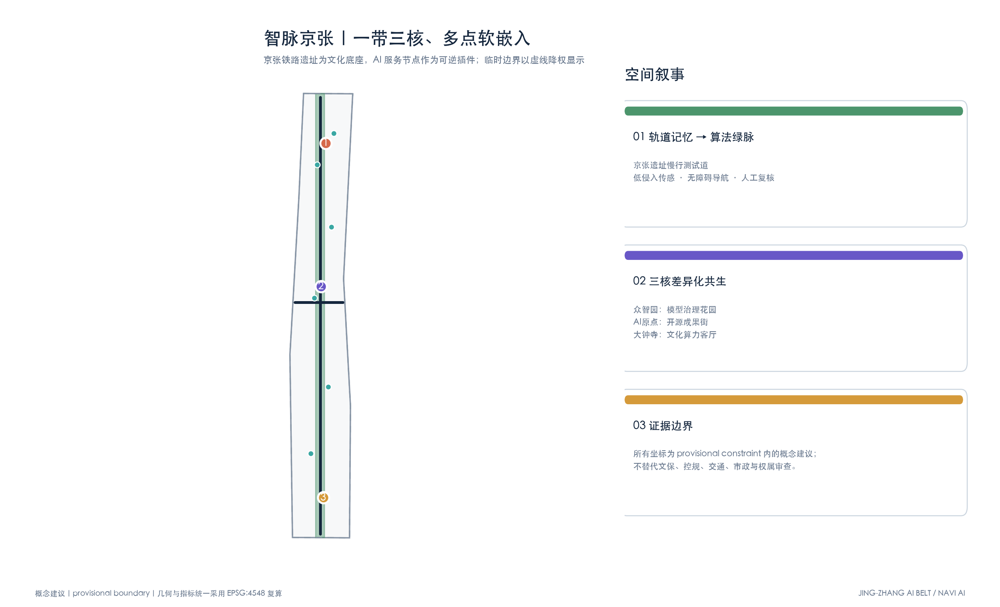
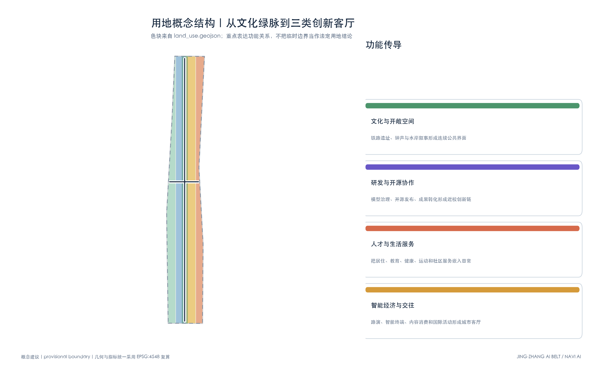
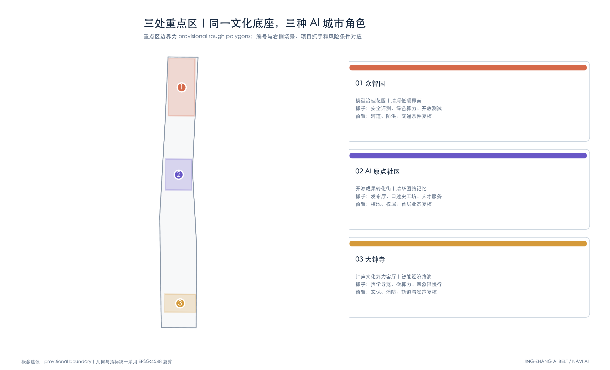
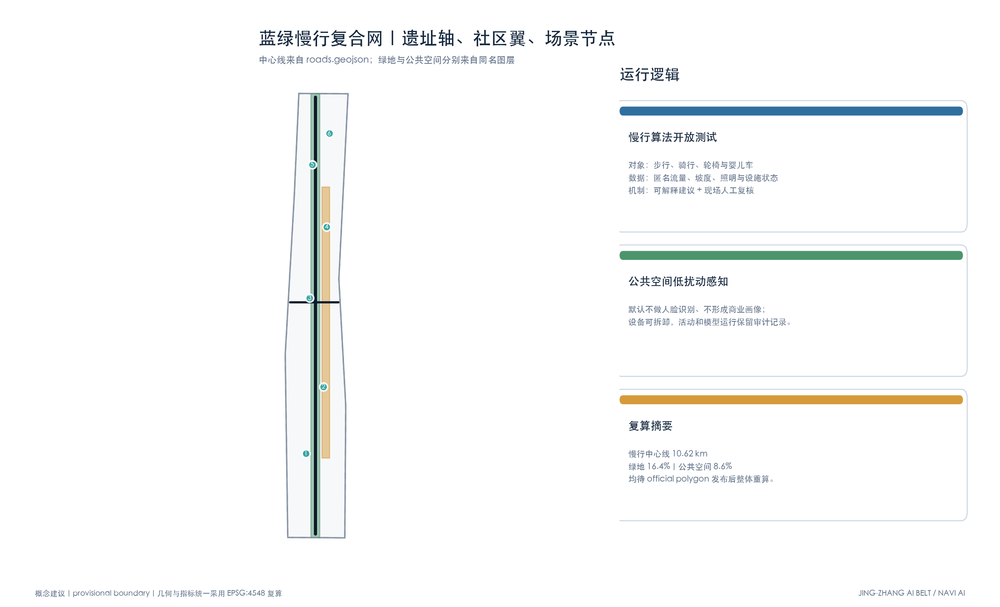
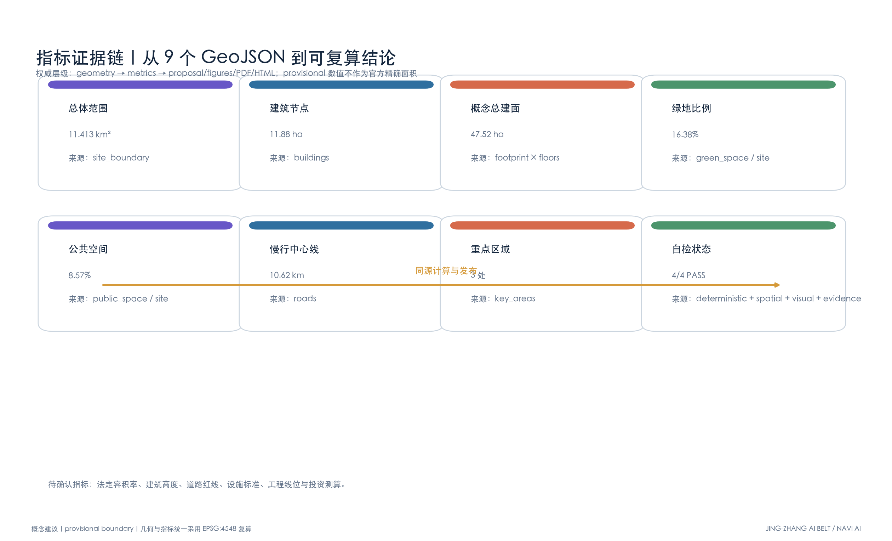

# Jing-Zhang Intelligent Pulse AI Innovation Belt Conceptual Proposal

## Proposal Assertion: Let history serve as the foundation, and let AI serve as a replaceable urban plugin.

This scheme is a set of Conceptual Recommendations aimed at subsequent discussions and professional calibration, rather than a definitive planning conclusion. It does not treat the Jing-Zhang Railway site, the historical environment of Dazhongsi, and the existing community as "old sites" waiting to be cleared. Nor does it create a sense of futurism through isolated future landmarks. The spatial strategy is "preserving the texture of time and embedding iterative new services": the tracks, station platforms, clock imagery, scale of old factories, tree arrays, and residents' daily paths form a stable foundation; micro-calculation power, open-source testing, accessible navigation, digital storytelling, and innovative communities enter in a lightweight, reversible, and assessable manner. The content involving cultural heritage, ownership, transportation, municipal services, and Development Intensity all await confirmation through relevant documentation and professional procedures.

The overall concept structure forms "one heritage algorithmic green pulse, three historical-AI coexistence living rooms, and two types of community connection wings." One green pulse organizes a continuous walking and cycling experience along the Jing-Zhang railway site; three living rooms are located around Zhongzhiyuan, Beijing AI Origin Community, and Dazhongsi; two types of connection wings lead to university and research parks, and another to residential communities and rail transit stations. AI does not take over the space but helps identify gaps, explain history, test services, and hand over operational evidence for Human Review. Sensing facilities follow the principle of minimal data collection, defaulting to processing anonymous or aggregated data, without performing facial recognition or forming personal commercial profiles.

### Scene Card A | Jing-Z Zhang Rail AI Slow-Release Open Source Test Path (Jing-Zhang)

**Historical Foundation**: Preserve the linear direction of the railway site, the rhythm of the sleepers, and the station field memories, using material color bands and tactile markers to narrate the history of the construction of the Jing-Zhang Railway. **AI Plugin**: Deploy removable edge devices at non-interfering points, testing slope alerts, crowd notifications, accessible detours, and night lighting responses for wheelchair users, strollers, cyclists, and pedestrians. The devices only record desensitized traffic, environmental, and facility status data; route suggestions clearly display the basis and confidence level, with abnormal conditions verified by on-site operation personnel. **Spatial Placement**: Correspond to [data:geometry/roads.geojson#ROAD-001] and [data:geometry/green_space.geojson#GREEN-001]. **Evaluation Method**: Measure using the rate of breakpoint repairs, accessible detour distances, false alarm rates, and the closed-loop of human complaints, rather than pursuing the scale of data collection.

### Scene Card B | Dazhongsi Cultural Square Underground Invisible Computing Micro-Center

**Historical Foundation**: The ground continues the quiet, open, and inviting atmosphere of the cultural squares around Dazhongsi, using clock sound wave patterns, low-profile displays, and seasonal activities to explain the regional culture, without creating a large screen that overshadows the historical subject. **AI Plugin**: Integrate existing or future feasible underground equipment spaces to propose modular micro-calculation and heat recovery concepts, providing edge computing services for public tours, cultural digitization, and nearby small teams; equipment entry and exit points, heat dissipation, noise, fire safety, and energy consumption must undergo specialized argumentation. **Spatial Location**: Corresponds to [data:geometry/public_space.geojson#PUBLIC-001] and the key area of Dazhongsi [data:geometry/key_areas.geojson#PROV-KEY-003]. **Governance Boundaries**: No specific construction scale or investment source is committed to; calculation operations retain audit records, and cultural content is reviewed by curators and historical researchers.

### Scene Card C | Memory of Tsinghua Garden Station and Open Source Geek Community

**Historical Foundation**: Enter through the historical narrative of Tsinghua Garden Railway Station and its surrounding area, integrating the scale of old buildings, station signage, and stories of railway travel into a walkable conversion street. **AI Plugin**: Transform the first-floor idle or underutilized spaces into open-source collaboration stations, model safety evaluation rooms, digital oral history workshops, and small exhibition halls. Teams can use local models to help organize public archives and authorized oral history materials, but all personal names, dates, and events must be manually reviewed and approved before release. **Spatial Placement**: Rely on the Beijing AI Origin Community [data:geometry/key_areas.geojson#PROV-KEY-002] and soft-embedded architectural nodes [data:geometry/buildings.geojson#BLDG-001]. **Operational Model**: Develop activity rules collaboratively by the venue operators, community representatives, university clubs, and cultural advisors, initially testing with short-term exhibitions and weekend workshops, then deciding whether to continue.

### Scene Card D | Zhongzhiyuan Low-Carbon Model Governance Garden

**Historical Foundation**: Preserve the simple spatial quality of the Qinghe riverbank, existing tree array, and industrial research district. **AI Plugin**: Translate model energy consumption, carbon emissions estimation, deviation testing, and red team evaluation into readable garden exhibits. The testing team only displays the aggregated results that have been reviewed; the rain garden and shaded spaces serve residents, researchers, and visitors. **Spatial Placement**: Correspond to Zhongzhiyuan [data:geometry/key_areas.geojson#PROV-KEY-001] and the continuous green belt. It serves both as a corporate exchange interface and as a small classroom for the public to understand "responsible AI."

The four core cards described above, together with ten categories of application scenarios, form an iterative list. All spatial coordinates are derived by clipping from the generated script based on the Provisional Boundary; areas, lengths, and conceptual strengths are automatically recalculated by projection geometry. The provisional boundary is only intended for scheme comparison and technical self-inspection; the entire set should be rerun after the formal boundary is released to avoid distortion of indicators due to partial replacement.

## Design Basis and Source List

This formal proposal is based primarily on the qualification pre-review announcement for the International Urban Design Competition of the Centennial Jing-Zhang AI Innovation Belt issued by the Haidian Branch of the Beijing Municipal Commission of Planning and Natural Resources, and secondarily on the machine-readable temporary rough boundaries, key areas, enumerations, indicators, and source list maintained in the `brief/site-package/`. The AI agent must read `design_brief.json`, `allowed_design_space.json`, `sources.json`, `enums/`, `ranges/`, `schemas/`, `data/source_registry.json`, and `data/processed/agent_fact_pack.md` before generating the scheme. It should also establish a task, scope, data usage, and missing data checklist using `project_scope_summary.csv`, `agent_task_requirements.csv`, `source_use_matrix.csv`, and `missing_data_checklist.csv`. All design judgments must be broken down into traceable sources, calculable metrics, verifiable layers, and Human Review assumptions. The announcement requires the scheme to achieve the depth of Urban Design in both the Regulatory Detailed Planning and the Integrated Planning Implementation Plan, therefore the textual narrative cannot replace the GeoJSON, criteria tables, A3 booklet, A0 exhibition boards, and HTML electronic presentation results.

This section of the Evidence Chain cites [source:OFFICIAL-ANNOUNCEMENT], [source:AGENT-TASKBOOK], [source:SITE-PACKAGE], [source:SOURCE-REGISTRY], [source:PROCESSED-FACT-PACK], [source:BOUNDARY-SOURCE], [source:KEY-AREA-SOURCE], [standard:PROJECT-OFFICIAL-ANNOUNCEMENT], [standard:PROJECT-AGENT-OPEN-CALL-TASKBOOK], [standard:MOHURD-URBAN-DESIGN-MEASURES], [standard:MOHURD-CONTROL-DETAILED-PLANNING], [standard:MNR-LAND-USE-CLASSIFICATION-GUIDE] [standard:MOHURD-ARCH-DESIGN-DEPTH-2016] and [depth:existing_conditions_diagnosis], used to explain that the proposal is not an independent visionary text but is organized from the announcement, agent-oriented task statement, standards, boundaries, processing package, and data list.

The boundaries for the use of the registration form are as follows:

- data/source_registry.json Registers the purposes for which publicly available, clarificatory, and interim data are used.
- Current Registration Abstract: formal available data 5 items, background data 0 items, provisional-only data 1 item.
- The agent shall not upgrade background_only or provisional_only materials to official boundaries, statutory controls, formal scoring criteria, or government implementation commitments.

`data/processed/agent_fact_pack.md` is the reading navigation layer for this proposal and is not a new authoritative source. [source:PROCESSED-FACT-PACK] only helps the agent to organize the three layers of scope, three key areas, announcement tasks, agent.1-agent.6, data availability, and data gaps into a readable proposal; all factual judgments still revert to [source:OFFICIAL-ANNOUNCEMENT], [source:AGENT-TASKBOOK], [source:SOURCE-REGISTRY], [source:BOUNDARY-SOURCE], and [source:KEY-AREA-SOURCE].

Figure Source: [source:FIGURE-OVERVIEW], derived from the GeoJSON within the submission package and the Source Registry.

This scaffold uses `brief/site-package/geometry/provisional_boundaries.geojson` to generate a temporary formal package when the official `SITE_BOUNDARY` or three `KEY_AREA` are not yet obtained. The `geometry/site_boundary.geojson` and `geometry/key_areas.geojson` in the submission package must both be marked as `provisional_constraint`, with `official_boundary=false`, and can only be used for concept generation, self-checking, visualization, and design discussions. They cannot be used as official redlines, approval references, or precise area references, nor can they serve as legal control conclusions. The absence of this organizational data gap does not prevent content scoring. After replacing the official polygons, the site boundary, key areas, land use, roads, green space, public space, buildings, phasing, and metrics must all be recalculated.

The assessable state generated by this scaffolding is: **Provisional Boundary, retaining accuracy alerts and awaiting recalculations after the formal data is released; content scoring is not blocked**. Therefore, the spatial structure, scenes, projects, and indicators in the main text are written according to the principle of being "discussable, reviewable, and recalculable after the Official Boundary is replaced"; when the official boundary and the key area polygon are updated, the agent must rerun the scaffolding, perform self-inspection, and generate the drawings/HTML, and cannot merely replace a single file.

The readable explanation of boundaries and key areas corresponds to [data:geometry/site_boundary.geojson#SITE-001], [data:geometry/key_areas.geojson#PROV-KEY-001] and [metric:site_area_sqm], [metric:key_area_count]. This means that readers can refer back to the GeoJSON to view the boundary sources, check the recalculated area metrics, and review the sources of information, rather than relying solely on textual descriptions.

## Three-Level Scope Framework

The proposal is organized according to the three levels defined in the announcement: the Coordinated Research Area focuses on the 43.6 square kilometers of AI industry ecosystem, strategic positioning, innovation chain, and future urban form; the Overall Design Area focuses on the 11.4 square kilometers of urban and industrial areas surrounding the Jing-Zhang heritage park within 1-2 kilometers, requiring the formation of an overall framework for Urban Renewal, industrial space layout, traffic and municipal support, and Urban Character control; the Key-Area Detailed Design Area focuses on 368.4 hectares of three detailed design regions, requiring the clarification of functional types, building scale, classification of demolish–renovate–retain strategy, Public Space connectivity, and traffic organization. The three layers of scope are mapped to `compliance_matrix.json` to ensure that the required tasks in sections 1.3, 1.4, and 1.5 of the announcement, as well as agent.1-agent.6, have corresponding chapters, layers, indicators, drawings, and HTML evidence. (Demolish–Renovate–Retain Strategy)

The depth items of the three-level work framework are constrained by [depth:three_level_scope_framework] and [depth:overall_spatial_structure], spatial evidence is based on [data:geometry/site_boundary.geojson#SITE-001] and [data:geometry/key_areas.geojson#PROV-KEY-001], tasks are based on [standard:PROJECT-OFFICIAL-ANNOUNCEMENT], and the scope index is navigated by the three-level scope table in [source:PROCESSED-FACT-PACK] `project_scope_summary.csv`.

Figure source: [source:FIGURE-LAND-USE], derived from [data:geometry/land_use.geojson#LU-001] and [data:geometry/site_boundary.geojson#SITE-001].

Three-layer work is not a collection of disjointed drawings. Integrated research determines the industrial chain and urban form, and the overall design translates these determinations into the implementation of update projects, spatial structure, and facility bearing. Detailed design in key areas verifies the feasibility of specific plots, buildings, transportation, Public Spaces, and AI application scenarios. When generating a scheme, the agent must first lock the current submitted official or provisional boundaries and constraints before generating land use, buildings, roads, green spaces, public spaces, phased development, and AI service nodes. Finally, these layers are recalculated to explain which conclusions are still subject to the provisional boundary. Any areas, proportions, scales, or project quantities that cannot be recalculated from structured data must not be written into the formal conclusions.

The overall concept of this proposal is the "Jing-Zhang Smart Pulse Coexistence Belt": with the Jing-Zhang Heritage Park as the main axis of history and Public Space, the Zhongzhiyuan, Beijing AI Origin Community, and Dazhongsi serve as innovation anchor points, and universities, enterprises, communities, and rail transit stations form the daily network. This creates a spatial organization of "one belt, three cores, multiple point scenarios, and a composite ring of blue and green slow travel." Here, "one belt" is not an additional new red line drawn, but rather translates the three layers of scope in the announcement into a working method; "three cores" correspond to the three key areas; "multiple point scenarios" correspond to operational nodes for AI+ public services, industrial services, and urban life; and "composite ring" corresponds to the interlinking of slow travel, green spaces, public spaces, and activity routes.

| Level | Design Issue | Solution Approach | Data Focus |
| --- | --- | --- | --- |
| Coordinated Research Area | How should AI industry ecosystems and future urban forms be organized? | Establish an "academic source-innovation - open-source collaboration - enterprise transformation - public experience - international dissemination" innovation chain | compliance_matrix.json, standard_matrix.json |
| Overall Design Area | Industrial space, Urban Renewal, transportation and municipal facilities, and appearance and style how to be represented on the map | Land use, buildings, roads, green spaces, Public Spaces, and phased layers are expressed together. | [data:geometry/land_use.geojson#LU-001], [data:geometry/roads.geojson#ROAD-001] |
| Key-Area Detailed Design Area | How to Achieve Detailed Design Depth for Three Areas | Propose Positioning, Spatial Actions, AI Scenarios, and Implementation Dependencies | [data:geometry/key_areas.geojson#PROV-KEY-001], [data:geometry/key_areas.geojson#PROV-KEY-002], [data:geometry/key_areas.geojson#PROV-KEY-003] |

## Coordinated Research Area: Industry and Future City Research

Coordinate the research and adopt **"The Track of Intelligence / Jing-Zhang Intelligent Pulse Coexistence Belt"** as the suggested bilingual naming: "Track" refers to both the railway track, the trajectory of technological evolution, and the record of open contributions. For visual identity, suggest drawing from the station sign horizontal line, the ancient bronze arc, and the clear river waves, extracting "one horizontal line, one arc, and one ripple" as three basic components; the main colors are railway deep blue, relic warm gold, and ecological green. This identification system is used for signage, activities, and digital interfaces, without replacing any official brand. The five functional areas are translated as "Innovation and R&D, Open Source Collaboration, Technology Transfer, Public Experience, and International Communication," and are organized through the "Three Zones and Two Wings": Zhongzhiyuan, AI Origin, and Dazhongsi form the three cores, while Zhongguancun Technology Services Wing and Xiaoyue River Scenario Enablement Wing are responsible for connecting universities, enterprises, and communities. [source:AGENT-TASKBOOK] [standard:PROJECT-AGENT-OPEN-CALL-TASKBOOK]

Integrated research does not add pseudo-precise redlines; it ties together, through [standard:MOHURD-URBAN-DESIGN-MEASURES] requirements for Urban Character, Public Space, and building layout, [data:geometry/land_use.geojson#LU-001], [data:geometry/public_space.geojson#PUBLIC-001], and [depth:overall_spatial_structure], to explain how industrial strategies must ultimately be reflected in visible and verifiable spatial structures.

Six global cases as a "mechanisms library" rather than prescriptive examples: Toronto's Vector Institute provides a collaborative model for "research institute—enterprise partner—talent development"; Paris' Station F offers operational insights on how large-scale existing buildings can accommodate multi-layered entrepreneurial services; Montreal's Mila emphasizes the co-location of responsible AI with urban communities; London's Knowledge Quarter showcases the synergy between universities, museums, and industry along pedestrian networks; Singapore's one-north demonstrates the compact mixed-use of research and development, residential, and Public Spaces; and Seoul's Digital Media City showcases the integration of content industries, public experiences, and transportation hubs. The translatable mechanisms are embodied in a common evaluation platform, shared presentation hall, ethics governance workshop, cultural institution collaboration pathways, talent living services, and smart content consumption interfaces. The cases only support method comparison, not as local scale or policy benchmarks.

Three "AI Pilgrimage and Honor Nodes" form public contribution visibility: at Tsinghua Yuan station, an "Open Source Contribution Sign" is set up to display long-term maintainers and public projects under authorization; at Zhongzhiyuan, a "Responsible AI Evaluation Garden" is established to showcase safety, energy consumption, and accessibility results that have been reviewed; at Dazhongsi, a "Time and Intelligent Echo Hall" is set up to present verifiable curatorial interfaces for the Qing Right Bell sound records, railway times, and model progressions. All three are Conceptual Recommendations for professional teams to deepen, without making engineering conclusions about the heritage itself or the existing buildings.

## Overall Design Area: Urban Renewal and Regulatory-Plan-Level Urban Design

The overall design adopts the concept of "one belt, three cores, and multiple soft embedded points, with a blue-green slow travel composite network." The one belt is the Jing-Zhang heritage site culture—algorithmic green vein; the three cores are the Zhongzhiyuan model governance garden, the AI Origin open-source achievement street, and the Dazhongsi cultural computational living room; the multiple points include the release hall, computational station, oral history workshop, data element living room, and community service entrance. `geometry/land_use.geojson` covers the entire temporary scope with shared boundaries, while `geometry/buildings.geojson` only expresses reversible soft embedded nodes rather than a current building inventory, and `geometry/roads.geojson` expresses conceptual pedestrian connections. Therefore, this plan explicitly names the intensity derived from six nodes as "conceptual node intensity," not conflating it with the overall statutory Floor Area Ratio. [depth:overall_spatial_structure] [depth:development_intensity_controls]

This section breaks down the control planning depth content into reviewable objects: [standard:MOHURD-CONTROL-DETAILED-PLANNING] expresses the land use structure, [data:geometry/land_use.geojson#LU-001] expresses the land use structure, [data:geometry/buildings.geojson#BLDG-001] expresses the Building Footprint, [data:geometry/roads.geojson#ROAD-001] expresses traffic organization, [metric:building_footprint_area_sqm] is used to verify the building footprint area, [depth:land_use_layout] constrains the depth with [depth:development_intensity_controls].

Traffic and facilities are organized using a reference structure of "site longitudinal axis + community transverse wings + three core connectors": the longitudinal axis serves pedestrian, cycling, and barrier-free access; the transverse wings connect the university, park, community, and rail portal; the computing waystations are only developed in existing or available equipment spaces that meet power, cooling, fire safety, and maintenance conditions. Parking, bicycle parking, road right-of-way, Building Height, setback, and service radius are all listed as conditions to be confirmed. The centerlines and widths in the layers are only for conceptual area recalculation. [depth:traffic_rail_slow_parking] [depth:municipal_new_infrastructure]

## Detailed Design of Key Areas

Three key areas adopt the same "function—architecture—transportation—Public Space—project—risk" framework. Zhongzhiyuan focuses on model safety, green computing, and full-stack collaboration as its industrial function. The architectural proposal suggests open ground floors, rooftop energy displays, and small-scale corridors. The Qinghe interface forms a rain garden and a pedestrian loop. The recent focus is on the model governance workshop and low-carbon evaluation garden, with prerequisites including riverbank, flood control, and external transportation review. AI Origin focuses on on-campus incubation, open-source release, and talent services as its function. The priority is to discuss shared spaces and short-term workrooms on the ground floor of existing buildings, connecting the Tsinghua campus, park, and rail station through the memory line of Tsinghua Park Station. The recent focus is on the open-source release hall and oral history workshop, with prerequisites including property rights, campus-ground interface, and fire safety review. Dazhongsi focuses on intelligent bodies, smart terminals, content consumption, and international showcases as its function. The public space proposal suggests low-profile displays and removable facilities. Research the quadrants of Dazhongsi Station for pedestrian connections. The recent focus is on the cultural computing living room and acoustic tour experiments, with prerequisites including cultural heritage protection, rail transit, noise, and underground space special argumentation.

Three key areas detailed design must reference [data:geometry/key_areas.geojson#PROV-KEY-001], [data:geometry/key_areas.geojson#PROV-KEY-002], [data:geometry/key_areas.geojson#PROV-KEY-003], and be checked by [depth:three_key_area_detailed_design] to ensure they meet the depth of the Integrated Planning Implementation Plan. If only "creating demonstration areas" is described without evidence of functions, buildings, transportation, Public Spaces, and implementation projects, it should be considered incomplete.

Figure source: [source:FIGURE-KEY-AREAS], derived from three temporary key area polygons including [data:geometry/key_areas.geojson#PROV-KEY-001].

Three key areas are present in the `geometry/key_areas.geojson`. Currently, `provisional_constraint` is in use, which is not an Official Planning Boundary, precise area, or approval basis; according to the submission skill rules, the organizing body's data gaps do not block content scoring, but a re-calculation is required once the official polygons are released. The `compliance_matrix.json` covers announcements 1.5.3.1, 1.5.3.2, and 1.5.3.3; the A3 document and A0 poster simultaneously express the three locations, spatial connections, scene hooks, and risk conditions.

| Key Areas | Design Positioning | Spatial Actions | AI Industry and Operational Scenarios | Evidence Citation |
| --- | --- | --- | --- | --- |
| Zhongzhiyuan AI Independent Innovation Acceleration Area | Garden-Type Full-Stack Independent Innovation Street District | Enhance the Qinghe interface, industrial display, low-carbon innovative interaction, and external traffic organization; green spaces to carry open testing and display of standard governance | Autonomous model testing, standard-setting workshops, safety governance display, low-carbon computing experience | [data:geometry/key_areas.geojson#PROV-KEY-001], [depth:three_key_area_detailed_design] |
| Beijing AI Origin Community | On-Campus Type Technology Transfer and Talent Community | Integrate pedestrian-friendly connections within campuses, parks, and neighborhoods; supplement the provision of release venues, talent services, residential living, and open-source collaboration spaces. | Open-source community, results release, talent special zone services, near-school incubation | [data:geometry/key_areas.geojson#PROV-KEY-002], [source:AGENT-TASKBOOK] |
| Dazhongsi AI Industry Cluster | Urban-Type Intelligent Economy and International Exchange District | Around Dazhongsi station integration, quadrants-based pedestrian connectivity, commercial services, and updates to the public environment of key enterprises | Agents and Intelligent Terminals Display, Content Consumption, Data Elements, and International Roadshows | [data:geometry/key_areas.geojson#PROV-KEY-003], [metric:key_area_count] |

## AI Innovation Ecosystem, Personas, and AI+ Scenarios

The plan should establish a spatial demand profile for AI talent and enterprises, covering research and development offices, open-source collaboration, result dissemination, enterprise services, talent housing, social learning, consumption and living, sports and leisure, and international exchanges. AI+ scenarios should revolve around the announced directions of transportation, services, consumption, healthcare, education, law, and living services, forming industry development scenarios and AI-enabled urban functional scenarios. Each scenario should detail the service targets, spatial locations, data sources, privacy boundaries, Human Review mechanisms, and operational entities.

AI scenarios applied to spatial and governance boundaries: Public Space references [data:geometry/public_space.geojson#PUBLIC-001], Slow Travel references [data:geometry/roads.geojson#ROAD-001], and Open Space references [data:geometry/green_space.geojson#GREEN-001]. Ten scenario cards are led by the site operator, with participation from university clubs, community representatives, technical partners, and cultural advisors; default processing is limited to public, authorized, anonymous, or aggregated data, with output retaining confidence levels and source attributions. High-risk or abnormal results are subject to Human Review. [metric:public_space_ratio] [metric:green_ratio]

| User Profile | Typical Needs | Spatial Response | Self-Check Boundary |
| --- | --- | --- | --- |
| Open Source Developer | Release, Collaborate, Test, Community Reputation | Origin Community Open Source Release Hall, Public Code Wall, Nighttime Collaboration Space | No personal behavior tracking; activity data only used for aggregate statistics |
| Founding Team | Low-Cost Office, Computing Power Entry Point, Product Test Bed | Zhongzhiyuan Shared Testing Ground, Edge Computing Power Service Point, Standard Governance Consultation | Computing Power and Data Services Require Separate Authorization |
| Key Corporate Visitors | Exhibitions, Business, International Reception, Talent Recruitment | Dazhongsi International Roadshow Living Room, Track Station Shuttle, Key Enterprise Surrounding Public Spaces | Corporate Identity and Case Studies Must Be Clear Rights |
| Surrounding Residents | Commuting, Leisure, Community Services, Low-Impact Updates | Jing-Zhang Heritage Park Pedestrian Loop, Community Services Embedded, Tiered Night Lighting and Activities | Do Not Use Resident Profiles for Commercial Recommendations |
| College Students and Faculty | Result Transfer, Cross-Institution Collaboration, Daily Slow Travel | Campus-Park Slow Travel Integration, Result Transfer Hub, AI Education Experience Point | Campus Data and Research Results Require Authorization |

| Scenario Card | Spatial Carrier | Design Description |
| --- | --- | --- |
| 01 Open Source Release Hall | Beijing AI Origin Community | Focused on universities, open-source communities, and startup teams, it provides a platform for result releases, code contribution displays, and small-scale showcase spaces |
| 02 Safety Governance Sandbox | Zhongzhiyuan | Translates the standard setting, security evaluation, and model red team testing into visitable, bookable, and regulatable exhibition and collaboration nodes |
| 03 Edge Side Computing Kiosks | Overall Design Area Node | Integrated with public services, enterprise services, and low-carbon energy strategies, serving as a prototype for New Infrastructure to be further developed |
| 04 AI Slow-Travel Navigation | Jing-Zhang Heritage Park Vitality Belt | Using explainable signage and low-intrusive sensing to help identify slow-travel breakpoints, congestion nodes, and accessibility needs |
| 05 Dazhongsi International Roadshow Living Room | Dazhongsi AI Industry Cluster | Serving the display, negotiation, media release, and international exchange for smart body, smart terminal, and content consumption enterprises |
| 06 Qinghe Low-Carbon Innovation Corridor | Zhongzhiyuan Along Qinghe River Interface | Integrating green spaces, rainwater management, pedestrian and bicycle paths, and AI demonstrations as the public living room of the park |
| 07 Near-School Technology Transfer Street | Beijing AI Origin Community | Focused on technology transfer from universities, organizing incubation, exhibition, legal, intellectual property, and investment and financing services |
| 08 Data Elements Living Room | Dazhongsi Area | With compliance, authorization, and auditability as prerequisites, this urban service interface showcases the flow of data elements and digital assets in the area. |
| 09 AI Life Service Sample Street | Intersection of Community and Commerce | Bringing AI+ scenarios such as healthcare, education, law, and life services to operational small-scale street spaces |
| 10 Global AI Activity Week Route | One Public Space System | Forming a walkable and shareable experience route from site culture, open-source community, industrial display to international showcase |

Three sector Testing and Validation Scenarios are set with separate thresholds: **Model Safety Governance Sandbox** only connects authorized models and data, testing biases, robustness, red team, and energy consumption; results are signed off by independent evaluators; **Edge Side Computational Power and Heat Recovery Experiment** records power consumption, temperature rise, noise, and service availability, with fire and energy professionals holding the right to halt; **Public Experience Evaluation of Smart Terminals** at Dazhongsi living room tests usability, accessibility, and content compliance by appointment, without collecting facial data or continuous personal trajectories. All three experiments are initially conducted on a small scale, revocable, and only expanded after reaching safety and complaint closure thresholds.

Long-term operations form a quarterly cycle: Q1 hosts a responsible AI standard workshop, Q2 conducts the Jing-Zhang historical digitization co-creation, Q3 organizes the global developer open week, Q4 publicly assesses scenarios and community debriefs. Operational recommendations are made through joint deliberations by venue operators, community representatives, university clubs, enterprise technology partners, and cultural advisors; each quarter discloses aggregated usage, accessibility improvements, energy consumption, false positives, complaints, and resolution matters, without substituting event attendance for public value.

### Historical Humanities × AI Overlapping Scenarios: Three Spaces Seamlessly Integrated

The overarching theme of this plan is "History and Humanities × AI Interweaving": it does not view the century-old Jing-Zhang as an old base map to be covered, nor does it see AI as a new layer floating in the air, but rather allows both to overlap, translate, and nourish each other in the real space. This judgment is anchored in three actual historical and cultural landmarks—Jing-Zhang Railway Ruins, Dazhongsi (Juesheng Temple), and Qinghe—each corresponding to "linear railway memory," "pointed sound and religious culture," and "striped waterfront life," respectively, forming a spatial syntax that can be seamlessly integrated with the three key areas (Zhongzhiyuan, AI Origin Community, Dazhongsi AI Industry Cluster). The following three scene cards are the specificization of the theme, all belonging to "Conceptual Recommendation/Reference Scheme," and do not involve any legal planning actions.

| Overlapping Scene Cards | Historical and Cultural Foundation | AI Plugin | Spatial Seam Action | Evidence Citation |
| --- | --- | --- | --- | --- |
| HX-01 Jing-Zhang Smart Track·AI Slow Travel Algorithm Test Road | Jing-Zhang Railway Heritage Park and the old Jing-Zhang railway corridor at Qinghua Yuan station, bearing a century of railway memory | Explainable wayfinding, low-intrusion sensing, open testing of slow-moving algorithms | Abandoned railroad tracks as a dual carrier for historical exhibition and algorithm testing: pathways are divided into segments for the collection of a public dataset on "pedestrian and vehicle mixed-use intersection identification," with the algorithm testing results visualized and published at the old site of Tsinghua Garden Station in the style of station signs. | [data:geometry/roads.geojson#ROAD-001], [data:geometry/green_space.geojson#GREEN-001] |
| HX-02 Dazhongsi·Yongle Sound Field and Intelligent Native Consumption | Dazhongsi (Juesheng Temple) and the acoustic heritage of the Yongle Great Bell, a National Key Cultural Relic Protection Unit | Acoustic AI content generation, intelligent agent navigation, data element compliance services | In the integrated range of Dazhongsi Station, set up the "Yongle Sound Field" public art and AI content consumption node: train an explainable acoustic model with a set of clock sound audio data (public clear rights materials) to serve intelligent body guided tours and content consumption, while hosting a data element parlor for compliant, authorized, and auditable digital asset services. | [data:geometry/key_areas.geojson#PROV-KEY-003], [data:geometry/public_space.geojson#PUBLIC-001] |
| HX-03 Qinghe · Low-Carbon Computing and Waterfront Revitalization | Historic Waterfront of Qinghe and Riverbank Living Memories | Edge-side Computing, Distributed Energy, Low-Carbon Operation Algorithms | Zhongzhiyuan interfaces with Qinghe River by embedding an "Invisible Computing Power Microcenter": a low-carbon computing power pod is set underground in the cultural square, while the ground level retains the form of a riverside park. The excess heat from computing power is reused in conjunction with the Qinghe Low-Carbon Innovation Corridor, forming a garden-type street that nurtures both waterfront revival and green computing. | [data:geometry/key_areas.geojson#PROV-KEY-001], [data:geometry/green_space.geojson#GREEN-001] |

Three overlapping scene cards collectively support the agent.5's requirement for a 'century-long narrative of Jing-Zhang culture, Zhongguancun culture, and AI new culture': the cultural narrative is structured around the three major themes of 'railway tracks—bell sounds—waterfront', with the sign and identification system abstracted from railway station signs, zodiac symbols, and water wave patterns. The international communication copy uses 'The Track of Intelligence' as the main English line, translating the historical consciousness of the Jing-Zhang Railway, 'the first mainline railway built independently by the Chinese,' into the contemporary narrative of Haidian AI's 'independent innovation.' It is important to note that the commercial use of cultural resources (such as audio recordings of bell sounds, historical images, and station house photos) is limited to publicly cleared materials, and any unlicensed heritage elements are only described directionally and are not included in the implementation commitment.

The AI governance recommendations generated by the Urban Agent must adhere to the principles of data minimization, open-source origins, explainability, and Human Review. The Urban Agent can assist in identifying pedestrian bottlenecks, Public Space heat maps, facility maintenance needs, business service demands, and activity safety risks, but it cannot replace planning approvals, generate unauthorized personal profiles, or claim official implementation commitments. All AI scenario nodes should be integrated into structured layers or grid arrays to facilitate reviewers in understanding their relationships with industry, space, and public interests.

## Land Use, Building Scale, and Retain-Renovate-Demolish Strategy

The Land-Use Plan should be expressed according to public standards such as land space investigation, planning, and use control classification, forming a complete, closed, and seamless land zone division. The architectural scheme should distinguish between retained, renovated, updated, newly constructed, or yet-to-be-confirmed objects, and clearly define the suggested levels for the Building Footprint, function, scale, appearance, roof, massing, and height control. If the current buildings, ownership, control plan, and engineering conditions are lacking, the scheme can only propose methods and a list for calibration, but cannot fabricate the Demolish–Renovate–Retain Strategy conclusions.

Land use classification is based on [standard:MNR-LAND-USE-CLASSIFICATION-GUIDE]. Building Height, massing, façade, and aesthetic controls are managed by [depth:height_massing_character], while the demolish–renovate–retain method is managed by [depth:retain_renovate_demolish]. The primary evidence for land use and buildings is [data:geometry/land_use.geojson#LU-001], [data:geometry/buildings.geojson#BLDG-001], and [metric:building_footprint_area_sqm]. (Demolish–Renovate–Retain Strategy)

The building scale and intensity metrics must be consistent with those in `metrics.json` and the layers. If the total building scale, Floor Area Ratio, Building Height, Building Coverage Ratio, green space ratio, setback, and building control lines lack official conditions, they should be listed as unknown or pending_control in the metric system, and must not be assigned fixed values to create a sense of precision. The A3 document should provide an updated project list and metric review table, while the A0 board should clearly express the key spatial structure and focal areas. The HTML page should offer an interactive view of the metrics and layers.

## Transport, Rail, Municipal Infrastructure, and Public Services

The transportation plan should respond to the requirements for Transit-Station Integration, road micro-circulation, pedestrian gaps, external transportation, parking, non-motorized vehicle parking, and the green transportation system. The focus should cover the areas around the North Fifth Ring Road, the Jing-Zhang Heritage Park ring-road node, Wudaokou, the west end of Qinghua East Road, Dazhongsi station, and the surrounding areas of key enterprises. The road and pedestrian layers should remain within the submission boundary and be cross-checked with Public Space, green spaces, industrial nodes, and key districts; if the submission boundary is provisional, the transportation conclusions can only serve as temporary design discussions.

The depth of the transportation and utilities specialty is constrained by [depth:traffic_rail_slow_parking] and [depth:municipal_new_infrastructure]; layer evidence references [data:geometry/roads.geojson#ROAD-001], [data:geometry/public_space.geojson#PUBLIC-001], and [data:geometry/constraints.geojson#CONSTRAINTS]. When road right-of-way, utility lines, fire, and municipal conditions are missing, they should be indicated as assumptions to be addressed, rather than writing the strategy as a conditional approval.

Figure source: [source:FIGURE-MOBILITY], derived from [data:geometry/roads.geojson#ROAD-001], [data:geometry/green_space.geojson#GREEN-001], and [data:geometry/public_space.geojson#PUBLIC-001].

Municipal and public service facilities should cover AI industry service facilities, innovation service platforms, talent living service facilities, New Infrastructure, distributed energy, edge-side computing power, and the integration with traditional municipal facilities. The plan should detail the facility standards, spatial layout, service radius, operational model, and Phased Implementation logic. When pipeline, energy, drainage, flood control, fire protection, and other engineering data are missing, they should be listed as formal deepening prerequisite conditions.

## Blue-Green Network, Public Space, and Urban Character

The Blue-Green Space plan should be based on the Jing-Zhang Heritage Park Vitality Belt, integrating the travel needs of Qinghe, Xiaoyuehe, surrounding universities, enterprises, and communities, proposing a network of pedestrian paths, cycling paths, and green spaces that are north-south connected and east-west linked. The plan should identify pedestrian and cycling discontinuities, overpass nodes on the ring road, and landscape nodes at the southern and northern ends of the park, proposing a composite utilization strategy for parking, sports, innovative interactions, technology testing, application demonstrations, and public services.

Blue-green Public Spaces are reviewed by [depth:blue_green_public_space], with core evidence including [data:geometry/green_space.geojson#GREEN-001] and [data:geometry/public_space.geojson#PUBLIC-001], as well as [metric:green_ratio] and [metric:public_space_ratio]. The Urban Design Management Measures require a holistic approach to landscape appearance, public spaces, and building control, thus this section also references [standard:MOHURD-URBAN-DESIGN-MEASURES].

The urban design scheme should integrate the historical and cultural elements of the Jing-Zhang Railway, the innovation culture of Zhongguancun, and the AI innovation culture, utilizing cultural resources such as the Tsinghua Garden Railway Station and the Beijing Film Academy. It should propose the Urban Character, architectural style, roof forms, massing, facades, and guidelines for public art. The agent should also propose sign systems, cultural symbols, international communication narratives, AI pilgrimage landmarks, contribution walls, or honor display systems, but all brands, fonts, images, likenesses, and corporate logos must have clear rights sources. The control of the urban character should distinguish between official controls, design recommendations, and conditions to be confirmed, and no pseudo-precise control lines should be provided without cultural heritage or control plan justification.

## Renewal Projects, Implementation Policy, and Phasing

The implementation plan should form a reviewable list of renewal projects, detailing the project location, type, function, responsible party, prerequisite conditions, implementation phases, risks, and evaluation indicators. Policy recommendations should cover Urban Renewal integrated implementation, spatial supply, operational mechanisms, industrial services, public participation, data governance, and property rights coordination. `geometry/phasing.geojson` should express the phased scope, and `compliance_matrix.json` should link each task to the phases and drawings.

The project list and phased depth are managed by [depth:renewal_project_list] and [depth:phasing_implementation], respectively. The phased spatial evidence is [data:geometry/phasing.geojson#PHASE-001]. If there are no ownership, funding, implementation entity, and approval pathway issues, the plan must document these as implementation risks rather than commitments to be realized.

| Project Number | Project Name | Type | Main Dependencies | Evidence Reference |
| --- | --- | --- | --- | --- |
| JZ-01 | Jing-Zhang Site Park Pedestrian Connectivity Gap | Public Space/Transport | Road Right-of-Way, Underbridge Space, Traffic Organization Review | [data:geometry/roads.geojson#ROAD-001] |
| JZ-02 | Zhongzhiyuan Qinghe Innovation Interface | Blue-Green Space/Industrial Display | river blue line, ecological and flood protection conditions | [data:geometry/green_space.geojson#GREEN-001] |
| JZ-03 | Origin Community Near-School Conversion Street | Urban Renewal/Industrial Services | campus boundaries, ownership, first-floor uses | [data:geometry/buildings.geojson#BLDG-001] |
| JZ-04 | Dazhongsi Station Quadrant Pedestrian Connectivity | Transit-Oriented Development/Slow Zone | Transit Station, Road Intersection, Utility Infrastructure | [data:geometry/public_space.geojson#PUBLIC-001] |
| JZ-05 | AI Public Services and Edge Side Computing Nodes | New Infrastructure/Public Services | Energy, computing power, security, and operational entity | [data:geometry/constraints.geojson#CONSTRAINTS] |
| JZ-06 | Global AI Activity Week Public Route | Operations/Brand | Public Space Permits, Event Safety, Copyright Clearance | [data:geometry/phasing.geojson#PHASE-001] |

Phases should be distinguished from the 100-day design collection period: the collection period is the timeframe for submitting results, while the implementation phases are the path for advancing Urban Renewal and project construction. The proposal should outline a framework for recent pilot projects, mid-term updates, and long-term governance, and specify which elements can be initiated with lightweight facilities, operations, and service platforms, and which must wait for formal zoning, municipal, traffic, and ownership conditions to be confirmed. For the annual activity system, developer community operations, Scenario Access days, public experience routes, and international communication mechanisms, the text should detail the operational targets, frequency, responsibility boundaries, transformation pathways, and risks, and not merely include promotional slogans.

## Metrics, Area Recalculation, and Compliance Matrix

The indicator system should at least include the Overall Design Area area, key area area, ratio of green spaces and Public Spaces, Building Footprint, number of update projects, AI scenario nodes, slow travel connectivity indicators, industrial space indicators, talent service indicators, and self-inspection status. All known indicators must be recalculable from GeoJSON or a reliable source; unknown indicators must provide the reason and formal preconditions for submission. The results of `scripts/spatial_review.py` and `scripts/visual_review.py` are important evidence for the formal self-inspection.

The depth of metric recalculation is managed by [depth:metrics_recalculation]. Overall and land use references include [metric:site_area_sqm], [metric:land_use_1401_1_area_sqm], [metric:land_use_0802_2_area_sqm], [metric:land_use_0701_3_area_sqm], [metric:land_use_1401_4_area_sqm]; building nodes reference [metric:building_footprint_area_sqm], [metric:conceptual_gross_floor_area_sqm], [metric:conceptual_node_far], [metric:building_density_ratio]. Open space references [metric:green_space_area_sqm], [metric:green_ratio], [metric:public_space_area_sqm], [metric:public_space_ratio]; transport references [metric:slow_mobility_length_m], [metric:conceptual_road_area_sqm], [metric:conceptual_road_ratio]; phases references [metric:phase_001_area_sqm], [metric:phase_002_area_sqm], [metric:phase_003_area_sqm];  Focus areas reference [metric:zhongzhiyuan_ai_acceleration_area_area_sqm], [metric:beijing_ai_origin_community_area_sqm], [metric:dazhongsi_ai_industry_cluster_area_sqm], and [metric:key_area_count]. These values are recalculated from the corresponding GeoJSON in EPSG:4548; concept node intensity and road width estimates do not constitute statutory control metrics.

Figure source: [source:FIGURE-METRICS], demonstrating the recalculation path of metrics such as [metric:site_area_sqm] from GeoJSON to metrics.json.

The Code Array is the main control file for task responsiveness. Each announcement task and agent_taskbook task must correspond to a report chapter, layer, metric, drawing, HTML page, source, assumptions, and check items. Failure to cover any of the optional tasks for announcements 1.3, 1.4, 1.5, or agent.1-agent.6 will result in the proposal not entering formal professional scoring.

During formal deepening, the agent should categorize each indicator into three classes: the first class consists of spatial metrics that can be recalculated directly from the submitted geometry, such as boundary area, green space ratio, Public Space ratio, Building Footprint area, and phased area; the second class consists of regulatory metrics that require support from official master plans or task book attachments, such as Floor Area Ratio, Building Height, Building Coverage Ratio, setback, road red line, and facility standards; the third class consists of performance metrics that require ongoing calibration with operational or industrial data, such as AI innovation index, talent density, industrial service satisfaction, walkability, participation in activities, and frequency of scene usage. These three classes of indicators should be entered into `metrics.json`, `assumptions.json`, and `compliance_matrix.json`, respectively, to avoid mistakenly writing operational vision as approved planning conditions.

## Risk, Copyright, and Compliance

The proposal document can be submitted in Chinese or English; when English is the primary language, a full formal Chinese translation must be included in the same `proposal.md` file, and bilingual metadata must be set. All images, drawings, icons, data, and code assets must be documented in `sources.json` or `report/copyright_statement.md`, including their source, license, and authorization status. HTML The page must not load remote scripts, remote map tiles, remote fonts, iframes, forms, or external API Do not track the reviewers' behavior.

Risks and data gaps are managed in the [depth:risk_missing_data] and cross-referenced with [data:geometry/constraints.geojson#CONSTRAINTS], [source:SITE-PACKAGE], [source:PROCESSED-FACT-PACK], and [standard:MOHURD-CONTROL-DETAILED-PLANNING]. The official boundary, key areas, control plans, roads, parcels, buildings, utilities, cultural heritage, and public service gaps listed in `missing_data_checklist.csv` must be included in the `assumptions.json`, self-check, and risk chapter. Any conclusions lacking official control plans, road boundaries, ownership, utilities, fire safety, or cultural heritage conditions must be downgraded to pending confirmation items.

This plan does not claim official approval, final zoning, ultimate land ownership, final construction scale, or guarantee of implementation. The AI agent is responsible for the facts, sources, copyright, spatial data, metrics, and expressions; maintainers and professional reviewers may reject or require revisions based on self-inspection results, spatial verification, and grid requirements.

## References

- brief/public-brief.md
- brief/site-package/design_brief.json
- brief/site-package/allowed_design_space.json
- brief/site-package/enums/
- brief/site-package/ranges/planning_limits.json
- data/processed/agent_fact_pack.md
- data/processed/project_scope_summary.csv
- data/processed/agent_task_requirements.csv
- data/processed/source_use_matrix.csv
- data/processed/missing_data_checklist.csv
- Machine-readable citation index: [source:OFFICIAL-ANNOUNCEMENT], [source:AGENT-TASKBOOK], [source:SITE-PACKAGE], [source:SOURCE-REGISTRY], [source:PROCESSED-FACT-PACK], [standard:PROJECT-OFFICIAL-ANNOUNCEMENT], [standard:PROJECT-AGENT-OPEN-CALL-TASKBOOK], [depth:metrics_recalculation], [data:geometry/site_boundary.geojson#SITE-001], [metric:site_area_sqm]

<!-- navi-ai revision note: 历史人文×AI交织主题终版 2026-08-07 17:05:42 -->
