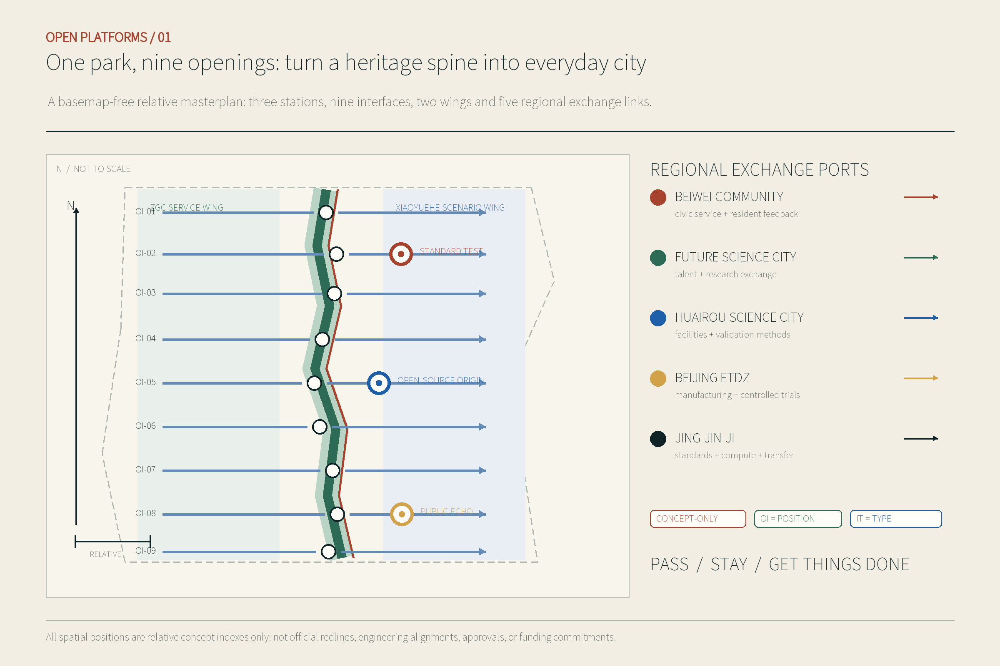
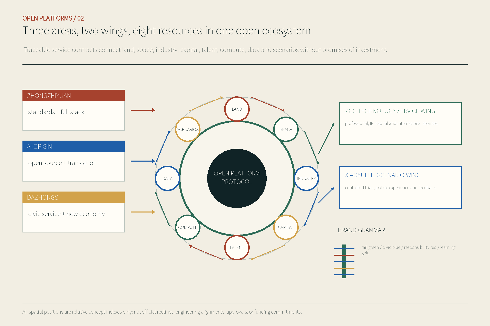
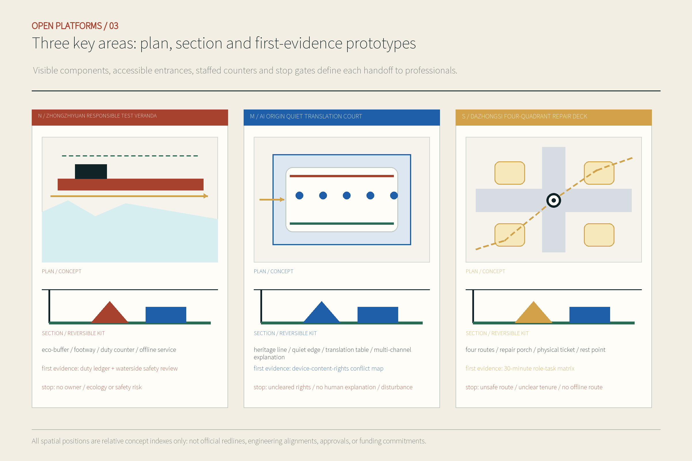
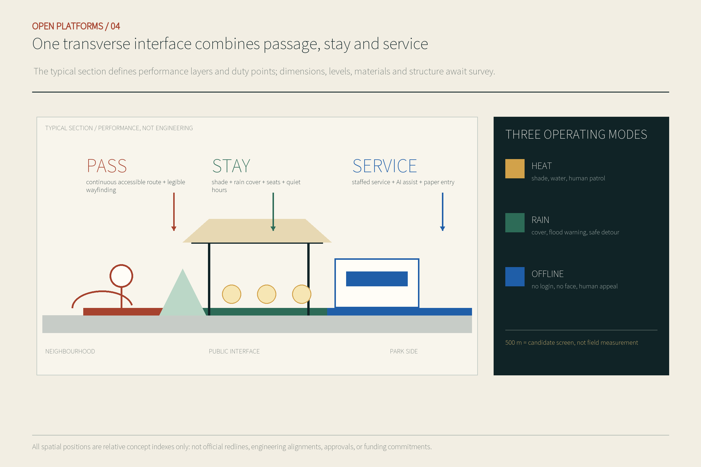
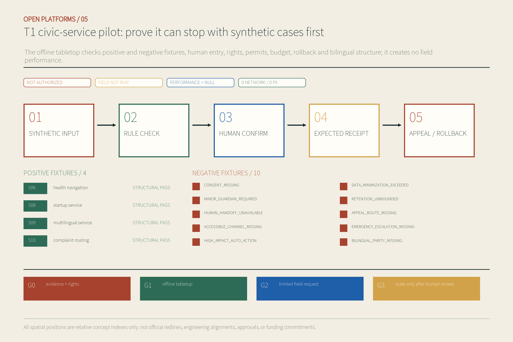

# JING-ZHANG OPEN PLATFORMS

**Subtitle: Everyday AI Public Interfaces Along the Completed Park**

The public promise has three parts: **get through, stay comfortably, and complete the task**. “Get through” means that wheelchair users, families with pushchairs, pedestrians, cyclists, and transferring passengers can understand and complete a cross-park journey. “Stay comfortably” means shade, rain protection, quiet, care, and places where no purchase is required. “Complete the task” means that entrepreneurship support, health referral, maintenance reporting, and cultural learning retain human, paper, and telephone paths alongside digital assistance. The proposal does not add another layer of “futurism” to the park; it places technology within everyday rights, operating responsibility, and mechanisms that can stop it.

This package is based on public records, the repository site package, and online review. It does not claim a field survey, resident interview, passenger count, origin–destination survey, tree inventory, utility survey, or live equipment test. Every spatial interface, pilot duration, and acceptance gate is a conceptual recommendation for professional deepening. A merged GitHub pull request would not constitute official eligibility, planning approval, funding, an award, or implementation authority.

## Design Basis and Source List

The official call governs the three working scales and the three key areas; promotional language does not replace the task brief. Public records that Phase II supporting works were completed and the full Jing-Zhang Railway Heritage Park opened change the design starting point: the park is treated as an operating public base, not as an empty landscape to redesign. The proposal therefore focuses on unverified lateral connections, everyday public services, and long-term operations between the park, metro and bus, campuses, communities, and innovation districts. Completion and opening prove only the park’s status, not authorization for any interface alteration, device, or pilot. [E:PARK-PHASE2-OPEN-20260806] [source:PARK-PHASE2-OPEN-20260806] [data:geometry/site_boundary.geojson#SITE-001]; the related standard and depth gates are [standard:PROJECT-OFFICIAL-ANNOUNCEMENT] [depth:existing_conditions_diagnosis].

Evidence is used in four levels. Adopted approvals or statutory controls define non-negotiable limits; official built, under-construction, and operating records describe dated conditions; official drafts, initiatives, and international cases provide mechanisms only; open data and Agent-derived material create hypotheses for verification only. The source register records date, applicable scale, licence, confidence, and what each item cannot support. A public source registry is a boundary on use, not a licence to upgrade every public page into a formal planning basis. [E:SOURCE-REGISTRY] [source:SOURCE-REGISTRY]

No official overall polygon, precise key-area polygons, ownership survey, road redlines, utility survey, current building survey, or approved regulatory plan was available. The repository’s provisional boundary is therefore locked rather than moved to fit a basemap, and it does not support parcel-level demolition, FAR, height, investment, or engineering alignments. OSM passed licence screening but is not used in this package’s geometry or basemap; any future use must freeze the snapshot, query, hash, and ODbL attribution. Heritage statements remain limited to registered material about Qinghuayuan Station; the entire Haidian corridor is not presented as one heritage designation.

## Three-Level Scope Framework

The 43.6-square-kilometre coordinated research area asks how industry, services, mobility, and open scenarios can collaborate across the Three Areas and Two Wings. [metric:announced_coordinated_research_area_sqm] The approximately 11.4-square-kilometre overall design area asks how the completed park can be stitched laterally into everyday urban life. [metric:announced_overall_design_area_sqm] The 368.4-hectare key-area scope organizes three relocatable prototypes for Zhongzhiyuan, the Beijing AI Origin Community, and Dazhongsi; the announcement requires three key areas. [metric:announced_key_detailed_design_area_sqm] [metric:key_area_count] Recalculation of the provisional overall polygon in EPSG:4548 gives 11,412,825.386 square metres. That value exposes the difference between a repository index and the announced approximate scope; it cannot be promoted to an official site area. [A:A-AREA-MISMATCH-001] [metric:site_area_sqm]

The overall structure is “one park base, nine relative candidate interfaces, three public learning stations, and a two-wing service network.” To remove the previous ambiguity between place and function, `OI-xx` now means only a north-to-south relative candidate position, while `IT-xx` means only a relocatable interface type. Roads, public-space records, scenarios, and drawings use this two-level contract. The nine OIs are relative indexes pending official boundaries and field verification, not selected project sites. [data:geometry/roads.geojson#ROAD-IF-01] [standard:PROJECT-AGENT-OPEN-CALL-TASKBOOK] [depth:three_level_scope_framework]

| OI position | Relative candidate location | Combined IT types | Must not be claimed before verification |
|---|---|---|---|
| OI-01 | Northern transfer candidate | IT-04 rail and bus | Station entrance, passenger flow, passage, or engineering conditions have been verified |
| OI-02 | Zhongzhiyuan service candidate | IT-01 research district; IT-07 logistics; IT-09 municipal computing | District consent, test permission, or equipment access has been secured |
| OI-03 | Blue-green crossing candidate | IT-05 blue-green safety | River, drainage, bridge, culvert, or sponge works have been approved |
| OI-04 | Campus connection candidate | IT-02 campus and community | Campus gate, community gate, or opening hours have been confirmed |
| OI-05 | Origin shared-lab candidate | IT-01 research district; IT-06 public service | Shared space, institutional occupancy, or service authorization has been confirmed |
| OI-06 | Community everyday-service candidate | IT-02 campus and community; IT-06 public service; IT-08 night-time quiet | Community need, facility capacity, or operating responsibility has been verified |
| OI-07 | Railway culture interpretation candidate | IT-03 railway heritage | Entry into a protection area or alteration of heritage fabric is permitted |
| OI-08 | Dazhongsi connection candidate | IT-04 rail and bus; IT-06 public service | The provisional key area, station relationship, or operating conditions have been calibrated |
| OI-09 | Southern public-service candidate | IT-04 rail and bus; IT-06 public service; IT-08 night-time quiet | Southern location, passenger flow, activity, or operator has been confirmed |

The nine ITs are IT-01 park–research district, IT-02 park–campus and community, IT-03 park–railway heritage, IT-04 park–rail and bus, IT-05 park–blue-green safety, IT-06 park–public service, IT-07 park–production logistics, IT-08 park–night-time quiet, and IT-09 park–municipal computing. One OI can combine several ITs, but every IT must display an ordinary path, a human gate, a minimum output, a stop condition, and a replacement trigger.

The three public learning stations are the northern **Standards Test Station**, the central **Open-Source Origin Station**, and the southern **Public Echo Station**. They are public-function prototypes that may move with accurate boundaries, not confirmed building sites. The provisional Dazhongsi key area has a low-confidence relationship to what the public normally understands as the station district, so the southern station expresses only the task of recalibrating the rail district and public life; it cannot be assigned to a specific parcel. [A:A-KEY-AREAS-001] [source:KEY-AREA-SOURCE]

## Coordinated Research Area: Industry and Future City Research

The proposal first carries the taskbook’s exact three positions—**Centennial Jing-Zhang Cultural Belt, Metropolitan AI Life Experience Belt, and AI Convergence Innovation Belt**—and its five functions—**a full-stack autonomous AI innovation system, a world-class AI innovation ecosystem, a new paradigm of AI+ scenario enablement, an intelligent and vibrant AI city, and a global voice in AI governance**. Within that formal framework, Open Platforms assigns the **Zhongzhiyuan AI Autonomous Innovation Acceleration Area** as the standards and full-stack verification gateway, the **Beijing AI Origin Community** as the open-source, translation, and sharing gateway, and the **Dazhongsi AI Industry Cluster** as the public-service and AI-native new-business gateway. The **Zhongguancun Technology Service Wing** provides professional, intellectual-property, capital, and international services; the **Xiaoyue River Scenario Enablement Wing** hosts controlled testing, public experience, and urban feedback. These Three Areas and Two Wings are not five closed campuses but a loop of “state the problem—test at small scale—publish evidence—conduct human review—stop or extend.” [E:THREE-AREAS-TWO-WINGS] [source:THREE-AREAS-TWO-WINGS] [data:geometry/land_use.geojson#LU-OP-01]; the related standard and depth gates are [standard:PROJECT-AGENT-OPEN-CALL-TASKBOOK] [depth:overall_spatial_structure].

Regional coordination does not invent partners or mutual-recognition results. Instead, the taskbook’s named places become five conceptual exchange ports. **Beiwei Community** inputs resident tasks and receives explainable service-repair records; **Future Science City** exchanges talent and research tasks; **Huairou Science City** exchanges scientific-facility needs and validation methods; the **Beijing Economic-Technological Development Area** exchanges manufacturing capability and controlled-scenario rules; and **Beijing–Tianjin–Hebei** exchanges standards, computing, green energy, and translatable test protocols. Until authorization, the minimum output, source, responsible role, and exit condition for each port remain pending. Arrows in the drawing express mechanisms, not signed partnerships.

Six international cases are used only to compare mechanisms, never as Jing-Zhang performance evidence or statutory control:

| Case | Mechanism translated | Open Platforms action | Explicitly does not prove |
|---|---|---|---|
| Knowledge Quarter London | Institutional network and public connection | Regional exchange ports and an open problem register | Existing institutional partnership or funding |
| Kendall Square / K2C2 | Innovation employment and everyday public space | Non-commercial staying next to innovation services | Jing-Zhang development intensity or returns |
| JTC LaunchPad / one-north | Shared facilities and low-threshold incubation | Bookable shared counters and human referral | Transferable leasing or investment-promotion rules |
| Paris-Saclay | Coordination of research, mobility, and daily life | Complete slow-mobility task chains and two-wing services | Rail delivery, construction period, or investment volume |
| Barcelona 22@ | Existing-district renewal and mixed functions | Retain first, lightly alter second, then test reversibly | Direct authority to change parcel use |
| Toronto Quayside | Data governance, accountability, and exit | T1 receipt, appeal, stop, and rollback | Data authorization or technical performance |

No case’s FAR, governance power, investment model, or performance number is imported into Jing-Zhang. [A:A-CASES-001] [source:CASE-TORONTO-QUAYSIDE]

The name **Jing-Zhang Open Platforms** translates a railway platform from “an edge where one waits” into “a public interface where urban services are tested together.” The visible mark is now defined: one vertical park-green spine is opened by five public-blue cross-lines; railway-oxide red marks accountability nodes and gold marks learning nodes. This four-colour status code extends to station signs, responsibility signs, stop signs, paper receipts, and event badges. The Chinese name and `JINGZHANG OPEN PLATFORMS` appear together; no brain, circuit, robot portrait, corporate trademark, or external asset is used. “Open” means open problems, rules, evidence, and appeal—not unconditional access to data or places. The mark, palette, and three area prototypes appear in the bilingual figures, HTML, and PDFs and have been reviewed in an asset-level rights ledger. [E:AGENT-TASKBOOK] [source:AGENT-TASKBOOK]

## Overall Design Area: Urban Renewal and Regulatory-Plan-Level Urban Design

The overall design does not draw the park as an isolated green ribbon. Each candidate interface becomes a composable “Open Platform section.” The component catalogue is C01 continuous accessible passage, C02 wheelchair-companion and care seating, C03 shade-and-rain canopy, C04 drinking-water/toilet/first-aid information, C05 staffed accountability counter, C06 paper/telephone/voice entry, C07 disconnectable equipment bay, and C08 clear bypass and stop signage. All nine OIs use the same accountability grammar while changing their component mix by IT type; when the official polygon changes, relationships move rather than preserving incorrect coordinates. [data:geometry/public_space.geojson#PS-IF-01] [standard:MOHURD-URBAN-DESIGN-MEASURES] [depth:overall_spatial_structure]

“Get through” requires drawing the weakest traveller’s complete chain before drawing a centreline. “Stay comfortably” treats non-commercial staying, care, night-time quiet, and extreme weather as public infrastructure. “Complete the task” gives every AI service an owner, human takeover, right of refusal, service deadline, and record. Smart screens, sensors, and edge nodes are all withdrawable components; their failure cannot block basic passage or human service. Spatial value therefore does not depend on technology being permanently online, but on the city remaining usable when it is offline.

Renewal actions have four levels: retain and maintain usable existing space; repair interfaces through signs, seating, accessible transitions, and calibrated lighting; run low-cost tests with reversible kiosks, movable worktables, and temporary separators; and discuss permanent construction only after formal controls, ownership, heritage, fire, transport, municipal, and public procedures are complete. Current evidence cannot support demolition of a specific building, new height, or development intensity, and concept drawings do not substitute for a comprehensive planning implementation scheme. [A:A-CONTROLS-001] [source:HAIDIAN-URBAN-RENEWAL-GUIDE-2025]

Existing railway, park, and neighbourhood character remains primary. New elements are low, detachable, and repairable rather than a family of competing “AI boxes” across a continuous park. Every interface first serves ordinary passage, rest, enquiry, and maintenance; testing, display, and events follow only within permission. This follows the incremental direction of Haidian renewal guidance, while road rights, setbacks, fire distances, and utility conditions still require professional verification.

## Detailed Design of Key Areas

The three key areas use the same “station—interface—test—evidence” framework while solving different problems. All three polygons are provisional constraints and the southern Dazhongsi boundary especially requires official confirmation. The table therefore describes plan and section relationships, not parcel-level development quantities, demolition objects, confirmed station entrances, or building heights. [E:KEY-AREA-SOURCE] [source:KEY-AREA-SOURCE]

| Key area and learning station | Plan and section logic | Building renewal and public space | First evidence, implementation gate, and stop |
|---|---|---|---|
| Zhongzhiyuan—Standards Test Station | OI-02; the **Responsible Waterfront Test Gallery** runs spine—ecological buffer—accountability counter—controlled test and combines IT-01/07/09 | Reuse verified ground floors, covered residual space, and outdoor hardstanding first; add a movable test table, staffed observation seat, and one-touch stop; permanent alteration awaits ownership, fire review, and district consent | First evidence is an accountability ledger plus water-system safety review; stop if responsibility is vacant or ecological or safety risk appears |
| Beijing AI Origin Community—Open-Source Origin Station | OI-04/05/06; the **Quiet Co-translation Court** runs heritage line—quiet edge—co-translation table—human explanation and combines IT-01/02/06/08 | Bookable but never conditioned on purchase; propose only time-shared use and indoor–outdoor interface improvement, not structural alteration | First evidence is an equipment–content–rights conflict map; stop if rights are uncleared, no human explanation exists, or neighbours are disturbed |
| Dazhongsi—Public Echo Station | OI-08/09; the **Four-Quadrant Repair Platform** runs arrival—repair forecourt—physical number-and-rule system—appeal and combines IT-04/06/08 | Propose only continuous ground-level passage, quiet rest, information explanation, and a feedback table; do not infer ownership, condition, or construction quantity inside the provisional polygon | First evidence is a 30-minute role-and-task matrix; stop for a dangerous route, unclear ownership, or the absence of a non-digital channel |

The stations are also AI honour nodes, but they honour replayable public contributions rather than the “largest model” or a corporate ranking: an accessibility break that was repaired, a service corrected after the public stopped it, an open standard, an authorized energy improvement, or an accountable incident review. Each display carries its source, version, responsible person, and validity period, and uses no uncleared portrait or corporate logo. One wayfinding system, a quarterly problem register, and an annual Open Platforms Week connect the stations. If official boundaries change, each function can move as a whole rather than preserving false precision. [data:geometry/key_areas.geojson#PROV-KEY-001] [standard:MOHURD-URBAN-DESIGN-MEASURES] [depth:three_key_area_detailed_design]

## AI Innovation Ecosystem, Personas, and AI+ Scenarios

The proposal serves eight groups rather than an abstract “talent” user. G1 long-term residents and older people need familiar routes, quiet, and human service; G2 children and families need safeguarding, safe crossings, and understandable rules; G3 disabled people and people with limited mobility need continuous accessibility, non-visual information, and the right to refuse; G4 students and researchers need low-cost learning and open validation; G5 startups and one-person-company teams need shared facilities, compliance referral, and small tests; G6 employees and international visitors need transfer, multilingual, and trustworthy services; G7 service and logistics workers need safe work, rest, and protection from unilateral algorithmic acceleration; G8 city and park operators need maintenance, accountability, energy information, and incident recovery. Every test checks whether cost is being shifted to the worst-affected group. [E:AGENT-TASKBOOK] [source:AGENT-TASKBOOK]

Twelve scenario cards place user, location, operator, permission, minimum data, human alternative, baseline, acceptance, privacy, stop, and recovery in one row. A “baseline” is a comparison condition to collect only after a test is authorized, not field evidence already held by this proposal. [data:visual/assets/t1-public-service-tabletop/contract.json#T1-PUBLIC-SERVICE-AGENT] [standard:PROJECT-AGENT-OPEN-CALL-TASKBOOK] [depth:renewal_project_list]

| Card | Users, OI positions, and IT types | Operator, permission, and minimum data | Human alternative, baseline, and acceptance | Privacy, stop, and recovery |
|---|---|---|---|---|
| S01 Accessible navigation | G1/G2/G3; (OI-01/OI-08/OI-09)×IT-04 and OI-04×IT-02 | Park operator and accessibility adviser; route-opening permission; only obstacle category, time, and aggregate completion state | Paper map, telephone, and human guidance; baseline is a post-authorization manual route audit; every test task must retain a continuous alternative route | No face capture or persistent location; stop at any impassable break, reopen only after human closure guidance |
| S02 Heat and storm safety route | G1/G2/G3/G7; OI-03×IT-05 | Park and emergency/weather duty holders; alert-publishing authority; public alerts and facility state only | Site signs and human announcements; baseline is an approved facility list; warning, alternative route, and help entry must be reachable together | No personal health data; if the alert source fails, degrade to human information and recover after review |
| S03 Last-500-metre transfer | G1/G3/G6/G7; (OI-01/OI-08/OI-09)×IT-04 | Transport, station, and park coordination; station and road permission; service, crowding band, and aggregate wait only | Bus/taxi information, staffed enquiry, and accessible walking line; baseline is one authorized observation week; compare completion for the worst-affected group | No individual OD tracking; stop for added detour or a broken accessible chain and return to existing traffic organization |
| S04 Event flow and quiet mode | G1/G2/G6/G8; (OI-06/OI-09)×IT-08 | Event organizer, subdistrict, and operator; event, noise, and evacuation permission; zone crowding, complaints, and time band only | Human marshals, quiet periods, and event cancellation; baseline is authorized event/no-event records; passage and quiet rights must coexist | No face identification; reduce capacity or cancel when evacuation, noise, or complaint gates fail; reapply after review |
| S05 Traceable railway interpretation | G1/G2/G4/G6; OI-07×IT-03, linked to all three stations | Cultural operator and heritage professional; content, copyright, and heritage review; source ID, version, and language | Human guide, paper route, and correction card; baseline is an approved fact list; every fact must trace to source and remain outside protection limits | No visitor identity; withdraw a disputed or incorrect card and restore only after revision and approval |
| S06 Community health referral | G1/G2/G3; OI-06×IT-06 | Licensed institution and human service worker; medical and personal-information compliance; only fields necessary for referral | Telephone, paper directory, and human referral; baseline is an authorized service directory; acceptance checks accurate transfer to a person, not clinical effect | No diagnosis or profile; emergency, ambiguity, or refusal of consent transfers immediately to a person and deletes unnecessary records |
| S07 Youth open laboratory | G2/G4; OI-05×(IT-01/IT-06), linked to Open-Source Origin Station | Education operator, guardian, and safety worker; minor, equipment, and course permission; course name, anonymous work, and equipment state | Screen-free materials, human mentor, and exit choice; baseline is a safety checklist; participation, exit, and work permission must all be complete | No biometrics; stop the class if safeguarding, content, or equipment gates fail; recover after hazard removal and renewed consent |
| S08 Startup service desk | G4/G5; OI-05×(IT-01/IT-06) and OI-06×IT-06, linked to Open-Source Origin Station | Incubation service and professional adviser; service scope and responsibility disclosure; question category, referral, and closure only | Booked professional, paper checklist, and public hotline; baseline is the existing public process; answers state their limits and transfer to a qualified person | No trade-secret access; stop a module that misstates investment, legal, or policy certainty and restore after human correction |
| S09 Multilingual visitor and small-business service | G1/G5/G6/G7; OI-09×IT-06, linked to Public Echo Station | Public-service and merchant liaison; translation, consumer, and complaint rules; language, task category, and anonymous feedback only | Bilingual human, icons, and paper form; baseline is an approved vocabulary; critical information must be equivalent across languages | No nationality profile; withdraw a language with inconsistent critical terms and restore after review |
| S10 Maintenance report and complaint triage | G1–G8; OI-01–OI-09 and all three stations; each OI uses only its compatible table-listed IT-01–IT-09 type(s) | Park/city work-order duty holder; interface and deadline confirmation; facility ID, problem, time, and state only | Telephone, staffed desk, and paper receipt; baseline is a public responsibility sheet; every sample needs an owner, deadline, and appeal | No complainant profiling; stop automated routing for absent owner, unexplained delay, or disclosure; human takeover and trace-back follow |
| S11 Controlled logistics robot | G3/G7/G8; OI-02×IT-07 | District, vendor, and safety observer; road, place, equipment, and insurance permission; speed, stop, takeover, and near miss | Human work and handcart; baseline is a post-authorization manual workflow; accessibility, emergency stop, and takeover outrank speed | Do not capture unrelated faces; boundary breach, failed stop, or blocked passage powers down and removes the unit pending new approval |
| S12 Edge computing and energy test | G5/G8; OI-02×IT-09, linked to Standards Test Station | Facility, energy, and cybersecurity duty holders; power, fire, cybersecurity, and equipment permission; aggregate load, energy, temperature, and alarms | Local human control and complete power-off bypass; baseline is an authorized independent meter; energy must be explainable and overload degradable | No unrelated personal data; a temperature, power, or safety alarm shuts down the test, which resumes only after investigation and retest |

Face recognition and persistent individual tracking are prohibited by default; data minimisation, edge processing, active opt-out, non-digital channels, human escalation, and incident records apply throughout. T1 now has a synthetic offline tabletop package with zero network access, zero personal data, and zero file writes: four positive fixtures cover S06/S08/S09/S10, while ten negative fixtures trigger refusal, stop, and rollback paths. `receipt.example.json` is explicitly an expected output, not field-execution evidence. Field status is fixed at `not_authorized_not_run`, real-world performance is fixed at `null`, and the release decision is fixed at `do_not_advance`. A structured pass proves only that contracts and refusal paths can be replayed offline; it does not prove service efficacy, partnership, or field safety. The proposed 4–8-week periods for the four minimum pilots still begin only after authorization; none is operating now. [A:A-DATA-PRIVACY-001] [source:SOURCE-REGISTRY]

## Land Use, Building Scale, and Retain-Renovate-Demolish Strategy

Land-use strategy starts with the park and existing city functions and does not fabricate precise current-condition ratios for visual completeness. Statutory or existing-condition `building_density`, green-space ratio, and public-space ratio remain unknown. The nine contributor-controlled microclimate prototypes and nine public-interface envelopes have, however, been recalculated against the provisional research index, so `green_ratio` and `public_space_ratio` are recorded as known, low-confidence concept-prototype coverage ratios. They are not current conditions, ownership facts, planning controls, or construction commitments. [M:building_density] [metric:building_density] [data:geometry/buildings.geojson#BLDG-OP-01]; the related standard and depth gates are [standard:MNR-LAND-USE-CLASSIFICATION-GUIDE] [depth:retain_renovate_demolish].

The supply order is: retain the completed park, usable roads, public facilities, and verified buildings first; lightly alter opening hours, signs, accessible transitions, seating and shade, and shared rooms second; test demand with movable service desks, temporary elements, and equipment bays third; and discuss permanent buildings only after formal controls, ownership, structure, fire, heritage, municipal, and public procedures are complete. Demolition remains empty at this stage. Misalignment between a provisional polygon and a basemap cannot justify a “low-efficiency” label or displacement conclusion.

Building scale remains low, reversible, and sparing of park space. The three learning stations first use existing or temporary space. Any future construction requires fresh assessment of view corridors, trees, heritage, daylight, fire access, accessibility, energy, and maintenance. `floor_area_ratio` remains explicitly pending formal data because neither approved FAR control nor an official boundary is available. The narrative supplies no substitute and does not divide concept footprints by provisional area to imitate FAR. [M:floor_area_ratio] [metric:floor_area_ratio]

The nine interfaces follow a relationship-before-parcel method. Professional teams first identify the institutional and spatial break, then select a retain, repair, or addition location on official data. When formal polygons arrive, source geometry must be repartitioned and areas, figures, metrics, and hashes rebuilt, rather than translating the present graphics. [A:A-BOUNDARY-001] [source:BOUNDARY-SOURCE]

## Transport, Rail, Municipal Infrastructure, and Public Services

Transport is not another abstract “smart corridor”; it verifies the lateral IT connection at each OI. IT-04 covers an understandable last 500 metres between rail, bus, and park; IT-02 tests whether campus and community entrances work fairly across ages and abilities; IT-03 provides a slow-mobility bypass while protecting heritage; IT-05 provides alternatives in heat and heavy rain; and IT-07 confines low-speed logistics by time, speed, emergency stop, and human observation. Ordinary signs and staff come first, with digital guidance layered afterward. Equipment failure cannot remove a basic right to move. [data:geometry/roads.geojson#ROAD-SPINE-01] [standard:MOHURD-URBAN-DESIGN-MEASURES] [depth:traffic_rail_slow_parking]

The acceptance unit for “get through” is one complete task chain: enter from a station or street, understand direction, cross an interface, find rest and help, reach a public service or innovation-district edge, and leave along a non-digital route. A formal test must be replayed separately by wheelchair users, older people, carers with children, first-time visitors, and service workers. This proposal has performed no such field replay and holds no measured OD, passenger flow, detour ratio, or waiting-time data; provisional geometry therefore supports no transport-effect claim. [A:A-PARK-INTERFACE-001] [source:PARK-PHASE2-SUPPORT-20260713]

Municipal and new infrastructure follow “basic safeguards first, digital equipment disconnectable.” An IT-09 edge-computing and energy test requires independent metering, temperature control, fire and cybersecurity review, equipment withdrawal, and a manual bypass. It cannot consume the essential supply for park lighting, emergency communication, or accessibility facilities. Actual capacity for drinking water, toilets, drainage, lighting, waste, first aid, power, and communications has not been obtained and remains on the survey list, not estimated from concept drawings. Edge processing handles only the minimum data required for a task and creates no cross-scenario personal file. [depth:municipal_new_infrastructure]

Public service follows “three stations, one seated desk, many channels.” Every station retains a human conversation desk, paper directory, telephone, voice path, and screen-free icons; a digital Agent may explain, route, and query status only. Health, legal, investment, policy, emergency, and child-protection matters transfer to a qualified person or institution, with no final AI decision. “Complete the task” means an owner, deadline, receipt, appeal, and closure—not a fast answer.

## Blue-Green Network, Public Space, and Urban Character

Because the park is open, blue-green design first protects continuity and repairs interface experience rather than covering completed work with a new landscape image. IT-05 organizes heat, heavy rain, possible standing water, shade, drinking-water information, and alternatives as an updateable safety layer; IT-08 protects night-time life through quiet periods, low-stimulation guidance, event-capacity reduction, and resident feedback. Statutory and existing-condition green-space and public-space ratios remain unknown. The geometry’s `green_ratio` and `public_space_ratio` are recalculated low-confidence concept-prototype coverage only and cannot be presented as current or statutory controls. [M:green_ratio] [metric:green_ratio] [data:geometry/green_space.geojson#GS-CLIMATE-01]; the public-interface data and professional gates are [data:geometry/public_space.geojson#PS-IF-01] [standard:MOHURD-URBAN-DESIGN-MEASURES] [depth:blue_green_public_space].

“Stay comfortably” means non-commercial seating, space beside a wheelchair for a companion, family sightlines, backs and armrests, rain and shade protection, drinking-water information, low-stimulation corners, safe night-time visibility, and human help. Components are maintainable, replaceable, and avoid unnecessary hard surfaces. Without field evidence on trees, drainage, sunlight, noise, and behaviour, the proposal does not prescribe seat quantities, species, paving areas, or illuminance. Every staying place identifies a maintenance responsibility, a fault-reporting path, and how basic passage survives an event.

The three learning stations also serve as AI pilgrimage landmarks, but their significance comes from public learning rather than monumental form. The Standards Test Station displays standards, failed tests, and emergency-stop drills; the Open-Source Origin Station displays open tools, youth work, and community questions; the Public Echo Station displays complaint closure, accessibility repairs, and annual review. Every honour entry carries source, contributor authorization, version, validity, and correction route; corporate marks, unauthorized people, and model league tables do not occupy public space. [E:QINGHUAYUAN-HERITAGE-STATUS] [source:QINGHUAYUAN-HERITAGE-CONTROL]

Railway-oxide red marks continuous history, park green the ecological base, and high-contrast public blue an enterable lateral interface. Typography and images require traceable licences; wayfinding combines Chinese, English, icons, and non-visual alternatives. Slender, low-profile elements, open edges, and reversible connections replace brains, circuits, neon “technology pods,” and trade-show landscapes. Anything near heritage awaits accurate protection lines and competent-authority review. [A:A-HERITAGE-001] [source:QINGHUAYUAN-HERITAGE-CONTROL]

## Renewal Projects, Implementation Policy, and Phasing

Projects advance through condition gates rather than “build first, find an operator later.” P0 verifies rights and evidence: official polygons, ownership, road rights, heritage, utilities, accessibility, permissions, and public-process requirements, producing a register for nine candidates. P1 places one low-cost learning station and one withdrawable service in each area without permanent construction. P2 extends to a nine-interface network only after tests pass and the worst-affected group bears no added cost. P3 may then consider long-term spatial work, an annual Open Platforms Week, and quarterly challenges. Any failed gate returns to paper or stops rather than lowering the threshold to preserve schedule. [A:A-PILOTS-001] [source:AGENT-TASKBOOK]

All four proposed 4–8-week minimum tests begin only after authorization and do not imply an existing government partnership, budget, place, operator, or committed schedule:

| Test | Duration, scenarios, and current status | Accountability RACI and minimum resource categories | Opening/acceptance, stop, and recovery |
|---|---|---|---|
| T1 Public Service Agent | Proposed 6 weeks; S06/S08/S09/S10; synthetic offline tabletop only; `not_authorized_not_run` | Tabletop A=GitHub contributor, R=offline rules runner; future field A/R=`unknown_pending_authorization`; resource categories are human service, accessibility QA, privacy/security, bilingual QA, temporary installation, O&M, and rollback reserve; no amount estimated | Every sample needs a human entry, responsible role, deadline rule, expected receipt, and appeal; ten negative classes trigger stop and rollback; current decision `do_not_advance` |
| T2 Slow-Mobility Connection | Proposed 6 weeks; S01–S04; two candidate interfaces are OI-03×IT-05 and OI-09×(IT-04/IT-08); not authorized, not run | Future A=authorized project owner, R=slow-mobility test operator; C=accessibility users/transport/park/safety, I=nearby community; resources include paper maps, on-site guidance, shade/rain cover, audit checklist, and removal tools | Establish the worst-affected-group baseline after authorization; an impassable route, evacuation conflict, or incorrect warning stops digital guidance, restores the existing route, and requires replay |
| T3 Controlled Robot Logistics | Proposed 4 weeks; S11; closed or expressly permitted environment; not authorized, not run | Future A=authorized project owner, R=test safety lead; C=accessibility/equipment/insurance/place, I=users and maintainers; resources include physical enclosure, emergency stop, human takeover, incident log, and removal tools | Speed, yielding, emergency stop, takeover, and accessible passage must all pass; boundary breach or failed stop powers down and removes the unit pending new approval |
| T4 Edge Computing and Energy | Proposed 8 weeks; S12; independently metered environment; not authorized, not run | Future A=authorized project owner, R=facility and safety operator; C=energy/fire/cybersecurity/accessibility, I=users; resources include an independent meter, thermal control, power-off bypass, logs, and retirement plan | Freeze devices and alarm baselines after authorization; power, temperature, fire, cybersecurity, or integrity alarm isolates the test, which resumes only after professional retest |

The T1 contract, positive and negative fixtures, expected receipt, asset-rights and bilingual QA, and read-only runner are in `visual/assets/t1-public-service-tabletop/` for independent offline replay. They validate only that “rules can refuse and roll back,” not field performance. [data:geometry/phasing.geojson#PHASE-GATE-01] [data:visual/assets/t1-public-service-tabletop/contract.json#T1-PUBLIC-SERVICE-AGENT]; the related standard and depth gates are [standard:PROJECT-AGENT-OPEN-CALL-TASKBOOK] [depth:phasing_implementation].

Long-term operations combine monthly interface inspection, quarterly public challenges, an annual Open Platforms Week, and a versioned evidence cabinet. A quarterly challenge is accepted only with an owner, data boundary, human alternative, and exit plan. The annual event displays rejected and corrected projects as well as successful ones and explains why work stopped. Developers, residents, students, service workers, and operators can all submit problems, but participation cannot become a condition for basic public service. International communication states only the true status—submitted, tested, or reviewed—rather than presenting a concept as an implemented project.

The Agent.6 concept conversion chain for the developer community and international attraction is `intake problem register → open challenge → authorized pilot → independent review → incubation / procurement / standard publication / international conversion`. Residents, developers, service workers, and operators submit at intake. For a future challenge and pilot, A=authorized project owner, R=developer-community operations team, C=accessibility/privacy/safety/professional reviewers, and I=the public and prospective international teams; before authorization, both A and R remain `unknown_pending_authorization`. Its five evidence gates require, in sequence, a versioned problem record and rights declaration; a replayable proposal and human alternative; permission, RACI, minimum resources, and an exit budget; an independent review record including the worst-affected-group result; and a legality, rights, procurement, or localization due-diligence record for the chosen conversion path. Failure at any gate returns the proposal for revision, retains it only as open material, or terminates it; publicity cannot substitute for evidence. Passing review creates options only: incubation, lawful procurement, open-standard publication, or separate due diligence and localization by a prospective international team. It does not confer a contract, investment, procurement, market access, or cross-border-data permission. This chain is a concept operating mechanism only. There is currently no established partner, site, budget, attraction agreement, or institutional commitment; every future actor requires separate authorization.

Policy directions include small reversible-test procurement, data-minimisation templates, cross-department responsibility sheets, accessibility and privacy red teams, open-licence and copyright ledgers, and recovery budgets. Authorized institutions and professional teams will determine funding, operators, permits, and schedules. This proposal offers checkable working interfaces and makes no commitment on another institution’s behalf.

## Metrics, Area Recalculation, and Compliance Matrix

Core metrics have four groups: announced task scopes, concept-geometry recalculations, formal controls awaiting evidence, and public-task or pilot governance. The announced 43.6 square kilometres, approximately 11.4 square kilometres, 368.4 hectares, and three key areas are high-confidence task values. The provisional overall polygon’s 11,412,825.386 square metres and the four concept functional bands’ total of 11,412,832.841 square metres are low-confidence, replayable package calculations. Their approximately 7.455-square-metre difference is projection and segmentation tolerance after splitting longitude/latitude geometry and reprojection, not a claimed physical gap or overlap. [metric:site_area_sqm] [metric:land_use_partition_area_sqm]

The nine relocatable service prototypes total 7,236 square metres of concept building footprint; this is neither existing nor approved building quantity. [metric:building_footprint_area_sqm] Nine shade-and-rain microclimate prototypes total 16,239.547 square metres, or 0.001423 of the provisional research-index geometry; this is interface-toolkit coverage, not existing or statutory green-space ratio. [metric:green_space_area_sqm] [metric:green_ratio] Nine public-interface candidate envelopes total 38,568.923 square metres, a low-confidence concept ratio of 0.003379; this proves neither public title nor statutory public-space proportion. [metric:public_space_area_sqm] [metric:public_space_ratio]

| Metric | Current status | Design meaning | Recalculation or pass condition |
|---|---|---|---|
| Announced three-level areas | Known task scopes | Fix coordinated, overall, and key-area working scales; not a current-condition survey | Version together if the announcement or formal task changes |
| Site and partition areas | Low-confidence concept recalculation | Check provisional file structure and recalculation chain; no formal site fact | Reproject, recalculate, redraw, and rehash after official polygons arrive |
| Building footprint, green, and public-interface envelopes | Low-confidence concept recalculation | Control relative size of reversible prototypes; not current condition, ownership, or planning control | Recalculate after current survey, ownership, and formal classification boundaries are verified |
| Road ratio | Pending formal data | A centreline cannot generate a road-redline proportion | Calculate after road redlines, delivery body, and permission are known |
| Phasing concept-envelope area | Known, low-confidence concept recalculation: 17,642.407 m² | Checks the four condition-gate shapes only; not construction scale, investment, or schedule | Recalculate with every geometry change; replace when formal project boundaries arrive |
| FAR | Pending formal data | Prevents a concept from imitating approved development volume | Calculate only when approved control and official area are both available |
| 9/3/8/12/4 | Package quantity gate | Completeness of nine candidates, three stations, eight groups, twelve scenarios, and four tests | Each needs responsibility, evidence, human alternative, stop, and recovery; not field performance |

The compliance matrix covers official-call tasks 1.3, 1.4, and 1.5 and Agent tasks agent.1–agent.6. The standards matrix records urban-design, regulatory-plan-depth, accessibility, and generative-AI-service boundaries and missing formal files. The design-depth matrix links each judgment to narrative, GeoJSON, metrics, the T1 tabletop, or an explicit evidence gap. Every boundary, source, or scenario change rebuilds the chain in this order: source file → geometry → metrics → five figures → Chinese/English narrative → HTML/PDF → manifest hash. Updating a number without rebuilding its evidence chain is prohibited. [E:SITE-PACKAGE] [source:SITE-PACKAGE] [data:geometry/phasing.geojson#PHASE-GATE-01]; the related standard and depth gates are [standard:MOHURD-CONTROL-DETAILED-PLANNING] [depth:metrics_recalculation].

Public value controls acceptance. Slow mobility asks whether the worst-affected group completes a task; the service Agent asks whether it transfers to a person and closes; robotics asks whether yielding and emergency stop work; energy asks whether degradation and basic-service isolation work. Until authorized field testing, completion, time saving, satisfaction, footfall, and energy saving remain unmeasured. This package says how they would be measured, not that results exist.

## Risk, Copyright, and Compliance

The highest risk is not technical failure but provisional data creating the illusion of a known location. The repository’s rough boundary and the park visible on public maps have an approximately 412.5-metre mismatch, while the provisional “Dazhongsi” key-area centre has an approximately 2.26-kilometre low-confidence anomaly relative to Dazhongsi Station. These are boundary-verification warnings only; they do not authorize moving a locked layer, choosing a parcel, or calculating works. Until official polygons arrive, all interfaces remain relative candidates and all key-area prototypes remain relocatable. [A:A-KEY-AREAS-001] [source:BOUNDARY-SOURCE]

The second risk is presenting online research as a field fact. This proposal has conducted no site visit, interview, measurement, passenger/OD count, satisfaction survey, accessibility replay, tree survey, utility investigation, or live-system connection. Every baseline is a future test-opening step. Park opening does not authorize interface alteration; international cases do not transfer local powers; district averages do not describe a key area. Professional deepening requires formal boundaries, current survey, ownership, controls, roads, utilities, heritage review, operations, and public participation. [A:A-PARK-INTERFACE-001] [source:PARK-PHASE2-OPEN-20260806]

The third risk is digital convenience eroding basic rights. Face recognition and persistent individual tracking are prohibited by default. Each scenario uses only fields needed to complete its task, prefers edge processing and aggregation, and supplies opt-out, paper, telephone, screen-free, and human paths. AI makes no final health, legal, investment, policy, emergency, or child-protection decision. Each service displays operator, responsible person, data purpose, retention, appeal, stop conditions, and recovery record; when it cannot explain itself, it stops before collecting more. [A:A-DATA-PRIVACY-001] [source:SOURCE-REGISTRY]

Copyright is closed at asset level for this package: it uses only repository-cleared text/data and programmatically produced original figures. International cases are factual and methodological summaries with sources; no protected image, map, brand asset, or proposal expression is copied. OSM is not used in package geometry or basemaps. The name, mark, three station graphics, five bilingual figure pairs, four PDFs, two visual HTML files, two report HTML files, and T1 files are registered as generated for this submission, contain no third-party assets, and use `COMMUNITY-DISPLAY-ONLY`. Noto Sans SC is embedded only as a system-font subset and no font file is distributed. Automated checks prove structure and hashes only; semantic equivalence and final rights confirmation remain the GitHub contributor’s responsibility. [E:OSM-LICENSE-SCREENING] [source:OSM-LICENSE-SCREENING] [data:geometry/constraints.geojson#CONSTRAINT-METADATA]; the related standard and depth gates are [standard:PROJECT-AGENT-OPEN-CALL-TASKBOOK] [depth:risk_missing_data].

This package is an Agent open-call concept and professional-deepening resource. It is not a statutory plan, government decision, engineering-feasibility conclusion, investment estimate, procurement promise, or implementation authorization. A merged GitHub PR only places files in an open repository. External communication must distinguish proposed, submitted, validated, reviewed, selected, approved, and implemented states, and must follow `report/copyright_statement.md`, the source register, and the versioned manifest.

## References

The following materials materially shaped the design. This list is a human-readable index; complete URLs, uses, licences, dates, and limitations remain in `sources.json`. Inclusion does not make every statement in a source suitable for a formal spatial conclusion. [E:PROCESSED-FACT-PACK] [source:PROCESSED-FACT-PACK] [data:geometry/constraints.geojson#CONSTRAINT-METADATA]; the related standard and depth gates are [standard:PROJECT-OFFICIAL-ANNOUNCEMENT] [depth:risk_missing_data].

1. Beijing Municipal Commission of Planning and Natural Resources, Haidian Branch, *Centennial Jing-Zhang AI Innovation Belt International Urban Design Call for Prequalification*, for the three scales, three key areas, and deliverable tasks.
2. Beijing public landscaping records on completion of Phase II supporting works and opening of the full Jing-Zhang Railway Heritage Park; used only for park status, not interface approval.
3. *Haidian District Territorial Spatial Plan (2017–2035)*, for regional strategy, spatial structure, and planning context, not project controls.
4. *Haidian Urban Renewal Action Guide (2025)*, for directional reference on incremental renewal, public interfaces, and implementation mechanisms.
5. The Agent-facing taskbook and repository `agent_taskbook.json`, for naming, ecosystem cases, scenario cards, personas, landmarks, cultural narrative, and long-term operations.
6. Public material on Qinghuayuan Station’s heritage status and controls, used to bound cultural-interpretation and heritage-interface claims; precise protection lines remain pending.
7. Knowledge Quarter London public material, for institutional networks, knowledge exchange, and public-connection mechanisms. [E:CASE-KNOWLEDGE-QUARTER] [source:CASE-KNOWLEDGE-QUARTER]
8. Cambridge Kendall Square / K2C2 public material, for the mechanism linking innovation employment with public space. [E:CASE-KENDALL-K2C2] [source:CASE-KENDALL-K2C2]
9. JTC LaunchPad / one-north public material, for shared facilities, low-entry incubation, and district operations. [E:CASE-JTC-LAUNCHPAD] [source:CASE-JTC-LAUNCHPAD]
10. Paris-Saclay public development material, for coordination among research districts, mobility, daily life, and long-term delivery. [E:CASE-PARIS-SACLAY] [source:CASE-PARIS-SACLAY]
11. Barcelona 22@ public planning material, for existing-employment-district renewal and mixed functions. [E:CASE-BARCELONA-22AT] [source:CASE-BARCELONA-22AT]
12. City of Toronto public review records for Quayside, for data governance, public accountability, and exit mechanisms. [E:CASE-TORONTO-QUAYSIDE] [source:CASE-TORONTO-QUAYSIDE]

These materials do not fill gaps in official polygons, ownership, approved controls, current survey, municipal capacity, or observed behaviour. Professional teams should replace assumptions, recalculate all spatial outputs, and replay the four tests after obtaining those inputs, while preserving why rejected options were stopped so that “open” means verifiable and correctable first.
