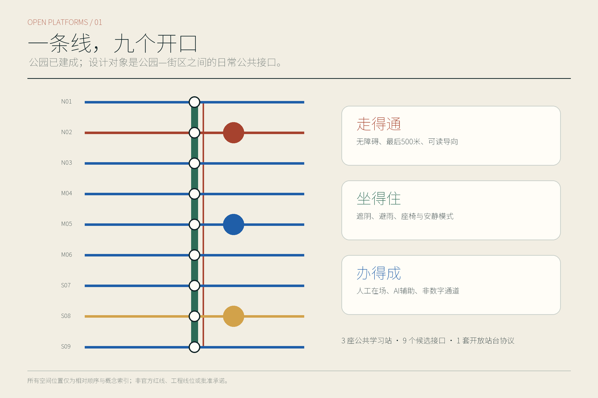
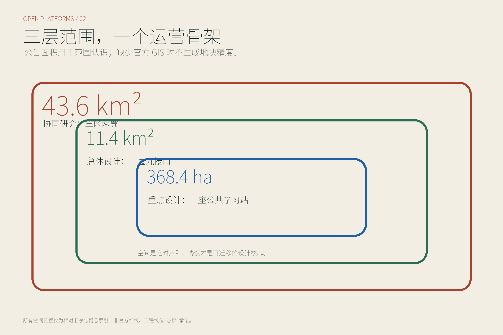
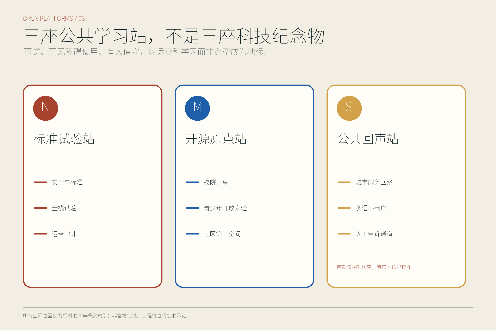
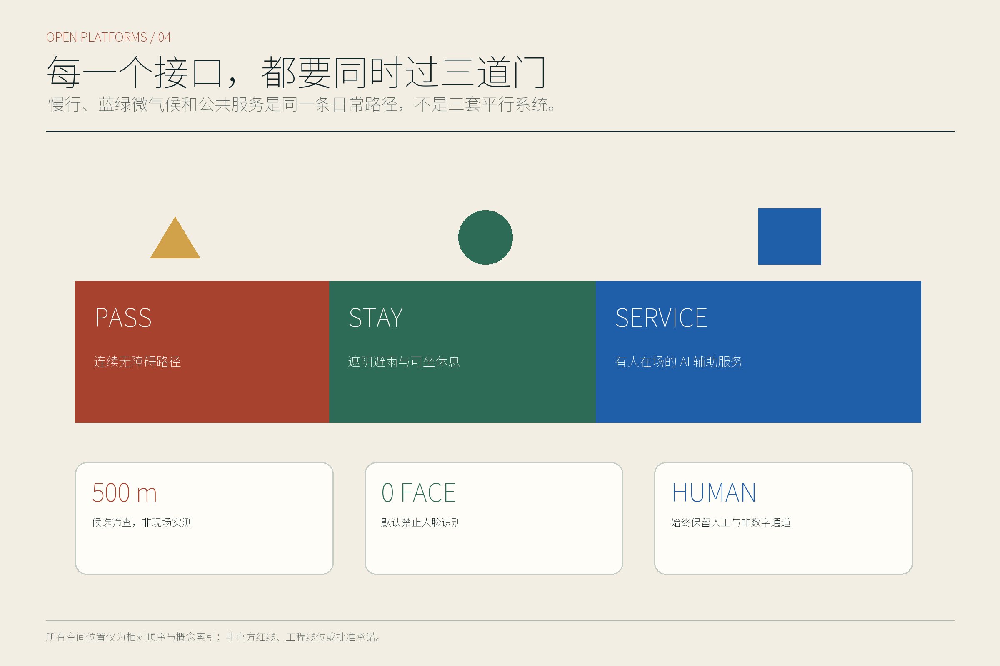
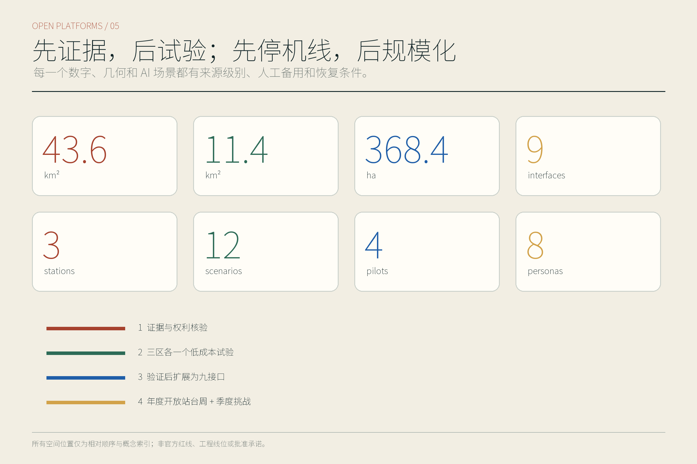

# 京张开放站台

**副标题：公园建成后的九公里日常 AI 公共接口**

本方案的公众承诺只有三句：**走得通、坐得住、办得成**。走得通，是让轮椅、婴儿车、步行者、骑行者和换乘者都能理解并完成横向联系；坐得住，是在通勤之外提供遮阴、避雨、安静、照护与不消费也能停留的公共位置；办得成，是让创业、健康转介、设施报修、文化学习等事务既有数字入口，也始终保留人工、纸面和电话通道。方案不是给公园再铺一层“未来感”，而是把技术放进普通人的日常权利、运营责任和可停止机制中。

当前成果来自公开资料、仓库场地包与线上复核，没有开展现场踏勘、居民访谈、客流调查、OD 调查、树木普查或设备测试。文中的空间接口、试验周期和验收门只是一套可供专业团队深化的概念建议；GitHub 合并也不等于官方征集资格、规划批准、资金承诺、获奖或实施决定。

## 设计依据与资料清单

设计判断首先服从正式征集公告规定的三层尺度与三处重点区，不用宣传口径替代任务口径。公园二期配套完工和全线开放改变了设计起点：本方案把京张铁路遗址公园视为已经投入公共使用的连续基底，不重复提出大拆大建或重新造景，而把精力放在公园与地铁、校园、社区、园区之间尚待核实的横向接口、公共服务和长期运营上。完工与开放只能证明公园状态，不能证明任何接口改造、设备安装或场景试验已经获批。[E:PARK-PHASE2-OPEN-20260806] [source:PARK-PHASE2-OPEN-20260806]

资料按四级使用：正式批复或法定控制用于确定不可越界的约束；官方已建、在建和运行信息用于识别现状条件；官方草案、倡议和国际案例只用于提炼机制；开放数据或 Agent 推导只用于形成待核假设。来源登记同时记录发布日期、适用尺度、许可、置信度和“不能支撑什么”。仓库中的公开来源注册表是用途边界，不是把所有公开页面自动升级为正式依据的许可证。[E:SOURCE-REGISTRY] [source:SOURCE-REGISTRY]

本次没有取得正式总体 polygon、重点区精确 polygon、权属、道路红线、管线、现状建筑测绘和批复控规，因此锁定仓库临时边界，不自行移动以迎合底图，也不据此给出地块级拆改、容积率、高度、投资或工程线位。OSM 仅完成许可筛查，未用于本包几何或底图；未来若使用，须固定快照、查询、哈希和 ODbL 署名。清华园车站相关遗产判断只在已登记的保护资料范围内表达，不能把整条海淀段笼统称为同一等级文物。

## 三层范围工作框架

43.6 平方公里统筹研究范围回答产业、服务、交通和开放场景如何跨“三区两翼”协作。[metric:announced_coordinated_research_area_sqm] 约 11.4 平方公里总体设计范围回答公园基底如何与日常城市横向缝合。[metric:announced_overall_design_area_sqm] 368.4 公顷重点区口径用于组织众智园、北京 AI 原点社区和大钟寺三类可重定位原型；公告要求的重点区数量为三处。[metric:announced_key_detailed_design_area_sqm] [metric:key_area_count] 临时总体多边形在 EPSG:4548 下复算为 11,412,825.386 平方米，只用于暴露它与公告约 11.4 平方公里口径之间不可互相替代，不能升级为正式场地面积。[A:A-AREA-MISMATCH-001] [metric:site_area_sqm]

总体结构概括为“一条公园基底、九个相对候选接口、三座公共学习站、两翼服务网络”。九个接口不是九个已选址工程，而是待官方边界、在线证据和未来持证团队现场核验后重定位的关系类型：

| 编号 | 相对候选接口 | 首要公共任务 | 核验前不得声称 |
|---|---|---|---|
| OI-01 | 公园—科研园区接口 | 验证人员与公众共享进入、离开和停留 | 已有开放通道或园区同意 |
| OI-02 | 公园—校园社区接口 | 连接学习、托育、老人休息与社区服务 | 校门、社区门或时段可直接开放 |
| OI-03 | 公园—铁路遗产接口 | 组织可溯源讲述、慢行绕行与保护提示 | 可进入保护范围或改造遗产本体 |
| OI-04 | 公园—轨道公交接口 | 补齐最后 500 米、无障碍换乘和候车信息 | 站口、客流或工程条件已经核实 |
| OI-05 | 公园—蓝绿安全接口 | 组织暑热、暴雨、积水与替代路线提示 | 河道、排水或海绵工程已经批准 |
| OI-06 | 公园—公共服务接口 | 设置可人工接管的便民服务与转介桌 | 机构进驻、数据共享或服务授权已确定 |
| OI-07 | 公园—生产物流接口 | 划分人与低速物流的时段、速度和停止边界 | 机器人可以上路或园区可以开放物流线 |
| OI-08 | 公园—夜间安静接口 | 协调活动、人流、照明、噪声和居民休息 | 夜间活动、照明增设或经营时段已获许可 |
| OI-09 | 公园—市政算力接口 | 试验边缘计算、能耗计量、断电和降级 | 电力余量、机房位置或设备接入已经确认 |

三座公共学习站分别是北部“标准试验站”、中部“开源原点站”、南部“公共回声站”。它们是可以随精确边界移动的公共功能原型，不是确定建筑点位。尤其大钟寺临时重点区与公众通常理解的站区关系存在低置信风险，南站只表达“轨道站区与公共生活需要被重新校准”的任务，不能落到具体地块。[A:A-KEY-AREAS-001] [source:KEY-AREA-SOURCE]

## 统筹研究范围产业与未来城市研究

统筹层提出三项定位：面向全栈自主创新的开放验证带、面向普通人的 AI 公共服务带、面向全球开发者的可审计学习带。五项功能是“技术验证、转化孵化、公共服务、文化学习、长期运营”。北部众智园承担标准、安全治理和共享测试；中部 AI 原点社区连接高校一公里转化、低成本孵化和青年第三空间；南部大钟寺以轨道站区、智能终端、公共生活和服务验证为方向；西翼提供知识产权、资本和国际服务，东翼承接受控的具身智能、医疗与影视测试。三区两翼不是五块封闭园区，而是一条“提出问题—小规模试验—公开证据—人工复核—停止或扩展”的协作回路。[E:THREE-AREAS-TWO-WINGS] [source:THREE-AREAS-TWO-WINGS]

六个国际案例只用于机制对照。伦敦 Knowledge Quarter 提醒我们重视机构网络而非单一地标；Kendall Square 的经验被转译为公共空间与创新就业的日常连接；新加坡 LaunchPad/one-north 提示共享设施和低门槛孵化的重要性；Paris-Saclay 提醒大尺度科研片区必须同时处理交通和生活；Barcelona 22@ 提供存量更新与混合功能的讨论框架；Toronto Quayside 的审查则要求把数据治理、公众责任和退出机制前置。任何案例的容积率、治理权限、投资模型或绩效数值都不移植到京张。[A:A-CASES-001] [source:CASE-TORONTO-QUAYSIDE]

名称“京张开放站台”把铁路站台从“等车的边缘”转译为“共同检验城市服务的公共界面”。标志建议是一条连续的铁路氧化红线，被九道高对比公共蓝横向接口轻轻打开，并由公园绿形成可停留的底；不采用大脑、电路、机器人头像和企业商标。这里的“开放”不是无条件开放数据或场地，而是开放问题、规则、证据和申诉入口。三座学习站不做夸张科技纪念物，而承担标准展示、开源共学、公共反馈和荣誉记录四种日常功能。[E:AGENT-TASKBOOK] [source:AGENT-TASKBOOK]

## 总体设计范围城市更新与控规深度城市设计

总体设计不把公园画成一条孤立绿带，而把每个候选接口做成可组合的“开放站台剖面”。最低配置包括一条连续且可理解的通行带、轮椅与婴儿车可使用的停留位、遮阴避雨和饮水补给提示、人工服务或求助入口、纸面与语音替代、清楚的责任牌、可停止设备位以及绕行路线。九个接口采用同一责任语法，却允许根据校园、社区、站区、河道或园区条件改变空间构件；这样官方 polygon 更新后可以迁移关系，而不必保留错误坐标。

“走得通”要求先画最弱通行者的完整链，而非只画中心线；“坐得住”要求把非消费停留、照护、夜间安静和极端天气作为公共设施的一部分；“办得成”要求每项 AI 服务都有负责人、人工接管、拒绝权、处理时限和记录。设计中的智能屏、传感器、边缘节点都属于可撤回构件，失效时不能阻断基础通行和人工服务。空间价值因此不依赖技术永远在线，而依赖技术离线后城市仍然可用。

更新动作分为四类：保留并维护现有可用空间；通过标识、座椅、坡道衔接、照明校准等微更新修补界面；以可逆亭、可移动工作台和临时隔离构件进行低成本试验；只有在正式控规、权属、文保、消防、交通、市政和公众程序齐备后，才讨论永久建设。当前资料不足以判断任何具体建筑拆除、新建高度或开发强度，本方案也不以概念图替代规划综合实施方案。[A:A-CONTROLS-001] [source:HAIDIAN-URBAN-RENEWAL-GUIDE-2025]

总体城市风貌以既有铁路、公园和街区为主角：新构件保持低姿态、可拆卸、可维修，避免在连续公园上制造一组争夺注意力的“AI 盒子”。所有界面首先服务日常过路、休息、咨询和维护，再在许可范围内承载试验、展示和活动。该判断与海淀存量更新强调的渐进改善相呼应，但具体路权、建筑退界、消防距离和管线条件仍待专业团队核实。

## 重点区域详细设计

三处重点区使用同一套“站台—接口—试验—证据”框架，但各自解决不同问题。当前三个 polygon 均为临时约束，南部大钟寺尤其需要官方核边；因此下表描述功能组合与空间关系，不给出地块级开发量、拆迁对象、确定站口或建筑高度。[E:KEY-AREA-SOURCE] [source:KEY-AREA-SOURCE]

| 重点区与学习站 | 定位及空间结构 | 建筑更新与公共空间 | 首批 AI 场景及实施门 |
|---|---|---|---|
| 众智园—标准试验站 | 围绕共享测试、标准解释、安全治理形成“测试内环—公众外廊”；OI-01 与 OI-07 只表达园区、公园和物流的相对联系 | 优先复用可确认的首层、灰空间与室外硬地，设置可移动测试台、人工观察席和一键停止位；永久改造待权属、消防与园区同意 | 受控机器人物流、边缘计算与能耗试验；必须先有许可边界、责任人、人工看护、事故记录与恢复演练 |
| AI 原点社区—开源原点站 | 以高校一公里转化、低成本孵化、青年共学和社区服务形成“开放桌—共享实验室—社区门厅”序列；主要连接 OI-02、OI-06、OI-08 | 采用可预约但不以消费为门槛的第三空间；现有建筑只提出室内外界面改善和时段共享建议，不判断结构改造 | 青少年开放实验室、创业服务台、多语服务、社区健康转介；未成年人保护、专业转介和人工复核是开场条件 |
| 大钟寺—公共回声站 | 以轨道换乘、智能终端、小商户服务和公众反馈形成“到达—停留—办事—回声”链；OI-04、OI-06、OI-09 的具体位置待校准 | 只提出站区地面层的连续通行、安静休息、信息解释和反馈桌原型；不推断临时 polygon 内的权属、现状或建设规模 | 最后 500 米接驳、公共服务智能体、设施报修和活动安静模式；正式边界、站务协调、无障碍审查和数据合规未完成时不得落点 |

三座站同时是 AI 荣誉展示节点，但荣誉对象不是“最大模型”或企业排名，而是可复演的公共贡献：一次被修复的无障碍断点、一项被公众叫停后改正的服务、一套开放标准、一次能源降耗或一份可追责的事故复盘。展示使用来源、版本、责任人与有效期，不采用未清权肖像和企业标志。站点之间通过同一导视、季度问题清单和年度开放站台周联结；若未来官方边界改变，功能可整体迁移而不保留伪精确点位。

## AI 创新生态、人才画像与 AI+ 场景

方案服务八类人，而不是抽象“人才”：G1 长期居民与老人，关心熟悉路线、安静和人工服务；G2 儿童与家庭，关心看护、过街和可理解规则；G3 残障及行动不便者，关心连续无障碍、非视觉信息和拒绝权；G4 学生与研究者，关心低成本学习和开放验证；G5 初创与 OPC 团队，关心共享设施、合规咨询和小规模试验；G6 企业职工与国际访客，关心换乘、多语和可信服务；G7 服务与物流人员，关心安全作业、休息和不被算法单方面加速；G8 城市与公园运营者，关心维护、责任、能耗和事故恢复。任何试验都要检查最不利人群是否被转嫁成本。[E:AGENT-TASKBOOK] [source:AGENT-TASKBOOK]

十二张场景卡把用户、地点、运营、许可、最小数据、人工替代、基线、验收、隐私、停止与恢复写在同一行；“基线”是未来获准试验开始时应采集的比较条件，不是本方案已经取得的现场数据。

| 卡片 | 用户与地点类型 | 运营、许可与最小数据 | 人工替代、基线与验收 | 隐私、停止与恢复 |
|---|---|---|---|---|
| S01 无障碍导航 | G1/G2/G3；OI-02、OI-04 类接口 | 公园运营者与无障碍顾问；路线开放许可；只记录障碍类别、时间和聚合完成状态 | 纸图、电话和人工引导；基线为获准后的人工路线审计；验收要求所有测试任务均存在连续替代路径 | 不做人脸或持续定位；任一不可绕行障碍即停，人工封闭提示后再开放 |
| S02 暑热暴雨安全路线 | G1/G2/G3/G7；OI-05 | 公园与应急/气象责任方；预警发布权限；只读取公开预警与设施状态 | 现场标识和人工广播；基线为批准的设施清单；验收看预警、替代路线和求助入口能否同时到达 | 不采个人健康数据；预警来源失效即降级为人工信息，复核后恢复 |
| S03 最后 500 米接驳 | G1/G3/G6/G7；OI-04 | 交通、站务和公园协同；站区与道路许可；仅用班次、拥挤等级和聚合等待时间 | 公交出租信息、人工问询和可达步行线；基线为试验前一周经授权观测；验收比较最不利组完成率 | 不跟踪个人 OD；绕行增加或无障碍链中断即停，回到既有交通组织 |
| S04 活动人流与安静模式 | G1/G2/G6/G8；OI-08 | 活动方、街道与运营者；活动、噪声和疏散许可；只记录分区人流等级、投诉和时段 | 人工疏导、静音时段和取消活动；基线为无活动日与活动日授权记录；验收看通行和安静权益能否并存 | 不识别人脸；疏散、噪声或投诉门失败即减容或取消，复盘后再申请 |
| S05 可溯源铁路文化导览 | G1/G2/G4/G6；OI-03 与三站 | 文化运营者和遗产专业人员；内容、版权与文保审查；保存来源 ID、版本与语言 | 人工讲解、纸本路线和纠错卡；基线为审核通过的事实清单；验收要求每条事实可回源且不越保护边界 | 不收集访客身份；来源争议或错误即下架相关卡片，修订审定后恢复 |
| S06 社区健康转介 | G1/G2/G3；OI-06 | 持证机构与人工服务员；医疗和个人信息合规；只收转介所需最小字段 | 电话、纸面目录和人工转介；基线为获准服务目录；验收只看是否准确转给真人，不评价医疗效果 | 不诊断、不建立画像；紧急、歧义或拒绝授权立即转人工，删除非必要记录 |
| S07 青少年开放实验室 | G2/G4；开源原点站 | 教育运营者、监护与安全人员；未成年人、设备和课程许可；只记课程名、匿名作品和设备状态 | 无屏材料、人工导师和退出选择；基线为安全清单；验收看参与、退出和作品授权是否完整 | 不采生物特征；监护、内容或设备门失败即停课，排险与重新同意后恢复 |
| S08 创业服务台 | G4/G5；开源原点站与 OI-06 | 孵化服务方和专业顾问；服务范围与责任披露；只记问题类别、转介和办结状态 | 预约真人、纸面清单和公开热线；基线为现有公开流程；验收要求答案标明边界并可转专业人员 | 不读取商业秘密；出现投资、法律或政策确定性误导即停用相关模块，人工纠正后恢复 |
| S09 多语访客与小商户服务 | G1/G5/G6/G7；公共回声站 | 公共服务和商户联络员；翻译、消费与投诉规则；只记语言、任务类别和匿名反馈 | 双语人工、图标和纸面表单；基线为批准词表；验收看关键信息在各语言中是否等义 | 不基于国籍画像；关键条款翻译不一致即撤下该语言，校对后恢复 |
| S10 设施报修与投诉分流 | G1-G8；九接口及三站 | 公园/城市工单责任方；工单接口和时限确认；只记设施 ID、问题、时间和状态 | 电话、现场服务台和纸质回执；基线为公开责任表；验收要求每件样本有负责人、期限与申诉 | 不把投诉者画像化；无责任人、超期无解释或泄露信息即停自动分流，人工接管并追溯 |
| S11 受控物流机器人 | G3/G7/G8；OI-07 | 园区、设备方和安全观察员；道路、场地、设备与保险许可；记录速度、停止、人工接管和近失事件 | 人工作业和手推车；基线为获准后的人工物流流程；验收优先无障碍通行、急停和接管成功 | 不拍摄无关面部；越界、无法急停或挤占通行立即断电撤回，调查后重新审批 |
| S12 边缘计算与能源试验 | G5/G8；OI-09 与标准试验站 | 设施、能源和网安责任方；电力、消防、网安与设备许可；记录聚合负载、能耗、温度和告警 | 本地人工控制与完全断电旁路；基线为独立电表授权读数；验收要求能耗可解释、过载可降级 | 不处理无关个人数据；温度、功率或安全告警越门即关停，排查和复验后恢复 |

默认禁止人脸识别和持续性个体追踪，采用数据最小化、边缘处理、主动退出、非数字通道、人工升级和事故留痕。四个最小试验分别从这些卡片组合产生，但任何“4—8 周”都是获准后的建议周期，并非正在运行。[A:A-DATA-PRIVACY-001] [source:SOURCE-REGISTRY]

## 用地、建筑规模与拆改留方案

用地策略以公园和现有城市功能为基底，不为显示完整而虚构精确用地比例。由于没有正式 polygon、现状建筑测绘、正式绿地和公共空间边界，`building_density`、`green_ratio` 与 `public_space_ratio` 均保持待正式数据补齐；临时几何只用于检查 schema、关系和重算流程，不能当作最新现状、规划指标或建设承诺。[M:building_density] [metric:building_density]

空间供给优先顺序是：先保留已建公园、可用道路、公共设施和可确认建筑；再通过首层开放时段、标识、无障碍衔接、座椅遮阴和共享房间做轻改；其次用可移动服务台、临时构件和设备位测试需求；最后才在正式控规、权属、结构、消防、文保、市政和公众程序齐备后讨论永久建筑。拆除项在当前阶段保持为空，不因临时 polygon 与底图错位就推断“低效用地”或给出拆迁结论。

建筑尺度采用“低姿态、可逆、不过度占用公园”的原则。三座学习站优先由既有或临时空间承载；若未来需要新建，必须重新评估视廊、树木、遗产、日照、消防、无障碍、能源和维护成本。当前 `floor_area_ratio` 明确为待正式数据补齐，因为缺少批准的 FAR 控制和官方边界；正文不提供替代值，也不把建筑基底除以临时面积冒充容积率。[M:floor_area_ratio] [metric:floor_area_ratio]

九个接口采用“关系先于地块”的拆改留方法：先确定需要跨越的制度和空间断点，再由专业团队在官方数据上选择保留、微改或新增位置。正式 polygon 到来时，应从源几何重新分区并更新面积、图、指标和哈希，而不是平移现有图形继续使用。[A:A-BOUNDARY-001] [source:BOUNDARY-SOURCE]

## 交通、轨道、市政与公共服务设施

交通策略不是增加一条宏观“智慧交通轴”，而是逐个验证九种横向联系。OI-04 负责轨道、公交与公园之间最后 500 米的可理解换乘；OI-02 关注校园社区出入口对不同年龄和能力的公平；OI-03 在遗产保护前提下安排慢行绕行；OI-05 在暑热和暴雨时提供替代路线；OI-07 将低速物流限定在时段、速度、急停和人工观察内。所有路线先有普通标识和人工服务，再叠加数字提示；设备故障不能使人失去基本出行权。

“走得通”的验收单位是一段完整任务链：从站口或街道进入，理解方向，经过接口，找到休息与求助点，抵达公共服务或园区边缘，再能沿非数字路线离开。正式测试要分别由轮椅使用者、老人、带儿童者、首次到访者和服务人员复演；本方案没有做过这类现场复演，也没有真实 OD、客流、绕行率或等候时间数据，不据临时几何宣称交通改善效果。[A:A-PARK-INTERFACE-001] [source:PARK-PHASE2-SUPPORT-20260713]

市政与新型基础设施遵循“传统保障优先、数字设施可断开”。OI-09 的边缘计算和能源试验必须使用独立计量、温控、消防、网安、设备退出和人工旁路，不以公园照明、应急通信或无障碍设施的基本供电为代价。饮水、卫生间、排水、照明、垃圾清运、急救与通信的真实容量尚未取得，只列入核验清单，不以概念图估算。端侧计算只处理完成场景所需的最小数据，不建立跨场景个人档案。

公共服务设施采用“三站一桌多通道”：每站保留能坐下谈话的人工桌、纸面目录、电话、语音和无屏图标；数字智能体仅做解释、分流和状态查询。健康、法律、投资、政策、应急和未成年人事项必须转交有资质的人或机构，AI 不作最终决定。“办得成”不是回答得快，而是任务有负责人、时限、回执、申诉和关闭条件。

## 蓝绿空间、公共空间与城市风貌

公园已经开放，因此蓝绿设计的首要任务是保护连续性并补足接口体验，而不是用新景观覆盖既有成果。OI-05 把高温、暴雨、积水、树荫、饮水和替代路线组织为一张可更新的安全图；OI-08 用安静时段、低照度引导、活动减容和居民反馈保护夜间生活。当前 `green_ratio` 与 `public_space_ratio` 均为待补，不从临时几何生成看似精确的现状比例；正式绿地、河道、树木和开放空间边界到来后才按统一投影复算。[M:green_ratio] [metric:green_ratio]

“坐得住”落实为不消费也可使用的座椅、轮椅并坐位、儿童照护距离、靠背扶手、避雨遮阴、饮水提示、低刺激角落、夜间安全视线和人工求助。构件按可维修、可替换和不过度硬化设计；没有现场树木、排水、日照、噪声和行为观察前，不指定座椅数量、树种、铺装面积或照明照度。每处停留位同时说明谁维护、故障如何报修、活动日如何保留基本通行。

三座公共学习站兼作“AI 朝圣地标”，但其地标性来自公开学习而非巨型造型。标准试验站展示标准、失败案例和急停演练；开源原点站展示开源工具、青年作品和社区问题；公共回声站展示投诉处理、无障碍修复和年度复盘。每项荣誉记录包含来源、贡献者授权、版本、有效期和纠错入口，不以企业商标、未经授权人物或模型排行榜占据公共空间。[E:QINGHUAYUAN-HERITAGE-STATUS] [source:QINGHUAYUAN-HERITAGE-CONTROL]

视觉语言使用铁路氧化红标识连续历史、公园绿标识生态基底、高对比公共蓝标识可进入的横向接口；字体和图像须有清晰许可，导视同时提供中文、英文、图标和非视觉替代。风貌控制强调细长、低姿态、开放边缘和可逆连接，避免大脑、电路、霓虹“科技舱”和企业展厅式景观。遗产附近的任何构件都必须在精确保护线和主管部门意见明确后深化。[A:A-HERITAGE-001] [source:QINGHUAYUAN-HERITAGE-CONTROL]

## 更新项目清单、实施政策与分期计划

项目不按“先建设、后找运营”排序，而按条件门控推进。P0 是证据与权利核验：取得官方 polygon、权属、路权、文保、市政、无障碍和公众程序资料，建立九接口候选台账。P1 是每区一个低成本学习站和一项可撤回服务，不做永久建设。P2 在试验通过且最不利人群没有承受额外成本后，扩展到九接口网络。P3 才讨论长期空间改造、年度开放站台周和季度挑战计划。任一门失败都可以退回纸面流程或停止项目，而不是为追求进度降低门槛。[A:A-PILOTS-001] [source:AGENT-TASKBOOK]

四个建议试验均为获准后的 4—8 周最小验证，不代表已有政府合作、预算、场地、运营者或确定工期：

| 试验 | 周期与组合场景 | 开场基线与验收门 | 停止与恢复 |
|---|---|---|---|
| T1 公共服务智能体 | 6 周；S06/S08/S09/S10；开源原点站或公共回声站 | 第 1 周冻结公开流程、词表和责任表；以“每个样本都有人工入口、负责人、时限、回执、申诉”为验收，不以回答数量评价 | 出现高风险误导、无责任人或隐私泄露立即切回人工；逐条纠正、删除非必要数据并由责任方复核后恢复 |
| T2 慢行接驳 | 6 周；S01/S02/S03/S04；一处获准的 OI-04/05 类型接口 | 由授权团队建立轮椅、老人、家庭和首次访客基线；验收要求替代路线不中断、活动和天气模式可切换、最不利组不退步 | 任何不可绕行障碍、疏散冲突或错误预警立即停止引导；恢复既有路线并完成复演后再开 |
| T3 受控机器人物流 | 4 周；S11；众智园封闭或明确许可的测试环境 | 先记录人工物流流程和近失事件；验收看限速、让行、急停、人工接管和无障碍净宽，不用“配送更快”单独通过 | 越界、急停失败、挤占通行或无法追责立即断电撤场；完成事故调查、修复和重新审批后恢复 |
| T4 边缘计算与能源 | 8 周；S12；标准试验站的独立计量环境 | 冻结设备清单、独立电表、温度与告警基线；验收要求负载可解释、超过门槛自动降级、基础服务不受影响 | 功率、温度、消防、网安或设备完整性告警即关停隔离；专业排查和复测通过后恢复 |

长期运营建议由“月度接口巡检、季度公共挑战、年度开放站台周、版本化证据柜”组成。季度挑战只接受有责任方、数据边界、人工替代和退出方案的题目；年度活动集中展示被验证和被否决的项目，公开解释为什么停止，而非只展示成功。开发者、居民、学生、服务人员和运营者共同提交问题，但任何参与方式都不得成为获得基本公共服务的前提。国际传播只陈述“已提交、已测试、已复核”的真实状态，不把概念方案写成落地项目。

实施政策建议包括小额可逆试验采购、数据最小化模板、跨部门责任单、无障碍与隐私红队、开放许可与版权台账、停止后恢复预算。具体资金、主体和审批路径由组织方和专业团队另行确定。本方案只提供可检查的工作接口，不替任何机构作出承诺。

## 指标体系、面积复算与合规矩阵

核心指标分为“公告任务口径、概念几何复算、正式控制待补、公共任务与试验治理”四组。公告的 43.6 平方公里、约 11.4 平方公里、368.4 公顷和三处重点区是高可信任务值；临时总体多边形的 11,412,825.386 平方米与四条概念功能带合计 11,412,832.841 平方米，则只是低置信、可复演的设计包复算。两者约 7.455 平方米的差异来自经纬度分割后再投影的数值容差，不解释为真实缺口或重叠。[metric:site_area_sqm] [metric:land_use_partition_area_sqm]

九个可迁移服务原型的概念建筑基底合计 7,236 平方米，不代表现状或批准建筑量。[metric:building_footprint_area_sqm] 九处遮阴避雨微气候原型合计 16,239.547 平方米，占临时研究索引几何的 0.001423；这是界面工具包覆盖率，不是公园现状或法定绿地率。[metric:green_space_area_sqm] [metric:green_ratio] 九处公共接口候选包络合计 38,568.923 平方米，对应低置信概念比值 0.003379；它不证明公共产权或法定公共空间比例。[metric:public_space_area_sqm] [metric:public_space_ratio]

| 指标 | 当前状态 | 设计含义 | 重算或通过条件 |
|---|---|---|---|
| 公告三层面积 | 已知任务口径 | 固定统筹、总体和重点设计的工作尺度，不作为现状测绘 | 公告或正式任务文件更新时同步版本 |
| 场地与分区面积 | 低置信概念复算 | 校验临时文件结构与重算链，不输出正式场地事实 | 官方 polygon 发布后重新投影、面积、图件和哈希 |
| 建筑基底、绿地与公共接口包络 | 低置信概念复算 | 控制可逆原型的相对规模，不冒充现状、产权或规划指标 | 现状测绘、权属和正式分类边界核实后重算 |
| 道路比例与分期面积 | 待正式数据补齐 | 中心线和条件门不能生成道路红线率或建设面积 | 道路红线、实施主体和许可明确后计算 |
| FAR | 待正式数据补齐 | 防止把概念方案伪装成批复开发量 | 批准控规与官方面积同时具备方可计算 |
| 9/3/8/12/4 | 方案数量门 | 九接口、三站、八人群、十二场景、四试验的交付完整度 | 逐项有责任、证据、人工替代、停止与恢复，不代表现场绩效 |

合规矩阵负责公告 1.3、1.4、1.5 和 agent.1—agent.6 的完整覆盖；专业标准矩阵记录城市设计、控规深度、建筑设计深度及缺失正式文件；设计深度矩阵把每个判断链接到正文、GeoJSON、指标或待补资料。正文只解释关键关系，不堆叠全部 ID。每次边界、来源或场景变化都按“源文件—几何—指标—五图—中英文本—HTML/PDF—manifest 哈希”顺序重算，禁止只改数字而不更新证据链。[E:SITE-PACKAGE] [source:SITE-PACKAGE]

指标验收以公共价值为先：慢行试验看最不利组能否完成任务，服务智能体看是否能够转人工并办结，机器人看让行和急停，能源试验看降级和基础服务隔离。未经现场授权测试，任何完成率、节时、满意度、客流或节能率都保持未测；这里列的是未来如何测，而不是已经取得的成绩。

## 风险、版权与合规说明

最高风险不是技术做不到，而是临时数据制造“已经知道地点”的错觉。仓库粗略边界与公开地图所见公园存在约 412.5 米错位，临时“大钟寺”重点区中心与大钟寺站的关系也呈约 2.26 公里的低置信异常；这两项只能作为需核边的风险信号，不能作为移动锁定层、确定地块或计算工程量的依据。正式 polygon 到来前，所有接口保持相对候选、所有重点区原型保持可迁移。[A:A-KEY-AREAS-001] [source:BOUNDARY-SOURCE]

第二项风险是把线上研究说成现场事实。本方案没有踏勘、访谈、测量、客流/OD、满意度、无障碍复演、树木或管线调查，也没有接入真实业务系统；文中的基线均是未来试验开场步骤。公园开放信息不等于接口可改造，国际案例不等于当地制度可移植，全区统计不等于重点区现状。任何专业深化必须补充正式边界、现状测绘、权属、控规、道路、管线、文保、运营与公众参与。[A:A-PARK-INTERFACE-001] [source:PARK-PHASE2-OPEN-20260806]

第三项风险是数字便利侵蚀基本权利。默认禁止人脸识别和持续个体追踪；场景只取完成任务所需的最小字段，优先边缘处理和聚合统计，提供主动退出、纸面、电话、无屏和人工路径。健康、法律、投资、政策、应急和未成年人事项不由 AI 最终决定。每项服务必须展示运营者、责任人、数据目的、保存期限、申诉方式、停止条件和恢复记录；无法解释时先停而不是继续收集。[A:A-DATA-PRIVACY-001] [source:SOURCE-REGISTRY]

版权方面，只使用仓库公开或用户提供且已清权的文字、数据和自制图件；国际案例仅作事实性、方法性概述并保留来源，不复制受保护图像、地图、品牌素材或方案表达。OSM 未用于本包几何和底图；未来若使用须保存快照、查询与 ODbL 署名。方案名称、标志和三站图形须在提交前完成相似性及权利核查；人物、企业标志、字体、照片和 AI 生成素材分别登记来源、许可和修改记录。[E:OSM-LICENSE-SCREENING] [source:OSM-LICENSE-SCREENING]

本包是 Agent 开源投稿的概念建议与专业深化材料，不构成法定规划、政府决定、工程可行性结论、投资估算、采购承诺或实施授权。GitHub PR 被合并只表示文件进入开源仓库。任何外部传播都必须区分“提出、提交、验证、评审、入选、批准、实施”六种状态，并以 `report/copyright_statement.md`、来源登记和版本化 manifest 为准。

## 参考资料

以下 12 组材料真正影响了设计判断；这里只给人类可读线索，完整 URL、用途、许可、时间和限制以 `sources.json` 为准。资料列入清单不意味着其全部内容都能支撑正式空间结论。[E:PROCESSED-FACT-PACK] [source:PROCESSED-FACT-PACK]

1. 北京市规划和自然资源委员会海淀分局：《百年京张 AI 创新带城市设计国际方案征集资格预审公告》，用于三层范围、三处重点区和成果任务。
2. 北京市园林绿化相关公开信息：京张铁路遗址公园二期配套完工与全线开放两项状态记录，只支持“公园已开放”的设计起点，不支持接口获批。
3. 《海淀分区规划（国土空间规划）（2017 年—2035 年）》，用于区域战略、空间结构与规划语境，不替代项目控规。
4. 《海淀区城市更新行动指引（2025）》，用于渐进更新、公共界面和实施机制的方向性参照。
5. 面向智能体任务书及仓库 `agent_taskbook.json`，用于命名、生态案例、场景卡、用户画像、地标、文化叙事和长期运营任务。
6. 清华园车站遗产身份与保护控制公开资料，用于限定文化导览和遗产接口的表达边界；精确保护线仍待核实。
7. Knowledge Quarter London 公开资料，用于机构网络、知识交流和公共连接机制对照。[E:CASE-KNOWLEDGE-QUARTER] [source:CASE-KNOWLEDGE-QUARTER]
8. Cambridge Kendall Square / K2C2 公开资料，用于创新就业与公共空间关系的机制对照。[E:CASE-KENDALL-K2C2] [source:CASE-KENDALL-K2C2]
9. JTC LaunchPad / one-north 公开资料，用于共享设施、低门槛孵化和园区运营机制对照。[E:CASE-JTC-LAUNCHPAD] [source:CASE-JTC-LAUNCHPAD]
10. Paris-Saclay 开发机构公开资料，用于科研片区交通、生活与长期建设协同的机制对照。[E:CASE-PARIS-SACLAY] [source:CASE-PARIS-SACLAY]
11. Barcelona 22@ 公开规划资料，用于存量产业地区更新和混合功能的机制对照。[E:CASE-BARCELONA-22AT] [source:CASE-BARCELONA-22AT]
12. City of Toronto 关于 Quayside 的公开审查记录，用于数据治理、公众责任和退出机制的反面与程序性参照。[E:CASE-TORONTO-QUAYSIDE] [source:CASE-TORONTO-QUAYSIDE]

这些资料不弥补正式 polygon、权属、控规、现状测绘、市政容量和现场行为数据的缺口。后续专业团队应在取得相应资料后逐项替换假设、复算空间指标、复演四个试验，并保留被否决方案的理由，使“开放”首先意味着可核验和可纠错。
