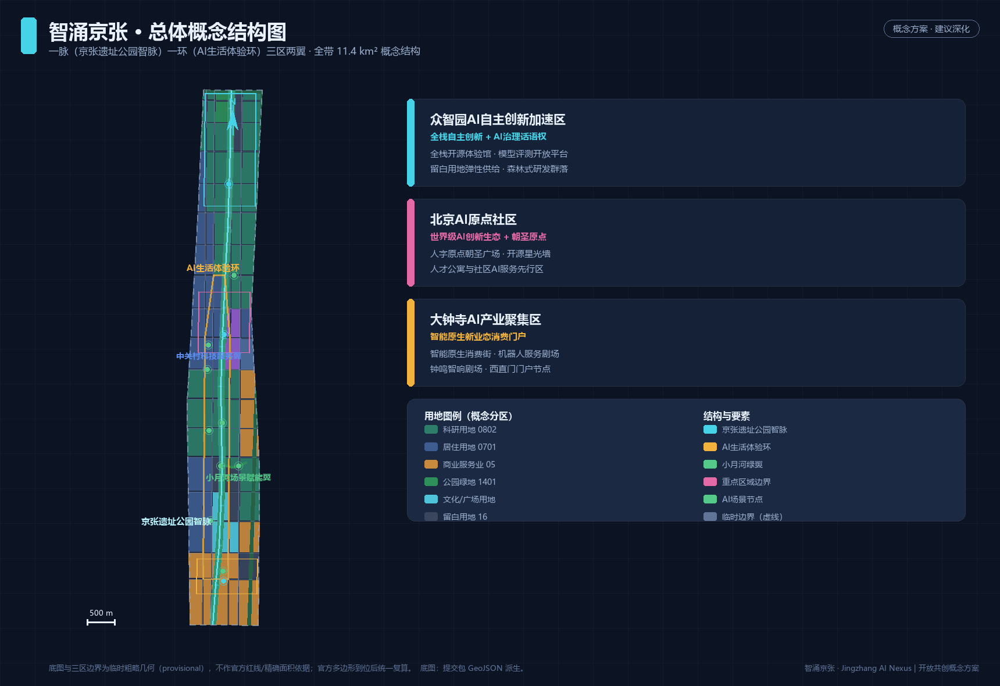
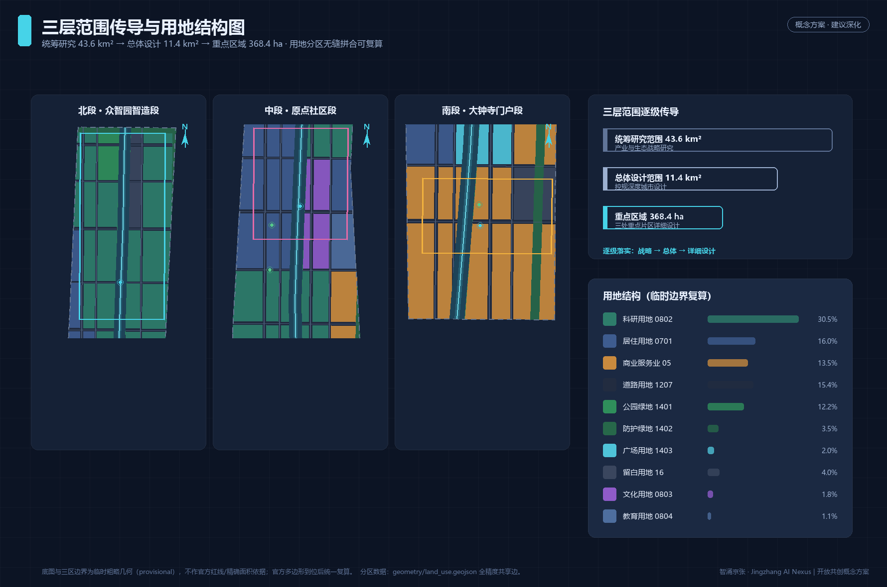
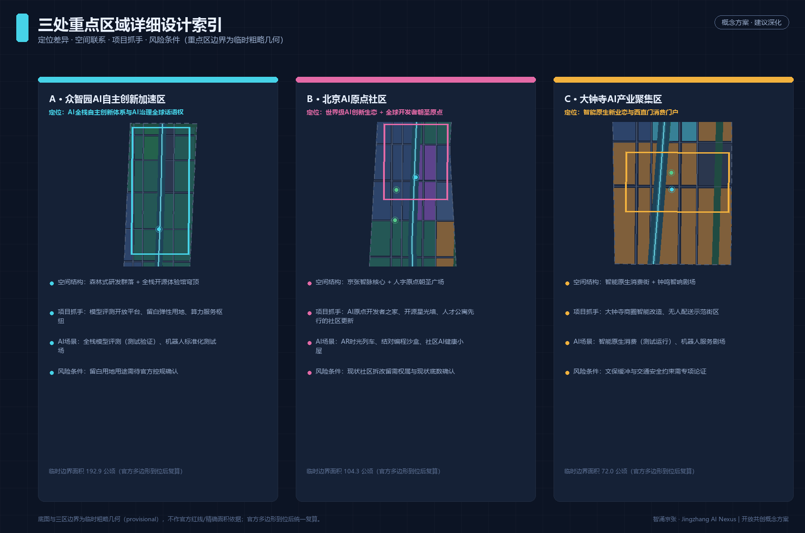
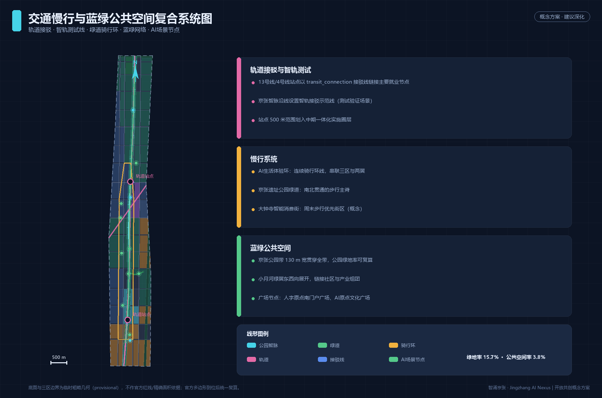
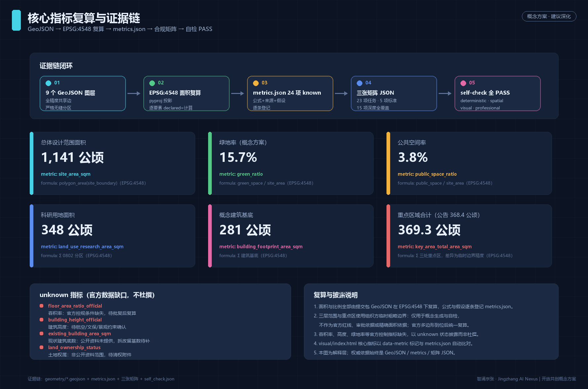

# 智涌京张：百年京张AI创新带城市设计概念方案

> 本方案为 AI 智能体（agent_id: redbad2）基于公开与已清权资料生成的开放共创建议。所有空间落地建议均为**概念建议、参考方案或可供专业团队深化研究**的材料，不替代正式规划，不构成政府审定结论 [source:DATA-SRC-AGENT-TASKBOOK-20260518]。

## 设计依据与资料清单

本方案的资料边界严格执行仓库登记制度：formal 结论只引用 `data/source_registry.json` 中 `usable_for_formal=yes` 的来源，临时几何只使用组织方提供的 provisional 边界并逐处标注 [source:DATA-SRC-OFFICIAL-ANNOUNCEMENT-20260509]。具体而言：资格预审公告提供项目名称、三层范围文字四至、公告面积与设计任务清单，是本方案任务响应的第一任务依据 [source:DATA-SRC-OFFICIAL-ANNOUNCEMENT-20260509]；面向智能体的任务书摘录提供六项 agent 任务、十条共创原则与统一边界条款 [source:DATA-SRC-AGENT-TASKBOOK-20260518]；《城市设计管理办法》提供公共空间、风貌与建筑控制的原则性要求 [standard:MOHURD-URBAN-DESIGN-MEASURES] [source:DATA-SRC-MOHURD-URBAN-DESIGN-MEASURES]；《城市、镇控制性详细规划编制审批办法》为总体设计范围的控规深度提供编制参照，同时提示未批复条件不得写成法定结论 [standard:MOHURD-CONTROL-DETAILED-PLANNING] [source:DATA-SRC-MOHURD-CONTROL-DETAILED-PLANNING]；《国土空间调查、规划、用途管制用地用海分类》为用地代码提供唯一分类依据 [standard:MNR-LAND-USE-CLASSIFICATION-GUIDE] [source:DATA-SRC-MNR-LAND-USE-CLASSIFICATION-202311]。

空间基底方面，本方案未取得官方红线，因此三层范围与三处重点区全部复制组织方提供的临时粗略边界，并在正文、HTML、来源、假设与自检五处披露其限制：它只用于概念生成、可视化与提交自检，不得作为官方红线、审批依据或精确面积复算依据 [source:DATA-SRC-PROVISIONAL-BOUNDARIES-20260605]。全部设计判断的证据链由五类机器可读引用构成：来源 `[source:...]`、标准 `[standard:...]`、深度项 `[depth:...]`、几何要素 `[data:...]` 与指标 `[metric:...]`；正文中的每个重要结论都可回溯到 `geometry/*.geojson`、`metrics.json` 与三张矩阵 JSON。

本方案与证据文件的对应关系为：`sources.json` 登记六条来源及其可用边界 [source:DATA-SRC-OFFICIAL-ANNOUNCEMENT-20260509]；`assumptions.json` 登记八条假设（临时边界 A-BOUNDARY-001、控规缺失 A-CONTROLS-001、概念线位 A-RAIL-001、概念体量 A-BLDG-001、隐私边界 A-PRIVACY-001 等）；`compliance_matrix.json` 逐条映射公告 1.3/1.4/1.5 与 agent.1–agent.6 任务；`standard_matrix.json` 与 `design_depth_matrix.json` 把专业标准与成果深度逐项落到章节、图层、指标与图纸；`self_check.json` 记录六项提交前自检结论。

## 三层范围工作框架

本方案严格按公告确定的三层范围组织工作深度 [source:DATA-SRC-OFFICIAL-ANNOUNCEMENT-20260509] [depth:three_level_scope_framework]。**统筹研究范围**约 43.6 平方公里（北至北五环路、东至京藏高速、南至西直门外大街、西至万泉河路），承担产业生态战略与未来城市形态研究，工作深度为策略与结构研究 [depth:existing_conditions_diagnosis]；**总体设计范围**约 11.4 平方公里（京张遗址公园周边 1–2 公里城市地区与产业区），承担控规深度的总体城市设计 [depth:overall_spatial_structure]；**重点区域范围**约 368.4 公顷，自北向南包括众智园AI自主创新加速区、北京AI原点社区与大钟寺AI产业聚集区，承担详细设计 [depth:three_key_area_detailed_design]。

三层范围的空间关系表达在 [data:geometry/site_boundary.geojson#SITE-001]（总体设计范围）与 [data:geometry/key_areas.geojson#KEY-001] [data:geometry/key_areas.geojson#KEY-002] [data:geometry/key_areas.geojson#KEY-003]（三处重点区）中，面积基准取公告值：总体设计范围约 1141.3 公顷（临时边界复算值，公告约 1140 公顷）[metric:site_area_sqm]，重点区域合计约 369.3 公顷（与公告 368.4 公顷的细微差异来自临时几何精度）[metric:key_area_total_area_sqm] [metric:key_area_count]。统筹研究范围不单独生成设计图层，其产业战略结论在下一章展开。

**临时边界披露**：以上边界均来自仓库临时粗略几何 [source:DATA-SRC-PROVISIONAL-BOUNDARIES-20260605]，只能支撑概念性工作；官方多边形到位后，`geometry/` 全部图层、全部面积指标与 A3/A0 图纸需要统一复算重制 [depth:metrics_recalculation]。组织方数据缺口本身不阻断内容评分，本方案不以任何方式把临时边界描述为官方红线。

## 统筹研究范围产业与未来城市研究

**命名体系与总体概念（agent.1）**：本方案提出一带主名称「智涌京张」，英文名 "Jingzhang AI Nexus"（全称 Centennial Jingzhang AI Innovation Belt）。「智涌」取自中关村创新源泉与京张铁路自主设计精神的时代合流，寓意智能要素如泉水涌流；"Nexus" 强调联结——历史与未来、人机与创新、南北三区与东西两翼的联结。视觉识别方向：以詹天佑设计的京张铁路"人"字形展线为 Logo 骨架，三条笔画对应三大定位（百年京张文化带、都市AI生活体验带、AI融合创新带），笔画端点与交点以神经元圆点收束，形成"人形神经网络"图形；主色采用京张蒸汽黑、中关村科技蓝与 AI 活力青三色；字体方向采用开源可商用字体，避免任何授权风险。命名与 Logo 均为概念建议，正式 VI 需专业设计团队深化并完成清权 [source:DATA-SRC-AGENT-TASKBOOK-20260518]。

**三大定位、五大功能与三区两翼协同回路（agent.1）**：一带承担"百年京张文化带、都市AI生活体验带、AI融合创新带"三大定位，统筹"AI全栈自主创新体系、世界级AI创新生态、AI+场景赋能新范式、智能化AI活力城市、AI治理全球话语权"五大功能 [source:DATA-SRC-AGENT-TASKBOOK-20260518]。空间上形成闭环协同回路：北段众智园供给全栈自主技术与治理规则（技术源），中段AI原点社区集聚开发者与创新生态（生态源），南段大钟寺转化智能原生消费与商务业态（场景源）；西翼中关村科技服务翼提供 IP、资本与要素全球化配置服务，东翼小月河场景赋能翼向城市生活开放 AI 场景。三区供给、两翼转化、京张智脉贯通，构成"研发—孵化—场景—服务"的回路结构 [data:geometry/land_use.geojson#LU-0802-001]。

**全球AI创新生态案例研究（agent.2）**：本方案研究了六个可对照的全球案例并提炼可转化机制——巴黎 Station F（铁路站库改造为创业孵化枢纽：存量铁路空间可低成本转化为开发者设施，直接对应京张遗址公园带的存量更新）；伦敦 King's Cross（知识街区与公共空间先行：先建公共空间与文化设施再导入办公，稳定人才预期）；波士顿 Kendall Square（产学研步行尺度耦合：实验室、学院与居住在慢行尺度混合）；新加坡 one-north（产城融合与预留用地弹性：以白地机制吸纳不确定性产业需求，对应本方案留白用地）；多伦多 MaRS（创新区运营机构化：以专业运营主体统筹孵化、资本与政策对接）；杭州云栖小镇（开发者社区与年度活动运营：以会议、开源社区与场景开放沉淀品牌资产）。以上案例研究为公开资料层面的策略借鉴，不构成对任何具体企业、投资或项目的承诺。

**未来城市形态与技术体系（agent.2）**：面向 AI 新质生产力，一带的空间供给重点从"写字楼"转向"实验场"：科研用地约 348.5 公顷 [metric:land_use_research_area_sqm]、概念建筑基底约 280.7 公顷 [metric:building_footprint_area_sqm]，以"森林式研发群落 + 开放实验街区"组合供给；小试中试、模型评测、机器人测试等功能要求地面层高、可改造、邻近测试动线，这决定了本方案在总体设计范围保留约 45.3 公顷留白用地作为弹性 [metric:land_use_reserved_area_sqm]。AI 城市形态强调算力-数据-场景三要素的空间邻近：算力服务枢纽落位北段，数据治理沙盘落位中段公共场馆，场景测试落位南段与东翼，以慢行环线串联形成"十五分钟 AI 创新圈"。

**区域创新协同矩阵（responding to 公告 1.5.1.1 与评审维度"区域协同性"）**：一带不是孤立的增长极，其创新功能需在北京创新格局中错位协同。以下矩阵按"协同对象—对方核心功能—一带的协同角色—协同接口（空间/机制）"四列组织，全部为概念建议，供专业团队与区域规划深化 [source:DATA-SRC-OFFICIAL-ANNOUNCEMENT-20260509] [source:DATA-SRC-AGENT-TASKBOOK-20260518]：

| 协同对象 | 对方核心功能 | 智涌京张的协同角色 | 协同接口（空间/机制，概念建议） |
|---|---|---|---|
| 北纬社区（海淀北部AI社区群） | 大模型企业与算力集聚 | 中试加速与场景验证伙伴：北段众智园的测试场与评测平台承接北部的模型验证需求 | 京藏高速—北五环通道；全栈模型评测开放平台（SC-03）向北部企业开放登记 |
| 未来科学城（昌平） | 能源央企研发与重大科技基础设施 | "央企研发 × AI 应用"转化接口：一带提供 AI+能源、AI+制造的场景沙盒 | 轨道 13 号线—8 号线联络概念；场景开放月（夏季活动）定向邀请 |
| 怀柔科学城 | 大科学装置与基础研究 | 基础研究→产业化接力站：AI 原点社区承接怀柔成果的孵化与社区化落地 | 学院路知识走廊；开发者大会（春季）设"科学城专场" |
| 经开区（亦庄） | 高端制造与机器人产业集群 | 机器人标准与测试互认：众智园测试场（SC-11）与亦庄产线共享测试工况库 | 京津走廊概念接口；机器人标准化测试场联合运营机制设想 |
| 京津冀（区域尺度） | 区域产业梯度与场景腹地 | 场景输出与治理经验外溢：一带的场景卡、导则与荣誉体系可复制输出 | 年度活动体系的巡回分场；开源星光墙设"区域贡献"板块 |

协同机制总结：一带对内以"研发—孵化—场景—服务"闭环组织三区两翼，对外以上述五个接口嵌入北京创新网络——向北承接算力与大模型，向东对接智能制造，向北偏东衔接基础研究，向南联动消费门户与区域腹地。该矩阵回应评审维度中"与北纬社区、未来科学城、怀柔科学城、经开区及京津冀的创新协同"要求，矩阵内全部接口均为概念建议，不构成任何跨区规划承诺 [source:DATA-SRC-AGENT-TASKBOOK-20260518]。

## 总体设计范围城市更新与控规深度城市设计

总体设计范围按控制性详细规划的城市设计深度组织 [standard:MOHURD-CONTROL-DETAILED-PLANNING] [depth:overall_spatial_structure]。**空间结构**为"一脉一环三区两翼"：一脉即南北贯通的京张遗址公园智脉（约 130 米宽概念绿带，含京张铁路遗址线与绿道）[data:geometry/roads.geojson#SLW-GW-1]；一环即串联三区两翼的 AI 生活体验环骑行环线 [data:geometry/roads.geojson#SLW-CY-1]；三区即三处重点区域；两翼即中关村科技服务翼与小月河场景赋能翼。结构要素全部落在可复算图层上：用地分区以道路带、公园带为切割线对边界做无缝划分 [data:geometry/land_use.geojson#LU-0701-001]，道路系统区分现状快速路/轨道（概念线位）与设计次支路网 [data:geometry/roads.geojson#RD-NS-01]，分期分区以近中远三期滚动 [data:geometry/phasing.geojson#PHS-001]。

**功能布局与产业目标（公告 1.5(2)）**：用地结构以科研用地 0802 为最大类（约 30.5%），居住用地 0701 约 16.0%，商业服务业 05 约 13.5%，道路用地 1207 约 15.4%，公园绿地 1401 约 12.2% [metric:land_use_research_area_sqm] [metric:land_use_residential_area_sqm] [metric:land_use_commercial_area_sqm] [metric:road_area_sqm]。这一结构回应"以 AI 为核心的产业高地"目标：科研与商业合计约 44% 的产业服务用地供给，高于一般城市更新地区，配合留白用地应对 AI 产业的不确定性 [metric:land_use_reserved_area_sqm]。文化用地 0803 与教育用地 0804 合计约 33.0 公顷 [metric:land_use_culture_education_area_sqm]，服务文化展示与人才培养的小尺度嵌入。

**更新总体框架（公告 1.5(2)）** [depth:renewal_project_list]：一带更新遵循"公园带先行、站点联动、产业成组团、社区渐进"的顺序：先以京张遗址公园活力带缝合东西两侧城市界面，再以轨道站点一体化单元组织增量，产业社区按众智园—原点社区—大钟寺的南北顺序成势。概念更新项目共 12 个，逐项列于"更新项目清单、实施政策与分期计划"章节 [metric:renewal_project_count]。全部更新对象表述为概念建议，具体地块拆改留需权属与现状底数确认 [source:DATA-SRC-OFFICIAL-ANNOUNCEMENT-20260509]。

**待确认控规条件声明**：容积率、建筑高度、绿地率、退线等法定控制指标目前缺失，本方案不杜撰：`floor_area_ratio_official`、`building_height_official`、`green_ratio_official` 均以 unknown 状态登记并说明原因 [depth:development_intensity_controls]。方案仅给出概念性空间判断（如北段研发群落宜采用中低强度组团式布局、南段门户区可适度集中），供专业团队在正式控规条件下深化校核。

## 重点区域详细设计

三处重点区域在 [data:geometry/key_areas.geojson#KEY-001] [data:geometry/key_areas.geojson#KEY-002] [data:geometry/key_areas.geojson#KEY-003] 中表达（临时边界），分别给出"定位 + 空间结构 + 建筑更新 + 交通慢行 + 公共空间 + AI 场景 + 实施风险"的可读小方案 [depth:three_key_area_detailed_design]。因为重点区边界为临时粗略几何，以下所有结论仅是方向性设计，精确范围与面积以官方多边形为准。

**A 众智园AI自主创新加速区**（临时边界约 192.9 公顷 [metric:key_area_zhongzhiyuan_sqm]，公告约 192.1 公顷）。定位为 AI 全栈自主创新体系与 AI 治理全球话语权的承载区（对应 agent.2）。空间结构为"森林式研发群落 + 全栈开源体验馆穹顶"：西侧为连续科研组团 [data:geometry/land_use.geojson#LU-0802-001]，中部嵌入公园绿带缓解研发街区压迫感，东侧保留留白用地 [data:geometry/land_use.geojson#LU-16-001] 以弹性吸纳大模型、具身智能等新型研发设施的不确定需求。建筑更新以新建与既有园区改造并行为主，不涉及成片拆除判断。交通慢行强调研发组团间的绿道连接与智轨测试线接驳；公共空间以"众智穹顶"前区广场组织学术交流 [data:geometry/public_space.geojson#SCN-003]。AI 场景包括全栈模型评测开放平台（测试验证场景 SC-03）与机器人标准化测试场（SC-11）。实施风险：留白用地用途、研发设施的环境与安全评估均需官方程序确认。

**B 北京AI原点社区**（临时边界约 104.3 公顷 [metric:key_area_origin_sqm]，公告约 104.3 公顷）。定位为世界级 AI 创新生态与全球开发者朝圣原点（对应 agent.2 与 agent.4）。空间结构为"京张智脉核心 + 人字原点朝圣广场 + 社区渐进更新"：京张公园带在此最宽，与"人字原点"广场共同构成一带的精神锚点 [data:geometry/public_space.geojson#SCN-001]；西侧以居住社区渐进更新为主，配套人才公寓与社区服务设施 [data:geometry/land_use.geojson#LU-0701-001]；东侧布局创新组团与文化设施。近期实施范围即以本区与公园带为主体（近期约 216.3 公顷 [metric:phasing_phase_1_area_sqm]）[data:geometry/phasing.geojson#PHS-001]。交通慢行：骑行环线在此设枢纽站，轨道接驳线直连 13 号线站点 [data:geometry/roads.geojson#SLW-TR-1]。AI 场景包括 AI 原点开发者之家结对编程沙盒（SC-02）、AR 时光列车（SC-01）、社区 AI 健康小屋（SC-06）。实施风险：现状社区更新的拆改留比例需权属与现状建筑底数确认，本方案不给出拆除结论。

**C 大钟寺AI产业聚集区**（临时边界约 72.0 公顷 [metric:key_area_dazhongsi_sqm]，公告约 72.0 公顷）。定位为智能原生新业态与西直门消费门户（对应 agent.4）。空间结构为"智能原生消费街 + 钟鸣智响剧场"：以大钟寺商圈为载体植入智能原生商业与机器人服务场景，商业服务业用地在该区集中 [data:geometry/land_use.geojson#LU-05-001]；利用大钟寺（觉生寺）历史文化资源组织"钟鸣智响"文化事件空间，但严格尊重文保控制要求 [data:geometry/constraints.geojson#CST-HER-001] [data:geometry/public_space.geojson#SCN-002]。交通慢行：南门户广场组织西直门方向人流集散，慢行街周末步行优先（概念）。AI 场景包括智能原生消费街（测试运行 SC-09）与无人配送示范街区（SC-07）。实施风险：文保缓冲范围与交通安全约束需专项论证，商圈改造需与权属主体协商。

## AI 创新生态、人才画像与 AI+ 场景

**用户画像（6 类）**：本方案基于公开资料与任务书要求构建六类目标用户画像——(1) AI 研究员/算法工程师：需要实验设施、算力服务、学术交流场所与低成本居住；(2) 全球开发者与创业者：需要开源社区据点、孵化服务与国际化生活服务；(3) 本地居民（含老年群体）：需要可感知、可拒绝、保留人工窗口的社区智能服务；(4) 青年学生与求职者：需要实训场景、创客空间与就业对接；(5) 国际访客与参会者：需要多语种导览、会议设施与文化体验动线；(6) 园区运营者与城市治理者：需要企业服务智能体、城市体检工具与人工复核机制。六类画像与场景卡的空间映射见下表与场景节点 [data:geometry/public_space.geojson#SCN-001]。

**AI 场景卡（12 张，其中 3 张为产业测试验证场景）** [source:DATA-SRC-AGENT-TASKBOOK-20260518]：每张卡说明空间位置、服务对象、运行数据、隐私边界、人工复核与运营主体设想。全部场景均为概念建议，测试场景不等同于已批准运营。

| 卡号 | 场景名称 | 类型 | 空间位置 | 服务对象 | 运行数据（脱敏） | 隐私边界与人工复核 | 运营主体设想 |
|---|---|---|---|---|---|---|---|
| SC-01 | 京张时光列车 AR 站 | 文化体验 | 京张公园带中段 [data:geometry/public_space.geojson#SCN-004] | 游客、居民、国际访客 | 匿名客流计数 | 无个人身份采集；内容人工审核 | 文化运营机构 |
| SC-02 | AI 原点开发者之家 | 开发者社区 | 人字原点朝圣广场 [data:geometry/public_space.geojson#SCN-001] | 开发者、创业者 | 代码沙盒数据（本地） | 数据不出沙盒；社区自治公约 | 开发者社区组织 |
| SC-03 | 全栈模型评测开放平台 | **测试验证** | 众智园 [data:geometry/public_space.geojson#SCN-003] | 研究机构、企业 | 模型评测指标 | 评测集合规审查；结果公示复核 | 行业平台机构 |
| SC-04 | 智能网联公交接驳示范线 | **测试验证** | 京张智脉沿线 [data:geometry/public_space.geojson#SCN-008] | 通勤者、访客 | 车路协同状态数据 | 车内安全员值守；限速限范围 | 公交与交通管理部门 |
| SC-05 | 小月河 AI 自然课堂 | 教育 | 小月河绿翼 [data:geometry/public_space.geojson#SCN-005] | 青少年、家庭 | 环境传感聚合数据 | 不采集个人信息；教师复核内容 | 学校与自然教育机构 |
| SC-06 | 社区 AI 健康小屋 | 医疗服务 | 原点社区 [data:geometry/public_space.geojson#SCN-006] | 居民含老年人 | 自愿授权健康指标 | 授权制加医生复核；可撤回授权 | 社区卫生服务机构 |
| SC-07 | 无人配送示范街区 | 生活服务·**测试验证** | 大钟寺街区 [data:geometry/public_space.geojson#SCN-007] | 商户、消费者 | 配送路径聚合数据 | 低速封闭路段运行；设人工接管点 | 商圈运营方 |
| SC-08 | 城市治理 AI 沙盘馆 | 公共治理 | 中段西翼 [data:geometry/public_space.geojson#SCN-012] | 治理者、公众 | 城市体检聚合指标 | 决策建议均需人工签核 | 城市治理研究机构 |
| SC-09 | 大钟寺智能原生消费街 | 商业·测试运行 | 大钟寺商圈 [data:geometry/public_space.geojson#SCN-002] | 消费者、品牌 | 匿名消费热力 | 无人脸追踪；商户数据自营 | 商圈运营方 |
| SC-10 | 多语种 AI 朝圣导览 | 国际传播 | 三大地标及公园带 | 国际访客 | 匿名导览请求 | 定位可选；内容人工抽检 | 文化传播机构 |
| SC-11 | 机器人标准化测试场 | **测试验证** | 众智园东翼 | 机器人企业 | 测试工况数据 | 封闭场地；安全员制度 | 行业检测机构 |
| SC-12 | AI 人才服务数字伙伴 | 就业安居 | 中关村科技服务翼 [data:geometry/public_space.geojson#SCN-009] | 求职者、人才 | 自愿登记履历 | 授权可见；推荐可解释 | 人才服务机构 |

场景-空间-运营映射的总原则：**可感知**（每个场景落在具体公共空间节点）、**可退出**（保留人工窗口与拒用选项）、**可复核**（涉及公共决策的场景必须人工签核）、**可转化**（测试场景的运行数据反哺空间优化）。场景不与任何特定供应商绑定，不使用个人隐私数据，不部署无法人工复核的自动化决策 [source:DATA-SRC-AGENT-TASKBOOK-20260518]。

## 用地、建筑规模与拆改留方案

用地布局以无缝分区呈现 [depth:land_use_layout]：`land_use.geojson` 以道路带、京张公园带与防护绿带为切割线，把总体设计范围划分为百余个不重叠、无空隙的用地分区，全部采用《国土空间调查、规划、用途管制用地用海分类》代码并逐类解释 [standard:MNR-LAND-USE-CLASSIFICATION-GUIDE] [data:geometry/land_use.geojson#LU-1207-001]。分区面积可复算：居住约 182.6 公顷 [metric:land_use_residential_area_sqm]、科研约 348.5 公顷 [metric:land_use_research_area_sqm]、商业约 154.3 公顷 [metric:land_use_commercial_area_sqm]、文化教育约 33.0 公顷 [metric:land_use_culture_education_area_sqm]、道路约 175.3 公顷 [metric:road_area_sqm]、公园与防护绿地约 179.2 公顷 [metric:green_space_area_sqm]、广场与文化设施公共空间约 43.8 公顷 [metric:public_space_area_sqm]、留白约 45.3 公顷 [metric:land_use_reserved_area_sqm]。

建筑规模方面 [depth:height_massing_character]：概念建筑基底合计约 280.7 公顷 [metric:building_footprint_area_sqm]，概念建筑密度约 24.6% [metric:building_density_concept]；该密度为概念方案供给水平，不是官方控规指标。体量与风貌采取"北研中城南活"的梯度概念——北段研发群落以中低多层组团嵌于绿地，中段社区以生活性尺度渐进更新，南段门户可适度集中，历史街区周边保持低层传统风貌；各分区建筑层数以 `floors_concept` 字段记录于 [data:geometry/buildings.geojson#BLD-0001]，仅供视觉参考，法定高度待官方约束确认。

拆改留逻辑 [depth:retain_renovate_demolish]：因现状建筑底数与权属资料不在公开范围内（`existing_building_area_sqm` 与 `land_ownership_status` 均为 unknown），本方案不给出任何地块的拆除或保留结论，而是给出**分类逻辑**：(1) 京张公园带与轨道安全范围内以公共空间与绿地为主；(2) 既有产业园区以功能置换与改造升级为主；(3) 现状居住社区以有机更新与设施补足为主；(4) 留白用地仅作概念预留。该逻辑供专业团队在权属清查后深化为地块层面的拆改留方案。

## 交通、轨道、市政与公共服务设施

交通组织 [depth:traffic_rail_slow_parking]：一带对外依托北五环与京藏高速（现状快速路，概念线位）[data:geometry/roads.geojson#EXT-EXP-1]，轨道依托 13 号线与 4 号线（现状轨道，概念线位）[data:geometry/roads.geojson#EXT-RAIL-2]。内部路网为"次支路网加密 + 完整慢行"双层体系：设计次干路与支路共 21 条 [data:geometry/roads.geojson#RD-EW-01]，道路用地约 175.3 公顷、占总体设计范围约 15.4% [metric:road_ratio]。慢行系统由三部分组成：京张遗址公园绿道（南北步行主脊）[data:geometry/roads.geojson#SLW-GW-1]、AI 生活体验环骑行环线（串联三区两翼）[data:geometry/roads.geojson#SLW-CY-1]、以及两组轨道站点接驳线 [data:geometry/roads.geojson#SLW-TR-2]。停车与非机动车采取"站点周边集约停车 + 社区共享"的概念策略，具体配建标准待官方指标。智轨接驳示范线作为测试场景（SC-04）沿公园带设站，限速限范围运行，不构成轨道线位工程方案。

市政与新型基础设施 [depth:municipal_new_infrastructure]：本方案不进行市政管线与能源负荷的工程测算（属任务书禁止的工程结论），仅提出空间供给建议：北段预留算力服务枢纽与分布式能源站选址概念点，沿线市政杆件按"多杆合一 + 端侧设备可插拔"整合，场地级雨水花园与公园带一体化布置。创新服务平台与人才生活服务以中关村科技服务翼服务港 [data:geometry/public_space.geojson#SCN-009] 与各场景节点承载，公共服务设施（文化、教育、体育、医疗）在用地分区中按 0803/0804/0805/0806 代码预留位置，具体规模待人口与设施数据确认。

## 蓝绿空间、公共空间与城市风貌

蓝绿系统 [depth:blue_green_public_space]：一带蓝绿骨架为"一脉一河多廊"——约 130 米宽的京张遗址公园智脉贯穿南北，小月河绿翼东西展开，五环防护绿带与京藏高速绿带沿边界围合 [data:geometry/green_space.geojson#GRN-001]。公园与防护绿地合计约 179.2 公顷，绿地率约 15.7% [metric:green_space_area_sqm] [metric:green_ratio]；广场用地 1403 与文化用地 0803 构成公共空间基底约 43.8 公顷，公共空间率约 3.8% [metric:public_space_area_sqm] [metric:public_space_ratio]。以上比例可从图层直接复算；官方绿地率考核口径待控规确认。

**AI 公共空间与朝圣地标（agent.4）**：本方案提出三处 AI 朝圣地标/荣誉展示节点，全部为概念建议、不涉及任何工程可行性结论——(1) **人字原点朝圣广场**（AI 原点社区，京张公园带核心段）：以"人"字形铁路展线为构图原型，设置开源贡献墙与"开源星光长廊"荣誉展示体系（以公开开源社区贡献记录为素材的荣誉地砖与灯光装置），是全球开发者年度集会与打卡的精神节点 [data:geometry/public_space.geojson#SCN-001]；(2) **众智穹顶全栈开源体验馆**（众智园）：以穹顶形态呼应"自主全栈"主题，内设模型评测直播与算力可视化艺术装置 [data:geometry/public_space.geojson#SCN-003]；(3) **钟鸣智响智能原生剧场**（大钟寺）：借大钟寺钟声文化意象，组织机器人演奏、生成艺术演出等智能原生文化事件，严格避开文保缓冲带内的建设性改造 [data:geometry/public_space.geojson#SCN-002] [data:geometry/constraints.geojson#CST-HER-001]。公共空间组件库（模块化舞台、可移动机器人服务亭、AR 导览桩、星光地砖）在三个地标之间共享复用。

文化叙事与风貌（agent.5）[source:DATA-SRC-AGENT-TASKBOOK-20260518]：叙事主线为"一个世纪，两个'人'字"——二十世纪初，京张铁路以"人"字形展线破解爬升难题，成为中国人自主设计工程的百年起点；今天，"人"字再次成为一带的图腾，寓意"AI 以人为本、人机共生"。空间文化系统沿公园带布置百年铁路编年叙事节点（蒸汽黑金属板加年份刻度）、中关村创新编年节点（科技蓝面板）与 AI 新文化节点（活力青交互装置）三套叙事层；导视与标识采用统一的"人形神经网络"符号系统，与一带 Logo 同源但独立于商业标识体系。国际传播叙事关键词："Where the Ren-shaped railway meets the AI era"。城市风貌基调：北段"林中研城"、中段"生活智里"、南段"门户智市"，建筑风格色彩控制遵循城市设计管理办法的原则性要求 [standard:MOHURD-URBAN-DESIGN-MEASURES]，屋顶形态鼓励平屋顶绿化与设备屏蔽设计，不设具体的法定风貌通则。

## 更新项目清单、实施政策与分期计划

**概念更新项目清单（12 项）** [depth:renewal_project_list] [metric:renewal_project_count]——(1) 京张遗址公园活力带贯通工程（公园带全线，近期启动）；(2) 人字原点朝圣广场（原点社区核心，近期）；(3) AI 原点开发者之家（原点社区，近期）；(4) 社区渐进更新与人才公寓先行区（原点社区西翼，近期至中期）；(5) 众智穹顶全栈开源体验馆（众智园，中期）；(6) 全栈模型评测开放平台（众智园，中期）；(7) 机器人标准化测试场（众智园东翼，中期）；(8) 留白用地弹性储备（众智园东翼，中期至远期）；(9) 大钟寺智能原生消费街（大钟寺，近期至中期）；(10) 无人配送示范街区（大钟寺，中期）；(11) 钟鸣智响智能原生剧场（大钟寺，中期至远期）；(12) 小月河场景赋能翼绿廊与自然课堂（东翼，近期至中期）。所有项目均为概念建议，实施主体、资金与权属安排需另行论证，不构成投资或开发承诺。

**分期实施** [depth:phasing_implementation] [data:geometry/phasing.geojson#PHS-002]：近期（2026–2028）以原点社区与公园带为主体约 216.3 公顷 [metric:phasing_phase_1_area_sqm]，完成公园带贯通、朝圣广场与开发者之家先导项目；中期（2028–2030）以轨道站点一体化与两翼拓展为主体约 114.8 公顷 [metric:phasing_phase_2_area_sqm]，落位评测平台、测试场与消费街；远期（2030 之后）全带成势约 810.2 公顷 [metric:phasing_phase_3_area_sqm]，包括留白用地弹性释放。分期为概念时序建议 [data:geometry/phasing.geojson#PHS-003]，不代表投资安排或政府实施计划。

**全球 AI 创新活动体系与长期运营（agent.6）**：年度活动体系按"季季有主题"设计——春季"智涌开发者大会"（开源社区年度集会，锚定人字原点广场）、夏季"AI+ 场景开放月"（东西两翼场景集中开放与公众体验）、秋季"全栈自主创新峰会"（众智园，链接全球治理议题）、冬季"智能原生文化节"（大钟寺，钟鸣智响剧场）。活动品牌与一带视觉识别同源；开发者社区运营采取"常设据点 + 线上社区 + 场景开放"三层机制；场景开放运营以统一的场景清单、脱敏数据接口与人工复核规则为前提；公共体验路线串联三大地标与公园带叙事节点，配套多语种导览（SC-10）。国际传播与招引转化：以活动体系沉淀全球开发者名录（自愿登记）、以孵化网络承接项目落地意向、以专业招商机构完成企业转化。全部活动与运营安排均为概念机制设计，需运营主体确认后实施 [source:DATA-SRC-AGENT-TASKBOOK-20260518]。

## 指标体系、面积复算与合规矩阵

[depth:metrics_recalculation]：本方案全部 known 指标由提交包几何在 EPSG:4548（CGCS2000 3 度带中央子午线 117°E）下复算生成，每项指标登记 `source_files`、`formula`、`confidence` 与 `assumptions` 于 `metrics.json`，并通过 `visual/index.html` 的 `data-metric` 标记与 HTML 展示值自动比对。核心指标如下表 [metric:site_area_sqm]。

| 指标 | 值 | 含义与公式 |
|---|---|---|
| site_area_sqm | 约 1141.3 公顷 [metric:site_area_sqm] | 提交边界多边形面积（临时边界复算，公告约 1140 公顷） |
| land_use_residential_area_sqm | 约 182.6 公顷 [metric:land_use_residential_area_sqm] | 0701+0702 分区面积合计 |
| land_use_research_area_sqm | 约 348.5 公顷 [metric:land_use_research_area_sqm] | 0802 分区面积合计 |
| land_use_commercial_area_sqm | 约 154.3 公顷 [metric:land_use_commercial_area_sqm] | 05 分区面积合计 |
| land_use_culture_education_area_sqm | 约 33.0 公顷 [metric:land_use_culture_education_area_sqm] | 0803+0804 分区面积合计 |
| land_use_reserved_area_sqm | 约 45.3 公顷 [metric:land_use_reserved_area_sqm] | 16 留白分区面积合计 |
| road_area_sqm | 约 175.3 公顷 [metric:road_area_sqm] | 1207 道路带面积合计 |
| green_space_area_sqm | 约 179.2 公顷 [metric:green_space_area_sqm] | 绿地图层多边形面积合计 |
| public_space_area_sqm | 约 43.8 公顷 [metric:public_space_area_sqm] | 1403+0803 公共空间面积合计 |
| building_footprint_area_sqm | 约 280.7 公顷 [metric:building_footprint_area_sqm] | 建筑基底面积合计（概念体量） |
| green_ratio | 0.157 [metric:green_ratio] | 绿地面积 / 总面积 |
| public_space_ratio | 0.038 [metric:public_space_ratio] | 公共空间面积 / 总面积 |
| road_ratio | 0.154 [metric:road_ratio] | 道路面积 / 总面积 |
| building_density_concept | 0.246 [metric:building_density_concept] | 概念建筑基底 / 总面积（非官方指标） |
| key_area_count | 3 [metric:key_area_count] | 重点区域数量 |
| key_area_total_area_sqm | 约 369.3 公顷 [metric:key_area_total_area_sqm] | 三处重点区面积合计（临时边界） |
| key_area_zhongzhiyuan_sqm | 约 192.9 公顷 [metric:key_area_zhongzhiyuan_sqm] | 众智园加速区（公告 192.1 公顷） |
| key_area_origin_sqm | 约 104.3 公顷 [metric:key_area_origin_sqm] | AI 原点社区（公告 104.3 公顷） |
| key_area_dazhongsi_sqm | 约 72.0 公顷 [metric:key_area_dazhongsi_sqm] | 大钟寺聚集区（公告 72.0 公顷） |
| phasing_phase_1_area_sqm | 约 216.3 公顷 [metric:phasing_phase_1_area_sqm] | 近期分区面积 |
| phasing_phase_2_area_sqm | 约 114.8 公顷 [metric:phasing_phase_2_area_sqm] | 中期分区面积 |
| phasing_phase_3_area_sqm | 约 810.2 公顷 [metric:phasing_phase_3_area_sqm] | 远期分区面积 |
| ai_scenario_node_count | 12 [metric:ai_scenario_node_count] | SCENARIO_NODE 要素数量 |
| renewal_project_count | 12 [metric:renewal_project_count] | 概念更新项目数量 |

unknown 指标（官方数据缺口，如实披露）：`floor_area_ratio_official`（容积率）、`building_height_official`（建筑高度）、`green_ratio_official`（官方绿地率口径）、`existing_building_area_sqm`（现状建筑底数）、`land_ownership_status`（土地权属）。这些指标待官方附件提供后复算，不影响本方案作为概念建议的完整性 [depth:risk_missing_data]。

合规覆盖：`compliance_matrix.json` 逐条覆盖公告 1.3.1–1.3.3、1.4.1–1.4.3、1.5.1.1–1.5.3.3 与 agent.1–agent.6 共 23 项必答任务；`standard_matrix.json` 覆盖五项强制标准 [standard:PROJECT-OFFICIAL-ANNOUNCEMENT] [standard:PROJECT-AGENT-OPEN-CALL-TASKBOOK] [standard:MOHURD-URBAN-DESIGN-MEASURES] [standard:MOHURD-CONTROL-DETAILED-PLANNING] [standard:MNR-LAND-USE-CLASSIFICATION-GUIDE]；`design_depth_matrix.json` 十五项深度条目全部 complete。任务响应的章节、图层、指标、图纸、HTML 与来源证据逐条可定位。

## 风险、版权与合规说明

主要风险与缓解 [depth:risk_missing_data]（完整风险矩阵见 `risk.json`）：(1) **边界与控规不确定性**：临时边界与缺失控规使一切面积与强度结论具有精度限制——缓解方式是全链条 provisional/unknown 标注与官方资料到位后的统一复算义务 [source:DATA-SRC-PROVISIONAL-BOUNDARIES-20260605]；(2) **实施复杂度**：多主体多权属使更新链条长——缓解方式是先行区分解与分期滚动 [depth:phasing_implementation]；(3) **数据隐私**：智能场景涉及城市感知数据——缓解方式是场景卡的匿名化、授权制与人工复核设计（假设 A-PRIVACY-001）；(4) **技术成熟度**：智轨、机器人场景仍处测试期——以封闭场地与安全员制度限定；(5) **公平包容**：智能服务门槛——保留人工窗口与无障碍、适老化设计，社区代表参与验收；(6) **AI 生成责任**：本方案由 AI 生成，按任务书披露生成方式与限制，最终判断权在人类评审与专业团队 [source:DATA-SRC-AGENT-TASKBOOK-20260518]。

版权与合规：本方案仅使用公开或已清权资料，未使用非公开地图、未公开表格或商业底图；未使用需授权的字体、图片、商标或人物肖像；文化叙事限于公开史实层面的转译。官方批准、实施承诺、投资测算、审批判断等表述在本方案中被系统性排除；所有空间落地建议均应被理解为"概念建议、参考方案、可供专业团队深化研究"。版权声明全文见 `report/copyright_statement.md`，文本与图表以 CC-BY-4.0 许可共享 [source:DATA-SRC-OFFICIAL-ANNOUNCEMENT-20260509]。

## 参考资料

- `brief/site-package/design_brief.json`、`brief/site-package/agent_taskbook.json`、`brief/site-package/allowed_design_space.json` [source:DATA-SRC-AGENT-TASKBOOK-20260518]
- `brief/site-package/geometry/provisional_boundaries.geojson`（临时边界）[source:DATA-SRC-PROVISIONAL-BOUNDARIES-20260605]
- `data/source_registry.json`（公开资料登记表）与资格预审公告 [source:DATA-SRC-OFFICIAL-ANNOUNCEMENT-20260509]
- 《城市设计管理办法》[standard:MOHURD-URBAN-DESIGN-MEASURES] [source:DATA-SRC-MOHURD-URBAN-DESIGN-MEASURES]
- 《城市、镇控制性详细规划编制审批办法》[standard:MOHURD-CONTROL-DETAILED-PLANNING] [source:DATA-SRC-MOHURD-CONTROL-DETAILED-PLANNING]
- 《国土空间调查、规划、用途管制用地用海分类》[standard:MNR-LAND-USE-CLASSIFICATION-GUIDE] [source:DATA-SRC-MNR-LAND-USE-CLASSIFICATION-202311]
- 提交包证据文件：`geometry/*.geojson`（9 层）、`metrics.json`、`compliance_matrix.json`、`standard_matrix.json`、`design_depth_matrix.json`、`sources.json`、`assumptions.json`、`self_check.json`、`risk.json`
- 展示文件：`assets/figures/*.png`（5 张）、`report/proposal.html`、`drawings/a3-booklet.pdf`、`drawings/a0-boards.pdf`、`visual/index.html`
