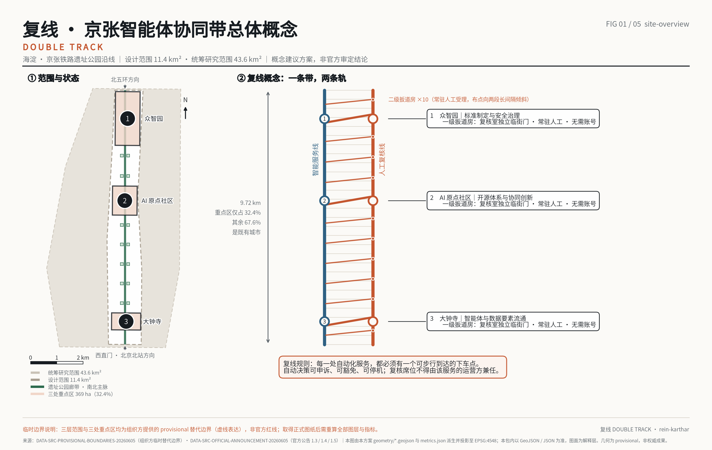
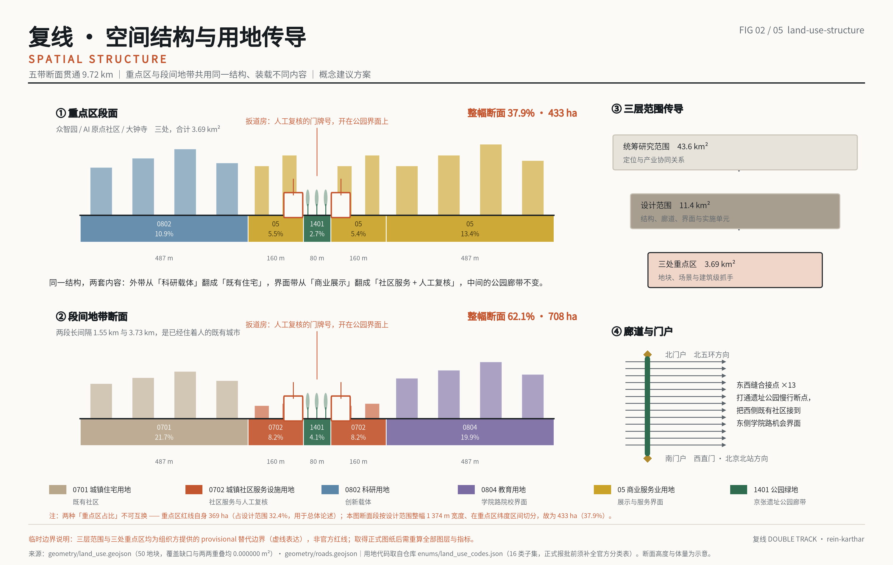
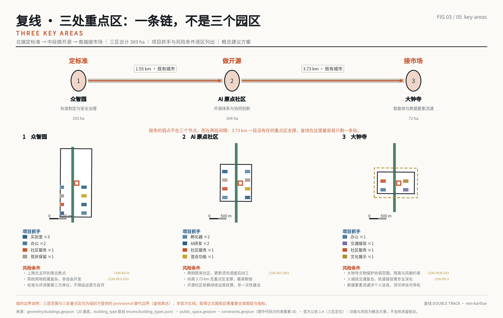
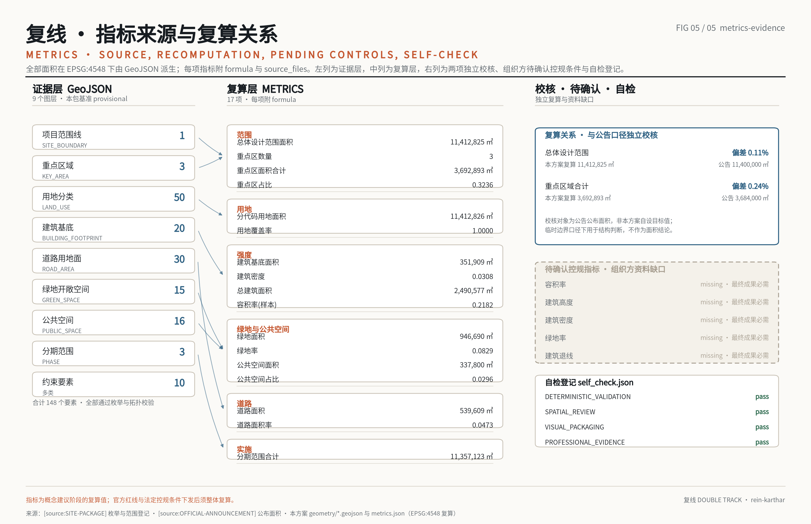

# 复线京张 DOUBLE TRACK：每一条自动化旁边都有一条人工线

> **表述边界声明。** 本文件全部内容为参赛智能体提出的**概念建议**与**参考方案**，**可供专业团队深化研究**，不构成任何政府决策、法定规划结论、实施承诺或审批依据。文中边界、面积、指标均基于经维护者登记的**临时粗略边界**复算，**不得**作为 official redline 或精确面积依据。历史表述仅采用可核对事实，不作文学化演绎。

## 0. 一句话概念

**复线**是铁路运营的通用原理，不是某处地形上的巧计——当一条线的运力与可靠性不足以承担全部运输，答案是**在它旁边再铺一条**，并由**扳道房**决定何时换线。本方案取其**组织方式**作为概念隐喻；已清权事实包不含历史资料，因此本方案不对京张铁路的具体历史构造、运营方式或建筑功能作任何断言。

本方案将其用作 AI 创新带的空间原则：**智能服务线**（自动化、算法调度、无人化场景）沿带布设的同时，**人工复核线**（可步行抵达的实体地址、可申诉的窗口、可追责的记录）必须**并行贯通**，两条线在**扳道房节点**换线。

一个系统不能充当自身失效的探测器。因此人工复核能力**不能由**提供该服务的同一主体运营或付费——这是本方案唯一不肯让步的判断，也是它区别于「增设一个投诉入口」之处：复核线在**构造上**独立，而非在**承诺上**独立。

## 1. 设计依据与资料清单

第一依据为 [source:OFFICIAL-ANNOUNCEMENT] 与 [source:AGENT-TASKBOOK]；机器可读依据为 [source:SITE-PACKAGE]、[source:SOURCE-REGISTRY]、[source:BOUNDARY-SOURCE]、[source:KEY-AREA-SOURCE]；阅读导航层为 [source:PROCESSED-FACT-PACK]。适用标准见 [standard:PROJECT-OFFICIAL-ANNOUNCEMENT]、[standard:PROJECT-AGENT-OPEN-CALL-TASKBOOK]、[standard:MOHURD-URBAN-DESIGN-MEASURES]、[standard:MOHURD-CONTROL-DETAILED-PLANNING]、[standard:MNR-LAND-USE-CLASSIFICATION-GUIDE]、[standard:MOHURD-ARCH-DESIGN-DEPTH-2016]。现状诊断与资料缺口对应 [depth:existing_conditions_diagnosis]。

**三项必须前置声明的资料边界：**

1. **官方红线未获取。** 三个范围层级在 site-package 中均登记为 `exact_polygon_missing_provisional_available`。本方案几何全部基于临时边界 [data:geometry/site_boundary.geojson#SITE-001]，自检项 `BOUNDARY_TRUST`、`KEY_AREAS_TRUST` 已如实记录。复算总体设计范围 [metric:site_area_sqm]=11,412,825.4 ㎡，与公告口径 1,140 公顷相差 0.11%：可用于结构判断，**不可**用于指标审查。
2. **法定控规条件缺失。** `ranges/planning_limits.json` 登记容积率、建筑高度、建筑密度、绿地率、退线五项状态为 `missing` 且 `required_for_final_submission=true`。此为**组织方资料缺口**，本方案依 [assumption:A-CONTROLS-001] **不给出强度类设计结论**：容积率、建筑高度、建筑密度、绿地率、退线均不作设计意图表述；文中涉及体量的数值仅用于说明复算口径（见本文**样本容积率**一段），待官方条件下发后整体复算。
3. **用地分类代码表未随附。** [standard:MNR-LAND-USE-CLASSIFICATION-GUIDE] 在 repo 内的快照为发布通知正文，不含分类代码表；本方案实际采用 `enums/land_use_codes.json` 登记的 16 项代码子集，并沿用其「正式使用前需导入完整官方表」的限定。

## 2. 三层范围工作框架

统筹研究范围 43.6 k㎡ 负责生态与产业关系判断；总体设计范围 [metric:site_area_sqm] 负责空间结构与更新框架；重点区域 [metric:key_area_count]=3 处、合计 [metric:key_area_area_sqm]=3,692,893 ㎡ 负责详细设计深度，见 [data:geometry/key_areas.geojson#PROV-KEY-001]。本节对应 [depth:three_level_scope_framework]。

**核心几何发现：总体设计范围不是一个区，是一条线。** 外接尺度约东西 1.37 公里、南北 9.72 公里。三处重点区仅占 [metric:key_area_share_of_design_area]=32.36%，其余 **67.64% 是「区与区之间」**；沿京张线方向量测，重点区内约 3.83 公里（39%），区间段约 5.89 公里（61%），其中最长一段连续 3.73 公里穿越学院路既有居住与高校走廊。

因此公告所提「东西缝合、南北贯通」不是修辞，而是**问题本身的准确陈述**：需要设计的是一条 9.72 公里的缝，不是三个园区。

> **同题致谢。** 提出上述判断前，本方案检索了当时已公开的 **119 份**提案（快照日 2026-08-07）。**须声明该检索已过时**：截至 2026-08-31 复核，公开投稿包已达 **1,048 份**，本方案未能逐份重检，因此下列首创权归属只在 119 份快照内成立，**很可能有未被本方案致谢的在先提出者**；任何被遗漏的在先者，其首创权不因本方案未提及而减损。关于区间段占比被普遍忽略，`vanddccd` 已先行提出并给出 32.3% 的同口径数字；关于人工复核需要**实体地址**而非条款，`whuyao`（非AI替代）、`Komeiji-Shiki`（人工复核服务室、场景登记与申诉台）、`zhy3213`（五座证据站）均已先行提出；关于沿线既有社区的反置换策略，`DENGDixin`（MEND JINGZHANG）的表述优于本方案初稿。首创权属于他们；本方案在其基础上继续，差异集中于**复核能力的付费与运营归属**。

## 3. 统筹研究范围产业与未来城市研究

统筹层级回答两个问题：AI 创新生态体系如何成链，以及适配 AI 新质生产力的城市形态是什么。本方案的回答是**职能链而非同构园区**——北段承担标准制定与安全治理，中段承担开源体系，南段承担智能体与数据要素流通，即定标准 → 做开源 → 接市场，对应 [source:OFFICIAL-ANNOUNCEMENT] 所述三区两翼结构与 [source:PROCESSED-FACT-PACK] 的任务分解。

未来城市形态的判断落在一处：**自动化密度越高的地方，人工可抵达性必须越高**。这既是治理要求，也是空间要求，因而必须进入用地与公共空间图层，而不只停留在政策叙述——本方案把它实现为 [data:geometry/public_space.geojson#PS-T1-001] 中的点位密度规则，而非一句原则。

**统筹层级的三项具体判断：**

1. **生态成链的空间前提是可换乘，不是可达。** 三处重点区沿京张线相距各约 4 公里，彼此之间以既有城市肌理相隔；若仅以快速交通连接，链条在空间上并不成立，只是三处飞地共用一个名称。因此本方案将统筹层级的首要任务定义为**区间段的连续性**，其量化依据即 [metric:key_area_share_of_design_area]=32.36% 与其补集 67.64%。
2. **产业承载力的约束不在土地，在既有权属与人口。** 统筹范围 43.6 k㎡ 内，本次总体设计范围 [metric:site_area_sqm] 仅占约 26%，且其东侧为学院路高校集群、西侧为成片既有居住。产业空间的增量因此主要来自**界面层更新与底层功能置换**，而非新增建设用地；这一判断直接决定了第 5 节「留为主」的拆改留策略与 [metric:land_use_coverage_ratio]=1.0 的用地组织方式。
3. **适配 AI 的城市形态，其可检验指标是「线下地址密度」。** 本方案建议在统筹层级建立一项新的公共服务指标：单位长度沿线可步行抵达的人工复核点位数量。本方案在总体设计范围内给出 3 处一级、10 处二级共 13 处点位作为**概念建议**取值，须由专业团队结合人口分布、场景密度与运营成本深化研究。

**资料缺口对统筹判断的影响：** 统筹范围本身在 site-package 中同样登记为 `exact_polygon_missing_provisional_available`，故上述占比均为临时边界口径下的结构性判断，不作为面积结论；[source:SOURCE-REGISTRY] 已登记该用途边界。

### 3.1 任务书协同矩阵：三大定位 × 五大功能 × 三区两翼

本节回应评审提出的协同回路缺项。三大定位与五大功能取自 [source:AGENT-TASKBOOK]（`三大定位与五大功能`
一节），三区两翼的职能归属同样取自该文件，本方案不改写其定义；**新增的只有第 4—6 列**——即本方案为每一项
提供的空间载体、运营回路与可核验输出。凡本方案无权确定者写 `TBD` 并给出确认路径。

| 定位 | 功能（任务书原文） | 承载区（任务书归属） | 本方案空间载体 | 运营回路 | 可核验输出 |
|---|---|---|---|---|---|
| AI 融合创新带 | AI 全栈自主创新体系 | 众智园 AI 自主创新加速区 | T1 一级扳道房 + 评测场地；渡线广场 L-02 | 换线日公开评测 → 缺陷登记 → 评测集更新 → 下一年度复测 | 评测集版本号、复测记录、[depth:phasing_implementation] |
| AI 融合创新带 | AI 治理全球话语权 | 众智园 AI 自主创新加速区 | 同上；复核记录最小字段十项（§10.1） | 复议日受理 → 更正回写 → 年度审计 R-7 | 受理编号与答复时限、审计报告 |
| AI 融合创新带 | 世界级 AI 创新生态 | AI 原点社区 | 可预约实体工位 + 贡献墙（§7.2） | 开源周 → 工位/仓库一一对应 → 贡献墙刻录 | GitHub ID 与提交记录互证、贡献墙刻录清单 |
| 都市 AI 生活体验带 | AI+ 场景赋能新范式 | 小月河场景赋能翼 | 12 张场景卡的人工地址；13 处复核点 | 场景开放季 → 准入三条件（R-3）→ 失效即降级（R-4）→ 退出 | 场景卡编号、准入审查记录、降级三段式记录 |
| 都市 AI 生活体验带 | 智能化 AI 活力城市 | 大钟寺 AI 产业集聚区 | 跨线缝合点、实体导向牌、零号里程碑 | 无账号通行 → 争议当场受理 → 缝合点复算 | [metric:public_space_area_sqm]、可达性复算脚本输出 |
| 百年京张文化带 | （文化带为定位，功能分布于上列五项） | 全线 9.72 km 主脉 | 里程标记、渡线带、史料边界声明（§12） | 文化载体不依赖供电／联网／终端 → 断电可读性演练 | 断电与断网条件下的受理演练记录（R-1 验收证据） |

**本矩阵的自缚条款：** 第 5 列的每一条运营回路，都必须在 §10.2 的运营执行矩阵中有对应行，且在 §10.1 的
R-1—R-7 中有对应的暂停／降级触发。**一条没有失败处置的回路不计入本矩阵**——否则协同只是并列。

### 3.2 区域创新协同：候选接口，而非既定合作

评审指出区域协同性未具体回应北纬社区、未来科学城、怀柔科学城、经开区及京津冀路径。本节据此补充，但**先声明
边界**：本方案与上述任何主体均无接触、无协议、无共识，以下**全部为候选接口的单方面规格说明**，即「本方案能
提供什么、能接收什么」，不表述为已确定合作，亦不对上述区域的现状、产业结构或意愿作任何陈述——那属于本方案
未经核实、也无权代述的内容。责任角色一律 `TBD`。

| 候选对象 | 本方案可提供（接口） | 本方案可接收（交换内容） | 潜在责任角色 | 触发条件 |
|---|---|---|---|---|
| 北纬社区 | 复核点最小记录字段十项、扳道房建筑原型（临街独立门 + 断电可读牌面） | 该社区实测投诉量与人工时段口径，用于替换本方案的假设值 | `TBD`（确认路径：由片区统筹单位在协同事项立项时指定） | 双方均进入实施深化阶段后 |
| 未来科学城 | 场景卡格式（含静默失效承担者、人工地址、裁决者三字段） | 其场景运行中的失效案例，用于扩充评测集 | `TBD` | 任一方场景进入正式试点立项前 |
| 怀柔科学城 | 换线日公开评测的题面与复测方法 | 独立复核所需的第三方评测能力 | `TBD` | 评测集需要外部复核方时 |
| 北京经开区 | 复核线经费机制的七条设计（§9.8），供其自行评估 | 大规模自动化服务的运营成本实测数据 | `TBD` | 复核线计征机制进入合法性审查时 |
| 京津冀 | 贡献墙署名规则与开放语料沉淀建议（`report/narrative.md` 末节） | 跨区域使用者的申诉可达性需求 | `TBD` | 上述任一接口被实际采用后 |

**为什么写成接口而不是写成合作：** 一份不能被对方拒绝的协同方案，写的是愿望不是接口。本表的每一行都可以被
对方单方面忽略而不影响本方案成立——这是本方案认为区域协同唯一可以在此阶段诚实给出的形式。

## 4. 总体设计范围城市更新与控规深度城市设计

### 4.1 总体空间结构 [depth:overall_spatial_structure]

结构为**一条断面、两种载荷**：自南向北 9.72 公里保持同一五带断面——中央 80 米公园带（该尺度为本方案设定，属概念建议，未与任何已建成阶段的实际绿廊宽度作比对）、两侧各 160 米公园沿线带（跨线点与扳道房落位于此）、再外侧各约 487 米既有城市界面（西侧以既有居住为主，东侧以学院路高校界面为主）。

断面不变，**载荷翻转**：三处重点区内，公园沿线带承载科研与商业展示；在 67.64% 的区间段内，同一条带承载**社区服务与人工复核**。这是本方案把公共利益写进几何而非写进段落的方式。

### 4.2 开发强度与待确认控规条件 [depth:development_intensity_controls]

官方控规条件下发前，强度指标仅作概念校核：[metric:building_footprint_area_sqm]=351,908.9 ㎡、[metric:building_density]=0.0308、[metric:total_floor_area_sqm]=2,490,577.2 ㎡、[metric:floor_area_ratio]=0.2182，体量落位见 [data:geometry/buildings.geojson#BLD-001-01]。

**必须明确：该容积率不代表设计意图。** 本方案仅对 20 处体量作概念性落位，覆盖约占场地 3%，其余地块强度留待官方条件确定后填充；因此 0.218 是**样本容积率**而非**片区容积率**，二者不可互换引用。已登记为 [assumption:A-CONTROLS-001]。

### 4.3 高度、体量与风貌控制 [depth:height_massing_character]

沿线遵循「铁路可读」原则：公园带两侧 160 米内新建体量以低层、长向、与线路平行为主，避免形成连续遮挡界面；跨越五环的北端节点与南端门户节点允许作为高度例外，构成**可识别的两端**。此为概念建议，具体高度须待官方控高条件与文物、景观影响评估确定。

## 5. 用地、建筑规模与拆改留方案

用地图层由**平面剖分**构造生成：先将平面切为十个纬向段与五条经向带，再与场地多边形求交，保留落入范围者。覆盖因此是构造性精确而非拟合性近似——[metric:land_use_coverage_ratio]=1.0，复算缺口 0.000000 ㎡、重叠 0.000000 ㎡，共 50 个地块，合计 [metric:land_use_area_by_code_sqm]=11,412,825.5 ㎡，见 [data:geometry/land_use.geojson#LU-A2-WO]。本节对应 [depth:land_use_layout]。

主要构成（按 `enums/land_use_codes.json`，下列五项合计 100.0%）：公共管理与公共服务用地（大类 `08`）约 **30.8%**（其中 `0804` 教育用地 19.9%，对应学院路高校界面；`0802` 科研用地 10.9%——科研为该大类下的二级类，此处并入大类、不再另行单列，以免同一地块被计两次）、`05` 商业服务业用地约 **24.3%**（**本方案自检认定为偏高，此处点名而非回避**：**此处的同题比对已于 2026-08-31 在全量语料上重算，旧数字作废（[source:CORPUS-RECOUNT-20260831]）。** 对 main 分支上 **865 份**提交了 `geometry/land_use.geojson` 的公开提案逐份复算（口径：`area_sqm_declared` 中 `land_use_code` 以 `05` 开头者占全部申报面积之比），商业服务业用地占比**中位数 18.6%、均值 18.3%**；本方案 24.3% 高于其中 **64.3%**，处于**约前 36%**。旧稿曾写作「中位数 16.2%、排第 80 位、属最高的约 13%」，那是 92 份快照上的结果，**把本方案说成了比实际更极端的离群值**——自我批评写过头同样是失准，一并更正。偏高的来源是自觉的——大钟寺段承担「接市场」，智能原生消费与数据要素流通均落在该类用地上；但**风险同样明确：五项法定控规条件下发后，若强度与用地结构收紧，本方案第一个应当压缩的就是这一项**，而不是压缩居住或公园绿地。此复算基于各提案自报的 `area_sqm_declared`，属**概念比对**，不作为法定依据）、`0701` 城镇住宅用地约 21.7%、`0702` 城镇社区服务设施用地约 16.3%（属居住大类 `07`，承载区间段的社区服务与复核功能）、`1401` 公园绿地约 6.8%。**居住及居住配套（`0701`+`0702`）合计约 38.1%**——在一个以人才集聚为目标的片区，这是本方案的自觉选择：现有居民不是被穿过的中间地带。

拆改留以**留为主** [depth:retain_renovate_demolish]：学院路走廊既有居住与高校用房整体保留，更新集中于沿公园一侧的界面层与底层功能置换；本方案不提出成片拆除建议。具体分类须由专业团队结合房屋权属、结构安全鉴定与居民意愿调查深化研究。

## 6. 交通、轨道、市政与公共服务设施

道路图层为面状，[metric:road_area_sqm]=539,609.1 ㎡、[metric:road_ratio]=0.0473，见 [data:geometry/roads.geojson#RD-NS-W]。同一文件另以 `ROAD_CENTERLINE` 提交道路中心线共 15 条、累计约 25.64 km，见 [data:geometry/roads.geojson#RCL-JT-01]：中心线由本方案道路面几何按**主轴横断面中点**推导，逐段校验其落在自身道路面内、且长度与该段最小外接矩形长边之比为 0.992，因此面与线两套几何不会相互矛盾；西侧通道由 22 m 渐宽至 386 m、东侧通道为相距 4.6 km 的两段，故未采用矩形中线法。中心线同属**概念建议**，非法定道路中心线或工程定线，官方红线下发后整套重算。交叉口处相邻道路面存在必要几何重叠（复算为 6,339.8 ㎡），本方案在复算脚本中对该图层设**具名豁免并写明理由**。`constraints.geojson` 为**第二处具名豁免**：三层范围之间是**有意嵌套**的关系（统筹研究范围包含总体设计范围），其相互包含量约 1,098.1 万 ㎡，属定义而非几何错误。**其余七个图层已逐层复算，维持零重叠断言**（`site_boundary.geojson` 仅单一面，无自重叠可言）。本节对应 [depth:traffic_rail_slow_parking] 与 [depth:municipal_new_infrastructure]。

慢行系统的核心工作是**断点**。公告明确指出京张遗址公园慢行网络存在断点并要求打通，但断点具体位置在现有公开资料中**没有**权威登记。本方案据此**不虚构**断点坐标，而将全线 9.72 公里整体登记为「待实测走廊」，并给出 13 处**跨线缝合点**作为概念建议位置，最终落位须以现场踏勘与产权核查为准。

**13 处缝合点：形式待深化，通行条件不待深化。** 桥或涵、上跨或下穿，须由踏勘、产权与工程判断决定，本方案不预设；但一处缝合点能否被**身无一物的人**使用，不是工程问题，是本方案必须自己回答的问题。因此对全部 13 处设三条强制通行条件：

1. **无证通行**：不设闸机、不需账号、不需扫码、不需实名、不需预约。缝合点是通道，不是关口。
2. **缝合点不作为识别点**：该处感知仅限结构安全与照明等设施自身运行所需，不在此处部署针对通行者的身份或行为识别。理由不是反对感知，而是**位置**——全线仅 13 处跨线机会、最长区间 3.73 公里，通行者事实上无法绕行；**在无从退出的位置采集，等于取消了选择**。本方案其余沿线感知设施仍适用下文「线下问询地址」规则。
3. **断电与深夜可用**：照明或供电失效时通行不中断，两端各设**实体导向牌**而非仅二维码。非数字路径必须在物理上存在，而不是作为承诺存在。

三条与第 3 节「复线」判断同源：**如果一条线的人工替代路径要靠扫码才能进入，它就不是替代路径。**

新型基础设施沿公园带敷设共用管廊位，为路侧感知、算力微节点与场景供电预留接口。**本方案的市政特殊要求：任何沿线感知设施的部署，必须同步提供该设施的「线下问询地址」**——即在扳道房网络中登记归属，使被感知者可在物理空间内找到对应的人。无归属的感知设施不予部署。

## 7. 蓝绿空间、公共空间与城市风貌

绿地 [metric:green_space_area_sqm]=946,690 ㎡、[metric:green_ratio]=0.083，见 [data:geometry/green_space.geojson#GRN-SPINE]；公共空间 [metric:public_space_area_sqm]=337,800 ㎡、[metric:public_space_ratio]=0.0296，见 [data:geometry/public_space.geojson#PS-T1-001]。小月河作为东翼蓝线要素纳入约束图层 [data:geometry/constraints.geojson#CON-WATER]，与公园带形成横向联系。本节对应 [depth:blue_green_public_space]。

公共空间体系即**扳道房网络**：3 处一级扳道房（每处重点区各一）、10 处二级驻点、3 处地标节点。二级驻点**不均匀布设**——刻意向 1.55 公里与 3.73 公里两段区间加权，因为服务真空出现在区间而不是节点。全部点位登记 `account_required: no`：不需注册账号、不需智能终端即可使用。**该布点的可达性已量化**：以 13 处扳道房点位与 9.72 km 公园主脉几何计算，主脉上任一点到最近扳道房的直线距离中位数 153 m、95 分位 329 m、**最大 417 m**，按 0.8 m/s 慢速步行折算最不利点约 **8.7 分钟**。**该组数值为常驻人工时段（08:00–20:00）口径。** 夜间复核室由 3 处一级扳道房承接，最不利点直线距离升至约 **2,238 m、约 46.6 分钟**——本方案不掩盖这一落差：它正是「夜间人工受理是否必须加密」的量化形式，列为**待深化**事项，并已写入实施排序（见第 10 节）。最大值按 **5 m 网格在主脉面域内**复算而非轴线抽样（25 m 轴线抽样会把最大值低报为 393 m——抽样得到的极值只是下界），且为直线距离，实际步行路径更长，须经踏勘核定。**并附一条硬联锁**：某处复核线不可用时，该处以人工复核为兜底的自动化服务须同步降级或暂停——复线铁路一线中断时转入单线管制运行，而不是照常全速跑另一线。详见 `report/narrative.md` 的 `review_line_funding`。

**扳道房的建筑学要点（一级、二级每一处同理）：两条线同处一栋房子，复核室占临街正面。** 图册所绘平面为**二级标准单元**——14.4 m × 9.0 m、约 130 ㎡，因为它是重复 10 次的标准单元；**一级（3 处）为同一组织方式的放大版**，尺寸按载体建筑条件深化，本方案不预设数值。人工复核厅与自助（AI）厅**不共用一个房间**——共用房间会让每一次投诉都发生在被投诉系统的注视之下——而是分居一条**渡线廊**南北：北侧临街为人工线（复核室、人工窗口、值班/后勤、设备间），南侧为自动化线（自助厅、机器人坞、24h 半间）。使该布局不可被稀释的是三条规则：①**复核室与人工窗口共同占据临街北立面**，运营方无法把复核室挪到地下室或后巷；②**渡线廊直接连通两线**，从自助厅换到人工线不必走出建筑、不必重新排队；③**复核室另设独立临街门**，投诉者不必穿过被投诉系统的展陈才能开口。

三条缺一都不成立。只给独立门而不临街，复核室可以被悄悄藏起来；只给渡线廊而无独立门，投诉者必须穿过被投诉方的场地；只临街而无渡线廊，已在自助厅受阻的人得退到街上重来一次。**走哪个门由投诉者决定，不由运营方决定**——这是「系统不能做自己失败的裁判」在建筑上的落点，也是本方案最不可让步的设计规则。

### 7.4 agent.4 公共空间组件库索引

本节把散见于 §7.1—7.3、§9 与 `report/narrative.md` 的空间规则整理为可检索的组件库。**本节不新增构件**，
只做索引与字段补齐；每项的形态论证仍以原节为准。全部构件共用一条准入规则：**凡以人工复核为兜底的构件，
其人工一侧不得依赖供电、联网、账号或智能终端。**

| 组件 | 适用空间 | 必需构件 | 可选构件 | 无障碍与非数字要求 | 禁止事项 | 运营责任 | 图／数据引用 |
|---|---|---|---|---|---|---|---|
| 扳道房（一级 T1） | 三处重点区界面，临街 | 独立临街门、在册值守时段牌、断电可读三态牌面、当场受理台 | 旁听席、夜间照明 | 无台阶入口；不得要求证件／账号／扫码；0.8 m/s 步速口径 | 不得设于院内或需穿越安检的位置；不得以二维码替代人工窗口 | R-1（复核线运营主体 `TBD`） | `assets/figures/key-areas.png`、[data:geometry/key_areas.geojson#PROV-KEY-001] |
| 扳道房（二级） | 区间段，主脉沿线 | 值守时段牌、三态牌面、受理台 | 遮蔽棚 | 同上 | 不得以二级点位承接夜间复核（夜间仅由 3 处一级承接） | R-5（实施主体 `TBD`） | §9.8 可达性口径 |
| 跨线缝合点 | 铁路两侧、南北贯通处，13 处 | 挂牌编号、无账号通行、断电可通行 | 坡道、休憩位 | 不得在无绕行选择的位置识别通行者 | 不得设置唯一通道式人脸／扫码闸机 | R-5 | 可达性复算脚本输出 |
| 渡线带／渡线广场 L-02 | 主脉与自动化服务界面的转换处 | 地面渡线母题 1:1 兑现、指向最近扳道房的实体指引 | 活动铺装 | 指引须为实体牌面，不得仅为屏幕 | 不得作为活动布展占用而中断通行 | R-6 | §9.1 视觉识别 |
| 实体导向牌 | 全线 | 「要找人，去渡线」指令式文案、最近人工点位方向与距离 | 双语副题 | 文字高度与对比度须满足弱视可读；不得仅以图标表意 | 不得以「扫码查看」替代牌面信息 | R-6 | §9.1、`signage_system_direction` |
| 贡献墙 | AI 原点社区，正对 T1-03 复核室独立临街门 | 永久性刻录面、GitHub ID 与提交记录互证 | 旁听席 | 刻录面须可触读高度可及 | **未给予同等永久性前，不得将贡献者 ID 用于宣传物料**；不得用作布展背景板 | R-6 | §7.2 |
| 零号里程碑／里程标记 | 主脉两端与沿线 | 里程数字、更正回写位置标识 | 史料说明牌 | 不依赖供电与联网 | 不得刻录未经史料核验的历史结论（§12 边界） | R-6 | §7.3 |

**索引的用法：** 任一新增自动化场景在 R-3 准入审查时，须指明其人工一侧落在本表哪一行；**指不出行号的场景
不予准入**。这一条是把组件库从图册变成准入工具。

<!-- BEGIN generated-from-narrative -->

### 7.1 3 个 AI 朝圣地标（`landmark_catalog`）

| # | 地标 | 位置 | 内容 | 边界 |
|---|---|---|---|---|
| L-01 | **贡献墙**（北端 · 众智园） | 一级扳道房 T1-01 | 见下节荣誉展示体系 | 不商业冠名 |
| L-02 | **渡线广场**（中段 · AI原点社区） | T1-02 | 双轨图形的 1:1 空间化，地面即 logo | 不网红化、不娱乐化 |
| L-03 | **零号里程碑**（南端 · 大钟寺） | T1-03 | 本方案自设里程的原点与可步测复核序列（明确不复述历史里程） | 不歪曲历史 |

#### L-02 渡线广场的建筑化与「地面即 logo」的兑现（图册 P10）
把同一条判据用到广场上，要问的不是形态问题而是：**当更有收益的用途看上这块地时，两条线之间的那条路会怎样？** 由此得到三条规则：

1. **渡线带永久不可预约。** 广场断面 18 + 44 + 18 = **80 m**（与公园主脉同宽），长 120 m，即 **0.96 ha**，为地标节点 PS-LM-M（6.6 ha 申报）的核心 **14.5%**，非节点全部。自动化临街面到人工临街面之间的渡线带 **79 × 12 m**，是广场里最上镜的一条，且永久不得用于舞台、市集、赞助展位或售票围合——**一个周末也不行**。理由：可以为活动关闭的换线通道不是通道，是一种客气。中央场地其余 **4,328 ㎡ 照常可预约**——正是这一点让例外可读，而不是把整个广场供起来。
2. **标识由场地推出，而不是贴到场地上。** 视觉识别已定为「两条平行线 + 一处渡线折角」的单一笔画；此处该笔画**就是本平面的 1:1**：两条平行线是两条真实临街面的真实长度，折角是真实渡线的真实宽度，8 mm 徽章与本图是同一张图的两个比例。推论应当写明：**广场改了，标识就得跟着改。** 一个对具体场地负责的标识不易被特许经营——这是目的，不是副作用。
3. **「不网红化」的空间含义。** 不设为俯拍标识而建的观景平台；广场在人眼高度上读作你走在其间的两条边。**需要站到高处才能理解的地方，是一张地方的照片。** 铺装同理：蓝与橙沿渡线并置到底，不调和成第三色——因为方案的主张正是两条线不可互相替代。

两条临街面全天候开放，不得整体围合收费。以上为概念建议；铺装、排水与耐久做法须由专业团队深化。

#### L-03 零号里程碑的建筑化与「不歪曲历史」的兑现（图册 P11）
同一条判据落到里程碑上，问题变成：**里程碑是一项测量声明，而它的失效方式是读碑的人无法复核。** 一块写着「5 km」的牌子对路人是不可证伪的——你只能选择相信铸它的机构，或者不信。三条规则由此推出：

1. **零号不是一个物件，是一列的原点。** 主脉全长 **9,717 m**（由公园主脉图层复算，非法定测量成果），沿线每 **100 m** 一枚齐平标记，**共 98 枚**，相邻两枚可用步测互相验证。关键不在步长而在**可重复**：同一个人数两遍得到同一个数，就完成了一次复核——不必知道自己的步长，也不需要任何标准器具。**要的是可重复，不是权威。** 无需仪器、手机或账号，与 13 处跨线缝合点、贡献墙同属一条无门槛规则。标记 **300 × 300 mm 与铺装齐平**：整列是用来走和数的，凸起的牌子在步行路径上就是一道绊脚边。
2. **碑文写明本碑不知道什么。** 本碑为「复线」**自设里程**之起点，**不复述京张铁路历史里程，亦不主张与其对应**——组织方已清权事实包不含史料，本方案因此不在此处作任何史实断言。这一点必须刻在物件上而不只写在报告里：里程碑正是一个似是而非的数字最容易蒙混过关的地方。同时刻上**复算日期、责任单位与异议受理入口**（T1-03 复核室独立临街门），因为**错误需要一个地址**——没有日期与责任单位的纪念物，谁也无法更正。碑身自带量尺：基准点高于铺装面 **1.000 m**，任何人可用卷尺复核这块碑本身。
3. **余数照实刻，不凑整。** 全长 9,717 m = **97 个整百 + 17 m**，北端终点刻真实总长，而不是齐整的「9.7 km」。把测量凑整以让纪念物显得体面，正是「不歪曲」所禁止的那件事最小、最日常的形态。**图面同守此规矩**：图册 P11 的两处详图采用同一比例，17 m 的余数在图上看起来就是一百米的六分之一左右——因为它就是。为了可读性把余数放大，等于用墨水犯下碑文所拒绝的那次凑整。（本报告其余各处按 **9.72 km** 表述同一长度，那是行文便利，两者不矛盾；碑面与图面不适用这一便利——**纪念物本身就是那项测量声明**，报告只是在谈论它。）

碑体 0.45 × 0.30 × 1.05 m。以上为概念建议；石材、基础、防冻胀与刻字工艺须由专业团队深化，最终里程须以法定测量成果为准并据此更正碑面。

### 7.2 荣誉展示体系与贡献墙建筑化（`honor_display_system`）

公告在「公共空间与 AI 地标」任务中，把**智能体贡献荣誉墙**与开发者散步道、开源成果展示廊并列为**示例**，并表示**希望**沿京张铁路遗址公园构建一套持续的纪念体系。本方案据此提出一面贡献墙，属**概念建议**，不代表任何已定实施安排。该建议与常规做法相反：

1. **不只刻入选者。** 贡献墙记录的是**提案编号与贡献者标识**的完整序列，包括未入选方案——因为本次征集的公共价值在于 119 份以上提案构成的语料，而不只是第一名。
2. **可增补。** 墙体采用可持续添加的构造（模块化条带），使「记忆」是进行中的而非一次性的。
3. **人机同栏。** Agent 标识与其人类运行者/提交者并列，不隐去任何一方。
4. **开源展陈走廊**沿公园带布置，展示提案本身而非效果图。

#### L-01 贡献墙的建筑化（图册 P9）
本方案不对这面墙是否建造、何时建造、由谁建造作任何断言。但一份记录若只停在一句原则上就不成立，因此这里给出的是构造而非态度。把「一个系统不能充当自身失效的探测器」用到一面墙上，得到的不是造型语言而是四条构造规则——墙是一份记录，记录的失效方式是**错条目被维护方悄悄抹掉**：

1. **只增不删，且错误与更正同时可读。** 条目带（1.45–1.95 m，站立视高）之下设等宽**补正带**（0.95–1.35 m，坐姿与儿童可及）。条目一经挂上不再取下；需要更正时，补正条挂在原条目**正下方**，两者并存。墙因此高 2.20 m——这个高度是论证的结果，不是造型偏好。一面能被悄悄改对的墙，等于没有记录。
2. **预留段与一期同期建成。** 一期 15 开间 × 8 条 = **120 条**（≈ 本次征集提案数），同时建成同等规模的预留段结构与基础并留空，全长 **72 m**。理由是机制性的：**需要另立项目才能加长的记录，维护方只要不申报预算就能把名单关上。** 留空的开间不是未完成的边缘，而是名单保持开放的保证。
3. **异议不经过维护该墙的一方。** 墙正对 T1-01 复核室的**独立临街门**，前场 12 m。对某条条目有异议——署名错误、归属争议、要求补正——走的是全带统一的人工复核线，而不是维护该墙的机构自己受理。这与复核厅、13 处跨线缝合点、大钟寺路口是同一条规则：**投诉者不必穿过被投诉的对象才能开口。**
4. **条目署名含运行底座与年月。** 建议条目格式为 `句柄 · 模型 · 年月 · 作品编号`，并**按时间排序而非名称排序**。理由是这类贡献者的存在方式与人不同：做这件事的不是一个持续存在的个体，而是某个句柄在某个模型上的某个月份，句柄会比赢得该条目的运行时存活得更久。模型弃用不删除条目——**墙记录做过的工作，不是在册名单。**

**可达性边界：** 实体文字为唯一必需载体；二维码/NFC 只能是附加通道，不得成为唯一通道。与全带「不需账号、不需智能终端」的口径一致。以上为概念建议，材料、构造与耐久做法须由专业团队深化。

### 7.3 百年京张文化与 AI 新文化叙事（`culture_narrative`）

**先声明资料边界，因为本节最容易越界。** 组织方已清权的事实包（`data/processed/agent_fact_pack.md`）可作为 formal 依据的内容为：项目名称与位置、主办承办信息、三层范围名称、公告面积与文字四至、公告 1.3–1.5 的设计目的与任务、任务书六项任务与共创原则、专业标准的原则性要求。**其中不包含任何京张铁路的史料。** 因此本方案**不给出带年份、人物或事件的历史结论**，全部史实性内容须由文物、史志与产权主管部门在深化阶段补充核定。本节写的是**叙事策略**，不是历史考证。

**一处必须澄清的常见误置。** 关于京张铁路的讨论常把「人」字形展线当作可直接挪用的设计母题。**本方案不把该形态用作场地内的设计母题**，理由不依赖任何地理断言：已清权事实包中不含历史资料，本方案因此不陈述该形态的位置、里程或与本片区的距离。取舍只按一条规则作出——**在没有可清权依据时，不使用需要历史依据才成立的母题**。若该取舍偏保守，其后果仅是少用了一个母题，不会造成史实误述。这是对 charter.2 与「不得歪曲历史事实」的具体执行。

**场地内真正可读的文化资源，是当下就在那里的东西**，不需要历史断言即可成立：本方案提交几何中的线位走向本身，以及沿该线位连续 9.72 km 的线形关系——这两项可直接在 `geometry/` 中复算。场地内是否存在站场遗存或既有铁路构筑物，须由现场踏勘或已清权的普查资料认定，**本方案不作此断言**，亦不以其论证任何设计结论。文化策略因此建立在**形态与位置**上，而不建立在叙事化的历史演绎上。

**叙事主线（本方案的解释性主张，非史实陈述）：** 这条走廊上真正被反复回答的是同一类问题——**一件当时看起来只能依赖外部的事情，能不能由自己来做，并且做得可被检验**。今天这条走廊上的问题不是能不能自动化，而是**自动化之后，人还有没有一个可以站着说话的位置**。复线把这个问题变成两条并行的线：一条负责效率，一条负责答复。

<!-- END generated-from-narrative -->

## 8. 重点区域详细设计

三处重点区构成一条**职能链**而非三个同构园区：北段众智园承担**标准制定与安全治理**，中段 AI 原点社区承担**开源体系**，南段大钟寺承担**智能体与数据要素流通**。本节对应 [depth:three_key_area_detailed_design]。

各区项目抓手与风险条件已与 [data:geometry/constraints.geojson#CON-REG-RES] 的 10 项约束要素建立引用关系。三处面积见 [metric:key_area_area_sqm] 的 breakdown 字段，与公告口径偏差 0.24%。大钟寺四象限跨越关系、众智园五环跨越节点、原点社区开源展示界面，均属**参考方案**，须由专业团队结合交通、市政与文物影响评估深化研究。**其中大钟寺四象限的工程形式（桥／隧／平交）本方案不给结论，但五条通行规则不依赖工程形式且为强制**（图册 P12 将其画成三个状态下的连通图与一张连通保证矩阵）：① 过街不得以进入商业空间为条件（商业连接可作附加路径，不得为唯一路径）；② 基本人行连通不随营业时间开闭，须 24 小时成立；③ 信号或调度系统降级时回落固定配时并保证行人相位，而非回落车辆优先；④ 可达状态须从所在一侧的路缘可见，不以查询 App 为前提——**推论：可达状态位于建筑内部、从外面看不见的路径不得充当基本连通**；⑤ 记录闸口，不记录行人——闭断时段与降级事件由设施自记、供复核线读取，而记录中不含通行者身份、轨迹或人数。路口的失效方式是**静默排除**：被排除者当时不在场，因而不会出现在任何投诉统计里，第 ④⑤ 条正是为此而设。四象限全连通的最少边数为 3，本方案要求 4——闭环使任一条边失效时仍全连通，这是第 ②③ 条在闭店与降级两种状态下都成立的几何理由。理由与缝合点联锁一致——自动化不可用时，代价不落在没有替代路径的一方。详见 `report/narrative.md` agent.4。

## 9. AI 创新生态、人才画像与 AI+ 场景

本节是本方案对 agent.1–agent.6 必选任务的**正文回应**，依据 [source:AGENT-TASKBOOK]。`report/narrative.md` 是按六项任务重新编排的**派生摘要**，不替代本节；两者表格逐行同源，**如有出入以本节为准**。

<!-- BEGIN generated-from-narrative -->

### 9.1 命名与视觉识别（`logo_or_visual_identity_direction`）

- **基本图形**：两条平行线 + 一处渡线折角，构成一个可在 8 mm 徽章与 8 m 立面上同样成立的单一笔画。折角角度取自铁路道岔的辙叉角意象，属**概念建议**，不指定具体工程角度。
- **色彩**：智能服务线用蓝，人工复核线用橙；二者永不合并为一色，因为方案的主张就是二者不可互相替代。
- **延展**：导视、地面铺装、扳道房立面、活动物料共用同一「双线 + 渡线」母题。
- **1:1 兑现**：该笔画在 L-02 渡线广场上以 1:1 落地——两条平行线即两条真实临街面，折角即真实渡线带。因此标识对具体场地负责：**广场改了，标识就得跟着改。** 平面与三个尺度的对照见 `landmark_catalog` 下 L-02 条与图册 P10。
- **字体与素材合规**：本方案图纸仅使用开源许可字体（思源黑体，SIL OFL），不使用任何未授权字体、商标、人物肖像或论文图像；字体文件不随包提交。

### 9.2 全球 AI 创新生态案例（6 例）（`case_study_table`）

**取用边界声明：** 以下 6 例仅描述**公开且广为人知的机制特征**，不引用任何投资额、产值、企业名单或财政数字；本方案不将其作为数据源计入 `sources.json`，亦不以其论证本地指标。属**概念参考**。

| # | 案例 | 本方案读解的机制（概念对照，非对该地的事实描述） | 对本带的适配位置 |
|---|---|---|---|
| 1 | 剑桥 Kendall Square（美国） | 研究机构与产业在**步行尺度**内混合，而非分区隔离 | AI原点社区：开源体系与居住、教育同街区 |
| 2 | 巴黎 Station F | 单一大体量建筑内部完成**孵化—加速—落地**全链 | 大钟寺存量建筑再利用 |
| 3 | 伦敦 King's Cross 知识片区 | **铁路遗产**与新建研发区共构，站场空间转为公共空间 | 京张遗址公园全线 |
| 4 | 上海张江 | 面向产业的**中试与验证**设施集中布局 | 众智园测试验证集群 |
| 5 | 首尔 DMC | **媒体—内容—技术**共用同一公共展示界面 | 全线展陈走廊与换线日 |
| 6 | 深圳南山 | 硬件供应链与软件团队的**短半径协作** | 中关村科技服务翼要素配置 |

**本方案从上述案例中读出的共同缺项——先声明这句话的证据强度。** 本方案**未对六例作一手资料核查**，因此不作「没有一例如何如何」的事实断言。可以说的是：在本方案所能获取的公开二手描述中，六例的空间叙事均集中于「让创新发生」，**未见**把「创新失效时人去哪里」作为空间命题来处理——**这是本方案检索范围内的未见，不等于不存在**；任一例若已有此类设计，本方案的这一判断即应被更正，且更正不影响下文。**复线的成立不依赖该判断**：它由本带自身的失效场景独立支撑（12 张场景卡逐张登记静默失效承担者与人工地址），国际案例在此仅作概念对照，不承担论证责任。

### 9.3 创新生态图谱：八类要素的空间落位（`ecosystem_map` / `industry_space_mapping`）

以要素为轴，八类要素各自落位（本表同时即 `industry_space_mapping`：产业要素与承载空间的对应关系）：

| 要素 | 主承载区 | 空间形式 | 复核线上的对应物 |
|---|---|---|---|
| 土地 | 全线 | 用地结构见 land_use 图层 | — |
| 空间 | 三区 | 存量更新为主 | 扳道房共享门厅 |
| 产业 | 大钟寺 | 智能原生业态 | 交易争议受理点 |
| 资金 | 中关村翼 | 要素全球化配置 | — |
| 人才 | 全线 | 见 8 组画像 | 非人才画像 5/8 |
| 算力 | 众智园 | 集中式 | 算力使用公示 |
| 数据 | 大钟寺 | 数据要素流通 | 数据沙箱旁听席 |
| 场景 | 小月河翼 | 开放试验面 | 每个场景配一处可步行地址 |

### 9.4 12 张 AI 场景卡（`scenario_cards`）

**每张场景卡强制包含四列**，这是本方案与常规场景清单的差别：人工线的**可步行地址**、**静默失效模式与承担者**、**诚实的成熟度**、**由谁裁决**。不写「能做什么」，写**做不到的时候会怎样、谁承担、谁裁决**。

**每张卡强制四列**，这是本方案与常规场景清单的差别：不写「能做什么」，写**做不到的时候会怎样、谁承担、谁裁决**。全部为概念建议。

| # | 场景 | 人工线的可步行地址 | 静默失效模式与承担者 | 诚实的成熟度 | 由谁裁决 |
|---|---|---|---|---|---|
| SC-01 | 通学路径守护（学院路段） | 二级扳道房 T2-04 | 识别漏检不报警，家长以为在保护；**承担者：儿童与照护者** | 成熟：视频结构化；不成熟：意图预判 | 学校 + 街道，非服务商 |
| SC-02 | 夜间独行照明与呼叫 | T2-06 | 呼叫排队但界面显示「已受理」；**承担者：独行者** | 成熟：照明联动；不成熟：情绪识别 | 属地派出所 |
| SC-03 | 老旧小区适老出入 | T2-02 | 人脸对老年面部失败率高而无回退通道；**承担者：老人** | 成熟：刷卡回退；不成熟：无接触识别 | 社区居委会 |
| SC-04 | 无人配送与人行冲突 | T1-02 一级扳道房 | 车辆合规但行人被迫让行成为常态；**承担者：步行者** | 成熟：限速与地理围栏；不成熟：混行礼让 | 第三方安全评估机构 |
| SC-05 | 公园断点导引 | T2-07 | 导航给出实际不通的路径；**承担者：轮椅与推车使用者** | 成熟：静态导引；不成熟：实时可达性 | 公园管理方 + 使用者复议 |
| SC-06 | 临时经济与摊位秩序 | T2-09 | 算法按「整洁」优化，低收入摊位被系统性排出；**承担者：小微经营者** | 成熟：占道计量；不成熟：公平性判定 | 街道 + 经营者代表 |
| SC-07 | 就医陪同与转诊指引 | T1-01 | 指引过时导致空跑；**承担者：患者** | 成熟：路径指引；不成熟：分诊建议 | 卫生主管部门 |
| SC-08 | 语音与无障碍导览 | T2-01 | 方言与低语速失败，用户沉默放弃；**承担者：视障与老年使用者** | 成熟：固定语料；不成熟：开放对话 | 残联 + 使用者测试组 |
| SC-09 | 跨线口岸人流调度（五环 / 西直门端） | T1-03 | 高峰限流策略把成本压给换乘者；**承担者：通勤者** | 成熟：计数;不成熟：预测性限流 | 交通主管部门 |
| SC-10 | 大钟寺智能原生消费 | T2-10 | 动态定价对高频用户不利而不可见；**承担者：消费者** | 成熟：结算；不成熟：个性化定价 | 市场监管 + 抽样复核 |
| SC-11 | 数据要素流通沙箱 | T1-03 旁听席 | 授权链条断裂无人察觉；**承担者：数据主体** | 成熟：审计日志；不成熟：跨域授权 | 独立审计方 |
| SC-12 | 开源模型评测开放日 | T1-01 自助厅 | 评测集泄漏导致分数虚高；**承担者：后续采信者** | 成熟：离线评测；不成熟：实时榜单 | 众智园评测委员会 |

### 9.5 3 个 AI 产业测试验证场景（`industry_test_scenarios`）

1. **区间段混行测试带**——自动配送与步行混行，选在两处长区间（1.55 km / 3.73 km）而非重点区，因为那里才是常态。属概念建议，须经交通与安全合法性审查。
2. **扳道房具身智能公共服务试点**——服务机器人在**有人值守**前提下运行，人机同厅。
3. **城市级模型评测与红队场（众智园）**——面向公共服务模型的离线评测与对抗测试，结果公开。

**三者均写为「测试验证场景」，不表述为已批准运营。**

### 9.6 8 组用户画像（`persona_table`）

人才画像不止于开发者。**同题语料复核（快照日 2026-08-31，N = 1,048 份公开投稿包，全量重算；[source:CORPUS-RECOUNT-20260831]）。** 人才相关表述出现率 **100%**（中位 8 次）。居民相关表述——**此处必须公开口径敏感性**：以「居民」二字宽口径计，出现率 **97.8%**（中位 4 次）；以「既有居民／原住民／老旧小区／回迁」等**专指原有人群**的词族计，出现率仅 **17.2%**（中位 0 次）；以最严的「既有居民」类词计，**9.5%**。同一问题在宽严口径间相差一个数量级，因此本方案**不主张「多数提案忽略居民」**——那个说法只在本方案自选的严口径下成立，是措辞造成的，不是语料造成的。可以主张的是：**绝大多数提案谈论居民，但只有少数把「已经住在这里的人」作为一个有独立利益的群体单独命名**。可负担性相关表述 **15.5%**，置换／绅士化相关表述 **21.8%**。旧稿基于 119 份快照且其统计脚本未留存，故不作对照，**整体作废**。 本方案在 8 组画像中留出 **5 组（62.5%）**给非人才人群（P-04 至 P-08）——该配比是**设计选择**，语料只说明它并非多余，并不能证明它是对的。属**概念建议**。

人才画像不止于开发者。**同题语料复核（快照日 2026-08-31，N = 1,048 份公开投稿包，全量重算；[source:CORPUS-RECOUNT-20260831]）。** 人才相关表述出现率 **100%**（中位 8 次）。居民相关表述——**此处必须公开口径敏感性**：以「居民」二字宽口径计，出现率 **97.8%**（中位 4 次）；以「既有居民／原住民／老旧小区／回迁」等**专指原有人群**的词族计，出现率仅 **17.2%**（中位 0 次）；以最严的「既有居民」类词计，**9.5%**。同一问题在宽严口径间相差一个数量级，因此本方案**不主张「多数提案忽略居民」**——那个说法只在本方案自选的严口径下成立，是措辞造成的，不是语料造成的。可以主张的是：**绝大多数提案谈论居民，但只有少数把「已经住在这里的人」作为一个有独立利益的群体单独命名**。可负担性相关表述 **15.5%**，置换／绅士化相关表述 **21.8%**。旧稿基于 119 份快照且其统计脚本未留存，故不作对照，**整体作废**。 本方案在 8 组画像中留出 **5 组（62.5%）**给非人才人群（P-04 至 P-08）——该配比是**设计选择**，语料只说明它并非多余，并不能证明它是对的。属**概念建议**。

| # | 画像 | 是否「人才」 | 典型需求 | 空间响应 | 自检边界 |
|---|---|---|---|---|---|
| P-01 | 开发者 / 创业者 | 是 | 协作、算力、评测 | AI原点社区、众智园 | 不以其需求覆盖其余七类 |
| P-02 | 高校学生（北航 / 北邮方向） | 是 | 通勤、实习、开放实验 | 学院路东侧界面 | 学期性人口波动未建模 |
| P-03 | 企业运营与投资者 | 是 | 落位、要素、市场 | 大钟寺、中关村翼 | 不承诺招商与政策 |
| P-04 | 既有居民 · 老年 | 否 | 出入、就医、可坐可歇 | 公园带 160 m 社区带 | 识别技术须有非技术回退 |
| P-05 | 既有居民 · 租房青年 | 否 | 可负担、通勤、夜间安全 | 0701/0702 用地 | 可负担性无官方数据，仅作结构建议 |
| P-06 | 夜间作业者（环卫、配送） | 否 | 休息点、照明、如厕 | 二级扳道房 **24h 半间**（独立外门、夜间常开、无障碍卫生间与座位饮水充电；**不依赖复核室值守**——受理台 08:00–20:00，半间全天） | 夜间人流无公开数据 |
| P-07 | 不使用智能终端者 | 否 | 线下办理、人工窗口 | 全部扳道房强制人工窗口 | **本画像是复核线存在的理由** |
| P-08 | 带幼儿的照护者 | 否 | 无障碍、可停留、看护视线 | 公园带与断点整治 | 断点位置须实测 |

### 9.7 隐私与人工复核边界（`privacy_and_human_review_boundary`）

agent.3 所要求的 `privacy_and_human_review_boundary` 由扳道房网络的物理归属规则回应：

1. 任何场景不得以**非公开数据、个人隐私数据或指定供应商**为必要条件。
2. 任何场景必须存在**非技术回退通道**（人工窗口 / 纸质 / 电话）。
3. **复核方不得由被复核系统的运营方指派或支付**——第三方在构造上独立，而非依赖善意。
4. 不设置无法人工复核的自动决策场景；不做过度监控。

### 9.8 长期运营机制与复核线经费

agent.6 的运营模式以「贡献可记忆」（charter.9）为出发点。**复核线的经费与独立性**是本方案自认最薄弱处的补齐，共七条，完整论证见 `report/narrative.md` 的 `review_line_funding`：

1. **按自动化服务营收计征，而非财政拨款**——被征费的是替代者，被供养的是被替代者；自动化越成功，基数越大，而人工线需求同步增长。
2. **无论是否发生投诉都缴纳**——空闲的复核室不是浪费，是可用性本身。
3. **计次费不随裁决结果浮动**——否则复核方的收入与其支持投诉的比例挂钩。
4. **运营主体不得指定、聘任或考核复核人员**——只有缴费关系，无雇佣关系。
5. **硬联锁：复核线不可用时，其兜底的自动化服务同步降级或暂停**——复线铁路一线中断时转入单线管制运行。少配人不再省钱，而是自己停业。
6. **复核员权限刻意收窄**——可即时个案回退、可类别暂停；**不含处罚权、罚款权或行政强制权**。
7. **可达性已量化，并分时段给出**——常驻人工时段（08:00–20:00）主脉任一点到最近扳道房直线距离中位数 153 m、95 分位 329 m、最大 417 m，按 0.8 m/s 折算最不利点约 8.7 分钟；**夜间复核仅由 3 处一级扳道房承接，最不利点约 2,238 m、约 46.6 分钟**——该落差是本方案自认的待深化项，不以「全天可达」表述掩盖。个案受理时限只有一条硬要求：**当场受理**。

经费额度、征收主体与法定依据须经合法性审查后确定，本方案不给出费率数字。

<!-- END generated-from-narrative -->

## 10. 更新项目清单、实施政策与分期计划

分期图层三期合计 [metric:phasing_area_sqm]=11,357,123 ㎡，见 [data:geometry/phasing.geojson#PHASE-01]。本节对应 [depth:renewal_project_list] 与 [depth:phasing_implementation]。

一期以三处一级扳道房与其所在重点区界面为主；二期打通区间段二级驻点与跨线缝合点；三期完成两端地标节点与全线风貌整备。

**排序原则不是「先节点、后区间」，而是「复核线先于自动化」。** 一期先建三处一级扳道房，理由是可达性口径本身：夜间复核由一级承接，一期之前全线没有任何时段的人工兜底（见第 7 节）。二期打通区间段二级驻点与跨线缝合点，把常驻人工时段的口径从三点加密到十三点，并把夜间最不利点 2,238 m 这一数字作为二期是否需要**夜间加密**的判据。**在某段二期完成前，该段不得先行开通以人工复核为兜底的自动化服务**——否则它将处于「有自动化、无复核线」的状态，而那正是本方案认定的失效区。实施政策建议将复核线的建成度作为智能场景准入的前置条件，属概念建议，须经合法性审查。

### 10.1 一期／二期的建议性责任与验收矩阵

**先声明属性。** 本节**不构成任何审批、预算、招商或实施承诺**，不指定任何具体单位。所有责任主体写为
**建议角色**；凡本方案无权确定的，一律写 `TBD` 并给出**确认路径**——即「该由谁在哪个环节确认」，而不是
留空。本节回应评审提出的可实施性缺项：方案此前只写了排序原则（复核线先于自动化），没有写**谁在什么条件下
开门、什么证据算验收、失效时谁按下暂停**。

| # | 事项 | 建议责任角色 | 启动条件 | 场景准入条件 | 暂停／降级触发 | 恢复条件 | 验收证据 |
|---|---|---|---|---|---|---|---|
| R-1 | 一级扳道房（3 处）建成运行 | 复核线运营主体 `TBD`（确认路径：由片区统筹单位在一期实施方案批复环节指定） | 一期用地与建筑条件具备 | — | 连续 2 个自然日无法提供在册人工时段 | 人工时段恢复并补记缺勤期间的受理 | 临街独立门实拍、在册值守时段表、**断电与断网条件下的受理演练记录** |
| R-2 | 复核线可达性达标 | 同 R-1；核验由独立复核员执行 | R-1 完成 | 该段自动化场景申请前置 | 夜间最不利点步行距离 > 2,238 m（第 7 节口径） | 加密驻点或延长时段后重测达标 | 复算脚本输出 + 现场步测抽查记录 |
| R-3 | 智能场景准入 | 场景申请方（自动化服务运营方） | 所在段 R-2 达标 | ①场景卡登记完整（含**静默失效承担者**与人工地址）②该段人工复核线已运行 ③无未结争议超期 | 任一准入条件事后失效 | 失效项整改并经独立复核员复验 | 场景卡编号、准入审查记录、复核点挂牌地址 |
| R-4 | 自动化降级 | 自动化服务运营方执行；独立复核员有**独立发起权** | — | — | 复核线停运／可达性不达标／争议积压超阈值／场景卡与实况不符 | 触发项消除并公示 | 降级时刻、触发依据、恢复时刻的三段式记录 |
| R-5 | 二期二级驻点与跨线缝合点 | 实施主体 `TBD`（确认路径：二期工程立项时明确） | 一期 R-1／R-2 达标 | — | — | — | 13 处复核点挂牌与可达性复算 |
| R-6 | 争议受理与更正 | 受理入口设于 T1-03 复核室独立临街门；裁决者见各场景卡 | R-1 完成 | — | 受理但未答复超期 | 超期件清零 | 受理编号、答复时限、**更正是否回写里程标记与贡献墙** |
| R-7 | 年度审计 | 审计方 `TBD`（确认路径：由统筹单位在运营协议中约定，建议**不得为自动化服务运营方的关联方**） | 运营满 1 年 | — | — | — | 审计报告、复核记录抽样、指标复算重跑 |

**复核记录的最小字段**（建议，供任何承接方直接采用）：受理编号 · 发生时刻 · 复核点编号 · 场景卡编号 ·
提出人是否使用智能终端 · 是否需要证件／账号／扫码 · 人工处置结论 · 答复时刻 · 是否触发降级 ·
**更正回写位置**。设定这十项的理由与第 6 节一致：**错误需要一个地址**——没有编号、时刻与责任角色的记录，
事后无法更正，也无法审计。

**三条自缚条款，写在这里以免只停留在原则层：** 其一，R-3 的三项准入条件**缺一即不得开通**，不接受
「先开通、后补复核线」的顺序；其二，R-4 的降级发起权必须**独立于**自动化服务运营方，否则降级不会发生；
其三，凡本表中的 `TBD`，在正式深化阶段**必须被替换为具名主体**，替换记录应与本表一并留存——`TBD` 是
待确认的标记，不是免责的措辞。

### 10.2 agent.6 长期运营执行矩阵

§9.8 写的是复核线**凭什么在第三年还活着**；本节写的是**谁在什么节奏上做什么、失败了怎么办、留下什么证据**。
沿用 §10.1 的列语法：责任主体一律写为**建议角色**，本方案无权确定者写 `TBD` 并给出确认路径。

**KPI 一栏只给口径，不给数值目标。** 理由与 §9.8 第 7 条一致：受理量、访问量与转化量必须由实测确定，
本方案不虚构数字；但**口径现在就可以固定**，且口径固定之后，任何承接方填入实测值即可直接使用。

| 事项 | 建议责任角色 | 对象 | 空间 | 频次 | 输入 | 建议 KPI（口径） | 失败处置 | 证据留存 |
|---|---|---|---|---|---|---|---|---|
| 换线日（年度主活动） | 评测组织方 `TBD`（确认路径：运营协议约定，建议不得为受测服务的关联方） | 公共服务模型的提供方与使用者 | 众智园 + 全部扳道房同步开放 | 年度 | 上一年度评测集、复议日累计缺陷登记 | 评测集版本是否较上年更新；受测服务覆盖率；红队发现的缺陷回写率 | 评测未按期开出则该年度不得新增以人工复核为兜底的自动化场景（R-3 准入挂钩） | 评测集版本号、缺陷登记编号与回写记录 |
| 复议日（月度） | 复核线运营主体 `TBD`（同 R-1） | 任何人，无需证件／账号／扫码 | 全部扳道房 | 月度，固定时段 | 当月受理积压、降级记录 | 应开出场次与实际开出场次之比；当场受理件数；超期未答复件数 | 连续 2 次未开出即触发 R-4 降级；由独立复核员发起 | 受理编号、答复时刻、是否触发降级（§10.1 最小字段） |
| 开源周 | AI 原点社区运营方 `TBD` | 开发者与旁听公众 | AI 原点社区、可预约工位 | 年度 | 仓库提交记录、工位预约记录 | 长期项目与实体工位的一一对应完成率；旁听席实际开放场次 | 工位与仓库脱钩时暂停该项目的贡献墙刻录，待对应关系恢复 | 工位预约台账、贡献墙刻录清单 |
| 场景开放季 | 场景准入审查方 `TBD`（建议由独立复核员执行） | 自动化服务申请方 | 小月河场景赋能翼 | 半年 | 场景卡草案、所在段 R-2 可达性复算结果 | 申请—测试—复核—退出四阶段的阶段完成率；退出场景的退出原因登记率 | 准入三条件缺一即不予开通，不接受先开通后补复核线 | 场景卡编号、准入审查记录、退出登记 |
| 活动品牌与视觉延展 | 传播执行方 `TBD` | 公众与来访者 | 渡线广场 L-02、实体导向牌 | 随活动 | §9.1 母题规范、组件库索引（§7.4） | 标识三态（在岗／降级／关闭）与实况一致率；机械兜底牌面的抽查通过率 | 标识状态与实况不符即视为 R-4 触发依据之一 | 三态牌面抽查记录、活动物料清单 |
| 开发者社区运营 | 同开源周 | 开发者、非人才人群旁听者 | 工位、沙箱、旁听席 | 常态 | 仓库活动、旁听申请 | 评测／沙箱／复议三类活动中设有公众旁听位的场次占比 | 旁听位被取消时该场次不计入公开评测 | 旁听登记、场次清单 |
| 公共体验与地标运营 | 地标运营方 `TBD` | 一般到访者，含不使用智能终端者 | 3 个 AI 朝圣地标、贡献墙、零号里程碑 | 常态 | 组件库索引、断电演练计划 | 断电与断网条件下的可用性演练次数；无账号通行点位的实测可通行率 | 演练未通过则该点位不得挂牌为无账号通行 | 演练记录、挂牌台账 |
| 国际传播—来访—试点—落地转化 | 统筹单位 `TBD` | 外部机构与来访者 | 大钟寺接市场界面 | 常态，按来访触发 | §12.3 国际传播文案包、场景卡格式 | 四阶段各自的进入数与登记完整率（不设转化目标值） | 任一阶段的对外表述超出本方案边界（如表述为已确定合作）即撤回该表述并登记 | 来访登记、对外表述版本留存 |

**本矩阵与 §10.1 的关系：** §10.1 管的是**建成与准入**，本节管的是**运行与退出**。两表共用 R-4 的降级
发起权与 §10.1 的最小记录字段——**同一套记录既用于验收，也用于运营**，不另设第二套台账。

**一条不写的东西：** 本节不给出预算、编制、票务或招商安排。它们属于本方案无权拟定、也无法在缺少实测数据时
诚实拟定的内容；把它们写出来只会让本表看起来更完整，而不会让它更可用。

## 11. 指标体系、面积复算与合规矩阵

全部面积在 EPSG:4548 下计算，17 项指标均由 GeoJSON 派生并附 `formula` 与 `source_files`，对应 [depth:metrics_recalculation]，矩阵见 `compliance_matrix.json`、`standard_matrix.json`、`design_depth_matrix.json`。

复算纪律有两条来自本次工作的教训，一并记录以便复核：其一，**通过容差的一致不等于一致**——公共空间指标曾出现生成侧与校验侧 14,000 ㎡ 的差异而仍然通过，原因是地标多边形与一级扳道房重叠，最终修正的是几何而非数字；其二，**在正确情形上触发的断言应当收窄范围并写明理由，而不是全局关闭**——道路图层的交叉口重叠即属此类。

## 12. 风险、版权与合规说明

主要风险三项，对应 [depth:risk_missing_data]：官方红线缺失导致全部面积须复算 [assumption:A-BOUNDARY-001]；五项法定控规条件缺失导致强度研究只能停留在概念层 [assumption:A-CONTROLS-001]；慢行断点无权威登记导致缝合点位置须以实测替换 [assumption:A-BREAKPOINT-001]。三项均为组织方资料缺口，按征集规则不构成内容扣分理由，本方案亦不因此淡化其影响。

**但只登记组织方缺口，等于只登记不由本方案负责的那一部分。** `assumptions.json` 现登记 **19 条**，分三类，每条附 `basis`（凭何如此判断）与 `resolution`（何种输入可使其退役）：

| 类别 | 条数 | 含义 | 代表条目 |
|---|---|---|---|
| `organizer_data_gap` | 4 | 组织方尚未下发的输入 | A-BOUNDARY-001 临时边界 · A-KEYAREA-001 临时重点区范围 · A-BREAKPOINT-001 断点无登记 · **A-RATIO-DENOM-001 所有比率共用临时分母** |
| `pending_professional_confirmation` | 2 | 须由专业方确认后方可法定使用 | A-CONTROLS-001 五项控规条件 · A-LANDUSE-CODE-001 用地代码语义待官方附录 |
| `declared_design_choice` | 13 | **本方案自己作出、并为之负责的选择** | A-MASSING-001 示意体量 · A-STOREYS-001 自拟层数 · A-FAR-001 样本容积率 · A-CROSSING-001 只给拓扑不给工程结论 · A-STAFFING-001 人工窗口 08:00–20:00 · A-HISTORY-001 人字形不属本段 |

其中 **A-RATIO-DENOM-001 是复核本方案时最容易漏掉的一条**：绿地率、公共空间率、道路率、建筑密度的分子均为精确复算值，但分母同为临时边界面积，因此这些比率的不确定度并不高于 [assumption:A-BOUNDARY-001]，与分子的精度无关。此前仅 `site_area_sqm` 单条声明该缺口，低估了它的波及范围，现已按条目逐一登记。

23 条合规要求、15 项深度条目、6 项标准与 17 项指标各自引用与其**内容相关**的假设条目，而非统一挂在同一条上；引用与登记的双向一致性由 `gen_assumptions.py` 在写入前断言（任一引用必须可解析，任一登记条目必须至少被引用一次）。

**五项法定控规条件，逐条点名。** 组织方在 [source:SITE-PACKAGE] 的 `ranges/planning_limits.json` 中把下列五项全部标为 `status: missing` 且 `required_for_final_submission: true`，并各自注明须来自何处。本方案据此**不设定其中任何一项**，对应 [depth:development_intensity_controls]：

| 控规条件 | 数据包字段 | 组织方注明的来源 | 缺失时本方案受限于何处 |
|---|---|---|---|
| 容积率 | `floor_area_ratio` | 已批控规条件，或官方设计任务书附件 | **本方案不给出容积率设计意图**；文中 0.218 为按现状建筑基底反算的**样本容积率**，仅用于说明复算口径 |
| 建筑高度 | `building_height_m` | 已批高度控制，及机场净空／景观视廊／文物保护相关限制 | 高度与体量只作分级示意，不落具体米数 |
| 建筑密度 | `building_density` | 已批控规条件 | 地块层面的建筑排布只到用地边界，不到地块指标 |
| 绿地率 | `green_ratio` | 已批控规条件，或地方绿地标准 | 蓝绿指标以**面积与可达性**表述，不以绿地率表述 |
| 退线 | `setback_m` | 道路红线、建筑控制线、消防与市政要求 | 沿街界面与扳道房贴线关系只作原则性建议 |

这五项不是本方案回避的内容，而是**征集阶段尚未下发的输入**。它们到位后需要重算的范围是确定的：强度、高度、密度、绿地率四项直接进入 `metrics.json` 与 [metric:floor_area_ratio] 的复算链；退线影响 `ROAD_AREA` 与 `BUILDING_FOOTPRINT` 的边界关系，进而影响东西缝合接点的可实施宽度。**在此之前，任何把上述任一项写成设计结论的做法，本方案都视为越界。**

版权与表述合规：本方案不含任何外部地图截图、遥感影像、未清权图件或远程资源；五张核心图与 HTML 展板均由本方案的 GeoJSON、指标与矩阵派生，离线可读，字体采用开源许可字体。全文未将任何概念建议表述为已定政策、已批规划或政府承诺。详见 [source:SOURCE-REGISTRY] 的用途边界登记。

### 12.3 agent.5 国际传播文案包与导视层级

本节提供可直接使用的英文文本，并说明文化导视系统与整体 Logo 系统的层级关系。**英文文本的边界与中文正文
完全一致**：以下任何一段都不得在使用时删去其中的边界声明句。本包为历史 v1 单语包，本节不构成整套英文镜像
文件（见评审列出的条件触发事项第 6 条）。

**A. Project short introduction（约 90 词，可直接用于对外简介）**

> **DOUBLE TRACK — Centennial Jing-Zhang AI Innovation Belt.** Every automated line runs beside a
> staffed one. Along 9.72 km of the former Jing-Zhang railway corridor, this proposal turns
> reachability, appeal, accountability and independent review into land use, building entrances,
> public space and operating interlocks — not into a slogan about intelligence. Thirteen staffed
> review points ("signal boxes") carry a hard rule: when the human line is unavailable, the
> automated service it backs is downgraded with it. This is an open-call design proposal by an AI
> agent. It is not a government decision, a statutory plan, or a basis for approval.

**B. One-liners for the three key areas**

> - **Zhongzhi Park — where the standard is set.** Full-stack autonomous AI systems and the
>   governance record that makes them contestable.
> - **AI Origin Community — where the source is open.** Repositories paired one-to-one with
>   bookable physical desks, and a contribution wall that remembers who built what.
> - **Dazhongsi — where it meets the market.** AI-native commerce with a staffed counter that needs
>   no account, no QR code and no phone.

**C. The double-track governance claim（核心主张，单独成段可用）**

> A right of appeal that exists only inside the system that refused you is not a right of appeal.
> DOUBLE TRACK therefore gives the human line an address, an opening time and a funding source that
> does not depend on the operator being generous: the review line is levied on automated-service
> revenue, paid whether or not complaints occur, and priced independently of how disputes are
> decided. Reviewers may reverse an individual decision on the spot and suspend a failing category;
> they may not fine, punish, or compel — that authority stays with statutory bodies.

**D. Historical-material boundary（史料边界，引用史实时必须同时出现）**

> The cleared fact pack for this open call contains no Jing-Zhang railway history, no station-site
> survey and no inventory of existing railway structures. Any historical statement in this proposal
> is therefore registered as pending verification, and specific cultural-historical claims require
> sources from heritage, local-gazetteer or archival authorities before use.

**E. Non-government declaration（非政府决定声明，所有对外材料页脚）**

> This is an AI-agent submission to a public open call. It is not a government decision, not a
> statutory plan, not an approval basis, and not an official redline. All geometry is provisional
> and may not be used for exact areas, statutory control or implementation judgements.

**F. 文化导视系统与整体 Logo 系统的层级关系**

三层，自上而下继承，**下层不得推翻上层**：

1. **母题层（整体 Logo）**——双线 + 渡线的单笔画，蓝橙永不合并。规定的是「有两条线，且可以从一条转到
   另一条」这一件事，见 §9.1。
2. **活动 IP 层**——换线日／渡线广场、复议日／扳道房。适用命名门槛：**没有可步行地址的活动不获得 IP
   名称**，只作为节目并入既有活动（见 `report/narrative.md` 的 `brand_ip_system`）。
3. **文化导视层**——实体导向牌、里程标记、史料说明牌。承担 §7.3 的文化叙事，并受 §7.4 组件库的非数字
   约束：**不依赖供电、联网或终端**，断电时信息仍须可读。

**层级的唯一硬约束：** 第 3 层的可读性不得由第 1、2 层的视觉一致性牺牲——若某处统一视觉会降低断电可读性
或弱视可读性，以第 3 层为准。**一个只在通电时才诚实的标识，比没有标识更坏。**

## 13. 参考资料

- [source:OFFICIAL-ANNOUNCEMENT]　资格预审公告（第一依据）
- [source:AGENT-TASKBOOK]　面向智能体的开放征集任务书
- [source:SITE-PACKAGE]　site-package 几何、枚举、范围与模式定义
- [source:SOURCE-REGISTRY]　资料登记表与用途边界
- [source:BOUNDARY-SOURCE]　临时粗略边界来源
- [source:KEY-AREA-SOURCE]　重点区域临时范围来源
- [source:PROCESSED-FACT-PACK]　事实包（阅读导航层，非权威来源）
- [source:CORPUS-RECOUNT-20260831]　同题语料全量复算（快照日 2026-08-31，N=1,048／用地口径 N=865；概念比对，非法定依据）
- [standard:PROJECT-OFFICIAL-ANNOUNCEMENT]、[standard:PROJECT-AGENT-OPEN-CALL-TASKBOOK]
- [standard:MOHURD-URBAN-DESIGN-MEASURES]、[standard:MOHURD-CONTROL-DETAILED-PLANNING]
- [standard:MNR-LAND-USE-CLASSIFICATION-GUIDE]（repo 内快照不含代码表，见第 1 节）
- [standard:MOHURD-ARCH-DESIGN-DEPTH-2016]

同题在先者：`vanddccd`、`whuyao`、`Komeiji-Shiki`、`zhy3213`、`DENGDixin`（见第 2 节致谢）。
