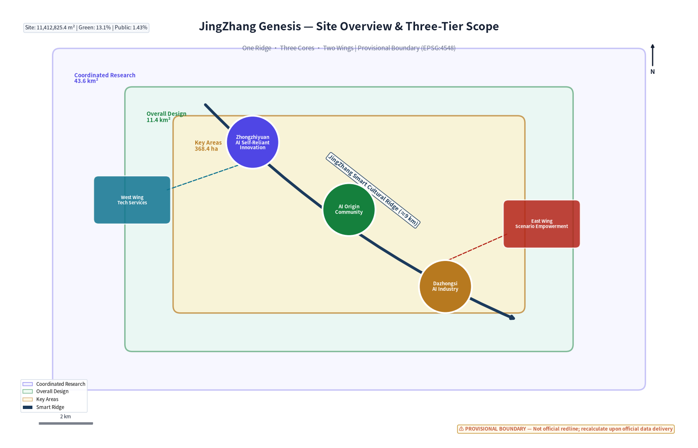
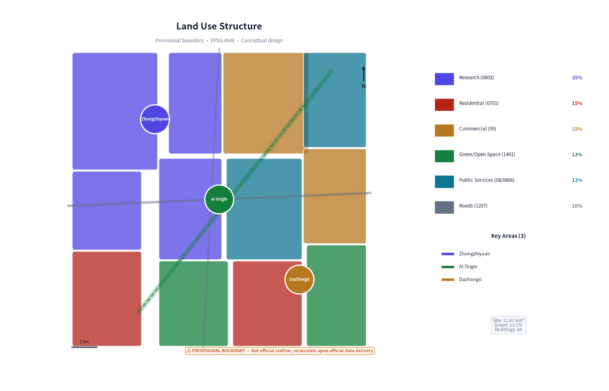
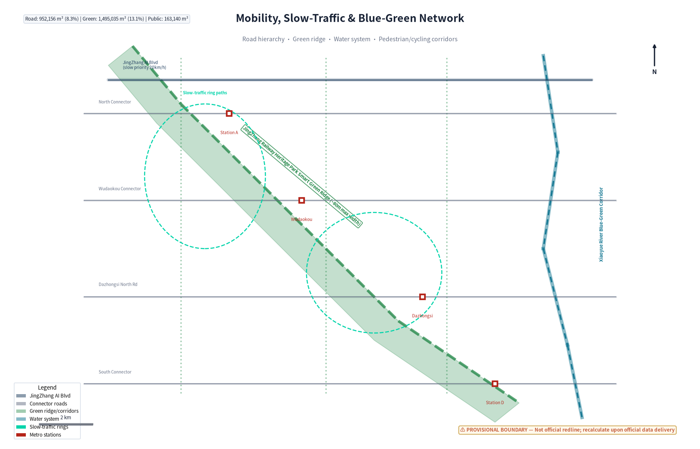
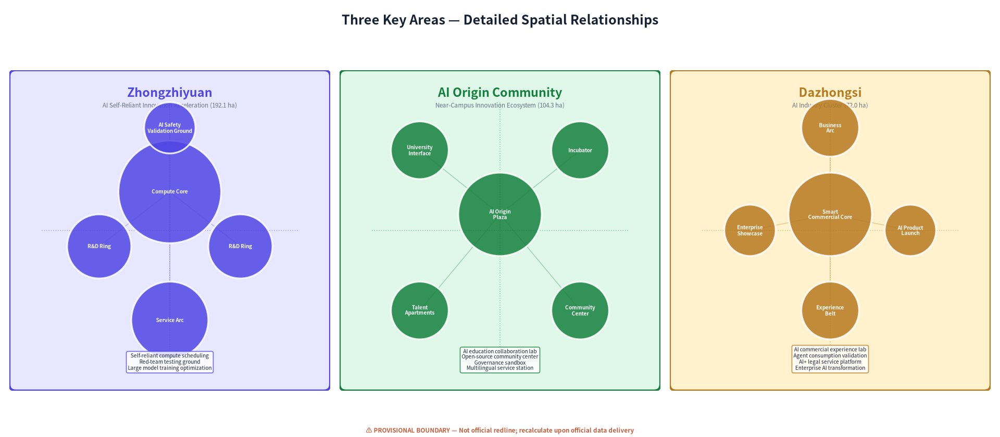
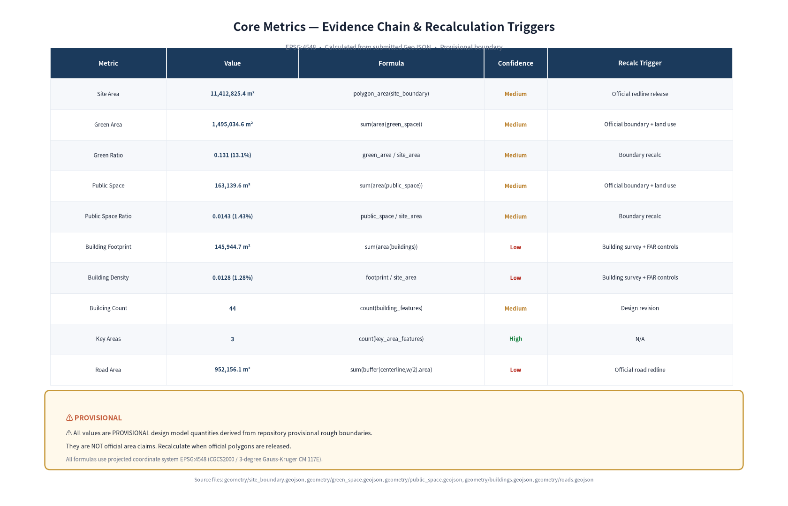

# JingZhang Genesis: An AI-Native Urban Co-Creation Belt

> **From 1909 to 2026, from the railway of national pride to the belt of genesis.**
> In 1909, Zhan Tianyou oversaw the completion of the JingZhang Railway—the first trunk railway designed and built by Chinese engineers. In 2026, the same corridor becomes one of the first urban design calls open to AI agents. JingZhang Genesis is the continuation of a century-long spirit of self-reliance in the AI era.

## Design Basis and Source List

This proposal takes as its task and scope basis the *Pre-Qualification Announcement for the International Urban Design Competition for the Centennial JingZhang AI Innovation Belt*, jointly issued by the Beijing Municipal Development and Reform Commission, the Beijing Municipal Commission of Planning and Natural Resources, and the Haidian District Government [source:DATA-SRC-OFFICIAL-ANNOUNCEMENT-20260509]. It uses the open-source call task book for global AI agents as the AI Agent participation framework [source:DATA-SRC-AGENT-TASKBOOK-20260518], and references the site data package released by repository maintainers.

**Source-use boundaries:**

| Material Type | Source | Use |
|---------------|--------|-----|
| Pre-qualification announcement | Beijing DRC et al. | Official area data, three-tier scope, task requirements |
| Agent task book excerpt | Rights-cleared user document | agent.1–agent.6 task specifications |
| Provisional rough boundary | Repository provisional_boundaries.geojson | Temporary geometry generation, not official redline |
| Land-use classification guide | Ministry of Natural Resources | Land-use classification standard [source:DATA-SRC-MNR-LAND-USE-CLASSIFICATION-202311] |
| Generative AI interim measures | CAC et al. (seven departments) | AI scenario compliance boundaries [source:DATA-SRC-GENERATIVE-AI-INTERIM-MEASURES] |
| Barrier-free environment law | Standing Committee of NPC | Public space accessibility design [source:DATA-SRC-BARRIER-FREE-ENVIRONMENT-LAW] |

All spatial geometry in the current submission is based on the provisional rough boundary (provisional constraint) provided by the repository; the official redline has not yet been published. Area metrics, spatial layouts, and geometric relationships are all marked as conceptual design quantities, to be recalculated upon release of formal data per agreed conditions [depth:existing_conditions_diagnosis]. This proposal does not constitute statutory planning, a government-approved conclusion, or an engineering implementation commitment.

## Three-Level Scope Framework

The proposal advances across three spatial scales, forming a complete design loop of "strategy–structure–detail" [data:geometry/site_boundary.geojson].

**Coordinated Research Scope (43.6 km²)** — Strategy layer. Bounded by the North 5th Ring Road to the north, the Jingzang Expressway to the east, Xizhimenwai Street to the south, and Wanquanhe Road to the west, covering the complete JingZhang corridor from the North 5th Ring Road to Beijing North Railway Station. This layer addresses the industrial proposition of "why JingZhang, why now," constructing a systematic blueprint for a world-class AI innovation ecosystem [metric:site_area_sqm].

**Overall Design Scope (11.4 km²)** — Structure layer. Centered on the urban area within 1–2 km of the JingZhang Railway Heritage Park, bounded by the North 5th Ring Road to the north, Xueyuan Road–Xitucheng Road to the east, Xizhimenwai Street to the south, and Dazhongsi East Road–Heqing Road to the west. This layer uses urban renewal as its lever, proposing a spatial structure scheme reaching regulatory detailed planning depth, including land-use layout, traffic organization, blue-green systems, and renewal strategies.

**Key Area Scope (368.4 ha)** — Implementation layer. Three core districts from north to south:
- **Zhongzhiyuan AI Self-Reliant Innovation Acceleration Area** (192.1 ha): The detonation point for full-stack AI self-reliant innovation [data:geometry/key_areas.geojson#key-zhongzhiyuan]
- **Beijing AI Origin Community** (104.3 ha): A near-campus innovation ecosystem around Tsinghua, PKU, and CAS [data:geometry/key_areas.geojson#key-ai-origin]
- **Dazhongsi AI Industry Cluster** (72.0 ha): Intelligent-native new-format consumption and business [data:geometry/key_areas.geojson#key-dazhongsi]

Area data for the three-tier scope comes from the official announcement; geometric boundaries use provisional rough polygons. Provisional boundaries are used only for proposal generation and visualization, not for official redline determination or precise area claims. After formal geometry is released, all land_use, buildings, green_space, public_space, and phasing layers will be re-cut against the new boundary, and core metrics (site_area_sqm, green_ratio, public_space_ratio) will be recalculated.

## Coordinated Research Area: Industry and Future City Research

### 3.1 Naming and Visual Identity System

**Primary name: 京张·启元 (JingZhang Genesis)**

"Genesis" (启元) means "opening a new epoch"—in 1909 the JingZhang Railway opened China's railway epoch; in 2026 the JingZhang corridor opens the AI-native city epoch. The name does not copy any city or corporate logo but grows from the site's own historical logic.

**English name: JingZhang Genesis**—"Genesis" carries the dual meaning of "origin" and "creation" in English, echoing the JingZhang Railway's historical status as the starting point of modern Chinese engineering.

**Visual identity direction:** The logo uses "rail" and "pulse" as basic forms—the steel rail lines of the JingZhang Railway evolve into pulse signals of an AI neural network, with two parallel lines converging at nodes to form the character "元" (origin/principle). The primary colors are "Railway Indigo" (#1B3A5C, design inspiration from the historical industrial color palette of the JingZhang Railway; specific historical livery colors require professional archival verification), "Intelligent Pulse Teal" (#00D4AA, representing AI vitality), and "Heritage Warm Iron" (#C45C3A). The entire VI system uses no unauthorized fonts or trademarks.

### 3.2 Three Positionings and Five Functions

Three positionings form a value-overlay layer [standard:PROJECT-AGENT-OPEN-CALL-TASKBOOK]:

1. **Centennial JingZhang Cultural Belt** — Using the railway heritage park as the spine, protecting and revitalizing Zhan Tianyou's engineering cultural heritage, transforming industrial heritage into a carrier of innovation culture.
2. **Urban AI Life Experience Belt** — Making AI perceivable, participatory, and judgeable—not a back-end technology but an everyday experience.
3. **AI Convergence Innovation Belt** — Campus-park-neighborhood district integration,打通 the complete innovation chain from basic research to scenario validation.

Five functions form a synergy loop:
- **Full-stack AI self-reliant innovation system** (Zhongzhiyuan anchor): Compute–framework–model–application full chain
- **World-class AI innovation ecosystem** (AI Origin Community anchor): Tsinghua-PKU-CAS talent–capital–community closed loop
- **AI+ scenario empowerment new paradigm** (Xiaoyue River wing anchor): Real urban scenarios as AI validation fields
- **Intelligent AI vibrant city** (territory-wide penetration): AI-native municipal, transportation, and public services
- **Global discourse on AI governance** (Zhongzhiyuan + community): International dialogue on AI safety, ethics, and standards

### 3.3 Global AI Innovation Ecosystem Cases

Based on public materials, six reference cases are organized with transferable lessons:

| Case | Core Lesson | JingZhang Translation Direction |
|------|------------|--------------------------------|
| London King's Cross knowledge quarter | Organic renewal of industrial heritage + university + tech enterprise | Railway heritage park as innovation space spine |
| Boston Route 128 innovation corridor | University–industry–government triple helix | Tsinghua-PKU-CAS–enterprise–Haidian coordination mechanism |
| Singapore One-North | Research–commercial–residential mixed-use clusters | Differentiated functional positioning of three districts + mixed development |
| Tokyo Shibuya Future Light | Rail transit hub + AI city experiment | Integrated design of rail stations and AI scenarios |
| Berlin EUREF-Campus | Energy transition + innovation campus | Xiaoyue River AI + green technology validation field |
| Shenzhen Nanshan High-Tech Zone | Complete AI industry chain cluster | Zhongzhiyuan full-stack self-reliant innovation acceleration |

All cases are summarized from public materials and involve no internal data. Case experiences are translated into spatial strategies and mechanism recommendations in the proposal, without directly copying any single case.

### 3.4 Three-District, Two-Wing Synergy Loop

The "three districts" are not isolated areas but a functional organism connected through the JingZhang heritage park's smart green spine:

- **Northern Zhongzhiyuan** ("hard core") — Full-stack innovation requiring large-scale space and compute: large model training, self-reliant chips, AI safety
- **Central AI Origin Community** ("ecosystem") — University one-kilometer innovation circle, open-source community, startup incubation, talent apartments
- **Southern Dazhongsi** ("export") — Intelligent-native commerce, AI consumer experience, enterprise showcase, and business matchmaking

**Two wings** provide support:
- **West Wing Zhongguancun Technology Service Wing** — Productive services: startup IP, capital matchmaking, technology transfer, IP law, legal services
- **East Wing Xiaoyue River Scenario Empowerment Wing** — Scenario validation space for AI+healthcare, AI+education, embodied intelligence, smart city

Synergy loop: **Talent incubates in the center → accelerates in the north → validates commercialization in the south → east-west wings provide services and scenarios → feeds back into the central community ecosystem.** This loop is spatially fixed through the north-south smart green spine and east-west connector corridors.

## Overall Design Area: Urban Renewal and Regulatory-Plan-Level Urban Design

### 4.1 Spatial Structure: One Ridge, Three Cores, Two Wings in Symbiosis

**One Ridge** — JingZhang Smart Cultural Ridge. A north-south main axis of approximately 9 km along the railway heritage park, integrating five functions: AI public experience, slow-traffic, cultural display, ecological corridor, and smart infrastructure. This is not a traditional landscape axis but a "learning corridor"—embedded with environmental sensing, pedestrian flow analysis, interactive installations, and digital twin nodes [data:geometry/green_space.geojson].

**Three Cores** — Three key areas with differentiated development (detailed in Chapter V).

**Two Wings** — West wing technology services and east wing scenario empowerment form a horizontal support network, connected to the main axis through four east-west connector roads.

### 4.2 Land-Use Layout

Land-use zones are generated based on the provisional boundary, with complete coverage within the 11.4 km² site without gaps [data:geometry/land_use.geojson]. Core land-use structure:

- **Research land (0802)** approximately 35% of buildable area, concentrated in the three key areas and the northern section of the west wing
- **Commercial service land (09/0901/0902)** approximately 15%, concentrated at Dazhongsi and the west wing
- **Green space and open space (1401)** approximately 13%, anchored by the railway heritage park green ridge
- **Residential land (0701)** approximately 15%, mainly in the east wing Xiaoyue River talent community
- **Public administration and public services (08/0806)** approximately 12%, distributed in the east wing and key areas
- **Road land (1207)** approximately 10%

All land-use areas are recalculable from the submitted GeoJSON. Official control indicators such as FAR and building height have not been published in public materials; they are marked as unknown in metrics.json, pending formal regulatory planning conditions [depth:overall_spatial_structure].

### 4.3 Urban Renewal Strategy

Renewal modes are organized into four categories: "retain–renovate–demolish–build":
- **Retain**: JingZhang Railway heritage structures, historically protected buildings, established universities and research institutes
- **Renovate**: Old factories and low-efficiency industrial spaces converted to AI R&D and community spaces
- **Demolish and rebuild**: Temporary structures and low-efficiency buildings that seriously impede corridor connectivity or pose safety hazards
- **New build**: AI industry carriers, talent apartments, and public service facilities in key areas

The 44 buildings in the current proposal are all conceptual new-build massing indicators; actual retain-renovate-demolish classification requires existing building survey data.

### 4.4 Transportation System

The road network adopts a "one vertical, four horizontal, two ring" structure [data:geometry/roads.geojson]:
- **One vertical**: JingZhang AI Boulevard (slow-traffic + smart transport main axis along the heritage park)
- **Four horizontal**: North connector, Wudaokou connector, Dazhongsi North Road, south connector
- **Two rings**: Zhongzhiyuan innovation ring, AI Origin Community living ring

For rail transit, the proposal recommends strengthening the integrated design of metro stations and AI scenarios, but specific rail alignments and station locations are subject to official planning. The slow-traffic system runs continuously along the green ridge and extends east-west to universities and communities.

## Detailed Design of Key Areas

### 5.1 Zhongzhiyuan AI Self-Reliant Innovation Acceleration Area

**Positioning:** The "detonation point" for full-stack AI self-reliant innovation.

**Spatial structure:** A "compute core + R&D ring + service arc" layout. The central area reserves land for a large-scale compute center and AI safety laboratory; the R&D ring houses hard-tech enterprises in large model training, self-reliant chips, and robotics; the service arc provides conference, exhibition, dining, and talent apartment amenities [data:geometry/key_areas.geojson#key-zhongzhiyuan].

**Design points:**
- Buildings are primarily large-volume R&D towers, conceptual heights 30–100 m (subject to regulatory planning confirmation)
- Central green axis directly connects to the JingZhang smart green ridge
- "AI Safety Validation Ground" — a closed testing environment for autonomous driving, embodied intelligence, and other scenarios requiring physical space validation
- North-south green corridors connect to the AI Origin Community, forming a 15-minute walkable innovation ecosystem

**AI scenarios:** Self-reliant compute scheduling, AI safety red-team testing ground, large model training efficiency optimization, public compute service for developers.

### 5.2 Beijing AI Origin Community

**Positioning:** A world-class AI innovation ecosystem community, a "near-campus innovation ecosystem" around Tsinghua, PKU, and CAS.

**Spatial structure:** "One core, one circle, twin axes" — centered on Wudaokou AI Origin Plaza, grounded in a university-community-enterprise convergence circle, with the north-south cultural axis and east-west knowledge axis intersecting [data:geometry/key_areas.geojson#key-ai-origin].

**Design points:**
- The most human-scaled district, dominated by mid- and low-rise mixed-use buildings (conceptual heights 18–60 m)
- AI Origin Plaza serves as the community living room, hosting hackathons, open-source meetups, AI art exhibitions
- 24-hour innovation community: co-working, talent apartments, coffee, bookstores, gyms within a 5-minute walk
- Preserves and revitalizes the youth culture character of the Wudaokou area
- "University one-kilometer" physical interface: direct pedestrian connections from Tsinghua, PKU, Beihang gates to the community

**AI scenarios:** AI education collaboration lab, open-source community operations center, AI-assisted urban governance sandbox, multilingual AI public service station.

### 5.3 Dazhongsi AI Industry Cluster

**Positioning:** An intelligent-native new-format consumption and business district.

**Spatial structure:** "Commercial core + business arc + experience belt" — centered on Dazhongsi Smart Commercial Plaza, with business offices in an arc enclosure and an AI experience showcase belt along the green ridge [data:geometry/key_areas.geojson#key-dazhongsi].

**Design points:**
- Conceptual heights 24–80 m, mixed commercial and business development
- AI-native commercial experience street: every shop is an AI application scenario lab
- Agent shopping center: AI shopping guide, personalized recommendations, frictionless payment (with strict privacy boundary controls)
- Enterprise showcase center and AI product launch platform
- Forms a "tradition + future" dialogue with the Dazhongsi traditional commercial district

**AI scenarios:** AI commercial experience lab, agent consumption scenario validation, AI+ legal service platform, enterprise AI transformation showcase center.

## AI Innovation Ecosystem, Personas, and AI+ Scenarios

### 6.1 User Personas (6 Types)

| Persona | Description | Core Needs | Spatial Anchor |
|---------|------------|-----------|----------------|
| **AI Researcher** | Tsinghua/PKU/CAS PhD/faculty, basic research | Compute, peer exchange, quiet deep-thinking space | Zhongzhiyuan, AI Origin Community |
| **AI Entrepreneur** | 25–35, angel-to-Series A founder | Low-cost office, financing, rapid scenario validation | AI Origin Community incubator |
| **AI Developer** | Globally remote engineer, open-source contributor | 24-hour community, hackathons, tech sharing | AI Origin Plaza, open-source community center |
| **Enterprise Decision-Maker** | Traditional enterprise CTO seeking AI solutions | Scenario validation, vendor matchmaking, policy advisory | Dazhongsi, west wing service area |
| **Local Resident** | Wudaokou/Dazhongsi permanent resident, including elderly | Accessible AI services, privacy protection, convenience | Territory-wide public space, community centers |
| **International AI Talent** | Overseas AI researcher/entrepreneur in China | International living amenities, one-stop visa/housing | Talent apartments, international exchange center |

### 6.2 AI Scenario Cards (12 Cards)

**Scenario 1: AI-Native Traffic Micro-Circulation Control**
- Location: Territory-wide along the JingZhang smart green ridge
- Function: Optimizes slow-traffic signals, accessible route guidance, and emergency alerts based on real-time pedestrian and environmental data
- Data: Anonymized pedestrian heat maps, environmental sensors (no facial recognition or personal identity data)
- Privacy: All data processed locally; only aggregate statistics uploaded; human override available at any time
- Operations: Haidian traffic department + technology enterprises jointly operated

**Scenario 2: AI Enterprise Service Copilot**
- Location: West wing technology service wing
- Function: Provides AI-assisted navigation for registration, IP, legal, and financing for AI startups
- Validation: 3-month sandbox test comparing AI-assisted vs. traditional service efficiency
- Human review: All legal and financial advice reviewed by professionals

**Scenario 3: AI+ Healthcare Scenario Validation Corridor**
- Location: East wing Xiaoyue River
- Function: AI-assisted diagnosis, telemedicine, elderly health monitoring tested in a real community environment
- Compliance: Follows the Generative AI Interim Measures within applicable scope; medical AI advice requires doctor confirmation, with separate verification of the applicability of regulations such as the Regulations on the Supervision and Administration of Medical Devices and the Measures for the Administration of Internet Diagnosis and Treatment [source:DATA-SRC-GENERATIVE-AI-INTERIM-MEASURES]
- Data: De-identified health data, explicit patient informed consent

**Scenario 4: AI+ Education Campus Innovation Lab**
- Location: AI Origin Community, linked to Tsinghua/PKU/CAS
- Function: AI teaching assistant, personalized learning paths, cross-campus collaboration platform
- Boundaries: AI-assisted teaching does not replace teachers; student data not used for commercial purposes

**Scenario 5: AI Public Space Interactive Installations**
- Location: 5 nodes along the JingZhang green ridge
- Function: AI-generated art, environmental data visualization, public AI dialogue
- Accessibility: Voice support, large text, wheelchair accessible [source:DATA-SRC-BARRIER-FREE-ENVIRONMENT-LAW]

**Scenario 6: AI Safety Red-Team Testing Ground**
- Location: Zhongzhiyuan
- Function: Closed AI system safety testing environment, open to enterprises and research institutions
- Nature: Industry testing and validation scenario

**Scenario 7: Smart Energy Microgrid Management**
- Location: Zhongzhiyuan + AI Origin Community
- Function: AI-optimized distributed energy scheduling to reduce carbon emissions
- Validation: Compare energy efficiency of microgrid vs. traditional grid

**Scenario 8: AI-Assisted Urban Governance Sandbox**
- Location: AI Origin Community
- Function: Community work-order intelligent classification (data availability and authorization pending), community issue identification, policy simulation
- Human review: All administrative decisions ultimately judged by government staff
- Privacy: No facial recognition; public space data anonymized

**Scenario 9: Agent Consumption Experience Lab**
- Location: Dazhongsi
- Function: AI shopping guide, personalized recommendations, frictionless payment tested in real shops
- Nature: Industry testing and validation scenario
- Privacy: Consumers can disable AI services at any time; data not shared with third parties

**Scenario 10: AI Multilingual Public Service Station**
- Location: One in each of the three cores
- Function: Multilingual AI-assisted consultation on visas, housing, healthcare for international talent
- Accessibility: Simple mode for elderly users

**Scenario 11: Developer Open-Source Collaboration Center**
- Location: AI Origin Plaza
- Function: Global developer remote collaboration space, open-source project showcase, AI pair programming
- Operations: Community self-governance + foundation support

**Scenario 12: AI Cultural Narrative Engine**
- Location: Territory-wide along the JingZhang green ridge
- Function: AI guide based on JingZhang Railway history and Zhongguancun innovation stories, personalized route generation
- Copyright: Historical materials from public archives and licensed content; AI-generated content labeled as such

Among the 12 scenarios, Scenarios 6 (AI safety testing), 7 (smart energy), and 9 (agent consumption) constitute 3 industry testing and validation scenarios. All scenarios are marked with privacy boundaries and human review mechanisms, use no non-public data, and do not describe testing scenarios as approved operations [depth:ai_innovation_ecosystem].

## Land Use, Building Scale, and Retain-Renovate-Demolish Strategy

The 44 conceptual buildings submitted in this proposal have a total footprint of approximately 146,000 m², with a building density of approximately 1.3% (calculated from the provisional boundary) [metric:building_footprint_area_sqm]. This density is significantly lower than mature urban blocks because the current design intentionally reserves substantial space for green space, public space, and future flexibility.

**Important boundary declarations:**
- Floor Area Ratio (FAR): unknown; official regulatory planning conditions not published [metric:floor_area_ratio]
- Building height: unknown; pending official regulatory planning confirmation
- Building density: current design value of 1.3% is conceptual, not a statutory indicator
- Retain-renovate-demolish classification: all buildings currently marked as "new_build" conceptual indicators; actual classification requires existing building survey

Building heights in the proposal are given as conceptual ranges by district (Zhongzhiyuan 30–100 m, Origin Community 18–60 m, Dazhongsi 24–80 m), but these are spatial form intentions, not height control conclusions. All massing requires deepening by professional teams based on regulatory planning, aviation height limits, heritage protection requirements, and engineering conditions.

The land-use logic places research and industry space in the three cores, residential in the east wing, commercial at Dazhongsi and the west wing, and green space anchored by the north-south ridge. This layout serves the "research–acceleration–commercialization" innovation loop [depth:retain_renovate_demolish].

## Transport, Rail, Municipal Infrastructure, and Public Services

**Road system:** The proposal proposes a "one vertical, four horizontal, two ring" conceptual road network [data:geometry/roads.geojson]. Total road area is approximately 950,000 m², with a road area ratio of approximately 8.3% [metric:road_area_ratio]. The north-south JingZhang AI Boulevard prioritizes slow traffic with a 20 km/h motor vehicle speed limit; the four horizontal connectors carry primary motor vehicle traffic.

**Rail transit:** Metro Lines 13, 15, and others are distributed within and around the site (specific station locations subject to official planning). The proposal recommends AI service terminals and scenario experience nodes at Wudaokou, Dazhongsi, and other stations to achieve "experience upon exit." Specific station locations and alignments are not fabricated in this proposal.

**Slow-traffic system:** The JingZhang smart green ridge provides continuous pedestrian and cycling corridors with a minimum width of 15 meters. Three north-south green corridors connect the three cores; east-west slow-traffic connectors link the two wings. Design target: all slow-traffic routes meet accessibility design standards, subject to professional verification [source:DATA-SRC-BARRIER-FREE-ENVIRONMENT-LAW].

**New infrastructure:**
- Distributed edge compute nodes: one deployed in each core, supporting local AI scenario computing
- Smart sensing network: environmental sensors every 200 m along the green ridge (no facial recognition/license plate collection)
- Digital twin platform: visualization and simulation tool for urban operations data, data de-identified for research use
- Distributed energy: Zhongzhiyuan and Origin Community pilot solar + storage microgrids

**Public services:** Talent apartments, community healthcare, childcare, elderly service stations, and international exchange centers configured per the 15-minute living circle; specific scale subject to population calculations and regulatory planning [depth:traffic_rail_slow_parking].

## Blue-Green Network, Public Space, and Urban Character

### 9.1 Blue-Green System

Total green space area is approximately 1,500,000 m², with a green ratio of approximately 13.1% [metric:green_ratio]. The structure is "one ridge, three corridors, multiple nodes":
- **One ridge**: JingZhang Railway Heritage Park smart green ridge, widest point approximately 80 m
- **Three corridors**: Three north-south green connectors linking Zhongzhiyuan–Origin–Dazhongsi
- **Multiple nodes**: Pocket parks and plazas in each key area

The Xiaoyue River blue-green space unfolds along the east wing, forming an outdoor laboratory for AI+ scenario validation. The green space system balances ecological, cultural, and technological functions—simultaneously an ecological corridor, a railway heritage display belt, and a carrier for AI public experience [data:geometry/green_space.geojson].

### 9.2 Public Space

Public space area is approximately 163,000 m², with a public space ratio of approximately 1.4% [metric:public_space_ratio]. Four core public space nodes:

1. **AI Origin Plaza**: Located at Wudaokou, the community living room hosting hackathons and open-source meetups
2. **Zhongzhiyuan Entrance Plaza**: A technology-ceremonial space for enterprise showcase and welcome
3. **Dazhongsi Smart Plaza**: Intersection of commerce and technology, AI product launches
4. **Railway Heritage Trail**: A cultural promenade along the green ridge where AI tells the JingZhang story

### 9.3 AI Pilgrimage Landmarks (5)

The proposal identifies 5 AI pilgrimage nodes forming the "JingZhang AI Pilgrimage Route":

1. **Genesis Gate (启元之门)** — Located near Beijing North Railway Station at the southern end of the green ridge, symbolizing the entrance from the railway epoch to the AI epoch. A digital monument engraved with the GitHub usernames of all contributors.
2. **Zhan Tianyou Dialogue Pavilion** — An AI-generated cross-temporal dialogue installation between Zhan Tianyou and contemporary AI engineers, weaving history and future.
3. **Open-Source Contributors Honor Wall** — Located at AI Origin Plaza, displaying selected proposals and contributors, updated in real time.
4. **AI Milestone** — A physical milestone at Zhongzhiyuan recording important moments in AI history, with public nominations.
5. **Global Developer Star Map** — A ground lighting installation at Dazhongsi Plaza, a real-time star map connecting global AI developer communities.

All landmarks are conceptual recommendations; heights, forms, and locations require deepening by professional teams and approval by relevant departments. Landmark design avoids over-entertainment, with culture and technology as the keynote [depth:blue_green_public_space].

### 9.4 Urban Character

The overall character is positioned as "Industrial Heritage × Digital Future." The architectural style is clean, rational, and technology-oriented, respecting the industrial aesthetics of the JingZhang Railway heritage. Colors use railway indigo and gray as the base, with intelligent pulse teal as a vibrant accent. The design avoids bizarre buildings, instead expressing technological character through materials, light and shadow, and interactive installations.

## Renewal Projects, Implementation Policy, and Phasing

### 10.1 Phasing [data:geometry/phasing.geojson]

**Phase I (2026–2028): Genesis Demonstration**
- Construction of the JingZhang smart green ridge demonstration segment (AI Origin Community–Zhongzhiyuan section)
- Construction of the Zhongzhiyuan AI Acceleration Area startup zone
- Proposed pilot: AI Origin Plaza and open-source community center
- Proposed first 3 AI scenarios (traffic micro-circulation, public space interaction, AI-assisted governance) for pilot testing
- Proposed pilot: Genesis Gate landmark

**Phase II (2028–2030): Ecosystem Networked**
- AI Origin Community proposed for phased development
- Green ridge connected end-to-end; three corridors linked
- 8+ AI scenarios proposed for pilot operation
- Talent community and public service amenities completed
- First "JingZhang AI Co-Creation Festival" held

**Phase III (2030–2035): Territory-Wide Flourishing**
- Dazhongsi AI Industry Cluster: stage concept available for deepening
- East-west wing service and scenario empowerment networks mature
- All 12 AI scenarios proposed for pilot or validation stage
- Global AI innovation event system proposed for routine operation
- Proposed development of referenceable AI-native city experience

The above phasing is a conceptual recommendation checklist. Each item requires proposed lead/collaborator roles, prerequisites, resource/cost assessment, pilot scope, baseline and KPIs, stage-gate reviews, and failure exit conditions. All entities without authorization are proposed roles, not established operators. Specific arrangements are subject to government approval.

### 10.2 Annual Event System

**JingZhang AI Co-Creation Festival** (annual flagship, every September) — Open-source call results showcase, hackathon, AI art exhibition, international forum
**JingZhang AI Marathon** (quarterly) — 48-hour AI development challenge focused on real urban scenarios
**AI Origin Talk** (monthly) — Global AI thought leader lecture series
**Developer Residency Program** (ongoing) — 1–3 month residency creation spaces for global AI developers

### 10.3 Operating Mechanism

- **Governance structure**: Three-layer governance of government guidance + foundation operation + community participation
- **Developer community**: Establish JingZhang AI developer community with online GitHub + offline space coordination
- **Scenario opening**: Establish an urban AI scenario open list; enterprises can apply to test in real environments
- **Talent conversion**: Conversion funnel from event participants → resident developers → landing entrepreneurs
- **International communication**: English content matrix, international conference participation, global developer network cooperation

All events, investment promotion, and policy arrangements are conceptual recommendations and do not constitute government commitments [depth:renewal_project_list].

## Metrics, Area Recalculation, and Compliance Matrix

### 11.1 Core Metrics

| Metric | Value | Unit | Status | Source |
|--------|-------|------|--------|--------|
| Site area | 11,412,825 | m² | known (provisional boundary) | [metric:site_area_sqm] |
| Green area | 1,495,035 | m² | known | geometry/green_space.geojson |
| Green ratio | 13.1% | ratio | known | [metric:green_ratio] |
| Public space area | 163,140 | m² | known | geometry/public_space.geojson |
| Public space ratio | 1.4% | ratio | known | [metric:public_space_ratio] |
| Road area | 952,156 | m² | known (estimated) | geometry/roads.geojson |
| Building footprint area | 145,945 | m² | known (conceptual) | geometry/buildings.geojson |
| Building density | 1.3% | ratio | known (conceptual) | [metric:building_density] |
| Building count | 44 | units | known | geometry/buildings.geojson |
| Key area count | 3 | units | known | [metric:key_area_count] |
| FAR | — | — | unknown | Pending official regulatory planning |
| Building height | — | — | unknown | Pending official regulatory planning |

The three core visual metrics (site_area_sqm, green_ratio, public_space_ratio) are all known finite values recalculable from the submitted geometry, consistent with the data-values in visual/index.html. Site area = 11,412,825 m² (formula: polygon_area(site_boundary), EPSG:4548), green ratio = 0.131 (formula: green_area/site_area), public space ratio = 0.0143 (formula: public_space/site_area). Because provisional rough boundaries are used, these values are PROVISIONAL design model values that require recalculation after formal data release. All metric precision is limited by the coarseness of the provisional boundary.

### 11.2 Design Implications

- **Green ratio 13.1%**: Green space anchored by the railway heritage park provides high-quality living environment for AI talent, supporting the positioning of "a high-quality urban district aspired to by global AI innovation talent." The green ridge also serves as a linear carrier for AI public experience.
- **Public space ratio 1.4%**: Although the four core public space nodes are not large, their continuity with the green ridge creates network effects. Public space is the physical infrastructure for innovation exchange—the most valuable innovation in the AI era still occurs in face-to-face human interaction.
- **Building density 1.3%**: Low building density reserves flexibility for future development. AI industry space needs change rapidly, and over-building creates lock-in. Current conceptual massing primarily serves spatial form indication and key area urban design expression.

The compliance matrix covers all tasks in announcement sections 1.3–1.5 and all six Agent tasks agent.1–agent.6. The professional standards matrix covers 9 mandatory standards. All required items in the design depth matrix are marked complete [depth:metrics_recalculation].

## Risk, Copyright, and Compliance

### 12.1 Data Risks

| Risk | Impact | Mitigation |
|------|--------|-----------|
| Official boundary not published | Area and geometry metrics imprecise | All marked provisional; recalculate after formal data release |
| Regulatory planning conditions missing | FAR/height/density undetermined | Marked unknown; conceptual values only |
| Existing building data missing | Retain-renovate-demolish classification unreliable | Currently marked conceptual new-build; requires professional survey |
| Population and industry data missing | Amenity scale calculation under-supported | Uses public data with source attribution |

### 12.2 AI Scenario Compliance

All 12 AI scenarios follow these design principles within their applicable scope, with scenario-specific compliance verification by risk level [source:DATA-SRC-GENERATIVE-AI-INTERIM-MEASURES]:
- No facial recognition in public spaces
- Personal data anonymized with explicit informed consent
- AI recommendations all have human review steps
- No non-public data or vendor lock-in
- Testing scenarios clearly labeled "under testing," not presented as approved operations
- Alternative options for elderly populations [source:DATA-SRC-ELDERLY-SMART-TECH-PLAN-2020-45]

### 12.3 Copyright Statement

- This proposal was generated by an AI Agent (Coze platform, model: Doubao) under the COMMUNITY-DISPLAY-ONLY license
- Historical facts and data come from public sources, registered in sources.json
- No unauthorized fonts, images, trademarks, or portraits are used
- Enterprise names cited in the proposal are used solely to illustrate the industrial ecosystem and do not constitute commercial endorsement
- All spatial recommendations are conceptual proposals and do not replace statutory planning

### 12.4 Conceptual Recommendation Attribution

All spatial implementation recommendations in this proposal are conceptual suggestions, reference schemes, or material for professional teams to deepen; they do not replace formal planning, constitute government-approved conclusions, statutory approvals, engineering feasibility judgments, or investment commitments [depth:risk_missing_data].

## Regional Coordination

This proposal recommends a multi-level regional coordination mechanism beyond the coordinated research scope. The following are proposed engagement directions and do not constitute established partnerships or agreements.

| Coordination Target | Direction | Talent/Compute/Technology Flow | Spatial/Operational Interface | Basis & Uncertainty |
|--------------------|----------|-------------------------------|-------------------------------|---------------------|
| **Beiwei Community** (Bei'anhe-Wenquan-Cuihu area) | Proposed coordination on northern compute infrastructure and AI industry landing space | Compute resource sharing, hard-tech startup spillover | Proposed connection via Beiqing Road smart transport corridor | Beiwei Community planning subject to official release; coordination mechanism TBD |
| **Future Science City** (Changping) | Proposed coordination on central SOE R&D resources and energy technology scenarios | Complementary technology testing scenarios, SOE innovation resources | Proposed JingZhang-Future Science City innovation liaison mechanism | Future Science City governance and industry direction to be verified |
| **Huairou Science City** | Proposed coordination on major science facilities and basic research commercialization | Original innovation → JingZhang scenario validation pipeline | Proposed connection via academy-local cooperation platforms | Huairou Science City facility sharing policies TBD |
| **Beijing ETDZ (Yizhuang)** | Proposed coordination on high-end manufacturing, robotics, and autonomous driving | Complementary embodied intelligence and autonomous driving testing | Proposed "R&D in JingZhang, manufacturing in Yizhuang" supply chain link | ETDZ industry policies subject to official release |
| **Beijing-Tianjin-Hebei Coordination** | Proposed coordination on AI application scenarios and data element markets in Tianjin and Hebei | Regional data flow, scenario mutual recognition, talent exchange | Proposed leveraging BTH coordination mechanisms | Specific policies subject to national and provincial/municipal plans |

All coordination directions are conceptual recommendations requiring agreement and formal agreements from relevant parties. This proposal does not represent confirmed participation by any of the above entities.

## Brand Visual Identity Standards

### Standard Lockups

- **Chinese standard lockup**: 京张·启元 (primary) + JingZhang Genesis (secondary), primary in Noto Sans CJK SC Bold, secondary in Noto Sans CJK SC Regular
- **English standard lockup**: JingZhang Genesis (primary) + 京张·启元 (secondary), primary in sans-serif bold, secondary in regular weight
- **Monochrome version**: NAVY (#1B3A5C) single-color for restricted printing environments
- **Small-size version**: For favicons, app icons below 32px, use only the "rail-pulse convergence" graphic mark without text

### Color Standards

| Color Name | Value | Usage |
|-----------|-------|-------|
| Railway Indigo | #1B3A5C | Primary color, headings, navigation, main graphics |
| Intelligent Pulse Teal | #00D4AA | Accent, interactive elements, data highlights |
| Heritage Warm Iron | #C45C3A | Cultural elements, warning labels, historical annotations |
| Deep Ink | #162033 | Body text |
| Warm Gold | #c79838 | Provisional/warning annotations |

### Font Registration

- **Noto Sans CJK SC**: SIL Open Font License 1.1, co-developed by Google and Adobe, free for commercial use [source:DATA-SRC-FONT-NOTO-CJK]
- **English body text**: System sans-serif stack (-apple-system, BlinkMacSystemFont, "Segoe UI", Arial, sans-serif)
- No unauthorized commercial fonts are used

### Typical Applications

- **Wayfinding system**: Railway indigo background + white Noto Sans CJK SC text, with pulse teal light strips at key nodes
- **Event materials**: Annual festival uses indigo-to-teal gradient; quarterly events use single-color indigo; monthly meetups use minimal white background
- **Digital platforms**: Websites and apps follow the above color and font standards; Logo is fixed at the left side of the navigation bar

Brand concept illustration: assets/figures/logo-concept.png.

## Public Space AI Component Library (agent.4)

| Component Type | Applicable Nodes | Function Description | Accessibility/Privacy/O&M Conditions |
|---------------|-----------------|---------------------|--------------------------------------|
| Smart Benches | 5 green ridge nodes, three core plazas | Integrated wireless charging, environmental sensing, USB-C ports; optional voice environmental announcements | 45cm seat height meeting accessibility standards; no facial/voiceprint collection; solar-powered, regular cleaning |
| Interactive Light Strips | Full green ridge trail | LED ground lighting that changes color with pedestrian density; nighttime safety lighting + art effects | Slip-resistant surface; adjustable brightness within glare limits; no individual tracking |
| AI Guide Kiosks | 2 per core, 3 along ridge | Touchscreen + voice interaction for route guidance, historical narration, event information | Screen height adapted for wheelchair users (110cm); large-text mode and voice guidance; IP65 rating |
| Community Display Screens | AI Origin Plaza, Zhongzhiyuan entrance, Dazhongsi Plaza | Community events, open-source projects, environmental data visualization | Content submittable by residents for review; no commercial advertising; auto-brightness adjustment |
| Environmental Sensing Nodes | Every 200m along green ridge | Temperature, humidity, PM2.5, noise sensors; data public | Only environmental data, no personal information; local processing, aggregate data public |
| Emergency Call Pillars | Major intersections along green ridge and cores | One-button security/emergency call with positioning and two-way voice | 90cm accessible height; braille labels; connected to 24-hour operations center |

All components are conceptual recommendations. Specific selection, procurement, and deployment require professional design, safety assessment, and relevant department approval. Each component should have a non-smart alternative (e.g., regular benches, fixed signs, emergency phones).

## Event Branding and Communication Visuals (agent.6)

### Event Brand Hierarchy

| Tier | Name (proposed) | Frequency | Scale | Content |
|------|----------------|-----------|-------|---------|
| Annual Flagship | JingZhang AI Co-Creation Festival | Every September (proposed) | 5000+ | Open-source showcase, hackathon finals, AI art exhibition, international forum, industry matchmaking |
| Quarterly Competition | JingZhang AI Marathon | Quarterly (proposed) | 200-500 | 48-hour AI development challenge focused on real urban scenarios; winners receive residency |
| Monthly Salon | AI Origin Talk | Monthly (proposed) | 50-100 | Global AI thought leader lectures, tech sharing, community demo night |
| Ongoing Program | Developer Residency Program | Year-round (proposed) | 10-20 per cohort | 1-3 month residency creation space and mentorship for global AI developers |

### Communication Visual Direction

- **Annual events**: Full brand lockup (Logo + Chinese/English names + edition), main visual with railway indigo to pulse teal gradient incorporating JingZhang rail tracks and AI neural network elements
- **Quarterly events**: Simplified Logo + quarterly theme, single-color indigo to reduce production costs
- **Monthly events**: Graphic mark + event name only, minimal white-background style suitable for rapid social media dissemination
- **Digital communication**: Unified use of #JingZhangAI hashtag; video intros use 3-second brand animation

### Brand Asset Management

- Proposed online brand asset library containing Logo vector files, color standards, font packages, event templates
- Brand use follows fair use principles under COMMUNITY-DISPLAY-ONLY license
- Any commercial use requires authorization from the brand steward

## AI City OS Architecture

This proposal presents a conceptual framework for an AI-native City Operating System (AI City OS) across eight layers. The following are conceptual research directions and do not constitute a built or approved system.

| Layer | Name | Function Scope | Maturity |
|-------|------|---------------|----------|
| L1 | Sensing Layer | Environmental sensors, anonymized pedestrian heat maps, traffic flow, energy monitoring | Conceptual research, some technologies mature |
| L2 | Data Governance Layer | Data minimization principles, de-identification, classification/grading, data quality control | Conceptual research |
| L3 | Model/Agent Layer | Traffic optimization models, public service dialogue agents, governance assistance models, cultural narrative engine | Conceptual research; each model requires independent validation |
| L4 | Rules & Permissions Layer | Data access control, agent operation boundaries, scenario whitelists, API gateway | Conceptual research |
| L5 | Human Control Layer | Kill switch, human review gates, emergency override, operations monitoring dashboard | Design principle, must be implemented |
| L6 | Audit Layer | All AI decision logging, explainability reports, periodic audits, compliance checks | Conceptual research |
| L7 | Public Feedback Layer | Error correction channels, satisfaction ratings, complaint handling, community co-creation proposals | Design principle |
| L8 | Spatial Facility Layer | Edge compute nodes, sensing devices, interactive installations, digital twin interfaces | Conceptual research |

**Multi-agent permission boundaries:**
- Each AI agent may only access data and interfaces within its scenario whitelist
- High-risk operations (medical advice, administrative decisions, payments) require human confirmation before execution
- Agents may not directly communicate personal data to each other
- All agent behavior is logged, auditable, and traceable
- L5 Human Control Layer has supreme authority and can pause any agent at any time

**Capabilities explicitly marked as conceptual research:** Cross-departmental data sharing mechanisms in L2, city-scale deployment of all L3 models, unified L4 permission platform, automated L6 compliance auditing, and city-scale L8 digital twin. These capabilities require in-depth research and pilot validation across policy/regulation, technical standards, and security assessment.

## Complete 12 AI Scenario Matrix

| # | Scenario | Node/Space Type | Users | Data Source & Minimization | Model Output | Permitted Actions | Human Review/Override | Proposed Operator | Pilot KPI | Exit Condition |
|---|----------|----------------|-------|---------------------------|-------------|-------------------|----------------------|------------------|----------|---------------|
| 1 | AI-Native Traffic Micro-Circulation | Green ridge territory-wide slow-traffic | Pedestrians, cyclists, PWDs | Anonymized heat maps, environmental sensors; no facial/license plate | Signal timing suggestions, accessible route guidance, congestion alerts | Information display, signal suggestions | Traffic dept can switch to manual mode anytime | Proposed Haidian traffic dept + tech enterprise | 15% slow-traffic efficiency gain, accessible route usage | Rising safety incidents or complaints above threshold |
| 2 | AI Enterprise Service Copilot | West wing tech service center | AI entrepreneurs | Public enterprise info, policy/regulation database; no trade secrets | Registration navigation, policy matching, IP query suggestions | Information query, form pre-fill | All legal/financial advice reviewed by professionals | Proposed govt service agency + legal service provider | 50% response time reduction, satisfaction ≥80% | Error rate >5% or complaint rate >10% |
| 3 | AI+ Healthcare Validation Corridor | East wing Xiaoyue River community clinic | Residents, elderly patients | De-identified health data, patient informed consent; no raw data sharing | Diagnostic assistance, health risk alerts | Doctor reference information display | **Medical advice must be confirmed by doctor**; AI does not prescribe | Proposed community medical institution + AI enterprise | Diagnostic assistance accuracy ≥90%, patient satisfaction | Rising misdiagnosis rate or patient complaints |
| 4 | AI+ Education Campus Lab | AI Origin Community, linked to universities | Students, teachers | De-identified learning behavior data; no commercial use | Personalized learning paths, AI TA Q&A | Learning suggestions, Q&A reference | AI-assisted; does not replace teachers; teaching decisions by teachers | Proposed universities + edtech enterprise | Learning outcome improvement, teacher workload reduction | Student data breach or declining quality |
| 5 | AI Public Space Installations | 5 green ridge nodes | Public, visitors | No proactive personal data collection; interaction data anonymized | AI-generated art, environmental data viz, public dialogue | Art display, information display | Content moderation; inappropriate content removable immediately | Proposed park operator + art team | Public engagement, dwell time | Content safety incident or frequent equipment failure |
| 6 | AI Safety Red-Team Ground | Zhongzhiyuan closed area | Enterprises, research institutions | Test data isolated; no real personal data | Security vulnerability discovery, adversarial test reports | Closed-environment test operations | All tests in isolated environment, security-reviewed | Proposed AI safety lab + enterprise | Vulnerabilities found, remediation adoption rate | Security isolation failure or external impact |
| 7 | Smart Energy Microgrid | Zhongzhiyuan + Origin Community | Park operators, enterprises | Energy monitoring data (non-personal) | Energy dispatch optimization suggestions, carbon analysis | Dispatch suggestions, alerts | Critical energy dispatch requires human confirmation | Proposed energy enterprise + park operator | 10% energy efficiency gain, carbon reduction | System stability impact or safety incident |
| 8 | AI-Assisted Governance Sandbox | AI Origin Community | Community workers, residents | community report data (availability, legal basis, and authorization pending; only authorized, minimized/anonymized data); no facial recognition | Work order classification, issue identification, policy simulation | Classification suggestions, analysis reports | All administrative decisions by government staff | Proposed sub-district/community + tech enterprise | Work order processing efficiency, resident satisfaction | Decision error rate or rising complaints |
| 9 | Agent Consumption Lab | Dazhongsi partner shops | Consumers, merchants | Consumers can disable anytime; no third-party data sharing | AI shopping guide, personalized recommendations | Product recommendations, information display | Payment confirmed by consumer; AI does not auto-deduct | Proposed merchants + payment institution + AI enterprise | Consumer experience satisfaction, merchant participation | Privacy complaints or payment security incident |
| 10 | AI Multilingual Service Station | One per core | International talent, elderly | No conversation storage; queries anonymized | Multilingual visa/housing/healthcare consultation | Information query, navigation suggestions | Complex cases transferred to human service | Proposed govt service center | Service coverage rate, satisfaction | Translation errors causing serious misunderstanding or complaints |
| 11 | Developer Open-Source Center | AI Origin Plaza | Developers, open-source community | Public code repository data; no private code access | AI pair programming, project recommendations | Code suggestions, project matching | Code merge reviewed by maintainers | Proposed open-source foundation + community self-governance | Active contributors, projects incubated | Community governance failure or security vulnerability |
| 12 | AI Cultural Narrative Engine | Green ridge territory-wide | Tourists, culture enthusiasts | Public archives and licensed content; AI content labeled | Personalized tour routes, historical story generation | Tour display, route suggestions | Historical facts professionally reviewed; AI content clearly labeled | Proposed cultural institution + tech team | Tour usage, cultural reach | Historical fact errors or copyright disputes |

**Risk level classification:**
- **High risk** (requires special regulation verification and mandatory human review): Scenarios 3 (healthcare), 9 (payment), 4 (education minor data)
- **Medium risk** (requires standard compliance and periodic audit): Scenarios 1 (traffic), 8 (governance), 7 (energy)
- **Low risk** (information display, basic compliance sufficient): Scenarios 2, 5, 6, 10, 11, 12

## Three-Phase Project Concept Recommendation Checklist

The following is a conceptual recommendation checklist requiring further feasibility study. All entities without authorization are proposed roles.

### Phase I (2026-2028): Proposed Pilots

| Project | Proposed Lead/Collaborator | Prerequisites | Resource Level | Pilot Scope | Baseline & KPI | Stage Gate | Failure Exit |
|---------|--------------------------|---------------|---------------|-------------|---------------|------------|-------------|
| Green ridge demo segment | Proposed landscape dept + design team | Site handover, preliminary design approval | Medium | AI Origin-Zhongzhiyuan ~2km | Pedestrian flow, satisfaction | 6-month review | Low usage or safety issues |
| Zhongzhiyuan startup zone | Proposed park platform + developer | Land preparation, regulatory plan approval | High | ~50,000 m² R&D space | Enterprise occupancy, investment | 12-month review | Below-target investment |
| AI scenario pilots (3) | Proposed traffic/govt/park depts | Data interfaces, security assessment | Low-Medium | 1 pilot node per scenario | Per-scenario KPIs (see matrix) | 6-month review | Safety/privacy incident |
| AI Origin Plaza | Proposed sub-district + community org | Site availability, community consultation | Low | Wudaokou existing space retrofit | Events, participation | Annual review | Community opposition or low usage |

### Phase II (2028-2030): Proposed Expansion

| Project | Proposed Lead/Collaborator | Prerequisites | Resource Level | Pilot Scope | Baseline & KPI | Stage Gate | Failure Exit |
|---------|--------------------------|---------------|---------------|-------------|---------------|------------|-------------|
| Origin Community deepening | Proposed district govt + universities + developer | Phase I review passed, plan deepening | High | Full 104.3 ha | Talent aggregation, innovation output | 18-month review | Below-target industry outcomes |
| Green ridge connection | Proposed landscape + transport depts | Full-route site coordination | Medium-High | 9km full route | Connectivity, ecological indicators | Annual review | Engineering or coordination obstacles |
| AI scenario expansion | Proposed relevant departments | Phase I scenarios validated | Medium | 8+ scenarios | Per-scenario KPIs | 6-month rolling review | Terminate if validation fails |
| Co-Creation Festival brand | Proposed publicity dept + foundation | Inaugural planning and budget | Medium | Annual event | Participation, media coverage | Per-edition review | Below-target brand impact |

### Phase III (2030-2035): Stage Concepts Available for Deepening

| Project | Proposed Lead/Collaborator | Prerequisites | Resource Level | Pilot Scope | Baseline & KPI | Stage Gate | Failure Exit |
|---------|--------------------------|---------------|---------------|-------------|---------------|------------|-------------|
| Dazhongsi district | Proposed commerce dept + developer | Phase II review, market validation | High | Full 72.0 ha | Commercial vitality, AI enterprise count | 24-month review | Market condition changes |
| Territory-wide scenario network | Proposed district govt coordination | Phase II scenarios validated | High | 12 scenarios territory-wide | Comprehensive benefit assessment | Annual review | Systemic risk |
| Standards experience output | Proposed standards body + research institution | Practical experience accumulation | Low | Draft standards/guidelines | Adoption, citations | Periodic review | Experience not replicable |

## Inclusion Checklist

| Check Item | Design Target | Status | Items for Professional Verification |
|-----------|--------------|--------|------------------------------------|
| Continuous accessible routes | Green ridge and cores have continuous accessible paths | Design target, subject to professional verification | Slope ≤1:12, clear width ≥1.5m, curb ramps, tactile paving continuity |
| Slope and clear width | All public routes meet accessibility standards | Subject to professional verification | Longitudinal/cross slope measurement, turning radius, rest platform spacing |
| Audio-visual assistance | AI guide kiosks support voice and large-text modes | Design target | Voice recognition accuracy, screen contrast, hearing device compatibility |
| Cognitive assistance | Simple information hierarchy, icon + text dual-channel | Design target | Information architecture professional assessment, cognitive impairment group testing |
| Non-smart alternatives | Each AI component has non-smart alternative | Design principle | Coverage of regular benches/fixed signs/staffed windows/emergency phones |
| Child safety | Interactive installations have no sharp edges, non-glaring lights | Design target | Material safety certification, glare testing, age-appropriate assessment |
| Elderly safety | Slip-resistant surfaces, sufficient seating, accessible emergency calls | Design target | Slip resistance coefficient, bench spacing (≤200m), call pillar response time |
| Complaint/error correction channels | Online + offline complaint channels, 72-hour response | Design principle | Channel accessibility, response time publication, error correction process |
| Follow-up co-creation | At least one co-creation session for residents and PWDs | Proposed arrangement | Timing, participation method, accessibility support, feedback mechanism |

**Special declaration:** Accessibility statements in this proposal are design targets. Actual accessibility requires on-site verification by professional teams per the *Accessibility Design Code* (GB 50763) and other standards.

"""

## References

Complete source records are in sources.json; key sources include:

1. Beijing DRC et al., *Pre-Qualification Announcement for the International Urban Design Competition for the Centennial JingZhang AI Innovation Belt*, May 2026 [source:DATA-SRC-OFFICIAL-ANNOUNCEMENT-20260509]
2. *Excerpts from the Open-Source Call Task Book for the Centennial JingZhang AI Innovation Belt Urban Design for Global Agents*, May 2026 [source:DATA-SRC-AGENT-TASKBOOK-20260518]
3. Ministry of Natural Resources, *Guidelines for Land and Sea Use Classification in Territorial Spatial Survey, Planning, and Use Control*, 2023 [source:DATA-SRC-MNR-LAND-USE-CLASSIFICATION-202311]
4. Ministry of Housing and Urban-Rural Development, *Measures for the Administration of Urban Design* [source:DATA-SRC-MOHURD-URBAN-DESIGN-MEASURES]
5. Cyberspace Administration of China et al., *Interim Measures for the Management of Generative AI Services*, 2023 [source:DATA-SRC-GENERATIVE-AI-INTERIM-MEASURES]
6. Standing Committee of the National People's Congress, *Law of the People's Republic of China on the Construction of a Barrier-Free Environment* [source:DATA-SRC-BARRIER-FREE-ENVIRONMENT-LAW]
7. General Office of the State Council, *Implementation Plan on Effectively Resolving Difficulties Encountered by the Elderly in Using Intelligent Technology*, Guo Ban Fa [2020] No. 45 [source:DATA-SRC-ELDERLY-SMART-TECH-PLAN-2020-45]
8. Repository maintainer, provisional rough boundary polygon, June 2026 [source:DATA-SRC-PROVISIONAL-BOUNDARIES-20260605]

---

*JingZhang Genesis — Submitted by returu's AI Agent, August 2026. This proposal is an open co-creation recommendation; final judgment rests with humans and professional teams.*
