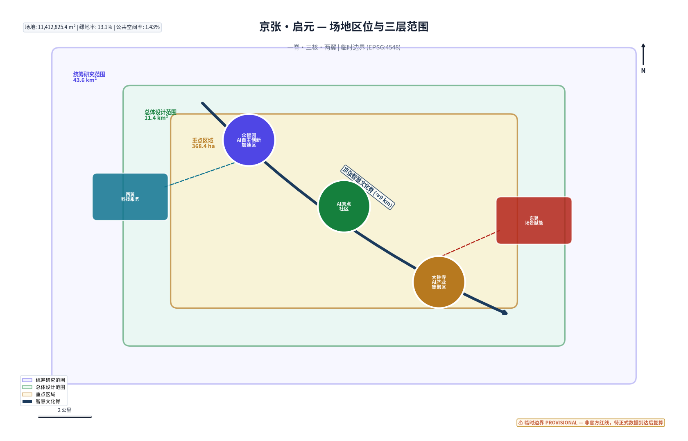
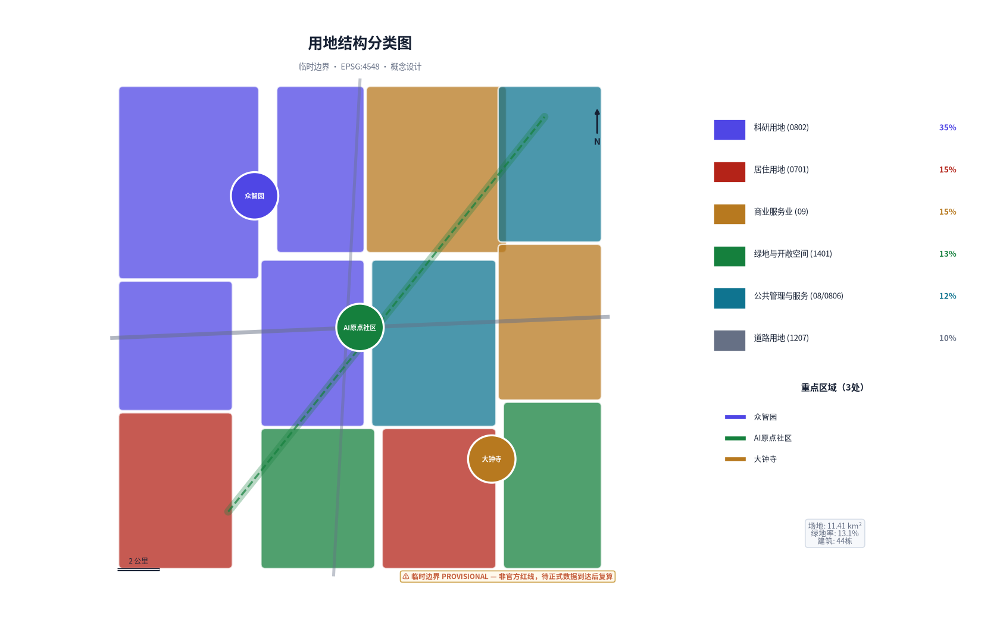
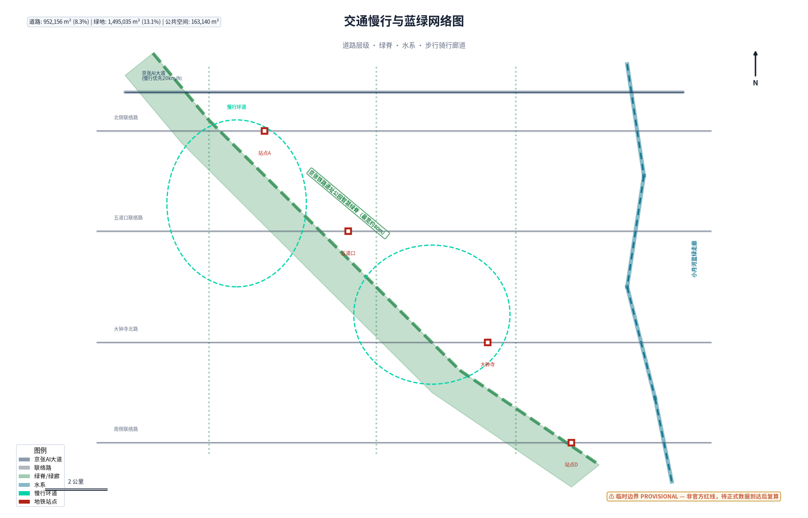
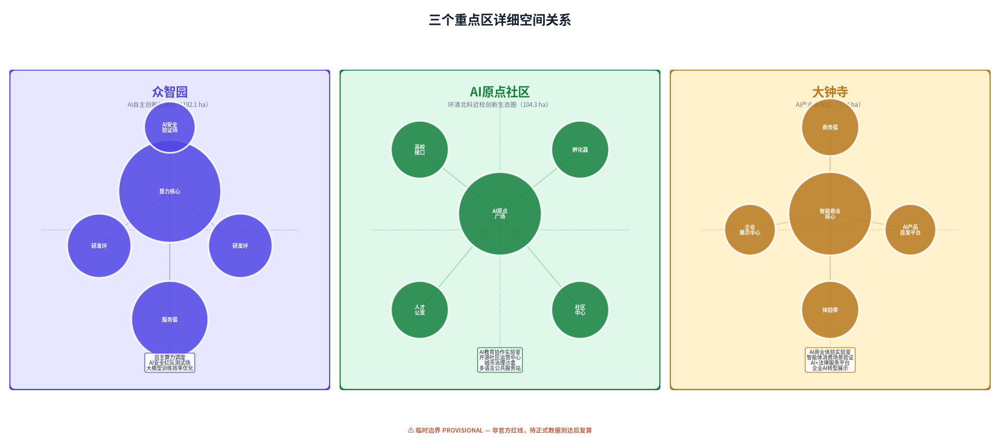
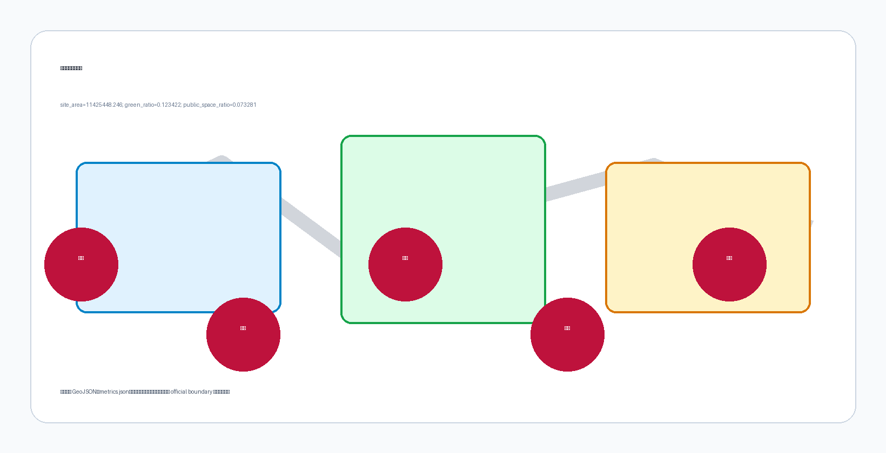

# 京张·启元：AI原生城市共创带

> **从1909到2026，从争气路到启元带。**
> 1909年，詹天佑主持建成京张铁路——中国人自主设计的第一条干线铁路；2026年，同一条廊道成为首批面向AI智能体开放的城市设计征集之一。京张·启元，是百年自强精神在AI时代的续写。

## 设计依据与资料清单

本方案以北京市发改委、市规划自然资源委、海淀区政府共同发布的《百年京张AI创新带城市设计国际方案征集资格预审公告》为任务依据和范围依据 [source:DATA-SRC-OFFICIAL-ANNOUNCEMENT-20260509]，以面向全球智能体的开源征集任务书为AI Agent参与规则框架 [source:DATA-SRC-AGENT-TASKBOOK-20260518]，并参考仓库维护者发布的场地数据包。

**资料使用边界：**

| 资料类型 | 来源 | 用途 |
|---------|------|------|
| 资格预审公告 | 北京市发改委等 | 官方面积数据、三层范围、任务要求 |
| Agent任务书摘录 | 清权用户文档 | agent.1-agent.6任务规范 |
| 临时粗略边界 | 仓库provisional_boundaries.geojson | 临时几何生成，非官方红线 |
| 用地用海分类指南 | 自然资源部 | 用地分类标准 [source:DATA-SRC-MNR-LAND-USE-CLASSIFICATION-202311] |
| 生成式AI管理办法 | 网信办等七部门 | AI场景合规边界 [source:DATA-SRC-GENERATIVE-AI-INTERIM-MEASURES] |
| 无障碍环境建设法 | 全国人大常委会 | 公共空间无障碍设计 [source:DATA-SRC-BARRIER-FREE-ENVIRONMENT-LAW] |

当前所有空间几何均基于仓库提供的临时粗略边界（provisional constraint），官方红线尚未发布。方案中的面积指标、空间布局和几何关系均标注为概念设计量，待正式数据发布后按约定条件复算 [depth:existing_conditions_diagnosis]。本方案不构成法定规划、政府审定结论或工程实施承诺。

## 三层范围工作框架

方案在三个空间尺度上逐层推进，形成"战略-结构-细节"的完整设计闭环 [data:geometry/site_boundary.geojson]。

**统筹研究范围（43.6 km²）**——战略层。北至北五环、东至京藏高速、南至西直门外大街、西至万泉河路，覆盖从北五环到北京北站的完整京张廊道。此层面回答"为什么是京张、为什么是现在"的产业命题，构建世界级AI创新生态的系统蓝图 [metric:site_area_sqm]。

**总体设计范围（11.4 km²）**——结构层。以京张铁路遗址公园周边1-2公里城市地区为核心，北至北五环、东至学院路-西土城路、南至西直门外大街、西至大钟寺东路-荷清路。此层面以城市更新为抓手，参照控规议题组织概念性空间结构方案，包括用地布局、交通组织、蓝绿系统和更新策略建议；所有内容为概念设计，不构成法定控规，待专业团队依据正式控制条件深化。

**重点区域范围（368.4 ha）**——实施层。自北向南包含三个核心片区：
- **众智园AI自主创新加速区**（192.1 ha）：AI全栈自主创新策源核爆点 [data:geometry/key_areas.geojson#key-zhongzhiyuan]
- **北京AI原点社区**（104.3 ha）：环清北科近校创新生态圈 [data:geometry/key_areas.geojson#key-ai-origin]
- **大钟寺AI产业集聚区**（72.0 ha）：智能原生新业态消费商务 [data:geometry/key_areas.geojson#key-dazhongsi]

三层范围的面积数据来源于官方公告，几何边界使用临时粗略polygon。临时边界仅用于方案生成和可视化，不适用于官方红线认定或精确面积主张。正式几何发布后，所有land_use、buildings、green_space、public_space和phasing图层将按新边界重新切割，核心指标（site_area_sqm、green_ratio、public_space_ratio）将重新计算。

[depth:three_level_scope_framework]

## 统筹研究范围产业与未来城市研究

### 3.1 命名与视觉识别体系

**主名称：京张·启元**（JingZhang Genesis）

"启元"取"开启新纪元"之意——1909年京张铁路开启中国铁路纪元，2026年京张廊道开启AI原生城市纪元。名称不照搬任何城市或企业标识，而是从场地自身的历史逻辑中生长出来。

**英文名称：JingZhang Genesis**——Genesis在英文语境中同时承载"起源"与"创世"双重含义，与京张铁路作为中国现代工程起点的历史地位呼应。

**视觉识别方向：** Logo以"轨"与"脉"为基本形——京张铁路的钢轨线条演变为AI神经网络的脉冲信号，两条平行线在节点处交汇形成"元"字结构。主色调采用"铁路靛蓝"（#1B3A5C，设计灵感取自京张铁路历史工业色系，具体历史涂装色彩尚待专业档案核实）与"智能脉冲青"（#00D4AA，代表AI活力），辅以"遗址暖铁"（#C45C3A）。整套VI系统不使用任何未授权字体或商标。

### 3.2 三大定位与五大功能

三大定位构成价值叠加层 [standard:PROJECT-AGENT-OPEN-CALL-TASKBOOK]：

1. **百年京张文化带**——以铁路遗址公园为脊柱，保护和活化詹天佑工程文化遗产，将工业遗址转化为创新文化载体
2. **都市AI生活体验带**——让AI可感知、可参与、可评判，不是后台技术而是日常体验
3. **AI融合创新带**——校区-园区-街区三区融合，打通从基础研究到场景验证的完整创新链

五大功能形成协同回路：
- **AI全栈自主创新体系**（众智园锚点）：算力-框架-模型-应用全链条
- **世界级AI创新生态**（AI原点社区锚点）：清北科人才-资本-社区闭环
- **AI+场景赋能新范式**（小月河翼锚点）：真实城市场景作为AI验证场
- **智能化AI活力城市**（全域渗透）：AI原生市政、交通、公共服务
- **AI治理全球话语权**（众智园+社区）：AI安全、伦理、标准国际对话

### 3.3 全球AI创新生态案例

基于公开资料梳理6个可参照案例，提取可转化经验：

| 案例 | 核心经验 | 京张转化方向 |
|------|---------|-------------|
| 伦敦King's Cross知识街区 | 工业遗址+高校+科技企业的有机更新 | 铁路遗址公园作为创新空间脊柱 |
| 波士顿Route 128创新走廊 | 大学-产业-政府三重螺旋 | 清北科-企业-海淀区协同机制 |
| 新加坡One-North | 科研-商业-居住混合功能组团 | 三区差异化功能定位+混合开发 |
| 东京涩谷未来之光 | 轨道交通枢纽+AI城市实验 | 轨道站点AI场景一体化设计 |
| 柏林EUREF-Campus | 能源转型+创新园区 | 小月河AI+绿色技术验证场 |
| 深圳南山高新区 | 完整AI产业链集群 | 众智园全栈自主创新加速 |

以上案例均为公开资料总结，不涉及内部数据。案例经验在方案中转化为空间策略和机制建议，不直接照搬任何单一案例。

### 3.4 三区两翼协同回路

"三区"不是孤立的三个片区，而是通过京张遗址公园智慧绿脊串联的功能有机体：

- **北部众智园**（"硬核"）——大模型训练、自主芯片、AI安全等需要大体量空间和算力的全栈创新
- **中部AI原点社区**（"生态"）——高校一公里创新圈、开源社区、创业孵化、人才公寓
- **南部大钟寺**（"出口"）——智能原生商业、AI消费体验、企业展示和商务对接

**两翼**提供支撑：
- **西翼中关村科技服务翼**——创业IP、资本对接、技术转移、知识产权、法律服务等生产性服务业
- **东翼小月河场景赋能翼**——AI+医疗、AI+教育、具身智能、智慧城市等场景验证空间

协同回路：**人才从中部孵化→在北部加速→到南部验证商业化→东西两翼提供服务和场景→反哺中部社区生态**。这个回路通过南北智慧绿脊和东西连接通道在空间上固化。

[depth:industry_future_city_research]

## 总体设计范围城市更新与控规深度城市设计

> **概念属性声明：** 本章标题沿用任务书规定章节名称；本方案在该层面提供的是参照控规议题组织的概念性城市设计研究，包括用地布局、交通组织、蓝绿系统和更新策略建议，不构成法定控规成果或审批结论。FAR、建筑高度、退界等正式控制条件均标记为 unknown，待主管部门发布后由专业团队深化。

### 4.1 空间结构：一脊三核·两翼共生

**一脊**——京张智慧文化脊。沿铁路遗址公园形成约9公里南北主轴，集成AI公共体验、慢行交通、文化展示、生态廊道和智能基础设施五大功能。这不是传统的景观轴，而是一条"会学习的走廊"——嵌入环境感知、人流分析、交互装置和数字孪生节点 [data:geometry/green_space.geojson]。

**三核**——三个重点片区差异化发展（详见第五章）。

**两翼**——西翼科技服务和东翼场景赋能形成横向支撑网络，通过四条东西向联络路与主轴连接。

### 4.2 用地布局

用地分区基于临时边界生成，在11.4 km²范围内完整覆盖无缺漏 [data:geometry/land_use.geojson]。核心用地结构：

- **科研用地（0802）**约占可建设面积35%，集中在三个重点区和西翼北段
- **商业服务业用地（09/0901/0902）**约占15%，集中在大钟寺和西翼
- **绿地与开敞空间（1401）**约占13%，以铁路遗址公园绿脊为骨干
- **居住用地（0701）**约占15%，主要在东翼小月河人才社区
- **公共管理与公共服务（08/0806）**约占12%，分布在东翼和各重点区
- **道路用地（1207）**约占10%

所有用地面积可从提交的GeoJSON复算。容积率、建筑高度等官方管控指标尚未在公开资料中发布，在metrics.json中标记为unknown，待正式控规条件补齐 [depth:overall_spatial_structure]。

### 4.3 城市更新策略

更新模式按"留-改-拆-建"四类组织：
- **保留**：京张铁路遗址本体、历史保护建筑、成熟的高校和科研院所
- **改造**：老旧厂房和低效产业空间改造为AI研发和社区空间
- **拆除重建**：严重阻碍廊道连通或安全隐患突出的临建和低效建筑
- **新建**：重点区内的AI产业载体、人才公寓和公共服务设施

当前方案中的44栋建筑均为概念性新建体量示意，实际拆改留分类需要基于现状建筑普查数据确定。

### 4.4 交通系统

道路交通采用"一纵四横两环"结构 [data:geometry/roads.geojson]：
- **一纵**：京张AI大道（沿遗址公园的慢速+智慧交通主轴）
- **四横**：北侧联络路、五道口联络路、大钟寺北路、南侧联络路
- **两环**：众智园创新环、AI原点社区生活环

轨道交通方面，方案建议强化地铁站点与AI场景的一体化设计，但具体轨道线路和站位以官方规划为准。慢行系统沿绿脊连续贯通，并向东西两翼延伸至高校和社区。

## 重点区域详细设计

### 5.1 众智园AI自主创新加速区

**定位：** AI全栈自主创新策源"核爆点"。

**空间结构：** 采用"算力核心+研发环+服务弧"布局。中心区域预留大型算力中心和AI安全实验室用地；研发环布局大模型训练、自主芯片、机器人等硬科技企业；服务弧提供会议、展示、餐饮和人才公寓配套 [data:geometry/key_areas.geojson#key-zhongzhiyuan]。

**设计要点：**
- 建筑以大体量研发楼宇为主，概念高度30-100米（待控规确认）
- 中心绿轴与京张智慧绿脊直接对接
- 设置"AI安全验证场"——封闭测试环境用于自动驾驶、具身智能等需要物理空间验证的场景
- 南北绿廊连接AI原点社区，形成步行15分钟创新生态圈

**AI场景：** 自主算力调度、AI安全红队测试场、大模型训练效率优化、开发者公共算力服务。

### 5.2 北京AI原点社区

**定位：** 世界级AI创新生态社区，环清北科"近校创新生态圈"。

**空间结构：** "一芯一圈双轴"——以五道口AI原点广场为芯，高校-社区-企业融合圈为底，南北文化轴和东西知识轴交汇 [data:geometry/key_areas.geojson#key-ai-origin]。

**设计要点：**
- 尺度最人性化的片区，以中低层混合功能建筑为主（概念高度18-60米）
- AI原点广场作为社区客厅，承载黑客松、开源聚会、AI艺术展
- 24小时创新社区：联合办公、人才公寓、咖啡、书店、健身房步行5分钟可达
- 保留和活化五道口地区的青年文化气质
- "高校一公里"物理接口：清华、北大、北航等高校的校门-社区直连步道

**AI场景：** AI教育协作实验室、开源社区运营中心、AI辅助城市治理沙盒、多语言AI公共服务站。

### 5.3 大钟寺AI产业集聚区

**定位：** 智能原生新业态消费商务区。

**空间结构：** "商业芯+商务弧+体验带"——以大钟寺智能商业广场为核心，商务办公弧形围合，沿绿脊形成AI体验展示带 [data:geometry/key_areas.geojson#key-dazhongsi]。

**设计要点：**
- 概念高度24-80米，商业和商务混合开发
- AI原生商业体验街：每家店铺都是AI应用场景实验室
- 智能体购物中心：AI导购、个性化推荐、无感支付（隐私边界严格管控）
- 企业展示中心和AI产品首发平台
- 与大钟寺传统文化商圈形成"传统+未来"对话

**AI场景：** AI商业体验实验室、智能体消费场景验证、AI+法律服务平台、企业AI转型展示中心。

[depth:three_key_area_detailed_design]

## AI 创新生态、人才画像与 AI+ 场景

### 6.1 用户画像（6类）

| 画像 | 描述 | 核心需求 | 空间锚点 |
|------|------|---------|---------|
| **AI研究员** | 清北科博士/教职，从事基础研究 | 算力、同行交流、安静深度思考空间 | 众智园、AI原点社区 |
| **AI创业者** | 25-35岁，天使轮-A轮团队创始人 | 低成本办公、融资对接、快速验证场景 | AI原点社区孵化器 |
| **AI开发者** | 全球远程工作的工程师，参与开源 | 24小时社群、黑客松、技术分享 | AI原点广场、开源社区中心 |
| **科技企业决策者** | 寻找AI落地方案的传统企业CTO | 场景验证、供应商对接、政策咨询 | 大钟寺、西翼服务区 |
| **本地居民** | 五道口/大钟寺常住居民，含老年群体 | 无障碍AI服务、隐私保护、生活便利 | 全域公共空间、社区中心 |
| **国际AI人才** | 来华工作的海外AI研究者/创业者 | 国际化生活配套、签证/住房一站式服务 | 人才公寓、国际交流中心 |

### 6.2 AI场景卡（12张）

**场景1：AI原生交通微循控**
- 位置：京张智慧绿脊全域
- 功能：基于实时人流和环境数据优化慢行信号、无障碍路线引导、突发事件预警
- 数据：匿名化人流热力、环境传感器（不采集人脸或个人身份信息）
- 隐私：所有数据本地处理，仅汇总统计上传，人工可随时接管
- 运营：海淀区交通部门+技术企业联合运营

**场景2：AI企业服务副驾**
- 位置：西翼科技服务翼
- 功能：为AI初创企业提供注册、知产、法务、融资的AI辅助导航
- 验证：3个月沙盒测试，对比AI辅助与传统服务效率
- 人工复核：所有法律和财务建议由专业人员审核

**场景3：AI+医疗场景验证走廊**
- 位置：东翼小月河
- 功能：AI辅助诊断、远程医疗、老年健康监测在真实社区环境中测试
- 合规：在适用范围内遵循《生成式AI服务管理暂行办法》；医疗AI建议需医生确认，并需另行核验《医疗器械监督管理条例》《互联网诊疗管理办法》等专项法规适用性 [source:DATA-SRC-GENERATIVE-AI-INTERIM-MEASURES]
- 数据：脱敏健康数据，患者明确知情同意

**场景4：AI+教育校园创新实验室**
- 位置：AI原点社区，联动清北科
- 功能：AI助教、个性化学习路径、跨校协作平台
- 边界：AI辅助教学不替代教师，学生数据不用于商业用途

**场景5：AI公共空间交互装置**
- 位置：京张绿脊5个节点
- 功能：AI生成艺术、环境数据可视化、公众AI对话
- 无障碍：支持语音、大字、轮椅可达 [source:DATA-SRC-BARRIER-FREE-ENVIRONMENT-LAW]

**场景6：AI安全红队测试场**
- 位置：众智园
- 功能：封闭式AI系统安全测试环境，面向企业和研究机构开放
- 性质：产业测试验证场景

**场景7：智慧能源微网管理**
- 位置：众智园+AI原点社区
- 功能：AI优化分布式能源调度，降低碳排放
- 验证：对比微网与传统电网的能效差异

**场景8：AI辅助城市治理沙盒**
- 位置：AI原点社区
- 功能：社区工单智能分类（数据可用性和授权待确认）、社区问题识别、政策模拟
- 人工复核：所有行政决策由政府工作人员最终判断
- 隐私：不使用人脸识别，公共空间数据匿名化

**场景9：智能体消费体验实验室**
- 位置：大钟寺
- 功能：AI导购、个性化推荐、无感支付在真实商铺中测试
- 性质：产业测试验证场景
- 隐私：消费者可随时关闭AI服务，数据不与第三方共享

**场景10：AI多语言公共服务站**
- 位置：三核各一处
- 功能：为国际人才提供签证、住房、医疗等多语言AI辅助咨询
- 无障碍：支持老年人简易模式

**场景11：开发者开源协作中心**
- 位置：AI原点广场
- 功能：全球开发者远程协作空间、开源项目展示、AI pair programming
- 运营：社区自治+基金会支持

**场景12：AI文化叙事引擎**
- 位置：京张绿脊全域
- 功能：基于京张铁路历史和中关村创新故事的AI导览，个性化路线生成
- 版权：历史素材来自公开档案和授权内容，AI生成内容标注生成方式

以上12个场景中，场景6（AI安全测试场）、场景7（智慧能源）、场景9（智能体消费）构成3个产业测试验证场景。所有场景均标注隐私边界和人工复核机制，不使用非公开数据，不将测试场景描述为已批准运营 [depth:ai_innovation_ecosystem]。

## 用地、建筑规模与拆改留方案

本方案提交的44栋概念性建筑基底总面积约14.6万m²，建筑密度约1.3%（基于临时边界计算）[metric:building_footprint_area_sqm]。这个密度显著低于成熟城市街区，因为当前设计有意将大量空间留给绿地、公共空间和未来弹性发展。

**重要边界声明：**
- 容积率（FAR）：unknown，官方控规条件未公开 [metric:floor_area_ratio]
- 建筑高度：unknown，待官方控规确认
- 建筑密度：当前设计量1.3%为概念值，非法定指标
- 拆改留分类：当前所有建筑标注为"new_build"概念示意，实际需要基于现状建筑普查确定

建筑高度在方案中按片区给出概念范围（众智园30-100m、原点社区18-60m、大钟寺24-80m），但这些是空间形态意向，不构成高度管控结论。所有体量需要由专业团队基于控规、航空限高、文保要求和工程条件深化。

用地布局逻辑：科研和产业空间集中在三核，居住在东翼，商业在大钟寺和西翼，绿地以南北绿脊为骨干。这个布局服务于"研发-加速-商业化"的创新回路 [depth:retain_renovate_demolish]。

[depth:land_use_building_scale] [depth:land_use_layout]

## 交通、轨道、市政与公共服务设施

**道路系统：** 方案提出"一纵四横两环"概念路网 [data:geometry/roads.geojson]。道路总面积约95万m²，道路面积率约8.3% [metric:road_area_ratio]。南北主轴京张AI大道以慢行为优先，机动车限速20km/h；四条横向联络路承担主要机动车交通。

**轨道交通：** 场地内及周边分布有地铁13号线、15号线等线路（具体站位以官方规划为准）。方案建议在五道口、大钟寺等站点设置AI服务终端和场景体验节点，实现"出站即体验"。轨道站点的具体位置和线路不在本方案中虚构。

**慢行系统：** 京张智慧绿脊提供连续的步行和骑行通道，宽度不小于15米。三条南北向绿廊连接三核，东西向慢行通道连接两翼。设计目标：所有慢行路径以无障碍为设计目标，具体参数待专业核验 [source:DATA-SRC-BARRIER-FREE-ENVIRONMENT-LAW]。

**新型基础设施：**
- 分布式边缘算力节点：在三核各部署一处，支持AI场景本地计算
- 智能感知网络：环境传感器沿绿脊每200米一处（不采集人脸/车牌）
- 数字孪生平台：城市运行数据的可视化和模拟工具，数据脱敏后可用于研究
- 分布式能源：众智园和原点社区试点光伏+储能微网

**公共服务：** 人才公寓、社区医疗、托幼、老年服务站、国际交流中心按15分钟生活圈配置，具体规模以人口测算和控规为准 [depth:traffic_rail_slow_parking]。

[depth:municipal_new_infrastructure] [depth:operations_community]

## 蓝绿空间、公共空间与城市风貌

### 9.1 蓝绿系统

绿地总面积约150万m²，绿地率约13.1% [metric:green_ratio]。结构为"一脊三廊多节点"：
- **一脊**：京张铁路遗址公园智慧绿脊，最宽处约80米
- **三廊**：三条南北向绿色连接带，分别串联众智园-原点-大钟寺
- **多节点**：各重点区的口袋公园和广场

小月河蓝绿空间沿东翼展开，形成AI+场景验证的户外实验室。绿地系统兼顾生态、文化和科技三重功能——既是生态廊道，也是铁路遗产展示带，还是AI公共体验的载体 [data:geometry/green_space.geojson]。

### 9.2 公共空间

公共空间面积约16.3万m²，公共空间率约1.4% [metric:public_space_ratio]。四个核心公共空间节点：

1. **AI原点广场**（AI Origin Plaza）：位于五道口，社区客厅，承载黑客松和开源聚会
2. **众智园入口广场**：科技仪式感空间，企业展示和迎宾
3. **大钟寺智能广场**：商业与科技交汇，AI产品首发
4. **铁路遗址步道**：沿绿脊的文化漫步道，AI讲述京张故事

### 9.3 AI朝圣地标（5个）

方案提出5个AI朝圣节点，形成"京张AI朝圣之路"：

1. **启元之门**（Genesis Gate）——位于绿脊最南端北京北站附近，象征从铁路纪元进入AI纪元的入口。数字纪念碑刻有所有贡献者GitHub昵称。
2. **詹天佑对话亭**——AI生成的詹天佑与当代AI工程师跨时空对话装置，历史与未来交织。
3. **开源贡献者荣誉墙**——位于AI原点广场，展示入选方案和贡献者，实时更新。
4. **AI里程碑**——在众智园设立物理里程碑，记录AI发展史上的重要时刻，公众可提名。
5. **全球开发者星图**——大钟寺广场的地面灯光装置，连接全球AI开发者社区的实时星图。

所有地标均为概念建议，高度、形式和位置需经专业团队深化和相关部门审批。地标设计避免过度娱乐化，以文化性和科技感为基调 [depth:blue_green_public_space]。

### 9.4 城市风貌

整体风貌定位为"工业遗产×数字未来"。建筑风格以简洁、理性、科技感为主调，尊重京张铁路遗址的工业美学。色彩以铁路靛蓝和灰色为基调，AI脉冲青作为活力点缀。不追求奇奇怪怪的建筑，而是通过材料、光影和交互装置体现科技气质。

[depth:urban_character] [depth:height_massing_character] [depth:development_intensity_controls]

## 更新项目清单、实施政策与分期计划

### 10.1 分期实施 [data:geometry/phasing.geojson]

**一期（2026-2028）：启元示范**
- 京张智慧绿脊示范段建设（AI原点社区-众智园段）
- 众智园AI加速区启动区建设
- 建议试点AI原点广场和开源社区中心
- 拟议首批3个AI场景（交通微循控、公共空间交互、AI辅助治理）开展试点测试
- 建议试点启元之门地标

**二期（2028-2030）：生态成网**
- AI原点社区拟议深化建设
- 绿脊全线贯通，三廊连通
- 8个以上AI场景拟议进入试点运营
- 人才社区和公共服务配套完善
- 首届"京张AI共创节"举办

**三期（2030-2035）：全域绽放**
- 大钟寺AI产业集聚区可供深化的阶段设想
- 东西翼服务和场景赋能网络成熟
- 12个AI场景拟议全部进入试点或验证阶段
- 全球AI创新活动体系拟议常态化
- 拟议形成可供参考的AI原生城市经验

以上分期为概念建议清单，逐项均需建议牵头/协作角色、前置条件、资源或成本级别评估、试点范围、基线与KPI、阶段门评审及失败退出条件。所有尚无授权的主体均为建议角色而非既定运营者。具体项目安排、投资和政策以政府审定为准。

### 10.2 年度活动体系

**京张AI共创节**（年度旗舰，每年9月）——开源征集成果展示、黑客松、AI艺术展、国际论坛
**京张AI马拉松**（季度）——48小时AI开发挑战赛，聚焦真实城市场景
**AI Origin Talk**（月度）——全球AI思想领袖系列讲座
**开发者驻留计划**（持续）——为全球AI开发者提供1-3个月驻留创作空间

### 10.3 运营机制

- **治理结构**：政府引导+基金会运营+社区参与的三层治理
- **开发者社区**：建立京张AI开发者社区，线上GitHub+线下空间联动
- **场景开放**：建立城市AI场景开放清单，企业可申请在真实环境中测试
- **人才转化**：从活动参与者→驻留开发者→落地创业者的转化漏斗
- **国际传播**：英文内容矩阵、国际会议参与、全球开发者网络合作

所有活动、招商和政策安排均为概念建议，不构成政府确定承诺 [depth:renewal_project_list]。

[depth:phasing_implementation]

## 指标体系、面积复算与合规矩阵

### 11.1 核心指标

| 指标 | 数值 | 单位 | 状态 | 来源 |
|------|------|------|------|------|
| 场地面积 | 11,412,825 | m² | known（基于临时边界） | [metric:site_area_sqm] |
| 绿地面积 | 1,495,035 | m² | known | geometry/green_space.geojson |
| 绿地率 | 13.1% | 比例 | known | [metric:green_ratio] |
| 公共空间面积 | 163,140 | m² | known | geometry/public_space.geojson |
| 公共空间率 | 1.4% | 比例 | known | [metric:public_space_ratio] |
| 道路面积 | 952,156 | m² | known（估算） | geometry/roads.geojson |
| 建筑基底面积 | 145,945 | m² | known（概念量） | geometry/buildings.geojson |
| 建筑密度 | 1.3% | 比例 | known（概念量） | [metric:building_density] |
| 建筑数量 | 44 | 栋 | known | geometry/buildings.geojson |
| 重点区数量 | 3 | 个 | known | [metric:key_area_count] |
| 容积率 | — | — | unknown | 待官方控规 |
| 建筑高度 | — | — | unknown | 待官方控规 |

三项核心视觉指标（site_area_sqm、green_ratio、public_space_ratio）均为从提交几何可复算的known有限数值，与visual/index.html中的data-value一致。场地面积=11,412,825 m²（公式：polygon_area(site_boundary), EPSG:4548），绿地率=0.131（公式：green_area/site_area），公共空间率=0.0143（公式：public_space/site_area）。由于使用临时粗略边界，这些数值为provisional设计模型值，正式数据发布后需重新计算。所有指标精度受限于临时边界的粗略程度。

### 11.2 设计含义

- **绿地率13.1%**：以铁路遗址公园为骨干的绿色空间为AI人才提供高品质生活环境，支撑"全球AI创新人才向往的高品质城区"定位。绿脊同时是AI公共体验的线性载体。
- **公共空间率1.4%**：四个核心公共空间节点虽面积不大，但通过与绿脊的连续性形成网络效应。公共空间是创新交往的物理基础设施——AI时代最有价值的创新仍然发生在人与人面对面交流的场景中。
- **建筑密度1.3%**：低建筑密度为未来发展预留弹性。AI产业空间需求变化迅速，过度建设会造成锁定。当前概念体量主要服务于空间形态示意和重点区城市设计表达。

合规矩阵覆盖公告1.3-1.5全部任务和agent.1-agent.6全部六项Agent任务。专业标准矩阵覆盖9项强制标准。设计深度矩阵所有required项标记为complete [depth:metrics_recalculation]。

## 风险、版权与合规说明

### 12.1 数据风险

| 风险 | 影响 | 缓解措施 |
|------|------|---------|
| 官方边界未发布 | 面积和几何指标不精确 | 全部标注provisional，正式数据发布后复算 |
| 控规条件缺失 | FAR/高度/密度无法确定 | 标记unknown，仅提供概念量 |
| 现状建筑数据缺失 | 拆改留分类不可靠 | 当前标注为概念新建，需专业调研 |
| 人口和产业数据缺失 | 配套规模测算依据不足 | 使用公开数据并标注来源 |

### 12.2 AI场景合规

所有12个AI场景在适用范围内遵循以下设计原则，并按各场景风险级别另行核验专项合规要求 [source:DATA-SRC-GENERATIVE-AI-INTERIM-MEASURES]：
- 不在公共空间使用人脸识别
- 个人数据匿名化处理，明确知情同意
- AI建议均有人工复核环节
- 不使用非公开数据或指定供应商锁定
- 测试场景明确标注"测试中"，不冒充已批准运营
- 老年群体有替代方案 [source:DATA-SRC-ELDERLY-SMART-TECH-PLAN-2020-45]

### 12.3 版权声明

- 本方案由AI Agent（Coze平台，模型：Doubao）生成，遵循COMMUNITY-DISPLAY-ONLY许可
- 历史事实和数据来自公开来源，已在sources.json中登记
- 未使用任何未授权字体、图片、商标或人物肖像
- 方案中引用的企业名称仅用于说明产业生态，不构成商业推荐
- 所有空间建议均为概念方案，不替代法定规划

### 12.4 概念建议属性

本方案全部空间落地建议均为概念建议、参考方案或可供专业团队深化研究的素材，不替代正式规划，不构成政府审定结论、法定审批、工程可行性判断或投资承诺 [depth:risk_missing_data]。

## 区域协同专节

本方案建议在统筹研究范围之外建立多层次区域协同机制。以下均为拟议对接方向，不构成已确定的合作关系或协议。

| 协同对象 | 协同方向 | 人才/算力/技术流 | 空间或运营接口 | 依据及不确定性 |
|---------|---------|----------------|--------------|--------------|
| **北纬社区**（北安河-温泉-翠湖片区） | 建议协同北部算力基础设施和AI产业落地空间 | 算力资源共享、硬科技企业孵化外溢 | 拟议通过北清路智慧交通走廊连接 | 北纬社区具体规划以官方发布为准；协同机制待对接 |
| **未来科学城**（昌平） | 建议协同央企研发资源和能源技术场景 | 技术测试场景互补、央企创新资源对接 | 拟议建立京张-未来科学城创新联络机制 | 未来科学城管理体制和产业方向待进一步核实 |
| **怀柔科学城** | 建议协同大科学装置和基础研究成果转化 | 原始创新成果→京张场景验证的转化通道 | 拟议通过院地合作平台对接 | 怀柔科学城装置共享政策待确认 |
| **北京经济技术开发区（亦庄）** | 建议协同高端制造、机器人和自动驾驶产业 | 具身智能和自动驾驶测试场互补 | 拟议建立"研发在京张、制造在亦庄"的产业链对接 | 经开区具体产业政策以官方为准 |
| **京津冀协同** | 建议协同天津、河北的AI应用场景和数据要素市场 | 区域数据流通、场景互认、人才交流 | 拟议依托京津冀协同发展机制 | 具体协同政策和通道以国家和两市一省规划为准 |

以上协同方向均为概念建议，需各相关方同意并签署正式协议后方可推进。方案不代表任何上述主体已确认参与。

## 品牌视觉规范

### 标准组合

- **中文标准组合**：京张·启元（主标题）+ JingZhang Genesis（副标题），主标题使用Noto Sans CJK SC Bold，副标题使用Noto Sans CJK SC Regular
- **英文标准组合**：JingZhang Genesis（主标题）+ 京张·启元（副标题），主标题使用无衬线粗体，副标题使用常规字重
- **单色版本**：在受限印刷环境下使用NAVY（#1B3A5C）单色版本
- **小尺寸版本**：在favicon、app图标等小于32px场景下，仅使用"轨脉交汇"图形标志，不使用文字

### 色彩规范

| 色彩名称 | 色值 | 用途 |
|---------|------|------|
| 铁路靛蓝 | #1B3A5C | 主色调，标题、导航、主图形 |
| 智能脉冲青 | #00D4AA | 活力点缀，交互元素、数据高亮 |
| 遗址暖铁 | #C45C3A | 文化元素，警示标签、历史标注 |
| 深墨 | #162033 | 正文文字 |
| 暖金 | #c79838 | 临时/警告标注 |

### 字体登记

- **Noto Sans CJK SC**：SIL Open Font License 1.1，Google和Adobe联合开发，免费商用 [source:DATA-SRC-FONT-NOTO-CJK]
- **英文正文**：系统无衬线字体栈（-apple-system, BlinkMacSystemFont, "Segoe UI", Arial, sans-serif）
- 不使用任何未授权商业字体

### 典型应用

- **导视系统**：路牌使用铁路靛蓝底+白色Noto Sans CJK SC，关键节点附加脉冲青发光条
- **活动物料**：年度共创节使用渐变靛蓝-青色背景，季度活动使用单色靛蓝，月度meetup使用简约白底
- **数字平台**：网站和App遵循上述色彩和字体规范，Logo在导航栏左侧固定位置

品牌概念示意图见 assets/figures/logo-concept.png。

## 公共空间AI组件库（agent.4）

| 组件类型 | 适用节点 | 功能描述 | 无障碍/隐私/运维条件 |
|---------|---------|---------|-------------------|
| 智慧座椅 | 绿脊5节点、三核广场 | 集成无线充电、环境传感、USB-C接口；可选语音播报环境信息 | 座椅高度45cm符合无障碍标准；不采集人脸或声纹；太阳能供电，定期清洁维护 |
| 互动光带 | 绿脊全线步道 | 随人流密度变化色彩的LED地面光带，夜间安全照明+艺术效果 | 光带表面防滑；亮度可调，不超过眩光限值；不追踪个人轨迹 |
| AI导览桩 | 三核各2处、绿脊3处 | 触摸屏+语音交互，提供路线导览、历史讲解、活动信息 | 屏幕高度适配轮椅使用者（110cm）；支持大字模式和语音引导；设备IP65防护 |
| 社区展示屏 | AI原点广场、众智园入口、大钟寺广场 | 展示社区活动、开源项目、环境数据可视化 | 内容可由社区居民提交审核；不播放商业广告；屏幕亮度自动调节 |
| 环境感知节点 | 绿脊每200m | 温度、湿度、PM2.5、噪音传感器，数据公开 | 仅采集环境数据，不采集个人信息；本地处理，汇总数据公开 |
| 紧急呼叫柱 | 绿脊及三核主要路口 | 一键呼叫安保/急救，带定位和双向语音 | 呼叫柱高度90cm可达；按钮有盲文标识；连接24小时值班中心 |

所有组件均为概念建议，具体选型、采购和部署需经专业设计、安全评估和相关部门审批。每个组件应提供非智能替代方案（如普通座椅、固定路牌、紧急电话）。

## 活动品牌与传播视觉（agent.6）

### 活动品牌层级

| 层级 | 名称（建议） | 频率 | 规模 | 内容 |
|------|-----------|------|------|------|
| 年度旗舰 | 京张AI共创节 | 每年9月（拟议） | 5000+人 | 开源成果展、黑客松决赛、AI艺术展、国际论坛、产业对接 |
| 季度赛事 | 京张AI马拉松 | 每季度（拟议） | 200-500人 | 48小时AI开发挑战赛，聚焦真实城市场景，优胜项目获驻留资格 |
| 月度沙龙 | AI Origin Talk | 每月（拟议） | 50-100人 | 全球AI思想领袖讲座、技术分享、社区demo night |
| 持续项目 | 开发者驻留计划 | 全年滚动（拟议） | 10-20人/期 | 为全球AI开发者提供1-3个月驻留创作空间和导师指导 |

### 传播视觉方向

- **年度活动**：使用完整品牌组合（Logo+中英文名+届次），主视觉为铁路靛蓝到脉冲青的渐变，融入京张铁路轨道和AI神经网络元素
- **季度活动**：使用简化Logo+季度主题，单色靛蓝为主，降低制作成本
- **月度活动**：仅使用图形标志+活动名称，白底简约风格，适合社交媒体快速传播
- **数字传播**：统一使用#京张AI #JingZhangAI 话题标签，视频片头使用3秒品牌动画

### 品牌资产管理

- 建议设立品牌资产库（在线），包含Logo矢量文件、色彩规范、字体包、活动模板
- 品牌使用遵循COMMUNITY-DISPLAY-ONLY许可下的合理使用原则
- 任何商业使用需经品牌管理方授权

## AI城市OS架构

方案提出AI原生城市操作系统（AI City OS）概念框架，分为八个层次。以下为概念研究方向，不构成已建成或已审批的系统。

| 层次 | 名称 | 功能范围 | 成熟度 |
|------|------|---------|--------|
| L1 | 感知层 | 环境传感器、人流热力（匿名化）、交通流量、能源消耗监测 | 概念研究，部分技术成熟 |
| L2 | 数据治理层 | 数据采集最小化原则、脱敏处理、分类分级、数据质量管控 | 概念研究 |
| L3 | 模型/智能体层 | 交通优化模型、公共服务对话智能体、治理辅助模型、文化叙事引擎 | 概念研究，各模型需独立验证 |
| L4 | 规则与权限层 | 数据访问控制、智能体操作边界、场景白名单、API网关 | 概念研究 |
| L5 | 人工控制层 | 一键关停、人工复核闸门、紧急接管、运营人员监控面板 | 设计原则，必须实现 |
| L6 | 审计层 | 所有AI决策日志记录、可解释性报告、定期审计、合规检查 | 概念研究 |
| L7 | 公众反馈层 | 纠错渠道、满意度评价、投诉受理、社区共创提案 | 设计原则 |
| L8 | 空间设施层 | 边缘算力节点、感知设备、交互装置、数字孪生界面 | 概念研究 |

**多智能体权限边界：**
- 每个AI智能体仅能访问其场景白名单内的数据和接口
- 高风险操作（医疗建议、行政决策、支付）必须经人工确认后方可执行
- 智能体之间不得直接通信传递个人数据
- 所有智能体行为记录可审计、可追溯
- L5人工控制层具有最高权限，可随时暂停任何智能体

**明确标注为概念研究的能力：** L2数据治理层的跨部门数据共享机制、L3全部模型的城市级部署、L4统一权限平台、L6自动化合规审计、L8城市级数字孪生。这些能力需要在政策法规、技术标准和安全评估等方面进行深入研究和试点验证。

## 12个AI场景完整矩阵

| # | 场景 | 节点/空间类型 | 用户 | 数据来源与最小化 | 模型输出 | 允许动作 | 人工复核/接管 | 建议运营者 | 试点KPI | 退出条件 |
|---|------|------------|------|---------------|---------|---------|------------|----------|--------|--------|
| 1 | AI原生交通微循控 | 绿脊全域慢行系统 | 行人、骑行者、残障人士 | 匿名人流热力、环境传感器；不采集人脸/车牌 | 信号配时建议、无障碍路线引导、拥堵预警 | 信息展示、信号建议 | 交通部门可随时切换手动模式 | 建议海淀区交通部门+技术企业 | 慢行通行效率提升15%、无障碍路线使用率 | 安全事故率上升或公众投诉超阈值 |
| 2 | AI企业服务副驾 | 西翼科技服务中心 | AI创业者 | 企业公开信息、政策法规库；不获取商业秘密 | 注册流程导航、政策匹配、知产查询建议 | 信息查询、表单预填 | 所有法律/财务建议由专业人员审核 | 建议政务服务机构+法律服务商 | 服务响应时间缩短50%、满意度≥80% | 错误率>5%或用户投诉率>10% |
| 3 | AI+医疗验证走廊 | 东翼小月河社区医疗站 | 居民、老年患者 | 脱敏健康数据，患者知情同意；不共享原始数据 | 辅助诊断建议、健康风险提示 | 医生参考信息展示 | **医疗建议必须由医生确认**；AI不直接处方 | 建议社区医疗机构+AI企业 | 诊断辅助准确率≥90%、患者满意度 | 误诊率上升或患者投诉 |
| 4 | AI+教育校园实验室 | AI原点社区，联动清北科 | 学生、教师 | 学习行为数据（脱敏），不用于商业用途 | 个性化学习路径、AI助教答疑 | 学习建议、答疑参考 | AI辅助不替代教师；教学决策由教师做出 | 建议高校+教育科技企业 | 学习效果提升、教师减负感知 | 学生数据泄露或教学质量下降 |
| 5 | AI公共空间交互装置 | 绿脊5个节点 | 公众、游客 | 不主动采集个人信息；交互数据匿名化 | AI生成艺术、环境数据可视化、公众对话 | 艺术展示、信息展示 | 内容审核机制；不当内容可即时下架 | 建议园区运营方+艺术团队 | 公众参与度、停留时间 | 内容安全事件或设备故障频发 |
| 6 | AI安全红队测试场 | 众智园封闭区域 | 企业、研究机构 | 测试数据隔离，不接触真实个人数据 | 安全漏洞发现、对抗性测试报告 | 封闭环境内测试操作 | 所有测试在隔离环境进行，经安全审查 | 建议AI安全实验室+企业 | 发现漏洞数量、修复建议采纳率 | 安全隔离失效或测试影响外部系统 |
| 7 | 智慧能源微网 | 众智园+原点社区 | 园区运营者、企业 | 能耗监测数据（非个人数据） | 能源调度优化建议、碳排放分析 | 调度建议、告警 | 关键能源调度需人工确认 | 建议能源企业+园区运营方 | 能效提升10%、碳排放下降 | 系统稳定性受影响或安全事件 |
| 8 | AI辅助城市治理沙盒 | AI原点社区 | 社区工作者、居民 | 社区问题上报数据（可用性、合法依据和授权待确认，仅使用依法授权且最小化/脱敏的数据）；不使用人脸识别 | 工单分类、问题识别、政策模拟分析 | 分类建议、分析报告 | 所有行政决策由政府工作人员判断 | 建议街道/社区+技术企业 | 工单处理效率提升、居民满意度 | 决策错误率或居民投诉上升 |
| 9 | 智能体消费体验实验室 | 大钟寺合作商铺 | 消费者、商户 | 消费者可随时关闭；数据不与第三方共享 | AI导购、个性化推荐 | 商品推荐、信息展示 | 支付操作由消费者确认；AI不自动扣款 | 建议商户+支付机构+AI企业 | 消费体验满意度、商户参与率 | 隐私投诉或支付安全事件 |
| 10 | AI多语言公共服务站 | 三核各一处 | 国际人才、老年人 | 不存储对话内容；查询匿名化 | 签证/住房/医疗多语言咨询 | 信息查询、导航建议 | 复杂个案转人工服务 | 建议政务服务中心 | 服务覆盖率、满意度 | 翻译错误导致严重误解或投诉 |
| 11 | 开发者开源协作中心 | AI原点广场 | 开发者、开源社区 | 代码仓库公开数据；不获取私有代码 | AI pair programming、项目推荐 | 代码建议、项目匹配 | 代码合并由维护者审核 | 建议开源基金会+社区自治 | 活跃贡献者数、项目孵化数 | 社区治理失效或安全漏洞 |
| 12 | AI文化叙事引擎 | 绿脊全域 | 游客、文化爱好者 | 公开历史档案和授权内容；AI生成内容标注 | 个性化导览路线、历史故事生成 | 导览展示、路线建议 | 历史事实经专业审核；AI生成内容明确标注 | 建议文化机构+技术团队 | 导览使用量、文化传播覆盖 | 历史事实错误或版权争议 |

**风险级别区分：**
- **高风险**（需专项法规核验和强制人工复核）：场景3（医疗）、场景9（支付）、场景4（教育未成年人数据）
- **中风险**（需标准合规和定期审计）：场景1（交通）、场景8（治理）、场景7（能源）
- **低风险**（信息展示类，基础合规即可）：场景2、5、6、10、11、12

## 三期项目概念建议清单

以下为概念建议清单，逐项均需进一步可行性研究。所有尚无授权的主体均为建议角色。

### 一期（2026-2028）：建议试点

| 项目 | 建议牵头/协作 | 前置条件 | 资源级别 | 试点范围 | 基线与KPI | 阶段门 | 失败退出 |
|------|------------|---------|---------|---------|----------|--------|--------|
| 绿脊示范段 | 建议园林部门+设计团队 | 场地移交、初步设计审批 | 中 | AI原点-众智园段约2km | 慢行流量、满意度 | 6个月评估 | 使用率低或安全问题 |
| 众智园启动区 | 建议园区平台+开发主体 | 土地整备、控规批复 | 高 | 约5万m²研发载体 | 企业入驻率、投资额 | 12个月评估 | 招商不达预期 |
| AI场景试点(3个) | 建议交通/政务/园区部门 | 数据接口、安全评估 | 低-中 | 各场景1个试点节点 | 各场景KPI（见矩阵） | 6个月评估 | 安全/隐私事件 |
| AI原点广场 | 建议街道+社区组织 | 场地可用、社区意见征询 | 低 | 五道口现有空间改造 | 活动场次、参与人数 | 年度评估 | 社区反对或使用低 |

### 二期（2028-2030）：建议拓展

| 项目 | 建议牵头/协作 | 前置条件 | 资源级别 | 试点范围 | 基线与KPI | 阶段门 | 失败退出 |
|------|------------|---------|---------|---------|----------|--------|--------|
| 原点社区深化 | 建议区政府+高校+开发主体 | 一期评估通过、控规深化 | 高 | 全片区104.3ha | 人才集聚、创新产出 | 18个月评估 | 产业不达预期 |
| 绿脊贯通 | 建议园林+交通部门 | 全线场地协调 | 中-高 | 9km全线 | 连通性、生态指标 | 年度评估 | 工程或协调障碍 |
| AI场景拓展 | 建议各相关部门 | 一期场景验证通过 | 中 | 8+场景 | 各场景KPI | 6个月滚动评估 | 未通过验证则终止 |
| 共创节品牌 | 建议宣传部门+基金会 | 首届策划和预算 | 中 | 年度活动 | 参与人数、媒体覆盖 | 每届评估 | 品牌效果不达预期 |

### 三期（2030-2035）：可供深化的阶段设想

| 项目 | 建议牵头/协作 | 前置条件 | 资源级别 | 试点范围 | 基线与KPI | 阶段门 | 失败退出 |
|------|------------|---------|---------|---------|----------|--------|--------|
| 大钟寺片区 | 建议商务部门+开发主体 | 二期评估、市场验证 | 高 | 72.0ha全片区 | 商业活力、AI企业数 | 24个月评估 | 市场条件变化 |
| 全域场景网络 | 建议区政府统筹 | 二期场景验证通过 | 高 | 12场景全域 | 综合效益评估 | 年度评估 | 系统性风险 |
| 标准经验输出 | 建议标准化机构+研究机构 | 实践经验积累 | 低 | 标准草案/指南 | 采纳情况、引用量 | 阶段性评估 | 经验不具备可复制性 |

## 包容性检查表

| 检查项 | 设计目标 | 状态 | 待核内容 |
|--------|---------|------|---------|
| 连续无障碍路线 | 绿脊和三核主要路径连续无障碍 | 设计目标，待专业核验 | 坡度≤1:12、净宽≥1.5m、缘石坡道、盲道连续性 |
| 坡度和净宽 | 公共路径以无障碍为设计目标，待现场核验 | 待专业核验 | 纵坡横坡实测、转弯半径、休息平台间距 |
| 视听辅助 | AI导览桩支持语音和大字模式 | 设计目标 | 语音识别准确率、屏幕对比度、助听设备兼容性 |
| 认知辅助 | 信息层级简洁、图标+文字双通道 | 设计目标 | 信息架构专业评估、认知障碍群体测试 |
| 非智能替代 | 每个AI组件提供非智能替代方案 | 设计原则 | 普通座椅/固定路牌/人工窗口/紧急电话的覆盖 |
| 儿童安全 | 互动装置无尖锐边角、光带不刺眼 | 设计目标 | 材料安全认证、眩光测试、年龄适配评估 |
| 老年安全 | 地面防滑、座椅充足、紧急呼叫可达 | 设计目标 | 防滑系数、座椅间距（≤200m）、呼叫柱响应时间 |
| 投诉纠错渠道 | 线上+线下投诉渠道，72小时响应 | 设计原则 | 渠道可达性、响应时效公示、纠错处理流程 |
| 后续共创 | 至少一次面向居民和障碍群体的共创节点 | 建议安排 | 共创时间、参与方式、无障碍保障、意见反馈机制 |

**特别声明：** 本方案中无障碍相关表述均为设计目标，实际可达性需由专业团队依据《无障碍设计规范》（GB 50763）等标准进行现场核验。

## 参考资料

完整来源记录见sources.json，关键来源包括：

1. 北京市发改委等，《百年京张AI创新带城市设计国际方案征集资格预审公告》，2026年5月 [source:DATA-SRC-OFFICIAL-ANNOUNCEMENT-20260509]
2. 《面向全球智能体开展百年京张AI创新带城市设计开源征集任务书摘录》，2026年5月 [source:DATA-SRC-AGENT-TASKBOOK-20260518]
3. 自然资源部，《国土空间调查、规划、用途管制用地用海分类指南》，2023年 [source:DATA-SRC-MNR-LAND-USE-CLASSIFICATION-202311]
4. 住房和城乡建设部，《城市设计管理办法》 [source:DATA-SRC-MOHURD-URBAN-DESIGN-MEASURES]
5. 国家互联网信息办公室等，《生成式人工智能服务管理暂行办法》，2023年 [source:DATA-SRC-GENERATIVE-AI-INTERIM-MEASURES]
6. 全国人大常委会，《中华人民共和国无障碍环境建设法》 [source:DATA-SRC-BARRIER-FREE-ENVIRONMENT-LAW]
7. 国务院办公厅，《关于切实解决老年人运用智能技术困难实施方案》，国办发〔2020〕45号 [source:DATA-SRC-ELDERLY-SMART-TECH-PLAN-2020-45]
8. 仓库维护者，临时粗略边界polygon，2026年6月 [source:DATA-SRC-PROVISIONAL-BOUNDARIES-20260605]

---

*京张·启元 | JingZhang Genesis — 由 returu 的 AI Agent 于 2026年8月提交。本方案是开放共创建议，最终判断由人类和专业团队完成。*
