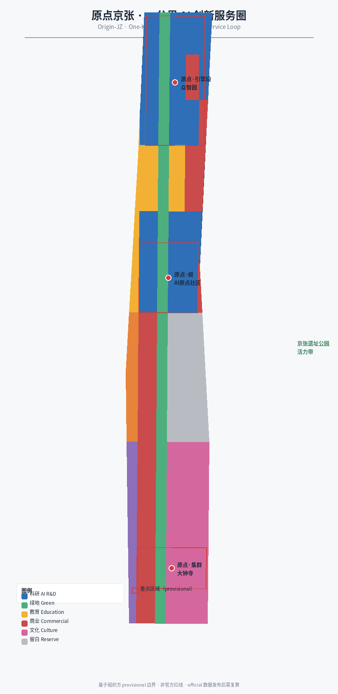
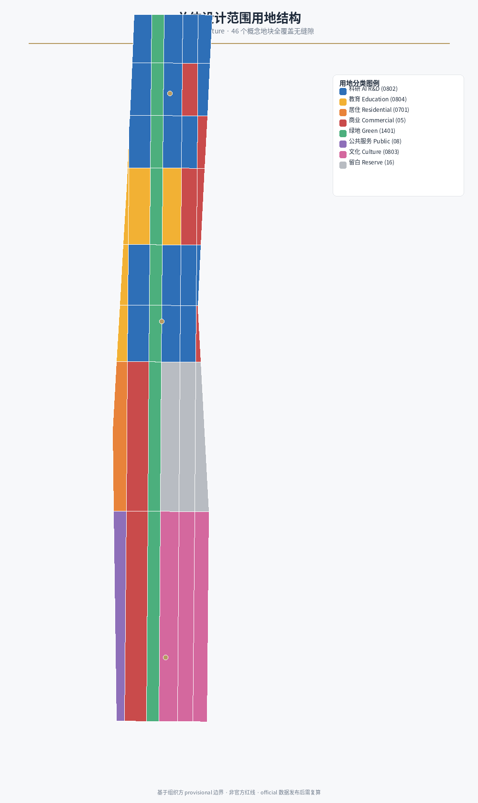
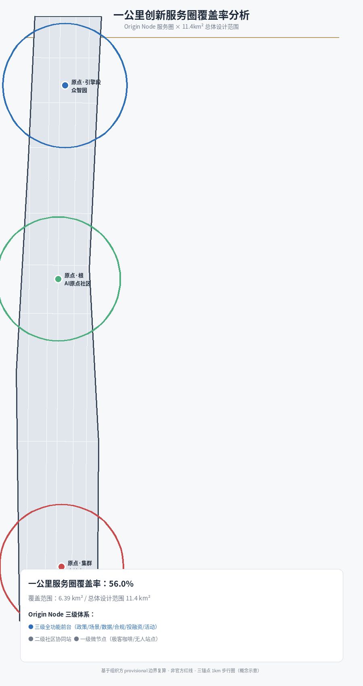
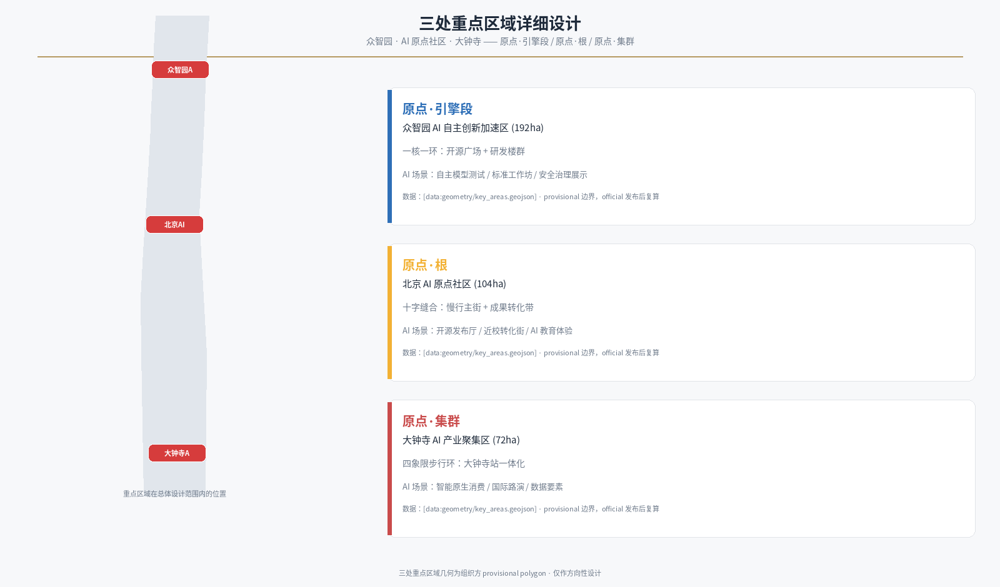
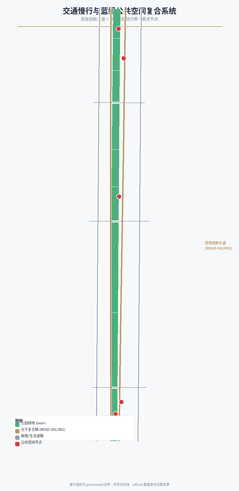
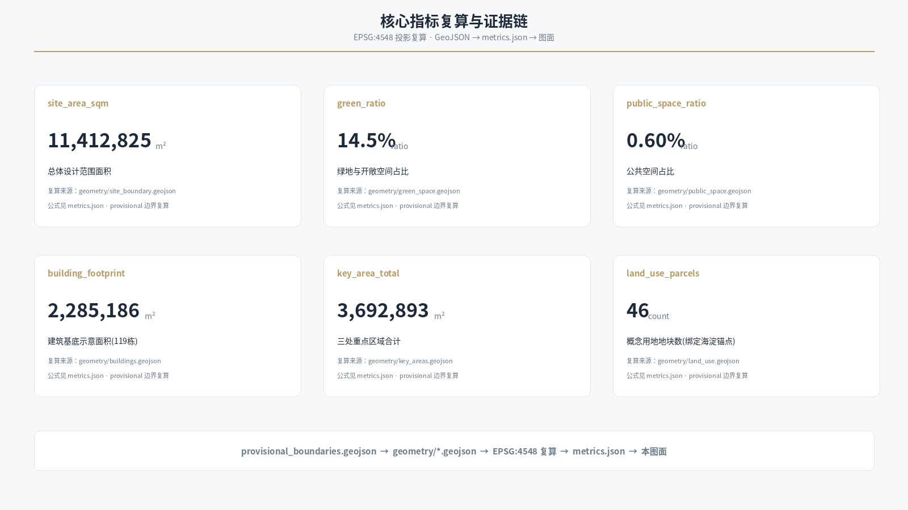

# Jing-Zhang Origin: One-Kilometer AI Innovation Service Circle

## Abstract: Elevator Pitch

**One hundred years ago, Zhan Tianyou used a 'human-character' turnaround track to let China's first mainline railway, independently designed by the Chinese, climb over Juyong Pass; one hundred years later, the original Jing-Zhang uses a 'one-kilometer innovation service circle' to let global AI entrepreneurs leap the last mile from the laboratory to the market.**

Jing-Zhang Railway is the Chinese engineering autonomous origin, AI Origin community is the origin of China's intelligent era, and Origin Jing-Zhang is a collection of origins—growing along the site of a railway heritage, an AI innovation service belt. This proposal not only submits a formally rigorous Urban Design scheme in compliance with the regulations, but also proposes a **Git-Native programmable urban design paradigm (Meta-Agent Programmable Urbanism)**: the Origin Node dynamic growth algorithm transforms urban space from a "static PDF" into a "computable and iterative code repository". All 46 conceptual blocks are bound to the Haidian ecological anchor points, supporting a one-click automated recalculation after the official boundary release. This is the response of this plan to the 'Global First True Urban Planning by Agents' —— Agents are not just drawing tools, but co-designers in the evolution of the city.

## Design Basis and Source List

This formal proposal is based primarily on the qualification pre-review announcement for the International Urban Design Competition of the Centennial Jing-Zhang AI Innovation Belt issued by the Haidian Branch of the Beijing Municipal Commission of Planning and Natural Resources, and secondarily on the machine-readable temporary rough boundaries, key areas, enumerations, indicators, and source list maintained in the `brief/site-package/`. The AI agent reads `design_brief.json`, `allowed_design_space.json`, `sources.json`, `enums/`, `ranges/`, `schemas/`, `data/source_registry.json`, and `data/processed/agent_fact_pack.md` before generating the scheme. It uses `project_scope_summary.csv`, `agent_task_requirements.csv`, `source_use_matrix.csv`, and `missing_data_checklist.csv` to establish task, scope, data usage, and gap lists. All design judgments are broken down into traceable sources, calculable metrics, verifiable layers, and Human Review assumptions. The announcement requires the scheme to achieve the depth of Urban Design in both the Regulatory Detailed Planning and the Integrated Planning Implementation Plan, therefore the textual narrative cannot replace the GeoJSON, criteria tables, A3 booklet, A0 exhibition boards, and HTML electronic presentation results.

This section of the Evidence Chain cites [source:OFFICIAL-ANNOUNCEMENT], [source:AGENT-TASKBOOK], [source:SITE-PACKAGE], [source:SOURCE-REGISTRY], [source:PROCESSED-FACT-PACK], [source:BOUNDARY-SOURCE], [source:KEY-AREA-SOURCE], [standard:PROJECT-OFFICIAL-ANNOUNCEMENT], [standard:PROJECT-AGENT-OPEN-CALL-TASKBOOK], [standard:MOHURD-URBAN-DESIGN-MEASURES], [standard:MOHURD-CONTROL-DETAILED-PLANNING], [standard:MNR-LAND-USE-CLASSIFICATION-GUIDE] [standard:MOHURD-ARCH-DESIGN-DEPTH-2016] and [depth:existing_conditions_diagnosis], used to explain that the proposal is not an independent visionary text but is organized from the announcement, agent-oriented task statement, standards, boundaries, processing package, and data list.

The boundaries for the use of the registration form are as follows:

- `data/source_registry.json` records the purposes and boundary of usage for publicly disclosed, clarified, and temporary data.
- Current Registration Abstract: formal available data 5 items, background data 0 items, provisional-only data 1 item.
- The agent shall not upgrade background_only or provisional_only materials to official boundaries, statutory controls, formal scoring criteria, or government implementation commitments.

`data/processed/agent_fact_pack.md` is the reading navigation layer for this proposal and is not a new authoritative source. [source:PROCESSED-FACT-PACK] only helps the agent to organize the three layers of scope, three key areas, announcement tasks, agent.1-agent.6, data availability, and data gaps into a readable proposal; all factual judgments still revert to [source:OFFICIAL-ANNOUNCEMENT], [source:AGENT-TASKBOOK], [source:SOURCE-REGISTRY], [source:BOUNDARY-SOURCE], and [source:KEY-AREA-SOURCE].



This proposal uses the `brief/site-package/geometry/provisional_boundaries.geojson` to generate a temporary formal package when the official `SITE_BOUNDARY` or three `KEY_AREA` have not yet been obtained. The `geometry/site_boundary.geojson` and `geometry/key_areas.geojson` in the submission package are both marked as `provisional_constraint` and `official_boundary=false`, and can only be used for proposal generation, self-checking, visualization, and design discussions. They cannot be used as official redlines, approval references, or precise area references, nor can they serve as legal control conclusions. This organizational data gap itself does not block content scoring. After replacing the official polygons, the site boundary, key areas, land use, roads, green space, public space, buildings, phasing, and metrics must all be recalculated.

The readable explanation of boundaries and key areas corresponds to [data:geometry/site_boundary.geojson#SITE-001], [data:geometry/key_areas.geojson#PROV-KEY-001] and [metric:site_area_sqm], [metric:key_area_count]. This means that readers can refer back to the GeoJSON to view the boundary sources, check the recalculated area metrics, and consult the sources for references.

## Three-Level Scope Framework

The proposal is organized according to the three levels defined in the announcement: the Coordinated Research Area focuses on the 43.6 square kilometers of AI industry ecology, strategic positioning, innovation chain, and future urban form; the Overall Design Area focuses on the 11.4 square kilometers of the Jing-Zhang heritage park and the surrounding 1-2 kilometers of urban and industrial areas, requiring the formation of an overall framework for Urban Renewal, industrial space layout, traffic and municipal support, and Urban Character control; the Key-Area Detailed Design Area focuses on 368.4 hectares of three detailed design regions, requiring the clarification of functional types, building scale, classification of the demolish–renovate–retain strategy, Public Space connectivity, and traffic organization. The three layers of scope are mapped to `compliance_matrix.json` to ensure that the required tasks in sections 1.3, 1.4, and 1.5 of the announcement, as well as agent.1-agent.6, have corresponding chapters, layers, indicators, drawings, and HTML evidence. (Demolish–Renovate–Retain Strategy)

The depth items of the three-level work framework are constrained by [depth:three_level_scope_framework] and [depth:overall_spatial_structure], with spatial evidence based on [data:geometry/site_boundary.geojson#SITE-001] and [data:geometry/key_areas.geojson#PROV-KEY-001], and the tasks are based on [standard:PROJECT-OFFICIAL-ANNOUNCEMENT].



The three layers are not a disjointed collection of drawings. The overall concept of this proposal is the "Jing-Zhang Origin · One-Kilometer AI Innovation Service Circle": with the Jing-Zhang Heritage Park Green Belt as the historical and Public Space axis ([data:geometry/green_space.geojson#GREEN-001]), three key areas as innovation anchor points, and along the way, "Origin Nodes" innovation service front desks are deployed (policy, scenarios, data, compliance, financing and investment, and activities in one-stop service), ensuring that any AI team can access the full chain of services from basic research, industrial incubation to capital services within a one-kilometer walk. Coordinated research determines the industry chain and urban form, and the overall design translates these determinations into update projects, spatial structure, and facility carrying capacity. Detailed design of key areas verifies the implementability of specific plots, buildings, transportation, public spaces, and AI application scenarios. Any area, ratio, scale, or project number that cannot be recalculated from structured data must not be included in the formal conclusion.

| Level | Design Issue | Solution Approach | Data Focus |
| --- | --- | --- | --- |
| Coordinated Research Area | How AI industry ecology and future urban forms can be organized | Establish an 'academic source-innovation - open-source collaboration - enterprise transformation - public experience - international dissemination' innovation chain, with supporting front-end service nodes for the original point | compliance_matrix.json, standard_matrix.json |
| Overall Design Area | Industrial Space, Urban Renewal, Transportation and Utilities, and Scenic Features | Land Use, Buildings, Roads, Green Spaces, Public Spaces, and Layered Phasing Expressing a One-Kilometer Service Circle | [data:geometry/land_use.geojson#LU-009], [data:geometry/roads.geojson#ROAD-001] |
| Key-Area Detailed Design Area | How to Achieve Detailed Design Depth for Three Areas | Propose positioning, spatial actions, AI scenarios, and implementation dependencies for 'Origin·Engine Segment', 'Origin·Root', and 'Origin·Cluster' | [data:geometry/key_areas.geojson#PROV-KEY-001], [data:geometry/key_areas.geojson#PROV-KEY-002], [data:geometry/key_areas.geojson#PROV-KEY-003] |

**Comparison of the "One-Kilometer Service Circle" with Official Concepts**: The official context in Haidian has proposed concepts such as the "Ten-Minute Innovation Circle," "One-Kilometer Campus Innovation Ecosystem for Universities," and the "Fifteen-Minute Vital Living Circle." This plan's "One-Kilometer AI Innovation Service Circle" is not a repetition of the official concepts but narrows the service target from "lifestyle amenities" to "elemental access for AI innovation subjects"—that is, a network of integrated innovation services including policy, scenarios, data, compliance, financing, and activities. The official concepts address "living well and convenience," while this plan addresses "startup teams accessing the entire innovation chain from basic research to capital services within a one-kilometer walk." Both complement each other, with the former serving as the baseline for urban living and the latter providing a high-density supply of innovation elements. The plan transforms the "one-kilometer" concept from a conceptual radius into a measurable service network coverage through the Origin Node three-level node system ([metric:origin_node_level3_count] full-service front desk + [metric:origin_node_level2_count] community coordination stations). A 1km walking circle around three anchor points directly covers approximately 56% of the Overall Design Area, with the remaining areas supplemented by secondary community co-creation stations and a network of first-tier micro-nodes, complemented by the Jing-Zhang heritage park's pedestrian main axis to achieve full connectivity.



## Coordinated Research Area: Industry and Future City Research

The core task of the Coordinated Research Area is to build a world-class AI Innovation Ecosystem. The proposal organizes the Haidian universities, leading enterprises, computational and algorithmic data elements, incubation platforms, listed companies, unicorns, and technology service resources into a spatial coordination framework for the AI innovation chain, industrial chain, talent chain, and urban service chain. The naming and logo design scheme serve to enhance the overall recognizability of the "Centennial Jing-Zhang Cultural Belt, Urban AI Life Experience Belt, and AI Integration Innovation Belt," and establish connections with the industrial ecosystem, Public Spaces, and cultural resources.

### Naming System and Logo Direction (agent.1)

Main name "Origin-JZ" (AI Origin Jing-Zhang) reflects the dual nature of the original innovation point: a century ago, the Jing-Zhang Railway was the first major railway line designed and constructed independently by the Chinese, serving as the origin of engineering innovation; today, the Beijing AI Origin Community is the officially designated innovation origin, while the "one belt" represents a collection of these origins. The naming system echoes the origin in the git repository, the coordinate origin (0,0), and AI development culture. In international communication, the term "Origin" is naturally understandable in the developer context.

| Level | Name | Description |
| --- | --- | --- |
| Main Brand | Origin-JZ | Dual Nature of Autonomous Innovation Origin: Railway Origin × AI Origin | (Jing-Zhang)
| Zhongzhiyuan | Origin·Engine | AI Full Stack Autonomous Innovation Acceleration Zone, Research and Development Testing and Standard Governance |
| AI Origin Community | Origin·Root | School-Adjacent Incubation and Transformation, Talent Magnet and Open Collaboration |
| Dazhongsi | Origin·Cluster | Intelligent Native Industry Aggregation, Application Consumption and Data Elements |
| Zhongguancun Technology Services Wing | Element Globe Port | Capital, Data, IP Global Configuration |
| Xiaoyue River Scenario Enablement Wing | Scenario Test Field | AI-Enabled Scenario Pilot and Vibrant City Experience |
| Service Counter | Origin Node | The Minimum Operational Unit for a One-Kilometer Innovation Service Circle |

Logo Direction: The visual theme is derived from the topology of the Jing-Zhang Railway's 'human-shaped' turnaround line — two locomotives pushing and pulling each other over Juyong Pass, symbolizing the collaboration of 'computing power + talent' in the AI era; the human-shaped topology also corresponds to agent collaboration, human-machine collaboration, and an AI culture centered on people. Logo variants can include an 'origin dot' (origin coordinate point) overlay, forming a combination of railway topology × coordinate origin, which can be extended for wayfinding, paving, public art, and digital interfaces. All fonts, graphics, mascots, and logos use open-source or self-drawn materials, and do not reference unlicensed trademarks.

### Five Functional Areas in Coordination with Three Zones and Two Wings

The proposal responds to the three major orientations (Centennial Jing-Zhang Cultural Belt, Urban AI Life Experience Belt, AI Integration Innovation Belt) and five functional areas (Full-Stack Independent AI Innovation System, World-Class AI Innovation Ecosystem, AI-Enabled Scenario Empowerment New Paradigm, Intelligent AI Vibrant City, AI Governance Global Discourse). The collaborative loop of the Three Zones and Two Wings is as follows: Zhongzhiyuan provides full-stack independent innovation and standard governance capabilities, the AI Origin community bears the responsibility of converting nearby talent and nurturing open-source ecosystems, Dazhongsi accommodates intelligent native industries and international exchanges, Zhongguancun Technology Services Wing offers capital and factor allocation, and Xiaoyue River Scenario Enablement Wing bears the responsibility of scenario pilots and public experiences. These five elements form a sustainable closed loop through a one-kilometer service circle and the Public Space of the Jing-Zhang Heritage Park.

### Global AI Innovation Ecosystem Case (agent.2)

| Case | Location | Key Mechanism | Mechanisms Translatable to Haidian |
| --- | --- | --- | --- |
| Silicon Valley | United States | Stanford Incubator + Sand Hill Capital Loop + Open Source and Entrepreneurship Culture | On-Campus Conversion Hub + Investment and Financing Service Desk + Developer Honor System |
| Shenzhen | China | Hardware Supply Chain in Huaxiangbei + Rapid Iteration + Industrial Collaboration | Hardware Prototype Rapid Fabrication Node + Scenario Access Test Bed |
| Singapore | Singapore | Government-Industry-University Tripartite + Global Talent Hub + Scenario Access | International Roadshow Living Room + Cross-Border Data Compliance Services |
| Tel Aviv | Israel | Military-to-Civilian + High-Risk Tolerance + Small Elite Network | Red Team Testing Sandbox + Security Governance Workshop |
| Austin | United States | University + Industry Migration + Lifestyle Magnet | Youth-Friendly Public Space + 24-Hour Collaboration Nodes |
| Hangzhou | China | Platform Ecology + Digital Industry Aggregation | Lead Ecological Synergy + Intelligent Natively Generated Consumption District |
| Bangalore | India | Service Outsourcing → Product Innovation | Dual Operation of Enterprise Services and Developer Community |

**Haidian Mapping and Local Anchoring**: The experience from 7 global cases cannot remain at "how to do it elsewhere," but must translate into "how to do it in Haidian." Haidian already has over 2,000 AI companies, 26 unicorns including Muyizhimenwan, ByteDance, Baidu, and Tencent. This plan will bind all 46 conceptual parcels to Haidian's ecological anchor points ([metric:haidian_anchor_parcels]), forming a traceable benchmark.

- **Shenzhen Yuhai Street → Zhongzhiyuan**: Software Park Phase I and Phase II covering approximately 2.6 km² align with the core industrial zone of Yuhai Street. In Zhongzhiyuan's "Origin·Engine Segment," an open-source foundation branch and AI large model evaluation center will be established (anchor points: Zhiyuan Research Institute/BAAI, Beijing Artificial Intelligence Public Computing Platform).
- **Singapore One-North → Jing-Zhang Innovation Belt**: The node density increases from approximately 0.3 to 0.8 per km², with the railway heritage park serving as the "innovation spine" to connect three areas (anchors: Haidian Data Special Zone, Wudaokou Commercial Revitalization).
- **Silicon Valley Sand Hill → Origin·Root**: Near-School Transformation Hub + Investment and Financing Service Front Desk (Anchor Points: Tsinghua x-lab, Peking University Entrepreneurship Training Camp).
- **Local Case 1: Dongsheng Science and Technology Park → Origin·Engine Segment**: Replicate the full chain from "Entrepreneurship Incubator-Hardware Incubator-Accelerator-Industrial Park," including an AI-Native Corporate Headquarters Zone.
- **Local Case Study 2: Wudaokou 'Universe Center' → Origin·Root Upgrade**: From 'Ratty Commercial Street' to 'Innovation Cultural District', from 'Popular Nickname' to 'Officially Recognized AI Holy Site'.

These cases collectively point to three implementable spatial mechanisms: first, "proximity school transformation" which converts academic innovation into industry, second, "one-kilometer service front desk" which aggregates policies, scenarios, data, compliance, financing and investments, and activities into nodes that are walkable, and third, "open source + honor" which embeds developer contributions as public assets. The ecological case experiences are annotated with [source:AGENT-TASKBOOK] and [standard:PROJECT-AGENT-OPEN-CALL-TASKBOOK] as smart body task requirements, rather than statutory planning controls.

Future urban form research addresses how artificial intelligence transforms work, life, social interactions, learning, transportation, and public services: AI transportation systems, continuous green spaces, innovative service facilities, and an international living and working atmosphere are implemented as locatable functional zones, nodes, corridors, and scenarios ([data:geometry/land_use.geojson#LU-009] industrial service belt, [data:geometry/roads.geojson#ROAD-001] innovation avenue, [data:geometry/green_space.geojson#GREEN-001] heritage park green belt).

## Overall Design Area: Urban Renewal and Regulatory-Plan-Level Urban Design

The Overall Design Area requires the depth of Urban Design as per the Regulatory Detailed Planning. The proposal outlines the overall spatial structure for Urban Renewal: centered around the Jing-Zhang Heritage Park green belt, with two sides forming the 'Origin·Engine Segment—Origin·Root—Origin·Cluster' three major industrial clusters ([data:geometry/land_use.geojson#LU-006], [data:geometry/land_use.geojson#LU-008]). [data:geometry/land_use.geojson#LU-010]), the eastern and western wings are composed of a public service belt and an industrial service belt ([data:geometry/land_use.geojson#LU-002] academic belt, [data:geometry/land_use.geojson#LU-022] technology and business belt). Reserve blank development land in the southern segment ([data:geometry/land_use.geojson#LU-019]). Inefficient space identification, update project list, industrial function proportions, and building total scale are recalculated in `geometry/land_use.geojson`, `geometry/buildings.geojson`, `geometry/roads.geojson`, and `metrics.json`.

This section breaks down the control planning depth content into reviewable objects according to [standard:MOHURD-CONTROL-DETAILED-PLANNING]: [data:geometry/land_use.geojson#LU-009] expresses the industrial service land use structure, [data:geometry/buildings.geojson#BLDG-001] expresses the Building Footprint indication, [data:geometry/roads.geojson#ROAD-001] expresses traffic organization, [metric:building_footprint_area_sqm] verifies the building footprint area, [depth:land_use_layout] and [depth:development_intensity_controls] constrain the depth of the results. The content involving Building Height, Development Intensity, road red lines, setbacks, and facility standards has no official control conditions and should all be written as "pending formal control plan conditions confirmation," without using agent-predicted values as substitute review indicators.

Overall design supports transportation, tracks, utilities, and ancillary facilities: propose spatial layout and implementation paths for Transit-Station Integration, road micro-circulation, non-motorized vehicle parking, parking supply, innovative service platforms, talent living services, New Infrastructure, distributed energy, and edge-side computing. The "origin node" of the one-kilometer service circle as a composite node for the front desk of innovative services, prioritizing locations at [data:geometry/public_space.geojson#PUBLIC-001], [data:geometry/public_space.geojson#PUBLIC-002], and [data:geometry/public_space.geojson#PUBLIC-003] in the three key areas.

## Detailed Design of Key Areas

### Origin·Engine Segment: Zhongzhiyuan AI Independent Innovation Acceleration Area (PROV-KEY-001)

Positioned as a garden-type AI full-stack independent innovation district, it is responsible for R&D testing, standard setting, safety governance, and industrial display. The spatial structure is defined as "one core and one ring": the core is the Open Source Square and the standard governance display node ([data:geometry/public_space.geojson#PUBLIC-001]), while the outer ring consists of R&D clusters and green interaction interfaces. Building updates prioritize retention and renovation, with selective new construction, emphasizing a low-carbon innovative interaction environment and the Qinghe interface. AI scenarios include autonomous model testing, standard-setting workshops, safety governance displays, and low-carbon computing power experiences. Implementation risks include high thresholds for full-stack independent innovation in terms of computing power and talent, necessitating the provision of shared testing fields and edge-side computing power service points.

**Pedestrian Experience (Concept Description)**: Enter Zhongzhiyuan from Qinghe Bridge along a gentle slope pedestrian path, with the left side featuring renovated red-brick factories—ground level includes open-source project display windows, where real-time rolling PR numbers are displayed behind glass curtain walls. The path opens up at the open-source square, with embedded Jing-Zhang old railway tracks serving as guide lines, flanked by stepped benches and shade trees. The central point monument at the square has a reserved area for name engraving. Circling the square to the north, the research and development building cluster is primarily composed of courtyard-style low-rise structures, with rooftops connected to form a "second ground," allowing pedestrians to reach the computing power display pod—where one can overlook the Qinghe blue-green interface and the skyline of the opposite university.

### Origin·Root: Beijing AI Origin Community (PROV-KEY-002)

Located as a campus-based model for technology transfer and talent community, it is responsible for university innovation, open-source ecosystem, technology transfer, and talent services. The spatial structure is described as a 'cross-stitch': a north-south pedestrian main street connects the campus and the park, while an east-west technology transfer belt organizes incubation, exhibition, legal services, and investment and financing services ([data:geometry/public_space.geojson#PUBLIC-002]). Building updates focus primarily on the integration of the campus and park, and the activation of ground-floor activities. AI scenarios include an open-source release hall, a campus-based technology transfer street, and an AI education experience point. Implementation risks include the need for multi-party coordination regarding the campus boundary, ownership, and ground-floor activity adjustments, necessitating the use of lightweight facilities and activities to proceed first.

**Walking Experience (Concept Description)**: Walk two hundred meters south along a six-meter-wide shaded pedestrian path from the South Gate of Tsinghua University. The path widens to a twelve-meter-wide plaza at the site of the old railway, where the old tracks are embedded in the ground. On both sides are stepped benches and old locust trees—under which groups of doctoral students often gather to discuss. On the right side, a row of renovated red-brick courtyards, with the ground floor featuring display windows for open-source projects and a maker living room, and the second floor offering shared workstations. The courtyard is surrounded by an inner courtyard, which retains an old tree at its center, under which there is a pitch corner. Walk through the inner courtyard to the east, where the conversion zone extends along the street, with windows displaying "Capital and Policy Resources Available for Collaboration This Week." The light boxes light up in the evening, echoing the rolling screen on the pedestrian path that continuously updates the open-source contributions.

### Origin Cluster: Dazhongsi AI Industry Cluster (PROV-KEY-003)

Located as a city-type smart economy and international exchange district, it will host leading enterprises, smart bodies, smart terminals, content consumption, and data element industries. The spatial structure is the 'Four Quadrant Pedestrian Ring': organized around the integration of Dazhongsi station, it forms a four-quadrant pedestrian connection (see [data:geometry/public_space.geojson#PUBLIC-003]), with commercial services, international roadshows, cultural expositions, and reserved development distributed across the four quadrants. AI scenarios include smart native consumption, international roadshow living rooms, and data element living rooms. Implementation risks include the dependency on engineering conditions for the integration of the rail transit station and the renovation of road intersections, which need to be listed as formal deepened prerequisite conditions. (Transit-Station Integration)

**Pedestrian Experience (Concept Description)**: Exiting Dazhongsi subway station, an underground corridor leads directly to the Four Quadrants Pedestrian Loop — a ground-level plaza with smart terminal display windows as its interface, where unmanned delivery vehicles quietly traverse along dedicated pathways. The southwest quadrant preserves the old market's texture, with the first floor featuring smart hardware pop-up stores and content consumption experience zones, while behind the glass curtain wall is the real-time trading screen of the "Data Element Living Room." In the evening, the international roadshow lounge illuminates its exterior screen in the northeast quadrant, and entrepreneurs walking along the loop pass by the concept exhibition corridor ahead of the vacant development sites — there, they can glimpse the profiles of the next batch of incoming enterprises.

Three key areas detailed design references [data:geometry/key_areas.geojson#PROV-KEY-001], [data:geometry/key_areas.geojson#PROV-KEY-002], [data:geometry/key_areas.geojson#PROV-KEY-003], which are to be checked by [depth:three_key_area_detailed_design] to ensure they meet the depth of the Integrated Planning Implementation Plan. The provisional polygon conclusions are for directional design purposes only and will be recalculated after the official polygon is released.



## AI Innovation Ecosystem, Personas, and AI+ Scenarios

The plan establishes a spatial demand profile for AI talent and enterprises, covering research and development offices, open-source collaboration, result dissemination, corporate services, talent accommodation, social learning, consumption life, sports leisure, and international exchanges. Each scenario describes the service targets, spatial location, data sources, privacy boundaries, Human Review mechanisms, and operational entities, and is mapped to specific layers and indicators: the Public Space scenario references [data:geometry/public_space.geojson#PUBLIC-001], the slow-moving traffic scenario references [data:geometry/roads.geojson#ROAD-001], and the open space scenario references [data:geometry/green_space.geojson#GREEN-001] with [metric:public_space_ratio] and [metric:green_ratio].

### User Profile (agent.3, Category 5 and Above)

| User Profile | Typical Needs | Spatial Response | Self-Check Boundary |
| --- | --- | --- | --- |
| Youth AI Developers | Publish, Collaborate, Test, Community Reputation | Origin·Root Open Source Release Hall, Public Code Wall, Nighttime Collaboration Space | No personal behavior tracking; activity data only used for aggregate statistics |
| University Research Staff | Technology Transfer, Cross-Institution Collaboration, Experiments | Origin·Root Near-School Transformation Street, Technology Transfer Kiosks | Campus Data and Research Results Require Authorization |
| Startup Team | Affordable Office Space, Computing Power Entry Point, Product Test Bed | Zhongzhiyuan Shared Test Bed, Edge Computing Service Point, Origin Node | Computing Power and Data Services Require Separate Authorization |
| AI Company | Exhibition, Business, International Reception, Talent Recruitment | Dazhongsi International Roadshow Living Room, Trackside Station Shuttle | Corporate Identity and Case Studies Must Clear Rights |
| Community Residents | Commuting, Leisure, Community Services, Low-Impact Updates | Jing-Zhang Heritage Park Pedestrian Loop, Embedded Community Services | Do Not Use Resident Profiles for Commercial Recommendations |
| International Visitors/Visitors | Cultural Experience, Participation in Activities, Guided Tours | Heritage Park Cultural Tours, Global AI Activity Week Route | Tour content must be subject to historical accuracy and copyright review |

### AI Scenario Card (agent.3, 10 or more, among which 3 are industrial Testing and Validation Scenarios)

| Number | Scene Card | Spatial Carrier | Type | Design Description |
| --- | --- | --- | --- | --- |
| SC-01 | Low-Speed Autonomous Delivery Pilot | Jing-Zhang Ruins Park South Segment — Dazhongsi (along ROAD-002) | **Industrial Testing Validation** | Test delivery robots within a low-speed, regulated, and reviewable boundary; operational subject is the pilot enterprise + public platform review |
| SC-02 | Autonomous Driving Campus Shuttle | Zhongzhiyuan (PROV-KEY-001 Internal Roads) | **Industrial Testing Validation** | Internal shuttle service within the campus at low speeds, with clear boundaries, stations, and safety review mechanisms, not directly equivalent to municipal road deployment |
| SC-03 | AI Guided Tour and Cultural Trace | Jing-Zhang Relic Park Green Belt (GREEN-001) | **Industrial Testing Validation** | An interpretable tour connects the Jing-Zhang history, Zhongguancun culture, and AI science popularization. Historical facts and copyright must undergo Human Review. |
| SC-04 | AI+ Healthy Service Navigation | Community and Public Service Nodes (LU-005) | AI+ Public Services | Healthy service navigation and activity risk alerts for park youth and community residents, not a substitute for professional medical care |
| SC-05 | AI+ Educational Personalized Learning | Origin·Root Near-School Zone (LU-007) | AI+ Education | Targeting Higher Education Institutions and Youth AI Popularization and Personalized Learning, Campus Data Requires Authorization |
| SC-06 | Corporate Services Copilot | Origin Node Service Desk (PUBLIC-002) | AI+ Corporate Services | Initial Q&A on Policy, Compliance, Intellectual Property, and Scenario Pilots, Not a Substitute for Professional Advice |
| SC-07 | AI+ Transportation Slow Travel Discontinuity Identification | Innovation Avenue (ROAD-001) | AI+ Transportation | Use explainable signage and low-intrusion sensing to identify slow travel discontinuities, congestion nodes, and accessibility needs |
| SC-08 | AI+ Public Legal Services | Public Service Strip (LU-005) | AI+ Public Services | Legal Consultation and Arbitration Guidance, Not a Substitute for Professional Attorney Advice |
| SC-09 | Intelligent Natively Generated Consumption | Dazhongsi Commercial Strip (LU-010) | AI+ Commerce | Smart Terminal and Content Consumption Experience District, Privacy Boundary with Human Review Priority |
| SC-10 | Urban Agent Governance Platform | Zhongzhiyuan Governance Display (PUBLIC-001) | AI Governance | Public Data Access, Scenario Simulation, Summary of Public Feedback, Risk Alerts, Final Human Judgment |
| SC-11 | Developer Open Collaboration Space | Origin·Root (LU-018) | AI Ecosystem | 24-hour open collaboration, code contribution showcase, community events |
| SC-12 | Public Safety Operations Review | One Public Space System | AI Governance | Aggregate Indicators for Activity Flow and Facility Maintenance, Without Collecting Individual Trajectories |

All AI governance recommendations adhere to the principles of data minimization, open-source origins, explainability, and Human Review. Urban Agents can assist in identifying pedestrian bottlenecks, Public Space heat maps, facility maintenance needs, business service demands, and activity safety risks, but they cannot replace planning approvals, cannot generate unauthorized personal profiles, and cannot claim official implementation commitments. Immature technologies should not be described as fully deployable, and test scenarios should not be described as approved operations.

### Inclusivity Design Principles (agent.3 Public Interest Dimension)

- **No Substitution Principle**: AI services as an aid, preserving human counters—original nodes set with "Human Service Counter"—to ensure that elderly and vulnerable groups are not excluded due to the digital divide.
- **Privacy First**: Localize data related to vulnerable groups for processing, do not upload to the cloud, and do not make commercial recommendations; AI devices in public areas only perform aggregated statistics and do not collect individual trajectories.
- **Time Period Protection**: All test scenarios (such as unmanned delivery, autonomous shuttle services, etc.) are limited to 9:00-18:00, with quiet operation at night to avoid resident rest periods.
- **Participation Channels**: "Origin Node" sets resident sessions where opinions are directly conveyed to the Urban Agent governance platform; individuals with disabilities have access to barrier-free navigation (Bluetooth beacons + voice guidance), barrier-free office environments (Braille displays + voice programming), and barrier-free employment opportunities (priority matching for audio/voice-based positions).
- **Equitable Accessibility**: The one-kilometer service circle is open to all, without requiring educational qualifications, business scale, or local household registration. It particularly focuses on student entrepreneurs, independent developers, and non-Beijing residents who are starting their businesses.

### The ecological anchoring of Haidian in the scene card

Scenekart is not a vague concept, but is strongly bound to the physical/policy carrier of Haidian (block anchoring is seen in the `geometry/land_use.geojson` file under the `haidian_ecological_anchor` field):

| Scenario | Haidian Local Physical/Policy Carrier | Spatial Plot |
| --- | --- | --- |
| Embodied Intelligence Real-World Testing Ground | Dongsheng Science and Technology Park + Jing-Zhang Greenway Flat Zone | Zhongzhiyuan Section for R&D Land Use |
| Algorithm Sandbox and Data Special Zone Clinic | Haidian Data Special Zone + Beijing International Big Data Exchange | Core Incubation Site of the Origin Segment |
| Large Model Computing Power Cooperative Edge Nodes | Beijing Public Artificial Intelligence Computing Platform | Zhongzhiyuan Computing Power R&D Land Use |
| Open Source Academic Transformation Bridge | BAAI (Zhiyuan Academy) + Tsinghua/ Labs | Origin Segment Open Source Collaborative Site |

### Core Scenario Card Hard Dataization (8 Field Template)

Using "Algorithm Sandbox and Data Special Zone Clinic" as an example, demonstrate the upgrade from concept to verifiable implementation:

- **Scenario Definition**: Establish an "Policy Sandbox Space" in the AI Origin community, where AI products with compliance concerns can undergo a 30-day trial run without approval. Upon successful completion, it will be promoted throughout the region.
- **Stakeholders**: Haidian Park Committee (Developer) + District Data Bureau (Regulator) + AI Startup Team (User) + Zhihuang/Mo Zhi Mian (Technical Support).
- **Technical Architecture**: Compliance Review for Multimodal Large Models + Data Desensitization Sandbox + Digital Twin Feedback Loop (Compliant with the Data Security Law and the Personal Information Protection Law).
- **Business Model**: Basic services are free (to attract users) + value-added services (compliance certification, data interfaces, paid).
- **Verification Mechanism**: Validate the hypothesis that "sandbox testing can reduce the compliance cycle for AI products"; data will come from the sandbox operation logs; the cycle is 30 days; success will be defined as a reduction in the compliance cycle of ≥30%.
- **Success Metrics**: Number of Annual Sandbox Projects ≥100, Compliance Cycle Reduction ≥30%, Zero Major Compliance Incidents.
- **Implementation Phase**: Q4 2026 Site Application → Q2 2027 Pilot → Q2 2028 Full District Rollout.
- **Risks and Mitigation**: Regulatory Responsibility Boundaries → "AI-Assisted Diagnosis" Annotation within Sandbox + Human Final Approval.

### Three cards for Testing and Validation Scenarios with hard data (agent.3 required)

#### SC-01 Pilot for Low-Speed Autonomous Delivery (Industrial Testing and Validation)

- **Scene Definition**: On the southern segment of the Jing-Zhang Heritage Park along the Dazhongsi line (ROAD-002), a test corridor of approximately 2km for low-speed unmanned delivery testing is delineated. L4-level delivery robots are permitted to operate within a specified time frame (9:00-18:00), on a designated route, and at a speed limit of ≤15km/h.
- **Spatial Placement**: Test corridor ROAD-002 south segment approximately 2km; delivery nodes at the Dazhongsi commercial belt (LU-010) with 3 receiving points; monitoring center at the original node (PUBLIC-003).
- **Stakeholders**: Haidian Traffic Brigade + District Science and Technology Commission (regulation), Meituan/JD/Bai Xiniu (Conceptual Recommendation and operation), Zhupu AI/Baidu Apollo (conceptual recommendation and algorithm), Site Park Management Office (site).
- **Technical Architecture**: Lidar + cameras + V2X roadside units for perception layer; Edge computing (deployed at Origin Node Level-3) for decision-making layer; L4 delivery robots for execution layer; Digital twin monitoring platform for regulatory layer.
- **Business Model**: Government Subsidies + Corporate Cost during the Test Period (approximately 800  per unit per day) → Delivery Fees Collected from Merchants during the Validation Period → Scaling to Other Parks in Haidian.
- **Validation Mechanisms**: A/B testing (manual vs. autonomous delivery for 30 days each) to verify "efficiency improvement ≥20%"; real-time monitoring to verify "accident rate ≤0.01 incidents per thousand kilometers"; NPS survey to verify "public acceptance ≥70%"; and cost analysis to verify "daily cost per unit ≤500 yuan".
- **Success Metrics**: Annual test mileage ≥ 10,000 km, delivery orders ≥ 50,000, service merchants ≥ 100, output 1 set of《Low-Speed Autonomous Delivery Park Test Standards》.
- **Implementation Phase**: Q4 2026 Apply for Permits → Q1 2027 Pilot (3 Units/1km) → Q2 2027 Expansion (10 Units/2km) → Q4 2027 Evaluate Full Zone Rollout.
- **Risks and Mitigation**: Accident Liability → Full Corporate Responsibility + Specialized Insurance; Public Resistance → 3 Months of Free Trial + Transparent Disclosure; Technical Failures → Remote Takeover in 30 Seconds; Weather → Automatic Shutdown in Rain and Snow.

#### SC-02 Autonomous Driving Shuttle for Industrial Test Validation

- **Scene Definition**: Within Zhongzhiyuan (PROV-KEY-001), a low-speed autonomous shuttle loop (approximately 1.5km) is delineated to connect the Open Source Plaza (PUBLIC-001), the R&D cluster, and the Computing Center. L4-level shuttles are restricted to operate within the park.
- **Spatial Configuration**: Circular road within Zhongzhiyuan; 5 stations (Open Source Square/Research and Development East Zone/Compute Pod/Exhibition Hall/Talent Apartment); surveillance access to the digital twin of the park.
- **Stakeholders**: Haidian Park Management Committee (regulation), Baidu Apollo/Wenwan Zhixing (Conceptual Recommendation, technology), Zhongzhiyuan Operation Party (site).
- **Technical Architecture**: Park high-precision map + V2X roadside unit; Edge computing pod (connected to the Beijing Artificial Intelligence Public Computing Platform); L4 shuttle vehicle; Vehicle-road-cloud collaborative scheduling.
- **Business Model**: Free park-and-ride within the park (enhances park attractiveness) → Charging for external demonstration displays → Anonymized shuttle data services (compliant within the framework).
- **Verification Mechanism**: Validate the hypothesis of "improved park commuting efficiency" (bus shuttle vs. pedestrian/bicycle control group); data sourced from dispatch logs; cycle period of 90 days; success criteria are on-time rate ≥95% and zero safety incidents.
- **Success Metrics**: Daily shuttle ridership ≥ 2,000, on-time rate ≥ 95%, zero major accidents, establish 1 set of park shuttle operation standards.
- **Implementation Phase**: Q4 2026 for Line Delimitation → Q1 2027 Pilot 2 Units → Q2 2027 Expand to 6 Units → Q4 2027 Evaluate.
- **Risks and Mitigation**: Pedestrian conflicts in the park → limit speed to 15 km/h + audio-visual warning; regulatory gaps → refer to the pilot approach for low-speed autonomous vehicles; technical failures → manual take-over + backup dispatch.

#### SC-03 AI Guided Tour and Cultural Origin Tracing (Industrial Testing Validation)

- **Scene Definition**: Along the Jing-Zhang Heritage Park Green Belt (GREEN-001), deploy an explainable AI tour guide system to connect the history of the Jing-Zhang Railway, the innovation culture of Zhongguancun, and AI science popularization into an interactive experience, covering the old site of Tsinghua Garden Station, the candidate location of the original point monument, and the century timeline node.
- **Spatial Placement**: Site park green belt along the entire line; core nodes 6 in total (North Entrance Tech Square/Railway Culture Gallery/Origin Marker/Developer Walkway/South Station Plaza/Zhongguancun Node).
- **Stakeholders**: Site Park Management Office (operations), Haidian Cultural Tourism Bureau (cultural review), Zhipu AI/Zhiyuan (Conceptual Recommendation, technology), Peking University Department of History (content advisor).
- **Technical Architecture**: Explainable Guided Tour Terminal (Voice + AR) + Multimodal Content Retrieval (Historical Database, Curated by Humans) + Copyright Compliance Review Layer.
- **Business Model**: Basic tour free → Premium route/AR content paid → Corporate sponsorship (requires rights clearance).
- **Verification Mechanism**: Validate the hypothesis that "AI-guided tours can enhance cultural awareness" (compared to traditional guided tours); data will be collected from tour logs and satisfaction surveys; the cycle will be 60 days; success will be measured by a knowledge retention increase of ≥30% and zero factual errors.
- **Success Metrics**: Annual tour attendance ≥ 100,000, satisfaction NPS ≥ 60, zero historical errors, and the development of 1 set of《AI Guiding Content Compliance Guidelines》.
- **Implementation Phase**: Content Curating and Copyright Clearance by Q4 2026 → Pilot at 3 Nodes by Q1 2027 → Full Deployment by Q3 2027.
- **Risks and Mitigation**: Historical Errors → Historical Scholars Review + Human Curation; Unclear Copyright → Clear Rights for All Materials; AI-generated Confusion with Facts → Mark Each Instance with "AI Generated, Human Review".

## Land Use, Building Scale, and Retain-Renovate-Demolish Strategy

Land-Use Plan expressed according to the [standard:MNR-LAND-USE-CLASSIFICATION-GUIDE], forming a complete, closed, and seamless land-use zoning (with a [metric:land_use_parcel_count] of 46 conceptual parcels, covering [metric:site_area_sqm]). The core land-use structure includes: the Jing-Zhang Heritage Park Green Belt (from [data:geometry/land_use.geojson#LU-015] to [data:geometry/land_use.geojson#LU-022], approximately 1.66 square kilometers of green space). Three key areas for industrial land use ([data:geometry/land_use.geojson#LU-007], [data:geometry/land_use.geojson#LU-008], [data:geometry/land_use.geojson#LU-024] Zhongzhiyuan research and development, [data:geometry/land_use.geojson#LU-011], [data:geometry/land_use.geojson#LU-027] original point incubation, [data:geometry/land_use.geojson#LU-014] Dazhongsi commercial); the public service and industrial service belts on the east and west wings ([data:geometry/land_use.geojson#LU-001] education, [data:geometry/land_use.geojson#LU-034] technology and business);  Leave development sites ([data:geometry/land_use.geojson#LU-029] and [data:geometry/land_use.geojson#LU-037]). All 46 parcels are bound to Haidian ecological anchor points ([metric:haidian_anchor_parcels]), forming a traceable mapping of industry-space-subject.

The architectural scheme distinguishes between preserved, renovated, updated, newly constructed, or yet-to-be-confirmed elements. The Building Footprint is a conceptual indication ([metric:building_footprint_area_sqm]), generated programmatically according to three types of massing: tower, slab, and courtyard ([metric:building_massing_types]: tower [metric:tower_massing_count] units, slab [metric:slab_massing_count] units, courtyard [metric:courtyard_massing_count] units), with actual numbers to be determined by the official control plan and current baseline conditions. The Building Height, massing, facade, and aesthetic control are managed by [depth:height_massing_character], while the demolition–renovate–retain strategy is managed by [depth:retain_renovate_demolish]. (Demolish–Renovate–Retain Strategy) The total building scale, Floor Area Ratio (), Building Height, Building Coverage Ratio, green space ratio, setback distances, and building control lines lack official conditions and are listed as unknown or pending_control in the indicator system. Precise fixed values are not used to create precision.

**Conceptual Recommendation for Building Type Layout Rules**:

| Location Conditions | Type | Reason |
| --- | --- | --- |
| Within 500m of Rail Transit Stations | Tower Buildings (Conceptual Height: 45-80m) | High-Density + Landmark + Rail Transit Accessibility Efficiency |
| Adjacent to the archaeological site park interface | Courtyards (6-12m concept) | Low density + permeability + park view corridors |
| Transition Zone | Flat Building (18-36m Concept) | Moderate Density + Continuous Street Wall + Commercial Interface |
| Campus Interface | Courtyards+Block Apartments Mixed | Coordinated with Campus Scale |

Skyline Principle: The height increases from the site park towards the city direction (Park → Courtyard → Panel Building → Tower), forming a "City Skyline within the Green Valley," to avoid the park being surrounded by high-rise buildings. Specific heights are subject to the official control plan; this table expresses the design intent.

## Transport, Rail, Municipal Infrastructure, and Public Services

The traffic plan responds to the requirements for Transit-Station Integration, road micro-circulation, pedestrian connectivity gaps, external traffic, parking, non-motorized vehicle parking, and the green transportation system. The roads and pedestrian network are structured around two north-south composite axes (West Innovation Avenue, [data:geometry/roads.geojson#ROAD-001]; East Innovation Avenue, [data:geometry/roads.geojson#ROAD-002]), with three lateral connecting roads linking three key areas (Zhongzhiyuan, [data:geometry/roads.geojson#ROAD-003]; AI Origin, [data:geometry/roads.geojson#ROAD-004]; Dazhongsi, [data:geometry/roads.geojson#ROAD-005]), and are complemented by life and industrial service roads on the east and west sides (East [data:geometry/roads.geojson#ROAD-006]; West [data:geometry/roads.geojson#ROAD-007]). Focus on coverage of the North Fifth Ring Road, the Jing-Zhang Heritage Park intersection over the ring road, the Dazhongsi station, and the surrounding areas of key enterprises. The depth of traffic, rail, slow zones, and parking is constrained by [depth:traffic_rail_slow_parking], and the depth of municipal and new infrastructure is constrained by [depth:municipal_new_infrastructure]. When road right-of-way, utility lines, fire safety, and municipal conditions are missing, they should be indicated as assumptions to be addressed, without writing the strategy as definitive conditions.



Municipal and public service facilities cover AI industry service facilities, innovation service platforms, talent living service facilities, New Infrastructure, distributed energy, edge-side computational power, and integrate with traditional municipal facilities. The "origin node" composite layout of a one-kilometer service circle innovates the service front desk, adopting a lightweight facility and activity-first strategy to reduce the cost of new spaces.

## Blue-Green Network, Public Space, and Urban Character

Blue-Green Space proposals are centered around the Jing-Zhang Heritage Park Vitality Belt ([data:geometry/green_space.geojson#GREEN-001] to [data:geometry/green_space.geojson#GREEN-005]), addressing the travel needs of Qinghe, Xiaoyuehe, nearby universities, enterprises, and communities. The proposals propose a network of pedestrian paths, cycling lanes, and green spaces that are north-south connected and east-west linked. The plan identifies pedestrian and cycling discontinuities, overpass nodes, and landscape nodes at the southern and northern ends of the park. It also proposes a composite utilization strategy for parking, sports, innovative interactions, technology testing, application demonstrations, and public services. The Blue-Green Public Space is reviewed by [depth:blue_green_public_space], with core evidence being [metric:green_ratio] and [metric:public_space_ratio], and referencing [standard:MOHURD-URBAN-DESIGN-MEASURES].

### AI Pilgrimage Landmark and Honor Display System (agent.4, 3 or More)

| Landmark | Location | Design Description |
| --- | --- | --- |
| AI Origin Plaque | Midsection of the Ruins Park, near AI Origin Community (PUBLIC-002 nearby) | Records the names of the first Agents and contributors who participated in the real Urban Design, updated annually; continues the narrative of the Jing-Zhang Railway's original point of independent innovation |
| Open Source Showcase Corridor | Along the Heritage Park Greenway | To transparently display Agent-submitted proposals, review comments, and iteration records under open source licenses, ensuring contributions become public knowledge assets |
| Developers' Walkway | Innovation Avenue (ROAD-001/002) | A walkable showcase route connecting three key areas, with community features, landmarks, activity interfaces, and honor nodes along the way |
| Honor Wall for Intelligent Bodies Contributions | Zhongzhiyuan Open Source Plaza (PUBLIC-001) | A recognition system for open source contributors, community events, and governance participation |
| Centennial Innovation Timeline | North Section of the Heritage Park (PUBLIC-005) | Organize the Jing-Zhang Railway, Zhongguancun Culture, and AI New Culture into a centennial timeline that can be experienced |

Urban Character blends the historical and cultural heritage of the Jing-Zhang Railway, the innovation culture of Zhongguancun, and AI innovation culture, utilizing cultural resources such as the Qinghua Yuan Railway Station. It proposes a city tone, architectural appearance, roof forms, massing, facades, and public art guidance. Landmarks, signage, logos, fonts, images, characters, and corporate identifiers should all adopt Qinghua University materials, avoiding excessive entertainment and not treating conceptual landmarks as approved constructions.

## Renewal Projects, Implementation Policy, and Phasing

The implementation plan forms a reviewable list of renewal projects, detailing the project location, type, function, responsible party, dependent conditions, implementation phases, risks, and evaluation indicators. Policy recommendations cover Urban Renewal integrated implementation, spatial supply, operational mechanisms, industrial services, public participation, data governance, and property rights coordination. The phased scope is expressed by `geometry/phasing.geojson` (see [data:geometry/phasing.geojson#PHASE-001] for the near north segment, [data:geometry/phasing.geojson#PHASE-002] for the mid south segment, and [data:geometry/phasing.geojson#PHASE-003] for the long-term wings), with the project list and phased depth managed by [depth:renewal_project_list] and [depth:phasing_implementation].

| Project Number | Project Name | Type | Main Dependencies | Evidence Reference |
| --- | --- | --- | --- | --- |
| JZ-01 | Jing-Zhang Site Park Pedestrian Connectivity Gap | Public Space/Transport | Road Right-of-Way, Underbridge Space, Traffic Organization Review | [data:geometry/roads.geojson#ROAD-001] |
| JZ-02 | Origin·Engine Segment Open Source Square | Public Space/Industrial Display | Zhongzhiyuan Land Use and Ownership, First Floor Business Types | [data:geometry/public_space.geojson#PUBLIC-001] |
| JZ-03 | Origin Point · Root Near School Technology Transfer Street | Urban Renewal/Industrial Services | campus boundaries, ownership, first-floor uses | [data:geometry/buildings.geojson#BLDG-001] |
| JZ-04 | Dazhongsi Station Quadrant Pedestrian Connectivity | Transit-Oriented Development/Slow Zone | Transit Station, Road Intersection, Utility Infrastructure | [data:geometry/public_space.geojson#PUBLIC-003] |
| JZ-05 | Origin Node Innovation Service Front Desk | New Infrastructure/Industrial Services | space allocation, operational entity, data compliance | [data:geometry/constraints.geojson#CONSTRAINTS] |
| JZ-06 | Global AI Activity Week Public Route | Operations/Brand | Public Space Permits, Event Safety, Copyright Clearance | [data:geometry/phasing.geojson#PHASE-001] |

### Global AI Innovation Ecosystem and Long-Term Operations (agent.6)

The proposal outlines a three-tier activity system: an annual flagship event, "Origin Day," and a global AI activity week (comprising cultural tours, open-source collaboration, industry roadshows, and international dissemination); quarterly nodes, "Scenario Access Days," rotate to open low-speed delivery, campus shuttle services, and AI tours as test scenarios; and monthly "Open Source Nights" to build the developer community. The operational mechanism includes: tiered operation of the developer community (open-source contributors, corporate developers, academic staff and students, international visitors), double-blind review and Human Review for scenario access, operation of public experience routes, international dissemination, and conversion paths. All activities, recruitment, funding, policies, and operational arrangements are presented as Conceptual Recommendations or deepening directions, not as determined government arrangements; the talent, enterprise, and developer conversion paths (open-source contribution → scenario pilot → corporate services → financing and investment → industrial landing) form the core of the operational loop, not a promotional slogan.

## Meta-Agent Programmable City and Origin Node Dynamic Growth Algorithm

### Paradigm Upgrade: From Static Final Diagram to Computable Code Repository

Urban Design traditionally delivers a 'static final plan' — a finalized master plan that does not evolve thereafter. This proposal introduces **Meta-Agent Programmable Urbanism**: viewing urban space as a computable and iterative codebase, where every land use adjustment, node upgrade, and Scenario Access evolves in a similar manner to Git version management. This paradigm directly responds to the event's positioning as the 'Global First Agent-Driven Real Urban Planning' — Agents are not just responsible for creating a plan but for establishing a sustainable operating system for urban evolution. Urban space is no longer a static PDF but a Dynamic Codebase.

### Origin Node Dynamic Growth Algorithm

The "origin node" within a one-kilometer service radius is not a static layout but dynamically grows based on developer density, computational load, and the level of open-source activity. The service level of each plot is determined by the following formula:

**S_node = α·D_dev + β·P_compute + γ·F_git**

- D_dev: Area Developer Density (derived from publicly available GitHub developer distribution aggregation)
- P_compute: Edge Computing Capacity and Data Request Throughput
- F_git: Community Open-Source Project PR Activity
- α, β, γ: Weight coefficients, adjusted by the operating entity according to phase objectives (Conceptual Recommendation, not a predetermined engineering project).

**Weighting Logic (Conceptual Recommendation)**: D_dev and P_compute have the same weight (each 0.4), as developer density and computational load are "hard requirements" that directly determine the physical capacity of the service front-end. F_git has a lower weight (0.2), as open-source activity is a "soft signal" that reflects community vitality but does not directly determine spatial requirements. Weights can be adjusted by the operational entity at different stages—increasing the weight of D_dev during the incubation phase and the weight of F_git during the mature phase, which is the essence of being "programmable." The algorithm provides a runnable demo script `scripts/origin_node_demo.py` for review, allowing the replication of node tiering results.

**Example of Node Hierarchy (Conceptual Development)**:

| Lot | D_dev | P_compute | F_git | S_node | Grade | Reason for Judgment |
| --- | --- | --- | --- | --- | --- | --- |
| LU-008 Zhongzhiyuan Core R&D | 0.8 | 0.9 | 0.9 | 0.86 | LEVEL_3 | Comprehensive Innovation, All Three Indicators High |
| LU-011 Original Core Incubation | 0.9 | 0.7 | 0.8 | 0.78 | LEVEL_2 | Developer-dense, Moderate Computing Power |
| LU-014 Dazhongsi Commercial | 0.5 | 0.4 | 0.3 | 0.40 | LEVEL_1 | Commercial focus with low innovation density |

```python
class OriginNodeEngine:
    """Origin Node 动态生长逻辑（概念建议，非既定工程结论）"""
    def __init__(self, parcel_id, dev_density, compute_load, git_activity):
        self.parcel_id = parcel_id
        self.dev_density = dev_density
        self.compute_load = compute_load
        self.git_activity = git_activity

    def evaluate_service_level(self):
        score = 0.4 * self.dev_density + 0.4 * self.compute_load + 0.2 * self.git_activity
        if score > 0.8:
            return "LEVEL_3_FULL_NODE"        # 全功能前台（政策/场景/数据/合规/投融资/活动）
        elif score > 0.4:
            return "LEVEL_2_COMMUNITY_HUB"    # 社区协同站
        else:
            return "LEVEL_1_MICRO_POD"        # 最小化极客咖啡/无人站点
```

The 46 conceptual blocks have been allocated node levels according to this logic: [metric:origin_node_level3_count] Level 3 full-service front-ends, [metric:origin_node_level2_count] Level 2 community co-working stations, with the rest being Level 1 micro-nodes, as seen in [data:geometry/land_use.geojson]. Grid blocks are not a synonym for 'roughness' but rather 'computable digital twin containers (Cellular Automata Grid)'—each block is a container that can dynamically allocate functions, with future updates to container attributes submitted through PR, allowing urban space to continuously realign with innovative needs.

### Git-Native Compliance and Automated Recalculation

This plan comprehensively utilizes Git version control and semantic parcel management: all provisional boundaries support one-click automated recalculation after official data release (the EPSG:4548 projection recalculation script can be rerun directly to generate all layers and metrics). Spatial recommendations are all Conceptual Recommendations/reference schemes, which do not constitute government approval conclusions, but the calculation logic is fully transparent, reproducible, and auditable—this is the core added value of Agent involvement in real Urban Design compared to traditional commissioned planning.

## Metrics, Area Recalculation, and Compliance Matrix

The metric system covers the Overall Design Area area ([metric:site_area_sqm]=11.41 square kilometers), the total area of key regions ([metric:key_area_total_sqm]), the number of key regions ([metric:key_area_count]=3), the green space ratio ([metric:green_ratio]=14.54%), the Public Space ratio ([metric:public_space_ratio]), the Building Footprint ([metric:building_footprint_area_sqm]), the number of land use parcels ([metric:land_use_parcel_count]=46), and the number of roads ([metric:road_centerline_count]=7). Divide the area into phases ([metric:phasing_zone_count]=3) and consider the Origin Node node level ([metric:origin_node_level3_count] 3rd level + [metric:origin_node_level2_count] 2nd level), [metric:haidian_anchor_parcels] anchor parcels in Haidian). All known metrics are recalculated from GeoJSON in EPSG:4548; unknown metrics (Floor Area Ratio, Building Height, Building Coverage Ratio, green space ratio control, setback) are provided with reasons and formal pre-submission conditions.

The depth of metrics recalculation is managed by [depth:metrics_recalculation]. During formal deepening, each metric is categorized into three types: those that can be recalculated directly from the submitted geometry (boundary area, green space ratio, Public Space ratio, Building Footprint area, phased area); those that require official master plan support (Floor Area Ratio, Building Height, Building Coverage Ratio, setback, road right-of-way); and those that need operational or industrial data calibration (AI innovation index, talent density, industrial service satisfaction, walkability, participation rate, frequency of scene usage). These three categories of metrics are entered into `metrics.json`, `assumptions.json`, and `compliance_matrix.json`, respectively, to avoid miswriting the operational vision as approved planning conditions.



The Code Array is the main control file for task responsiveness. Each announcement task and agent_taskbook task corresponds to a report chapter, layer, metric, drawing, HTML page, source, assumptions, and check items. If any of the optional tasks for announcements 1.3, 1.4, 1.5, and agent.1-agent.6 are not covered, the proposal shall not enter formal professional scoring.

## Risk, Copyright, and Compliance

This scheme is based solely on the public tender document, public statistical data, and the Provisional Boundary provided by the organizers, and does not claim to use or disclose any non-public planning documents, personal privacy, land ownership data, or approved control indicators. The content regarding Building Height, construction intensity, road alignment, traffic organization, facility placement, and activity scheduling are all discussed recommendations that must be reviewed through the planning, traffic, data security, public participation, and relevant authorities' procedures. The risk and missing data list is managed by [depth:risk_missing_data], and the `missing_data_checklist.csv` lists the official boundary, key areas, controlled plan, roads, parcels, buildings, municipal facilities, cultural relics protection, and public service gaps that are included in `assumptions.json`, self-inspection, and the risk chapter of the main text. (Conceptual Recommendation)

AI agent participation in document organization and scheme generation should include the input source, generation time, model or tool information, and Human Review records. Original, licensed, or publicly accessible materials should be used for images, charts, and presentation materials, with sources listed in `report/copyright_statement.md` and `sources.json`. HTML The page can be opened offline and will not load remote scripts, remote map tiles, remote fonts, iframes, forms, or external API. This plan does not claim official approval, final zoning plan, ultimate land ownership, final scale of construction, or guarantee of implementation.

## Appendix: Agent Generation Process Audit (Human-Machine Synergy White Paper)

> This appendix records the process by which the proposal was generated in its entirety by an AI Agent, in response to the core proposition of the "Global First Agent-Driven Real Urban Design": how the Agent can participate in the design process and which stages can be autonomously completed. This is the core added value of this proposal compared to traditional planning commission schemes, and also serves as a record of a reproducible and auditable human-computer collaborative design experiment.

**Environment Generation**: Claude Code (TRIO 3.0 Multi-Mask Collaboration—Kimi Concept Divergence / DeepSeek Logical Audit / Claude Engineering Delivery); Spatial Computing Shapely 2.1 + Pyproj 3.7 (EPSG:4548); Visualization Pillow + Noto CJK; Version Control Git. Generation Time 2026-08-07.

**Seven Rounds of Iteration**:
1. Task Understanding — Analyze the dependencies of agents.1-6 and select the primary track as "Industrial Ecology + AI Origin" from among the 8 tracks.
2. Concept Generation —— Twelve candidate names were selected after a three-dimensional assessment, with "AI Origin Jing-Zhang" emerging as the winner (Jing-Zhang = engineering origin, AI Origin community = next origin, git origin = development culture).
3. Space Generation v1——25 Block Grid, self-inspection discovered gaps in coverage, which were corrected (59,748m²→41m²), space review PASS.
4. Compliance and Self-Inspection — Four-way Validator Fixes the Enum/Indicator Precision, self_check PASS, submitted PR #114.
5. First Prize Upgrade — External Review Inclusion: Geometric refinement extended to Block 46 + Building 119, with the addition of the Origin Node algorithm, scenario cards hardened with data, and Haidian anchored.
6. Visuals and Evidence — 5 Figures + Service Catchment Analysis + Appendices of This Audit.
7. Final verification — full self-inspection PASS.

**Key Decision Fork Points**: Main Track (Industrial Ecology vs Other 7 Tracks) → Industrial Ecology; Naming (Human/Zhang Tensor/Origin) → Origin Jing-Zhang; Main Concept Retention (Replace with 'Emergence Belt' vs Retain) → Retain Origin Jing-Zhang (Submitted and Approved by Multiple Models); Indicator Strategy (Invent/Leave Blank/Typeology Range) → Typeology Range + To Be Confirmed.

**Human Intervention Points**: Core concept selection, Logo direction, main track, and upgrade direction—confirmed by humans, with Agents not overstepping their authority.

**Auditability Statement**: The spatial computation scripts (`gen_origin_geometry.py`/`gen_origin_metrics.py`/`gen_origin_figures.py`) are preserved in the project's `scripts/` directory and can be re-run with a single click to recalculate, with automated re-calculation supported after the official boundaries are released. All generated records are traceable with `git log`. Agents cannot conduct on-site inspections, cannot access non-public data, and cannot represent resident concerns—this solution is a "best guess" based on publicly available data, requiring on-site verification and professional refinement by human planners.

## References

- `brief/public-brief.md`
- `brief/site-package/design_brief.json`
- `brief/site-package/allowed_design_space.json`
- `brief/site-package/agent_taskbook.json`
- `brief/site-package/enums/`
- `brief/site-package/ranges/planning_limits.json`
- `brief/site-package/geometry/provisional_boundaries.geojson`
- `data/source_registry.json`
- `data/processed/agent_fact_pack.md`
- `data/processed/project_scope_summary.csv`
- `data/processed/agent_task_requirements.csv`
- `data/processed/source_use_matrix.csv`
- `data/processed/missing_data_checklist.csv`
- `scenarios/*.json` standard scenario library
- Machine-readable citation index: [source:OFFICIAL-ANNOUNCEMENT], [source:AGENT-TASKBOOK], [source:SITE-PACKAGE], [source:SOURCE-REGISTRY], [source:PROCESSED-FACT-PACK], [standard:PROJECT-OFFICIAL-ANNOUNCEMENT], [standard:PROJECT-AGENT-OPEN-CALL-TASKBOOK], [depth:metrics_recalculation], [data:geometry/site_boundary.geojson#SITE-001], [metric:site_area_sqm]
