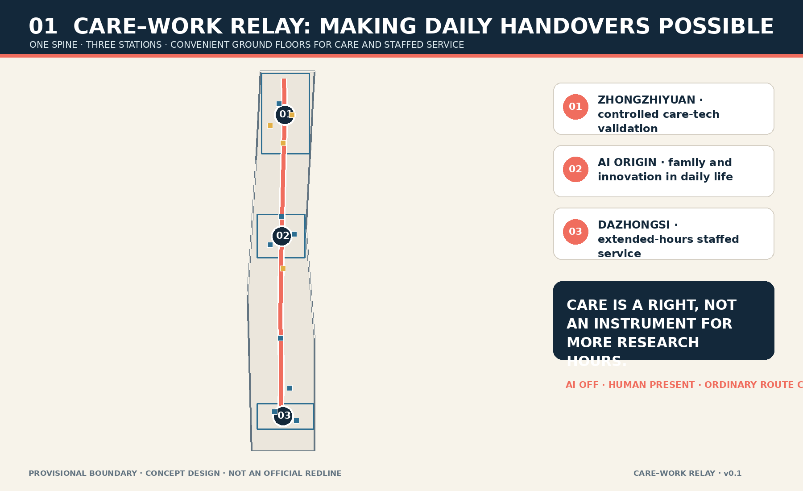
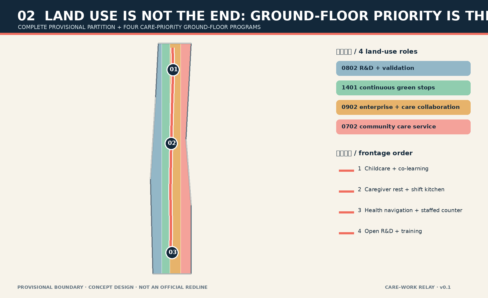
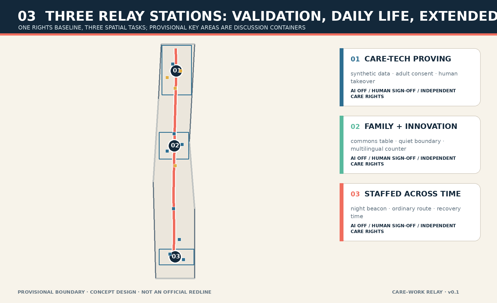
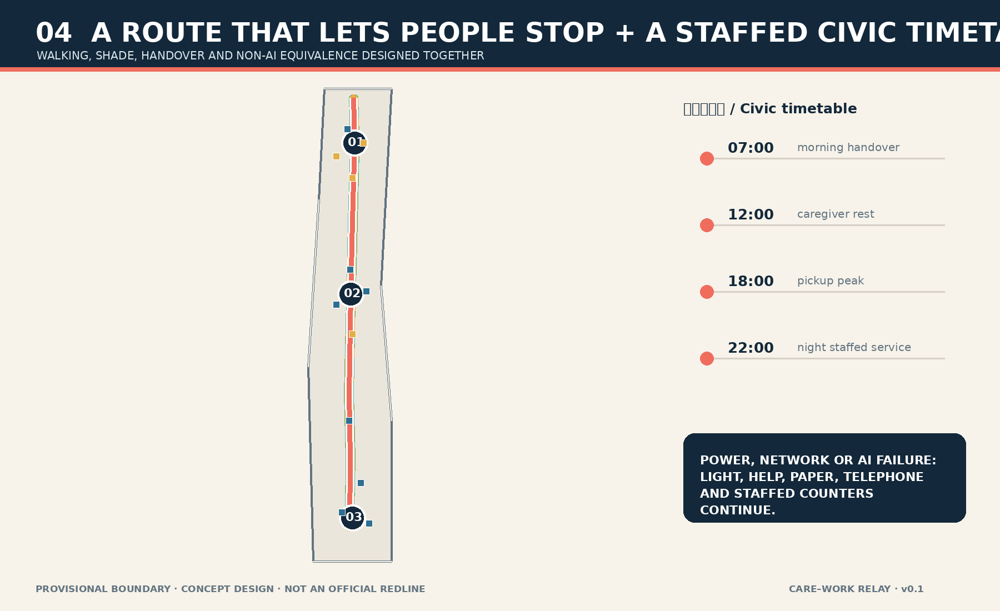
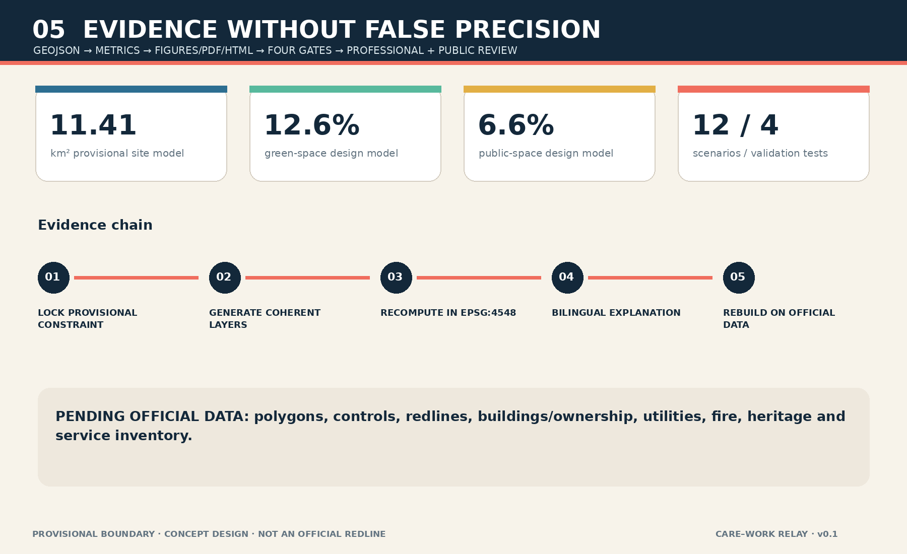

# CARE–WORK RELAY / Jing-Zhang Heban Line

> A district that asks people to sacrifice care relationships in order to innovate is not talent-friendly. Care is first a right of children, older people and every person receiving care; it deserves the most convenient urban space even when it adds no research hours.

The Chinese word *ban* links train service, work shift, school class and care handover. The proposal treats movement between work, pickup, health service, rest and public life as an urban-design problem: one care-priority north–south walking spine, three relay stations, priority ground floors and a staffed, offline-capable public timetable. AI remains optional. Every essential task retains a human, paper or telephone route. All spatial moves use provisional geometry and remain conceptual recommendations rather than approved planning or engineering conclusions.

## Design Basis and Source List

The official announcement defines the three scope levels, three key areas and professional urban-design tasks; the cleared Agent taskbook adds naming, cases, scenarios, personas, landmarks, cultural narrative and long-term operation.[source:OFFICIAL-ANNOUNCEMENT] [source:AGENT-TASKBOOK] Local snapshots of national urban-design, regulatory-planning and land-use references guide terminology and the separation of known conditions, design recommendations and pending official controls.[standard:MOHURD-URBAN-DESIGN-MEASURES] [standard:MNR-LAND-USE-CLASSIFICATION-GUIDE]

No verified official polygon, road redline, building survey, ownership layer, regulatory control, utility network or heritage-control GIS is publicly available in the site package. The repository provisional boundary therefore supports generation, content review and discussion only; it cannot support an official redline, exact official area, demolition decision or engineering feasibility conclusion.[source:BOUNDARY-SOURCE] [data:geometry/constraints.geojson#CONSTRAINTS] Every geometry-derived value is a low-confidence design-model output and the entire package must be regenerated when trusted official data arrives.

No personal trace, institutional internal dataset or claimed community interview supports the care proposition. The seven personas are design lenses rather than measured local demand or consent. Accessibility and older-person smart-service references are used narrowly to protect staffed and traditional channels, not to claim that a particular venue is compliant or deficient.[source:BARRIER-FREE-LAW] [source:OLDER-SMART-TECH-PLAN]

## Three-Level Scope Framework

The approximately 43.6 km² Coordinated Research Area asks how a world-class AI ecosystem can accept care responsibilities. The approximately 11.4 km² Overall Design Area translates that responsibility into land use, priority frontages, walking, public space and phasing. The three Key-Area Detailed Design Areas, approximately 368.4 ha together, test three distinct relay-station types. Announcement figures and the computed area of the submitted provisional polygon are separate evidence categories.[source:OFFICIAL-ANNOUNCEMENT] [metric:site_area_sqm]

The levels do not repeat one drawing at different scales. The strategic level frames care rights as innovation infrastructure; the overall level changes the allocation order of convenient ground floors; the detailed level tests controlled validation, family innovation and extended-hours staffed service. Provisional limits stay pale and dashed while the relay spine, cross streets, stations and ground-floor modules carry the visual hierarchy.[data:geometry/site_boundary.geojson#SITE-001] [data:geometry/key_areas.geojson#PROV-KEY-001]

When official polygons arrive, the workflow locks the new constraints, partitions land use again, regenerates mobility, green, public-space, building and phase layers, and only then recalculates figures and metrics. Conflicts with official streets, services or heritage data must be resolved in favor of trusted data and professional review.[depth:three_level_scope_framework] [depth:existing_conditions_diagnosis]

## Coordinated Research Area: Industry and Future City Research

The three official positionings are reframed as one responsibility loop: the heritage belt tells how timetables organize shared life; the metropolitan AI-life belt keeps AI optional and legible; the AI convergence belt requires innovation to pass care-rights, human-review and recovery gates. Zhongzhiyuan validates, the Origin Community translates, and Dazhongsi tests adoption across daily time; the two wings provide enterprise services and low-risk scenario access.[standard:PROJECT-AGENT-OPEN-CALL-TASKBOOK] [depth:overall_spatial_structure]

The name avoids another generic “smart rail” or “intelligence artery.” Two lines with different rhythms meet at an open relay point: midnight blue is the non-digital civic baseline, coral is movable care time, and mint is the space to stop. Neither line consumes the other. CARE–WORK RELAY names handover rather than promising perfect balance. The mark is original package geometry with no borrowed trademark, portrait or proprietary graphic.

Seven cases frame questions rather than supply transferable answers. Smart Kalasatama asks how time-saving can be measured; aspern Seestadt asks whether services and construction are sequenced together; one-north asks whether research and everyday life are genuinely near; Barcelona Superblocks asks who receives road space; Kendall Square asks what public value expensive ground floors provide; Kashiwa-no-ha asks how living labs remain accountable; Nordhavn asks whether the public baseline survives long phasing.[source:CASE-KALASATAMA] [source:CASE-ASPERn] None establishes Haidian conditions or performance.

| Comparative lens | Question for Jing-Zhang | What is not copied |
| --- | --- | --- |
| Kalasatama | Does a household avoid unnecessary relays? | “Smart” is not automatic performance |
| aspern Seestadt | Can service precede or accompany construction? | Governance and land systems |
| one-north | Are research and daily services truly proximate? | Branding and investment claims |
| Barcelona Superblocks | Can convenient road space return to walking and care? | A different street network |
| Kendall Square | Do high-value ground floors return public value? | Market evidence |
| Kashiwa-no-ha | Who can stop and review a living-lab trial? | Trial is not approval |
| Nordhavn | Does long phasing retain a civic baseline? | Density and engineering parameters |

## Overall Design Area: Urban Renewal and Regulatory-Plan-Level Urban Design

The overall structure is one spine, three stations, three cross streets and twelve ground-floor modules. The spine supports continuous walking, shade, rest and human help. Each station sits within one provisional key area. Cross streets link district entrances to the spine. At each station four modules—childcare and co-learning, caregiver rest and shift kitchen, basic health navigation and staffed counter, and open R&D and training—form a visible public frontage.[data:geometry/roads.geojson#ROAD-RELAY-001] [data:geometry/buildings.geojson#BLDG-01-01]

The complete land-use partition is a design model rather than a statutory amendment. Research supports controlled testing, green space supports continuous stopping, business space supports enterprise and care-economy collaboration, and community-service land supports care-priority interfaces. The key lever is ground-floor priority: the most convenient frontages at stations, park entrances and the spine host care, basic health, rest and staffed service before display centers or high-rent retail.[data:geometry/land_use.geojson#LU-001] [depth:land_use_layout]

Renewal follows “service before construction.” Near-term reversible furniture, signage, staffed counters and shared rooms test hours and handovers. Mid-term walking and blue-green interfaces follow professional review. Only after controls, ownership, building and utility evidence becomes available can long-term building change be discussed. FAR, height, coverage, redlines and demolition remain pending official data.[standard:MOHURD-CONTROL-DETAILED-PLANNING] [metric:floor_area_ratio]

## Detailed Design of Key Areas

Zhongzhiyuan becomes the controlled care-technology proving station. A cross street links open R&D frontages, a human observation room and a reversible test court. Trials involving children, older people or health service default to synthetic data or voluntary adult testing. Care recipients are never the price of faster innovation. A staffed handover point keeps ordinary service intact when technology fails.[data:geometry/key_areas.geojson#PROV-KEY-001] [data:geometry/roads.geojson#SCN-03]

The Beijing AI Origin Community becomes a place where family and innovation are not mutually exclusive. The Origin Commons Table places co-learning, health navigation, caregiver rest and open research on one visible civic frontage, while acoustic and privacy boundaries separate focused work from care. Submitted footprints are program prototypes; retain, renovate or infill choices still require building, ownership, fire and accessibility review.[data:geometry/key_areas.geojson#PROV-KEY-002] [depth:three_key_area_detailed_design]

Dazhongsi becomes the extended-hours staffed city station. The Night Beacon clearly shows staffed hours, ordinary routes, help points and service changes. Shift-mismatch care, an equivalent staffed counter and low-data event guidance surround it. Lighting, commercial hours and transit connections remain operational recommendations pending real station, labor, safety and fire conditions.[data:geometry/key_areas.geojson#PROV-KEY-003] [data:geometry/roads.geojson#SCN-11]

All three stations share five gates: independent rights for the person receiving care; AI can be turned off; the ordinary route remains; a named human role accepts handover; and exceptions protect people before protecting data continuity. The provisional key areas are discussion containers and cannot determine parcel or building implementation.

## AI Innovation Ecosystem, Personas, and AI+ Scenarios

Seven personas test inclusion: a young researcher with childcare responsibility, a child with independent expression rights, an older person requiring in-person help, a paid care worker, a night maintenance worker, an international developer arriving with family, and a wheelchair user or visitor with sensory differences. They are not demographic findings; they ask who can independently arrive, understand, complete, refuse and leave a service.[source:AGENT-TASKBOOK] [metric:persona_count]

| No. | Scenario and place | Data boundary, human review and non-AI route |
| --- | --- | --- |
| 01 | Zhongzhiyuan care-route scheduler | User-entered data only; the staffed counter produces the same plan without storing default traces |
| 02 TVS | Human-verified accessible route audit | Synthetic barrier list plus human sign-off; no model substitutes for professional review |
| 03 TVS | Service-handover failure drill | Synthetic schedules receive power, delay and misrouting faults; named staff stop and restore |
| 04 TVS | Care-facility load sandbox | Aggregate bookings and simulation only; no child or health profiles |
| 05 | Origin parent-child co-learning booking | Telephone, counter and paper access remain; children are not marketing leads |
| 06 | Origin multilingual service drafting | AI supplies a draft; the user confirms meaning and a human owns the final explanation |
| 07 | Older-adult health-service navigation | Public process navigation only; clinical decisions remain professional |
| 08 TVS | Origin privacy-boundary bench | Demonstrates minimization, withdrawal and deletion receipts without live public databases |
| 09 | Spine night-lighting maintenance triage | Asset ID and location suffice; no identifiable passerby image is required |
| 10 | Dazhongsi shift-mismatch care matching | Connects reviewed services and human coordination; never automates guardianship |
| 11 | Dazhongsi equivalent staffed counter | Every essential task remains possible through a named person, paper or telephone |
| 12 | Low-data event safety advisory | Public weather, capacity thresholds and patrols; no individual risk score |

Four testing and validation scenarios use a five-part contract: boundary, ordinary baseline, responsible person, stop condition and recovery record. Movement from controlled test to limited public pilot requires human sign-off and proof that the non-AI baseline remains complete. Technical performance never equals government approval or deployment readiness.[data:geometry/roads.geojson#SCN-02] [metric:testing_validation_scenario_count]

## Land Use, Building Scale, and Retain-Renovate-Demolish Strategy

Codes 0802, 1401, 0902 and 0702 form a complete partition of the submitted boundary. Their areas are reproducible but remain provisional design-model values. Care priority does not turn the entire district into a welfare campus; it assigns public value within every land-use class: research fronts support testing and training, business fronts support enterprise and care collaboration, community fronts deliver services, and green space supports continuous stopping.[data:geometry/land_use.geojson#LU-004] [source:LAND-USE-GUIDE]

Twelve footprints express combinable conceptual ground-floor modules and do not claim that these buildings exist. The conditional DRR ledger retains verified heritage, use and embodied value; considers ground-floor opening where structure and fire conditions permit; discusses demolition only after planning, ownership, heritage, structure and public-interest evidence align; and requires new construction to show why operation, sharing or adaptation cannot provide equal service.[data:geometry/buildings.geojson#BLDG-02-01] [depth:retain_renovate_demolish]

Building height, total floor area, FAR, approved coverage and setbacks remain pending official controls. The model can verify footprint area and module count, not approved intensity. Drawings show a low civic base and adaptable upper volume as a relationship without inventing floors or statutory dimensions.[metric:building_footprint_area_sqm] [depth:development_intensity_controls]

## Transport, Rail, Municipal Infrastructure, and Public Services

Mobility serves “completing a whole day” before minimizing commute time. The north–south relay spine is a stop-capable walking and accessibility route; three cross streets link key-area entrances; three connector lines identify interfaces for later transit-station integration. All lines stay inside the provisional model but are neither surveyed streets nor road redlines. Crossings, gradients, lighting, sections and station interfaces require field audit.[data:geometry/roads.geojson#ROAD-ORIGIN-EW] [depth:traffic_rail_slow_parking]

The civic timetable proposes overlapping staffed periods rather than unattended 24-hour automation. Human roles must be visible at morning and evening handovers. A temporary closure announces the ordinary route and restoration time together. A failed booking system cannot remove counter, paper or telephone access. Operators, workers and users must co-design actual hours; illustrative times are not confirmed schedules.

Municipal design is an interface checklist, not engineering approval: reuse water, power, toilets, waste, family and accessible facilities where verified; process the minimum necessary data at the edge; keep lighting, help and manual registration during power loss; and route capacity, drainage, fire, energy and underground-space questions to formal review.[depth:municipal_new_infrastructure] [data:geometry/constraints.geojson#CONSTRAINTS]

## Blue-Green Network, Public Space, and Urban Character

Green and public space derive from the same relay spine. The green model uses a wider shaded band plus three station pockets; the public-space model uses a narrower accessible frontage plus handover plazas. They may overlap because one place can provide ecological and public-use value. Each metric uses the union of its own submitted geometry.[data:geometry/green_space.geojson#GREEN-RELAY-001] [data:geometry/public_space.geojson#PUBLIC-RELAY-001]

Nine low-tech components form the public-space kit: two-way seats with arms, parallel wheelchair and stroller parking, a visible staffed help bell, drinking and washing points, a quiet waiting corner, child-eye-height signage, paper timetables, movable shade and non-glare path light. AI may assist repair and translation, but the kit works without a screen. Ratios test whether allocation supports continuous stopping; they are not official compliance values.[metric:green_ratio] [metric:public_space_ratio]

Three pilgrimage and honor nodes reject spectacle. The Zhongzhiyuan Relay Bell shows when a trial starts, who is responsible and when it stops. The Origin Commons Table records publicly useful problems repaired by caregivers, developers and communities. The Dazhongsi Night Beacon shows staffed services and ordinary routes still operating. Honor attaches to auditable public contribution, not sensitive data or advertising.[metric:pilgrimage_landmark_count] [standard:MOHURD-URBAN-DESIGN-MEASURES]

The cultural narrative moves from “the train runs on time” to “urban lives can relay.” A century ago railway services connected cities through schedules; today work shifts, school classes, care shifts and public services need dependable handovers. Midnight structure, coral relay lines and mint stopping surfaces are conceptual material directions; heritage limits, color and construction remain subject to professional confirmation.

## Renewal Projects, Implementation Policy, and Phasing

Near-term work creates three minimum relay stations through reversible furniture, staffed counters, paper timetables, quiet corners and shared rooms without asserting a statutory use change. Each 90-day operational test first records the non-AI baseline, labor arrangement, exit condition and complaint route. Mid-term work connects the spine, cross streets and blue-green stops after professional review. Long-term work coordinates buildings, transit interfaces and services only after official data arrives.[data:geometry/phasing.geojson#PHASE-001] [depth:phasing_implementation]

| Project | Conceptual responsibility | Start gate | Stop or adjust when |
| --- | --- | --- | --- |
| Three ground-floor pilots | Public service, local operator, care workers and user representatives | Legal space, fire, accessibility and labor review | Ordinary service is harmed or staffed fallback fails |
| Relay spine and cross streets | Planning, transport, landscape, neighborhood and rights holders | Official redlines, survey and professional review | Heritage, traffic-safety or utility conflict |
| Four TVS sandboxes | Technology, independent evaluation, operator and affected-person representatives | Synthetic/minimal data, owner, stop control and recovery log | Excess collection, high-risk automation or baseline loss |
| Long-term district renewal | Professional government teams, rights holders, operators and public | Controls, ownership, finance and impact review | Public value cannot be shown or care space is displaced |

A conceptual Relay Council gives children, older people, disabled people and care workers direct representation rather than technical proxies. Annual ideas include Care × AI Open Week, a night-shift audit walk, a family developer camp, a public service-failure drill and a Jing-Zhang handover archive. They are proposals for co-design, not confirmed organizer commitments.[source:AGENT-TASKBOOK] [depth:renewal_project_list]

## Metrics, Area Recalculation, and Compliance Matrix

The three core visual metrics—submitted provisional site area, green ratio and public-space ratio—are recomputed from geometry. Footprint area, relay-spine length, three stations, twelve ground-floor modules, twelve scenario nodes, four testing scenarios, seven personas, three honor nodes and twelve non-AI equivalents are also declared structurally.[metric:site_area_sqm] [metric:care_work_spine_length_m] These values prove internal model consistency, not present demand, supply or official compliance.

The compliance matrix covers all 23 announcement and Agent requirements. The professional matrix covers the five mandatory standards, and the depth matrix covers fifteen items from existing-condition diagnosis through land use, pending controls, mobility, public space, projects, phasing, metrics and risk.[standard:PROJECT-OFFICIAL-ANNOUNCEMENT] [depth:metrics_recalculation]

Metrics remain in three classes: geometry outputs are reproducible in EPSG:4548; statutory controls remain pending official data; operational outcomes require real pilots and shared evaluation. Booking count must not be mistaken for care demand, AI use for public value, or additional research hours for the justification of care rights.[metric:non_ai_equivalent_scenario_count] [metric:floor_area_ratio]

## Risk, Copyright, and Compliance

The largest spatial risk is misalignment between provisional polygons and real streets, parks or key areas. Professional risks include missing controls, buildings, ownership, utilities, fire, transport and heritage data. Social risk appears when caregivers become productivity instruments. Technical risk appears when convenience becomes surveillance. Operational risk appears when automation removes the responsible person.[depth:risk_missing_data] [source:SOURCE-REGISTRY]

Controls are whole-package recalculation after official data, explicit conceptual wording, independent rights for care recipients, default data minimization, a non-AI equivalent, named human handover and stop/recovery records. Attractive scenarios never lower protection for child, health, guardianship or identity data.[standard:PROJECT-AGENT-OPEN-CALL-TASKBOOK] [data:geometry/roads.geojson#SCN-08]

Codex generated the text, structured data, bilingual figures, PDFs and offline HTML locally. Figures derive from submitted GeoJSON and metrics and contain no commercial map tile, news image, portrait, company logo or remote font. They explain conceptual intent and evidence; they are not site photographs, public opinion or official drawings. Full method and rights boundaries appear in `report/copyright_statement.md`.[source:SITE-PACKAGE]

## References

1. Haidian Branch, Beijing Municipal Commission of Planning and Natural Resources, official prequalification announcement, 9 May 2026.[source:OFFICIAL-ANNOUNCEMENT]
2. Cleared Agent open-call taskbook extract, 18 May 2026.[source:AGENT-TASKBOOK]
3. Ministry of Housing and Urban-Rural Development, *Measures for Urban Design Administration*, local official snapshot.[source:URBAN-DESIGN-MEASURES]
4. Ministry of Natural Resources, land-use classification guide, local official snapshot.[source:LAND-USE-GUIDE]
5. Barrier-Free Environment Construction Law, local official-text snapshot.[source:BARRIER-FREE-LAW]
6. Repository provisional-boundary geometry and derivation note, generation and discussion only.[source:BOUNDARY-SOURCE]
7. Official project pages for Smart Kalasatama, aspern Seestadt, one-north, Barcelona Superblocks, Kendall Square, Kashiwa-no-ha and Nordhavn, background comparison only.[source:CASE-KALASATAMA]
