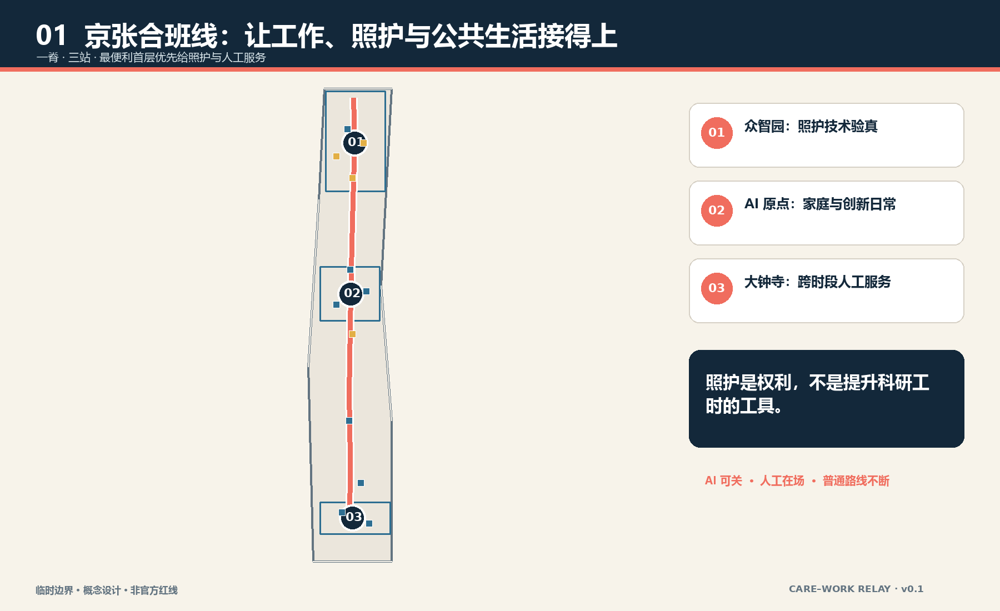
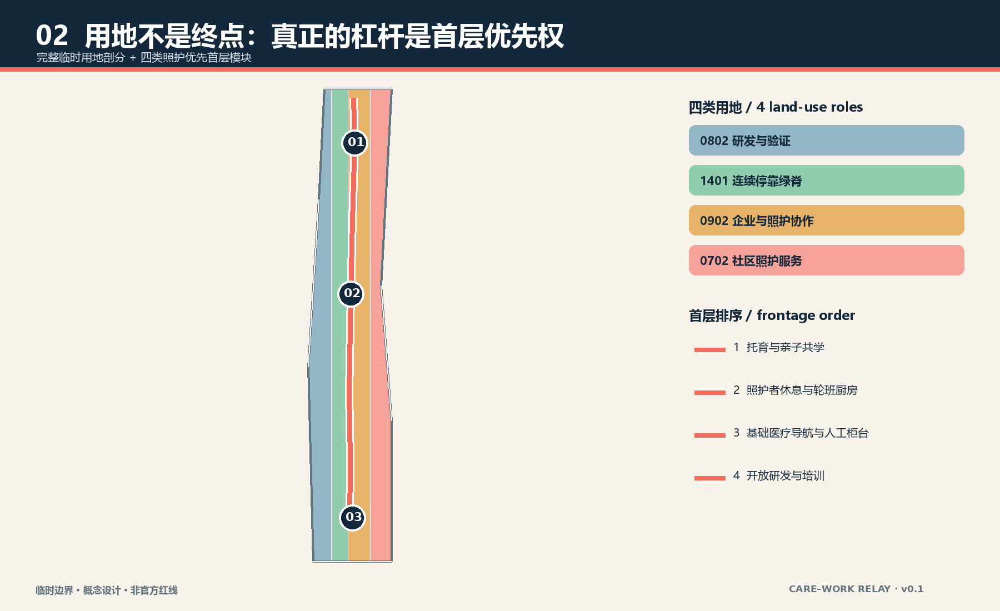
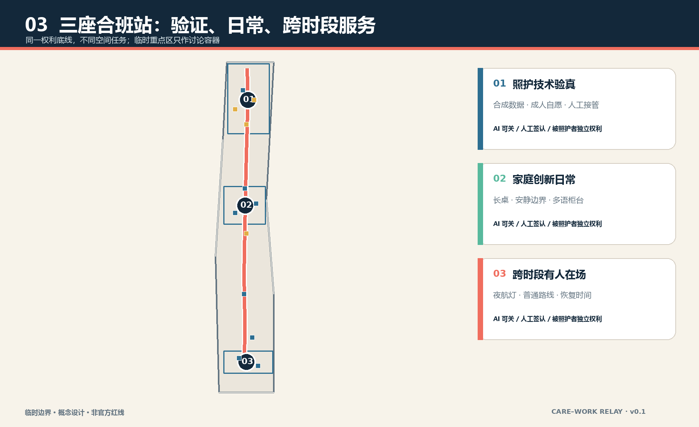
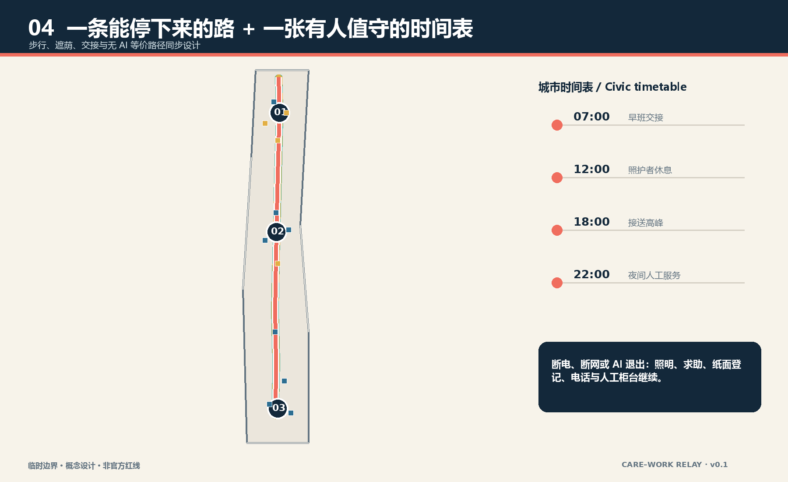
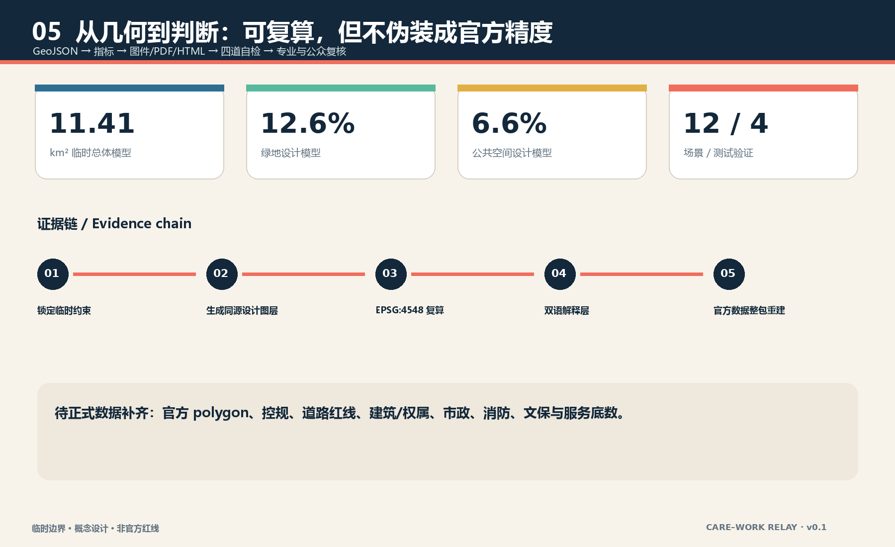

# 京张合班线 / CARE–WORK RELAY

> 一座要求人才牺牲照护关系才能参与创新的城区，不是人才友好城区。照护首先是儿童、老人和其他被照护者的城市权利；即使它不能增加科研工时，也应占据最便利的位置。

“班”同时指铁路班次、工作班次、上学班次和照护交班。方案不再把人才想象成全天候生产单元，而是把工作、接送、就医、休息和公共生活的切换当作城市设计对象：一条南北照护优先慢行脊连接三座合班站；站口、园区入口和最便利首层形成照护优先界面；一套有人值守、可离线、可退出的城市时间表保证 AI 关闭后日常任务仍可完成。所有空间落位均为临时边界上的概念建议，不替代正式规划和专业判断。

## 设计依据与资料清单

本方案以官方征集公告确定的三层范围、三处重点区域和城市设计任务为主控依据，以面向智能体任务书补充命名、案例、场景、画像、地标、文化与长期运营要求。[source:OFFICIAL-ANNOUNCEMENT] [source:AGENT-TASKBOOK] 住建部城市设计与控规相关本地快照用于校核公共空间、风貌和“已知条件—设计建议—待确认事项”的表达边界；自然资源部分类指南用于用地代码，不把通用标准写成项目审批结论。[standard:MOHURD-URBAN-DESIGN-MEASURES] [standard:MNR-LAND-USE-CLASSIFICATION-GUIDE]

公开场地包尚无可验证坐标系的官方精确边界、道路红线、现状建筑、权属、控规、市政和文保 GIS。因而本包采用仓库临时粗略边界，只支持生成、内容评审和设计讨论；它不能支撑官方红线、精确面积、拆改留或工程可行性结论。[source:BOUNDARY-SOURCE] [data:geometry/constraints.geojson#CONSTRAINTS] 所有面积和比例都是由同一临时设计模型复算的低置信度数值，官方数据到位后必须整包重建，而不是只换一条边界。

照护议题没有使用人口画像、个人轨迹或未经公开性与许可审查的数据。本稿没有声称访谈过居民、儿童、老人或照护劳动者；七类画像只是检查空间是否排除某类人的设计镜头。无障碍法和老年智能技术政策仅用于提醒人工服务与传统通道的重要性，不据此宣称场地已经合规或存在特定需求。[source:BARRIER-FREE-LAW] [source:OLDER-SMART-TECH-PLAN]

## 三层范围工作框架

统筹研究范围约 43.6 平方公里，用于追问“世界级 AI 创新生态如何承担照护责任”；总体设计范围约 11.4 平方公里，用于把照护优先权转译为用地、首层、慢行、公共空间和分期；三处重点区约 368.4 公顷，用于验证三种不同合班站。面积来自公告约值，提交的总体边界面积则来自临时 polygon 复算，二者不可互换。[source:OFFICIAL-ANNOUNCEMENT] [metric:site_area_sqm]

三层传导不是把同一张图放大三次。战略层提出“照护权利也是创新基础设施”的判断；总体层把最便利空间的分配顺序改为照护、基础医疗、休息和人工服务优先；重点区层分别测试技术验证、家庭创新日常和跨时段城市服务。临时总体边界与三处临时重点区都以淡色虚线呈现，设计主线由接力脊、横街、合班站和首层模块承担。[data:geometry/site_boundary.geojson#SITE-001] [data:geometry/key_areas.geojson#PROV-KEY-001]

当官方 polygon 发布时，先锁定新边界，再裁切完整用地剖分，随后重建道路、绿地、公共空间、建筑基底和分期，最后复算图件与指标。现有临时几何不被“沿用为底图”；如果服务设施、现状路网或文保范围与本模型冲突，以可信官方数据和专业复核为先。[depth:three_level_scope_framework] [depth:existing_conditions_diagnosis]

## 统筹研究范围产业与未来城市研究

三大定位被重新解释：百年京张文化带讲述“班次如何组织共同生活”；都市 AI 生活体验带把 AI 放在可选的辅助位置；AI 融合创新带则让技术验证先通过照护权利、人工复核和退出恢复。五大功能通过“技术—生态—场景—活力—治理”回路落地：众智园验证，原点社区转译为家庭与公共服务，大钟寺检验跨时段采用，中关村科技服务翼提供合规与企业服务，小月河场景赋能翼承载低风险日常测试。[standard:PROJECT-AGENT-OPEN-CALL-TASKBOOK] [depth:overall_spatial_structure]

名称“京张合班线”避免再造一条“智轨”或“智脉”。视觉标志由两条不同节奏的线在一个开放接力点交汇：深蓝代表城市公共基线，珊瑚代表可移动的照护时间，薄荷绿代表可停留公共空间；任何一条线都不吞并另一条。英文 CARE–WORK RELAY 强调交接而非平衡神话。标志使用本包原创几何，不借用企业商标、人物或外部字体图形。

七个国际案例只用来提出问题，不复制答案：Smart Kalasatama 检查“节省日常时间”的目标如何被测量；aspern Seestadt 检查服务与建设分期；one-north 检查研发、企业和生活的邻近；Barcelona Superblocks 检查道路空间再分配；Kendall Square 检查创新区公共界面；Kashiwa-no-ha 检查生活实验室治理；Nordhavn 检查轨道导向和长期实施。[source:CASE-KALASATAMA] [source:CASE-ASPERn] 这些来源均为背景，不能证明海淀现状或绩效。

| 案例镜头 | 转译为京张的问题 | 明确不照搬的部分 |
| --- | --- | --- |
| Kalasatama | 每周为照护家庭减少了多少无效折返？ | 不把“聪明”当成自动绩效 |
| aspern Seestadt | 服务能否先于或同步于空间更新？ | 不移植治理和土地制度 |
| one-north | 研发与日常服务是否真正邻近？ | 不复制园区品牌和招商结论 |
| Barcelona Superblocks | 最便利路权能否回到步行、停留和照护？ | 不假定相同路网条件 |
| Kendall Square | 高价值首层是否提供公共价值？ | 不移植市场数据 |
| Kashiwa-no-ha | 试验如何有人负责、可停止？ | 不把试点等同批准 |
| Nordhavn | 长期分期是否保留公共基线？ | 不复制密度或工程参数 |

## 总体设计范围城市更新与控规深度城市设计

总体结构是“一脊、三站、三横街、十二个首层模块”。一脊沿总体范围南北组织连续步行、遮荫、休息和人工求助；三站分别位于三处重点区的临时范围内；三条东西横街把园区和社区入口接到主脊；十二个首层模块以托育与亲子共学、照护者休息与轮班厨房、基础医疗导航与人工柜台、开放研发与培训四类程序组成。[data:geometry/roads.geojson#ROAD-RELAY-001] [data:geometry/buildings.geojson#BLDG-01-01]

用地模型完整剖分临时边界，四类用地不是法定调整：科研用地承担受控验证；公园绿地承担连续停靠；商务用地承担企业服务与照护经济协作；社区服务设施用地承担照护优先界面。真正的设计杠杆是首层优先权——面向站口、园区入口和主脊的最便利首层，先容纳照护、基础医疗、休息和人工服务，再安排展示与高租金商业。[data:geometry/land_use.geojson#LU-001] [depth:land_use_layout]

城市更新采用“先服务、后建造”的次序：近期用可逆家具、标识、有人值守柜台和共享房间验证时段与交接；中期在专业审查后连续化慢行和蓝绿界面；长期才在官方控规、权属、建筑和市政资料齐备后讨论建筑更新。容积率、高度、密度、道路红线和拆改留均待正式数据补齐，本包不以概念模块替代法定条件。[standard:MOHURD-CONTROL-DETAILED-PLANNING] [metric:floor_area_ratio]

## 重点区域详细设计

众智园合班站定位为“照护技术先在受控环境验真”。空间上以一条照护验证横街连接研发首层、人工观察室和可回退测试庭；所有涉及儿童、老人和健康服务的验证默认使用合成数据或成年人自愿测试，不以被照护者换取创新速度。首层设置照护者休息、培训和人工接管，技术失败不影响普通服务。[data:geometry/key_areas.geojson#PROV-KEY-001] [data:geometry/roads.geojson#SCN-03]

北京 AI 原点社区合班站定位为“家庭与创新不必二选一”。原点长桌把亲子共学、基础医疗导航、照护者休息和开放研发排在同一可见公共界面；工作室与照护空间各自有声学和隐私边界，只在共享厨房、院落和预约前厅交汇。建筑模块只是首层程序原型，现状建筑是否保留、改造或新建必须经过测绘、权属和消防复核。[data:geometry/key_areas.geojson#PROV-KEY-002] [depth:three_key_area_detailed_design]

大钟寺合班站定位为“跨时段城市仍有人工在场”。夜航灯不是炫技地标，而是清楚显示有人值守时段、普通路线、求助方式和服务变更的公共门廊；错班临时照护、人工柜台和低数据活动安全提示围绕其布置。夜间照明、商业营业与交通接驳均为运营建议，需与真实站点、治安、消防和劳动安排共同深化。[data:geometry/key_areas.geojson#PROV-KEY-003] [data:geometry/roads.geojson#SCN-11]

三站共同遵守五条门槛：被照护者有独立权利；AI 可关；普通路线不断；交接有具名责任角色；异常先保护人再保护数据连续性。临时重点区只是设计讨论的空间容器，不能据此判断某一地块或建筑的实施方式。

## AI 创新生态、人才画像与 AI+ 场景

七类画像分别是：承担育儿的青年研究者、拥有独立表达权的儿童、需要线下帮助的老人、承担有偿照护的劳动者、夜间维护与保洁人员、携家属初到北京的国际开发者、使用轮椅或有感官差异的访客。画像不代表统计人口；它们只用于追问谁能独立到达、理解、完成、拒绝和退出服务。[source:AGENT-TASKBOOK] [metric:persona_count]

| 编号 | 场景卡与空间 | 数据边界、人工复核与无 AI 路径 |
| --- | --- | --- |
| 01 | 众智园：照护路线排班助手 | 只读用户主动输入；人工柜台可完成同一排班，不保存默认轨迹 |
| 02 TVS | 众智园：无障碍路线人工复测 | 合成障碍清单与现场人工签认；不以模型判断替代专业审查 |
| 03 TVS | 众智园：服务交接故障演练 | 以合成班表注入断电、迟到和误派；具名人员决定停止与恢复 |
| 04 TVS | 众智园：设施负荷沙盒 | 只用聚合预约和模拟数据；不采集儿童或健康个体画像 |
| 05 | 原点：亲子共学预约 | 可电话、现场或纸面登记；儿童不是营销线索 |
| 06 | 原点：多语服务草拟 | AI 只出译文草稿，服务对象确认原意，人工人员承担最终解释 |
| 07 | 原点：长者就医导航 | 只导航公开流程；医疗判断和紧急情况交给专业人员 |
| 08 TVS | 原点：隐私边界测试台 | 演示最小数据、撤回和删除回执；测试不接入真实公共数据库 |
| 09 | 主脊：夜间照明维护分诊 | 设施报修可用编号和位置，不上传可识别路人影像 |
| 10 | 大钟寺：错班临时照护匹配 | 仅连接经审核的服务与人工协调，不自动决定监护关系 |
| 11 | 大钟寺：人工柜台等价服务 | 所有核心任务可由具名人员、纸面或电话完成 |
| 12 | 大钟寺：低数据活动安全提示 | 使用公开天气、容量阈值与人工巡查，不做个体风险评分 |

四个 TVS 测试验证场景采用“边界—基线—责任人—停止条件—恢复记录”五联单。只有人工签认并确认非 AI 基线仍完整时，场景才能从受控测试转向有限公共试点；任何技术表现都不构成政府批准或全面部署结论。[data:geometry/roads.geojson#SCN-02] [metric:testing_validation_scenario_count]

## 用地、建筑规模与拆改留方案

用地图层以 0802、1401、0902 和 0702 四类代码完整覆盖提交边界，结构化面积可复算，但用途比例仅是临时设计模型。照护优先并不意味着把整个片区改成福利设施，而是在每类用地内部确立面向站口、入口和主脊的首层公共价值：科研首层提供验证与培训，商务首层提供企业和照护协作，社区首层提供服务，绿地提供连续停留。[data:geometry/land_use.geojson#LU-004] [source:LAND-USE-GUIDE]

十二个建筑基底表达可组合的 84 米×56 米以内概念模块，并不声称场地存在这些建筑。拆改留采用条件式台账：经合法测绘确认具有历史、使用或碳价值的建筑优先保留；结构和消防可改造者考虑首层开放；只有在官方规划、权属、文保、结构和公共利益论证共同支持时才讨论拆除；新建必须证明无法通过运营、共享或改造实现同等服务。[data:geometry/buildings.geojson#BLDG-02-01] [depth:retain_renovate_demolish]

建筑高度、总规模、容积率、建筑密度和退线均待正式控规条件补齐。当前可核验的是概念基底面积和模块数量，而不是批准强度；图纸以低层公共基座和可变上部的剖面关系说明意图，不提供伪精确层数。[metric:building_footprint_area_sqm] [depth:development_intensity_controls]

## 交通、轨道、市政与公共服务设施

交通骨架先服务“连续完成一天”而非追求最快通勤：南北接力脊提供可停靠的步行与无障碍主线，三条横街把重点区入口接入主脊，三条接驳支线表达与轨道站点的深化接口。路线几何位于临时范围内，但不等于现状道路或官方红线；断面、过街、坡度、照明和站口关系必须经现场审计。[data:geometry/roads.geojson#ROAD-ORIGIN-EW] [depth:traffic_rail_slow_parking]

“城市时间表”建议两段重叠值守而不是全天无人化：早晚交班时段必须看得见人工角色；每次临时停运都同时公告普通路线和恢复时间；预约系统故障不能取消现场、纸面或电话渠道。服务开放时段由运营方、劳动者和使用者共同确定，本稿不把示意时刻写成既定安排。

市政策略是接口清单而非工程结论：优先复用既有有条件的水电、卫生间、垃圾分类、母婴和无障碍设施；端侧算力仅处理最少必要数据；断电时照明、求助和人工登记保持；涉及增容、排水、消防、能源和地下空间的内容进入正式前置审查。[depth:municipal_new_infrastructure] [data:geometry/constraints.geojson#CONSTRAINTS]

## 蓝绿空间、公共空间与城市风貌

绿地和公共空间由同一接力脊派生：绿地模型采用较宽的连续遮荫带与三处站点口袋，公共空间模型采用较窄的可达界面与交班广场。它们可以重叠，因为一个空间可同时具有生态和公共使用价值；指标分别按各自几何的并集面积复算。[data:geometry/green_space.geojson#GREEN-RELAY-001] [data:geometry/public_space.geojson#PUBLIC-RELAY-001]

公共空间组件库包含九件低技术构件：带扶手的双向座椅、轮椅与婴儿车并列停靠位、可见人工服务铃、饮水与洗手点、安静等候角、儿童视高标识、纸面时刻表、可移动遮荫、夜间不刺眼的路径灯。AI 可以帮助报修和翻译，但组件不依赖屏幕才能工作。绿地比例和公共空间比例只是临时设计模型值，其意义在于检验连续停靠是否被空间分配支持。[metric:green_ratio] [metric:public_space_ratio]

三处 AI 朝圣／荣誉节点拒绝巨构：众智园“交班钟”公开展示测试何时开始、由谁负责、何时停止；原点“长桌”记录照护者、开发者和社区共同修复的问题；大钟寺“夜航灯”显示仍在运行的人工服务与普通路线。荣誉授予可复核的公共贡献，不展示个人敏感信息，也不把企业广告变成城市记忆。[metric:pilgrimage_landmark_count] [standard:MOHURD-URBAN-DESIGN-MEASURES]

文化叙事从“火车准点”转向“生活合班”：百年前铁路用班次连接城市，今天创新带要让工作班、上学班、照护班和公共服务班能够交接。材料语言使用深蓝钢构、珊瑚接力线和薄荷绿停靠面作为概念方向；具体遗产保护范围、建筑色彩和材料做法待文保与风貌专业确认。

## 更新项目清单、实施政策与分期计划

近期项目是三座“最小合班站”：在不改变法定用途和结构安全的前提下，以可逆家具、人工柜台、纸面时刻表、安静角和共享房间进行 90 天运营验证；每站必须先记录无 AI 基线、劳动安排、退出条件和投诉路径。中期项目是接力脊连续化、三条横街和蓝绿停靠系统；长期项目是在官方数据到位后统筹建筑更新、轨道接口和片区服务网络。[data:geometry/phasing.geojson#PHASE-001] [depth:phasing_implementation]

| 项目 | 概念责任组合 | 启动门槛 | 停止／调整条件 |
| --- | --- | --- | --- |
| 三站首层试点 | 公共服务、属地运营、照护劳动者、使用者代表 | 合法空间、消防、无障碍和劳动安排确认 | 普通服务受损、投诉无法处理或人工兜底不足 |
| 接力脊与横街 | 规划、交通、园林、街道和产权主体 | 官方红线、现状测绘与专业审查 | 与文保、交通安全或市政条件冲突 |
| 四个 TVS 沙盒 | 技术方、独立评测、运营者和受影响者代表 | 合成／最小数据、责任人、停止按钮和恢复记录 | 越界采集、自动高风险决定或非 AI 基线消失 |
| 长期片区更新 | 政府专业部门、权利人、运营方和公众 | 控规、权属、资金和环境社会评估 | 公共利益无法证明或照护空间被挤出 |

长期运营建议建立“合班理事会”，其中儿童、老人、残障者和照护劳动者不能只由技术机构代言。年度活动包括 Care × AI 开放周、夜班审计步行、家庭开发者营、服务故障公开演练和京张交班档案展；活动均为概念建议，不能描述为已获主办方确认。[source:AGENT-TASKBOOK] [depth:renewal_project_list]

## 指标体系、面积复算与合规矩阵

三项核心视觉指标由提交几何直接复算：临时总体面积、绿地比例和公共空间比例。建筑基底、接力脊长度、三站、十二首层模块、十二场景节点、四个测试验证场景、七类画像、三处地标和十二条非 AI 等价路径也在结构化文件中声明。[metric:site_area_sqm] [metric:care_work_spine_length_m] 数字说明设计模型是否自洽，不证明现状供给、需求或官方达标。

任务覆盖矩阵包含公告 1.3、1.4、1.5 与 agent.1—agent.6 共 23 条；专业标准矩阵覆盖五项 mandatory 标准；设计深度矩阵覆盖现状诊断、三层范围、总体结构、用地、强度待确认、风貌、拆改留、交通、市政、蓝绿、三重点区、项目、分期、指标和风险 15 项。[standard:PROJECT-OFFICIAL-ANNOUNCEMENT] [depth:metrics_recalculation]

指标分三类管理：几何指标可在 EPSG:4548 下重算；法定控制指标保持待正式数据补齐；运营指标必须通过真实试点和共同评估建立基线。尤其不能用预约次数推断照护需求，不能用 AI 使用率代表公共价值，也不能把科研工时增加作为照护空间存在的理由。[metric:non_ai_equivalent_scenario_count] [metric:floor_area_ratio]

## 风险、版权与合规说明

最大空间风险是临时边界与真实街道、公园或重点区关系可能偏移；最大专业风险是缺少控规、建筑、权属、市政、消防、交通和文保资料；最大社会风险是把照护者当成提高人才生产力的工具；最大技术风险是把便利升级为监控；最大运营风险是无人系统替代人工后失去责任主体。[depth:risk_missing_data] [source:SOURCE-REGISTRY]

相应控制是：官方数据到位后整包复算；所有空间建议坚持“概念建议／参考方案／可供专业团队深化”；被照护者独立进入治理；默认最小数据并保留无 AI 等价路径；交接由具名角色签认；试点有停止和恢复记录。儿童、健康、监护和身份数据不得因为场景有吸引力而降低保护门槛。[standard:PROJECT-AGENT-OPEN-CALL-TASKBOOK] [data:geometry/roads.geojson#SCN-08]

正文、结构化数据、双语图件、PDF 和离线 HTML 由 Codex 在本地生成，图件来自提交 GeoJSON 和指标，不含商业地图瓦片、新闻图片、人物肖像、企业标识或远程字体。图形仅为概念表达和证据解释，不是现场照片、公众意见或官方图纸。完整版权和方法边界见 `report/copyright_statement.md`。[source:SITE-PACKAGE]

## 参考资料

1. 北京市规划和自然资源委员会海淀分局，《百年京张 AI 创新带城市设计国际方案征集资格预审公告》，2026-05-09。[source:OFFICIAL-ANNOUNCEMENT]
2. 面向全球智能体开展开源征集任务书摘录，已清权仓库版本，2026-05-18。[source:AGENT-TASKBOOK]
3. 住房和城乡建设部，《城市设计管理办法》本地快照。[source:URBAN-DESIGN-MEASURES]
4. 自然资源部，《国土空间调查、规划、用途管制用地用海分类指南》本地快照。[source:LAND-USE-GUIDE]
5. 《中华人民共和国无障碍环境建设法》本地官方文本快照。[source:BARRIER-FREE-LAW]
6. 仓库临时边界及其推定说明，仅作生成与讨论。[source:BOUNDARY-SOURCE]
7. Smart Kalasatama、aspern Seestadt、one-north、Barcelona Superblocks、Kendall Square、Kashiwa-no-ha、Nordhavn 官方项目页面，仅作比较背景。[source:CASE-KALASATAMA]
