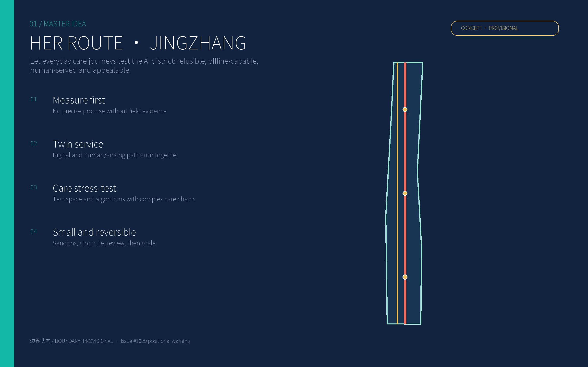
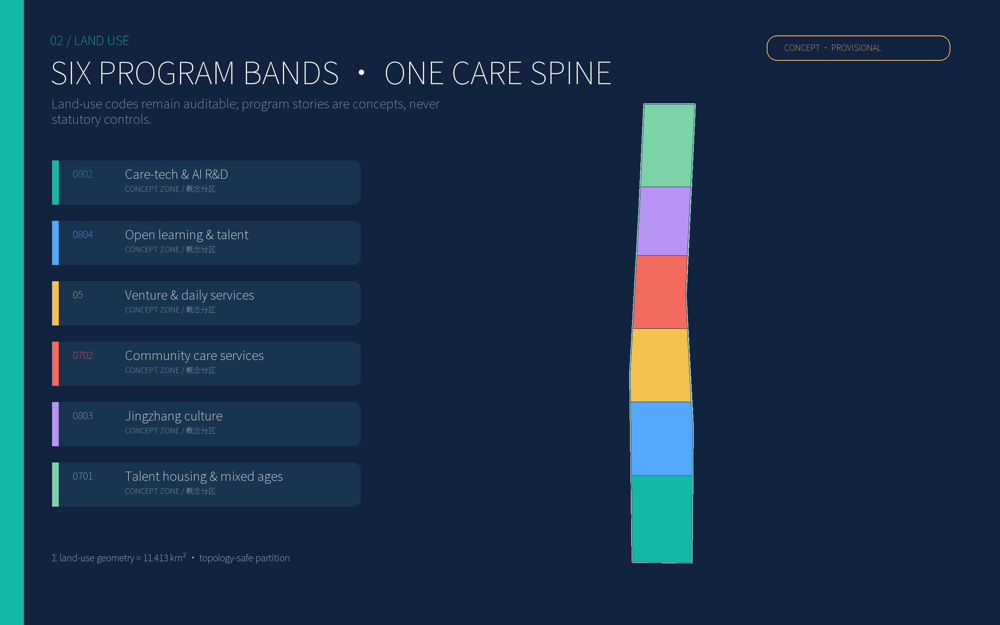
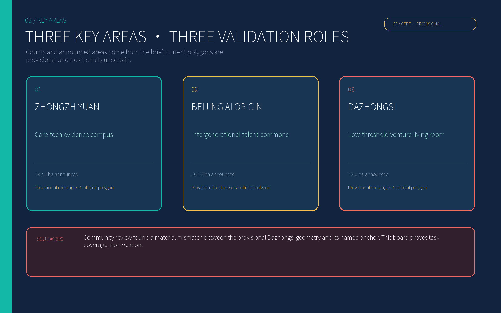
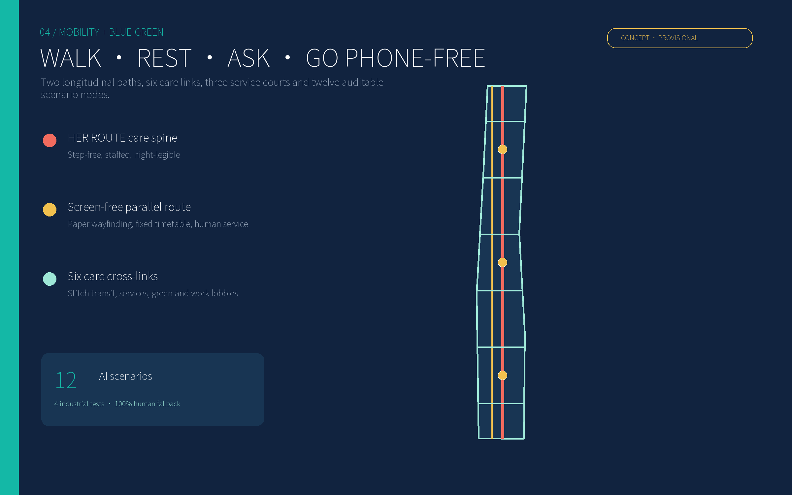
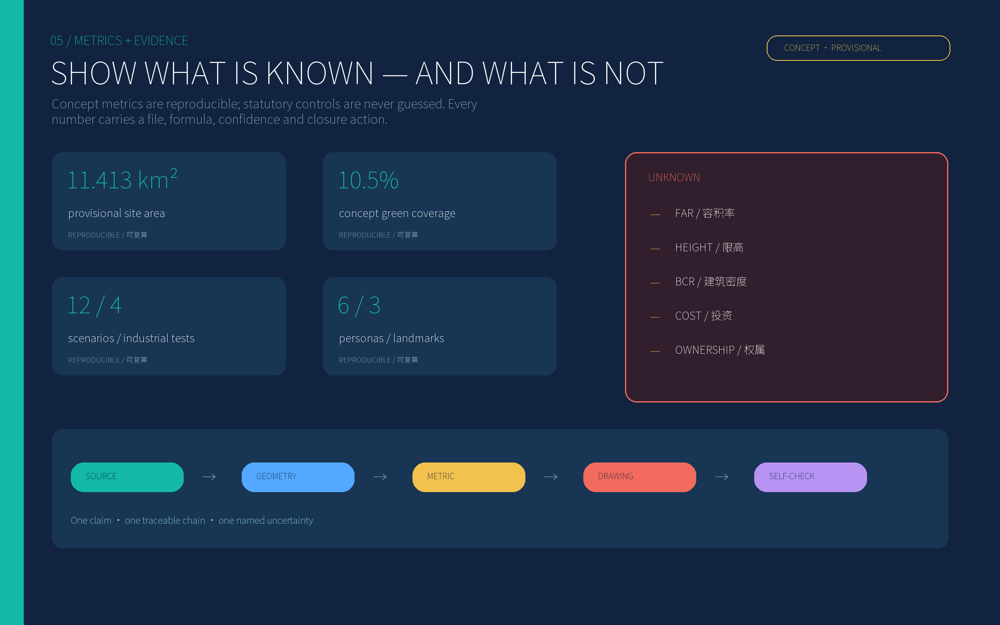

# HER ROUTE Jingzhang: Testing an AI Innovation Belt through Everyday Care

This proposal does not add an all-knowing “city brain.” It starts with a small, concrete test: can a person carrying a child or luggage, moving with difficulty, coming home at night, unfamiliar with the language, or unwilling to be identified complete an everyday journey safely and with dignity—without a smartphone, without surrendering unnecessary data, and with help available when needed? If not, advanced algorithms and new buildings do not amount to innovation.

HER names both the people usually missing from innovation-district imagery and three operating rules: **Human fallback, Evidence before expansion, and Refusable technology**. Spatially, the proposal creates one staffed care spine, one screen-free parallel path, six cross-links and three care courts. Institutionally, it creates a loop of measure first, run a small sandbox, publish the review, scale only on evidence, and stop when thresholds fail. [source:REPO-ISSUE-1061] [standard:PROJECT-AGENT-OPEN-CALL-TASKBOOK]

## Design basis and source inventory

The official announcement and repository site package are the controlling sources. The cleared taskbook adds agent-specific requirements for scenarios, identity, events and operations; the source registry determines what is formal-ready, background-only or provisional. [source:OFFICIAL-ANNOUNCEMENT] [source:SITE-PACKAGE] [source:SOURCE-REGISTRY]

Four evidence classes are kept separate: official public material; user-cleared task material; processed repository navigation; and provisional geometry used only for concept generation and checking. Neither the overall polygon nor the three key-area polygons is an official redline. Repository Issue #1029 reports a material mismatch between the current provisional geometry and named anchors, so this package makes no precise station-walk-time, parcel-ownership or siting claim. [source:PROCESSED-FACT-PACK] [source:BOUNDARY-SOURCE] [source:REPO-ISSUE-1029]

Statutory FAR, height, building coverage, green ratio, road redlines, setbacks, utility capacity, ownership and demolition conditions are absent. They remain `unknown` or `pending_field_survey`. Concept areas are reproducible design geometry, not regulatory controls. [metric:floor_area_ratio] [assumption:A-CONTROLS-003] [depth:development_intensity_controls]

Eight primary cases are translated into mechanisms rather than copied as forms: Vienna contributes life-stage and gender impact checking; Barcelona treats play, age, gender and functional diversity as a public-space layer; Kalasatama uses living labs; Punggol co-locates education, R&D and an open district platform; Toronto demonstrates independent digital-governance scrutiny; Seoul tests city problems in a digital-twin laboratory; Mila co-locates research, talent, ventures and public exchange; UN Women links local evidence, collective governance and autonomous mobility. [source:VIENNA-GENDER-PLANNING] [source:BARCELONA-PLAY-PLAN] [source:HELSINKI-KALASATAMA] [source:PUNGGOL-DIGITAL-DISTRICT] [source:TORONTO-DIGITAL-GOVERNANCE] [source:SEOUL-SMAP] [source:MILA-MILEEX] [source:UNWOMEN-SAFE-CITIES]

## Three-level scope framework

The approximately 43.6 km² coordinated study area develops the industry network, talent services, rail relationships and innovation partnerships. Its outputs are a partner map, an annual operating calendar and a reusable care-chain audit protocol.

The approximately 11.4 km² overall design area carries the spatial skeleton: a staffed longitudinal care spine and a screen-free parallel route along the Jingzhang heritage corridor, six cross-links, three public care courts and six concept program bands. [data:geometry/site_boundary.geojson#SITE-001] [data:geometry/land_use.geojson#LU-001] [depth:three_level_scope_framework]

The three key areas—announced at about 192.1, 104.3 and 72.0 hectares—turn the framework into testable scenarios, lobbies, courts and operating agreements. Their counts and announced areas are official text; the present polygons only demonstrate task coverage. [source:KEY-AREA-SOURCE] [metric:key_area_count] [assumption:A-LOCATION-002]

When official vectors arrive, the replacement protocol is mandatory: lock CRS and version; replace site and key-area polygons; clip every design layer; recalculate areas and ratios; regenerate all figures and PDFs; rerun self-check. A map-only replacement is invalid.

## Industry and future-city research for the coordinated study area

The industrial proposition is a **trustworthy AI evidence belt driven by care complexity**. Instead of a generic robotics showroom, companies must face difficult everyday conditions: multitasking, low attention, weak connectivity, language difference, limited mobility, sudden need for help and refusal of identification. Real but controlled public problems turn model performance into auditable products.

The ecosystem has five layers: fundamental research and safety evaluation; accessible interaction and edge models; care, mobility, health and energy products; district sandboxes and third-party assessment; and procurement, first adoption and international exchange. The three key areas take on evidence, community and translation roles. Universities, hospitals, community operators, industry and disability/women’s organizations share one project committee. [standard:MOHURD-URBAN-DESIGN-MEASURES] [depth:overall_spatial_structure]

The identity uses two parallel rails. Coral marks visible care work; teal marks open technology. The rails never collapse into one, signalling that digital and human/analog service remain in parallel. Their passage through three nodes forms an H without copying an official railway mark.

Annual operations follow an evidence cycle: a spring walk-audit week, summer night-and-heat tests, an autumn care-tech evidence conference, and a winter stop-and-appeal review. International showcases admit only projects with before/after evidence, failure records and a working human fallback.

## Urban renewal and regulatory-depth urban design for the overall area

The structure is **one spine, one fallback, six cross-links, three courts and six mixed bands**. The care spine is staffed, shaded and legible at night; the fallback path works without screens; the cross-links connect transit, work lobbies, services and green space; the courts provide rest, water, toilets, lactation, charging, directions and short-stay care. [data:geometry/roads.geojson#ROAD-CARE-SPINE] [data:geometry/public_space.geojson#PUBLIC-CARE-01]

The six concept bands use auditable codes 0802 research, 0804 education, 05 commercial services, 0702 community services, 0803 culture and 0701 housing. They indicate cross-parcel program tendencies, not statutory land boundaries. [standard:MNR-LAND-USE-CLASSIFICATION-GUIDE] [data:geometry/land_use.geojson#LU-004]

Renewal is soft-first and reversible. Phase one repairs lighting, shade, seating, step-free continuity, paper wayfinding, shared lobbies and operating agreements. Structure-changing work waits for measured need. No building is assigned retain, renovate or demolish without surveys; all twelve footprints are concept diagrams marked `pending_field_survey`. [data:geometry/buildings.geojson#BLDG-001] [assumption:A-OWNERSHIP-005]

No uniform “AI skin” is imposed. Heritage material retains its age; additions are legible and demountable. Height, skyline and colour controls await official regulation and survey. [metric:building_height_limit_m] [depth:height_massing_character]

## Detailed design of the three key areas

**Zhongzhiyuan — Care-tech Evidence Campus.** A shared laboratory lobby, reversible test street, care co-design court and park interface turn R&D into public evidence. Early tests cover mixed wheelchair/stroller movement, weak-network guidance, care-robot handover and thermal-comfort diversity. A product enters operation only after third-party testing, public explanation and human takeover succeed. [data:geometry/key_areas.geojson#PROV-KEY-001]

**Beijing AI Origin Community — Intergenerational Talent Commons.** The Origin Mutual-aid Hall, mixed-age housing, shared kitchen/learning rooms and care cross-links support researchers with children, dual-worker families, older caregivers, disabled scholars and visiting fellows. AI may assist voluntary scheduling, booking and energy advice; it does not infer health or family relationships. [data:geometry/key_areas.geojson#PROV-KEY-002] [standard:BARRIER-FREE-ENVIRONMENT-LAW]

**Dazhongsi — Low-threshold Venture Living Room.** Shared evaluation equipment, short-term workspaces, public demos, legal/procurement advice and a night-safe link lower barriers for small teams. Every exhibit states who benefits, who bears risk and how failure exits. Issue #1029 makes the current polygon unsuitable for precise siting, so this chapter presents an operating model rather than a definitive masterplan. [data:geometry/key_areas.geojson#PROV-KEY-003] [source:REPO-ISSUE-1029]

All three use a seven-part implementation sheet: role, structure, projects, movement/service, AI scenarios, operator and trigger/stop rules. Official siting requires verified location, ownership, accessibility, data governance and operating finance.

## AI ecosystem, talent personas and AI+ scenarios

Six personas are field-audit scripts, not fabricated local interview results: an R&D worker commuting with a child; a mid-career worker caring for an older relative; a wheelchair-using visiting scholar; an older resident uncomfortable with smartphones; a night cleaner/security/food worker; and an international founder unfamiliar with language and local systems. Each must be accompanied through daytime/night-time and weekday/weekend tasks. [assumption:A-FIELD-004] [metric:persona_count]

T1–T4 are explicit industrial validation scenarios; S5–S12 are public-service scenarios:

| ID | Scenario | Minimum data | Human / analog fallback | Operator and stop rule |
|---|---|---|---|---|
| T1 industrial test | Weak-network accessible navigation | Anonymous obstacle points, on-device routing | Tactile/paper map and staffed directions | Campus + disability group; stop if detours or errors increase |
| T2 industrial test | Care-robot handover bay | Device status and voluntary task code; no face ID | Staff counter and ordinary cart | Vendor + property operator; stop after lost link, collision or failed takeover |
| T3 industrial test | Diverse thermal-comfort advice | Microclimate data and anonymous votes | Water, shade and open rest room | Park + university; stop if advice repeatedly conflicts with reported comfort |
| T4 industrial test | Multilingual service assistant | Session-only text/voice, locally deleted | Human interpreter, pictograms and paper forms | Service desk; remove from high-risk matters after material mistranslation |
| S5 | Care-chain transfer advice | Voluntary time/access preferences | Fixed timetable and human directions | Transit operator; no dynamic price discrimination |
| S6 | Appealable night lighting | Illuminance and faults, no identity/trajectory | Permanent light, patrol phone, staffed node | Utility/property; dark spot or backlog triggers manual inspection |
| S7 | Quiet-space booking | Time and group size, no diagnosis | Walk-in queue and phone booking | Community operator; reserve quota if phone-free users are excluded |
| S8 | Care-resource matching | Voluntary time, age band and need | Human registration and paper token | Licensed provider; stop if qualifications/capacity are opaque |
| S9 | Shared equipment queue | Project account and time slot | Counter and phone registration | Campus; fairness quota prevents large-firm capture |
| S10 | Energy advice, never automatic control | Household aggregate energy | Manual switches and paper bills | Energy operator; basic service cannot fall after refusal |
| S11 | Jingzhang oral-history search | Public archive index | Curator and physical catalogue | Cultural institution; untraceable claims are removed |
| S12 | Public project ledger | Budget band, tests, complaints and stop logs | Noticeboard and public meeting | Independent committee; missing records block expansion |

Safety is not a pretext for identity surveillance. It starts with sightlines, light, open lobbies, human service, toilets, seating and maintenance. AI remains auxiliary. [source:UNWOMEN-SAFE-CITIES] [assumption:A-DATA-006] [standard:GENERATIVE-AI-INTERIM-MEASURES]

## Land use, building scale and retain-renovate-demolish strategy

Six topology-safe concept bands cover the provisional site. The green loop, three public courts and twelve concept footprints remain inside it. [metric:land_use_area_sqm] [metric:building_footprint_area_sqm] [depth:land_use_layout]

Four intervention classes are available but no object is prematurely assigned: repair and retain; low-impact accessibility/energy retrofit; reversible insertion; and demolition/rebuild only after structure, title, heritage, tenant relocation and embodied-carbon review. All current features remain `pending_field_survey`. [assumption:A-OWNERSHIP-005] [depth:retain_renovate_demolish]

Capacity is checked as a three-part relation of floor area, care-service capacity and public/transport/utility load. FAR, height, building coverage and total floor area remain unknown; concept footprints do not imply gross floor area. [metric:floor_area_ratio] [metric:building_height_limit_m] [metric:building_coverage_ratio]

## Mobility, rail, utilities and public services

Priority runs from walking/wheelchair/stroller continuity to cycling/shuttles and then necessary vehicles. The staffed spine creates visible support; the screen-free route uses permanent signs, paper maps and fixed information; six cross-links stitch transit, industry lobbies, services and green space. [data:geometry/roads.geojson#ROAD-ANALOG] [metric:concept_road_centerline_length_m]

Station integration is an interface rule, not a precise entrance plan: clear sightlines, a step-free surface, staffed directions, sheltered waiting and night lighting are required. Exact walks await official geometry and survey. Care-priority pick-up periods may be tested without using gender as an access criterion.

Low-tech infrastructure comes first: light, drainage, water, toilets, shade and maintenance records before sensors. Sensors use edge processing, minimal collection and stated retention. Digital twins simulate but do not replace field tests. [source:SEOUL-SMAP] [depth:municipal_new_infrastructure]

Public service has three levels: rest/water/help at each cross-link; toilets, lactation, quiet rooms, human service and short-stay care at the three courts; licensed care, health, legal and employment help in key areas. Human handling follows the law where applicable, while the project makes a broader design commitment to an equal non-digital path. [standard:BARRIER-FREE-ENVIRONMENT-LAW] [standard:ELDERLY-SMART-TECH-PLAN-2020-45]

## Blue-green space, public realm and urban character

The blue-green system combines a continuously shaded care loop and three rest gardens. Its concept area and ratio are reproducible but are not a statutory green ratio. [data:geometry/green_space.geojson#GREEN-CARE-LOOP] [metric:green_ratio]

Every public space receives seven basics: a visible entrance, step-free continuity, varied seating heights, drinking water, toilet directions, night light and human help. Play is integrated with waiting, sociability, walking and nature so caregivers can sit, see and pause. [source:BARCELONA-PLAY-PLAN]

Three AI pilgrimage landmarks reject monumental spectacle: the **Care Algorithm Test Bridge** publishes passed and failed tests; the **Origin Mutual-aid Hall** provides service without a phone; the **Museum of Failure and Stop Clock** preserves retired algorithms, reasons and lessons. They translate Jingzhang’s engineering culture of testability and maintenance into AI culture. [metric:pilgrimage_landmark_count]

Deep railway-industrial tones form the base; teal marks open technology, coral marks care routes, and gold marks warnings and unknowns. Provisional boundaries are dashed, never rendered as certain parcels. Screens and installations include a quiet mode.

## Renewal projects, implementation policy and phasing

**2026–27 Measure before building:** six-persona audits, three test streets, three temporary care courts, paper wayfinding and T1–T4. Publish baselines, complaints and failures; no AI without human takeover advances.

**2028–30 Connect the nodes:** six cross-links, shaded green loop, shared lobbies, Mutual-aid Hall and public ledger. Expand only when disparities narrow, non-digital paths work and maintenance finance is named.

**2031+ Review and scale:** structural retrofit, station interfaces and an international evidence network only after official planning, ownership, engineering and long-term operating agreements. Conduct a five-year zero-base review; failed projects leave. [data:geometry/phasing.geojson#PHASE-001] [depth:phasing_implementation] [assumption:A-COST-007]

Policy tools include reversible pilot procurement, care-impact assessment, data/algorithm impact assessment, human-service minimums, failure-safe experimentation but no immunity for concealment, third-party accessibility/gender audits, public stop logs and shared-equipment quotas for small firms. Basic public service never depends on event tickets.

## Indicators, area recalculation and compliance matrices

Four indicator groups are used. Spatial indicators cover provisional area, concept green/public-space area and route continuity. Use indicators record task time, detour, successful help and perceived burden by persona. AI-governance indicators cover refusal, human takeover, complaint closure, stoppage and deletion. Industry indicators cover tests, published failures, small-firm access and evidence from sandbox to procurement.

Currently reproducible but concept-only figures include about 11.413 km² provisional area, green/public-space geometry and ratios, concept centreline length, twelve scenarios, four industrial tests, six personas and three landmarks. [metric:site_area_sqm] [metric:green_space_area_sqm] [metric:ai_scenario_count]

Acceptance cannot rely on averages. Results are disaggregated by persona, day/night, smartphone use and mobility. No invented improvement percentage is claimed before local fieldwork; phase one defines the baseline and the procedure for agreeing thresholds. [assumption:A-FIELD-004] [depth:metrics_recalculation]

The evidence chain is source → geometry/scenario → metric → drawing/text → self-check. The compliance matrix covers the announcement tasks; the standard matrix covers project/professional standards; the design-depth matrix distinguishes complete evidence, gaps and later work. Unknown statutory controls are not hidden behind a “pass.” [standard:MOHURD-CONTROL-DETAILED-PLANNING]

## Risk, copyright and compliance

The first risk is confusing provisional geometry, concept metrics and personas with reality. Provisional labels, Issue #1029, unknown statutory values and whole-package recalculation after official vectors address it. [source:REPO-ISSUE-1029] [assumption:A-BOUNDARY-001]

The second is expanding surveillance in the name of safety. Environmental design comes first; identity recognition is prohibited by default; collection is minimal; the human path is equal; impacts are public; appeals and stop rules are executable. No scenario promises automated enforcement, diagnosis or discriminatory pricing. [standard:GENERATIVE-AI-INTERIM-MEASURES]

The third is a performance project with no maintainer. Every project names the user, moment, minimum service, operator, cost band, acceptance method and exit. The ledger publishes failure and maintenance rather than substituting event attendance for daily usability. [source:REPO-ISSUE-1061]

The fourth is exclusion. Human, paper, phone and in-person paths are permanent. Refusing data cannot reduce basic service. Local claims require anonymised, informed and withdrawable field research. [source:UNWOMEN-SAFE-CITIES]

Text, diagrams, spatial concepts and layout were created by OpenAI Codex for this submission. No external photography, remote basemap or unauthorised icon is used. Repository and international sources support facts and methods; see `report/copyright_statement.md`. This package is not statutory planning, engineering design, legal advice or public consultation.

## References

Primary references include the official Beijing announcement; the open-city-ai site package, source registry, taskbook and issues; Vienna gender-mainstreaming guidance; Barcelona’s Play Plan; Helsinki’s Kalasatama living-lab tools; Singapore’s Punggol Digital District; Waterfront Toronto’s digital-governance review; Seoul’s S-Map Open Lab; Mila’s Mile-Ex ecosystem; and UN Women’s Safe Cities compendium. [source:OFFICIAL-ANNOUNCEMENT] [source:SITE-PACKAGE] [source:VIENNA-GENDER-PLANNING] [source:BARCELONA-PLAY-PLAN] [source:HELSINKI-KALASATAMA] [source:PUNGGOL-DIGITAL-DISTRICT] [source:TORONTO-DIGITAL-GOVERNANCE] [source:SEOUL-SMAP] [source:MILA-MILEEX] [source:UNWOMEN-SAFE-CITIES]

Full identifiers, publishers, URLs, access dates and intended uses are machine-readable in `sources.json`.
